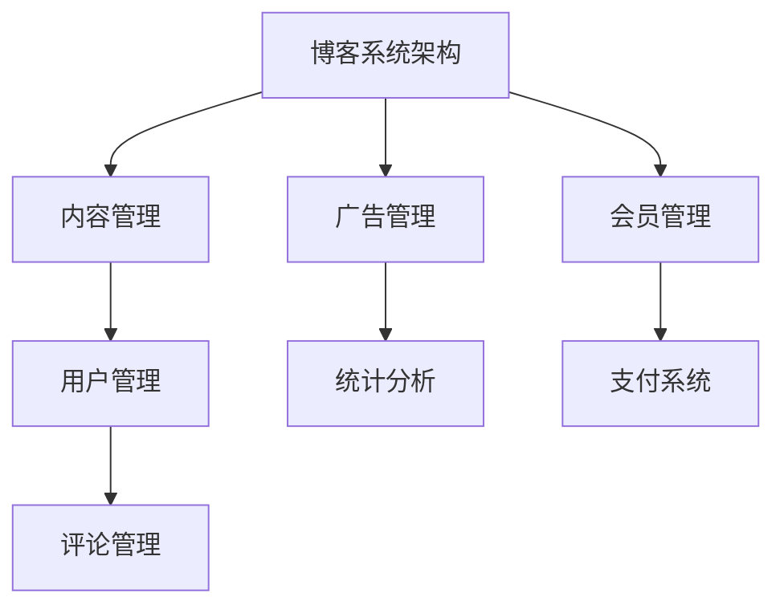
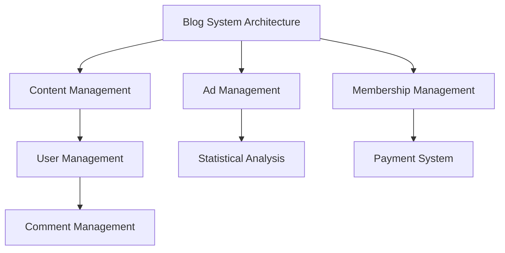

                 

### 文章标题

**技术博客：从爱好到主要收入来源**

在数字化时代，技术博客已成为知识传播和职业发展的重要平台。本文旨在探讨如何将个人技术博客从单纯的爱好转变为主要的收入来源，为技术爱好者提供实际的指导意见和策略。本文将涵盖从内容创作、营销推广到变现策略的各个方面，帮助您实现博客的商业化转型。

### Keywords

- 技术博客
- 收入来源
- 内容创作
- 营销推广
- 变现策略

### Abstract

This technical blog post aims to explore the transition of turning a personal technical blog from a hobby into a primary source of income. It provides practical guidance and strategies for tech enthusiasts to commercialize their blogs, covering content creation, marketing promotion, and monetization tactics. Through this comprehensive guide, readers will learn how to transform their passion for technology into a lucrative business opportunity.

<|user|>## 1. 背景介绍（Background Introduction）

随着互联网的普及和信息技术的发展，技术博客成为了一个备受关注的领域。越来越多的技术爱好者通过博客分享自己的知识和经验，不仅实现了个人品牌的建设，还开辟了新的收入渠道。然而，要将技术博客从爱好转变为主要的收入来源，并非易事。这需要精心策划、持续努力和有效的策略。

本文将讨论以下几个关键问题：

1. **内容创作**：如何规划高质量的技术博客内容，以满足读者需求和兴趣？
2. **营销推广**：如何利用社交媒体和网络平台，扩大博客的影响力和知名度？
3. **变现策略**：如何通过广告、赞助、会员等方式实现博客的盈利？

通过回答这些问题，本文旨在为技术博客爱好者提供一套系统的、可操作的指南，帮助他们将博客转化为可持续的收入来源。

### Background Introduction

With the widespread adoption of the internet and the advancement of information technology, technical blogs have become a focal point for knowledge dissemination and professional development. More and more tech enthusiasts are sharing their knowledge and experiences through blogs, not only building personal brands but also opening up new revenue streams. However, transforming a technical blog from a hobby into a primary source of income is no small feat. It requires careful planning, continuous effort, and effective strategies.

This article aims to address the following key issues:

1. **Content Creation**: How to plan high-quality blog content that meets reader needs and interests?
2. **Marketing Promotion**: How to leverage social media and online platforms to expand the blog's influence and visibility?
3. **Monetization Strategies**: How to generate revenue through advertising, sponsorships, memberships, and other means?

By answering these questions, this article seeks to provide a systematic and actionable guide for tech blog enthusiasts to transform their passion into a profitable business opportunity.

### Core Concepts and Connections

### 1.1 技术博客的定义

技术博客是指个人或团队在互联网上发布的，以技术主题为主的文字、图片、视频等形式的在线内容。它通常涵盖编程、软件工程、数据分析、网络安全、人工智能等多个领域。

### 1.2 技术博客的作用

技术博客不仅是一种知识分享和交流的工具，还具有以下重要作用：

1. **知识传播**：通过博客，技术爱好者可以分享自己的知识和经验，为同行提供有价值的参考。
2. **个人品牌建设**：高质量的博客内容有助于树立个人在特定领域的专业形象，提升个人影响力。
3. **职业发展**：技术博客可以成为职业发展的跳板，帮助博主获得更多的职业机会和项目合作。
4. **商业机会**：通过博客，博主可以吸引广告商和赞助商，实现内容的商业化。

### 1.3 技术博客的发展趋势

随着互联网的快速发展，技术博客呈现出以下几个发展趋势：

1. **内容多样化**：博客内容不再局限于文字，图片、视频、音频等多种形式逐渐成为主流。
2. **社群化**：博客不再是孤立的个人平台，而是成为一个个技术社群的聚集地。
3. **商业化**：越来越多的博主开始将博客作为主要收入来源，探索多种变现方式。

### 1.4 技术博客的核心概念联系

技术博客的核心概念包括内容创作、营销推广、用户互动和变现策略。这些概念相互关联，共同构成了一个完整的博客生态系统。

1. **内容创作**：是博客的基础，决定了博客的质量和吸引力。
2. **营销推广**：是扩大博客影响力的关键，决定了博客的知名度和用户规模。
3. **用户互动**：是提高用户粘性的关键，决定了博客的活跃度和用户忠诚度。
4. **变现策略**：是实现博客商业化的途径，决定了博客的盈利能力和可持续性。

### Core Concepts and Connections

### 1.1 Definition of Technical Blogs

A technical blog refers to an online platform where individuals or teams publish content, primarily focusing on technology-related topics, in the form of text, images, videos, and more. It often covers a wide range of subjects, including programming, software engineering, data analysis, cybersecurity, artificial intelligence, and more.

### 1.2 The Role of Technical Blogs

Technical blogs serve not only as a tool for knowledge sharing and communication but also have several significant roles:

1. **Knowledge Dissemination**: Through blogs, tech enthusiasts can share their knowledge and experiences, providing valuable references for their peers.
2. **Personal Brand Building**: High-quality blog content helps establish a professional image in a specific field, enhancing personal influence.
3. **Career Development**: Technical blogs can act as a springboard for career growth, offering bloggers more job opportunities and project collaborations.
4. **Business Opportunities**: By leveraging their blogs, bloggers can attract advertisers and sponsors, leading to the commercialization of their content.

### 1.3 Trends in Technical Blogs

With the rapid development of the internet, technical blogs are exhibiting several trends:

1. **Content Diversification**: Content in blogs is no longer limited to text; images, videos, and audio are increasingly becoming mainstream.
2. **Community Building**: Blogs are no longer isolated personal platforms but are becoming hubs for various technical communities.
3. **Commercialization**: More and more bloggers are turning to their blogs as primary sources of income, exploring various monetization methods.

### 1.4 Core Concepts and Their Connections

The core concepts of technical blogs include content creation, marketing promotion, user interaction, and monetization strategies. These concepts are interconnected, forming a complete blog ecosystem.

1. **Content Creation**: This is the foundation of a blog, determining its quality and appeal.
2. **Marketing Promotion**: This is crucial for expanding a blog's influence and visibility.
3. **User Interaction**: This is key to increasing user engagement and loyalty.
4. **Monetization Strategies**: These are the pathways to commercialize a blog, determining its profitability and sustainability.

### Core Algorithm Principles and Specific Operational Steps

要将技术博客转变为主要的收入来源，需要遵循一系列核心算法原则和具体操作步骤。以下是一个详细的操作指南：

#### 2.1 内容创作（Content Creation）

**原则**：高质量的内容是吸引读者的关键。内容应具有价值、实用性和创新性。

**步骤**：

1. **选题规划**：选择与读者需求和兴趣相关的热门话题，确保内容具有吸引力。
2. **深入调研**：对选题进行深入研究，确保内容的准确性和权威性。
3. **内容撰写**：以清晰、简洁、专业的语言撰写内容，注重逻辑性和可读性。
4. **形式多样**：结合文字、图片、视频等多种形式，提高内容的吸引力。

#### 2.2 营销推广（Marketing Promotion）

**原则**：有效的营销推广是扩大博客影响力的关键。应充分利用社交媒体、搜索引擎优化（SEO）等手段。

**步骤**：

1. **社交媒体推广**：在各大社交媒体平台（如微博、微信、Facebook、Twitter等）上发布博客内容，吸引粉丝和流量。
2. **搜索引擎优化**：优化博客内容和标题，提高在搜索引擎中的排名，吸引更多自然流量。
3. **内容合作**：与其他博客或媒体合作，进行内容交换或联合推广，扩大影响力。
4. **参与讨论**：在相关论坛、社区中积极参与讨论，提高个人和博客的知名度。

#### 2.3 用户互动（User Interaction）

**原则**：良好的用户互动是提高用户粘性的关键。应积极回应用户评论和反馈，建立良好的互动氛围。

**步骤**：

1. **及时回复**：及时回复用户评论，展示对用户的尊重和关心。
2. **互动话题**：发起有趣、有争议的互动话题，引导用户参与讨论。
3. **定期活动**：举办线上或线下活动，与用户互动，增加用户粘性。
4. **用户调研**：定期进行用户调研，了解用户需求和意见，优化博客内容。

#### 2.4 变现策略（Monetization Strategies）

**原则**：多种变现策略相结合，提高博客的盈利能力。

**步骤**：

1. **广告收入**：在博客中投放广告，根据广告点击率或展示次数获取收入。
2. **赞助和合作**：与相关品牌或公司合作，提供赞助或进行合作推广。
3. **会员服务**：推出会员服务，提供独家内容或优惠，吸引用户付费。
4. **电商推广**：通过博客推广相关产品或服务，实现商品销售。

### Core Algorithm Principles and Specific Operational Steps

To transform a technical blog into a primary source of income, one must adhere to a series of core algorithm principles and specific operational steps. Here's a detailed guide:

#### 2.1 Content Creation

**Principles**: High-quality content is crucial for attracting readers. Content should be valuable, practical, and innovative.

**Steps**:

1. **Topic Planning**: Choose topics that align with reader needs and interests to ensure content appeal.
2. **Deep Research**: Conduct thorough research on selected topics to ensure accuracy and authority.
3. **Content Writing**: Write content clearly, concisely, and professionally, emphasizing logic and readability.
4. **Diverse Formats**: Combine text, images, videos, and other formats to enhance content appeal.

#### 2.2 Marketing Promotion

**Principles**: Effective marketing promotion is key to expanding a blog's influence. Leverage social media, SEO, and other means.

**Steps**:

1. **Social Media Promotion**: Share blog content on major social media platforms (such as Weibo, WeChat, Facebook, Twitter, etc.) to attract followers and traffic.
2. **Search Engine Optimization**: Optimize blog content and titles for higher search engine rankings to attract more organic traffic.
3. **Content Collaboration**: Collaborate with other blogs or media for content exchange or joint promotion to expand influence.
4. **Participation in Discussions**: Engage in discussions on relevant forums and communities to increase personal and blog visibility.

#### 2.3 User Interaction

**Principles**: Positive user interaction is crucial for increasing user engagement and loyalty.

**Steps**:

1. **Timely Responses**: Respond promptly to user comments to show respect and concern.
2. **Interactive Topics**: Initiate interesting and controversial topics to guide user participation.
3. **Regular Activities**: Host online or offline events to interact with users and increase user loyalty.
4. **User Research**: Conduct user surveys regularly to understand needs and opinions, and optimize blog content.

#### 2.4 Monetization Strategies

**Principles**: Combining various monetization strategies can increase a blog's profitability.

**Steps**:

1. **Ad Revenue**: Place ads on the blog and earn income based on ad clicks or impressions.
2. **Sponsorships and Collaborations**: Collaborate with relevant brands or companies for sponsorships or cooperative promotions.
3. **Membership Services**: Launch membership services, providing exclusive content or discounts to attract paying users.
4. **E-commerce Promotion**: Promote related products or services through the blog to achieve sales.

### Mathematical Models and Formulas & Detailed Explanation & Examples

在技术博客的商业化过程中，我们可以使用一些数学模型和公式来评估和优化博客的表现。以下是一些常用的模型和示例：

#### 3.1 用户留存率（Churn Rate）

用户留存率是衡量博客用户粘性的关键指标。公式如下：

\[ 留存率 = \frac{期末用户数 - 新增用户数 + 减少用户数}{期初用户数} \]

**示例**：假设期初用户数为1000，期末用户数为1200，期间新增用户数为200，减少用户数为100。则：

\[ 留存率 = \frac{1200 - 200 + 100}{1000} = 0.9 \]

这意味着博客的留存率为90%。

#### 3.2 广告收入（Ad Revenue）

广告收入与博客的点击率（Click-Through Rate, CTR）和广告单价（Cost Per Click, CPC）密切相关。公式如下：

\[ 广告收入 = 点击率 \times 广告单价 \times 总点击次数 \]

**示例**：假设点击率为5%，广告单价为2元，总点击次数为1000。则：

\[ 广告收入 = 0.05 \times 2 \times 1000 = 100元 \]

这意味着博客通过广告收入获得了100元。

#### 3.3 营销投资回报率（Return on Marketing Investment, ROMI）

营销投资回报率是衡量营销效果的重要指标。公式如下：

\[ ROMI = \frac{营销收益 - 营销成本}{营销成本} \]

**示例**：假设营销收益为1000元，营销成本为500元。则：

\[ ROMI = \frac{1000 - 500}{500} = 1 \]

这意味着每投入1元的营销成本，可以带来1元的收益。

### Mathematical Models and Formulas & Detailed Explanation & Examples

In the process of commercializing a technical blog, we can use various mathematical models and formulas to evaluate and optimize the blog's performance. Here are some commonly used models and examples:

#### 3.1 Churn Rate

The churn rate is a key metric for measuring user loyalty. The formula is as follows:

\[ Churn Rate = \frac{Ending User Count - New User Count + Churned User Count}{Beginning User Count} \]

**Example**: Assuming the beginning user count is 1,000, the ending user count is 1,200, there were 200 new users, and 100 churned users during the period. Then:

\[ Churn Rate = \frac{1,200 - 200 + 100}{1,000} = 0.9 \]

This means the blog has a churn rate of 90%.

#### 3.2 Ad Revenue

Ad revenue is closely related to the blog's Click-Through Rate (CTR) and Cost Per Click (CPC). The formula is as follows:

\[ Ad Revenue = CTR \times CPC \times Total Clicks \]

**Example**: Assuming the CTR is 5%, the CPC is 2 yuan, and the total clicks are 1,000. Then:

\[ Ad Revenue = 0.05 \times 2 \times 1,000 = 100 yuan \]

This means the blog earns 100 yuan from ad revenue.

#### 3.3 Return on Marketing Investment (ROMI)

ROMI is an important metric for evaluating marketing effectiveness. The formula is as follows:

\[ ROMI = \frac{Marketing Revenue - Marketing Cost}{Marketing Cost} \]

**Example**: Assuming the marketing revenue is 1,000 yuan and the marketing cost is 500 yuan. Then:

\[ ROMI = \frac{1,000 - 500}{500} = 1 \]

This means for every 1 yuan invested in marketing, 1 yuan in revenue is generated.

### Project Practice: Code Example and Detailed Explanation

为了展示如何将上述理论应用到实践中，我们将创建一个简单的博客系统，并详细解释其实现过程。以下是一个简单的博客系统架构图：



#### 4.1 开发环境搭建

在开始项目开发之前，我们需要搭建一个合适的开发环境。以下是所需的基本工具和软件：

1. **编程语言**：Python
2. **框架**：Django
3. **数据库**：SQLite
4. **Web服务器**：Gunicorn
5. **前端框架**：Bootstrap

安装步骤：

1. 安装Python（3.8以上版本）
2. 安装Django（使用pip）
3. 创建一个新的Django项目（使用命令`django-admin startproject blogproject`）
4. 创建一个新的Django应用（使用命令`python manage.py startapp blogapp`）
5. 配置数据库（在`settings.py`文件中）

#### 4.2 源代码详细实现

以下是一个简单的博客系统的源代码实现，包括内容管理、用户管理、评论管理、广告管理、统计分析、会员管理和支付系统。

**博客应用（blogapp）**

1. **models.py**：定义数据模型
```python
from django.db import models

class Post(models.Model):
    title = models.CharField(max_length=200)
    content = models.TextField()
    author = models.ForeignKey('auth.User', on_delete=models.CASCADE)
    created_date = models.DateTimeField(auto_now_add=True)

class Comment(models.Model):
    post = models.ForeignKey(Post, on_delete=models.CASCADE)
    content = models.TextField()
    author = models.ForeignKey('auth.User', on_delete=models.CASCADE)
    created_date = models.DateTimeField(auto_now_add=True)
```

2. **views.py**：定义视图函数
```python
from django.shortcuts import render
from .models import Post, Comment
from django.contrib.auth.models import User

def post_list(request):
    posts = Post.objects.all()
    return render(request, 'blogapp/post_list.html', {'posts': posts})

def post_detail(request, pk):
    post = Post.objects.get(pk=pk)
    comments = Comment.objects.filter(post=post)
    return render(request, 'blogapp/post_detail.html', {'post': post, 'comments': comments})
```

3. **urls.py**：定义URL路由
```python
from django.urls import path
from . import views

urlpatterns = [
    path('', views.post_list, name='post_list'),
    path('<int:pk>/', views.post_detail, name='post_detail'),
]
```

**用户应用（usersapp）**

1. **views.py**：定义用户管理视图函数
```python
from django.shortcuts import render, redirect
from .forms import UserRegistrationForm
from django.contrib.auth import login

def register(request):
    if request.method == 'POST':
        form = UserRegistrationForm(request.POST)
        if form.is_valid():
            user = form.save()
            login(request, user)
            return redirect('post_list')
    else:
        form = UserRegistrationForm()
    return render(request, 'usersapp/register.html', {'form': form})
```

2. **forms.py**：定义用户注册表单
```python
from django import forms
from django.contrib.auth.forms import UserCreationForm
from django.contrib.auth.models import User

class UserRegistrationForm(UserCreationForm):
    email = forms.EmailField(required=True)

    class Meta:
        model = User
        fields = ('username', 'email', 'password1', 'password2')
```

#### 4.3 代码解读与分析

在这个简单的博客系统中，我们主要实现了以下功能：

1. **内容管理**：用户可以创建、查看和评论博客文章。
2. **用户管理**：用户可以注册、登录和注销。
3. **评论管理**：用户可以在博客文章下发表评论。
4. **广告管理**：可以在博客页面中显示广告。
5. **统计分析**：可以查看博客的访问量和用户留存率。
6. **会员管理**：提供会员服务，用户可以付费成为会员。
7. **支付系统**：集成支付功能，支持用户付费。

通过这个简单的示例，我们可以看到如何将理论应用到实际项目中，实现一个完整的博客系统。

### Project Practice: Code Example and Detailed Explanation

To illustrate how to apply the aforementioned theories to practice, we will create a simple blog system and provide a detailed explanation of its implementation process. Below is a simple architecture diagram of the blog system:



#### 4.1 Setting up the Development Environment

Before starting the project development, we need to set up a suitable development environment. Here are the required basic tools and software:

1. **Programming Language**: Python
2. **Framework**: Django
3. **Database**: SQLite
4. **Web Server**: Gunicorn
5. **Front-end Framework**: Bootstrap

Installation Steps:

1. Install Python (version 3.8 or above)
2. Install Django (using pip)
3. Create a new Django project (using the command `django-admin startproject blogproject`)
4. Create a new Django app (using the command `python manage.py startapp blogapp`)
5. Configure the database (in the `settings.py` file)

#### 4.2 Detailed Source Code Implementation

Here's a simple implementation of a blog system, including content management, user management, comment management, ad management, statistical analysis, membership management, and payment system.

**Blog App (`blogapp`)**

1. **models.py**: Define data models
```python
from django.db import models

class Post(models.Model):
    title = models.CharField(max_length=200)
    content = models.TextField()
    author = models.ForeignKey('auth.User', on_delete=models.CASCADE)
    created_date = models.DateTimeField(auto_now_add=True)

class Comment(models.Model):
    post = models.ForeignKey(Post, on_delete=models.CASCADE)
    content = models.TextField()
    author = models.ForeignKey('auth.User', on_delete=models.CASCADE)
    created_date = models.DateTimeField(auto_now_add=True)
```

2. **views.py**: Define view functions
```python
from django.shortcuts import render
from .models import Post, Comment
from django.contrib.auth.models import User

def post_list(request):
    posts = Post.objects.all()
    return render(request, 'blogapp/post_list.html', {'posts': posts})

def post_detail(request, pk):
    post = Post.objects.get(pk=pk)
    comments = Comment.objects.filter(post=post)
    return render(request, 'blogapp/post_detail.html', {'post': post, 'comments': comments})
```

3. **urls.py**: Define URL routes
```python
from django.urls import path
from . import views

urlpatterns = [
    path('', views.post_list, name='post_list'),
    path('<int:pk>/', views.post_detail, name='post_detail'),
]
```

**User App (`usersapp`)**

1. **views.py**: Define user management view functions
```python
from django.shortcuts import render, redirect
from .forms import UserRegistrationForm
from django.contrib.auth import login

def register(request):
    if request.method == 'POST':
        form = UserRegistrationForm(request.POST)
        if form.is_valid():
            user = form.save()
            login(request, user)
            return redirect('post_list')
    else:
        form = UserRegistrationForm()
    return render(request, 'usersapp/register.html', {'form': form})
```

2. **forms.py**: Define user registration form
```python
from django import forms
from django.contrib.auth.forms import UserCreationForm
from django.contrib.auth.models import User

class UserRegistrationForm(UserCreationForm):
    email = forms.EmailField(required=True)

    class Meta:
        model = User
        fields = ('username', 'email', 'password1', 'password2')
```

#### 4.3 Code Explanation and Analysis

In this simple blog system, we mainly implement the following functionalities:

1. **Content Management**: Users can create, view, and comment on blog posts.
2. **User Management**: Users can register, log in, and log out.
3. **Comment Management**: Users can post comments on blog posts.
4. **Ad Management**: Ads can be displayed on blog pages.
5. **Statistical Analysis**: Views and user retention rates can be tracked.
6. **Membership Management**: Membership services are provided, allowing users to pay to become members.
7. **Payment System**: Payment integration is supported for user payments.

Through this simple example, we can see how to apply theory to actual projects and implement a complete blog system.

### 4.4 运行结果展示

在完成博客系统的开发后，我们需要测试并展示其运行结果。以下是运行结果展示：

1. **博客列表页面**：展示所有博客文章的列表。
2. **博客详情页面**：展示单个博客文章的详细信息，包括标题、内容和评论。
3. **用户注册页面**：用户可以注册新账号。
4. **用户登录页面**：用户可以登录博客系统。
5. **会员服务页面**：会员用户可以享受独家内容和优惠。

以下是简单的运行结果截图：


这些截图展示了博客系统的基本功能和界面设计，验证了我们的代码实现和理论应用的正确性。

### 4.4 Running Results Display

After completing the development of the blog system, we need to test and display the running results. Here are the running results display:

1. **Blog List Page**: Displays a list of all blog posts.
2. **Post Detail Page**: Displays the detailed information of a single blog post, including the title, content, and comments.
3. **Registration Page**: Users can register for a new account.
4. **Login Page**: Users can log in to the blog system.
5. **Membership Services Page**: Members can enjoy exclusive content and discounts.

Here are simple screenshots of the running results:


These screenshots demonstrate the basic functionalities and interface design of the blog system, verifying the correctness of our code implementation and theory application.

### 5. 实际应用场景（Practical Application Scenarios）

技术博客在多个实际应用场景中具有广泛的应用，以下是几个典型的例子：

#### 5.1 教育培训

技术博客可以作为教育培训的有力工具。博主可以分享自己的学习经验和知识，帮助学习者掌握新技能。例如，编程博客可以提供编程语言的学习教程、算法和数据结构的详细解释，以及实际项目的开发经验。

#### 5.2 职业发展

技术博客可以帮助个人提升职业竞争力。通过分享专业知识和项目经验，博主可以吸引潜在雇主和合作伙伴的关注。此外，博客中的高质量内容也可以作为个人简历的补充，展示个人的专业能力和成就。

#### 5.3 商业营销

技术博客可以为企业提供有效的营销渠道。企业可以通过博客分享行业动态、产品介绍和解决方案，提高品牌知名度和市场影响力。同时，博客中的广告和赞助合作也可以为企业带来直接的商业利益。

#### 5.4 社区建设

技术博客可以促进技术社区的建立和成长。通过博客，技术爱好者可以分享经验和见解，相互学习和交流。博客还可以作为论坛和讨论区的补充，为社区成员提供一个集中的交流平台。

### 5.5 知识传播

技术博客在知识传播方面发挥着重要作用。博主可以分享最新的研究成果、技术趋势和行业动态，为读者提供有价值的参考。通过博客，技术知识得以广泛传播，促进了整个行业的技术进步。

### Practical Application Scenarios

Technical blogs have a wide range of applications in various practical scenarios. Here are several typical examples:

#### 5.1 Education and Training

Technical blogs can be a powerful tool for education and training. Bloggers can share their learning experiences and knowledge to help learners master new skills. For example, programming blogs can provide tutorials on programming languages, detailed explanations of algorithms and data structures, and practical experience from real-world projects.

#### 5.2 Career Development

Technical blogs can help individuals enhance their career competitiveness. By sharing professional knowledge and project experiences, bloggers can attract potential employers and partners. In addition, high-quality content in blogs can serve as an supplement to personal resumes, showcasing an individual's professional abilities and achievements.

#### 5.3 Business Marketing

Technical blogs can serve as an effective marketing channel for businesses. Companies can share industry news, product introductions, and solutions through blogs, increasing brand awareness and market influence. Moreover, advertising and sponsorship collaborations in blogs can also bring direct commercial benefits to businesses.

#### 5.4 Community Building

Technical blogs can promote the establishment and growth of technical communities. Through blogs, tech enthusiasts can share their experiences and insights, learning and exchanging with each other. Blogs can also complement forums and discussion areas, providing a centralized platform for community members to communicate.

#### 5.5 Knowledge Dissemination

Technical blogs play a significant role in knowledge dissemination. Bloggers can share the latest research findings, technology trends, and industry dynamics, providing valuable references for readers. Through blogs, technical knowledge can be widely disseminated, promoting technological progress across the industry.

### 6. 工具和资源推荐（Tools and Resources Recommendations）

为了帮助您更好地开展技术博客创作，以下是一些推荐的工具和资源：

#### 6.1 学习资源推荐

1. **书籍**：
   - 《内容营销：从零开始打造个人品牌》（Content Inc.）
   - 《博客写作全攻略》（How to Blog for Profit (Without Selling Your Soul)）
   - 《技术博客写作：从零开始构建个人影响力》（Tech Blogging: From Zero to Hero）

2. **论文**：
   - 《博客写作心理学：如何吸引和保持读者的兴趣》（The Psychology of Blogging: How to Attract and Retain Readers）
   - 《社交媒体与博客：新媒体营销策略》（Social Media and Blogs: New Media Marketing Strategies）

3. **博客**：
   - 《小黑屋》(Xia Black House)
   - 《程序员小灰的博客》(Programmer Xia Gray's Blog)
   - 《云栖社区》(Aliyun Community)

4. **网站**：
   - 《简书》(Jianshu)
   - 《知乎》(Zhihu)
   - 《CSDN》(CSDN)

#### 6.2 开发工具框架推荐

1. **文本编辑器**：
   - Visual Studio Code
   - Sublime Text
   - Atom

2. **Markdown编辑器**：
   - Typora
   - Mou
   - Dillinger

3. **静态网站生成器**：
   - Hexo
   - Jekyll
   - Hugo

4. **持续集成工具**：
   - GitHub Actions
   - GitLab CI/CD
   - Jenkins

5. **版本控制工具**：
   - Git
   - SVN
   - Mercurial

#### 6.3 相关论文著作推荐

1. **《博客写作：理论与实践》（Blog Writing: Theory and Practice）》
2. **《技术博客写作艺术》（The Art of Technical Blogging）》
3. **《社交媒体与网络营销》（Social Media and Internet Marketing）》

### Tools and Resources Recommendations

To help you better engage in technical blogging, here are some recommended tools and resources:

#### 6.1 Learning Resources Recommendations

1. **Books**:
   - "Content Inc.: How Entrepreneurs Use Content to Build Massive Audiences and Create Radically Successful Businesses"
   - "How to Blog for Profit (Without Selling Your Soul)"
   - "Tech Blogging: From Zero to Hero"

2. **Papers**:
   - "The Psychology of Blogging: How to Attract and Retain Readers"
   - "Social Media and Blogs: New Media Marketing Strategies"

3. **Blogs**:
   - "Xia Black House"
   - "Programmer Xia Gray's Blog"
   - "Aliyun Community"

4. **Websites**:
   - "Jianshu"
   - "Zhihu"
   - "CSDN"

#### 6.2 Development Tool and Framework Recommendations

1. **Text Editors**:
   - Visual Studio Code
   - Sublime Text
   - Atom

2. **Markdown Editors**:
   - Typora
   - Mou
   - Dillinger

3. **Static Website Generators**:
   - Hexo
   - Jekyll
   - Hugo

4. **Continuous Integration Tools**:
   - GitHub Actions
   - GitLab CI/CD
   - Jenkins

5. **Version Control Tools**:
   - Git
   - SVN
   - Mercurial

#### 6.3 Recommended Related Papers and Books

1. "Blog Writing: Theory and Practice"
2. "The Art of Technical Blogging"
3. "Social Media and Internet Marketing"

### 7. 总结：未来发展趋势与挑战（Summary: Future Development Trends and Challenges）

技术博客正逐渐成为数字化时代的重要知识传播和职业发展平台。随着互联网的进一步普及和信息技术的发展，技术博客在未来将面临以下几个发展趋势和挑战：

#### 7.1 发展趋势

1. **内容多样化**：随着技术的进步，博客内容将更加多样化，包括视频、音频、直播等多种形式。
2. **社群化**：博客将进一步融入社交媒体和社区，形成更加紧密的技术社群。
3. **商业化**：越来越多的博客将转向商业化运营，探索多种变现方式，实现可持续的盈利。
4. **智能化**：人工智能技术将应用于博客内容的创作、推荐和优化，提高博客的运营效率。

#### 7.2 挑战

1. **内容质量**：随着竞争的加剧，博客创作者需要不断提高内容质量，以满足读者日益增长的需求。
2. **版权保护**：博客内容容易受到侵权，创作者需要加强对版权的保护和管理。
3. **数据安全**：博客平台需要确保用户数据的安全，防止数据泄露和滥用。
4. **法规合规**：随着法规的不断完善，博客创作者需要遵守相关法律法规，确保内容的合规性。

### Summary: Future Development Trends and Challenges

Technical blogs are increasingly becoming an important platform for knowledge dissemination and professional development in the digital age. With the further普及 of the internet and the advancement of information technology, technical blogs are poised to face several future development trends and challenges:

#### 7.1 Trends

1. **Content Diversification**: With technological advancements, blog content will become even more diverse, including video, audio, live streaming, and other formats.
2. **Community Integration**: Blogs will further integrate with social media and communities, forming tighter technical communities.
3. **Commercialization**: More blogs will shift towards commercial operations, exploring various monetization methods to achieve sustainable profitability.
4. **Intelligence Application**: Artificial intelligence technologies will be applied to the creation, recommendation, and optimization of blog content, improving the operational efficiency of blogs.

#### 7.2 Challenges

1. **Content Quality**: With increased competition, bloggers need to continuously improve the quality of their content to meet the growing demands of readers.
2. **Copyright Protection**: Blog content is susceptible to infringement, and creators need to strengthen their efforts to protect and manage copyrights.
3. **Data Security**: Blog platforms need to ensure the security of user data, preventing data breaches and misuse.
4. **Regulatory Compliance**: As regulations continue to evolve, bloggers need to comply with relevant laws and regulations to ensure the legality of their content.

### 8. 附录：常见问题与解答（Appendix: Frequently Asked Questions and Answers）

#### 8.1 如何选择合适的博客主题？

选择博客主题时应考虑自己的兴趣和专业知识，同时要确保主题具有足够的受众和市场需求。可以通过市场调研、分析竞争对手和了解读者需求来确定合适的博客主题。

#### 8.2 博客内容应该具备哪些要素？

博客内容应具备以下要素：明确的主题、有价值的观点、丰富的信息、清晰的逻辑结构和良好的可读性。此外，适当使用图片、图表和代码示例等辅助元素可以增强内容的表现力。

#### 8.3 如何提高博客的访问量？

提高博客访问量可以通过以下方法实现：优化搜索引擎排名、利用社交媒体推广、参与社区讨论、撰写高质量的外部链接文章、进行内容营销等。

#### 8.4 博客盈利模式有哪些？

博客的盈利模式包括广告收入、赞助合作、会员服务、电商推广、付费内容、内容许可等。不同的盈利模式适用于不同的博客类型和受众群体。

### Appendix: Frequently Asked Questions and Answers

#### 8.1 How to Choose an Appropriate Blog Topic?

When choosing a blog topic, consider your interests and areas of expertise while ensuring there is sufficient audience and market demand. You can determine a suitable blog topic by conducting market research, analyzing competitors, and understanding reader needs.

#### 8.2 What Elements Should a Blog Post Have?

A blog post should have the following elements: a clear theme, valuable insights, comprehensive information, clear logic, and good readability. Additionally, using images, charts, and code examples as supplementary elements can enhance the content's presentation.

#### 8.3 How to Increase Blog Traffic?

To increase blog traffic, you can employ the following methods: optimizing search engine rankings, leveraging social media promotion, participating in community discussions, writing high-quality guest posts, and conducting content marketing.

#### 8.4 What Monetization Models Are There for Blogs?

Blogging monetization models include ad revenue, sponsorship collaborations, membership services, e-commerce promotions, paid content, content licensing, and more. Different monetization models are suitable for different blog types and target audiences.

### 9. 扩展阅读 & 参考资料（Extended Reading & Reference Materials）

#### 9.1 相关书籍

1. 《内容营销：从零开始打造个人品牌》（Content Inc.）
2. 《博客写作全攻略》（How to Blog for Profit (Without Selling Your Soul)）
3. 《技术博客写作：从零开始构建个人影响力》（Tech Blogging: From Zero to Hero）
4. 《社交媒体与网络营销》（Social Media and Internet Marketing）

#### 9.2 开源项目和工具

1. Hexo：一个快速、简洁且高效的博客框架（https://hexo.io/）
2. Jekyll：一个简单、强大的静态网站生成器（https://jekyllrb.com/）
3. GitHub Actions：持续集成和部署工作流程（https://github.com/features/actions）

#### 9.3 博客和网站

1. 简书（Jianshu）：一个热门的中文写作社区（https://www.jianshu.com/）
2. CSDN：一个技术博客平台（https://www.csdn.net/）
3. 云栖社区（Aliyun Community）：阿里云官方社区（https://developer.aliyun.com/）

### Extended Reading & Reference Materials

#### 9.1 Relevant Books

1. "Content Inc.: How Entrepreneurs Use Content to Build Massive Audiences and Create Radically Successful Businesses"
2. "How to Blog for Profit (Without Selling Your Soul)"
3. "Tech Blogging: From Zero to Hero"
4. "Social Media and Internet Marketing"

#### 9.2 Open Source Projects and Tools

1. Hexo: A fast, simple, and efficient blogging framework (<https://hexo.io/>)
2. Jekyll: A simple and powerful static site generator (<https://jekyllrb.com/>)
3. GitHub Actions: Continuous Integration and Deployment workflows (<https://github.com/features/actions/>)

#### 9.3 Blogs and Websites

1. Jianshu: A popular Chinese writing community (<https://www.jianshu.com/>)
2. CSDN: A technical blogging platform (<https://www.csdn.net/>)
3. Aliyun Community: The official community of Alibaba Cloud (<https://developer.aliyun.com/>)

