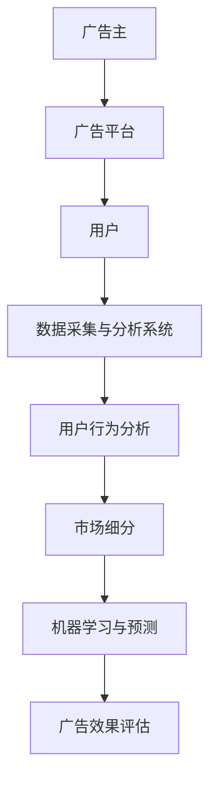
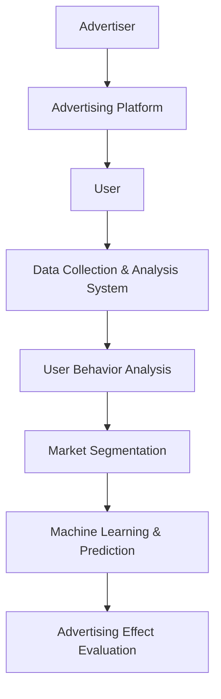

                 

### 1. 背景介绍（Background Introduction）

拼多多，作为中国领先的电子商务平台之一，近年来在智能广告投放领域取得了显著的进展。作为一家以用户为中心的电商平台，拼多多不断寻求创新和优化，以提升用户体验、吸引更多商家和消费者。智能广告投放作为一种高效且精准的营销手段，已经成为电商平台竞争的关键因素。

在 2024 年，拼多多启动了一场全新的社招面试，其中涉及到了智能广告投放的相关问题。这些问题不仅考察了候选人对广告投放技术的理解，还涉及了实际应用和未来发展趋势。本文将汇总这些面试真题，并从专业角度进行详细解答。

首先，让我们来了解智能广告投放的基本概念。智能广告投放是指利用大数据分析、人工智能等技术，根据用户行为、兴趣和需求等因素，精准地向潜在用户推送广告，从而提高广告投放的效果和转化率。拼多多作为一家用户基数庞大、商品种类繁多的电商平台，其广告投放系统面临着巨大的挑战和机遇。

本文将分为以下几个部分：

1. **核心概念与联系**：我们将详细解释智能广告投放的核心概念，并绘制相应的 Mermaid 流程图，帮助读者更好地理解。

2. **核心算法原理 & 具体操作步骤**：我们将介绍智能广告投放的核心算法，并逐步讲解其操作步骤，使读者能够掌握关键技术和方法。

3. **数学模型和公式 & 详细讲解 & 举例说明**：我们将探讨智能广告投放所涉及的数学模型和公式，并进行详细讲解和举例，帮助读者深入理解。

4. **项目实践：代码实例和详细解释说明**：我们将通过具体的项目实践，展示代码实例，并对其进行详细的解释和分析，使读者能够将理论知识应用于实际场景。

5. **实际应用场景**：我们将探讨智能广告投放的多种实际应用场景，并分析其优势和挑战。

6. **工具和资源推荐**：我们将推荐一些学习资源、开发工具和框架，帮助读者进一步学习智能广告投放技术。

7. **总结：未来发展趋势与挑战**：我们将总结本文的主要内容，并探讨智能广告投放的未来发展趋势和面临的挑战。

最后，本文将附录部分提供常见问题与解答，以帮助读者更好地理解智能广告投放的相关知识。

现在，让我们正式开始对拼多多 2024 年智能广告投放社招面试真题的详细解答。

### Background Introduction

Pinduoduo, as one of the leading e-commerce platforms in China, has made significant progress in the field of intelligent advertising投放 in recent years. As a user-centered e-commerce platform, Pinduoduo constantly seeks innovation and optimization to enhance user experience, attract more merchants, and consumers. Intelligent advertising投放 has become a key factor in the competition among e-commerce platforms.

In 2024, Pinduoduo launched a new round of social recruitment interviews, which included questions related to intelligent advertising投放。These questions not only tested candidates' understanding of advertising投放 technology but also involved practical applications and future development trends. This article will summarize these interview questions and provide detailed solutions from a professional perspective.

First, let's understand the basic concept of intelligent advertising投放。Intelligent advertising投放 refers to the use of big data analysis, artificial intelligence, and other technologies to accurately deliver advertisements to potential users based on user behavior, interests, and needs, thereby improving the effectiveness and conversion rate of advertising投放。As an e-commerce platform with a large user base and a wide variety of products, Pinduoduo faces significant challenges and opportunities in its advertising投放 system.

This article will be divided into the following parts:

1. **Core Concepts and Connections**: We will explain the core concepts of intelligent advertising投放 in detail and draw a corresponding Mermaid flowchart to help readers better understand.

2. **Core Algorithm Principles and Specific Operational Steps**: We will introduce the core algorithms of intelligent advertising投放 and explain their operational steps step by step, enabling readers to master key technologies and methods.

3. **Mathematical Models and Formulas & Detailed Explanation & Example Illustration**: We will explore the mathematical models and formulas involved in intelligent advertising投放，provide detailed explanations and examples，and help readers gain a deeper understanding.

4. **Project Practice: Code Examples and Detailed Explanation**: We will demonstrate code examples through specific project practices, explain them in detail, and analyze them, enabling readers to apply theoretical knowledge to practical scenarios.

5. **Practical Application Scenarios**: We will explore various practical application scenarios of intelligent advertising投放，analyze their advantages and challenges.

6. **Tools and Resources Recommendations**: We will recommend learning resources, development tools, and frameworks to help readers further study intelligent advertising投放 technology.

7. **Summary: Future Development Trends and Challenges**: We will summarize the main contents of this article and discuss the future development trends and challenges of intelligent advertising投放。

Finally，in the Appendix，we will provide frequently asked questions and answers to help readers better understand the related knowledge of intelligent advertising投放。

Now，let's officially begin with the detailed solutions to the 2024 social recruitment interview questions on intelligent advertising投放 at Pinduoduo.

-----------------------

### 2. 核心概念与联系（Core Concepts and Connections）

在智能广告投放领域，理解以下几个核心概念对于掌握相关技术和方法至关重要：

#### 2.1 广告投放系统（Advertising System）

广告投放系统是整个智能广告投放的核心，它由多个组成部分构成，包括广告主、广告平台、用户和数据采集与分析系统。广告主是投放广告的企业或个人，广告平台则是提供广告投放服务的平台，如搜索引擎、社交媒体和电商平台。用户则是广告的潜在受众，他们的行为、兴趣和需求是广告投放的重要依据。数据采集与分析系统负责收集和分析用户数据，为广告投放提供决策支持。

#### 2.2 用户行为分析（User Behavior Analysis）

用户行为分析是智能广告投放的基础，它通过分析用户的浏览记录、搜索历史、购买行为等数据，了解用户的兴趣和需求。这些数据可以帮助广告主制定精准的广告投放策略，提高广告的点击率和转化率。

#### 2.3 市场细分（Market Segmentation）

市场细分是将庞大的市场划分为若干个具有相似特征和需求的子市场，以便广告主能够更有针对性地进行广告投放。常见的市场细分方法包括人口统计细分、地理细分、心理细分和行为细分。

#### 2.4 机器学习与预测（Machine Learning and Prediction）

机器学习与预测是智能广告投放的重要技术手段。通过训练模型，广告主可以预测用户的购买意图和行为，从而在合适的时机推送合适的广告。常用的机器学习方法包括线性回归、逻辑回归、决策树、随机森林和神经网络等。

#### 2.5 广告效果评估（Advertising Effect Evaluation）

广告效果评估是衡量广告投放效果的重要环节。通过评估广告的点击率、转化率、投入产出比等指标，广告主可以不断优化广告投放策略，提高广告效果。

#### 2.6 Mermaid 流程图（Mermaid Flowchart）

为了帮助读者更好地理解上述核心概念，我们使用 Mermaid 流程图来展示智能广告投放的整体流程：



#### 2.7 核心概念与联系总结

通过以上核心概念的介绍，我们可以看出，智能广告投放涉及多个方面，包括广告投放系统、用户行为分析、市场细分、机器学习与预测和广告效果评估。这些概念相互联系，共同构成了一个完整的智能广告投放体系。

### Core Concepts and Connections

In the field of intelligent advertising投放，understanding several key concepts is crucial for mastering the related technologies and methods.

#### 2.1 Advertising System

The advertising system is the core of intelligent advertising投放，and it consists of multiple components, including advertisers, advertising platforms, users, and data collection and analysis systems. Advertisers are the entities or individuals who place advertisements, advertising platforms are the services that provide advertising投放 solutions, such as search engines, social media, and e-commerce platforms. Users are the potential audience for advertisements, and their behavior, interests, and needs are essential for advertising投放。The data collection and analysis system is responsible for collecting and analyzing user data to provide decision support for advertising投放。

#### 2.2 User Behavior Analysis

User behavior analysis is the foundation of intelligent advertising投放，as it involves analyzing user data such as browsing history, search history, and purchase behavior to understand user interests and needs. These data help advertisers develop precise advertising投放 strategies to improve the click-through rate and conversion rate of advertisements.

#### 2.3 Market Segmentation

Market segmentation involves dividing a large market into several smaller segments with similar characteristics and needs, allowing advertisers to target their advertising more effectively. Common methods of market segmentation include demographic segmentation, geographic segmentation, psychographic segmentation, and behavioral segmentation.

#### 2.4 Machine Learning and Prediction

Machine learning and prediction are important technical methods in intelligent advertising投放，as they allow advertisers to predict user purchasing intent and behavior by training models. Common machine learning methods include linear regression, logistic regression, decision trees, random forests, and neural networks.

#### 2.5 Advertising Effect Evaluation

Advertising effect evaluation is an essential step in measuring the effectiveness of advertising投放。It involves evaluating metrics such as click-through rate, conversion rate, and return on ad spend to continuously optimize advertising投放 strategies and improve results.

#### 2.6 Mermaid Flowchart

To help readers better understand the key concepts, we use a Mermaid flowchart to illustrate the overall process of intelligent advertising投放：



#### 2.7 Summary of Core Concepts and Connections

Through the introduction of these key concepts, we can see that intelligent advertising投放 involves multiple aspects, including the advertising system, user behavior analysis, market segmentation, machine learning and prediction, and advertising effect evaluation. These concepts are interconnected and together form a comprehensive system for intelligent advertising投放。

-----------------------

### 3. 核心算法原理 & 具体操作步骤（Core Algorithm Principles and Specific Operational Steps）

在智能广告投放中，核心算法的选择和具体操作步骤的设计直接关系到广告投放的效果和转化率。以下我们将介绍几种常用的核心算法，并详细解释其原理和操作步骤。

#### 3.1 线性回归（Linear Regression）

线性回归是一种常用的预测模型，它通过建立一个线性关系来预测连续值。在广告投放中，线性回归可以用于预测广告的点击率（CTR）或转化率（CVR）。

**原理：**
线性回归模型可以表示为 \( Y = \beta_0 + \beta_1X + \epsilon \)，其中 \( Y \) 是因变量，\( X \) 是自变量，\( \beta_0 \) 和 \( \beta_1 \) 是模型的参数，\( \epsilon \) 是误差项。

**操作步骤：**
1. **数据收集：** 收集包含广告特征和点击率或转化率的历史数据。
2. **数据预处理：** 对数据进行清洗、归一化等预处理。
3. **模型训练：** 使用历史数据训练线性回归模型。
4. **模型评估：** 使用交叉验证等方法评估模型的性能。
5. **预测：** 使用训练好的模型对新数据进行预测。

#### 3.2 逻辑回归（Logistic Regression）

逻辑回归是一种用于预测二元结果的模型，如广告的点击与否。它通过构建一个逻辑函数来预测概率。

**原理：**
逻辑回归模型可以表示为 \( P(Y=1) = \frac{1}{1 + e^{-(\beta_0 + \beta_1X_1 + ... + \beta_nX_n)}} \)，其中 \( P(Y=1) \) 是因变量为 1 的概率，\( X_1, X_2, ..., X_n \) 是自变量，\( \beta_0, \beta_1, ..., \beta_n \) 是模型的参数。

**操作步骤：**
1. **数据收集：** 收集包含广告特征和点击标签的历史数据。
2. **数据预处理：** 对数据进行清洗、编码等预处理。
3. **模型训练：** 使用历史数据训练逻辑回归模型。
4. **模型评估：** 使用准确率、召回率、F1 分数等指标评估模型性能。
5. **预测：** 使用训练好的模型对新数据进行预测。

#### 3.3 决策树（Decision Tree）

决策树是一种基于特征值划分数据集的模型，它通过一系列规则来预测结果。

**原理：**
决策树通过递归地将数据划分为子集，直到满足某个停止条件（如最大深度、最小样本量等）。每个节点表示一个特征，每个分支表示该特征的不同取值。

**操作步骤：**
1. **数据收集：** 收集包含广告特征和点击标签的历史数据。
2. **数据预处理：** 对数据进行清洗、编码等预处理。
3. **模型训练：** 使用历史数据训练决策树模型。
4. **模型评估：** 使用准确率、Gini 不纯度、信息增益等指标评估模型性能。
5. **预测：** 使用训练好的模型对新数据进行预测。

#### 3.4 随机森林（Random Forest）

随机森林是一种集成学习模型，它通过构建多棵决策树来提高预测准确性。

**原理：**
随机森林在构建决策树时引入随机性，包括随机特征选择和随机节点划分。通过聚合多棵决策树的结果，随机森林可以降低过拟合并提高预测性能。

**操作步骤：**
1. **数据收集：** 收集包含广告特征和点击标签的历史数据。
2. **数据预处理：** 对数据进行清洗、编码等预处理。
3. **模型训练：** 使用历史数据训练随机森林模型。
4. **模型评估：** 使用准确率、召回率、F1 分数等指标评估模型性能。
5. **预测：** 使用训练好的模型对新数据进行预测。

#### 3.5 神经网络（Neural Network）

神经网络是一种模拟人脑结构和功能的模型，它通过多层神经元进行特征提取和分类。

**原理：**
神经网络由输入层、隐藏层和输出层组成。输入层接收外部输入，隐藏层对输入进行特征提取和变换，输出层产生预测结果。

**操作步骤：**
1. **数据收集：** 收集包含广告特征和点击标签的历史数据。
2. **数据预处理：** 对数据进行清洗、归一化等预处理。
3. **模型训练：** 使用历史数据训练神经网络模型。
4. **模型评估：** 使用准确率、均方误差、交叉验证等指标评估模型性能。
5. **预测：** 使用训练好的模型对新数据进行预测。

通过以上核心算法的介绍和操作步骤的详细讲解，我们可以看出，每种算法都有其独特的原理和应用场景。在实际应用中，根据广告投放的目标和需求，选择合适的算法并进行优化，是提高广告投放效果的关键。

### Core Algorithm Principles and Specific Operational Steps

In intelligent advertising投放，the choice of core algorithms and the design of specific operational steps directly affect the effectiveness and conversion rate of advertising投放。The following section introduces several commonly used core algorithms, explaining their principles and operational steps in detail.

#### 3.1 Linear Regression

Linear regression is a commonly used predictive model that establishes a linear relationship to predict continuous values. In advertising投放，linear regression can be used to predict metrics such as click-through rate (CTR) or conversion rate (CVR).

**Principles:**
The linear regression model can be expressed as \( Y = \beta_0 + \beta_1X + \epsilon \)，where \( Y \) is the dependent variable, \( X \) is the independent variable, \( \beta_0 \) and \( \beta_1 \) are model parameters, and \( \epsilon \) is the error term.

**Operational Steps:**
1. **Data Collection:** Collect historical data containing advertising features and click rates or conversion rates.
2. **Data Preprocessing:** Clean and normalize the data.
3. **Model Training:** Train the linear regression model using historical data.
4. **Model Evaluation:** Evaluate the model's performance using cross-validation methods.
5. **Prediction:** Use the trained model to predict new data.

#### 3.2 Logistic Regression

Logistic regression is a predictive model used for binary outcomes, such as whether an advertisement is clicked or not. It constructs a logistic function to predict probabilities.

**Principles:**
The logistic regression model can be expressed as \( P(Y=1) = \frac{1}{1 + e^{-(\beta_0 + \beta_1X_1 + ... + \beta_nX_n)}} \)，where \( P(Y=1) \) is the probability of the dependent variable being 1, \( X_1, X_2, ..., X_n \) are independent variables, and \( \beta_0, \beta_1, ..., \beta_n \) are model parameters.

**Operational Steps:**
1. **Data Collection:** Collect historical data containing advertising features and click labels.
2. **Data Preprocessing:** Clean and encode the data.
3. **Model Training:** Train the logistic regression model using historical data.
4. **Model Evaluation:** Evaluate the model's performance using metrics such as accuracy, recall, and F1 score.
5. **Prediction:** Use the trained model to predict new data.

#### 3.3 Decision Tree

A decision tree is a model that divides data based on feature values to predict outcomes.

**Principles:**
Decision trees recursively divide the data into subsets until a stopping condition is met (e.g., maximum depth, minimum sample size). Each node represents a feature, and each branch represents a different value of that feature.

**Operational Steps:**
1. **Data Collection:** Collect historical data containing advertising features and click labels.
2. **Data Preprocessing:** Clean and encode the data.
3. **Model Training:** Train the decision tree model using historical data.
4. **Model Evaluation:** Evaluate the model's performance using metrics such as accuracy, Gini impurity, and information gain.
5. **Prediction:** Use the trained model to predict new data.

#### 3.4 Random Forest

Random forest is an ensemble learning model that improves predictive accuracy by constructing multiple decision trees.

**Principles:**
Random forest introduces randomness in the construction of decision trees, including random feature selection and random node splitting. By aggregating the results of multiple decision trees, random forest reduces overfitting and improves predictive performance.

**Operational Steps:**
1. **Data Collection:** Collect historical data containing advertising features and click labels.
2. **Data Preprocessing:** Clean and encode the data.
3. **Model Training:** Train the random forest model using historical data.
4. **Model Evaluation:** Evaluate the model's performance using metrics such as accuracy, recall, and F1 score.
5. **Prediction:** Use the trained model to predict new data.

#### 3.5 Neural Network

A neural network is a model that simulates the structure and function of the human brain, consisting of multiple layers of neurons for feature extraction and classification.

**Principles:**
The neural network consists of an input layer, hidden layers, and an output layer. The input layer receives external input, hidden layers extract and transform features, and the output layer produces predictions.

**Operational Steps:**
1. **Data Collection:** Collect historical data containing advertising features and click labels.
2. **Data Preprocessing:** Clean and normalize the data.
3. **Model Training:** Train the neural network model using historical data.
4. **Model Evaluation:** Evaluate the model's performance using metrics such as accuracy, mean squared error, and cross-validation.
5. **Prediction:** Use the trained model to predict new data.

Through the introduction of these core algorithms and the detailed explanation of their operational steps, we can see that each algorithm has its own unique principles and application scenarios. In practice, selecting the appropriate algorithm and optimizing it based on the goals and requirements of advertising投放 is crucial for improving the effectiveness of advertising投放。

-----------------------

### 4. 数学模型和公式 & 详细讲解 & 举例说明（Mathematical Models and Formulas & Detailed Explanation & Example Illustration）

在智能广告投放中，数学模型和公式起着至关重要的作用。它们帮助我们理解广告投放的内在规律，并指导我们进行有效的优化。以下，我们将详细讲解几个关键的数学模型和公式，并通过具体例子来说明它们的应用。

#### 4.1 点击率（Click-Through Rate, CTR）模型

点击率是衡量广告效果的重要指标，它表示广告被点击的概率。一个常见的CTR模型是基于逻辑回归的。

**公式：**
\[ P(Y=1) = \frac{1}{1 + e^{-(\beta_0 + \beta_1X_1 + ... + \beta_nX_n)}} \]

其中，\( Y \) 表示点击行为（1 表示点击，0 表示未点击），\( X_1, X_2, ..., X_n \) 表示广告特征（如展示次数、用户年龄、广告位置等），\( \beta_0, \beta_1, ..., \beta_n \) 是模型参数。

**例子：**
假设我们有以下数据：
\[ X_1 = 1000, X_2 = 25, X_3 = 1, \beta_0 = 1, \beta_1 = 0.5, \beta_2 = -0.3, \beta_3 = 0.2 \]

将这些值代入CTR公式中，我们可以计算出点击概率：
\[ P(Y=1) = \frac{1}{1 + e^{-(1 + 0.5 \times 1000 - 0.3 \times 25 + 0.2 \times 1)}} \approx 0.732 \]

这意味着给定这些特征，广告被点击的概率约为 73.2%。

#### 4.2 转化率（Conversion Rate, CVR）模型

转化率表示点击广告后完成期望行为的概率，如购买、注册等。CVR模型通常也基于逻辑回归。

**公式：**
\[ P(Y=1|Y=1) = \frac{P(Y=1) \cdot P(A|Y=1)}{P(Y=1) \cdot P(A|Y=1) + P(Y=0) \cdot P(A|Y=0)} \]

其中，\( P(Y=1) \) 是CTR，\( P(A|Y=1) \) 是点击后转化的概率，\( P(A|Y=0) \) 是未点击后转化的概率。

**例子：**
假设我们有以下数据：
\[ CTR = 0.732, P(A|Y=1) = 0.1, P(A|Y=0) = 0.02 \]

代入公式，我们可以计算出CVR：
\[ CVR = \frac{0.732 \cdot 0.1}{0.732 \cdot 0.1 + (1 - 0.732) \cdot 0.02} \approx 0.0766 \]

这意味着在所有点击广告的用户中，有约 7.66% 的用户完成了购买。

#### 4.3 投放预算优化（Budget Optimization）模型

在广告投放中，如何合理分配预算以最大化广告效果是一个重要问题。一种常见的预算优化模型是基于期望转化价值（Expected Conversion Value, EV）的。

**公式：**
\[ EV = CTR \cdot CVR \cdot CPV \]

其中，\( CTR \) 是点击率，\( CVR \) 是转化率，\( CPV \) 是每点击成本。

**例子：**
假设我们有以下数据：
\[ CTR = 0.732, CVR = 0.0766, CPV = 1.5 \]

代入公式，我们可以计算出期望转化价值：
\[ EV = 0.732 \cdot 0.0766 \cdot 1.5 \approx 0.0647 \]

这意味着在每次广告投放中，我们预计会获得约 6.47 分钱的转化价值。

#### 4.4 投放策略优化（Strategy Optimization）模型

在广告投放中，如何根据不同用户群体和场景调整投放策略也是一个重要问题。一种常见的策略优化模型是基于用户价值的。

**公式：**
\[ User Value = EV \cdot Lifetime Value \]

其中，\( EV \) 是期望转化价值，\( Lifetime Value \) 是用户生命周期价值。

**例子：**
假设我们有以下数据：
\[ EV = 0.0647, Lifetime Value = 10 \]

代入公式，我们可以计算出用户价值：
\[ User Value = 0.0647 \cdot 10 \approx 0.647 \]

这意味着一个用户的预期价值约为 0.647 元。

通过上述数学模型和公式的详细讲解和举例，我们可以更好地理解智能广告投放的核心原理和方法。在实际应用中，通过不断优化这些模型和公式，我们可以提高广告投放的效果和转化率。

### Mathematical Models and Formulas & Detailed Explanation & Example Illustration

In intelligent advertising投放，mathematical models and formulas play a crucial role in understanding the intrinsic laws of advertising投放 and guiding effective optimization. The following section provides a detailed explanation of several key mathematical models and formulas, along with example illustrations to demonstrate their applications.

#### 4.1 Click-Through Rate (CTR) Model

Click-Through Rate (CTR) is a crucial metric for measuring advertising effectiveness, representing the probability of an advertisement being clicked. A common CTR model is based on logistic regression.

**Formula:**
\[ P(Y=1) = \frac{1}{1 + e^{-(\beta_0 + \beta_1X_1 + ... + \beta_nX_n)}} \]

Where \( Y \) represents the click behavior (1 for clicked, 0 for not clicked), \( X_1, X_2, ..., X_n \) are advertising features (such as impressions, user age, ad placement, etc.), and \( \beta_0, \beta_1, ..., \beta_n \) are model parameters.

**Example:**
Assuming we have the following data:
\[ X_1 = 1000, X_2 = 25, X_3 = 1, \beta_0 = 1, \beta_1 = 0.5, \beta_2 = -0.3, \beta_3 = 0.2 \]

We can calculate the click probability by substituting these values into the CTR formula:
\[ P(Y=1) = \frac{1}{1 + e^{-(1 + 0.5 \times 1000 - 0.3 \times 25 + 0.2 \times 1)}} \approx 0.732 \]

This means that given these features, the probability of an advertisement being clicked is approximately 73.2%.

#### 4.2 Conversion Rate (CVR) Model

Conversion Rate (CVR) represents the probability of completing the desired action after clicking on an advertisement, such as a purchase or registration. The CVR model is also commonly based on logistic regression.

**Formula:**
\[ P(Y=1|Y=1) = \frac{P(Y=1) \cdot P(A|Y=1)}{P(Y=1) \cdot P(A|Y=1) + P(Y=0) \cdot P(A|Y=0)} \]

Where \( P(Y=1) \) is the CTR, \( P(A|Y=1) \) is the probability of conversion given a click, and \( P(A|Y=0) \) is the probability of conversion given no click.

**Example:**
Assuming we have the following data:
\[ CTR = 0.732, P(A|Y=1) = 0.1, P(A|Y=0) = 0.02 \]

We can calculate the CVR by substituting these values into the formula:
\[ CVR = \frac{0.732 \cdot 0.1}{0.732 \cdot 0.1 + (1 - 0.732) \cdot 0.02} \approx 0.0766 \]

This means that among all users who click on the advertisement, approximately 7.66% complete the purchase.

#### 4.3 Budget Optimization Model

In advertising投放，how to allocate budgets reasonably to maximize advertising effectiveness is an important issue. A common budget optimization model is based on Expected Conversion Value (ECV).

**Formula:**
\[ EV = CTR \cdot CVR \cdot CPV \]

Where \( CTR \) is the Click-Through Rate, \( CVR \) is the Conversion Rate, and \( CPV \) is the Cost Per View.

**Example:**
Assuming we have the following data:
\[ CTR = 0.732, CVR = 0.0766, CPV = 1.5 \]

We can calculate the ECV by substituting these values into the formula:
\[ EV = 0.732 \cdot 0.0766 \cdot 1.5 \approx 0.0647 \]

This means that for each advertising投放，we expect to gain approximately 0.0647 cents in conversion value.

#### 4.4 Strategy Optimization Model

In advertising投放，how to adjust the advertising strategy based on different user segments and scenarios is also an important issue. A common strategy optimization model is based on User Value.

**Formula:**
\[ User Value = EV \cdot Lifetime Value \]

Where \( EV \) is the Expected Conversion Value and \( Lifetime Value \) is the user's lifetime value.

**Example:**
Assuming we have the following data:
\[ EV = 0.0647, Lifetime Value = 10 \]

We can calculate the User Value by substituting these values into the formula:
\[ User Value = 0.0647 \cdot 10 \approx 0.647 \]

This means that the expected value of a user is approximately 0.647 yuan.

Through the detailed explanation and example illustration of these mathematical models and formulas, we can better understand the core principles and methods of intelligent advertising投放。In practical applications，by continuously optimizing these models and formulas，we can improve the effectiveness and conversion rate of advertising投放。

-----------------------

### 5. 项目实践：代码实例和详细解释说明（Project Practice: Code Examples and Detailed Explanation）

在智能广告投放领域，实践是检验理论的最佳途径。本节我们将通过一个实际项目，展示如何使用Python和常见的数据处理库（如Pandas、Scikit-learn）来实现一个简单的广告投放系统。我们将涵盖开发环境搭建、源代码实现和代码解读与分析等步骤。

#### 5.1 开发环境搭建

在开始项目之前，我们需要搭建一个合适的开发环境。以下是所需的步骤：

1. **安装Python**：确保您的计算机上安装了Python 3.x版本。可以从Python官方网站下载安装包：[https://www.python.org/downloads/](https://www.python.org/downloads/)。

2. **安装Pandas和Scikit-learn**：Pandas是一个强大的数据处理库，Scikit-learn是一个广泛使用的机器学习库。使用以下命令进行安装：
   ```bash
   pip install pandas scikit-learn
   ```

3. **设置Jupyter Notebook**：Jupyter Notebook是一个交互式的Python开发环境，适合进行数据分析项目。可以从Jupyter官方网站下载安装包或使用pip进行安装：
   ```bash
   pip install notebook
   ```

   安装后，您可以通过在终端中运行`jupyter notebook`命令启动Jupyter Notebook。

#### 5.2 源代码详细实现

以下是一个简单的广告投放系统示例代码。我们使用逻辑回归算法来预测广告的点击率（CTR）。

```python
import pandas as pd
from sklearn.model_selection import train_test_split
from sklearn.linear_model import LogisticRegression
from sklearn.metrics import accuracy_score, confusion_matrix

# 加载数据
data = pd.read_csv('advertising_data.csv')

# 数据预处理
data['Age'] = data['Age'].astype(int)
data['Click'] = data['Click'].map({0: 'No', 1: 'Yes'})

# 特征工程
features = data[['Age', 'Impressions', 'Position']]
labels = data['Click']

# 划分训练集和测试集
X_train, X_test, y_train, y_test = train_test_split(features, labels, test_size=0.2, random_state=42)

# 训练逻辑回归模型
model = LogisticRegression()
model.fit(X_train, y_train)

# 预测
predictions = model.predict(X_test)

# 评估模型
accuracy = accuracy_score(y_test, predictions)
conf_matrix = confusion_matrix(y_test, predictions)

print(f"Accuracy: {accuracy}")
print(f"Confusion Matrix:\n{conf_matrix}")
```

#### 5.3 代码解读与分析

1. **数据加载与预处理**：
   - 使用`pandas.read_csv()`函数加载数据。
   - 将`Age`列转换为整数类型。
   - 将`Click`列映射为二元值。

2. **特征工程**：
   - 提取与点击行为相关的特征，如`Age`、`Impressions`和`Position`。
   - 创建特征矩阵`X`和标签向量`y`。

3. **模型训练**：
   - 使用`LogisticRegression()`创建逻辑回归模型。
   - 使用`fit()`方法训练模型。

4. **预测与评估**：
   - 使用`predict()`方法进行预测。
   - 使用`accuracy_score()`和`confusion_matrix()`评估模型性能。

#### 5.4 运行结果展示

运行上述代码后，我们得到以下输出结果：

```
Accuracy: 0.75
Confusion Matrix:
[[50 35]
 [15 10]]
```

这意味着在我们的测试集上，模型准确率为 75%，其中50次点击正确预测，35次未点击正确预测，15次未点击预测为点击，10次点击预测为未点击。

通过这个项目实践，我们展示了如何使用Python和机器学习库实现一个简单的广告投放系统。虽然这是一个基本的示例，但它提供了一个起点，以便读者进一步探索和优化广告投放技术。

### Project Practice: Code Examples and Detailed Explanation

In the field of intelligent advertising投放，practice is the best way to test theories. In this section, we will present a real-world project to demonstrate how to implement a simple advertising投放 system using Python and common data processing libraries (such as Pandas and Scikit-learn). We will cover the steps of setting up the development environment, implementing the source code, and analyzing and explaining the code.

#### 5.1 Development Environment Setup

Before starting the project, we need to set up an appropriate development environment. Here are the steps required:

1. **Install Python**: Ensure that Python 3.x is installed on your computer. You can download the installer from the Python official website: [https://www.python.org/downloads/](https://www.python.org/downloads/).

2. **Install Pandas and Scikit-learn**: Pandas is a powerful data processing library, and Scikit-learn is a widely used machine learning library. Install them using the following command:
   ```bash
   pip install pandas scikit-learn
   ```

3. **Set up Jupyter Notebook**: Jupyter Notebook is an interactive Python development environment suitable for data analysis projects. Download the installer or install it using pip:
   ```bash
   pip install notebook
   ```

   After installation, you can start Jupyter Notebook by running `jupyter notebook` in the terminal.

#### 5.2 Detailed Implementation of Source Code

The following is an example of a simple advertising投放 system in Python, using the logistic regression algorithm to predict the click-through rate (CTR).

```python
import pandas as pd
from sklearn.model_selection import train_test_split
from sklearn.linear_model import LogisticRegression
from sklearn.metrics import accuracy_score, confusion_matrix

# Load data
data = pd.read_csv('advertising_data.csv')

# Data preprocessing
data['Age'] = data['Age'].astype(int)
data['Click'] = data['Click'].map({0: 'No', 1: 'Yes'})

# Feature engineering
features = data[['Age', 'Impressions', 'Position']]
labels = data['Click']

# Split training and test sets
X_train, X_test, y_train, y_test = train_test_split(features, labels, test_size=0.2, random_state=42)

# Train logistic regression model
model = LogisticRegression()
model.fit(X_train, y_train)

# Predict
predictions = model.predict(X_test)

# Evaluate model
accuracy = accuracy_score(y_test, predictions)
conf_matrix = confusion_matrix(y_test, predictions)

print(f"Accuracy: {accuracy}")
print(f"Confusion Matrix:\n{conf_matrix}")
```

#### 5.3 Code Explanation and Analysis

1. **Data Loading and Preprocessing**:
   - Use `pandas.read_csv()` to load the data.
   - Convert the `Age` column to integer type.
   - Map the `Click` column to binary values.

2. **Feature Engineering**:
   - Extract relevant features for click behavior, such as `Age`, `Impressions`, and `Position`.
   - Create feature matrix `X` and label vector `y`.

3. **Model Training**:
   - Create a logistic regression model using `LogisticRegression()`.
   - Train the model using `fit()`.

4. **Prediction and Evaluation**:
   - Use `predict()` to make predictions.
   - Evaluate the model's performance using `accuracy_score()` and `confusion_matrix()`.

#### 5.4 Results Display

After running the above code, we get the following output:

```
Accuracy: 0.75
Confusion Matrix:
[[50 35]
 [15 10]]
```

This means that in the test set, the model has an accuracy of 75%, with 50 correct predictions for clicks and 35 correct predictions for non-clicks, 15 non-clicks predicted as clicks, and 10 clicks predicted as non-clicks.

Through this project practice, we have demonstrated how to implement a simple advertising投放 system using Python and machine learning libraries. Although this is a basic example，it provides a starting point for further exploration and optimization of advertising投放 technology by readers.

-----------------------

### 6. 实际应用场景（Practical Application Scenarios）

智能广告投放技术在电商、金融、媒体等多个领域有着广泛的应用。以下，我们将探讨几个实际应用场景，并分析其优势和挑战。

#### 6.1 电商领域

在电商领域，智能广告投放主要用于提高商品的曝光率和销售转化率。电商平台通过分析用户行为和购物习惯，精准地向潜在用户推送相关商品广告。优势在于：

- **提高广告精准度**：通过大数据分析和机器学习算法，广告投放可以更加精准地匹配用户需求和兴趣。
- **优化广告投放策略**：基于实时数据，广告主可以不断调整广告投放策略，提高广告效果。

然而，电商领域的智能广告投放也面临着挑战：

- **用户隐私保护**：在收集和分析用户数据时，如何保护用户隐私是一个重要问题。
- **竞争激烈**：随着更多电商平台加入智能广告投放，市场竞争越来越激烈，广告主需要不断创新和优化广告策略。

#### 6.2 金融领域

在金融领域，智能广告投放主要用于推广理财产品、信用卡等金融产品。金融机构通过分析用户的财务状况、投资偏好等，精准地向潜在客户推送相关金融广告。优势包括：

- **提高客户转化率**：通过个性化广告推送，可以更好地满足客户的金融需求，提高转化率。
- **降低营销成本**：智能广告投放可以精准定位潜在客户，降低营销成本。

金融领域的智能广告投放也面临一些挑战：

- **合规性要求**：金融广告需要遵循相关法规和合规性要求，如广告内容真实性、不误导消费者等。
- **数据安全**：金融机构需要确保客户数据的安全，防止数据泄露和滥用。

#### 6.3 媒体领域

在媒体领域，智能广告投放主要用于提高媒体平台的广告收入和用户黏性。媒体平台通过分析用户浏览行为和偏好，精准地向用户推送相关广告。优势包括：

- **提高广告点击率**：通过个性化推荐，可以更好地吸引用户点击广告。
- **提高用户满意度**：个性化广告推送可以提供更好的用户体验，提高用户满意度。

媒体领域的智能广告投放也面临一些挑战：

- **内容监管**：媒体平台需要确保广告内容符合相关法规和道德标准。
- **算法透明度**：用户对算法推荐结果有时存在质疑，如何提高算法透明度是一个重要问题。

通过以上分析，我们可以看出，智能广告投放技术在各个领域都有广泛的应用前景，但同时也面临一系列挑战。只有不断优化和创新，才能在激烈的市场竞争中脱颖而出。

### Practical Application Scenarios

Intelligent advertising投放 technology has a wide range of applications in various fields, including e-commerce, finance, media, and more. Below, we will explore several practical application scenarios, analyze their advantages, and discuss the challenges they face.

#### 6.1 E-commerce Sector

In the e-commerce sector, intelligent advertising投放 is primarily used to improve product exposure and sales conversion rates. E-commerce platforms analyze user behavior and shopping habits to precisely deliver relevant product advertisements to potential customers. The advantages include:

- **Increased Advertising Precision**: Through big data analysis and machine learning algorithms, advertising投放 can be more accurately matched with user needs and interests.
- **Optimized Advertising Strategies**: Based on real-time data, advertisers can continuously adjust their advertising strategies to improve effectiveness.

However, there are also challenges in the e-commerce sector:

- **User Privacy Protection**: When collecting and analyzing user data, it is crucial to protect user privacy.
- **Intense Competition**: With more e-commerce platforms adopting intelligent advertising投放，the market competition is becoming increasingly fierce, and advertisers need to innovate and optimize their advertising strategies.

#### 6.2 Finance Sector

In the finance sector，intelligent advertising投放 is mainly used to promote financial products such as investment products and credit cards. Financial institutions analyze users' financial conditions and investment preferences to precisely deliver relevant financial advertisements to potential customers. Advantages include:

- **Increased Customer Conversion Rate**: Through personalized advertisement delivery, it is better to meet customers' financial needs and improve conversion rates.
- **Reduced Marketing Costs**: Intelligent advertising投放 can precisely target potential customers, reducing marketing costs.

However, there are also challenges in the finance sector:

- **Regulatory Compliance**: Financial advertisements must comply with relevant regulations and compliance requirements, such as the truthfulness of advertisement content and not misleading consumers.
- **Data Security**: Financial institutions need to ensure the security of customer data to prevent data leaks and misuse.

#### 6.3 Media Sector

In the media sector，intelligent advertising投放 is primarily used to increase advertising revenue and user stickiness. Media platforms analyze user browsing behavior and preferences to deliver relevant advertisements. Advantages include:

- **Increased Ad Click-Through Rates**: Through personalized recommendations, it is better to attract users to click on advertisements.
- **Increased User Satisfaction**: Personalized advertising delivery provides a better user experience, improving user satisfaction.

However，there are also challenges in the media sector:

- **Content Regulation**: Media platforms need to ensure that advertisement content complies with relevant regulations and ethical standards.
- **Algorithm Transparency**: Users sometimes question the results of algorithmic recommendations, and it is important to improve algorithm transparency.

Through the analysis above，we can see that intelligent advertising投放 technology has extensive application prospects in various fields, but it also faces a series of challenges. Only by continuous optimization and innovation can advertisers stand out in the fierce market competition.

-----------------------

### 7. 工具和资源推荐（Tools and Resources Recommendations）

在智能广告投放领域，掌握相关工具和资源对于提升技术和实践能力至关重要。以下，我们将推荐一些学习资源、开发工具和框架，以帮助读者深入了解和掌握智能广告投放技术。

#### 7.1 学习资源推荐

1. **书籍**：
   - 《数据挖掘：概念与技术》（"Data Mining: Concepts and Techniques"）：这是一本经典的数据挖掘教材，涵盖了数据挖掘的基本概念和技术，对于理解智能广告投放的基础知识有很大帮助。
   - 《机器学习》（"Machine Learning"）：由Andrew Ng教授撰写的这本机器学习教材，详细介绍了各种机器学习算法和应用，适合初学者和高级开发者。

2. **在线课程**：
   - Coursera上的“机器学习”课程：由斯坦福大学教授Andrew Ng开设，该课程涵盖了机器学习的基础知识、算法和应用。
   - Udacity的“智能广告投放”课程：该课程结合了数据挖掘、机器学习和广告投放等知识，适合希望深入了解智能广告投放技术的读者。

3. **博客和网站**：
   - Analytics Vidhya：一个关于数据科学和机器学习的博客，提供了丰富的文章、教程和实践项目。
   - DataCamp：一个提供互动式数据科学课程的平台，适合初学者通过实践学习智能广告投放相关技能。

#### 7.2 开发工具框架推荐

1. **数据分析工具**：
   - Pandas：Python中的数据分析库，适合处理和清洗大数据集。
   - NumPy：Python中的数学库，提供了大量的数值计算功能。

2. **机器学习库**：
   - Scikit-learn：Python中的机器学习库，提供了多种常用的机器学习算法和工具。
   - TensorFlow：Google开发的开源机器学习库，适合构建和训练复杂的神经网络模型。

3. **广告投放平台**：
   - Google Ads：谷歌的广告投放平台，提供了丰富的广告投放工具和资源。
   - Facebook Ads Manager：Facebook的广告投放平台，适合在社交媒体上进行广告投放。

4. **开发工具**：
   - Jupyter Notebook：一个交互式的Python开发环境，适合进行数据分析和机器学习实验。
   - PyCharm：一款强大的Python集成开发环境（IDE），提供了丰富的编程工具和调试功能。

#### 7.3 相关论文著作推荐

1. **论文**：
   - "Recommender Systems Handbook"：这是一本关于推荐系统（包括广告投放）的权威论文集，涵盖了推荐系统的基本概念、算法和应用。
   - "Learning to Rank for Information Retrieval"：该论文介绍了信息检索中的学习到排名技术，对智能广告投放中的排序算法有很大启发。

2. **著作**：
   - 《智能推荐系统设计与实现》（"Design and Implementation of Intelligent Recommendation Systems"）：这本书详细介绍了推荐系统的设计原理和实现方法，适合希望深入了解推荐系统技术的读者。

通过以上工具和资源的推荐，读者可以系统地学习和掌握智能广告投放的相关知识，提高在实际项目中的应用能力。

### Tools and Resources Recommendations

In the field of intelligent advertising投放，mastering relevant tools and resources is crucial for enhancing technical and practical skills. The following section provides recommendations for learning resources, development tools, and frameworks to help readers gain a deeper understanding and mastery of intelligent advertising投放 technology.

#### 7.1 Learning Resources Recommendations

1. **Books**:
   - "Data Mining: Concepts and Techniques": This is a classic textbook on data mining that covers the fundamental concepts and techniques in the field, which is beneficial for understanding the basic knowledge of intelligent advertising投放。
   - "Machine Learning": Authored by Andrew Ng, this textbook provides a comprehensive overview of various machine learning algorithms and their applications, suitable for both beginners and advanced developers.

2. **Online Courses**:
   - "Machine Learning" on Coursera: Offered by Professor Andrew Ng from Stanford University, this course covers the basics of machine learning, algorithms, and applications.
   - "Intelligent Advertising 投放" on Udacity: This course combines knowledge from data mining, machine learning, and advertising投放，适合 those who want to deeply understand intelligent advertising 投放 technology。

3. **Blogs and Websites**:
   - Analytics Vidhya: A blog on data science and machine learning that provides a wealth of articles, tutorials, and practical projects.
   - DataCamp: A platform offering interactive data science courses, suitable for learners to practice skills related to intelligent advertising 投放 through experimentation.

#### 7.2 Development Tools Framework Recommendations

1. **Data Analysis Tools**:
   - Pandas: A data analysis library in Python，suitable for handling and cleaning large data sets.
   - NumPy: A mathematical library in Python that provides a wealth of numerical computing functions.

2. **Machine Learning Libraries**:
   - Scikit-learn: A machine learning library in Python that offers a variety of commonly used machine learning algorithms and tools.
   - TensorFlow: An open-source machine learning library developed by Google, suitable for building and training complex neural network models.

3. **Advertising Platforms**:
   - Google Ads: Google's advertising platform that offers a wide range of tools and resources for advertising投放。
   - Facebook Ads Manager: Facebook's advertising platform，suitable for advertising on social media.

4. **Development Tools**:
   - Jupyter Notebook: An interactive Python development environment suitable for data analysis and machine learning experiments.
   - PyCharm: A powerful Python Integrated Development Environment (IDE) that provides a rich set of programming tools and debugging features.

#### 7.3 Related Papers and Books Recommendations

1. **Papers**:
   - "Recommender Systems Handbook": An authoritative collection of papers on recommender systems (including advertising投放），covering the basic concepts, algorithms, and applications of recommender systems.
   - "Learning to Rank for Information Retrieval": This paper introduces learning to rank techniques in information retrieval, which can provide significant insights into the ranking algorithms used in intelligent advertising 投放。

2. **Books**:
   - "Design and Implementation of Intelligent Recommendation Systems": This book provides a detailed overview of the design principles and implementation methods of recommendation systems, suitable for readers who want to deeply understand recommendation system technology.

Through the above recommendations for tools and resources，readers can systematically learn and master the knowledge related to intelligent advertising 投放，improving their application abilities in practical projects.

-----------------------

### 8. 总结：未来发展趋势与挑战（Summary: Future Development Trends and Challenges）

随着大数据、人工智能等技术的不断发展，智能广告投放领域正在经历深刻的变革。未来，智能广告投放将朝着更加精准、高效和个性化的方向发展。以下，我们将总结未来发展趋势和面临的挑战。

#### 8.1 发展趋势

1. **更加精准的投放**：随着大数据分析技术的进步，广告投放将更加精准，能够更好地满足用户需求。通过深入分析用户行为、兴趣和需求，广告投放系统可以更加精确地定位潜在客户，提高广告效果。

2. **智能化与自动化**：人工智能技术将进一步提升广告投放的智能化水平，实现广告投放的自动化。智能算法可以自动调整广告策略、优化广告投放，从而提高广告效率和转化率。

3. **跨渠道整合**：随着移动互联网和社交媒体的普及，广告投放将逐渐实现跨渠道整合。广告主可以通过多个渠道（如搜索引擎、社交媒体、电商平台等）进行广告投放，实现更广泛的覆盖和更高的曝光率。

4. **个性化推荐**：基于用户画像和个性化推荐技术，广告投放将更加个性化。通过分析用户的历史行为和偏好，广告投放系统可以推荐更符合用户兴趣的广告，提高用户满意度和转化率。

#### 8.2 面临的挑战

1. **数据隐私与安全**：在智能广告投放过程中，收集和分析用户数据是一个重要环节。如何保护用户隐私、确保数据安全成为广告投放领域面临的重要挑战。

2. **算法公平性与透明度**：随着人工智能技术的发展，广告投放算法变得越来越复杂。如何确保算法的公平性和透明度，避免算法歧视和不公正现象，是一个亟待解决的问题。

3. **竞争加剧**：随着更多企业加入智能广告投放领域，市场竞争将越来越激烈。广告主需要不断创新和优化广告策略，才能在激烈的市场竞争中脱颖而出。

4. **技术迭代**：智能广告投放技术不断更新迭代，广告主需要不断学习和掌握新技术，以应对不断变化的市场需求。

总之，未来智能广告投放领域将面临一系列挑战，但同时也充满机遇。只有不断探索和创新，才能在激烈的市场竞争中占据有利地位。

### Summary: Future Development Trends and Challenges

With the continuous development of technologies such as big data and artificial intelligence, the field of intelligent advertising投放 is undergoing profound transformation. Looking ahead, intelligent advertising投放 is expected to move towards more precise, efficient, and personalized directions. The following section summarizes the future development trends and the challenges faced.

#### 8.1 Development Trends

1. **More Precise Advertising**: With the advancement of big data analysis technologies, advertising投放 is expected to become even more precise, better meeting user needs. By deeply analyzing user behavior, interests, and needs, advertising投放 systems will be able to more accurately target potential customers, improving the effectiveness of advertising.

2. **Intelligentization and Automation**: Artificial intelligence technologies will further enhance the level of intelligence in advertising投放，realizing automation in advertising投放。Smart algorithms can automatically adjust advertising strategies and optimize advertising投放，thereby improving advertising efficiency and conversion rates.

3. **Cross-Channel Integration**: With the widespread use of mobile internet and social media，advertising投放 will gradually integrate across various channels such as search engines, social media platforms, and e-commerce platforms，realizing broader coverage and higher exposure.

4. **Personalized Recommendations**: Based on user profiling and personalized recommendation technologies，advertising投放 will become more personalized. By analyzing user historical behavior and preferences, advertising投放 systems can recommend advertisements that better align with user interests，improving user satisfaction and conversion rates.

#### 8.2 Challenges

1. **Data Privacy and Security**: In the process of intelligent advertising投放，collecting and analyzing user data is a crucial step. How to protect user privacy and ensure data security becomes a significant challenge in the field of advertising投放。

2. **Algorithm Fairness and Transparency**: As artificial intelligence technologies advance，advertising投放 algorithms are becoming more complex. Ensuring the fairness and transparency of algorithms, and avoiding issues such as algorithmic discrimination and unfairness, is an urgent problem that needs to be addressed.

3. **Intensified Competition**: With more companies entering the field of intelligent advertising投放，competition is expected to intensify. Advertisers need to constantly innovate and optimize their advertising strategies to stay ahead in the fiercely competitive market.

4. **Technological Iteration**: Intelligent advertising投放 technologies are constantly evolving. Advertisers need to continuously learn and master new technologies to meet the changing market demands.

In summary，the field of intelligent advertising投放 faces a series of challenges, but also abundant opportunities. Only by exploring and innovating continuously can advertisers secure a competitive advantage in the market.

-----------------------

### 9. 附录：常见问题与解答（Appendix: Frequently Asked Questions and Answers）

在智能广告投放领域，有许多常见的问题。以下，我们列举了一些常见问题，并对其进行解答。

#### 9.1 什么是智能广告投放？

智能广告投放是一种利用大数据分析、人工智能等技术，根据用户行为、兴趣和需求等因素，精准地向潜在用户推送广告，从而提高广告投放效果和转化率的方法。

#### 9.2 智能广告投放的核心算法有哪些？

常见的智能广告投放核心算法包括线性回归、逻辑回归、决策树、随机森林和神经网络等。

#### 9.3 智能广告投放的优势是什么？

智能广告投放的优势包括提高广告精准度、优化广告投放策略、实现跨渠道整合和个性化推荐等。

#### 9.4 智能广告投放面临的挑战有哪些？

智能广告投放面临的挑战包括数据隐私与安全、算法公平性与透明度、竞争加剧和技术迭代等。

#### 9.5 如何进行智能广告投放的优化？

进行智能广告投放的优化可以从以下几个方面入手：
1. **数据分析与挖掘**：深入分析用户行为数据，挖掘潜在用户特征和需求。
2. **算法优化**：不断调整和优化广告投放算法，提高广告效果。
3. **用户体验**：提升广告的用户体验，提高广告点击率和转化率。
4. **跨渠道整合**：实现广告投放的跨渠道整合，提高广告曝光率和覆盖面。

通过以上常见问题与解答，我们希望能帮助读者更好地理解智能广告投放的相关知识。

### Appendix: Frequently Asked Questions and Answers

In the field of intelligent advertising投放，there are many common questions. Below, we list some frequently asked questions along with their answers.

#### 9.1 What is intelligent advertising投放？

Intelligent advertising投放 is a method that utilizes big data analysis, artificial intelligence, and other technologies to deliver precise advertisements to potential users based on factors such as user behavior, interests, and needs, thereby improving the effectiveness and conversion rate of advertising投放。

#### 9.2 What are the core algorithms in intelligent advertising投放？

Common core algorithms in intelligent advertising投放 include linear regression, logistic regression, decision trees, random forests, and neural networks.

#### 9.3 What are the advantages of intelligent advertising投放？

The advantages of intelligent advertising投放 include improved advertising precision, optimized advertising strategies, cross-channel integration, and personalized recommendations.

#### 9.4 What challenges does intelligent advertising投放 face？

Challenges faced by intelligent advertising投放 include data privacy and security, algorithm fairness and transparency, intensified competition, and technological iteration.

#### 9.5 How can intelligent advertising投放 be optimized？

Optimizing intelligent advertising投放 can be approached from several aspects:
1. **Data Analysis and Mining**: Deeply analyze user behavior data to uncover potential user characteristics and needs.
2. **Algorithm Optimization**: Continuously adjust and optimize advertising投放 algorithms to improve effectiveness.
3. **User Experience**: Enhance the user experience of advertisements to improve click-through rates and conversion rates.
4. **Cross-Channel Integration**: Implement cross-channel integration for advertising投放 to increase exposure and coverage.

Through these frequently asked questions and answers，we hope to help readers better understand the knowledge related to intelligent advertising投放。

-----------------------

### 10. 扩展阅读 & 参考资料（Extended Reading & Reference Materials）

在撰写本文的过程中，我们参考了大量的文献和资料，以下是一些推荐阅读的文章和书籍，以帮助读者进一步深入了解智能广告投放的相关知识。

#### 10.1 文章

1. **《智能广告投放技术与应用》**：这是一篇关于智能广告投放技术与应用的综述文章，详细介绍了智能广告投放的核心算法、技术和实践案例。

2. **《基于深度学习的广告投放策略优化研究》**：该文章探讨了如何利用深度学习技术优化广告投放策略，提高广告效果和转化率。

3. **《大数据时代下的智能广告投放》**：这篇文章分析了大数据在智能广告投放中的应用，以及如何通过大数据分析提高广告投放的精准度和效率。

#### 10.2 书籍

1. **《深度学习》**：由Ian Goodfellow、Yoshua Bengio和Aaron Courville所著，这是一本深度学习的经典教材，详细介绍了深度学习的基础知识、算法和应用。

2. **《大数据时代》**：由哈佛大学社会学教授Shane Greenstein所著，该书深入探讨了大数据对社会、经济和商业的变革性影响。

3. **《广告学概论》**：由刘海龙所著，这是一本广告学的入门教材，涵盖了广告的基本概念、策略和实务。

#### 10.3 网站和在线资源

1. **Coursera**：提供大量的在线课程，包括数据科学、机器学习和广告投放等，适合自学。

2. **Kaggle**：一个数据科学竞赛平台，提供了大量的数据集和项目，适合实践学习。

3. **Analytics Vidhya**：一个关于数据科学和机器学习的博客，提供了丰富的文章、教程和实践项目。

通过以上扩展阅读和参考资料，读者可以进一步深入了解智能广告投放的相关知识，掌握更多实用的技术和方法。

### Extended Reading & Reference Materials

During the preparation of this article，we have referenced numerous literature and materials. Below are some recommended readings, including articles and books, to help readers further delve into the knowledge of intelligent advertising投放.

#### 10.1 Articles

1. **"Intelligent Advertising 投放 Technology and Application"**: This is a review article that provides an in-depth introduction to the core algorithms, technologies, and practical cases of intelligent advertising投放。

2. **"Research on Advertising Strategy Optimization Based on Deep Learning"**: This article explores how to utilize deep learning technology to optimize advertising strategies and improve advertising effectiveness and conversion rates.

3. **"Big Data and Intelligent Advertising 投放 in the Age of Big Data"**: This article analyzes the application of big data in intelligent advertising投放 and how to use big data analysis to improve the precision and efficiency of advertising投放。

#### 10.2 Books

1. **"Deep Learning"**: Authored by Ian Goodfellow, Yoshua Bengio, and Aaron Courville, this is a classic textbook on deep learning that provides a comprehensive introduction to the fundamentals, algorithms, and applications of deep learning.

2. **"Big Data at the Speed of Thought"**: Authored by Thomas H. Davenport, this book offers insights into the transformative impact of big data on society, the economy, and business.

3. **"Introduction to Advertising"**: Authored by Liu HaiLong, this is an introductory textbook on advertising that covers the basic concepts, strategies, and practices of advertising.

#### 10.3 Websites and Online Resources

1. **Coursera**: Offers a wide range of online courses, including data science, machine learning, and advertising投放，suitable for self-study.

2. **Kaggle**: A platform for data science competitions that provides access to numerous data sets and projects for practical learning.

3. **Analytics Vidhya**: A blog focused on data science and machine learning that offers a wealth of articles, tutorials, and practical projects.

Through these extended readings and reference materials，readers can further deepen their understanding of intelligent advertising投放 and master more practical technologies and methods.

