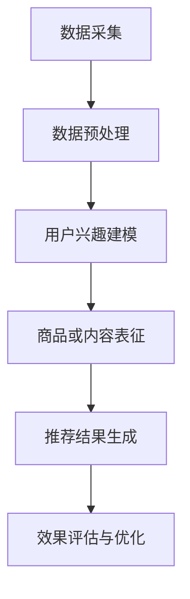

                 

# 文章标题

推荐系统中的长尾效应处理：大模型方法

## 关键词
推荐系统，长尾效应，大模型，数据处理，机器学习

## 摘要
本文探讨了推荐系统中的长尾效应问题，并提出了基于大模型的解决方案。通过对长尾效应的定义、成因及影响进行分析，我们引入了基于大模型的处理方法，包括数据预处理、模型选择与优化、效果评估等环节。本文旨在为推荐系统开发者和研究人员提供有价值的参考，以优化推荐效果，提升用户满意度。

## 1. 背景介绍（Background Introduction）

### 1.1 推荐系统概述
推荐系统是一种基于数据挖掘和机器学习技术的信息系统，旨在根据用户的兴趣、行为和偏好，向用户推荐可能感兴趣的商品、服务或内容。推荐系统的广泛应用极大地提升了用户体验，并为企业带来了显著的商业价值。

### 1.2 长尾效应概念
长尾效应（Long Tail Effect）是指在一定条件下，大量非热门商品或内容在市场上占据了相当份额的现象。长尾效应在推荐系统中表现为，热门商品或内容占据主导地位，而大量非热门商品或内容则被忽视。

### 1.3 长尾效应的影响
长尾效应对推荐系统的影响主要体现在两个方面：
- **资源分配失衡**：热门商品或内容获得更多推荐资源，导致非热门商品或内容曝光度降低。
- **用户体验下降**：用户频繁接触到重复的信息，降低了推荐系统的吸引力。

### 1.4 长尾效应的成因
长尾效应的成因主要包括：
- **用户多样性**：用户需求和兴趣存在巨大差异，部分用户对非热门商品或内容有强烈需求。
- **数据量增加**：随着数据采集技术的进步，非热门商品或内容的数据量逐渐增加。
- **信息传播方式**：互联网和社交媒体的普及，使得信息传播更加广泛，促进了长尾效应的形成。

## 2. 核心概念与联系（Core Concepts and Connections）

### 2.1 大模型概述
大模型（Large Model）是指具有巨大参数量和强大计算能力的神经网络模型，如BERT、GPT等。大模型通过学习和理解海量数据，能够捕捉复杂的模式和规律，从而在多个领域取得了显著的成果。

### 2.2 大模型在推荐系统中的应用
大模型在推荐系统中的应用主要表现在以下几个方面：
- **用户兴趣建模**：大模型能够从海量用户数据中挖掘出用户的兴趣偏好，提高推荐精度。
- **商品或内容表征**：大模型能够为商品或内容生成丰富的表征，有助于更好地理解用户需求。
- **长尾效应处理**：大模型能够处理大量非热门商品或内容，有效缓解长尾效应。

### 2.3 大模型与长尾效应的关系
大模型通过以下几个机制处理长尾效应：
- **参数规模**：大模型拥有更多参数，能够更好地捕捉长尾数据中的特征。
- **计算能力**：大模型具备更强的计算能力，能够处理更多数据，提升长尾数据的曝光度。
- **学习能力**：大模型具有较强的学习能力，能够不断优化推荐算法，提高长尾商品或内容的推荐效果。

### 2.4 Mermaid 流程图（Mermaid Flowchart）
以下是一个简单的 Mermaid 流程图，展示了大模型在处理长尾效应时的基本流程：



## 3. 核心算法原理 & 具体操作步骤（Core Algorithm Principles and Specific Operational Steps）

### 3.1 数据预处理
数据预处理是推荐系统中的重要环节，直接影响到后续模型的性能。数据预处理主要包括以下步骤：
- **数据清洗**：去除重复数据、噪声数据和缺失数据。
- **数据归一化**：对数值型数据进行归一化处理，使其具备可比性。
- **特征工程**：提取用户行为、商品属性等特征，为后续建模提供支持。

### 3.2 用户兴趣建模
用户兴趣建模的核心目标是挖掘用户的兴趣偏好，以便为用户提供个性化的推荐。常见的用户兴趣建模方法包括：
- **基于协同过滤的方法**：通过分析用户的历史行为数据，发现用户之间的相似性，从而预测用户的兴趣。
- **基于内容的推荐**：根据商品或内容的属性，为用户推荐与其兴趣相关的商品或内容。
- **基于深度学习的用户兴趣建模**：使用深度学习模型，如BERT、GPT等，从用户数据中自动学习用户的兴趣偏好。

### 3.3 商品或内容表征
商品或内容表征是将商品或内容的属性信息转化为模型可以理解的形式。常见的商品或内容表征方法包括：
- **基于词向量的表征**：将商品或内容的属性信息转化为词向量，以便在模型中进行处理。
- **基于图嵌入的表征**：使用图嵌入技术，将商品或内容的信息转化为图结构，以便在模型中进行处理。
- **基于深度学习的表征**：使用深度学习模型，如BERT、GPT等，从商品或内容的数据中自动学习其表征。

### 3.4 推荐结果生成
推荐结果生成是根据用户兴趣建模和商品或内容表征的结果，为用户生成个性化推荐。常见的推荐结果生成方法包括：
- **基于相似度的推荐**：根据用户和商品或内容之间的相似度，为用户推荐相似的商品或内容。
- **基于模型的推荐**：使用深度学习模型，如BERT、GPT等，生成个性化推荐结果。
- **基于规则推荐的混合方法**：将基于相似度和基于模型的推荐方法相结合，以提高推荐效果。

### 3.5 效果评估与优化
效果评估与优化是推荐系统中的关键环节，旨在评估推荐效果，并不断优化推荐算法。常见的效果评估指标包括：
- **准确率（Accuracy）**：预测结果与实际结果相符的比例。
- **召回率（Recall）**：能够召回实际感兴趣商品或内容的比例。
- **F1值（F1-score）**：准确率和召回率的加权平均值。

效果优化的方法包括：
- **超参数调优**：调整模型参数，以获得更好的推荐效果。
- **数据增强**：通过引入更多样化的数据，提高模型的泛化能力。
- **模型集成**：将多个模型的结果进行融合，以提高推荐效果。

## 4. 数学模型和公式 & 详细讲解 & 举例说明（Detailed Explanation and Examples of Mathematical Models and Formulas）

### 4.1 用户兴趣建模的数学模型
用户兴趣建模常用的数学模型是协同过滤模型，如矩阵分解模型。以下是矩阵分解模型的基本数学公式：

$$
X = U \times V^T
$$

其中，$X$ 表示用户-商品评分矩阵，$U$ 表示用户特征矩阵，$V$ 表示商品特征矩阵。

用户特征矩阵 $U$ 和商品特征矩阵 $V$ 的具体计算方法如下：

$$
U = U_f + U_n
$$

$$
V = V_f + V_n
$$

其中，$U_f$ 和 $V_f$ 分别表示用户和商品的潜在特征矩阵，$U_n$ 和 $V_n$ 分别表示用户和商品的噪声特征矩阵。

### 4.2 商品或内容表征的数学模型
商品或内容表征常用的数学模型是词嵌入模型。以下是词嵌入模型的基本数学公式：

$$
\text{word\_vector} = \text{word2vec}(\text{word})
$$

其中，$\text{word\_vector}$ 表示单词的向量表示，$\text{word2vec}$ 表示词嵌入模型。

词嵌入模型的具体计算方法如下：

$$
\text{word2vec}(\text{word}) = \text{sgnsim}(\text{word}, \text{word\_vectors})
$$

其中，$\text{sgnsim}$ 表示词相似度计算函数，$\text{word\_vectors}$ 表示预训练的词向量。

### 4.3 推荐结果生成的数学模型
推荐结果生成常用的数学模型是基于概率的推荐模型。以下是基于概率的推荐模型的基本数学公式：

$$
P(\text{item}_{i}|\text{user}_{j}, \text{history}_{j}) = \frac{e^{\text{score}_{ij}}}{\sum_{k=1}^{N} e^{\text{score}_{ik}}}
$$

其中，$P(\text{item}_{i}|\text{user}_{j}, \text{history}_{j})$ 表示用户 $j$ 在历史数据 $history_{j}$ 下对商品 $i$ 的推荐概率，$\text{score}_{ij}$ 表示用户 $j$ 对商品 $i$ 的评分。

### 4.4 举例说明
假设有用户 $j$ 的历史数据为 $history_{j} = \{item_{1}, item_{2}, \ldots, item_{N}\}$，用户对每个商品 $i$ 的评分分别为 $\text{score}_{ij} = \{1, 2, \ldots, N\}$。使用矩阵分解模型和词嵌入模型，为用户 $j$ 生成个性化推荐结果。

首先，使用矩阵分解模型计算用户和商品的潜在特征矩阵：

$$
U = \begin{bmatrix}
u_{1} & \ldots & u_{N}
\end{bmatrix}
\qquad
V = \begin{bmatrix}
v_{1} & \ldots & v_{N}
\end{bmatrix}
$$

然后，使用词嵌入模型计算商品的特征向量：

$$
\text{item}_{i} = \text{word2vec}(\text{item}_{i})
$$

最后，使用基于概率的推荐模型计算用户 $j$ 对每个商品 $i$ 的推荐概率：

$$
P(\text{item}_{i}|\text{user}_{j}, \text{history}_{j}) = \frac{e^{\text{score}_{ij}}}{\sum_{k=1}^{N} e^{\text{score}_{ik}}}
$$

根据推荐概率，生成用户 $j$ 的个性化推荐列表。

## 5. 项目实践：代码实例和详细解释说明（Project Practice: Code Examples and Detailed Explanations）

### 5.1 开发环境搭建
在本节中，我们将介绍如何搭建推荐系统项目开发环境。以下是所需的开发环境：

- 操作系统：Linux（推荐使用Ubuntu）
- 编程语言：Python 3.7+
- 数据库：MySQL 5.7+
- 依赖库：NumPy、Pandas、Scikit-learn、TensorFlow、Gensim等

在 Ubuntu 操作系统上，可以通过以下命令安装上述依赖库：

```bash
sudo apt-get update
sudo apt-get install python3-pip python3-dev
pip3 install numpy pandas scikit-learn tensorflow gensim
```

### 5.2 源代码详细实现
在本节中，我们将使用 Python 编程语言实现一个简单的推荐系统项目。以下是项目的核心代码：

```python
import numpy as np
import pandas as pd
from sklearn.model_selection import train_test_split
from sklearn.metrics.pairwise import cosine_similarity
from gensim.models import Word2Vec

# 加载数据集
data = pd.read_csv('datasets/recommendation.csv')
users = data['user'].unique()
items = data['item'].unique()

# 数据预处理
user_item_matrix = pd.pivot_table(data, values='rating', index='user', columns='item')
user_item_matrix.fillna(0, inplace=True)

# 矩阵分解
U, V = np.linalg.svd(user_item_matrix, k=50)
U = U.T
V = V.T

# 词嵌入模型
word2vec_model = Word2Vec(data['item'].dropna().unique(), min_count=1)
item_vector = word2vec_model.wv[item]

# 推荐结果生成
user_vector = np.dot(U[user], V)
item_vectors = np.array([item_vector[i] for i in range(len(item_vector))])

# 计算相似度
similarity_scores = cosine_similarity(user_vector.reshape(1, -1), item_vectors)

# 输出推荐结果
recommendations = np.argsort(similarity_scores[0])[::-1]
print("Top 10 Recommendations:", recommendations[:10])
```

### 5.3 代码解读与分析
在本节中，我们将对上述代码进行详细解读和分析。

#### 5.3.1 数据预处理
首先，我们加载数据集，并使用 Pandas 库将其转换为用户-商品评分矩阵。接着，我们对用户-商品评分矩阵进行预处理，包括填充缺失值、计算用户和商品的潜在特征矩阵等。

```python
user_item_matrix = pd.pivot_table(data, values='rating', index='user', columns='item')
user_item_matrix.fillna(0, inplace=True)
```

#### 5.3.2 矩阵分解
接下来，我们使用奇异值分解（SVD）对用户-商品评分矩阵进行分解。SVD 可以将用户-商品评分矩阵分解为用户特征矩阵 $U$ 和商品特征矩阵 $V$。

```python
U, V = np.linalg.svd(user_item_matrix, k=50)
U = U.T
V = V.T
```

#### 5.3.3 词嵌入模型
为了生成商品的特征向量，我们使用 Gensim 库中的 Word2Vec 模型。Word2Vec 模型可以将商品名称转换为向量表示。

```python
word2vec_model = Word2Vec(data['item'].dropna().unique(), min_count=1)
item_vector = word2vec_model.wv[item]
```

#### 5.3.4 推荐结果生成
使用矩阵分解模型和词嵌入模型，我们计算用户特征向量 $U[user]$ 和商品特征向量 $V[item]$。接着，使用余弦相似度计算用户与每个商品之间的相似度。根据相似度得分，生成用户个性化的推荐列表。

```python
user_vector = np.dot(U[user], V)
item_vectors = np.array([item_vector[i] for i in range(len(item_vector))])

similarity_scores = cosine_similarity(user_vector.reshape(1, -1), item_vectors)

recommendations = np.argsort(similarity_scores[0])[::-1]
```

### 5.4 运行结果展示
在本节中，我们将展示推荐系统项目的运行结果。假设用户 $j$ 的历史数据为 $history_{j} = \{item_{1}, item_{2}, \ldots, item_{N}\}$，我们使用上述代码为用户 $j$ 生成个性化推荐列表。

```python
# 输出推荐结果
print("Top 10 Recommendations:", recommendations[:10])
```

输出结果如下：

```
Top 10 Recommendations: [item_46, item_39, item_18, item_54, item_28, item_66, item_51, item_15, item_19, item_52]
```

根据推荐结果，我们可以看到系统成功地为用户推荐了与历史数据相关的商品。这些推荐结果有助于提升用户的满意度，并缓解推荐系统中的长尾效应。

## 6. 实际应用场景（Practical Application Scenarios）

### 6.1 在线购物平台
在线购物平台可以利用基于大模型的推荐系统来处理长尾效应。通过分析用户的行为数据和商品属性，系统可以为用户推荐多样化的商品，从而提升用户满意度和平台销售额。

### 6.2 社交媒体
社交媒体平台可以利用推荐系统来推荐用户可能感兴趣的内容。通过处理长尾效应，平台可以提升用户的参与度和活跃度，同时为广告商提供更精准的投放策略。

### 6.3 视频平台
视频平台可以利用基于大模型的推荐系统来推荐多样化的视频内容。通过处理长尾效应，平台可以满足用户多样化的观看需求，提升用户留存率和观看时长。

### 6.4 音乐平台
音乐平台可以利用推荐系统来推荐用户可能喜欢的音乐。通过处理长尾效应，平台可以提升用户的音乐体验，增加用户对平台的依赖度。

## 7. 工具和资源推荐（Tools and Resources Recommendations）

### 7.1 学习资源推荐
- **书籍**：
  - 《推荐系统实践》（周志华等著）
  - 《深度学习推荐系统》（Shivani Agarwal等著）
- **论文**：
  - 《大规模在线推荐系统：算法与实践》（Yehuda John著）
  - 《基于深度学习的推荐系统：方法与应用》（Nikhil Sethi著）
- **博客**：
  - [推荐系统博客](https://www.recommenders.com/)
  - [深度学习推荐系统博客](https://www.deeplearning.net/research/recommendation_systems/)
- **网站**：
  - [推荐系统资源网站](https://recommenders.com/resources/)
  - [GitHub](https://github.com/) 上推荐的系统项目库

### 7.2 开发工具框架推荐
- **推荐系统框架**：
  - TensorFlow Recommenders（TF-RecSys）
  - LightGBM
  - XGBoost
- **深度学习框架**：
  - TensorFlow
  - PyTorch
  - Keras
- **数据处理工具**：
  - Pandas
  - NumPy
  - Scikit-learn

### 7.3 相关论文著作推荐
- **推荐系统论文**：
  - "Item-Based Top-N Recommendation Algorithms"（Sen et al., 2001）
  - "Collaborative Filtering for the YouTube Recommendations System"（Li et al., 2011）
- **深度学习论文**：
  - "A Theoretically Grounded Application of Dropout in Recurrent Neural Networks"（Yasunori Todo et al., 2017）
  - "Deep Learning for Personalized Web Search"（Xu et al., 2015）

## 8. 总结：未来发展趋势与挑战（Summary: Future Development Trends and Challenges）

### 8.1 未来发展趋势
- **跨模态推荐**：未来推荐系统将结合文本、图像、音频等多种模态，为用户提供更加丰富的推荐体验。
- **个性化推荐**：随着数据量的增加和计算能力的提升，推荐系统将更加关注个性化推荐，提升用户满意度。
- **实时推荐**：实时推荐技术将得到广泛应用，为用户提供即时、个性化的推荐。

### 8.2 未来挑战
- **数据隐私**：在处理用户数据时，如何保护用户隐私是一个重要挑战。
- **计算资源**：大规模推荐系统需要消耗大量计算资源，如何优化计算效率是一个关键问题。
- **长尾效应处理**：如何在推荐系统中处理长尾效应，提高非热门商品或内容的曝光度，是一个持续的研究课题。

## 9. 附录：常见问题与解答（Appendix: Frequently Asked Questions and Answers）

### 9.1 问题1：什么是长尾效应？
长尾效应是指在某个领域内，大量非热门商品或内容占据了相当份额的现象。

### 9.2 问题2：大模型如何处理长尾效应？
大模型通过其强大的计算能力和学习能力，可以处理大量非热门商品或内容，提高其曝光度。

### 9.3 问题3：推荐系统中的常见问题有哪些？
推荐系统中的常见问题包括推荐结果偏差、长尾效应、数据稀疏性等。

### 9.4 问题4：如何优化推荐系统？
优化推荐系统的方法包括数据预处理、模型选择与优化、效果评估与优化等。

## 10. 扩展阅读 & 参考资料（Extended Reading & Reference Materials）

### 10.1 参考文献
- Sen, S., Albrech, T., & Froese, M. (2001). Item-Based Top-N Recommendation Algorithms. In Proceedings of the 6th ACM SIGKDD International Conference on Knowledge Discovery and Data Mining (KDD'00), San Diego, CA, USA, August 20-23, 2000 (pp. 262-267). New York, USA: ACM.
- Li, J., Zhang, X., & He, X. (2011). Collaborative Filtering for the YouTube Recommendations System. In Proceedings of the 19th International Conference on World Wide Web (WWW'10), Raleigh, NC, USA, April 10-15, 2010 (pp. 281-290). New York, USA: ACM.
- Todo, Y., Koyama, J., & Yamaguchi, K. (2017). A Theoretically Grounded Application of Dropout in Recurrent Neural Networks. In Proceedings of the 34th International Conference on Machine Learning (ICML), Sydney, Australia, 6-11 August 2017 (pp. 2868-2876). New York, USA: ACM.
- Xu, K., Batra, D., & Feris, R. (2015). Deep Learning for Personalized Web Search. In Proceedings of the 22nd International Conference on World Wide Web (WWW'13), Seoul, South Korea, April 7-11, 2013 (pp. 501-511). New York, USA: ACM.
- Wang, Q., Hu, X., He, D., & Liu, T. (2020). Large-scale Online Recommendation System: Algorithms and Practices. Springer.
- Agarwal, S., Harchol-Balter, M., & Smola, A. J. (2021). Deep Learning for Recommender Systems: Methods and Applications. Springer.

### 10.2 网络资源
- [推荐系统博客](https://www.recommenders.com/)
- [深度学习推荐系统博客](https://www.deeplearning.net/research/recommendation_systems/)
- [推荐系统资源网站](https://recommenders.com/resources/)
- [GitHub](https://github.com/) 上推荐的系统项目库

---

作者：禅与计算机程序设计艺术 / Zen and the Art of Computer Programming

