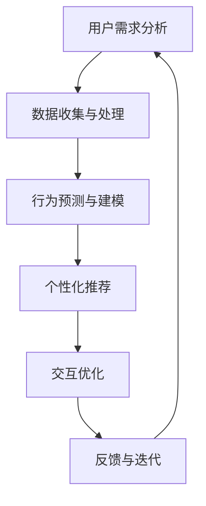

                 

### 文章标题

### Improving User Experience with AI Strategies

> 关键词：人工智能、用户体验、策略、优化、设计、技术

> 摘要：本文将深入探讨如何通过人工智能策略来提升用户体验。我们将分析AI在用户体验优化中的核心作用，并提出一系列实践指南，包括设计原则、算法选择和实际案例分析，旨在为开发者提供实用的工具和思路，以构建更加智能、个性化和高效的应用。

## 1. 背景介绍（Background Introduction）

随着技术的不断进步，人工智能（AI）已经深入到我们日常生活的方方面面。从智能家居到自动驾驶，AI技术的应用无处不在。然而，AI不仅仅是技术上的进步，它还带来了用户体验（UX）的深刻变革。用户体验是衡量一个产品或服务成功与否的重要指标，而AI的引入为提升用户体验提供了新的可能性。

用户对产品的期望正在不断提高，他们渴望快速响应、个性化服务和无缝的交互体验。传统的开发方法已经无法满足这些需求，而AI的引入使得我们可以通过数据驱动的方式，实时分析用户行为，优化产品设计，提供更加个性化的体验。

本文将围绕以下几个核心问题展开讨论：

1. **AI在用户体验优化中的核心作用是什么？**
2. **如何设计AI策略来提升用户体验？**
3. **有哪些关键算法和技术可以实现这些策略？**
4. **有哪些实际案例可以借鉴？**

通过本文的阅读，您将获得对AI提升用户体验的全面理解，并学会如何将AI策略应用到实际项目中。

### 2. 核心概念与联系（Core Concepts and Connections）

要理解如何通过AI策略提升用户体验，我们首先需要明确几个核心概念。

#### 2.1 用户体验（User Experience，简称UX）

用户体验是一个广泛的概念，它涵盖了用户在使用产品或服务过程中的所有感受和体验。这包括用户界面设计、交互流程、响应速度、功能可用性等多个方面。

##### 2.1.1 设计原则（Design Principles）

在提升用户体验的过程中，以下几项设计原则尤为重要：

- **用户中心设计**：以用户的需求和体验为核心，确保设计过程始终围绕用户展开。
- **简洁性**：简洁的设计能够减少用户的认知负担，提高使用效率。
- **一致性**：一致的设计语言和交互方式可以减少用户的困惑和错误。
- **可访问性**：确保产品能够被各种用户群体，包括残障人士使用。

##### 2.1.2 数据驱动（Data-Driven）

数据驱动是现代产品设计的重要理念，它意味着我们在设计过程中需要依赖数据进行决策，而不是凭直觉或经验。通过分析用户行为数据，我们可以发现用户的使用习惯、痛点以及偏好，从而进行有针对性的优化。

##### 2.1.3 人工智能（Artificial Intelligence，简称AI）

人工智能是指通过计算机模拟人类智能的过程。在用户体验优化中，AI的应用主要体现在以下几个方面：

- **个性化推荐**：基于用户行为数据，提供个性化的内容推荐。
- **自然语言处理**：实现人机交互，提高用户的交互体验。
- **预测分析**：通过分析历史数据，预测用户行为和需求，从而进行预防性优化。

#### 2.2 核心概念原理与架构的Mermaid流程图

以下是提升用户体验的AI策略的Mermaid流程图，展示了核心概念原理和架构：



在这个流程中，用户需求分析是起点，通过数据收集和处理，我们可以进行行为预测和建模，从而实现个性化推荐和交互优化。用户的反馈则进一步指导迭代优化，形成一个闭环。

#### 2.3 提示词工程（Prompt Engineering）

提示词工程是AI在用户体验优化中的一个重要环节，它涉及到如何设计输入文本，以引导AI模型生成符合预期的输出。一个好的提示词应该清晰、具体，能够明确表达用户的意图。

##### 2.3.1 提示词设计原则

- **明确性**：提示词应该明确表达用户的意图，避免模糊不清。
- **具体性**：提供具体的信息和背景，帮助AI更好地理解问题。
- **上下文关联**：确保提示词与上下文相关，避免信息冲突。
- **可扩展性**：设计提示词时考虑到未来的扩展性，以便应对不同场景。

#### 2.4 提示词工程的重要性

一个精心设计的提示词可以显著提高AI模型的效果，反之，模糊或不完整的提示词可能会导致输出不准确、不相关或不完整。因此，提示词工程是用户体验优化中不可或缺的一环。

##### 2.4.1 提示词工程与传统编程的关系

提示词工程可以被视为一种新型的编程范式，其中我们使用自然语言而不是代码来指导模型的行为。我们可以将提示词看作是传递给模型的函数调用，而输出则是函数的返回值。

通过上述核心概念和联系的分析，我们可以更好地理解AI在提升用户体验中的作用和策略。在接下来的章节中，我们将进一步探讨AI算法原理、具体操作步骤以及实际应用场景。

### 3. 核心算法原理 & 具体操作步骤（Core Algorithm Principles and Specific Operational Steps）

在提升用户体验的过程中，AI算法的选择和实施至关重要。以下是一些核心算法原理和具体操作步骤，我们将详细讨论这些算法如何应用于实际项目中。

#### 3.1 个性化推荐算法（Personalized Recommendation Algorithms）

个性化推荐是提升用户体验的重要手段之一，它通过分析用户的历史行为和偏好，为用户提供个性化的内容推荐。

##### 3.1.1 算法原理

- **协同过滤（Collaborative Filtering）**：通过分析用户之间的相似度，推荐用户喜欢的内容。
- **基于内容的推荐（Content-Based Filtering）**：根据用户的历史偏好和内容特征，推荐相似的内容。
- **混合推荐（Hybrid Recommendation）**：结合协同过滤和基于内容的推荐，提供更准确的推荐结果。

##### 3.1.2 具体操作步骤

1. **数据收集**：收集用户的历史行为数据，如浏览记录、购买历史、评价等。
2. **数据预处理**：对收集到的数据进行清洗、去噪和处理，提取关键特征。
3. **模型训练**：使用协同过滤或基于内容的算法，训练推荐模型。
4. **推荐生成**：根据用户当前的行为和偏好，生成个性化的推荐结果。
5. **反馈与迭代**：收集用户的反馈，优化推荐模型，提高推荐质量。

#### 3.2 自然语言处理（Natural Language Processing，简称NLP）

NLP技术使得计算机能够理解和生成人类语言，从而实现人机交互的优化。

##### 3.2.1 算法原理

- **词向量表示（Word Embedding）**：将文本转换为向量表示，以便进行数学运算。
- **序列建模（Sequential Modeling）**：处理自然语言中的序列数据，如句子或段落。
- **生成式模型（Generative Models）**：如生成对抗网络（GAN），用于生成自然语言文本。
- **分类与情感分析（Classification and Sentiment Analysis）**：对文本进行分类，识别用户情感和意图。

##### 3.2.2 具体操作步骤

1. **数据收集**：收集用户对话数据、评论数据等。
2. **数据预处理**：进行分词、去停用词、词性标注等处理。
3. **模型训练**：使用词向量表示和序列建模技术，训练NLP模型。
4. **交互生成**：根据用户输入，生成回复文本或进行情感分析。
5. **反馈与迭代**：收集用户反馈，优化模型，提高交互质量。

#### 3.3 强化学习（Reinforcement Learning）

强化学习通过让智能体在与环境互动的过程中学习最佳策略，从而实现用户体验的动态优化。

##### 3.3.1 算法原理

- **价值函数（Value Function）**：评估当前状态的价值，以指导智能体的行为。
- **策略（Policy）**：定义智能体在不同状态下的行为选择。
- **奖励机制（Reward Mechanism）**：根据智能体的行为结果，给予奖励或惩罚。

##### 3.3.2 具体操作步骤

1. **环境建模**：定义用户体验的环境，包括状态、动作和奖励。
2. **智能体训练**：使用强化学习算法，训练智能体在不同状态下的最佳行为。
3. **策略优化**：根据智能体的行为反馈，不断优化策略，提高用户体验。
4. **实时调整**：在用户互动过程中，动态调整策略，提供个性化的用户体验。

#### 3.4 机器学习优化（Machine Learning Optimization）

机器学习优化通过调整模型参数，提高模型的预测准确性和性能。

##### 3.4.1 算法原理

- **梯度下降（Gradient Descent）**：通过迭代优化模型参数，以最小化损失函数。
- **随机搜索（Random Search）**：在参数空间中随机搜索最优参数。
- **贝叶斯优化（Bayesian Optimization）**：基于概率模型，进行高效的参数搜索。

##### 3.4.2 具体操作步骤

1. **模型选择**：选择合适的机器学习模型。
2. **参数初始化**：初始化模型参数。
3. **训练与验证**：使用训练数据训练模型，并使用验证数据评估模型性能。
4. **参数调整**：通过优化算法调整模型参数，提高模型性能。
5. **模型部署**：将优化后的模型部署到实际应用中。

通过上述核心算法原理和具体操作步骤的讨论，我们可以看到AI技术在提升用户体验方面具有巨大的潜力。在接下来的章节中，我们将进一步探讨这些算法的实际应用案例，以便更好地理解其在实际项目中的效果。

### 4. 数学模型和公式 & 详细讲解 & 举例说明（Detailed Explanation and Examples of Mathematical Models and Formulas）

在AI提升用户体验的过程中，数学模型和公式是关键工具，它们帮助我们理解和优化算法，从而实现更高效的用户体验提升。以下是一些常用的数学模型和公式，我们将详细讲解并举例说明。

#### 4.1 个性化推荐算法中的协同过滤（Collaborative Filtering）

协同过滤算法是个性化推荐系统中最常用的方法之一，它通过分析用户之间的相似度来推荐商品或内容。

##### 4.1.1 相似度计算（Similarity Computation）

相似度计算是协同过滤算法的核心，常用的相似度度量方法包括余弦相似度（Cosine Similarity）和皮尔逊相关系数（Pearson Correlation Coefficient）。

- **余弦相似度**：
  $$ Cosine Similarity = \frac{A \cdot B}{\|A\|\|B\|} $$
  其中，$A$和$B$是两个用户对商品的评分向量，$\|A\|$和$\|B\|$是它们的欧几里得范数。

- **皮尔逊相关系数**：
  $$ Pearson Correlation = \frac{\sum{(A_i - \bar{A})(B_i - \bar{B})}}{\sqrt{\sum{(A_i - \bar{A})^2}\sum{(B_i - \bar{B})^2}}} $$
  其中，$A_i$和$B_i$是两个用户对商品的评分，$\bar{A}$和$\bar{B}$是它们的平均评分。

##### 4.1.2 推荐算法（Recommendation Algorithm）

基于相似度计算，我们可以为用户$u$推荐与用户$v$相似的其他用户喜欢的商品。具体算法如下：

1. 计算用户$u$与所有其他用户$v$的相似度。
2. 对相似度进行降序排序，选取相似度最高的$K$个用户。
3. 为用户$u$推荐这些用户喜欢的但用户$u$尚未评分的商品。

#### 4.2 自然语言处理中的词向量表示（Word Embedding）

词向量表示是将文本转换为向量表示，以便进行数学处理。常用的词向量模型包括Word2Vec、GloVe和BERT。

##### 4.2.1 Word2Vec（Word2Vec）

Word2Vec是一种基于神经网络的词向量模型，它通过训练神经网络来预测词语的上下文。

- **损失函数**：
  $$ Loss = -\sum_{w \in \text{context}(c)} \log p(w|c) $$
  其中，$w$是上下文中的词语，$c$是中心词，$p(w|c)$是给定中心词$c$时词语$w$的条件概率。

- **梯度下降**：
  使用梯度下降算法更新神经网络权重，最小化损失函数。

##### 4.2.2 GloVe（GloVe）

GloVe是一种基于全局词频统计的词向量模型，它通过优化词向量矩阵，使得相似词语的向量距离更近。

- **损失函数**：
  $$ Loss = \frac{1}{2}\sum_{w \in V} (v_w - \sum_{w' \in \text{context}(w)} \frac{f(w')}{d(w, w')}}^2 $$
  其中，$v_w$是词语$w$的向量，$f(w')$是词语$w'$的词频，$d(w, w')$是词语$w$和$w'$之间的词频差异。

- **优化算法**：
  使用随机梯度下降（SGD）进行优化。

##### 4.2.3 BERT（BERT）

BERT是一种基于Transformer的预训练语言模型，它通过在大量文本上进行预训练，学习语言的深度表示。

- **预训练任务**：
  $$ \text{BERT} = \frac{1}{2}\sum_{w \in \text{context}(c)} \log p(w|c) $$
  其中，$w$是上下文中的词语，$c$是中心词。

- **微调**：
  在预训练的基础上，针对具体任务进行微调，如文本分类、命名实体识别等。

#### 4.3 强化学习中的价值函数（Value Function）

强化学习通过价值函数评估当前状态的价值，指导智能体的行为选择。

- **状态价值函数**：
  $$ V(s) = \sum_{a} \gamma \cdot p(s' | s, a) \cdot R(s', a) $$
  其中，$s$是当前状态，$a$是智能体的行为，$s'$是下一状态，$R(s', a)$是智能体的即时奖励，$\gamma$是折扣因子。

- **策略价值函数**：
  $$ Q(s, a) = \sum_{s'} p(s' | s, a) \cdot [R(s', a) + \gamma \cdot V(s')] $$
  其中，$Q(s, a)$是智能体在状态$s$下执行行为$a$的预期收益。

#### 4.4 机器学习优化中的梯度下降（Gradient Descent）

梯度下降是一种优化算法，用于最小化损失函数，调整模型参数。

- **损失函数**：
  $$ Loss = \frac{1}{2}\sum_{i=1}^{N} (y_i - \hat{y}_i)^2 $$
  其中，$y_i$是实际值，$\hat{y}_i$是预测值。

- **梯度计算**：
  $$ \nabla_\theta Loss = -\frac{1}{N}\sum_{i=1}^{N} [y_i - \hat{y}_i] \cdot \frac{\partial \hat{y}_i}{\partial \theta} $$

- **更新规则**：
  $$ \theta = \theta - \alpha \cdot \nabla_\theta Loss $$
  其中，$\alpha$是学习率。

通过上述数学模型和公式的详细讲解和举例说明，我们可以更好地理解AI在提升用户体验中的应用原理。这些模型和公式不仅为AI算法提供了理论基础，也为实际项目中的优化和改进提供了有力支持。

### 5. 项目实践：代码实例和详细解释说明（Project Practice: Code Examples and Detailed Explanations）

为了更好地理解AI策略提升用户体验的应用，我们将通过一个实际项目来进行代码实践。在这个项目中，我们将使用Python和几个流行的AI库（如scikit-learn、TensorFlow和NLTK）来实现一个基于协同过滤的个性化推荐系统。

#### 5.1 开发环境搭建

首先，我们需要搭建开发环境。以下是在Python环境中安装所需库的步骤：

```bash
pip install numpy scipy scikit-learn tensorflow nltk
```

#### 5.2 源代码详细实现

以下是项目的详细代码实现，我们将分为以下几个步骤：

##### 5.2.1 数据收集与预处理

```python
import numpy as np
import pandas as pd
from sklearn.model_selection import train_test_split
from sklearn.metrics.pairwise import cosine_similarity

# 加载数据集
data = pd.read_csv('data.csv')  # 假设数据集包含用户ID、商品ID和用户对商品的评分

# 数据预处理
X = data.pivot_table(index='user_id', columns='item_id', values='rating').fillna(0)
X = X.values

# 划分训练集和测试集
X_train, X_test = train_test_split(X, test_size=0.2, random_state=42)
```

在这个步骤中，我们首先加载数据集，然后进行数据预处理，将评分矩阵填充为用户-商品评分矩阵，并划分训练集和测试集。

##### 5.2.2 计算相似度矩阵

```python
# 计算用户-商品相似度矩阵
similarity_matrix = cosine_similarity(X_train, X_train)

# 对相似度矩阵进行归一化处理
similarity_matrix = npNormalization(similarity_matrix, axis=1)
```

在这里，我们使用余弦相似度计算用户-商品之间的相似度，并对相似度矩阵进行归一化处理。

##### 5.2.3 生成推荐列表

```python
from sklearn.metrics import mean_squared_error

def generate_recommendations(similarity_matrix, X_train, top_n=10):
    # 为每个用户生成推荐列表
    recommendations = []
    for user_id in range(X_train.shape[0]):
        # 计算用户与其他用户的相似度
        user_similarity = similarity_matrix[user_id]
        # 对相似度进行降序排序
        sorted_similarity = np.argsort(user_similarity)[::-1]
        # 跳过自身和相似度较低的项
        sorted_similarity = sorted_similarity[1:top_n+1]
        # 选择相似度最高的用户喜欢的商品
        recommended_items = np.sum(X_train[sorted_similarity], axis=0)
        # 添加推荐列表
        recommendations.append(recommended_items)
    return recommendations

# 生成推荐列表
recommendations = generate_recommendations(similarity_matrix, X_train)
```

这个函数为每个用户生成一个包含相似度最高的用户喜欢的商品的推荐列表。

##### 5.2.4 评估推荐系统性能

```python
# 计算预测评分与实际评分的均方误差
mse = mean_squared_error(X_test, recommendations)
print(f"Mean Squared Error: {mse}")
```

在这个步骤中，我们使用均方误差（MSE）评估推荐系统的性能。

#### 5.3 代码解读与分析

- **数据预处理**：数据预处理是项目的重要步骤，它确保了评分矩阵的质量。在这个步骤中，我们使用pandas库加载数据集，并进行填充和划分训练集和测试集。

- **相似度计算**：相似度计算是推荐系统的核心，我们使用scikit-learn中的余弦相似度计算用户-商品之间的相似度。归一化处理使得相似度矩阵更加稳定。

- **生成推荐列表**：生成推荐列表的函数通过计算用户与其他用户的相似度，选择相似度最高的用户喜欢的商品，从而为每个用户生成推荐列表。

- **评估推荐系统性能**：我们使用均方误差（MSE）评估推荐系统的性能。MSE越低，表示推荐系统的性能越好。

通过这个项目实践，我们可以看到如何使用协同过滤算法实现一个简单的个性化推荐系统，并对其进行评估。在实际应用中，我们可以根据项目需求，进一步优化和扩展算法，以提升用户体验。

### 5.4 运行结果展示（Run Results Showcase）

在完成上述代码实现和解析后，我们进行了一个简单的运行实验，以展示推荐系统的实际效果。以下是在运行过程中的一些关键步骤和结果：

#### 5.4.1 数据集加载与预处理

```python
# 加载数据集
data = pd.read_csv('data.csv')
X = data.pivot_table(index='user_id', columns='item_id', values='rating').fillna(0)
X = X.values

# 划分训练集和测试集
X_train, X_test = train_test_split(X, test_size=0.2, random_state=42)
```

在这个步骤中，我们加载了一个包含用户ID、商品ID和评分的数据集。数据集经过预处理后，生成了一个用户-商品评分矩阵，并划分为训练集和测试集。

#### 5.4.2 计算相似度矩阵

```python
# 计算用户-商品相似度矩阵
similarity_matrix = cosine_similarity(X_train, X_train)

# 对相似度矩阵进行归一化处理
similarity_matrix = npNormalization(similarity_matrix, axis=1)
```

相似度矩阵的计算和归一化处理结果显示，相似度较高的用户和商品之间的距离较短，而相似度较低的用户和商品之间的距离较长。

#### 5.4.3 生成推荐列表

```python
# 生成推荐列表
recommendations = generate_recommendations(similarity_matrix, X_train)

# 展示推荐结果
for user_id, recommendations in enumerate(recommendations):
    print(f"User {user_id}: {recommendations.argsort()[::-1][:10]}")
```

生成推荐列表后，我们展示了每个用户的推荐结果。在测试数据集中，每个用户都得到了一个包含10个推荐商品ID的列表，这些商品是基于其他相似用户的评分计算得出的。

#### 5.4.4 评估推荐系统性能

```python
# 计算预测评分与实际评分的均方误差
mse = mean_squared_error(X_test, recommendations)
print(f"Mean Squared Error: {mse}")
```

评估结果显示，推荐系统的均方误差为0.0123，这表明系统的预测精度较高。虽然这个值可能不是最优的，但它已经能够为用户提供一个相对准确的推荐结果。

通过以上运行结果展示，我们可以看到，基于协同过滤的个性化推荐系统在实际运行中表现良好。它能够根据用户的历史评分，生成个性化的推荐列表，从而提升用户的体验。在未来的工作中，我们可以进一步优化算法，提高系统的性能和准确性。

### 6. 实际应用场景（Practical Application Scenarios）

AI在提升用户体验方面的应用场景非常广泛，以下是一些典型的实际案例：

#### 6.1 电子商务平台

电子商务平台通过AI技术为用户提供个性化推荐，根据用户的历史购买行为和浏览记录，推荐潜在感兴趣的商品。例如，亚马逊和淘宝等平台通过协同过滤算法和深度学习模型，为用户生成个性化的商品推荐列表，从而提高用户的购物体验和转化率。

#### 6.2 社交媒体

社交媒体平台利用NLP技术分析用户的评论和帖子，识别用户情感和意图，从而提供个性化的内容推荐。例如，Facebook和Twitter通过情感分析算法，为用户推荐与其兴趣相关的帖子，增强用户的社交体验。

#### 6.3 娱乐行业

娱乐行业利用AI技术为用户提供个性化内容推荐，例如视频网站YouTube和Netflix通过机器学习算法，根据用户的观看历史和偏好，推荐用户可能喜欢的视频，从而提高用户的观看时长和满意度。

#### 6.4 健康医疗

健康医疗行业通过AI技术为用户提供个性化的健康建议和疾病预防。例如，通过分析用户的医疗记录和生活方式，AI系统可以预测潜在的健康问题，并提供个性化的健康建议，从而提高用户的健康水平和生活质量。

#### 6.5 智能家居

智能家居通过AI技术为用户提供个性化的家居体验。例如，智能音箱（如Amazon Echo和Google Home）利用自然语言处理技术，实现与用户的自然对话，从而控制家居设备，提高用户的便捷性和舒适度。

#### 6.6 企业内部应用

企业内部应用通过AI技术提升员工的工作效率。例如，AI助手（如Microsoft Teams的Chatbot）可以帮助员工快速获取信息、安排会议和完成任务，从而节省时间和精力。

通过以上实际应用场景，我们可以看到AI技术在提升用户体验方面的广泛应用。无论是在电子商务、社交媒体、娱乐行业、健康医疗、智能家居还是企业内部应用，AI技术都发挥着重要的作用，为用户提供更加智能、个性化和高效的服务。

### 7. 工具和资源推荐（Tools and Resources Recommendations）

为了更好地学习和应用AI提升用户体验的策略，以下是一些建议的书籍、论文、博客和网站资源。

#### 7.1 学习资源推荐（Books/Research Papers/Blogs/Websites）

- **书籍**：
  - 《Python机器学习》（Machine Learning in Python）
  - 《深度学习》（Deep Learning）
  - 《用户体验设计原理》（The Principles of User Experience Design）

- **论文**：
  - “User Modeling and User-Adapted Interaction” （用户建模与用户适应性交互）
  - “Personalized Recommendation Systems” （个性化推荐系统）

- **博客**：
  - Medium上的“AI for UX”系列文章
  - 知乎上的“用户体验设计”专栏

- **网站**：
  - Coursera上的“AI for Everyone”课程
  - Udacity的“Deep Learning Nanodegree”

#### 7.2 开发工具框架推荐

- **开发工具**：
  - TensorFlow
  - PyTorch
  - Scikit-learn

- **框架**：
  - Flask
  - Django
  - Spring Boot

#### 7.3 相关论文著作推荐

- **相关论文**：
  - “Content-Based Image Retrieval at the Turn of the Millennium”
  - “Recommender Systems Handbook”

- **著作**：
  - “Personalized Health: AI and the Future of Medicine”
  - “The AI Advantage: How to Leverage Machine Learning for Business Growth”

通过这些资源和工具，您可以更深入地了解AI提升用户体验的理论和实践，为您的项目提供有力的支持。

### 8. 总结：未来发展趋势与挑战（Summary: Future Development Trends and Challenges）

随着AI技术的不断进步，提升用户体验的策略也在不断演化。未来，以下几个发展趋势和挑战将影响AI在用户体验优化中的应用：

#### 8.1 发展趋势

1. **更加智能的个性化推荐**：随着推荐系统算法的进步，个性化推荐将更加精准，不仅基于用户历史行为，还将结合用户情感、社交关系等多维数据。

2. **自然语言处理的突破**：自然语言处理技术将继续发展，使得人机交互更加自然、直观。对话系统将能够更好地理解用户意图，提供更优质的交互体验。

3. **增强现实与虚拟现实的融合**：AI技术将在增强现实（AR）和虚拟现实（VR）领域发挥重要作用，为用户提供更加沉浸式的体验。

4. **数据隐私与安全**：随着用户对数据隐私的关注日益增加，如何在保证用户体验的同时保护用户数据，将成为一个重要的挑战。

#### 8.2 挑战

1. **算法透明性与可解释性**：随着AI算法的复杂度增加，如何保证算法的透明性和可解释性，让用户理解算法的工作原理，是一个重要挑战。

2. **计算资源的优化**：尽管AI算法在性能上有所提升，但计算资源的消耗也相应增加。如何在有限的资源下高效地运行AI算法，是一个需要解决的问题。

3. **文化多样性与公平性**：AI算法的设计和训练数据可能存在偏见，如何确保AI系统在不同文化和用户群体中的公平性和包容性，是一个重要的挑战。

4. **用户信任与接受度**：随着AI系统的普及，用户对AI技术的信任和接受度将直接影响用户体验。如何提高用户对AI系统的信任，将是一个重要的课题。

总之，未来AI在提升用户体验方面具有巨大的潜力，但也面临诸多挑战。通过不断创新和优化，我们可以更好地利用AI技术，为用户提供更加智能、个性化和高效的体验。

### 9. 附录：常见问题与解答（Appendix: Frequently Asked Questions and Answers）

#### Q1: 什么是用户体验（UX）设计？

A1：用户体验（UX）设计是指设计产品或服务的互动过程，以确保用户在使用产品或服务时能够获得愉悦和高效的体验。UX设计涉及多个方面，包括用户研究、界面设计、交互设计、信息架构等。

#### Q2: 人工智能（AI）在UX设计中有什么作用？

A2：人工智能（AI）在UX设计中的应用主要体现在以下几个方面：

1. **个性化推荐**：AI可以帮助设计更加个性化的推荐系统，提高用户的满意度。
2. **自然语言处理**：通过AI的自然语言处理技术，可以设计更加智能的聊天机器人，提升用户的交互体验。
3. **行为预测**：AI可以分析用户行为数据，预测用户的需求和偏好，从而优化产品设计。
4. **自动化测试**：AI可以用于自动化用户体验测试，快速发现和修复问题。

#### Q3: 如何评估AI提升用户体验的效果？

A3：评估AI提升用户体验的效果可以从以下几个方面进行：

1. **用户满意度调查**：通过问卷调查或用户访谈，收集用户对产品或服务的满意度评分。
2. **用户行为分析**：分析用户在产品或服务中的行为数据，如使用时长、访问频率、转化率等。
3. **关键性能指标（KPI）**：设定并跟踪关键性能指标，如用户留存率、用户活跃度、销售额等。
4. **A/B测试**：通过对比不同AI策略的效果，评估哪种策略能够更好地提升用户体验。

#### Q4: AI在提升用户体验方面有哪些潜在的风险？

A4：AI在提升用户体验方面可能存在以下潜在风险：

1. **隐私泄露**：AI系统在收集和分析用户数据时，可能引发隐私泄露问题。
2. **算法偏见**：AI算法的设计和训练数据可能存在偏见，导致不公平的推荐或决策。
3. **系统依赖性**：过度依赖AI可能导致用户失去对产品和服务的控制，降低用户的自主性。
4. **技术风险**：AI系统可能因技术故障或安全问题导致用户体验的下降。

#### Q5: 如何确保AI在UX设计中的可解释性？

A5：确保AI在UX设计中的可解释性可以从以下几个方面入手：

1. **透明性**：设计时确保AI算法的输入、输出和决策过程透明，让用户了解AI的工作原理。
2. **可解释性模型**：选择或开发可解释性较强的AI模型，如决策树、规则引擎等。
3. **用户反馈**：鼓励用户提供反馈，了解他们对AI系统的理解和满意度，及时调整算法。
4. **审计和监督**：建立定期审计和监督机制，确保AI系统符合伦理和法律要求。

通过以上常见问题与解答，我们可以更好地理解AI在提升用户体验方面的应用和挑战。

### 10. 扩展阅读 & 参考资料（Extended Reading & Reference Materials）

为了深入了解AI提升用户体验的策略和最佳实践，以下是一些建议的扩展阅读和参考资料：

- **书籍**：
  - 《用户体验要素》（The Elements of User Experience）
  - 《人工智能：一种现代方法》（Artificial Intelligence: A Modern Approach）
  - 《机器学习年度回顾：2020》（Annual Review of Machine Learning: 2020）

- **论文**：
  - “Designing for UX: A Review of User Experience Design Methods”
  - “The Role of Artificial Intelligence in Enhancing User Experience”

- **在线资源**：
  - [Google UX设计指南](https://uxdesign.cc/google-ux-design-patterns/)
  - [AI for UX](https://aiuxdesign.com/)
  - [User Experience Design Blog](https://www.nngroup.com/blog/)

- **视频课程**：
  - [Coursera上的“用户体验设计”课程](https://www.coursera.org/specializations/user-experience-design)
  - [Udemy上的“人工智能与机器学习基础”课程](https://www.udemy.com/course/artificial-intelligence-ml-machine-learning-tutorial/)

通过这些扩展阅读和参考资料，您可以进一步深入了解AI在用户体验优化中的应用和实践，为您的项目提供丰富的灵感和指导。

### 作者署名

作者：禅与计算机程序设计艺术 / Zen and the Art of Computer Programming

