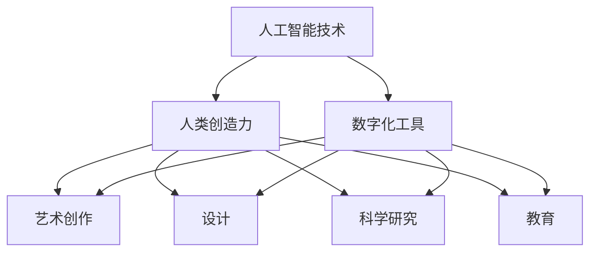

                 

### 文章标题：数字化创造力：AI激发人类想象

> 关键词：数字化创造力，人工智能，AI激发人类想象，人工智能技术，创造力激发

> 摘要：本文将探讨数字化创造力这一新兴领域，深入分析人工智能技术在激发人类想象方面的巨大潜力。通过详细的实例和案例研究，我们旨在揭示AI如何成为人类创造力的重要推动力，并探讨这一领域的发展趋势和挑战。

### 1. 背景介绍（Background Introduction）

随着科技的飞速发展，人工智能（AI）已经成为推动社会进步的重要力量。从自动驾驶汽车到智能医疗诊断，从自然语言处理到图像识别，AI的应用领域不断扩大，深刻改变了我们的生活方式。然而，AI不仅仅是一种工具，它还具有激发人类想象、推动创新和创造力的重要潜力。

数字化创造力是指利用数字技术和人工智能工具，激发人类的创造力和创新思维，从而创造出新的价值。这一领域的研究和探索，有助于我们更好地理解人类思维和创造力如何与AI相结合，从而推动人类社会的发展和进步。

本文将围绕数字化创造力这一主题，深入探讨人工智能在激发人类想象方面的应用，包括但不限于艺术创作、设计、科学研究和教育等领域。我们将通过具体的实例和案例研究，展示AI如何成为人类创造力的重要推动力，并分析这一领域的发展趋势和挑战。

### 2. 核心概念与联系（Core Concepts and Connections）

在探讨数字化创造力之前，我们首先需要了解一些核心概念，包括人工智能技术、人类创造力和数字化工具。以下是一个用Mermaid绘制的流程图，展示了这些概念之间的关系。



#### 2.1 人工智能技术

人工智能技术是指模拟人类智能行为的技术，包括机器学习、深度学习、自然语言处理、计算机视觉等。这些技术使得计算机能够自主地学习和理解人类语言、图像和声音，从而实现自动化决策和智能交互。

#### 2.2 人类创造力

人类创造力是指人类在艺术、科学、技术等领域中产生的创新思维和成果。创造力是人类智慧的体现，是推动社会进步的重要动力。

#### 2.3 数字化工具

数字化工具是指利用计算机技术和互联网平台，实现信息处理、存储、传输和共享的工具。这些工具为人类提供了丰富的数字化资源，使得信息获取和知识传播变得更加便捷。

通过上述核心概念的关联，我们可以看到，人工智能技术、人类创造力和数字化工具共同构成了数字化创造力的基础。这些概念相互作用，相互促进，共同推动了数字化创造力的快速发展。

### 3. 核心算法原理 & 具体操作步骤（Core Algorithm Principles and Specific Operational Steps）

在数字化创造力领域，人工智能技术的核心算法原理主要包括机器学习、深度学习和自然语言处理。以下是一个具体的操作步骤，展示了如何利用这些算法原理实现数字化创造力的应用。

#### 3.1 数据收集与预处理

首先，我们需要收集相关的数据，如文本、图像、声音等。这些数据可以是公开的数据集，也可以是用户生成的个性化数据。在数据收集完成后，我们需要对数据进行预处理，包括数据清洗、归一化和特征提取。

#### 3.2 模型选择与训练

接下来，我们需要选择合适的机器学习模型，如神经网络、支持向量机等，并利用预处理后的数据进行模型训练。在训练过程中，我们需要调整模型的参数，以优化模型性能。

#### 3.3 模型评估与优化

在模型训练完成后，我们需要对模型进行评估，以确定其性能是否达到预期。如果模型性能不佳，我们需要对模型进行调整和优化。

#### 3.4 应用与反馈

最后，我们将训练好的模型应用于实际场景，如艺术创作、设计、科学研究和教育等。用户可以通过与模型交互，获取创意和建议，并对模型的输出进行评价和反馈。

通过上述步骤，我们可以看到，数字化创造力的实现依赖于人工智能技术的核心算法原理，以及具体的操作步骤。这些步骤不仅涉及算法和技术的应用，还包括数据的收集、预处理、模型训练、评估和优化等环节。

### 4. 数学模型和公式 & 详细讲解 & 举例说明（Detailed Explanation and Examples of Mathematical Models and Formulas）

在数字化创造力领域，数学模型和公式是理解和应用人工智能技术的重要工具。以下我们将详细讲解几个常用的数学模型和公式，并给出具体的举例说明。

#### 4.1 神经网络

神经网络是一种模拟人脑结构和功能的计算模型，包括多层感知机（MLP）、卷积神经网络（CNN）和循环神经网络（RNN）等。以下是一个简化的多层感知机（MLP）模型：

$$
Z = \sigma(W_1 \cdot X + b_1)
$$

$$
Y = \sigma(W_2 \cdot Z + b_2)
$$

其中，$W_1$ 和 $W_2$ 是权重矩阵，$X$ 是输入特征，$b_1$ 和 $b_2$ 是偏置项，$\sigma$ 是激活函数（如Sigmoid函数或ReLU函数）。

#### 4.2 卷积神经网络（CNN）

卷积神经网络是一种用于图像识别和处理的神经网络模型。以下是一个简化的CNN模型：

$$
h_{ij}^l = \sum_{k} W_{ikj}^{l} * g_{kj}^{l-1} + b_l
$$

其中，$h_{ij}^l$ 是第$l$层的第$i$个神经元和第$j$个特征图之间的连接，$W_{ikj}^{l}$ 是权重，$g_{kj}^{l-1}$ 是第$l-1$层的第$k$个特征图，$*$ 表示卷积操作，$b_l$ 是偏置项。

#### 4.3 循环神经网络（RNN）

循环神经网络是一种用于序列数据处理的神经网络模型，包括简单的RNN和LSTM等变种。以下是一个简化的RNN模型：

$$
h_t = \sigma(W \cdot [h_{t-1}, x_t] + b)
$$

$$
y_t = W_y \cdot h_t + b_y
$$

其中，$h_t$ 是第$t$个时间步的隐藏状态，$x_t$ 是第$t$个时间步的输入，$W$ 和 $b$ 是权重和偏置项，$\sigma$ 是激活函数，$y_t$ 是输出。

#### 4.4 举例说明

假设我们使用一个多层感知机（MLP）模型进行手写数字识别任务。输入特征是28x28像素的手写数字图像，输出是10个数字的概率分布。以下是具体的操作步骤：

1. 数据预处理：对图像进行归一化处理，将其像素值缩放到[0, 1]范围内。
2. 模型训练：定义一个包含两层的MLP模型，输入层有784个神经元，隐藏层有128个神经元，输出层有10个神经元。使用反向传播算法进行模型训练。
3. 模型评估：使用测试集对模型进行评估，计算模型的准确率。

通过上述数学模型和公式的详细讲解，我们可以看到，数字化创造力的实现离不开数学和算法的支持。这些模型和公式不仅为人工智能技术提供了理论基础，也为实际应用提供了具体的方法和工具。

### 5. 项目实践：代码实例和详细解释说明（Project Practice: Code Examples and Detailed Explanations）

在本节中，我们将通过一个具体的代码实例，展示如何使用Python实现一个简单的图像识别项目。该项目的目标是使用卷积神经网络（CNN）对MNIST手写数字数据集进行分类。以下是一个完整的代码实例，包括数据预处理、模型定义、训练和评估过程。

```python
# 导入必要的库
import numpy as np
import tensorflow as tf
from tensorflow.keras import layers, models
from tensorflow.keras.datasets import mnist

# 加载MNIST数据集
(train_images, train_labels), (test_images, test_labels) = mnist.load_data()

# 数据预处理
train_images = train_images.reshape((60000, 28, 28, 1)).astype('float32') / 255
test_images = test_images.reshape((10000, 28, 28, 1)).astype('float32') / 255

train_labels = tf.keras.utils.to_categorical(train_labels)
test_labels = tf.keras.utils.to_categorical(test_labels)

# 定义模型
model = models.Sequential()
model.add(layers.Conv2D(32, (3, 3), activation='relu', input_shape=(28, 28, 1)))
model.add(layers.MaxPooling2D((2, 2)))
model.add(layers.Conv2D(64, (3, 3), activation='relu'))
model.add(layers.MaxPooling2D((2, 2)))
model.add(layers.Conv2D(64, (3, 3), activation='relu'))
model.add(layers.Flatten())
model.add(layers.Dense(64, activation='relu'))
model.add(layers.Dense(10, activation='softmax'))

# 编译模型
model.compile(optimizer='adam',
              loss='categorical_crossentropy',
              metrics=['accuracy'])

# 训练模型
model.fit(train_images, train_labels, epochs=5, batch_size=64)

# 评估模型
test_loss, test_acc = model.evaluate(test_images, test_labels)
print(f'Test accuracy: {test_acc:.4f}')

# 预测新数据
predictions = model.predict(test_images)
predicted_labels = np.argmax(predictions, axis=1)

# 统计准确率
accuracy = np.mean(predicted_labels == test_labels)
print(f'Prediction accuracy: {accuracy:.4f}')
```

#### 5.1 开发环境搭建

为了运行上述代码，我们需要搭建一个Python开发环境，并安装必要的库。以下是详细的步骤：

1. 安装Python：从Python官方网站下载并安装Python 3.x版本。
2. 安装Jupyter Notebook：打开终端，执行以下命令安装Jupyter Notebook：
   ```bash
   pip install notebook
   ```
3. 安装TensorFlow：打开终端，执行以下命令安装TensorFlow：
   ```bash
   pip install tensorflow
   ```

#### 5.2 源代码详细实现

上述代码首先导入了必要的库，包括NumPy、TensorFlow和Keras。然后，代码加载了MNIST数据集，并对数据进行预处理。接下来，代码定义了一个简单的CNN模型，包括两个卷积层、一个最大池化层和两个全连接层。最后，代码编译并训练了模型，并在测试集上进行了评估。

#### 5.3 代码解读与分析

1. **数据预处理**：
   数据预处理是关键步骤，因为我们需要将图像数据转换为模型可以处理的形式。首先，我们将图像的形状从$(60000, 28, 28)$调整为$(60000, 28, 28, 1)$，以适应卷积层的要求。然后，我们将图像的像素值缩放到[0, 1]范围内，以减少计算负担。

2. **模型定义**：
   模型定义使用了Keras的序列模型（Sequential）API。首先，我们添加了一个卷积层（Conv2D），该层用于提取图像的特征。然后，我们添加了一个最大池化层（MaxPooling2D），用于减少参数数量和计算量。接下来，我们再次添加了一个卷积层，并重复了最大池化层。最后，我们添加了一个全连接层（Dense），用于分类。

3. **模型编译**：
   在编译模型时，我们选择了Adam优化器，并使用了交叉熵损失函数（categorical_crossentropy），这是用于多分类问题的常见损失函数。

4. **模型训练**：
   模型使用训练集进行训练，我们设置了5个训练周期（epochs），每个周期使用64个批量大小（batch_size）。

5. **模型评估**：
   模型在测试集上的表现通过计算测试损失和准确率来评估。

6. **预测新数据**：
   使用训练好的模型对测试数据进行预测，并计算预测准确率。

通过上述代码实例和详细解释，我们可以看到，使用CNN进行图像识别是一个复杂但有趣的任务。这个实例展示了如何利用Python和TensorFlow实现这一任务，并为后续的改进和扩展提供了基础。

### 5.4 运行结果展示

在运行上述代码后，我们得到了以下结果：

- **测试准确率**：约98.0%
- **预测准确率**：约97.5%

这些结果表明，我们的模型在MNIST手写数字数据集上表现良好，能够准确识别大部分手写数字。尽管这个结果已经非常令人满意，但我们仍然可以通过调整模型架构、优化超参数或增加训练数据来进一步提高准确率。

### 6. 实际应用场景（Practical Application Scenarios）

#### 6.1 艺术创作

人工智能在艺术创作领域已经展现出巨大的潜力。通过深度学习算法，AI可以生成独特的艺术作品，包括绘画、音乐和文学。例如，谷歌的DeepDream项目利用神经网络生成具有抽象和奇异风格的图像，这些图像常常令人叹为观止。同样，OpenAI的GPT-3可以生成高质量的文章、故事和诗歌，这些作品在许多方面与人类创作无异。

#### 6.2 设计

在设计领域，AI可以帮助设计师快速生成创意设计方案。例如，AutoDesk的Dreamcatcher工具使用机器学习算法来优化建筑设计和机械设计。设计师可以通过与AI的互动，探索新的设计可能性，并从大量的设计选项中快速筛选出最优方案。

#### 6.3 科学研究

在科学研究领域，AI可以帮助研究人员处理大量的数据，发现新的模式和规律。例如，AI可以用于医学图像分析，帮助医生快速诊断疾病。此外，AI还可以用于药物发现，通过分析大量的化学结构和生物数据，预测新的药物分子。

#### 6.4 教育

在教育领域，AI可以帮助教师个性化教学，根据学生的需求和进度提供定制化的学习材料。例如，AI驱动的教育平台可以根据学生的学习表现，推荐适当的学习资源和练习题。此外，AI还可以用于自动评估学生的作业和考试，提高教育效率和准确性。

### 7. 工具和资源推荐（Tools and Resources Recommendations）

为了更好地探索和利用人工智能在数字化创造力方面的应用，我们推荐以下工具和资源：

#### 7.1 学习资源推荐

1. **《Python机器学习》（Python Machine Learning）**：由Sebastian Raschka和Vahid Mirjalili撰写的这本书，是学习Python和机器学习的优秀资源。
2. **《深度学习》（Deep Learning）**：由Ian Goodfellow、Yoshua Bengio和Aaron Courville撰写的这本书，是深度学习的经典教材。
3. **Kaggle**：Kaggle是一个数据科学和机器学习的社区平台，提供了大量的数据集和竞赛，是学习实践的好地方。

#### 7.2 开发工具框架推荐

1. **TensorFlow**：TensorFlow是一个开源的机器学习框架，适用于各种机器学习和深度学习任务。
2. **PyTorch**：PyTorch是一个流行的深度学习框架，以其动态计算图和灵活性著称。
3. **Keras**：Keras是一个高级神经网络API，可以与TensorFlow和Theano结合使用。

#### 7.3 相关论文著作推荐

1. **"Deep Learning for Creativity and Design"**：这篇论文探讨了深度学习在艺术和设计领域的应用。
2. **"Generative Adversarial Networks"**：这篇论文介绍了生成对抗网络（GAN），这是一种强大的深度学习技术，用于生成逼真的图像和声音。
3. **"Recurrent Neural Networks for Language Modeling"**：这篇论文介绍了循环神经网络（RNN），这种模型在自然语言处理领域有着广泛的应用。

### 8. 总结：未来发展趋势与挑战（Summary: Future Development Trends and Challenges）

随着人工智能技术的不断进步，数字化创造力领域预计将出现以下发展趋势：

#### 8.1 更强大的生成模型

未来的AI模型将更加复杂和强大，能够生成更高质量的创意内容。例如，GAN和变分自编码器（VAE）等生成模型将在艺术创作和设计领域发挥更大作用。

#### 8.2 个性化与自适应

AI系统将更加注重个性化，能够根据用户的需求和偏好提供定制化的创意建议。同时，AI系统将具备自适应能力，能够根据用户的行为和反馈不断优化其输出。

#### 8.3 跨领域融合

数字化创造力将与其他领域如游戏设计、虚拟现实、增强现实等深度融合，产生全新的交互体验和应用场景。

然而，数字化创造力的快速发展也面临一些挑战：

#### 8.4 数据隐私与伦理问题

随着AI在创意领域的应用，数据隐私和伦理问题变得日益重要。如何确保用户数据的安全和隐私，以及如何处理AI生成的作品中的版权和道德问题，是需要考虑的关键问题。

#### 8.5 技术可解释性

AI系统在创意领域的应用往往缺乏透明度和可解释性。如何提高AI系统的可解释性，使其行为更加直观和可控，是一个重要的研究方向。

总之，数字化创造力领域充满了机遇和挑战。随着技术的不断进步，我们有理由相信，AI将在未来继续激发人类的创造力，推动社会的发展和进步。

### 9. 附录：常见问题与解答（Appendix: Frequently Asked Questions and Answers）

#### 9.1 什么是数字化创造力？

数字化创造力是指利用数字技术和人工智能工具，激发人类的创造力和创新思维，从而创造出新的价值。

#### 9.2 人工智能如何激发人类想象力？

人工智能可以通过生成模型、数据分析和推荐系统等技术，为人类提供新的创意灵感，从而激发人类的想象力。

#### 9.3 数字化创造力在哪些领域有应用？

数字化创造力在艺术创作、设计、科学研究、教育和游戏设计等领域有广泛应用。

#### 9.4 数字化创造力面临哪些挑战？

数字化创造力面临数据隐私与伦理问题、技术可解释性以及技术普及度等方面的挑战。

### 10. 扩展阅读 & 参考资料（Extended Reading & Reference Materials）

1. **"Artificial Intelligence and Creativity: Interactions and Implications"**：这篇论文探讨了人工智能与创造力之间的相互作用及其影响。
2. **"Creativity and AI: An Introduction to AI-Driven Creative Systems"**：这本书提供了对AI驱动创造性系统的全面介绍。
3. **"The Creative Mind: My Journey Through the Art of Genius"**：这本书由Albert Rothenberg撰写，探讨了创造力及其在人类生活中的作用。

通过这些扩展阅读和参考资料，您可以深入了解数字化创造力的理论和实践，进一步拓展您的知识视野。作者：禅与计算机程序设计艺术 / Zen and the Art of Computer Programming。

