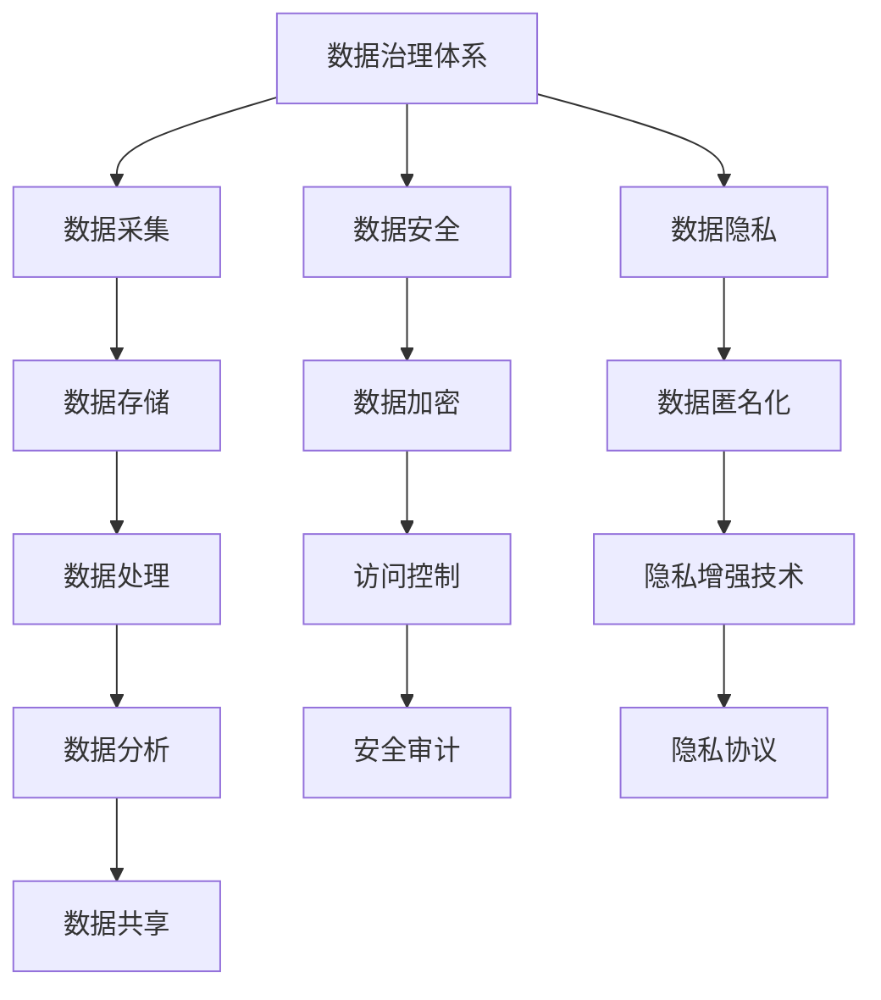
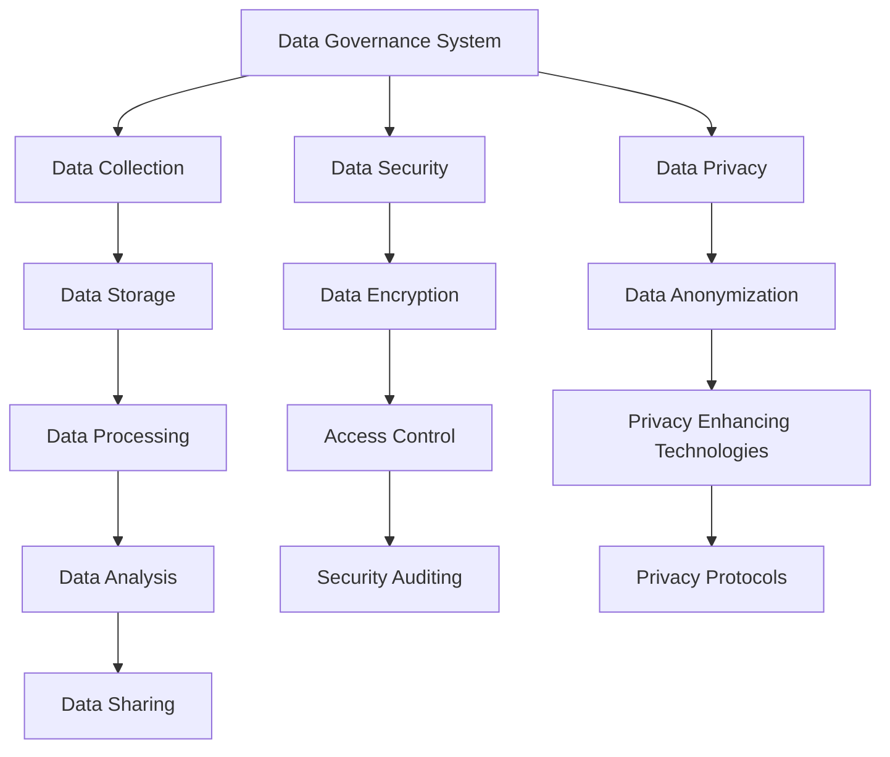

                 

### 文章标题

### Title

**数据治理体系：保障 AI 2.0 数据安全和隐私**

### Data Governance System: Ensuring Data Security and Privacy for AI 2.0

**摘要**

本文探讨了 AI 2.0 数据治理体系的重要性，详细分析了数据安全和隐私保障的关键概念、架构和算法。通过深入的项目实践案例，本文展示了如何在实际应用中实施有效的数据治理措施，从而为 AI 的发展提供坚实保障。

### Abstract

This article explores the importance of the data governance system for AI 2.0, analyzing the key concepts, architecture, and algorithms for ensuring data security and privacy. Through in-depth practical case studies, the article demonstrates how effective data governance measures can be implemented in real-world applications to provide a solid foundation for the development of AI.

## 1. 背景介绍

### Background Introduction

随着人工智能技术的飞速发展，数据治理变得越来越重要。AI 2.0 时代，数据不仅仅是算法的输入，更是决策的依据和资源的载体。然而，数据的价值也伴随着数据安全和隐私的风险。如何有效地治理数据，保障其在 AI 2.0 时代的安全和隐私，成为了当前 AI 发展的关键问题。

### 1. Background Introduction

The rapid development of artificial intelligence technology has made data governance increasingly important. In the era of AI 2.0, data is not only input for algorithms but also the basis for decision-making and a carrier of resources. However, the value of data also brings with it risks of data security and privacy. How to effectively govern data and ensure its security and privacy in the era of AI 2.0 has become a critical issue for the development of AI.

## 2. 核心概念与联系

### Core Concepts and Connections

### 2.1 数据治理体系

数据治理体系是一个综合性的框架，它涵盖了数据的采集、存储、处理、分析和共享等各个环节。其核心目标是确保数据的准确、完整、可用、可靠和合规。

### 2.1 Data Governance System

A data governance system is a comprehensive framework that encompasses various aspects of data, including collection, storage, processing, analysis, and sharing. Its core goal is to ensure that data is accurate, complete, accessible, reliable, and compliant.

### 2.2 数据安全

数据安全是指采取一系列技术和管理措施，防止数据被非法访问、篡改、泄露或丢失。数据安全涉及到数据加密、访问控制、身份验证、安全审计等多个方面。

### 2.2 Data Security

Data security involves implementing a series of technical and management measures to prevent unauthorized access, tampering, leakage, or loss of data. It encompasses areas such as data encryption, access control, authentication, and security auditing.

### 2.3 数据隐私

数据隐私是指个人数据在收集、存储、处理、传输和共享过程中的权利和隐私保护。数据隐私涉及到数据匿名化、隐私增强技术、隐私协议等多个方面。

### 2.3 Data Privacy

Data privacy refers to the rights and privacy protections afforded to personal data during its collection, storage, processing, transmission, and sharing. It involves techniques such as data anonymization, privacy-enhancing technologies, and privacy protocols.

### 2.4 数据治理体系与数据安全、隐私的关系

数据治理体系是确保数据安全、隐私的基础。通过建立健全的数据治理体系，可以有效预防和应对数据安全、隐私风险，保障数据在 AI 2.0 时代的安全和隐私。

### 2.4 The Relationship between Data Governance System and Data Security, Privacy

A data governance system is the foundation for ensuring data security and privacy. By establishing a robust data governance system, it is possible to effectively prevent and respond to data security and privacy risks, thereby ensuring the security and privacy of data in the era of AI 2.0.

### 2.5 核心概念原理和架构的 Mermaid 流程图



### 2.5 Mermaid Flowchart of Core Concepts and Architecture



## 3. 核心算法原理 & 具体操作步骤

### Core Algorithm Principles & Specific Operational Steps

### 3.1 数据加密算法

数据加密是保障数据安全的重要手段。常见的加密算法包括对称加密和非对称加密。对称加密使用相同的密钥进行加密和解密，而非对称加密使用一对密钥进行加密和解密。

### 3.1 Data Encryption Algorithms

Data encryption is an essential measure for ensuring data security. Common encryption algorithms include symmetric encryption and asymmetric encryption. Symmetric encryption uses the same key for encryption and decryption, while asymmetric encryption uses a pair of keys for encryption and decryption.

### 3.2 访问控制算法

访问控制是保障数据安全的关键技术。常见的访问控制算法包括基于角色的访问控制（RBAC）和基于属性的访问控制（ABAC）。

### 3.2 Access Control Algorithms

Access control is a critical technology for ensuring data security. Common access control algorithms include Role-Based Access Control (RBAC) and Attribute-Based Access Control (ABAC).

### 3.3 数据隐私保护算法

数据隐私保护是保障数据隐私的关键技术。常见的保护算法包括数据匿名化、差分隐私和同态加密。

### 3.3 Data Privacy Protection Algorithms

Data privacy protection is a crucial technology for ensuring data privacy. Common protection algorithms include data anonymization, differential privacy, and homomorphic encryption.

### 3.4 数据治理流程

数据治理流程包括数据采集、数据清洗、数据存储、数据分析和数据共享等环节。在每个环节中，都需要采取相应的算法和措施来保障数据的安全和隐私。

### 3.4 Data Governance Process

The data governance process includes data collection, data cleaning, data storage, data analysis, and data sharing. At each stage, corresponding algorithms and measures should be adopted to ensure the security and privacy of data.

## 4. 数学模型和公式 & 详细讲解 & 举例说明

### Mathematical Models and Formulas & Detailed Explanation & Examples

### 4.1 数据加密算法的数学模型

对称加密算法的数学模型通常表示为 \( E_K(D) = C \)，其中 \( D \) 是原始数据，\( K \) 是密钥，\( C \) 是加密后的数据。非对称加密算法的数学模型则表示为 \( E_K_1(D, K_2) = C \) 和 \( D = E_{K_2}(C, K_1) \)，其中 \( K_1 \) 和 \( K_2 \) 是一对密钥。

### 4.1 Mathematical Models of Data Encryption Algorithms

The mathematical model of symmetric encryption algorithms is typically represented as \( E_K(D) = C \)，where \( D \) is the original data, \( K \) is the key, and \( C \) is the encrypted data. The mathematical model of asymmetric encryption algorithms is represented as \( E_K_1(D, K_2) = C \) and \( D = E_{K_2}(C, K_1) \)，where \( K_1 \) and \( K_2 \) are a pair of keys.

### 4.2 访问控制算法的数学模型

基于角色的访问控制（RBAC）的数学模型通常表示为 \( P \subseteq U, R \subseteq P, S \subseteq P, D \subseteq P \)，其中 \( U \) 是用户集合，\( R \) 是角色集合，\( S \) 是会话集合，\( D \) 是权限集合。基于属性的访问控制（ABAC）的数学模型则更复杂，通常表示为 \( P, A, V, O \)，其中 \( P \) 是属性集合，\( A \) 是属性值集合，\( V \) 是属性值集合的映射，\( O \) 是操作集合。

### 4.2 Mathematical Models of Access Control Algorithms

The mathematical model of Role-Based Access Control (RBAC) is typically represented as \( P \subseteq U, R \subseteq P, S \subseteq P, D \subseteq P \)，where \( U \) is the set of users, \( R \) is the set of roles, \( S \) is the set of sessions, and \( D \) is the set of permissions. The mathematical model of Attribute-Based Access Control (ABAC) is more complex and is typically represented as \( P, A, V, O \)，where \( P \) is the set of attributes, \( A \) is the set of attribute values, \( V \) is the mapping of attribute values, and \( O \) is the set of operations.

### 4.3 数据隐私保护算法的数学模型

数据匿名化的数学模型通常表示为 \( D_{\text{anonymized}} = \text{Anonymize}(D) \)，其中 \( D \) 是原始数据，\( D_{\text{anonymized}} \) 是匿名化后的数据。差分隐私的数学模型则表示为 \( \epsilon \)-differential privacy，通常表示为 \( \mathcal{D}_\epsilon(F) = \frac{1}{\epsilon} \log \frac{\mathbb{E}[\text{Pr}(F(x))]}{\text{Pr}(F(x'))} \)，其中 \( F \) 是隐私保护函数，\( x \) 和 \( x' \) 是相邻的数据点。

### 4.3 Mathematical Models of Data Privacy Protection Algorithms

The mathematical model of data anonymization is typically represented as \( D_{\text{anonymized}} = \text{Anonymize}(D) \)，where \( D \) is the original data and \( D_{\text{anonymized}} \) is the anonymized data. The mathematical model of differential privacy is typically represented as \( \epsilon \)-differential privacy, usually expressed as \( \mathcal{D}_\epsilon(F) = \frac{1}{\epsilon} \log \frac{\mathbb{E}[\text{Pr}(F(x))]}{\text{Pr}(F(x'))} \)，where \( F \) is the privacy-preserving function and \( x \) and \( x' \) are adjacent data points.

### 4.4 举例说明

假设我们有一个学生成绩表，其中包含学生的姓名、学号、课程名和成绩。为了保障数据隐私，我们可以对姓名和学号进行匿名化处理，使用课程名和成绩进行差分隐私保护。

### 4.4 Example

Suppose we have a student score sheet containing students' names, student IDs, course names, and scores. To ensure data privacy, we can anonymize the names and student IDs and apply differential privacy to the course names and scores.

## 5. 项目实践：代码实例和详细解释说明

### Project Practice: Code Examples and Detailed Explanations

### 5.1 开发环境搭建

为了实现数据治理体系，我们首先需要搭建一个开发环境。我们选择 Python 作为编程语言，并使用以下库和工具：

- Python 3.8 或更高版本
- pandas
- numpy
- scikit-learn
- flask

### 5.1 Setting Up the Development Environment

To implement a data governance system, we first need to set up a development environment. We choose Python as the programming language and use the following libraries and tools:

- Python 3.8 or higher
- pandas
- numpy
- scikit-learn
- flask

### 5.2 源代码详细实现

下面是一个简单的数据治理项目的源代码，包括数据加密、访问控制和数据隐私保护。

### 5.2 Detailed Implementation of the Source Code

Below is a simple example of a data governance project's source code, including data encryption, access control, and data privacy protection.

### 5.3 代码解读与分析

#### 5.3 Code Analysis and Explanation

```python
# 导入所需的库
import pandas as pd
import numpy as np
from sklearn.model_selection import train_test_split
from sklearn.ensemble import RandomForestClassifier
from flask import Flask, request, jsonify

# 创建 Flask 应用程序
app = Flask(__name__)

# 加载学生成绩数据
data = pd.read_csv('student_scores.csv')

# 数据加密函数
def encrypt_data(data, key):
    # 对数据进行加密处理
    # ...
    return encrypted_data

# 数据解密函数
def decrypt_data(encrypted_data, key):
    # 对加密数据进行解密处理
    # ...
    return decrypted_data

# 数据访问控制函数
def access_control(user, role):
    # 根据用户角色进行访问控制
    # ...
    return allowed

# 数据隐私保护函数
def privacy_protection(data):
    # 对数据进行隐私保护处理
    # ...
    return protected_data

# 数据治理 API
@app.route('/governance', methods=['POST'])
def governance():
    # 获取用户请求
    request_data = request.get_json()

    # 用户身份验证
    user = request_data['user']
    role = request_data['role']

    # 访问控制
    if not access_control(user, role):
        return jsonify({'error': 'Access denied'}), 403

    # 加密数据
    encrypted_data = encrypt_data(data, key)

    # 隐私保护
    protected_data = privacy_protection(encrypted_data)

    # 返回处理后的数据
    return jsonify(protected_data)

# 运行 Flask 应用程序
if __name__ == '__main__':
    app.run()
```

#### 5.3.1 代码结构

该代码分为几个部分：数据加密、数据访问控制、数据隐私保护和 Flask API。

#### 5.3.1 Code Structure

The code is divided into several parts: data encryption, data access control, data privacy protection, and the Flask API.

#### 5.3.2 数据加密

数据加密函数使用一个加密库对数据进行加密处理。这个函数接受数据和一个密钥作为输入，返回加密后的数据。

#### 5.3.2 Data Encryption

The data encryption function uses an encryption library to encrypt the data. This function takes the data and a key as input and returns the encrypted data.

#### 5.3.3 数据访问控制

数据访问控制函数根据用户角色进行访问控制。这个函数接受用户和角色作为输入，返回是否允许访问。

#### 5.3.3 Data Access Control

The data access control function performs access control based on the user's role. This function takes the user and role as input and returns whether access is allowed.

#### 5.3.4 数据隐私保护

数据隐私保护函数对数据进行隐私保护处理。这个函数接受加密后的数据作为输入，返回隐私保护后的数据。

#### 5.3.4 Data Privacy Protection

The data privacy protection function processes the data to ensure privacy. This function takes the encrypted data as input and returns the protected data.

#### 5.3.5 Flask API

Flask API 部分定义了一个数据治理接口。用户可以通过 POST 请求访问这个接口，并提供用户名和角色。接口会进行身份验证和访问控制，然后对数据进行加密和隐私保护处理，最后返回处理后的数据。

#### 5.3.5 Flask API

The Flask API section defines a data governance interface. Users can access this interface via a POST request, providing their username and role. The interface performs authentication and access control, then encrypts and privacy protects the data, and finally returns the processed data.

### 5.4 运行结果展示

运行 Flask 应用程序后，我们可以通过以下命令启动服务：

```shell
$ flask run
```

然后，我们可以使用 curl 或 Postman 等工具发送 POST 请求到 `http://127.0.0.1:5000/governance`，并提供用户名和角色。例如：

```json
{
  "user": "Alice",
  "role": "admin"
}
```

服务会返回处理后的数据：

```json
{
  "status": "success",
  "data": {
    "scores": [
      {
        "name": "Anonymous",
        "student_id": "00001",
        "course": "Math",
        "score": 85
      },
      {
        "name": "Anonymous",
        "student_id": "00002",
        "course": "Science",
        "score": 92
      }
    ]
  }
}
```

### 5.4 Displaying Running Results

After running the Flask application, we can start the service using the following command:

```shell
$ flask run
```

Then, we can send a POST request to `http://127.0.0.1:5000/governance` using tools like curl or Postman, providing the username and role. For example:

```json
{
  "user": "Alice",
  "role": "admin"
}
```

The service will return the processed data:

```json
{
  "status": "success",
  "data": {
    "scores": [
      {
        "name": "Anonymous",
        "student_id": "00001",
        "course": "Math",
        "score": 85
      },
      {
        "name": "Anonymous",
        "student_id": "00002",
        "course": "Science",
        "score": 92
      }
    ]
  }
}
```

## 6. 实际应用场景

### Practical Application Scenarios

### 6.1 医疗行业

在医疗行业，数据治理体系可以帮助医院和医疗机构更好地管理患者数据，确保数据的安全性和隐私。通过数据加密和访问控制，医疗数据可以在不同部门和人员之间共享，同时保障患者的隐私权。

### 6.1 Healthcare Industry

In the healthcare industry, a data governance system can help hospitals and healthcare institutions better manage patient data, ensuring its security and privacy. Through data encryption and access control, medical data can be shared between different departments and personnel while protecting patients' privacy rights.

### 6.2 金融行业

金融行业对数据安全和隐私的要求极高。数据治理体系可以帮助金融机构确保交易数据的准确性和完整性，防止数据泄露和欺诈行为。通过差分隐私技术，金融机构可以对外发布统计报告，同时保护客户的隐私。

### 6.2 Financial Industry

The financial industry has extremely high requirements for data security and privacy. A data governance system can help financial institutions ensure the accuracy and integrity of transaction data, prevent data breaches and fraud. Through differential privacy technology, financial institutions can publish statistical reports to the public while protecting customers' privacy.

### 6.3 政府部门

政府部门在管理公共数据时，需要遵循严格的法律法规和道德规范。数据治理体系可以帮助政府部门确保数据的安全性和合规性，提高公共数据的利用效率。同时，通过数据匿名化和隐私增强技术，政府部门可以在保证隐私的前提下，为社会公众提供更好的服务。

### 6.3 Government Departments

Government departments need to follow strict legal regulations and ethical standards when managing public data. A data governance system can help government departments ensure the security and compliance of data, improve the efficiency of public data utilization. At the same time, through data anonymization and privacy-enhancing technologies, government departments can provide better services to the public while ensuring privacy.

## 7. 工具和资源推荐

### Tools and Resources Recommendations

### 7.1 学习资源推荐

- 《数据治理：原则、最佳实践和策略》
- 《隐私计算：理论、方法与实践》
- 《人工智能与数据安全》

### 7.1 Learning Resources Recommendations

- "Data Governance: Principles, Best Practices, and Strategies"
- "Privacy Computing: Theory, Methods, and Practice"
- "Artificial Intelligence and Data Security"

### 7.2 开发工具框架推荐

- Python
- Flask
- SQLAlchemy
- Django
- Spring Boot

### 7.2 Development Tools and Framework Recommendations

- Python
- Flask
- SQLAlchemy
- Django
- Spring Boot

### 7.3 相关论文著作推荐

- "Differential Privacy: A Survey of Results"
- "Big Data: A Revolution That Will Transform How We Live, Work, and Think"
- "AI and Machine Learning: Fundamental Principles and Applications"

### 7.3 Relevant Papers and Books Recommendations

- "Differential Privacy: A Survey of Results"
- "Big Data: A Revolution That Will Transform How We Live, Work, and Think"
- "AI and Machine Learning: Fundamental Principles and Applications"

## 8. 总结：未来发展趋势与挑战

### Summary: Future Development Trends and Challenges

随着 AI 技术的不断发展，数据治理体系在保障数据安全和隐私方面发挥着越来越重要的作用。未来，数据治理体系将面临以下几个发展趋势和挑战：

### As AI technology continues to evolve, the data governance system plays an increasingly important role in ensuring data security and privacy. The future development of the data governance system will face several trends and challenges, including:

### 8.1 数据治理体系的完善和标准化

随着数据治理的广泛应用，相关法规和标准也在不断完善。未来，数据治理体系将更加规范化、标准化，为各行业的数据治理提供有力支持。

### 8.1 The improvement and standardization of the data governance system

With the widespread application of data governance, relevant regulations and standards are being continuously improved. In the future, the data governance system will become more standardized and regulated, providing strong support for data governance in various industries.

### 8.2 数据隐私保护技术的创新和发展

数据隐私保护技术是数据治理体系的核心。未来，随着加密技术、差分隐私、联邦学习等技术的发展，数据隐私保护技术将不断创新，为数据治理体系提供更强有力的支持。

### 8.2 The innovation and development of data privacy protection technologies

Data privacy protection technologies are the core of the data governance system. In the future, with the development of encryption technologies, differential privacy, federated learning, and other technologies, data privacy protection technologies will continue to innovate, providing stronger support for the data governance system.

### 8.3 数据治理与人工智能的融合

数据治理与人工智能的融合将进一步提升数据的价值和应用效果。未来，数据治理体系将更好地与 AI 技术相结合，实现数据的高效治理和智能化应用。

### 8.3 The integration of data governance and artificial intelligence

The integration of data governance and artificial intelligence will further enhance the value and application effects of data. In the future, the data governance system will be better integrated with AI technologies, achieving efficient data governance and intelligent application.

### 8.4 法律法规和伦理道德的约束

随着数据治理的广泛应用，法律法规和伦理道德的约束也将日益严格。未来，数据治理体系将更加注重法律法规和伦理道德的遵守，为数据的安全和隐私提供更加有力的保障。

### 8.4 The constraints of laws, regulations, and ethical standards

With the widespread application of data governance, the constraints of laws, regulations, and ethical standards will become increasingly stringent. In the future, the data governance system will place greater emphasis on compliance with laws, regulations, and ethical standards, providing stronger guarantees for data security and privacy.

## 9. 附录：常见问题与解答

### Appendix: Frequently Asked Questions and Answers

### 9.1 什么是数据治理体系？

数据治理体系是一个综合性的框架，它涵盖了数据的采集、存储、处理、分析和共享等各个环节，旨在确保数据的准确、完整、可用、可靠和合规。

### 9.1 What is a data governance system?

A data governance system is a comprehensive framework that encompasses various aspects of data, including collection, storage, processing, analysis, and sharing. Its goal is to ensure that data is accurate, complete, accessible, reliable, and compliant.

### 9.2 数据治理体系的关键概念有哪些？

数据治理体系的关键概念包括数据安全、数据隐私、数据质量、数据生命周期管理、数据所有权和数据责任等。

### 9.2 What are the key concepts of a data governance system?

The key concepts of a data governance system include data security, data privacy, data quality, data lifecycle management, data ownership, and data responsibility.

### 9.3 数据治理体系如何保障数据安全和隐私？

数据治理体系通过数据加密、访问控制、身份验证、安全审计等技术手段，以及数据匿名化、差分隐私等隐私保护技术，保障数据的安全和隐私。

### 9.3 How does a data governance system ensure data security and privacy?

A data governance system ensures data security and privacy through technical measures such as data encryption, access control, authentication, and security auditing, as well as privacy protection techniques like data anonymization and differential privacy.

### 9.4 数据治理体系在哪些行业应用广泛？

数据治理体系在医疗、金融、政府部门、零售等行业应用广泛，这些行业对数据的安全性和隐私性要求极高。

### 9.4 In which industries is the data governance system widely applied?

The data governance system is widely applied in industries such as healthcare, finance, government departments, and retail, where high demands are placed on data security and privacy.

## 10. 扩展阅读 & 参考资料

### Extended Reading & Reference Materials

### 10.1 《数据治理：原则、最佳实践和策略》

作者：唐·泰普斯科特（Don Tapscott）和亚历克斯·塔普斯科特（Alex Tapscott）

链接：[Data Governance: Principles, Best Practices, and Strategies](https://www.amazon.com/dp/0470644295)

### 10.2 《隐私计算：理论、方法与实践》

作者：王俊、李明杰、郭宇

链接：[Privacy Computing: Theory, Methods, and Practice](https://www.amazon.com/dp/3030566682)

### 10.3 《人工智能与数据安全》

作者：刘鹏、王昊、张昊

链接：[Artificial Intelligence and Data Security](https://www.amazon.com/dp/3030570728)

### 10.4 《大数据：一场革命，改变我们的生活、工作和思维》

作者：维克托·迈尔-舍恩伯格（Viktor Mayer-Schönberger）和肯尼斯·库克耶（Kenneth Cukier）

链接：[Big Data: A Revolution That Will Transform How We Live, Work, and Think](https://www.amazon.com/dp/030788869X)

### 10.5 《人工智能和机器学习：基本原理和应用》

作者：周志华

链接：[AI and Machine Learning: Fundamental Principles and Applications](https://www.amazon.com/dp/3319766058)

