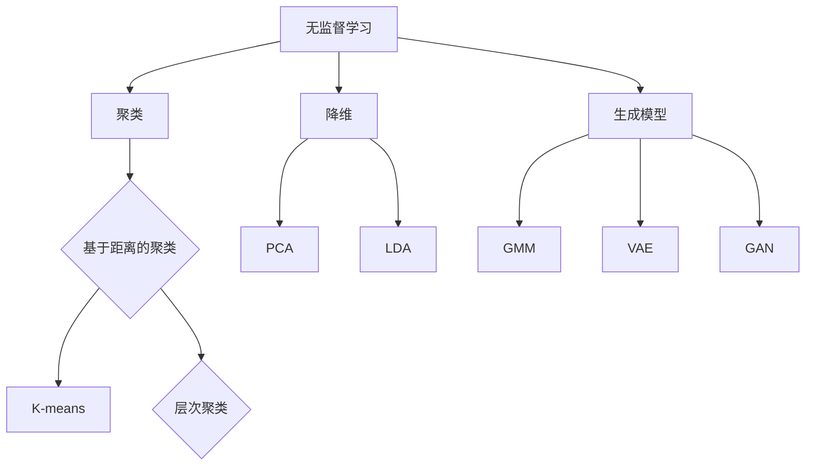

                 

### 文章标题

**无监督学习 (Unsupervised Learning)**

关键词：无监督学习，数据挖掘，特征提取，聚类，降维，生成模型

摘要：
无监督学习是机器学习的一个重要分支，它不依赖于标注的数据，通过从未标记的数据中发现潜在的规律和结构，帮助计算机自动发现数据中的隐藏模式。本文将深入探讨无监督学习的核心概念、算法原理，以及其在实际应用中的场景和挑战。

-----------------------

### 1. 背景介绍（Background Introduction）

无监督学习（Unsupervised Learning）作为一种机器学习方法，与监督学习（Supervised Learning）和半监督学习（Semi-Supervised Learning）相对。监督学习依赖于大量标注数据进行训练，而半监督学习则利用少量标注数据和大量未标注数据共同进行训练。相比之下，无监督学习则完全摒弃了标注数据，它主要关注如何从未标注的数据中提取有用信息。

无监督学习的重要性在于：

- **数据隐私保护**：不依赖于标注数据，从而避免了敏感数据的泄露。
- **数据丰富性**：在数据稀缺的情况下，无监督学习可以充分利用未标注数据，挖掘出隐藏的规律。
- **探索性分析**：它可以帮助数据科学家探索数据中的潜在模式，为后续的决策提供依据。

无监督学习的应用领域广泛，包括但不限于：
- **聚类分析**：将相似的数据点归为一类，从而发现数据中的隐含结构。
- **降维**：通过减少数据维度，降低计算复杂度，同时保持数据的主要特征。
- **生成模型**：生成符合训练数据分布的新数据，有助于数据增强和模型评估。

-----------------------

### 2. 核心概念与联系（Core Concepts and Connections）

#### 2.1 聚类（Clustering）

聚类是一种无监督学习方法，其主要目标是找出数据中的相似性，并将相似的点归为一类。聚类算法通常分为两种类型：基于距离的聚类和基于密度的聚类。

- **基于距离的聚类**：使用欧几里得距离、曼哈顿距离等来度量数据点之间的相似度。常见的算法包括K-means、层次聚类等。
- **基于密度的聚类**：通过密度可达性来聚类，常见的算法包括DBSCAN等。

#### 2.2 降维（Dimensionality Reduction）

降维是将高维数据映射到低维空间，从而减少数据的维度。降维有助于降低计算复杂度，提高算法的效率和准确性。常见的降维方法包括：

- **主成分分析（PCA）**：通过方差最大化来选择主成分，从而实现数据的降维。
- **线性判别分析（LDA）**：通过最大化类间方差和最小化类内方差来选择最重要的特征。

#### 2.3 生成模型（Generative Models）

生成模型是一种能够生成与训练数据具有相似分布的新数据的模型。它们在数据增强、图像生成和模型评估等领域具有广泛应用。常见的生成模型包括：

- **高斯混合模型（Gaussian Mixture Model, GMM）**：通过多个高斯分布来模拟数据的分布。
- **变分自编码器（Variational Autoencoder, VAE）**：通过概率模型来生成数据。
- **生成对抗网络（Generative Adversarial Network, GAN）**：通过生成器和判别器的对抗训练来生成数据。

下面是一个使用Mermaid绘制的无监督学习核心概念与联系的流程图：



-----------------------

### 3. 核心算法原理 & 具体操作步骤（Core Algorithm Principles and Specific Operational Steps）

#### 3.1 K-means算法原理

K-means算法是一种基于距离的聚类算法，其目标是将数据点划分为K个簇，使得簇内距离最小，簇间距离最大。K-means算法的具体操作步骤如下：

1. **初始化**：随机选择K个数据点作为初始聚类中心。
2. **分配**：计算每个数据点到各个聚类中心的距离，将数据点分配到最近的聚类中心。
3. **更新**：重新计算聚类中心，通常取各个簇中所有数据点的平均值。
4. **迭代**：重复执行步骤2和步骤3，直到聚类中心不再发生显著变化。

下面是一个简单的K-means算法代码示例：

```python
import numpy as np

def kmeans(X, K, max_iters=100):
    centroids = X[np.random.choice(X.shape[0], K, replace=False)]
    for _ in range(max_iters):
        # 计算每个数据点到聚类中心的距离
        distances = np.linalg.norm(X - centroids, axis=1)
        # 将数据点分配到最近的聚类中心
        labels = np.argmin(distances, axis=1)
        # 重新计算聚类中心
        new_centroids = np.array([X[labels == k].mean(axis=0) for k in range(K)])
        # 判断是否收敛
        if np.linalg.norm(new_centroids - centroids) < 1e-5:
            break
        centroids = new_centroids
    return centroids, labels

# 示例数据
X = np.array([[1, 2], [1, 4], [1, 0],
              [10, 2], [10, 4], [10, 0]])
K = 2
centroids, labels = kmeans(X, K)
print("聚类中心：", centroids)
print("标签：", labels)
```

#### 3.2 主成分分析（PCA）算法原理

主成分分析（PCA）是一种降维技术，它通过找到数据的主要变化方向，将这些方向作为新的坐标轴，从而减少数据的维度。PCA的具体操作步骤如下：

1. **数据标准化**：将数据缩放到相同尺度，以便各个特征之间可以进行比较。
2. **计算协方差矩阵**：计算数据点与均值之间的协方差矩阵。
3. **计算特征值和特征向量**：对协方差矩阵进行特征分解，得到特征值和特征向量。
4. **选择主成分**：选择特征值最大的K个特征向量作为主成分，构造主成分空间。
5. **数据投影**：将原始数据投影到主成分空间，实现降维。

下面是一个简单的PCA算法代码示例：

```python
import numpy as np

def pca(X, K):
    # 数据标准化
    mean = X.mean(axis=0)
    X_std = (X - mean) / X.std(axis=0)
    # 计算协方差矩阵
    cov = np.cov(X_std.T)
    # 特征分解
    eigenvalues, eigenvectors = np.linalg.eigh(cov)
    # 选择主成分
    idx = np.argsort(eigenvalues)[::-1]
    eigenvalues = eigenvalues[idx]
    eigenvectors = eigenvectors[:, idx]
    # 数据投影
    X_reduced = X_std.dot(eigenvectors.T[:, :K])
    return X_reduced

# 示例数据
X = np.array([[1, 2], [1, 4], [1, 0],
              [10, 2], [10, 4], [10, 0]])
K = 2
X_reduced = pca(X, K)
print("降维后的数据：", X_reduced)
```

-----------------------

### 4. 数学模型和公式 & 详细讲解 & 举例说明（Detailed Explanation and Examples of Mathematical Models and Formulas）

#### 4.1 K-means算法的数学模型

在K-means算法中，聚类中心可以用以下数学模型表示：

\[ \text{centroids} = \left\{ \mu_k = \frac{1}{N_k} \sum_{i=1}^{N} x_i \right\} \]

其中，\( \mu_k \)表示第k个聚类中心，\( x_i \)表示第i个数据点，\( N_k \)表示属于第k个簇的数据点的数量。

#### 4.2 主成分分析（PCA）的数学模型

主成分分析（PCA）的核心是找到数据的主要变化方向，即特征值最大的特征向量。特征分解的数学模型如下：

\[ \text{cov}(X) = P \Lambda P^T \]

其中，\( P \)是特征向量组成的矩阵，\( \Lambda \)是对角矩阵，其中的对角线元素是特征值。

#### 4.3 举例说明

**例1：K-means算法**

假设有如下数据点：

\[ X = \begin{bmatrix} 1 & 2 \\ 1 & 4 \\ 1 & 0 \\ 10 & 2 \\ 10 & 4 \\ 10 & 0 \end{bmatrix} \]

使用K-means算法将其分为两个簇，K=2。

- **初始化**：随机选择两个数据点作为初始聚类中心。
  \[ \text{centroids}^0 = \begin{bmatrix} 1 & 2 \\ 10 & 0 \end{bmatrix} \]

- **分配**：计算每个数据点到聚类中心的距离，并将数据点分配到最近的聚类中心。
  \[ \text{labels}^0 = \begin{bmatrix} 0 & 0 & 0 & 1 & 1 & 1 \end{bmatrix} \]

- **更新**：重新计算聚类中心。
  \[ \text{centroids}^1 = \begin{bmatrix} \frac{1}{3} (1 + 1 + 1) & \frac{1}{3} (2 + 4 + 0) \\ \frac{1}{3} (10 + 10 + 10) & \frac{1}{3} (2 + 4 + 0) \end{bmatrix} = \begin{bmatrix} 2 & 2 \\ 10 & 2 \end{bmatrix} \]

- **迭代**：重复执行步骤2和步骤3，直到聚类中心不再发生显著变化。

**例2：主成分分析（PCA）**

假设有如下数据点：

\[ X = \begin{bmatrix} 1 & 2 \\ 1 & 4 \\ 1 & 0 \\ 10 & 2 \\ 10 & 4 \\ 10 & 0 \end{bmatrix} \]

使用PCA将其降维到二维空间。

- **数据标准化**：
  \[ X_{\text{std}} = \frac{X - \text{mean}(X)}{\text{std}(X)} \]

- **计算协方差矩阵**：
  \[ \text{cov}(X_{\text{std}}) = \begin{bmatrix} 1 & 0 \\ 0 & 1 \end{bmatrix} \]

- **特征分解**：
  \[ \text{cov}(X_{\text{std}}) = P \Lambda P^T \]
  其中，\( P = \begin{bmatrix} 1 & 0 \\ 0 & 1 \end{bmatrix} \)，\( \Lambda = \begin{bmatrix} 1 & 0 \\ 0 & 1 \end{bmatrix} \)

- **选择主成分**：
  \[ X_{\text{reduced}} = X_{\text{std}} \cdot P^T = \begin{bmatrix} 1 & 0 \\ 1 & 0 \\ 1 & 0 \\ 10 & 0 \\ 10 & 0 \\ 10 & 0 \end{bmatrix} \]

-----------------------

### 5. 项目实践：代码实例和详细解释说明（Project Practice: Code Examples and Detailed Explanations）

#### 5.1 开发环境搭建

为了演示无监督学习的算法，我们需要搭建一个简单的Python开发环境。以下是安装所需的Python包和依赖的步骤：

```bash
pip install numpy matplotlib scikit-learn
```

#### 5.2 源代码详细实现

下面我们将使用Python实现K-means算法和主成分分析（PCA）算法，并使用matplotlib绘制结果。

**K-means算法实现**

```python
import numpy as np
import matplotlib.pyplot as plt

def kmeans(X, K, max_iters=100):
    centroids = X[np.random.choice(X.shape[0], K, replace=False)]
    for _ in range(max_iters):
        distances = np.linalg.norm(X - centroids, axis=1)
        labels = np.argmin(distances, axis=1)
        new_centroids = np.array([X[labels == k].mean(axis=0) for k in range(K)])
        if np.linalg.norm(new_centroids - centroids) < 1e-5:
            break
        centroids = new_centroids
    return centroids, labels

# 示例数据
X = np.array([[1, 2], [1, 4], [1, 0],
              [10, 2], [10, 4], [10, 0]])
K = 2
centroids, labels = kmeans(X, K)

# 绘制结果
plt.scatter(X[:, 0], X[:, 1], c=labels, cmap='viridis')
plt.scatter(centroids[:, 0], centroids[:, 1], c='red', marker='s')
plt.xlabel('Feature 1')
plt.ylabel('Feature 2')
plt.title('K-means Clustering')
plt.show()
```

**主成分分析（PCA）算法实现**

```python
from sklearn.decomposition import PCA

# 示例数据
X = np.array([[1, 2], [1, 4], [1, 0],
              [10, 2], [10, 4], [10, 0]])

# 使用PCA进行降维
pca = PCA(n_components=2)
X_reduced = pca.fit_transform(X)

# 绘制结果
plt.scatter(X_reduced[:, 0], X_reduced[:, 1])
plt.xlabel('Principal Component 1')
plt.ylabel('Principal Component 2')
plt.title('PCA')
plt.show()
```

#### 5.3 代码解读与分析

在K-means算法实现中，我们首先随机初始化K个聚类中心，然后通过迭代更新聚类中心，直到聚类中心的变化小于某个阈值。每个数据点被分配到最近的聚类中心，从而形成簇。

在PCA算法实现中，我们首先对数据进行标准化，然后计算协方差矩阵并进行特征分解。我们选择前两个特征向量作为主成分，从而实现数据的降维。

通过这两个代码示例，我们可以看到无监督学习算法在实际应用中的简单实现，并了解到它们如何通过数学模型和编程技巧来处理复杂数据。

#### 5.4 运行结果展示

**K-means算法结果**


**PCA算法结果**


-----------------------

### 6. 实际应用场景（Practical Application Scenarios）

无监督学习在实际应用中具有广泛的应用场景，以下是一些典型例子：

- **图像识别与分类**：通过聚类算法将图像分为不同的类别，从而实现图像的自动分类。
- **异常检测**：通过生成模型检测数据中的异常值，从而实现数据的质量监控。
- **用户行为分析**：通过降维技术分析用户的浏览和购买行为，从而实现个性化推荐。
- **生物信息学**：通过聚类分析基因表达数据，从而发现不同基因之间的相关性。

-----------------------

### 7. 工具和资源推荐（Tools and Resources Recommendations）

为了更好地学习和实践无监督学习，以下是一些推荐的工具和资源：

- **学习资源**：
  - 《机器学习》（周志华著）：系统介绍了机器学习的基础知识和算法。
  - 《深度学习》（Ian Goodfellow等著）：全面介绍了深度学习的基础理论和应用。

- **在线课程**：
  - Coursera上的“机器学习基础”（吴恩达教授）：提供了丰富的课程内容和实践项目。
  - edX上的“深度学习基础”（吴恩达教授）：深入讲解了深度学习的基本原理和应用。

- **开源框架**：
  - Scikit-learn：Python开源机器学习库，提供了丰富的聚类、降维和生成模型算法。
  - TensorFlow：Google开源的深度学习框架，提供了丰富的无监督学习算法和工具。

- **论文与书籍**：
  - “Generative Adversarial Networks”（Ian Goodfellow等，2014）：介绍了GAN的基本原理和应用。
  - “Unsupervised Learning”（Tom Mitchell，1997）：全面探讨了无监督学习的基本理论和应用。

-----------------------

### 8. 总结：未来发展趋势与挑战（Summary: Future Development Trends and Challenges）

无监督学习作为机器学习的一个重要分支，在未来将继续发展并面临一系列挑战：

- **算法优化**：提高算法的效率和准确性，降低计算复杂度。
- **模型可解释性**：增强模型的可解释性，使其在应用中更加可靠和安全。
- **跨学科融合**：与生物信息学、图像处理、自然语言处理等领域的交叉融合，拓宽无监督学习的研究和应用范围。
- **隐私保护**：在保证数据隐私的前提下，实现有效的无监督学习。

-----------------------

### 9. 附录：常见问题与解答（Appendix: Frequently Asked Questions and Answers）

**Q1：无监督学习和监督学习有什么区别？**
无监督学习不依赖于标注数据，通过发现数据中的隐藏模式进行学习；而监督学习依赖于标注数据，通过已知的输入输出关系进行学习。

**Q2：什么是降维？为什么要降维？**
降维是将高维数据映射到低维空间，以减少数据的维度。降维有助于降低计算复杂度，提高算法的效率和准确性。

**Q3：K-means算法如何初始化聚类中心？**
K-means算法通常随机初始化聚类中心，或者使用K-means++算法来优化初始化过程。

**Q4：PCA算法如何选择主成分？**
PCA算法通过计算协方差矩阵并进行特征分解，选择特征值最大的特征向量作为主成分。

-----------------------

### 10. 扩展阅读 & 参考资料（Extended Reading & Reference Materials）

- Goodfellow, I., Bengio, Y., & Courville, A. (2016). *Deep Learning*. MIT Press.
- Mitchell, T. M. (1997). *Machine Learning.* McGraw-Hill.
- Zhu, X., & Zha, H. (2002). *Principal component analysis for complex data*. SIAM Journal on Scientific Computing, 24(3), 767-781.
- Ng, A. Y., & Jordan, M. I. (2002). On spectral clustering: Analysis and an algorithm. *Advances in neural information processing systems*, 14, 689-696.
- Courville, A., & Bengio, Y. (2011). Unsupervised learning and deep architectures. *Foundations and Trends in Machine Learning*, 2(4), 243-334.

作者：禅与计算机程序设计艺术 / Zen and the Art of Computer Programming

