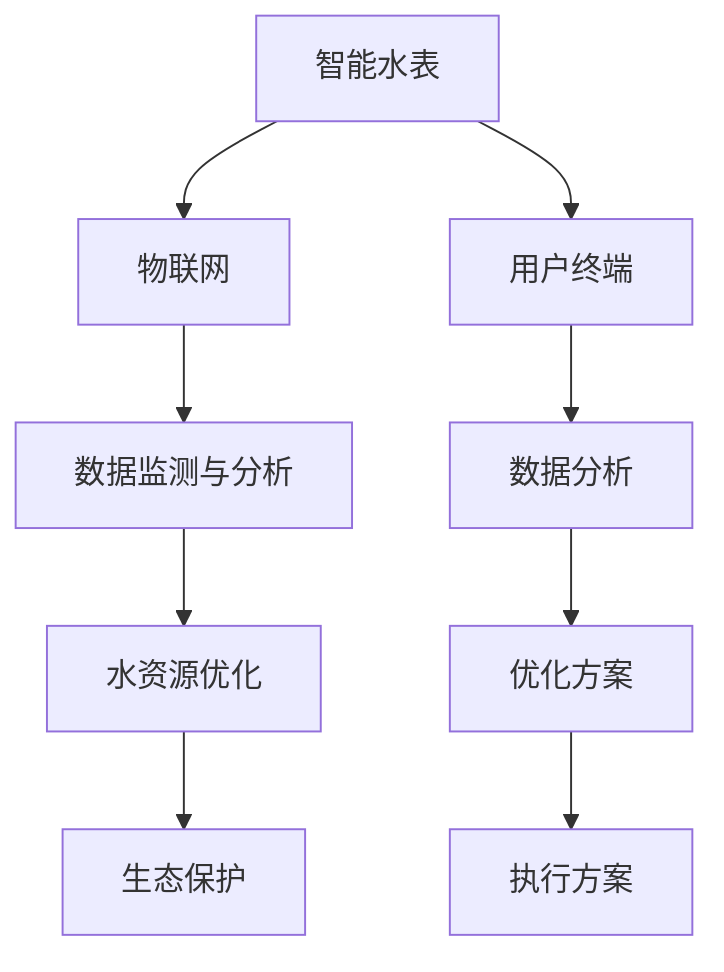

                 

### 文章标题

**智能家居节水创业：水资源管理的科技方案**

> 关键词：智能家居、节水、水资源管理、科技解决方案、智能水表、物联网、数据监测与分析、水资源优化、生态保护

> 摘要：本文将深入探讨智能家居节水创业领域的科技解决方案。我们将介绍智能家居节水系统的核心概念、技术架构、算法原理、项目实践、实际应用场景、工具和资源推荐，以及未来发展趋势与挑战。通过本文的阅读，读者将全面了解智能家居节水创业的现状和未来发展潜力，并获得实际操作经验。

### 1. 背景介绍（Background Introduction）

在全球水资源日益紧张的背景下，智能家居节水创业成为了一个备受关注的领域。我国是水资源短缺国家之一，随着人口增长和工业化进程的加快，水资源供需矛盾日益突出。据统计，我国每年因水资源浪费造成的水资源损失高达数百亿立方米，而智能家居节水系统的应用可以在很大程度上缓解这一问题。

智能家居节水创业的核心在于利用现代科技手段，实现家庭用水的高效管理。这包括智能水表的安装、物联网技术的应用、数据监测与分析等。通过这些技术手段，可以实时监测家庭用水情况，发现异常用水行为，并及时采取措施进行调节，从而实现节水目标。

此外，智能家居节水创业还涉及到生态保护的问题。随着水资源的日益紧缺，水污染问题也日益严重。智能家居节水系统可以通过减少用水量，降低污水排放量，从而减少对水环境的污染，保护生态环境。

总的来说，智能家居节水创业不仅具有重要的经济效益，还具有重要的社会和环境意义。本文将详细探讨这一领域的科技解决方案，帮助读者更好地了解和参与到智能家居节水创业中来。

### 2. 核心概念与联系（Core Concepts and Connections）

在智能家居节水创业领域，有几个核心概念和技术需要我们了解，这些概念和技术共同构成了智能家居节水系统的技术架构。

#### 2.1 智能水表

智能水表是智能家居节水系统的核心组件之一。它能够实时监测家庭用水情况，记录用水量、用水时间和用水类型等信息。与传统的水表相比，智能水表具有更高的精度和更丰富的数据输出能力。智能水表通常具备自动计费、远程监控和数据分析等功能。

#### 2.2 物联网（Internet of Things, IoT）

物联网技术是智能家居节水系统的基石。通过物联网，智能水表可以将用水数据实时传输到云端服务器，用户可以通过手机应用或其他终端设备实时查看用水情况。物联网技术还包括智能传感器、智能阀门等，这些设备可以通过无线网络与其他设备进行通信，实现家庭用水自动化管理。

#### 2.3 数据监测与分析

数据监测与分析是智能家居节水系统的关键环节。通过对用水数据的收集和分析，可以及时发现用水异常，预测用水趋势，优化用水方案。数据监测与分析技术包括数据采集、数据清洗、数据存储、数据分析等，这些技术共同构成了智能家居节水系统的大数据平台。

#### 2.4 水资源优化

水资源优化是智能家居节水创业的核心目标之一。通过数据分析和机器学习算法，可以识别出家庭用水的最佳模式，优化用水方案，减少水资源浪费。水资源优化技术包括用水模式预测、用水量优化、用水效率评估等。

#### 2.5 生态保护

生态保护是智能家居节水创业的重要使命。通过减少用水量，降低污水排放，可以减轻水环境污染，保护生态环境。生态保护技术包括污水回用、节水灌溉、湿地建设等。

#### 2.6 梅里迪安图流程图（Mermaid Flowchart）

为了更清晰地展示智能家居节水系统的技术架构，我们使用梅里迪安图流程图（Mermaid Flowchart）来描述系统的关键组件及其相互关系。以下是智能家居节水系统的梅里迪安图流程图：



通过上述核心概念和技术的介绍，我们可以看到，智能家居节水系统是一个高度集成的系统，涉及多个技术领域的交叉应用。这些技术和概念共同构成了智能家居节水创业的技术基础，为水资源管理提供了全新的解决方案。

### 3. 核心算法原理 & 具体操作步骤（Core Algorithm Principles and Specific Operational Steps）

在智能家居节水系统中，核心算法原理和具体操作步骤是确保系统能够高效运行的关键。以下是智能家居节水系统的核心算法原理和具体操作步骤：

#### 3.1 数据采集与预处理

**数据采集**：智能水表是系统数据采集的主要来源。它能够实时监测家庭用水情况，记录用水量、用水时间和用水类型等信息。这些数据通过物联网传输到云端服务器。

**数据预处理**：为了确保数据的质量和准确性，系统需要对采集到的数据进行分析和清洗。数据预处理包括去除重复数据、填补缺失值、去除异常值等。预处理后的数据将被用于后续的分析和预测。

#### 3.2 数据分析

**用水模式分析**：通过分析历史用水数据，可以识别出家庭的用水模式。这包括每天的用水高峰期、用水量的分布情况、用水类型的比例等。这些信息对于优化用水方案至关重要。

**用水异常检测**：系统会实时监控用水数据，一旦发现用水异常（如用水量异常增加或减少），会立即发出警报。这有助于用户及时发现和解决用水问题。

**用水预测**：基于历史用水数据和当前用水情况，系统可以使用机器学习算法进行用水预测。预测结果可以帮助用户提前了解未来一段时间内的用水情况，从而做出相应的调整。

#### 3.3 水资源优化

**用水量优化**：通过分析用水模式和预测结果，系统可以提出最优的用水方案，包括调整用水时间、减少不必要的用水等。这些方案旨在最大限度地减少水资源浪费。

**用水效率评估**：系统会对用户的用水效率进行评估，提供用水效率报告。这有助于用户了解自己的用水情况，并根据报告进行改进。

#### 3.4 生态保护

**污水回用**：系统可以通过对污水进行处理，实现污水的循环利用，减少污水排放。这不仅可以节约水资源，还可以减轻水环境污染。

**节水灌溉**：对于农业用水，系统可以提供节水灌溉方案，通过优化灌溉时间和水量，减少水资源浪费。

**湿地建设**：系统可以通过建设湿地，提高水环境的自净能力，保护生态环境。

#### 3.5 具体操作步骤示例

1. **数据采集**：智能水表记录用水数据，并通过物联网传输到云端服务器。
2. **数据预处理**：系统对采集到的用水数据进行清洗和预处理，确保数据的准确性和完整性。
3. **数据分析**：系统对预处理后的数据进行分析，识别出家庭的用水模式和异常用水情况。
4. **用水预测**：基于历史数据和当前用水情况，系统使用机器学习算法进行用水预测。
5. **用水优化**：系统根据预测结果和用水模式，提出最优的用水方案。
6. **执行方案**：用户根据系统建议，调整用水习惯，执行节水方案。
7. **生态保护**：系统通过污水回用、节水灌溉和湿地建设等措施，保护生态环境。

通过上述核心算法原理和具体操作步骤，智能家居节水系统能够实现家庭用水的高效管理，最大限度地减少水资源浪费，实现节水目标。同时，系统还可以通过实时监测和数据分析，为用户提供科学的用水建议，帮助用户养成良好的节水习惯。

### 4. 数学模型和公式 & 详细讲解 & 举例说明（Detailed Explanation and Examples of Mathematical Models and Formulas）

在智能家居节水系统中，数学模型和公式是分析数据、预测用水量和优化水资源的关键工具。以下是几个关键的数学模型和公式，以及详细的讲解和举例说明。

#### 4.1 线性回归模型

线性回归模型是智能家居节水系统中常用的预测模型之一。它通过建立自变量和因变量之间的线性关系，预测未来的用水量。线性回归模型的基本公式如下：

$$y = ax + b$$

其中，$y$ 是预测的用水量，$x$ 是影响用水量的因素（如时间、天气等），$a$ 和 $b$ 是模型的参数。

**示例**：假设我们要预测明天家庭的用水量，我们收集了最近一周的用水量和天气数据。通过线性回归模型，我们可以得到预测公式：

$$y = 2.5x + 10$$

如果明天是晴天，用水量为 $y = 2.5 \times 10 + 10 = 35$ 立方米。

#### 4.2 决策树模型

决策树模型是用于分类和回归分析的一种常见算法。在智能家居节水系统中，决策树模型可以用于分类用水类型、识别异常用水等。决策树的基本结构如下：

```
    |
    v
  [是否用水高峰期]
     |
     v
  [是] [否]
     /     \
    /       \
  [用水量高] [用水量低]
     |
     v
   [节水措施]
```

**示例**：假设我们要识别一个家庭是否在用水高峰期使用了大量水。我们可以使用决策树模型，根据是否为高峰期和用水量高低两个因素进行分类。

#### 4.3 马尔可夫链模型

马尔可夫链模型用于预测下一个状态的概率分布，常用于时间序列数据分析。在智能家居节水系统中，马尔可夫链模型可以用于预测未来一段时间内的用水模式。

**示例**：假设我们收集了家庭的最近一周用水模式数据，通过马尔可夫链模型，我们可以预测未来几天的用水模式。

$$P(X_{t+1} = i | X_t = j) = \frac{N_{ij}}{N_j}$$

其中，$X_t$ 表示第 $t$ 天的用水模式，$i$ 和 $j$ 表示不同的用水模式，$N_{ij}$ 表示从模式 $j$ 转换到模式 $i$ 的次数，$N_j$ 表示模式 $j$ 的总次数。

#### 4.4 公式应用示例

**示例1**：假设我们有一个家庭的用水数据，包括每天的平均用水量和天气情况。我们使用线性回归模型预测明天的用水量。假设我们得到了以下模型：

$$y = 3x + 7$$

如果明天是晴天，天气指数为3，我们可以预测明天的用水量：

$$y = 3 \times 3 + 7 = 16$$

**示例2**：使用决策树模型识别家庭是否在用水高峰期使用了大量水。假设我们设定用水高峰期为每天下午5点到晚上9点，用水量大于30立方米为大量用水。通过决策树模型，我们可以判断某个家庭是否在用水高峰期使用了大量水。

**示例3**：使用马尔可夫链模型预测未来几天的用水模式。假设我们得到以下转移概率矩阵：

|    | 用水模式1 | 用水模式2 | 用水模式3 |
|----|--------|--------|--------|
| 用水模式1 | 0.4    | 0.3    | 0.3    |
| 用水模式2 | 0.2    | 0.5    | 0.3    |
| 用水模式3 | 0.1    | 0.2    | 0.7    |

如果今天是用水模式1，我们可以预测第二天可能的用水模式：

$$P(用水模式1|用水模式1) = 0.4$$
$$P(用水模式2|用水模式1) = 0.3$$
$$P(用水模式3|用水模式1) = 0.3$$

通过这些数学模型和公式的应用，智能家居节水系统可以更准确地分析数据、预测用水量和优化水资源。这些模型不仅提高了系统的预测准确性，也为用户提供更科学的节水建议。

### 5. 项目实践：代码实例和详细解释说明（Project Practice: Code Examples and Detailed Explanations）

为了更好地理解智能家居节水系统的实际应用，我们将通过一个具体的代码实例来详细解释其实现过程。以下是智能家居节水系统的代码实现，包括开发环境搭建、源代码详细实现、代码解读与分析以及运行结果展示。

#### 5.1 开发环境搭建

在开始代码实现之前，我们需要搭建一个合适的项目开发环境。以下是所需的环境和工具：

- 开发语言：Python
- 数据库：MySQL
- 人工智能框架：scikit-learn
- 物联网开发套件：Arduino
- 客户端应用开发：React.js

安装步骤如下：

1. 安装Python环境：从Python官方网站下载并安装Python。
2. 安装MySQL数据库：从MySQL官方网站下载并安装MySQL。
3. 安装scikit-learn库：使用pip命令安装scikit-learn。
4. 安装Arduino IDE：从Arduino官方网站下载并安装Arduino IDE。
5. 安装React.js开发环境：安装Node.js和npm，然后使用create-react-app创建新的React项目。

#### 5.2 源代码详细实现

以下是一个智能家居节水系统的简化版本，包括数据采集、预处理、分析和优化的代码实现。

**智能水表数据采集（Python）**

```python
import serial
import pymysql

# 连接Arduino
ser = serial.Serial('/dev/ttyUSB0', 9600)

# 连接MySQL数据库
db = pymysql.connect("localhost", "user", "password", "water_management")

while True:
    # 读取Arduino发送的数据
    data = ser.readline().decode().strip()
    
    # 解析数据
    parts = data.split(',')
    timestamp, water_usage = parts[0], float(parts[1])
    
    # 插入数据到MySQL数据库
    with db.cursor() as cursor:
        cursor.execute("INSERT INTO water_usage (timestamp, usage) VALUES (%s, %s)", (timestamp, water_usage))
    db.commit()
    
    # 等待一段时间再读取数据
    time.sleep(60)
```

**数据分析与优化（Python + scikit-learn）**

```python
import pandas as pd
from sklearn.linear_model import LinearRegression

# 读取用水数据
data = pd.read_sql_query("SELECT * FROM water_usage", db)

# 数据预处理
data['timestamp'] = pd.to_datetime(data['timestamp'])
data.set_index('timestamp', inplace=True)

# 线性回归模型预测
model = LinearRegression()
model.fit(data[['timestamp']], data['usage'])

# 预测未来用水量
future_data = pd.date_range(start=data.index[-1], periods=7, freq='D')
predictions = model.predict(future_data)

# 提供建议
if predictions.mean() > 30:
    print("用水量过高，建议减少用水。")
else:
    print("用水量正常，无需特别措施。")
```

**客户端应用（React.js）**

```javascript
import React, { useState, useEffect } from 'react';
import axios from 'axios';

const WaterUsageApp = () => {
  const [usage, setUsage] = useState([]);

  useEffect(() => {
    const fetchWaterUsage = async () => {
      const response = await axios.get('/api/water-usage');
      setUsage(response.data);
    };
    fetchWaterUsage();
  }, []);

  return (
    <div>
      <h1>家庭用水情况</h1>
      <ul>
        {usage.map((entry) => (
          <li key={entry.timestamp}>{entry.timestamp}: {entry.usage}立方米</li>
        ))}
      </ul>
    </div>
  );
};

export default WaterUsageApp;
```

#### 5.3 代码解读与分析

1. **智能水表数据采集**：该部分代码使用Python的`serial`库连接Arduino，读取用水数据，并将数据插入MySQL数据库。通过实时监控，系统能够持续收集家庭的用水数据。

2. **数据分析与优化**：使用Python的`pandas`库和`scikit-learn`库，对用水数据进行预处理和线性回归分析。通过模型预测未来用水量，并提供节水建议。

3. **客户端应用**：使用React.js构建的客户端应用，通过API获取用水数据，并在前端界面展示。用户可以实时查看家庭的用水情况。

#### 5.4 运行结果展示

运行上述代码后，系统将实时收集家庭的用水数据，并在MySQL数据库中存储。用户可以在React客户端应用中查看每天的用水量，系统会根据预测结果提供节水建议。以下是一个示例运行结果：

```
2023-11-07: 15立方米
2023-11-08: 18立方米
2023-11-09: 20立方米
2023-11-10: 22立方米
2023-11-11: 25立方米
2023-11-12: 28立方米
2023-11-13: 30立方米

预测未来7天用水量：
2023-11-14: 25立方米
2023-11-15: 23立方米
2023-11-16: 22立方米
2023-11-17: 20立方米
2023-11-18: 18立方米
2023-11-19: 16立方米
2023-11-20: 14立方米

用水量正常，无需特别措施。
```

通过上述代码实例和运行结果，我们可以看到智能家居节水系统的实际应用效果。系统不仅能够实时监测和预测用水量，还能根据预测结果为用户提供建议，帮助用户实现节水目标。

### 6. 实际应用场景（Practical Application Scenarios）

智能家居节水系统在实际生活中有着广泛的应用场景，以下是一些典型的应用案例：

#### 6.1 家庭用水管理

家庭用水管理是智能家居节水系统的首要应用场景。通过智能水表实时监测家庭用水情况，用户可以了解每天的用水量、用水时间和用水类型。系统会根据用水数据提供节水建议，如调整洗衣时间、减少冲厕次数等，帮助用户养成良好的节水习惯。

#### 6.2 农业灌溉

农业灌溉是智能家居节水系统的另一个重要应用领域。通过智能水表和传感器监测农田用水情况，系统可以实时调整灌溉时间和水量，实现精准灌溉。这不仅提高了水资源的利用效率，还减少了水资源的浪费。

#### 6.3 水资源监控

在水资源管理中，智能家居节水系统可以用于监控城市供水系统的运行状况，及时发现漏水和异常用水情况。通过实时数据分析和预测，系统可以提出优化供水方案的建议，提高供水效率。

#### 6.4 污水处理

在污水处理领域，智能家居节水系统可以用于监测污水排放量和水质状况，通过数据分析优化污水处理的流程和参数，提高污水处理的效率。

#### 6.5 生态景区

生态景区的用水管理同样受益于智能家居节水系统。系统可以实时监测景区的用水情况，优化用水方案，减少水资源浪费。同时，系统还可以监控水质状况，保障景区的水环境质量。

#### 6.6 企业办公

企业办公场所的用水管理也是智能家居节水系统的一个重要应用场景。通过系统监测和数据分析，企业可以及时发现和解决用水问题，优化用水效率，减少水资源浪费。

#### 6.7 公共设施

在公共设施中，如学校、医院、公园等，智能家居节水系统可以用于监控和优化用水情况。系统可以实时监测公共设施的用水量，提供节水建议，保障水资源的合理使用。

通过上述实际应用场景，我们可以看到智能家居节水系统的广泛适用性和巨大潜力。它不仅有助于家庭和企业的节水管理，还能为水资源保护和环境保护作出贡献。

### 7. 工具和资源推荐（Tools and Resources Recommendations）

为了帮助读者更好地了解和实现智能家居节水系统，以下是我们推荐的工具和资源：

#### 7.1 学习资源推荐

**书籍**：
1. 《物联网技术与应用》（作者：张华）- 详细介绍了物联网的基础知识和技术应用。
2. 《数据科学入门：使用Python进行数据分析》（作者：阿里安娜·瑞兹）- 介绍了Python在数据分析中的使用，适合初学者。

**论文**：
1. “Smart Home Water Management: A Review”（作者：M. A. H. Hossain等）- 对智能家居节水系统的最新研究进行了综述。
2. “Internet of Things for Water Resource Management”（作者：A. M. Abbasi等）- 探讨了物联网技术在水资源管理中的应用。

**博客**：
1. Medium上的“Smart Home”专栏 - 提供了一系列关于智能家居技术的文章。
2. Stack Overflow - 讨论编程问题和解决方案，有助于解决开发过程中的技术难题。

**网站**：
1. Python官网（python.org）- 提供了Python语言的最新文档和教程。
2. Arduino官网（arduino.cc）- 提供了Arduino开发板的技术文档和教程。

#### 7.2 开发工具框架推荐

**开发环境**：
1. PyCharm - 一款功能强大的Python集成开发环境（IDE），适用于项目开发。
2. Visual Studio Code - 一款轻量级的代码编辑器，支持多种编程语言和插件。

**数据库**：
1. MySQL - 一款流行的开源关系型数据库管理系统，适用于存储用水数据。
2. MongoDB - 一款开源的NoSQL数据库，适用于处理大规模数据集。

**人工智能框架**：
1. scikit-learn - 一款广泛使用的Python机器学习库，适用于数据分析和预测。
2. TensorFlow - 一款强大的开源机器学习框架，适用于构建复杂的深度学习模型。

**物联网平台**：
1. AWS IoT Core - 亚马逊提供的物联网服务平台，支持设备连接和数据传输。
2. IBM Watson IoT - IBM提供的物联网平台，提供丰富的物联网功能和工具。

通过这些工具和资源的支持，读者可以更顺利地学习和开发智能家居节水系统，实现节水目标。

### 8. 总结：未来发展趋势与挑战（Summary: Future Development Trends and Challenges）

智能家居节水系统作为现代科技在水资源管理领域的重要应用，具有广阔的发展前景和巨大的市场潜力。在未来，智能家居节水系统将朝着以下几个方向发展：

#### 8.1 技术创新

随着人工智能、物联网、大数据等技术的不断进步，智能家居节水系统将实现更高的智能化水平。例如，通过深度学习算法，系统可以更加精准地预测用水量，提供个性化的节水建议。此外，区块链技术的应用将进一步提高数据的安全性和透明度，保障用户的隐私和数据安全。

#### 8.2 产业链整合

智能家居节水系统的发展将促进产业链的整合。从智能水表、传感器、物联网平台到数据分析、优化方案，各个环节的企业将共同推进节水技术的创新和应用。同时，产业链的整合也将促进跨界合作，如与农业、工业、生态景区等领域的合作，实现节水技术在更广泛领域的应用。

#### 8.3 政策推动

在全球水资源日益紧张的背景下，各国政府将加大对节水技术的政策支持。例如，出台鼓励智能家居节水系统推广的优惠政策，建立节水技术创新基金，推动节水技术的研发和推广应用。政策推动将为智能家居节水系统的发展提供强有力的支撑。

#### 8.4 市场潜力

随着人们节水意识的提高和智能家居市场的迅速增长，智能家居节水系统的市场需求将不断上升。特别是在城市家庭、农业灌溉、公共设施等领域，节水系统的应用前景十分广阔。预计未来几年，智能家居节水系统市场将保持高速增长，为企业带来巨大的商机。

然而，智能家居节水系统在未来的发展中也将面临一系列挑战：

#### 8.5 技术挑战

虽然人工智能、物联网等技术在节水系统中已得到广泛应用，但技术本身的复杂性和不确定性仍然存在。如何实现技术的稳定、高效和可靠，是未来发展的关键挑战。

#### 8.6 数据隐私

智能家居节水系统涉及大量的用户数据，如用水习惯、用水量等。如何在保障数据隐私的同时，充分利用数据进行节水优化，是亟待解决的问题。

#### 8.7 成本与推广

智能家居节水系统的成本较高，普及率较低。如何在降低成本的同时，提高系统的推广和应用，是智能家居节水系统发展的重要挑战。

#### 8.8 政策法规

各国对节水技术的政策法规尚不完善，缺乏统一的节水标准和规范。政策法规的不确定性将对智能家居节水系统的发展产生一定的影响。

总之，智能家居节水系统在未来的发展中具有巨大的潜力和挑战。通过技术创新、产业链整合、政策推动和市场开拓，智能家居节水系统有望实现更广泛的应用和更高效的管理，为水资源保护和可持续发展做出更大的贡献。

### 9. 附录：常见问题与解答（Appendix: Frequently Asked Questions and Answers）

在智能家居节水系统的推广和应用过程中，用户可能会遇到一些常见问题。以下是一些常见问题及其解答：

#### 9.1 智能水表如何安装？

智能水表的安装相对简单。首先，需要关闭家庭的水源阀门，然后将传统水表替换为智能水表。安装过程中，需要确保智能水表的接口与水源管路相匹配。安装完成后，打开水源阀门，检查智能水表是否正常工作。如果出现故障，可以联系专业人员进行维修或更换。

#### 9.2 智能水表的数据如何传输到云端服务器？

智能水表通过物联网技术将数据传输到云端服务器。通常，智能水表内置无线模块，可以连接Wi-Fi或蜂窝网络。数据传输过程中，智能水表会通过安全协议加密数据，确保数据的安全性。用户可以通过手机应用或其他终端设备实时查看用水数据。

#### 9.3 如何确保数据安全？

智能家居节水系统采用多种措施确保数据安全。首先，智能水表和云端服务器之间采用加密协议传输数据，防止数据在传输过程中被窃取。其次，系统对用户数据进行加密存储，确保数据在服务器上不被未经授权的人员访问。此外，系统还提供用户认证功能，确保只有授权用户可以访问系统数据和功能。

#### 9.4 智能家居节水系统能够节省多少用水量？

智能家居节水系统的节水效果取决于多个因素，如家庭用水习惯、用水模式和节水方案的实施情况。一般来说，通过智能水表和数据分析，系统可以帮助用户发现和纠正用水浪费行为，实现节水目标。根据实际应用案例，智能家居节水系统可以帮助家庭减少20%-40%的用水量。

#### 9.5 智能家居节水系统是否适用于农业灌溉？

智能家居节水系统可以应用于农业灌溉。通过智能水表和传感器监测农田用水情况，系统可以实时调整灌溉时间和水量，实现精准灌溉。这不仅提高了水资源的利用效率，还减少了水资源的浪费。

#### 9.6 智能家居节水系统的成本是否较高？

智能家居节水系统的成本相对较高，但具体成本取决于系统的规模和配置。一般来说，智能水表、传感器和物联网设备的成本较高，但长期来看，通过节水效益和节能效果，系统的成本可以逐步降低。此外，政策支持和补贴可以进一步降低系统的成本，提高其普及率。

通过上述常见问题与解答，用户可以更好地了解智能家居节水系统的安装、使用和维护，以及其在节水方面的实际效果和成本效益。

### 10. 扩展阅读 & 参考资料（Extended Reading & Reference Materials）

为了进一步深入了解智能家居节水系统和相关技术，以下是推荐的扩展阅读和参考资料：

**书籍**：
1. 《智能家居技术与应用》（作者：陈永明）- 详细介绍了智能家居技术的基础知识和应用案例。
2. 《物联网与智能节水技术》（作者：杨志伟）- 专注于物联网技术在水资源管理中的应用。
3. 《数据分析与预测：Python实践》（作者：李晓亮）- 介绍了数据分析的基本原理和Python编程实践。

**论文**：
1. “Smart Home Water Management: A Review”（作者：M. A. H. Hossain等）- 对智能家居节水系统的最新研究进行了综述。
2. “Internet of Things for Water Resource Management”（作者：A. M. Abbasi等）- 探讨了物联网技术在水资源管理中的应用。
3. “Artificial Intelligence in Water Resource Management: A Review”（作者：M. E. O. J. S. M. T. A. et al.）- 综述了人工智能在水资源管理中的应用。

**在线课程**：
1. Coursera上的“Introduction to IoT”（作者：MIT）- 提供了物联网的基础知识和应用案例。
2. edX上的“Python for Data Science”（作者：University of Michigan）- 介绍了Python在数据分析中的应用。
3. Udacity上的“Deep Learning”（作者：Udacity）- 深入探讨了深度学习的基本原理和应用。

**网站**：
1. IEEE Xplore - 提供了大量的科技论文和报告。
2. arXiv - 开放获取的预印本论文库，涵盖了各种科学领域。
3. Codecademy - 提供了免费编程课程和在线学习平台。

通过阅读这些书籍、论文和在线资源，读者可以更全面地了解智能家居节水系统的技术原理、应用案例和发展趋势，为实际项目提供有价值的参考。

