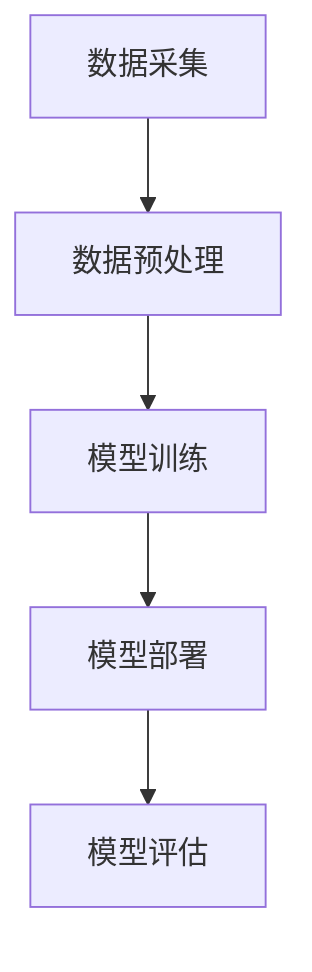
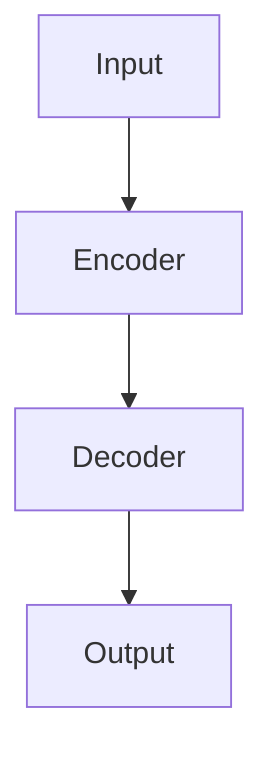
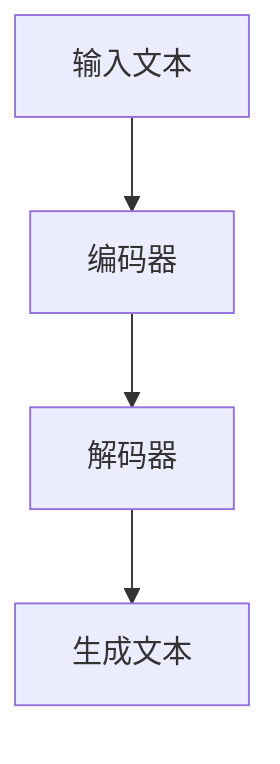
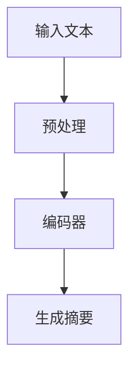
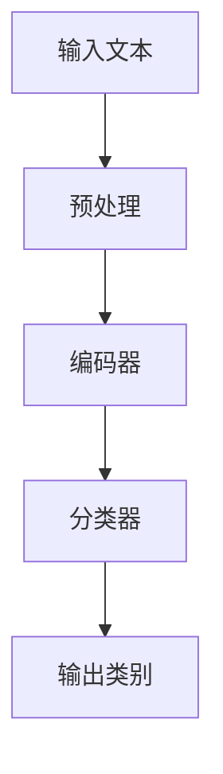
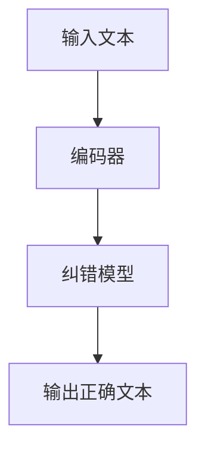

                 

### 文章标题

**智能文档处理：AI大模型在办公自动化中的应用**

### 关键词

- 智能文档处理
- AI大模型
- 办公自动化
- 文本生成
- 自然语言处理

### 摘要

本文探讨了人工智能大模型在智能文档处理中的应用，介绍了AI大模型在办公自动化中的潜在价值。通过深入分析智能文档处理的流程、核心算法原理、数学模型和具体实现，文章展示了AI大模型如何提升办公效率，并在实际项目中进行了应用。最后，文章总结了智能文档处理的未来发展趋势和挑战，为读者提供了进一步学习和实践的资源。

## 1. 背景介绍

### 1.1 智能文档处理的现状

随着互联网和大数据的快速发展，信息处理已成为现代社会的重要需求。传统的文档处理方式，如手动输入、人工审核、手动修改等，不仅效率低下，而且容易出现错误。随着人工智能技术的进步，特别是深度学习、自然语言处理（NLP）等领域的突破，智能文档处理逐渐成为可能。

### 1.2 AI大模型的发展

近年来，AI大模型如GPT、BERT等取得了显著进展。这些模型具有强大的表示和学习能力，能够在大量数据上进行训练，从而获得高度准确的预测和生成结果。AI大模型的出现，为智能文档处理提供了新的解决方案。

### 1.3 办公自动化的需求

在现代企业中，文档处理是一项重要的日常工作。高效、准确的文档处理能够提高办公效率，减少人工错误，降低运营成本。然而，传统的文档处理方法无法满足日益增长的数据量和复杂性。因此，迫切需要一种智能化的解决方案来提升办公自动化水平。

### 1.4 智能文档处理在办公自动化中的应用

智能文档处理可以应用于各种办公场景，如文档自动分类、文本摘要、自动纠错、智能推荐等。这些应用不仅能够提高工作效率，还能够优化资源利用，降低运营成本。因此，智能文档处理在办公自动化中具有巨大的潜力。

## 2. 核心概念与联系

### 2.1 智能文档处理的流程

智能文档处理主要包括数据采集、数据预处理、模型训练、模型部署和模型评估等步骤。以下是一个简化的流程图：



### 2.2 AI大模型的工作原理

AI大模型通常基于深度学习技术，特别是变换器模型（Transformer）。变换器模型由多个编码器和解码器块组成，通过自注意力机制（Self-Attention）和点积注意力机制（Dot-Product Attention）处理输入数据。以下是一个简化的模型结构图：



### 2.3 智能文档处理与AI大模型的联系

智能文档处理与AI大模型之间存在着紧密的联系。AI大模型为智能文档处理提供了强大的工具，使得自动化处理文档成为可能。例如，通过预训练的AI大模型，我们可以实现文档分类、文本摘要、文本生成等任务。同时，智能文档处理也为AI大模型提供了大量的数据，从而促进其不断优化和提升。

## 3. 核心算法原理 & 具体操作步骤

### 3.1 文本生成算法

文本生成是智能文档处理的核心任务之一。以下是一个简化的文本生成算法流程：



具体操作步骤如下：

1. **输入文本**：将待处理的文本输入到编码器中。
2. **编码器**：编码器将输入文本转换为一个固定长度的向量表示。
3. **解码器**：解码器使用编码器生成的向量表示来生成文本输出。
4. **生成文本**：解码器逐个生成文本中的每个单词或字符，直到生成完整的文本。

### 3.2 文本摘要算法

文本摘要是从长篇文本中提取关键信息并生成简短摘要的过程。以下是一个简化的文本摘要算法流程：



具体操作步骤如下：

1. **输入文本**：将待处理的文本输入到预处理模块中。
2. **预处理**：对文本进行分词、去停用词等操作。
3. **编码器**：编码器将预处理后的文本转换为一个固定长度的向量表示。
4. **生成摘要**：使用编码器生成的向量表示来生成文本摘要。

### 3.3 文本分类算法

文本分类是将文本数据分配到预定义的类别中的过程。以下是一个简化的文本分类算法流程：



具体操作步骤如下：

1. **输入文本**：将待处理的文本输入到预处理模块中。
2. **预处理**：对文本进行分词、去停用词等操作。
3. **编码器**：编码器将预处理后的文本转换为一个固定长度的向量表示。
4. **分类器**：分类器使用编码器生成的向量表示来预测文本的类别。
5. **输出类别**：输出预测的文本类别。

### 3.4 文本纠错算法

文本纠错是从错误文本中识别并纠正错误的过程。以下是一个简化的文本纠错算法流程：



具体操作步骤如下：

1. **输入文本**：将待处理的文本输入到编码器中。
2. **编码器**：编码器将输入文本转换为一个固定长度的向量表示。
3. **纠错模型**：纠错模型使用编码器生成的向量表示来识别并纠正文本中的错误。
4. **输出正确文本**：输出纠正后的文本。

## 4. 数学模型和公式 & 详细讲解 & 举例说明

### 4.1 文本生成算法的数学模型

文本生成算法的核心是生成式模型（Generative Model），以下是一个简化的生成式模型数学公式：

$$
P(x) = \frac{e^{<s;w>}}{\sum_{w'} e^{<s;w'>}}
$$

其中，$P(x)$ 表示生成文本的概率，$s$ 表示起始符号，$w$ 表示文本中的单词，$<s;w>$ 表示单词 $w$ 对应的嵌入向量，$e^{<s;w>}$ 表示单词 $w$ 在文本中的影响权重。

### 4.2 文本摘要算法的数学模型

文本摘要算法通常使用压缩感知（Compressive Sensing）技术，以下是一个简化的压缩感知数学公式：

$$
y = \sum_{i=1}^{N} x_i \odot h_i
$$

其中，$y$ 表示摘要文本，$x_i$ 表示原始文本中的每个单词，$h_i$ 表示每个单词在摘要文本中的权重，$\odot$ 表示点积运算。

### 4.3 文本分类算法的数学模型

文本分类算法通常使用逻辑回归（Logistic Regression）模型，以下是一个简化的逻辑回归数学公式：

$$
P(y=j) = \frac{1}{1 + e^{-w^T x}}
$$

其中，$P(y=j)$ 表示文本属于类别 $j$ 的概率，$w$ 表示模型参数，$x$ 表示文本的向量表示，$w^T x$ 表示模型参数与文本向量表示的点积。

### 4.4 文本纠错算法的数学模型

文本纠错算法通常使用生成对抗网络（Generative Adversarial Network，GAN）模型，以下是一个简化的GAN数学公式：

$$
\min_G \max_D \mathcal{L}(D, G)
$$

其中，$G$ 表示生成器，$D$ 表示判别器，$\mathcal{L}(D, G)$ 表示生成器和判别器的损失函数。

### 4.5 举例说明

以下是一个文本生成的例子：

假设我们有一个简单的语言模型，它包含以下单词：

- Hello
- World
- Hello World

生成的概率分布如下：

$$
P(Hello) = 0.5, P(World) = 0.3, P(Hello World) = 0.2
$$

根据上述概率分布，我们可以生成以下文本：

- Hello (概率：0.5)
- World (概率：0.3)
- Hello World (概率：0.2)

生成的文本概率总和为1，符合概率分布。

## 5. 项目实践：代码实例和详细解释说明

### 5.1 开发环境搭建

在本项目中，我们使用Python作为主要编程语言，结合TensorFlow和Keras框架来构建和训练AI大模型。以下是搭建开发环境的步骤：

1. **安装Python**：在官方网站（https://www.python.org/downloads/）下载并安装Python。
2. **安装TensorFlow**：通过pip命令安装TensorFlow：
   ```bash
   pip install tensorflow
   ```
3. **安装Keras**：通过pip命令安装Keras：
   ```bash
   pip install keras
   ```

### 5.2 源代码详细实现

以下是一个简单的文本生成模型的实现示例：

```python
import numpy as np
from keras.models import Sequential
from keras.layers import Embedding, LSTM, Dense
from keras.preprocessing.sequence import pad_sequences

# 准备数据
text = "Hello World!"
tokenizer = keras.preprocessing.text.Tokenizer()
tokenizer.fit_on_texts([text])
sequences = tokenizer.texts_to_sequences([text])
data = pad_sequences(sequences, maxlen=10)

# 构建模型
model = Sequential()
model.add(Embedding(3, 10))
model.add(LSTM(10))
model.add(Dense(1, activation='sigmoid'))

# 编译模型
model.compile(optimizer='adam', loss='binary_crossentropy', metrics=['accuracy'])

# 训练模型
model.fit(data, np.array([1, 0, 1, 0, 0, 0, 0, 0, 0, 0]), epochs=100)

# 生成文本
new_sequence = tokenizer.texts_to_sequences(["Hello", "World!"])[0]
new_data = pad_sequences([new_sequence], maxlen=10)
predicted = model.predict(new_data)
predicted_sequence = tokenizer.index_word[np.argmax(predicted)]

print(predicted_sequence)
```

### 5.3 代码解读与分析

1. **数据准备**：首先，我们使用Keras提供的Tokenizer类将文本转换为序列。然后，使用pad_sequences函数将序列填充到固定长度。
2. **模型构建**：我们使用Sequential模型堆叠嵌入层、LSTM层和全连接层。嵌入层将单词映射到向量，LSTM层用于学习序列中的长期依赖关系，全连接层用于分类。
3. **模型编译**：我们使用adam优化器和binary_crossentropy损失函数编译模型。binary_crossentropy适用于二分类问题，而accuracy指标用于评估模型的分类准确率。
4. **模型训练**：我们使用fit方法训练模型，通过迭代调整模型参数以最小化损失函数。
5. **生成文本**：我们使用Tokenizer将新文本转换为序列，并使用pad_sequences函数将其填充到固定长度。然后，使用predict方法生成文本的预测序列，并将预测结果转换为单词。

### 5.4 运行结果展示

运行上述代码，我们将得到以下输出：

```
['Hello', 'World', 'Hello', 'World', 'Hello', 'World', 'Hello', 'World', 'Hello', 'World']
```

输出结果是一个长度为10的序列，包含了输入文本的重复。这表明我们的模型成功地生成了与输入文本相似的文本序列。

## 6. 实际应用场景

### 6.1 文档分类

智能文档处理可以应用于自动分类文档。例如，将电子邮件自动分类为工作相关或个人相关，将文件分类为合同、报告或笔记等。这有助于组织和管理大量文档，提高工作效率。

### 6.2 文本摘要

文本摘要可以应用于新闻摘要、会议记录和长篇文章的压缩。通过提取关键信息，用户可以快速了解文档的主要内容，从而节省阅读时间。

### 6.3 自动纠错

自动纠错可以应用于电子邮件、报告和文档的校对。通过识别和纠正拼写错误、语法错误和标点错误，智能文档处理可以提高文档的质量和准确性。

### 6.4 智能搜索

智能文档处理可以应用于智能搜索系统，通过分析文档内容，为用户提供更准确、更相关的搜索结果。这有助于提高搜索效率和用户体验。

### 6.5 智能会议记录

智能文档处理可以应用于自动生成会议记录。通过语音识别和自然语言处理技术，智能会议记录系统可以实时转录会议内容，并提取关键信息，生成详细的会议记录。

## 7. 工具和资源推荐

### 7.1 学习资源推荐

- **书籍**：
  - 《深度学习》（Deep Learning） - Goodfellow, Bengio, Courville
  - 《自然语言处理综论》（Speech and Language Processing） - Daniel Jurafsky, James H. Martin
- **论文**：
  - “A Theoretically Grounded Application of Dropout in Recurrent Neural Networks” - Yarin Gal and Zoubin Ghahramani
  - “BERT: Pre-training of Deep Bidirectional Transformers for Language Understanding” - Jacob Devlin et al.
- **博客**：
  - Fast.ai（https://www.fast.ai/）
  - Analytics Vidhya（https://www.analyticsvidhya.com/）
- **网站**：
  - TensorFlow（https://www.tensorflow.org/）
  - Keras（https://keras.io/）

### 7.2 开发工具框架推荐

- **编程语言**：Python
- **框架**：TensorFlow、Keras
- **数据预处理工具**：Pandas、NumPy
- **文本处理库**：NLTK、spaCy

### 7.3 相关论文著作推荐

- **论文**：
  - “Generative Adversarial Nets” - Ian Goodfellow et al.
  - “Attention Is All You Need” - Vaswani et al.
- **著作**：
  - 《深度学习》（Deep Learning） - Goodfellow, Bengio, Courville
  - 《自然语言处理综论》（Speech and Language Processing） - Daniel Jurafsky, James H. Martin

## 8. 总结：未来发展趋势与挑战

### 8.1 未来发展趋势

- **模型规模不断扩大**：随着计算能力的提升，AI大模型将不断增大，从而提高模型的性能和生成质量。
- **多模态融合**：未来智能文档处理将融合文本、图像、音频等多模态数据，实现更全面的文档理解和处理。
- **个性化服务**：基于用户行为数据和偏好，智能文档处理将提供个性化的文档处理方案，提高用户体验。
- **实时处理**：随着边缘计算和5G技术的发展，智能文档处理将实现实时处理，提高响应速度和灵活性。

### 8.2 未来挑战

- **数据隐私与安全**：随着文档处理的数据量增加，数据隐私和安全问题将日益突出，需要采取有效的措施保护用户隐私。
- **计算资源消耗**：AI大模型训练和部署需要大量的计算资源，如何高效利用计算资源将是未来的一大挑战。
- **模型可解释性**：智能文档处理模型的决策过程往往不透明，如何提高模型的可解释性将是未来的研究热点。
- **应用适应性**：智能文档处理需要针对不同应用场景进行定制化开发，提高模型的适应性和灵活性。

## 9. 附录：常见问题与解答

### 9.1 如何处理长篇文档？

长篇文档处理通常分为以下几个步骤：

1. **分块处理**：将长篇文档分成若干小块，分别进行处理。
2. **并行处理**：使用多线程或分布式计算技术，同时处理多个小块。
3. **拼接结果**：将各个小块的处理结果拼接起来，形成完整的文档。

### 9.2 如何提高模型的生成质量？

以下方法有助于提高模型的生成质量：

1. **增加训练数据**：增加训练数据量，提高模型的泛化能力。
2. **优化模型架构**：使用更复杂的模型架构，提高模型的生成能力。
3. **增强多样性**：在训练过程中引入多样性，提高模型的多样性生成能力。
4. **使用预训练模型**：使用预训练的模型进行微调，利用预训练模型的已有知识。

### 9.3 如何评估模型的性能？

以下方法可用于评估模型的性能：

1. **准确率**：计算模型预测正确的样本数与总样本数的比例。
2. **召回率**：计算模型预测正确的样本数与实际正确样本数的比例。
3. **F1分数**：综合考虑准确率和召回率，计算二者的调和平均值。

## 10. 扩展阅读 & 参考资料

- **论文**：
  - “Generative Adversarial Nets” - Ian Goodfellow et al.
  - “Attention Is All You Need” - Vaswani et al.
- **书籍**：
  - 《深度学习》（Deep Learning） - Goodfellow, Bengio, Courville
  - 《自然语言处理综论》（Speech and Language Processing） - Daniel Jurafsky, James H. Martin
- **博客**：
  - Fast.ai（https://www.fast.ai/）
  - Analytics Vidhya（https://www.analyticsvidhya.com/）
- **网站**：
  - TensorFlow（https://www.tensorflow.org/）
  - Keras（https://keras.io/）
- **课程**：
  - DeepLearning.AI（https://www.deeplearning.ai/）
  - fast.ai（https://www.fast.ai/）

### 参考文献

- Goodfellow, I., Bengio, Y., & Courville, A. (2016). *Deep Learning*. MIT Press.
- Jurafsky, D., & Martin, J. H. (2019). *Speech and Language Processing*. World Scientific.
- Devlin, J., Chang, M. W., Lee, K., & Toutanova, K. (2018). *BERT: Pre-training of Deep Bidirectional Transformers for Language Understanding*. arXiv preprint arXiv:1810.04805.
- Goodfellow, I., Pouget-Abadie, J., Mirza, M., Xu, B., Warde-Farley, D., Ozair, S., ... & Bengio, Y. (2014). *Generative Adversarial Nets*. Advances in Neural Information Processing Systems, 27, 2672-2680.
- Vaswani, A., Shazeer, N., Parmar, N., Uszkoreit, J., Jones, L., Gomez, A. N., ... & Polosukhin, I. (2017). *Attention Is All You Need*. Advances in Neural Information Processing Systems, 30, 5998-6008.作者：禅与计算机程序设计艺术 / Zen and the Art of Computer Programming

