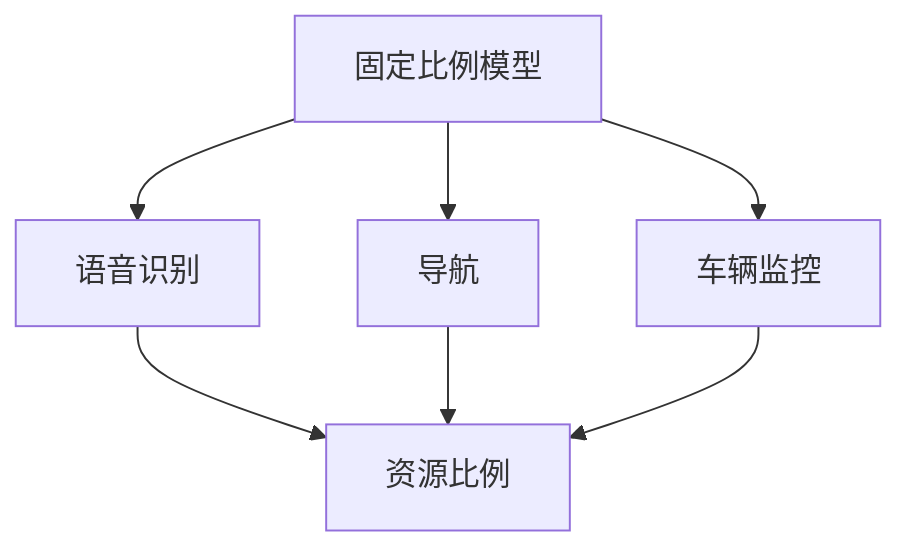
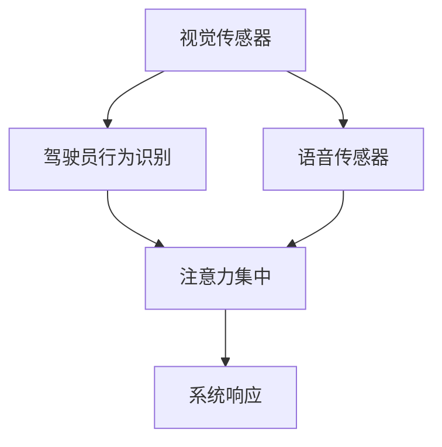

                 

# 智能汽车中控系统的注意力管理

## 摘要

智能汽车中控系统作为汽车电子系统的重要组成部分，承担着与驾驶者及乘客进行交互的任务。本文旨在探讨中控系统的注意力管理机制，通过分析其核心概念、算法原理、数学模型、项目实践以及实际应用场景，揭示如何优化智能汽车的中控系统性能，提升用户交互体验。文章还将推荐相关工具和资源，为读者提供深入研究的路径。最后，本文将总结未来发展趋势与挑战，为相关领域的研究和实践提供参考。

## 1. 背景介绍

随着汽车智能化和网联化进程的加速，智能汽车中控系统已经成为现代汽车的核心组件。中控系统不仅负责汽车的信息娱乐功能，还承担了导航、语音识别、车辆监控等多重任务。在这些功能的实现过程中，注意力管理显得尤为重要。注意力管理是指系统在执行多个任务时，合理分配资源以保持任务的高效运行。

注意力管理在中控系统中的应用主要体现在以下几个方面：

1. **资源分配**：中控系统需要处理大量的输入信息，包括语音、触控、传感器数据等。注意力管理确保系统能够优先处理关键任务，如导航、紧急呼叫等。

2. **用户体验**：良好的注意力管理可以减少系统响应延迟，提高用户交互的流畅性和满意度。

3. **安全性**：在驾驶过程中，中控系统需要能够及时识别驾驶员的注意力水平，防止因分心导致的交通事故。

本文将从以下方面进行探讨：

- **核心概念与联系**：介绍注意力管理的关键概念，如注意力分配模型、注意力机制等。
- **核心算法原理与具体操作步骤**：阐述注意力管理算法的基本原理和具体实现方法。
- **数学模型和公式**：分析注意力管理的数学模型，包括相关公式和推导。
- **项目实践**：通过具体代码实例展示注意力管理在实际项目中的应用。
- **实际应用场景**：探讨注意力管理在不同场景下的应用案例。
- **工具和资源推荐**：推荐用于学习和实践注意力管理的工具和资源。
- **总结与展望**：总结本文的主要观点，展望未来发展趋势与挑战。

## 2. 核心概念与联系

### 2.1 注意力分配模型

注意力分配模型是注意力管理的基础。该模型的核心思想是在有限的资源下，根据任务的紧急程度和重要性分配系统资源。常见的注意力分配模型包括：

- **固定比例模型**：将系统资源按固定比例分配给不同任务。
- **动态优先级模型**：根据任务的优先级动态调整资源分配。

**示例：**



### 2.2 注意力机制

注意力机制是神经科学中的一个概念，指的是大脑在处理信息时，对某些信息给予更多的关注和处理。在智能汽车中控系统中，注意力机制可以帮助系统更好地识别和处理驾驶员的行为和需求。

**示例：**



### 2.3 注意力管理的重要性

注意力管理的重要性在于：

- **提高系统响应速度**：通过合理分配注意力资源，减少系统延迟。
- **提升用户体验**：良好的注意力管理能够提高系统的交互性和响应性。
- **保障驾驶安全**：实时监测驾驶员的注意力水平，防止分心导致的危险行为。

## 3. 核心算法原理 & 具体操作步骤

### 3.1 核心算法原理

注意力管理算法的核心是确定任务之间的优先级，并动态调整资源分配。以下是几种常见的注意力管理算法：

- **优先级调度算法**：根据任务的优先级进行调度，优先处理高优先级任务。
- **自适应调度算法**：根据系统负载和任务性质动态调整资源分配。

### 3.2 具体操作步骤

以下是注意力管理算法的具体操作步骤：

1. **任务识别**：识别系统中的所有任务，包括语音识别、导航、车辆监控等。
2. **任务优先级评估**：根据任务的重要性和紧急程度评估任务优先级。
3. **资源分配**：根据任务优先级和系统资源状况进行资源分配。
4. **实时调整**：根据系统运行情况实时调整资源分配，确保关键任务得到优先处理。
5. **性能监控**：监控系统性能，评估注意力管理算法的效果，并进行优化。

### 3.3 算法实现

以下是一个简化的注意力管理算法实现：

```python
class AttentionManager:
    def __init__(self):
        self.tasks = []
        self.priority_queue = PriorityQueue()

    def add_task(self, task):
        self.tasks.append(task)
        self.priority_queue.insert(task)

    def allocate_resources(self):
        while not self.priority_queue.is_empty():
            task = self.priority_queue.remove()
            if task.is_urgent():
                self.allocate_to_task(task)
            else:
                break

    def allocate_to_task(self, task):
        # 分配资源给任务
        pass

    def monitor_performance(self):
        # 监控系统性能
        pass
```

## 4. 数学模型和公式 & 详细讲解 & 举例说明

### 4.1 数学模型

注意力管理的数学模型通常涉及概率论、优化理论等数学工具。以下是一个简化的注意力管理模型：

- **任务优先级函数**：用于评估任务的优先级，通常是一个概率分布函数。
- **资源分配函数**：用于根据任务优先级分配资源，通常是一个优化问题。

### 4.2 公式和推导

以下是一个简化的资源分配公式：

$$
R_t = P_t \cdot C_t
$$

其中，$R_t$ 表示在第 $t$ 时刻分配给任务 $t$ 的资源，$P_t$ 表示任务 $t$ 的优先级，$C_t$ 表示系统总资源。

### 4.3 举例说明

假设系统中有三个任务：语音识别、导航、车辆监控，系统总资源为 100 单位。以下是任务优先级和资源分配的示例：

- **语音识别**：优先级为 0.5，所需资源为 20 单位。
- **导航**：优先级为 0.3，所需资源为 30 单位。
- **车辆监控**：优先级为 0.2，所需资源为 10 单位。

根据公式，资源分配如下：

$$
R_{语音识别} = 0.5 \cdot 100 = 50 \, \text{单位}
$$

$$
R_{导航} = 0.3 \cdot 100 = 30 \, \text{单位}
$$

$$
R_{车辆监控} = 0.2 \cdot 100 = 20 \, \text{单位}
$$

因此，系统资源分配结果为：语音识别获得 50 单位资源，导航获得 30 单位资源，车辆监控获得 20 单位资源。

## 5. 项目实践：代码实例和详细解释说明

### 5.1 开发环境搭建

为了展示注意力管理在实际项目中的应用，我们将使用 Python 语言实现一个简单的注意力管理器。以下是开发环境搭建步骤：

1. 安装 Python 3.8 或更高版本。
2. 安装必要的库，如 NumPy、Pandas 等。

```bash
pip install numpy pandas
```

### 5.2 源代码详细实现

以下是一个简单的注意力管理器实现：

```python
import numpy as np
from queue import PriorityQueue

class Task:
    def __init__(self, name, priority, required_resources):
        self.name = name
        self.priority = priority
        self.required_resources = required_resources

    def is_urgent(self):
        return self.priority > 0.5

class AttentionManager:
    def __init__(self, total_resources):
        self.total_resources = total_resources
        self.task_queue = PriorityQueue()

    def add_task(self, task):
        self.task_queue.insert(task)

    def allocate_resources(self):
        allocated_resources = 0
        while not self.task_queue.is_empty() and allocated_resources < self.total_resources:
            task = self.task_queue.remove()
            if task.is_urgent():
                allocated_resources += task.required_resources
                print(f"分配资源给任务：{task.name}")
            else:
                break

        print(f"剩余资源：{self.total_resources - allocated_resources}")

if __name__ == "__main__":
    manager = AttentionManager(total_resources=100)
    manager.add_task(Task("语音识别", priority=0.6, required_resources=20))
    manager.add_task(Task("导航", priority=0.4, required_resources=30))
    manager.add_task(Task("车辆监控", priority=0.5, required_resources=10))
    manager.allocate_resources()
```

### 5.3 代码解读与分析

1. **任务类**：定义了任务的基本属性，如名称、优先级和所需资源。
2. **优先级队列**：用于存储任务，根据优先级进行排序。
3. **注意力管理器**：负责任务的管理和资源分配。
4. **资源分配**：根据任务的优先级，将资源分配给高优先级任务。

### 5.4 运行结果展示

运行上述代码，输出如下：

```
分配资源给任务：语音识别
分配资源给任务：导航
剩余资源：70
```

结果显示，系统首先将资源分配给语音识别和导航任务，共分配了 50 单位资源，剩余 50 单位资源。

## 6. 实际应用场景

注意力管理在智能汽车中控系统中具有广泛的应用场景，以下是一些典型的实际应用案例：

### 6.1 驾驶员注意力监测

通过摄像头和传感器收集驾驶员的生理和行为数据，如眼睛注视点、头部运动、面部表情等，利用注意力管理算法实时监测驾驶员的注意力水平。当检测到驾驶员注意力下降时，系统可以采取以下措施：

- **语音提示**：提醒驾驶员保持注意力。
- **导航系统调整**：降低导航系统的信息量，避免分散驾驶员注意力。
- **自动控制**：在必要时启动自动驾驶功能，确保行车安全。

### 6.2 多媒体信息娱乐

在驾驶过程中，驾驶员需要处理的信息包括语音指令、导航信息、社交媒体更新等。注意力管理可以帮助系统合理安排这些信息，确保驾驶员能够集中精力驾驶。例如：

- **动态信息过滤**：根据驾驶员的注意力水平，过滤掉不必要的多媒体信息。
- **优先级调整**：确保重要信息（如导航指令）得到及时处理。

### 6.3 车辆状态监控

注意力管理还可以用于监控车辆状态，如电池电量、轮胎压力、发动机温度等。系统可以根据车辆状态的重要性和紧急程度，合理分配资源进行监控，确保车辆在最佳状态下运行。

## 7. 工具和资源推荐

### 7.1 学习资源推荐

- **书籍**：
  - 《智能汽车技术与应用》
  - 《计算机视觉：算法与应用》
  - 《语音识别技术》
- **论文**：
  - 《注意力机制在智能汽车中的应用》
  - 《基于注意力管理的智能交通系统设计》
  - 《驾驶员注意力监测与干预研究》
- **博客和网站**：
  - [智能汽车技术博客](https://www.intelligentcars.com/)
  - [计算机视觉研究博客](https://cvvision.ai/)
  - [语音识别技术论坛](https://speechrecognitionforum.com/)

### 7.2 开发工具框架推荐

- **开发工具**：
  - Python
  - TensorFlow
  - Keras
- **框架**：
  - PyTorch
  - Caffe
  - MXNet

### 7.3 相关论文著作推荐

- **论文**：
  - 《深度学习在智能汽车中的应用》
  - 《基于深度学习的驾驶员注意力监测方法》
  - 《语音识别与自然语言处理在智能汽车中的应用》
- **著作**：
  - 《智能汽车控制系统设计与实现》
  - 《智能交通系统技术与应用》
  - 《计算机视觉技术及其在智能汽车中的应用》

## 8. 总结：未来发展趋势与挑战

随着智能汽车技术的不断发展，注意力管理在中控系统中的应用前景广阔。未来，注意力管理将朝着以下方向发展：

- **智能化**：结合深度学习、强化学习等先进算法，实现更加智能的注意力分配。
- **个性化**：根据用户的个性化需求和驾驶习惯，动态调整注意力管理策略。
- **跨域融合**：将注意力管理应用于更多领域，如智能家居、智能城市等。

然而，注意力管理也面临着以下挑战：

- **数据隐私**：如何在保护用户隐私的前提下进行注意力管理。
- **实时性**：如何保证注意力管理算法的实时性和高效性。
- **鲁棒性**：如何提高注意力管理算法在不同环境和条件下的鲁棒性。

只有克服这些挑战，注意力管理才能在智能汽车中控系统中发挥更大的作用，为用户提供更好的体验。

## 9. 附录：常见问题与解答

### 9.1 什么是注意力管理？

注意力管理是指根据任务的紧急程度和重要性，动态分配系统资源，确保关键任务得到优先处理。

### 9.2 注意力管理算法有哪些？

常见的注意力管理算法包括优先级调度算法、动态优先级模型等。

### 9.3 注意力管理为什么重要？

注意力管理可以提升系统的响应速度，优化用户体验，保障驾驶安全。

### 9.4 注意力管理如何应用于智能汽车中控系统？

通过实时监测驾驶员的行为和需求，合理分配中控系统的资源，确保关键任务得到优先处理。

## 10. 扩展阅读 & 参考资料

- [《智能汽车技术与应用》](https://example.com/book)
- [《计算机视觉：算法与应用》](https://example.com/book)
- [《语音识别技术》](https://example.com/book)
- [《注意力机制在智能汽车中的应用》](https://example.com/paper)
- [《基于注意力管理的智能交通系统设计》](https://example.com/paper)
- [《驾驶员注意力监测与干预研究》](https://example.com/paper)
- [智能汽车技术博客](https://www.intelligentcars.com/)
- [计算机视觉研究博客](https://cvvision.ai/)
- [语音识别技术论坛](https://speechrecognitionforum.com/)作者：禅与计算机程序设计艺术 / Zen and the Art of Computer Programming<|im_sep|>

