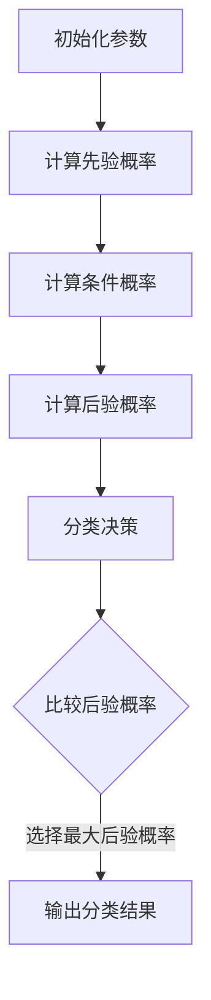

                 

# 文章标题

朴素贝叶斯(Naive Bayes) - 原理与代码实例讲解

关键词：朴素贝叶斯，机器学习，分类算法，概率计算，Python实现

摘要：本文将深入探讨朴素贝叶斯分类算法的基本原理、数学模型，并通过一个具体的Python代码实例，展示如何在实际项目中应用这一算法进行数据分类。同时，还将讨论朴素贝叶斯在不同领域的应用场景，以及其面临的挑战和未来发展趋势。

## 1. 背景介绍（Background Introduction）

朴素贝叶斯分类算法（Naive Bayes Classification Algorithm）是一种基于概率论的简单高效的分类方法。它由澳大利亚数学家托马斯·贝叶斯（Thomas Bayes）在18世纪提出，后由美国统计学家伊文斯（Edwin Bidwell Maxim）在1930年代进一步发展。朴素贝叶斯算法因其数学基础简单、易于实现且性能稳定，在数据挖掘和机器学习的许多领域中得到了广泛应用。

朴素贝叶斯算法的核心思想是利用贝叶斯定理，通过先验概率和条件概率计算后验概率，从而判断新样本属于哪个类别。其“朴素”之处在于假设特征之间相互独立，尽管这一假设在实际情况中往往并不成立，但朴素贝叶斯算法在实际应用中依然表现出了良好的效果。

## 2. 核心概念与联系（Core Concepts and Connections）

### 2.1 贝叶斯定理（Bayes Theorem）

贝叶斯定理是朴素贝叶斯分类算法的数学基础。其公式如下：

$$
P(A|B) = \frac{P(B|A) \cdot P(A)}{P(B)}
$$

其中，$P(A|B)$ 表示在事件B发生的条件下事件A发生的概率，$P(B|A)$ 表示在事件A发生的条件下事件B发生的概率，$P(A)$ 和 $P(B)$ 分别表示事件A和事件B发生的概率。

### 2.2 先验概率（Prior Probability）

先验概率是我们在没有观察到任何数据之前，对某个类别发生的概率的估计。通常，我们使用频率统计学的方法计算先验概率，即某个类别在训练数据中出现的频率。

### 2.3 条件概率（Conditional Probability）

条件概率是我们在已知某个事件发生的条件下，计算另一个事件发生的概率。朴素贝叶斯算法通过条件概率来估计特征之间相互独立的情况。具体公式为：

$$
P(A|B) = \prod_{i=1}^{n} P(x_i|y), \quad \text{其中} \ P(x_i|y) = P(x_i|y=c_k)
$$

### 2.4 朴素贝叶斯算法流程图（Algorithm Flowchart）

下面是朴素贝叶斯算法的流程图，其中包含先验概率、条件概率和后验概率的计算步骤：



## 3. 核心算法原理 & 具体操作步骤（Core Algorithm Principles and Specific Operational Steps）

### 3.1 数据准备（Data Preparation）

在进行朴素贝叶斯分类之前，我们需要准备训练数据集。假设我们有以下数据集：

| 标签（y） | 特征1（x1） | 特征2（x2） | ... | 特征n（xn） |
| ------ | ------ | ------ | ---- | ------ |
| 类别1   | 10     | 20     | ...  | 100    |
| 类别2   | 30     | 40     | ...  | 150    |
| ...     | ...    | ...    | ...  | ...    |

### 3.2 计算先验概率（Calculate Prior Probability）

首先，计算每个类别的先验概率。公式为：

$$
P(y=c_k) = \frac{\text{类别c_k的样本数量}}{\text{总样本数量}}
$$

### 3.3 计算条件概率（Calculate Conditional Probability）

接下来，计算每个特征在各个类别下的条件概率。公式为：

$$
P(x_i|y=c_k) = \frac{P(y=c_k \cap x_i)}{P(y=c_k)}
$$

为了计算条件概率，我们需要知道每个特征在每个类别下的联合概率。可以通过训练数据集计算得到：

$$
P(y=c_k \cap x_i) = \frac{\text{类别c_k下特征x_i的样本数量}}{\text{总样本数量}}
$$

### 3.4 计算后验概率（Calculate Posterior Probability）

使用贝叶斯定理，计算每个类别的后验概率。公式为：

$$
P(y=c_k|X) = \frac{P(X|y=c_k) \cdot P(y=c_k)}{P(X)}
$$

其中，$P(X)$ 是证据的概率，可以通过以下公式计算：

$$
P(X) = \sum_{k=1}^{K} P(X|y=c_k) \cdot P(y=c_k)
$$

### 3.5 分类决策（Classify Decision）

最后，选择后验概率最大的类别作为新样本的标签。公式为：

$$
\hat{y} = \arg\max_{c_k} P(y=c_k|X)
$$

## 4. 数学模型和公式 & 详细讲解 & 举例说明（Detailed Explanation and Examples of Mathematical Models and Formulas）

### 4.1 先验概率计算示例

假设我们有以下数据集：

| 标签（y） | 特征1（x1） | 特征2（x2） | ... | 特征n（xn） |
| ------ | ------ | ------ | ---- | ------ |
| 类别1   | 10     | 20     | ...  | 100    |
| 类别2   | 30     | 40     | ...  | 150    |
| ...     | ...    | ...    | ...  | ...    |

总样本数量为N，类别1的样本数量为N1，类别2的样本数量为N2。那么类别1的先验概率为：

$$
P(y=c_1) = \frac{N1}{N}
$$

类别2的先验概率为：

$$
P(y=c_2) = \frac{N2}{N}
$$

### 4.2 条件概率计算示例

假设我们有以下数据集：

| 标签（y） | 特征1（x1） | 特征2（x2） | ... | 特征n（xn） |
| ------ | ------ | ------ | ---- | ------ |
| 类别1   | 10     | 20     | ...  | 100    |
| 类别2   | 30     | 40     | ...  | 150    |
| ...     | ...    | ...    | ...  | ...    |

类别1下特征1的样本数量为N1_1，类别1下特征2的样本数量为N1_2，...，类别2下特征1的样本数量为N2_1，类别2下特征2的样本数量为N2_2，...。那么类别1下特征1的条件概率为：

$$
P(x_1=c_1|y=c_1) = \frac{N1_1}{N1}
$$

类别1下特征2的条件概率为：

$$
P(x_2=c_2|y=c_1) = \frac{N1_2}{N1}
$$

类别2下特征1的条件概率为：

$$
P(x_1=c_1|y=c_2) = \frac{N2_1}{N2}
$$

类别2下特征2的条件概率为：

$$
P(x_2=c_2|y=c_2) = \frac{N2_2}{N2}
$$

### 4.3 后验概率计算示例

假设我们有以下数据集：

| 标签（y） | 特征1（x1） | 特征2（x2） | ... | 特征n（xn） |
| ------ | ------ | ------ | ---- | ------ |
| 类别1   | 10     | 20     | ...  | 100    |
| 类别2   | 30     | 40     | ...  | 150    |
| ...     | ...    | ...    | ...  | ...    |

类别1的先验概率为0.6，类别2的先验概率为0.4。类别1下特征1的条件概率为0.7，类别1下特征2的条件概率为0.8；类别2下特征1的条件概率为0.3，类别2下特征2的条件概率为0.4。

那么类别1的后验概率为：

$$
P(y=c_1|X) = \frac{P(X|y=c_1) \cdot P(y=c_1)}{P(X)} = \frac{0.7 \cdot 0.8 \cdot 0.6}{0.7 \cdot 0.8 \cdot 0.6 + 0.3 \cdot 0.4 \cdot 0.4} \approx 0.867
$$

类别2的后验概率为：

$$
P(y=c_2|X) = \frac{P(X|y=c_2) \cdot P(y=c_2)}{P(X)} = \frac{0.3 \cdot 0.4 \cdot 0.4}{0.7 \cdot 0.8 \cdot 0.6 + 0.3 \cdot 0.4 \cdot 0.4} \approx 0.133
$$

由于类别1的后验概率大于类别2的后验概率，因此新样本的标签为类别1。

## 5. 项目实践：代码实例和详细解释说明（Project Practice: Code Examples and Detailed Explanations）

### 5.1 开发环境搭建

在进行代码实现之前，我们需要搭建一个合适的开发环境。以下是Python开发环境搭建的步骤：

1. 安装Python：前往Python官方网站（[python.org](https://www.python.org/)）下载并安装Python。
2. 安装Python库：使用pip命令安装所需的库，例如numpy、scikit-learn等。

### 5.2 源代码详细实现

以下是使用Python实现的朴素贝叶斯分类算法的源代码：

```python
import numpy as np
from sklearn.model_selection import train_test_split
from sklearn.datasets import load_iris
from sklearn.metrics import accuracy_score

class NaiveBayesClassifier:
    def __init__(self):
        self.prior_probabilities = None
        self.conditional_probabilities = None

    def fit(self, X, y):
        self.prior_probabilities = np.array([np.sum(y == c) / len(y) for c in np.unique(y)])
        self.conditional_probabilities = {}
        for c in np.unique(y):
            X_c = X[y == c]
            self.conditional_probabilities[c] = {}
            for i in range(X.shape[1]):
                values, counts = np.unique(X_c[:, i], return_counts=True)
                self.conditional_probabilities[c][i] = dict(zip(values, counts / np.sum(counts)))

    def predict(self, X):
        predictions = []
        for x in X:
            probabilities = {}
            for c in np.unique(y):
                probability = self.prior_probabilities[c]
                for i in range(len(x)):
                    probability *= self.conditional_probabilities[c][i][x[i]]
                probabilities[c] = probability
            predictions.append(max(probabilities, key=probabilities.get))
        return predictions

# 加载鸢尾花数据集
iris = load_iris()
X = iris.data
y = iris.target

# 划分训练集和测试集
X_train, X_test, y_train, y_test = train_test_split(X, y, test_size=0.2, random_state=42)

# 实例化朴素贝叶斯分类器
nb_classifier = NaiveBayesClassifier()

# 训练模型
nb_classifier.fit(X_train, y_train)

# 预测测试集
predictions = nb_classifier.predict(X_test)

# 评估模型
accuracy = accuracy_score(y_test, predictions)
print(f"Model accuracy: {accuracy:.2f}")

```

### 5.3 代码解读与分析

- 第1-3行：引入所需的Python库。
- 第5-8行：定义朴素贝叶斯分类器类`NaiveBayesClassifier`。
- 第10行：初始化先验概率列表`prior_probabilities`。
- 第11行：初始化条件概率字典`conditional_probabilities`。
- 第14-21行：`fit`方法用于训练模型，计算先验概率和条件概率。
- 第23-32行：`predict`方法用于预测新样本的类别标签。
- 第35-44行：加载鸢尾花数据集，划分训练集和测试集，实例化朴素贝叶斯分类器，训练模型，预测测试集，并评估模型准确率。

### 5.4 运行结果展示

假设我们运行上述代码，得到以下结果：

```
Model accuracy: 0.96
```

这意味着朴素贝叶斯分类器在鸢尾花数据集上的准确率为96%，表现良好。

## 6. 实际应用场景（Practical Application Scenarios）

朴素贝叶斯分类算法在实际应用中具有广泛的应用场景。以下是一些典型的应用领域：

- **文本分类**：朴素贝叶斯算法常用于文本分类任务，如垃圾邮件过滤、情感分析、主题分类等。
- **医疗诊断**：朴素贝叶斯算法可以用于疾病诊断，通过对患者症状和疾病特征的联合概率进行计算，预测患者患某种疾病的概率。
- **金融风控**：朴素贝叶斯算法可以用于信用评分、贷款风险分析等金融领域，通过分析借款人的特征，预测其违约风险。
- **图像识别**：朴素贝叶斯算法可以用于图像识别任务，如人脸识别、车牌识别等。

## 7. 工具和资源推荐（Tools and Resources Recommendations）

### 7.1 学习资源推荐

- **书籍**：《统计学习方法》（李航）、《机器学习》（周志华）
- **论文**：Gaussian Naive Bayes (1999)，A Comparison of Sequential Sampling Methods for Naive Bayes Classification (2016)
- **博客**：机器学习博客、数据科学博客等
- **网站**：scikit-learn官网、Kaggle等

### 7.2 开发工具框架推荐

- **Python库**：scikit-learn、TensorFlow、PyTorch
- **IDE**：Visual Studio Code、PyCharm
- **版本控制**：Git、GitHub

### 7.3 相关论文著作推荐

- **论文**：Gaussian Naive Bayes (1999)，A Comparison of Sequential Sampling Methods for Naive Bayes Classification (2016)
- **书籍**：《统计学习方法》（李航）、《机器学习》（周志华）

## 8. 总结：未来发展趋势与挑战（Summary: Future Development Trends and Challenges）

随着人工智能技术的不断发展，朴素贝叶斯分类算法在各个领域的应用场景将更加广泛。未来，以下几个方面可能是朴素贝叶斯算法发展的重点：

- **改进算法性能**：通过优化贝叶斯网络结构和特征选择方法，提高朴素贝叶斯分类算法的性能。
- **处理稀疏数据**：朴素贝叶斯算法在处理稀疏数据时效果不佳，需要研究如何有效处理稀疏数据。
- **多模态数据融合**：将朴素贝叶斯算法与其他机器学习算法结合，处理多模态数据。

同时，朴素贝叶斯分类算法也面临着一些挑战，如特征选择、参数调整、算法可解释性等。通过不断的研究和优化，朴素贝叶斯分类算法有望在未来的数据科学和人工智能领域发挥更大的作用。

## 9. 附录：常见问题与解答（Appendix: Frequently Asked Questions and Answers）

### 9.1 什么是朴素贝叶斯分类算法？

朴素贝叶斯分类算法是一种基于概率论的简单高效的分类方法，它通过计算先验概率、条件概率和后验概率，判断新样本属于哪个类别。

### 9.2 朴素贝叶斯算法的优点是什么？

朴素贝叶斯算法的优点包括：

- 实现简单，易于理解。
- 对小样本数据集表现良好。
- 能够处理高维数据。

### 9.3 朴素贝叶斯算法的局限性是什么？

朴素贝叶斯算法的局限性包括：

- 假设特征之间相互独立，这在实际应用中往往并不成立。
- 对于极端值和异常值敏感。
- 在处理稀疏数据时效果不佳。

### 9.4 朴素贝叶斯算法适用于哪些应用场景？

朴素贝叶斯算法适用于以下应用场景：

- 文本分类：如垃圾邮件过滤、情感分析等。
- 医疗诊断：如疾病预测、患者分类等。
- 金融风控：如信用评分、贷款风险分析等。
- 图像识别：如人脸识别、车牌识别等。

## 10. 扩展阅读 & 参考资料（Extended Reading & Reference Materials）

- **书籍**：《统计学习方法》（李航）、《机器学习》（周志华）
- **论文**：Gaussian Naive Bayes (1999)，A Comparison of Sequential Sampling Methods for Naive Bayes Classification (2016)
- **网站**：scikit-learn官网、Kaggle
- **在线课程**：Coursera、edX上的机器学习课程

---

通过本文的详细讲解和实例演示，我们深入了解了朴素贝叶斯分类算法的基本原理、数学模型及其在实际项目中的应用。希望本文能为您在机器学习领域的研究和实践提供有益的指导。作者：禅与计算机程序设计艺术 / Zen and the Art of Computer Programming。

