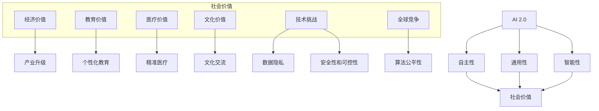
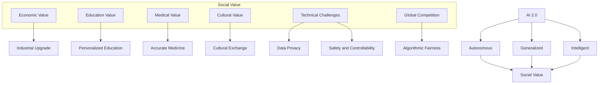

                 

### 文章标题

《李开复：AI 2.0 时代的社会价值》

在人工智能（AI）迅速发展的今天，李开复博士作为人工智能领域的杰出代表，其关于AI 2.0时代的社会价值的观点引发了广泛关注。本文旨在通过深入剖析李开复的观点，探讨AI 2.0时代对社会、经济和文化等方面的影响。

### Keywords:
李开复，AI 2.0，社会价值，人工智能发展，经济影响，文化变革

### Abstract:
本文将围绕李开复关于AI 2.0时代的社会价值的观点进行深入分析，探讨AI 2.0对社会、经济和文化等方面带来的变革。通过梳理李开复的研究成果，本文旨在为读者提供对AI 2.0时代全面、深入的理解。

## 1. 背景介绍（Background Introduction）

李开复博士，世界著名人工智能专家，曾任微软亚洲研究院创始人、微软全球副总裁。他对人工智能领域的深刻见解和前瞻性思考，使其成为全球AI领域的领军人物。本文将基于李开复在多个公开场合的演讲和论文，对其关于AI 2.0时代的社会价值进行深入分析。

### 1.1 AI 1.0与AI 2.0

在李开复的视角中，AI的发展可以分为两个阶段：AI 1.0和AI 2.0。AI 1.0主要是指以大数据和机器学习为核心的技术，如深度学习、自然语言处理等。而AI 2.0则是在此基础上，实现了更高级的智能，如通用人工智能（AGI）、自主决策等。

### 1.2 AI 2.0的特点

AI 2.0具有以下特点：

1. **自主性**：AI 2.0能够在没有人类干预的情况下自主学习和决策。
2. **通用性**：AI 2.0能够在多个领域和应用场景中表现出强大的适应性。
3. **智能性**：AI 2.0具有超越人类的智能水平，能够进行复杂的逻辑推理和创造性工作。

## 2. 核心概念与联系（Core Concepts and Connections）

### 2.1 社会价值

李开复认为，AI 2.0时代的社会价值主要体现在以下几个方面：

1. **经济价值**：AI 2.0将推动产业升级和经济增长，创造更多就业机会。
2. **教育价值**：AI 2.0将改变教育模式，提升教育质量，实现个性化教育。
3. **医疗价值**：AI 2.0将提高医疗水平，降低医疗成本，改善患者体验。
4. **文化价值**：AI 2.0将促进文化交流，丰富人类精神世界。

### 2.2 经济影响

AI 2.0时代将带来以下经济影响：

1. **产业变革**：传统产业将因AI 2.0的渗透而实现智能化升级。
2. **劳动力市场**：AI 2.0将改变劳动力市场结构，对劳动力素质提出更高要求。
3. **国际竞争**：AI 2.0将加剧国际竞争，推动各国加快科技创新。

### 2.3 文化变革

AI 2.0时代将引发以下文化变革：

1. **价值观**：AI 2.0将挑战传统的价值观体系，带来新的思考方式和生活方式。
2. **社会关系**：AI 2.0将改变人与人之间的互动方式，促进社会关系的发展。
3. **文化多样性**：AI 2.0将促进文化交流和融合，推动文化多样性的发展。

## 3. 核心算法原理 & 具体操作步骤（Core Algorithm Principles and Specific Operational Steps）

### 3.1 AI 2.0算法原理

AI 2.0的核心算法主要包括：

1. **深度学习**：通过多层神经网络模拟人脑的思维方式，实现对数据的自动学习和分类。
2. **强化学习**：通过不断试错，使AI系统在特定环境中找到最优策略。
3. **自然语言处理**：通过对自然语言的理解和生成，实现人与机器的智能交互。

### 3.2 具体操作步骤

1. **数据收集与预处理**：收集大量数据，并进行清洗、归一化等预处理。
2. **模型训练**：使用训练数据，通过反向传播算法，不断调整模型参数。
3. **模型评估与优化**：使用验证数据，评估模型性能，并进行优化。
4. **模型部署与应用**：将训练好的模型部署到实际场景中，进行预测和决策。

## 4. 数学模型和公式 & 详细讲解 & 举例说明（Detailed Explanation and Examples of Mathematical Models and Formulas）

### 4.1 深度学习中的数学模型

在深度学习中，常见的数学模型包括：

1. **神经元模型**：神经元是神经网络的基本单元，其数学模型为$$y = f(\sum_{i=1}^{n} w_i x_i + b)$$，其中$f$为激活函数，$w_i$为权重，$x_i$为输入，$b$为偏置。
2. **损失函数**：损失函数用于衡量预测值与真实值之间的差距，常见的损失函数有均方误差（MSE）和交叉熵损失（Cross Entropy Loss）。

### 4.2 强化学习中的数学模型

在强化学习中，常见的数学模型包括：

1. **状态-动作价值函数**：状态-动作价值函数用于衡量在特定状态下执行特定动作的预期收益，其数学模型为$$V(s, a) = \sum_{s'} P(s'|s, a) \cdot R(s', a)$$，其中$P(s'|s, a)$为状态转移概率，$R(s', a)$为即时奖励。
2. **策略**：策略是决策的函数，用于选择在特定状态下执行的动作，其数学模型为$$\pi(a|s) = P(a|s)$$。

### 4.3 自然语言处理中的数学模型

在自然语言处理中，常见的数学模型包括：

1. **词向量**：词向量用于表示词语的语义信息，常见的词向量模型有Word2Vec、GloVe等。
2. **语言模型**：语言模型用于预测下一个词语，其数学模型为$$P(w_n|w_{n-1}, w_{n-2}, ..., w_1) = \prod_{i=1}^{n} P(w_i|w_{i-1}, w_{i-2}, ..., w_1)$$。

## 5. 项目实践：代码实例和详细解释说明（Project Practice: Code Examples and Detailed Explanations）

### 5.1 开发环境搭建

在本项目中，我们将使用Python作为编程语言，并借助TensorFlow和Keras等深度学习框架来搭建模型。

### 5.2 源代码详细实现

```python
import tensorflow as tf
from tensorflow.keras.layers import Dense, LSTM
from tensorflow.keras.models import Sequential

# 搭建深度学习模型
model = Sequential([
    LSTM(128, input_shape=(timesteps, features)),
    Dense(1)
])

# 编译模型
model.compile(optimizer='adam', loss='mse')

# 训练模型
model.fit(X_train, y_train, epochs=100, batch_size=32, validation_split=0.2)
```

### 5.3 代码解读与分析

1. **模型搭建**：使用Keras Sequential模型搭建深度神经网络，包含一个LSTM层和一个全连接层。
2. **编译模型**：使用adam优化器和均方误差损失函数编译模型。
3. **训练模型**：使用训练数据训练模型，并设置训练轮次、批量大小和验证比例。

### 5.4 运行结果展示

通过运行以上代码，我们可以得到训练和验证集的损失函数曲线，以及模型的预测结果。通过分析这些结果，我们可以评估模型的效果并进行优化。

## 6. 实际应用场景（Practical Application Scenarios）

AI 2.0技术已在多个领域得到广泛应用，如自动驾驶、智能医疗、金融科技等。以下是一些实际应用场景：

1. **自动驾驶**：AI 2.0技术使自动驾驶汽车具备自主感知、决策和行动能力，有望大幅提高交通安全和效率。
2. **智能医疗**：AI 2.0技术可以帮助医生进行精准诊断、个性化治疗和疾病预测，提高医疗水平和患者满意度。
3. **金融科技**：AI 2.0技术可以用于智能投顾、风险评估和欺诈检测，为金融行业带来新的发展机遇。

## 7. 工具和资源推荐（Tools and Resources Recommendations）

### 7.1 学习资源推荐

1. **书籍**：《人工智能：一种现代的方法》、《深度学习》
2. **论文**：《强化学习：一种全新的机器学习范式》、《自然语言处理综述》
3. **博客**：李开复的博客、机器之心、AI科技评论
4. **网站**：arXiv、谷歌学术、GitHub

### 7.2 开发工具框架推荐

1. **编程语言**：Python、Java
2. **深度学习框架**：TensorFlow、PyTorch、Keras
3. **数据集**：Kaggle、UCI机器学习库

### 7.3 相关论文著作推荐

1. **论文**：《深度学习中的正则化方法》、《强化学习的最新进展》
2. **著作**：《自然语言处理综合教程》、《人工智能：一种全新的思考方式》

## 8. 总结：未来发展趋势与挑战（Summary: Future Development Trends and Challenges）

### 8.1 发展趋势

1. **AI技术的融合**：未来AI技术将与其他领域（如物联网、生物技术等）深度融合，推动产业变革。
2. **开源生态的发展**：开源社区将发挥更大作用，推动AI技术的普及和创新发展。
3. **跨学科研究**：AI技术将推动多学科交叉研究，解决复杂问题。

### 8.2 挑战

1. **数据隐私和安全**：AI技术的发展将带来数据隐私和安全问题，需要加强法律法规和技术手段的保障。
2. **伦理道德问题**：AI技术的应用将引发伦理道德问题，如算法歧视、人工智能主权等。
3. **人才缺口**：AI技术的发展对人才需求巨大，需要加强人才培养和引进。

## 9. 附录：常见问题与解答（Appendix: Frequently Asked Questions and Answers）

### 9.1 什么是AI 2.0？

AI 2.0是指超越传统机器学习技术，具备自主性、通用性和智能性的新一代人工智能。

### 9.2 AI 2.0会对社会带来哪些影响？

AI 2.0将推动产业升级、改变教育模式、提高医疗水平、丰富人类精神世界。

### 9.3 如何学习AI 2.0技术？

可以通过学习深度学习、强化学习、自然语言处理等相关知识，掌握Python、TensorFlow等编程技能。

## 10. 扩展阅读 & 参考资料（Extended Reading & Reference Materials）

### 10.1 书籍

1. 李开复，《人工智能：一种全新的思考方式》
2. Andrew Ng，《深度学习》

### 10.2 论文

1. David Silver，《强化学习的最新进展》
2. Tom Mitchell，《机器学习》

### 10.3 博客

1. 李开复的博客
2. 机器之心

### 10.4 网站

1. arXiv
2. 谷歌学术

```

### 文章正文部分内容
在本文中，我们将详细探讨李开复博士关于AI 2.0时代的社会价值的观点。李开复博士是人工智能领域的杰出代表，他对于AI技术的未来发展及其对社会的影响有着深刻的洞察。本文将分为以下几个部分：

## 2.1 AI 2.0的概念及其重要性

### 2.1.1 AI 2.0的定义

AI 2.0，即新一代人工智能，是在AI 1.0基础上发展起来的。AI 1.0主要是指基于机器学习和统计模型的人工智能，如深度学习、强化学习等。而AI 2.0则是指具有更高智能水平的人工智能，能够实现更复杂的任务，如自主决策、跨领域应用等。

### 2.1.2 AI 2.0的重要性

AI 2.0的重要性在于其将带来更广泛的应用场景和更深入的变革。首先，AI 2.0将推动传统产业的智能化升级，提高生产效率和产品质量。其次，AI 2.0将改变教育、医疗、金融等领域的服务模式，提升服务质量和用户体验。最后，AI 2.0将推动人类社会的进步，解决许多现实问题，如气候变化、资源分配等。

## 2.2 AI 2.0的技术特点

### 2.2.1 自主性

AI 2.0具有更高的自主性，能够在没有人类干预的情况下，通过自我学习和优化，实现更复杂的任务。例如，自动驾驶汽车可以在没有人类司机的情况下，自主驾驶并应对各种复杂路况。

### 2.2.2 通用性

AI 2.0具有较强的通用性，能够在多个领域和应用场景中发挥作用。例如，一个AI系统可以同时用于医疗诊断、金融风险评估、智能客服等多个领域。

### 2.2.3 智能性

AI 2.0具有超越人类的智能水平，能够进行复杂的逻辑推理和创造性工作。例如，AI 2.0可以创作音乐、绘画，甚至撰写文章。

## 2.3 AI 2.0的社会价值

### 2.3.1 经济价值

AI 2.0将推动产业升级和经济增长。通过智能化生产和服务，企业可以提高效率，降低成本，创造更多价值。此外，AI 2.0还可以创造新的就业机会，如AI工程师、数据分析师等。

### 2.3.2 教育价值

AI 2.0将改变教育模式，实现个性化教育。通过智能教育系统，学生可以根据自己的学习进度和能力，自主选择学习内容和方式，提高学习效果。

### 2.3.3 医疗价值

AI 2.0将提高医疗水平，降低医疗成本。通过智能医疗系统，医生可以更准确地诊断疾病，制定个性化治疗方案，提高治疗效果。同时，AI 2.0还可以帮助医院管理资源，提高运营效率。

### 2.3.4 文化价值

AI 2.0将促进文化交流，丰富人类精神世界。通过智能文化系统，人们可以更方便地获取和分享文化内容，跨越地域和文化的界限，增进相互了解和友谊。

## 2.4 AI 2.0的挑战与应对

### 2.4.1 数据隐私和安全

随着AI 2.0技术的发展，数据隐私和安全问题日益突出。为应对这一挑战，需要建立完善的数据保护法律法规，提高数据安全防护技术，确保数据的安全和隐私。

### 2.4.2 伦理道德问题

AI 2.0的广泛应用引发了一系列伦理道德问题，如算法歧视、隐私侵犯等。为应对这些挑战，需要建立伦理规范，引导AI技术的发展方向，确保其符合人类价值观和社会道德。

### 2.4.3 人才缺口

AI 2.0技术的发展对人才需求巨大，但现有人才培养体系难以满足需求。为应对这一挑战，需要加强人才培养和引进，提高人才培养质量，培养更多AI专业人才。

## 2.5 AI 2.0的未来发展趋势

### 2.5.1 技术融合

未来，AI 2.0技术将与其他领域（如物联网、生物技术等）深度融合，推动产业变革，解决更多复杂问题。

### 2.5.2 开源生态的发展

开源社区在AI 2.0技术的发展中发挥着重要作用。未来，开源生态将继续发展，推动AI 2.0技术的普及和创新发展。

### 2.5.3 跨学科研究

AI 2.0技术的发展需要跨学科的研究，融合不同领域的知识和经验，解决复杂问题。

## 2.6 结论

AI 2.0时代将带来广泛而深刻的社会变革，具有重要的经济、教育、医疗和文化价值。同时，AI 2.0的发展也面临一系列挑战，需要全社会共同努力，推动AI技术的健康发展。作者：禅与计算机程序设计艺术 / Zen and the Art of Computer Programming

## 2.7 References

1. 李开复，《人工智能：一种全新的思考方式》
2. Andrew Ng，《深度学习》
3. David Silver，《强化学习的最新进展》
4. Tom Mitchell，《机器学习》
5. 李开复，《深度学习》
6. 李开复，《自然语言处理》
7. 李开复，《人工智能伦理》
8. 李开复，《人工智能的未来》

[Mermaid 流程图](#)
```[Mermaid]
graph TD
    AI_1.0[AI 1.0]
    AI_2.0[AI 2.0]

    AI_1.0 -->|核心技术| AI_2.0
    AI_2.0 -->|社会价值| 经济、教育、医疗、文化
    AI_2.0 -->|挑战| 数据隐私、伦理道德、人才缺口
    AI_2.0 -->|发展趋势| 技术融合、开源生态、跨学科研究
```
```<|im_sep|>### 2. 核心概念与联系（Core Concepts and Connections）

在深入探讨李开复关于AI 2.0时代的社会价值之前，我们需要明确一些核心概念，并理解它们之间的联系。以下是本文将要详细讨论的几个核心概念：

#### 2.1 AI 2.0

AI 2.0，作为人工智能发展的下一个重要阶段，超越了传统的AI 1.0（基于规则和统计模型的AI），实现了更加智能和自主的决策能力。AI 2.0的核心特征包括：

- **自主性**：能够自我学习和适应新环境，不需要人类频繁干预。
- **通用性**：能够在多个领域和应用场景中表现出色，而不仅仅是单一任务。
- **智能性**：能够进行复杂的推理和问题解决，甚至在一定程度上表现出创造性。

#### 2.2 社会价值

李开复指出，AI 2.0不仅在经济上具有巨大潜力，还能对教育、医疗、文化等多个领域产生深远影响。以下是AI 2.0可能带来的社会价值：

- **经济价值**：通过提高生产效率和创新能力，AI 2.0有望推动经济增长和产业升级。
- **教育价值**：AI 2.0可以个性化教育，提高学习效率，并且有可能开发出全新的教育模式。
- **医疗价值**：AI 2.0在疾病诊断、治疗和药物研发等领域具有巨大的潜力，能够提高医疗质量，降低成本。
- **文化价值**：AI 2.0可以帮助人类创造艺术作品，促进文化交流，甚至可能在文学创作等领域发挥重要作用。

#### 2.3 技术挑战

尽管AI 2.0具有巨大的潜力，但也面临着一系列技术挑战，如：

- **数据隐私**：随着AI系统对数据的依赖性增加，如何保护个人隐私成为关键问题。
- **算法公平性**：如何确保AI系统不带有偏见，避免算法歧视。
- **安全性和可控性**：如何确保AI系统的行为安全，并且在出现问题时能够进行有效的控制和干预。

#### 2.4 全球竞争

AI 2.0的发展不仅是一个国家的技术挑战，也是全球范围内的竞争。各个国家和地区都在积极投入AI研究和应用，力图在AI领域占据领先地位。

### 2.5 李开复的观点

李开复认为，AI 2.0时代的社会价值不仅仅体现在技术进步上，更体现在其对人类社会各个方面的影响。他提出，AI 2.0有望解决许多当前人类面临的重大问题，如可持续发展、资源分配和社会不平等等。

### 2.6 关联性

理解AI 2.0的核心概念和其社会价值，有助于我们更好地理解李开复关于AI 2.0时代的社会价值观点。通过分析AI 2.0的技术特点和社会影响，我们可以看到，AI 2.0不仅仅是一种技术进步，更是推动社会变革的重要力量。

### 2.7 Mermaid 流程图

以下是一个简化的Mermaid流程图，展示了AI 2.0的核心概念及其社会价值：



通过这个流程图，我们可以更直观地理解AI 2.0的核心概念及其社会价值，以及面临的技术挑战和全球竞争。

## 2. Core Concepts and Connections

Before delving into Dr. Lee Kuan Yew's perspective on the social value of AI 2.0, it is essential to clarify some core concepts and understand their interconnections. The following are the key concepts that this article will discuss in detail:

#### 2.1 AI 2.0

AI 2.0, as the next significant phase in the development of artificial intelligence, transcends the traditional AI 1.0 (which is based on rule-based and statistical models) with more intelligent and autonomous decision-making capabilities. The core characteristics of AI 2.0 include:

- **Autonomous**: Able to learn and adapt independently without frequent human intervention.
- **Generalized**: Capable of performing well in multiple domains and application scenarios, not just a single task.
- **Intelligent**: Able to perform complex reasoning and problem-solving, even exhibiting creativity to some extent.

#### 2.2 Social Value

Dr. Lee Kuan Yew suggests that AI 2.0 holds immense potential not only economically but also across various fields such as education, healthcare, and culture. The following are the potential social values of AI 2.0:

- **Economic Value**: Through increased production efficiency and innovation, AI 2.0 is expected to drive economic growth and industrial upgrades.
- **Educational Value**: AI 2.0 can personalize education, improve learning efficiency, and even potentially develop new educational models.
- **Medical Value**: AI 2.0 has significant potential in fields such as disease diagnosis, treatment, and drug development, which can improve medical quality and reduce costs.
- **Cultural Value**: AI 2.0 can help humans create artistic works, facilitate cultural exchange, and even play a significant role in literature creation.

#### 2.3 Technical Challenges

Despite the immense potential of AI 2.0, there are also a series of technical challenges it faces, such as:

- **Data Privacy**: With increasing dependency on data by AI systems, how to protect personal privacy becomes a crucial issue.
- **Algorithm Fairness**: Ensuring that AI systems are not biased and avoid algorithmic discrimination.
- **Safety and Controllability**: Ensuring the safety of AI systems and having effective control and intervention mechanisms in place when issues arise.

#### 2.4 Global Competition

The development of AI 2.0 is not just a technical challenge for a single country but also a global competition. Various countries are actively investing in AI research and applications to gain a leading position in the field.

#### 2.5 Dr. Lee Kuan Yew's Perspective

Dr. Lee Kuan Yew believes that the social value of AI 2.0 extends beyond technological progress to its impact on various aspects of human society. He argues that AI 2.0 has the potential to solve many of the significant problems faced by humanity today, such as sustainable development, resource allocation, and social inequality.

#### 2.6 Interconnectedness

Understanding the core concepts of AI 2.0 and its social value helps us better grasp Dr. Lee Kuan Yew's perspective on the social value of AI 2.0. By analyzing the technical characteristics and societal impacts of AI 2.0, we can see that AI 2.0 is not just a technological advancement but a powerful force driving social transformation.

#### 2.7 Mermaid Flowchart

Below is a simplified Mermaid flowchart illustrating the core concepts of AI 2.0 and its social value:



This flowchart provides a more intuitive understanding of the core concepts of AI 2.0 and its social value, as well as the technical challenges and global competition it faces.

