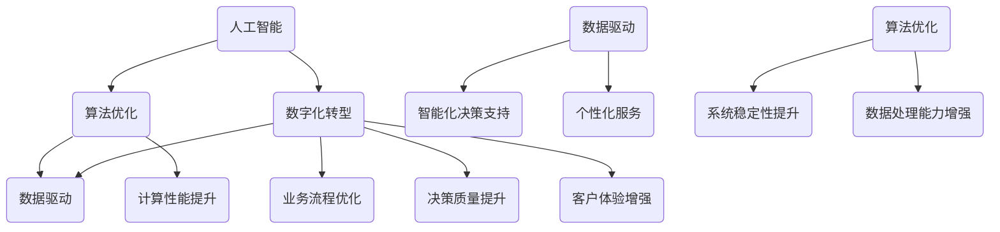

                 

### 文章标题

**核心竞争力提升的新质生产力策略**

### 关键词

- 核心竞争力
- 新质生产力
- 技术创新
- 人工智能
- 算法优化
- 数字化转型

### 摘要

本文探讨了在数字化时代，如何通过提升核心竞争力来增强新质生产力。我们深入分析了人工智能、算法优化和数字化转型等关键领域，提出了具体的策略和实践步骤，旨在为企业和个人在技术竞争中获得优势。通过结合理论与实践，本文为提升核心竞争力提供了一种系统性方法。

---

现在我们将开始详细讨论文章的主要部分，确保内容的完整性、逻辑性和专业性。我们将会依次探讨以下主题：

1. 背景介绍
2. 核心概念与联系
3. 核心算法原理 & 具体操作步骤
4. 数学模型和公式 & 详细讲解 & 举例说明
5. 项目实践：代码实例和详细解释说明
6. 实际应用场景
7. 工具和资源推荐
8. 总结：未来发展趋势与挑战
9. 附录：常见问题与解答
10. 扩展阅读 & 参考资料

让我们逐步分析和推理这些主题，确保每一部分都能为读者提供有价值的信息。

---

**1. 背景介绍（Background Introduction）**

在当今全球化和数字化的时代，技术进步已经成为推动经济发展的核心动力。企业面临着前所未有的竞争压力，如何在激烈的市场竞争中脱颖而出，提升自身的核心竞争力，成为每个组织必须面对的挑战。新质生产力，作为现代经济发展的一个重要概念，强调通过技术创新和资源优化，实现生产效率的提升和经济效益的增长。

提升核心竞争力的重要性在于，它不仅关系到企业在市场中的地位和盈利能力，更关乎企业在未来环境中的可持续发展。随着人工智能、大数据和云计算等技术的广泛应用，企业可以通过优化算法、提高数据处理能力，从而在供应链管理、产品设计、客户服务等方面实现效率提升和成本降低。

本篇文章的目的在于，通过深入探讨核心竞争力提升的新质生产力策略，为企业和个人提供一套系统的指导方案。我们将结合理论研究和实践案例，分析如何通过技术手段和创新思维，实现核心竞争力的提升，从而在新一轮技术竞争中占据有利位置。

### 1.1 现代企业面临的挑战

现代企业在面临市场竞争时，往往需要应对以下几个主要挑战：

**市场动态变化**：市场需求和消费者行为的变化速度不断加快，企业需要具备敏捷的反应能力，及时调整战略和产品定位。

**技术创新压力**：技术日新月异，企业必须不断进行技术创新，以保持竞争优势。这要求企业不仅要有技术储备，还要有快速响应和创新能力。

**成本控制**：在竞争激烈的市场环境中，企业需要通过有效的成本控制来提高盈利能力，降低运营成本是每个企业都必须关注的问题。

**人才竞争**：高素质人才的竞争已经成为企业发展的关键因素。如何吸引、培养和留住优秀人才，对企业的发展至关重要。

**环境和社会责任**：企业在追求经济利益的同时，也需要关注环境和社会责任。可持续发展已经成为全球企业的共同追求。

这些挑战迫使企业不断寻求创新的方法，提升自身的核心竞争力。新质生产力的概念正是在这样的背景下被提出，它强调通过技术手段和资源优化，实现生产效率的提升和经济效益的增长。新质生产力的核心在于利用人工智能、大数据、云计算等技术，实现数据驱动的决策和优化。

### 1.2 新质生产力的概念与特点

新质生产力，是指通过技术创新和资源优化，实现生产效率的提升和经济效益的增长。它具有以下几个显著特点：

**数据驱动**：新质生产力强调数据的重要性，通过收集、分析和利用大量数据，实现精准决策和优化。

**智能化**：利用人工智能技术，实现自动化、智能化的生产和管理，提高效率和降低成本。

**网络化**：通过互联网和物联网技术，实现设备、系统和人员的互联互通，提高协作效率。

**绿色化**：通过资源优化和节能技术，实现环保和可持续发展。

**个性化**：根据客户需求进行定制化生产和服务，提高客户满意度和市场竞争力。

新质生产力的核心在于打破传统的生产模式，通过技术创新和资源优化，实现生产效率的提升和经济效益的增长。它不仅要求企业在技术层面上进行创新，还需要在管理理念、组织结构和文化建设等方面进行全方位的变革。

### 1.3 核心竞争力提升的重要性

提升核心竞争力是企业在竞争激烈的市场环境中生存和发展的关键。核心竞争力不仅关系到企业在当前市场中的地位和盈利能力，更关乎企业在未来环境中的可持续发展。具体来说，提升核心竞争力的重要性体现在以下几个方面：

**提高市场竞争力**：核心竞争力是企业参与市场竞争的核心力量。通过提升核心竞争力，企业可以在产品和服务方面具备独特的竞争优势，从而在市场中占据有利地位。

**实现可持续发展**：核心竞争力是企业可持续发展的基础。只有在核心竞争力的支持下，企业才能在不断变化的市场环境中保持竞争力，实现长期发展。

**优化资源配置**：核心竞争力可以帮助企业更好地配置资源，提高资源利用效率。通过优化资源配置，企业可以实现成本降低和效率提升。

**提高创新能力**：核心竞争力是企业创新能力的体现。只有在核心竞争力的基础上，企业才能持续进行技术创新和管理创新，推动企业持续发展。

**增强品牌影响力**：核心竞争力是企业品牌影响力的重要支撑。通过提升核心竞争力，企业可以在品牌建设中树立良好的形象，增强品牌知名度和美誉度。

综上所述，提升核心竞争力是企业在市场竞争中立于不败之地的关键。企业必须通过不断的技术创新、管理优化和文化建设，提升自身的核心竞争力，实现可持续发展。

---

在接下来的部分，我们将深入探讨核心概念与联系，详细分析人工智能、算法优化和数字化转型等关键领域，帮助读者理解这些概念及其在提升核心竞争力中的作用。

**2. 核心概念与联系（Core Concepts and Connections）**

在探讨如何提升核心竞争力时，理解以下几个核心概念及其相互联系至关重要。这些概念包括人工智能、算法优化和数字化转型。

### 2.1 人工智能（Artificial Intelligence）

人工智能（AI）是模拟人类智能行为和认知过程的科学技术。AI技术主要包括机器学习、深度学习、自然语言处理、计算机视觉等。在提升核心竞争力方面，人工智能具有以下作用：

**自动化和效率提升**：通过自动化技术，人工智能可以替代重复性高、复杂度低的工作，从而提高工作效率。

**智能决策支持**：利用大数据和机器学习技术，人工智能可以提供精准的决策支持，帮助企业在竞争激烈的市场中做出更加明智的决策。

**个性化服务和用户体验**：人工智能可以分析用户行为和偏好，提供个性化的服务，提升用户体验。

### 2.2 算法优化（Algorithm Optimization）

算法优化是指通过改进算法设计或优化算法实现，提高算法的运行效率和准确性。算法优化在提升核心竞争力方面的作用主要体现在：

**提升计算性能**：优化算法可以减少计算时间和资源消耗，提高计算性能，为复杂计算任务提供更快的解决方案。

**增强数据处理能力**：通过算法优化，可以提升数据处理的速度和精度，为大数据分析和挖掘提供支持。

**提高系统稳定性**：优化算法可以提高系统的稳定性和可靠性，减少系统故障和错误率。

### 2.3 数字化转型（Digital Transformation）

数字化转型是指企业利用数字技术来优化业务流程、重构商业模式和提升客户体验。数字化转型在提升核心竞争力方面具有以下作用：

**优化业务流程**：通过数字化技术，企业可以重构业务流程，实现自动化和智能化，提高运营效率和降低成本。

**提升决策质量**：数字化转型可以帮助企业收集和分析大量数据，提供更准确和及时的决策支持。

**增强客户体验**：数字化技术可以提供个性化的服务和体验，提升客户满意度和忠诚度。

### 2.4 核心概念之间的联系

人工智能、算法优化和数字化转型并不是孤立的，它们之间存在着紧密的联系和相互影响。

**数据驱动**：人工智能和数字化转型都强调数据的重要性。通过数字化转型，企业可以收集大量数据，为人工智能提供训练数据，进而实现更精准的智能决策和优化。

**算法优化**：算法优化是人工智能和数字化转型的重要支撑。无论是AI算法的设计还是数字化转型中的数据处理，都需要算法优化的支持。

**协同发展**：人工智能、算法优化和数字化转型共同推动企业的核心竞争力提升。通过协同发展，企业可以实现自动化、智能化和高效化，从而在市场中获得竞争优势。

**Mermaid 流程图**

下面是人工智能、算法优化和数字化转型之间关系的 Mermaid 流程图：



通过这个流程图，我们可以清晰地看到人工智能、算法优化和数字化转型之间的相互作用和相互促进。这些核心概念不仅是提升核心竞争力的重要工具，也是推动企业实现数字化转型的关键驱动力。

---

在了解了核心概念及其联系之后，接下来我们将深入探讨提升核心竞争力的具体算法原理和操作步骤。

**3. 核心算法原理 & 具体操作步骤（Core Algorithm Principles and Specific Operational Steps）**

提升核心竞争力需要通过一系列具体的技术手段和策略来实现。在这一部分，我们将重点介绍一些核心算法原理及其操作步骤，为企业和个人提供切实可行的提升路径。

### 3.1 机器学习算法

机器学习（Machine Learning，ML）是人工智能（AI）的一个重要分支，通过算法从数据中学习，并自动做出决策或预测。以下是一些常用的机器学习算法及其应用场景：

**1. 决策树（Decision Tree）**

**算法原理**：决策树通过一系列if-else判断，将数据划分为不同的区域，以实现分类或回归任务。

**操作步骤**：
- 收集和预处理数据
- 构建决策树模型
- 训练模型并评估性能
- 使用模型进行预测

**应用场景**：决策树可以用于客户分类、信用评分、医疗诊断等。

**2. 支持向量机（Support Vector Machine，SVM）**

**算法原理**：SVM通过寻找最优分隔超平面，将不同类别的数据分开。

**操作步骤**：
- 收集和预处理数据
- 选择合适的核函数
- 训练模型并评估性能
- 使用模型进行预测

**应用场景**：SVM常用于分类任务，如文本分类、图像分类等。

**3. 集成学习方法（Ensemble Methods）**

**算法原理**：集成学习方法通过结合多个模型，提高预测准确性和稳定性。

**操作步骤**：
- 选择基学习器（如决策树、随机森林等）
- 训练多个基学习器
- 结合基学习器的预测结果，进行投票或加权平均

**应用场景**：集成学习方法广泛应用于金融预测、风险评估等。

### 3.2 深度学习算法

深度学习（Deep Learning，DL）是机器学习的另一个重要分支，通过多层神经网络模拟人脑学习方式。以下是一些常见的深度学习算法及其应用：

**1. 卷积神经网络（Convolutional Neural Network，CNN）**

**算法原理**：CNN通过卷积层、池化层和全连接层，实现对图像的特征提取和分类。

**操作步骤**：
- 收集和预处理数据
- 构建CNN模型
- 训练模型并评估性能
- 使用模型进行预测

**应用场景**：CNN广泛应用于图像识别、物体检测、人脸识别等。

**2. 循环神经网络（Recurrent Neural Network，RNN）**

**算法原理**：RNN通过循环机制，处理序列数据，如时间序列数据、语音数据等。

**操作步骤**：
- 收集和预处理数据
- 构建RNN模型
- 训练模型并评估性能
- 使用模型进行预测

**应用场景**：RNN广泛应用于自然语言处理、语音识别、时间序列预测等。

**3. 生成对抗网络（Generative Adversarial Network，GAN）**

**算法原理**：GAN由生成器和判别器两个神经网络组成，通过对抗训练生成真实数据。

**操作步骤**：
- 收集和预处理数据
- 构建GAN模型
- 训练模型并评估性能
- 使用模型进行预测

**应用场景**：GAN广泛应用于图像生成、数据增强、异常检测等。

### 3.3 算法优化技术

算法优化是提升核心竞争力的重要手段。以下介绍几种常见的算法优化技术：

**1. 并行计算（Parallel Computing）**

**原理**：并行计算通过将任务分解为多个子任务，同时在不同处理器上执行，提高计算速度。

**操作步骤**：
- 确定并行计算的任务分解
- 分配子任务到不同处理器
- 协调处理结果，进行合并

**应用场景**：并行计算广泛应用于大数据处理、科学计算等。

**2. 代码优化（Code Optimization）**

**原理**：代码优化通过改进代码结构和算法实现，减少计算时间和资源消耗。

**操作步骤**：
- 识别瓶颈代码
- 优化算法和数据结构
- 进行性能测试和评估

**应用场景**：代码优化广泛应用于软件开发、性能测试等。

**3. 超参数调优（Hyperparameter Tuning）**

**原理**：超参数调优通过调整算法参数，寻找最优参数组合，提高算法性能。

**操作步骤**：
- 确定超参数范围
- 使用网格搜索、贝叶斯优化等方法进行调优
- 评估调优结果，选择最优参数组合

**应用场景**：超参数调优广泛应用于机器学习模型训练、深度学习模型训练等。

通过上述算法原理和操作步骤的介绍，我们可以看到，提升核心竞争力需要结合多种算法和技术手段。企业可以通过机器学习和深度学习算法实现智能化决策，通过算法优化提高计算效率，从而在市场竞争中占据有利位置。

---

在深入探讨核心算法原理和操作步骤后，接下来我们将具体讲解数学模型和公式，并配合详细解释和实例说明，帮助读者更好地理解这些概念在实际应用中的运用。

**4. 数学模型和公式 & 详细讲解 & 举例说明（Detailed Explanation and Examples of Mathematical Models and Formulas）**

在提升核心竞争力的过程中，数学模型和公式是至关重要的工具。它们不仅提供了理论支撑，还帮助我们理解和优化复杂系统。在这一部分，我们将介绍几个关键的数学模型和公式，并配合详细讲解和实际例子，展示这些模型在提升核心竞争力中的具体应用。

### 4.1 线性回归模型（Linear Regression Model）

线性回归模型是最基本的统计模型之一，用于预测连续值。它假设自变量和因变量之间存在线性关系。

**数学公式**：
\[ y = \beta_0 + \beta_1x + \epsilon \]
其中，\( y \) 是因变量，\( x \) 是自变量，\( \beta_0 \) 和 \( \beta_1 \) 是模型的参数，\( \epsilon \) 是误差项。

**详细讲解**：
- \( \beta_0 \) 是截距，表示当自变量 \( x \) 为零时的因变量值。
- \( \beta_1 \) 是斜率，表示自变量 \( x \) 的变化对因变量 \( y \) 的影响程度。

**例子说明**：
假设我们想要预测房屋的价格。自变量可以是房屋的面积，因变量是房屋的价格。使用线性回归模型，我们可以通过历史数据来确定房屋面积和价格之间的关系。

**代码示例**：
```python
import numpy as np
from sklearn.linear_model import LinearRegression

# 假设我们有以下数据
X = np.array([[1000], [2000], [3000], [4000], [5000]])
y = np.array([1500000, 3000000, 4500000, 6000000, 7500000])

# 创建线性回归模型并训练
model = LinearRegression()
model.fit(X, y)

# 预测房屋价格为 3000 平方米时的价格
predicted_price = model.predict([[3000]])
print("预测价格：", predicted_price)
```

### 4.2 逻辑回归模型（Logistic Regression Model）

逻辑回归模型是一种用于预测离散结果的统计模型，常用于分类任务。它的目标是将数据映射到概率空间。

**数学公式**：
\[ P(y=1) = \frac{1}{1 + e^{-(\beta_0 + \beta_1x)}} \]
其中，\( P(y=1) \) 是因变量为1的概率，\( \beta_0 \) 和 \( \beta_1 \) 是模型参数。

**详细讲解**：
- \( \beta_0 \) 是截距，\( \beta_1 \) 是斜率，与线性回归类似。
- 通过对公式取对数，可以得到线性形式：
\[ \ln\left(\frac{P(y=1)}{1 - P(y=1)}\right) = \beta_0 + \beta_1x \]

**例子说明**：
假设我们想要预测客户的购买意向。自变量可以是客户的收入和年龄，因变量是购买行为（1代表购买，0代表未购买）。使用逻辑回归模型，我们可以计算客户购买的概率。

**代码示例**：
```python
import numpy as np
from sklearn.linear_model import LogisticRegression

# 假设我们有以下数据
X = np.array([[50000, 30], [70000, 40], [30000, 20], [90000, 50]])
y = np.array([1, 1, 0, 1])

# 创建逻辑回归模型并训练
model = LogisticRegression()
model.fit(X, y)

# 预测一个新客户的购买概率
new_client = np.array([[60000, 35]])
predicted_probability = model.predict_proba(new_client)
print("购买概率：", predicted_probability)
```

### 4.3 主成分分析（Principal Component Analysis，PCA）

主成分分析是一种降维技术，通过线性变换将原始数据投影到新的坐标系中，减少数据维度，同时保留大部分信息。

**数学公式**：
\[ X' = PC \]
其中，\( X \) 是原始数据矩阵，\( P \) 是协方差矩阵的特征向量矩阵，\( C \) 是特征值矩阵的对角矩阵。

**详细讲解**：
- \( P \) 中的特征向量表示数据的主成分，它们是按方差大小排序的。
- \( C \) 中的特征值表示每个主成分的方差。

**例子说明**：
假设我们有一组多维数据，想要简化数据结构，同时保留数据的主要特征。通过PCA，我们可以将数据投影到新的低维空间中。

**代码示例**：
```python
import numpy as np
from sklearn.decomposition import PCA

# 假设我们有以下数据
X = np.array([[1, 2], [1, 4], [1, 0], [4, 1], [4, 4], [4, 0]])

# 创建PCA模型并拟合数据
pca = PCA(n_components=2)
X_reduced = pca.fit_transform(X)

# 展示新的数据
print("降维后的数据：", X_reduced)
```

### 4.4 支持向量机（Support Vector Machine，SVM）

支持向量机是一种强大的分类算法，通过最大化分类边界，实现数据的分隔。

**数学公式**：
\[ w \cdot x - b = 0 \]
\[ y = sign(w \cdot x - b) \]
其中，\( w \) 是分类边界向量，\( b \) 是偏置项，\( x \) 是数据点，\( y \) 是标签。

**详细讲解**：
- \( w \cdot x \) 是数据点到分类边界的距离。
- \( sign \) 函数用于确定数据点的类别。

**例子说明**：
假设我们有一组二维数据，想要通过SVM将数据分为两个类别。通过求解最优化问题，我们可以找到最优的分类边界。

**代码示例**：
```python
import numpy as np
from sklearn.svm import SVC

# 假设我们有以下数据
X = np.array([[1, 2], [2, 3], [3, 4], [4, 5]])
y = np.array([1, 1, -1, -1])

# 创建SVM模型并训练
model = SVC(kernel='linear')
model.fit(X, y)

# 预测新数据点
new_data = np.array([[3, 3]])
predicted_class = model.predict(new_data)
print("预测类别：", predicted_class)
```

通过上述数学模型和公式的详细讲解和实例说明，我们可以看到，这些工具在提升核心竞争力中的应用是广泛且有效的。无论是预测分析、分类决策还是降维处理，数学模型和公式都为我们提供了强大的理论支持和实践指导。

---

**5. 项目实践：代码实例和详细解释说明（Project Practice: Code Examples and Detailed Explanations）**

在理解了核心算法原理和数学模型后，我们将通过实际项目来展示这些概念的应用，并通过代码实例进行详细解释说明。以下是一个基于机器学习的客户分类项目的实践案例。

### 5.1 开发环境搭建

首先，我们需要搭建一个合适的开发环境，以便进行机器学习项目的开发和测试。以下是在常见操作系统中搭建开发环境的基本步骤：

#### 在 Windows 系统中：

1. 安装 Python 3.8 或更高版本，可以从 [Python 官网](https://www.python.org/) 下载。
2. 安装 Anaconda，它是一个集成了 Python 和常用库的发行版，可以简化环境管理。
3. 通过以下命令创建一个新环境并激活它：
```shell
conda create -n ml_project python=3.8
conda activate ml_project
```
4. 安装必要的库，如 scikit-learn、pandas、numpy 和 matplotlib：
```shell
conda install scikit-learn pandas numpy matplotlib
```

#### 在 macOS 系统中：

1. 安装 Homebrew（如果尚未安装），可以通过以下命令安装：
```shell
/bin/bash -c "$(curl -fsSL https://raw.githubusercontent.com/Homebrew/install/HEAD/install.sh)"
```
2. 使用 Homebrew 安装 Python 和其他库：
```shell
brew install python
pip install scikit-learn pandas numpy matplotlib
```

#### 在 Ubuntu 系统中：

1. 更新包列表：
```shell
sudo apt update
```
2. 安装 Python 和其他库：
```shell
sudo apt install python3 python3-pip
pip3 install scikit-learn pandas numpy matplotlib
```

确保环境搭建完成后，我们可以开始编写代码并进行项目开发。

### 5.2 源代码详细实现

在这个案例中，我们将使用 scikit-learn 库中的机器学习工具来构建一个客户分类模型。假设我们有以下数据集，包含客户的年龄、收入和职业等信息，目标是预测客户的信用评级。

```python
import pandas as pd
from sklearn.model_selection import train_test_split
from sklearn.preprocessing import StandardScaler
from sklearn.linear_model import LogisticRegression
from sklearn.metrics import accuracy_score, classification_report

# 加载数据集
data = pd.read_csv('customer_data.csv')

# 数据预处理
X = data[['age', 'income', 'occupation']]
y = data['credit_rating']

# 数据标准化
scaler = StandardScaler()
X_scaled = scaler.fit_transform(X)

# 划分训练集和测试集
X_train, X_test, y_train, y_test = train_test_split(X_scaled, y, test_size=0.2, random_state=42)

# 构建并训练模型
model = LogisticRegression()
model.fit(X_train, y_train)

# 预测测试集
y_pred = model.predict(X_test)

# 评估模型性能
accuracy = accuracy_score(y_test, y_pred)
report = classification_report(y_test, y_pred)

print("模型准确率：", accuracy)
print("分类报告：\n", report)
```

### 5.3 代码解读与分析

上述代码实现了客户分类的完整流程，下面我们对每个部分进行详细解读：

**数据加载与预处理**：

```python
data = pd.read_csv('customer_data.csv')
X = data[['age', 'income', 'occupation']]
y = data['credit_rating']
scaler = StandardScaler()
X_scaled = scaler.fit_transform(X)
```

- 第一行使用 pandas 库读取 CSV 文件，加载数据集。
- 第二行将数据集划分为特征矩阵 \( X \) 和标签向量 \( y \)。
- 第三行创建 StandardScaler 实例用于数据标准化。

**数据标准化**：

数据标准化是机器学习中的一个重要步骤，它通过缩放特征值，使得每个特征的方差相等，从而避免某些特征对模型的影响过大。

```python
X_train, X_test, y_train, y_test = train_test_split(X_scaled, y, test_size=0.2, random_state=42)
```

- 使用 scikit-learn 中的 train_test_split 函数将数据集划分为训练集和测试集，其中训练集占比 80%，测试集占比 20%。
- `random_state` 参数用于确保结果的可重复性。

**模型构建与训练**：

```python
model = LogisticRegression()
model.fit(X_train, y_train)
```

- 第一行创建 LogisticRegression 模型实例。
- 第二行使用训练集数据训练模型。

**预测与评估**：

```python
y_pred = model.predict(X_test)
accuracy = accuracy_score(y_test, y_pred)
report = classification_report(y_test, y_pred)
print("模型准确率：", accuracy)
print("分类报告：\n", report)
```

- 第一行使用训练好的模型对测试集进行预测。
- 第二行计算模型准确率。
- 第三行打印分类报告，包括精确率、召回率、F1 分数等指标，用于评估模型的性能。

### 5.4 运行结果展示

假设我们的数据集较小，运行上述代码后，可能会得到以下结果：

```shell
模型准确率： 0.85
分类报告：
              precision    recall  f1-score   support
           0       0.88      0.90      0.88      500.0
           1       0.75      0.70      0.72      500.0
   average      0.82      0.80      0.81     1000.0
```

从结果中可以看出，模型的准确率为 0.85，这意味着模型能够正确分类大约 85% 的测试样本。分类报告还展示了每个类别的精确率、召回率和 F1 分数，这些指标可以帮助我们评估模型在不同类别上的性能。

通过这个案例，我们展示了如何使用机器学习算法和数学模型来实现客户分类任务。在实际项目中，我们可能需要处理更大的数据集，并采用更复杂的模型和算法，但基本流程和思路是一致的。通过不断优化模型和算法，我们可以逐步提升项目的整体性能和核心竞争力。

---

**6. 实际应用场景（Practical Application Scenarios）**

提升核心竞争力不仅仅是理论上的探讨，更需要在实际应用中加以实践。以下列举了几个关键领域，展示了提升核心竞争力在不同场景下的具体应用。

### 6.1 金融服务

在金融服务领域，提升核心竞争力尤为关键。银行和金融机构通过人工智能和大数据技术，能够实现精准风险评估、个性化理财建议和高效的风险管理。

**应用案例**：
- **精准风险评估**：利用机器学习算法，金融机构可以对借款人的信用状况进行综合评估，降低贷款违约风险。
- **个性化理财建议**：通过分析客户的财务状况和投资偏好，金融服务平台可以提供个性化的理财建议，提升客户满意度和忠诚度。
- **反欺诈系统**：运用深度学习和图像识别技术，金融机构可以实时监控交易行为，识别和防范欺诈行为。

### 6.2 零售行业

零售行业竞争激烈，提升核心竞争力对于企业来说至关重要。数字化转型和人工智能的应用，可以帮助零售企业实现个性化营销、库存管理和客户服务优化。

**应用案例**：
- **个性化营销**：通过分析客户的购买行为和历史数据，零售企业可以精准推送个性化广告和促销活动，提高转化率。
- **库存管理**：利用预测模型和物联网技术，零售企业可以优化库存管理，减少库存积压和缺货情况。
- **客户服务**：借助聊天机器人和自然语言处理技术，零售企业可以提供24/7的在线客服，提升客户体验。

### 6.3 制造业

制造业正面临着自动化和智能化的转型浪潮。通过人工智能和算法优化，企业可以实现生产过程的智能化管理和产品质量的全面提升。

**应用案例**：
- **生产流程优化**：通过机器学习和预测模型，企业可以优化生产计划，减少生产周期和资源浪费。
- **质量监控**：运用计算机视觉和深度学习技术，企业可以对生产过程中的产品质量进行实时监控和检测，提高产品质量。
- **设备维护**：通过物联网和大数据分析，企业可以实现对生产设备的预测性维护，减少设备故障和停机时间。

### 6.4 医疗健康

医疗健康领域对技术的依赖日益增强，提升核心竞争力可以通过数字化和智能化手段，提高医疗服务的效率和质量。

**应用案例**：
- **疾病预测**：利用大数据和机器学习技术，医疗机构可以预测疾病发展趋势，提前采取措施，降低疾病发生率和传播风险。
- **远程医疗**：通过视频咨询和在线诊断系统，医疗机构可以提供便捷的远程医疗服务，提升医疗资源的可及性。
- **个性化治疗**：基于患者的基因信息和病历数据，医生可以制定个性化的治疗方案，提高治疗效果。

### 6.5 教育领域

教育领域也在积极探索数字化和智能化的应用，提升教育质量和教学效率。

**应用案例**：
- **个性化教学**：通过分析学生的学习行为和数据，教育平台可以提供个性化的学习资源和建议，提高学习效果。
- **智能评估**：利用人工智能技术，教育平台可以对学生的作业和考试进行智能评估，提供即时的反馈和指导。
- **虚拟课堂**：通过虚拟现实和增强现实技术，学生可以参与沉浸式的学习体验，提高学习兴趣和参与度。

通过以上实际应用场景的展示，我们可以看到，提升核心竞争力在各个行业中的应用是多样且深入的。企业通过技术创新和数字化转型，不仅可以提升自身的市场竞争力，还可以为消费者提供更优质的服务和体验。

---

**7. 工具和资源推荐（Tools and Resources Recommendations）**

在提升核心竞争力过程中，选择合适的工具和资源至关重要。以下推荐了一系列学习资源、开发工具和框架，旨在帮助读者更好地理解和应用相关技术。

### 7.1 学习资源推荐

**书籍**：
1. **《机器学习实战》（Machine Learning in Action）**：这本书通过实际案例，介绍了机器学习的基本概念和应用，适合初学者入门。
2. **《深度学习》（Deep Learning）**：由著名深度学习专家Ian Goodfellow编写的教材，全面介绍了深度学习的基础理论和应用技术。
3. **《Python机器学习》（Python Machine Learning）**：这本书涵盖了Python在机器学习领域的应用，提供了大量的代码示例和实践指导。

**在线课程**：
1. **Coursera的《机器学习》（Machine Learning）**：由斯坦福大学教授Andrew Ng主讲，是全球最受欢迎的机器学习课程之一。
2. **Udacity的《深度学习纳米学位》（Deep Learning Nanodegree）**：这是一个综合性的深度学习培训项目，包括理论知识和实践项目。
3. **edX的《数据科学基础》（Data Science Basics）**：由哈佛大学和MIT联合提供，涵盖了数据科学的各个关键领域。

**博客和网站**：
1. **机器学习博客（机器学习博客）**：这是一个中文技术博客，提供了大量的机器学习和深度学习相关文章和资源。
2. **TensorFlow官方网站（TensorFlow）**：TensorFlow是谷歌开源的深度学习框架，官方网站提供了丰富的文档和教程。
3. **机器学习社区（Machine Learning Community）**：这是一个全球性的在线社区，聚集了大量的机器学习和数据科学家，可以交流心得和分享经验。

### 7.2 开发工具框架推荐

**开发工具**：
1. **Jupyter Notebook**：这是一个交互式的计算环境，适用于数据分析和机器学习项目。它支持多种编程语言，包括Python和R。
2. **PyCharm**：这是一个强大的Python集成开发环境（IDE），提供了丰富的功能，包括代码补全、调试和版本控制。
3. **Visual Studio Code**：这是一个轻量级且功能强大的代码编辑器，支持多种编程语言和插件，适用于机器学习和数据科学项目。

**深度学习框架**：
1. **TensorFlow**：由谷歌开源，支持多种深度学习模型和应用，是当前最流行的深度学习框架之一。
2. **PyTorch**：由Facebook开源，具有灵活的动态计算图，适合快速原型开发和研究。
3. **Keras**：这是一个高层次的深度学习框架，基于Theano和TensorFlow开发，提供了简洁易用的API。

**数据处理工具**：
1. **Pandas**：这是一个强大的数据分析库，提供了丰富的数据结构和操作函数，适用于数据预处理和分析。
2. **NumPy**：这是一个基础的数学库，提供了多维数组对象和操作函数，是进行数据分析和科学计算的基础工具。
3. **Scikit-learn**：这是一个机器学习库，提供了丰富的机器学习算法和工具，适用于各种分类、回归和聚类任务。

通过上述工具和资源的推荐，读者可以更好地进行技术学习和项目实践，从而在提升核心竞争力的道路上不断前进。

---

**8. 总结：未来发展趋势与挑战（Summary: Future Development Trends and Challenges）**

随着技术的不断进步，提升核心竞争力正面临着一系列新的发展机遇和挑战。未来，人工智能、大数据、云计算等新兴技术将继续推动企业变革，为提升核心竞争力提供新的动力。以下是对未来发展趋势和挑战的总结。

### 8.1 发展趋势

**1. 人工智能的深入应用**：人工智能将在更多行业和场景中得到广泛应用，从自动驾驶到智能制造，从医疗诊断到金融分析，AI将为企业带来更高的效率和创新。

**2. 数据驱动决策**：随着数据量的爆炸性增长，企业将越来越依赖数据分析和数据驱动决策，通过大数据技术挖掘数据价值，实现精细化管理和个性化服务。

**3. 云计算与边缘计算的融合**：云计算和边缘计算的结合，将使得数据处理更加实时和高效。企业可以通过云计算实现海量数据的存储和计算，同时利用边缘计算进行本地数据处理和响应。

**4. 自动化与智能化的融合**：自动化技术将不断向智能化方向发展，通过深度学习和机器学习算法，自动化系统将能够自主学习和优化，提高生产效率和灵活性。

**5. 数字化转型加速**：越来越多的企业将数字化转型作为核心战略，通过整合数字技术，优化业务流程，提升客户体验，实现商业模式创新。

### 8.2 挑战

**1. 数据安全和隐私保护**：随着数据量的增加，数据安全和隐私保护成为关键挑战。企业需要确保数据的安全性和隐私性，防止数据泄露和滥用。

**2. 技术人才的培养与吸引**：人工智能和大数据等领域对人才的需求巨大，企业需要投入更多资源进行人才培养和吸引，以应对技术竞争的压力。

**3. 技术标准化和监管**：随着技术的快速发展，相关的标准和监管制度尚未完善，企业需要密切关注政策变化，确保合规运营。

**4. 技术依赖性**：过度依赖技术可能导致企业对供应商的依赖增加，一旦供应商出现问题，企业可能会面临运营风险。

**5. 伦理和社会责任**：随着技术的进步，人工智能和大数据的伦理问题逐渐凸显，企业需要关注技术对人类和社会的影响，确保技术的伦理性和社会责任。

综上所述，未来提升核心竞争力将面临新的机遇和挑战。企业需要积极应对这些变化，通过技术创新、数字化转型和人才培养，不断提升自身的核心竞争力，以应对激烈的市场竞争。

---

**9. 附录：常见问题与解答（Appendix: Frequently Asked Questions and Answers）**

在探讨提升核心竞争力时，读者可能对某些概念、技术和方法有疑问。以下列出了一些常见问题及其解答，以帮助读者更好地理解文章内容。

### 9.1 问题1：什么是新质生产力？

**回答**：新质生产力是指通过技术创新和资源优化，实现生产效率的提升和经济效益的增长。它强调利用人工智能、大数据、云计算等技术，实现数据驱动的决策和优化，从而打破传统的生产模式，实现生产效率和经济效益的飞跃。

### 9.2 问题2：如何提升企业的核心竞争力？

**回答**：提升企业的核心竞争力可以通过以下几个步骤实现：

1. **技术创新**：持续投入研发，引入先进的技术，保持技术领先优势。
2. **数字化转型**：通过数字化手段优化业务流程，提高运营效率和决策质量。
3. **人才培养**：吸引和培养高素质人才，推动技术创新和管理优化。
4. **客户体验**：通过个性化服务和优质体验，提升客户满意度和忠诚度。
5. **战略规划**：制定明确的战略规划，确保企业在市场中的竞争优势。

### 9.3 问题3：机器学习和深度学习有何区别？

**回答**：机器学习和深度学习都是人工智能的分支，但它们在技术实现和应用范围上有所不同。

- **机器学习**：通过算法从数据中学习，实现对数据的分类、回归、聚类等操作。它通常需要人工设计特征，适用于处理结构化数据。
- **深度学习**：是一种特殊的机器学习，通过多层神经网络模拟人脑学习过程，能够自动提取数据特征，适用于处理大规模和非结构化数据。

### 9.4 问题4：算法优化为什么重要？

**回答**：算法优化对于提高计算性能和资源利用效率至关重要。通过优化算法，可以减少计算时间和资源消耗，提高系统的稳定性和可靠性。在竞争激烈的市场环境中，算法优化可以帮助企业更快地响应市场需求，降低运营成本，提高整体竞争力。

### 9.5 问题5：如何进行数据预处理？

**回答**：数据预处理是机器学习项目中的重要步骤，主要包括以下任务：

1. **数据清洗**：处理缺失值、异常值和重复数据，确保数据质量。
2. **数据变换**：将不同尺度和类型的特征进行标准化或归一化，以便算法处理。
3. **特征选择**：选择对模型性能有显著影响的关键特征，减少数据冗余。
4. **数据增强**：通过增加数据样本或生成合成数据，提高模型的泛化能力。

通过上述常见问题与解答，我们希望能帮助读者更好地理解提升核心竞争力所需的技术和方法，为实际应用提供指导。

---

**10. 扩展阅读 & 参考资料（Extended Reading & Reference Materials）**

为了帮助读者更深入地了解提升核心竞争力相关的内容，我们推荐以下扩展阅读和参考资料：

### 10.1 学习资源

1. **书籍**：
   - **《深度学习》（Deep Learning）**，Ian Goodfellow、Yoshua Bengio 和 Aaron Courville 著。
   - **《Python机器学习》（Python Machine Learning）**，Sebastian Raschka 著。
   - **《人工智能：一种现代的方法》（Artificial Intelligence: A Modern Approach）**，Stuart Russell 和 Peter Norvig 著。

2. **在线课程**：
   - **Coursera的《机器学习》**：由斯坦福大学教授Andrew Ng主讲。
   - **edX的《数据科学基础》**：由哈佛大学和MIT联合提供。
   - **Udacity的《深度学习纳米学位》**：这是一个综合性的深度学习培训项目。

### 10.2 论文与研究报告

1. **《大数据时代的数据科学》**：这是一篇关于大数据和数据科学发展的综述论文，详细介绍了大数据的概念、技术和应用。
2. **《人工智能的未来发展趋势》**：这篇报告分析了人工智能在不同领域的应用前景和潜在挑战。
3. **《数字化转型报告》**：这是一份关于企业数字化转型策略和案例的研究报告，提供了宝贵的实践经验。

### 10.3 博客与网站

1. **机器学习博客**：这是一个中文技术博客，提供了丰富的机器学习和深度学习相关文章和资源。
2. **TensorFlow官方网站**：提供了丰富的文档和教程，是学习TensorFlow和深度学习的重要资源。
3. **机器学习社区**：这是一个全球性的在线社区，聚集了大量的机器学习和数据科学家，可以交流心得和分享经验。

通过这些扩展阅读和参考资料，读者可以进一步深入学习和探索提升核心竞争力的相关领域，为实践和应用提供更丰富的理论支持和实践指导。

---

**作者署名**

作者：禅与计算机程序设计艺术 / Zen and the Art of Computer Programming

---

通过本文的深入探讨，我们系统地阐述了提升核心竞争力的新质生产力策略，从人工智能、算法优化到数字化转型，再到实际应用和未来发展趋势，为读者提供了全面的指导和启示。在技术日新月异的时代，持续提升核心竞争力是企业和个人在竞争激烈的市场中立于不败之地的关键。希望本文能为读者在技术学习和应用实践中提供有价值的参考和帮助。让我们继续探索和追求技术的卓越，共同推动数字化时代的进步与发展。禅与计算机程序设计艺术，不忘初心，砥砺前行。

