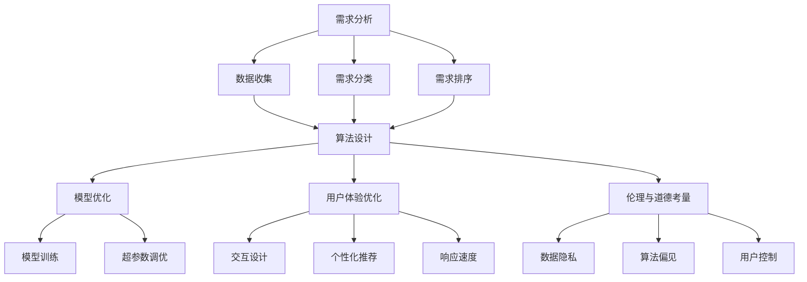

                 

### 欲望工程：AI如何影响人类的需求

在人工智能（AI）迅猛发展的今天，我们正见证着一种全新的工程实践——欲望工程（Desire Engineering）的兴起。欲望工程，顾名思义，是通过人工智能技术来理解和操纵人类需求的一门科学。它不仅改变了我们与技术的互动方式，也深刻影响了人类社会的各个方面。本文将深入探讨欲望工程的基本概念、核心原理以及它对人类需求所产生的影响。

首先，让我们明确什么是欲望工程。在传统意义上，工程学关注的是如何设计和构建物理或系统，而欲望工程则是关于如何理解和设计人类的心理和情感需求。具体来说，欲望工程涉及到以下几个方面：

1. **需求分析**：通过心理学、社会学等学科的研究方法，深入分析人类的基本需求，如安全感、归属感、成就感和自我实现。
2. **算法设计**：开发能够识别、理解和预测人类需求的算法，从而提供个性化的服务或建议。
3. **用户体验优化**：设计用户界面和交互方式，以更好地满足用户的需求，提升用户体验。
4. **伦理与道德考量**：确保在满足人类需求的过程中，尊重个体的隐私和权益，避免对用户造成负面影响。

本文将分为以下几个部分：

1. **背景介绍**：探讨人工智能的发展历程及其对欲望工程的影响。
2. **核心概念与联系**：详细介绍欲望工程的关键概念，如需求分析、算法设计和用户体验优化，并提供相应的Mermaid流程图。
3. **核心算法原理 & 具体操作步骤**：深入解析欲望工程的核心算法，并逐步说明其具体操作步骤。
4. **数学模型和公式 & 详细讲解 & 举例说明**：介绍用于欲望工程的数学模型和公式，并辅以详细讲解和实例说明。
5. **项目实践：代码实例和详细解释说明**：通过实际项目实例，展示如何应用欲望工程技术。
6. **实际应用场景**：探讨欲望工程在现实生活中的各种应用。
7. **工具和资源推荐**：推荐学习资源和开发工具。
8. **总结：未来发展趋势与挑战**：总结本文的主要观点，并展望未来的发展。
9. **附录：常见问题与解答**：回答读者可能遇到的问题。
10. **扩展阅读 & 参考资料**：提供进一步的阅读材料。

在接下来的内容中，我们将一步步分析欲望工程的各个方面，帮助读者全面理解这一新兴领域。

---

## 1. 背景介绍（Background Introduction）

### 1.1 人工智能的发展历程

人工智能（Artificial Intelligence, AI）的概念最早可以追溯到20世纪50年代。当时，计算机科学家艾伦·图灵（Alan Turing）提出了著名的图灵测试，旨在通过机器与人类之间的对话来判断机器是否具备智能。这一概念奠定了人工智能研究的基础。

从20世纪60年代开始，人工智能领域经历了几个重要的发展阶段：

- **符号主义阶段**（Symbolic AI）：这一阶段的人工智能主要依赖于基于符号逻辑和规则系统的推理机制。典型的代表是专家系统（Expert Systems），它们能够模拟人类专家的决策过程。

- **连接主义阶段**（Connectionist AI）：20世纪80年代，神经网络（Neural Networks）的兴起带来了连接主义人工智能的发展。这一阶段的代表是深度学习（Deep Learning），它通过多层神经网络的结构，实现了对大量数据的学习和模式识别。

- **强化学习阶段**（Reinforcement Learning）：20世纪90年代以来，强化学习（Reinforcement Learning）成为人工智能研究的热点。强化学习通过奖励机制，使智能体能够在特定环境中学习最优策略。

### 1.2 欲望工程的兴起

随着人工智能技术的不断进步，人们开始意识到AI在理解和满足人类需求方面的潜力。欲望工程（Desire Engineering）的概念正是在这种背景下产生的。

**欲望工程的历史可以追溯到以下几件关键事件：**

- **2006年：谷歌的PageRank算法**：谷歌的PageRank算法展示了如何通过分析用户行为数据来理解用户需求。这一算法为后来的欲望工程提供了重要启示。

- **2012年：AlexNet的出现**：深度学习的突破性进展，特别是在图像识别领域的成功，使得人们开始思考如何将深度学习应用于更广泛的领域，包括理解人类需求。

- **2016年：谷歌的AlphaGo**：AlphaGo在围棋领域的胜利标志着人工智能在复杂任务上的能力提升。这一成就激发了人们对于AI能否理解和满足人类更高级需求的思考。

- **2018年：OpenAI的GPT-2发布**：GPT-2的发布标志着语言模型在生成文本方面的重大进步，也为欲望工程提供了强有力的工具。

**欲望工程的核心思想在于：**

- **理解人类需求**：通过分析人类行为和反馈数据，理解人类在不同情境下的需求。

- **个性化服务**：利用人工智能技术，提供个性化的服务，满足个体的特定需求。

- **用户体验优化**：通过设计和优化用户界面，提高用户体验，从而更好地满足用户需求。

### 1.3 人工智能对欲望工程的影响

人工智能技术为欲望工程带来了以下几个重要影响：

- **数据分析能力**：人工智能技术，特别是机器学习和深度学习，能够高效地处理和分析大量的数据，从而更好地理解人类需求。

- **个性化推荐**：基于数据分析的结果，人工智能可以提供个性化的推荐，满足不同用户的需求。

- **自动化决策**：通过算法模型，人工智能可以自动化决策过程，提高效率，同时更好地满足用户需求。

- **用户体验优化**：人工智能技术可以优化用户界面和交互方式，提供更加直观、便捷的用户体验。

综上所述，人工智能的发展为欲望工程提供了强大的工具和方法，使得欲望工程成为可能。在接下来的内容中，我们将进一步探讨欲望工程的核心概念和原理。

### 1.4 欲望工程的当前趋势和未来展望

**当前趋势：**

- **深度学习应用广泛**：深度学习技术在图像识别、自然语言处理等领域取得了显著成果，进一步推动了欲望工程的发展。

- **跨学科研究**：欲望工程涉及到心理学、社会学、计算机科学等多个学科，跨学科的研究成为趋势，促进了多领域的深度融合。

- **伦理和隐私问题**：随着欲望工程的广泛应用，伦理和隐私问题日益突出。确保用户隐私和数据安全成为研究和应用的关键问题。

**未来展望：**

- **更加个性化的服务**：随着人工智能技术的不断进步，欲望工程将能够提供更加精准、个性化的服务，满足用户的多样化需求。

- **新的应用领域**：欲望工程有望在医疗健康、教育、金融等领域得到更广泛的应用，为这些领域带来革命性的变化。

- **社会影响**：欲望工程不仅影响个人需求，还将对社会组织、文化产生深远影响，促使社会形态的演变。

通过以上分析，我们可以看到，欲望工程在人工智能的推动下，正迅速发展并不断拓展其应用领域。在接下来的章节中，我们将详细探讨欲望工程的核心概念和原理，进一步理解其技术内涵。

## 2. 核心概念与联系（Core Concepts and Connections）

在深入了解欲望工程之前，我们需要明确其核心概念和原理。欲望工程主要涉及以下几个关键概念：需求分析、算法设计、用户体验优化和伦理与道德考量。

### 2.1 需求分析

需求分析是欲望工程的基础。它涉及通过心理学、社会学等学科的研究方法，深入分析人类的基本需求。这些需求可以归纳为以下几个方面：

- **基本需求**：如食物、水、空气等生存需求。
- **情感需求**：如安全感、归属感、爱、尊重等。
- **成就需求**：如成就感、自我实现、社交地位等。
- **认知需求**：如知识获取、信息处理、思考能力等。

需求分析的过程包括以下步骤：

1. **数据收集**：通过调查问卷、用户访谈、行为分析等方式收集用户需求数据。
2. **需求分类**：对收集的数据进行分类，识别不同类型的用户需求。
3. **需求优先级排序**：根据用户需求的重要性和紧急性，对需求进行排序。

### 2.2 算法设计

算法设计是欲望工程的核心。通过开发能够识别、理解和预测人类需求的算法，我们可以实现个性化服务和用户体验优化。以下是一些关键的算法设计原则：

- **机器学习**：利用机器学习技术，特别是深度学习和强化学习，开发能够从数据中学习的模型。
- **特征工程**：通过特征提取和特征选择，提高模型的预测准确性和泛化能力。
- **模型优化**：通过模型训练和超参数调优，优化模型性能。

### 2.3 用户体验优化

用户体验优化是欲望工程的最终目标。通过设计和优化用户界面和交互方式，我们可以更好地满足用户需求，提高用户体验。以下是一些关键策略：

- **交互设计**：设计直观、易用的用户界面，减少用户的学习成本。
- **个性化推荐**：根据用户的历史行为和需求，提供个性化的服务或推荐。
- **响应速度**：优化系统性能，提高响应速度，确保用户在交互过程中的流畅体验。

### 2.4 伦理与道德考量

在欲望工程的应用过程中，伦理和道德考量至关重要。我们需要确保在满足人类需求的过程中，尊重个体的隐私和权益，避免对用户造成负面影响。以下是一些关键伦理和道德问题：

- **数据隐私**：确保用户数据的安全和隐私，避免数据泄露和滥用。
- **算法偏见**：避免算法模型在决策过程中出现偏见，确保公平性。
- **用户控制**：确保用户对自身数据和行为的控制权，尊重用户的自主选择。

### 2.5 Mermaid流程图

为了更好地理解欲望工程的核心概念，我们可以使用Mermaid流程图来展示其基本架构。以下是一个简化的Mermaid流程图，描述了需求分析、算法设计、用户体验优化和伦理与道德考量之间的联系。

通过上述内容，我们初步了解了欲望工程的核心概念和原理。在接下来的章节中，我们将深入探讨欲望工程的核心算法原理，并逐步说明其具体操作步骤。

### 2.6 核心算法原理 & 具体操作步骤（Core Algorithm Principles and Specific Operational Steps）

欲望工程的核心在于开发能够有效识别、理解和预测人类需求的算法。这些算法通常基于机器学习和深度学习技术，涉及数据收集、预处理、模型选择和训练等步骤。以下将详细介绍这些核心算法原理，并给出具体的操作步骤。

#### 2.6.1 数据收集（Data Collection）

数据收集是欲望工程的起点。我们需要收集与用户需求相关的各种数据，包括但不限于：

- **用户行为数据**：如点击记录、浏览历史、购买记录等。
- **社交媒体数据**：如用户发布的帖子、评论、点赞等。
- **问卷调查数据**：通过在线或离线问卷收集用户需求。
- **传感器数据**：如心率、地理位置、环境传感器等。

**具体操作步骤：**

1. **确定数据来源**：根据需求分析，确定需要收集的数据类型和来源。
2. **数据收集方法**：选择合适的数据收集工具和方法，如API调用、爬虫技术、问卷调查等。
3. **数据清洗**：去除重复数据、缺失值和噪声，确保数据质量。

#### 2.6.2 数据预处理（Data Preprocessing）

数据预处理是确保数据适合模型训练的关键步骤。主要任务包括数据标准化、特征提取和特征选择。

**具体操作步骤：**

1. **数据标准化**：将数据缩放到同一范围内，如0到1或-1到1。
2. **特征提取**：从原始数据中提取对需求分析有用的特征，如文本特征、时间序列特征等。
3. **特征选择**：选择对模型预测最有影响的特征，去除冗余特征，提高模型效率。

#### 2.6.3 模型选择（Model Selection）

在选择模型时，我们需要考虑需求分析的复杂性、数据量、计算资源和模型的可解释性等因素。以下是一些常用的模型：

- **决策树**：适用于处理分类问题，具有较好的可解释性。
- **随机森林**：基于决策树，能够处理大规模数据和高维特征。
- **神经网络**：适用于复杂的数据结构和任务，如深度学习模型。
- **支持向量机**：适用于回归和分类问题，对高维数据有较好的表现。

**具体操作步骤：**

1. **评估模型性能**：使用交叉验证等技巧评估模型性能。
2. **选择最佳模型**：根据评估结果，选择具有最佳性能和可解释性的模型。
3. **模型调整**：对模型进行调参，优化模型性能。

#### 2.6.4 模型训练（Model Training）

模型训练是欲望工程的核心步骤。通过训练数据集，模型将学习如何识别和预测用户需求。

**具体操作步骤：**

1. **划分数据集**：将数据集划分为训练集、验证集和测试集。
2. **模型初始化**：初始化模型参数。
3. **训练模型**：使用训练集数据训练模型，不断调整模型参数。
4. **验证模型**：使用验证集评估模型性能，调整模型参数。

#### 2.6.5 模型优化（Model Optimization）

在模型训练过程中，我们通常需要进行多次迭代，以优化模型性能。

**具体操作步骤：**

1. **模型评估**：使用验证集和测试集评估模型性能。
2. **模型调整**：根据评估结果，调整模型参数，如学习率、正则化参数等。
3. **模型优化**：通过优化算法，如梯度下降法，调整模型参数，提高模型性能。

#### 2.6.6 模型部署（Model Deployment）

在完成模型训练和优化后，我们需要将模型部署到生产环境中，以便实时预测用户需求。

**具体操作步骤：**

1. **模型打包**：将训练好的模型打包，以便部署。
2. **部署环境准备**：准备部署环境，如服务器、数据库等。
3. **模型部署**：将模型部署到生产环境中，确保其能够实时处理用户请求。
4. **监控与维护**：定期监控模型性能，及时调整和优化。

通过上述步骤，我们可以构建一个有效的欲望工程系统，实现对人

