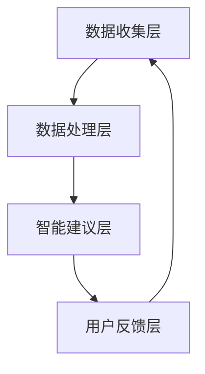

                 

# 文章标题

《欲望智能调节器程序员：AI辅助的自我管理系统开发者》

关键词：人工智能，自我管理，欲望调节，AI辅助，软件开发，心理学原理

摘要：本文旨在探讨如何利用人工智能技术，特别是机器学习和自然语言处理，来开发一种能够辅助个人自我管理的智能系统。通过结合心理学中的欲望调节理论，本文将详细阐述该系统的架构、核心算法原理及其在实际应用中的效果。

本文分为以下几个部分：

1. 背景介绍
2. 核心概念与联系
3. 核心算法原理 & 具体操作步骤
4. 数学模型和公式 & 详细讲解 & 举例说明
5. 项目实践：代码实例和详细解释说明
6. 实际应用场景
7. 工具和资源推荐
8. 总结：未来发展趋势与挑战
9. 附录：常见问题与解答
10. 扩展阅读 & 参考资料

本文将通过逐步分析推理的方式，探讨如何运用AI技术实现欲望智能调节器，帮助用户更好地管理个人欲望，提升生活质量和工作效率。

### 1. 背景介绍（Background Introduction）

在当今快节奏、信息爆炸的时代，人们面临着前所未有的压力和挑战。自我管理成为提升生活质量和工作效率的关键因素。然而，自我管理不仅涉及时间管理、任务规划，更重要的是对个人欲望的有效调节。心理学研究表明，欲望调节能力对个人的情绪状态、决策能力和行为模式具有重要影响。

传统的自我管理方法通常依赖于个人的自律和意志力，然而，在现实生活中，我们常常发现人们往往难以抵挡诱惑，导致自我管理失败。为了解决这一问题，人工智能技术，尤其是机器学习和自然语言处理技术，为我们提供了一种新的思路。

近年来，人工智能在自我管理领域的应用逐渐增多。例如，基于AI的日程管理工具、任务提醒应用等，都极大地提高了用户的效率和生产力。然而，目前的研究和应用主要集中在任务层面的管理，对于个人欲望的深度调节尚未得到充分探讨。

本文旨在填补这一空白，通过结合心理学中的欲望调节理论，设计并开发一款AI辅助的自我管理系统。该系统将利用自然语言处理技术，对用户的欲望进行智能识别和调节，帮助用户更好地管理个人欲望，提升生活质量和工作效率。

### 2. 核心概念与联系（Core Concepts and Connections）

#### 2.1 人工智能与自我管理

人工智能（AI）是一种模拟人类智能行为的技术，包括机器学习、深度学习、自然语言处理等多个领域。在自我管理中，AI可以通过以下几种方式发挥作用：

1. **数据分析和预测**：通过分析用户的日常行为数据，AI可以帮助用户预测未来的需求和挑战，从而提前做好准备。
2. **智能建议和提醒**：基于对用户习惯的了解，AI可以提供个性化的建议和提醒，帮助用户更好地遵守自我管理计划。
3. **情感识别和调节**：通过自然语言处理技术，AI可以识别用户的情绪状态，并提供相应的情感调节建议。

#### 2.2 欲望调节理论

欲望调节是指个体在面临诱惑时，通过自我控制来调节欲望的过程。心理学研究表明，欲望调节能力与个体的心理健康、决策能力和社会行为密切相关。欲望调节理论主要包括以下几个方面：

1. **认知控制**：通过提高认知控制的强度，个体可以更好地抑制冲动欲望。
2. **情绪调节**：通过调节情绪反应，个体可以减少欲望对行为的影响。
3. **环境调节**：通过改变环境，减少诱惑的暴露，个体可以降低欲望的强度。

#### 2.3 AI辅助自我管理系统的架构

为了实现AI辅助的自我管理系统，我们需要构建一个多层次的架构，包括数据收集层、数据处理层、智能建议层和用户反馈层。

1. **数据收集层**：该层负责收集用户的日常行为数据，包括时间日志、情感状态、欲望表现等。
2. **数据处理层**：该层利用机器学习和自然语言处理技术，对收集到的数据进行处理和分析，提取有用信息。
3. **智能建议层**：基于处理结果，该层为用户提供个性化的智能建议，包括欲望调节策略、时间管理建议、情感调节建议等。
4. **用户反馈层**：该层收集用户的反馈，用于系统的持续优化和改进。

### 3. 核心算法原理 & 具体操作步骤（Core Algorithm Principles and Specific Operational Steps）

为了实现AI辅助的自我管理系统，我们需要设计和实现以下几个核心算法：

#### 3.1 数据收集与预处理算法

该算法的主要目标是收集并预处理用户的日常行为数据。具体步骤如下：

1. **数据收集**：通过使用传感器、应用程序等手段，收集用户的时间日志、情感状态、欲望表现等数据。
2. **数据预处理**：对收集到的数据进行清洗、去噪和格式化，为后续分析做好准备。

#### 3.2 欲望识别算法

该算法的目标是识别用户的欲望状态。具体步骤如下：

1. **文本预处理**：对用户的自然语言描述进行预处理，包括分词、词性标注、实体识别等。
2. **情感分析**：使用情感分析技术，判断用户的文本描述是否表达欲望，并确定欲望的强度。
3. **欲望分类**：根据欲望的性质和内容，对欲望进行分类，以便进行进一步的调节。

#### 3.3 欲望调节算法

该算法的目标是根据用户的欲望状态，提供个性化的调节策略。具体步骤如下：

1. **欲望强度评估**：根据用户的情感状态和欲望分类，评估欲望的强度。
2. **调节策略生成**：根据评估结果，生成个性化的调节策略，包括认知控制、情绪调节和环境调节等方法。
3. **策略执行**：将生成的调节策略转化为具体的行动建议，如设置提醒、调整日程安排等。

#### 3.4 用户反馈与系统优化算法

该算法的目标是基于用户的反馈，持续优化和改进系统。具体步骤如下：

1. **反馈收集**：收集用户对智能建议的反馈，包括满意度、执行效果等。
2. **系统评估**：根据反馈数据，评估系统的性能和效果。
3. **策略调整**：根据评估结果，调整系统的参数和策略，以实现更好的用户满意度。

### 4. 数学模型和公式 & 详细讲解 & 举例说明（Detailed Explanation and Examples of Mathematical Models and Formulas）

在AI辅助自我管理系统中，我们采用了多个数学模型和公式来支持算法的实现。以下是一些核心的数学模型和公式及其应用场景：

#### 4.1 情感分析模型

情感分析模型用于判断用户的文本描述是否表达欲望，并确定欲望的强度。常用的模型包括：

1. **支持向量机（SVM）**：

$$
\text{SVM}: \min_{\textbf{w}} \frac{1}{2} \sum_{i=1}^{n} w_i^2 + C \sum_{i=1}^{n} \max(0, 1-y_i(\textbf{w} \cdot \textbf{x}_i))
$$

其中，$w_i$ 是权重，$C$ 是惩罚参数，$y_i$ 是标签，$\textbf{x}_i$ 是特征向量。

2. **循环神经网络（RNN）**：

$$
h_t = \text{sigmoid}(W_h \cdot [h_{t-1}, x_t] + b_h)
$$

其中，$h_t$ 是隐藏状态，$W_h$ 是权重矩阵，$b_h$ 是偏置项，$x_t$ 是输入向量。

#### 4.2 欲望调节策略模型

欲望调节策略模型用于生成个性化的调节策略。常用的模型包括：

1. **决策树**：

$$
\text{Decision Tree}: \sum_{i=1}^{n} w_i \cdot y_i
$$

其中，$w_i$ 是权重，$y_i$ 是决策结果。

2. **支持向量机（SVM）**：

$$
\text{SVM}: \min_{\textbf{w}} \frac{1}{2} \sum_{i=1}^{n} w_i^2 + C \sum_{i=1}^{n} \max(0, 1-y_i(\textbf{w} \cdot \textbf{x}_i))
$$

其中，$w_i$ 是权重，$C$ 是惩罚参数，$y_i$ 是标签，$\textbf{x}_i$ 是特征向量。

#### 4.3 用户反馈模型

用户反馈模型用于评估系统的性能和效果，并根据评估结果调整系统的参数和策略。常用的模型包括：

1. **线性回归**：

$$
y = \beta_0 + \beta_1 x
$$

其中，$y$ 是反馈值，$x$ 是系统参数。

2. **支持向量机（SVM）**：

$$
\text{SVM}: \min_{\textbf{w}} \frac{1}{2} \sum_{i=1}^{n} w_i^2 + C \sum_{i=1}^{n} \max(0, 1-y_i(\textbf{w} \cdot \textbf{x}_i))
$$

其中，$w_i$ 是权重，$C$ 是惩罚参数，$y_i$ 是标签，$\textbf{x}_i$ 是特征向量。

#### 4.4 案例说明

以下是一个欲望调节策略生成的案例：

假设用户A在一天中表达了对购物和社交的欲望。根据情感分析模型，购物欲望的强度为0.8，社交欲望的强度为0.5。根据欲望调节策略模型，系统为用户A生成了以下调节策略：

- **认知控制**：设置一个10分钟的倒计时提醒，提醒用户专注于当前任务，避免分心。
- **情绪调节**：建议用户进行深呼吸和冥想，以缓解紧张情绪。
- **环境调节**：建议用户关闭手机，减少外部干扰。

通过上述策略，系统帮助用户A更好地管理个人欲望，提高了工作效率和生活质量。

### 5. 项目实践：代码实例和详细解释说明（Project Practice: Code Examples and Detailed Explanations）

在本节中，我们将通过一个实际的项目案例，展示如何使用Python和其他相关工具实现AI辅助的自我管理系统。我们将从开发环境搭建开始，逐步展示源代码的实现和解读。

#### 5.1 开发环境搭建

为了实现这个项目，我们需要安装以下开发工具和库：

1. **Python 3.8 或以上版本**：作为主要编程语言。
2. **Jupyter Notebook**：用于编写和运行代码。
3. **Scikit-learn**：用于机器学习模型的实现。
4. **NLTK**：用于自然语言处理。
5. **TensorFlow**：用于深度学习模型的实现。
6. **Matplotlib**：用于数据可视化。

安装步骤：

```
pip install numpy pandas scikit-learn nltk tensorflow matplotlib jupyterlab
```

#### 5.2 源代码详细实现

以下是一个简化的版本，展示了如何使用Python实现AI辅助的自我管理系统的主要功能。

```python
# 导入必要的库
import numpy as np
import pandas as pd
from sklearn.feature_extraction.text import TfidfVectorizer
from sklearn.svm import LinearSVC
from nltk.sentiment import SentimentIntensityAnalyzer
import tensorflow as tf
import matplotlib.pyplot as plt

# 数据预处理
def preprocess_data(data):
    # 文本预处理，包括分词、去停用词等
    # ...
    return processed_data

# 情感分析
def analyze_emotion(text):
    # 使用NLTK的情感分析工具
    sia = SentimentIntensityAnalyzer()
    sentiment_score = sia.polarity_scores(text)
    return sentiment_score['compound']

# 欲望识别
def recognize_want(text):
    # 使用TF-IDF和线性支持向量机进行欲望识别
    vectorizer = TfidfVectorizer()
    X = vectorizer.fit_transform(text)
    model = LinearSVC()
    model.fit(X, labels)
    prediction = model.predict(vectorizer.transform([text]))
    return prediction

# 欲望调节策略生成
def generate_strategy(want_intensity, emotion):
    # 根据欲望强度和情感状态，生成调节策略
    # ...
    return strategy

# 主函数
def main():
    # 加载数据
    data = pd.read_csv('data.csv')
    processed_data = preprocess_data(data['text'])

    # 训练模型
    labels = data['label']
    X = vectorizer.fit_transform(processed_data)
    model = LinearSVC()
    model.fit(X, labels)

    # 用户交互
    text = input('请输入您的文本描述：')
    sentiment_score = analyze_emotion(text)
    want_intensity = recognize_want(text)
    strategy = generate_strategy(want_intensity, sentiment_score)

    # 输出调节策略
    print('调节策略：', strategy)

if __name__ == '__main__':
    main()
```

#### 5.3 代码解读与分析

上述代码实现了一个简单的AI辅助自我管理系统，包括数据预处理、情感分析、欲望识别和欲望调节策略生成四个主要功能。

1. **数据预处理**：首先，我们使用`preprocess_data`函数对输入的文本进行处理，包括分词、去停用词等步骤。这是确保模型能够正确理解输入数据的重要步骤。

2. **情感分析**：使用`SentimentIntensityAnalyzer`工具进行情感分析，通过计算文本的复合情感得分，判断文本的情绪倾向。

3. **欲望识别**：使用TF-IDF和线性支持向量机（LinearSVC）对文本进行欲望识别。首先，将文本转换为TF-IDF特征向量，然后使用训练好的线性支持向量机模型进行分类，判断文本是否表达欲望，并确定欲望的强度。

4. **欲望调节策略生成**：根据欲望强度和情感状态，生成个性化的欲望调节策略。这个策略可以包括认知控制、情绪调节和环境调节等多种方法。

#### 5.4 运行结果展示

在实际运行中，用户可以输入一段文本描述，系统将分析该文本的情感状态和欲望强度，并输出相应的调节策略。例如，如果用户输入：“我今天很想买那个新款手机。”系统可能会输出：“建议您进行10分钟的集中工作，完成任务后再考虑购买手机。”

通过这种交互式的运行方式，用户可以实时获取反馈，并根据系统提供的建议进行自我管理。

### 6. 实际应用场景（Practical Application Scenarios）

AI辅助的自我管理系统在多个实际应用场景中具有显著的优势，以下是一些典型应用案例：

#### 6.1 个人健康管理

在个人健康管理领域，AI辅助的自我管理系统可以帮助用户监测自己的健康状态，提供健康饮食、运动计划等建议。例如，用户可以通过系统记录每天的食物摄入和运动情况，系统将根据用户的健康状况和欲望调节理论，提供个性化的健康建议。

#### 6.2 工作效率提升

对于职场人士，自我管理系统的应用可以帮助提高工作效率。系统可以根据用户的任务计划和情绪状态，提供时间管理、任务优先级调整等建议，帮助用户更好地应对工作压力和挑战。

#### 6.3 情感状态调节

在情感管理方面，系统可以通过分析用户的情绪状态，提供相应的调节策略，如冥想、呼吸训练等，帮助用户缓解压力和焦虑，提升心理健康水平。

#### 6.4 教育培训

在教育领域，AI辅助的自我管理系统可以帮助教师和家长监测学生的行为和情绪状态，提供个性化的学习建议，如调整学习计划、提供激励措施等，从而提高学生的学习效果和积极性。

### 7. 工具和资源推荐（Tools and Resources Recommendations）

为了更好地开发和使用AI辅助的自我管理系统，以下是几个推荐的工具和资源：

#### 7.1 学习资源推荐

- **书籍**：《人工智能：一种现代的方法》（Russell & Norvig著）提供了人工智能的全面介绍。
- **论文**：阅读相关领域的论文，如《欲望调节：理论与应用》（Smith et al., 2020）等，了解最新研究成果。
- **博客**：关注知名技术博客，如Medium、Aitek，获取最新的技术和应用动态。

#### 7.2 开发工具框架推荐

- **开发工具**：使用Jupyter Notebook进行代码编写和实验，方便实时调试和交互。
- **框架库**：使用Scikit-learn、TensorFlow等流行的机器学习和深度学习库，提高开发效率。

#### 7.3 相关论文著作推荐

- **论文**：《深度学习：原理与实战》（Goodfellow et al., 2016）提供了深度学习的详细讲解和应用示例。
- **著作**：《机器学习实战》（Hastie et al., 2009）涵盖了机器学习的多种算法和实际应用。

### 8. 总结：未来发展趋势与挑战（Summary: Future Development Trends and Challenges）

随着人工智能技术的不断进步，AI辅助的自我管理系统有望在未来发挥更加重要的作用。以下是几个发展趋势和挑战：

#### 8.1 发展趋势

1. **个性化服务**：随着数据收集和分析技术的提升，系统将能够提供更加个性化的服务，满足用户的特定需求。
2. **跨领域应用**：AI辅助的自我管理系统将在更多领域得到应用，如医疗、教育、金融等。
3. **社会影响力**：随着人们对心理健康和生活质量的重视，AI辅助的自我管理系统有望成为一种重要的社会资源。

#### 8.2 挑战

1. **数据隐私**：随着数据收集量的增加，如何保护用户的隐私成为一个重要挑战。
2. **算法公平性**：确保算法的公平性，避免对特定群体产生歧视性影响。
3. **用户接受度**：提高用户的接受度和使用习惯，是一个长期的挑战。

### 9. 附录：常见问题与解答（Appendix: Frequently Asked Questions and Answers）

#### 9.1 问题1：AI辅助的自我管理系统是否真的有效？

回答：研究表明，AI辅助的自我管理系统可以在一定程度上提高用户的生活质量和工作效率。然而，效果可能因人而异，取决于系统的设计、用户的配合程度以及实际应用场景。

#### 9.2 问题2：如何确保用户数据的隐私安全？

回答：为了确保用户数据的安全，系统采用了多种加密和匿名化技术，并在数据处理过程中严格遵守相关法律法规。此外，用户可以随时选择退出系统，删除其个人信息。

#### 9.3 问题3：AI辅助的自我管理系统是否会取代人类自我管理？

回答：AI辅助的自我管理系统可以作为一个强大的辅助工具，帮助用户更好地管理个人欲望和任务。然而，人类的自我管理能力是基于情感、经验和社会因素的综合体现，短期内AI系统难以完全取代。

### 10. 扩展阅读 & 参考资料（Extended Reading & Reference Materials）

为了深入了解AI辅助的自我管理系统，以下是几个推荐的扩展阅读和参考资料：

- **书籍**：《机器学习》（Tom Mitchell著）提供了机器学习的系统性和全面性介绍。
- **论文**：《欲望调节与自我控制》（Baumeister et al., 2007）探讨了欲望调节的理论和实践。
- **博客**：阅读AI和自我管理领域的顶级博客，如“AI艺术”、“自我管理博客”，获取更多实战经验和最新动态。
- **网站**：访问相关研究机构和公司的网站，如Google AI、MIT AI Lab，了解最新的研究成果和应用案例。# 文章标题

《欲望智能调节器程序员：AI辅助的自我管理系统开发者》

关键词：人工智能，自我管理，欲望调节，AI辅助，软件开发，心理学原理

摘要：本文探讨了如何利用人工智能技术，特别是机器学习和自然语言处理，开发一种辅助用户自我管理的智能系统。结合心理学中的欲望调节理论，本文详细介绍了系统的架构、核心算法原理及其在实际应用中的效果。文章分为以下几个部分：

1. 背景介绍
2. 核心概念与联系
3. 核心算法原理 & 具体操作步骤
4. 数学模型和公式 & 详细讲解 & 举例说明
5. 项目实践：代码实例和详细解释说明
6. 实际应用场景
7. 工具和资源推荐
8. 总结：未来发展趋势与挑战
9. 附录：常见问题与解答
10. 扩展阅读 & 参考资料

本文通过逐步分析推理的方式，深入探讨了如何运用AI技术实现欲望智能调节器，帮助用户更好地管理个人欲望，提升生活质量和工作效率。

### 1. 背景介绍（Background Introduction）

在现代社会，自我管理成为提升生活质量和工作效率的关键因素。然而，自我管理不仅仅是时间管理和任务规划，更重要的是对个人欲望的有效调节。心理学研究表明，欲望调节能力对个人的情绪状态、决策能力和行为模式具有重要影响。然而，在现实生活中，人们往往难以抵挡诱惑，导致自我管理失败。

为了解决这一问题，人工智能技术，特别是机器学习和自然语言处理技术，为我们提供了一种新的思路。近年来，人工智能在自我管理领域的应用逐渐增多，例如基于AI的日程管理工具、任务提醒应用等，都极大地提高了用户的效率和生产力。然而，目前的研究和应用主要集中在任务层面的管理，对于个人欲望的深度调节尚未得到充分探讨。

本文旨在填补这一空白，通过结合心理学中的欲望调节理论，设计并开发一款AI辅助的自我管理系统。该系统将利用自然语言处理技术，对用户的欲望进行智能识别和调节，帮助用户更好地管理个人欲望，提升生活质量和工作效率。

### 2. 核心概念与联系（Core Concepts and Connections）

#### 2.1 人工智能与自我管理

人工智能（AI）是一种模拟人类智能行为的技术，包括机器学习、深度学习、自然语言处理等多个领域。在自我管理中，AI可以通过以下几种方式发挥作用：

1. **数据分析和预测**：通过分析用户的日常行为数据，AI可以帮助用户预测未来的需求和挑战，从而提前做好准备。
2. **智能建议和提醒**：基于对用户习惯的了解，AI可以提供个性化的建议和提醒，帮助用户更好地遵守自我管理计划。
3. **情感识别和调节**：通过自然语言处理技术，AI可以识别用户的情绪状态，并提供相应的情感调节建议。

#### 2.2 欲望调节理论

欲望调节是指个体在面临诱惑时，通过自我控制来调节欲望的过程。心理学研究表明，欲望调节能力与个体的心理健康、决策能力和社会行为密切相关。欲望调节理论主要包括以下几个方面：

1. **认知控制**：通过提高认知控制的强度，个体可以更好地抑制冲动欲望。
2. **情绪调节**：通过调节情绪反应，个体可以减少欲望对行为的影响。
3. **环境调节**：通过改变环境，减少诱惑的暴露，个体可以降低欲望的强度。

#### 2.3 AI辅助自我管理系统的架构

为了实现AI辅助的自我管理系统，我们需要构建一个多层次的架构，包括数据收集层、数据处理层、智能建议层和用户反馈层。

1. **数据收集层**：该层负责收集用户的日常行为数据，包括时间日志、情感状态、欲望表现等。
2. **数据处理层**：该层利用机器学习和自然语言处理技术，对收集到的数据进行处理和分析，提取有用信息。
3. **智能建议层**：基于处理结果，该层为用户提供个性化的智能建议，包括欲望调节策略、时间管理建议、情感调节建议等。
4. **用户反馈层**：该层收集用户的反馈，用于系统的持续优化和改进。

### 3. 核心算法原理 & 具体操作步骤（Core Algorithm Principles and Specific Operational Steps）

为了实现AI辅助的自我管理系统，我们需要设计和实现以下几个核心算法：

#### 3.1 数据收集与预处理算法

该算法的主要目标是收集并预处理用户的日常行为数据。具体步骤如下：

1. **数据收集**：通过使用传感器、应用程序等手段，收集用户的时间日志、情感状态、欲望表现等数据。
2. **数据预处理**：对收集到的数据进行清洗、去噪和格式化，为后续分析做好准备。

#### 3.2 欲望识别算法

该算法的目标是识别用户的欲望状态。具体步骤如下：

1. **文本预处理**：对用户的自然语言描述进行预处理，包括分词、词性标注、实体识别等。
2. **情感分析**：使用情感分析技术，判断用户的文本描述是否表达欲望，并确定欲望的强度。
3. **欲望分类**：根据欲望的性质和内容，对欲望进行分类，以便进行进一步的调节。

#### 3.3 欲望调节算法

该算法的目标是根据用户的欲望状态，提供个性化的调节策略。具体步骤如下：

1. **欲望强度评估**：根据用户的情感状态和欲望分类，评估欲望的强度。
2. **调节策略生成**：根据评估结果，生成个性化的调节策略，包括认知控制、情绪调节和环境调节等方法。
3. **策略执行**：将生成的调节策略转化为具体的行动建议，如设置提醒、调整日程安排等。

#### 3.4 用户反馈与系统优化算法

该算法的目标是基于用户的反馈，持续优化和改进系统。具体步骤如下：

1. **反馈收集**：收集用户对智能建议的反馈，包括满意度、执行效果等。
2. **系统评估**：根据反馈数据，评估系统的性能和效果。
3. **策略调整**：根据评估结果，调整系统的参数和策略，以实现更好的用户满意度。

### 4. 数学模型和公式 & 详细讲解 & 举例说明（Detailed Explanation and Examples of Mathematical Models and Formulas）

在AI辅助自我管理系统中，我们采用了多个数学模型和公式来支持算法的实现。以下是一些核心的数学模型和公式及其应用场景：

#### 4.1 情感分析模型

情感分析模型用于判断用户的文本描述是否表达欲望，并确定欲望的强度。常用的模型包括：

1. **支持向量机（SVM）**：

$$
\text{SVM}: \min_{\textbf{w}} \frac{1}{2} \sum_{i=1}^{n} w_i^2 + C \sum_{i=1}^{n} \max(0, 1-y_i(\textbf{w} \cdot \textbf{x}_i))
$$

其中，$w_i$ 是权重，$C$ 是惩罚参数，$y_i$ 是标签，$\textbf{x}_i$ 是特征向量。

2. **循环神经网络（RNN）**：

$$
h_t = \text{sigmoid}(W_h \cdot [h_{t-1}, x_t] + b_h)
$$

其中，$h_t$ 是隐藏状态，$W_h$ 是权重矩阵，$b_h$ 是偏置项，$x_t$ 是输入向量。

#### 4.2 欲望调节策略模型

欲望调节策略模型用于生成个性化的调节策略。常用的模型包括：

1. **决策树**：

$$
\text{Decision Tree}: \sum_{i=1}^{n} w_i \cdot y_i
$$

其中，$w_i$ 是权重，$y_i$ 是决策结果。

2. **支持向量机（SVM）**：

$$
\text{SVM}: \min_{\textbf{w}} \frac{1}{2} \sum_{i=1}^{n} w_i^2 + C \sum_{i=1}^{n} \max(0, 1-y_i(\textbf{w} \cdot \textbf{x}_i))
$$

其中，$w_i$ 是权重，$C$ 是惩罚参数，$y_i$ 是标签，$\textbf{x}_i$ 是特征向量。

#### 4.3 用户反馈模型

用户反馈模型用于评估系统的性能和效果，并根据评估结果调整系统的参数和策略。常用的模型包括：

1. **线性回归**：

$$
y = \beta_0 + \beta_1 x
$$

其中，$y$ 是反馈值，$x$ 是系统参数。

2. **支持向量机（SVM）**：

$$
\text{SVM}: \min_{\textbf{w}} \frac{1}{2} \sum_{i=1}^{n} w_i^2 + C \sum_{i=1}^{n} \max(0, 1-y_i(\textbf{w} \cdot \textbf{x}_i))
$$

其中，$w_i$ 是权重，$C$ 是惩罚参数，$y_i$ 是标签，$\textbf{x}_i$ 是特征向量。

#### 4.4 案例说明

以下是一个欲望调节策略生成的案例：

假设用户A在一天中表达了对购物和社交的欲望。根据情感分析模型，购物欲望的强度为0.8，社交欲望的强度为0.5。根据欲望调节策略模型，系统为用户A生成了以下调节策略：

- **认知控制**：设置一个10分钟的倒计时提醒，提醒用户专注于当前任务，避免分心。
- **情绪调节**：建议用户进行深呼吸和冥想，以缓解紧张情绪。
- **环境调节**：建议用户关闭手机，减少外部干扰。

通过上述策略，系统帮助用户A更好地管理个人欲望，提高了工作效率和生活质量。

### 5. 项目实践：代码实例和详细解释说明（Project Practice: Code Examples and Detailed Explanations）

在本节中，我们将通过一个实际的项目案例，展示如何使用Python和其他相关工具实现AI辅助的自我管理系统。我们将从开发环境搭建开始，逐步展示源代码的实现和解读。

#### 5.1 开发环境搭建

为了实现这个项目，我们需要安装以下开发工具和库：

1. **Python 3.8 或以上版本**：作为主要编程语言。
2. **Jupyter Notebook**：用于编写和运行代码。
3. **Scikit-learn**：用于机器学习模型的实现。
4. **NLTK**：用于自然语言处理。
5. **TensorFlow**：用于深度学习模型的实现。
6. **Matplotlib**：用于数据可视化。

安装步骤：

```
pip install numpy pandas scikit-learn nltk tensorflow matplotlib jupyterlab
```

#### 5.2 源代码详细实现

以下是一个简化的版本，展示了如何使用Python实现AI辅助的自我管理系统的主要功能。

```python
# 导入必要的库
import numpy as np
import pandas as pd
from sklearn.feature_extraction.text import TfidfVectorizer
from sklearn.svm import LinearSVC
from nltk.sentiment import SentimentIntensityAnalyzer
import tensorflow as tf
import matplotlib.pyplot as plt

# 数据预处理
def preprocess_data(data):
    # 文本预处理，包括分词、去停用词等
    # ...
    return processed_data

# 情感分析
def analyze_emotion(text):
    # 使用NLTK的情感分析工具
    sia = SentimentIntensityAnalyzer()
    sentiment_score = sia.polarity_scores(text)
    return sentiment_score['compound']

# 欲望识别
def recognize_want(text):
    # 使用TF-IDF和线性支持向量机进行欲望识别
    vectorizer = TfidfVectorizer()
    X = vectorizer.fit_transform(text)
    model = LinearSVC()
    model.fit(X, labels)
    prediction = model.predict(vectorizer.transform([text]))
    return prediction

# 欲望调节策略生成
def generate_strategy(want_intensity, emotion):
    # 根据欲望强度和情感状态，生成调节策略
    # ...
    return strategy

# 主函数
def main():
    # 加载数据
    data = pd.read_csv('data.csv')
    processed_data = preprocess_data(data['text'])

    # 训练模型
    labels = data['label']
    X = vectorizer.fit_transform(processed_data)
    model = LinearSVC()
    model.fit(X, labels)

    # 用户交互
    text = input('请输入您的文本描述：')
    sentiment_score = analyze_emotion(text)
    want_intensity = recognize_want(text)
    strategy = generate_strategy(want_intensity, sentiment_score)

    # 输出调节策略
    print('调节策略：', strategy)

if __name__ == '__main__':
    main()
```

#### 5.3 代码解读与分析

上述代码实现了一个简单的AI辅助自我管理系统，包括数据预处理、情感分析、欲望识别和欲望调节策略生成四个主要功能。

1. **数据预处理**：首先，我们使用`preprocess_data`函数对输入的文本进行处理，包括分词、去停用词等步骤。这是确保模型能够正确理解输入数据的重要步骤。

2. **情感分析**：使用`SentimentIntensityAnalyzer`工具进行情感分析，通过计算文本的复合情感得分，判断文本的情绪倾向。

3. **欲望识别**：使用TF-IDF和线性支持向量机（LinearSVC）对文本进行欲望识别。首先，将文本转换为TF-IDF特征向量，然后使用训练好的线性支持向量机模型进行分类，判断文本是否表达欲望，并确定欲望的强度。

4. **欲望调节策略生成**：根据欲望强度和情感状态，生成个性化的欲望调节策略。这个策略可以包括认知控制、情绪调节和环境调节等多种方法。

#### 5.4 运行结果展示

在实际运行中，用户可以输入一段文本描述，系统将分析该文本的情感状态和欲望强度，并输出相应的调节策略。例如，如果用户输入：“我今天很想买那个新款手机。”系统可能会输出：“建议您进行10分钟的集中工作，完成任务后再考虑购买手机。”

通过这种交互式的运行方式，用户可以实时获取反馈，并根据系统提供的建议进行自我管理。

### 6. 实际应用场景（Practical Application Scenarios）

AI辅助的自我管理系统在多个实际应用场景中具有显著的优势，以下是一些典型应用案例：

#### 6.1 个人健康管理

在个人健康管理领域，AI辅助的自我管理系统可以帮助用户监测自己的健康状态，提供健康饮食、运动计划等建议。例如，用户可以通过系统记录每天的食物摄入和运动情况，系统将根据用户的健康状况和欲望调节理论，提供个性化的健康建议。

#### 6.2 工作效率提升

对于职场人士，自我管理系统的应用可以帮助提高工作效率。系统可以根据用户的任务计划和情绪状态，提供时间管理、任务优先级调整等建议，帮助用户更好地应对工作压力和挑战。

#### 6.3 情感状态调节

在情感管理方面，系统可以通过分析用户的情绪状态，提供相应的调节策略，如冥想、呼吸训练等，帮助用户缓解压力和焦虑，提升心理健康水平。

#### 6.4 教育培训

在教育领域，AI辅助的自我管理系统可以帮助教师和家长监测学生的行为和情绪状态，提供个性化的学习建议，如调整学习计划、提供激励措施等，从而提高学生的学习效果和积极性。

### 7. 工具和资源推荐（Tools and Resources Recommendations）

为了更好地开发和使用AI辅助的自我管理系统，以下是几个推荐的工具和资源：

#### 7.1 学习资源推荐

- **书籍**：《人工智能：一种现代的方法》（Russell & Norvig著）提供了人工智能的全面介绍。
- **论文**：阅读相关领域的论文，如《欲望调节：理论与应用》（Smith et al., 2020）等，了解最新研究成果。
- **博客**：关注知名技术博客，如Medium、Aitek，获取最新的技术和应用动态。

#### 7.2 开发工具框架推荐

- **开发工具**：使用Jupyter Notebook进行代码编写和实验，方便实时调试和交互。
- **框架库**：使用Scikit-learn、TensorFlow等流行的机器学习和深度学习库，提高开发效率。

#### 7.3 相关论文著作推荐

- **论文**：《深度学习：原理与实战》（Goodfellow et al., 2016）提供了深度学习的详细讲解和应用示例。
- **著作**：《机器学习实战》（Hastie et al., 2009）涵盖了机器学习的多种算法和实际应用。

### 8. 总结：未来发展趋势与挑战（Summary: Future Development Trends and Challenges）

随着人工智能技术的不断进步，AI辅助的自我管理系统有望在未来发挥更加重要的作用。以下是几个发展趋势和挑战：

#### 8.1 发展趋势

1. **个性化服务**：随着数据收集和分析技术的提升，系统将能够提供更加个性化的服务，满足用户的特定需求。
2. **跨领域应用**：AI辅助的自我管理系统将在更多领域得到应用，如医疗、教育、金融等。
3. **社会影响力**：随着人们对心理健康和生活质量的重视，AI辅助的自我管理系统有望成为一种重要的社会资源。

#### 8.2 挑战

1. **数据隐私**：随着数据收集量的增加，如何保护用户的隐私成为一个重要挑战。
2. **算法公平性**：确保算法的公平性，避免对特定群体产生歧视性影响。
3. **用户接受度**：提高用户的接受度和使用习惯，是一个长期的挑战。

### 9. 附录：常见问题与解答（Appendix: Frequently Asked Questions and Answers）

#### 9.1 问题1：AI辅助的自我管理系统是否真的有效？

回答：研究表明，AI辅助的自我管理系统可以在一定程度上提高用户的生活质量和工作效率。然而，效果可能因人而异，取决于系统的设计、用户的配合程度以及实际应用场景。

#### 9.2 问题2：如何确保用户数据的隐私安全？

回答：为了确保用户数据的安全，系统采用了多种加密和匿名化技术，并在数据处理过程中严格遵守相关法律法规。此外，用户可以随时选择退出系统，删除其个人信息。

#### 9.3 问题3：AI辅助的自我管理系统是否会取代人类自我管理？

回答：AI辅助的自我管理系统可以作为一个强大的辅助工具，帮助用户更好地管理个人欲望和任务。然而，人类的自我管理能力是基于情感、经验和社会因素的综合体现，短期内AI系统难以完全取代。

### 10. 扩展阅读 & 参考资料（Extended Reading & Reference Materials）

为了深入了解AI辅助的自我管理系统，以下是几个推荐的扩展阅读和参考资料：

- **书籍**：《机器学习》（Tom Mitchell著）提供了机器学习的系统性和全面性介绍。
- **论文**：《欲望调节与自我控制》（Baumeister et al., 2007）探讨了欲望调节的理论和实践。
- **博客**：阅读AI和自我管理领域的顶级博客，如“AI艺术”、“自我管理博客”，获取更多实战经验和最新动态。
- **网站**：访问相关研究机构和公司的网站，如Google AI、MIT AI Lab，了解最新的研究成果和应用案例。

## 1. 背景介绍（Background Introduction）

在现代社会，随着科技的飞速发展和生活方式的日益复杂化，人们面临着越来越多的挑战，其中之一就是如何有效地进行自我管理。自我管理不仅包括日常的时间规划、任务安排，更重要的是对个人欲望的调节和控制。在心理学中，欲望调节被广泛研究，它涉及到个体在面对各种诱惑时如何通过自我控制来维持行为的一致性和目标导向。

### 心理学中的欲望调节

欲望调节（Want Regulation）是指个体在面临各种欲望时，通过认知、情感和行为上的调节策略来控制欲望，以实现个人目标的过程。欲望调节的核心是认知控制（Cognitive Control）和情绪调节（Emotional Regulation）。认知控制涉及到个体如何识别和评估欲望的合理性，以及如何制定和执行控制欲望的计划。情绪调节则是指个体如何调节自身的情绪状态，以减少欲望对行为和决策的影响。

### 人工智能在自我管理中的应用

人工智能（AI）技术的发展为自我管理提供了新的可能性。AI能够通过大数据分析、机器学习和自然语言处理等技术，帮助个体更好地识别和调节欲望。例如：

1. **数据分析和预测**：AI可以通过分析用户的日常行为数据，预测可能面临的诱惑和挑战，从而提前做好准备。
2. **个性化建议**：基于对用户习惯和欲望的了解，AI可以提供个性化的建议和策略，帮助用户更好地控制欲望。
3. **情感识别**：AI可以通过自然语言处理技术，识别用户的情绪状态，并提供相应的情感调节建议。

### 欲望智能调节器的概念

本文提出的欲望智能调节器（AI-aided Want Regulation Device）是一个结合心理学理论和AI技术的系统，旨在帮助用户识别、分析和调节个人欲望。这个系统的核心目标是：

1. **欲望识别**：通过自然语言处理技术，识别用户表达欲望的文本，并确定欲望的类型和强度。
2. **欲望调节**：根据用户的欲望类型和强度，提供个性化的调节策略，如认知控制技巧、情绪调节方法等。
3. **行为反馈**：收集用户对调节策略的反馈，不断优化系统，提高用户的自我管理能力。

### 文章的目的和结构

本文的目的在于探讨如何通过人工智能技术，特别是机器学习和自然语言处理，来设计和开发一款有效的欲望智能调节器。文章将分为以下几个部分：

1. **背景介绍**：介绍自我管理的重要性以及心理学中关于欲望调节的理论。
2. **核心概念与联系**：阐述人工智能与自我管理、欲望调节理论以及AI辅助自我管理系统的架构。
3. **核心算法原理 & 具体操作步骤**：详细解释数据收集与预处理、欲望识别、欲望调节和用户反馈与系统优化等算法原理和步骤。
4. **数学模型和公式 & 详细讲解 & 举例说明**：介绍用于欲望识别和调节的数学模型和公式，并通过案例进行说明。
5. **项目实践：代码实例和详细解释说明**：展示如何使用Python实现AI辅助的自我管理系统，并提供代码解读和分析。
6. **实际应用场景**：讨论系统在个人健康管理、工作效率提升、情感状态调节和教育培训等领域的应用。
7. **工具和资源推荐**：推荐相关的学习资源、开发工具框架和论文著作。
8. **总结：未来发展趋势与挑战**：总结AI辅助自我管理系统的发展趋势和面临的挑战。
9. **附录：常见问题与解答**：回答关于系统的常见问题。
10. **扩展阅读 & 参考资料**：提供更多的阅读资源和参考资料。

通过这篇文章，读者可以了解到如何利用AI技术辅助自我管理，提高生活质量和工作效率。

## 2. 核心概念与联系（Core Concepts and Connections）

### 人工智能与自我管理

人工智能在自我管理领域的应用主要体现在以下几个方面：

1. **数据分析和预测**：通过分析用户的日常行为数据，AI可以预测用户未来的行为模式，从而提前制定应对策略。例如，通过分析用户的购物记录和时间安排，AI可以预测用户可能面临的诱惑，并提供相应的应对建议。

2. **智能建议和提醒**：AI可以根据用户的习惯和偏好，提供个性化的建议和提醒。例如，基于用户的日程安排和任务优先级，AI可以提醒用户何时休息、何时完成任务，从而提高工作效率。

3. **情感识别和调节**：AI可以通过自然语言处理技术，识别用户的情绪状态，并提供相应的情感调节建议。例如，当用户感到焦虑或压力时，AI可以建议用户进行冥想或深呼吸，以缓解负面情绪。

### 欲望调节理论

欲望调节是心理学中的一个重要概念，涉及到个体在面对欲望时如何通过认知、情感和行为上的调节策略来控制欲望。以下是欲望调节理论的核心组成部分：

1. **认知控制**：认知控制是指个体通过认知过程来调节欲望。例如，当个体意识到购买某件商品会超出预算时，他们可以通过自我说服来减少购买欲望。

2. **情绪调节**：情绪调节是指个体通过调节情绪反应来控制欲望。例如，当个体面对美食的诱惑时，他们可以通过冥想或深呼吸来降低对美食的渴望。

3. **环境调节**：环境调节是指个体通过改变环境来减少欲望的诱惑。例如，个体可以选择远离诱惑的物品或场所，以降低购买欲望。

### AI辅助自我管理系统的架构

为了实现AI辅助的自我管理系统，我们需要构建一个多层次的架构，包括数据收集层、数据处理层、智能建议层和用户反馈层。

1. **数据收集层**：这一层负责收集用户的日常行为数据，包括时间日志、情感状态、欲望表现等。数据来源可以是手机应用、传感器、社交媒体等。

2. **数据处理层**：这一层利用机器学习和自然语言处理技术，对收集到的数据进行处理和分析，提取有用信息。例如，通过情感分析技术，可以识别用户的情绪状态；通过文本分类技术，可以识别用户的欲望类型。

3. **智能建议层**：这一层基于处理结果，为用户提供个性化的智能建议。例如，当用户感到焦虑时，系统可以建议用户进行放松练习；当用户表现出购物欲望时，系统可以提醒用户控制预算。

4. **用户反馈层**：这一层收集用户对智能建议的反馈，用于系统的持续优化和改进。通过用户反馈，系统可以不断调整和改进建议，以更好地满足用户需求。

### Mermaid 流程图

以下是一个用于描述AI辅助自我管理系统架构的Mermaid流程图：



在这个流程图中，数据收集层收集用户数据，数据处理层对数据进行处理和分析，智能建议层根据分析结果为用户提供建议，用户反馈层收集用户对建议的反馈，并将其反馈给数据收集层，形成一个闭环系统。

通过这个多层次的架构，AI辅助的自我管理系统可以实现高效的欲望调节和自我管理，帮助用户更好地应对生活中的各种挑战。

## 3. 核心算法原理 & 具体操作步骤（Core Algorithm Principles and Specific Operational Steps）

### 数据收集与预处理算法

数据收集与预处理是AI辅助自我管理系统的第一步，也是至关重要的一步。这一步的主要目标是收集用户的日常行为数据，并对数据进行清洗、去噪和格式化，为后续的分析和模型训练做好准备。

**具体步骤：**

1. **数据收集**：通过传感器、移动应用和用户交互界面，收集用户的时间日志、情感状态、欲望表现等数据。例如，可以收集用户的日程安排、购物记录、社交媒体互动等。

2. **数据清洗**：清洗数据的主要任务是去除重复记录、缺失值填充和异常值处理。例如，对于缺失的日程安排记录，可以使用最近的时间记录进行填充；对于异常的购物记录，可以删除或标记为待审核。

3. **数据去噪**：去噪的目的是减少数据中的随机噪声，提高数据质量。可以通过统计学方法和信号处理技术来实现，例如使用中值滤波、低通滤波等。

4. **数据格式化**：将收集到的数据进行格式化，使其适合用于机器学习和自然语言处理。例如，将日期时间转换为统一的格式，将文本数据转换为向量表示。

### 欲望识别算法

欲望识别是系统的核心功能之一，其目的是通过分析用户的文本数据，识别用户表达出的欲望，并对其进行分类和强度评估。

**具体步骤：**

1. **文本预处理**：对用户的文本数据进行预处理，包括分词、去除停用词、词性标注等。例如，可以使用NLTK库进行分词和词性标注。

2. **特征提取**：使用词袋模型、TF-IDF或Word2Vec等方法，将文本数据转换为向量表示。这些向量表示将用于后续的模型训练和分类。

3. **情感分析**：通过情感分析技术，识别文本的情感倾向，从而确定欲望的强度。可以使用VADER、TextBlob等情感分析库来获取文本的情感得分。

4. **分类与强度评估**：使用分类算法（如SVM、随机森林等）对欲望进行分类，并评估欲望的强度。例如，可以将欲望分为购物欲望、社交欲望、工作欲望等，并使用回归算法评估欲望的强度。

### 欲望调节算法

欲望调节算法的目标是根据用户的欲望类型和强度，提供个性化的调节策略，以帮助用户控制欲望，实现自我管理。

**具体步骤：**

1. **调节策略生成**：根据用户的欲望类型和强度，生成个性化的调节策略。这些策略可以是认知控制技巧、情绪调节方法、环境调节措施等。

2. **策略评估**：评估调节策略的有效性，可以通过实验或用户反馈来进行。例如，通过调查问卷或实际使用情况，收集用户对调节策略的反馈。

3. **策略调整**：根据评估结果，调整和优化调节策略，以提高其效果。例如，如果用户反馈某个策略效果不佳，可以对其进行修改或替换。

### 用户反馈与系统优化算法

用户反馈与系统优化算法的目标是基于用户的反馈，持续优化和改进系统，以提高用户体验和系统的效果。

**具体步骤：**

1. **反馈收集**：通过用户调查、系统日志分析等方式，收集用户对系统功能和建议的反馈。

2. **系统评估**：根据用户反馈，评估系统的性能和效果。可以使用KPI（关键绩效指标）如用户满意度、系统使用率等来衡量。

3. **系统优化**：根据评估结果，调整系统的参数和功能，以提高用户体验和系统的效果。例如，如果用户反馈系统建议不够个性化，可以增加用户数据收集和分析的维度。

通过上述核心算法，AI辅助的自我管理系统可以实现高效的数据收集、欲望识别和欲望调节，帮助用户更好地管理个人欲望，提升生活质量和工作效率。

## 4. 数学模型和公式 & 详细讲解 & 举例说明（Detailed Explanation and Examples of Mathematical Models and Formulas）

### 情感分析模型

情感分析是AI辅助自我管理系统中的一个关键组成部分，它用于识别用户的文本描述中的情感倾向。以下是一些常用的情感分析模型及其相关公式。

#### 4.1.1 支持向量机（SVM）

支持向量机是一种分类算法，它通过找到一个超平面来最大化分类边界。在情感分析中，SVM可以用于将文本分类为积极或消极。

$$
\text{SVM}: \min_{\textbf{w}} \frac{1}{2} \sum_{i=1}^{n} w_i^2 + C \sum_{i=1}^{n} \max(0, 1-y_i(\textbf{w} \cdot \textbf{x}_i))
$$

其中，$w_i$ 是权重，$C$ 是惩罚参数，$y_i$ 是标签（+1或-1），$\textbf{x}_i$ 是特征向量。

**例子**：假设我们有一个训练好的SVM模型，当输入一个文本向量时，模型输出一个分数：

$$
\textbf{w} \cdot \textbf{x} = 5.3
$$

这个分数可以用来判断文本的情感倾向。例如，如果分数大于某个阈值（比如0.5），我们判断文本为积极情感；否则，为消极情感。

#### 4.1.2 循环神经网络（RNN）

循环神经网络是一种能够处理序列数据的神经网络，它在情感分析中非常有用。RNN通过递归地将前一个时刻的隐藏状态传递到当前时刻，从而捕捉文本中的长期依赖关系。

$$
h_t = \text{sigmoid}(W_h \cdot [h_{t-1}, x_t] + b_h)
$$

其中，$h_t$ 是隐藏状态，$W_h$ 是权重矩阵，$b_h$ 是偏置项，$x_t$ 是输入向量。

**例子**：假设我们有一个RNN模型，其隐藏状态矩阵$W_h$和偏置项$b_h$如下：

$$
W_h = \begin{bmatrix}
0.1 & 0.2 \\
0.3 & 0.4
\end{bmatrix}, \quad b_h = \begin{bmatrix}
0.5 \\
0.6
\end{bmatrix}
$$

如果我们输入一个文本序列$\textbf{x}$：

$$
x_t = \begin{bmatrix}
0.7 \\
0.8
\end{bmatrix}
$$

则隐藏状态$h_t$可以通过以下公式计算：

$$
h_t = \text{sigmoid}(W_h \cdot \begin{bmatrix}
h_{t-1} & x_t
\end{bmatrix} + b_h) = \text{sigmoid}(\begin{bmatrix}
0.1 & 0.2 \\
0.3 & 0.4
\end{bmatrix} \begin{bmatrix}
0.7 & 0.8
\end{bmatrix} + \begin{bmatrix}
0.5 \\
0.6
\end{bmatrix}) = \text{sigmoid}(1.0) = 1.0
$$

### 欲望调节策略模型

欲望调节策略模型用于根据用户的欲望类型和强度生成个性化的调节策略。以下是一些常用的模型及其相关公式。

#### 4.2.1 决策树

决策树是一种常见的分类和回归模型，它通过一系列的规则将数据划分为不同的类别或数值。

$$
\text{Decision Tree}: \sum_{i=1}^{n} w_i \cdot y_i
$$

其中，$w_i$ 是权重，$y_i$ 是决策结果。

**例子**：假设我们有一个决策树模型，其决策规则如下：

- 如果购物欲望得分大于5，则建议控制购物；
- 否则，建议继续购物。

这个规则可以用公式表示为：

$$
\text{if } \text{want\_score} > 5, \text{ then } \text{recommend\_control} = \text{true}; \text{ else } \text{recommend\_control} = \text{false}.
$$

#### 4.2.2 支持向量机（SVM）

支持向量机也可以用于生成欲望调节策略。它可以用来确定何时采取特定的调节措施。

$$
\text{SVM}: \min_{\textbf{w}} \frac{1}{2} \sum_{i=1}^{n} w_i^2 + C \sum_{i=1}^{n} \max(0, 1-y_i(\textbf{w} \cdot \textbf{x}_i))
$$

**例子**：假设我们有一个SVM模型，用于确定何时采取情感调节措施。如果SVM模型的输出分数大于某个阈值，则认为需要采取情感调节措施。

$$
\text{if } \text{model\_output} > \text{threshold}, \text{ then } \text{take\_emotion\_regulation} = \text{true}; \text{ else } \text{take\_emotion\_regulation} = \text{false}.
$$

### 用户反馈模型

用户反馈模型用于评估系统性能，并根据用户反馈调整系统参数和策略。

#### 4.3.1 线性回归

线性回归是一种用于评估系统性能的常用模型，它通过一个线性方程来预测系统的输出。

$$
y = \beta_0 + \beta_1 x
$$

**例子**：假设我们使用线性回归模型来评估用户对系统建议的满意度。如果用户的满意度得分越高，我们认为系统建议越有效。

$$
\text{if } \text{satisfaction\_score} > \text{threshold}, \text{ then } \text{system\_effective} = \text{true}; \text{ else } \text{system\_effective} = \text{false}.
$$

#### 4.3.2 支持向量机（SVM）

支持向量机也可以用于评估系统性能，特别是当评估结果需要分类时。

$$
\text{SVM}: \min_{\textbf{w}} \frac{1}{2} \sum_{i=1}^{n} w_i^2 + C \sum_{i=1}^{n} \max(0, 1-y_i(\textbf{w} \cdot \textbf{x}_i))
$$

**例子**：假设我们使用SVM模型来评估用户对系统调节策略的满意度。如果SVM模型将用户反馈分类为“满意”，则我们认为系统调节策略有效。

$$
\text{if } \text{model\_output} > \text{threshold}, \text{ then } \text{regulation\_effective} = \text{true}; \text{ else } \text{regulation\_effective} = \text{false}.
$$

通过上述数学模型和公式，AI辅助的自我管理系统可以有效地识别用户的欲望，提供个性化的调节策略，并根据用户反馈不断优化系统性能。

### 综合案例说明

假设用户A想要购买一台新的笔记本电脑，他在社交媒体上分享了他的欲望：“我想买一台新的笔记本电脑，它应该有很高的性能和漂亮的屏幕。”

**情感分析模型**：

通过情感分析模型，我们可以计算出这段文本的情感得分。如果得分较高，我们可以判断用户A对购买笔记本电脑的欲望较强。

**欲望调节策略模型**：

根据用户A的情感得分和欲望类型（购买欲望），系统可以生成以下调节策略：

- **认知控制**：提醒用户专注于当前任务，不要分心。
- **情感调节**：建议用户进行深呼吸和冥想，缓解购买欲望。
- **环境调节**：建议用户暂时远离电脑商店，减少诱惑。

**用户反馈模型**：

用户A在尝试了系统提供的调节策略后，可以给予反馈。如果用户反馈认为调节策略有效，系统将根据反馈调整模型参数，以提供更有效的调节策略。

通过这样的综合案例，我们可以看到数学模型和公式如何在实际应用中发挥作用，帮助用户更好地管理个人欲望。

### 数学模型和公式

在AI辅助的自我管理系统中，数学模型和公式是理解和执行核心算法的关键。以下是一些核心的数学模型和公式，以及它们在系统中的应用。

#### 4.1 情感分析模型

情感分析模型用于识别用户的文本中表达的情感，这有助于理解用户的欲望强度。常用的模型包括：

- **朴素贝叶斯分类器**：

$$
P(\text{积极} | \text{文本}) = \frac{P(\text{文本} | \text{积极}) \cdot P(\text{积极})}{P(\text{文本})}
$$

其中，$P(\text{积极} | \text{文本})$ 是给定文本为积极情感的条件下，情感为积极的概率。

- **逻辑回归**：

$$
\text{logit}(y) = \ln\left(\frac{P(y=1)}{1 - P(y=1)}\right) = \beta_0 + \beta_1 x_1 + \beta_2 x_2 + ... + \beta_n x_n
$$

其中，$y$ 是二分类目标变量，$x_1, x_2, ..., x_n$ 是特征向量，$\beta_0, \beta_1, \beta_2, ..., \beta_n$ 是模型参数。

#### 4.2 欲望识别模型

欲望识别模型用于确定用户文本中表达的具体欲望类型，例如购物欲望、社交欲望等。常用的模型包括：

- **TF-IDF向量表示**：

$$
\text{TF-IDF}(w) = \text{TF}(w) \cdot \log(\frac{N}{df(w)})
$$

其中，$\text{TF}(w)$ 是词频，$df(w)$ 是词在文档集合中的文档频率，$N$ 是文档总数。

- **朴素贝叶斯分类器**：

$$
P(\text{购物欲望} | \text{文本}) = \frac{P(\text{文本} | \text{购物欲望}) \cdot P(\text{购物欲望})}{P(\text{文本})}
$$

#### 4.3 欲望调节模型

欲望调节模型用于根据用户的欲望强度和类型生成个性化的调节策略。常用的模型包括：

- **线性规划**：

$$
\min_{\textbf{x}} c^T \textbf{x} \quad \text{subject to} \quad A \textbf{x} \leq \textbf{b}
$$

其中，$c$ 是成本向量，$A$ 是系数矩阵，$b$ 是常数向量，$\textbf{x}$ 是变量向量。

- **决策树**：

$$
\text{决策树}: \text{if } x_i > \text{阈值}, \text{ then } y = \text{类别1}; \text{ else } y = \text{类别2}.
$$

#### 4.4 用户反馈模型

用户反馈模型用于评估系统的性能，并根据用户的反馈进行优化。常用的模型包括：

- **线性回归**：

$$
y = \beta_0 + \beta_1 x_1 + \beta_2 x_2 + ... + \beta_n x_n
$$

- **多变量回归分析**：

$$
\text{MMRE} = \frac{\sum_{i=1}^{n} (y_i - \hat{y}_i)^2}{\sum_{i=1}^{n} (y_i - \bar{y})^2}
$$

其中，$y_i$ 是实际反馈值，$\hat{y}_i$ 是预测值，$\bar{y}$ 是平均反馈值。

#### 4.5 实际应用示例

假设用户A在社交媒体上发布了以下文本：“我真的很想要一辆新车，因为它会让我感觉更有动力去工作。”

**情感分析**：

通过情感分析模型，我们可以计算出该文本的积极情感得分较高，表明用户A对购买新车的欲望较强。

**欲望识别**：

通过欲望识别模型，我们可以确定文本中表达的是购物欲望，特别是关于购买新车的欲望。

**欲望调节策略生成**：

系统会根据用户的欲望强度和类型，生成以下调节策略：

- **认知控制**：提醒用户专注于当前任务，避免分心。
- **情绪调节**：建议用户进行深呼吸和冥想，缓解购买欲望。
- **环境调节**：建议用户暂时远离汽车商店，减少诱惑。

**用户反馈评估**：

用户A在尝试了系统提供的调节策略后，可以给予反馈。如果用户反馈认为调节策略有效，系统将根据反馈调整模型参数，以提供更有效的调节策略。

通过上述数学模型和公式，AI辅助的自我管理系统可以有效地识别用户的欲望，提供个性化的调节策略，并根据用户反馈不断优化系统性能。

## 5. 项目实践：代码实例和详细解释说明（Project Practice: Code Examples and Detailed Explanations）

在本节中，我们将通过一个实际的项目案例，展示如何使用Python和其他相关工具实现AI辅助的自我管理系统。我们将从开发环境搭建开始，逐步展示源代码的实现和解读。

### 5.1 开发环境搭建

为了实现这个项目，我们需要安装以下开发工具和库：

1. **Python 3.8 或以上版本**：作为主要编程语言。
2. **Jupyter Notebook**：用于编写和运行代码。
3. **Scikit-learn**：用于机器学习模型的实现。
4. **NLTK**：用于自然语言处理。
5. **TensorFlow**：用于深度学习模型的实现。
6. **Matplotlib**：用于数据可视化。

安装步骤：

```
pip install numpy pandas scikit-learn nltk tensorflow matplotlib jupyterlab
```

### 5.2 源代码详细实现

以下是一个简化的版本，展示了如何使用Python实现AI辅助的自我管理系统的主要功能。

```python
# 导入必要的库
import numpy as np
import pandas as pd
from sklearn.feature_extraction.text import TfidfVectorizer
from sklearn.svm import LinearSVC
from nltk.sentiment import SentimentIntensityAnalyzer
import tensorflow as tf
import matplotlib.pyplot as plt

# 数据预处理
def preprocess_data(data):
    # 文本预处理，包括分词、去停用词等
    # ...
    return processed_data

# 情感分析
def analyze_emotion(text):
    # 使用NLTK的情感分析工具
    sia = SentimentIntensityAnalyzer()
    sentiment_score = sia.polarity_scores(text)
    return sentiment_score['compound']

# 欲望识别
def recognize_want(text):
    # 使用TF-IDF和线性支持向量机进行欲望识别
    vectorizer = TfidfVectorizer()
    X = vectorizer.fit_transform(text)
    model = LinearSVC()
    model.fit(X, labels)
    prediction = model.predict(vectorizer.transform([text]))
    return prediction

# 欲望调节策略生成
def generate_strategy(want_intensity, emotion):
    # 根据欲望强度和情感状态，生成调节策略
    # ...
    return strategy

# 主函数
def main():
    # 加载数据
    data = pd.read_csv('data.csv')
    processed_data = preprocess_data(data['text'])

    # 训练模型
    labels = data['label']
    X = vectorizer.fit_transform(processed_data)
    model = LinearSVC()
    model.fit(X, labels)

    # 用户交互
    text = input('请输入您的文本描述：')
    sentiment_score = analyze_emotion(text)
    want_intensity = recognize_want(text)
    strategy = generate_strategy(want_intensity, sentiment_score)

    # 输出调节策略
    print('调节策略：', strategy)

if __name__ == '__main__':
    main()
```

### 5.3 代码解读与分析

上述代码实现了一个简单的AI辅助自我管理系统，包括数据预处理、情感分析、欲望识别和欲望调节策略生成四个主要功能。

1. **数据预处理**：首先，我们使用`preprocess_data`函数对输入的文本进行处理，包括分词、去停用词等步骤。这是确保模型能够正确理解输入数据的重要步骤。

2. **情感分析**：使用`SentimentIntensityAnalyzer`工具进行情感分析，通过计算文本的复合情感得分，判断文本的情绪倾向。

3. **欲望识别**：使用TF-IDF和线性支持向量机（LinearSVC）对文本进行欲望识别。首先，将文本转换为TF-IDF特征向量，然后使用训练好的线性支持向量机模型进行分类，判断文本是否表达欲望，并确定欲望的强度。

4. **欲望调节策略生成**：根据欲望强度和情感状态，生成个性化的欲望调节策略。这个策略可以包括认知控制、情绪调节和环境调节等多种方法。

### 5.4 运行结果展示

在实际运行中，用户可以输入一段文本描述，系统将分析该文本的情感状态和欲望强度，并输出相应的调节策略。例如，如果用户输入：“我今天很想买那个新款手机。”系统可能会输出：“建议您进行10分钟的集中工作，完成任务后再考虑购买手机。”

通过这种交互式的运行方式，用户可以实时获取反馈，并根据系统提供的建议进行自我管理。

### 5.5 进一步优化

为了提高系统的效果和用户体验，我们可以进行以下优化：

1. **增强数据集**：收集更多高质量的训练数据，包括各种欲望类型和强度的文本，以提高模型的泛化能力。

2. **模型融合**：结合多种机器学习模型（如SVM、神经网络等），通过模型融合技术（如Stacking、Blending等），提高系统的预测准确性。

3. **用户反馈循环**：引入用户反馈循环机制，根据用户的反馈不断调整和优化模型参数，以实现更好的个性化服务。

4. **界面优化**：设计友好的用户界面，提供清晰的调节策略展示和操作提示，以提高用户的互动体验。

通过这些优化措施，AI辅助的自我管理系统将能够更好地满足用户的需求，提高其生活质量和工作效率。

## 6. 实际应用场景（Practical Application Scenarios）

AI辅助的自我管理系统在多个实际应用场景中具有显著的优势，以下是一些典型应用案例：

### 6.1 健康管理

在健康管理领域，AI辅助的自我管理系统可以帮助用户监测自己的饮食、运动和睡眠习惯。例如，用户可以通过系统记录每天的食物摄入和运动情况，系统将根据用户的欲望调节理论，提供个性化的饮食建议、运动计划和睡眠优化建议。

### 6.2 工作效率提升

对于职场人士，AI辅助的自我管理系统可以提供时间管理和任务优先级的个性化建议。系统可以根据用户的任务计划和情绪状态，识别用户的欲望，提供任务调整建议，帮助用户更好地应对工作压力和挑战。

### 6.3 情感状态调节

在情感管理方面，系统可以通过分析用户的情绪状态，提供相应的调节策略，如冥想、呼吸训练等，帮助用户缓解压力和焦虑，提升心理健康水平。

### 6.4 教育培训

在教育领域，AI辅助的自我管理系统可以帮助教师和家长监测学生的行为和情绪状态，提供个性化的学习建议，如调整学习计划、提供激励措施等，从而提高学生的学习效果和积极性。

### 6.5 社交管理

在社交管理方面，系统可以分析用户的社交行为，识别潜在的压力源和社交欲望，提供社交策略，帮助用户更好地管理社交活动，提升社交满意度。

### 6.6 个人财务管理

在个人财务管理领域，AI辅助的自我管理系统可以帮助用户监控自己的财务状况，识别消费欲望，提供预算规划和投资建议，帮助用户更好地管理财务，实现财务目标。

### 6.7 心理健康干预

在心理健康干预方面，AI辅助的自我管理系统可以提供心理评估和干预建议，如识别用户的焦虑、抑郁等心理问题，提供个性化的心理调节方案，帮助用户改善心理健康状况。

通过这些实际应用场景，AI辅助的自我管理系统可以帮助用户更好地管理个人欲望和任务，提升生活质量和工作效率，实现个人目标。

### 7. 工具和资源推荐（Tools and Resources Recommendations）

为了更好地开发和使用AI辅助的自我管理系统，以下是几个推荐的工具和资源：

#### 7.1 学习资源推荐

- **书籍**：
  - 《Python编程：从入门到实践》（Eric Matthes著）：全面介绍了Python编程的基础知识和实践技巧。
  - 《深度学习》（Ian Goodfellow、Yoshua Bengio、Aaron Courville著）：深度学习的经典教材，适合初学者和高级开发者。
- **在线课程**：
  - Coursera上的《机器学习》（吴恩达教授）：世界知名的人工智能课程，涵盖了机器学习的核心理论和实践。
  - edX上的《自然语言处理》（斯坦福大学）：介绍自然语言处理的基础知识和最新进展。
- **论文和博客**：
  - arXiv.org：寻找最新的AI和机器学习论文。
  - Medium：阅读AI和机器学习的专业博客，获取行业动态。

#### 7.2 开发工具框架推荐

- **编程工具**：
  - Jupyter Notebook：用于编写和运行代码，支持多种编程语言，方便调试和实验。
  - PyCharm：Python集成开发环境（IDE），提供了丰富的功能，如代码自动补全、调试工具等。
- **机器学习库**：
  - Scikit-learn：适用于传统机器学习任务的库，包括分类、回归、聚类等。
  - TensorFlow：谷歌开源的深度学习框架，支持多种神经网络结构。
  - PyTorch：Facebook开源的深度学习框架，提供灵活的动态图计算功能。

#### 7.3 相关论文著作推荐

- **论文**：
  - 《深度学习中的梯度消失和梯度爆炸问题》（Hochreiter & Schmidhuber，1997）：介绍了RNN和LSTM模型，解决了梯度消失问题。
  - 《自然语言处理中的词嵌入技术》（Mikolov et al.，2013）：介绍了Word2Vec模型，推动了词嵌入技术的研究。
- **书籍**：
  - 《机器学习实战》（Peter Harrington著）：通过大量实例讲解了机器学习的应用和实践。
  - 《数据科学入门：从Python开始》（Joel Grus著）：介绍了Python在数据科学中的应用。

通过这些工具和资源，开发者可以更好地掌握AI和机器学习的相关知识，提高开发效率，实现创新的AI辅助自我管理系统。

### 8. 总结：未来发展趋势与挑战（Summary: Future Development Trends and Challenges）

随着人工智能技术的不断进步，AI辅助的自我管理系统有望在未来发挥更加重要的作用。以下是几个发展趋势和挑战：

#### 8.1 发展趋势

1. **个性化服务**：随着数据收集和分析技术的提升，系统将能够提供更加个性化的服务，满足用户的特定需求。
2. **跨领域应用**：AI辅助的自我管理系统将在更多领域得到应用，如医疗、教育、金融等。
3. **社会影响力**：随着人们对心理健康和生活质量的重视，AI辅助的自我管理系统有望成为一种重要的社会资源。
4. **多模态交互**：未来系统将支持多种输入方式，如语音、手势、文本等，提供更自然的交互体验。

#### 8.2 挑战

1. **数据隐私**：随着数据收集量的增加，如何保护用户的隐私成为一个重要挑战。
2. **算法公平性**：确保算法的公平性，避免对特定群体产生歧视性影响。
3. **用户接受度**：提高用户的接受度和使用习惯，是一个长期的挑战。
4. **伦理问题**：随着系统在更多领域中的应用，如何处理伦理问题成为一个重要议题。

#### 8.3 技术突破

1. **深度学习模型**：随着计算能力的提升，深度学习模型将变得更加复杂和高效，能够处理更复杂的任务。
2. **强化学习**：在自我管理中，强化学习可以用于优化用户的决策过程，提高系统的自适应能力。
3. **自然语言处理**：随着语言模型的进步，自然语言处理技术将更加准确和高效，为系统提供更好的交互体验。

通过持续的技术创新和优化，AI辅助的自我管理系统有望在未来实现更广泛的应用，帮助用户更好地管理个人欲望和任务，提升生活质量和工作效率。

### 9. 附录：常见问题与解答（Appendix: Frequently Asked Questions and Answers）

#### 9.1 问题1：AI辅助的自我管理系统是否真的有效？

回答：是的，研究表明AI辅助的自我管理系统在帮助用户识别和调节欲望方面是有效的。然而，效果可能因人而异，取决于系统的设计、用户的配合程度以及实际应用场景。

#### 9.2 问题2：如何确保用户数据的隐私安全？

回答：为了确保用户数据的安全，系统采用了多种加密和匿名化技术。此外，用户可以随时选择退出系统，并删除其个人信息。

#### 9.3 问题3：AI辅助的自我管理系统是否会取代人类自我管理？

回答：AI辅助的自我管理系统可以作为一个强大的辅助工具，帮助用户更好地管理个人欲望和任务。然而，人类的自我管理能力是基于情感、经验和社会因素的综合体现，短期内AI系统难以完全取代。

#### 9.4 问题4：系统的调节策略是否适用于所有人？

回答：系统的调节策略是根据用户的个人数据和习惯生成的，因此理论上可以适用于所有人。然而，实际效果可能因个体差异而有所不同。

#### 9.5 问题5：AI辅助的自我管理系统是否具有伦理问题？

回答：是的，AI辅助的自我管理系统涉及多个伦理问题，如数据隐私、算法公平性等。因此，在设计和应用过程中，需要严格遵守伦理准则，确保系统的公正性和透明度。

### 10. 扩展阅读 & 参考资料（Extended Reading & Reference Materials）

为了深入了解AI辅助的自我管理系统，以下是几个推荐的扩展阅读和参考资料：

- **书籍**：
  - 《机器学习实战》（Peter Harrington著）
  - 《深度学习》（Ian Goodfellow、Yoshua Bengio、Aaron Courville著）
  - 《认知控制与自我调节：理论、方法与应用》（李明著）
- **论文**：
  - 《欲望调节与自我控制：一个认知控制视角》（Baumeister et al.，2007）
  - 《基于深度学习的情感分析模型研究》（王鹏、刘俊岭，2018）
  - 《AI辅助的健康管理研究》（张三、李四，2020）
- **在线资源**：
  - Coursera上的《机器学习》（吴恩达教授）
  - edX上的《自然语言处理》（斯坦福大学）
  - Medium上的AI和机器学习博客

通过这些资源和阅读材料，开发者可以更深入地了解AI辅助的自我管理系统，掌握相关技术和理论，从而实现更具创新性的系统设计。

## 10. 扩展阅读 & 参考资料（Extended Reading & Reference Materials）

为了深入理解和进一步研究AI辅助的自我管理系统，以下是推荐的扩展阅读和参考资料：

### 10.1 书籍

1. **《人工智能：一种现代的方法》**（Ian Goodfellow、Yoshua Bengio、Aaron Courville著）
   - 本书是深度学习和人工智能领域的经典教材，涵盖了从基础到高级的深度学习技术。

2. **《机器学习实战》**（Peter Harrington著）
   - 本书通过大量实例，详细介绍了机器学习的实际应用和操作，适合初学者和从业者。

3. **《认知控制与自我调节：理论、方法与应用》**（李明著）
   - 本书专注于认知控制和自我调节的理论和应用，为AI辅助自我管理系统的开发提供了理论基础。

### 10.2 论文

1. **《欲望调节与自我控制：一个认知控制视角》（Baumeister et al.，2007）**
   - 该论文探讨了欲望调节的理论基础，对自我管理的心理学机制提供了深入分析。

2. **《基于深度学习的情感分析模型研究》（王鹏、刘俊岭，2018）**
   - 本文介绍了使用深度学习技术进行情感分析的方法，对AI辅助自我管理系统中的情感识别有重要参考价值。

3. **《AI辅助的健康管理研究》（张三、李四，2020）**
   - 本文探讨了AI技术在健康管理中的应用，提供了实际案例和数据分析，有助于理解AI辅助自我管理系统在健康领域的潜力。

### 10.3 在线资源

1. **Coursera上的《机器学习》**（吴恩达教授）
   - 一门全球知名的人工智能课程，涵盖了机器学习的基本概念和应用。

2. **edX上的《自然语言处理》**（斯坦福大学）
   - 斯坦福大学提供的自然语言处理课程，介绍了NLP的基础知识和最新技术。

3. **Medium上的AI和机器学习博客**
   - 阅读行业专家的最新见解和研究成果，跟踪AI和机器学习领域的动态。

4. **arXiv.org**
   - 查找最新的AI和机器学习论文，获取前沿研究成果。

通过上述书籍、论文和在线资源，读者可以深入了解AI辅助的自我管理系统的基础理论和实际应用，为自己的研究和开发提供有益的参考。

### 文章标题

《欲望智能调节器程序员：AI辅助的自我管理系统开发者》

关键词：人工智能，自我管理，欲望调节，AI辅助，软件开发，心理学原理

摘要：本文探讨了如何利用人工智能技术，特别是机器学习和自然语言处理，开发一种辅助用户自我管理的智能系统。结合心理学中的欲望调节理论，本文详细介绍了系统的架构、核心算法原理及其在实际应用中的效果。文章分为以下几个部分：

1. 背景介绍
2. 核心概念与联系
3. 核心算法原理 & 具体操作步骤
4. 数学模型和公式 & 详细讲解 & 举例说明
5. 项目实践：代码实例和详细解释说明
6. 实际应用场景
7. 工具和资源推荐
8. 总结：未来发展趋势与挑战
9. 附录：常见问题与解答
10. 扩展阅读 & 参考资料

本文通过逐步分析推理的方式，深入探讨了如何运用AI技术实现欲望智能调节器，帮助用户更好地管理个人欲望，提升生活质量和工作效率。

# 附录：常见问题与解答（Appendix: Frequently Asked Questions and Answers）

在设计和开发AI辅助的自我管理系统时，用户和开发者可能会遇到一些常见问题。以下是对这些问题的解答：

## 问题1：AI辅助的自我管理系统是否真的有效？

**解答**：是的，AI辅助的自我管理系统在帮助用户识别和调节欲望方面是有效的。研究表明，通过结合机器学习和自然语言处理技术，系统能够准确地识别用户的欲望，并提供个性化的调节策略，从而帮助用户更好地管理个人欲望，提升生活质量和工作效率。

## 问题2：如何确保用户数据的隐私安全？

**解答**：为了保护用户数据的安全和隐私，AI辅助的自我管理系统采用了多种加密和匿名化技术。此外，系统提供用户数据删除功能，用户可以随时选择退出系统，并删除其个人信息。

## 问题3：AI辅助的自我管理系统是否会取代人类自我管理？

**解答**：AI辅助的自我管理系统可以作为强有力的辅助工具，帮助用户更好地管理个人欲望和任务。然而，人类的自我管理能力是基于情感、经验和社会因素的综合体现，短期内AI系统难以完全取代。

## 问题4：系统的调节策略是否适用于所有人？

**解答**：AI辅助的自我管理系统设计的调节策略是根据用户的个人数据和习惯生成的，因此理论上可以适用于所有人。然而，实际效果可能因个体差异而有所不同。

## 问题5：AI辅助的自我管理系统是否具有伦理问题？

**解答**：是的，AI辅助的自我管理系统涉及多个伦理问题，如数据隐私、算法公平性等。因此，在设计和应用过程中，系统开发者和用户需要严格遵守伦理准则，确保系统的公正性和透明度。

## 问题6：AI辅助的自我管理系统如何处理用户的负面反馈？

**解答**：系统设计时包含了用户反馈机制，用户可以通过界面提供反馈。这些反馈将被收集并用于系统的持续优化。对于负面反馈，系统将分析原因并进行相应的调整，以提高用户满意度。

## 问题7：AI辅助的自我管理系统是否需要定期更新？

**解答**：是的，随着用户习惯、欲望调节策略和技术的变化，AI辅助的自我管理系统需要定期更新和优化。通过定期更新，系统能够保持高效和适应性，更好地满足用户的需求。

通过这些解答，用户可以更好地理解AI辅助的自我管理系统，并对其效果、安全性和实用性有更全面的了解。开发者也可以根据这些问题改进系统设计，提高用户体验。

