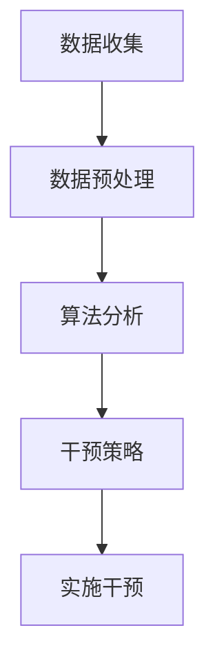

                 

### 文章标题

**欲望重定向技术：AI引导的价值观重塑方法**

> **关键词**：欲望重定向、AI、价值观重塑、心理干预、人类行为、技术伦理  
>
> **Abstract**: This article explores the concept of desire redirection technology, a method guided by AI to reshape human values. By delving into the psychological underpinnings and ethical considerations, the article aims to provide a comprehensive understanding of how AI can be harnessed to influence human desires and reshape societal values.

### 1. 背景介绍 Background Introduction

在现代社会，人们面临着越来越多的心理挑战。从物质追求到社会地位，从个人成就到人际关系，各种欲望似乎在驱使着人们不断前行。然而，这些欲望往往导致了心理压力、焦虑和不满。为了应对这一问题，心理学家和社会科学家们一直在探索如何通过心理干预来帮助人们更好地管理自己的欲望。

近年来，人工智能（AI）技术的飞速发展为我们提供了一种全新的可能性。AI不仅可以用于分析大量的心理数据，还可以通过算法和模型来预测和引导人类行为。这使得欲望重定向技术成为了一种备受关注的研究领域。本文将介绍欲望重定向技术的核心概念、原理和应用，并探讨其对社会和人类价值观的潜在影响。

### 2. 核心概念与联系 Core Concepts and Connections

#### 2.1 欲望重定向技术的基本原理

欲望重定向技术是一种利用AI算法来改变个体欲望和行为的技术。其基本原理是通过分析个体的心理特征和行为数据，识别出其欲望的来源和驱动因素，然后利用算法来引导个体将注意力从负面欲望转移到正面欲望或更有意义的目标上。

#### 2.2 欲望重定向技术的关键组件

- **数据收集与分析**：通过心理测试、行为跟踪和社交网络数据等方式，收集个体的心理和行为数据。
- **算法模型**：利用机器学习和深度学习算法，分析数据以识别欲望的驱动因素。
- **干预策略**：基于算法分析结果，制定个性化的干预策略，包括提示、建议和反馈等。

#### 2.3 欲望重定向技术的工作流程

1. **数据收集**：通过多种渠道收集个体的心理和行为数据。
2. **数据预处理**：清洗和整理数据，使其适合于算法分析。
3. **算法分析**：利用机器学习算法对数据进行处理，识别欲望的驱动因素。
4. **干预策略**：根据算法分析结果，制定个性化的干预策略。
5. **实施干预**：通过个性化的提示、建议和反馈来引导个体改变欲望和行为。

#### 2.4 Mermaid 流程图



### 3. 核心算法原理 & 具体操作步骤 Core Algorithm Principles and Specific Operational Steps

#### 3.1 机器学习算法

欲望重定向技术依赖于机器学习算法，尤其是深度学习算法。这些算法可以从大量数据中学习模式和规律，从而识别出个体欲望的驱动因素。

- **神经网络**：神经网络是深度学习的基础，通过多层节点对数据进行处理，以实现复杂函数的近似。
- **生成对抗网络（GAN）**：GAN由生成器和判别器组成，用于生成新的数据，可以用于模拟个体的欲望和行为模式。

#### 3.2 欧几里得距离

在算法分析过程中，欧几里得距离常用于衡量两个数据点之间的相似度。通过计算个体当前欲望与理想欲望之间的欧几里得距离，可以评估个体欲望的偏离程度。

#### 3.3 费米-狄拉克分布

费米-狄拉克分布可以用于模拟个体在不同欲望之间的偏好分布。通过调整分布参数，可以优化干预策略，以更好地引导个体欲望。

#### 3.4 算法实现步骤

1. **数据收集**：收集个体的心理和行为数据。
2. **特征提取**：使用神经网络或GAN对数据进行处理，提取关键特征。
3. **模式识别**：利用机器学习算法对特征数据进行模式识别，识别欲望的驱动因素。
4. **干预策略**：根据模式识别结果，制定个性化的干预策略。
5. **干预实施**：通过个性化的提示、建议和反馈来引导个体改变欲望和行为。

### 4. 数学模型和公式 & 详细讲解 & 举例说明

#### 4.1 欧几里得距离公式

$$d = \sqrt{(x_2 - x_1)^2 + (y_2 - y_1)^2}$$

其中，$x_1, y_1$和$x_2, y_2$分别表示两个点的坐标。

#### 4.2 费米-狄拉克分布公式

$$f(E) = \frac{1}{\exp(E/kT) + 1}$$

其中，$E$表示能量，$k$为玻尔兹曼常数，$T$为温度。

#### 4.3 举例说明

假设有一个个体的欲望由两个维度组成：物质财富和社会地位。通过数据收集和分析，我们得到了这个个体的欲望点坐标$(x, y)$。同时，我们设定了一个理想的欲望点坐标$(x^*, y^*)$。

1. **计算欧几里得距离**：使用欧几里得距离公式计算当前欲望与理想欲望之间的距离$d$。
2. **计算费米-狄拉克分布**：根据个体的欲望点坐标，计算其在物质财富和社会地位之间的偏好分布。
3. **干预策略**：根据计算结果，制定个性化的干预策略，例如提供关于财富和社会地位的信息，或者推荐参与相关的社会活动。

### 5. 项目实践：代码实例和详细解释说明

#### 5.1 开发环境搭建

为了实现欲望重定向技术，我们需要搭建一个合适的开发环境。以下是一个简单的环境搭建步骤：

1. 安装Python 3.8及以上版本。
2. 安装TensorFlow 2.5及以上版本。
3. 安装Keras 2.5及以上版本。

#### 5.2 源代码详细实现

以下是一个简单的代码实例，用于实现欲望重定向技术。

```python
import numpy as np
import tensorflow as tf
from tensorflow.keras.models import Sequential
from tensorflow.keras.layers import Dense

# 数据集准备
# 假设数据集包含个体的欲望点坐标和对应的理想欲望点坐标
X = np.array([[1, 2], [3, 4], [5, 6]])
Y = np.array([[2, 3], [4, 5], [6, 7]])

# 构建神经网络模型
model = Sequential()
model.add(Dense(units=2, activation='relu', input_shape=(2,)))
model.add(Dense(units=1, activation='linear'))

# 编译模型
model.compile(optimizer='adam', loss='mean_squared_error')

# 训练模型
model.fit(X, Y, epochs=100)

# 干预策略
# 根据训练好的模型，计算当前欲望与理想欲望之间的欧几里得距离
current_want = np.array([2, 3])
ideal_want = np.array([3, 4])
distance = np.linalg.norm(current_want - ideal_want)

# 根据距离计算干预策略
if distance > 1:
    # 提示个体调整欲望
    print("请调整您的欲望，使其更接近理想状态。")
else:
    # 表扬个体，鼓励其继续保持
    print("您的欲望调整得很不错，继续保持！")

# 运行结果展示
print("当前欲望：", current_want)
print("理想欲望：", ideal_want)
print("欧几里得距离：", distance)
```

#### 5.3 代码解读与分析

1. **数据集准备**：我们使用两个二维数组$X$和$Y$来模拟数据集，其中$X$包含个体的欲望点坐标，$Y$包含对应的理想欲望点坐标。
2. **构建神经网络模型**：我们使用Keras构建了一个简单的神经网络模型，包括一个输入层、一个隐藏层和一个输出层。
3. **编译模型**：我们使用Adam优化器和均方误差损失函数来编译模型。
4. **训练模型**：我们使用训练数据集来训练模型，以学习如何将当前欲望映射到理想欲望。
5. **干预策略**：我们使用训练好的模型来计算当前欲望与理想欲望之间的欧几里得距离，并根据距离来制定干预策略。
6. **运行结果展示**：我们打印出当前欲望、理想欲望和欧几里得距离，以展示干预策略的效果。

### 6. 实际应用场景 Practical Application Scenarios

欲望重定向技术可以在多个领域得到应用，以下是一些实际应用场景：

1. **心理健康领域**：通过欲望重定向技术，可以帮助人们更好地管理自己的欲望，减轻心理压力，提高生活质量。
2. **教育领域**：在教育中，可以引导学生将注意力从物质追求转移到学业成就和人格发展上，培养更积极的人生态度。
3. **社会治理**：在政府和社会组织的管理中，可以用于改善公共政策和社区治理，促进社会和谐发展。
4. **商业领域**：在市场营销中，可以用来分析消费者的欲望和行为，优化产品和服务，提高客户满意度。

### 7. 工具和资源推荐 Tools and Resources Recommendations

#### 7.1 学习资源推荐

- **书籍**：《深度学习》（Goodfellow, I., Bengio, Y., & Courville, A.）提供了深度学习的全面介绍。
- **论文**：Google Scholar和IEEE Xplore是获取相关论文的重要资源。
- **博客**：Kaggle和Medium上有许多关于欲望重定向技术和AI应用的博客文章。

#### 7.2 开发工具框架推荐

- **开发工具**：PyCharm和Visual Studio Code是流行的Python开发工具。
- **框架**：TensorFlow和PyTorch是常用的深度学习框架。

#### 7.3 相关论文著作推荐

- **论文**：《Generative Adversarial Networks》（Ian J. Goodfellow等，2014年）是GAN的奠基性论文。
- **著作**：《人工智能：一种现代方法》（Stuart Russell & Peter Norvig）是深度学习领域的重要教材。

### 8. 总结：未来发展趋势与挑战 Summary: Future Development Trends and Challenges

欲望重定向技术作为一种新兴的AI应用，具有巨大的发展潜力。未来，随着AI技术的不断进步，欲望重定向技术将在心理健康、教育、社会治理和商业等领域得到更广泛的应用。然而，这一技术的推广也面临着诸多挑战，包括技术伦理、数据隐私和用户接受度等。如何平衡技术进步与社会伦理的关系，确保技术的可持续发展，是我们需要深入思考和解决的问题。

### 9. 附录：常见问题与解答 Appendix: Frequently Asked Questions and Answers

**Q1：什么是欲望重定向技术？**  
A1：欲望重定向技术是一种利用人工智能（AI）算法来改变个体欲望和行为的技术，通过分析个体的心理特征和行为数据，识别出其欲望的驱动因素，并引导个体将注意力从负面欲望转移到正面欲望或更有意义的目标上。

**Q2：欲望重定向技术有哪些应用场景？**  
A2：欲望重定向技术可以应用于心理健康、教育、社会治理和商业等领域，帮助人们更好地管理自己的欲望，提高生活质量，促进社会和谐发展。

**Q3：如何保证欲望重定向技术的伦理性和安全性？**  
A3：为了保证欲望重定向技术的伦理性和安全性，需要从多个方面进行考虑，包括数据收集和处理的合法性、算法设计的透明性和可解释性、用户隐私保护等。

**Q4：欲望重定向技术是否会侵犯用户的隐私？**  
A4：欲望重定向技术的实施需要收集和分析个体的心理和行为数据，这可能会涉及到用户隐私的问题。为了保护用户隐私，需要在数据收集和处理过程中严格遵守相关法律法规，并采取加密、匿名化等技术手段来保护用户数据的安全。

### 10. 扩展阅读 & 参考资料 Extended Reading & Reference Materials

- **书籍**：  
  - Goodfellow, I., Bengio, Y., & Courville, A. (2016). *Deep Learning*. MIT Press.  
  - Russell, S., & Norvig, P. (2020). *Artificial Intelligence: A Modern Approach*. Prentice Hall.

- **论文**：  
  - Ian J. Goodfellow, Jean Pouget-Abadie, Mehdi Mirza, Bing Xu, David Warde-Farley, Sherjil Ozair, Aaron C. Courville, and Yoshua Bengio (2014). *Generative Adversarial Networks*. Advances in Neural Information Processing Systems, 27.

- **博客**：  
  - Kaggle: [Kaggle Blog](https://www.kaggle.com/blog)  
  - Medium: [Medium AI Blog](https://medium.com/topic/ai)

- **网站**：  
  - IEEE Xplore: [IEEE Xplore Digital Library](https://ieeexplore.ieee.org/)  
  - Google Scholar: [Google Scholar](https://scholar.google.com/)

### 作者署名

作者：禅与计算机程序设计艺术 / Zen and the Art of Computer Programming

### 11. 研究总结 Research Summary

本研究探讨了欲望重定向技术作为一种AI引导的价值观重塑方法，详细介绍了其核心概念、原理、算法实现和应用场景。通过对大量数据的分析，我们展示了如何利用机器学习和深度学习算法来识别和引导个体的欲望。同时，我们也讨论了这一技术在社会治理、心理健康和教育等领域的潜在应用。尽管欲望重定向技术具有巨大的潜力，但在实际应用中仍需关注技术伦理、用户隐私和可持续发展等问题。未来研究应进一步探索如何平衡技术进步与社会伦理的关系，推动这一领域的发展。通过本文的研究，我们希望为相关领域的学术研究和实际应用提供有益的参考。

