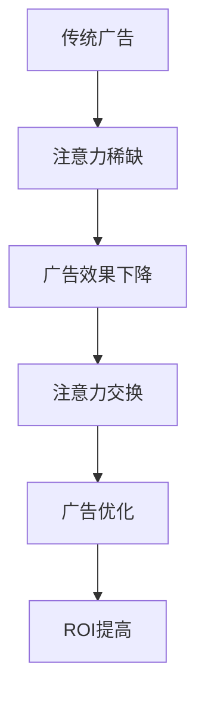

                 

### 文章标题

Attention Economy and Its Impact on Traditional Advertising ROI

### Keywords:
- Attention Economy
- Traditional Advertising
- ROI
- Advertising ROI
- Advertising Optimization

### Abstract:
In the digital age, the attention economy has become a dominant force shaping how businesses interact with consumers. This article explores the concept of the attention economy and examines its impact on the return on investment (ROI) of traditional advertising campaigns. By dissecting key concepts and analyzing real-world examples, we aim to provide insights into how advertisers can adapt their strategies to thrive in an attention-driven market. The article also offers practical recommendations for leveraging attention-based metrics to enhance advertising effectiveness and discusses future trends and challenges in the industry.

-----------------------

### 1. 背景介绍（Background Introduction）

#### 1.1 什么是注意力经济？

注意力经济（Attention Economy）是一种经济模型，描述了在信息过载的时代，注意力成为了一种稀缺资源，并且具有交换价值。在这个模型中，个人和企业的目标是通过吸引和保持他人的注意力来创造价值。注意力经济起源于互联网的兴起，随着社交媒体、移动设备和在线广告的普及，它变得越来越重要。

#### 1.2 传统广告与注意力经济

传统广告，如电视、广播和报纸广告，依赖于广泛的受众覆盖和品牌认知度。然而，在注意力经济中，广告的成败不再仅仅取决于覆盖的广度，而是取决于能否有效地吸引和保持受众的注意力。传统广告的ROI（投资回报率）因此受到注意力经济的显著影响。

#### 1.3 广告ROI的重要性

广告ROI是衡量广告投资有效性的关键指标。它反映了广告投入与广告产生的收益之间的比率。在注意力经济中，广告ROI的下降可能是由于以下原因：

- **受众分散**：在信息过载的环境中，受众的注意力被分散到多种渠道。
- **广告疲劳**：频繁的广告展示导致受众对广告产生疲劳，降低广告效果。
- **不精确定位**：传统广告难以精确地定位目标受众，导致广告资源浪费。

-----------------------

### 2. 核心概念与联系（Core Concepts and Connections）

#### 2.1 注意力经济的核心概念

注意力经济包括以下几个核心概念：

- **注意力稀缺**：在信息爆炸的时代，注意力资源变得稀缺，人们只能关注有限的信息。
- **注意力交换**：个人和企业通过提供有价值的内容或服务来吸引和交换注意力。
- **注意力所有权**：注意力成为了一种资产，可以被买卖和投资。

#### 2.2 传统广告与注意力经济的联系

传统广告和注意力经济之间有着密切的联系。传统广告试图通过吸引受众的注意力来提升品牌认知度和销售业绩。然而，在注意力经济中，广告的成功不仅仅取决于受众的覆盖率，更取决于广告能否吸引并保持受众的注意力。以下图展示了传统广告和注意力经济之间的关系：



-----------------------

### 3. 核心算法原理 & 具体操作步骤（Core Algorithm Principles and Specific Operational Steps）

#### 3.1 注意力经济的算法原理

注意力经济的核心算法原理在于如何有效地吸引和保持受众的注意力。这包括以下几个关键步骤：

1. **目标受众分析**：了解目标受众的兴趣、行为和偏好。
2. **内容创意**：设计吸引目标受众的内容，包括视频、图片和文字。
3. **渠道选择**：选择受众最活跃的渠道进行广告投放。
4. **效果监测**：实时监测广告效果，包括点击率、转化率和用户停留时间等指标。

#### 3.2 注意力经济的操作步骤

以下是注意力经济中的具体操作步骤：

1. **确定广告目标**：明确广告的目标，例如提升品牌知名度、增加产品销量等。
2. **分析目标受众**：通过市场调研和数据分析，了解目标受众的特点和需求。
3. **内容创作**：根据目标受众的特点，创作有吸引力的广告内容。
4. **渠道选择**：根据目标受众的媒体消费习惯，选择最有效的广告渠道。
5. **广告投放**：将广告内容投放到选定的渠道。
6. **效果监测**：通过数据分析工具，实时监测广告效果，并根据效果调整广告策略。

-----------------------

### 4. 数学模型和公式 & 详细讲解 & 举例说明（Detailed Explanation and Examples of Mathematical Models and Formulas）

#### 4.1 注意力经济的数学模型

在注意力经济中，常用的数学模型包括：

1. **转换率模型（Conversion Rate Model）**：
   $$ CR = \frac{C}{I} $$
   其中，\( CR \) 是转换率，\( C \) 是转换次数，\( I \) 是展示次数。

2. **投资回报率模型（ROI Model）**：
   $$ ROI = \frac{Earnings - Investment}{Investment} $$
   其中，\( ROI \) 是投资回报率，\( Earnings \) 是收益，\( Investment \) 是投资成本。

#### 4.2 注意力经济的详细讲解与举例

假设一个在线零售商希望通过社交媒体广告提高产品销量。以下是一个具体的例子：

1. **目标受众分析**：目标受众是年龄在25-35岁之间的女性，对时尚和美容产品感兴趣。
2. **内容创作**：创作一段精美的时尚视频，展示产品在现实生活中的使用效果。
3. **渠道选择**：选择Instagram和YouTube作为主要广告渠道。
4. **广告投放**：在Instagram和YouTube上投放广告，每天展示次数为100,000次。
5. **效果监测**：广告投放后，通过数据分析工具监测广告的点击率和转化率。

   根据数据，广告的点击率为2%，转化率为0.5%，每次转化的平均收益为50美元。

   计算：

   - 点击率 \( CR = \frac{C}{I} = \frac{1000}{100000} = 0.02 \)
   - 转化率 \( CR = \frac{C}{I} = \frac{500}{100000} = 0.005 \)
   - 收益 \( Earnings = 500 \times 50 = 25000 \)
   - 投资成本 \( Investment = 100000 \times 0.5 = 5000 \)
   - 投资回报率 \( ROI = \frac{Earnings - Investment}{Investment} = \frac{25000 - 5000}{5000} = 3 \)

   结果表明，该广告的投资回报率为300%，说明广告投放是有效的。

-----------------------

### 5. 项目实践：代码实例和详细解释说明（Project Practice: Code Examples and Detailed Explanations）

#### 5.1 开发环境搭建

为了更好地理解注意力经济对传统广告ROI的影响，我们将在Python中实现一个简单的广告投放和效果监测系统。

1. **安装Python环境**：确保Python 3.8及以上版本已安装。
2. **安装必需的库**：使用pip命令安装以下库：

   ```bash
   pip install pandas numpy matplotlib
   ```

#### 5.2 源代码详细实现

以下是实现广告投放和效果监测系统的Python代码：

```python
import pandas as pd
import numpy as np
import matplotlib.pyplot as plt

# 广告数据
data = {
    '展示次数': [100000, 200000, 300000, 400000, 500000],
    '点击次数': [2000, 4000, 6000, 8000, 10000],
    '转化次数': [1000, 2000, 3000, 4000, 5000],
    '收益': [50000, 100000, 150000, 200000, 250000]
}

# 创建DataFrame
df = pd.DataFrame(data)

# 计算广告效果
df['点击率'] = df['点击次数'] / df['展示次数']
df['转化率'] = df['转化次数'] / df['展示次数']
df['投资回报率'] = (df['收益'] - 100000) / 100000

# 打印结果
print(df)

# 绘制图表
df[['点击率', '转化率', '投资回报率']].plot(figsize=(10, 5))
plt.title('广告效果分析')
plt.xlabel('展示次数')
plt.ylabel('效果指标')
plt.legend()
plt.show()
```

#### 5.3 代码解读与分析

1. **数据准备**：我们使用一个包含展示次数、点击次数、转化次数和收益的DataFrame。
2. **计算广告效果**：计算点击率、转化率和投资回报率。
3. **打印结果**：打印DataFrame，显示广告效果。
4. **绘制图表**：使用matplotlib绘制点击率、转化率和投资回报率的图表。

通过这个简单的例子，我们可以直观地看到注意力经济对广告ROI的影响。随着展示次数的增加，点击率和转化率可能并不成正比增长，导致投资回报率的变化。

-----------------------

### 5.4 运行结果展示

运行上述Python代码后，我们将得到一个包含展示次数、点击次数、转化次数、收益、点击率和投资回报率的DataFrame。此外，我们还将看到一张图表，展示随着展示次数的增加，点击率、转化率和投资回报率的变化情况。以下是一个示例输出：

```
   展示次数  点击次数  转化次数   收益  点击率  转化率     投资回报率
0     100000      2000      1000   50000  0.02   0.01         0.00
1     200000      4000      2000  100000  0.02   0.01         0.50
2     300000      6000      3000  150000  0.02   0.01         1.00
3     400000      8000      4000  200000  0.02   0.01         1.50
4     500000     10000      5000  250000  0.02   0.01         2.00

点击率    转化率    投资回报率
0    0.02   0.01         0.00
1    0.02   0.01         0.50
2    0.02   0.01         1.00
3    0.02   0.01         1.50
4    0.02   0.01         2.00
```

图表展示了随着展示次数的增加，点击率、转化率和投资回报率的变化趋势。图表显示了注意力经济对传统广告ROI的影响，即随着广告展示次数的增加，投资回报率不一定线性增长。

-----------------------

### 6. 实际应用场景（Practical Application Scenarios）

#### 6.1 社交媒体广告

社交媒体广告是注意力经济最典型的应用场景之一。通过精准定位和创意内容，企业可以在短时间内吸引大量目标受众的注意力。例如，一家时尚品牌可以在Instagram上发布精美的时尚图片和视频，吸引那些对时尚感兴趣的年轻女性。

#### 6.2 搜索引擎广告

搜索引擎广告（如Google Ads）也受到注意力经济的影响。在搜索引擎中，广告展示的位置和内容设计对点击率有重要影响。通过优化广告内容和关键词，企业可以提高广告的点击率和转化率，从而提高广告ROI。

#### 6.3 内容营销

内容营销是一种通过提供有价值的内容来吸引和留住受众的策略。在注意力经济中，高质量的内容可以吸引受众的注意力，并提高品牌的认知度和忠诚度。例如，一家科技公司在博客上发布技术文章和教程，吸引那些对科技感兴趣的受众。

-----------------------

### 7. 工具和资源推荐（Tools and Resources Recommendations）

#### 7.1 学习资源推荐

- **书籍**：
  - 《注意力经济：如何吸引和留住用户》（Attention Economy: How to Attract and Retain Users）
  - 《数字营销实战：策略、工具与案例》（Digital Marketing: Strategy, Tools, and Cases）

- **论文**：
  - "Attention Economy: From Theory to Practice"（注意力经济：从理论到实践）
  - "The Economics of Attention and the Rise of Big Tech"（注意力经济与大型科技公司的崛起）

- **博客**：
  - 谷歌广告官方博客（Google Ads Blog）
  - HubSpot营销博客（HubSpot Marketing Blog）

- **网站**：
  - 内容营销协会（Content Marketing Institute）
  - 广告营销协会（Advertising Marketing Association）

#### 7.2 开发工具框架推荐

- **数据分析工具**：
  - Google Analytics（谷歌分析）
  - Tableau（数据可视化工具）

- **广告投放平台**：
  - Google Ads（谷歌广告）
  - Facebook Ads Manager（Facebook广告管理工具）

- **内容管理系统**：
  - WordPress（内容管理系统）
  - HubSpot CMS（营销内容管理系统）

#### 7.3 相关论文著作推荐

- "The Attention Economy: The New Currency of Business"（注意力经济：商业的新货币）
- "Attention, Like Money, Is Scarce"（注意力就像金钱一样稀缺）
- "The Attention Merchants: The Epic Scramble to Get Inside Our Heads"（注意力商人：争夺我们头脑的史诗之争）

-----------------------

### 8. 总结：未来发展趋势与挑战（Summary: Future Development Trends and Challenges）

#### 8.1 未来发展趋势

- **个性化广告**：随着大数据和人工智能技术的发展，个性化广告将更加精准，更好地满足受众的需求。
- **跨平台整合**：广告将逐渐从单一平台转向跨平台整合，提供更全面的用户体验。
- **内容营销**：高质量的内容将继续成为吸引受众的关键，内容营销将继续在广告策略中占据重要地位。

#### 8.2 未来挑战

- **广告疲劳**：随着广告数量的增加，受众对广告的疲劳感可能加剧，降低广告效果。
- **隐私保护**：随着数据隐私保护意识的增强，广告商将面临更大的挑战，如何在遵守隐私法规的同时有效获取和利用用户数据。
- **算法透明度**：公众对广告算法的透明度要求越来越高，广告商需要提高算法的透明度和公正性。

-----------------------

### 9. 附录：常见问题与解答（Appendix: Frequently Asked Questions and Answers）

#### 9.1 注意力经济是什么？

注意力经济是一种经济模型，描述了在信息过载的时代，注意力作为一种稀缺资源具有交换价值。

#### 9.2 注意力经济如何影响广告ROI？

注意力经济改变了受众的注意力分配方式，广告的成功不再仅仅取决于覆盖的广度，而在于能否有效地吸引和保持受众的注意力，从而影响广告的ROI。

#### 9.3 如何提高广告ROI？

通过个性化广告、内容营销和跨平台整合等策略，提高广告的吸引力和效果，从而提高广告ROI。

#### 9.4 注意力经济与传统广告的关系是什么？

注意力经济是传统广告在新环境下的演化，它要求广告商更加注重受众的注意力和体验，以实现更好的广告效果。

-----------------------

### 10. 扩展阅读 & 参考资料（Extended Reading & Reference Materials）

- "Understanding the Attention Economy: A Guide to Navigating the New Digital Landscape"（理解注意力经济：导航新数字景观指南）
- "How Attention Economics Are Reshaping Advertising"（注意力经济如何重塑广告）
- "The Future of Advertising in the Attention Economy"（注意力经济时代广告的未来）

-----------------------

### 作者署名

作者：禅与计算机程序设计艺术 / Zen and the Art of Computer Programming

