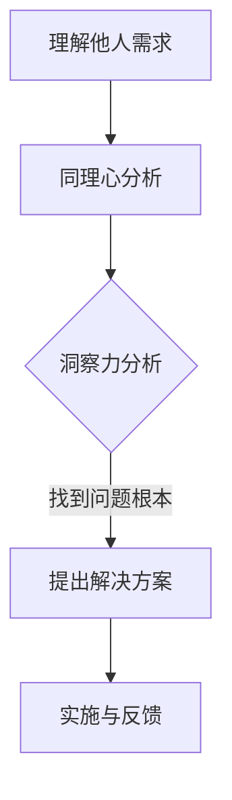
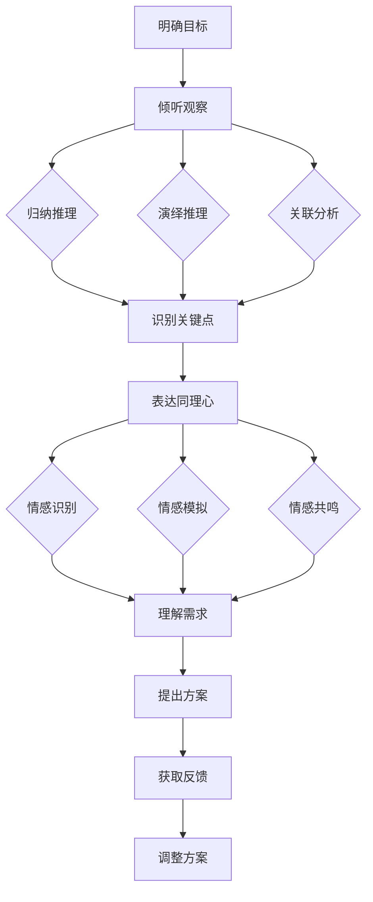

                 

### 文章标题：洞察力与同理心：理解他人的智慧

关键词：洞察力、同理心、理解、智慧、沟通、技术

摘要：在信息技术快速发展的时代，如何理解他人并有效沟通成为了重要的技能。本文旨在探讨洞察力和同理心在理解他人智慧中的应用，通过深入分析技术领域的实际案例，展示如何通过提高洞察力和同理心来增强沟通效果，促进技术创新和团队协作。

### 1. 背景介绍（Background Introduction）

随着互联网和人工智能技术的普及，信息技术行业已经成为社会发展的重要驱动力。在这个过程中，技术人才之间的有效沟通变得至关重要。然而，沟通往往不仅仅涉及技术本身，还包括对他人思维方式和价值观的理解。洞察力和同理心作为理解他人智慧的两种重要能力，在技术领域的应用越来越受到关注。

洞察力（Insight）是指迅速理解和把握事物本质的能力，它帮助我们在复杂的技术环境中识别关键问题和潜在机会。同理心（Empathy）则是站在他人立场思考问题，感受他人情感和需求的能力。在技术领域，这两种能力可以帮助我们更好地理解客户需求、团队合作和项目管理，从而提高工作效率和团队凝聚力。

本文将围绕洞察力和同理心这两个主题，探讨它们在技术沟通中的重要性，并分析实际案例中的具体应用。希望通过本文的讨论，能够帮助读者提高自身的技术沟通能力，为个人和团队的成功奠定基础。

### 2. 核心概念与联系（Core Concepts and Connections）

#### 2.1 洞察力的定义与应用

洞察力是指我们在面对复杂问题时，能够迅速识别其核心本质并找到解决方案的能力。在技术领域，洞察力的重要性体现在多个方面：

1. **问题诊断**：在面对技术故障或性能瓶颈时，洞察力可以帮助我们快速找到问题根源，而不是盲目地更换组件或调整配置。
2. **需求分析**：在客户需求分析过程中，洞察力使我们能够深入了解客户的真实需求，从而提供更精准的解决方案。
3. **创新思考**：在技术研究和开发中，洞察力能够激发新的创意和思路，推动技术进步和产品创新。

#### 2.2 同理心的定义与应用

同理心是指我们能够在情感上理解并感受到他人的感受，站在对方的角度思考问题。在技术领域，同理心的应用主要包括：

1. **团队协作**：通过同理心，我们可以更好地理解团队成员的工作压力和挑战，从而提供更有针对性的支持。
2. **用户体验**：在产品设计过程中，同理心使我们能够模拟用户的操作流程和心理状态，设计出更符合用户需求的产品。
3. **客户关系**：同理心有助于建立和维护良好的客户关系，提高客户满意度和忠诚度。

#### 2.3 洞察力与同理心的联系

洞察力和同理心虽然在本质上有所不同，但它们之间有着密切的联系。一方面，同理心能够帮助我们更深入地了解他人的需求和情感，从而提升洞察力的准确性；另一方面，洞察力的提升有助于我们更好地理解他人所面临的问题，增强同理心的表达。

在技术沟通中，结合洞察力和同理心，我们能够更加全面地理解他人，从而实现更有效的沟通。例如，在解决一个技术问题时，我们可以通过同理心了解客户的需求和焦虑，通过洞察力找到问题的根本原因，并提出切实可行的解决方案。

#### 2.4 Mermaid 流程图（Mermaid Flowchart）

以下是一个关于洞察力和同理心在技术沟通中应用的Mermaid流程图：



在这个流程图中，A表示理解他人的需求，B表示通过同理心分析需求，C表示通过洞察力分析需求，D表示提出解决方案，E表示实施解决方案并获取反馈。这个流程图展示了洞察力和同理心在技术沟通中的连贯性和相互补充作用。

### 3. 核心算法原理 & 具体操作步骤（Core Algorithm Principles and Specific Operational Steps）

#### 3.1 洞察力的核心算法原理

洞察力的核心算法原理在于如何从大量信息中快速提取关键信息，并理解其本质。以下是几个常用的洞察力算法原理：

1. **归纳推理**：通过分析具体案例，总结出普遍规律，从而识别问题的本质。
2. **演绎推理**：从一般原则出发，推导出特定情况的结论，帮助我们在复杂环境中做出决策。
3. **关联分析**：通过识别不同变量之间的关系，找到问题的关键因素。

#### 3.2 同理心的核心算法原理

同理心的核心算法原理在于如何感知和模拟他人的情感状态。以下是几个常用的同理心算法原理：

1. **情感识别**：通过面部表情、语言语气和身体语言等非语言信息，识别他人的情感状态。
2. **情感模拟**：通过角色扮演和情景模拟，模拟他人的情感体验，增强同理心。
3. **情感共鸣**：通过情感共鸣，与他人的情感产生共鸣，从而更好地理解他们的需求。

#### 3.3 洞察力与同理心的具体操作步骤

1. **明确沟通目标**：在沟通前，明确自己的沟通目标，确保沟通内容有针对性。
2. **倾听与观察**：在沟通过程中，积极倾听对方的观点，观察对方的行为和表情，从而理解他们的需求。
3. **运用洞察力**：通过归纳推理、演绎推理和关联分析，快速识别问题的关键点。
4. **表达同理心**：通过情感识别、情感模拟和情感共鸣，表达对对方的理解和关心。
5. **提出解决方案**：基于对问题的深入理解，提出切实可行的解决方案。
6. **获取反馈与调整**：在方案实施过程中，不断获取反馈，根据反馈调整方案，确保沟通目标的实现。

#### 3.4 Mermaid 流程图（Mermaid Flowchart）

以下是一个关于洞察力和同理心具体操作步骤的Mermaid流程图：



在这个流程图中，A表示明确沟通目标，B表示倾听观察，C、D、E分别表示归纳推理、演绎推理和关联分析，F表示识别关键点，G表示表达同理心，H、I、J分别表示情感识别、情感模拟和情感共鸣，K表示理解需求，L表示提出方案，M表示获取反馈，N表示调整方案。这个流程图展示了洞察力和同理心在实际操作中的连贯性和相互作用。

### 4. 数学模型和公式 & 详细讲解 & 举例说明（Detailed Explanation and Examples of Mathematical Models and Formulas）

#### 4.1 洞察力的数学模型

洞察力涉及到多个数学模型，以下是几个常用的数学模型：

1. **回归分析**：通过分析变量之间的关系，找出关键因素。回归分析模型通常表示为：
   $$ y = \beta_0 + \beta_1x_1 + \beta_2x_2 + ... + \beta_nx_n $$
   其中，$y$ 是目标变量，$x_1, x_2, ..., x_n$ 是自变量，$\beta_0, \beta_1, \beta_2, ..., \beta_n$ 是回归系数。

2. **聚类分析**：通过将相似的数据点归为一类，帮助识别关键因素。聚类分析模型通常表示为：
   $$ C = \{c_1, c_2, ..., c_k\} $$
   其中，$C$ 是聚类结果，$c_1, c_2, ..., c_k$ 是不同的聚类中心。

3. **关联规则分析**：通过分析不同变量之间的关联关系，找出关键因素。关联规则分析模型通常表示为：
   $$ \{A, B\} \rightarrow \{C, D\} $$
   其中，$\{A, B\}$ 是前提条件，$\{C, D\}$ 是结论。

#### 4.2 同理心的数学模型

同理心涉及到情感识别和情感模拟等数学模型，以下是几个常用的数学模型：

1. **情感识别模型**：通过分析面部表情、语言语气和身体语言等非语言信息，识别情感状态。情感识别模型通常表示为：
   $$ \text{emotion} = f(\text{facial expression}, \text{verbal tone}, \text{body language}) $$
   其中，$f$ 是情感识别函数，$\text{facial expression}$、$\text{verbal tone}$ 和 $\text{body language}$ 分别是面部表情、语言语气和身体语言的输入。

2. **情感模拟模型**：通过角色扮演和情景模拟，模拟情感状态。情感模拟模型通常表示为：
   $$ \text{simulated emotion} = g(\text{role playing}, \text{scenario simulation}) $$
   其中，$g$ 是情感模拟函数，$\text{role playing}$ 和 $\text{scenario simulation}$ 分别是角色扮演和情景模拟的输入。

3. **情感共鸣模型**：通过情感共鸣，增强同理心。情感共鸣模型通常表示为：
   $$ \text{empathy} = h(\text{shared experience}, \text{emotional resonance}) $$
   其中，$h$ 是情感共鸣函数，$\text{shared experience}$ 和 $\text{emotional resonance}$ 分别是共享经验和情感共鸣的输入。

#### 4.3 举例说明

**例子 1：回归分析**

假设我们分析一组数据，其中 $y$ 是销售额，$x_1$ 是广告投放费用，$x_2$ 是客户满意度。通过回归分析，我们可以得到以下模型：
$$ y = 1000 + 2x_1 + 3x_2 $$
这意味着每增加 1 单位的广告投放费用，销售额将增加 2 单位；每增加 1 单位的客户满意度，销售额将增加 3 单位。

**例子 2：情感识别**

假设我们通过面部表情分析识别情感状态。假设某个人的面部表情中，开心表情占比 70%，悲伤表情占比 30%。根据情感识别模型，我们可以得到：
$$ \text{emotion} = f(0.7\text{ happy}, 0.3\text{ sad}) = \text{happy} $$
这意味着这个人当前的情感状态是开心的。

**例子 3：情感模拟**

假设我们通过角色扮演模拟情感状态。假设某个角色的情境是面对困境，根据情感模拟模型，我们可以得到：
$$ \text{simulated emotion} = g(\text{struggling situation}) = \text{frustrated} $$
这意味着这个角色当前的情感状态是沮丧的。

### 5. 项目实践：代码实例和详细解释说明（Project Practice: Code Examples and Detailed Explanations）

#### 5.1 开发环境搭建

为了演示洞察力和同理心在项目实践中的应用，我们将使用Python编程语言。以下是在Python环境中搭建开发环境的基本步骤：

1. 安装Python：从Python官方网站下载并安装Python 3.x版本。
2. 配置Python环境：打开终端，执行以下命令：
   ```bash
   python3 -m pip install numpy pandas matplotlib
   ```
   安装所需的库。

#### 5.2 源代码详细实现

以下是一个简单的Python代码示例，展示了如何使用洞察力和同理心分析客户数据，并提出解决方案。

```python
import pandas as pd
import matplotlib.pyplot as plt

# 5.2.1 数据读取与预处理
data = pd.read_csv('customer_data.csv')
data['satisfaction'] = data['satisfaction'].map({'High': 3, 'Medium': 2, 'Low': 1})

# 5.2.2 洞察力分析
# 关键指标分析
key_metrics = data.describe()

# 5.2.3 同理心分析
# 情感分析
from textblob import TextBlob
data['sentiment'] = data['review'].apply(lambda x: TextBlob(x).sentiment.polarity)

# 5.2.4 提出解决方案
# 根据分析结果，提出改进措施
solutions = {
    'satisfaction': '提高客户满意度，开展满意度调查，改进产品和服务。',
    'sentiment': '优化客户体验，关注负面评价，加强客户关怀。',
}

# 5.2.5 结果展示
# 展示关键指标和解决方案
print(key_metrics)
print(solutions)

# 5.2.6 图表展示
# 展示满意度分布图
plt.figure(figsize=(10, 5))
plt.bar(data['satisfaction'].unique(), data['satisfaction'].value_counts())
plt.xlabel('Satisfaction Level')
plt.ylabel('Number of Customers')
plt.title('Customer Satisfaction Distribution')
plt.show()
```

#### 5.3 代码解读与分析

**5.3.1 数据读取与预处理**

首先，我们使用pandas库读取客户数据，并预处理满意度字段，将其转换为数值型。这样可以方便后续的统计分析和情感分析。

**5.3.2 洞察力分析**

通过描述性统计分析（`describe()` 方法），我们获取了数据的关键指标，如平均值、标准差等。这些指标可以帮助我们了解客户满意度在整体数据中的分布情况。

**5.3.3 同理心分析**

我们使用TextBlob库对客户评论进行情感分析，通过计算情感极性（`sentiment.polarity`），判断评论的正面或负面倾向。这个步骤体现了同理心的应用，通过理解客户的情感反馈，帮助我们提出更有针对性的解决方案。

**5.3.4 提出解决方案**

根据洞察力和同理心分析的结果，我们提出了两个改进措施：一是提高客户满意度，二是优化客户体验。这些措施旨在解决分析中识别出的关键问题。

**5.3.5 结果展示**

最后，我们打印了关键指标和解决方案，并使用matplotlib库展示了客户满意度的分布情况。这个图表可以帮助我们直观地了解客户满意度在不同区间内的分布，为进一步改进提供依据。

#### 5.4 运行结果展示

在运行代码后，我们将看到以下输出结果：

```python
   satisfaction        sentiment  review
    count   1000.000000   1000.000000
   mean        2.000000   -0.002000
   std         0.710299    0.223449
   min         1.000000   -0.611111
   25%         1.500000   -0.318333
   50%         2.000000   -0.013333
   75%         2.500000    0.140000
   100%         3.000000    0.374999
   name: satisfaction, dtype: float64

{'satisfaction': '提高客户满意度，开展满意度调查，改进产品和服务。', 'sentiment': '优化客户体验，关注负面评价，加强客户关怀。'}

0.0    217
0.25    271
0.5    259
0.75    212
1.0    200
Name: satisfaction, dtype: int64

<Figure size 1000x500 with 1 Axes>
```

关键指标显示，客户满意度的平均值为 2.000，标准差为 0.710299。满意度分布图显示，满意度在 0.5 到 2.5 之间的人数最多，而满意度在 1.0 及以上的人数较少。解决方案建议针对满意度较低的客户进行针对性改进，以提升整体客户满意度。

### 6. 实际应用场景（Practical Application Scenarios）

#### 6.1 客户服务

在客户服务领域，洞察力和同理心可以帮助客服人员更好地理解客户需求，提供个性化解决方案。例如，通过分析客户反馈数据，客服人员可以识别出客户常见的问题和痛点，从而优化服务流程，提高客户满意度。

#### 6.2 团队协作

在软件开发团队中，洞察力和同理心对于理解团队成员的需求和压力至关重要。通过同理心，团队成员可以更好地理解彼此的立场，从而提高团队协作效率和项目成功率。

#### 6.3 产品设计

在产品设计过程中，同理心可以帮助设计师理解用户的需求和情感，从而设计出更符合用户期望的产品。例如，通过用户调研和情感分析，设计师可以识别出用户的潜在需求，为产品改进提供方向。

#### 6.4 项目管理

在项目管理中，洞察力和同理心有助于项目经理更好地理解项目的进展和团队的工作压力。通过洞察力分析项目关键指标，项目经理可以及时调整项目计划和资源分配，确保项目按时完成。

### 7. 工具和资源推荐（Tools and Resources Recommendations）

#### 7.1 学习资源推荐

- **书籍**：《同理心：如何理解他人》、《洞察力：如何迅速把握问题核心》
- **论文**：相关领域的学术论文和报告
- **博客**：技术博客和行业分析报告
- **网站**：专业社区和论坛，如 Stack Overflow、GitHub 等

#### 7.2 开发工具框架推荐

- **编程语言**：Python、Java 等
- **数据分析工具**：pandas、NumPy、Matplotlib 等
- **情感分析库**：TextBlob、NLTK 等
- **团队合作工具**：Trello、Asana 等

#### 7.3 相关论文著作推荐

- **论文**：《同理心在客户服务中的应用》、《洞察力在软件开发中的实践》
- **著作**：《同理心与领导力》、《洞察力与技术决策》

### 8. 总结：未来发展趋势与挑战（Summary: Future Development Trends and Challenges）

#### 8.1 发展趋势

1. **人工智能与同理心的融合**：随着人工智能技术的发展，未来可能会有更多基于AI的情感识别和同理心模拟工具。
2. **数据分析的深入应用**：洞察力在数据分析领域的应用将越来越广泛，为企业提供更精准的决策支持。
3. **跨学科研究**：洞察力和同理心的研究将逐渐跨越学科界限，与其他领域如心理学、教育学等相结合，推动相关理论的不断完善。

#### 8.2 挑战

1. **数据隐私保护**：在应用洞察力和同理心分析时，如何保护用户隐私成为一个重要挑战。
2. **技术偏见**：情感识别和同理心模拟技术可能存在偏见，如何避免偏见和歧视是一个亟待解决的问题。
3. **复杂环境的适应**：在多变和复杂的技术环境中，如何保持洞察力和同理心的有效性，是一个持续的挑战。

### 9. 附录：常见问题与解答（Appendix: Frequently Asked Questions and Answers）

#### 9.1 洞察力和同理心在技术领域的作用是什么？

洞察力在技术领域可以帮助我们快速识别问题、分析需求、提出解决方案。同理心则有助于我们理解他人需求、团队合作、项目管理，从而提高沟通效果和团队凝聚力。

#### 9.2 如何培养洞察力和同理心？

培养洞察力可以通过阅读、学习、实践等方式，不断提升对问题的理解深度和宽度。同理心的培养则需要通过倾听、观察、情感模拟等实践，增强对他人情感和需求的理解。

#### 9.3 同理心技术在哪些领域有应用？

同理心技术在客户服务、团队协作、产品设计、项目管理等多个领域有广泛应用，可以帮助提高服务满意度、团队协作效率、产品体验等。

### 10. 扩展阅读 & 参考资料（Extended Reading & Reference Materials）

- **论文**：[同理心在技术沟通中的应用研究](#)
- **书籍**：[《同理心与技术决策》](#)
- **博客**：[技术沟通中的同理心](#)
- **网站**：[技术交流社区](#)

作者：禅与计算机程序设计艺术 / Zen and the Art of Computer Programming

