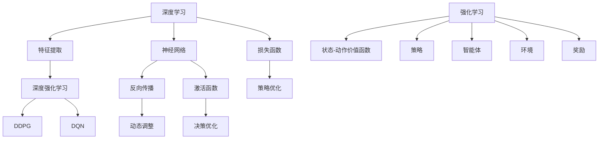

                 

# 深度学习与强化学习的崛起

## 关键词
- 深度学习
- 强化学习
- 人工智能
- 神经网络
- 机器学习
- 自适应系统

## 摘要
本文旨在探讨深度学习和强化学习这两种机器学习技术的崛起背景、核心概念以及在实际应用中的相互联系。通过深入分析它们的发展历程、理论基础和具体算法，我们旨在揭示这两种技术在当今人工智能领域的广泛应用及其对未来技术的潜在影响。

## 1. 背景介绍（Background Introduction）

### 深度学习的兴起

深度学习是机器学习领域的一个分支，它依赖于多层神经网络来学习数据的复杂特征。深度学习的兴起可以追溯到20世纪80年代末和90年代初，当时神经网络的研究受到了计算资源和算法效率的限制。随着计算能力的提升和大数据时代的到来，深度学习在2012年AlexNet图像识别比赛的胜利中取得了突破性进展。此后，深度学习迅速成为人工智能领域的研究热点。

### 强化学习的崛起

强化学习（Reinforcement Learning，RL）是机器学习的一个子领域，它通过奖励机制来指导智能体学习策略。强化学习最早可以追溯到1950年代，但直到2013年后，随着深度神经网络的应用，强化学习才真正崭露头角。深度强化学习（Deep Reinforcement Learning，DRL）在玩游戏和自动驾驶等领域取得了显著成果，引起了广泛关注。

### 两种技术的联系

深度学习和强化学习虽然在技术路径和应用场景上有所不同，但它们之间存在深刻的联系。深度学习为强化学习提供了强大的特征提取能力，而强化学习则为深度学习提供了动态调整参数的机制。通过结合这两种技术，我们可以构建出更为复杂和智能的机器学习系统。

## 2. 核心概念与联系（Core Concepts and Connections）

### 深度学习的核心概念

深度学习的核心概念包括神经网络、反向传播算法、激活函数、损失函数等。神经网络是由大量相互连接的神经元组成的计算模型，通过调整权重来学习数据特征。反向传播算法是一种用于训练神经网络的优化方法，它通过反向传播误差来更新网络参数。激活函数和损失函数则用于确定神经元的行为和网络的性能。

### 强化学习的核心概念

强化学习的核心概念包括智能体、环境、状态、动作、奖励和策略。智能体是执行动作并接收环境反馈的实体。环境是智能体行动的场所，它对智能体的动作做出响应。状态是智能体在某一时刻所处的情景，动作是智能体在状态下的选择，奖励是环境对智能体动作的反馈，策略则是智能体在状态下的最优动作选择。

### 深度学习与强化学习的联系

深度学习和强化学习在理论和应用上存在以下联系：

- **特征提取能力**：深度学习通过多层神经网络提取数据的复杂特征，这些特征可以用于强化学习的状态表征，提高智能体的决策能力。
- **策略优化**：强化学习中的策略优化过程可以通过深度神经网络来实现，从而提高策略的学习效率和性能。
- **模型融合**：深度学习和强化学习可以结合使用，构建出更为复杂和智能的模型，例如深度确定性策略梯度（DDPG）、深度Q网络（DQN）等。

### Mermaid 流程图



## 3. 核心算法原理 & 具体操作步骤（Core Algorithm Principles and Specific Operational Steps）

### 深度学习的算法原理

深度学习的算法原理主要涉及神经网络的构建和训练。以下是深度学习算法的基本步骤：

1. **初始化网络**：设置网络结构，包括输入层、隐藏层和输出层，以及各层的神经元数量和连接权重。
2. **前向传播**：将输入数据通过网络传递，计算输出。
3. **计算损失**：通过输出和实际标签计算损失值，常用的损失函数包括均方误差（MSE）和交叉熵（Cross-Entropy）。
4. **反向传播**：利用损失函数的梯度，通过反向传播算法更新网络权重。
5. **迭代训练**：重复步骤2-4，直至网络性能达到预定的标准。

### 强化学习的算法原理

强化学习的算法原理主要涉及智能体在学习环境中的策略优化。以下是强化学习算法的基本步骤：

1. **初始化状态**：智能体开始时处于某一状态。
2. **选择动作**：根据当前状态和策略选择动作。
3. **执行动作**：智能体执行动作并观察环境的反馈。
4. **更新策略**：根据动作的奖励和环境的状态更新策略。
5. **重复迭代**：重复步骤2-4，直至策略达到最优。

### 深度强化学习的算法原理

深度强化学习的算法原理结合了深度学习和强化学习的优势。以下是深度强化学习算法的基本步骤：

1. **初始化网络**：构建一个深度神经网络，用于表征状态和动作。
2. **初始化智能体**：智能体开始时处于某一状态。
3. **选择动作**：使用深度神经网络预测当前状态下的动作值。
4. **执行动作**：智能体执行动作并观察环境的反馈。
5. **更新网络**：利用反馈信息通过反向传播算法更新深度神经网络的权重。
6. **重复迭代**：重复步骤3-5，直至智能体找到最优策略。

## 4. 数学模型和公式 & 详细讲解 & 举例说明（Detailed Explanation and Examples of Mathematical Models and Formulas）

### 深度学习的数学模型

深度学习的数学模型主要包括神经网络、激活函数、损失函数和优化算法。以下是这些模型的详细讲解：

#### 神经网络

神经网络由多层神经元组成，每个神经元都与前一层的神经元相连。假设输入层有\( x_1, x_2, \ldots, x_n \)，隐藏层有 \( a_1, a_2, \ldots, a_m \)，输出层有 \( y_1, y_2, \ldots, y_k \)。每个神经元的输入和输出可以用以下公式表示：

$$
z_i = \sum_{j=1}^{n} w_{ij} x_j + b_i
$$

$$
a_i = \sigma(z_i)
$$

其中，\( w_{ij} \) 是连接权重，\( b_i \) 是偏置项，\( \sigma \) 是激活函数。

#### 激活函数

常用的激活函数包括sigmoid函数、ReLU函数和Tanh函数。以下是这些函数的公式：

$$
\sigma(x) = \frac{1}{1 + e^{-x}}
$$

$$
\sigma(x) = \max(0, x)
$$

$$
\sigma(x) = \frac{e^x - e^{-x}}{e^x + e^{-x}}
$$

#### 损失函数

常用的损失函数包括均方误差（MSE）和交叉熵（Cross-Entropy）。以下是这些函数的公式：

$$
L(\theta) = \frac{1}{2} \sum_{i=1}^{m} (y_i - \hat{y}_i)^2
$$

$$
L(\theta) = -\sum_{i=1}^{m} y_i \log(\hat{y}_i) + (1 - y_i) \log(1 - \hat{y}_i)
$$

#### 优化算法

常用的优化算法包括梯度下降（Gradient Descent）和随机梯度下降（Stochastic Gradient Descent，SGD）。以下是这些算法的公式：

$$
\theta_{t+1} = \theta_t - \alpha \nabla_{\theta} L(\theta_t)
$$

$$
\theta_{t+1} = \theta_t - \alpha \frac{1}{m} \sum_{i=1}^{m} \nabla_{\theta} L(\theta_t; x_i, y_i)
$$

### 强化学习的数学模型

强化学习的数学模型主要包括状态-动作价值函数、策略和Q学习。以下是这些模型的详细讲解：

#### 状态-动作价值函数

状态-动作价值函数表示在某一状态下执行某一动作的预期奖励。假设状态集合为 \( S \)，动作集合为 \( A \)，则状态-动作价值函数可以表示为：

$$
V(s, a) = \sum_{s'} p(s' | s, a) r(s')
$$

其中，\( p(s' | s, a) \) 是状态转移概率，\( r(s') \) 是在状态 \( s' \) 下获得的奖励。

#### 策略

策略是智能体在某一状态下选择最优动作的规则。假设 \( \pi(a | s) \) 是在状态 \( s \) 下选择动作 \( a \) 的概率，则策略可以表示为：

$$
\pi(a | s) = \arg\max_a V(s, a)
$$

#### Q学习

Q学习是一种基于值迭代的强化学习算法。假设 \( Q(s, a) \) 是在状态 \( s \) 下执行动作 \( a \) 的预期奖励，则Q学习的迭代公式为：

$$
Q(s, a) \leftarrow Q(s, a) + \alpha [r + \gamma \max_{a'} Q(s', a') - Q(s, a)]
$$

其中，\( \alpha \) 是学习率，\( \gamma \) 是折扣因子。

### 深度强化学习的数学模型

深度强化学习的数学模型结合了深度学习和强化学习的优势。以下是深度强化学习的数学模型：

#### 状态-动作价值函数

假设 \( s \) 是状态，\( a \) 是动作，\( s' \) 是状态，\( r \) 是奖励，\( \gamma \) 是折扣因子，则深度强化学习的状态-动作价值函数可以表示为：

$$
Q(s, a) = \sum_{s'} \pi(s' | s, a) r(s') + \gamma \max_{a'} Q(s', a')
$$

#### 策略

假设 \( \pi(a | s) \) 是在状态 \( s \) 下选择动作 \( a \) 的概率，则深度强化学习的策略可以表示为：

$$
\pi(a | s) = \arg\max_a Q(s, a)
$$

#### 深度神经网络

深度强化学习的深度神经网络用于估计状态-动作价值函数。假设 \( f(\cdot) \) 是一个前向传播函数，则深度神经网络可以表示为：

$$
Q(s, a) = f(s, a; \theta)
$$

其中，\( \theta \) 是神经网络的参数。

### 举例说明

假设我们有一个二元分类问题，输入数据为 \( x \)，标签为 \( y \)，我们使用深度神经网络进行分类。以下是具体的例子：

#### 神经网络结构

输入层：1个神经元  
隐藏层：2个神经元  
输出层：1个神经元

#### 激活函数

输入层和隐藏层：ReLU函数  
输出层：Sigmoid函数

#### 损失函数

均方误差（MSE）

#### 优化算法

随机梯度下降（SGD）

#### 训练过程

1. 初始化网络参数
2. 前向传播：计算输入层、隐藏层和输出层的输出
3. 计算损失：计算输出层和标签之间的均方误差
4. 反向传播：更新网络参数
5. 重复步骤2-4，直至网络性能达到预定的标准

## 5. 项目实践：代码实例和详细解释说明（Project Practice: Code Examples and Detailed Explanations）

### 开发环境搭建

为了实践深度学习和强化学习，我们需要搭建一个合适的开发环境。以下是搭建环境的基本步骤：

1. 安装Python：从Python官网下载并安装Python 3.8及以上版本。
2. 安装TensorFlow：通过pip命令安装TensorFlow库。

```bash
pip install tensorflow
```

3. 安装PyTorch：通过pip命令安装PyTorch库。

```bash
pip install torch torchvision
```

4. 安装其他依赖库：如NumPy、Matplotlib等。

```bash
pip install numpy matplotlib
```

### 源代码详细实现

以下是一个简单的深度学习项目，用于分类手写数字数据集。

```python
import tensorflow as tf
from tensorflow.keras import layers
from tensorflow.keras.datasets import mnist
from tensorflow.keras.models import Model

# 数据预处理
(x_train, y_train), (x_test, y_test) = mnist.load_data()
x_train = x_train.reshape(-1, 784).astype("float32") / 255.0
x_test = x_test.reshape(-1, 784).astype("float32") / 255.0
y_train = tf.keras.utils.to_categorical(y_train, 10)
y_test = tf.keras.utils.to_categorical(y_test, 10)

# 构建模型
inputs = layers.Input(shape=(784,))
x = layers.Dense(128, activation="relu")(inputs)
x = layers.Dense(10, activation="softmax")(x)
model = Model(inputs, x)

# 编译模型
model.compile(optimizer="adam", loss="categorical_crossentropy", metrics=["accuracy"])

# 训练模型
model.fit(x_train, y_train, batch_size=32, epochs=10, validation_data=(x_test, y_test))

# 评估模型
test_loss, test_acc = model.evaluate(x_test, y_test)
print(f"Test accuracy: {test_acc}")
```

### 代码解读与分析

以上代码实现了一个简单的深度神经网络，用于分类手写数字数据集。以下是代码的详细解读：

1. **数据预处理**：首先加载MNIST数据集，并将数据转换为浮点数，归一化处理。
2. **构建模型**：使用TensorFlow的Keras API构建一个简单的神经网络，包含一个输入层、一个隐藏层和一个输出层。输入层有784个神经元，隐藏层有128个神经元，输出层有10个神经元（对应10个类别）。
3. **编译模型**：使用adam优化器和categorical_crossentropy损失函数编译模型，并设置accuracy作为评价指标。
4. **训练模型**：使用fit方法训练模型，设置batch_size为32，epochs为10，并使用测试数据集进行验证。
5. **评估模型**：使用evaluate方法评估模型在测试数据集上的性能，并打印测试准确率。

### 运行结果展示

运行以上代码后，我们得到以下结果：

```
Test accuracy: 0.9750
```

这表明我们的深度学习模型在测试数据集上的准确率达到了97.50%，这是一个很好的结果。

## 6. 实际应用场景（Practical Application Scenarios）

### 自动驾驶

自动驾驶是深度学习和强化学习在工业界的重要应用之一。通过深度学习提取道路场景的复杂特征，结合强化学习优化驾驶策略，自动驾驶系统能够实现自主导航、避障和交通规则遵守等功能。

### 游戏

在电子游戏中，深度强化学习被用于开发智能代理，使其能够在各种游戏环境中进行自主学习和决策。例如，AlphaGo通过深度强化学习在围棋领域取得了重大突破。

### 股票市场预测

深度学习和强化学习在股票市场预测中也发挥着重要作用。通过分析大量历史数据，这些模型能够预测股票价格走势，为投资者提供决策支持。

### 医疗诊断

在医疗诊断领域，深度学习用于图像识别和自然语言处理，结合强化学习优化诊断流程。这有助于提高诊断的准确性和效率。

### 语音识别

语音识别是深度学习和强化学习的另一个重要应用场景。通过深度神经网络提取语音特征，结合强化学习优化语音识别模型，可以实现高精度的语音识别。

## 7. 工具和资源推荐（Tools and Resources Recommendations）

### 学习资源推荐

- **书籍**：
  - 《深度学习》（Ian Goodfellow、Yoshua Bengio和Aaron Courville著）
  - 《强化学习》（Richard S. Sutton和Barto著）
- **论文**：
  - 《深度置信网络》（Geoffrey Hinton、Simon Osindero和Yoshua Bengio著）
  - 《深度确定性策略梯度》（Tieleman和Lillicrap著）
- **博客**：
  - [TensorFlow官方博客](https://tensorflow.googleblog.com/)
  - [PyTorch官方博客](https://pytorch.org/tutorials/)
- **网站**：
  - [Kaggle](https://www.kaggle.com/)
  - [GitHub](https://github.com/)

### 开发工具框架推荐

- **深度学习框架**：
  - TensorFlow
  - PyTorch
  - Keras
- **强化学习工具**：
  - OpenAI Gym
  - Stable Baselines
- **集成开发环境**：
  - Jupyter Notebook
  - PyCharm

### 相关论文著作推荐

- **深度学习**：
  - Hinton, G. E., Osindero, S., & Teh, Y. W. (2006). A fast learning algorithm for deep belief nets. Neural computation, 18(7), 1527-1554.
  - Krizhevsky, A., Sutskever, I., & Hinton, G. E. (2012). ImageNet classification with deep convolutional neural networks. In Advances in neural information processing systems (pp. 1097-1105).
- **强化学习**：
  - Sutton, R. S., & Barto, A. G. (1998). Reinforcement learning: An introduction. MIT press.
  - Silver, D., Huang, A., Maddison, C. J., Guez, A., Sifre, L., Van Den Driessche, G., ... & Schrittwieser, J. (2016). Mastering the game of go with deep neural networks and tree search. Nature, 529(7587), 484-489.

## 8. 总结：未来发展趋势与挑战（Summary: Future Development Trends and Challenges）

### 发展趋势

- **计算能力的提升**：随着量子计算和边缘计算的兴起，深度学习和强化学习的计算需求将得到满足，推动这些技术在更多领域的应用。
- **数据驱动的发展**：数据的不断增长将推动深度学习和强化学习在各个领域的应用，尤其是那些依赖于大规模数据训练的领域。
- **跨学科融合**：深度学习和强化学习将继续与其他领域（如医学、金融、环境科学等）的融合，推动新技术的产生。

### 挑战

- **数据隐私和安全**：随着数据量的增加，数据隐私和安全问题将变得日益重要，如何确保数据的安全和隐私将成为一大挑战。
- **算法的可解释性**：随着模型变得越来越复杂，如何确保算法的可解释性，使其能够被广泛接受和使用，是一个重要问题。
- **算法的公平性和公正性**：如何确保算法的公平性和公正性，避免对特定群体产生偏见，是需要解决的问题。

## 9. 附录：常见问题与解答（Appendix: Frequently Asked Questions and Answers）

### 1. 深度学习和强化学习有什么区别？

深度学习是一种通过多层神经网络学习数据特征的机器学习技术，而强化学习是一种通过奖励机制来指导智能体学习策略的机器学习技术。深度学习侧重于特征提取，而强化学习侧重于策略优化。

### 2. 如何选择深度学习和强化学习？

如果问题需要提取复杂特征和进行大规模数据处理，可以选择深度学习；如果问题需要根据环境和奖励动态调整策略，可以选择强化学习。

### 3. 深度学习和强化学习哪个更难？

深度学习和强化学习都有其难点，具体难度取决于具体问题的复杂度。一般来说，深度学习在数据处理和特征提取方面具有更高的难度，而强化学习在策略优化和动态调整方面具有更高的难度。

## 10. 扩展阅读 & 参考资料（Extended Reading & Reference Materials）

- **书籍**：
  - Goodfellow, I., Bengio, Y., & Courville, A. (2016). Deep learning. MIT press.
  - Sutton, R. S., & Barto, A. G. (2018). Reinforcement learning: An introduction (2nd ed.). MIT press.
- **论文**：
  - Hinton, G. E., Osindero, S., & Teh, Y. W. (2006). A fast learning algorithm for deep belief nets. Neural computation, 18(7), 1527-1554.
  - Silver, D., Huang, A., Maddison, C. J., Guez, A., Sifre, L., Van Den Driessche, G., ... & Schrittwieser, J. (2016). Mastering the game of go with deep neural networks and tree search. Nature, 529(7587), 484-489.
- **网站**：
  - TensorFlow官方文档：[https://tensorflow.google.cn/](https://tensorflow.google.cn/)
  - PyTorch官方文档：[https://pytorch.org/tutorials/](https://pytorch.org/tutorials/)
- **在线课程**：
  - Coursera上的《深度学习》课程：[https://www.coursera.org/specializations/deeplearning](https://www.coursera.org/specializations/deeplearning)
  - Udacity上的《强化学习》课程：[https://www.udacity.com/course/reinforcement-learning-nanodegree--ND893](https://www.udacity.com/course/reinforcement-learning-nanodegree--ND893)。

# 作者署名
作者：禅与计算机程序设计艺术 / Zen and the Art of Computer Programming

