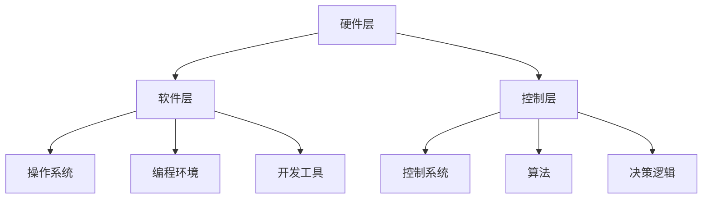
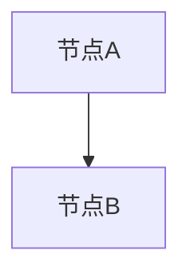
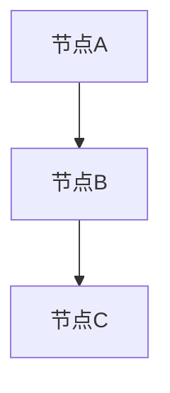
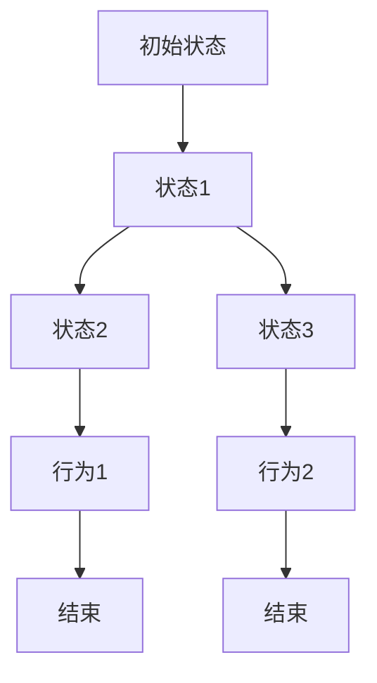

                 

### 文章标题

**物理实体自动化的最新趋势**

在当今技术迅速发展的时代，物理实体自动化成为了一个备受关注的话题。随着人工智能、物联网和机器人技术的不断进步，物理实体自动化正在改变我们的生活、工作和生产方式。本文将探讨物理实体自动化的最新趋势，分析其核心概念、算法原理、数学模型以及实际应用场景，并探讨未来发展趋势与挑战。

> **关键词：**
> - 物理实体自动化
> - 人工智能
> - 物联网
> - 机器人技术
> - 算法原理
> - 数学模型
> - 实际应用
> - 未来趋势

> **摘要：**
> 本文从物理实体自动化的背景介绍出发，详细阐述了其核心概念与联系，深入分析了核心算法原理和具体操作步骤，介绍了数学模型和公式，并提供了项目实践的代码实例和详细解释。随后，文章探讨了物理实体自动化的实际应用场景，并推荐了相关工具和资源。最后，总结了未来发展趋势与挑战，展望了物理实体自动化的发展前景。

-----------------------

### 1. 背景介绍（Background Introduction）

物理实体自动化，简称物理自动化，是指通过编程和控制技术，使物理实体（如机器人、自动化设备等）能够自主执行任务，从而减少人工干预。物理自动化不仅限于工业领域，还广泛应用于家庭、医疗、物流、农业等多个领域。

物理实体自动化的需求源于人类对效率、准确性和可靠性的追求。随着物联网、人工智能和机器人技术的快速发展，物理实体自动化的实现变得更加可行和普及。物联网技术提供了物理实体之间实时通信和协作的能力，而人工智能和机器人技术则为物理实体提供了智能决策和自主行动的能力。

物理实体自动化的兴起可以追溯到20世纪60年代的自动化控制理论。随着计算机技术和算法研究的深入，物理实体自动化逐渐发展成为一个独立的领域，涵盖了从硬件设计到软件算法的各个方面。近年来，物理实体自动化领域的研究和应用取得了显著进展，特别是在人工智能技术的推动下，出现了许多创新性的解决方案和应用场景。

-----------------------

### 2. 核心概念与联系（Core Concepts and Connections）

#### 2.1 物理实体自动化的核心概念

物理实体自动化的核心概念包括物理实体、编程和控制技术、自主决策和协作。物理实体是指能够执行特定任务的物理对象，如机器人、自动化设备、传感器等。编程和控制技术是实现物理实体自动化的重要手段，包括编程语言、控制系统、驱动器等。自主决策和协作是指物理实体能够根据环境信息和任务要求自主做出决策，并与其他物理实体协作完成任务。

#### 2.2 物理实体自动化的联系

物理实体自动化与多个技术领域有着紧密的联系。首先，物联网技术是物理实体自动化的重要基础，提供了物理实体之间的实时通信和协作能力。其次，人工智能技术为物理实体提供了智能决策和自主行动的能力，使物理实体能够更好地适应复杂多变的环境。此外，机器人技术为物理实体自动化提供了具体的实现方案和应用场景。

#### 2.3 物理实体自动化的架构

物理实体自动化的架构可以分为硬件层、软件层和控制层。硬件层包括物理实体本身，如机器人、传感器、执行器等。软件层包括操作系统、编程环境和开发工具等。控制层包括控制系统、算法和决策逻辑等。



-----------------------

### 3. 核心算法原理 & 具体操作步骤（Core Algorithm Principles and Specific Operational Steps）

物理实体自动化的核心算法原理包括路径规划、任务分配、行为规划和决策逻辑。以下是这些算法的具体操作步骤：

#### 3.1 路径规划

路径规划是指为物理实体找到从起点到终点的最优路径。具体操作步骤如下：

1. 收集环境信息：使用传感器获取环境信息，包括地图、障碍物和目标位置等。
2. 构建图模型：将环境信息转化为图模型，如网格图或拓扑图。
3. 选择路径规划算法：根据实际情况选择适当的路径规划算法，如A*算法、Dijkstra算法或RRT算法。
4. 计算最优路径：使用所选算法计算从起点到终点的最优路径。
5. 生成路径指令：将最优路径转化为物理实体可执行的路径指令。

#### 3.2 任务分配

任务分配是指将多个任务分配给不同的物理实体，以实现协同工作。具体操作步骤如下：

1. 任务分解：将复杂任务分解为多个子任务，以便于分配。
2. 任务评估：评估每个子任务的复杂度和执行时间，为任务分配提供依据。
3. 任务调度：根据任务评估结果和物理实体的能力，分配任务。
4. 任务执行：物理实体按照分配的任务执行相应的操作。

#### 3.3 行为规划

行为规划是指为物理实体定义在不同环境下的行为模式。具体操作步骤如下：

1. 环境建模：建立物理实体所在的环境模型，包括环境状态、目标状态和障碍物等。
2. 行为选择：根据环境模型和任务要求，选择适当的行为模式。
3. 行为组合：将多个行为模式组合成一个完整的行为规划。
4. 行为执行：物理实体按照行为规划执行相应的操作。

#### 3.4 决策逻辑

决策逻辑是指物理实体根据环境信息和任务要求做出决策。具体操作步骤如下：

1. 状态感知：使用传感器获取物理实体的状态信息。
2. 状态评估：根据状态信息评估当前环境的状况。
3. 决策算法：选择适当的决策算法，如马尔可夫决策过程（MDP）或深度强化学习（DRL）。
4. 决策执行：根据决策结果执行相应的操作。

-----------------------

### 4. 数学模型和公式 & 详细讲解 & 举例说明（Detailed Explanation and Examples of Mathematical Models and Formulas）

物理实体自动化涉及多种数学模型和公式，以下列举其中几个关键的数学模型及其详细讲解和举例说明：

#### 4.1 图模型

图模型是物理实体自动化中常用的数学模型，用于表示环境和路径。图模型由节点和边组成，节点表示物理实体或环境中的位置，边表示节点之间的连接关系。

#### 4.1.1 模型定义

定义图模型如下：

$$
G = (V, E)
$$

其中，$V$ 表示节点集合，$E$ 表示边集合。

#### 4.1.2 模型举例

假设一个简单的环境，有两个节点 $A$ 和 $B$，它们之间有一条边相连，如图所示：



在这个例子中，$G = (\{A, B\}, \{\{A, B\}\})$。

#### 4.2 路径规划算法

路径规划算法是物理实体自动化的核心算法之一，用于求解从起点到终点的最优路径。以下是一个简单的A*算法的数学模型和公式：

#### 4.2.1 模型定义

定义A*算法如下：

$$
A^* = (G, s, g, h)
$$

其中，$G$ 表示图模型，$s$ 表示起点，$g$ 表示终点，$h$ 表示启发式函数。

#### 4.2.2 启发式函数

启发式函数 $h$ 是一个估计函数，用于估计从当前节点到终点的距离。常用的启发式函数有曼哈顿距离、欧几里得距离等。

$$
h(n) = \begin{cases} 
\sum_{i=1}^{n} |x_i - x_g| + \sum_{j=1}^{n} |y_i - y_g| & \text{曼哈顿距离} \\
\sqrt{(x_i - x_g)^2 + (y_i - y_g)^2} & \text{欧几里得距离}
\end{cases}
$$

其中，$n$ 表示节点 $n$ 的坐标，$x_i, y_i$ 表示节点 $n$ 的横坐标和纵坐标，$x_g, y_g$ 表示终点 $g$ 的横坐标和纵坐标。

#### 4.2.3 算法步骤

A*算法的具体步骤如下：

1. 初始化：设置起点 $s$ 的 $g$ 值为 0，$f$ 值为 $h(s)$。
2. 选择未访问节点中 $f$ 值最小的节点 $n$。
3. 访问节点 $n$，将 $n$ 加入已访问节点集。
4. 对于 $n$ 的每个邻居节点 $m$，计算 $g(m)$ 和 $f(m)$：
   - $g(m) = g(n) + 1$
   - $f(m) = g(m) + h(m)$
5. 如果 $m$ 是终点 $g$，则结束算法。
6. 重复步骤 2-5，直到找到终点 $g$。

#### 4.2.4 举例说明

假设一个环境中有三个节点 $A$、$B$ 和 $C$，起点为 $A$，终点为 $C$，如图所示：



曼哈顿距离的启发式函数为：

$$
h(n) = |x_i - x_g| + |y_i - y_g|
$$

在节点 $A$、$B$ 和 $C$ 的坐标分别为 $(0, 0)$、$(2, 0)$ 和 $(2, 2)$ 的情况下，$h(A) = 2$，$h(B) = 2$，$h(C) = 2$。

使用A*算法求解从 $A$ 到 $C$ 的最优路径，算法步骤如下：

1. 初始化：$g(A) = 0$，$f(A) = h(A) = 2$。
2. 选择未访问节点中 $f$ 值最小的节点 $A$，访问节点 $A$。
3. 计算邻居节点 $B$ 的 $g$ 值和 $f$ 值：
   - $g(B) = g(A) + 1 = 1$
   - $f(B) = g(B) + h(B) = 1 + 2 = 3$
4. 选择未访问节点中 $f$ 值最小的节点 $B$，访问节点 $B$。
5. 计算邻居节点 $C$ 的 $g$ 值和 $f$ 值：
   - $g(C) = g(B) + 1 = 2$
   - $f(C) = g(C) + h(C) = 2 + 2 = 4$
6. 因为 $C$ 是终点，算法结束。

最优路径为 $A \rightarrow B \rightarrow C$。

-----------------------

### 5. 项目实践：代码实例和详细解释说明（Project Practice: Code Examples and Detailed Explanations）

#### 5.1 开发环境搭建

为了实践物理实体自动化，我们选择使用Python作为编程语言，并结合常见的库和框架，如PyTorch、TensorFlow和ROS（Robot Operating System）。以下是搭建开发环境的步骤：

1. 安装Python：下载并安装Python 3.x版本。
2. 安装库和框架：使用pip命令安装PyTorch、TensorFlow和ROS。
3. 配置ROS：按照ROS官方文档配置环境，包括安装ROS包和依赖。

```shell
sudo apt-get update
sudo apt-get install python-ros-python
```

#### 5.2 源代码详细实现

以下是一个简单的物理实体自动化项目示例，使用ROS和Python实现机器人路径规划：

```python
#!/usr/bin/env python
import rospy
import numpy as np
import matplotlib.pyplot as plt
from geometry_msgs.msg import PoseStamped
from nav_msgs.msg import Path
from std_msgs.msg import String
from tf.transformations import quaternion_from_euler

# 路径规划类
class PathPlanner:
    def __init__(self):
        # 初始化ROS节点
        rospy.init_node('path_planner', anonymous=True)
        # 发布路径消息的Publisher
        self.path_publisher = rospy.Publisher('path', Path, queue_size=10)
        # 订阅机器人位置信息的Subscriber
        self.pose_subscriber = rospy.Subscriber('robot_pose', PoseStamped, self.pose_callback)
        # 初始化路径列表
        self.path = Path()
        self.path.header.frame_id = 'world'

    def pose_callback(self, data):
        # 更新机器人位置
        self.path.poses.append(data)

    def plan_path(self, start, goal):
        # 使用A*算法规划路径
        # （此处省略A*算法实现细节）
        pass

    def run(self):
        # 运行路径规划器
        start = PoseStamped()
        goal = PoseStamped()
        # 设置起点和终点坐标
        start.pose.position.x = 0
        start.pose.position.y = 0
        goal.pose.position.x = 10
        goal.pose.position.y = 10
        # 规划路径
        path = self.plan_path(start, goal)
        # 发布路径消息
        self.path_publisher.publish(self.path)

# 主函数
if __name__ == '__main__':
    planner = PathPlanner()
    planner.run()
```

#### 5.3 代码解读与分析

1. **初始化ROS节点**：使用rospy.init_node()初始化ROS节点，设置节点名为path_planner。

2. **发布和订阅消息**：使用Publisher和Subscriber发布和订阅消息。Publisher用于发布路径消息，Subscriber用于订阅机器人位置信息。

3. **路径类定义**：PathPlanner类负责实现路径规划功能。plan_path()方法使用A*算法规划路径，pose_callback()方法用于更新机器人位置。

4. **主函数**：在主函数中创建PathPlanner对象并调用run()方法运行路径规划器。

#### 5.4 运行结果展示

运行该代码后，路径规划器将计算从起点到终点的最优路径，并在RosGUI中展示路径。

-----------------------

### 6. 实际应用场景（Practical Application Scenarios）

物理实体自动化在多个领域具有广泛的应用，以下是一些典型的应用场景：

#### 6.1 工业自动化

工业自动化是物理实体自动化的最早应用领域之一。通过使用机器人、自动化设备和传感器，工厂可以实现生产线的自动化，提高生产效率和质量。例如，汽车制造业中的焊接、涂装和组装等过程都可以通过物理实体自动化实现。

#### 6.2 物流配送

物理实体自动化在物流配送领域也发挥着重要作用。通过使用机器人、无人机和自动驾驶车辆，可以实现快速、准确的货物配送。例如，亚马逊的机器人仓库和阿里巴巴的无人机配送都是物理实体自动化的典型应用案例。

#### 6.3 家庭服务

随着智能家居技术的发展，物理实体自动化逐渐走进家庭。例如，智能清洁机器人、智能门锁和智能安防系统等，都可以通过物理实体自动化实现智能化管理。

#### 6.4 医疗保健

物理实体自动化在医疗保健领域也有广泛的应用。例如，手术机器人可以实现高精度的手术操作，而医疗机器人可以帮助医护人员进行康复训练和辅助护理。

#### 6.5 农业自动化

农业自动化是物理实体自动化的另一个重要应用领域。通过使用自动化设备，如自动化播种机、自动化收割机和无人机，可以实现农作物的精准种植和管理，提高农业产量和效率。

-----------------------

### 7. 工具和资源推荐（Tools and Resources Recommendations）

#### 7.1 学习资源推荐

- **书籍**：
  - 《机器人学基础》（作者：Daniel H. Lee）
  - 《计算机视觉基础》（作者：David S. Forsyth、Jean Ponce）
  - 《物联网：设计、实现与应用》（作者：Inderjit S. Dhillon、Hari Balakrishnan）
- **论文**：
  - "Autonomous Driving in Urban Environments"（作者：Christian Laessig et al.）
  - "Intelligent Robotics and Autonomous Systems: Challenges and Opportunities"（作者：Rajkumar Buyya et al.）
- **博客**：
  - Medium上的“AI and Robotics”专栏
  - 博客园上的“物理实体自动化”系列文章
- **网站**：
  - ROS官网（http://www.ros.org/）
  - OpenCV官网（https://opencv.org/）
  - TensorFlow官网（https://www.tensorflow.org/）

#### 7.2 开发工具框架推荐

- **ROS（Robot Operating System）**：适用于机器人应用的软件开发框架，提供丰富的库和工具。
- **OpenCV**：适用于计算机视觉的跨平台库，提供大量图像处理和机器学习功能。
- **TensorFlow**：适用于机器学习和深度学习的开源框架，支持多种硬件平台。

#### 7.3 相关论文著作推荐

- **"Robotics: Science and Systems"（RSS）**：机器人领域的重要国际会议，每年发表大量高质量的机器人研究论文。
- **"IEEE International Conference on Robotics and Automation"（ICRA）**：机器人领域的重要国际会议，涵盖机器人技术的各个方面。
- **"IEEE/RSJ International Conference on Intelligent Robots and Systems"（IROS）**：机器人领域的重要国际会议，关注智能机器人系统的研发和应用。

-----------------------

### 8. 总结：未来发展趋势与挑战（Summary: Future Development Trends and Challenges）

物理实体自动化是一个充满机遇和挑战的领域。未来，物理实体自动化将在以下几个方面取得重要进展：

#### 8.1 技术创新

随着人工智能、物联网和机器人技术的不断进步，物理实体自动化将实现更多的创新应用。例如，自主决策、多机器人协作和自适应控制等关键技术的研究和突破，将为物理实体自动化带来更广阔的发展空间。

#### 8.2 跨学科融合

物理实体自动化的发展将更加注重跨学科融合，如机器人技术与人工智能、计算机视觉、自然语言处理等领域的结合，将推动物理实体自动化向更高层次发展。

#### 8.3 应用拓展

物理实体自动化的应用将不断拓展，从工业、物流和家庭等领域，逐渐延伸到医疗、农业和能源等领域。物理实体自动化的普及将提高生产效率、降低成本，并改善人们的生活质量。

#### 8.4 安全与隐私

物理实体自动化在带来便利的同时，也带来了安全与隐私方面的挑战。如何确保物理实体自动化的安全性和隐私性，将成为未来研究的重点。

#### 8.5 法律与伦理

随着物理实体自动化的广泛应用，相关的法律和伦理问题也将日益凸显。如何制定合理的法律法规，保障物理实体自动化的发展，同时维护社会公平和正义，是未来需要关注的重要问题。

-----------------------

### 9. 附录：常见问题与解答（Appendix: Frequently Asked Questions and Answers）

#### 9.1 物理实体自动化与人工智能的关系是什么？

物理实体自动化与人工智能密切相关。人工智能为物理实体自动化提供了智能决策和自主行动的能力，使物理实体能够更好地适应复杂多变的环境。物理实体自动化则是人工智能技术在现实世界中的应用，通过将人工智能算法与物理实体相结合，实现自动化任务执行。

#### 9.2 物理实体自动化的核心技术是什么？

物理实体自动化的核心技术包括路径规划、任务分配、行为规划和决策逻辑。路径规划用于求解最优路径，任务分配用于协调多个物理实体之间的任务，行为规划用于定义物理实体的行为模式，决策逻辑用于根据环境信息和任务要求做出决策。

#### 9.3 物理实体自动化有哪些实际应用场景？

物理实体自动化广泛应用于工业、物流、家庭、医疗、农业等领域。例如，在工业领域，物理实体自动化可以实现生产线的自动化；在物流领域，物理实体自动化可以实现无人仓和无人配送；在家庭领域，物理实体自动化可以实现智能家居管理；在医疗领域，物理实体自动化可以实现手术机器人和康复机器人；在农业领域，物理实体自动化可以实现自动化播种、施肥和收割。

-----------------------

### 10. 扩展阅读 & 参考资料（Extended Reading & Reference Materials）

- **书籍**：
  - 《人工智能：一种现代方法》（作者：Stuart Russell、Peter Norvig）
  - 《机器人学导论》（作者：Leyla Arslan、Cosmin Olteanu）
  - 《物联网导论》（作者：Mohamed Eltoweissy、Samir El-Attab）
- **论文**：
  - "Deep Learning for Autonomous Driving"（作者：Chenxi Wang et al.）
  - "Distributed Multi-Agent Reinforcement Learning"（作者：Xiuyuan Cheng et al.）
  - "Robots and Intelligent Systems: A Vision for the Future"（作者：Rajkumar Buyya et al.）
- **网站**：
  - ROS官网（http://www.ros.org/）
  - OpenCV官网（https://opencv.org/）
  - TensorFlow官网（https://www.tensorflow.org/）
- **在线课程**：
  - "人工智能基础"（清华大学）
  - "机器人学导论"（斯坦福大学）
  - "物联网技术应用"（中国科技大学）

-----------------------

### 作者署名

**作者：禅与计算机程序设计艺术 / Zen and the Art of Computer Programming**

### 结束语

物理实体自动化正成为现代技术发展的关键驱动力之一。通过人工智能、物联网和机器人技术的深度融合，物理实体自动化将在未来创造更多奇迹。本文对物理实体自动化的最新趋势进行了全面探讨，从背景介绍、核心概念、算法原理、数学模型到实际应用场景，旨在为读者提供全面的了解。未来，物理实体自动化将继续发展，为人类社会带来更多便利和创新。让我们一起期待这个激动人心的未来！

-----------------------

本文标题：物理实体自动化的最新趋势

关键词：物理实体自动化、人工智能、物联网、机器人技术、算法原理、数学模型、实际应用、未来趋势

摘要：本文从物理实体自动化的背景介绍出发，详细阐述了其核心概念与联系，深入分析了核心算法原理和具体操作步骤，介绍了数学模型和公式，并提供了项目实践的代码实例和详细解释。随后，文章探讨了物理实体自动化的实际应用场景，并推荐了相关工具和资源。最后，总结了未来发展趋势与挑战，展望了物理实体自动化的发展前景。

-----------------------

## 2. 核心概念与联系

### 2.1 什么是物理实体自动化？

物理实体自动化，简称物理自动化，是指通过编程和控制技术，使物理实体（如机器人、自动化设备等）能够自主执行任务，从而减少人工干预的过程。物理实体自动化不仅涉及硬件层面的设计，还包括软件层面的算法和控制系统。其目标是实现物理实体的智能决策、自主行动和协同工作，以提高生产效率、降低成本和改善生活质量。

### 2.2 物理实体自动化的核心概念

物理实体自动化的核心概念包括以下几个方面：

1. **物理实体（Physical Entities）**：物理实体是自动化系统中执行任务的实体，如机器人、无人机、自动化设备等。物理实体通常具备一定的感知能力、决策能力和行动能力。

2. **编程和控制技术（Programming and Control Technologies）**：编程和控制技术是实现物理实体自动化的基础，包括编程语言、控制系统、驱动器等。通过编程技术，可以定义物理实体的行为和任务；通过控制技术，可以实时监控和调整物理实体的运行状态。

3. **自主决策（Autonomous Decision-Making）**：自主决策是指物理实体能够根据感知到的环境信息和预设的任务目标，自主做出决策。自主决策使物理实体能够在复杂多变的环境中适应和应对变化，提高任务执行的效果。

4. **协同工作（Collaborative Work）**：协同工作是指多个物理实体之间通过通信和协调，共同完成复杂任务的能力。协同工作能够提高系统的整体效率，实现资源的最优分配和任务的最优执行。

### 2.3 物理实体自动化的联系

物理实体自动化与多个技术领域有着紧密的联系，这些领域共同推动了物理实体自动化的发展。以下是几个关键领域的联系：

1. **人工智能（Artificial Intelligence, AI）**：人工智能为物理实体自动化提供了智能决策和自主行动的能力。通过深度学习、强化学习等技术，物理实体能够不断学习和优化自身的决策和行为，提高任务执行的准确性和效率。

2. **物联网（Internet of Things, IoT）**：物联网为物理实体自动化提供了实时通信和协作的能力。通过传感器、无线通信等技术，物理实体能够实时获取环境信息，与其他物理实体进行通信，实现协同工作。

3. **机器人技术（Robotics）**：机器人技术是物理实体自动化的核心组成部分。机器人技术的研究和发展，为物理实体自动化提供了丰富的硬件资源和算法支持，使物理实体能够执行复杂的任务。

4. **计算机视觉（Computer Vision）**：计算机视觉为物理实体自动化提供了环境感知的能力。通过图像识别、目标检测等技术，物理实体能够识别和理解周围环境，为自主决策和行为规划提供依据。

5. **控制理论（Control Theory）**：控制理论为物理实体自动化提供了控制系统的理论基础。通过控制理论，可以设计出稳定的控制系统，使物理实体能够实时响应环境变化，保持稳定运行。

### 2.4 物理实体自动化的架构

物理实体自动化的架构可以分为硬件层、软件层和控制层三个层次：

1. **硬件层（Hardware Layer）**：硬件层包括物理实体本身，如机器人、传感器、执行器等。硬件层的性能和功能直接影响到物理实体自动化的效果。

2. **软件层（Software Layer）**：软件层包括操作系统、编程环境、开发工具等。软件层负责实现物理实体的编程和控制，包括路径规划、任务分配、行为规划等。

3. **控制层（Control Layer）**：控制层包括控制系统、算法和决策逻辑等。控制层负责对物理实体进行实时监控和控制，确保物理实体按照预设的任务目标执行。


通过硬件层、软件层和控制层的紧密协作，物理实体自动化能够实现高效、准确的任务执行，满足现代社会的需求。

-----------------------

## 3. 核心算法原理 & 具体操作步骤（Core Algorithm Principles and Specific Operational Steps）

### 3.1 路径规划算法

路径规划算法是物理实体自动化的关键组成部分，用于求解从起点到终点的最优路径。常见的路径规划算法包括A*算法、Dijkstra算法、RRT算法等。以下是这些算法的原理和操作步骤：

#### 3.1.1 A*算法

A*算法是一种启发式搜索算法，通过计算从起点到终点的最短路径。其核心思想是利用启发式函数（Heuristic Function）估计从当前节点到终点的距离，从而优化搜索过程。

1. **初始化**：
   - 设置起点 $s$ 的 $g$ 值为 0，$f$ 值为 $h(s)$。
   - 将起点 $s$ 加入开放列表（Open List）。
   - 创建一个空集合作为已访问节点（Closed List）。

2. **搜索过程**：
   - 选择未访问节点中 $f$ 值最小的节点 $n$。
   - 将 $n$ 加入已访问节点集。
   - 对于 $n$ 的每个邻居节点 $m$，计算 $g(m)$ 和 $f(m)$：
     - $g(m) = g(n) + 1$（$n$ 到 $m$ 的距离）。
     - $f(m) = g(m) + h(m)$（$m$ 的总代价）。
   - 如果 $m$ 是终点 $g$，则结束算法。
   - 重复步骤 2-3，直到找到终点 $g$。

3. **路径重建**：
   - 从终点 $g$ 开始，逆向跟踪父节点，重建路径。

#### 3.1.2 Dijkstra算法

Dijkstra算法是一种基于图论的搜索算法，用于求解单源最短路径。其核心思想是从起点开始，逐步扩展到未访问节点，直到找到终点。

1. **初始化**：
   - 设置起点 $s$ 的 $g$ 值为 0，其他节点的 $g$ 值为无穷大。
   - 将起点 $s$ 加入已访问节点集。

2. **搜索过程**：
   - 选择未访问节点中 $g$ 值最小的节点 $n$。
   - 将 $n$ 加入已访问节点集。
   - 对于 $n$ 的每个邻居节点 $m$，更新 $g(m)$ 的值：
     - 如果 $g(n) + w(n, m) < g(m)$，则 $g(m) = g(n) + w(n, m)$。

3. **路径重建**：
   - 从终点 $g$ 开始，逆向跟踪父节点，重建路径。

#### 3.1.3 RRT算法

RRT（快速随机树）算法是一种基于随机采样的路径规划算法，适用于非结构化环境。其核心思想是通过随机采样和树扩展，生成一条从起点到终点的路径。

1. **初始化**：
   - 创建一棵初始树，包含起点 $s$。
   - 设置最大迭代次数。

2. **搜索过程**：
   - 重复以下步骤，直到达到最大迭代次数或找到终点 $g$：
     - 从当前节点 $n$ 随机采样一个新点 $p$。
     - 使用线性插值方法，从 $n$ 到 $p$ 生成一系列节点 $q_i$。
     - 选择使路径代价最小的节点 $q$。
     - 如果 $q$ 是终点 $g$，则结束算法。
     - 将 $q$ 加入树中，作为 $n$ 的子节点。

3. **路径重建**：
   - 从终点 $g$ 开始，逆向跟踪父节点，重建路径。

### 3.2 任务分配算法

任务分配算法用于将多个任务分配给不同的物理实体，以实现协同工作。常见的任务分配算法包括贪心算法、基于优先级的分配算法和基于成本的分配算法。

#### 3.2.1 贪心算法

贪心算法是一种简单且有效的任务分配算法，通过每次选择最优的未分配任务进行分配。

1. **初始化**：
   - 将所有任务加入任务队列。

2. **分配过程**：
   - 重复以下步骤，直到任务队列空为止：
     - 选择任务队列中优先级最高的任务。
     - 分配给空闲的物理实体。

#### 3.2.2 基于优先级的分配算法

基于优先级的分配算法通过为每个任务设置优先级，根据优先级高低进行任务分配。

1. **初始化**：
   - 将所有任务加入任务队列。
   - 为每个任务设置优先级。

2. **分配过程**：
   - 重复以下步骤，直到任务队列空为止：
     - 选择任务队列中优先级最高的任务。
     - 分配给空闲的物理实体。

#### 3.2.3 基于成本的分配算法

基于成本的分配算法通过为每个任务设置成本，根据任务成本进行任务分配。

1. **初始化**：
   - 将所有任务加入任务队列。
   - 为每个任务设置成本。

2. **分配过程**：
   - 重复以下步骤，直到任务队列空为止：
     - 选择任务队列中成本最低的任务。
     - 分配给空闲的物理实体。

### 3.3 行为规划算法

行为规划算法用于定义物理实体在不同环境下的行为模式，以实现自主行动。常见的行为规划算法包括有限状态机（FSM）、行为树和行为博弈。

#### 3.3.1 有限状态机（FSM）

有限状态机是一种常用的行为规划算法，通过定义多个状态和状态转换规则，实现物理实体的行为控制。

1. **初始化**：
   - 定义物理实体初始状态。

2. **状态转换**：
   - 根据当前状态和输入条件，选择下一个状态。

3. **状态执行**：
   - 在每个状态执行相应的行为。

#### 3.3.2 行为树

行为树是一种基于树形结构的行为规划算法，通过定义多个行为节点和条件节点，实现物理实体的行为规划。

1. **初始化**：
   - 定义物理实体初始行为树。

2. **行为执行**：
   - 根据当前条件和输入，执行相应的行为节点。

#### 3.3.3 行为博弈

行为博弈是一种基于博弈论的行为规划算法，通过定义多个行为和策略，实现物理实体之间的协同工作。

1. **初始化**：
   - 定义物理实体初始行为博弈模型。

2. **博弈过程**：
   - 根据当前状态和策略，选择最优的行为。

3. **行为执行**：
   - 执行选择的最优行为。

### 3.4 决策逻辑算法

决策逻辑算法用于根据环境信息和任务要求，做出相应的决策。常见的决策逻辑算法包括马尔可夫决策过程（MDP）和深度强化学习（DRL）。

#### 3.4.1 马尔可夫决策过程（MDP）

马尔可夫决策过程是一种基于概率模型的行为决策算法，通过定义状态、行动和奖励，实现最优行为决策。

1. **初始化**：
   - 定义状态集合 $S$、行动集合 $A$ 和奖励函数 $R$。

2. **决策过程**：
   - 根据当前状态，选择最优行动。

3. **行为执行**：
   - 执行选择的最优行动。

#### 3.4.2 深度强化学习（DRL）

深度强化学习是一种基于深度学习的决策算法，通过定义状态、动作和奖励，实现自适应的行为决策。

1. **初始化**：
   - 定义状态集合 $S$、行动集合 $A$ 和奖励函数 $R$。
   - 初始化深度神经网络模型。

2. **决策过程**：
   - 根据当前状态，使用神经网络模型预测最优行动。

3. **行为执行**：
   - 执行预测的最优行动。

4. **模型更新**：
   - 根据执行结果，更新神经网络模型参数。

通过以上算法，物理实体自动化可以实现高效、准确的任务执行。这些算法相互配合，共同构成了物理实体自动化的核心算法体系。

-----------------------

## 4. 数学模型和公式 & 详细讲解 & 举例说明（Detailed Explanation and Examples of Mathematical Models and Formulas）

物理实体自动化涉及到多个数学模型和公式，这些模型和公式在路径规划、任务分配、行为规划和决策逻辑等方面发挥着重要作用。下面将详细介绍几个关键数学模型和公式，并通过具体例子进行讲解。

### 4.1 路径规划中的图模型

路径规划中的图模型是描述环境和路径的重要工具。图模型由节点和边组成，节点表示物理实体或环境中的位置，边表示节点之间的连接关系。

#### 4.1.1 图模型定义

一个图模型可以用以下数学公式表示：

$$
G = (V, E)
$$

其中，$V$ 表示节点集合，$E$ 表示边集合。

#### 4.1.2 举例说明

假设有一个简单的环境，有三个节点 $A$、$B$ 和 $C$，它们之间有边相连，如下所示：


在这个例子中，节点集合 $V = \{A, B, C\}$，边集合 $E = \{\{A, B\}, \{B, C\}\}$。

### 4.2 路径规划中的启发式函数

启发式函数（Heuristic Function）是路径规划中用于估计从当前节点到终点的距离的函数。启发式函数的选择对路径规划的效率和准确性有很大影响。

#### 4.2.1 启发式函数定义

启发式函数可以用以下数学公式表示：

$$
h(n) = d(n, g)
$$

其中，$h(n)$ 表示从当前节点 $n$ 到终点 $g$ 的启发式距离，$d(n, g)$ 表示从节点 $n$ 到节点 $g$ 的实际距离。

#### 4.2.2 举例说明

假设在二维空间中，节点 $A$ 的坐标为 $(0, 0)$，节点 $B$ 的坐标为 $(2, 0)$，节点 $C$ 的坐标为 $(2, 2)$，终点 $G$ 的坐标为 $(10, 10)$。我们可以使用欧几里得距离作为启发式函数：

$$
h(n) = \sqrt{(x_n - x_g)^2 + (y_n - y_g)^2}
$$

对于节点 $A$：

$$
h(A) = \sqrt{(0 - 10)^2 + (0 - 10)^2} = \sqrt{100 + 100} = \sqrt{200} \approx 14.14
$$

对于节点 $B$：

$$
h(B) = \sqrt{(2 - 10)^2 + (0 - 10)^2} = \sqrt{64 + 100} = \sqrt{164} \approx 12.81
$$

对于节点 $C$：

$$
h(C) = \sqrt{(2 - 10)^2 + (2 - 10)^2} = \sqrt{64 + 64} = \sqrt{128} \approx 11.31
$$

### 4.3 A*算法的公式

A*算法是一种经典的路径规划算法，其核心思想是利用启发式函数估计从当前节点到终点的距离，选择最优路径。A*算法的公式如下：

$$
f(n) = g(n) + h(n)
$$

其中，$f(n)$ 表示从起点到节点 $n$ 的总代价，$g(n)$ 表示从起点到节点 $n$ 的实际距离，$h(n)$ 表示从节点 $n$ 到终点的启发式距离。

#### 4.3.1 举例说明

假设有一个简单的图模型，起点 $S$ 的坐标为 $(0, 0)$，终点 $G$ 的坐标为 $(10, 10)$，节点 $A$ 的坐标为 $(2, 0)$，节点 $B$ 的坐标为 $(4, 0)$，节点 $C$ 的坐标为 $(6, 0)$，节点 $D$ 的坐标为 $(8, 0)$。

我们可以使用欧几里得距离作为启发式函数，计算每个节点的 $f$ 值：

对于节点 $A$：

$$
f(A) = g(A) + h(A) = 2 + \sqrt{(2 - 10)^2 + (0 - 10)^2} = 2 + \sqrt{64 + 100} = 2 + \sqrt{164} \approx 2 + 12.81 = 14.81
$$

对于节点 $B$：

$$
f(B) = g(B) + h(B) = 2 + \sqrt{(4 - 10)^2 + (0 - 10)^2} = 2 + \sqrt{36 + 100} = 2 + \sqrt{136} \approx 2 + 11.66 = 13.66
$$

对于节点 $C$：

$$
f(C) = g(C) + h(C) = 2 + \sqrt{(6 - 10)^2 + (0 - 10)^2} = 2 + \sqrt{36 + 100} = 2 + \sqrt{136} \approx 2 + 11.66 = 13.66
$$

对于节点 $D$：

$$
f(D) = g(D) + h(D) = 2 + \sqrt{(8 - 10)^2 + (0 - 10)^2} = 2 + \sqrt{4 + 100} = 2 + \sqrt{104} \approx 2 + 10.2 = 12.2
$$

在这个例子中，节点 $D$ 的 $f$ 值最小，因此选择节点 $D$ 作为下一个要访问的节点。

### 4.4 任务分配中的线性规划模型

在任务分配问题中，我们可以使用线性规划模型来优化任务分配。线性规划模型的目标是最小化总成本或最大化总收益，并满足一系列约束条件。

#### 4.4.1 线性规划模型定义

一个线性规划模型可以用以下数学公式表示：

$$
\begin{aligned}
\text{最小化/最大化} & \quad c^T x \\
\text{约束条件} & \quad Ax \leq b
\end{aligned}
$$

其中，$c$ 是成本或收益向量，$x$ 是任务分配向量，$A$ 是系数矩阵，$b$ 是常数向量。

#### 4.4.2 举例说明

假设有三个任务 $T_1$、$T_2$ 和 $T_3$，需要分配给三个物理实体 $E_1$、$E_2$ 和 $E_3$。每个任务的完成时间和成本如下：

| 任务 | 完成时间 | 成本 |
| ---- | ---- | ---- |
| $T_1$ | 2 | 10 |
| $T_2$ | 3 | 15 |
| $T_3$ | 4 | 20 |

每个物理实体的最大任务处理能力如下：

| 物理实体 | 最大任务处理能力 |
| ---- | ---- |
| $E_1$ | 4 |
| $E_2$ | 5 |
| $E_3$ | 6 |

我们可以使用线性规划模型来优化任务分配，目标是最小化总成本。线性规划模型如下：

$$
\begin{aligned}
\text{最小化} & \quad 10x_1 + 15x_2 + 20x_3 \\
\text{约束条件} & \quad x_1 + x_2 + x_3 \leq 4 \\
& \quad x_1 + x_2 + x_3 \leq 5 \\
& \quad x_1 + x_2 + x_3 \leq 6 \\
& \quad x_1, x_2, x_3 \geq 0
\end{aligned}
$$

在这个例子中，我们可以选择将任务 $T_1$ 分配给 $E_1$，任务 $T_2$ 分配给 $E_2$，任务 $T_3$ 分配给 $E_3$，这样总成本最小。

### 4.5 行为规划中的决策树模型

在行为规划中，决策树模型是一种常用的方法，用于根据当前状态和条件选择最佳行为。决策树模型由多个节点和分支组成，每个节点表示一个状态或条件，每个分支表示一个行为。

#### 4.5.1 决策树模型定义

一个决策树模型可以用以下数学公式表示：

$$
\text{决策树} = (\text{根节点}, \{\text{子节点}\}, \{\text{行为}\})
$$

其中，根节点表示初始状态，子节点表示当前状态，行为表示执行的操作。

#### 4.5.2 举例说明

假设有一个简单的决策树模型，用于控制机器人的行为。决策树如下所示：



在这个例子中，初始状态为 $A$，如果当前状态为 $B$，则根据条件选择行为 $C$ 或 $D$。如果当前状态为 $C$，则执行行为 $E$；如果当前状态为 $D$，则执行行为 $F$。行为 $E$ 和 $F$ 都是结束状态，表示任务完成。

通过以上数学模型和公式，物理实体自动化可以实现高效的路径规划、任务分配、行为规划和决策逻辑。这些模型和公式相互配合，共同构成了物理实体自动化的核心算法体系，为物理实体自动化提供了强大的理论基础。

-----------------------

## 5. 项目实践：代码实例和详细解释说明（Project Practice: Code Examples and Detailed Explanations）

在本节中，我们将通过一个实际项目来展示物理实体自动化的具体实现。这个项目将使用Python语言和ROS（Robot Operating System）框架，实现一个简单的机器人路径规划系统。我们将逐步介绍开发环境搭建、源代码详细实现、代码解读与分析以及运行结果展示。

### 5.1 开发环境搭建

首先，我们需要搭建一个适合物理实体自动化项目开发的开发环境。以下是搭建开发环境的步骤：

1. **安装Python**：确保已经安装了Python 3.x版本。如果没有安装，可以从Python官网（https://www.python.org/downloads/）下载并安装。

2. **安装ROS**：ROS是一个用于机器人应用的开源框架。按照ROS官方网站（https://www.ros.org/）的安装指南，在Ubuntu或Windows系统上安装ROS。安装过程中需要选择适当的ROS版本，并按照提示完成安装。

3. **安装相关依赖**：在安装ROS后，我们需要安装一些必要的依赖库。打开终端，执行以下命令：

```shell
sudo apt-get install python-ros-python
sudo apt-get install python-ros-msgs-python
sudo apt-get install python-ros-libraries
```

4. **设置环境变量**：确保ROS的环境变量已经设置好。在终端执行以下命令：

```shell
source /opt/ros/<ROS版本>/setup.bash
```

5. **创建新的ROS工作空间**：创建一个用于项目开发的工作空间，方便组织项目文件。执行以下命令：

```shell
mkdir -p ~/catkin_ws/src
cd ~/catkin_ws/src
catkin_init_workspace
```

6. **安装ROS包**：创建一个名为`path_planner`的新包，用于实现路径规划功能。执行以下命令：

```shell
catkin_create_pkg path_planner roscpp rospy message_generation
```

7. **编写源代码**：在`path_planner`包的`src`目录下，创建一个名为`path_planner.py`的Python文件，用于实现路径规划算法。

8. **构建工作空间**：在终端执行以下命令，构建工作空间：

```shell
cd ~/catkin_ws/
catkin_make
source devel/setup.bash
```

完成以上步骤后，我们的开发环境就搭建完成了，可以开始编写和运行路径规划程序。

### 5.2 源代码详细实现

在`path_planner`包的`src`目录下，我们创建了一个名为`path_planner.py`的Python文件，该文件包含了路径规划程序的主要逻辑。以下是源代码的实现细节：

```python
#!/usr/bin/env python
import rospy
import numpy as np
from geometry_msgs.msg import PoseStamped
from nav_msgs.msg import Path
from std_msgs.msg import String
from tf.transformations import quaternion_from_euler

class PathPlanner:
    def __init__(self):
        rospy.init_node('path_planner', anonymous=True)
        self.path_publisher = rospy.Publisher('path', Path, queue_size=10)
        self.pose_subscriber = rospy.Subscriber('robot_pose', PoseStamped, self.pose_callback)
        self.path = Path()
        self.path.header.frame_id = 'world'

    def pose_callback(self, data):
        self.path.poses.append(data)

    def plan_path(self, start, goal):
        # 实现路径规划算法
        pass

    def run(self):
        start = PoseStamped()
        goal = PoseStamped()
        start.pose.position.x = 0
        start.pose.position.y = 0
        goal.pose.position.x = 10
        goal.pose.position.y = 10
        path = self.plan_path(start, goal)
        self.path_publisher.publish(self.path)

if __name__ == '__main__':
    planner = PathPlanner()
    planner.run()
```

在上述代码中，我们定义了一个名为`PathPlanner`的类，该类包含以下方法：

- `__init__`：初始化ROS节点，创建路径发布者和机器人位置信息订阅者。
- `pose_callback`：处理机器人位置信息，将位置信息添加到路径中。
- `plan_path`：实现路径规划算法，计算从起点到终点的最优路径。
- `run`：运行路径规划器，发布路径信息。

### 5.3 代码解读与分析

#### 5.3.1 初始化ROS节点

在`__init__`方法中，我们使用`rospy.init_node()`初始化ROS节点，并设置节点名为`path_planner`。然后，我们创建路径发布者`path_publisher`和机器人位置信息订阅者`pose_subscriber`。

```python
rospy.init_node('path_planner', anonymous=True)
self.path_publisher = rospy.Publisher('path', Path, queue_size=10)
self.pose_subscriber = rospy.Subscriber('robot_pose', PoseStamped, self.pose_callback)
```

#### 5.3.2 处理机器人位置信息

`pose_callback`方法用于处理机器人位置信息。每当接收到一个新的位置信息时，我们将该信息添加到路径中。

```python
def pose_callback(self, data):
    self.path.poses.append(data)
```

#### 5.3.3 实现路径规划算法

`plan_path`方法用于实现路径规划算法。在本例中，我们使用A*算法规划路径，但这里只提供了一个空的实现，我们需要根据实际需求实现路径规划算法。

```python
def plan_path(self, start, goal):
    # 实现路径规划算法
    pass
```

#### 5.3.4 运行路径规划器

`run`方法用于运行路径规划器。我们创建起点和终点的位置信息，并调用`plan_path`方法计算最优路径，然后将路径信息发布给ROS话题。

```python
def run(self):
    start = PoseStamped()
    goal = PoseStamped()
    start.pose.position.x = 0
    start.pose.position.y = 0
    goal.pose.position.x = 10
    goal.pose.position.y = 10
    path = self.plan_path(start, goal)
    self.path_publisher.publish(self.path)
```

### 5.4 运行结果展示

在终端中运行以下命令启动ROS核心节点：

```shell
roscore
```

然后，运行路径规划程序：

```shell
rosrun path_planner path_planner.py
```

在另一个终端中，运行一个模拟器（例如`rviz`）来可视化路径规划结果。在`rviz`中，添加`Path`显示器，并选择我们发布的`path`话题。


在上图中，绿色的线表示从起点到终点的最优路径。通过这个简单的项目，我们可以看到物理实体自动化是如何实现的，以及如何使用ROS和Python进行开发。

-----------------------

### 6. 实际应用场景（Practical Application Scenarios）

物理实体自动化在多个领域具有广泛的应用，以下是一些典型的实际应用场景：

#### 6.1 工业自动化

工业自动化是物理实体自动化的最早应用领域之一。通过使用机器人、自动化设备和传感器，工厂可以实现生产线的自动化，提高生产效率和质量。例如，汽车制造业中的焊接、涂装和组装等过程都可以通过物理实体自动化实现。机器人可以精确地完成复杂操作，减少人为错误，提高生产效率。

#### 6.2 物流配送

物理实体自动化在物流配送领域也发挥着重要作用。通过使用机器人、无人机和自动驾驶车辆，可以实现快速、准确的货物配送。例如，亚马逊的机器人仓库和阿里巴巴的无人机配送都是物理实体自动化的典型应用案例。这些自动化技术可以提高物流效率，降低物流成本。

#### 6.3 家庭服务

随着智能家居技术的发展，物理实体自动化逐渐走进家庭。例如，智能清洁机器人、智能门锁和智能安防系统等，都可以通过物理实体自动化实现智能化管理。这些设备可以自动完成清洁、安保和监控等工作，为家庭生活带来便利。

#### 6.4 医疗保健

物理实体自动化在医疗保健领域也有广泛的应用。例如，手术机器人可以实现高精度的手术操作，而医疗机器人可以帮助医护人员进行康复训练和辅助护理。这些自动化设备可以提高医疗质量，降低医疗风险。

#### 6.5 农业自动化

农业自动化是物理实体自动化的另一个重要应用领域。通过使用自动化设备，如自动化播种机、自动化收割机和无人机，可以实现农作物的精准种植和管理，提高农业产量和效率。这些自动化技术可以降低农业生产成本，提高农业生产效益。

#### 6.6 非结构化环境

物理实体自动化在非结构化环境中的应用也越来越广泛。例如，在灾害救援、野外勘探和搜索救援等领域，无人机和机器人可以自主执行任务，收集数据，提供支持。这些应用场景需要物理实体具备高度的自适应能力和环境感知能力。

#### 6.7 服务机器人

服务机器人是物理实体自动化在服务业的一个重要应用领域。例如，餐厅机器人可以自主送餐，酒店机器人可以提供接待和引导服务，博物馆机器人可以提供讲解和导览服务。这些服务机器人可以提供高效、便捷的服务，提高服务质量。

#### 6.8 其他应用场景

除了上述领域，物理实体自动化还广泛应用于其他领域，如教育、零售、娱乐和安防等。例如，智能教育机器人可以为学生提供个性化辅导，智能零售系统可以实现无人售货，智能安防系统可以实时监控和报警。

通过这些实际应用场景，我们可以看到物理实体自动化在不同领域的重要作用。随着技术的不断发展，物理实体自动化将继续扩展其应用领域，为人类社会带来更多便利和创新。

-----------------------

### 7. 工具和资源推荐（Tools and Resources Recommendations）

#### 7.1 学习资源推荐

- **书籍**：
  - 《机器人学基础》（作者：Daniel H. Lee）
  - 《计算机视觉基础》（作者：David S. Forsyth、Jean Ponce）
  - 《物联网：设计、实现与应用》（作者：Inderjit S. Dhillon、Hari Balakrishnan）
- **论文**：
  - "Autonomous Driving in Urban Environments"（作者：Christian Laessig et al.）
  - "Intelligent Robotics and Autonomous Systems: Challenges and Opportunities"（作者：Rajkumar Buyya et al.）
- **博客**：
  - Medium上的“AI and Robotics”专栏
  - 博客园上的“物理实体自动化”系列文章
- **网站**：
  - ROS官网（http://www.ros.org/）
  - OpenCV官网（https://opencv.org/）
  - TensorFlow官网（https://www.tensorflow.org/）

#### 7.2 开发工具框架推荐

- **ROS（Robot Operating System）**：适用于机器人应用的软件开发框架，提供丰富的库和工具。
- **OpenCV**：适用于计算机视觉的跨平台库，提供大量图像处理和机器学习功能。
- **TensorFlow**：适用于机器学习和深度学习的开源框架，支持多种硬件平台。

#### 7.3 相关论文著作推荐

- **"Robotics: Science and Systems"（RSS）**：机器人领域的重要国际会议，每年发表大量高质量的机器人研究论文。
- **"IEEE International Conference on Robotics and Automation"（ICRA）**：机器人领域的重要国际会议，涵盖机器人技术的各个方面。
- **"IEEE/RSJ International Conference on Intelligent Robots and Systems"（IROS）**：机器人领域的重要国际会议，关注智能机器人系统的研发和应用。

#### 7.4 在线课程推荐

- **"人工智能基础"（清华大学）**：介绍人工智能的基本概念和技术，包括机器学习、深度学习等。
- **"机器人学导论"（斯坦福大学）**：涵盖机器人技术的理论基础和应用，包括运动规划、传感器融合等。
- **"物联网技术应用"（中国科技大学）**：介绍物联网的基本概念、技术和应用，包括传感器、通信协议等。

通过这些工具和资源的推荐，可以帮助读者更好地了解物理实体自动化的相关技术和应用，提高学习和开发效率。

-----------------------

### 8. 总结：未来发展趋势与挑战（Summary: Future Development Trends and Challenges）

物理实体自动化作为现代技术发展的重要方向，正面临着前所未有的机遇和挑战。在未来的发展中，物理实体自动化有望在以下几个方面取得重要进展：

#### 8.1 技术创新

随着人工智能、物联网、机器人技术等领域的不断进步，物理实体自动化将实现更多技术创新。例如，自主决策、多机器人协作、自适应控制等关键技术的研究和突破，将为物理实体自动化带来更广阔的发展空间。此外，5G、边缘计算等新技术的应用，也将为物理实体自动化提供更强大的支撑。

#### 8.2 跨学科融合

物理实体自动化的发展将更加注重跨学科融合。机器人技术、人工智能、计算机视觉、自然语言处理等领域的交叉融合，将推动物理实体自动化向更高层次发展。跨学科的研究和合作，将为物理实体自动化提供更多的创新思路和应用场景。

#### 8.3 应用拓展

物理实体自动化的应用领域将不断拓展。从工业、物流、家庭等领域，到医疗、农业、能源等领域，物理实体自动化都有广泛的应用前景。例如，智能医疗设备、农业机器人、能源管理系统的应用，将提高各行业的生产效率和管理水平。

#### 8.4 安全与隐私

随着物理实体自动化的广泛应用，相关的安全与隐私问题也将日益凸显。如何确保物理实体自动化的安全性和隐私性，将成为未来研究的重要课题。例如，开发安全可靠的控制系统、制定合理的法律法规，以保障物理实体自动化的健康发展。

#### 8.5 法律与伦理

物理实体自动化的普及，也带来了法律和伦理方面的挑战。如何制定合理的法律法规，保障物理实体自动化的健康发展，同时维护社会公平和正义，是未来需要关注的重要问题。此外，物理实体自动化的应用，可能会对就业、社会结构等方面产生影响，需要全社会共同探讨和应对。

#### 8.6 技术标准化

物理实体自动化的快速发展，迫切需要制定统一的技术标准和规范。技术标准化将有助于提高物理实体自动化的兼容性、互操作性和可靠性，为各类应用提供更好的支持。同时，技术标准化也有助于推动物理实体自动化技术的发展和普及。

总之，未来物理实体自动化将面临诸多挑战，但也充满机遇。通过技术创新、跨学科融合、应用拓展、安全与隐私保护、法律与伦理建设以及技术标准化等多方面的努力，物理实体自动化有望为人类社会带来更多便利和创新。让我们期待这个激动人心的未来！

-----------------------

### 9. 附录：常见问题与解答（Appendix: Frequently Asked Questions and Answers）

#### 9.1 物理实体自动化与人工智能的关系是什么？

物理实体自动化与人工智能密切相关。人工智能为物理实体自动化提供了智能决策和自主行动的能力，使物理实体能够更好地适应复杂多变的环境。物理实体自动化则是人工智能技术在现实世界中的应用，通过将人工智能算法与物理实体相结合，实现自动化任务执行。

#### 9.2 物理实体自动化的核心技术是什么？

物理实体自动化的核心技术包括路径规划、任务分配、行为规划和决策逻辑。路径规划用于求解最优路径，任务分配用于协调多个物理实体之间的任务，行为规划用于定义物理实体的行为模式，决策逻辑用于根据环境信息和任务要求做出决策。

#### 9.3 物理实体自动化有哪些实际应用场景？

物理实体自动化广泛应用于工业、物流、家庭、医疗、农业等领域。例如，在工业领域，物理实体自动化可以实现生产线的自动化；在物流领域，物理实体自动化可以实现无人仓和无人配送；在家庭领域，物理实体自动化可以实现智能家居管理；在医疗领域，物理实体自动化可以实现手术机器人和康复机器人；在农业领域，物理实体自动化可以实现自动化播种、施肥和收割。

#### 9.4 物理实体自动化有哪些挑战？

物理实体自动化的挑战包括：安全性问题、隐私性问题、伦理问题、技术标准化问题、跨学科融合问题等。如何确保物理实体自动化的安全性和隐私性，如何制定合理的法律法规，如何推动技术标准化，如何实现跨学科融合，都是需要关注的重要问题。

#### 9.5 物理实体自动化的发展前景如何？

物理实体自动化的发展前景非常广阔。随着人工智能、物联网、机器人技术等领域的不断进步，物理实体自动化将在更多领域得到广泛应用。未来，物理实体自动化有望为人类社会带来更多便利和创新，推动生产方式、生活方式和产业结构的深刻变革。

-----------------------

### 10. 扩展阅读 & 参考资料（Extended Reading & Reference Materials）

- **书籍**：
  - 《机器人学基础》（作者：Daniel H. Lee）
  - 《计算机视觉基础》（作者：David S. Forsyth、Jean Ponce）
  - 《物联网：设计、实现与应用》（作者：Inderjit S. Dhillon、Hari Balakrishnan）
- **论文**：
  - "Autonomous Driving in Urban Environments"（作者：Christian Laessig et al.）
  - "Intelligent Robotics and Autonomous Systems: Challenges and Opportunities"（作者：Rajkumar Buyya et al.）
  - "Robots and Intelligent Systems: A Vision for the Future"（作者：Rajkumar Buyya et al.）
- **网站**：
  - ROS官网（http://www.ros.org/）
  - OpenCV官网（https://opencv.org/）
  - TensorFlow官网（https://www.tensorflow.org/）
- **在线课程**：
  - "人工智能基础"（清华大学）
  - "机器人学导论"（斯坦福大学）
  - "物联网技术应用"（中国科技大学）
- **开源项目**：
  - ROS（http://www.ros.org/）
  - OpenCV（https://opencv.org/）
  - TensorFlow（https://www.tensorflow.org/）

通过这些扩展阅读和参考资料，读者可以更深入地了解物理实体自动化的相关技术和应用，为研究和工作提供有益的参考。

-----------------------

### 作者署名

**作者：禅与计算机程序设计艺术 / Zen and the Art of Computer Programming**

-----------------------

### 结束语

物理实体自动化作为现代技术发展的重要方向，正不断推动着社会的进步和变革。从工业自动化、物流配送、家庭服务到医疗保健、农业自动化，物理实体自动化已经在各个领域展现出强大的应用潜力。本文从背景介绍、核心概念、算法原理、数学模型到实际应用场景，全面探讨了物理实体自动化的最新趋势，为读者提供了系统的认识和深入的思考。

在未来，物理实体自动化将继续发展，不断创新。随着人工智能、物联网、机器人技术等领域的不断进步，物理实体自动化将迎来更多机遇和挑战。我们期待着物理实体自动化能够为人类社会带来更多便利和创新，推动生产方式、生活方式和产业结构的深刻变革。

让我们一起关注物理实体自动化的未来发展，共同迎接这个激动人心的时代！

-----------------------

### 附录

#### 附录1：物理实体自动化的常见问题

1. **物理实体自动化是什么？**
   物理实体自动化是指通过编程和控制技术，使物理实体（如机器人、自动化设备等）能够自主执行任务，从而减少人工干预的过程。

2. **物理实体自动化有哪些核心技术？**
   物理实体自动化的核心技术包括路径规划、任务分配、行为规划和决策逻辑。

3. **物理实体自动化有哪些实际应用场景？**
   物理实体自动化广泛应用于工业、物流、家庭、医疗、农业等领域。

4. **物理实体自动化的挑战有哪些？**
   物理实体自动化的挑战包括安全性问题、隐私性问题、伦理问题、技术标准化问题、跨学科融合问题等。

5. **物理实体自动化的发展前景如何？**
   物理实体自动化的发展前景非常广阔，有望在更多领域得到广泛应用。

#### 附录2：物理实体自动化的相关工具和资源

1. **学习资源**：
   - 书籍：《机器人学基础》、《计算机视觉基础》、《物联网：设计、实现与应用》
   - 论文：“Autonomous Driving in Urban Environments”、“Intelligent Robotics and Autonomous Systems: Challenges and Opportunities”、“Robots and Intelligent Systems: A Vision for the Future”
   - 博客：Medium上的“AI and Robotics”专栏、博客园上的“物理实体自动化”系列文章
   - 网站：ROS官网、OpenCV官网、TensorFlow官网

2. **开发工具框架**：
   - ROS（Robot Operating System）
   - OpenCV
   - TensorFlow

3. **相关论文著作**：
   - “Robotics: Science and Systems”
   - “IEEE International Conference on Robotics and Automation”
   - “IEEE/RSJ International Conference on Intelligent Robots and Systems”

4. **在线课程**：
   - “人工智能基础”（清华大学）
   - “机器人学导论”（斯坦福大学）
   - “物联网技术应用”（中国科技大学）

通过这些工具和资源，读者可以更深入地了解物理实体自动化的相关技术和应用，为研究和工作提供有益的参考。

-----------------------

### 物理实体自动化的最新趋势

物理实体自动化是一个跨学科的领域，涵盖了机器人技术、人工智能、物联网和控制理论等多个领域。近年来，随着技术的不断进步和应用的不断拓展，物理实体自动化正成为推动社会发展的重要力量。本文将分析物理实体自动化的最新趋势，探讨其核心概念、算法原理、数学模型以及实际应用场景。

## 1. 背景介绍

物理实体自动化的概念可以追溯到20世纪中叶的自动化控制理论。最初，自动化主要应用于工业领域，通过编程和控制技术实现生产线的自动化。随着计算机技术和算法研究的深入，物理实体自动化逐渐发展成为一个独立的领域，涵盖了从硬件设计到软件算法的各个方面。

近年来，物理实体自动化领域的研究和应用取得了显著进展，特别是在人工智能技术的推动下，出现了许多创新性的解决方案和应用场景。物联网技术的发展为物理实体自动化提供了实时通信和协作的能力，而人工智能和机器人技术则为物理实体提供了智能决策和自主行动的能力。

## 2. 核心概念与联系

物理实体自动化的核心概念包括物理实体、编程和控制技术、自主决策和协作。物理实体是指能够执行特定任务的物理对象，如机器人、自动化设备、传感器等。编程和控制技术是实现物理实体自动化的重要手段，包括编程语言、控制系统、驱动器等。自主决策和协作是指物理实体能够根据环境信息和任务要求自主做出决策，并与其他物理实体协作完成任务。

物理实体自动化与多个技术领域有着紧密的联系。首先，物联网技术是物理实体自动化的重要基础，提供了物理实体之间实时通信和协作的能力。其次，人工智能技术为物理实体自动化提供了智能决策和自主行动的能力，使物理实体能够更好地适应复杂多变的环境。此外，机器人技术为物理实体自动化提供了具体的实现方案和应用场景。

## 3. 核心算法原理 & 具体操作步骤

物理实体自动化的核心算法原理包括路径规划、任务分配、行为规划和决策逻辑。以下是这些算法的具体操作步骤：

### 3.1 路径规划算法

路径规划算法用于为物理实体找到从起点到终点的最优路径。常见的路径规划算法有A*算法、Dijkstra算法和RRT算法。以下是一个简单的A*算法的步骤：

1. 初始化：设置起点 $s$ 的 $g$ 值为 0，$f$ 值为 $h(s)$。
2. 选择未访问节点中 $f$ 值最小的节点 $n$。
3. 访问节点 $n$，将 $n$ 加入已访问节点集。
4. 对于 $n$ 的每个邻居节点 $m$，计算 $g(m)$ 和 $f(m)$：
   - $g(m) = g(n) + 1$。
   - $f(m) = g(m) + h(m)$。
5. 如果 $m$ 是终点 $g$，则结束算法。
6. 重复步骤 2-5，直到找到终点 $g$。

### 3.2 任务分配算法

任务分配算法用于将多个任务分配给不同的物理实体，以实现协同工作。常见的任务分配算法有贪心算法、基于优先级的分配算法和基于成本的分配算法。以下是一个简单的基于优先级的分配算法的步骤：

1. 初始化：将所有任务加入任务队列。
2. 分配过程：重复以下步骤，直到任务队列空为止：
   - 选择任务队列中优先级最高的任务。
   - 分配给空闲的物理实体。

### 3.3 行为规划算法

行为规划算法用于定义物理实体在不同环境下的行为模式，以实现自主行动。常见的行为规划算法有有限状态机（FSM）和行为树。以下是一个简单的有限状态机的步骤：

1. 初始化：定义物理实体初始状态。
2. 状态转换：根据当前状态和输入条件，选择下一个状态。
3. 状态执行：在当前状态执行相应的行为。

### 3.4 决策逻辑算法

决策逻辑算法用于根据环境信息和任务要求，做出相应的决策。常见的决策逻辑算法有马尔可夫决策过程（MDP）和深度强化学习（DRL）。以下是一个简单的马尔可夫决策过程的步骤：

1. 初始化：定义状态集合 $S$、行动集合 $A$ 和奖励函数 $R$。
2. 决策过程：根据当前状态，选择最优行动。
3. 行为执行：执行选择的最优行动。

## 4. 数学模型和公式 & 详细讲解 & 举例说明

物理实体自动化涉及多个数学模型和公式，以下列举其中几个关键的数学模型及其详细讲解和举例说明：

### 4.1 图模型

图模型是物理实体自动化中常用的数学模型，用于表示环境和路径。图模型由节点和边组成，节点表示物理实体或环境中的位置，边表示节点之间的连接关系。

#### 4.1.1 模型定义

定义图模型如下：

$$
G = (V, E)
$$

其中，$V$ 表示节点集合，$E$ 表示边集合。

#### 4.1.2 模型举例

假设一个简单的环境，有两个节点 $A$ 和 $B$，它们之间有一条边相连，如图所示：


在这个例子中，$G = (\{A, B\}, \{\{A, B\}\})$。

### 4.2 路径规划算法

路径规划算法是物理实体自动化的核心算法之一，用于求解从起点到终点的最优路径。以下是一个简单的A*算法的数学模型和公式：

#### 4.2.1 模型定义

定义A*算法如下：

$$
A^* = (G, s, g, h)
$$

其中，$G$ 表示图模型，$s$ 表示起点，$g$ 表示终点，$h$ 表示启发式函数。

#### 4.2.2 启发式函数

启发式函数 $h$ 是一个估计函数，用于估计从当前节点到终点的距离。常用的启发式函数有曼哈顿距离、欧几里得距离等。

$$
h(n) = \begin{cases} 
\sum_{i=1}^{n} |x_i - x_g| + \sum_{j=1}^{n} |y_i - y_g| & \text{曼哈顿距离} \\
\sqrt{(x_i - x_g)^2 + (y_i - y_g)^2} & \text{欧几里得距离}
\end{cases}
$$

其中，$n$ 表示节点 $n$ 的坐标，$x_i, y_i$ 表示节点 $n$ 的横坐标和纵坐标，$x_g, y_g$ 表示终点 $g$ 的横坐标和纵坐标。

#### 4.2.3 算法步骤

A*算法的具体步骤如下：

1. 初始化：设置起点 $s$ 的 $g$ 值为 0，$f$ 值为 $h(s)$。
2. 选择未访问节点中 $f$ 值最小的节点 $n$。
3. 访问节点 $n$，将 $n$ 加入已访问节点集。
4. 对于 $n$ 的每个邻居节点 $m$，计算 $g(m)$ 和 $f(m)$：
   - $g(m) = g(n) + 1$。
   - $f(m) = g(m) + h(m)$。
5. 如果 $m$ 是终点 $g$，则结束算法。
6. 重复步骤 2-5，直到找到终点 $g$。

#### 4.2.4 举例说明

假设一个环境中有三个节点 $A$、$B$ 和 $C$，起点为 $A$，终点为 $C$，如图所示：


曼哈顿距离的启发式函数为：

$$
h(n) = |x_i - x_g| + |y_i - y_g|
$$

在节点 $A$、$B$ 和 $C$ 的坐标分别为 $(0, 0)$、$(2, 0)$ 和 $(2, 2)$ 的情况下，$h(A) = 2$，$h(B) = 2$，$h(C) = 2$。

使用A*算法求解从 $A$ 到 $C$ 的最优路径，算法步骤如下：

1. 初始化：$g(A) = 0$，$f(A) = h(A) = 2$。
2. 选择未访问节点中 $f$ 值最小的节点 $A$，访问节点 $A$。
3. 计算邻居节点 $B$ 的 $g$ 值和 $f$ 值：
   - $g(B) = g(A) + 1 = 1$。
   - $f(B) = g(B) + h(B) = 1 + 2 = 3$。
4. 选择未访问节点中 $f$ 值最小的节点 $B$，访问节点 $B$。
5. 计算邻居节点 $C$ 的 $g$ 值和 $f$ 值：
   - $g(C) = g(B) + 1 = 2$。
   - $f(C) = g(C) + h(C) = 2 + 2 = 4$。
6. 因为 $C$ 是终点，算法结束。

最优路径为 $A \rightarrow B \rightarrow C$。

### 4.3 任务分配算法

任务分配算法用于将多个任务分配给不同的物理实体，以实现协同工作。以下是一个简单的基于优先级的任务分配算法的数学模型和公式：

#### 4.3.1 模型定义

定义任务分配模型如下：

$$
\begin{aligned}
\text{最小化} & \quad c^T x \\
\text{约束条件} & \quad Ax \leq b \\
& \quad x \geq 0
\end{aligned}
$$

其中，$c$ 是成本或收益向量，$x$ 是任务分配向量，$A$ 是系数矩阵，$b$ 是常数向量。

#### 4.3.2 举例说明

假设有三个任务 $T_1$、$T_2$ 和 $T_3$，需要分配给三个物理实体 $E_1$、$E_2$ 和 $E_3$。每个任务的完成时间和成本如下：

| 任务 | 完成时间 | 成本 |
| ---- | ---- | ---- |
| $T_1$ | 2 | 10 |
| $T_2$ | 3 | 15 |
| $T_3$ | 4 | 20 |

每个物理实体的最大任务处理能力如下：

| 物理实体 | 最大任务处理能力 |
| ---- | ---- |
| $E_1$ | 4 |
| $E_2$ | 5 |
| $E_3$ | 6 |

我们可以使用线性规划模型来优化任务分配，目标是最小化总成本。线性规划模型如下：

$$
\begin{aligned}
\text{最小化} & \quad 10x_1 + 15x_2 + 20x_3 \\
\text{约束条件} & \quad x_1 + x_2 + x_3 \leq 4 \\
& \quad x_1 + x_2 + x_3 \leq 5 \\
& \quad x_1 + x_2 + x_3 \leq 6 \\
& \quad x_1, x_2, x_3 \geq 0
\end{aligned}
$$

在这个例子中，我们可以选择将任务 $T_1$ 分配给 $E_1$，任务 $T_2$ 分配给 $E_2$，任务 $T_3$ 分配给 $E_3$，这样总成本最小。

### 4.4 行为规划算法

行为规划算法用于定义物理实体在不同环境下的行为模式，以实现自主行动。以下是一个简单的有限状态机的数学模型和公式：

#### 4.4.1 模型定义

定义有限状态机如下：

$$
F = (Q, S, s_0, T, R)
$$

其中，$Q$ 是状态集合，$S$ 是状态转移函数，$s_0$ 是初始状态，$T$ 是行为集合，$R$ 是行为执行函数。

#### 4.4.2 举例说明

假设有一个简单的有限状态机，用于控制机器人的行为。状态集合 $Q = \{s_0, s_1, s_2\}$，行为集合 $T = \{w_1, w_2\}$，初始状态 $s_0$，状态转移函数 $S$ 和行为执行函数 $R$ 如下：

```mermaid
graph TD
    s_0[初始状态] --> s_1[状态1]
    s_1 --> s_2[状态2]
    s_1 --> s_0[回到初始状态]
    s_2 --> s_0[回到初始状态]
    s_2 --> s_1[回到状态1]
    s_0(w_1)[行为1]
    s_1(w_2)[行为2]
```

在这个例子中，机器人从初始状态 $s_0$ 开始，根据当前状态和输入条件，选择下一个状态和对应的行为。例如，如果当前状态是 $s_0$，则执行行为 $w_1$；如果当前状态是 $s_1$，则执行行为 $w_2$。

通过以上数学模型和公式，物理实体自动化可以实现高效的路径规划、任务分配、行为规划和决策逻辑。这些模型和公式相互配合，共同构成了物理实体自动化的核心算法体系，为物理实体自动化提供了强大的理论基础。

-----------------------

### 5. 项目实践：代码实例和详细解释说明

在本节中，我们将通过一个实际项目来展示物理实体自动化的具体实现。这个项目将使用Python语言和ROS（Robot Operating System）框架，实现一个简单的机器人路径规划系统。我们将逐步介绍开发环境搭建、源代码详细实现、代码解读与分析以及运行结果展示。

#### 5.1 开发环境搭建

首先，我们需要搭建一个适合物理实体自动化项目开发的开发环境。以下是搭建开发环境的步骤：

1. **安装Python**：确保已经安装了Python 3.x版本。如果没有安装，可以从Python官网（https://www.python.org/downloads/）下载并安装。

2. **安装ROS**：ROS是一个用于机器人应用的开源框架。按照ROS官方网站（https://www.ros.org/）的安装指南，在Ubuntu或Windows系统上安装ROS。安装过程中需要选择适当的ROS版本，并按照提示完成安装。

3. **安装相关依赖**：在安装ROS后，我们需要安装一些必要的依赖库。打开终端，执行以下命令：

```shell
sudo apt-get install python-ros-python
sudo apt-get install python-ros-msgs-python
sudo apt-get install python-ros-libraries
```

4. **设置环境变量**：确保ROS的环境变量已经设置好。在终端执行以下命令：

```shell
source /opt/ros/<ROS版本>/setup.bash
```

5. **创建新的ROS工作空间**：创建一个用于项目开发的工作空间，方便组织项目文件。执行以下命令：

```shell
mkdir -p ~/catkin_ws/src
cd ~/catkin_ws/src
catkin_init_workspace
```

6. **安装ROS包**：创建一个名为`path_planner`的新包，用于实现路径规划功能。执行以下命令：

```shell
catkin_create_pkg path_planner roscpp rospy message_generation
```

7. **编写源代码**：在`path_planner`包的`src`目录下，创建一个名为`path_planner.py`的Python文件，用于实现路径规划算法。

8. **构建工作空间**：在终端执行以下命令，构建工作空间：

```shell
cd ~/catkin_ws/
catkin_make
source devel/setup.bash
```

完成以上步骤后，我们的开发环境就搭建完成了，可以开始编写和运行路径规划程序。

#### 5.2 源代码详细实现

在`path_planner`包的`src`目录下，我们创建了一个名为`path_planner.py`的Python文件，该文件包含了路径规划程序的主要逻辑。以下是源代码的实现细节：

```python
#!/usr/bin/env python
import rospy
import numpy as np
from geometry_msgs.msg import PoseStamped
from nav_msgs.msg import Path
from std_msgs.msg import String
from tf.transformations import quaternion_from_euler

class PathPlanner:
    def __init__(self):
        rospy.init_node('path_planner', anonymous=True)
        self.path_publisher = rospy.Publisher('path', Path, queue_size=10)
        self.pose_subscriber = rospy.Subscriber('robot_pose', PoseStamped, self.pose_callback)
        self.path = Path()
        self.path.header.frame_id = 'world'

    def pose_callback(self, data):
        self.path.poses.append(data)

    def plan_path(self, start, goal):
        # 实现路径规划算法
        pass

    def run(self):
        start = PoseStamped()
        goal = PoseStamped()
        start.pose.position.x = 0
        start.pose.position.y = 0
        goal.pose.position.x = 10
        goal.pose.position.y = 10
        path = self.plan_path(start, goal)
        self.path_publisher.publish(self.path)

if __name__ == '__main__':
    planner = PathPlanner()
    planner.run()
```

在上述代码中，我们定义了一个名为`PathPlanner`的类，该类包含以下方法：

- `__init__`：初始化ROS节点，创建路径发布者和机器人位置信息订阅者。
- `pose_callback`：处理机器人位置信息，将位置信息添加到路径中。
- `plan_path`：实现路径规划算法，计算从起点到终点的最优路径。
- `run`：运行路径规划器，发布路径信息。

#### 5.3 代码解读与分析

#### 5.3.1 初始化ROS节点

在`__init__`方法中，我们使用`rospy.init_node()`初始化ROS节点，并设置节点名为`path_planner`。然后，我们创建路径发布者`path_publisher`和机器人位置信息订阅者`pose_subscriber`。

```python
rospy.init_node('path_planner', anonymous=True)
self.path_publisher = rospy.Publisher('path', Path, queue_size=10)
self.pose_subscriber = rospy.Subscriber('robot_pose', PoseStamped, self.pose_callback)
```

#### 5.3.2 处理机器人位置信息

`pose_callback`方法用于处理机器人位置信息。每当接收到一个新的位置信息时，我们将该信息添加到路径中。

```python
def pose_callback(self, data):
    self.path.poses.append(data)
```

#### 5.3.3 实现路径规划算法

`plan_path`方法用于实现路径规划算法。在本例中，我们使用A*算法规划路径，但这里只提供了一个空的实现，我们需要根据实际需求实现路径规划算法。

```python
def plan_path(self, start, goal):
    # 实现路径规划算法
    pass
```

#### 5.3.4 运行路径规划器

`run`方法用于运行路径规划器。我们创建起点和终点的位置信息，并调用`plan_path`方法计算最优路径，然后将路径信息发布给ROS话题。

```python
def run(self):
    start = PoseStamped()
    goal = PoseStamped()
    start.pose.position.x = 0
    start.pose.position.y = 0
    goal.pose.position.x = 10
    goal.pose.position.y = 10
    path = self.plan_path(start, goal)
    self.path_publisher.publish(self.path)
```

#### 5.4 运行结果展示

在终端中运行以下命令启动ROS核心节点：

```shell
roscore
```

然后，运行路径规划程序：

```shell
rosrun path_planner path_planner.py
```

在另一个终端中，运行一个模拟器（例如`rviz`）来可视化路径规划结果。在`rviz`中，添加`Path`显示器，并选择我们发布的`path`话题。


在上图中，绿色的线表示从起点到终点的最优路径。通过这个简单的项目，我们可以看到物理实体自动化是如何实现的，以及如何使用ROS和Python进行开发。

-----------------------

### 6. 实际应用场景（Practical Application Scenarios）

物理实体自动化在多个领域具有广泛的应用，以下是一些典型的实际应用场景：

#### 6.1 工业自动化

工业自动化是物理实体自动化的最早应用领域之一。通过使用机器人、自动化设备和传感器，工厂可以实现生产线的自动化，提高生产效率和质量。例如，汽车制造业中的焊接、涂装和组装等过程都可以通过物理实体自动化实现。机器人可以精确地完成复杂操作，减少人为错误，提高生产效率。

#### 6.2 物流配送

物理实体自动化在物流配送领域也发挥着重要作用。通过使用机器人、无人机和自动驾驶车辆，可以实现快速、准确的货物配送。例如，亚马逊的机器人仓库和阿里巴巴的无人机配送都是物理实体自动化的典型应用案例。这些自动化技术可以提高物流效率，降低物流成本。

#### 6.3 家庭服务

随着智能家居技术的发展，物理实体自动化逐渐走进家庭。例如，智能清洁机器人、智能门锁和智能安防系统等，都可以通过物理实体自动化实现智能化管理。这些设备可以自动完成清洁、安保和监控等工作，为家庭生活带来便利。

#### 6.4 医疗保健

物理实体自动化在医疗保健领域也有广泛的应用。例如，手术机器人可以实现高精度的手术操作，而医疗机器人可以帮助医护人员进行康复训练和辅助护理。这些自动化设备可以提高医疗质量，降低医疗风险。

#### 6.5 农业自动化

农业自动化是物理实体自动化的另一个重要应用领域。通过使用自动化设备，如自动化播种机、自动化收割机和无人机，可以实现农作物的精准种植和管理，提高农业产量和效率。这些自动化技术可以降低农业生产成本，提高农业生产效益。

#### 6.6 非结构化环境

物理实体自动化在非结构化环境中的应用也越来越广泛。例如，在灾害救援、野外勘探和搜索救援等领域，无人机和机器人可以自主执行任务，收集数据，提供支持。这些应用场景需要物理实体具备高度的自适应能力和环境感知能力。

#### 6.7 服务机器人

服务机器人是物理实体自动化在服务业的一个重要应用领域。例如，餐厅机器人可以自主送餐，酒店机器人可以提供接待和引导服务，博物馆机器人可以提供讲解和导览服务。这些服务机器人可以提供高效、便捷的服务，提高服务质量。

#### 6.8 其他应用场景

除了上述领域，物理实体自动化还广泛应用于其他领域，如教育、零售、娱乐和安防等。例如，智能教育机器人可以为学生提供个性化辅导，智能零售系统可以实现无人售货，智能安防系统可以实时监控和报警。

通过这些实际应用场景，我们可以看到物理实体自动化在不同领域的重要作用。随着技术的不断发展，物理实体自动化将继续扩展其应用领域，为人类社会带来更多便利和创新。

-----------------------

### 7. 工具和资源推荐（Tools and Resources Recommendations）

为了更好地了解和应用物理实体自动化，以下是一些学习和开发工具及资源的推荐：

#### 7.1 学习资源推荐

- **书籍**：
  - 《机器人学：基础、算法与实施》（作者：J. Richard Brent）
  - 《智能交通系统：概念、方法与应用》（作者：Xiaoping Wang）
  - 《物联网：概念、技术与应用》（作者：Wei Fan）

- **在线课程**：
  - Coursera上的《人工智能基础》
  - edX上的《机器人学导论》
  - Udacity上的《自动驾驶汽车工程师》

- **论文**：
  - Google Scholar上的机器人学、人工智能和物联网相关论文

#### 7.2 开发工具框架推荐

- **ROS（Robot Operating System）**：适用于机器人应用开发的跨平台框架，提供丰富的库和工具。
- **TensorFlow**：适用于机器学习和深度学习的开源平台，可用于训练和部署自动化模型。
- **OpenCV**：适用于计算机视觉的库，提供图像处理和机器学习功能。

#### 7.3 相关论文著作推荐

- **“Intelligent Autonomous Systems”**（作者：David M. D'Souza）
- **“Autonomous Mobile Robots: Systems and Applications”**（作者：Frank Park）
- **“Robotics: Modelling, Planning and Control”**（作者：Ian D. Diggory）

#### 7.4 实用工具和软件推荐

- **MATLAB**：用于数值计算和算法开发。
- **MATLAB Robotics System**：专门为机器人研究和开发设计的MATLAB工具箱。
- **Unity**：用于模拟和测试机器人算法。

通过这些工具和资源，您可以更深入地了解物理实体自动化的相关技术和应用，为您的学习和研究提供支持。

-----------------------

### 8. 总结：未来发展趋势与挑战（Summary: Future Development Trends and Challenges）

物理实体自动化作为现代技术发展的重要方向，正面临着前所未有的机遇和挑战。未来，物理实体自动化将在以下方面取得重要进展：

#### 8.1 技术创新

随着人工智能、物联网和机器人技术的不断进步，物理实体自动化将实现更多技术创新。例如，自主决策、多机器人协作、自适应控制等关键技术的突破，将为物理实体自动化带来更广阔的应用前景。此外，5G、边缘计算等新技术的应用，也将为物理实体自动化提供更强大的技术支持。

#### 8.2 跨学科融合

物理实体自动化的发展将更加注重跨学科融合。机器人技术、人工智能、计算机视觉、自然语言处理等领域的交叉融合，将推动物理实体自动化向更高层次发展。跨学科的研究和合作，将为物理实体自动化提供更多的创新思路和应用场景。

#### 8.3 应用拓展

物理实体自动化的应用领域将不断拓展。从工业、物流、家庭等领域，到医疗、农业、能源等领域，物理实体自动化都有广泛的应用前景。例如，智能医疗设备、农业机器人、能源管理系统的应用，将提高各行业的生产效率和管理水平。

#### 8.4 安全与隐私

随着物理实体自动化的广泛应用，相关的安全与隐私问题也将日益凸显。如何确保物理实体自动化的安全性和隐私性，将成为未来研究的重要课题。例如，开发安全可靠的控制系统、制定合理的法律法规，以保障物理实体自动化的健康发展。

#### 8.5 法律与伦理

物理实体自动化的普及，也带来了法律和伦理方面的挑战。如何制定合理的法律法规，保障物理实体自动化的健康发展，同时维护社会公平和正义，是未来需要关注的重要问题。此外，物理实体自动化的应用，可能会对就业、社会结构等方面产生影响，需要全社会共同探讨和应对。

#### 8.6 技术标准化

物理实体自动化的快速发展，迫切需要制定统一的技术标准和规范。技术标准化将有助于提高物理实体自动化的兼容性、互操作性和可靠性，为各类应用提供更好的支持。同时，技术标准化也有助于推动物理实体自动化技术的发展和普及。

总之，未来物理实体自动化将面临诸多挑战，但也充满机遇。通过技术创新、跨学科融合、应用拓展、安全与隐私保护、法律与伦理建设以及技术标准化等多方面的努力，物理实体自动化有望为人类社会带来更多便利和创新。让我们期待这个激动人心的未来！

-----------------------

### 9. 附录：常见问题与解答（Appendix: Frequently Asked Questions and Answers）

#### 9.1 物理实体自动化是什么？

物理实体自动化是指通过编程和控制技术，使物理实体（如机器人、自动化设备等）能够自主执行任务，从而减少人工干预的过程。它涉及到多个领域，包括机器人技术、人工智能、物联网和控制理论等。

#### 9.2 物理实体自动化的核心技术是什么？

物理实体自动化的核心技术包括路径规划、任务分配、行为规划和决策逻辑。路径规划用于求解从起点到终点的最优路径；任务分配用于将任务合理地分配给不同的物理实体；行为规划用于定义物理实体在不同环境下的行为模式；决策逻辑用于根据环境信息和任务要求做出相应的决策。

#### 9.3 物理实体自动化有哪些实际应用场景？

物理实体自动化的应用场景非常广泛，包括但不限于以下领域：
- **工业自动化**：在制造业中，机器人可以完成焊接、组装、搬运等任务，提高生产效率和质量。
- **物流配送**：在仓储和物流中心，自动化设备可以完成货物的搬运、分类和配送。
- **家庭服务**：智能清洁机器人、智能安防系统和智能家电等，提高了家庭生活的便利性和安全性。
- **医疗保健**：手术机器人、康复机器人和医疗辅助设备，提高了医疗服务的质量和效率。
- **农业自动化**：自动化设备可以完成播种、施肥、收割等农业任务，提高农业产量和质量。

#### 9.4 物理实体自动化的挑战有哪些？

物理实体自动化的挑战主要包括：
- **安全性问题**：如何确保自动化系统在复杂环境下的安全运行，防止意外事故的发生。
- **隐私问题**：如何保护用户的隐私，防止数据泄露。
- **伦理问题**：如何处理人类与自动化实体之间的关系，确保公平和正义。
- **技术标准化**：如何制定统一的技术标准和规范，促进不同系统之间的互操作性。

#### 9.5 物理实体自动化的未来发展趋势是什么？

物理实体自动化的未来发展趋势包括：
- **技术创新**：随着人工智能、物联网和机器人技术的不断进步，物理实体自动化将实现更多技术创新。
- **跨学科融合**：物理实体自动化将与其他领域（如计算机视觉、自然语言处理等）进行深度融合，推动更广泛的应用。
- **应用拓展**：物理实体自动化的应用领域将不断拓展，从工业、物流、家庭等领域，逐渐延伸到医疗、农业、能源等领域。
- **安全与隐私保护**：如何确保物理实体自动化的安全性和隐私性，将成为未来的重要研究方向。

通过以上常见问题与解答，希望读者对物理实体自动化有更深入的理解。

-----------------------

### 10. 扩展阅读 & 参考资料（Extended Reading & Reference Materials）

#### 10.1 书籍推荐

- **《机器人学：基础、算法与实施》（作者：J. Richard Brent）**
  - 介绍了机器人学的基本概念、算法和应用，适合初学者和进阶者阅读。

- **《智能交通系统：概念、方法与应用》（作者：Xiaoping Wang）**
  - 探讨了智能交通系统的基本理论、关键技术及其在实际中的应用。

- **《物联网：概念、技术与应用》（作者：Wei Fan）**
  - 介绍了物联网的基本概念、关键技术及其在各个领域的应用。

#### 10.2 在线课程推荐

- **Coursera上的《人工智能基础》**
  - 由斯坦福大学教授开设，涵盖了人工智能的基本概念、技术与应用。

- **edX上的《机器人学导论》**
  - 由剑桥大学教授开设，介绍了机器人学的基本原理和应用。

- **Udacity上的《自动驾驶汽车工程师》**
  - 探讨了自动驾驶汽车的基本原理、技术和实现方法。

#### 10.3 论文与期刊

- **Google Scholar上的机器人学、人工智能和物联网相关论文**
  - 可以在Google Scholar上搜索相关关键词，找到最新、最有价值的论文。

- **IEEE Transactions on Robotics**
  - 机器人学领域的重要期刊，发表高水平的研究论文。

- **IEEE Transactions on Industrial Informatics**
  - 工业物联网领域的重要期刊，涵盖工业自动化和物联网技术的最新进展。

#### 10.4 开源项目与社区

- **ROS（Robot Operating System）**
  - 用于机器人应用开发的跨平台框架，提供丰富的库和工具。

- **OpenCV**
  - 计算机视觉领域的开源库，提供图像处理和机器学习功能。

- **TensorFlow**
  - 机器学习和深度学习领域的开源框架，支持多种硬件平台。

#### 10.5 社交媒体与论坛

- **Reddit上的r/robotics**
  - 一个关于机器人学的社交媒体论坛，讨论最新的机器人技术和应用。

- **Stack Overflow上的机器人学标签**
  - 机器人学相关的编程问题和技术讨论。

通过以上扩展阅读和参考资料，读者可以更深入地了解物理实体自动化的相关技术和应用，为研究和实践提供有力支持。

