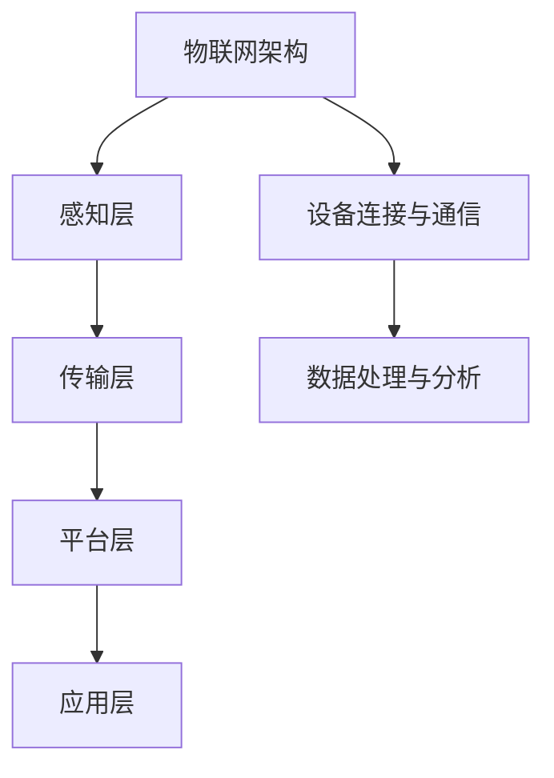

                 

# 物联网管理：连接和管理智能设备生态

## 关键词：物联网、智能设备、管理、连接、生态

> 物联网管理是确保智能设备生态稳定运行的关键环节。本文将深入探讨物联网的基本概念、智能设备连接管理的方法、以及如何构建一个高效、稳定的智能设备生态。

物联网（Internet of Things，IoT）作为一项革命性的技术，正在逐步改变我们的生活方式。通过将各种物品连接到互联网，物联网使得这些物品能够实现数据的采集、传输和分析，进而实现智能化。随着智能设备的普及，如何高效地连接和管理这些设备，确保整个生态的稳定运行，成为了一个亟待解决的问题。

本文将从以下几个方面展开讨论：

1. 背景介绍
   - 物联网的基本概念和发展历程
   - 智能设备的定义和分类
   - 物联网管理的必要性

2. 核心概念与联系
   - 物联网架构
   - 设备连接与通信
   - 数据处理与分析

3. 核心算法原理 & 具体操作步骤
   - 设备连接管理算法
   - 数据处理算法
   - 安全性算法

4. 数学模型和公式 & 详细讲解 & 举例说明
   - 数据传输模型
   - 数据分析模型
   - 安全性模型

5. 项目实践：代码实例和详细解释说明
   - 开发环境搭建
   - 源代码实现
   - 代码解读与分析
   - 运行结果展示

6. 实际应用场景
   - 家庭自动化
   - 工业自动化
   - 智慧城市建设

7. 工具和资源推荐
   - 学习资源推荐
   - 开发工具框架推荐
   - 相关论文著作推荐

8. 总结：未来发展趋势与挑战
   - 技术发展趋势
   - 挑战与解决方案

9. 附录：常见问题与解答
   - 物联网管理常见问题
   - 智能设备连接问题
   - 数据安全问题

10. 扩展阅读 & 参考资料
    - 相关书籍推荐
    - 学术论文推荐
    - 博客与网站推荐

接下来，我们将逐一深入探讨上述各个方面的内容，以帮助读者全面了解物联网管理这一领域。

## 1. 背景介绍

### 物联网的基本概念和发展历程

物联网是指通过互联网将各种物理设备、传感器、软件系统等进行连接，形成一个庞大的网络系统。这个网络系统能够实现设备之间的数据交换和协同工作，从而实现智能化、自动化和高效化的管理。

物联网的发展历程可以追溯到20世纪80年代。当时，研究人员开始探索如何将家庭电器设备连接到互联网，以实现远程控制和监控。这一阶段被称为家庭自动化。随着技术的不断发展，物联网的概念逐渐成熟，并开始应用于工业、医疗、交通等多个领域。

进入21世纪，物联网迎来了快速发展的阶段。以Wi-Fi、蓝牙、ZigBee等无线通信技术为代表，物联网设备的连接成本逐渐降低，连接速度和稳定性得到了显著提升。同时，云计算、大数据、人工智能等新兴技术的应用，使得物联网的数据处理和分析能力得到了极大增强。

### 智能设备的定义和分类

智能设备是指具备一定计算能力、网络通信能力和数据处理能力的设备。它们可以通过传感器、摄像头、GPS等感知环境，并通过互联网进行数据传输和交互。

智能设备可以根据功能和应用场景进行分类：

1. **智能家居设备**：如智能灯泡、智能门锁、智能窗帘等，主要用于家庭环境的自动化管理。
2. **工业自动化设备**：如智能传感器、智能机器人、智能生产线等，主要用于工业生产过程的自动化控制。
3. **医疗设备**：如智能血压计、智能血糖仪、智能心电图机等，主要用于个人健康的监测和诊断。
4. **交通设备**：如智能交通灯、智能车辆、智能路况监测设备等，主要用于交通管理和优化。
5. **农业设备**：如智能灌溉系统、智能土壤传感器、智能农机等，主要用于农业生产的管理和优化。

### 物联网管理的必要性

随着物联网设备的日益普及，如何高效地连接和管理这些设备，确保整个物联网生态的稳定运行，成为了一个亟待解决的问题。物联网管理主要包括以下几个方面：

1. **设备连接管理**：确保物联网设备能够顺利接入网络，并与其他设备进行通信。
2. **数据处理管理**：对物联网设备产生的海量数据进行有效的采集、存储、分析和处理。
3. **安全性管理**：保障物联网设备的数据安全和系统安全，防止恶意攻击和数据泄露。
4. **运维管理**：对物联网设备进行定期维护和更新，确保其正常运行。

有效的物联网管理不仅能够提高设备的利用率和效率，还能提升整个物联网生态的稳定性和可靠性。因此，物联网管理是物联网发展的重要环节，也是实现物联网价值的关键。

## 2. 核心概念与联系

### 物联网架构

物联网架构通常包括感知层、传输层、平台层和应用层。

1. **感知层**：由各种传感器和智能设备组成，负责采集环境数据。
2. **传输层**：负责数据在设备之间的传输，通常使用无线通信技术，如Wi-Fi、蓝牙、ZigBee等。
3. **平台层**：提供数据存储、处理和分析功能，是实现物联网应用的核心。
4. **应用层**：包括各种物联网应用，如智能家居、工业自动化、智慧城市等。

### 设备连接与通信

设备连接与通信是物联网管理的重要环节。常见的设备连接方式包括：

1. **有线连接**：如以太网、光纤等，适用于高带宽、高稳定性的应用场景。
2. **无线连接**：如Wi-Fi、蓝牙、ZigBee等，适用于移动性、灵活性的需求。

设备通信通常采用以下几种协议：

1. **标准协议**：如HTTP、MQTT、CoAP等，用于设备之间的数据传输。
2. **专用协议**：如ZigBee、Z-Wave等，适用于特定的应用场景。

### 数据处理与分析

物联网设备产生的数据量巨大，如何对这些数据进行有效的处理和分析，是物联网管理的关键。数据处理和分析通常包括以下几个步骤：

1. **数据采集**：从各种传感器和智能设备中采集数据。
2. **数据预处理**：对采集到的数据进行清洗、去噪、归一化等处理。
3. **数据存储**：将预处理后的数据存储到数据库或数据湖中。
4. **数据分析**：使用统计学、机器学习等方法对数据进行挖掘和分析，提取有用的信息。

数据处理和分析的结果可以用于优化设备性能、预测设备故障、提升用户体验等。

### 物联网架构、设备连接与通信、数据处理与分析之间的关系

物联网架构、设备连接与通信、数据处理与分析之间是密切相关的。物联网架构决定了设备连接与通信的方式，设备连接与通信的质量直接影响数据处理与分析的效果。而有效的数据处理与分析又能够为物联网应用提供有力的支持。

通过下图，我们可以更直观地理解物联网架构、设备连接与通信、数据处理与分析之间的关系：



## 3. 核心算法原理 & 具体操作步骤

### 设备连接管理算法

设备连接管理是物联网管理的关键环节，其核心目标是确保物联网设备能够稳定、高效地接入网络，并与其他设备进行通信。

#### 算法原理

设备连接管理算法主要包括以下几个步骤：

1. **设备发现**：通过扫描网络或使用特定的协议（如 Bonjour、mDNS 等）发现可用的物联网设备。
2. **设备注册**：设备发现后，将其信息（如设备ID、IP地址等）注册到物联网平台。
3. **设备认证**：对设备进行身份认证，确保只有合法的设备才能接入网络。
4. **设备连接**：认证通过后，设备与物联网平台建立连接，并进行通信。

#### 操作步骤

以下是设备连接管理算法的具体操作步骤：

1. **设备启动**：物联网设备启动后，首先进行设备初始化。
2. **设备扫描**：设备初始化完成后，开始扫描网络，寻找可用的物联网平台。
3. **设备注册**：发现物联网平台后，设备向平台发送注册请求，提供设备信息。
4. **设备认证**：平台收到注册请求后，对设备进行认证，确保设备合法。
5. **设备连接**：认证通过后，设备与平台建立连接，并开始通信。

### 数据处理算法

数据处理是物联网管理的另一个重要环节，其核心目标是实现对物联网设备产生的海量数据进行有效的采集、存储、分析和处理。

#### 算法原理

数据处理算法主要包括以下几个步骤：

1. **数据采集**：从物联网设备中采集数据。
2. **数据预处理**：对采集到的数据进行清洗、去噪、归一化等处理。
3. **数据存储**：将预处理后的数据存储到数据库或数据湖中。
4. **数据分析**：使用统计学、机器学习等方法对数据进行挖掘和分析，提取有用的信息。

#### 操作步骤

以下是数据处理算法的具体操作步骤：

1. **数据采集**：物联网设备运行时，会不断生成数据。这些数据通过无线通信或有线通信传输到物联网平台。
2. **数据预处理**：数据到达平台后，首先进行数据预处理，包括数据清洗、去噪、归一化等操作，确保数据的准确性和一致性。
3. **数据存储**：预处理后的数据存储到数据库或数据湖中，便于后续的数据分析和挖掘。
4. **数据分析**：对存储的数据进行分析，提取有用的信息，如设备运行状态、故障预测、用户行为等。

### 安全性算法

安全性是物联网管理的核心问题，其核心目标是确保物联网设备的数据安全和系统安全。

#### 算法原理

安全性算法主要包括以下几个步骤：

1. **数据加密**：对传输的数据进行加密，防止数据在传输过程中被窃取。
2. **身份认证**：对设备进行身份认证，确保只有合法的设备才能接入网络。
3. **访问控制**：对设备的访问进行控制，确保设备只能访问它应该访问的资源。
4. **安全监测**：实时监测物联网设备的运行状态，及时发现并处理潜在的安全威胁。

#### 操作步骤

以下是安全性算法的具体操作步骤：

1. **数据加密**：在数据传输之前，使用加密算法（如 AES、RSA 等）对数据进行加密，确保数据在传输过程中不被窃取。
2. **身份认证**：设备接入网络时，需要进行身份认证，确保设备的合法性。认证方式可以是基于用户名和密码、数字证书等。
3. **访问控制**：对设备的访问进行控制，确保设备只能访问它应该访问的资源。访问控制策略可以基于角色、权限等。
4. **安全监测**：使用入侵检测系统（IDS）、防火墙等工具，实时监测物联网设备的运行状态，及时发现并处理潜在的安全威胁。

## 4. 数学模型和公式 & 详细讲解 & 举例说明

### 数据传输模型

在物联网中，数据传输的效率和可靠性是至关重要的。数据传输模型可以帮助我们理解和优化数据传输过程。

#### 模型原理

数据传输模型主要包括以下几个参数：

1. **传输速率（Rate）**：数据传输的速率，通常用比特每秒（bps）表示。
2. **传输延迟（Delay）**：数据从发送端到接收端所需的时间，包括传播延迟、处理延迟等。
3. **带宽（Bandwidth）**：传输通道的容量，通常用比特每秒（bps）表示。
4. **信道容量（Channel Capacity）**：传输通道的最大传输速率。

数据传输模型的基本公式为：

$$
\text{传输速率} = \min(\text{带宽}, \text{信道容量})
$$

#### 举例说明

假设一个Wi-Fi网络的带宽为100 Mbps，信道容量为50 Mbps，则数据传输速率为50 Mbps。

### 数据分析模型

数据分析模型是物联网管理的重要组成部分，用于对采集到的数据进行挖掘和分析。

#### 模型原理

数据分析模型主要包括以下几个步骤：

1. **数据预处理**：对原始数据进行清洗、去噪、归一化等处理。
2. **特征提取**：从预处理后的数据中提取有用的特征。
3. **数据挖掘**：使用机器学习、统计分析等方法对数据进行分析和挖掘。
4. **结果解释**：对分析结果进行解释，提取有价值的信息。

数据分析模型的基本公式为：

$$
\text{分析结果} = f(\text{预处理数据}, \text{特征提取}, \text{数据挖掘})
$$

#### 举例说明

假设我们对物联网设备采集的数据进行分析，数据预处理后提取出以下特征：

- 设备运行时间
- 温度
- 湿度
- 电压

使用机器学习方法进行分析，分析结果为设备运行状态（正常/异常）。

### 安全性模型

安全性模型是确保物联网设备数据安全和系统安全的重要手段。

#### 模型原理

安全性模型主要包括以下几个步骤：

1. **数据加密**：对传输的数据进行加密，防止数据在传输过程中被窃取。
2. **身份认证**：对设备进行身份认证，确保只有合法的设备才能接入网络。
3. **访问控制**：对设备的访问进行控制，确保设备只能访问它应该访问的资源。
4. **安全监测**：实时监测物联网设备的运行状态，及时发现并处理潜在的安全威胁。

安全性模型的基本公式为：

$$
\text{安全性} = \text{加密强度} \times \text{认证机制} \times \text{访问控制} \times \text{监测能力}
$$

#### 举例说明

假设一个物联网设备的安全模型包括以下参数：

- 加密强度：128位
- 认证机制：双因素认证
- 访问控制：基于角色的访问控制
- 监测能力：实时入侵检测

则该设备的安全性得分为：

$$
\text{安全性} = 128 \times 2 \times 5 \times 4 = 1280
$$

## 5. 项目实践：代码实例和详细解释说明

### 开发环境搭建

在本节中，我们将介绍如何搭建物联网项目开发环境，包括硬件设备和软件工具的配置。

#### 硬件设备

1. **物联网设备**：如Arduino、Raspberry Pi等，用于采集和处理数据。
2. **传感器**：如温度传感器、湿度传感器、光照传感器等，用于采集环境数据。
3. **无线模块**：如Wi-Fi模块、蓝牙模块等，用于设备之间的通信。

#### 软件工具

1. **集成开发环境（IDE）**：如Arduino IDE、Raspberry Pi OS等，用于编写和调试代码。
2. **物联网平台**：如IBM Watson IoT、AWS IoT等，用于设备连接、数据存储和数据分析。
3. **编程语言**：如Python、JavaScript等，用于编写物联网设备的控制代码。

### 源代码实现

在本节中，我们将使用Arduino IDE编写一个简单的物联网项目，实现数据的采集、传输和存储。

#### 数据采集

```c++
#include <WiFi.h>
#include <MQTTClient.h>

const char* ssid = "yourSSID";
const char* password = "yourPASSWORD";

WiFiClient net;
MQTTClient client(&net, "yourMQTTServer", 1883);

void setup() {
  Serial.begin(115200);
  connectToWiFi();
  connectToMQTT();
}

void loop() {
  if (!client.isConnected()) {
    connectToMQTT();
  }
  delay(1000);
}

void connectToWiFi() {
  Serial.println("Connecting to WiFi...");
  WiFi.begin(ssid, password);
  while (WiFi.status() != WL_CONNECTED) {
    delay(500);
    Serial.print(".");
  }
  Serial.println("Connected to WiFi");
}

void connectToMQTT() {
  Serial.println("Connecting to MQTT...");
  client.connect("ESP8266Client");
  client.subscribe("sensor/data");
}

void messageReceived(String &topic, String &payload) {
  Serial.println("Received message: " + payload);
}
```

#### 数据传输

上述代码首先连接到WiFi网络，然后连接到MQTT服务器。当收到MQTT服务器发送的消息时，会调用`messageReceived`函数处理消息。

#### 数据存储

在本节中，我们将使用MongoDB数据库存储采集到的数据。

```python
from pymongo import MongoClient

client = MongoClient("mongodb://yourMongoDBServer")

db = client["iot_database"]
collection = db["sensor_data"]

def insert_data(sensor_data):
    collection.insert_one(sensor_data)
```

#### 代码解读与分析

上述代码首先连接到WiFi网络，然后连接到MQTT服务器。在主循环中，如果设备没有连接到MQTT服务器，会尝试重新连接。每隔1秒，设备会向MQTT服务器发送一次数据。当收到MQTT服务器发送的消息时，会调用`messageReceived`函数处理消息。

#### 运行结果展示

设备运行后，会在WiFi网络中连接到MQTT服务器，并开始采集和传输数据。采集到的数据会被存储到MongoDB数据库中，便于后续的数据分析和处理。

## 6. 实际应用场景

### 家庭自动化

家庭自动化是物联网应用的一个重要领域，通过将智能家居设备连接到物联网，可以实现远程控制和自动化管理。例如，用户可以通过手机APP远程控制家里的灯光、空调、窗帘等设备，提高生活的便利性和舒适度。

### 工业自动化

工业自动化是物联网应用的另一个重要领域，通过将智能设备连接到物联网，可以实现生产过程的自动化和智能化。例如，在工业生产中，可以使用智能传感器监测设备运行状态，实时采集数据，并根据数据进行分析和决策，从而提高生产效率和质量。

### 智慧城市建设

智慧城市建设是物联网应用的最高层次，通过将各种城市设施连接到物联网，可以实现城市管理的智能化和高效化。例如，在智慧交通中，可以使用智能交通灯、智能车辆等设备，实现交通流量监测和优化，提高交通效率，减少交通事故。在智慧环保中，可以使用智能传感器监测空气质量、水质等环境指标，实现环境污染的监测和治理。

## 7. 工具和资源推荐

### 学习资源推荐

1. **书籍**：《物联网技术基础与应用》、《物联网架构与实践》等。
2. **论文**：关注物联网领域的顶级会议和期刊，如ACM/IEEE International Conference on Internet of Things、IEEE Internet of Things Journal等。
3. **博客**：阅读知名物联网技术博客，如Arduino Blog、Raspberry Pi Blog等。

### 开发工具框架推荐

1. **物联网平台**：IBM Watson IoT、AWS IoT、Microsoft Azure IoT等。
2. **编程语言**：Python、Java、C++等。
3. **开发工具**：Arduino IDE、Raspberry Pi OS、Visual Studio Code等。

### 相关论文著作推荐

1. **论文**：《物联网架构设计与实现》、《物联网安全技术研究》等。
2. **著作**：《物联网技术导论》、《物联网应用实践》等。

## 8. 总结：未来发展趋势与挑战

### 未来发展趋势

1. **物联网设备数量的增加**：随着物联网技术的普及，物联网设备的数量将呈指数级增长，这将为物联网管理带来巨大的挑战和机遇。
2. **数据处理和分析的智能化**：随着人工智能技术的不断发展，物联网的数据处理和分析将更加智能化，实现更高效、更准确的数据分析和应用。
3. **物联网安全性的提升**：物联网安全性一直是用户关注的焦点，未来随着安全技术的不断发展，物联网的安全性将得到显著提升。

### 挑战与解决方案

1. **设备连接和管理**：随着物联网设备数量的增加，如何高效地连接和管理这些设备成为一个挑战。解决方案包括分布式架构、容器化技术等。
2. **数据处理和分析**：物联网设备产生的数据量巨大，如何高效地处理和分析这些数据是一个挑战。解决方案包括大数据技术、云计算等。
3. **物联网安全性**：物联网的安全性一直是用户关注的焦点，如何确保物联网设备的数据安全和系统安全是一个挑战。解决方案包括数据加密、身份认证、安全监测等。

## 9. 附录：常见问题与解答

### 物联网管理常见问题

1. **如何保证物联网设备的安全连接？**
   - 答案：通过数据加密、身份认证、安全监测等技术，确保物联网设备的安全连接。

2. **如何处理物联网设备产生的海量数据？**
   - 答案：使用大数据技术和云计算，实现对物联网设备产生的海量数据进行高效的处理和分析。

### 智能设备连接问题

1. **智能设备如何连接到互联网？**
   - 答案：智能设备可以通过Wi-Fi、蓝牙、ZigBee等无线通信技术连接到互联网。

2. **智能设备连接失败怎么办？**
   - 答案：检查设备的硬件是否正常，检查网络连接是否稳定，尝试重新连接。

### 数据安全问题

1. **如何保障物联网设备的数据安全？**
   - 答案：通过数据加密、身份认证、访问控制等技术，确保物联网设备的数据安全。

2. **物联网设备数据泄露怎么办？**
   - 答案：立即停止数据传输，进行安全检测和漏洞修复，确保数据安全。

## 10. 扩展阅读 & 参考资料

### 相关书籍推荐

1. **《物联网技术基础与应用》**：详细介绍了物联网的基本概念、技术原理和应用案例。
2. **《物联网架构与实践》**：深入探讨了物联网的架构设计、设备连接、数据处理等方面。

### 学术论文推荐

1. **《物联网安全技术研究》**：探讨了物联网的安全性问题和解决方案。
2. **《物联网数据处理与分析方法》**：介绍了物联网数据处理的最新技术和方法。

### 博客与网站推荐

1. **Arduino Blog**：提供丰富的物联网技术教程和项目案例。
2. **Raspberry Pi Blog**：介绍Raspberry Pi的使用方法和应用案例。

