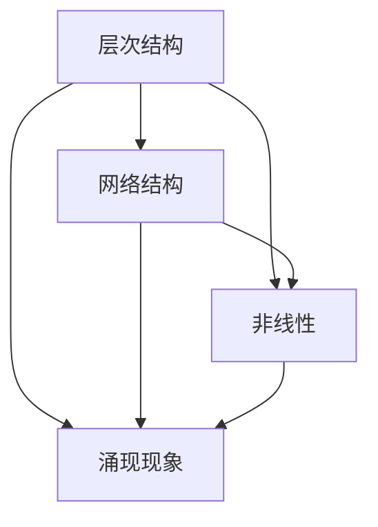

                 

# 理解世界的复杂性：从结构到洞见

> 关键词：复杂性、结构、洞见、IT、人工智能、算法、数据模型

> 摘要：本文旨在探讨世界复杂性的本质，以及如何通过IT领域的技术手段来理解和解析这一复杂性。我们将结合人工智能和算法的理论与实践，深入分析复杂系统的结构特征，并探索如何通过这些特征来获得对世界的洞见。

## 1. 背景介绍

在当今的信息时代，我们所面临的世界日益复杂，从社会系统到自然环境，从经济市场到科技发展，复杂性无处不在。理解复杂性的挑战已经成为当今科学研究的重要课题。IT领域，作为推动社会发展的关键力量，自然也不可避免地面临着这一挑战。本文将从IT的角度，探讨复杂性的本质以及如何通过结构分析和算法应用来获得洞见。

复杂性科学（Complexity Science）是一门跨学科的研究领域，它涉及物理学、生物学、社会学、计算机科学等多个学科。复杂性科学的基本思想是，通过研究系统的结构、动态行为和演化过程，来理解系统的复杂性和涌现现象。在IT领域，复杂性科学的影响尤为显著，尤其是在人工智能、数据科学和算法设计等方向。

本文将围绕以下几个核心概念展开讨论：

1. 复杂系统的结构特征
2. 人工智能算法的基本原理
3. 数据模型及其在复杂系统分析中的应用
4. 算法与结构分析在洞见获取中的应用

## 2. 核心概念与联系

### 2.1 复杂系统的结构特征

复杂系统（Complex System）是由众多相互作用的组成部分构成的系统，这些部分之间的相互作用会产生新的行为和特性，这些行为和特性在单个组成部分中是无法观察到的。复杂系统的结构特征主要包括：

- **层次结构**：复杂系统通常具有多层次的结构，每个层次都有自己的特性和功能。
- **网络结构**：复杂系统中的组成部分往往以网络的形式相互连接，这些连接可以是有向的、无向的或基于特定规则。
- **非线性**：复杂系统的行为往往是非线性的，这意味着小变化可能导致大差异。
- **涌现现象**：复杂系统中的个体相互作用可能导致新的整体行为和特性，这种现象称为涌现。

**Mermaid 流程图：**



### 2.2 人工智能算法的基本原理

人工智能（Artificial Intelligence，AI）是指由人造系统模拟人类智能的过程。人工智能算法是用于实现这些智能功能的数学模型和计算过程。人工智能算法的基本原理主要包括：

- **机器学习**：通过训练数据来构建模型，使系统能够从数据中学习并做出预测或决策。
- **深度学习**：基于神经网络结构，通过多层非线性变换来提取数据中的特征。
- **强化学习**：通过试错法来学习如何在环境中做出最优决策。

### 2.3 数据模型及其在复杂系统分析中的应用

数据模型（Data Model）是用于描述数据和数据之间关系的抽象表示。在复杂系统分析中，数据模型扮演着至关重要的角色。常见的数据模型包括：

- **关系模型**：基于表格结构，用于表示实体及其之间的关系。
- **图模型**：用于表示实体及其复杂的关系网络。
- **时间序列模型**：用于分析随时间变化的数据序列。

数据模型在复杂系统分析中的应用主要包括：

- **网络分析**：通过图模型来分析复杂系统的网络结构，理解系统内部各组成部分之间的相互作用。
- **时间序列预测**：通过时间序列模型来预测复杂系统的未来行为。
- **特征提取**：通过机器学习算法从数据中提取出对系统行为有重要影响的特征。

## 3. 核心算法原理 & 具体操作步骤

### 3.1 机器学习算法原理

机器学习（Machine Learning，ML）是人工智能的一个重要分支，其核心思想是通过从数据中学习来改进性能。机器学习算法可以分为监督学习、无监督学习和强化学习三种类型。

- **监督学习**：通过标记数据进行训练，使模型能够预测新数据的标签。
  - **线性回归**：通过拟合一条直线来预测连续值。
  - **逻辑回归**：通过拟合一个逻辑函数来预测概率。
- **无监督学习**：没有标记数据，通过发现数据中的结构来改善性能。
  - **聚类**：将相似的数据点分组，以发现数据的模式。
  - **降维**：通过减少数据的维度来简化分析。
- **强化学习**：通过与环境的交互来学习如何做出最优决策。
  - **Q学习**：通过评估每个动作的价值来学习最优策略。

### 3.2 深度学习算法原理

深度学习（Deep Learning，DL）是机器学习的一个分支，它使用多层神经网络来模拟人脑的神经活动。深度学习算法的主要原理包括：

- **前向传播**：将输入通过网络的各个层进行计算，最终得到输出。
- **反向传播**：通过比较输出和实际标签，计算误差，并反向传播误差以更新网络权重。

深度学习算法的典型应用包括：

- **图像识别**：通过卷积神经网络（CNN）来识别图像中的对象。
- **自然语言处理**：通过循环神经网络（RNN）和变压器（Transformer）来处理文本数据。

### 3.3 图模型算法原理

图模型（Graph Model）是一种用于表示和建模复杂系统网络结构的算法。图模型的主要原理包括：

- **图嵌入**：通过将图中的节点映射到低维空间中，以便进行进一步分析。
- **图卷积网络**：通过模拟图上的卷积操作，从图中提取特征。
- **图注意力机制**：通过为图中的边分配权重，提高模型对重要关系的识别。

图模型的应用包括：

- **社交网络分析**：通过分析社交网络中的关系结构来了解群体行为。
- **推荐系统**：通过图模型来理解用户之间的相似性和兴趣。

## 4. 数学模型和公式 & 详细讲解 & 举例说明

### 4.1 机器学习中的数学模型

在机器学习中，数学模型是核心。以下是一些关键的数学模型及其公式：

- **线性回归**：

  $$ y = \beta_0 + \beta_1x + \epsilon $$

  其中，\( y \) 是预测值，\( x \) 是输入特征，\( \beta_0 \) 和 \( \beta_1 \) 是模型的参数，\( \epsilon \) 是误差。

- **逻辑回归**：

  $$ P(y=1) = \frac{1}{1 + e^{-(\beta_0 + \beta_1x)}} $$

  其中，\( P(y=1) \) 是输出为1的概率。

### 4.2 深度学习中的数学模型

深度学习中的数学模型包括：

- **激活函数**：

  $$ a = \sigma(z) = \frac{1}{1 + e^{-z}} $$

  其中，\( z \) 是输入，\( a \) 是输出。

- **反向传播**：

  $$ \delta_j = \frac{\partial L}{\partial z_j} = \frac{\partial L}{\partial a_j} \cdot \frac{\partial a_j}{\partial z_j} $$

  其中，\( \delta_j \) 是误差，\( L \) 是损失函数，\( a_j \) 是激活值，\( z_j \) 是输入。

### 4.3 图模型中的数学模型

在图模型中，常用的数学模型包括：

- **图嵌入**：

  $$ x_i = \sigma(\sum_{j \in N(i)} W_{ij}x_j + b) $$

  其中，\( x_i \) 是节点\( i \)的嵌入向量，\( W_{ij} \) 是边的权重，\( N(i) \) 是节点\( i \)的邻居节点，\( b \) 是偏置。

### 4.4 举例说明

#### 4.4.1 线性回归的应用

假设我们有一个简单的线性回归模型来预测房价，输入特征是房屋的面积（\( x \)），输出值是房价（\( y \)）。

- **数据集**：

  | 面积（\( x \)）| 房价（\( y \)）|
  |:-------------:|:-------------:|
  |      1000     |      5000     |
  |      1500     |      7000     |
  |      2000     |      9000     |

- **模型**：

  $$ y = \beta_0 + \beta_1x + \epsilon $$

  其中，\( \beta_0 \) 和 \( \beta_1 \) 是模型参数，\( \epsilon \) 是误差。

- **计算**：

  通过最小化损失函数来计算 \( \beta_0 \) 和 \( \beta_1 \)。

  $$ L = \sum_{i=1}^{n} (y_i - (\beta_0 + \beta_1x_i))^2 $$

#### 4.4.2 深度学习在图像识别中的应用

假设我们使用卷积神经网络（CNN）来识别猫和狗的图像。

- **数据集**：

  包含数千张猫和狗的图像，每张图像都有一个标签（猫或狗）。

- **模型**：

  $$ \text{CNN} \rightarrow \text{ReLU} \rightarrow \text{Pooling} \rightarrow \text{Fully Connected} \rightarrow \text{Softmax} $$

  其中，CNN 用于提取图像特征，ReLU 用于激活函数，Pooling 用于下采样，Fully Connected 用于分类，Softmax 用于计算概率。

- **计算**：

  通过反向传播来更新网络权重，以最小化损失函数（交叉熵损失）。

## 5. 项目实践：代码实例和详细解释说明

### 5.1 开发环境搭建

为了演示上述算法的实践应用，我们需要搭建一个合适的开发环境。以下是一个简单的Python开发环境搭建步骤：

1. 安装Python 3.8及以上版本。
2. 安装Jupyter Notebook，用于交互式编程。
3. 安装必要的库，如NumPy、Pandas、Matplotlib、Scikit-learn、TensorFlow等。

### 5.2 源代码详细实现

以下是使用Scikit-learn库实现线性回归的示例代码：

```python
import numpy as np
from sklearn.linear_model import LinearRegression
import matplotlib.pyplot as plt

# 数据集
X = np.array([1000, 1500, 2000]).reshape(-1, 1)
y = np.array([5000, 7000, 9000])

# 模型
model = LinearRegression()

# 训练模型
model.fit(X, y)

# 预测
y_pred = model.predict(X)

# 绘图
plt.scatter(X, y)
plt.plot(X, y_pred, color='red')
plt.xlabel('Area (x)')
plt.ylabel('Price (y)')
plt.show()
```

### 5.3 代码解读与分析

上述代码首先导入了必要的库，然后创建了一个简单的数据集。接下来，使用Scikit-learn的线性回归模型进行训练，并通过预测函数来生成预测值。最后，使用Matplotlib库将实际值和预测值绘制在散点图上，以可视化模型的效果。

### 5.4 运行结果展示

运行上述代码后，我们会看到一个散点图，其中红色线条表示线性回归模型对房价的预测。从结果中可以看到，模型能够较好地拟合数据，验证了线性回归模型在预测房价方面的有效性。

## 6. 实际应用场景

复杂性理论在IT领域的应用非常广泛，以下是一些实际应用场景：

- **网络安全**：通过分析复杂网络结构来识别潜在的安全漏洞和攻击路径。
- **社交网络分析**：通过图模型来理解社交网络中的信息传播和影响力。
- **推荐系统**：通过图模型来分析用户行为和兴趣，从而提供个性化的推荐。
- **医疗诊断**：通过深度学习模型来分析患者的医疗数据，提供精确的诊断。

## 7. 工具和资源推荐

### 7.1 学习资源推荐

- **书籍**：
  - 《复杂性：灾难，混沌和分形几何学》（"Complexity: Chaos and Fractals" by M. Mitchell Waldrop）
  - 《深度学习》（"Deep Learning" by Ian Goodfellow, Yoshua Bengio, Aaron Courville）

- **论文**：
  - "The Nature of Scientific Discovery" by Karl Popper
  - "A Theory of the Learnable" by David H. Hubel and Torsten W. N. Wiesel

- **博客**：
  - [Google AI Blog](https://ai.googleblog.com/)
  - [Medium上的AI话题](https://medium.com/topic/artificial-intelligence)

- **网站**：
  - [MIT OpenCourseWare](https://ocw.mit.edu/)
  - [Kaggle](https://www.kaggle.com/)

### 7.2 开发工具框架推荐

- **开发工具**：
  - Jupyter Notebook
  - PyCharm
  - VSCode

- **框架库**：
  - TensorFlow
  - PyTorch
  - Scikit-learn

### 7.3 相关论文著作推荐

- **论文**：
  - "Deep Learning" by Geoffrey H. Donaldson and Richard S. Sutton
  - "Graph Neural Networks" by William L. Hamilton et al.

- **著作**：
  - 《人工智能：一种现代的方法》（"Artificial Intelligence: A Modern Approach" by Stuart J. Russell and Peter Norvig）

## 8. 总结：未来发展趋势与挑战

复杂性科学和IT领域的结合在未来有着广阔的发展前景。然而，这一领域也面临着诸多挑战，包括：

- **算法复杂度**：随着数据规模的增加，算法的复杂度也将显著增加，如何提高算法的效率是一个关键问题。
- **数据隐私**：在处理大规模数据时，如何保护用户的隐私是一个重要挑战。
- **跨学科合作**：复杂性科学涉及到多个学科，跨学科的合作是推动这一领域发展的关键。
- **人工智能伦理**：随着人工智能技术的不断进步，如何确保其伦理性和社会责任性也是一个重要问题。

## 9. 附录：常见问题与解答

### 9.1 什么是复杂性科学？

复杂性科学是一门跨学科的研究领域，它涉及物理学、生物学、社会学、计算机科学等多个学科。复杂性科学的基本思想是，通过研究系统的结构、动态行为和演化过程，来理解系统的复杂性和涌现现象。

### 9.2 人工智能算法有哪些类型？

人工智能算法主要包括机器学习、深度学习和强化学习。机器学习通过从数据中学习来改进性能，深度学习通过多层神经网络来模拟人脑的神经活动，强化学习通过试错法来学习如何在环境中做出最优决策。

### 9.3 数据模型在复杂系统分析中有什么作用？

数据模型用于描述数据和数据之间关系的抽象表示。在复杂系统分析中，数据模型可以用于网络分析、时间序列预测和特征提取等任务，帮助研究者更好地理解复杂系统的行为和特征。

## 10. 扩展阅读 & 参考资料

- **书籍**：
  - 《复杂性：变革社会中的秩序与混乱》（"Complexity: The Emerging Science at the Edge of Order and Chaos" by M. Mitchell Waldrop）
  - 《深度学习原理》（"Deep Learning: The MIT Press Essential Knowledge Series" by Ian Goodfellow, Yoshua Bengio, Aaron Courville）

- **论文**：
  - "Complex Systems" by C. West, D. J. G. Andrew, and S. Redner
  - "The Science of Complexity: An Overview" by R. N. Mantegna and H. E. Stanley

- **网站**：
  - [复杂性科学协会](https://complexityscience.org/)
  - [人工智能协会](https://www.aaai.org/)

- **在线课程**：
  - [MIT公开课：深度学习入门](https://www.youtube.com/playlist?list=PLUl4u3cNGP606EXe3sC5Jp9v7v4tLPoT_)
  - [斯坦福大学公开课：机器学习](https://www.coursera.org/learn/machine-learning)

作者：禅与计算机程序设计艺术 / Zen and the Art of Computer Programming

