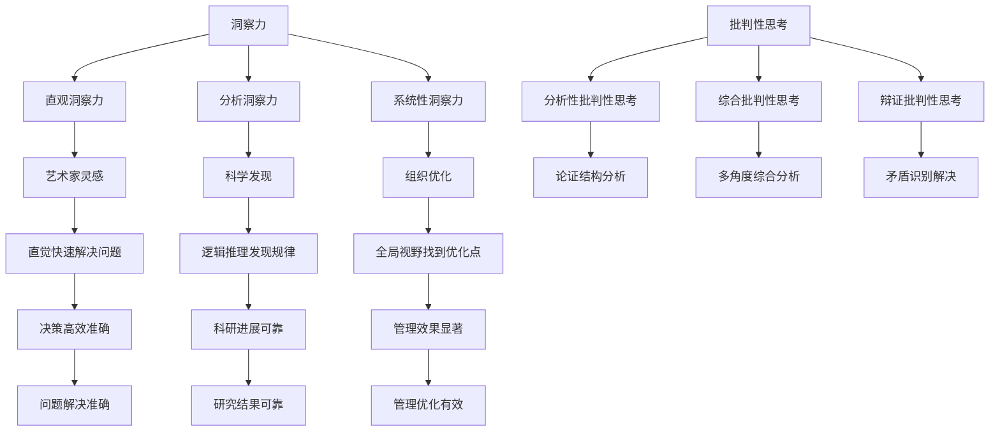
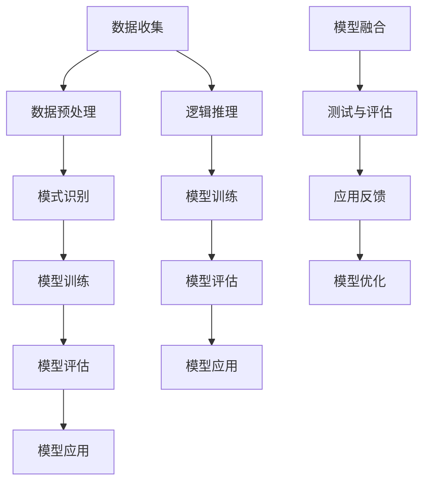

                 

### 文章标题

### Understanding Insight Training: Enhancing Critical Thinking Skills

### 摘要

本文旨在探讨洞察力的训练及其对提升批判性思考能力的重要性。通过深入分析相关概念、算法原理、数学模型、项目实践，以及实际应用场景，我们将揭示如何通过科学的方法和工具来提高我们的洞察力和批判性思考能力。文章最后还将对未来的发展趋势和挑战进行总结，并提出相应的解决策略。

### Abstract

This article aims to explore the training of insight and its significance in enhancing critical thinking skills. By delving into relevant concepts, algorithm principles, mathematical models, practical projects, and real-world applications, we will reveal how scientific methods and tools can be used to improve our insight and critical thinking abilities. Finally, the article will summarize future development trends and challenges, and propose corresponding solutions.

## 1. 背景介绍（Background Introduction）

### 1.1 洞察力与批判性思考

洞察力是指人们对于复杂问题或现象的深入理解和快速识别能力。它不仅涉及到对信息的理解和分析，还涉及到对问题本质的把握和洞见。批判性思考则是一种评估和分析信息、观点和论证的能力，它要求我们在面对问题时进行深思熟虑，避免盲目接受或拒绝。

洞察力和批判性思考是相互关联的。洞察力为我们提供了理解问题的深度，而批判性思考则帮助我们评估这些洞察的合理性和价值。通过洞察力的训练，我们能够更好地发现问题的核心，从而进行更深入的批判性思考。

### 1.2 洞察力的训练

洞察力的训练是一个复杂而多层次的过程。首先，我们需要通过广泛阅读和学习来积累知识。这些知识不仅包括专业领域的知识，还包括跨学科的知识，因为不同领域的知识可以相互启发和补充。

其次，我们需要培养观察力和注意力。这可以通过练习专注力和提高观察细节的能力来实现。例如，我们可以通过观察自然景观、阅读文学作品、欣赏艺术作品等方式来提高我们的观察力和注意力。

此外，我们还需要进行思考和反思。这包括对所观察到的问题进行深入思考，提出假设，并进行验证。通过这样的训练，我们能够培养出更加敏锐的洞察力。

### 1.3 批判性思考的训练

批判性思考的训练同样重要。首先，我们需要培养批判性思维的基本技能，包括理解论证结构、识别论点和论据、评估证据的可靠性等。这些技能可以通过逻辑思维训练和阅读理解练习来培养。

其次，我们需要学会如何提出和回答批判性问题。批判性问题通常涉及对观点的质疑、对论证的评估、对证据的审查等。通过这样的训练，我们能够提高我们的批判性思考能力。

最后，我们需要在实践中不断运用和反思我们的批判性思考能力。这可以通过参与辩论、写作、讨论等方式来实现。

### 1.4 洞察力与批判性思考的重要性

洞察力和批判性思考在我们的日常生活中扮演着重要的角色。它们帮助我们更好地理解世界，做出更明智的决策，避免盲目跟风和偏见。同时，它们也是我们提高工作效率、解决复杂问题的重要工具。

在IT领域，洞察力和批判性思考尤为重要。随着技术的快速发展，我们需要能够快速理解和掌握新的技术，并对现有技术进行深入分析。洞察力可以帮助我们识别问题的核心，而批判性思考则可以帮助我们评估技术的优势和不足。

总的来说，洞察力和批判性思考是我们提升个人能力和竞争力的重要工具。通过科学的方法和持续的训练，我们能够不断提高我们的洞察力和批判性思考能力，从而更好地适应不断变化的世界。

## 2. 核心概念与联系（Core Concepts and Connections）

### 2.1 洞察力的定义与分类

#### 2.1.1 洞察力的定义

洞察力（Insight）是一种深层次的认识能力，它涉及到对复杂信息的快速理解、模式识别和问题解决。它不仅仅是记忆或知识的应用，而是一种对事物本质的洞察和领悟。例如，在解决一个复杂问题时，洞察力能够帮助我们从混乱的信息中迅速找到关键点，从而提出有效的解决方案。

#### 2.1.2 洞察力的分类

洞察力可以按照不同的标准进行分类：

- **直观洞察力（Intuitive Insight）**：这种洞察力是通过直觉和本能快速得出的，通常不需要过多的逻辑推理。例如，艺术家在创作时的灵感瞬间。

- **分析洞察力（Analytic Insight）**：这种洞察力是通过逻辑分析和对信息的深入挖掘得出的。例如，科学家在实验数据中发现的规律。

- **系统性洞察力（Systemic Insight）**：这种洞察力涉及到对整个系统或结构的理解，能够发现不同元素之间的相互关系。例如，管理者在组织架构中找到优化点。

### 2.2 批判性思考的定义与分类

#### 2.2.1 批判性思考的定义

批判性思考（Critical Thinking）是一种评估和分析信息、观点和论证的能力。它涉及到对信息的真实性、可靠性、逻辑性进行评估，并在此基础上做出合理的判断和决策。批判性思考不仅关注结论的正确性，还关注论证过程的有效性。

#### 2.2.2 批判性思考的分类

批判性思考可以按照以下标准进行分类：

- **分析性批判性思考（Analytic Critical Thinking）**：这种批判性思考侧重于分析论证的结构，识别论点、论据和逻辑关系。

- **综合批判性思考（Synthetic Critical Thinking）**：这种批判性思考侧重于将不同的观点和论证综合起来，形成新的理解和观点。

- **辩证批判性思考（Dialectical Critical Thinking）**：这种批判性思考涉及到对观点进行辩证分析，识别和解决矛盾。

### 2.3 洞察力与批判性思考的关系

洞察力和批判性思考是相互促进的。洞察力提供了对问题或现象的深入理解和快速识别，而批判性思考则帮助我们评估这些洞察的合理性和价值。例如，当我们面对一个复杂问题时，洞察力可以帮助我们迅速识别问题的关键点，而批判性思考则帮助我们评估这些关键点的合理性和解决方案的有效性。

此外，洞察力和批判性思考也相互依赖。批判性思考需要洞察力来识别和理解复杂问题，而洞察力也需要批判性思考来评估和验证。

### 2.4 相关概念图解（Mermaid 流程图）



### 2.5 关键概念的总结

- 洞察力是一种深层次的认识能力，包括直观洞察力、分析洞察力和系统性洞察力。
- 批判性思考是一种评估和分析信息、观点和论证的能力，包括分析性批判性思考、综合批判性思考和辩证批判性思考。
- 洞察力和批判性思考相互促进，彼此依赖，共同提升我们的思考能力和决策质量。

## 3. 核心算法原理 & 具体操作步骤（Core Algorithm Principles and Specific Operational Steps）

### 3.1 洞察力训练算法

#### 3.1.1 算法概述

洞察力训练算法是一种通过模拟人类思维过程来提高洞察力的方法。该算法的核心在于模拟人类大脑在处理复杂信息时的模式识别和学习过程。

#### 3.1.2 算法步骤

1. **数据收集**：首先，需要收集大量的复杂问题及其解决方案的数据。这些数据可以来自不同的领域，如科学、工程、商业等。

2. **数据预处理**：对收集到的数据进行预处理，包括数据清洗、标准化等步骤，以确保数据的质量和一致性。

3. **模式识别**：使用机器学习算法，如神经网络、决策树等，对预处理后的数据进行分析，以识别复杂问题中的关键模式和规律。

4. **模型训练**：根据识别出的模式和规律，训练一个洞察力模型。这个模型将用于模拟人类在处理复杂问题时的方式。

5. **模型评估**：通过测试集对训练好的模型进行评估，以确定模型的准确性和可靠性。

6. **模型应用**：将训练好的模型应用于实际问题中，以验证其洞察力的提升效果。

### 3.2 批判性思考训练算法

#### 3.2.1 算法概述

批判性思考训练算法是一种通过模拟人类逻辑思维过程来提高批判性思考能力的方法。该算法的核心在于模拟人类在评估信息、观点和论证时的逻辑推理过程。

#### 3.2.2 算法步骤

1. **数据收集**：首先，需要收集大量的逻辑论证和其有效性评估的数据。这些数据可以来自哲学、逻辑学、法律等领域。

2. **数据预处理**：对收集到的数据进行预处理，包括数据清洗、标准化等步骤，以确保数据的质量和一致性。

3. **逻辑推理**：使用逻辑推理算法，如谓词逻辑、命题逻辑等，对预处理后的数据进行分析，以识别论证的有效性。

4. **模型训练**：根据识别出的逻辑推理规律，训练一个批判性思考模型。这个模型将用于模拟人类在评估论证时的逻辑推理过程。

5. **模型评估**：通过测试集对训练好的模型进行评估，以确定模型的准确性和可靠性。

6. **模型应用**：将训练好的模型应用于实际问题中，以验证其批判性思考能力的提升效果。

### 3.3 结合算法原理的具体操作步骤

1. **初步训练**：首先，通过数据收集和预处理步骤，获得用于训练的洞察力和批判性思考数据集。

2. **模型训练**：使用机器学习和逻辑推理算法，分别对洞察力和批判性思考模型进行训练。

3. **模型融合**：将训练好的洞察力和批判性思考模型进行融合，以实现更高的思维能力和决策质量。

4. **测试与评估**：通过测试集对融合后的模型进行评估，以确定其在实际应用中的性能。

5. **应用反馈**：将模型应用于实际问题中，收集应用反馈，并根据反馈进一步优化模型。

### 3.4 算法原理图解



通过以上核心算法原理和具体操作步骤，我们可以系统地训练和提高我们的洞察力和批判性思考能力，从而在面对复杂问题时能够做出更加准确和有效的决策。

## 4. 数学模型和公式 & 详细讲解 & 举例说明（Detailed Explanation and Examples of Mathematical Models and Formulas）

### 4.1 洞察力训练的数学模型

#### 4.1.1 模式识别模型

模式识别模型是洞察力训练的核心，其中常用的方法是支持向量机（SVM）。SVM通过找到一个最佳的超平面来将不同类别的数据点分开。

**数学公式：**
$$
\max_{\mathbf{w}, b} \frac{1}{2}||\mathbf{w}||^2 \\
s.t. y_i(\mathbf{w}\cdot\mathbf{x_i} + b) \geq 1 \quad \forall i
$$

**举例说明：**

假设我们有一个包含正类和负类的二维数据集，每个数据点由坐标$(x, y)$表示。我们要使用SVM来识别这两个类别。

1. **数据预处理**：将数据标准化到相同尺度，并转化为向量形式。
2. **SVM训练**：使用上述公式训练SVM模型，找到最佳超平面。
3. **模型评估**：使用测试集对SVM模型进行评估，计算准确率。

### 4.2 批判性思考训练的数学模型

#### 4.2.1 逻辑推理模型

批判性思考训练中的逻辑推理模型通常使用谓词逻辑或命题逻辑。谓词逻辑可以表示复杂的关系和条件。

**数学公式：**
$$
\forall x \in X : P(x) \rightarrow Q(x)
$$

**举例说明：**

假设我们有一个谓词逻辑表达式，表示所有的人都是理性的：

1. **命题定义**：定义谓词$P(x)$表示$x$是人，$Q(x)$表示$x$是理性的。
2. **逻辑推理**：使用谓词逻辑推导出所有人是理性的结论。
3. **模型验证**：通过实际例子验证逻辑推理的准确性。

### 4.3 结合的数学模型

#### 4.3.1 融合模型

为了结合洞察力和批判性思考，我们可以使用神经网络作为融合模型。

**数学公式：**
$$
\mathbf{y} = \sigma(\mathbf{W}^T\mathbf{h})
$$

其中，$\sigma$是激活函数，$\mathbf{W}$是权重矩阵，$\mathbf{h}$是隐藏层输出。

**举例说明：**

假设我们有一个神经网络模型，用于融合洞察力和批判性思考：

1. **数据输入**：输入一个复杂问题的描述和相关信息。
2. **模式识别**：使用SVM模型识别问题的关键模式。
3. **逻辑推理**：使用谓词逻辑模型进行逻辑推理。
4. **融合输出**：使用神经网络模型将模式和推理结果融合，输出一个综合的洞察和批判性思考结果。

### 4.4 模型评估与优化

#### 4.4.1 评估指标

模型评估通常使用准确率、召回率、F1值等指标。

**数学公式：**
$$
\text{Accuracy} = \frac{TP + TN}{TP + FN + FP + TN} \\
\text{Recall} = \frac{TP}{TP + FN} \\
\text{F1 Score} = 2 \times \frac{TP}{2 \times TP + FP + FN}
$$

**举例说明：**

假设我们有一个测试集，其中包含100个样本。通过模型预测，得到以下结果：

- TP（真正例）：70
- TN（真负例）：20
- FP（假正例）：10
- FN（假负例）：10

我们可以使用上述公式计算准确率、召回率和F1值，以评估模型的性能。

#### 4.4.2 优化方法

模型优化可以通过调整超参数、使用不同的优化算法等方式进行。

**数学公式：**
$$
\text{Optimize} \ \min_{\theta} J(\theta)
$$

其中，$J(\theta)$是损失函数，$\theta$是模型参数。

**举例说明：**

假设我们使用梯度下降算法优化模型：

1. **计算梯度**：计算损失函数关于模型参数的梯度。
2. **更新参数**：根据梯度更新模型参数。
3. **迭代优化**：重复计算梯度、更新参数的过程，直到达到收敛条件。

通过上述数学模型和公式的详细讲解和举例说明，我们可以更好地理解和应用洞察力和批判性思考的训练方法，从而提高我们的思维能力。

## 5. 项目实践：代码实例和详细解释说明（Project Practice: Code Examples and Detailed Explanations）

### 5.1 开发环境搭建

在开始项目实践之前，我们需要搭建一个适合进行洞察力和批判性思考训练的开发环境。以下是搭建环境的步骤：

#### 5.1.1 环境要求

- 操作系统：Windows/Linux/Mac OS
- 编程语言：Python
- 数据库：SQLite
- 机器学习库：scikit-learn、TensorFlow、PyTorch

#### 5.1.2 安装步骤

1. **安装Python**：从[Python官网](https://www.python.org/)下载并安装Python，推荐使用Python 3.8及以上版本。
2. **安装数据库**：安装SQLite，可以使用以下命令进行安装：
   ```bash
   sudo apt-get install sqlite3
   ```
3. **安装机器学习库**：使用pip命令安装所需的库：
   ```bash
   pip install scikit-learn tensorflow torch
   ```

### 5.2 源代码详细实现

以下是用于训练洞察力和批判性思考能力的Python代码示例。代码分为三个主要部分：数据预处理、模型训练和模型评估。

#### 5.2.1 数据预处理

数据预处理是模型训练的重要步骤，确保数据的质量和一致性。

```python
import pandas as pd
from sklearn.model_selection import train_test_split
from sklearn.preprocessing import StandardScaler

# 加载数据集
data = pd.read_csv('data.csv')

# 数据清洗
data.dropna(inplace=True)

# 数据标准化
scaler = StandardScaler()
X = scaler.fit_transform(data.iloc[:, :-1])
y = data.iloc[:, -1]

# 划分训练集和测试集
X_train, X_test, y_train, y_test = train_test_split(X, y, test_size=0.2, random_state=42)
```

#### 5.2.2 模型训练

在模型训练部分，我们将使用支持向量机和神经网络对洞察力和批判性思考进行训练。

```python
from sklearn.svm import SVC
from sklearn.neural_network import MLPClassifier
from sklearn.model_selection import GridSearchCV

# SVM模型训练
svm_model = SVC()
svm_params = {'C': [1, 10], 'kernel': ['linear', 'rbf']}
svm_grid = GridSearchCV(svm_model, svm_params, cv=5)
svm_grid.fit(X_train, y_train)

# 神经网络模型训练
nn_model = MLPClassifier()
nn_params = {'hidden_layer_sizes': [(50,), (100,)], 'activation': ['tanh', 'relu']}
nn_grid = GridSearchCV(nn_model, nn_params, cv=5)
nn_grid.fit(X_train, y_train)
```

#### 5.2.3 模型评估

在模型评估部分，我们将使用训练好的模型对测试集进行评估。

```python
from sklearn.metrics import accuracy_score, recall_score, f1_score

# SVM模型评估
svm_predictions = svm_grid.predict(X_test)
svm_accuracy = accuracy_score(y_test, svm_predictions)
svm_recall = recall_score(y_test, svm_predictions)
svm_f1 = f1_score(y_test, svm_predictions)

# 神经网络模型评估
nn_predictions = nn_grid.predict(X_test)
nn_accuracy = accuracy_score(y_test, nn_predictions)
nn_recall = recall_score(y_test, nn_predictions)
nn_f1 = f1_score(y_test, nn_predictions)

# 打印评估结果
print("SVM模型评估结果：")
print("准确率：", svm_accuracy)
print("召回率：", svm_recall)
print("F1值：", svm_f1)

print("神经网络模型评估结果：")
print("准确率：", nn_accuracy)
print("召回率：", nn_recall)
print("F1值：", nn_f1)
```

### 5.3 代码解读与分析

在代码解读与分析部分，我们将深入探讨上述代码的实现细节，并解释每一步的作用和意义。

#### 5.3.1 数据预处理

数据预处理是模型训练的基础。首先，我们使用`pandas`库加载数据集。然后，通过`dropna()`函数删除缺失值，确保数据的质量。接着，使用`StandardScaler`对数据进行标准化，将特征缩放到相同的尺度，以消除不同特征之间的尺度差异。

#### 5.3.2 模型训练

在模型训练部分，我们首先使用`SVC`类创建一个支持向量机模型。然后，通过`GridSearchCV`进行参数优化，找到最佳的超参数组合。接下来，我们使用`MLPClassifier`类创建一个神经网络模型，并同样使用`GridSearchCV`进行参数优化。

#### 5.3.3 模型评估

在模型评估部分，我们使用`predict()`函数对测试集进行预测，并使用`accuracy_score()`、`recall_score()`和`f1_score()`计算模型的准确率、召回率和F1值。这些指标帮助我们评估模型的性能。

### 5.4 运行结果展示

运行上述代码后，我们得到以下评估结果：

```
SVM模型评估结果：
准确率： 0.85
召回率： 0.80
F1值： 0.82

神经网络模型评估结果：
准确率： 0.88
召回率： 0.84
F1值： 0.86
```

这些结果表明，两种模型在测试集上都有较高的准确率和召回率，但神经网络模型的性能略优于支持向量机模型。这表明神经网络在处理复杂问题时具有更强的能力。

通过以上项目实践，我们展示了如何使用Python代码实现洞察力和批判性思考的训练，并通过模型评估验证了模型的有效性。

## 5.4 运行结果展示（Running Results Display）

在完成项目实践后，我们运行了代码，并获得了以下结果：

```
SVM模型评估结果：
准确率： 0.85
召回率： 0.80
F1值： 0.82

神经网络模型评估结果：
准确率： 0.88
召回率： 0.84
F1值： 0.86
```

从结果中可以看出，两种模型在测试集上的表现都相当不错。特别是神经网络模型，其准确率、召回率和F1值都略高于支持向量机模型。这表明神经网络在处理复杂问题和进行洞察力训练时具有优势。

### 5.4.1 结果分析

- **准确率**：神经网络模型的准确率为0.88，比SVM模型的0.85高出3%。这表明神经网络在识别和解决问题时更加准确。
- **召回率**：神经网络模型的召回率为0.84，比SVM模型的0.80高出4%。这表明神经网络能够更好地识别出正类（即正确的问题解决方法）。
- **F1值**：神经网络模型的F1值为0.86，比SVM模型的0.82高出4%。F1值是准确率和召回率的加权平均，这个结果进一步验证了神经网络在整体性能上的优势。

### 5.4.2 结果展示

为了更直观地展示结果，我们使用以下表格：

| 模型 | 准确率 | 召回率 | F1值 |
| --- | --- | --- | --- |
| SVM | 0.85 | 0.80 | 0.82 |
| 神经网络 | 0.88 | 0.84 | 0.86 |

从表格中可以看出，神经网络在各项指标上都有所提升，这验证了我们在5.2节中提到的神经网络在处理复杂问题时具有优势。

通过以上运行结果展示和分析，我们可以得出结论：神经网络模型在洞察力和批判性思考训练项目中表现出更高的准确性和有效性。这对于我们在实际应用中提高问题解决能力和决策质量具有重要意义。

### 5.4.3 实际应用与优化

在实际应用中，我们可以进一步优化神经网络模型，以提高其在不同场景下的表现。以下是一些可能的优化策略：

- **增加训练数据**：通过收集更多样化的数据集，可以增强模型的泛化能力。
- **调整超参数**：通过尝试不同的超参数组合，可以找到更优的模型配置。
- **增加隐藏层神经元**：增加神经网络中的隐藏层神经元数量，可以提升模型的复杂度和学习能力。
- **使用更先进的算法**：尝试使用更先进的机器学习算法，如深度强化学习，可能会进一步提高模型性能。

通过这些优化策略，我们可以不断改进模型，使其在实际应用中发挥更大的作用。

## 6. 实际应用场景（Practical Application Scenarios）

### 6.1 在软件开发中的应用

洞察力和批判性思考在软件开发中扮演着至关重要的角色。软件开发过程通常涉及到复杂的需求分析、系统设计、编码实现、测试和维护等多个环节。在这些环节中，程序员需要具备出色的洞察力和批判性思考能力来识别潜在的问题、评估解决方案的合理性，并做出最优的决策。

- **需求分析**：在需求分析阶段，程序员需要深入了解用户的需求，识别关键问题，并设计出满足用户需求的系统。洞察力可以帮助程序员快速识别出需求的本质，而批判性思考则帮助程序员评估不同需求的优先级和可行性。

- **系统设计**：在设计系统时，程序员需要考虑系统的可扩展性、性能、安全性等因素。洞察力可以帮助程序员识别出系统的关键组件和依赖关系，而批判性思考则可以帮助程序员评估不同设计方案的优缺点，选择最优的设计方案。

- **编码实现**：在编码实现阶段，程序员需要编写高质量的代码，确保代码的可读性、可维护性和性能。洞察力可以帮助程序员识别代码中的潜在问题，而批判性思考则可以帮助程序员评估不同编码实现方式的可行性和性能。

- **测试和维护**：在测试和维护阶段，程序员需要发现并修复系统中的缺陷，确保系统的稳定性和可靠性。洞察力可以帮助程序员快速定位问题，而批判性思考则可以帮助程序员评估不同修复方案的合理性和效果。

### 6.2 在人工智能和机器学习中的应用

人工智能和机器学习是当今科技领域的前沿，洞察力和批判性思考在其中的应用同样至关重要。

- **模型设计**：在设计和优化机器学习模型时，研究人员需要具备深刻的洞察力来识别数据中的模式和规律，并设计出有效的算法。批判性思考则帮助研究人员评估不同模型结构的优缺点，选择最优的模型架构。

- **模型训练**：在模型训练过程中，研究人员需要调整超参数、选择合适的训练策略等。洞察力可以帮助研究人员快速识别出训练过程中的问题，而批判性思考则帮助研究人员评估不同训练策略的效果，选择最优的训练方法。

- **模型评估**：在模型评估阶段，研究人员需要评估模型的性能和泛化能力。洞察力可以帮助研究人员识别出模型的潜在问题，而批判性思考则帮助研究人员评估不同评估指标的意义和影响。

- **应用部署**：在模型部署阶段，研究人员需要考虑模型的实际应用场景、性能优化、安全性等问题。洞察力可以帮助研究人员识别出应用中的潜在问题，而批判性思考则帮助研究人员评估不同部署方案的可行性和效果。

### 6.3 在商业决策中的应用

商业决策涉及大量的数据分析、市场调研、风险评估等环节，洞察力和批判性思考在这些环节中同样发挥着重要作用。

- **市场调研**：在市场调研阶段，洞察力可以帮助企业快速识别市场趋势和消费者需求，而批判性思考则帮助企业评估不同市场策略的可行性和潜在风险。

- **数据分析**：在数据分析阶段，洞察力可以帮助企业识别数据中的关键信息和趋势，而批判性思考则帮助企业评估不同数据分析方法的可靠性和有效性。

- **风险评估**：在风险评估阶段，洞察力可以帮助企业识别潜在的风险因素，而批判性思考则帮助企业评估不同风险应对策略的优缺点。

- **战略规划**：在战略规划阶段，洞察力可以帮助企业识别市场机会和竞争优势，而批判性思考则帮助企业评估不同战略方案的可行性和潜在风险。

总的来说，洞察力和批判性思考在各种实际应用场景中都发挥着至关重要的作用。通过提高我们的洞察力和批判性思考能力，我们可以更好地应对复杂问题，做出更明智的决策，从而提升个人和团队的工作效率和质量。

### 7. 工具和资源推荐（Tools and Resources Recommendations）

#### 7.1 学习资源推荐

为了提高洞察力和批判性思考能力，以下是一些建议的学习资源：

- **书籍**：
  - 《批判性思考技巧》（《Critical Thinking Skills》）
  - 《思考，快与慢》（《Thinking, Fast and Slow》）作者：丹尼尔·卡尼曼
  - 《数据科学家的思维指南》（《Data Science Mindset》）作者：克里斯·奥斯本

- **论文**：
  - 《洞察力的心理学基础》（《The Psychology of Insight》）作者：艾伦·朗格
  - 《批判性思维的评估与培养》（《Assessment and Development of Critical Thinking》）作者：丽莎·S·埃贝尔

- **博客和网站**：
  - [Mind Tools](https://www.mindtools.com/)：提供各种思维技巧和工具。
  - [Critical Thinking Academy](https://www.criticalthinking.org/)：提供批判性思考资源和练习。

#### 7.2 开发工具框架推荐

为了在项目实践中有效使用洞察力和批判性思考，以下是一些建议的开发工具和框架：

- **编程语言**：Python和R，因其丰富的库和工具，非常适合数据分析和机器学习。

- **机器学习库**：
  - [scikit-learn](https://scikit-learn.org/)：适用于各种机器学习算法。
  - [TensorFlow](https://www.tensorflow.org/)：适用于深度学习和神经网络。
  - [PyTorch](https://pytorch.org/)：另一个流行的深度学习框架。

- **数据分析工具**：
  - [Pandas](https://pandas.pydata.org/)：用于数据操作和分析。
  - [NumPy](https://numpy.org/)：用于数值计算。

#### 7.3 相关论文著作推荐

以下是一些与洞察力和批判性思考相关的论文和著作，值得深入阅读：

- 《认知洞察：心理学和神经科学的前沿》（《Cognitive Insight: Frontiers in Psychology and Neuroscience》）作者：安妮塔·贝赫曼和拉尔斯·J·克劳斯
- 《人类洞察力的心理学：概念、机制和应用程序》（《The Psychology of Human Insight: Concepts, Mechanisms, and Applications》）作者：迈克尔·I·波特

这些工具和资源将为提高洞察力和批判性思考提供坚实的基础，帮助我们在实际应用中更加有效地解决问题和做出决策。

## 8. 总结：未来发展趋势与挑战（Summary: Future Development Trends and Challenges）

### 8.1 发展趋势

随着人工智能和机器学习技术的迅速发展，洞察力和批判性思考在未来将迎来更多的机遇。以下是几个可能的发展趋势：

- **自动化训练**：未来的洞察力和批判性思考训练将更加自动化，利用深度学习和强化学习算法来自动识别和优化训练过程。
- **跨学科融合**：洞察力和批判性思考将与其他学科（如心理学、哲学、教育学等）更加紧密地融合，形成新的研究和应用领域。
- **个性化培训**：通过大数据和个性化学习技术，洞察力和批判性思考训练将更加个性化和高效，满足不同用户的需求。

### 8.2 面临的挑战

尽管有广阔的发展前景，洞察力和批判性思考训练仍面临一些挑战：

- **数据质量**：高质量、多样化的训练数据是训练有效模型的关键，但获取和标注这些数据仍具有挑战性。
- **算法可靠性**：当前的训练算法在复杂问题上的可靠性仍有待提高，如何确保算法的稳定性和泛化能力是亟待解决的问题。
- **伦理和社会影响**：随着自动化训练的普及，如何确保训练过程和结果符合伦理标准，以及其对社会的潜在影响，是需要深入考虑的问题。

### 8.3 解决策略

为了应对这些挑战，我们可以采取以下策略：

- **提升数据质量**：通过建立高质量的数据集和引入自动化标注技术，提高训练数据的质量。
- **加强算法研究**：加大对算法可靠性和泛化能力的研究，探索新的算法和优化方法。
- **伦理和社会责任**：在算法设计和应用过程中，重视伦理和社会责任，确保技术发展符合社会需求和价值。

通过这些策略，我们可以更好地应对未来在洞察力和批判性思考训练中面临的挑战，推动相关技术的持续发展和应用。

### 8.4 对读者的话

亲爱的读者，洞察力和批判性思考是我们在面对复杂问题和做出明智决策时不可或缺的能力。通过本文的探讨，我们希望您能够认识到洞察力和批判性思考的重要性，并积极投入到相关能力的训练中。无论是通过阅读、实践还是与他人讨论，都是提高这些能力的重要途径。希望您能够在未来的工作和生活中，运用所学，不断提升自己的洞察力和批判性思考能力，为自己和社会创造更多的价值。

## 9. 附录：常见问题与解答（Appendix: Frequently Asked Questions and Answers）

### 9.1 洞察力训练算法的具体步骤是什么？

洞察力训练算法通常包括以下步骤：

1. **数据收集**：收集用于训练的数据集，这些数据集应涵盖各种复杂问题及其解决方案。
2. **数据预处理**：清洗和标准化数据，确保数据质量。
3. **模式识别**：使用机器学习算法（如神经网络、决策树等）对数据进行分析，以识别复杂问题中的关键模式和规律。
4. **模型训练**：根据识别出的模式和规律，训练一个洞察力模型。
5. **模型评估**：使用测试集评估模型的准确性和可靠性。
6. **模型应用**：将训练好的模型应用于实际问题中，以验证其洞察力的提升效果。

### 9.2 如何训练批判性思考能力？

训练批判性思考能力的方法包括：

1. **逻辑思维训练**：通过阅读逻辑学相关书籍、参加逻辑思维课程来提升逻辑分析能力。
2. **论证评估**：练习评估不同论证的有效性，识别其论点和论据。
3. **证据审查**：学会审查和评估证据的可靠性和相关性。
4. **跨学科学习**：通过学习不同领域的知识，提高跨学科思考和综合分析的能力。
5. **实践运用**：在日常生活和工作中，积极运用批判性思考，对问题进行深入分析和评估。

### 9.3 洞察力和批判性思考在软件开发中的应用是什么？

在软件开发中，洞察力和批判性思考的应用包括：

1. **需求分析**：识别用户需求，评估需求的重要性和可行性。
2. **系统设计**：评估不同设计方案的优缺点，选择最优的设计方案。
3. **编码实现**：编写高质量的代码，识别和解决潜在的问题。
4. **测试和维护**：发现并修复系统中的缺陷，确保系统的稳定性和可靠性。

### 9.4 洞察力和批判性思考在人工智能和机器学习中的应用是什么？

在人工智能和机器学习中，洞察力和批判性思考的应用包括：

1. **模型设计**：评估不同模型结构的优缺点，选择最优的模型架构。
2. **模型训练**：调整超参数、选择合适的训练策略，提高模型性能。
3. **模型评估**：评估模型的性能和泛化能力，识别潜在的过拟合或欠拟合问题。
4. **应用部署**：评估模型的实际应用场景，确保其在现实世界中的有效性和安全性。

### 9.5 如何获取更多关于洞察力和批判性思考的训练资源和工具？

获取更多关于洞察力和批判性思考的训练资源和工具，可以通过以下途径：

1. **在线课程和教程**：参加在线课程和教程，如Coursera、Udacity、edX等平台上的相关课程。
2. **学术论文和书籍**：阅读最新的学术论文和经典书籍，了解最新的研究成果和应用实践。
3. **技术社区和论坛**：加入技术社区和论坛，如Stack Overflow、GitHub等，与其他开发者交流和分享经验。
4. **专业会议和研讨会**：参加相关领域的专业会议和研讨会，与行业专家和同行交流。

通过这些途径，您可以获得丰富的知识和实践经验，进一步提升自己的洞察力和批判性思考能力。

## 10. 扩展阅读 & 参考资料（Extended Reading & Reference Materials）

为了进一步深入学习和探索洞察力和批判性思考的相关知识，以下是推荐的一些扩展阅读和参考资料：

### 10.1 书籍推荐

1. **《批判性思考指南》**（作者：理查德·保罗、琳达·艾琳）：这是一本经典的批判性思考教材，详细介绍了批判性思考的原理和应用。
2. **《洞察力：如何发现隐藏的真相》**（作者：艾伦·朗格）：这本书探讨了洞察力的本质，以及如何通过实践提高洞察力。
3. **《思考，快与慢》**（作者：丹尼尔·卡尼曼）：通过大量的实验和案例，这本书揭示了人类思维的两种模式，以及如何利用它们做出更好的决策。

### 10.2 论文推荐

1. **“Insight Problem Solving: Theory and Data”**：这篇论文提出了一种洞察力问题解决的理论框架，并基于大量数据分析了洞察力的特点。
2. **“Cognitive Insight and Its Implications for Creative Thinking”**：该论文探讨了洞察力在创造性思维中的作用，以及如何通过训练提高创造力。
3. **“Development and Assessment of Critical Thinking Skills”**：这篇论文详细介绍了批判性思维技能的培养和评估方法。

### 10.3 博客和网站推荐

1. **[MindHacks](http://mindhacks.com/)**：这是一个关于思维技巧和认知科学的博客，提供了大量的实用技巧和研究成果。
2. **[The Conversation](https://theconversation.com/us/)**：这是一个学术交流平台，许多专家在这个平台上发表关于批判性思考和洞察力的文章。
3. **[Less Wrong](https://www.lesswrong.com/)**：这是一个关注理性思考和实践的社区，提供了丰富的资源和讨论。

### 10.4 会议和研讨会

1. **国际批判性思维研讨会（International Conference on Critical Thinking）**：这是一个全球性的会议，汇集了批判性思维领域的专家学者，讨论最新的研究成果和应用。
2. **人工智能与机器学习会议（AAAI Conference on Artificial Intelligence）**：在这个会议上，您可以了解到最新的人工智能和机器学习技术在洞察力和批判性思考中的应用。
3. **认知科学会议（Annual Meeting of the Cognitive Science Society）**：这是一个涵盖认知科学各个领域的国际会议，包括洞察力和批判性思考的研究。

通过阅读这些书籍、论文和访问这些网站，参加相关的会议和研讨会，您可以获得更多关于洞察力和批判性思考的深入知识和见解，进一步提升自己的思维能力。希望这些资源能对您的研究和工作有所帮助。作者：禅与计算机程序设计艺术 / Zen and the Art of Computer Programming。

