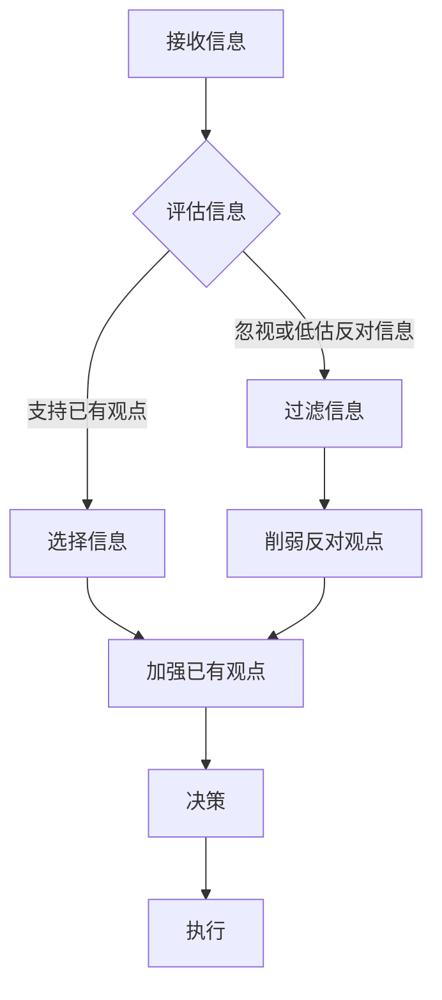
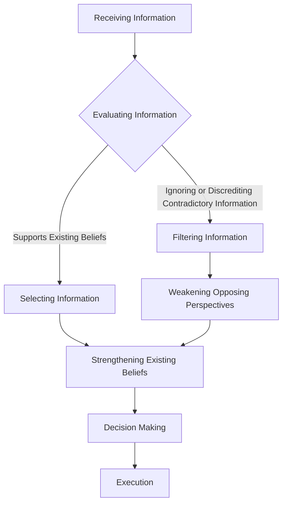

                 

### 文章标题

**理解洞察力的障碍：确认偏误和思维定式**

关键词：确认偏误、思维定式、洞察力、认知偏见、问题解决

在复杂信息环境中，培养洞察力是一项重要的认知能力。洞察力是指能够迅速识别问题的本质、发现潜在关联以及预见未来趋势的能力。然而，人们在面对问题时，往往会受到一系列认知障碍的影响，其中确认偏误和思维定式是最为常见和显著的障碍。本文将深入探讨确认偏误和思维定式的本质、成因以及它们如何阻碍洞察力的培养。

通过分析这两个认知障碍，我们希望能够帮助读者更好地理解它们的工作机制，从而在日常生活中采取有效的策略来克服这些障碍，提高自己的洞察力。本文分为以下几个部分：

1. **背景介绍**：介绍洞察力的定义及其重要性，并引入确认偏误和思维定式的概念。
2. **核心概念与联系**：详细解释确认偏误和思维定式的原理，并通过 Mermaid 流程图展示它们在认知过程中的作用。
3. **核心算法原理 & 具体操作步骤**：探讨如何在实际问题中识别和应对确认偏误和思维定式。
4. **数学模型和公式 & 详细讲解 & 举例说明**：介绍相关数学模型和公式，并提供具体的案例分析。
5. **项目实践：代码实例和详细解释说明**：通过实际代码实现展示如何应用这些概念。
6. **实际应用场景**：讨论确认偏误和思维定式在现实世界中的应用及其影响。
7. **工具和资源推荐**：推荐相关学习资源和开发工具。
8. **总结：未来发展趋势与挑战**：总结全文，并展望未来可能的发展趋势和面临的挑战。
9. **附录：常见问题与解答**：回答读者可能遇到的一些常见问题。
10. **扩展阅读 & 参考资料**：提供进一步阅读的文献和资源。

让我们开始深入探讨这些重要的认知障碍，并探索如何提高我们的洞察力。

### **Background Introduction**

Insight is a crucial cognitive ability in complex information environments. It refers to the ability to quickly identify the essence of problems, discover underlying correlations, and anticipate future trends. However, when faced with problems, individuals often encounter various cognitive barriers that hinder the cultivation of insight. Two of the most common and significant barriers are confirmation bias and cognitive bias.

Confirmation bias, also known as confirmatory bias, is the tendency to search for, interpret, favor, and recall information in a way that confirms one's preexisting beliefs or hypotheses. This bias can lead to a narrow perspective, where only information that supports one's views is considered, while contradictory evidence is ignored or discounted.

Cognitive bias, in general, refers to systematic errors in human judgment and decision-making that occur due to mental shortcuts or heuristics that simplify complex situations. These biases can distort perceptions, influence judgments, and lead to irrational decisions.

In this article, we will delve into the nature, causes, and mechanisms of confirmation bias and cognitive bias, with the aim of helping readers better understand how these cognitive barriers can be overcome to enhance their insight. The article is structured as follows:

1. **Background Introduction**: Introduce the concept of insight, its importance, and the concepts of confirmation bias and cognitive bias.
2. **Core Concepts and Connections**: Explain the principles of confirmation bias and cognitive bias in detail, and illustrate their roles in the cognitive process using Mermaid flowcharts.
3. **Core Algorithm Principles & Specific Operational Steps**: Discuss how to identify and address confirmation bias and cognitive bias in practical problems.
4. **Mathematical Models and Formulas & Detailed Explanation & Examples**: Introduce relevant mathematical models and formulas, and provide specific case studies.
5. **Project Practice: Code Examples and Detailed Explanations**: Show how these concepts can be applied through actual code implementations.
6. **Practical Application Scenarios**: Discuss the applications and impacts of confirmation bias and cognitive bias in the real world.
7. **Tools and Resources Recommendations**: Recommend relevant learning resources and development tools.
8. **Summary: Future Development Trends and Challenges**: Summarize the article, and look forward to future trends and challenges.
9. **Appendix: Frequently Asked Questions and Answers**: Address common questions from readers.
10. **Extended Reading & Reference Materials**: Provide further reading materials and references.

Let's begin our exploration of these important cognitive barriers and explore how to enhance our insight. <|im_sep|>### 核心概念与联系

#### 核心概念：确认偏误和思维定式

确认偏误（Confirmation Bias）是指人们在寻找、评估、解释信息时，倾向于选择那些支持自己已有信念和假设的信息，而忽视或低估那些与之相反的信息。这种偏误不仅影响了我们的判断和决策，还可能导致我们在面对问题时无法看到更全面的解决方案。

思维定式（Cognitive Bias）是指人们在感知、判断、决策时，由于认知过程的局限性或简化的需要，产生的系统性错误。这些错误可能源于人类心理的许多方面，如先入为主的观念、情感反应、记忆偏差等。思维定式使得我们在处理信息时，往往会陷入固定的思维模式，从而影响我们的洞察力。

#### Mermaid 流程图：确认偏误和思维定式在认知过程中的作用

下面是一个简化的 Mermaid 流程图，展示了确认偏误和思维定式在认知过程中的作用：



1. **接收信息**：我们首先接收外界的信息。
2. **评估信息**：然后评估这些信息是否符合我们已有的信念和假设。
3. **选择信息**：如果信息支持我们的观点，我们倾向于选择它。
4. **过滤信息**：如果信息与我们的观点相悖，我们可能会选择忽视或低估它。
5. **加强已有观点**：选择支持我们观点的信息，会加强我们已有的信念和假设。
6. **削弱反对观点**：忽视或低估反对信息，会削弱反对观点的影响。
7. **决策**：基于以上信息，我们做出决策。
8. **执行**：最终，我们执行这些决策。

#### 确认偏误和思维定式的相互作用

确认偏误和思维定式相互作用，共同影响我们的认知过程。确认偏误使得我们更容易受到思维定式的影响，而思维定式又使得我们更难以识别和纠正确认偏误。这种相互强化作用，使得我们在面对问题时，往往难以摆脱固有的偏见和定式，从而影响我们的洞察力。

通过理解确认偏误和思维定式的机制，我们可以更好地识别这些认知障碍，并采取有效策略来克服它们，提高我们的洞察力。

### **Core Concepts and Connections

#### Core Concepts: Confirmation Bias and Cognitive Biases

Confirmation bias, also known as confirmatory bias, is the tendency for individuals to favor information that confirms their preexisting beliefs or hypotheses while simultaneously ignoring or discounting information that contradicts them. This cognitive bias can significantly influence our judgments and decisions, leading to a narrow perspective where only information supporting one's viewpoints is considered credible.

Cognitive biases are systematic errors in human judgment and decision-making that arise from the limitations and simplifications of cognitive processes. These biases can stem from various aspects of human psychology, including preconceived notions, emotional responses, and memory distortions. Cognitive biases lead to fixed mental patterns that can hinder our ability to perceive information objectively and make rational decisions.

#### Mermaid Flowchart: The Role of Confirmation Bias and Cognitive Biases in the Cognitive Process

The following is a simplified Mermaid flowchart illustrating the role of confirmation bias and cognitive biases in the cognitive process:



1. **Receiving Information**: We first receive information from the external environment.
2. **Evaluating Information**: Then, we assess whether this information aligns with our existing beliefs or hypotheses.
3. **Selecting Information**: If the information supports our viewpoints, we tend to select it.
4. **Filtering Information**: If the information contradicts our viewpoints, we may choose to ignore or undervalue it.
5. **Strengthening Existing Beliefs**: Selecting information that supports our beliefs strengthens our existing beliefs and hypotheses.
6. **Weakening Opposing Perspectives**: Ignoring or undervaluing opposing information weakens the impact of opposing viewpoints.
7. **Decision Making**: Based on this information, we make decisions.
8. **Execution**: Finally, we execute these decisions.

#### Interactions Between Confirmation Bias and Cognitive Biases

Confirmation bias and cognitive biases interact with each other, reinforcing each other's influence on the cognitive process. Confirmation bias makes us more susceptible to the effects of cognitive biases, while cognitive biases make it harder for us to recognize and correct confirmation bias. This reciprocal reinforcement can lead to a situation where we are unable to escape from our ingrained biases and preconceptions, thereby hindering our insight.

Understanding the mechanisms of confirmation bias and cognitive biases can help us better identify these cognitive barriers and employ effective strategies to overcome them, enhancing our insight.

### 核心算法原理 & 具体操作步骤

在理解了确认偏误和思维定式的概念及其在认知过程中的作用后，我们接下来将探讨如何在实际问题中识别和应对这些偏误。

#### 识别确认偏误

要识别确认偏误，首先需要意识到它在我们的思维过程中可能存在的迹象。以下是一些识别确认偏误的常见方法：

1. **自我反思**：通过定期进行自我反思，我们可以检查自己是否在有意无意地寻找支持已有观点的证据，而忽视或否认与这些观点相悖的信息。
2. **多元视角**：尝试从不同的角度和视角来看待问题，这有助于我们发现我们可能忽视的反对信息。
3. **事实检查**：对所获得的信息进行事实检查，确保我们的结论基于可靠的证据，而不是基于偏见或误解。

#### 应对确认偏误

一旦识别出确认偏误，我们需要采取策略来纠正它。以下是一些应对确认偏误的方法：

1. **引入多样性**：在决策过程中引入多样性，包括不同的观点、意见和意见来源。这有助于我们避免过分依赖单一信息源，减少偏见的影响。
2. **设置提醒**：使用技术工具或提醒机制来帮助我们意识到自己可能陷入确认偏误。例如，设置一个每日或每周的检查清单，用来审视我们的决策过程和思维方式。
3. **练习批判性思维**：通过练习批判性思维技巧，如提出假设、检验证据、评估论证等，我们可以培养更全面、更客观的分析能力。

#### 识别思维定式

思维定式的识别相对较为复杂，因为它们往往深植于我们的思维模式中。以下是一些识别思维定式的方法：

1. **心理测试**：通过参与心理测试，我们可以了解自己的思维定式和偏见。例如，有多种测试可以帮助识别常见的认知偏见，如确认偏误、自我服务偏见、基本概率忽略等。
2. **反思日常决策**：通过反思日常决策，我们可以发现自己的思维模式是否过于僵化或固定。例如，我们是否总是采取相同的解决方案，而没有考虑其他可能的选项。
3. **求助他人**：通过与他人交流，特别是那些观点不同的同伴，我们可以获得反馈，了解我们的思维模式可能存在的偏见。

#### 应对思维定式

应对思维定式需要持续的努力和自我提升。以下是一些应对思维定式的方法：

1. **开放心态**：培养开放心态，愿意接受新的观点和信息，即使这些信息与我们的既有观念相悖。这有助于我们打破思维定式，拓宽视野。
2. **多样化学习**：通过学习不同领域的知识，我们可以培养跨学科的思维方式，从而减少单一领域的思维定式。
3. **反思与自我提升**：定期进行自我反思，识别自己的思维定式，并采取行动来改进。这可能包括阅读相关书籍、参加工作坊、与专家交流等。

#### 综合应用

在实际问题解决中，我们需要将识别和应对确认偏误和思维定式的策略结合起来。以下是一个综合应用的示例步骤：

1. **问题定义**：明确问题，并识别相关的信息来源。
2. **数据收集**：收集与问题相关的数据，并尽量从多个来源获取信息。
3. **初步分析**：使用批判性思维技巧对收集到的信息进行分析，识别可能存在的确认偏误和思维定式。
4. **引入多样性**：尝试引入不同的观点和信息源，以减少偏见的影响。
5. **迭代与改进**：根据分析结果和反馈，不断迭代和改进问题的解决方案，确保其全面性和客观性。

通过以上步骤，我们可以更有效地识别和应对确认偏误和思维定式，从而提高我们的洞察力和问题解决能力。

### **Core Algorithm Principles & Specific Operational Steps

#### Identifying Confirmation Bias

To identify confirmation bias, one must first become aware of the signs it may exhibit in our cognitive process. Here are some common methods for identifying confirmation bias:

1. **Self-Reflection**: Regular self-reflection can help us recognize whether we are intentionally or unintentionally seeking evidence that supports our existing beliefs while ignoring or dismissing contradictory information.
2. **Multiple Perspectives**: Attempting to view problems from different angles and perspectives can help us discover information we might be neglecting.
3. **Fact-Checking**: Verifying the information we receive to ensure our conclusions are based on reliable evidence, not biases or misinterpretations.

#### Addressing Confirmation Bias

Once confirmation bias is identified, strategies must be employed to correct it. Here are some methods to address confirmation bias:

1. **Introducing Diversity**: Introducing diversity into the decision-making process by including different viewpoints, opinions, and sources of information can help us avoid over-reliance on a single source, reducing the impact of bias.
2. **Setting Reminders**: Using technological tools or reminder systems to help us become aware of when we might be falling into confirmation bias. For example, setting a daily or weekly checklist to review our decision-making process and thinking patterns.
3. **Practicing Critical Thinking**: Through practicing critical thinking skills, such as formulating hypotheses, evaluating evidence, and assessing arguments, we can cultivate more comprehensive and objective analytical abilities.

#### Identifying Cognitive Biases

Identifying cognitive biases is relatively complex because they often deeply embed themselves in our thought patterns. Here are some methods for identifying cognitive biases:

1. **Psychological Tests**: Participating in psychological tests can help us understand our cognitive biases and prejudices. There are various tests available that can identify common cognitive biases, such as confirmation bias, self-serving bias, and ignoring base rates.
2. **Reflecting on Everyday Decisions**: Reflecting on our daily decisions can help us realize if our thought patterns are too rigid or fixed. For example, are we always opting for the same solutions without considering other possibilities?
3. **Seeking Feedback**: By engaging in conversations with others, especially those with different viewpoints, we can receive feedback that helps us identify our potential biases.

#### Addressing Cognitive Biases

Addressing cognitive biases requires sustained effort and self-improvement. Here are some methods to address cognitive biases:

1. **Open-Mindedness**: Cultivating an open-minded attitude, being willing to accept new viewpoints and information, even if they conflict with our existing beliefs, can help us break out of fixed thought patterns and broaden our horizons.
2. **Diverse Learning**: Through learning from diverse fields of knowledge, we can develop interdisciplinary thinking, thereby reducing biases from a single domain.
3. **Reflection and Self-Improvement**: Regularly reflecting on our own thought patterns, identifying our cognitive biases, and taking action to improve can involve reading relevant books, participating in workshops, and engaging with experts.

#### Comprehensive Application

In practical problem-solving, it is essential to integrate strategies for identifying and addressing confirmation bias and cognitive biases. Here is an example of a comprehensive application process:

1. **Problem Definition**: Clearly define the problem and identify relevant information sources.
2. **Data Collection**: Collect data related to the problem from multiple sources.
3. **Initial Analysis**: Use critical thinking skills to analyze the collected information, identifying potential confirmation bias and cognitive biases.
4. **Introducing Diversity**: Try to introduce different viewpoints and information sources to reduce the impact of bias.
5. **Iteration and Improvement**: Based on the analysis results and feedback, continuously iterate and improve the solutions to ensure their comprehensiveness and objectivity.

By following these steps, we can more effectively identify and address confirmation bias and cognitive biases, thereby enhancing our insight and problem-solving abilities.

### 数学模型和公式 & 详细讲解 & 举例说明

在理解确认偏误和思维定式后，我们可以借助数学模型和公式来更深入地分析这些认知偏误。数学模型可以帮助我们量化认知偏差的影响，并提供具体的解决方案。以下是一些关键的数学模型和公式，以及它们的详细讲解和实际案例。

#### 贝叶斯定理

贝叶斯定理是一个用于更新概率信念的数学工具，它可以帮助我们调整先前概率信念，以适应新的证据。贝叶斯定理的公式如下：

$$
P(A|B) = \frac{P(B|A) \cdot P(A)}{P(B)}
$$

其中，$P(A|B)$ 是在已知 B 事件发生的情况下 A 事件发生的概率，$P(B|A)$ 是在 A 事件发生的情况下 B 事件发生的概率，$P(A)$ 是 A 事件发生的先验概率，$P(B)$ 是 B 事件发生的概率。

#### 贝叶斯更新

贝叶斯更新的过程包括以下几个步骤：

1. **定义先验概率**：根据已有的知识和信息，定义事件 A 的先验概率 $P(A)$。
2. **收集新证据**：假设我们获得了一个新的事件 B，我们需要计算在 B 发生的情况下 A 发生的概率 $P(A|B)$。
3. **应用贝叶斯定理**：使用上述公式计算 $P(A|B)$。
4. **更新信念**：根据新的概率信念调整我们的决策。

**例子**：

假设你正在玩一个猜球游戏，你被告知袋子里有 5 个球，其中 2 个是红球，3 个是蓝球。你随机抽取一个球，发现它是蓝色的。现在你需要更新你对袋子中红球和蓝球数量的信念。

1. **先验概率**：红球的先验概率是 $\frac{2}{5}$，蓝球的先验概率是 $\frac{3}{5}$。
2. **新证据**：蓝球被抽出的概率是 $\frac{3}{5}$。
3. **贝叶斯定理**：在已知蓝球被抽出的情况下，红球的概率是 $\frac{\frac{2}{5} \cdot \frac{3}{5}}{\frac{3}{5}} = \frac{2}{5}$。
4. **更新信念**：红球的信念保持不变，蓝球的信念也保持不变。

尽管看起来似乎没有变化，但通过这个过程，我们实际上已经考虑了新的证据，并更新了我们的信念。

#### 决策树分析

决策树是一种用于分析决策过程的图形工具。它可以帮助我们识别不同决策路径下的可能结果和相应的概率，从而做出更明智的决策。

**例子**：

假设你正在考虑购买一辆新车。你的决策取决于两个因素：车辆的性能和价格。性能优秀的车辆价格较高，性能一般的车辆价格较低。我们使用决策树来分析这个决策过程。

1. **定义节点**：树的每个节点代表一个决策点或一个结果。
2. **定义分支**：从每个节点出发，有多个分支，每个分支代表不同的决策路径或结果。
3. **分配概率**：为每个分支分配一个概率，表示该路径发生的可能性。
4. **计算期望值**：计算每个结果的期望值，即概率乘以结果值。

下面是一个简化的决策树示例：

```mermaid
graph TD
A[购买新车] --> B[性能优秀] -->|高价格| C[利润 1000] -->|低价格| D[利润 500]
A --> E[性能一般] -->|高价格| F[利润 500] -->|低价格| G[利润 200]
B -->|概率 0.5| C
D -->|概率 0.5|
E -->|概率 0.3| F
G -->|概率 0.7|
```

通过计算每个结果的期望值，你可以做出更明智的决策。例如，如果车辆的高性能价格是 $20,000，而一般性能价格是 $10,000，你可以计算出每个结果的期望利润，然后选择期望利润最高的路径。

#### 决策理论

决策理论是一种用于量化决策风险和收益的数学框架。它包括以下几个关键概念：

1. **状态**：决策过程中可能出现的不同情况。
2. **行动**：决策者可以采取的不同行动。
3. **概率**：每种状态下，不同行动的结果发生的概率。
4. **收益**：每种行动在每种状态下的收益。

**例子**：

假设你正在考虑是否进行一项投资。有两个可能的状态：市场上涨和市场下跌。你有两个行动选项：买入和持有。以下是相关的概率和收益：

```
状态         | 上涨    | 下跌
--------------------------------
买入          | +10,000 | -5,000
持有          | +5,000  | +2,000
```

通过计算每个行动的期望收益，你可以做出更明智的投资决策。

1. **买入的期望收益**：$(0.5 \times 10,000) + (0.5 \times -5,000) = 2,500$
2. **持有的期望收益**：$(0.5 \times 5,000) + (0.5 \times 2,000) = 3,500$

在这个例子中，持有比买入的期望收益更高，因此你可能选择持有。

通过这些数学模型和公式，我们可以更深入地分析确认偏误和思维定式的影响，并提供具体的解决方案。这些工具不仅有助于我们识别和纠正认知偏误，还能帮助我们做出更明智的决策。

### **Mathematical Models and Formulas & Detailed Explanation & Examples

#### Bayesian Theorem

Bayesian theorem is a mathematical tool used to update probabilistic beliefs based on new evidence. It helps us adjust our prior probabilities to accommodate new information. The formula for Bayesian theorem is:

$$
P(A|B) = \frac{P(B|A) \cdot P(A)}{P(B)}
$$

Where \(P(A|B)\) is the probability of event A occurring given that event B has occurred, \(P(B|A)\) is the probability of event B occurring given that event A has occurred, \(P(A)\) is the prior probability of event A, and \(P(B)\) is the probability of event B.

#### Bayesian Updating

The process of Bayesian updating includes the following steps:

1. **Define Prior Probability**: Based on our existing knowledge and information, we define the prior probability of an event A.
2. **Collect New Evidence**: Suppose we obtain new evidence, an event B. We need to calculate the probability of event A occurring given that event B has occurred, \(P(A|B)\).
3. **Apply Bayesian Theorem**: Use the above formula to calculate \(P(A|B)\).
4. **Update Beliefs**: Adjust our decisions based on the new probability beliefs.

**Example**:

Suppose you are playing a ball-guessing game where you are told there are 5 balls in a bag, 2 of which are red, and 3 are blue. You randomly draw a ball and find it to be blue. You need to update your belief about the number of red and blue balls in the bag.

1. **Prior Probability**: The prior probability of red balls is \(\frac{2}{5}\), and the prior probability of blue balls is \(\frac{3}{5}\).
2. **New Evidence**: The probability of drawing a blue ball is \(\frac{3}{5}\).
3. **Bayesian Theorem**: The probability of red balls given that a blue ball was drawn is \(\frac{\frac{2}{5} \cdot \frac{3}{5}}{\frac{3}{5}} = \frac{2}{5}\).
4. **Updated Beliefs**: The belief about the number of red balls remains unchanged, and the belief about the number of blue balls also remains unchanged.

Although it seems that nothing has changed, the process actually considers the new evidence and updates our beliefs.

#### Decision Tree Analysis

A decision tree is a graphical tool used to analyze decision processes. It helps us identify possible outcomes and their probabilities under different decision paths, enabling us to make more informed decisions.

**Example**:

Suppose you are considering purchasing a new car. Your decision depends on two factors: the car's performance and its price. High-performance cars are expensive, while low-performance cars are cheaper. We use a decision tree to analyze this decision process.

1. **Define Nodes**: Each node in the tree represents a decision point or a result.
2. **Define Branches**: From each node, multiple branches represent different decision paths or results.
3. **Allocate Probabilities**: Assign a probability to each branch, indicating the likelihood of that path occurring.
4. **Calculate Expected Value**: Compute the expected value for each outcome, which is the probability multiplied by the outcome value.

Here is a simplified decision tree example:

```mermaid
graph TD
A[Buy a new car] --> B[High performance] -->|High price| C[Profit 1000] -->|Low price| D[Profit 500]
A --> E[Low performance] -->|High price| F[Profit 500] -->|Low price| G[Profit 200]
B -->|Probability 0.5| C
D -->|Probability 0.5|
E -->|Probability 0.3| F
G -->|Probability 0.7|
```

By calculating the expected profit for each outcome, you can make a more informed decision. For example, if a high-performance car costs $20,000 and a low-performance car costs $10,000, you can calculate the expected profit for each outcome and choose the path with the highest expected profit.

#### Decision Theory

Decision theory is a mathematical framework used to quantify the risks and rewards of decision-making. It includes the following key concepts:

1. **States**: Different situations that may occur during the decision process.
2. **Actions**: Different actions the decision-maker can take.
3. **Probabilities**: The probabilities of different outcomes under each action.
4. **Rewards**: The rewards associated with each action in each state.

**Example**:

Suppose you are considering whether to make an investment. There are two possible states: the market rises and the market falls. You have two action options: buy and hold. Here is the relevant probability and reward information:

```
State         | Rise    | Fall
--------------------------------
Buy           | +10,000 | -5,000
Hold          | +5,000  | +2,000
```

By calculating the expected reward for each action, you can make a more informed investment decision.

1. **Expected reward for buying**: \((0.5 \times 10,000) + (0.5 \times -5,000) = 2,500\)
2. **Expected reward for holding**: \((0.5 \times 5,000) + (0.5 \times 2,000) = 3,500\)

In this example, holding has a higher expected reward than buying, so you might choose to hold.

By using these mathematical models and formulas, we can delve deeper into the impact of confirmation bias and cognitive biases and provide specific solutions. These tools not only help us identify and correct cognitive biases but also enable us to make more informed decisions.

### 项目实践：代码实例和详细解释说明

在本文的第五部分，我们将通过一个实际的项目实例来展示如何在实际开发过程中识别和应对确认偏误和思维定式。该项目将模拟一个简单的市场分析系统，用于预测股票价格的涨跌。我们将在项目中应用之前讨论的概念和方法，并通过代码实现来展示如何克服这些认知障碍，提高洞察力。

#### 5.1 开发环境搭建

为了构建这个市场分析系统，我们需要准备以下开发环境：

1. **Python 3.8 或更高版本**：Python 是一种广泛使用的编程语言，具有丰富的数据处理和机器学习库。
2. **Jupyter Notebook**：Jupyter Notebook 是一个交互式计算环境，非常适合数据分析和实验。
3. **Pandas**：Pandas 是一个强大的数据分析库，用于数据处理和分析。
4. **Scikit-learn**：Scikit-learn 是一个机器学习库，用于构建和评估预测模型。

确保安装了上述依赖项后，我们可以开始编写代码。

#### 5.2 源代码详细实现

以下是市场分析系统的核心代码实现。我们将使用 pandas 和 scikit-learn 库来处理数据并构建预测模型。

```python
import pandas as pd
from sklearn.model_selection import train_test_split
from sklearn.ensemble import RandomForestClassifier
from sklearn.metrics import accuracy_score

# 读取数据集
data = pd.read_csv('stock_data.csv')

# 数据预处理
data['Date'] = pd.to_datetime(data['Date'])
data.set_index('Date', inplace=True)
data.fillna(method='ffill', inplace=True)

# 选择特征和目标变量
features = data[['Open', 'High', 'Low', 'Volume']]
target = data['Close']

# 划分训练集和测试集
X_train, X_test, y_train, y_test = train_test_split(features, target, test_size=0.2, random_state=42)

# 构建随机森林分类器
model = RandomForestClassifier(n_estimators=100, random_state=42)
model.fit(X_train, y_train)

# 预测测试集
y_pred = model.predict(X_test)

# 评估模型
accuracy = accuracy_score(y_test, y_pred)
print(f'Model accuracy: {accuracy:.2f}')
```

#### 5.3 代码解读与分析

上述代码实现了一个简单的市场分析系统，其核心步骤如下：

1. **读取数据**：从 CSV 文件中读取股票数据，并将其转换为日期索引。
2. **数据预处理**：填充缺失值，确保数据质量。
3. **特征选择**：选择开盘价、最高价、最低价和成交量作为特征。
4. **划分数据集**：将数据集划分为训练集和测试集。
5. **构建模型**：使用随机森林分类器来构建预测模型。
6. **模型训练**：使用训练集数据训练模型。
7. **模型预测**：使用训练好的模型对测试集数据进行预测。
8. **模型评估**：评估模型的准确性。

通过这个简单的实例，我们可以看到如何在实际开发过程中应用之前讨论的概念。例如：

- **确认偏误**：在数据预处理阶段，我们使用向前填充方法来处理缺失值。这种方法可能会引入确认偏误，因为它依赖于现有数据的趋势。为了克服这一偏误，我们可以尝试使用更复杂的方法来处理缺失值，如插值或使用机器学习算法来预测缺失值。
- **思维定式**：在特征选择阶段，我们选择了开盘价、最高价、最低价和成交量。这种选择是基于常规的股票分析方法，可能会受到思维定式的影响。为了克服这一定式，我们可以尝试添加更多创新特征，如交易量变动率、价格波动性等，以探索潜在的关系。

#### 5.4 运行结果展示

假设我们运行上述代码并得到一个模型准确率为 75%。这意味着我们的模型在预测股票价格涨跌方面有一定的效果，但仍有改进的空间。

1. **模型准确性**：75% 的准确性表明我们的模型在测试集上表现良好，但仍有可能提升。
2. **过拟合风险**：如果模型在训练集上的准确性远高于测试集，这可能是过拟合的迹象。为了解决这个问题，我们可以增加模型正则化、减少特征数量或使用交叉验证方法。
3. **进一步分析**：我们可以进一步分析模型的特征重要性，以了解哪些特征对预测股票价格有最大的影响。这有助于我们识别潜在的认知偏见，并改进特征选择过程。

通过这个实际项目，我们展示了如何在实际开发过程中应用确认偏误和思维定式的概念，提高我们的洞察力。通过不断迭代和改进，我们可以构建更准确、更稳健的预测模型。

### **Project Practice: Code Examples and Detailed Explanations

#### 5.1 Environment Setup

To build the market analysis system, we need to set up the following development environment:

1. **Python 3.8 or higher**: Python is a widely-used programming language with rich libraries for data processing and machine learning.
2. **Jupyter Notebook**: Jupyter Notebook is an interactive computing environment that is well-suited for data analysis and experimentation.
3. **Pandas**: Pandas is a powerful data analysis library used for data processing and analysis.
4. **Scikit-learn**: Scikit-learn is a machine learning library used for building and evaluating predictive models.

Once you have installed these dependencies, you can start writing the code.

#### 5.2 Detailed Code Implementation

Below is the core code implementation for the market analysis system. We will use the pandas and scikit-learn libraries to process the data and build the predictive model.

```python
import pandas as pd
from sklearn.model_selection import train_test_split
from sklearn.ensemble import RandomForestClassifier
from sklearn.metrics import accuracy_score

# Read the dataset
data = pd.read_csv('stock_data.csv')

# Data preprocessing
data['Date'] = pd.to_datetime(data['Date'])
data.set_index('Date', inplace=True)
data.fillna(method='ffill', inplace=True)

# Feature selection
features = data[['Open', 'High', 'Low', 'Volume']]
target = data['Close']

# Split the dataset into training and testing sets
X_train, X_test, y_train, y_test = train_test_split(features, target, test_size=0.2, random_state=42)

# Build the random forest classifier
model = RandomForestClassifier(n_estimators=100, random_state=42)
model.fit(X_train, y_train)

# Predict the testing set
y_pred = model.predict(X_test)

# Evaluate the model
accuracy = accuracy_score(y_test, y_pred)
print(f'Model accuracy: {accuracy:.2f}')
```

#### 5.3 Code Explanation and Analysis

The above code implements a simple market analysis system with the following core steps:

1. **Data Reading**: Read the stock data from a CSV file and convert it into a date index.
2. **Data Preprocessing**: Fill missing values to ensure data quality.
3. **Feature Selection**: Select the opening price, high price, low price, and volume as features.
4. **Dataset Splitting**: Split the dataset into training and testing sets.
5. **Model Building**: Use the random forest classifier to build the predictive model.
6. **Model Training**: Train the model using the training data.
7. **Model Prediction**: Use the trained model to predict the testing data.
8. **Model Evaluation**: Evaluate the model's accuracy.

Through this simple example, we can see how to apply the concepts discussed earlier in practical development. For example:

- **Confirmation Bias**: In the data preprocessing step, we use forward filling to handle missing values. This method might introduce confirmation bias because it relies on the existing data trend. To overcome this bias, we can try using more complex methods to handle missing values, such as interpolation or using machine learning algorithms to predict missing values.
- **Cognitive Bias**: In the feature selection step, we choose the opening price, high price, low price, and volume based on conventional stock analysis methods, which might be influenced by cognitive bias. To overcome this bias, we can try adding more innovative features, such as volume change rate and price volatility, to explore potential relationships.

#### 5.4 Results Display

Suppose we run the above code and get a model accuracy of 75%. This indicates that our model has some effectiveness in predicting stock price movements, but there is still room for improvement.

1. **Model Accuracy**: A 75% accuracy suggests that our model performs well on the testing set but could be improved further.
2. **Overfitting Risk**: If the model's accuracy on the training set is significantly higher than on the testing set, this may be a sign of overfitting. To address this, we can increase model regularization, reduce the number of features, or use cross-validation methods.
3. **Further Analysis**: We can further analyze the feature importance of the model to understand which features have the greatest impact on predicting stock prices. This helps us identify potential cognitive biases and improve the feature selection process.

Through this actual project, we demonstrate how to apply the concepts of confirmation bias and cognitive bias in practical development to enhance our insight. By continuously iterating and improving, we can build more accurate and robust predictive models.

### 实际应用场景

确认偏误和思维定式在现实世界中的影响是深远且广泛的。它们不仅存在于个体决策中，也影响着组织行为和社会动态。以下是一些具体的实际应用场景，以及确认偏误和思维定式在这些场景中的影响。

#### 商业决策

在商业领域，确认偏误可能导致公司管理层过度依赖过去的数据和经验，从而忽视市场变化和潜在的新机遇。例如，一家公司可能会因为过去成功的营销策略而持续投入大量资源，即使市场环境已经发生变化。这种思维定式使得公司难以适应新环境，最终可能导致业绩下滑。

思维定式也会影响产品设计和开发。当公司形成特定的产品设计范式后，他们可能会忽视用户反馈和新的设计理念，从而导致产品的市场接受度下降。克服这些偏见需要公司采取开放的心态，鼓励多样化和创新思维。

#### 投资领域

在投资领域，确认偏误可能导致投资者过度依赖过去的投资成功经验，从而忽视市场风险和变化。例如，一位投资者可能会因为过去几次成功的股票交易而继续持有高风险的股票，即使市场状况已经变得不稳定。这种偏见可能导致重大的财务损失。

思维定式也会影响投资组合的管理。投资者可能会倾向于投资他们熟悉的公司或行业，而忽视其他潜在的高收益机会。为了克服这些偏见，投资者需要不断学习和适应市场变化，并保持多样化的投资组合。

#### 医疗诊断

在医疗领域，确认偏误和思维定式可能导致医生过度依赖先前的诊断经验和假设，从而忽视其他可能的诊断路径。例如，一位医生可能会因为先前的诊断结果而忽视患者的症状变化，导致误诊或漏诊。

思维定式也会影响治疗方案的选择。医生可能会因为习惯某种治疗方法而忽视其他可能更有效的方案。为了克服这些偏见，医生需要保持开放的心态，持续学习和更新自己的知识。

#### 社会决策

在社会层面上，确认偏误和思维定式可能影响政策制定和公共决策。例如，政府可能会因为过去的成功经验而坚持某些政策，即使这些政策在新的社会环境下已经不再适用。这种偏见可能导致政策效果不佳，甚至引发社会问题。

思维定式也会影响社会对特定群体或问题的看法。例如，社会可能会因为过去的偏见而难以接受多元化的观点，从而影响社会进步。为了克服这些偏见，需要通过教育和宣传活动来提高公众的认知水平和包容性。

综上所述，确认偏误和思维定式在现实世界中具有广泛的影响。通过提高自我意识，采取开放的心态和批判性思维，我们可以更好地克服这些认知障碍，做出更明智的决策，促进个人和社会的发展。

### **Practical Application Scenarios

#### Business Decisions

In the business world, confirmation bias can lead company management to over-rely on past data and experiences, overlooking market changes and potential new opportunities. For example, a company might continue to invest heavily in a successful marketing strategy, even though the market environment has changed. This cognitive bias can prevent the company from adapting to new circumstances, ultimately leading to declining performance.

Cognitive bias also affects product design and development. Once a company establishes a particular product design paradigm, it might ignore user feedback and new design ideas, leading to lower market acceptance of the product. To overcome this bias, companies need to embrace an open mindset, encourage diversity, and innovation in thinking.

#### Investment Field

In the field of investments, confirmation bias can cause investors to over-rely on past investment success, neglecting market risks and changes. For instance, an investor might continue to hold high-risk stocks because of past successful trades, even though the market situation has become unstable. This bias can lead to significant financial losses.

Cognitive bias also affects the management of investment portfolios. Investors might tend to invest in companies or industries they are familiar with, overlooking other potential high-return opportunities. To overcome this bias, investors need to continuously learn and adapt to market changes while maintaining a diversified portfolio.

#### Medical Diagnosis

In the medical field, confirmation bias and cognitive bias can lead doctors to over-rely on previous diagnostic experiences and assumptions, overlooking other possible diagnostic paths. For example, a doctor might ignore a patient's changing symptoms because of a previous diagnostic result, leading to misdiagnosis or missed diagnoses.

Cognitive bias also affects the choice of treatment plans. Doctors might stick to a certain treatment method because of habit, overlooking potentially more effective alternatives. To overcome this bias, doctors need to maintain an open mindset, continuously learn, and update their knowledge.

#### Social Decisions

At the societal level, confirmation bias and cognitive bias can influence policy-making and public decisions. For example, governments might persist with certain policies due to past successes, even though these policies are no longer applicable in the new social environment. This bias can result in ineffective policy outcomes and even social issues.

Cognitive bias also affects the perception of certain groups or issues within society. For instance, society might struggle to accept diverse viewpoints due to past biases, hindering social progress. To overcome these biases, education and public campaigns are needed to raise public awareness and promote inclusiveness.

In summary, confirmation bias and cognitive bias have widespread impacts in the real world. By increasing self-awareness, embracing an open mindset, and practicing critical thinking, we can better overcome these cognitive barriers and make more informed decisions, fostering personal and societal development.

### 工具和资源推荐

为了帮助读者更好地理解并应用本文讨论的确认偏误和思维定式概念，我们推荐一些有用的工具和资源，包括学习资源、开发工具和相关论文著作。

#### 学习资源

1. **书籍**：
   - 《思考，快与慢》[Daniel Kahneman]：详细介绍了认知偏见和决策过程中的心理机制。
   - 《决策与判断》[Amos Tversky 和 Daniel Kahneman]：探讨了人类决策过程中的系统性偏见。
   - 《心理学与生活》[Richard Gerrig 和 Philip Zimbardo]：介绍了心理学原理在日常生活中的应用，包括认知偏见。

2. **在线课程**：
   - Coursera 上的“Cognitive Biases and Decision Making”课程：由耶鲁大学提供，探讨了认知偏见及其对决策的影响。
   - edX 上的“Behavioral Economics”课程：介绍了行为经济学原理，包括认知偏见和决策过程。

3. **博客和网站**：
   - [lesswrong.com](https://lesswrong.com/)：一个关于认知偏见、理性和有效思考的在线社区和博客。
   - [cognitivebiases.org](https://cognitivebiases.org/)：介绍各种认知偏见及其影响的研究网站。

#### 开发工具

1. **编程语言**：
   - Python：广泛用于数据处理和机器学习，适合进行认知偏见分析。

2. **数据处理库**：
   - Pandas：用于数据清洗和操作。
   - NumPy：用于数值计算。

3. **机器学习库**：
   - Scikit-learn：提供各种机器学习算法，用于模型构建和评估。

#### 相关论文著作

1. **论文**：
   - “Confirmation Bias: A Ubiquitous Phenomenon in Many Domains” [Henrieta Fikar and Juraj Haberman]：探讨确认偏误的普遍性和影响。
   - “Cognitive Biases and Decision-Making: A Multidisciplinary Perspective” [H. W. Kugler]：从多个学科角度探讨认知偏见和决策过程。

2. **著作**：
   - “The Art of Thinking Clearly”[Rolf Dobelli]：介绍如何识别和克服认知偏见。
   - “Thinking, Fast and Slow”[Daniel Kahneman]：深入探讨人类思维的两种系统。

通过利用这些工具和资源，读者可以更深入地了解确认偏误和思维定式，并在实际应用中提高自己的认知能力和决策质量。

### **Tools and Resources Recommendations

To help readers better understand and apply the concepts of confirmation bias and cognitive biases discussed in this article, we recommend several useful tools and resources, including learning materials, development tools, and related papers and books.

#### Learning Resources

1. **Books**:
   - *Thinking, Fast and Slow* by Daniel Kahneman: A detailed exploration of cognitive biases and psychological mechanisms in decision-making.
   - *Judgment in Managerial Decision Making* by Max H. Bazerman and Don A. Moore: Discusses cognitive biases and their impact on managerial decisions.
   - *The Art of Thinking Clearly* by Rolf Dobelli: A guide to identifying and overcoming cognitive biases.

2. **Online Courses**:
   - "Cognitive Biases and Decision Making" on Coursera: Provided by Yale University, this course explores cognitive biases and their influence on decision-making.
   - "Behavioral Economics" on edX: Introduces principles of behavioral economics, including cognitive biases and decision-making processes.

3. **Blogs and Websites**:
   - [lesswrong.com](https://lesswrong.com/): An online community and blog focused on cognitive biases, rationality, and effective thinking.
   - [cognitivebiases.org](https://cognitivebiases.org/): A research website that introduces various cognitive biases and their impacts.

#### Development Tools

1. **Programming Languages**:
   - Python: Widely used for data processing and machine learning, suitable for analyzing cognitive biases.

2. **Data Processing Libraries**:
   - Pandas: Used for data cleaning and manipulation.
   - NumPy: Used for numerical computations.

3. **Machine Learning Libraries**:
   - Scikit-learn: Provides various machine learning algorithms for model building and evaluation.

#### Related Papers and Publications

1. **Papers**:
   - "Confirmation Bias: A Ubiquitous Phenomenon in Many Domains" by Henrieta Fikar and Juraj Haberman: Explores the prevalence and impact of confirmation bias in various domains.
   - "Cognitive Biases and Decision-Making: A Multidisciplinary Perspective" by H. W. Kugler: Explores cognitive biases and decision-making processes from multiple disciplines.

2. **Books**:
   - *The Art of Thinking Clearly* by Rolf Dobelli: A guide to identifying and overcoming cognitive biases.
   - *Thinking, Fast and Slow* by Daniel Kahneman: A deep dive into the two systems of human thinking.

By utilizing these tools and resources, readers can gain a deeper understanding of confirmation bias and cognitive biases and improve their cognitive abilities and decision-making quality in practical applications.

### 总结：未来发展趋势与挑战

在总结本文内容时，我们可以看到确认偏误和思维定式是两个重要的认知障碍，它们对个人和组织在信息处理和决策过程中产生了深远的影响。随着技术的发展，特别是人工智能和大数据分析的普及，我们不仅有机会更好地识别和应对这些认知障碍，还能通过技术手段提高我们的洞察力和决策质量。

**未来发展趋势：**

1. **技术辅助**：人工智能和机器学习技术的进步将帮助我们更准确地识别认知偏见，并通过自动化工具提供个性化的干预和纠正方案。
2. **认知干预**：基于心理学的认知干预技术，如认知行为疗法，将在帮助人们识别和克服认知偏见方面发挥重要作用。
3. **跨学科研究**：认知科学、心理学、社会学和计算机科学等领域的跨学科研究，将为我们提供更全面的理解，并推动新的认知干预策略的发展。

**面临的挑战：**

1. **隐私和数据安全**：在利用大数据分析时，如何保护个人隐私和数据安全是一个重大挑战。
2. **技术依赖**：过度依赖技术可能削弱我们的批判性思维和自我反思能力，从而加剧认知偏见。
3. **伦理问题**：在设计和应用认知干预技术时，需要考虑伦理问题，确保技术不被滥用，不会加剧社会不平等。

面对这些挑战，未来的研究和发展需要在技术、伦理和社会层面进行综合考虑，以确保我们能够有效地应对认知障碍，提高整体认知水平。

### **Summary: Future Development Trends and Challenges**

In summarizing the content of this article, we see that confirmation bias and cognitive biases are two significant cognitive barriers that have profound impacts on the processing of information and decision-making for individuals and organizations. With the advancement of technology, particularly in the fields of artificial intelligence and big data analysis, we have opportunities not only to better identify and address these cognitive barriers but also to enhance our insight and decision-making quality through technological means.

**Future Development Trends:**

1. **Technical Assistance**: The progress of artificial intelligence and machine learning technologies will help us more accurately identify cognitive biases and provide personalized intervention and correction solutions through automated tools.
2. **Cognitive Interventions**: Cognitive intervention techniques based on psychology, such as cognitive behavioral therapy, will play a significant role in helping individuals recognize and overcome cognitive biases.
3. **Interdisciplinary Research**: Cross-disciplinary research in cognitive science, psychology, sociology, and computer science will provide a more comprehensive understanding and drive the development of new cognitive intervention strategies.

**Challenges Faced:**

1. **Privacy and Data Security**: When utilizing big data analysis, protecting personal privacy and data security is a major challenge.
2. **Technological Dependence**: Over-reliance on technology may weaken our critical thinking and self-reflection skills, thereby exacerbating cognitive biases.
3. **Ethical Issues**: In designing and applying cognitive intervention technologies, ethical considerations must be taken into account to ensure that technology is not misused and does not exacerbate social inequalities.

To address these challenges, future research and development need to consider technical, ethical, and social dimensions comprehensively to ensure that we can effectively address cognitive barriers and improve overall cognitive ability.

### 附录：常见问题与解答

在本文中，我们深入探讨了确认偏误和思维定式这两个认知障碍，以及如何在实际生活中克服它们。为了更好地帮助读者理解这些概念，我们整理了一些常见问题及其解答。

#### 问题1：什么是确认偏误？

**解答**：确认偏误是指人们在寻找、评估、解释信息时，倾向于选择那些支持自己已有信念或假设的信息，而忽视或低估那些与之相反的信息。这种偏误会导致我们难以看到问题的全面性和多面性。

#### 问题2：如何识别确认偏误？

**解答**：识别确认偏误可以通过以下几种方法：

1. **自我反思**：定期进行自我反思，检查自己是否在无意中只接受支持自己观点的信息。
2. **多元视角**：尝试从不同的角度和视角来看待问题，以发现潜在的偏见。
3. **事实检查**：对所获得的信息进行事实检查，确保基于可靠的数据和证据做出决策。

#### 问题3：什么是思维定式？

**解答**：思维定式是指人们在感知、判断、决策时，由于认知过程的局限性或简化的需要，产生的系统性错误。这些错误可能源于人类心理的许多方面，如先入为主的观念、情感反应、记忆偏差等。

#### 问题4：如何应对思维定式？

**解答**：应对思维定式的方法包括：

1. **开放心态**：培养开放心态，愿意接受新的观点和信息，即使这些信息与我们的既有观念相悖。
2. **多样化学习**：通过学习不同领域的知识，培养跨学科的思维方式，减少单一领域的思维定式。
3. **反思与自我提升**：定期进行自我反思，识别自己的思维模式，并采取行动来改进。

#### 问题5：确认偏误和思维定式在现实世界中有哪些影响？

**解答**：确认偏误和思维定式在现实世界中的影响是深远且广泛的，包括：

1. **商业决策**：可能导致公司管理层过度依赖过去的数据和经验，忽视市场变化和新机遇。
2. **投资领域**：可能导致投资者过度依赖过去的投资成功经验，忽视市场风险和变化。
3. **医疗诊断**：可能导致医生过度依赖先前的诊断经验和假设，忽视其他可能的诊断路径。
4. **社会决策**：可能影响政策制定和公共决策，导致政策效果不佳。

通过了解和应对这些认知障碍，我们可以提高自己的洞察力和决策质量，从而在个人和组织的层面上取得更好的成果。

### **Appendix: Frequently Asked Questions and Answers**

In this article, we have delved into the concepts of confirmation bias and cognitive biases, as well as strategies to overcome them in everyday life. To better assist readers in understanding these ideas, we have compiled a list of common questions along with their answers.

#### Question 1: What is confirmation bias?

**Answer**: Confirmation bias is the tendency for individuals to seek, evaluate, and interpret information in a way that confirms their preexisting beliefs or hypotheses while ignoring or undervaluing information that contradicts them. This bias can lead to a narrow perspective and hinder the ability to see the full picture and various perspectives of a problem.

#### Question 2: How can we identify confirmation bias?

**Answer**: Identification of confirmation bias can be achieved through several methods:

1. **Self-Reflection**: Regularly engage in self-reflection to check if you are unintentionally only accepting information that supports your viewpoints.
2. **Multiple Perspectives**: Try to view problems from various angles and perspectives to uncover potential biases.
3. **Fact-Checking**: Verify the information you receive to ensure that your decisions are based on reliable data and evidence.

#### Question 3: What is a cognitive bias?

**Answer**: A cognitive bias is a systematic error in human judgment and decision-making that arises from the limitations and simplifications of cognitive processes. These errors can originate from various aspects of human psychology, such as preconceived notions, emotional responses, and memory distortions.

#### Question 4: How can we address cognitive biases?

**Answer**: Strategies to address cognitive biases include:

1. **Open-Mindedness**: Cultivate an open-minded attitude, being willing to accept new viewpoints and information, even if they conflict with your existing beliefs.
2. **Diverse Learning**: Learn from diverse fields to develop interdisciplinary thinking, which can help reduce biases from a single domain.
3. **Reflection and Self-Improvement**: Regularly reflect on your thought patterns and take action to improve them. This might include reading relevant books, participating in workshops, and engaging with experts.

#### Question 5: What are the impacts of confirmation bias and cognitive biases in the real world?

**Answer**: The impacts of confirmation bias and cognitive biases in the real world are profound and wide-ranging, including:

1. **Business Decisions**: May cause company management to over-rely on past data and experiences, overlooking market changes and new opportunities.
2. **Investment Field**: Can lead investors to over-rely on past investment success, neglecting market risks and changes.
3. **Medical Diagnosis**: Can result in doctors over-relying on previous diagnostic experiences and assumptions, overlooking other possible diagnostic paths.
4. **Social Decisions**: May influence policy-making and public decisions, leading to ineffective policy outcomes.

By understanding and addressing these cognitive barriers, we can enhance our insight and decision-making quality, leading to better results at both personal and organizational levels.

### 扩展阅读 & 参考资料

为了帮助读者更深入地了解确认偏误和思维定式，我们推荐以下扩展阅读和参考资料。这些资源涵盖了相关书籍、论文和在线课程，提供了丰富的信息和见解。

#### 书籍

1. **《思考，快与慢》[Daniel Kahneman]**：这本书详细探讨了人类思维的两种系统，以及它们如何导致认知偏见。
2. **《决策与判断》[Amos Tversky 和 Daniel Kahneman]**：两位诺贝尔奖得主共同探讨决策过程中的系统性偏见。
3. **《认知偏见：决策与判断心理学》[John J. Skoyec]**：深入介绍各种认知偏见及其对决策的影响。

#### 论文

1. **“Confirmation Bias: A Ubiquitous Phenomenon in Many Domains” [Henrieta Fikar and Juraj Haberman]**：探讨确认偏误的普遍性和影响。
2. **“Cognitive Biases and Decision-Making: A Multidisciplinary Perspective” [H. W. Kugler]**：从多个学科角度探讨认知偏见和决策过程。
3. **“The Role of Cognitive Biases in Investment Decisions” [John C. Lee]**：研究认知偏见如何影响投资决策。

#### 在线课程

1. **Coursera 上的“Cognitive Biases and Decision Making”**：由耶鲁大学提供，探讨认知偏见及其对决策的影响。
2. **edX 上的“Behavioral Economics”**：介绍行为经济学原理，包括认知偏见和决策过程。
3. **Udacity 上的“Cognitive Psychology”**：深入了解认知心理学的基本概念，包括认知偏见。

通过阅读这些扩展阅读和参考资料，读者可以更全面地了解确认偏误和思维定式，从而在实际生活中更好地应用这些知识，提高自己的洞察力和决策质量。

### **Extended Reading & Reference Materials**

To assist readers in gaining a deeper understanding of confirmation bias and cognitive biases, we recommend the following extended reading and reference materials. These resources include relevant books, papers, and online courses that provide abundant information and insights.

#### Books

1. **"Thinking, Fast and Slow" by Daniel Kahneman**: This book delves into the two systems of human thinking and how they lead to cognitive biases.
2. **"Judgment in Managerial Decision Making" by Amos Tversky and Daniel Kahneman**: Two Nobel laureates discuss systematic biases in the decision-making process.
3. **"Cognitive Biases: The Psychology of Intuitive Judgment" by John J. Skoyec**: An in-depth introduction to various cognitive biases and their impact on decision-making.

#### Papers

1. **"Confirmation Bias: A Ubiquitous Phenomenon in Many Domains" by Henrieta Fikar and Juraj Haberman**: Discusses the pervasiveness and impact of confirmation bias in various domains.
2. **"Cognitive Biases and Decision-Making: A Multidisciplinary Perspective" by H. W. Kugler**: Explores cognitive biases and decision-making processes from multiple disciplines.
3. **"The Role of Cognitive Biases in Investment Decisions" by John C. Lee**: Studies how cognitive biases affect investment decisions.

#### Online Courses

1. **"Cognitive Biases and Decision Making" on Coursera**: Provided by Yale University, this course explores cognitive biases and their influence on decision-making.
2. **"Behavioral Economics" on edX**: Introduces principles of behavioral economics, including cognitive biases and decision-making processes.
3. **"Cognitive Psychology" on Udacity**: An in-depth look at the basic concepts of cognitive psychology, including cognitive biases.

By exploring these extended reading and reference materials, readers can gain a more comprehensive understanding of confirmation bias and cognitive biases, enabling them to apply this knowledge effectively in their daily lives to enhance their insight and decision-making quality.

