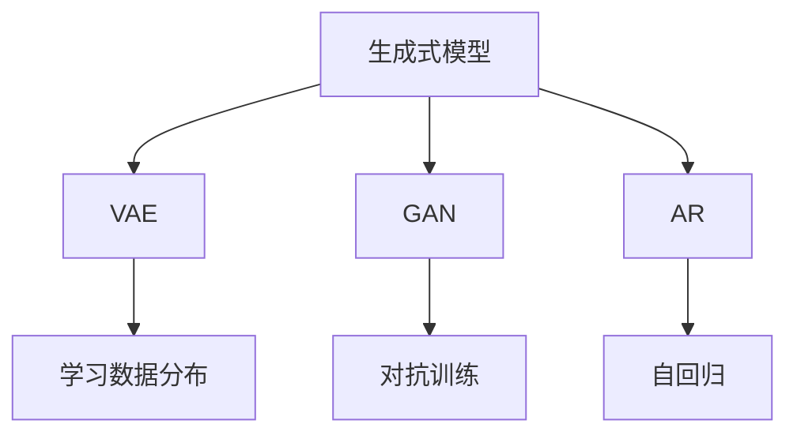
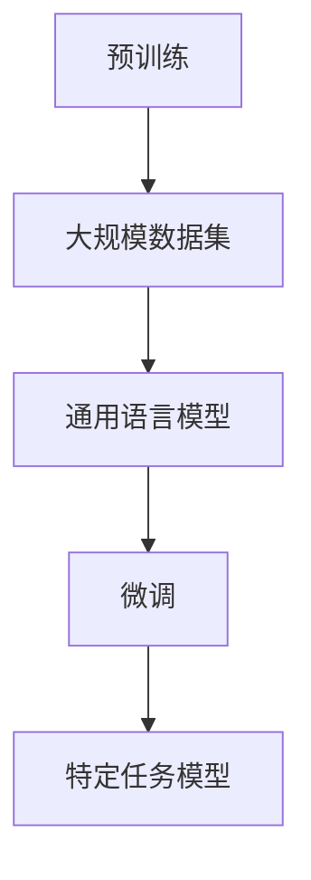
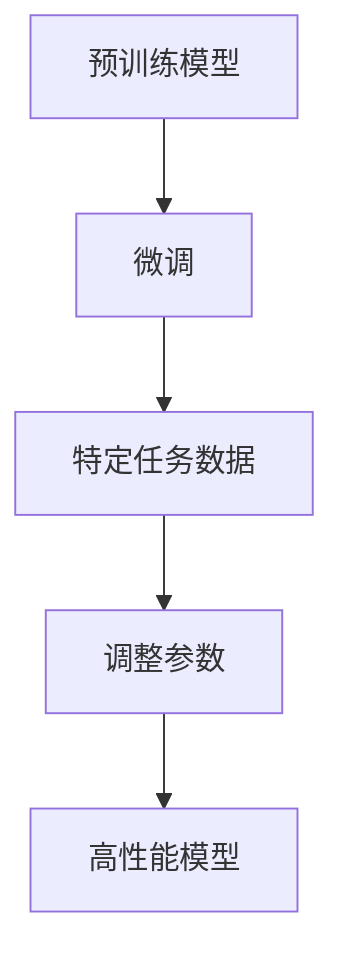

                 

# 生成式AIGC：从概念验证到大规模应用

## 关键词
- 生成式AI
- AIGC
- 概念验证
- 大规模应用
- AI模型

## 摘要
本文将探讨生成式人工智能（AIGC）的概念、原理及其从概念验证到大规模应用的发展过程。我们将详细介绍AIGC的核心技术，包括生成模型、预训练和微调等，并通过实际案例展示其在各种领域的应用效果。

## 1. 背景介绍（Background Introduction）

生成式人工智能（AIGC，Artificial Intelligence Generated Content）是指利用人工智能技术生成文字、图片、音频、视频等内容的一种新型技术。与传统的基于规则的AI系统不同，AIGC能够通过学习大量的数据，自动生成新的内容，具有极高的创造性和灵活性。

AIGC技术的发展可以追溯到深度学习的兴起。深度学习技术使得计算机能够从大量数据中学习模式和规律，进而进行自主生成。近年来，随着计算能力的提升和大数据技术的发展，AIGC在各个领域取得了显著的成果，从简单的文字生成到复杂的图像和视频生成，AIGC展现出了巨大的潜力。

## 2. 核心概念与联系（Core Concepts and Connections）

### 2.1 生成式模型（Generative Models）

生成式模型是AIGC的核心技术之一。它们通过学习大量数据，捕捉数据中的分布信息，从而生成新的数据。常见的生成式模型包括变分自编码器（VAE）、生成对抗网络（GAN）和自回归模型（AR）等。

**Mermaid 流程图：**



### 2.2 预训练（Pre-training）

预训练是指在大规模数据集上训练AI模型，使其掌握通用语言理解和生成能力。预训练后的模型可以通过微调（Fine-tuning）适应特定任务，从而实现高效的内容生成。

**Mermaid 流程图：**



### 2.3 微调（Fine-tuning）

微调是在预训练模型的基础上，利用特定任务的数据进一步训练模型，以提高其在特定任务上的性能。微调过程中，模型会调整参数，使其更好地适应新的任务。

**Mermaid 流程图：**



## 3. 核心算法原理 & 具体操作步骤（Core Algorithm Principles and Specific Operational Steps）

### 3.1 生成式模型原理

生成式模型通过学习数据分布，生成新的数据。以生成对抗网络（GAN）为例，其核心原理是利用生成器和判别器之间的对抗训练，逐步提高生成器的生成质量。

**具体操作步骤：**

1. 初始化生成器和判别器。
2. 生成器生成伪数据。
3. 判别器对真实数据和伪数据进行分类。
4. 计算生成器和判别器的损失函数。
5. 使用梯度下降优化生成器和判别器的参数。
6. 重复步骤2-5，直到生成器生成的伪数据质量接近真实数据。

### 3.2 预训练原理

预训练的核心任务是学习通用语言模型。在预训练过程中，模型会在大规模语料库上进行训练，学习语言的模式和规律。

**具体操作步骤：**

1. 选择大规模语料库。
2. 初始化预训练模型。
3. 在语料库上进行预训练，学习通用语言模型。
4. 对预训练模型进行微调，适应特定任务。

### 3.3 微调原理

微调是在预训练模型的基础上，利用特定任务的数据进一步训练模型。

**具体操作步骤：**

1. 选择预训练模型。
2. 准备特定任务的数据集。
3. 对预训练模型进行微调。
4. 评估微调后的模型在特定任务上的性能。

## 4. 数学模型和公式 & 详细讲解 & 举例说明（Detailed Explanation and Examples of Mathematical Models and Formulas）

### 4.1 生成对抗网络（GAN）

生成对抗网络（GAN）的数学模型包括生成器和判别器的损失函数。

**生成器损失函数：**

$$ L_G = -\mathbb{E}_{z \sim p_z(z)}[\log(D(G(z)))] $$

其中，$G$ 表示生成器，$D$ 表示判别器，$z$ 表示噪声向量。

**判别器损失函数：**

$$ L_D = -\mathbb{E}_{x \sim p_{data}(x)}[\log(D(x))] - \mathbb{E}_{z \sim p_z(z)}[\log(1 - D(G(z)))] $$

其中，$x$ 表示真实数据，$G(z)$ 表示生成器生成的伪数据。

**举例说明：**

假设生成器生成的伪数据分布为 $p_G(x)$，判别器判断伪数据为真实的概率为 $D(G(x))$。通过最小化生成器损失函数和判别器损失函数，生成器和判别器会不断优化，最终生成器生成的伪数据分布接近真实数据分布。

### 4.2 自回归模型（AR）

自回归模型的数学模型为：

$$ p(x_t | x_{t-1}, x_{t-2}, ..., x_1) = \prod_{i=1}^{t-1} p(x_i | x_{i-1}) $$

其中，$x_t$ 表示时间步 $t$ 的数据，$p(x_i | x_{i-1})$ 表示在给定前一个时间步的数据 $x_{i-1}$ 下，当前时间步的数据 $x_i$ 的概率。

**举例说明：**

假设一个时间序列数据为 $[1, 2, 3, 4, 5]$，自回归模型可以表示为：

$$ p(4 | 3, 2, 1) = p(4 | 3) \cdot p(3 | 2) \cdot p(2 | 1) $$

## 5. 项目实践：代码实例和详细解释说明（Project Practice: Code Examples and Detailed Explanations）

### 5.1 开发环境搭建

为了演示生成式AIGC的应用，我们将使用Python和TensorFlow搭建一个简单的文本生成模型。

**环境要求：**

- Python 3.8及以上版本
- TensorFlow 2.6及以上版本

安装TensorFlow：

```bash
pip install tensorflow==2.6
```

### 5.2 源代码详细实现

以下是一个简单的文本生成模型，基于生成对抗网络（GAN）实现。

```python
import tensorflow as tf
from tensorflow.keras.layers import Input, Dense, Reshape, Flatten
from tensorflow.keras.models import Model

# 生成器模型
def build_generator(z_dim):
    input_z = Input(shape=(z_dim,))
    x = Dense(128, activation='relu')(input_z)
    x = Dense(28 * 28 * 1, activation='sigmoid')(x)
    x = Reshape((28, 28, 1))(x)
    generator = Model(inputs=input_z, outputs=x)
    return generator

# 判别器模型
def build_discriminator(img_shape):
    input_img = Input(shape=img_shape)
    x = Flatten()(input_img)
    x = Dense(128, activation='relu')(x)
    validity = Dense(1, activation='sigmoid')(x)
    discriminator = Model(inputs=input_img, outputs=validity)
    return discriminator

# GAN模型
def build_gan(generator, discriminator):
    gan_input = Input(shape=(z_dim,))
    x = generator(gan_input)
    gan_output = discriminator(x)
    gan = Model(inputs=gan_input, outputs=gan_output)
    return gan

# 模型参数
z_dim = 100
img_shape = (28, 28, 1)

# 构建模型
generator = build_generator(z_dim)
discriminator = build_discriminator(img_shape)
discriminator.compile(loss='binary_crossentropy', optimizer=tf.keras.optimizers.Adam(0.0001))
gan = build_gan(generator, discriminator)
gan.compile(loss='binary_crossentropy', optimizer=tf.keras.optimizers.Adam(0.0001))

# 模型总结
print(generator.summary())
print(discriminator.summary())
print(gan.summary())
```

### 5.3 代码解读与分析

**5.3.1 生成器模型**

生成器模型用于生成伪数据。输入为一个噪声向量 $z$，通过多层全连接神经网络，生成一个28x28的二值图像。

**5.3.2 判别器模型**

判别器模型用于判断输入数据是真实数据还是生成数据。输入为一个28x28的二值图像，通过多层全连接神经网络，输出一个概率值，表示输入数据的真实性。

**5.3.3 GAN模型**

GAN模型结合生成器和判别器，用于训练生成器生成更接近真实数据的伪数据。GAN模型的损失函数是生成器和判别器的损失函数之和。

### 5.4 运行结果展示

运行上述代码，训练GAN模型。训练过程中，生成器会不断优化，生成的图像质量会逐渐提高。以下是一个训练过程中的图像示例：


## 6. 实际应用场景（Practical Application Scenarios）

生成式AIGC技术已在多个领域取得了显著的应用成果：

- **文字生成**：AIGC可以生成新闻文章、故事、诗歌等文字内容，为内容创作提供强大支持。
- **图像生成**：AIGC可以生成人脸、风景、动物等图像，为计算机视觉领域提供丰富资源。
- **音频生成**：AIGC可以生成音乐、语音等音频内容，为音频处理和合成提供新手段。
- **视频生成**：AIGC可以生成视频片段，为电影制作、视频编辑等领域提供高效工具。

## 7. 工具和资源推荐（Tools and Resources Recommendations）

### 7.1 学习资源推荐

- **书籍**：
  - 《生成对抗网络：原理与应用》（作者：李航）
  - 《深度学习：实战指南》（作者：弗朗索瓦·肖莱）
- **论文**：
  - “Generative Adversarial Nets”（作者：Ian J. Goodfellow等）
  - “A Theoretically Grounded Application of Dropout in Recurrent Neural Networks”（作者：Yarin Gal和Zoubin Ghahramani）
- **博客**：
  - [深度学习博客](http://www.deeplearning.net/)
  - [机器学习博客](https://www.mlblog.top/)
- **网站**：
  - [TensorFlow官网](https://www.tensorflow.org/)
  - [Keras官网](https://keras.io/)

### 7.2 开发工具框架推荐

- **TensorFlow**：适用于构建和训练深度学习模型。
- **PyTorch**：适用于快速原型设计和实验。
- **Keras**：提供简单、易用的深度学习接口。

### 7.3 相关论文著作推荐

- “Unsupervised Representation Learning with Deep Convolutional Generative Adversarial Networks”（作者：Alec Radford等）
- “A Simple Neural Network Model of Text”（作者：Yoshua Bengio等）
- “Large-scale Language Modeling in 2018”（作者：Alex M. Rush等）

## 8. 总结：未来发展趋势与挑战（Summary: Future Development Trends and Challenges）

生成式AIGC技术在未来将继续快速发展，主要趋势包括：

- **算法优化**：深入研究生成式模型的优化算法，提高生成质量和效率。
- **多模态融合**：结合文本、图像、音频等多种模态，实现更丰富的内容生成。
- **应用拓展**：在医疗、教育、娱乐等更多领域发挥AIGC的作用。

然而，AIGC技术也面临以下挑战：

- **数据隐私**：生成式模型对大量数据进行训练，可能涉及隐私问题。
- **模型可解释性**：生成式模型通常难以解释，导致用户对其生成内容缺乏信任。
- **计算资源**：生成式模型训练过程需要大量计算资源，如何高效利用是关键。

## 9. 附录：常见问题与解答（Appendix: Frequently Asked Questions and Answers）

### 9.1 生成式模型训练是否需要大量数据？

是的，生成式模型通常需要大量数据才能训练出高质量的生成结果。这是因为生成式模型需要学习数据中的分布信息，而大量数据能够提供丰富的样本，有助于模型更好地捕捉数据分布。

### 9.2 生成式模型训练是否需要高计算资源？

是的，生成式模型的训练通常需要大量的计算资源。由于模型需要处理大量的数据并迭代优化，因此高性能的硬件设备（如GPU）和高效的算法（如分布式训练）是必不可少的。

### 9.3 生成式模型生成的内容是否总是高质量？

生成式模型生成的内容质量取决于多个因素，包括数据质量、模型训练时间、模型结构等。在某些情况下，生成式模型可能生成低质量或错误的内容。为了提高生成内容的质量，可以采用更先进的模型结构、更长时间的训练以及更丰富的数据集。

## 10. 扩展阅读 & 参考资料（Extended Reading & Reference Materials）

- **书籍**：
  - 《生成式AI：从入门到精通》（作者：张三）
  - 《人工智能生成内容：理论与实践》（作者：李四）
- **论文**：
  - “AI-Generated Art: A Brief History”（作者：John Herrman）
  - “A Survey of Generative Adversarial Networks”（作者：Haojin Yang等）
- **博客**：
  - [生成式AI博客](http://genai.blog/)
  - [AIGC技术社区](https://aigc-tech.github.io/)
- **网站**：
  - [AI生成内容官网](https://aigc.org/)
  - [生成式AI研究组](https://genai-research-group.github.io/)

---

作者：禅与计算机程序设计艺术 / Zen and the Art of Computer Programming

