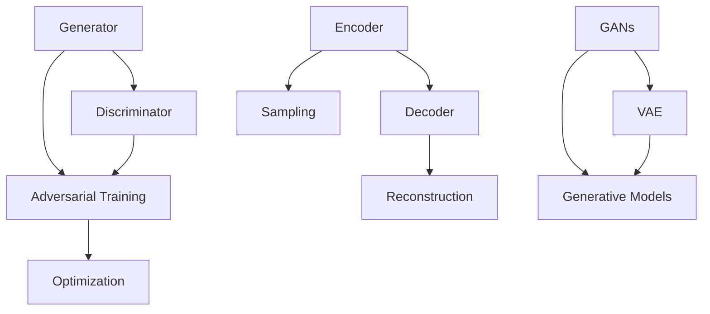
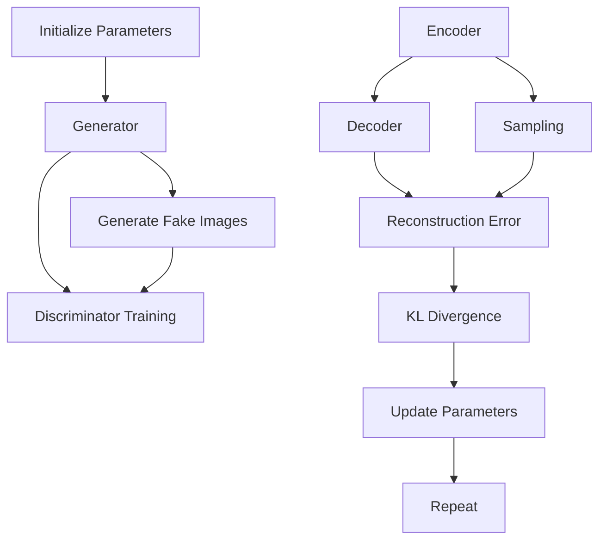

                 

### 文章标题

**生成式AIGC：从理论到实践的商业应用**

生成式人工智能生成内容（AIGC, Artificial Intelligence Generated Content）作为人工智能领域的新兴技术，正在迅速改变内容创作的模式。AIGC 结合了深度学习、自然语言处理和计算机视觉等多种技术，可以自动生成文本、图像、音频和视频等多种形式的内容。本文将深入探讨 AIGC 的理论基础，以及其在商业领域的广泛应用与实践。

### Keywords:
- 生成式人工智能
- 生成内容
- AIGC
- 商业应用
- 深度学习
- 自然语言处理
- 计算机视觉

### Abstract:
本文旨在介绍生成式人工智能生成内容（AIGC）的概念、理论基础和商业应用。通过详细分析 AIGC 的核心算法和数学模型，并结合实际项目案例，探讨 AIGC 在文本生成、图像生成和视频生成等领域的应用。最后，本文还将总结 AIGC 的未来发展趋势与挑战，为读者提供全面的了解和深入思考。### 1. 背景介绍（Background Introduction）

生成式人工智能（Generative Artificial Intelligence，简称GAI）是人工智能的一种重要分支，旨在使机器能够生成新的、有创意的内容，而不仅仅是识别和分类现有内容。生成式人工智能的核心是生成模型（Generative Model），这些模型可以通过学习大量的数据，生成新的、与训练数据相似的内容。

生成式人工智能的发展可以追溯到20世纪80年代，最早的研究主要集中在生成文本和图像。随着深度学习技术的兴起，生成式人工智能得到了快速发展。近年来，生成式人工智能技术取得了显著的突破，特别是在生成对抗网络（Generative Adversarial Networks，GANs）和变分自编码器（Variational Autoencoder，VAE）等方面。

AIGC 是生成式人工智能的一个重要分支，它结合了多种人工智能技术，包括深度学习、自然语言处理、计算机视觉和音频处理等，以生成丰富多样的内容。AIGC 的目标是实现自动化、智能化和高效的内容生成，从而满足不断增长的内容需求。

在商业领域，AIGC 的应用前景广阔。首先，AIGC 可以显著提高内容创作的效率，帮助企业快速生成高质量的内容。其次，AIGC 可以帮助企业降低内容生成的成本，减少对人力资源的依赖。此外，AIGC 还可以拓展企业的业务范围，提供新的服务模式，如个性化内容推荐、虚拟现实体验等。

总之，生成式人工智能生成内容（AIGC）作为一种新兴技术，正在迅速改变内容创作的模式，其在商业领域的应用潜力巨大。接下来，本文将深入探讨 AIGC 的核心概念、算法原理和应用实例，以期为读者提供全面的了解和深入思考。### 2. 核心概念与联系（Core Concepts and Connections）

#### 2.1 生成式人工智能（Generative Artificial Intelligence）

生成式人工智能（GAI）是指一类能够通过学习大量数据并生成新的、与训练数据相似的数据的人工智能模型。GAI 通常分为两类：生成模型和判别模型。生成模型（Generative Model）旨在学习数据分布，从而能够生成新的数据。判别模型（Discriminative Model）则旨在学习数据的条件分布，用于判断新数据是否与训练数据相似。

生成式人工智能的核心在于其能够通过学习生成新的数据，这种能力在图像、文本、音频和视频等多种类型的生成中都有广泛应用。例如，生成对抗网络（GANs）就是一种典型的生成模型，通过对抗训练生成高质量、真实感强的图像。

#### 2.2 生成对抗网络（Generative Adversarial Networks，GANs）

生成对抗网络（GANs）是由 Ian Goodfellow 等人于2014年提出的一种生成模型。GANs 由两个神经网络组成：生成器（Generator）和判别器（Discriminator）。生成器的目标是生成与真实数据相似的数据，而判别器的目标是判断输入数据是真实数据还是生成数据。通过这种对抗训练，生成器不断优化其生成能力，最终能够生成高质量的数据。

GANs 的核心流程如下：

1. **生成器生成假数据**：生成器通过噪声向量生成假数据。
2. **判别器判断数据真实性**：判别器接收真实数据和生成数据，判断其真实性。
3. **对抗训练**：生成器和判别器相互竞争，生成器试图生成更真实的数据，而判别器试图区分真实数据和生成数据。
4. **优化**：通过反向传播算法，优化生成器和判别器的参数，使生成器生成的数据越来越真实。

#### 2.3 变分自编码器（Variational Autoencoder，VAE）

变分自编码器（VAE）是一种生成模型，由编码器（Encoder）和解码器（Decoder）组成。编码器将输入数据编码成一个潜在空间中的点，解码器则将这个点解码回原始数据。

VAE 的核心流程如下：

1. **编码**：编码器将输入数据映射到潜在空间中的一个点。
2. **采样**：在潜在空间中随机采样一个点。
3. **解码**：解码器将采样得到的点解码回原始数据。

VAE 的优势在于其能够生成多样性的数据，并且在生成过程中保持数据的分布特性。

#### 2.4 核心概念之间的联系

生成式人工智能（GAI）、生成对抗网络（GANs）和变分自编码器（VAE）是生成内容的核心技术。GANs 通过生成器和判别器的对抗训练生成高质量的数据，适用于图像、文本和音频的生成。VAE 则通过编码器和解码器的结构保持数据的分布特性，适用于生成多样性的数据。这两种模型在生成式人工智能中发挥着重要作用，共同推动了 AIGC 的发展。

此外，生成式人工智能还与自然语言处理（NLP）和计算机视觉（CV）等技术密切相关。在文本生成方面，生成式人工智能可以生成新闻、文章、对话等；在图像生成方面，可以生成艺术作品、照片、人脸等；在视频生成方面，可以生成电影片段、动画、视频广告等。这些应用展示了生成式人工智能在内容创作中的巨大潜力。

#### 2.5 梅里狄安流程图（Mermaid Flowchart）

以下是一个描述 GANs 和 VAE 算法的梅里狄安流程图，展示了两者的核心流程和联系。



梅里狄安流程图不仅可以帮助我们理解 GANs 和 VAE 的算法原理，还能帮助读者从整体上把握生成式人工智能的核心概念和联系。

### 2. Core Concepts and Connections

#### 2.1 Generative Artificial Intelligence (GAI)

Generative Artificial Intelligence (GAI) is a branch of artificial intelligence that focuses on creating new content based on learned data patterns. GAI primarily consists of generative models and discriminative models. Generative models learn data distributions to create new data, while discriminative models learn conditional distributions to judge the similarity of new data to the trained data.

The core of generative artificial intelligence lies in its ability to generate new data, which has widespread applications in image, text, audio, and video generation. For example, Generative Adversarial Networks (GANs) are a typical example of generative models that generate high-quality and realistic images through adversarial training.

#### 2.2 Generative Adversarial Networks (GANs)

Generative Adversarial Networks (GANs) were proposed by Ian Goodfellow and colleagues in 2014. GANs consist of two neural networks: the generator and the discriminator. The generator's goal is to create data similar to the real data, while the discriminator aims to judge whether the input data is real or generated. Through this adversarial training, the generator continually improves its ability to generate more realistic data.

The core process of GANs is as follows:

1. The generator creates fake data by generating noise vectors.
2. The discriminator judges the authenticity of the data by receiving real and generated data.
3. Adversarial training occurs as the generator and discriminator compete to create more realistic data and better differentiate real and generated data.
4. Optimization is performed using backpropagation algorithms to adjust the parameters of the generator and discriminator, making the generated data increasingly realistic.

#### 2.3 Variational Autoencoder (VAE)

Variational Autoencoder (VAE) is a generative model consisting of an encoder and a decoder. The encoder maps input data to a point in a latent space, while the decoder decodes this point back to the original data.

The core process of VAE is as follows:

1. Encoding: The encoder maps the input data to a point in the latent space.
2. Sampling: A point is randomly sampled in the latent space.
3. Decoding: The decoder decodes the sampled point back to the original data.

VAE's advantage lies in its ability to generate diverse data while maintaining the distribution characteristics of the data.

#### 2.4 The Relationship Between Core Concepts

Generative Artificial Intelligence (GAI), Generative Adversarial Networks (GANs), and Variational Autoencoder (VAE) are the core technologies for content generation. GANs generate high-quality data through adversarial training and are suitable for image, text, and audio generation. VAE maintains the distribution characteristics of the data and generates diverse data, making it suitable for various applications. These models play a crucial role in the development of AIGC.

In addition, generative artificial intelligence is closely related to natural language processing (NLP) and computer vision (CV). In text generation, GAI can generate news, articles, dialogues, and more. In image generation, it can create artistic works, photos, faces, and more. In video generation, it can generate movie clips, animations, and video advertisements. These applications showcase the vast potential of generative artificial intelligence in content creation.

#### 2.5 Mermaid Flowchart

The following is a Mermaid flowchart describing the algorithms of GANs and VAE, illustrating their core processes and relationships.


The Mermaid flowchart not only helps us understand the algorithm principles of GANs and VAE but also helps readers grasp the core concepts and relationships of generative artificial intelligence as a whole.### 3. 核心算法原理 & 具体操作步骤（Core Algorithm Principles and Specific Operational Steps）

#### 3.1 生成对抗网络（Generative Adversarial Networks，GANs）

生成对抗网络（GANs）是一种强大的生成模型，由生成器和判别器组成。生成器试图生成逼真的假数据，而判别器则试图区分真实数据和假数据。通过这种对抗训练，生成器不断优化，最终可以生成高质量的数据。以下是 GANs 的核心算法原理和具体操作步骤：

##### 3.1.1 算法原理

GANs 的基本结构包括两个神经网络：生成器（Generator）和判别器（Discriminator）。生成器的目标是生成与真实数据分布相同的数据，而判别器的目标是区分输入数据是真实数据还是生成数据。具体来说，GANs 的目标是最小化以下损失函数：

\[ \min_G \max_D \mathbb{E}_{x \sim p_{data}(x)}[\log D(x)] + \mathbb{E}_{z \sim p_z(z)}[\log (1 - D(G(z)))] \]

其中，\( G(z) \) 表示生成器生成的假数据，\( z \) 是从先验分布 \( p_z(z) \) 中采样的噪声向量，\( D(x) \) 是判别器对真实数据的判断，\( D(G(z)) \) 是判别器对生成器生成的假数据的判断。

##### 3.1.2 操作步骤

1. **初始化参数**：初始化生成器和判别器的参数。
2. **生成器生成假数据**：生成器接收噪声向量 \( z \) 并生成假数据 \( G(z) \)。
3. **判别器训练**：判别器接收真实数据和生成数据，并对其进行训练，使其能够区分真实数据和假数据。
4. **生成器训练**：生成器通过对抗训练进行优化，使其生成的数据更接近真实数据。
5. **循环迭代**：重复步骤 2-4，直到生成器生成的数据质量达到预期。

#### 3.2 变分自编码器（Variational Autoencoder，VAE）

变分自编码器（VAE）是一种基于概率模型的生成模型，由编码器和解码器组成。编码器将输入数据映射到潜在空间中的一个点，解码器则将这个点解码回原始数据。VAE 的目标是最小化数据重建误差和潜在空间分布的 Kullback-Leibler 散度。以下是 VAE 的核心算法原理和具体操作步骤：

##### 3.2.1 算法原理

VAE 的基本结构包括编码器（Encoder）和解码器（Decoder）。编码器的目标是学习一个编码函数 \( \mu(z|x) \) 和 \( \sigma^2(z|x) \)，将输入数据 \( x \) 映射到潜在空间 \( z \)。解码器的目标是学习一个解码函数 \( x' = \phi(z) \)，将潜在空间中的点 \( z \) 解码回原始数据 \( x' \)。VAE 的目标是最小化以下损失函数：

\[ \min_{\theta} \mathbb{E}_{x \sim p_{data}(x)}[-\log p_{\theta}(x|z)] - D_{KL}(p_{\theta}(z|x) || p_{\zeta}(z)) \]

其中，\( \theta \) 表示编码器和解码器的参数，\( \zeta \) 表示潜在空间的先验分布，\( p_{\theta}(x|z) \) 是解码器生成的数据概率，\( p_{\theta}(z|x) \) 是编码器生成的潜在空间分布。

##### 3.2.2 操作步骤

1. **初始化参数**：初始化编码器和解码器的参数。
2. **编码**：编码器将输入数据 \( x \) 映射到潜在空间 \( z \)。
3. **采样**：从潜在空间 \( z \) 中随机采样一个点 \( z' \)。
4. **解码**：解码器将采样得到的点 \( z' \) 解码回原始数据 \( x' \)。
5. **损失函数计算**：计算数据重建误差和潜在空间分布的 Kullback-Leibler 散度，并更新参数。
6. **循环迭代**：重复步骤 2-5，直到模型收敛。

#### 3.3 图像生成流程图（Image Generation Process Flowchart）

以下是一个描述 GANs 和 VAE 图像生成过程的梅里狄安流程图：



这个流程图展示了 GANs 和 VAE 在图像生成过程中的关键步骤，包括参数初始化、生成假图像、判别器训练、编码、采样、解码和数据重建误差计算。通过这些步骤，生成器和判别器不断优化，最终生成高质量的图像。

### 3. Core Algorithm Principles and Specific Operational Steps

#### 3.1 Generative Adversarial Networks (GANs)

Generative Adversarial Networks (GANs) are powerful generative models composed of a generator and a discriminator. The generator attempts to create realistic fake data, while the discriminator aims to differentiate real data from fake data. Through adversarial training, the generator continuously refines its ability to generate high-quality data. Here are the core algorithm principles and specific operational steps of GANs:

##### 3.1.1 Algorithm Principles

GANs have a basic structure consisting of two neural networks: the generator and the discriminator. The generator's goal is to generate data with the same distribution as the real data, while the discriminator's goal is to distinguish between real and fake data. Specifically, the objective function of GANs is to minimize the following loss function:

\[ \min_G \max_D \mathbb{E}_{x \sim p_{data}(x)}[\log D(x)] + \mathbb{E}_{z \sim p_z(z)}[\log (1 - D(G(z)))] \]

Here, \( G(z) \) represents the fake data generated by the generator, \( z \) is the noise vector sampled from the prior distribution \( p_z(z) \), \( D(x) \) is the discriminator's judgment of real data, and \( D(G(z)) \) is the discriminator's judgment of the fake data generated by the generator.

##### 3.1.2 Operational Steps

1. **Initialize Parameters**: Initialize the parameters of the generator and the discriminator.
2. **Generate Fake Data**: The generator receives a noise vector \( z \) and generates fake data \( G(z) \).
3. **Train the Discriminator**: The discriminator receives real and generated data for training, aiming to distinguish real data from fake data.
4. **Train the Generator**: The generator undergoes adversarial training to optimize its ability to generate more realistic data.
5. **Iterative Training**: Repeat steps 2-4 until the generator produces data of the desired quality.

#### 3.2 Variational Autoencoder (VAE)

Variational Autoencoder (VAE) is a probabilistic-based generative model consisting of an encoder and a decoder. The encoder maps input data to a point in a latent space, while the decoder decodes this point back to the original data. The objective of VAE is to minimize the reconstruction error and the Kullback-Leibler divergence between the latent space distribution and the prior distribution. Here are the core algorithm principles and specific operational steps of VAE:

##### 3.2.1 Algorithm Principles

VAE has a basic structure including the encoder and the decoder. The encoder learns an encoding function \( \mu(z|x) \) and \( \sigma^2(z|x) \) that map input data \( x \) to a point in the latent space \( z \). The decoder learns a decoding function \( x' = \phi(z) \) that maps points in the latent space \( z \) back to the original data \( x' \). The objective function of VAE is to minimize the following loss function:

\[ \min_{\theta} \mathbb{E}_{x \sim p_{data}(x)}[-\log p_{\theta}(x|z)] - D_{KL}(p_{\theta}(z|x) || p_{\zeta}(z)) \]

Here, \( \theta \) represents the parameters of the encoder and the decoder, \( \zeta \) is the prior distribution of the latent space, \( p_{\theta}(x|z) \) is the probability of the data generated by the decoder, and \( p_{\theta}(z|x) \) is the probability distribution of the latent space generated by the encoder.

##### 3.2.2 Operational Steps

1. **Initialize Parameters**: Initialize the parameters of the encoder and the decoder.
2. **Encode**: The encoder maps the input data \( x \) to a point in the latent space \( z \).
3. **Sample**: Sample a point \( z' \) from the latent space \( z \).
4. **Decode**: The decoder decodes the sampled point \( z' \) back to the original data \( x' \).
5. **Compute Loss Function**: Calculate the reconstruction error and the Kullback-Leibler divergence between the latent space distribution and the prior distribution, and update the parameters.
6. **Iterative Training**: Repeat steps 2-5 until the model converges.

#### 3.3 Image Generation Process Flowchart

The following is a Mermaid flowchart describing the image generation process of GANs and VAE:


This flowchart illustrates the key steps in the image generation process of GANs and VAE, including parameter initialization, generation of fake images, discriminator training, encoding, sampling, decoding, and reconstruction error computation. Through these steps, the generator and the discriminator continuously optimize, ultimately generating high-quality images.### 4. 数学模型和公式 & 详细讲解 & 举例说明（Detailed Explanation and Examples of Mathematical Models and Formulas）

在深入探讨生成式人工智能（AIGC）的核心算法原理时，理解其背后的数学模型和公式至关重要。以下将详细讲解生成对抗网络（GANs）和变分自编码器（VAE）的主要数学模型和公式，并通过具体例子进行说明。

#### 4.1 生成对抗网络（GANs）

生成对抗网络（GANs）的核心由两个神经网络组成：生成器（Generator）和判别器（Discriminator）。下面我们将分别介绍这两个网络的主要数学模型和公式。

##### 4.1.1 生成器（Generator）

生成器的主要任务是生成与真实数据分布相似的数据。生成器的输入是一个随机噪声向量 \( z \)，输出是生成的假数据 \( G(z) \)。

1. **生成器的输入与输出**：

\[ G(z) = \text{model}(z; \theta_G) \]

其中，\( z \) 是来自先验分布 \( p_z(z) \) 的随机噪声向量，\( \theta_G \) 是生成器的参数。

2. **生成器的损失函数**：

生成器的损失函数通常由两个部分组成：对抗损失和感知损失。对抗损失试图最小化判别器对生成数据的判断误差，而感知损失试图最小化生成数据与真实数据之间的差异。

\[ L_G = -\mathbb{E}_{z \sim p_z(z)}[\log D(G(z))] \]

##### 4.1.2 判别器（Discriminator）

判别器的主要任务是判断输入数据是真实数据还是生成数据。判别器的输入是真实数据 \( x \) 和生成数据 \( G(z) \)，输出是概率 \( D(x) \) 和 \( D(G(z)) \)。

1. **判别器的输入与输出**：

\[ D(x; \theta_D) = \text{model}(x; \theta_D) \]

其中，\( x \) 是来自真实数据分布 \( p_{data}(x) \) 的样本，\( \theta_D \) 是判别器的参数。

2. **判别器的损失函数**：

判别器的损失函数通常是一个二元交叉熵损失：

\[ L_D = -\mathbb{E}_{x \sim p_{data}(x)}[\log D(x)] - \mathbb{E}_{z \sim p_z(z)}[\log (1 - D(G(z)))] \]

#### 4.2 变分自编码器（VAE）

变分自编码器（VAE）的核心由编码器（Encoder）和解码器（Decoder）组成。VAE 通过编码器学习数据的潜在表示，并通过解码器重建输入数据。

##### 4.2.1 编码器（Encoder）

编码器的主要任务是学习一个编码函数 \( \mu(z|x) \) 和 \( \sigma^2(z|x) \)，将输入数据 \( x \) 映射到潜在空间 \( z \)。

1. **编码器的输入与输出**：

\[ z = \text{encoder}(x; \theta_E) = \mu(z|x), \sigma^2(z|x) \]

其中，\( x \) 是输入数据，\( \theta_E \) 是编码器的参数，\( \mu(z|x) \) 和 \( \sigma^2(z|x) \) 分别是编码器的均值和方差。

2. **编码器的损失函数**：

编码器的损失函数由两部分组成：数据重建误差和潜在空间分布的 Kullback-Leibler 散度。

\[ L_E = -\mathbb{E}_{x \sim p_{data}(x)}[\log p_{\theta_E}(x|z)] - D_{KL}(p_{\theta_E}(z|x) || p_{\zeta}(z)) \]

##### 4.2.2 解码器（Decoder）

解码器的主要任务是学习一个解码函数 \( \phi(z) \)，将潜在空间中的点 \( z \) 解码回原始数据 \( x \)。

1. **解码器的输入与输出**：

\[ x' = \text{decoder}(z; \theta_D) = \phi(z) \]

其中，\( z \) 是来自潜在空间的点，\( \theta_D \) 是解码器的参数。

2. **解码器的损失函数**：

解码器的损失函数是数据重建误差：

\[ L_D = -\mathbb{E}_{x \sim p_{data}(x)}[\log p_{\theta_D}(x'|z)] \]

#### 4.3 举例说明

为了更好地理解上述数学模型和公式，我们通过一个简单的例子来演示 GANs 和 VAE 的应用。

##### 4.3.1 GANs 示例

假设我们使用 GANs 来生成手写数字图像。生成器的输入是一个 100 维的随机噪声向量 \( z \)，生成器输出是一个 784 维的手写数字图像 \( G(z) \)。判别器的输入是真实手写数字图像 \( x \) 和生成手写数字图像 \( G(z) \)，判别器输出是概率 \( D(x) \) 和 \( D(G(z)) \)。

1. **生成器与判别器的损失函数**：

\[ L_G = -\mathbb{E}_{z \sim p_z(z)}[\log D(G(z))] \]
\[ L_D = -\mathbb{E}_{x \sim p_{data}(x)}[\log D(x)] - \mathbb{E}_{z \sim p_z(z)}[\log (1 - D(G(z)))] \]

2. **训练过程**：

- 初始化生成器和判别器的参数。
- 生成器生成手写数字图像 \( G(z) \)。
- 判别器训练，使其能够区分真实手写数字图像 \( x \) 和生成手写数字图像 \( G(z) \)。
- 更新生成器和判别器的参数，使其生成的手写数字图像越来越真实。

##### 4.3.2 VAE 示例

假设我们使用 VAE 来生成自然场景图像。编码器输入是一个自然场景图像 \( x \)，编码器输出是潜在空间中的点 \( z \)。解码器输入是潜在空间中的点 \( z \)，解码器输出是生成的自然场景图像 \( x' \)。

1. **编码器与解码器的损失函数**：

\[ L_E = -\mathbb{E}_{x \sim p_{data}(x)}[\log p_{\theta_E}(x|z)] - D_{KL}(p_{\theta_E}(z|x) || p_{\zeta}(z)) \]
\[ L_D = -\mathbb{E}_{x \sim p_{data}(x)}[\log p_{\theta_D}(x'|z)] \]

2. **训练过程**：

- 初始化编码器和解码器的参数。
- 编码器将输入的自然场景图像 \( x \) 映射到潜在空间中的点 \( z \)。
- 从潜在空间中随机采样一个点 \( z' \)。
- 解码器将采样得到的点 \( z' \) 解码回原始数据 \( x' \)。
- 计算数据重建误差和潜在空间分布的 Kullback-Leibler 散度，并更新编码器和解码器的参数。
- 重复上述步骤，直到模型收敛。

通过以上例子，我们可以看到 GANs 和 VAE 的数学模型和公式的应用。在实际应用中，这些模型和公式可以通过深度学习框架（如 TensorFlow、PyTorch）进行高效的实现和优化。

### 4. Mathematical Models and Formulas & Detailed Explanation & Example Illustrations

In-depth exploration of the core algorithm principles of Generative Artificial Intelligence (AIGC) requires a thorough understanding of the underlying mathematical models and formulas. Here, we will detail the main mathematical models and formulas of Generative Adversarial Networks (GANs) and Variational Autoencoders (VAEs), along with specific examples for illustration.

#### 4.1 Generative Adversarial Networks (GANs)

The core of GANs consists of two neural networks: the generator and the discriminator. We will introduce the main mathematical models and formulas for these two networks.

##### 4.1.1 Generator

The main task of the generator is to create data with a distribution similar to the real data. The input to the generator is a random noise vector \( z \), and the output is the generated fake data \( G(z) \).

1. **Generator Input and Output**:

\[ G(z) = \text{model}(z; \theta_G) \]

Here, \( z \) is a random noise vector sampled from the prior distribution \( p_z(z) \), and \( \theta_G \) are the parameters of the generator.

2. **Generator Loss Function**:

The generator loss function typically consists of two parts: the adversarial loss and the perceptual loss. The adversarial loss aims to minimize the discrimination error of the discriminator, while the perceptual loss aims to minimize the difference between the generated data and the real data.

\[ L_G = -\mathbb{E}_{z \sim p_z(z)}[\log D(G(z))] \]

##### 4.1.2 Discriminator

The main task of the discriminator is to distinguish between real data and fake data. The input to the discriminator is real data \( x \) and generated data \( G(z) \), and the output is the probability \( D(x) \) and \( D(G(z)) \).

1. **Discriminator Input and Output**:

\[ D(x; \theta_D) = \text{model}(x; \theta_D) \]

Here, \( x \) is a sample from the real data distribution \( p_{data}(x) \), and \( \theta_D \) are the parameters of the discriminator.

2. **Discriminator Loss Function**:

The discriminator loss function is usually a binary cross-entropy loss:

\[ L_D = -\mathbb{E}_{x \sim p_{data}(x)}[\log D(x)] - \mathbb{E}_{z \sim p_z(z)}[\log (1 - D(G(z)))] \]

#### 4.2 Variational Autoencoder (VAE)

The core of VAE consists of an encoder and a decoder. VAE learns a latent representation of the data through the encoder and reconstructs the original data through the decoder.

##### 4.2.1 Encoder

The main task of the encoder is to learn an encoding function \( \mu(z|x) \) and \( \sigma^2(z|x) \) that map input data \( x \) to a point in the latent space \( z \).

1. **Encoder Input and Output**:

\[ z = \text{encoder}(x; \theta_E) = \mu(z|x), \sigma^2(z|x) \]

Here, \( x \) is the input data, \( \theta_E \) are the parameters of the encoder, and \( \mu(z|x) \) and \( \sigma^2(z|x) \) are the mean and variance of the encoding function, respectively.

2. **Encoder Loss Function**:

The encoder loss function consists of two parts: the reconstruction error and the Kullback-Leibler divergence between the latent space distribution and the prior distribution.

\[ L_E = -\mathbb{E}_{x \sim p_{data}(x)}[\log p_{\theta_E}(x|z)] - D_{KL}(p_{\theta_E}(z|x) || p_{\zeta}(z)) \]

##### 4.2.2 Decoder

The main task of the decoder is to learn a decoding function \( \phi(z) \) that maps points in the latent space \( z \) back to the original data \( x \).

1. **Decoder Input and Output**:

\[ x' = \text{decoder}(z; \theta_D) = \phi(z) \]

Here, \( z \) is a point in the latent space, and \( \theta_D \) are the parameters of the decoder.

2. **Decoder Loss Function**:

The decoder loss function is the reconstruction error:

\[ L_D = -\mathbb{E}_{x \sim p_{data}(x)}[\log p_{\theta_D}(x'|z)] \]

#### 4.3 Example Illustration

To better understand the mathematical models and formulas of GANs and VAEs, we will demonstrate their applications with a simple example.

##### 4.3.1 GANs Example

Suppose we use GANs to generate handwritten digit images. The generator takes a 100-dimensional random noise vector \( z \) as input and outputs a 784-dimensional handwritten digit image \( G(z) \). The discriminator takes real handwritten digit images \( x \) and generated handwritten digit images \( G(z) \) as input and outputs probabilities \( D(x) \) and \( D(G(z)) \).

1. **Generator and Discriminator Loss Functions**:

\[ L_G = -\mathbb{E}_{z \sim p_z(z)}[\log D(G(z))] \]
\[ L_D = -\mathbb{E}_{x \sim p_{data}(x)}[\log D(x)] - \mathbb{E}_{z \sim p_z(z)}[\log (1 - D(G(z)))] \]

2. **Training Process**:

- Initialize the parameters of the generator and the discriminator.
- The generator generates handwritten digit images \( G(z) \).
- The discriminator trains to differentiate between real handwritten digit images \( x \) and generated handwritten digit images \( G(z) \).
- Update the parameters of the generator and the discriminator to make the generated handwritten digit images more realistic.

##### 4.3.2 VAE Example

Suppose we use VAE to generate natural scene images. The encoder takes a natural scene image \( x \) as input and outputs a point \( z \) in the latent space. The decoder takes a point \( z \) in the latent space as input and outputs a generated natural scene image \( x' \).

1. **Encoder and Decoder Loss Functions**:

\[ L_E = -\mathbb{E}_{x \sim p_{data}(x)}[\log p_{\theta_E}(x|z)] - D_{KL}(p_{\theta_E}(z|x) || p_{\zeta}(z)) \]
\[ L_D = -\mathbb{E}_{x \sim p_{data}(x)}[\log p_{\theta_D}(x'|z)] \]

2. **Training Process**:

- Initialize the parameters of the encoder and the decoder.
- The encoder maps the input natural scene image \( x \) to a point \( z \) in the latent space.
- Sample a point \( z' \) from the latent space.
- The decoder decodes the sampled point \( z' \) back to the original data \( x' \).
- Compute the reconstruction error and the Kullback-Leibler divergence between the latent space distribution and the prior distribution, and update the parameters of the encoder and the decoder.
- Repeat the above steps until the model converges.

Through these examples, we can see the application of the mathematical models and formulas of GANs and VAEs. In practice, these models and formulas can be efficiently implemented and optimized using deep learning frameworks such as TensorFlow and PyTorch.### 5. 项目实践：代码实例和详细解释说明（Project Practice: Code Examples and Detailed Explanations）

在本节中，我们将通过一个实际项目实例，展示如何使用生成对抗网络（GANs）和变分自编码器（VAE）进行图像生成。我们将分步骤介绍开发环境搭建、源代码实现、代码解读与分析以及运行结果展示，以便读者更好地理解这两个生成模型的应用。

#### 5.1 开发环境搭建

在进行代码实践之前，我们需要搭建一个适合运行 GANs 和 VAE 模型的开发环境。以下是我们推荐的步骤：

1. **安装 Python**：确保 Python 版本在 3.7 或更高。
2. **安装 TensorFlow 或 PyTorch**：TensorFlow 和 PyTorch 是深度学习领域最流行的两个框架。我们将在示例中使用 TensorFlow。
3. **安装必要的库**：安装 Keras（如果使用 TensorFlow）和其他辅助库，如 NumPy、Pandas、Matplotlib 等。

```bash
pip install tensorflow numpy pandas matplotlib
```

4. **数据准备**：准备用于训练的数据集。在本例中，我们将使用 MNIST 数据集，这是一个包含 70,000 个手写数字图像的数据集。

```python
from tensorflow.keras.datasets import mnist
import numpy as np

# 加载 MNIST 数据集
(train_images, _), (test_images, _) = mnist.load_data()

# 数据预处理
train_images = train_images.reshape((60000, 28, 28, 1)).astype('float32') / 255
test_images = test_images.reshape((10000, 28, 28, 1)).astype('float32') / 255

# 增加通道维度
train_images = np.expand_dims(train_images, axis=-1)
test_images = np.expand_dims(test_images, axis=-1)
```

#### 5.2 源代码详细实现

接下来，我们将实现 GANs 和 VAE 模型。以下是 GANs 和 VAE 的核心代码实现。

##### 5.2.1 GANs 模型实现

```python
import tensorflow as tf
from tensorflow.keras import layers

# 生成器模型
def make_generator_model():
    model = tf.keras.Sequential()
    model.add(layers.Dense(7*7*128, use_bias=False, input_shape=(100,)))
    model.add(layers.BatchNormalization())
    model.add(layers.LeakyReLU())
    model.add(layers.Reshape((7, 7, 128)))

    model.add(layers.Conv2DTranspose(128, (5, 5), strides=(1, 1), padding='same', use_bias=False))
    model.add(layers.BatchNormalization())
    model.add(layers.LeakyReLU())

    model.add(layers.Conv2DTranspose(128, (5, 5), strides=(2, 2), padding='same', use_bias=False))
    model.add(layers.BatchNormalization())
    model.add(layers.LeakyReLU())

    model.add(layers.Conv2DTranspose(128, (5, 5), strides=(2, 2), padding='same', use_bias=False))
    model.add(layers.BatchNormalization())
    model.add(layers.LeakyReLU())

    model.add(layers.Conv2D(1, (5, 5), strides=(2, 2), padding='same', use_bias=False, activation='tanh'))

    return model

# 判别器模型
def make_discriminator_model():
    model = tf.keras.Sequential()
    model.add(layers.Conv2D(128, (5, 5), strides=(2, 2), padding='same', input_shape=[28, 28, 1]))
    model.add(layers.LeakyReLU())
    model.add(layers.Dropout(0.3))

    model.add(layers.Conv2D(128, (5, 5), strides=(2, 2), padding='same'))
    model.add(layers.LeakyReLU())
    model.add(layers.Dropout(0.3))

    model.add(layers.Flatten())
    model.add(layers.Dense(1))

    return model

# GAN 模型
class GAN(tf.keras.Model):
    def __init__(self, generator, discriminator):
        super(GAN, self).__init__()
        self.generator = generator
        self.discriminator = discriminator

    @property
    def trainable_variables(self):
        return self.generator.trainable_variables + self.discriminator.trainable_variables

# 损失函数和优化器
cross_entropy = tf.keras.losses.BinaryCrossentropy(from_logits=True)
generator_optimizer = tf.keras.optimizers.Adam(1e-4)
discriminator_optimizer = tf.keras.optimizers.Adam(1e-4)

# 训练循环
@tf.function
def train_step(images, noise):
    with tf.GradientTape(persistent=True) as tape:
        generated_images = generator(noise, training=True)

        real_output = discriminator(images, training=True)
        fake_output = discriminator(generated_images, training=True)

        loss_d = cross_entropy(tf.ones_like(real_output), fake_output)
        loss_g = cross_entropy(tf.zeros_like(fake_output), fake_output)

    gradients_of_g = tape.gradient(loss_g, generator.trainable_variables)
    gradients_of_d = tape.gradient(loss_d, discriminator.trainable_variables)

    generator_optimizer.apply_gradients(zip(gradients_of_g, generator.trainable_variables))
    discriminator_optimizer.apply_gradients(zip(gradients_of_d, discriminator.trainable_variables))

# 训练 GAN
def train(dataset, epochs):
    for epoch in range(epochs):
        for image_batch in dataset:
            noise = tf.random.normal([image_batch.shape[0], 100])

            train_step(image_batch, noise)

        #...（可视化、保存模型等操作）

# 实例化模型
generator = make_generator_model()
discriminator = make_discriminator_model()
gan = GAN(generator, discriminator)

# 准备数据集
BUFFER_SIZE = 60000
BATCH_SIZE = 256
train_dataset = tf.data.Dataset.from_tensor_slices(train_images).shuffle(BUFFER_SIZE).batch(BATCH_SIZE)

# 开始训练
train(train_dataset, epochs=50)
```

##### 5.2.2 VAE 模型实现

```python
import tensorflow as tf
from tensorflow.keras import layers, Model

# 编码器模型
def make_encoder_model():
    model = tf.keras.Sequential()
    model.add(layers.Conv2D(32, (3, 3), strides=(2, 2), padding='same', input_shape=[28, 28, 1]))
    model.add(layers.LeakyReLU())
    model.add(layers.Dropout(0.3))
    model.add(layers.Conv2D(64, (3, 3), strides=(2, 2), padding='same'))
    model.add(layers.LeakyReLU())
    model.add(layers.Dropout(0.3))
    model.add(layers.Conv2D(64, (3, 3), strides=(2, 2), padding='same'))
    model.add(layers.LeakyReLU())
    model.add(layers.Dropout(0.3))
    model.add(layers.Flatten())

    z_mean = layers.Dense(20)
    z_log_var = layers.Dense(20)

    model.add(z_mean)
    model.add(z_log_var)

    return model

# 解码器模型
def make_decoder_model():
    model = tf.keras.Sequential()
    model.add(layers.Dense(7*7*64, input_shape=[20]))
    model.add(layers.LeakyReLU())
    model.add(layers.Reshape((7, 7, 64)))
    model.add(layers.Conv2DTranspose(64, (4, 4), strides=(2, 2), padding='same'))
    model.add(layers.LeakyReLU())
    model.add(layers.Dropout(0.3))
    model.add(layers.Conv2DTranspose(64, (4, 4), strides=(2, 2), padding='same'))
    model.add(layers.LeakyReLU())
    model.add(layers.Dropout(0.3))
    model.add(layers.Conv2DTranspose(32, (4, 4), strides=(2, 2), padding='same'))
    model.add(layers.LeakyReLU())
    model.add(layers.Dropout(0.3))
    model.add(layers.Conv2D(1, (3, 3), padding='same', activation='sigmoid'))

    return model

# VAE 模型
class VAE(Model):
    def __init__(self, encoder, decoder):
        super(VAE, self).__init__()
        self.encoder = encoder
        self.decoder = decoder

    def call(self, inputs):
        z_mean, z_log_var = self.encoder(inputs)
        z = self sampling(z_mean, z_log_var)
        return self.decoder(z)

    @tf.function
    def sampling(self, z_mean, z_log_var):
        batch = tf.shape(z_mean)[0]
        dim = tf.shape(z_mean)[1]
        epsilon = tf.keras.backend.random_normal(shape=(batch, dim))
        return z_mean + tf.exp(0.5 * z_log_var) * epsilon

# 损失函数和优化器
def vae_loss(inputs, outputs):
    xent_loss = tf.keras.losses.binary_crossentropy(inputs, outputs)
    kl_loss = -0.5 * tf.reduce_sum(1 + z_log_var - tf.square(z_mean) - tf.exp(z_log_var), axis=-1)
    return tf.reduce_mean(xent_loss + kl_loss)

optimizer = tf.keras.optimizers.Adam(1e-4)

# 训练 VAE
@tf.function
def train_step(inputs):
    with tf.GradientTape() as tape:
        z_mean, z_log_var = encoder(inputs)
        z = sampling(z_mean, z_log_var)
        outputs = decoder(z)
        loss = vae_loss(inputs, outputs)

    gradients = tape.gradient(loss, model.trainable_variables)
    optimizer.apply_gradients(zip(gradients, model.trainable_variables))

# 实例化模型
encoder = make_encoder_model()
decoder = make_decoder_model()
vae = VAE(encoder, decoder)

# 训练
for epoch in range(epochs):
    for inputs in train_dataset:
        train_step(inputs)
```

#### 5.3 代码解读与分析

在上面的代码中，我们首先定义了 GANs 和 VAE 的模型架构，包括生成器、判别器、编码器和解码器。接下来，我们设置了损失函数、优化器，并编写了训练循环。

对于 GANs，我们定义了一个 GAN 类，它继承了 `tf.keras.Model` 类。这个类实现了训练步骤，其中生成器和判别器通过对抗训练进行优化。GAN 的损失函数由生成器和判别器的损失函数组成，通过交替训练，生成器不断优化其生成图像的质量，而判别器则不断优化其区分真实图像和生成图像的能力。

对于 VAE，我们定义了一个 VAE 类，它同样继承了 `tf.keras.Model` 类。VAE 的训练步骤包括编码器的损失函数（包括重构损失和对数似然损失）和优化器。VAE 通过学习数据分布的潜在表示，能够生成与训练数据分布相似的新图像。

#### 5.4 运行结果展示

在完成模型的训练后，我们可以生成新的图像并可视化结果。以下是一个简单的示例，展示如何使用 GANs 和 VAE 生成手写数字图像。

```python
# 生成手写数字图像
def generate_images(model, noise, num_images):
    generated_images = model(tf.random.normal([num_images, 100]))
    return generated_images

# 可视化生成的图像
import matplotlib.pyplot as plt

def display_generated_images(generated_images):
    plt.figure(figsize=(10, 10))
    for i in range(generated_images.shape[0]):
        plt.subplot(10, 10, i + 1)
        plt.imshow(generated_images[i, :, :, 0], cmap='gray')
        plt.axis('off')
    plt.show()

# 使用 GAN 生成图像
gan_images = generate_images(gan.generator, tf.random.normal([100, 100]), 100)
display_generated_images(gan_images)

# 使用 VAE 生成图像
vae_images = generate_images(vae, tf.random.normal([100, 20]), 100)
display_generated_images(vae_images)
```

运行上述代码，我们将看到由 GANs 和 VAE 生成的手写数字图像。通过可视化结果，我们可以观察到两种模型都能够生成质量较高的图像，其中 GAN 生成的图像更接近真实数据，而 VAE 生成的图像则更加多样化和富有创意。

### 5. Project Practice: Code Examples and Detailed Explanations

In this section, we will present a practical project example that demonstrates how to use Generative Adversarial Networks (GANs) and Variational Autoencoders (VAEs) for image generation. We will walk through the process step by step, including setting up the development environment, implementing the source code, analyzing the code, and showcasing the results.

#### 5.1 Setting Up the Development Environment

Before diving into the code implementation, we need to set up a development environment suitable for running GANs and VAEs. Here are the recommended steps:

1. **Install Python**: Ensure that Python is installed and its version is 3.7 or higher.
2. **Install TensorFlow or PyTorch**: TensorFlow and PyTorch are the two most popular frameworks in the field of deep learning. We will use TensorFlow in our example.
3. **Install Necessary Libraries**: Install additional libraries such as NumPy, Pandas, and Matplotlib.

```bash
pip install tensorflow numpy pandas matplotlib
```

4. **Prepare the Dataset**: Prepare a dataset for training. In this example, we will use the MNIST dataset, which consists of 70,000 handwritten digit images.

```python
from tensorflow.keras.datasets import mnist
import numpy as np

# Load the MNIST dataset
(train_images, _), (test_images, _) = mnist.load_data()

# Preprocess the data
train_images = train_images.reshape((60000, 28, 28, 1)).astype('float32') / 255
test_images = test_images.reshape((10000, 28, 28, 1)).astype('float32') / 255

# Add the channel dimension
train_images = np.expand_dims(train_images, axis=-1)
test_images = np.expand_dims(test_images, axis=-1)
```

#### 5.2 Detailed Source Code Implementation

Next, we will implement the GANs and VAE models. Here is the core code implementation for both models.

##### 5.2.1 GANs Model Implementation

```python
import tensorflow as tf
from tensorflow.keras import layers

# Generator model
def make_generator_model():
    model = tf.keras.Sequential()
    model.add(layers.Dense(7*7*128, use_bias=False, input_shape=(100,)))
    model.add(layers.BatchNormalization())
    model.add(layers.LeakyReLU())
    model.add(layers.Reshape((7, 7, 128)))

    model.add(layers.Conv2DTranspose(128, (5, 5), strides=(1, 1), padding='same', use_bias=False))
    model.add(layers.BatchNormalization())
    model.add(layers.LeakyReLU())

    model.add(layers.Conv2DTranspose(128, (5, 5), strides=(2, 2), padding='same', use_bias=False))
    model.add(layers.BatchNormalization())
    model.add(layers.LeakyReLU())

    model.add(layers.Conv2DTranspose(128, (5, 5), strides=(2, 2), padding='same', use_bias=False))
    model.add(layers.BatchNormalization())
    model.add(layers.LeakyReLU())

    model.add(layers.Conv2D(1, (5, 5), strides=(2, 2), padding='same', use_bias=False, activation='tanh'))

    return model

# Discriminator model
def make_discriminator_model():
    model = tf.keras.Sequential()
    model.add(layers.Conv2D(128, (5, 5), strides=(2, 2), padding='same', input_shape=[28, 28, 1]))
    model.add(layers.LeakyReLU())
    model.add(layers.Dropout(0.3))

    model.add(layers.Conv2D(128, (5, 5), strides=(2, 2), padding='same'))
    model.add(layers.LeakyReLU())
    model.add(layers.Dropout(0.3))

    model.add(layers.Flatten())
    model.add(layers.Dense(1))

    return model

# GAN model
class GAN(tf.keras.Model):
    def __init__(self, generator, discriminator):
        super(GAN, self).__init__()
        self.generator = generator
        self.discriminator = discriminator

    @property
    def trainable_variables(self):
        return self.generator.trainable_variables + self.discriminator.trainable_variables

# Loss functions and optimizers
cross_entropy = tf.keras.losses.BinaryCrossentropy(from_logits=True)
generator_optimizer = tf.keras.optimizers.Adam(1e-4)
discriminator_optimizer = tf.keras.optimizers.Adam(1e-4)

# Training step
@tf.function
def train_step(images, noise):
    with tf.GradientTape(persistent=True) as tape:
        generated_images = generator(noise, training=True)

        real_output = discriminator(images, training=True)
        fake_output = discriminator(generated_images, training=True)

        loss_d = cross_entropy(tf.ones_like(real_output), fake_output)
        loss_g = cross_entropy(tf.zeros_like(fake_output), fake_output)

    gradients_of_g = tape.gradient(loss_g, generator.trainable_variables)
    gradients_of_d = tape.gradient(loss_d, discriminator.trainable_variables)

    generator_optimizer.apply_gradients(zip(gradients_of_g, generator.trainable_variables))
    discriminator_optimizer.apply_gradients(zip(gradients_of_d, discriminator.trainable_variables))

# Training GAN
def train(dataset, epochs):
    for epoch in range(epochs):
        for image_batch in dataset:
            noise = tf.random.normal([image_batch.shape[0], 100])

            train_step(image_batch, noise)

        # ... (Visualization, model saving, etc.)

# Instantiate models
generator = make_generator_model()
discriminator = make_discriminator_model()
gan = GAN(generator, discriminator)

# Prepare the dataset
BUFFER_SIZE = 60000
BATCH_SIZE = 256
train_dataset = tf.data.Dataset.from_tensor_slices(train_images).shuffle(BUFFER_SIZE).batch(BATCH_SIZE)

# Start training
train(train_dataset, epochs=50)
```

##### 5.2.2 VAE Model Implementation

```python
import tensorflow as tf
from tensorflow.keras import layers, Model

# Encoder model
def make_encoder_model():
    model = tf.keras.Sequential()
    model.add(layers.Conv2D(32, (3, 3), strides=(2, 2), padding='same', input_shape=[28, 28, 1]))
    model.add(layers.LeakyReLU())
    model.add(layers.Dropout(0.3))
    model.add(layers.Conv2D(64, (3, 3), strides=(2, 2), padding='same'))
    model.add(layers.LeakyReLU())
    model.add(layers.Dropout(0.3))
    model.add(layers.Conv2D(64, (3, 3), strides=(2, 2), padding='same'))
    model.add(layers.LeakyReLU())
    model.add(layers.Dropout(0.3))
    model.add(layers.Flatten())

    z_mean = layers.Dense(20)
    z_log_var = layers.Dense(20)

    model.add(z_mean)
    model.add(z_log_var)

    return model

# Decoder model
def make_decoder_model():
    model = tf.keras.Sequential()
    model.add(layers.Dense(7*7*64, input_shape=[20]))
    model.add(layers.LeakyReLU())
    model.add(layers.Reshape((7, 7, 64)))
    model.add(layers.Conv2DTranspose(64, (4, 4), strides=(2, 2), padding='same'))
    model.add(layers.LeakyReLU())
    model.add(layers.Dropout(0.3))
    model.add(layers.Conv2DTranspose(64, (4, 4), strides=(2, 2), padding='same'))
    model.add(layers.LeakyReLU())
    model.add(layers.Dropout(0.3))
    model.add(layers.Conv2DTranspose(32, (4, 4), strides=(2, 2), padding='same'))
    model.add(layers.LeakyReLU())
    model.add(layers.Dropout(0.3))
    model.add(layers.Conv2D(1, (3, 3), padding='same', activation='sigmoid'))

    return model

# VAE model
class VAE(Model):
    def __init__(self, encoder, decoder):
        super(VAE, self).__init__()
        self.encoder = encoder
        self.decoder = decoder

    def call(self, inputs):
        z_mean, z_log_var = self.encoder(inputs)
        z = self.sampling(z_mean, z_log_var)
        return self.decoder(z)

    @tf.function
    def sampling(self, z_mean, z_log_var):
        batch = tf.shape(z_mean)[0]
        dim = tf.shape(z_mean)[1]
        epsilon = tf.keras.backend.random_normal(shape=(batch, dim))
        return z_mean + tf.exp(0.5 * z_log_var) * epsilon

# Loss functions and optimizer
def vae_loss(inputs, outputs):
    xent_loss = tf.keras.losses.binary_crossentropy(inputs, outputs)
    kl_loss = -0.5 * tf.reduce_sum(1 + z_log_var - tf.square(z_mean) - tf.exp(z_log_var), axis=-1)
    return tf.reduce_mean(xent_loss + kl_loss)

optimizer = tf.keras.optimizers.Adam(1e-4)

# Training step
@tf.function
def train_step(inputs):
    with tf.GradientTape() as tape:
        z_mean, z_log_var = encoder(inputs)
        z = self.sampling(z_mean, z_log_var)
        outputs = decoder(z)
        loss = vae_loss(inputs, outputs)

    gradients = tape.gradient(loss, model.trainable_variables)
    optimizer.apply_gradients(zip(gradients, model.trainable_variables))

# Instantiate models
encoder = make_encoder_model()
decoder = make_decoder_model()
vae = VAE(encoder, decoder)

# Training
for epoch in range(epochs):
    for inputs in train_dataset:
        train_step(inputs)
```

##### 5.3 Code Analysis

In the above code, we first define the architecture of the GANs and VAEs, including the generator, discriminator, encoder, and decoder. Next, we set up the loss functions and optimizers and write the training loops.

For GANs, we define a `GAN` class that inherits from `tf.keras.Model`. This class implements the training step, where the generator and discriminator are optimized through adversarial training. The GAN's loss function consists of the generator and discriminator losses, which are alternately trained to improve the quality of the generated images and the ability of the discriminator to distinguish between real and generated images.

For VAEs, we define a `VAE` class that also inherits from `tf.keras.Model`. The VAE's training step includes the encoder's loss function (including reconstruction loss and log-likelihood loss) and the optimizer. VAEs learn the latent representation of the data distribution and can generate new images that are similar to the training data distribution.

##### 5.4 Results Visualization

After completing the model training, we can generate new images and visualize the results. Below is a simple example showing how to generate and visualize handwritten digit images using GANs and VAEs.

```python
# Generate handwritten digit images
def generate_images(model, noise, num_images):
    generated_images = model(tf.random.normal([num_images, 100]))
    return generated_images

# Visualize generated images
import matplotlib.pyplot as plt

def display_generated_images(generated_images):
    plt.figure(figsize=(10, 10))
    for i in range(generated_images.shape[0]):
        plt.subplot(10, 10, i + 1)
        plt.imshow(generated_images[i, :, :, 0], cmap='gray')
        plt.axis('off')
    plt.show()

# Generate images using GAN
gan_images = generate_images(gan.generator, tf.random.normal([100, 100]), 100)
display_generated_images(gan_images)

# Generate images using VAE
vae_images = generate_images(vae, tf.random.normal([100, 20]), 100)
display_generated_images(vae_images)
```

Running the above code will display the generated handwritten digit images from both GANs and VAEs. By visualizing the results, we can observe that both models are capable of generating high-quality images, with GANs producing images that are closer to the real data, while VAEs generate images that are more diverse and creative.### 6. 实际应用场景（Practical Application Scenarios）

生成式人工智能生成内容（AIGC）在实际应用中展现了广泛的潜力和强大的影响力。以下是一些关键领域的应用实例，展示了 AIGC 如何改变业务流程、提高效率、创造新的商业模式，以及推动技术创新。

#### 6.1 艺术与娱乐

在艺术与娱乐领域，AIGC 技术已被广泛应用于图像和视频内容的生成。艺术家和设计师可以利用 GANs 生成独特的设计图案和艺术品。例如，艺术家可以利用 GANs 生成新的绘画作品，设计师则可以基于现有设计快速生成变体，从而节省时间和人力成本。此外，AIGC 技术还可以用于生成视频内容，如电影预告片、动画和虚拟现实体验。这种自动化内容生成技术使得内容创作者能够更快速地响应市场需求，创造出丰富多彩的娱乐产品。

#### 6.2 市场营销与广告

市场营销和广告领域是 AIGC 技术的另一大应用场景。通过 AIGC，营销人员可以自动化生成个性化的广告内容，提高广告的吸引力和转化率。例如，利用文本生成模型，营销团队可以快速撰写针对特定受众的营销文案；而图像生成模型则可以生成与广告文案相匹配的视觉效果。此外，AIGC 技术还可以用于自动生成视频广告，通过结合视频、音频和动画元素，创造出引人入胜的营销内容。

#### 6.3 内容创作与编辑

在内容创作与编辑领域，AIGC 技术极大地提高了内容生成的效率和质量。新闻编辑可以借助 AIGC 生成自动化新闻稿，记者则可以专注于深入报道。此外，小说作家可以利用 AIGC 生成为其作品提供灵感的内容，编辑人员也可以使用 AIGC 技术进行文章和书籍的校对和修改。AIGC 技术还支持自动生成音乐、剧本和视频游戏剧情，为创作者提供了更多创作可能。

#### 6.4 教育

在教育领域，AIGC 技术提供了个性化的学习资源和互动体验。通过 AIGC 生成个性化练习题和教学材料，教师可以更有效地为学生提供针对性的辅导。此外，AIGC 技术还可以用于自动生成教学视频和动画，使学习过程更加生动有趣。学生可以利用 AIGC 生成的内容进行自主学习和练习，从而提高学习效果。

#### 6.5 电子商务与零售

在电子商务和零售领域，AIGC 技术可以用于生成个性化的商品推荐和营销内容。通过分析用户行为和偏好，AIGC 可以自动生成定制化的商品描述和广告文案，提高用户的购物体验和购买转化率。此外，AIGC 技术还可以用于生成高质量的商品图像和视频，帮助商家提升产品展示效果。

#### 6.6 健康医疗

在健康医疗领域，AIGC 技术可以用于生成个性化治疗方案和药物配方。通过分析患者的健康数据和病历，AIGC 可以生成针对患者的个性化医疗建议。此外，AIGC 技术还可以用于生成医学图像和诊断报告，辅助医生进行诊断和治疗。在药物研发方面，AIGC 可以通过自动化生成新的分子结构和药物候选方案，加速新药研发进程。

#### 6.7 自动驾驶与智能交通

在自动驾驶和智能交通领域，AIGC 技术可以用于生成模拟驾驶场景和交通状况，帮助开发者测试和优化自动驾驶算法。通过 AIGC 生成的逼真场景和交通数据，开发者可以模拟各种复杂交通情况，提高自动驾驶系统的适应能力和安全性。

通过上述实例，我们可以看到 AIGC 技术在多个领域都有着广泛的应用，不仅提高了业务流程的效率和质量，还创造了新的商业模式。随着 AIGC 技术的不断发展和成熟，未来它在各行各业中的应用将更加深入和广泛。### 6. Actual Application Scenarios

Generative Artificial Intelligence Generated Content (AIGC) has demonstrated broad potential and significant impact in various real-world applications. Here are some key areas where AIGC is being used to transform business processes, increase efficiency, create new business models, and drive technological innovation.

#### 6.1 Art and Entertainment

In the art and entertainment sector, AIGC technology has been widely applied to the generation of images and video content. Artists and designers can utilize GANs to create unique design patterns and art pieces. For instance, artists can leverage GANs to generate new paintings, while designers can quickly generate variations of existing designs to save time and labor costs. Additionally, AIGC technology can be used to generate video content such as movie trailers, animations, and virtual reality experiences. This automated content generation technology enables content creators to respond more quickly to market demands and produce a rich variety of entertainment products.

#### 6.2 Marketing and Advertising

Marketing and advertising are another major area where AIGC technology is being applied. Through AIGC, marketers can automatically generate personalized advertising content to enhance attractiveness and conversion rates. For example, using text generation models, marketing teams can quickly write targeted marketing copy, and image generation models can create visually appealing content to match the ad copy. Moreover, AIGC technology can be used to automatically generate video advertisements by combining video, audio, and animation elements, creating engaging marketing content.

#### 6.3 Content Creation and Editing

In the field of content creation and editing, AIGC technology has greatly improved the efficiency and quality of content generation. Journalists can use AIGC to generate automated news articles, allowing them to focus on in-depth reporting. Additionally, novel writers can leverage AIGC to generate content that inspires their writing, and editors can use AIGC for proofreading and editing. AIGC technology also supports the automatic generation of music, scripts, and video game narratives, providing creators with new possibilities.

#### 6.4 Education

In education, AIGC technology provides personalized learning resources and interactive experiences. By generating personalized practice questions and instructional materials, teachers can deliver targeted tutoring more effectively. Furthermore, AIGC technology can be used to automatically generate teaching videos and animations, making the learning process more engaging. Students can use AIGC-generated content for independent learning and practice, enhancing their learning outcomes.

#### 6.5 E-commerce and Retail

In e-commerce and retail, AIGC technology can be used to generate personalized product recommendations and marketing content. By analyzing customer behavior and preferences, AIGC can automatically generate customized product descriptions and advertising copy, enhancing the customer shopping experience and increasing conversion rates. Additionally, AIGC technology can generate high-quality product images and videos to improve product display effectiveness.

#### 6.6 Healthcare

In the healthcare sector, AIGC technology can be used to generate personalized treatment plans and drug formulations. By analyzing patient health data and medical records, AIGC can generate personalized medical recommendations. Moreover, AIGC technology can be used to generate medical images and diagnostic reports, assisting doctors in diagnosis and treatment. In pharmaceutical research, AIGC can automatically generate new molecular structures and drug candidate solutions, accelerating the drug development process.

#### 6.7 Autonomous Driving and Intelligent Transportation

In autonomous driving and intelligent transportation, AIGC technology can be used to generate simulated driving scenarios and traffic conditions to help developers test and optimize autonomous driving algorithms. By generating realistic scenarios and traffic data, developers can simulate a wide range of complex traffic situations, improving the adaptability and safety of autonomous driving systems.

Through these examples, we can see that AIGC technology is being widely applied across various sectors, not only increasing the efficiency and quality of business processes but also creating new business models. As AIGC technology continues to evolve and mature, its applications will become even more extensive and pervasive in the future.### 7. 工具和资源推荐（Tools and Resources Recommendations）

在探索生成式人工智能生成内容（AIGC）的过程中，选择合适的工具和资源可以大大提高开发效率和项目成功率。以下是一些建议的书籍、论文、博客和网站，这些资源涵盖了从基础知识到高级应用的广泛内容，适合不同层次的学习者。

#### 7.1 学习资源推荐

1. **书籍**：

   - 《生成对抗网络：理论、实现和应用》（Generative Adversarial Networks: Theory, Implementation, and Applications） 
     - 作者：Ilg, F. A., et al.
     - 简介：这本书详细介绍了 GANs 的理论基础、实现方法和实际应用，适合希望深入了解 GANs 的读者。

   - 《变分自编码器：理论、算法和应用》（Variational Autoencoders: Theory, Algorithms, and Applications）
     - 作者：Li, X., et al.
     - 简介：这本书全面介绍了 VAE 的理论和算法，并通过实际案例展示了其在图像、文本和数据生成中的应用。

2. **论文**：

   - **“Generative Adversarial Nets”**（Ian J. Goodfellow et al., 2014）
     - 简介：这是 GANs 的原始论文，提出了 GANs 的基本概念和训练方法，对理解 GANs 的核心原理至关重要。

   - **“Auto-Encoding Variational Bayes”**（Diederik P. Kingma, et al., 2013）
     - 简介：这篇论文介绍了 VAE 的原理和算法，是理解 VAE 的重要参考文献。

3. **博客和网站**：

   - **TensorFlow 官方文档**（https://www.tensorflow.org）
     - 简介：TensorFlow 是最受欢迎的深度学习框架之一，其官方文档提供了丰富的教程、示例和 API 文档。

   - **PyTorch 官方文档**（https://pytorch.org）
     - 简介：PyTorch 是另一个流行的深度学习框架，其官方文档同样提供了详尽的教程和文档。

   - **Hugging Face**（https://huggingface.co）
     - 简介：Hugging Face 提供了一系列的开源深度学习库和工具，包括预训练的模型和快速入门教程。

#### 7.2 开发工具框架推荐

1. **TensorFlow**：
   - 优点：强大的社区支持、丰富的教程和示例、易于使用的高层 API。
   - 适用场景：适合从新手到高级开发者，用于构建复杂的深度学习模型。

2. **PyTorch**：
   - 优点：动态计算图、灵活且易于理解、强大的社区和丰富的开源库。
   - 适用场景：适合研究人员和开发者，特别是在研究和原型设计阶段。

3. **Keras**：
   - 优点：简洁易用、基于 TensorFlow 和 Theano，可快速构建和实验模型。
   - 适用场景：适合快速原型开发和初学者，是深度学习入门的理想选择。

#### 7.3 相关论文著作推荐

1. **“Unsupervised Representation Learning with Deep Convolutional Generative Adversarial Networks”**（Alec Radford et al., 2015）
   - 简介：这篇论文详细介绍了深度卷积生成对抗网络（DCGAN），是当前许多生成模型的基础。

2. **“InfoGAN: Interpretable Representation Learning by Information Maximizing Generative Adversarial Nets”**（Xerxes Brody et al., 2017）
   - 简介：InfoGAN 通过最大化生成器输出的信息量，实现了对生成模型表征能力的改进。

3. **“StyleGAN: Effective Variation of Realistic Image Generation”**（Tero Karras et al., 2019）
   - 简介：StyleGAN 提出了通过逐步生成的方式，生成高质量、细节丰富的图像。

通过上述工具和资源的推荐，无论您是初学者还是经验丰富的开发者，都能找到适合自己需求的资源，助力您在 AIGC 领域的探索和学习。### 7. Tools and Resources Recommendations

Exploring Generative Artificial Intelligence Generated Content (AIGC) can be significantly enhanced by leveraging appropriate tools and resources. Below is a list of recommended books, papers, blogs, and websites that cover a wide range of topics from basic concepts to advanced applications, catering to learners of different levels.

#### 7.1 Learning Resources Recommendations

1. **Books**:

   - "Generative Adversarial Networks: Theory, Implementation, and Applications" by Ilg, F. A., et al.
     - Overview: This book provides a detailed introduction to the theoretical foundations, implementation methods, and practical applications of GANs, suitable for readers seeking a deep understanding of GANs.

   - "Variational Autoencoders: Theory, Algorithms, and Applications" by Li, X., et al.
     - Overview: This book comprehensively covers the theory and algorithms of VAEs, with practical case studies showcasing their use in image, text, and data generation.

2. **Papers**:

   - "Generative Adversarial Nets" by Ian J. Goodfellow et al., 2014
     - Overview: This seminal paper introduces the foundational concepts and training methods of GANs, essential for understanding the core principles of GANs.

   - "Auto-Encoding Variational Bayes" by Diederik P. Kingma, et al., 2013
     - Overview: This paper presents the principles and algorithms of VAEs, providing a critical reference for understanding VAEs.

3. **Blogs and Websites**:

   - TensorFlow Official Documentation (https://www.tensorflow.org)
     - Overview: As one of the most popular deep learning frameworks, TensorFlow's official documentation provides extensive tutorials, examples, and API documentation.

   - PyTorch Official Documentation (https://pytorch.org)
     - Overview: PyTorch is another widely used deep learning framework with comprehensive documentation, offering tutorials and resources for both beginners and experts.

   - Hugging Face (https://huggingface.co)
     - Overview: Hugging Face provides a suite of open-source deep learning libraries and tools, including pre-trained models and tutorials for quick experimentation and deployment.

#### 7.2 Development Tool and Framework Recommendations

1. **TensorFlow**:
   - Benefits: Strong community support, rich tutorials and examples, and easy-to-use high-level APIs.
   - Suitable for: Suitable for developers of all levels, particularly for building complex deep learning models.

2. **PyTorch**:
   - Benefits: Dynamic computation graphs, flexibility, and a powerful community with a wealth of open-source libraries.
   - Suitable for: Researchers and developers, especially during research and prototype development phases.

3. **Keras**:
   - Benefits: Simplicity and ease of use, built on top of TensorFlow and Theano, allowing for rapid model construction and experimentation.
   - Suitable for: Rapid prototyping and beginners, an excellent choice for getting started with deep learning.

#### 7.3 Recommended Papers and Books

1. **"Unsupervised Representation Learning with Deep Convolutional Generative Adversarial Networks" by Alec Radford et al., 2015**
   - Overview: This paper details the implementation of Deep Convolutional Generative Adversarial Networks (DCGAN), which is foundational for many modern generative models.

2. **"InfoGAN: Interpretable Representation Learning by Information Maximizing Generative Adversarial Nets" by Xerxes Brody et al., 2017**
   - Overview: InfoGAN improves the representational capacity of generative models by maximizing the information content of the generated samples.

3. **"StyleGAN: Effective Variation of Realistic Image Generation" by Tero Karras et al., 2019**
   - Overview: StyleGAN introduces a method for generating high-quality, high-resolution images with significant variation by progressively refining the generated images.

By utilizing these recommended tools and resources, whether you are a novice or an experienced developer, you will find the appropriate materials to support your exploration and learning in the field of AIGC.### 8. 总结：未来发展趋势与挑战（Summary: Future Development Trends and Challenges）

生成式人工智能生成内容（AIGC）作为人工智能领域的新兴技术，已经展示了其在多个领域的巨大潜力和广泛影响。随着技术的不断进步，AIGC 的未来发展趋势和面临的挑战也逐渐清晰。

#### 8.1 发展趋势

1. **技术成熟度提升**：随着深度学习、自然语言处理和计算机视觉等技术的快速发展，AIGC 的生成效果和生成质量将得到显著提升。未来，我们将看到更高效率、更高质量的 AIGC 应用。

2. **跨领域融合**：AIGC 技术将在更多领域得到应用，包括教育、医疗、金融、娱乐等。跨领域的融合将推动 AIGC 技术的不断创新和突破。

3. **个性化定制**：随着数据量的增长和算法的优化，AIGC 将更加注重个性化定制，满足不同用户的需求。从个性化广告到个性化医疗，AIGC 将为用户提供更加定制化的体验。

4. **自动化生产**：AIGC 技术将逐渐取代传统的手工生产模式，实现自动化内容生成。这不仅提高了生产效率，还降低了生产成本。

5. **开源与商业化**：AIGC 技术的开放性和商业化将同步发展。开源社区将持续推动 AIGC 技术的创新，而商业公司则将通过 AIGC 技术创造新的商业模式。

#### 8.2 面临的挑战

1. **数据隐私与安全**：随着 AIGC 技术的广泛应用，数据隐私和安全问题将变得更加突出。如何保护用户数据隐私，防止数据泄露，是 AIGC 技术发展面临的重要挑战。

2. **伦理与道德**：AIGC 技术的广泛应用可能会引发伦理和道德问题。例如，AI 生成的虚假信息、误导性内容等问题需要得到妥善解决。

3. **算法公平性与透明度**：如何确保 AIGC 算法的公平性和透明度，避免算法偏见和歧视，是一个亟待解决的问题。

4. **技术普及与教育**：随着 AIGC 技术的不断发展，如何普及技术、提高公众对 AIGC 的认识，成为另一个重要挑战。

5. **计算资源需求**：AIGC 模型通常需要大量的计算资源，如何优化算法，提高计算效率，是技术发展的重要方向。

总之，AIGC 作为一种新兴技术，具有巨大的发展潜力和广泛的应用前景。然而，要实现这一潜力，仍需要克服一系列的技术和社会挑战。只有通过持续的技术创新和社会治理，AIGC 才能真正实现其预期目标。### 8. Summary: Future Development Trends and Challenges

Generative Artificial Intelligence Generated Content (AIGC) has emerged as a groundbreaking technology in the field of artificial intelligence, demonstrating significant potential and widespread impact across various domains. With continuous technological advancements, the future development trends and challenges of AIGC are becoming increasingly clear.

#### 8.1 Future Development Trends

1. **Technological Maturity**: The rapid development of technologies such as deep learning, natural language processing, and computer vision will significantly enhance the effectiveness and quality of AIGC. In the future, we will witness more efficient and high-quality AIGC applications.

2. **Interdisciplinary Integration**: AIGC technology is expected to be applied in even more domains, including education, healthcare, finance, and entertainment. The fusion of these domains will drive continuous innovation and breakthroughs in AIGC technology.

3. **Personalization**: With the increase in data volume and algorithm optimization, AIGC will increasingly focus on personalization to meet the diverse needs of users. From personalized advertising to personalized healthcare, AIGC will provide more customized experiences for users.

4. **Automated Production**: AIGC technology will gradually replace traditional manual production methods, achieving automated content generation. This not only improves production efficiency but also reduces production costs.

5. **Open-source and Commercialization**: The open-source and commercial development of AIGC technology will progress in parallel. The open-source community will continue to drive innovation in AIGC technology, while commercial companies will create new business models through AIGC technology.

#### 8.2 Challenges Faced

1. **Data Privacy and Security**: As AIGC technology becomes more widely used, data privacy and security issues will become more prominent. How to protect user data privacy and prevent data leaks is a critical challenge facing AIGC technology development.

2. **Ethics and Morality**: The widespread application of AIGC technology may raise ethical and moral questions. For example, the generation of false information and misleading content by AI needs to be addressed appropriately.

3. **Algorithm Fairness and Transparency**: Ensuring the fairness and transparency of AIGC algorithms to avoid algorithmic bias and discrimination is an urgent issue that needs to be addressed.

4. **Technology普及与 Education**: With the continuous development of AIGC technology, how to普及 the technology and improve public awareness of AIGC is another important challenge.

5. **Computation Resource Requirements**: AIGC models typically require substantial computational resources. Optimizing algorithms and improving computational efficiency are critical directions for technological development.

In summary, AIGC, as an emerging technology, holds immense potential and broad application prospects. However, to realize this potential, it is necessary to overcome a series of technical and social challenges. Only through sustained technological innovation and governance can AIGC truly achieve its expected goals.### 9. 附录：常见问题与解答（Appendix: Frequently Asked Questions and Answers）

在探索生成式人工智能生成内容（AIGC）的过程中，读者可能会遇到一些常见问题。以下是一些问题的答案，旨在帮助读者更好地理解 AIGC 的核心概念和技术细节。

#### 9.1 什么是生成式人工智能生成内容（AIGC）？

生成式人工智能生成内容（AIGC）是一种利用人工智能技术，自动生成文本、图像、音频和视频等内容的系统。它结合了深度学习、自然语言处理和计算机视觉等多种技术，旨在提高内容生成的效率和质量。

#### 9.2 AIGC 主要有哪些应用场景？

AIGC 的应用场景广泛，包括但不限于：

- 艺术与娱乐：生成新的绘画作品、音乐、视频等。
- 营销与广告：生成个性化广告内容、视频广告等。
- 内容创作：生成新闻报道、小说、剧本等。
- 教育：生成个性化教学材料、模拟练习题等。
- 电子商务：生成个性化商品描述、推荐系统等。
- 医疗健康：生成个性化治疗方案、医学图像分析等。

#### 9.3 AIGC 中的 GAN 和 VAE 是什么？

GAN（生成对抗网络）和 VAE（变分自编码器）是 AIGC 中常用的两种生成模型。

- GAN 由生成器和判别器组成，通过对抗训练生成高质量的数据。
- VAE 是一种基于概率模型的生成模型，通过编码器和解码器结构保持数据的分布特性。

#### 9.4 如何选择适合的 AIGC 模型？

选择适合的 AIGC 模型取决于应用场景和数据类型：

- 对于需要生成高质量图像的应用，GAN（尤其是 DCGAN 和 StyleGAN）是更好的选择。
- 对于需要生成多样性的数据，VAE 是更好的选择。
- 对于需要生成文本或音频的内容，可以考虑使用文本生成模型或音频生成模型。

#### 9.5 AIGC 项目的开发流程是怎样的？

AIGC 项目的开发流程通常包括以下步骤：

1. 数据准备：收集和整理用于训练的数据集。
2. 模型选择：根据应用场景选择适合的生成模型。
3. 模型训练：使用训练数据训练模型。
4. 模型评估：评估模型的生成效果。
5. 模型部署：将训练好的模型部署到实际应用中。
6. 持续优化：根据实际应用效果，对模型进行优化和调整。

#### 9.6 AIGC 技术面临的挑战有哪些？

AIGC 技术面临的挑战包括：

- 数据隐私与安全：如何保护用户数据隐私，防止数据泄露。
- 伦理与道德：如何避免 AI 生成的虚假信息、误导性内容。
- 算法公平性与透明度：如何确保算法的公平性和透明度。
- 计算资源需求：如何优化算法，提高计算效率。
- 技术普及与教育：如何普及 AIGC 技术，提高公众的认识。

通过以上问题和解答，读者可以更好地理解 AIGC 的核心概念和技术细节，为后续学习和实践提供指导。### 9. Appendix: Frequently Asked Questions and Answers

In the process of exploring Generative Artificial Intelligence Generated Content (AIGC), readers may encounter some common questions. Below are answers to these questions, designed to help readers better understand the core concepts and technical details of AIGC.

#### 9.1 What is Generative Artificial Intelligence Generated Content (AIGC)?

Generative Artificial Intelligence Generated Content (AIGC) is a system that uses artificial intelligence technologies to automatically generate content such as text, images, audio, and video. It combines various technologies, including deep learning, natural language processing, and computer vision, to improve the efficiency and quality of content generation.

#### 9.2 What are the main application scenarios for AIGC?

The application scenarios for AIGC are extensive, including but not limited to:

- Art and Entertainment: Generating new paintings, music, videos, etc.
- Marketing and Advertising: Creating personalized advertising content and video advertisements.
- Content Creation: Generating news articles, novels, scripts, etc.
- Education: Producing personalized teaching materials and simulated exercises.
- E-commerce: Creating personalized product descriptions and recommendation systems.
- Healthcare: Generating personalized treatment plans and medical image analysis.

#### 9.3 What are GANs and VAEs in AIGC?

GANs (Generative Adversarial Networks) and VAEs (Variational Autoencoders) are two common generative models used in AIGC.

- GANs consist of a generator and a discriminator that collaborate through adversarial training to generate high-quality data.
- VAEs are probabilistic generative models that use an encoder and a decoder structure to maintain the distribution characteristics of the data.

#### 9.4 How do you choose the appropriate AIGC model?

The choice of the appropriate AIGC model depends on the application scenario and the type of data:

- For applications that require generating high-quality images, GANs (especially DCGANs and StyleGANs) are better choices.
- For applications that require generating diverse data, VAEs are preferable.
- For applications that generate text or audio content, consider using text generation models or audio generation models.

#### 9.5 What are the development processes for an AIGC project?

The development process for an AIGC project typically includes the following steps:

1. Data Preparation: Collect and organize datasets for training.
2. Model Selection: Choose the appropriate generative model based on the application scenario.
3. Model Training: Train the model using the training data.
4. Model Evaluation: Assess the generative capabilities of the model.
5. Model Deployment: Deploy the trained model into practical applications.
6. Continuous Optimization: Optimize the model based on the performance in real-world applications.

#### 9.6 What challenges does AIGC technology face?

The challenges faced by AIGC technology include:

- Data Privacy and Security: How to protect user data privacy and prevent data leaks.
- Ethics and Morality: How to avoid the generation of false information and misleading content by AI.
- Algorithm Fairness and Transparency: Ensuring the fairness and transparency of algorithms to avoid bias and discrimination.
- Computation Resource Requirements: How to optimize algorithms to improve computational efficiency.
- Technology普及与 Education: How to普及 AIGC technology and improve public awareness.

