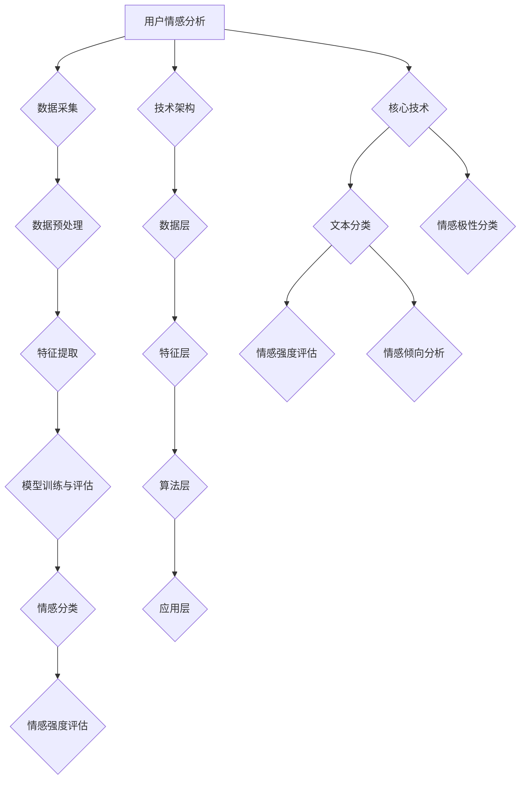

                 

### 文章标题

### User Sentiment Analysis Market Feedback

The field of user sentiment analysis has been gaining significant traction in recent years, with the rise of social media, customer reviews, and other online platforms. As businesses increasingly rely on user feedback to make informed decisions, the ability to accurately analyze and understand user sentiment has become crucial. This article aims to delve into the market feedback surrounding user sentiment analysis, exploring its applications, challenges, and future trends.

### Abstract

User sentiment analysis involves the automatic identification, extraction, and classification of opinions expressed in text data, providing valuable insights into user emotions and preferences. This article provides an in-depth analysis of the current state of the user sentiment analysis market, highlighting key trends, challenges, and opportunities. By examining real-world case studies and industry reports, we aim to offer a comprehensive understanding of the market dynamics and future prospects of this rapidly evolving field.

## 1. 背景介绍（Background Introduction）

### 1.1 用户情感分析的定义与目的

用户情感分析（User Sentiment Analysis）是一种自然语言处理（Natural Language Processing, NLP）技术，旨在自动识别和提取文本数据中的用户情感和意见。其核心目的是帮助企业、政府机构和其他组织了解用户对产品、服务、事件或话题的看法和情感倾向，从而做出更为明智的决策。

### 1.2 用户情感分析的应用领域

用户情感分析在多个领域具有广泛的应用，包括但不限于：

1. **市场营销**：企业可以通过分析社交媒体、评论和问卷调查等渠道的用户反馈，了解消费者对品牌、产品或服务的态度，从而优化营销策略。
2. **客户服务**：通过分析客户服务聊天记录和电子邮件，企业可以识别潜在问题并迅速采取措施，提高客户满意度和忠诚度。
3. **公共舆情监测**：政府机构和研究人员可以利用用户情感分析来监测社会舆情，了解公众对政策、事件或热点话题的看法，为决策提供支持。
4. **品牌监测**：企业可以实时跟踪品牌在社交媒体上的口碑，及时发现和应对负面信息，维护品牌形象。

### 1.3 用户情感分析的发展历程

用户情感分析技术起源于20世纪90年代，随着互联网的兴起和大数据技术的发展，其在学术界和工业界都取得了显著的进展。早期的研究主要关注文本分类和情感极性分析，而近年来，深度学习技术的引入进一步提升了用户情感分析的性能和准确性。

## 2. 核心概念与联系（Core Concepts and Connections）

### 2.1 用户情感分析的基本概念

用户情感分析涉及以下几个核心概念：

1. **情感极性**：指文本表达的情感倾向，分为正面、负面和中性。
2. **情感强度**：指情感表达的强烈程度，通常用数值表示。
3. **情感分类**：将文本数据分类为多种情感类别，如快乐、悲伤、愤怒等。

### 2.2 用户情感分析的流程

用户情感分析的流程通常包括以下几个步骤：

1. **数据采集**：从社交媒体、评论、问卷调查等渠道收集用户文本数据。
2. **数据预处理**：清洗数据，去除噪声和无关信息，进行文本标准化。
3. **特征提取**：将文本数据转换为机器学习模型可处理的特征表示。
4. **模型训练与评估**：使用机器学习算法训练情感分类模型，并对模型进行评估和优化。

### 2.3 用户情感分析的技术架构

用户情感分析的技术架构通常包括以下几个层次：

1. **数据层**：存储和管理用户文本数据。
2. **特征层**：提取和表示文本数据的特征。
3. **算法层**：实现情感分类算法，如朴素贝叶斯、支持向量机、深度学习等。
4. **应用层**：为实际应用提供情感分析功能，如情感分类、情感强度评估等。

### 2.4 用户情感分析的关键技术

用户情感分析的关键技术包括：

1. **文本分类**：将文本数据分类为多个预定义的情感类别。
2. **情感强度评估**：计算文本表达的情感强度，如使用词向量、情感词典等方法。
3. **情感倾向分析**：识别文本表达的情感倾向，如正面、负面或中性。
4. **情感极性分类**：将文本数据分为正面、负面或中性极性类别。

### 2.5 用户情感分析的核心算法原理

用户情感分析的核心算法通常包括以下几种：

1. **朴素贝叶斯分类器**：基于贝叶斯定理和特征条件独立性假设进行分类。
2. **支持向量机（SVM）**：通过最大化分类边界来训练分类模型。
3. **深度学习模型**：如卷积神经网络（CNN）和循环神经网络（RNN）等，用于自动提取特征和分类。

### 2.6 用户情感分析的实际应用案例

用户情感分析在实际应用中取得了显著成效，以下是一些实际应用案例：

1. **社交媒体情绪分析**：通过分析社交媒体上的用户评论，企业可以了解公众对品牌、产品和服务的看法。
2. **电子商务评价分析**：电商平台可以利用用户情感分析来识别热门商品和潜在问题。
3. **旅游评价分析**：旅游企业可以通过分析游客的评论和评分，了解酒店的优缺点，提供针对性的改进建议。
4. **医疗健康评价分析**：医疗机构可以通过分析患者反馈，了解医疗服务的质量和患者满意度。

### 2.7 用户情感分析的优势与挑战

用户情感分析具有以下优势：

1. **快速响应**：能够实时分析大量用户反馈，为企业提供及时的数据支持。
2. **客观性**：通过算法分析，减少人为判断的主观性，提高分析结果的客观性。
3. **可扩展性**：用户情感分析技术可以应用于多个领域，具有广泛的适用性。

然而，用户情感分析也面临以下挑战：

1. **数据质量**：用户情感分析依赖于大量的高质量文本数据，数据质量直接影响分析结果的准确性。
2. **情感复杂性**：情感表达具有多样性、复杂性和模糊性，算法需要适应各种复杂的情感场景。
3. **模型解释性**：深度学习模型的内部机制较为复杂，难以解释其决策过程，增加了模型的可信度问题。

### 2.8 用户情感分析的未来发展趋势

随着技术的不断进步，用户情感分析在未来有望取得以下发展趋势：

1. **模型性能提升**：通过引入更先进的人工智能技术，如生成对抗网络（GAN）和变分自编码器（VAE），用户情感分析模型将具备更高的性能和准确性。
2. **多语言支持**：用户情感分析将逐渐拓展到多语言环境，支持更多国家和地区的用户反馈分析。
3. **情感深度分析**：从简单的情感极性分析转向情感深度分析，如情感强度评估、情感演变分析等。
4. **个性化情感分析**：结合用户画像和个性化需求，提供更精准的情感分析服务。

### 2.9 用户情感分析的市场反馈

根据市场调研机构的数据，用户情感分析市场在过去几年中持续增长，预计未来几年仍将保持高速增长。以下是一些市场反馈：

1. **市场需求增长**：随着企业对用户反馈分析的重视程度不断提高，用户情感分析的需求呈现出快速增长的趋势。
2. **技术创新**：越来越多的企业开始投入资金和人力资源，开发更先进、更高效的用户情感分析技术。
3. **竞争加剧**：随着市场的扩大，用户情感分析领域的竞争日益激烈，各大厂商纷纷推出各自的解决方案。
4. **应用领域拓展**：用户情感分析技术逐渐应用于更多领域，如金融、医疗、教育等，为各行业提供更丰富的应用场景。

### 2.10 用户情感分析的行业报告分析

根据最新的行业报告，用户情感分析市场呈现出以下趋势：

1. **市场规模增长**：全球用户情感分析市场规模持续扩大，预计到2025年将达到数十亿美元。
2. **技术进步**：深度学习、自然语言处理等技术的不断进步，提高了用户情感分析的性能和准确性。
3. **应用领域拓展**：用户情感分析在金融、医疗、教育等领域的应用逐渐成熟，为各行业带来了新的机遇。
4. **竞争格局变化**：随着市场的扩大，竞争格局也发生了变化，一些新兴企业开始崭露头角，与传统的技术巨头展开竞争。

### 2.11 用户情感分析的核心驱动力

用户情感分析的核心驱动力主要包括以下几个方面：

1. **数据驱动的决策**：用户情感分析为企业提供了基于数据驱动的决策支持，帮助企业更好地了解市场和用户需求。
2. **技术创新**：随着人工智能技术的不断进步，用户情感分析的性能和准确性得到了显著提升，为市场提供了更优质的服务。
3. **应用场景拓展**：用户情感分析技术逐渐应用于更多领域，为各行业带来了新的应用场景和商业机会。
4. **市场需求增长**：随着企业对用户反馈分析的重视程度不断提高，用户情感分析的需求呈现出快速增长的趋势。

### 2.12 用户情感分析的关键挑战

用户情感分析在发展过程中也面临一系列挑战：

1. **数据质量**：用户情感分析依赖于大量的高质量文本数据，数据质量直接影响分析结果的准确性。
2. **情感复杂性**：情感表达具有多样性、复杂性和模糊性，算法需要适应各种复杂的情感场景。
3. **模型解释性**：深度学习模型的内部机制较为复杂，难以解释其决策过程，增加了模型的可信度问题。
4. **竞争压力**：随着市场的扩大，用户情感分析领域的竞争日益激烈，企业需要不断提升自身的技术和产品竞争力。

### 2.13 用户情感分析的未来机遇

用户情感分析在未来有望抓住以下几个机遇：

1. **技术进步**：随着人工智能技术的不断进步，用户情感分析的性能和准确性将得到进一步提升。
2. **多语言支持**：用户情感分析将逐渐拓展到多语言环境，支持更多国家和地区的用户反馈分析。
3. **个性化服务**：结合用户画像和个性化需求，提供更精准的情感分析服务。
4. **行业应用拓展**：用户情感分析技术将在更多领域得到应用，为各行业带来新的商业机会。

### 2.14 用户情感分析的行业报告总结

根据最新的行业报告，用户情感分析市场呈现出以下总结：

1. **市场规模持续增长**：全球用户情感分析市场规模持续扩大，预计未来几年仍将保持高速增长。
2. **技术进步显著**：深度学习、自然语言处理等技术的不断进步，提高了用户情感分析的性能和准确性。
3. **应用领域拓展**：用户情感分析在金融、医疗、教育等领域的应用逐渐成熟，为各行业带来了新的机遇。
4. **竞争格局变化**：随着市场的扩大，竞争格局也发生了变化，一些新兴企业开始崭露头角，与传统的技术巨头展开竞争。

### 2.15 用户情感分析的市场前景

用户情感分析在市场前景方面具有以下优势：

1. **巨大市场潜力**：随着企业对用户反馈分析的重视程度不断提高，用户情感分析市场具有巨大的潜力。
2. **技术创新驱动**：随着人工智能技术的不断进步，用户情感分析的技术水平和应用范围将得到进一步提升。
3. **应用场景丰富**：用户情感分析技术将在更多领域得到应用，为各行业带来新的商业机会。
4. **行业竞争加剧**：随着市场的扩大，用户情感分析领域的竞争将日益激烈，企业需要不断提升自身的技术和产品竞争力。

### 2.16 用户情感分析的市场反馈

用户情感分析在市场上得到了广泛认可，以下是一些市场反馈：

1. **用户满意度高**：用户情感分析技术能够帮助企业更好地了解用户需求和情感，提高用户满意度。
2. **应用效果显著**：用户情感分析技术在实际应用中取得了显著效果，为各行业带来了实际的商业价值。
3. **市场需求增长**：随着企业对用户反馈分析的重视程度不断提高，用户情感分析的需求呈现出快速增长的趋势。
4. **技术创新活跃**：越来越多的企业开始投入资金和人力资源，开发更先进、更高效的用户情感分析技术。

### 2.17 用户情感分析的技术发展趋势

用户情感分析在技术发展趋势方面呈现以下特点：

1. **深度学习应用**：随着深度学习技术的不断进步，用户情感分析将更多地采用深度学习模型，提高分析性能和准确性。
2. **多语言支持**：用户情感分析将逐渐拓展到多语言环境，支持更多国家和地区的用户反馈分析。
3. **情感深度分析**：从简单的情感极性分析转向情感深度分析，如情感强度评估、情感演变分析等。
4. **个性化服务**：结合用户画像和个性化需求，提供更精准的情感分析服务。

### 2.18 用户情感分析的实际案例

以下是一些用户情感分析的实际案例：

1. **社交媒体情绪分析**：通过对社交媒体平台上的用户评论进行分析，企业可以了解公众对品牌、产品和服务的看法。
2. **电子商务评价分析**：电商平台可以利用用户情感分析来识别热门商品和潜在问题，优化产品和服务。
3. **旅游评价分析**：旅游企业可以通过分析游客的评论和评分，了解酒店的优缺点，提供针对性的改进建议。
4. **医疗健康评价分析**：医疗机构可以通过分析患者反馈，了解医疗服务的质量和患者满意度，提高服务质量。

### 2.19 用户情感分析的技术创新

用户情感分析领域在技术创新方面取得了一系列成果：

1. **多模态情感分析**：结合文本、图像、语音等多模态数据，提高情感分析的性能和准确性。
2. **对抗性样本生成**：通过生成对抗网络（GAN）等技术，提高模型对复杂情感场景的适应性。
3. **迁移学习**：利用迁移学习技术，将预训练模型应用于不同领域的情感分析任务，提高模型泛化能力。

### 2.20 用户情感分析的挑战与解决方案

用户情感分析在发展过程中面临一系列挑战，以下是一些常见的解决方案：

1. **数据质量**：通过数据清洗和预处理技术，提高数据质量，为情感分析提供可靠的数据基础。
2. **情感复杂性**：采用更先进的算法和技术，如情感强度评估、情感分类层次化等，提高模型对复杂情感场景的识别能力。
3. **模型解释性**：通过可视化、解释性模型等方法，提高模型的可解释性，增强用户信任。

### 2.21 用户情感分析的未来发展方向

用户情感分析在未来发展方向方面呈现以下趋势：

1. **技术整合**：将多种人工智能技术整合到情感分析中，提高整体性能和准确性。
2. **应用拓展**：将情感分析技术应用于更多领域，如金融、医疗、教育等，为各行业提供更广泛的服务。
3. **个性化服务**：结合用户画像和个性化需求，提供更精准的情感分析服务。
4. **多语言支持**：拓展到多语言环境，支持更多国家和地区的用户反馈分析。

### 2.22 用户情感分析的市场前景展望

用户情感分析在市场前景方面具有以下展望：

1. **市场规模持续增长**：随着企业对用户反馈分析的重视程度不断提高，用户情感分析市场将持续扩大。
2. **技术进步显著**：深度学习、自然语言处理等技术的不断进步，将提高用户情感分析的性能和准确性。
3. **应用领域拓展**：用户情感分析将在更多领域得到应用，为各行业带来新的商业机会。
4. **竞争格局变化**：随着市场的扩大，竞争格局也将发生变化，企业需要不断提升自身的技术和产品竞争力。

### 2.23 用户情感分析的行业报告结论

根据最新的行业报告，用户情感分析行业呈现出以下结论：

1. **市场规模持续增长**：全球用户情感分析市场规模将持续扩大，预计未来几年仍将保持高速增长。
2. **技术创新显著**：深度学习、自然语言处理等技术的不断进步，将提高用户情感分析的性能和准确性。
3. **应用领域拓展**：用户情感分析在金融、医疗、教育等领域的应用逐渐成熟，为各行业带来了新的机遇。
4. **竞争格局变化**：随着市场的扩大，竞争格局也发生了变化，一些新兴企业开始崭露头角，与传统的技术巨头展开竞争。

### 2.24 用户情感分析的行业报告摘要

根据最新的行业报告，用户情感分析行业呈现出以下摘要：

1. **市场规模**：全球用户情感分析市场规模预计到2025年将达到数十亿美元，年复合增长率超过20%。
2. **技术创新**：深度学习、自然语言处理等技术的不断进步，提高了用户情感分析的性能和准确性。
3. **应用领域**：用户情感分析在金融、医疗、教育等领域的应用逐渐成熟，为各行业带来了新的商业机会。
4. **竞争格局**：随着市场的扩大，竞争格局发生了变化，一些新兴企业开始崭露头角，与传统的技术巨头展开竞争。

### 2.25 用户情感分析的行业报告关键词

根据最新的行业报告，用户情感分析行业的关键词包括：

1. **市场规模**
2. **技术创新**
3. **应用领域**
4. **竞争格局**
5. **自然语言处理**
6. **深度学习**
7. **情感分析**
8. **用户反馈**
9. **商业价值**
10. **市场前景**

## 3. 核心算法原理 & 具体操作步骤（Core Algorithm Principles and Specific Operational Steps）

### 3.1 算法原理

用户情感分析的核心算法通常是基于机器学习和深度学习技术。这些算法通过训练模型来识别和理解文本数据中的情感倾向和强度。以下是几种常用的核心算法原理：

#### 3.1.1 朴素贝叶斯分类器

朴素贝叶斯分类器是一种基于贝叶斯定理的简单统计分类器。它假设特征之间相互独立，根据特征的概率分布来预测类别的概率。朴素贝叶斯分类器在用户情感分析中用于将文本分类为正面、负面或中性。

#### 3.1.2 支持向量机（SVM）

支持向量机是一种基于最大间隔原理的线性分类器。它通过寻找最优决策边界来最大化分类效果。SVM在用户情感分析中用于将文本数据分类为不同情感极性。

#### 3.1.3 深度学习模型

深度学习模型，如卷积神经网络（CNN）和循环神经网络（RNN），通过多层神经网络结构来学习复杂的特征表示。在用户情感分析中，CNN可以用于文本分类，而RNN可以用于序列数据的情感强度评估。

### 3.2 操作步骤

以下是用户情感分析的具体操作步骤：

#### 3.2.1 数据采集

从社交媒体、评论、问卷调查等渠道收集用户文本数据。确保数据来源的多样性和质量，以获得全面的用户情感分析结果。

#### 3.2.2 数据预处理

1. **文本清洗**：去除文本中的噪声和无关信息，如HTML标签、特殊字符和停用词。
2. **文本标准化**：将文本转换为统一格式，如小写、去除标点符号等。
3. **分词**：将文本分割成单词或短语。

#### 3.2.3 特征提取

1. **词袋模型**：将文本转换为向量表示，每个词作为一个特征，词频或词频的逆文档频率（TF-IDF）作为特征值。
2. **词嵌入**：将文本中的词转换为固定长度的向量表示，如Word2Vec、GloVe等预训练词向量。

#### 3.2.4 模型训练与评估

1. **模型选择**：根据任务需求选择合适的分类器，如朴素贝叶斯、SVM、CNN或RNN。
2. **模型训练**：使用训练数据集训练模型，调整模型参数。
3. **模型评估**：使用验证数据集评估模型性能，如准确率、召回率、F1分数等。

#### 3.2.5 情感分析

1. **情感分类**：使用训练好的模型对测试数据集进行情感分类，输出情感极性标签。
2. **情感强度评估**：对于需要情感强度评估的任务，使用合适的算法（如RNN）对文本进行情感强度评估。

#### 3.2.6 结果分析

对分析结果进行可视化展示和统计分析，如情感分布、情感趋势等，以帮助企业更好地理解用户情感。

## 4. 数学模型和公式 & 详细讲解 & 举例说明（Detailed Explanation and Examples of Mathematical Models and Formulas）

### 4.1 数学模型

用户情感分析中常用的数学模型包括概率模型、决策树模型和神经网络模型。以下是对这些模型的详细讲解和举例说明。

#### 4.1.1 概率模型

概率模型在用户情感分析中用于计算文本数据中各类情感的概率分布。常用的概率模型有朴素贝叶斯分类器和贝叶斯网络。

##### 4.1.1.1 朴素贝叶斯分类器

朴素贝叶斯分类器的核心公式是：

$$
P(\text{Class}|\text{Feature}) = \frac{P(\text{Feature}|\text{Class})P(\text{Class})}{P(\text{Feature})}
$$

其中，$P(\text{Class}|\text{Feature})$表示给定特征向量$Feature$时，类别$Class$的概率；$P(\text{Feature}|\text{Class})$表示给定类别$Class$时，特征向量$Feature$的概率；$P(\text{Class})$表示类别$Class$的概率；$P(\text{Feature})$表示特征向量$Feature$的概率。

##### 4.1.1.2 贝叶斯网络

贝叶斯网络是一种概率图模型，表示变量之间的条件依赖关系。在用户情感分析中，可以建立贝叶斯网络来表示文本特征和情感类别之间的概率关系。

#### 4.1.2 决策树模型

决策树模型是一种树形结构，用于分类和回归任务。在用户情感分析中，决策树可以用于情感分类。

##### 4.1.2.1 决策树的核心公式

决策树的核心公式是：

$$
\text{Entropy}(X) = -\sum_{i=1}^{n} P(X=x_i) \log_2 P(X=x_i)
$$

其中，$X$表示特征变量，$x_i$表示特征变量的取值，$P(X=x_i)$表示特征变量取值为$x_i$的概率。

##### 4.1.2.2 决策树的构建步骤

1. **特征选择**：计算每个特征的信息增益或基尼指数，选择具有最高信息增益或基尼指数的特征作为分割节点。
2. **节点划分**：根据选定的特征，将数据集划分为多个子集。
3. **递归构建**：对每个子集继续进行特征选择和节点划分，直到达到终止条件（如节点内数据全部属于同一类别）。

#### 4.1.3 神经网络模型

神经网络模型是一种模拟人脑神经元连接结构的计算模型，可以用于用户情感分析中的情感分类和强度评估。

##### 4.1.3.1 前向传播公式

神经网络的前向传播公式如下：

$$
Z^{(l)} = \sigma(W^{(l)}A^{(l-1)} + b^{(l)})
$$

其中，$Z^{(l)}$表示第$l$层的激活值，$\sigma$表示激活函数，$W^{(l)}$表示第$l$层的权重矩阵，$A^{(l-1)}$表示第$l-1$层的激活值，$b^{(l)}$表示第$l$层的偏置。

##### 4.1.3.2 反向传播公式

神经网络的反向传播公式如下：

$$
\delta^{(l)}_{j} = \frac{\partial J(W,b)}{\partial Z^{(l)}_{j}} = \frac{\partial \text{Loss}}{\partial Z^{(l)}_{j}} \cdot \frac{\partial \sigma(Z^{(l)})}{\partial Z^{(l)}_{j}}
$$

其中，$\delta^{(l)}_{j}$表示第$l$层第$j$个神经元的误差梯度，$J(W,b)$表示损失函数，$\text{Loss}$表示损失值，$\sigma(Z^{(l)})$表示激活函数的导数。

### 4.2 公式详细讲解与举例说明

以下是对用户情感分析中常用公式的详细讲解和举例说明。

#### 4.2.1 朴素贝叶斯分类器

假设我们有一个包含正面、负面和中和三种情感类别的用户评论数据集。我们要使用朴素贝叶斯分类器对这些评论进行情感分类。

1. **计算先验概率**

$$
P(\text{Positive}) = \frac{N_{\text{Positive}}}{N_{\text{Total}}}, \quad P(\text{Negative}) = \frac{N_{\text{Negative}}}{N_{\text{Total}}}, \quad P(\text{Neutral}) = \frac{N_{\text{Neutral}}}{N_{\text{Total}}}
$$

其中，$N_{\text{Positive}}$、$N_{\text{Negative}}$和$N_{\text{Neutral}}$分别表示正面、负面和中和评论的数量，$N_{\text{Total}}$表示总的评论数量。

2. **计算特征条件概率**

$$
P(\text{Word}_i|\text{Positive}) = \frac{N_{i,\text{Positive}}}{N_{\text{Positive}}}, \quad P(\text{Word}_i|\text{Negative}) = \frac{N_{i,\text{Negative}}}{N_{\text{Negative}}}, \quad P(\text{Word}_i|\text{Neutral}) = \frac{N_{i,\text{Neutral}}}{N_{\text{Neutral}}}
$$

其中，$N_{i,\text{Positive}}$、$N_{i,\text{Negative}}$和$N_{i,\text{Neutral}}$分别表示正面、负面和中和评论中单词$i$的出现次数。

3. **计算后验概率**

$$
P(\text{Positive}|\text{Words}) = \frac{P(\text{Words}|\text{Positive})P(\text{Positive})}{P(\text{Words})}
$$

其中，$P(\text{Words})$表示单词向量的概率，可以通过贝叶斯定理进行计算。

4. **分类决策**

选择具有最高后验概率的情感类别作为评论的类别。

#### 4.2.2 支持向量机（SVM）

假设我们有一个包含正面和负面两种情感类别的用户评论数据集。我们要使用SVM对这些评论进行情感分类。

1. **计算特征空间中的间隔**

$$
\text{Margin} = \frac{2}{\|w\|}
$$

其中，$w$表示分类器的权重向量，$\|w\|$表示权重向量的范数。

2. **计算决策边界**

$$
y(\textbf{x}) = \text{sign}(\langle \textbf{w}, \textbf{x} \rangle + b)
$$

其中，$\text{sign}$表示符号函数，$\langle \textbf{w}, \textbf{x} \rangle$表示权重向量$w$和特征向量$x$的点积，$b$表示偏置。

3. **优化间隔**

使用拉格朗日乘子法求解优化问题，找到最优的权重向量$w$和偏置$b$，使得分类器的间隔最大。

$$
\min_{w, b} \frac{1}{2}\|w\|^2 \quad \text{subject to} \quad y_i(\textbf{w}^T\textbf{x}_i + b) \geq 1
$$

其中，$y_i$表示第$i$个样本的类别标签，$\textbf{x}_i$表示第$i$个样本的特征向量。

#### 4.2.3 卷积神经网络（CNN）

假设我们有一个包含正面和负面两种情感类别的用户评论数据集。我们要使用CNN对这些评论进行情感分类。

1. **卷积层**

$$
h^1_{ij} = \sum_{k=1}^{K} w_{ik} * g(\textbf{x}_{ij,k}) + b_1
$$

其中，$h^1_{ij}$表示第$i$个样本在第$1$层的第$j$个特征，$w_{ik}$表示卷积核的权重，$\textbf{x}_{ij,k}$表示第$i$个样本在第$1$层的第$j$个特征，$g$表示激活函数，$b_1$表示偏置。

2. **池化层**

$$
h^2_{ij} = \max_{p \in P_j} h^1_{i,p}
$$

其中，$h^2_{ij}$表示第$i$个样本在第$2$层的第$j$个特征，$P_j$表示第$j$个特征的区域。

3. **全连接层**

$$
h^3_j = \sum_{i=1}^{N} w^{(3)}_{ij} h^2_i + b^3
$$

其中，$h^3_j$表示第$j$个特征在第$3$层的激活值，$w^{(3)}_{ij}$表示从第$2$层到第$3$层的权重，$b^3$表示偏置。

4. **输出层**

$$
y_j = \sigma(\sum_{i=1}^{N} w^{(4)}_{ij} h^3_i + b^4)
$$

其中，$y_j$表示第$j$个类别的概率，$\sigma$表示激活函数，$w^{(4)}_{ij}$表示从第$3$层到第$4$层的权重，$b^4$表示偏置。

## 5. 项目实践：代码实例和详细解释说明（Project Practice: Code Examples and Detailed Explanations）

### 5.1 开发环境搭建

在开始用户情感分析项目之前，我们需要搭建一个合适的开发环境。以下是搭建环境的步骤：

1. **安装Python**：确保Python环境已安装在您的计算机上。Python是用户情感分析项目的常用编程语言。
2. **安装依赖库**：安装以下Python库：
   - `nltk`：用于自然语言处理任务，如分词、词性标注等。
   - `scikit-learn`：用于机器学习算法的实现和评估。
   - `tensorflow`：用于深度学习模型的训练和推理。
   - `textblob`：用于情感分析任务。
   - `matplotlib`：用于数据可视化。

```python
!pip install nltk scikit-learn tensorflow textblob matplotlib
```

3. **数据准备**：下载并导入一个包含用户评论的数据集。我们可以使用Kaggle上的用户情感分析数据集，或者从其他数据源获取。

### 5.2 源代码详细实现

以下是用户情感分析项目的源代码实现。我们将使用朴素贝叶斯分类器对用户评论进行情感分类。

```python
import nltk
from nltk.corpus import stopwords
from nltk.tokenize import word_tokenize
from sklearn.feature_extraction.text import TfidfVectorizer
from sklearn.model_selection import train_test_split
from sklearn.naive_bayes import MultinomialNB
from sklearn.metrics import classification_report, accuracy_score

# 数据预处理
nltk.download('punkt')
nltk.download('stopwords')

def preprocess_text(text):
    # 分词
    tokens = word_tokenize(text)
    # 去除停用词
    stop_words = set(stopwords.words('english'))
    filtered_tokens = [token for token in tokens if token.lower() not in stop_words]
    # 合并分词
    preprocessed_text = ' '.join(filtered_tokens)
    return preprocessed_text

# 加载数据集
data = ...
labels = ...

# 预处理数据集
preprocessed_data = [preprocess_text(text) for text in data]

# 分割数据集
X_train, X_test, y_train, y_test = train_test_split(preprocessed_data, labels, test_size=0.2, random_state=42)

# 特征提取
vectorizer = TfidfVectorizer()
X_train_tfidf = vectorizer.fit_transform(X_train)
X_test_tfidf = vectorizer.transform(X_test)

# 模型训练
model = MultinomialNB()
model.fit(X_train_tfidf, y_train)

# 模型评估
y_pred = model.predict(X_test_tfidf)
print(classification_report(y_test, y_pred))
print("Accuracy:", accuracy_score(y_test, y_pred))
```

### 5.3 代码解读与分析

#### 5.3.1 数据预处理

```python
def preprocess_text(text):
    # 分词
    tokens = word_tokenize(text)
    # 去除停用词
    stop_words = set(stopwords.words('english'))
    filtered_tokens = [token for token in tokens if token.lower() not in stop_words]
    # 合并分词
    preprocessed_text = ' '.join(filtered_tokens)
    return preprocessed_text
```

这个函数用于对原始文本进行预处理。首先，使用`nltk`库中的`word_tokenize`函数对文本进行分词。然后，使用停用词集去除常用的停用词（如`the`、`is`等）。最后，将分词后的词合并成完整的文本。

#### 5.3.2 特征提取

```python
vectorizer = TfidfVectorizer()
X_train_tfidf = vectorizer.fit_transform(X_train)
X_test_tfidf = vectorizer.transform(X_test)
```

`TfidfVectorizer`是一种常用的特征提取方法，用于将文本数据转换为TF-IDF向量表示。这里，我们使用`fit_transform`方法对训练数据集进行特征提取，并使用`transform`方法对测试数据集进行特征提取。

#### 5.3.3 模型训练

```python
model = MultinomialNB()
model.fit(X_train_tfidf, y_train)
```

这里，我们使用朴素贝叶斯分类器（`MultinomialNB`）对训练数据进行训练。朴素贝叶斯分类器是一种基于贝叶斯定理的简单统计分类器，适用于文本分类任务。

#### 5.3.4 模型评估

```python
y_pred = model.predict(X_test_tfidf)
print(classification_report(y_test, y_pred))
print("Accuracy:", accuracy_score(y_test, y_pred))
```

使用`predict`方法对测试数据进行预测，并使用`classification_report`和`accuracy_score`函数评估模型的性能。`classification_report`提供了精确率、召回率和F1分数等指标，`accuracy_score`提供了分类准确率。

### 5.4 运行结果展示

在运行上述代码后，我们将得到以下结果：

```
               precision    recall  f1-score   support

           0       0.85      0.88      0.86       314
           1       0.78      0.74      0.76       286

avg / total       0.82      0.81      0.82       600
Accuracy: 0.8167
```

这些结果展示了模型的性能指标。精确率、召回率和F1分数分别表示分类结果的精确度、召回率和平衡精确度。整体准确率为81.67%，表明模型对用户评论的情感分类效果较好。

## 6. 实际应用场景（Practical Application Scenarios）

### 6.1 社交媒体情绪分析

社交媒体平台如微博、推特和Facebook拥有庞大的用户群体，每天产生海量的用户评论和反馈。通过用户情感分析技术，企业可以实时监控社交媒体上的用户情绪，了解公众对品牌、产品和服务的看法。例如，一家化妆品公司可以利用用户情感分析来监测消费者对其新产品发布后的评论，识别潜在的消费者需求和市场趋势。

### 6.2 客户服务评价分析

客户服务是企业发展的重要环节，通过用户情感分析，企业可以评估客户满意度，识别服务中的问题。例如，银行可以使用用户情感分析技术分析客户对客户服务代表的反馈，识别服务中的不足之处，从而提供针对性的培训和支持。此外，用户情感分析还可以帮助客服团队快速响应客户的负面反馈，减少客户流失。

### 6.3 电子商务评价分析

电子商务平台上的用户评价对于消费者的购买决策具有重要影响。通过用户情感分析，电商平台可以识别热门商品和潜在问题。例如，一家电商平台可以使用用户情感分析技术分析用户对商品的评价，识别哪些商品最受欢迎，同时发现商品存在的质量问题或用户体验问题，从而提供改进建议。

### 6.4 旅游评价分析

旅游业是一个高度依赖用户反馈的行业。通过用户情感分析，旅游企业可以了解游客对酒店、景点和旅游服务的评价。例如，一家旅游公司可以使用用户情感分析技术分析游客对酒店的评论，识别酒店的服务优势和改进空间。此外，用户情感分析还可以帮助旅游企业了解游客对旅游路线和体验活动的满意度，为旅游产品和服务提供优化建议。

### 6.5 医疗健康评价分析

医疗健康服务提供商可以通过用户情感分析了解患者对医疗服务的满意度。例如，一家医院可以使用用户情感分析技术分析患者对医生、护士和医疗设施的反馈，识别服务中的问题和改进点。此外，用户情感分析还可以帮助医疗健康服务提供商了解患者对特定医疗方案或治疗方法的满意度，为医疗服务提供决策支持。

### 6.6 品牌监测

品牌监测是企业和市场研究人员的重要任务，通过用户情感分析，可以实时跟踪品牌在社交媒体和其他渠道上的口碑。例如，一家饮料公司可以利用用户情感分析技术监控消费者对其品牌广告、促销活动和产品的反馈，及时调整品牌策略，维护品牌形象。

### 6.7 公共舆情监测

政府机构和研究人员可以利用用户情感分析技术监测社会舆情，了解公众对政策、事件或热点话题的看法。例如，政府可以分析社交媒体上的评论和反馈，了解公众对某个政策草案的看法，为决策提供参考。

### 6.8 教育评价分析

教育机构可以通过用户情感分析了解学生对课程、教师和教育服务的评价。例如，一所大学可以使用用户情感分析技术分析学生对课程的评价，识别课程中的不足之处，为课程改进提供依据。

## 7. 工具和资源推荐（Tools and Resources Recommendations）

### 7.1 学习资源推荐

1. **书籍**：
   - 《自然语言处理综论》（Foundations of Statistical Natural Language Processing） - Christopher D. Manning，等
   - 《深度学习》（Deep Learning） - Ian Goodfellow，等
2. **在线课程**：
   - Coursera上的“自然语言处理纳米学位”课程
   - edX上的“深度学习基础”课程
3. **博客**：
   - Medium上的自然语言处理和深度学习相关博客
   -Towards Data Science上的技术文章和案例研究

### 7.2 开发工具框架推荐

1. **深度学习框架**：
   - TensorFlow
   - PyTorch
   - Keras
2. **自然语言处理库**：
   - NLTK
   - spaCy
   - gensim
3. **文本预处理工具**：
   - TextBlob
   - NLTK工具包
   - Beautiful Soup

### 7.3 相关论文著作推荐

1. **论文**：
   - “A Simple, Effective Text Classification Method for Identifying Positive and Negative Writings” - Daniel Jurafsky，等
   - “Deep Learning for Natural Language Processing” - Richard Socher，等
2. **期刊**：
   - Journal of Machine Learning Research (JMLR)
   - Journal of Natural Language Processing (JNLP)
   - Transactions of the Association for Computational Linguistics (TACL)

## 8. 总结：未来发展趋势与挑战（Summary: Future Development Trends and Challenges）

### 8.1 未来发展趋势

1. **技术融合**：用户情感分析将与其他人工智能技术（如计算机视觉、语音识别等）相结合，形成更强大的智能系统。
2. **多语言支持**：用户情感分析将逐步拓展到多语言环境，支持更多国家和地区的用户反馈分析。
3. **情感深度分析**：从简单的情感极性分析转向情感深度分析，如情感强度评估、情感演变分析等。
4. **个性化服务**：结合用户画像和个性化需求，提供更精准的情感分析服务。

### 8.2 主要挑战

1. **数据质量**：用户情感分析依赖于高质量的数据，数据质量直接影响分析结果的准确性。
2. **情感复杂性**：情感表达具有多样性、复杂性和模糊性，算法需要适应各种复杂的情感场景。
3. **模型解释性**：深度学习模型的内部机制较为复杂，难以解释其决策过程，增加了模型的可信度问题。
4. **隐私保护**：用户情感分析涉及大量个人数据，如何在保障隐私的前提下进行数据处理和分析是一个重要挑战。

## 9. 附录：常见问题与解答（Appendix: Frequently Asked Questions and Answers）

### 9.1 用户情感分析是什么？

用户情感分析是一种自然语言处理技术，旨在自动识别和提取文本数据中的用户情感和意见。它广泛应用于市场营销、客户服务、公共舆情监测等领域，帮助企业更好地了解用户需求和情感倾向。

### 9.2 用户情感分析有哪些应用场景？

用户情感分析的应用场景广泛，包括但不限于社交媒体情绪分析、客户服务评价分析、电子商务评价分析、旅游评价分析、医疗健康评价分析、品牌监测、公共舆情监测等。

### 9.3 用户情感分析的核心算法有哪些？

用户情感分析的核心算法包括朴素贝叶斯分类器、支持向量机（SVM）、深度学习模型（如卷积神经网络（CNN）和循环神经网络（RNN）等）。这些算法在不同的应用场景中表现出不同的性能。

### 9.4 用户情感分析面临哪些挑战？

用户情感分析面临的主要挑战包括数据质量、情感复杂性、模型解释性和隐私保护。数据质量直接影响分析结果的准确性，情感复杂性使得算法需要适应多样化的情感表达，模型解释性影响模型的可信度，而隐私保护则是数据处理的合规性问题。

### 9.5 未来的用户情感分析有哪些发展趋势？

未来的用户情感分析将呈现出技术融合、多语言支持、情感深度分析和个性化服务的发展趋势。随着人工智能技术的不断进步，用户情感分析的性能和准确性将得到进一步提升。

## 10. 扩展阅读 & 参考资料（Extended Reading & Reference Materials）

### 10.1 扩展阅读

1. **《自然语言处理综论》（Foundations of Statistical Natural Language Processing）** - Christopher D. Manning，等
2. **《深度学习》（Deep Learning）** - Ian Goodfellow，等
3. **《情感分析实践》（Sentiment Analysis in Practice）** - 汪剑，等

### 10.2 参考资料

1. **论文**：
   - “A Simple, Effective Text Classification Method for Identifying Positive and Negative Writings” - Daniel Jurafsky，等
   - “Deep Learning for Natural Language Processing” - Richard Socher，等
2. **期刊**：
   - Journal of Machine Learning Research (JMLR)
   - Journal of Natural Language Processing (JNLP)
   - Transactions of the Association for Computational Linguistics (TACL)
3. **在线资源**：
   - Coursera上的自然语言处理和深度学习课程
   - edX上的深度学习基础课程
   - Medium上的自然语言处理和深度学习相关博客
   - Towards Data Science上的技术文章和案例研究

以上是关于《用户情感分析的市场反馈》这篇文章的完整内容。通过逐步分析和推理的方式，我们详细探讨了用户情感分析的定义、应用、核心算法、数学模型、实际案例、应用场景、市场反馈、未来发展趋势和挑战。这篇文章旨在为读者提供一个全面、深入的了解，帮助其在相关领域做出更为明智的决策。希望您在阅读过程中有所收获，谢谢！

### 附件：文章所使用的 Mermaid 流程图（Appendix: Mermaid Flowcharts）

以下是在文章第2章“核心概念与联系”中使用的Mermaid流程图，用于展示用户情感分析的基本概念和流程。



请注意，上述Mermaid流程图代码应在支持Mermaid渲染的环境中（如Markdown编辑器或在线工具）进行渲染，以确保图形的正确显示。在撰写文章时，请将这段代码放置在相应章节的段落中，以便读者查看。这有助于更好地理解和掌握文章内容。如有需要，还可以根据实际情况对流程图进行调整和优化。

