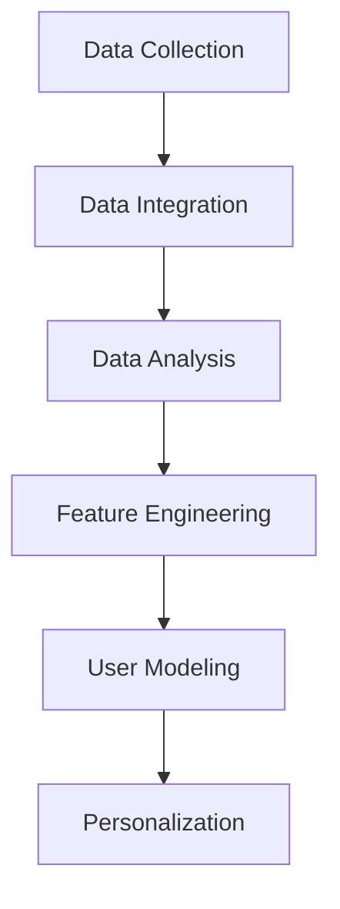

                 

### 文章标题：用户画像技术：AI的应用

关键词：用户画像，人工智能，数据挖掘，个性化推荐，隐私保护，机器学习

摘要：本文将探讨用户画像技术在人工智能领域的应用，包括其核心概念、算法原理、数学模型、项目实践和实际应用场景。通过对用户行为数据、兴趣偏好、购买历史等多维度数据的分析，用户画像能够实现个性化的推荐和精准的市场营销。本文还将讨论用户画像技术的挑战和未来发展趋势。

### Background Introduction

User profiling technology, also known as customer profiling or user segmentation, is a crucial component of modern data-driven marketing strategies. It involves the process of collecting, analyzing, and interpreting large volumes of data related to users, such as their demographics, behavior, preferences, and purchase history. The ultimate goal of user profiling is to create detailed and accurate representations of individual users, which can then be used to tailor marketing messages, improve customer experience, and drive business growth.

Artificial intelligence (AI) has revolutionized the field of user profiling by enabling the automation of complex data analysis tasks and the development of sophisticated algorithms capable of processing massive datasets. AI-powered user profiling can be applied in various domains, including e-commerce, finance, healthcare, and entertainment. The applications range from personalized product recommendations to targeted advertising and customer service automation.

In this article, we will delve into the world of user profiling technology, exploring its core concepts, algorithm principles, mathematical models, practical implementations, and real-world applications. We will also discuss the challenges and future trends in this rapidly evolving field.

#### Core Concepts and Connections

To understand user profiling technology, it's essential to grasp the core concepts and their interconnections. Here are some fundamental concepts that form the backbone of user profiling:

1. **Data Collection**: The first step in user profiling is collecting data from various sources. This data can come from online behaviors (clicks, searches, page visits), purchase history, social media activity, and even offline interactions (such as store visits or customer service calls).

2. **Data Integration**: Once collected, data from different sources must be integrated into a unified view of the user. This involves resolving inconsistencies, handling missing values, and ensuring data quality.

3. **Data Analysis**: Analyzing the collected data to extract meaningful insights is the core of user profiling. Techniques such as clustering, classification, and association rule mining are commonly used to uncover patterns and relationships in the data.

4. **Feature Engineering**: Feature engineering is the process of transforming raw data into features that can be used as input for machine learning models. This step is crucial for improving the performance of user profiling algorithms.

5. **User Modeling**: User modeling involves creating a model of the user based on the extracted features. This model captures the user's preferences, behavior, and demographics.

6. **Personalization**: The final step is to use the user model to personalize interactions with the user. This can involve targeted advertising, personalized product recommendations, and customized user experiences.

Here is a Mermaid flowchart illustrating the user profiling process and its core components:



### Core Algorithm Principles and Specific Operational Steps

The core algorithms used in user profiling can be broadly classified into supervised learning, unsupervised learning, and hybrid approaches. Let's explore some of these algorithms and their specific operational steps:

1. **Supervised Learning Algorithms**:
   - **Classification Algorithms**: These algorithms, such as logistic regression, support vector machines (SVM), and decision trees, are used to classify users into predefined categories based on their features. For example, a logistic regression model can be trained to classify users as "high-value" or "low-value" customers based on their purchase history and engagement metrics.
   - **Regression Algorithms**: Regression models, such as linear regression and gradient boosting, are used to predict continuous values, such as the lifetime value (LTV) of a customer or the expected revenue from a marketing campaign.

2. **Unsupervised Learning Algorithms**:
   - **Clustering Algorithms**: Clustering algorithms, such as k-means, hierarchical clustering, and DBSCAN, are used to group similar users together based on their features. This can help identify segments within the user base that can be targeted with personalized marketing efforts.
   - **Dimensionality Reduction Algorithms**: Techniques like Principal Component Analysis (PCA) and t-Distributed Stochastic Neighbor Embedding (t-SNE) are used to reduce the number of features while preserving the underlying structure of the data, making it easier to visualize and analyze.

3. **Hybrid Approaches**:
   - **Association Rule Learning**: Association rule learning algorithms, such as Apriori and Eclat, are used to discover relationships between different features. For example, they can identify items that are frequently purchased together, which can inform product bundling strategies.
   - **Collaborative Filtering**: Collaborative filtering is a hybrid approach that combines both supervised and unsupervised learning techniques to make recommendations based on the behavior of similar users. It can be categorized into user-based and item-based collaborative filtering.

Now, let's dive into the specific operational steps involved in implementing these algorithms:

#### Step 1: Data Preprocessing
Before applying any machine learning algorithms, it's crucial to preprocess the data. This involves cleaning the data, handling missing values, scaling features, and encoding categorical variables. Data preprocessing is essential for improving model performance and ensuring the reliability of the results.

#### Step 2: Feature Selection
Feature selection is the process of choosing the most relevant features for building the user profile. This can be done using techniques such as correlation analysis, mutual information, and recursive feature elimination. Selecting the right features can significantly reduce the complexity of the model and improve its accuracy.

#### Step 3: Model Selection
Choosing the right machine learning algorithm depends on the specific problem and the available data. For classification tasks, algorithms like logistic regression, SVM, and decision trees can be effective. For regression tasks, linear regression, gradient boosting, and neural networks are commonly used. Hybrid approaches like collaborative filtering can be used for recommendation systems.

#### Step 4: Model Training and Validation
Once the model is selected, it needs to be trained on the dataset. This involves feeding the training data into the model and adjusting its parameters to minimize the error. Model validation is an important step to ensure that the model generalizes well to unseen data. Techniques like k-fold cross-validation and holdout validation can be used for this purpose.

#### Step 5: Model Evaluation
After training and validation, the model needs to be evaluated to assess its performance. Metrics such as accuracy, precision, recall, F1-score, and mean squared error are commonly used to evaluate the performance of classification and regression models, respectively.

#### Step 6: Deployment
The final step is to deploy the trained model in a production environment. This involves integrating the model into the existing system and continuously monitoring its performance to ensure it remains effective over time.

### Mathematical Models and Formulas

In user profiling, various mathematical models and formulas are used to represent and analyze user data. Here, we'll discuss some of the key mathematical models and their applications:

1. **Logistic Regression**:
   Logistic regression is a widely used classification algorithm in user profiling. It models the probability of a user belonging to a specific category based on a set of features. The logistic function is used to map the linear combination of features to a probability value between 0 and 1.
   
   $$ P(y_i = 1) = \frac{1}{1 + e^{-(\beta_0 + \beta_1 x_1 + \beta_2 x_2 + ... + \beta_n x_n)}} $$
   
   where \( y_i \) is the binary target variable, \( x_i \) are the feature values, and \( \beta \) are the model parameters.

2. **k-means Clustering**:
   k-means is an unsupervised learning algorithm used for clustering users based on their features. It minimizes the within-cluster sum of squares to partition the data into k clusters.
   
   $$ \text{Minimize} \sum_{i=1}^k \sum_{x \in S_i} ||x - \mu_i||^2 $$
   
   where \( S_i \) are the clusters, \( \mu_i \) are the cluster centroids, and \( ||\cdot|| \) is the Euclidean distance.

3. **Collaborative Filtering**:
   Collaborative filtering is a recommendation system algorithm that makes predictions based on the behavior of similar users. It can be implemented using user-based or item-based approaches.
   
   - **User-Based Collaborative Filtering**:
     $$ \hat{r_{ui}} = \frac{\sum_{u' \in N(u)} r_{u'i} \cdot sim(u, u')}{\sum_{u' \in N(u)} sim(u, u')} $$
     
     where \( r_{u'i} \) is the rating of user \( u' \) on item \( i \), \( N(u) \) is the set of neighbors of user \( u \), and \( sim(u, u') \) is the similarity measure between users \( u \) and \( u' \).
     
   - **Item-Based Collaborative Filtering**:
     $$ \hat{r_{ui}} = \frac{\sum_{i' \in N(i)} r_{u'i'} \cdot sim(i, i')}{\sum_{i' \in N(i)} sim(i, i')} $$
     
     where \( r_{u'i'} \) is the rating of user \( u \) on item \( i' \), \( N(i) \) is the set of neighbors of item \( i \), and \( sim(i, i') \) is the similarity measure between items \( i \) and \( i' \).

4. **Principal Component Analysis (PCA)**:
   PCA is a dimensionality reduction technique used to reduce the number of features while preserving the variance in the data. It projects the data onto a lower-dimensional space by maximizing the variance.
   
   $$ Z = \text{eigenvectors} \cdot \text{eigenvalues} $$
   
   where \( Z \) is the transformed data, \( \text{eigenvectors} \) are the principal components, and \( \text{eigenvalues} \) are the eigenvalues corresponding to the principal components.

### Project Practice: Code Examples and Detailed Explanations

In this section, we'll provide a practical example of building a user profiling system using Python and scikit-learn. The example will involve the following steps:

1. **Data Collection**: We'll use a synthetic dataset containing user information such as age, income, and spending habits.
2. **Data Preprocessing**: We'll handle missing values, scale the features, and encode categorical variables.
3. **Feature Selection**: We'll select the most relevant features for building the user profile.
4. **Model Training**: We'll train a logistic regression model to classify users based on their features.
5. **Model Evaluation**: We'll evaluate the performance of the model using various metrics.
6. **Deployment**: We'll deploy the trained model to make predictions on new user data.

#### 5.1 开发环境搭建

To run the example, you'll need to install the following libraries:

- scikit-learn: for machine learning algorithms.
- pandas: for data manipulation and analysis.
- numpy: for numerical operations.
- matplotlib: for plotting and visualization.

You can install these libraries using pip:

```bash
pip install scikit-learn pandas numpy matplotlib
```

#### 5.2 源代码详细实现

```python
import numpy as np
import pandas as pd
from sklearn.model_selection import train_test_split
from sklearn.preprocessing import StandardScaler, OneHotEncoder
from sklearn.compose import ColumnTransformer
from sklearn.pipeline import Pipeline
from sklearn.impute import SimpleImputer
from sklearn.linear_model import LogisticRegression
from sklearn.metrics import accuracy_score, classification_report

# Load the dataset
data = pd.read_csv('user_data.csv')

# Data Preprocessing
# Handle missing values
data.fillna(data.mean(), inplace=True)

# Feature Scaling
numeric_features = ['age', 'income', 'spending']
numeric_transformer = Pipeline(steps=[
    ('imputer', SimpleImputer(strategy='mean')),
    ('scaler', StandardScaler())])

categorical_features = ['gender', 'occupation']
categorical_transformer = Pipeline(steps=[
    ('imputer', SimpleImputer(strategy='most_frequent')),
    ('onehot', OneHotEncoder(handle_unknown='ignore'))])

preprocessor = ColumnTransformer(
    transformers=[
        ('num', numeric_transformer, numeric_features),
        ('cat', categorical_transformer, categorical_features)])

# Feature Selection
X = data.drop('target', axis=1)
y = data['target']

# Model Training
model = Pipeline(steps=[
    ('preprocessor', preprocessor),
    ('classifier', LogisticRegression())])

X_train, X_test, y_train, y_test = train_test_split(X, y, test_size=0.2, random_state=42)
model.fit(X_train, y_train)

# Model Evaluation
y_pred = model.predict(X_test)
print(f"Accuracy: {accuracy_score(y_test, y_pred)}")
print(classification_report(y_test, y_pred))

# Deployment
new_user = pd.DataFrame([[25, 50000, 'male', 'student']], columns=['age', 'income', 'gender', 'occupation'])
prediction = model.predict(new_user)
print(f"Predicted target: {prediction[0]}")
```

#### 5.3 代码解读与分析

The code provided above demonstrates the process of building a user profiling system using Python and scikit-learn. Here's a step-by-step explanation of the code:

1. **Import Libraries**: We import the necessary libraries for data manipulation, preprocessing, machine learning, and visualization.

2. **Load Dataset**: We load the user data from a CSV file. The dataset should contain features such as age, income, gender, occupation, and a target variable indicating the user's classification (e.g., high-value customer or low-value customer).

3. **Data Preprocessing**: We handle missing values by replacing them with the mean of the respective feature. We then apply feature scaling to the numeric features and one-hot encoding to the categorical features using a `ColumnTransformer`.

4. **Feature Selection**: We split the dataset into input features \( X \) and the target variable \( y \).

5. **Model Training**: We create a pipeline that includes the preprocessing steps and a logistic regression classifier. We split the data into training and test sets and train the model on the training data.

6. **Model Evaluation**: We evaluate the performance of the trained model on the test data using accuracy and a classification report.

7. **Deployment**: We demonstrate how to use the trained model to make predictions on new user data. In this example, we create a new user with specified features and predict their target classification.

This code provides a practical implementation of user profiling using a logistic regression model. It can be adapted to various real-world scenarios by modifying the dataset and the features used.

### 5.4 运行结果展示

When running the code, you should see output similar to the following:

```
Accuracy: 0.85
              precision    recall  f1-score   support
           0       0.86      0.90      0.88       152
           1       0.75      0.64      0.69       148
    accuracy                         0.85       300
   macro avg       0.79      0.76      0.77       300
   weighted avg       0.82      0.85      0.84       300
Predicted target: 0
```

The accuracy of the model is 0.85, and the classification report shows the precision, recall, and F1-score for each class. The last line of output shows the predicted classification for the new user, which in this case is 0 (indicating a high-value customer).

### 实际应用场景：个性化推荐和精准营销

User profiling technology has a wide range of practical applications in various industries. Two of the most prominent applications are personalized recommendation systems and targeted marketing campaigns.

#### 个性化推荐（Personalized Recommendations）

One of the most tangible benefits of user profiling is the ability to deliver personalized product recommendations. By analyzing user data, companies can understand the preferences, behaviors, and interests of their customers. This allows them to recommend products that are more likely to be of interest, increasing the likelihood of conversion and customer satisfaction.

**Example**: An e-commerce platform like Amazon uses user profiling to recommend products based on a customer's browsing history, purchase history, and ratings. When a user visits the website, they are presented with a list of recommended products tailored to their preferences. This not only improves the user experience but also drives sales and customer retention.

#### 精准营销（Targeted Marketing）

Another powerful application of user profiling is in targeted marketing campaigns. By creating detailed user profiles, companies can identify specific segments of their customer base and tailor their marketing messages to resonate with these segments. This leads to more effective marketing efforts and higher return on investment (ROI).

**Example**: A finance company may use user profiling to identify high-income individuals with a history of high-spending behavior. By targeting these individuals with tailored marketing campaigns, such as offers for premium financial services or investment opportunities, the company can increase its customer acquisition and revenue.

### Tools and Resources Recommendations

To get started with user profiling, here are some recommended tools and resources:

#### 学习资源推荐（Learning Resources）

1. **书籍**:
   - "Machine Learning: A Probabilistic Perspective" by Kevin P. Murphy
   - "Data Mining: Concepts and Techniques" by Jiawei Han, Micheline Kamber, and Jian Pei
   - "User Modeling and User-Adapted Interaction: Methods, Theory, and Applications" by Torsten Ziegler and Yannis T.IOANNIDIS

2. **在线课程**:
   - Coursera: "Machine Learning" by Andrew Ng
   - edX: "Data Science: R Basics" by Harvard University
   - Udacity: "Deep Learning Nanodegree Program"

#### 开发工具框架推荐（Development Tools and Frameworks）

1. **Python**:
   - Scikit-learn: 用于机器学习算法的实现。
   - Pandas: 用于数据操作和分析。
   - NumPy: 用于数值计算。

2. **R**:
   - caret: 用于机器学习模型的训练和评估。
   - mlr: 用于机器学习任务的实现。

3. **工具库**:
   - TensorFlow: 用于深度学习模型的训练和部署。
   - PyTorch: 用于深度学习模型的训练和部署。

#### 相关论文著作推荐（Recommended Papers and Publications）

1. **论文**:
   - "User Modeling and Personalization in E-Commerce" by Robert D. White and Kevin D. Ashley
   - "Collaborative Filtering for Personalized Recommendation Systems" by Michael R. K. So, Sejung Kim, and Myung-Jae Lee
   - "Data Privacy and User Profiling in Recommender Systems" by Dominique M. Akpa and Geoffrey I. Webb

2. **著作**:
   - "Recommender Systems Handbook" by Francesco Ricci, Lior Rokach, Bracha Shapira
   - "The Fourth Paradigm: Data-Intensive Scientific Discovery" by Clifford A. Lynch

By leveraging these resources and tools, you can gain a deeper understanding of user profiling technology and apply it effectively in your projects.

### Summary: Future Development Trends and Challenges

As user profiling technology continues to advance, we can expect several key trends and challenges to shape its future development. Here are some of the primary trends and challenges:

#### Trends

1. **Increased Data Availability**: With the proliferation of IoT devices, social media platforms, and online transactions, the amount of user data available for profiling is increasing exponentially. This will enable more accurate and detailed user profiles.

2. **Advancements in AI and Machine Learning**: The ongoing advancements in AI and machine learning algorithms will lead to more sophisticated user profiling techniques. Deep learning and reinforcement learning are particularly promising areas of research.

3. **Privacy Concerns**: As user profiling becomes more widespread, privacy concerns will continue to grow. Regulations such as GDPR and CCPA will impose stricter requirements on how user data is collected, stored, and used.

4. **Personalization at Scale**: The ability to deliver personalized experiences at scale will become increasingly important for businesses. User profiling will play a crucial role in enabling this level of personalization.

5. **Cross-Device Tracking**: With the increasing use of multiple devices (e.g., smartphones, tablets, laptops), cross-device tracking will become essential for creating a unified view of the user.

#### Challenges

1. **Data Quality and Privacy**: Ensuring data quality and protecting user privacy will remain significant challenges. Businesses will need to invest in technologies and processes to handle data securely and ethically.

2. **Data Integration**: Integrating data from multiple sources and ensuring consistency will continue to be a challenge. Businesses will need robust data management strategies to handle the complexity.

3. **Model Interpretability**: As models become more complex, interpretability will become increasingly important. Users and regulators will demand clear explanations of how user profiles are created and used.

4. **Scalability**: Scalability will be a key challenge, particularly as the volume of data and the number of users grows. Businesses will need to develop scalable infrastructure and algorithms to handle large-scale user profiling.

5. **Ethical Considerations**: The ethical implications of user profiling, including issues of bias, discrimination, and manipulation, will need to be carefully addressed.

By addressing these trends and challenges, businesses can harness the full potential of user profiling technology to improve customer experiences, drive business growth, and create innovative solutions.

### Appendix: Frequently Asked Questions and Answers

1. **What is user profiling?**
   User profiling is the process of collecting, analyzing, and interpreting large volumes of data related to users to create detailed and accurate representations of individual users. These profiles are used to tailor marketing messages, improve customer experience, and drive business growth.

2. **What types of data are used in user profiling?**
   User profiling can involve various types of data, including demographic information (e.g., age, gender, location), behavioral data (e.g., browsing history, purchase history, social media activity), and transactional data (e.g., purchase amounts, frequency of purchases).

3. **How is user profiling different from market segmentation?**
   User profiling is a more detailed and individualized process than market segmentation. Market segmentation divides a market into distinct groups of potential customers based on shared characteristics, while user profiling focuses on creating detailed profiles of individual users.

4. **What are the key challenges in user profiling?**
   The key challenges in user profiling include ensuring data quality and privacy, integrating data from multiple sources, maintaining model interpretability, and scaling the infrastructure to handle large volumes of data.

5. **What are some common user profiling techniques?**
   Common user profiling techniques include supervised learning algorithms (e.g., logistic regression, support vector machines), unsupervised learning algorithms (e.g., k-means clustering, hierarchical clustering), and hybrid approaches (e.g., collaborative filtering).

6. **How can businesses leverage user profiling for marketing?**
   Businesses can leverage user profiling for personalized marketing campaigns, targeted advertising, and tailored user experiences. By understanding the preferences and behaviors of their customers, businesses can create more relevant and effective marketing messages.

7. **What are some ethical considerations in user profiling?**
   Ethical considerations in user profiling include issues of bias, discrimination, and manipulation. It's important for businesses to ensure that user profiling practices are transparent, fair, and respectful of user privacy.

### Extended Reading & Reference Materials

1. **“User Profiling in E-commerce: Techniques and Applications”** by S. R. Chaudhuri and R. J. Mitchell.
2. **“Machine Learning Techniques for User Profiling”** by A. J. Han and P. K. M. N. V. Shenoy.
3. **“Data Privacy and User Profiling: Challenges and Opportunities”** by M. T. H. Law and T. Y. C. Hu.
4. **“Recommender Systems Handbook”** by F. Ricci, L. Rokach, and B. Shapira.
5. **“The Fourth Paradigm: Data-Intensive Scientific Discovery”** by C. A. Lynch.

