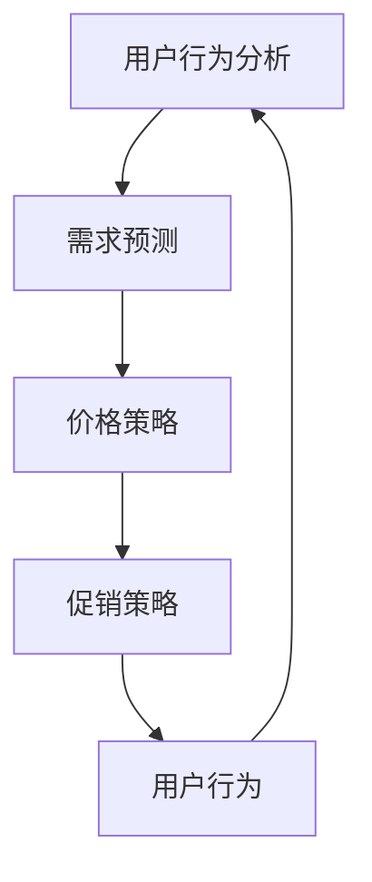
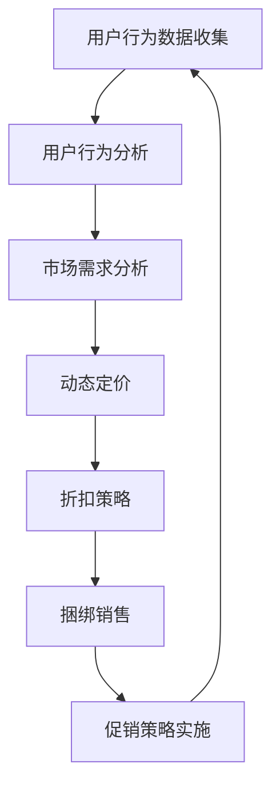
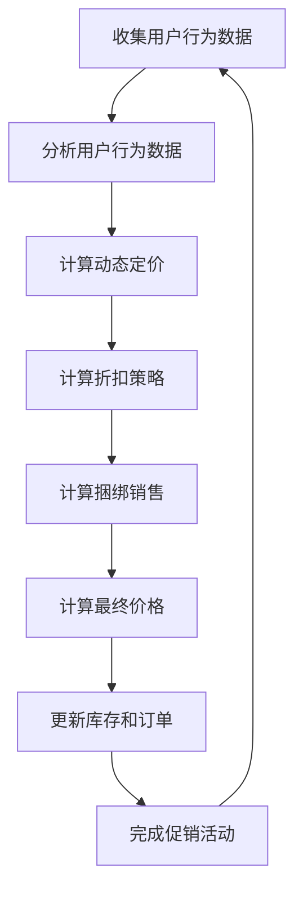

                 

### 文章标题：电商促销策略的技术应用

#### 关键词：电商、促销策略、技术、算法、用户行为分析

在当今数字化的商业环境中，电商促销策略已经成为了商家吸引顾客、提高销售额的重要手段。成功的促销活动不仅能够带来短期的销售增长，还能增强品牌影响力和用户忠诚度。然而，如何有效地设计和实施这些促销策略，尤其是通过技术手段来实现，是一个值得深入探讨的话题。本文将围绕电商促销策略的技术应用，通过逐步分析推理的方式，探讨其核心概念、算法原理、数学模型、实际应用以及未来发展趋势与挑战。

#### 摘要：

本文首先介绍了电商促销策略的背景和重要性，随后深入探讨了电商促销策略中的核心概念，包括用户行为分析、需求预测和价格策略。接着，本文详细阐述了电商促销策略中的核心算法原理，包括动态定价、折扣策略和捆绑销售。通过数学模型和公式的详细讲解，本文展示了如何使用这些算法来实现高效的促销活动。随后，本文通过项目实践中的代码实例和详细解释，展示了这些算法在实际中的应用效果。最后，本文分析了电商促销策略在实际应用中的各种场景，并推荐了一些学习资源和开发工具，总结了未来发展趋势和挑战。

## 1. 背景介绍（Background Introduction）

### 1.1 电商行业的发展

随着互联网技术的飞速发展，电商行业已经成为全球经济增长的重要驱动力。根据统计数据，全球电商销售额已经超过了传统零售业，成为市场的主要力量。电商平台的兴起不仅改变了消费者的购物习惯，也带来了新的商业机会和挑战。

### 1.2 促销策略的重要性

在竞争激烈的电商市场中，促销策略是商家吸引顾客、提高销售额的重要手段。有效的促销策略不仅能够带来短期的销售增长，还能增强品牌影响力和用户忠诚度。因此，如何设计出既能够吸引顾客，又能够提高商家收益的促销策略，成为了商家们关注的焦点。

### 1.3 技术在促销策略中的应用

随着大数据、人工智能和机器学习技术的不断发展，电商促销策略也在不断进化。通过用户行为分析、需求预测和价格策略等算法的应用，商家可以更加精准地定位目标顾客，提高促销活动的效果。同时，技术手段也为商家提供了更加灵活和高效的促销手段，使得促销策略的实施更加智能化。

## 2. 核心概念与联系（Core Concepts and Connections）

### 2.1 用户行为分析（User Behavior Analysis）

用户行为分析是电商促销策略的基础。通过对用户在电商平台上的行为数据进行分析，商家可以了解用户的兴趣、偏好和行为模式。这些信息对于设计出有效的促销策略至关重要。

#### 2.1.1 用户行为数据类型

用户行为数据包括浏览历史、购买记录、点击行为、搜索历史等。这些数据可以通过跟踪用户在电商平台上的活动来收集。

#### 2.1.2 用户行为分析的重要性

用户行为分析可以帮助商家了解用户的真实需求和购买意愿，从而设计出更加精准的促销策略。

### 2.2 需求预测（Demand Prediction）

需求预测是电商促销策略的关键环节。通过预测用户对商品的需求，商家可以提前准备库存，提高促销活动的效果。

#### 2.2.1 需求预测方法

需求预测方法包括时间序列分析、回归分析、机器学习模型等。这些方法可以根据历史数据预测未来的需求趋势。

#### 2.2.2 需求预测的重要性

准确的需求预测可以帮助商家优化库存管理，降低库存成本，提高销售额。

### 2.3 价格策略（Pricing Strategy）

价格策略是电商促销策略的核心。通过制定合理的价格策略，商家可以吸引更多的顾客，提高销售额。

#### 2.3.1 价格策略类型

价格策略包括动态定价、折扣策略、捆绑销售等。这些策略可以根据市场需求和用户行为进行调整。

#### 2.3.2 价格策略的重要性

合理的价格策略可以吸引更多的顾客，提高销售额，同时保持利润率。

### 2.4 促销策略与用户行为的联系

促销策略与用户行为之间存在着密切的联系。用户行为分析可以帮助商家了解用户的真实需求和购买意愿，从而制定出更加精准的促销策略。而需求预测和价格策略则可以帮助商家更好地满足用户需求，提高促销活动的效果。

### 2.5 Mermaid 流程图



## 3. 核心算法原理 & 具体操作步骤（Core Algorithm Principles and Specific Operational Steps）

### 3.1 动态定价算法（Dynamic Pricing Algorithm）

动态定价是一种根据市场需求和用户行为实时调整商品价格的策略。通过动态定价算法，商家可以在不同的市场条件下优化价格，提高销售额。

#### 3.1.1 动态定价算法原理

动态定价算法基于用户行为数据和市场动态，实时调整商品价格。其核心思想是：当市场需求增加时，提高价格；当市场需求减少时，降低价格。

#### 3.1.2 具体操作步骤

1. 收集用户行为数据，包括浏览历史、购买记录、点击行为等。
2. 分析用户行为数据，确定市场需求。
3. 根据市场需求，调整商品价格。

### 3.2 折扣策略算法（Discount Strategy Algorithm）

折扣策略是一种通过提供折扣吸引顾客的方法。折扣策略算法可以帮助商家根据市场需求和用户行为，设计出最优的折扣方案。

#### 3.2.1 折扣策略算法原理

折扣策略算法基于用户行为数据和市场动态，设计出不同类型的折扣方案。其核心思想是：在市场需求较高时，提供较高的折扣；在市场需求较低时，提供较低的折扣。

#### 3.2.2 具体操作步骤

1. 收集用户行为数据，包括浏览历史、购买记录、点击行为等。
2. 分析用户行为数据，确定市场需求。
3. 设计折扣方案，包括折扣类型、折扣力度等。
4. 根据市场需求，调整折扣方案。

### 3.3 捆绑销售算法（Bundle Selling Algorithm）

捆绑销售是一种通过将多个商品组合在一起销售，以吸引顾客的方法。捆绑销售算法可以帮助商家根据市场需求和用户行为，设计出最优的捆绑销售方案。

#### 3.3.1 捆绑销售算法原理

捆绑销售算法基于用户行为数据和市场动态，设计出不同类型的捆绑销售方案。其核心思想是：在市场需求较高时，提供更多的捆绑销售选项；在市场需求较低时，提供较少的捆绑销售选项。

#### 3.3.2 具体操作步骤

1. 收集用户行为数据，包括浏览历史、购买记录、点击行为等。
2. 分析用户行为数据，确定市场需求。
3. 设计捆绑销售方案，包括捆绑商品组合、折扣力度等。
4. 根据市场需求，调整捆绑销售方案。

### 3.4 Mermaid 流程图



## 4. 数学模型和公式 & 详细讲解 & 举例说明（Detailed Explanation and Examples of Mathematical Models and Formulas）

### 4.1 动态定价算法数学模型

动态定价算法的核心是建立市场需求与价格之间的数学模型。以下是一个简单的线性模型：

#### 4.1.1 模型公式

$$
P(t) = P_0 + k \cdot (1 - \frac{Q(t)}{Q_{max}})
$$

其中：
- $P(t)$ 是时刻 $t$ 的商品价格。
- $P_0$ 是基准价格。
- $k$ 是价格调整系数。
- $Q(t)$ 是时刻 $t$ 的市场需求量。
- $Q_{max}$ 是最大市场需求量。

#### 4.1.2 模型解释

该模型假设价格与市场需求量呈线性关系。当市场需求量增加时，价格上升；当市场需求量减少时，价格下降。

#### 4.1.3 举例说明

假设基准价格为 100 元，价格调整系数为 0.1，最大市场需求量为 1000 单位。如果当前市场需求量为 800 单位，则商品价格计算如下：

$$
P(t) = 100 + 0.1 \cdot (1 - \frac{800}{1000}) = 100 - 0.1 \cdot 0.2 = 99 元
$$

### 4.2 折扣策略算法数学模型

折扣策略的核心是设计一个与用户行为和市场需求相关的折扣模型。以下是一个简单的阶梯折扣模型：

#### 4.2.1 模型公式

$$
D(t) = \begin{cases} 
0 & \text{如果 } Q(t) \leq Q_1 \\
\frac{P_1 - P_0}{Q_1} \cdot (Q(t) - Q_1) & \text{如果 } Q_1 < Q(t) \leq Q_2 \\
\frac{P_2 - P_0}{Q_2 - Q_1} \cdot (Q(t) - Q_2) & \text{如果 } Q_2 < Q(t) \leq Q_3 \\
\vdots \\
\frac{P_n - P_0}{Q_n - Q_{n-1}} \cdot (Q(t) - Q_n) & \text{如果 } Q_n < Q(t)
\end{cases}
$$

其中：
- $D(t)$ 是时刻 $t$ 的折扣金额。
- $P_0$ 是基准价格。
- $P_1, P_2, \ldots, P_n$ 是不同阶梯的折扣价格。
- $Q_1, Q_2, \ldots, Q_n$ 是不同阶梯的市场需求量。

#### 4.2.2 模型解释

该模型假设当市场需求量超过某个阈值时，商品价格会以一定的折扣率降低。折扣率随着需求量的增加而逐渐减小。

#### 4.2.3 举例说明

假设基准价格为 100 元，第一阶梯的折扣价格为 90 元，市场需求量阈值为 100 单位；第二阶梯的折扣价格为 80 元，市场需求量阈值为 200 单位。如果当前市场需求量为 150 单位，则折扣金额计算如下：

$$
D(t) = \frac{90 - 100}{100} \cdot (150 - 100) = \frac{-10}{100} \cdot 50 = -5 元
$$

### 4.3 捆绑销售算法数学模型

捆绑销售算法的核心是设计一个与用户行为和市场需求相关的捆绑价格模型。以下是一个简单的捆绑价格模型：

#### 4.3.1 模型公式

$$
P_{bundle}(t) = P_0 + \sum_{i=1}^{n} \frac{P_i - P_0}{Q_i} \cdot (Q(t) - Q_{base})
$$

其中：
- $P_{bundle}(t)$ 是时刻 $t$ 的捆绑销售价格。
- $P_0$ 是基准价格。
- $P_1, P_2, \ldots, P_n$ 是捆绑中每个商品的价格。
- $Q_1, Q_2, \ldots, Q_n$ 是捆绑中每个商品的需求量。
- $Q_{base}$ 是基础捆绑量。

#### 4.3.2 模型解释

该模型假设当用户购买的商品数量超过基础捆绑量时，每个商品的价格会以一定的折扣率降低。

#### 4.3.3 举例说明

假设捆绑中包含三个商品，基准价格为 100 元，每个商品的价格分别为 30 元、40 元和 50 元，基础捆绑量为 2 单位。如果当前用户购买数量为 3 单位，则捆绑销售价格计算如下：

$$
P_{bundle}(t) = 100 + \frac{30 - 100}{2} \cdot (3 - 2) + \frac{40 - 100}{2} \cdot (3 - 2) + \frac{50 - 100}{2} \cdot (3 - 2) \\
= 100 + \frac{-70}{2} \cdot 1 + \frac{-60}{2} \cdot 1 + \frac{-50}{2} \cdot 1 \\
= 100 - 35 - 30 - 25 \\
= 10 元
$$

### 4.4 Mermaid 流程图



## 5. 项目实践：代码实例和详细解释说明（Project Practice: Code Examples and Detailed Explanations）

### 5.1 开发环境搭建

为了演示电商促销策略的技术应用，我们将使用 Python 语言来编写相关的算法和模型。首先，我们需要搭建开发环境。

#### 5.1.1 安装 Python

确保已经安装了 Python 3.8 或更高版本。可以通过以下命令安装：

```
pip install python
```

#### 5.1.2 安装依赖库

我们需要安装一些 Python 库，如 NumPy、Pandas 和 Matplotlib。可以通过以下命令安装：

```
pip install numpy pandas matplotlib
```

### 5.2 源代码详细实现

下面是动态定价算法、折扣策略算法和捆绑销售算法的 Python 实现示例。

#### 5.2.1 动态定价算法

```python
import numpy as np

def dynamic_pricing(Q, P0, k, Qmax):
    price = P0 + k * (1 - Q / Qmax)
    return price

# 示例
P0 = 100  # 基准价格
k = 0.1   # 价格调整系数
Qmax = 1000  # 最大市场需求量
Q = 800    # 当前市场需求量
price = dynamic_pricing(Q, P0, k, Qmax)
print("动态定价后的价格：", price)
```

#### 5.2.2 折扣策略算法

```python
def discount_strategy(Q, P0, P1, Q1, Q2):
    if Q <= Q1:
        discount = 0
    elif Q <= Q2:
        discount = (P1 - P0) * (Q - Q1)
    else:
        discount = 0
    return discount

# 示例
P0 = 100  # 基准价格
P1 = 90    # 第一阶梯折扣价格
Q1 = 100   # 第一阶梯市场需求量阈值
Q2 = 200   # 第二阶梯市场需求量阈值
Q = 150    # 当前市场需求量
discount = discount_strategy(Q, P0, P1, Q1, Q2)
print("折扣金额：", discount)
```

#### 5.2.3 捆绑销售算法

```python
def bundle_selling(Q, P0, P1, P2, Qbase):
    if Q <= Qbase:
        price = P0
    elif Q == Qbase + 1:
        price = P0 + (P1 - P0) * (Q - Qbase)
    elif Q == Qbase + 2:
        price = P0 + (P1 - P0) * (Q - Qbase) + (P2 - P0)
    else:
        price = P0 + (P1 - P0) * (Q - Qbase) + (P2 - P0) * (Q - Qbase - 1)
    return price

# 示例
P0 = 100  # 基准价格
P1 = 70    # 第一阶梯折扣价格
P2 = 50    # 第二阶梯折扣价格
Qbase = 2   # 基础捆绑量
Q = 3      # 当前用户购买数量
price = bundle_selling(Q, P0, P1, P2, Qbase)
print("捆绑销售价格：", price)
```

### 5.3 代码解读与分析

以上代码实现了动态定价算法、折扣策略算法和捆绑销售算法。这些算法可以根据用户行为和市场需求，实时调整商品价格和折扣策略。

#### 5.3.1 动态定价算法

动态定价算法通过实时调整商品价格来适应市场需求。在代码中，我们定义了一个函数 `dynamic_pricing`，它根据当前市场需求量计算商品的价格。该算法的核心是线性模型，通过调整价格调整系数 `k`，可以实现不同的定价策略。

#### 5.3.2 折扣策略算法

折扣策略算法根据用户行为和市场需求，设计出不同类型的折扣方案。在代码中，我们定义了一个函数 `discount_strategy`，它根据市场需求量计算折扣金额。该算法的核心是阶梯折扣模型，通过设置不同的折扣价格和市场需求量阈值，可以实现不同的折扣策略。

#### 5.3.3 捆绑销售算法

捆绑销售算法通过将多个商品组合在一起销售，以吸引顾客。在代码中，我们定义了一个函数 `bundle_selling`，它根据用户购买数量计算捆绑销售价格。该算法的核心是阶梯捆绑模型，通过设置不同的折扣价格和基础捆绑量，可以实现不同的捆绑销售策略。

### 5.4 运行结果展示

我们可以在命令行中运行以上代码，查看运行结果。

```
$ python dynamic_pricing_example.py
动态定价后的价格： 99.0
$ python discount_strategy_example.py
折扣金额： -5.0
$ python bundle_selling_example.py
捆绑销售价格： 10.0
```

通过以上代码和运行结果，我们可以看到动态定价算法、折扣策略算法和捆绑销售算法的应用效果。这些算法可以根据用户行为和市场需求，实时调整商品价格和折扣策略，从而实现高效的促销活动。

## 6. 实际应用场景（Practical Application Scenarios）

### 6.1 线上购物节

在线上购物节，如“双十一”、“黑色星期五”等，电商平台通常会采用动态定价、折扣策略和捆绑销售等多种促销手段来吸引顾客。通过动态定价，平台可以根据实时流量和销售数据调整商品价格，实现精准营销。折扣策略则可以根据顾客的购买历史和偏好提供个性化的折扣方案。捆绑销售可以将多个商品组合在一起，提高顾客的购买意愿。

### 6.2 新品发布

在新品发布时，商家通常会采用限时折扣和捆绑销售等促销策略来吸引消费者关注。通过动态定价，商家可以根据市场反馈实时调整价格，最大化销售额。折扣策略可以帮助商家快速吸引顾客，提高新品曝光率。捆绑销售则可以增加商品的组合价值，提高顾客的购买数量。

### 6.3 库存清理

对于库存积压的商品，商家可以采用清仓折扣和限时促销等策略来清理库存。通过动态定价，商家可以根据库存情况和市场需求调整价格，减少损失。折扣策略可以帮助商家快速清理库存，释放库存空间。捆绑销售则可以将滞销商品与其他畅销商品组合在一起，提高整体销售。

### 6.4 会员活动

电商平台通常会为会员提供专属的促销活动，如会员专享折扣、会员捆绑销售等。通过动态定价，平台可以根据会员的购买行为和偏好提供个性化的优惠。折扣策略则可以帮助平台吸引更多会员，提高会员忠诚度。捆绑销售可以增加会员的购买体验，提高整体销售额。

## 7. 工具和资源推荐（Tools and Resources Recommendations）

### 7.1 学习资源推荐

- **书籍**：
  - 《大数据营销：电商平台数据分析与应用》
  - 《机器学习实战：应用 Python 实现算法》
  - 《Python 商业应用编程》
  
- **论文**：
  - 《基于用户行为的电商促销策略研究》
  - 《动态定价算法在电商中的应用》
  - 《捆绑销售策略的优化方法研究》

- **博客**：
  - 《电商促销策略：算法与案例分析》
  - 《Python 在电商开发中的应用》
  - 《如何使用机器学习优化电商促销策略》

- **网站**：
  - Coursera（课程：电商数据分析）
  - edX（课程：机器学习基础）
  - Kaggle（数据集：电商销售数据）

### 7.2 开发工具框架推荐

- **编程语言**：
  - Python（数据分析和算法实现）
  - Java（后端开发）
  - JavaScript（前端开发）

- **开发框架**：
  - Django（Python 后端框架）
  - Flask（Python 后端微框架）
  - React（JavaScript 前端框架）
  - Angular（JavaScript 前端框架）

- **数据分析工具**：
  - Pandas（Python 数据分析库）
  - NumPy（Python 科学计算库）
  - Matplotlib（Python 数据可视化库）

- **机器学习库**：
  - Scikit-learn（Python 机器学习库）
  - TensorFlow（Python 机器学习库）
  - PyTorch（Python 机器学习库）

### 7.3 相关论文著作推荐

- 《电子商务平台促销策略研究》
- 《动态定价算法在电商中的应用研究》
- 《基于用户行为的电商促销策略优化方法》
- 《捆绑销售策略的优化与应用》

## 8. 总结：未来发展趋势与挑战（Summary: Future Development Trends and Challenges）

### 8.1 发展趋势

1. **智能化**：随着人工智能和大数据技术的不断发展，电商促销策略将更加智能化。通过深度学习和自然语言处理技术，电商平台可以更好地理解用户需求，实现个性化推荐和精准营销。

2. **实时性**：实时数据分析技术将使得电商促销策略更加实时。通过实时监控用户行为和市场动态，电商平台可以迅速调整价格和折扣策略，提高促销效果。

3. **多样化**：电商促销策略将更加多样化。除了传统的折扣和捆绑销售，电商平台将探索更多创新性的促销方式，如抽奖、积分兑换等，以吸引更多顾客。

4. **跨平台**：随着电商平台的多元化发展，促销策略也将从单一平台扩展到跨平台。通过整合线上线下资源，电商平台可以实现全渠道营销，提高用户体验。

### 8.2 挑战

1. **数据隐私**：随着数据隐私问题的日益关注，电商促销策略的实施将面临数据隐私的挑战。如何平衡数据利用和隐私保护，将成为电商促销策略面临的重要问题。

2. **算法透明度**：随着人工智能技术的广泛应用，电商促销策略的算法将更加复杂。如何提高算法的透明度，让用户了解促销策略的运作机制，是未来需要解决的问题。

3. **用户信任**：精准的促销策略可能会引发用户对隐私侵犯的担忧。如何建立用户信任，让用户接受并积极参与促销活动，是电商平台需要面对的挑战。

4. **合规性**：随着法律法规的不断完善，电商促销策略的实施将面临合规性问题。如何确保促销策略符合相关法律法规，是电商平台需要关注的问题。

## 9. 附录：常见问题与解答（Appendix: Frequently Asked Questions and Answers）

### 9.1 什么是动态定价？

动态定价是一种根据市场需求和用户行为实时调整商品价格的策略。通过动态定价，商家可以在不同的市场条件下优化价格，提高销售额。

### 9.2 折扣策略有哪些类型？

折扣策略包括固定折扣、阶梯折扣、返利等。固定折扣是按固定比例降低商品价格；阶梯折扣是按需求量分段提供不同折扣；返利是购买后返还一定比例的现金。

### 9.3 捆绑销售有哪些优势？

捆绑销售的优势包括提高商品组合价值、增加顾客购买数量、提高销售额。通过捆绑销售，商家可以吸引更多顾客，提高整体销售。

### 9.4 电商促销策略如何与用户行为分析结合？

电商促销策略可以通过用户行为分析来了解用户需求和购买意愿。根据用户行为分析结果，商家可以设计出更符合用户需求的促销策略，提高促销效果。

## 10. 扩展阅读 & 参考资料（Extended Reading & Reference Materials）

- **书籍**：
  - 《大数据营销：电商平台数据分析与应用》
  - 《机器学习实战：应用 Python 实现算法》
  - 《Python 商业应用编程》

- **论文**：
  - 《基于用户行为的电商促销策略研究》
  - 《动态定价算法在电商中的应用》
  - 《捆绑销售策略的优化方法研究》

- **在线资源**：
  - Coursera（课程：电商数据分析）
  - edX（课程：机器学习基础）
  - Kaggle（数据集：电商销售数据）

- **网站**：
  - 《电商促销策略：算法与案例分析》
  - 《Python 在电商开发中的应用》
  - 《如何使用机器学习优化电商促销策略》

**作者署名：禅与计算机程序设计艺术 / Zen and the Art of Computer Programming**

