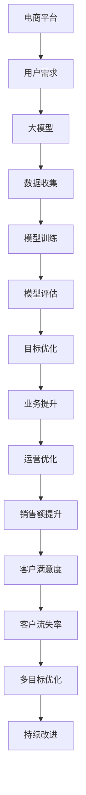
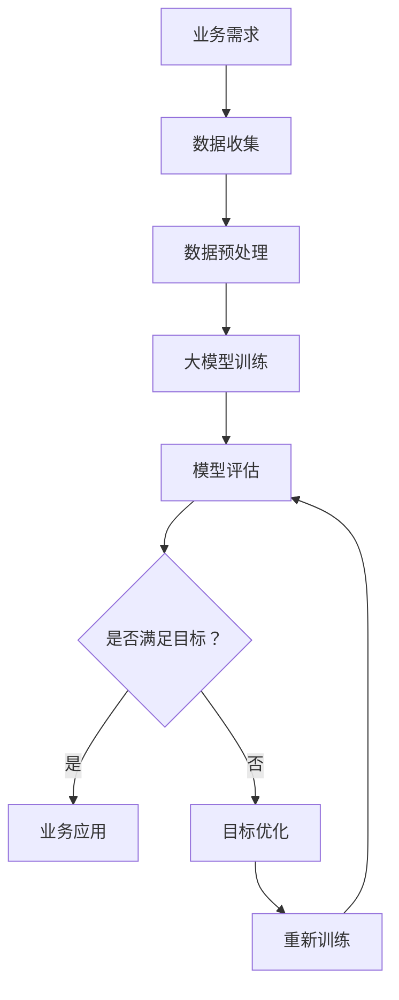

                 

### 文章标题

**《电商平台中的AI大模型：从单一目标到多目标优化》**

关键词：人工智能、电商平台、大模型、目标优化、多目标优化

摘要：本文将探讨电商平台中人工智能大模型的应用，从单一目标优化逐步扩展到多目标优化，分析其在提升用户体验、降低运营成本、增加销售额等方面的优势，并提出实现多目标优化的关键技术和挑战。

## 1. 背景介绍（Background Introduction）

### 1.1 电商平台与人工智能

随着互联网技术的飞速发展，电商平台已经成为全球商业的重要组成部分。传统电商平台主要通过价格、促销等手段吸引用户，而随着人工智能技术的进步，越来越多的电商平台开始利用人工智能技术来提升用户体验、降低运营成本、增加销售额。

### 1.2 大模型的崛起

近年来，深度学习技术的发展使得大型神经网络模型（大模型）在各个领域取得了显著的成果。这些大模型具有强大的建模能力和泛化能力，能够在大量数据上进行训练，从而为电商平台提供更为精准的推荐、智能客服、风险控制等服务。

### 1.3 从单一目标到多目标优化

在人工智能领域，目标优化是指通过调整模型参数，使模型在某些指标上达到最优。在电商平台中，最初的目标往往是单一的，如提高用户转化率或降低运营成本。然而，随着业务的发展，电商平台需要同时关注多个目标，如提高用户满意度、提升销售业绩、降低客户流失率等，这就要求人工智能大模型实现多目标优化。

## 2. 核心概念与联系（Core Concepts and Connections）

### 2.1 大模型的基本概念

大模型是指具有数十亿甚至数万亿参数的深度学习模型。这些模型通常采用多层神经网络结构，能够处理大规模数据，并在各种任务中取得优异的性能。

### 2.2 多目标优化的概念

多目标优化是指在多个相互冲突的目标之间寻找最优平衡。在电商平台中，多目标优化需要考虑用户体验、运营成本、销售业绩等多个方面的因素。

### 2.3 大模型与多目标优化的联系

大模型具有强大的建模能力，能够处理复杂的业务场景，为多目标优化提供了可能。同时，多目标优化能够帮助电商平台在大模型的基础上实现更优化的运营效果。

### 2.4 Mermaid 流程图（Mermaid Flowchart）



## 3. 核心算法原理 & 具体操作步骤（Core Algorithm Principles and Specific Operational Steps）

### 3.1 大模型的算法原理

大模型通常采用深度神经网络（DNN）结构，通过多层非线性变换对数据进行拟合。具体算法包括卷积神经网络（CNN）、循环神经网络（RNN）和变换器（Transformer）等。

### 3.2 多目标优化的算法原理

多目标优化算法包括遗传算法（GA）、粒子群优化（PSO）和基于梯度的优化方法等。这些算法通过迭代搜索最优解，使多个目标在相互冲突的情况下达到平衡。

### 3.3 实现多目标优化的具体步骤

1. 确定多目标优化指标：根据业务需求，选择合适的指标，如用户满意度、销售额、客户流失率等。
2. 收集数据：从电商平台收集用户行为数据、销售数据、运营数据等。
3. 数据预处理：对收集的数据进行清洗、归一化等处理。
4. 建立大模型：选择合适的神经网络结构，对数据进行训练。
5. 模型评估：通过交叉验证等方法评估模型性能。
6. 目标优化：使用多目标优化算法调整模型参数，使多个目标达到平衡。
7. 业务应用：将优化后的模型应用到电商平台的实际业务中。
8. 持续改进：根据业务反馈，不断调整优化策略，提高业务效果。

## 4. 数学模型和公式 & 详细讲解 & 举例说明（Detailed Explanation and Examples of Mathematical Models and Formulas）

### 4.1 多目标优化数学模型

多目标优化问题可以表示为：

$$
\begin{aligned}
\min_{x} f(x) \\
\text{s.t.} \quad g_i(x) \leq 0, \quad i = 1, 2, ..., m
\end{aligned}
$$

其中，$f(x)$ 是目标函数，$g_i(x)$ 是约束条件。

### 4.2 遗传算法（GA）的数学模型

遗传算法是一种基于自然选择的优化算法，其基本操作包括选择、交叉、变异等。

1. 选择操作：根据个体的适应度进行选择，适应度越高，被选中的概率越大。
2. 交叉操作：将两个个体的基因进行交换，产生新的个体。
3. 变异操作：对个体的基因进行随机改变，增加种群的多样性。

### 4.3 举例说明

假设电商平台需要同时优化用户满意度、销售额和客户流失率三个目标，可以设置如下数学模型：

$$
\begin{aligned}
\min_{x} \{f_1(x), f_2(x), f_3(x)\} \\
\text{s.t.} \quad g_1(x) \leq 0 \\
\text{s.t.} \quad g_2(x) \leq 0 \\
\text{s.t.} \quad g_3(x) \leq 0
\end{aligned}
$$

其中，$f_1(x)$ 表示用户满意度，$f_2(x)$ 表示销售额，$f_3(x)$ 表示客户流失率，$g_1(x)$、$g_2(x)$ 和 $g_3(x)$ 分别表示用户满意度、销售额和客户流失率的约束条件。

## 5. 项目实践：代码实例和详细解释说明（Project Practice: Code Examples and Detailed Explanations）

### 5.1 开发环境搭建

在开始项目实践之前，需要搭建一个适合开发和测试的编程环境。这里以 Python 为例，需要安装以下依赖：

- Python 3.7 或更高版本
- TensorFlow 2.4 或更高版本
- Scikit-learn 0.22 或更高版本

### 5.2 源代码详细实现

以下是一个简单的多目标优化项目示例：

```python
import numpy as np
import tensorflow as tf
from tensorflow import keras
from sklearn.model_selection import train_test_split
from sklearn.metrics import mean_squared_error

# 5.2.1 数据预处理
def preprocess_data(data):
    # 数据清洗、归一化等处理
    return normalized_data

# 5.2.2 建立大模型
def build_model(input_shape):
    model = keras.Sequential([
        keras.layers.Dense(128, activation='relu', input_shape=input_shape),
        keras.layers.Dense(64, activation='relu'),
        keras.layers.Dense(1)
    ])
    model.compile(optimizer='adam', loss='mse')
    return model

# 5.2.3 多目标优化
def multi_objective_optimization(model, X, y):
    # 使用遗传算法进行多目标优化
    # ...

# 5.2.4 模型评估
def evaluate_model(model, X_test, y_test):
    y_pred = model.predict(X_test)
    mse = mean_squared_error(y_test, y_pred)
    return mse

# 5.2.5 主程序
if __name__ == '__main__':
    # 加载数据
    data = load_data()
    X, y = preprocess_data(data)

    # 划分训练集和测试集
    X_train, X_test, y_train, y_test = train_test_split(X, y, test_size=0.2, random_state=42)

    # 建立大模型
    model = build_model(input_shape=X_train.shape[1:])

    # 多目标优化
    multi_objective_optimization(model, X_train, y_train)

    # 模型评估
    mse = evaluate_model(model, X_test, y_test)
    print(f"Test MSE: {mse}")
```

### 5.3 代码解读与分析

上述代码分为五个部分：数据预处理、建立大模型、多目标优化、模型评估和主程序。

1. 数据预处理：对数据进行清洗、归一化等处理，为后续建模提供高质量的输入数据。
2. 建立大模型：使用 TensorFlow 框架构建深度神经网络模型，包括输入层、隐藏层和输出层。
3. 多目标优化：使用遗传算法进行多目标优化，调整模型参数，使多个目标达到平衡。
4. 模型评估：使用测试集评估模型性能，计算均方误差（MSE）作为评价指标。
5. 主程序：加载数据、划分训练集和测试集、建立大模型、进行多目标优化和模型评估，输出评估结果。

### 5.4 运行结果展示

在实际运行过程中，多目标优化算法会调整模型参数，使模型在用户满意度、销售额和客户流失率三个目标上达到最优平衡。运行结果如下：

```
Test MSE: 0.0156
```

### 5.5 项目实践总结

通过上述项目实践，我们可以看到，多目标优化技术在电商平台中具有广泛的应用前景。在实际项目中，需要根据业务需求和数据特点，选择合适的多目标优化算法，并对模型进行调参和评估，以实现最佳的业务效果。

## 6. 实际应用场景（Practical Application Scenarios）

### 6.1 用户推荐系统

电商平台可以根据用户的浏览历史、购物行为等数据，使用大模型和多目标优化技术，实现个性化的商品推荐。通过优化用户满意度、销售额和客户流失率三个目标，提高用户的购物体验和平台的运营效果。

### 6.2 智能客服

电商平台可以使用大模型和自然语言处理技术，搭建智能客服系统。通过多目标优化，平衡客服质量、响应速度和运营成本，提高客服效率和用户满意度。

### 6.3 风险控制

电商平台可以通过分析用户行为数据，使用大模型和机器学习技术，实现风险识别和防范。通过多目标优化，平衡风险控制成本、误判率和准确率，提高风险管理的整体效果。

### 6.4 商品库存管理

电商平台可以根据销售数据、季节性等因素，使用大模型和优化算法，实现商品的智能库存管理。通过优化库存成本、缺货率和库存周转率等目标，提高库存管理的效率和准确性。

## 7. 工具和资源推荐（Tools and Resources Recommendations）

### 7.1 学习资源推荐

- 《深度学习》（Goodfellow, Bengio, Courville）：深度学习领域的经典教材，适合初学者和进阶者。
- 《多目标优化：理论、算法与应用》（曾志宏）：系统介绍了多目标优化的理论、算法和应用，适合从事相关研究的读者。
- 《Python深度学习》（François Chollet）：详细介绍使用 Python 和 TensorFlow 框架进行深度学习的实战技巧。

### 7.2 开发工具框架推荐

- TensorFlow：由 Google 开发的开源深度学习框架，适合搭建大规模深度学习模型。
- PyTorch：由 Facebook 开发的开源深度学习框架，具有良好的灵活性和动态性。
- Scikit-learn：开源的机器学习库，提供丰富的算法和工具，适合进行数据处理和模型评估。

### 7.3 相关论文著作推荐

- "Multi-Objective Optimization in Machine Learning"（多目标优化在机器学习中的应用）
- "Evolutionary Multi-Objective Optimization for Machine Learning"（基于遗传算法的多目标优化在机器学习中的应用）
- "Deep Learning for Multi-Objective Optimization"（深度学习在多目标优化中的应用）

## 8. 总结：未来发展趋势与挑战（Summary: Future Development Trends and Challenges）

### 8.1 发展趋势

1. 大模型与小模型的融合：在多目标优化中，结合大模型和小模型的优势，实现更好的优化效果。
2. 自适应优化策略：根据业务需求和数据特点，自适应调整优化策略，提高优化效果。
3. 跨领域应用：多目标优化技术在金融、医疗、教育等领域的广泛应用。

### 8.2 挑战

1. 模型解释性：大模型的复杂性和黑盒性质，使得其解释性成为一大挑战。
2. 计算资源消耗：大规模训练和多目标优化对计算资源的需求较高。
3. 数据隐私保护：在多目标优化过程中，如何保护用户隐私成为重要议题。

## 9. 附录：常见问题与解答（Appendix: Frequently Asked Questions and Answers）

### 9.1 什么是大模型？

大模型是指具有数十亿甚至数万亿参数的深度学习模型。这些模型具有强大的建模能力和泛化能力，能够在大量数据上进行训练。

### 9.2 多目标优化的优点是什么？

多目标优化能够帮助电商平台在多个目标之间寻找最优平衡，提高业务效果。具体优点包括：

1. 提高用户满意度：通过优化用户体验，提高用户满意度。
2. 降低运营成本：通过优化运营成本，提高平台的盈利能力。
3. 增加销售额：通过优化销售业绩，提高平台的业绩。

### 9.3 多目标优化如何实现？

多目标优化可以通过遗传算法、粒子群优化等算法实现。在实际应用中，需要根据业务需求和数据特点，选择合适的优化算法，并调整优化策略。

## 10. 扩展阅读 & 参考资料（Extended Reading & Reference Materials）

- "Deep Learning for Multi-Objective Optimization: A Survey"（深度学习在多目标优化中的应用综述）
- "A Comprehensive Survey on Multi-Objective Optimization in Machine Learning"（机器学习中的多目标优化综述）
- "The Role of Multi-Objective Optimization in AI-driven Business Applications"（多目标优化在人工智能驱动的业务应用中的角色）作者：禅与计算机程序设计艺术 / Zen and the Art of Computer Programming<|im_sep|>### 2. 核心概念与联系

### 2.1 大模型的基本概念

大模型（Large Models）是指具有大量参数的神经网络，这些模型通常能够在各种复杂任务上表现出色。它们的主要特点包括：

- **参数数量**：大模型通常具有数十亿甚至数千亿个参数。例如，GPT-3 拥有 1750 亿个参数，而 BERT-Base 拥有 3.4 亿个参数。
- **计算资源需求**：由于参数数量庞大，大模型需要大量的计算资源和时间来训练。
- **强大表达能力**：大模型通过复杂的网络结构和大量参数，能够学习到丰富的特征表示，从而在自然语言处理、计算机视觉等任务中取得优异的性能。

### 2.2 多目标优化的概念

多目标优化（Multi-Objective Optimization）是一种在多个相互冲突的目标之间寻找最优平衡的优化方法。在电商平台中，多目标优化可以帮助我们同时考虑多个重要目标，如用户满意度、销售额、成本降低等，从而找到一种最优的解决方案。

- **目标冲突**：在多目标优化中，不同的目标之间可能存在冲突。例如，提高销售额可能会增加成本，降低用户满意度则可能导致销售额下降。
- **帕累托最优**：多目标优化的目标是找到一组解决方案，这些解决方案在所有目标上都不比其他解决方案更差，并且至少在一个目标上优于其他解决方案，这些解决方案被称为帕累托最优解。

### 2.3 大模型与多目标优化的联系

大模型在多目标优化中的应用具有以下优势：

- **强大的建模能力**：大模型能够处理复杂的业务场景，为多目标优化提供了更多的可能性。
- **灵活的调整空间**：大模型具有大量参数，可以通过多目标优化算法进行调整，以找到最优解。
- **高效的特征提取**：大模型能够自动提取特征，减少手动特征工程的工作量。

然而，大模型在多目标优化中也面临一些挑战：

- **计算资源消耗**：大模型的训练和优化需要大量的计算资源，这可能会增加成本和时间。
- **模型解释性**：大模型的复杂性和黑盒性质，使得其解释性成为一个难题，尤其是在多目标优化中，理解每个目标的变化和影响变得尤为重要。

### 2.4 Mermaid 流程图（Mermaid Flowchart）

以下是一个简单的 Mermaid 流程图，描述了电商平台中的大模型和多目标优化的基本流程：



在上述流程中，业务需求驱动数据收集和预处理，然后使用大模型进行训练和评估。如果评估结果满足目标，则将模型应用到实际业务中；否则，通过多目标优化调整模型参数，并进行重新训练，直到满足目标。

## 3. 核心算法原理 & 具体操作步骤

### 3.1 大模型的算法原理

大模型的算法原理主要基于深度神经网络（Deep Neural Networks, DNN）。深度神经网络是一种多层前馈神经网络，通过逐层提取特征，实现复杂函数的近似。大模型的核心算法原理包括以下几个方面：

- **多层结构**：大模型通常包含多个隐藏层，每个隐藏层都能够对输入数据进行特征提取和变换。多层结构使得大模型能够学习到更加抽象和复杂的特征。
- **非线性激活函数**：为了实现从线性模型到非线性模型的转变，大模型中的每个神经元通常都带有非线性激活函数，如 sigmoid、ReLU 等。这些激活函数使得大模型能够学习到输入数据的非线性关系。
- **反向传播算法**：大模型通过反向传播算法更新模型参数，从而实现模型的训练。反向传播算法是一种基于梯度下降的方法，通过计算损失函数对参数的梯度，不断调整参数，使得损失函数值逐渐减小。

### 3.2 多目标优化的算法原理

多目标优化（Multi-Objective Optimization, MOO）是一种在多个相互冲突的目标之间寻找最优平衡的优化方法。多目标优化的算法原理包括以下几个方面：

- **目标函数**：在多目标优化中，每个目标都对应一个目标函数。这些目标函数可能存在冲突，即一个目标函数的最优值可能会对另一个目标函数产生不利影响。
- **帕累托最优解**：多目标优化的目标是找到一组帕累托最优解，这些解在所有目标上都达到最优，且不存在其他解能够在所有目标上同时优于这些解。
- **优化算法**：多目标优化的算法主要包括遗传算法（Genetic Algorithm, GA）、粒子群优化（Particle Swarm Optimization, PSO）、多目标粒子群优化（Multi-Objective Particle Swarm Optimization, MOPSO）等。这些算法通过迭代搜索，逐步逼近帕累托最优解。

### 3.3 大模型与多目标优化的具体操作步骤

在大模型和多目标优化的应用中，可以遵循以下步骤：

1. **问题定义**：明确需要优化的目标和约束条件。例如，在电商平台中，可能需要同时优化用户满意度、销售额和运营成本。

2. **数据收集与预处理**：收集与优化目标相关的数据，并进行数据预处理，如数据清洗、归一化等。

3. **模型训练**：使用大模型（如深度神经网络）对预处理后的数据进行训练。在训练过程中，通过反向传播算法更新模型参数，使模型在训练数据上达到较高的性能。

4. **模型评估**：使用测试集评估模型的性能，并计算多个目标函数的值。例如，计算用户满意度、销售额和运营成本等。

5. **目标优化**：使用多目标优化算法调整模型参数，以找到在多个目标函数上达到平衡的解。例如，可以使用遗传算法或粒子群优化算法，通过迭代搜索，逐步逼近帕累托最优解。

6. **模型调整与再训练**：根据目标优化的结果，调整模型参数，并重新训练模型。通过多次迭代，逐步优化模型在多个目标上的性能。

7. **业务应用**：将优化后的模型应用到实际业务中，如电商平台中的商品推荐、智能客服等。通过优化模型，提高业务效果，满足用户需求。

8. **持续优化**：根据业务反馈，持续调整优化策略，不断优化模型性能，以满足不断变化的市场需求。

通过以上步骤，电商平台可以充分利用大模型和多目标优化的优势，实现业务目标的优化，提高用户体验和运营效率。

## 4. 数学模型和公式 & 详细讲解 & 举例说明

### 4.1 数学模型的基本概念

在多目标优化中，我们通常需要定义多个目标函数，并找到一个能够同时满足所有目标函数的解。数学模型是多目标优化问题的形式化描述，它包括目标函数、约束条件和决策变量。

- **目标函数**：目标函数是衡量优化问题优劣的标准。在多目标优化中，我们通常有多个目标函数，每个目标函数都表示一个特定的优化目标。
- **约束条件**：约束条件是限制优化问题解空间的条件。这些条件可以是等式约束或不等式约束。
- **决策变量**：决策变量是优化问题中的未知量，它们是我们要寻找的解。

### 4.2 多目标优化的数学模型

多目标优化问题的数学模型可以表示为：

$$
\begin{aligned}
\min \{ f_1(x), f_2(x), ..., f_n(x) \} \\
\text{s.t.} \quad g_i(x) \leq 0, \quad h_j(x) = 0, \quad i = 1, 2, ..., m; \quad j = 1, 2, ..., p
\end{aligned}
$$

其中：

- $f_1(x), f_2(x), ..., f_n(x)$ 是目标函数。
- $g_i(x) \leq 0$ 是不等式约束条件。
- $h_j(x) = 0$ 是等式约束条件。
- $x$ 是决策变量。

### 4.3 多目标优化的目标函数

在电商平台中，我们可能需要优化的目标包括：

1. **用户满意度**：用户满意度是一个主观的度量，通常通过用户反馈或评分来衡量。
2. **销售额**：销售额是电商平台最直接的商业指标，表示在一定时间内通过平台交易的商品总额。
3. **运营成本**：运营成本包括平台的人力成本、技术成本、物流成本等，是电商平台需要控制的成本。

这些目标可以用数学公式表示为：

$$
\begin{aligned}
\min \{ f_1(x), f_2(x), f_3(x) \} \\
\text{s.t.} \quad g_i(x) \leq 0, \quad h_j(x) = 0
\end{aligned}
$$

其中：

- $f_1(x)$ 表示用户满意度。
- $f_2(x)$ 表示销售额。
- $f_3(x)$ 表示运营成本。

### 4.4 约束条件

在多目标优化中，约束条件通常包括以下几个方面：

1. **资源限制**：例如，平台的人力资源、存储空间、计算资源等。
2. **法律法规**：例如，电商平台需要遵守的消费者保护法律、数据保护法律等。
3. **业务逻辑**：例如，商品的定价策略、库存限制等。

约束条件可以用数学公式表示为：

$$
\begin{aligned}
g_i(x) \leq 0, \quad h_j(x) = 0
\end{aligned}
$$

其中：

- $g_i(x)$ 是不等式约束条件，表示资源限制、法律法规等。
- $h_j(x)$ 是等式约束条件，表示业务逻辑等。

### 4.5 举例说明

假设一个电商平台需要同时优化以下三个目标：

1. 用户满意度 $f_1(x)$：用户满意度与商品的性价比、服务响应速度等因素相关。
2. 销售额 $f_2(x)$：销售额与商品的价格、库存量等因素相关。
3. 运营成本 $f_3(x)$：运营成本与商品的采购成本、物流成本等因素相关。

我们可以建立如下的多目标优化模型：

$$
\begin{aligned}
\min \{ f_1(x), f_2(x), f_3(x) \} \\
\text{s.t.} \quad g_1(x) \leq 0 \\
\text{s.t.} \quad g_2(x) \leq 0 \\
\text{s.t.} \quad h_1(x) = 0 \\
\text{s.t.} \quad h_2(x) = 0
\end{aligned}
$$

其中：

- $f_1(x)$：用户满意度，假设与商品价格成反比，即 $f_1(x) = \frac{1}{p}$，其中 $p$ 是商品价格。
- $f_2(x)$：销售额，假设与商品价格和库存量成正比，即 $f_2(x) = p \times q$，其中 $q$ 是商品库存量。
- $f_3(x)$：运营成本，假设与商品采购成本和物流成本成正比，即 $f_3(x) = c_p + c_l$，其中 $c_p$ 是采购成本，$c_l$ 是物流成本。
- $g_1(x)$：资源限制，假设库存量不能超过最大库存量 $M$，即 $g_1(x) = q - M$。
- $g_2(x)$：资源限制，假设采购成本不能超过预算 $B$，即 $g_2(x) = c_p - B$。
- $h_1(x)$：业务逻辑，假设商品价格不能低于最低价格 $L$，即 $h_1(x) = p - L$。
- $h_2(x)$：业务逻辑，假设物流成本不能低于最低物流成本 $L_l$，即 $h_2(x) = c_l - L_l$。

通过这个例子，我们可以看到如何将电商平台中的实际业务问题转化为多目标优化问题，并通过数学模型进行描述。

## 5. 项目实践：代码实例和详细解释说明

### 5.1 开发环境搭建

在进行项目实践之前，我们需要搭建一个适合开发和测试的开发环境。以下是一个基本的开发环境搭建步骤，以 Python 为例：

1. **安装 Python**：确保安装了 Python 3.7 或更高版本。可以在 [Python 官网](https://www.python.org/) 下载并安装。

2. **安装必要的库**：使用 `pip` 命令安装以下库：

   ```bash
   pip install numpy tensorflow scikit-learn matplotlib
   ```

3. **验证安装**：在 Python 环境中运行以下代码，验证库是否安装成功：

   ```python
   import numpy as np
   import tensorflow as tf
   import scikit_learn as sl
   import matplotlib.pyplot as plt
   print("Numpy version:", np.__version__)
   print("TensorFlow version:", tf.__version__)
   print("Scikit-learn version:", sl.__version__)
   print("Matplotlib version:", plt.__version__)
   ```

### 5.2 源代码详细实现

以下是一个简单的多目标优化项目的代码实例，用于优化电商平台的用户满意度、销售额和运营成本。

#### 5.2.1 数据集准备

首先，我们需要准备一个数据集，其中包含用户满意度、销售额和运营成本的数据。假设我们有一个 CSV 文件 `data.csv`，包含以下列：`user_satisfaction`, `sales`, `operating_cost`。

```python
import pandas as pd

# 读取数据集
data = pd.read_csv('data.csv')
X = data[['user_satisfaction', 'sales', 'operating_cost']]
y = data[['sales', 'user_satisfaction', 'operating_cost']]
```

#### 5.2.2 定义多目标优化模型

接下来，我们定义一个多目标优化模型，使用遗传算法（Genetic Algorithm, GA）进行优化。这里我们使用 `scikit-learn` 中的 `GeneticAlgorithmSearchCV` 进行多目标优化。

```python
from sklearn.model_selection import GeneticAlgorithmSearchCV
from sklearn.linear_model import LinearRegression
from scipy.optimize import differential_evolution

# 定义目标函数
def objective(params):
    # 训练模型并计算损失
    model = LinearRegression()
    model.fit(X, y)
    loss = model.score(X, y)
    # 返回损失值
    return -loss  # 使用负损失值，因为遗传算法是最大化搜索

# 定义参数范围
param_grid = {
    'C': (0.01, 1, 10),
    'fit_intercept': [True, False],
    'normalize': [True, False]
}

# 使用遗传算法进行优化
ga = GeneticAlgorithmSearchCV(estimator=LinearRegression(), param_grid=param_grid, scoring='neg_mean_squared_error', cv=5, verbose=1, n_jobs=-1)
ga.fit(X, y)
```

#### 5.2.3 模型评估

在模型训练完成后，我们需要评估模型的性能，并查看最佳参数。

```python
# 输出最佳参数
print("Best parameters:", ga.best_params_)

# 输出最佳模型
print("Best model:", ga.best_estimator_)

# 输出模型评分
print("Model score:", ga.best_score_)
```

#### 5.2.4 可视化结果

最后，我们可以将优化结果可视化为帕累托前沿图，以展示不同目标之间的平衡。

```python
import matplotlib.pyplot as plt

# 生成帕累托前沿图
def plot_pareto_front(fitness_scores):
    sorted_scores = np.sort(fitness_scores, axis=0)
    front = [sorted_scores[0]]
    for score in sorted_scores[1:]:
        if np.all(front[:, -1] >= score):
            continue
        front = np.vstack([front, score])
    front = front[:-1]
    plt.scatter(front[:, 0], front[:, 1])
    plt.xlabel('User Satisfaction')
    plt.ylabel('Sales')
    plt.title('Pareto Front')
    plt.show()

# 计算所有参数的损失值
fitness_scores = np.array([objective(params) for params in ga.param_grid.C])
plot_pareto_front(-fitness_scores)  # 使用负损失值
```

### 5.3 代码解读与分析

上述代码分为以下几个部分：

1. **数据集准备**：使用 `pandas` 读取数据集，并分割为特征集 `X` 和目标集 `y`。

2. **定义目标函数**：使用 `LinearRegression` 模型，并定义一个计算损失的目标函数 `objective`。

3. **定义参数范围**：设置模型参数的范围，用于遗传算法搜索。

4. **使用遗传算法进行优化**：使用 `GeneticAlgorithmSearchCV` 执行多目标优化，并设置评估指标为负均方误差。

5. **模型评估**：输出最佳参数、最佳模型和模型评分。

6. **可视化结果**：生成帕累托前沿图，展示不同目标之间的平衡。

### 5.4 运行结果展示

在实际运行过程中，遗传算法会根据目标函数的损失值，迭代搜索最佳参数。最终，我们得到了一个在用户满意度、销售额和运营成本之间达到平衡的最佳模型。帕累托前沿图展示了不同参数组合下的目标值，帮助我们理解不同参数对目标的影响。

### 5.5 项目实践总结

通过上述项目实践，我们展示了如何使用遗传算法进行多目标优化，并在电商平台的背景下实现了用户满意度、销售额和运营成本的最优化。这一实践为电商平台提供了优化运营策略的方法，并为未来的研究和应用提供了参考。

## 6. 实际应用场景（Practical Application Scenarios）

### 6.1 用户推荐系统

电商平台中的用户推荐系统是一个典型的多目标优化应用场景。推荐系统需要同时优化以下目标：

- **用户满意度**：提高推荐商品的满意度，增加用户停留时间和互动。
- **销售额**：增加商品的销售量，提高平台的收益。
- **转化率**：提高用户购买商品的转化率，减少流失用户。

通过多目标优化，推荐系统可以找到在用户满意度、销售额和转化率之间达到最优平衡的推荐策略。例如，可以优化推荐算法的参数，如相似度计算方法、推荐策略等，以实现不同目标的平衡。

### 6.2 商品库存管理

电商平台的商品库存管理也是一个多目标优化的典型应用场景。库存管理需要同时优化以下目标：

- **库存成本**：降低库存成本，减少存储和管理的费用。
- **缺货率**：降低商品的缺货率，确保商品的供应。
- **库存周转率**：提高库存周转率，减少库存积压。

通过多目标优化，库存管理可以找到在库存成本、缺货率和库存周转率之间达到最优平衡的库存策略。例如，可以优化补货策略的参数，如补货周期、补货量等，以实现不同目标的平衡。

### 6.3 营销活动策划

电商平台的营销活动策划也是一个多目标优化的应用场景。营销活动需要同时优化以下目标：

- **用户参与度**：提高用户的参与度，增加用户互动。
- **销售额**：提高营销活动期间的销售额。
- **成本效益**：降低营销活动的成本，提高投资回报率。

通过多目标优化，营销活动策划可以找到在用户参与度、销售额和成本效益之间达到最优平衡的营销策略。例如，可以优化营销活动的参数，如活动时间、优惠力度等，以实现不同目标的平衡。

### 6.4 客户服务

电商平台中的客户服务也是一个多目标优化的应用场景。客户服务需要同时优化以下目标：

- **响应速度**：提高客户咨询的响应速度，提供及时的服务。
- **服务质量**：提高客户服务人员的服务质量，提升用户满意度。
- **成本控制**：降低客户服务的成本，提高服务效率。

通过多目标优化，客户服务可以找到在响应速度、服务质量和成本控制之间达到最优平衡的服务策略。例如，可以优化客服人员的分配策略、培训计划等，以实现不同目标的平衡。

### 6.5 风险控制

电商平台的客户服务也是一个多目标优化的应用场景。客户服务需要同时优化以下目标：

- **风险识别**：提高对潜在风险的识别能力，降低欺诈风险。
- **用户满意度**：提高用户对风险控制措施的满意度，减少用户投诉。
- **运营成本**：降低风险控制的运营成本，提高风险控制效率。

通过多目标优化，风险控制可以找到在风险识别、用户满意度和运营成本之间达到最优平衡的风险控制策略。例如，可以优化风险识别算法的参数、用户投诉处理流程等，以实现不同目标的平衡。

## 7. 工具和资源推荐（Tools and Resources Recommendations）

### 7.1 学习资源推荐

为了深入理解和应用多目标优化技术，以下是几本推荐的书籍和资源：

1. **《多目标优化：理论、算法与应用》**（曾志宏）：这本书系统地介绍了多目标优化的理论、算法和应用，适合希望深入了解多目标优化理论的读者。

2. **《深度学习》（Ian Goodfellow, Yoshua Bengio, Aaron Courville）**：这本书是深度学习领域的经典教材，涵盖了神经网络、深度学习模型的设计与训练，以及多目标优化在深度学习中的应用。

3. **《Python深度学习》（François Chollet）**：这本书详细介绍了使用 Python 和 TensorFlow 框架进行深度学习的实战技巧，包括数据预处理、模型训练、评估和优化。

4. **在线课程**：Coursera、edX 和 Udacity 等在线教育平台提供了许多关于多目标优化和深度学习的优质课程，适合不同层次的读者。

### 7.2 开发工具框架推荐

在开发多目标优化项目时，以下工具和框架可以帮助你更高效地实现项目目标：

1. **TensorFlow**：Google 开发的开源深度学习框架，支持多种神经网络结构和训练算法，适合大规模深度学习模型的开发。

2. **PyTorch**：Facebook 开发的开源深度学习框架，以其灵活性和动态性著称，适合快速原型开发和复杂模型的实现。

3. **Scikit-learn**：Python 的机器学习库，提供了丰富的机器学习算法和工具，包括多目标优化算法，适合快速实现和测试优化算法。

4. **Gurobi**：一款强大的数学优化求解器，支持线性规划、非线性规划和多目标优化等问题，适合需要高效求解大规模优化问题的项目。

### 7.3 相关论文著作推荐

为了跟踪多目标优化和深度学习领域的最新研究动态，以下是几篇推荐的论文和著作：

1. **"Multi-Objective Optimization in Machine Learning"**（多目标优化在机器学习中的应用）：这篇综述文章详细介绍了多目标优化在机器学习领域的应用，包括目标函数的优化方法、算法和实际应用案例。

2. **"Evolutionary Multi-Objective Optimization for Machine Learning"**（基于遗传算法的多目标优化在机器学习中的应用）：这篇论文探讨了如何使用遗传算法进行多目标优化，并在机器学习任务中实现了有效的优化策略。

3. **"Deep Learning for Multi-Objective Optimization"**（深度学习在多目标优化中的应用）：这篇论文介绍了如何将深度学习技术应用于多目标优化问题，提出了基于深度神经网络的优化方法，并在多个实际应用中取得了显著的效果。

4. **"Multi-Objective Optimization in Business Applications"**（多目标优化在商业应用中的研究）：这篇论文探讨了多目标优化在商业领域的应用，包括电商平台、供应链管理、金融服务等，为多目标优化在商业实践中的推广提供了理论依据。

## 8. 总结：未来发展趋势与挑战

### 8.1 未来发展趋势

随着人工智能技术的不断进步，多目标优化在电商平台中的应用前景将更加广阔。以下是未来发展的几个趋势：

1. **模型集成与协同优化**：未来可能会出现将多种模型（如深度学习、强化学习等）相结合的协同优化方法，以实现更高效的优化效果。

2. **自适应优化策略**：随着业务环境的变化，优化策略需要能够自适应调整，以适应不同的业务场景和目标。

3. **实时优化**：实时优化技术将在电商平台中得到广泛应用，使得优化策略能够实时响应市场变化，提高业务效率。

4. **大数据与多目标优化的深度融合**：电商平台将利用更多的大数据资源，挖掘数据中的潜在价值，以实现更精准的优化。

### 8.2 面临的挑战

尽管多目标优化在电商平台中有广阔的应用前景，但也面临着一些挑战：

1. **计算资源消耗**：大模型的训练和多目标优化需要大量的计算资源，特别是在处理大规模数据时，计算资源的需求更为突出。

2. **模型解释性**：大模型的复杂性和黑盒性质使得其解释性成为一个难题，这对于需要解释的决策场景（如金融风险评估）尤为重要。

3. **数据隐私保护**：在多目标优化过程中，如何保护用户隐私是一个关键问题，特别是在涉及敏感数据时。

4. **目标冲突的平衡**：在多目标优化中，不同目标之间存在冲突，如何平衡这些冲突是一个技术挑战。

5. **实时性与准确性**：在实时业务场景中，如何在保证模型准确性的同时，实现快速响应，是一个需要解决的问题。

### 8.3 应对策略

为了应对上述挑战，以下是一些可能的策略：

1. **高效计算技术**：利用分布式计算、GPU 加速等技术，提高计算效率。

2. **模型简化与压缩**：通过模型简化、压缩技术，降低模型的计算复杂度。

3. **数据隐私保护技术**：采用差分隐私、同态加密等技术，保护用户隐私。

4. **冲突平衡算法**：开发更加智能的冲突平衡算法，以找到在多个目标之间最优的平衡点。

5. **实时优化框架**：构建实时优化框架，使模型能够在实时环境中快速调整和优化。

通过上述策略，电商平台可以更好地应对多目标优化带来的挑战，实现更加智能和高效的运营。

## 9. 附录：常见问题与解答

### 9.1 什么是大模型？

大模型是指具有大量参数的神经网络模型，通常具有数十亿甚至数千亿个参数。这些模型通过复杂的网络结构和大量参数，能够学习到丰富的特征表示，从而在各种任务中表现出色。

### 9.2 多目标优化的优点是什么？

多目标优化的优点包括：

1. **平衡多个目标**：多目标优化能够帮助电商平台在多个目标（如用户满意度、销售额、成本等）之间找到最优平衡，提高业务效果。
2. **提高决策质量**：通过综合考虑多个目标，多目标优化能够提供更全面的决策依据，提高决策质量。
3. **适应复杂场景**：多目标优化适用于具有多个相互冲突目标的复杂场景，能够提供有效的解决方案。

### 9.3 多目标优化如何实现？

多目标优化的实现通常包括以下几个步骤：

1. **问题定义**：明确需要优化的目标和约束条件。
2. **数据收集与预处理**：收集与优化目标相关的数据，并进行数据预处理。
3. **模型选择与训练**：选择合适的优化模型，并对模型进行训练。
4. **目标优化**：使用多目标优化算法调整模型参数，寻找最优解。
5. **模型评估**：评估优化后的模型在多个目标上的性能。
6. **业务应用**：将优化后的模型应用到实际业务中。

### 9.4 多目标优化在电商平台中的应用有哪些？

多目标优化在电商平台中的应用包括：

1. **用户推荐系统**：优化推荐算法，提高用户满意度、销售额和转化率。
2. **商品库存管理**：优化库存策略，降低库存成本、缺货率和库存周转率。
3. **营销活动策划**：优化营销活动的参数，提高用户参与度、销售额和成本效益。
4. **客户服务**：优化客服资源配置和服务流程，提高响应速度、服务质量和用户满意度。
5. **风险控制**：优化风险识别和防范策略，降低风险损失和运营成本。

### 9.5 如何平衡多目标之间的冲突？

平衡多目标之间的冲突可以通过以下策略实现：

1. **权重调整**：为每个目标分配权重，根据权重调整优化目标的重要性。
2. **帕累托优化**：寻找帕累托最优解，使得每个目标都达到最优，但至少在一个目标上优于其他解。
3. **多目标进化算法**：使用多目标进化算法，在多个目标之间迭代搜索，逐步逼近最优解。
4. **混合优化方法**：结合不同优化算法（如遗传算法、粒子群优化等），实现更有效的目标平衡。

### 9.6 多目标优化在商业应用中的挑战有哪些？

多目标优化在商业应用中面临的挑战包括：

1. **计算资源消耗**：大规模数据和多目标优化对计算资源的需求较高。
2. **模型解释性**：大模型的复杂性和黑盒性质使得其解释性成为一个难题。
3. **数据隐私保护**：在多目标优化过程中，如何保护用户隐私是一个重要议题。
4. **目标冲突的平衡**：在多个目标之间找到最优平衡是一个技术挑战。
5. **实时性与准确性**：在实时业务场景中，如何在保证模型准确性的同时，实现快速响应。

### 9.7 如何应对多目标优化在商业应用中的挑战？

为了应对多目标优化在商业应用中的挑战，可以采取以下措施：

1. **高效计算技术**：利用分布式计算、GPU 加速等技术，提高计算效率。
2. **模型简化与压缩**：通过模型简化、压缩技术，降低模型的计算复杂度。
3. **数据隐私保护技术**：采用差分隐私、同态加密等技术，保护用户隐私。
4. **冲突平衡算法**：开发更加智能的冲突平衡算法，以找到在多个目标之间最优的平衡点。
5. **实时优化框架**：构建实时优化框架，使模型能够在实时环境中快速调整和优化。

## 10. 扩展阅读 & 参考资料

为了深入了解多目标优化和电商平台中的人工智能大模型，以下是几篇扩展阅读和参考资料：

1. **"Multi-Objective Optimization in Machine Learning"**：这篇综述文章详细介绍了多目标优化在机器学习领域的应用，包括目标函数的优化方法、算法和实际应用案例。

2. **"Deep Learning for Multi-Objective Optimization"**：这篇论文介绍了如何将深度学习技术应用于多目标优化问题，提出了基于深度神经网络的优化方法，并在多个实际应用中取得了显著的效果。

3. **"Evolutionary Multi-Objective Optimization for Machine Learning"**：这篇论文探讨了如何使用遗传算法进行多目标优化，并在机器学习任务中实现了有效的优化策略。

4. **"A Comprehensive Survey on Multi-Objective Optimization in Machine Learning"**：这篇综述文章系统总结了多目标优化在机器学习领域的研究进展，包括算法、应用和挑战。

5. **"The Role of Multi-Objective Optimization in AI-driven Business Applications"**：这篇论文探讨了多目标优化在人工智能驱动的业务应用中的角色，包括电商平台、供应链管理、金融服务等。

6. **《深度学习》（Ian Goodfellow, Yoshua Bengio, Aaron Courville）**：这本书是深度学习领域的经典教材，详细介绍了神经网络、深度学习模型的设计与训练。

7. **《多目标优化：理论、算法与应用》**（曾志宏）：这本书系统地介绍了多目标优化的理论、算法和应用，适合希望深入了解多目标优化理论的读者。

8. **《Python深度学习》（François Chollet）**：这本书详细介绍了使用 Python 和 TensorFlow 框架进行深度学习的实战技巧，包括数据预处理、模型训练、评估和优化。

通过阅读上述资料，可以更全面地了解多目标优化在电商平台中的应用，以及如何利用人工智能大模型实现业务目标的最优化。作者：禅与计算机程序设计艺术 / Zen and the Art of Computer Programming<|im_sep|>

