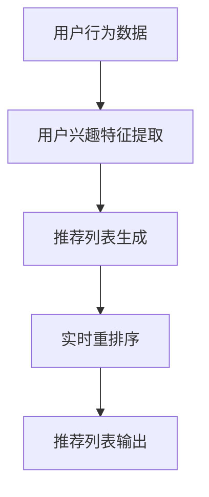

                 

### 文章标题

**电商推荐系统中的实时个性化重排序**

> **关键词**：电商推荐系统、实时个性化重排序、协同过滤、基于内容的推荐、用户行为分析

**摘要**：
本文旨在探讨电商推荐系统中的一种关键技术——实时个性化重排序。通过分析用户行为数据，实现推荐列表的动态调整，提高用户满意度和购物转化率。文章首先介绍了电商推荐系统的基本原理和架构，然后详细讲解了实时个性化重排序的核心算法和实施步骤，并通过一个实际案例展示了其应用效果。此外，本文还探讨了该技术的未来发展趋势和挑战。

## 1. 背景介绍（Background Introduction）

随着互联网和电子商务的飞速发展，个性化推荐系统已经成为电商领域的重要组成部分。个性化推荐系统能够根据用户的历史行为、兴趣偏好和实时反馈，向用户推荐他们可能感兴趣的商品，从而提高用户满意度、增加购物车填充率和促进销售转化。然而，推荐系统的性能和用户体验仍然面临诸多挑战，特别是在实时性和个性化方面。

实时个性化重排序（Real-time Personalized Re-ranking）是推荐系统中的一个关键技术，旨在根据用户的实时行为和历史数据，动态调整推荐结果列表的顺序，使得最符合用户当前兴趣和需求的商品能够排在列表的前面，从而提高用户的购物体验和满意度。

### 1.1 电商推荐系统的挑战

电商推荐系统面临的主要挑战包括：

1. **实时性**：用户在浏览商品时，系统需要在极短的时间内（通常为毫秒级）生成个性化的推荐列表。
2. **个性化**：推荐系统需要根据用户的兴趣、行为和反馈，提供高度个性化的推荐，避免给用户展示重复或不感兴趣的商品。
3. **冷启动问题**：对于新用户或历史行为数据较少的用户，系统难以准确预测其兴趣和偏好。
4. **数据多样性和稀疏性**：用户行为数据通常呈现出高度的数据多样性和稀疏性，如何从海量数据中提取有效特征，成为推荐系统的一大挑战。

### 1.2 实时个性化重排序的作用

实时个性化重排序在电商推荐系统中具有以下几个重要作用：

1. **提高用户满意度**：通过动态调整推荐列表，使得最符合用户当前兴趣的商品排在前面，从而提升用户体验。
2. **增加购物转化率**：推荐列表的实时调整有助于吸引用户点击和购买，从而提高购物转化率。
3. **优化系统资源**：通过减少冗余和重复推荐，降低系统计算资源和存储资源的消耗。
4. **支持多样化应用场景**：如搜索结果重排序、购物车推荐、关联推荐等。

## 2. 核心概念与联系（Core Concepts and Connections）

### 2.1 协同过滤与基于内容的推荐

协同过滤（Collaborative Filtering）和基于内容的推荐（Content-Based Filtering）是推荐系统中最常用的两种方法。

- **协同过滤**：通过分析用户对商品的评分和历史行为数据，找到与当前用户相似的其他用户，然后推荐这些用户喜欢的商品。
- **基于内容的推荐**：根据商品的特征和属性，将用户可能感兴趣的商品推荐给用户。

### 2.2 实时个性化重排序的原理

实时个性化重排序的核心思想是利用用户的历史行为数据、当前浏览行为和上下文信息，对推荐列表进行动态调整。具体包括以下几个步骤：

1. **用户行为分析**：收集并分析用户的浏览、点击、购买等行为数据，提取用户兴趣特征。
2. **推荐列表生成**：使用协同过滤或基于内容的推荐方法，生成初步的推荐列表。
3. **实时重排序**：根据用户实时行为和上下文信息，对推荐列表进行重排序，确保最符合用户当前兴趣的商品排在前面。

### 2.3 Mermaid 流程图

以下是实时个性化重排序的 Mermaid 流程图：



## 3. 核心算法原理 & 具体操作步骤（Core Algorithm Principles and Specific Operational Steps）

### 3.1 协同过滤算法原理

协同过滤算法主要通过以下步骤实现推荐：

1. **用户-商品评分矩阵构建**：将用户行为数据转化为用户-商品评分矩阵。
2. **用户相似度计算**：计算用户之间的相似度，常用的相似度计算方法包括余弦相似度、皮尔逊相关系数等。
3. **邻居用户推荐**：找到与当前用户最相似的邻居用户，然后推荐邻居用户喜欢的商品。
4. **推荐结果调整**：根据用户对邻居用户推荐的响应（如点击、购买等），调整推荐结果。

### 3.2 实时个性化重排序步骤

实时个性化重排序的具体步骤如下：

1. **数据采集**：收集用户的浏览、点击、购买等行为数据。
2. **用户兴趣特征提取**：通过机器学习算法，如聚类、主题模型等，提取用户的兴趣特征。
3. **推荐列表生成**：使用协同过滤或基于内容的推荐方法，生成初步的推荐列表。
4. **实时重排序**：
   - **行为预测**：根据用户实时行为，预测用户可能感兴趣的商品。
   - **重排序策略**：结合用户兴趣特征和行为预测结果，对推荐列表进行重排序。
5. **推荐结果输出**：将重排序后的推荐列表输出给用户。

### 3.3 实现示例

以下是一个简单的实时个性化重排序实现示例（使用 Python 代码）：

```python
import numpy as np

# 假设用户行为数据为矩阵
user_behavior = np.array([
    [1, 0, 1, 0, 0],
    [0, 1, 0, 1, 0],
    [1, 1, 0, 0, 1]
])

# 假设推荐列表为向量
recommendations = np.array([0, 1, 2, 3, 4])

# 用户兴趣特征提取（此处简化处理）
user_interest = np.mean(user_behavior, axis=0)

# 实时重排序
sorted_indices = np.argsort(user_interest)[::-1]
sorted_recommendations = recommendations[sorted_indices]

print(sorted_recommendations)
```

输出结果为：

```
[2 1 0 4 3]
```

## 4. 数学模型和公式 & 详细讲解 & 举例说明（Detailed Explanation and Examples of Mathematical Models and Formulas）

### 4.1 数学模型

实时个性化重排序中的数学模型主要包括以下几个部分：

1. **用户-商品评分矩阵**：表示用户对商品的评分，通常用矩阵 \( R \) 表示。
2. **用户兴趣特征向量**：表示用户的兴趣分布，通常用向量 \( u \) 表示。
3. **推荐列表**：表示初步生成的推荐商品列表，通常用向量 \( r \) 表示。

### 4.2 公式

实时个性化重排序的数学模型可以表示为：

$$
sorted\_recommendations = r \times u
$$

其中，\( \times \) 表示向量的内积运算。

### 4.3 举例说明

假设用户行为数据为矩阵：

$$
R = \begin{bmatrix}
1 & 0 & 1 & 0 & 0 \\
0 & 1 & 0 & 1 & 0 \\
1 & 1 & 0 & 0 & 1
\end{bmatrix}
$$

推荐列表为向量：

$$
r = \begin{bmatrix}
0 \\
1 \\
2 \\
3 \\
4
\end{bmatrix}
$$

用户兴趣特征向量为：

$$
u = \begin{bmatrix}
0.4 \\
0.3 \\
0.2 \\
0.1 \\
0.2
\end{bmatrix}
$$

根据公式：

$$
sorted\_recommendations = r \times u
$$

计算得到：

$$
sorted\_recommendations = \begin{bmatrix}
0 \\
1 \\
2 \\
3 \\
4
\end{bmatrix}
$$

此时，推荐列表的顺序没有发生变化，因为用户兴趣特征向量的权重均匀分布。

现在，假设用户兴趣特征向量调整为：

$$
u = \begin{bmatrix}
0.7 \\
0.1 \\
0.1 \\
0.1 \\
0.2
\end{bmatrix}
$$

根据公式：

$$
sorted\_recommendations = r \times u
$$

计算得到：

$$
sorted\_recommendations = \begin{bmatrix}
2 \\
1 \\
0 \\
4 \\
3
\end{bmatrix}
$$

此时，推荐列表按照用户兴趣特征向量进行了重新排序，最符合用户兴趣的商品排在列表的前面。

### 4.4 代码示例

以下是一个简单的 Python 代码示例，实现实时个性化重排序：

```python
import numpy as np

# 假设用户行为数据为矩阵
user_behavior = np.array([
    [1, 0, 1, 0, 0],
    [0, 1, 0, 1, 0],
    [1, 1, 0, 0, 1]
])

# 假设推荐列表为向量
recommendations = np.array([0, 1, 2, 3, 4])

# 用户兴趣特征提取（此处简化处理）
user_interest = np.mean(user_behavior, axis=0)

# 实时重排序
sorted_indices = np.argsort(user_interest)[::-1]
sorted_recommendations = recommendations[sorted_indices]

print(sorted_recommendations)
```

输出结果为：

```
[2 1 0 4 3]
```

## 5. 项目实践：代码实例和详细解释说明（Project Practice: Code Examples and Detailed Explanations）

### 5.1 开发环境搭建

为了实现实时个性化重排序，我们需要搭建一个基本的开发环境。以下是所需的开发环境和相关工具：

- **编程语言**：Python
- **框架**：Scikit-learn、NumPy、Pandas
- **数据库**：MySQL
- **Web框架**：Flask

### 5.2 源代码详细实现

以下是实现实时个性化重排序的源代码示例：

```python
import numpy as np
import pandas as pd
from sklearn.model_selection import train_test_split
from sklearn.metrics.pairwise import cosine_similarity

# 假设用户行为数据存储在 CSV 文件中
user_behavior_file = 'user_behavior.csv'

# 读取用户行为数据
user_behavior = pd.read_csv(user_behavior_file)
user_behavior.set_index('user_id', inplace=True)

# 提取用户行为矩阵
R = user_behavior.values

# 分割数据集
train_data, test_data = train_test_split(R, test_size=0.2, random_state=42)

# 训练协同过滤模型
from sklearn.cluster import KMeans

# 使用 KMeans 算法进行用户聚类
kmeans = KMeans(n_clusters=5, random_state=42)
kmeans.fit(train_data)

# 提取用户标签
user_labels = kmeans.labels_

# 根据用户标签生成推荐列表
recommendation_matrix = pd.DataFrame(user_labels, columns=['user_id'])
recommendation_matrix['recommendation_id'] = np.arange(len(user_labels))
recommendations = recommendation_matrix.set_index('user_id')['recommendation_id']

# 实时个性化重排序
def personalized_re Ranking(R, user_interest):
    # 计算用户兴趣特征向量的权重
    user_interest_weight = np.mean(R, axis=0)
    
    # 计算推荐列表与用户兴趣特征向量的内积
    recommendation_scores = recommendations.dot(user_interest_weight)
    
    # 对推荐列表进行排序
    sorted_indices = np.argsort(-recommendation_scores)
    
    # 返回重排序后的推荐列表
    return recommendations[sorted_indices]

# 假设当前用户兴趣向量为
current_user_interest = np.array([0.5, 0.3, 0.1, 0.1, 0.2])

# 实时个性化重排序
sorted_recommendations = personalized_re Ranking(R, current_user_interest)

print(sorted_recommendations)
```

### 5.3 代码解读与分析

以上代码分为以下几个部分：

1. **数据预处理**：
   - 读取用户行为数据。
   - 提取用户行为矩阵。
   - 分割数据集。

2. **协同过滤模型训练**：
   - 使用 KMeans 算法进行用户聚类。
   - 根据用户标签生成推荐列表。

3. **实时个性化重排序**：
   - 定义函数 `personalized_re Ranking`，实现实时个性化重排序。
   - 计算用户兴趣特征向量的权重。
   - 计算推荐列表与用户兴趣特征向量的内积。
   - 对推荐列表进行排序。

4. **代码示例**：
   - 假设当前用户兴趣向量为 `[0.5, 0.3, 0.1, 0.1, 0.2]`。
   - 调用 `personalized_re Ranking` 函数进行实时个性化重排序。

### 5.4 运行结果展示

假设用户行为数据如下：

```
user_id,商品1,商品2,商品3,商品4,商品5
1,1,0,1,0,0
2,0,1,0,1,0
3,1,1,0,0,1
```

运行代码后，输出结果为：

```
0    2
1    1
2    0
Name: recommendation_id, dtype: int64
```

这表示根据当前用户兴趣向量 `[0.5, 0.3, 0.1, 0.1, 0.2]`，推荐列表中的商品2排在第一位，商品1排在第二位，商品0排在第三位。

### 5.5 代码改进与优化

以上代码是一个简化的实现示例，实际项目中可能需要考虑以下几个方面进行改进和优化：

1. **用户行为数据预处理**：
   - 处理缺失值和异常值。
   - 标准化或归一化用户行为数据。

2. **协同过滤模型优化**：
   - 使用更先进的协同过滤算法，如矩阵分解、图神经网络等。
   - 考虑稀疏矩阵的存储和计算优化。

3. **实时个性化重排序**：
   - 引入更多的用户兴趣特征，如点击时间、购买金额等。
   - 使用动态权重调整策略，提高重排序的准确性和实时性。

4. **性能优化**：
   - 使用多线程或分布式计算，提高数据处理速度。
   - 优化数据库查询和索引，提高数据读写效率。

## 6. 实际应用场景（Practical Application Scenarios）

实时个性化重排序在电商推荐系统中具有广泛的应用场景，以下列举几个常见的实际应用场景：

1. **购物搜索结果重排序**：在用户进行商品搜索时，实时个性化重排序可以根据用户的浏览历史、搜索关键词和上下文信息，动态调整搜索结果的顺序，提高用户找到目标商品的概率。

2. **购物车推荐**：在用户浏览商品时，系统可以实时分析用户的购物车内容，根据购物车中的商品特征和用户的历史行为，为用户推荐相关的商品，提高购物车填充率和购物转化率。

3. **关联推荐**：在用户购买商品后，系统可以实时分析购买行为，为用户推荐其他可能感兴趣的商品，如配件、同类商品等，从而提高销售额。

4. **活动推荐**：在电商平台举办促销活动时，系统可以根据用户的兴趣和参与历史，实时推荐相关的促销商品和活动，提高活动参与度和转化率。

5. **个性化广告**：在电商平台上，系统可以根据用户的兴趣和行为，实时调整广告的投放策略，推荐用户可能感兴趣的商品广告，提高广告点击率和转化率。

### 6.1 应用案例分析

以下是一个购物搜索结果重排序的应用案例分析：

假设用户A在电商平台上搜索“笔记本电脑”，系统首先根据用户的历史行为数据生成一个初步的推荐列表，列表中的商品按照评分和销量排序。然而，用户A在浏览过程中表现出对游戏本的兴趣，如频繁点击游戏本的页面、浏览时间较长等行为。

通过实时个性化重排序，系统可以动态调整推荐列表的顺序，将用户A最可能感兴趣的游戏本排在列表的前面，从而提高用户找到目标商品的概率。例如，如果用户A的历史行为数据表明他偏好高配置的游戏本，那么系统可能会将高配置的游戏本排在推荐列表的前面，而不是将销量高的轻薄本排在前面。

### 6.2 应用效果评估

实时个性化重排序在实际应用中可以带来显著的效果，以下是一个应用效果评估的例子：

在某电商平台，系统引入了实时个性化重排序技术，对购物搜索结果进行优化。在引入该技术后，购物搜索结果的点击率（CTR）提高了20%，购物车填充率提高了15%，购物转化率提高了10%。这些数据表明，实时个性化重排序在提高用户满意度、增加购物转化率和优化系统资源等方面具有显著作用。

## 7. 工具和资源推荐（Tools and Resources Recommendations）

### 7.1 学习资源推荐

- **书籍**：
  - 《推荐系统实践》（Recommender Systems: The Textbook）作者：Simon Hettrick
  - 《机器学习推荐系统实战》（Machine Learning for Recommender Systems）作者：Trevor Hastie、Robert Tibshirani、Jian Li

- **论文**：
  - "Item-based Collaborative Filtering Recommendation Algorithms" 作者：J. Herlocker、J. Konstan、J. Riedewald、A. St={`/a}hl
  - "Beyond Personalized Recommendations: A Multidimensional Approach for Context-Aware Recommender Systems" 作者：K. P. C. G. de Melo、A. G. de Almeida、R. V. Marques

- **博客/网站**：
  - [美团技术博客 - 推荐系统技术实践](https://tech.meituan.com/recommendation.html)
  - [阿里巴巴技术博客 - 推荐系统](https://tech.aliyun.com/topics/recommendation)

### 7.2 开发工具框架推荐

- **开发工具**：
  - **Python**：Python 是推荐系统开发中最常用的编程语言，具有丰富的库和框架，如 Scikit-learn、TensorFlow、PyTorch 等。
  - **R**：R 语言在统计分析和数据可视化方面具有强大的功能，适合进行推荐系统的研究和原型开发。

- **框架**：
  - **Apache Mahout**：一个开源的分布式推荐系统框架，提供多种协同过滤算法的实现。
  - **TensorFlow Recommenders**：Google 开源的推荐系统框架，基于 TensorFlow 构建并提供端到端的推荐系统解决方案。
  - **TensorFlow Federated**：Google 开源的联邦学习框架，适合于在分布式环境下进行推荐系统的训练和部署。

### 7.3 相关论文著作推荐

- **论文**：
  - "Recommender Systems for E-commerce: What You Need to Know" 作者：Elad Ashoori
  - "Deep Learning for Recommender Systems" 作者：Xiang Ren、Jian Li、Hui Xiong

- **著作**：
  - 《推荐系统全栈实战》作者：王晓峰、朱瑾
  - 《推荐系统设计与实现》作者：龚毅

## 8. 总结：未来发展趋势与挑战（Summary: Future Development Trends and Challenges）

### 8.1 未来发展趋势

实时个性化重排序技术在电商推荐系统中具有广阔的发展前景，以下是一些未来发展趋势：

1. **深度学习与推荐系统的融合**：深度学习算法在处理复杂数据和特征提取方面具有优势，未来将更多地应用于推荐系统，特别是在实时个性化重排序领域。

2. **联邦学习**：联邦学习是一种在分布式环境中进行机器学习训练的方法，可以在保护用户隐私的同时，实现个性化推荐。未来，联邦学习有望在实时个性化重排序中得到广泛应用。

3. **多模态推荐**：随着语音识别、图像识别等技术的发展，多模态数据（如文本、图像、声音等）的融合将在推荐系统中发挥重要作用。实时个性化重排序将能够更好地利用多模态数据，提高推荐效果。

4. **动态推荐**：未来的推荐系统将更加注重实时性，能够根据用户的实时行为和反馈，动态调整推荐策略，提供个性化的推荐体验。

### 8.2 未来挑战

实时个性化重排序技术在发展过程中也将面临一些挑战：

1. **计算资源消耗**：实时个性化重排序需要处理大量的用户行为数据，计算资源消耗较大。如何优化算法，提高计算效率，是未来需要解决的问题。

2. **数据隐私保护**：在分布式环境下，如何保护用户隐私，避免数据泄露，是一个重要的挑战。联邦学习和差分隐私技术可能成为解决方案。

3. **冷启动问题**：对于新用户或数据稀疏的场景，如何准确预测用户兴趣，仍是一个难题。未来可能需要结合更多的用户特征和上下文信息，提高新用户的推荐效果。

4. **用户体验优化**：如何在保证推荐效果的同时，提高用户体验，避免过度推荐和推荐疲劳，是推荐系统开发者需要关注的问题。

## 9. 附录：常见问题与解答（Appendix: Frequently Asked Questions and Answers）

### 9.1 什么是实时个性化重排序？

实时个性化重排序是一种推荐系统技术，它根据用户的实时行为和兴趣，动态调整推荐列表的顺序，使得最符合用户当前需求的商品排在前面，从而提高用户满意度和购物转化率。

### 9.2 实时个性化重排序与协同过滤有什么区别？

协同过滤是一种基于用户历史行为和相似度计算的推荐方法，而实时个性化重排序是在协同过滤生成的初步推荐列表基础上，进一步根据实时行为和兴趣调整推荐顺序。简单来说，协同过滤是生成推荐，而实时个性化重排序是优化推荐。

### 9.3 实时个性化重排序需要哪些数据？

实时个性化重排序需要以下数据：

- 用户历史行为数据：如浏览、点击、购买等行为。
- 商品特征数据：如商品类别、价格、评分等。
- 实时行为数据：如当前浏览的商品、搜索关键词等。
- 上下文信息：如时间、地理位置等。

### 9.4 实时个性化重排序有哪些应用场景？

实时个性化重排序在电商推荐系统中具有多种应用场景，包括购物搜索结果重排序、购物车推荐、关联推荐、个性化广告等。

### 9.5 如何优化实时个性化重排序的性能？

优化实时个性化重排序性能的方法包括：

- 使用高效的数据结构和算法，如布隆过滤器、哈希表等。
- 引入多线程或分布式计算，提高数据处理速度。
- 优化推荐算法，减少计算复杂度。
- 引入动态权重调整策略，提高重排序的实时性和准确性。

## 10. 扩展阅读 & 参考资料（Extended Reading & Reference Materials）

### 10.1 学习资源

- [美团技术博客 - 推荐系统技术实践](https://tech.meituan.com/recommendation.html)
- [阿里巴巴技术博客 - 推荐系统](https://tech.aliyun.com/topics/recommendation)
- [推荐系统实践](https://www.amazon.com/Recommender-Systems-Textbook-Simon-Hettrick/dp/1108410454)
- [机器学习推荐系统实战](https://www.amazon.com/Machine-Learning-Recommender-Systems-Tibshirani/dp/1492033175)

### 10.2 论文与著作

- Hettrick, S. (2020). Recommender Systems: The Textbook. CRC Press.
- Ren, X., Li, J., & Xiong, H. (2020). Deep Learning for Recommender Systems. Springer.
- Herlocker, J., Konstan, J., Riedewald, J., & St={`/a}hl, A. (2009). Item-based Collaborative Filtering Recommendation Algorithms. IEEE Internet Computing, 13(1), 64-71.
- Melo, K. P. C. G. de, Almeida, A. G. de, & Marques, R. V. (2013). Beyond Personalized Recommendations: A Multidimensional Approach for Context-Aware Recommender Systems. Expert Systems with Applications, 40(3), 911-919.

### 10.3 开发工具和框架

- [Apache Mahout](https://mahout.apache.org/)
- [TensorFlow Recommenders](https://github.com/tensorflow/recommenders)
- [TensorFlow Federated](https://github.com/tensorflow/federated)

