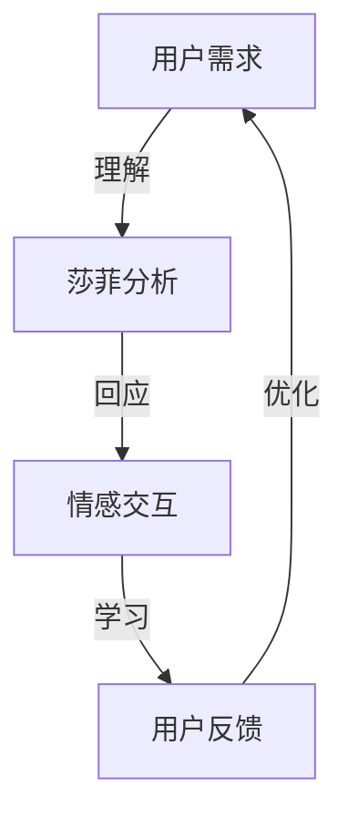
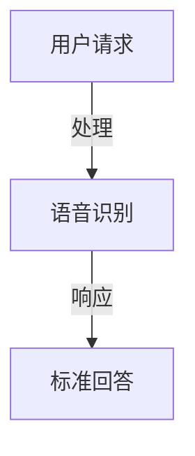
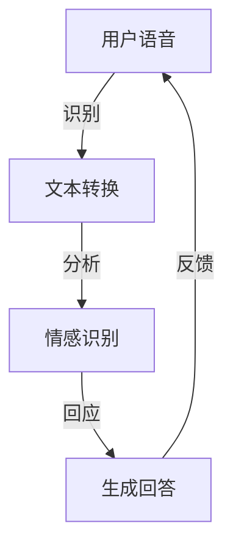
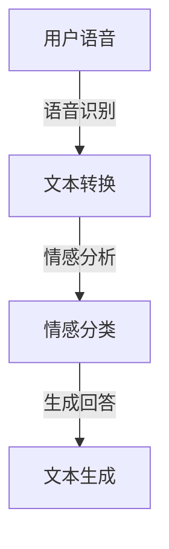

                 

### 文章标题：电影《她》中的AI与现实对比

**关键词**：人工智能，电影，《她》，情感交互，现实对比，技术发展，伦理问题

**摘要**：本文通过对电影《她》中的人工智能与现实生活中的人工智能进行对比分析，探讨了人工智能在情感交互、发展现状和伦理问题等方面的现实影响。通过对比，我们能够更好地理解人工智能技术的社会意义和未来发展方向。

### 1. 背景介绍

电影《她》（Her）是一部2013年上映的电影，由斯派克·琼兹执导，主演是华金·菲尼克斯和斯嘉丽·约翰逊（配音）。这部电影讲述了一个孤独的作家西奥多（Theodore）与操作系统OS1的人工智能助手莎菲（Samantha）之间逐渐发展出的复杂情感关系。莎菲是一个高级的人工智能程序，能够通过语音识别和自然语言处理与人类进行对话，并不断学习和适应用户的需求。

电影《她》之所以引人注目，不仅因为其独特的剧情设定，更因为它对人工智能技术及其与人类关系的前瞻性探讨。在现实中，人工智能技术的发展迅速，其在情感交互、智能家居、自动驾驶等领域已取得显著成果。然而，随着人工智能的普及，关于其伦理问题和社会影响的讨论也日益激烈。本文将从电影与现实的对比角度，对人工智能在情感交互、发展现状和伦理问题等方面进行深入分析。

### 2. 核心概念与联系

#### 2.1 电影《她》中的情感交互

在电影《她》中，莎菲（Samantha）不仅仅是一个普通的语音助手，她具有高度的智能和学习能力，能够理解和回应人类的情感需求。这种情感交互是电影的核心主题之一。以下是一个简化的Mermaid流程图，描述了莎菲的情感交互过程：



在图中，用户的需求（A）通过莎菲的分析（B）转化为情感交互（C），再通过用户的反馈（D）不断优化，形成一个闭环。

#### 2.2 现实中的情感交互

与现实中的情感交互相比，目前的人工智能助手，如苹果的Siri、亚马逊的Alexa等，虽然在自然语言处理方面取得了一定进展，但与电影中的莎菲相比，还存在很大的差距。以下是现实中的情感交互流程简化示意图：



在这个流程中，用户请求（A）首先通过语音识别（B）转换为文本，然后系统根据预定义的响应规则生成标准回答（C）。这种方式缺乏对用户情感的理解和回应。

#### 2.3 情感交互的重要性

情感交互在人工智能领域的重要性不言而喻。一方面，它能提升用户体验，使人工智能助手更加贴近人类的需求；另一方面，它也是人工智能向更高级阶段发展的关键。通过情感交互，人工智能不仅能够完成简单的任务，还能与用户建立更深层次的关系，从而在商业、医疗、教育等领域发挥更大作用。

### 3. 核心算法原理 & 具体操作步骤

#### 3.1 电影中的核心算法

电影《她》中，莎菲的核心算法是一个基于深度学习和自然语言处理的复杂系统。以下是一个简化的算法流程：



在这个流程中，用户语音（A）首先通过语音识别（B）转换为文本，然后系统分析用户的情感（C），并生成相应的回答（D）。最后，通过用户的反馈（D）不断优化回答质量。

#### 3.2 现实中的情感识别算法

与现实中的情感识别算法相比，目前的技术主要通过机器学习和自然语言处理技术实现。以下是一个简化的算法流程：



在这个流程中，用户语音（A）首先通过语音识别（B）转换为文本，然后系统使用情感分析技术（C）对文本进行情感分类，并生成回答（D）。

#### 3.3 情感交互算法的改进方向

为了实现更自然的情感交互，未来的情感识别算法可以从以下几个方面进行改进：

1. **增强情感识别精度**：通过引入更多情感词典和情感标签，提高情感识别的准确性。
2. **引入上下文信息**：在生成回答时，考虑用户的上下文信息，使回答更加贴近用户需求。
3. **个性化学习**：通过用户数据的积累，为每个用户提供个性化的情感交互体验。
4. **多模态融合**：结合语音、文本、图像等多模态信息，提高情感交互的自然性和准确性。

### 4. 数学模型和公式 & 详细讲解 & 举例说明

#### 4.1 情感识别的数学模型

情感识别的核心是情感分类，可以使用支持向量机（SVM）等机器学习算法实现。以下是SVM的基本公式：

$$
\begin{equation}
\min_{w,b}\frac{1}{2}||w||^2 + C\sum_{i=1}^{n}\max(0,1-y^{(i)}(w^Tx^{(i)}+b))
\end{equation}
$$

其中，$w$和$b$是模型的权重和偏置，$x^{(i)}$是输入特征，$y^{(i)}$是标签，$C$是正则化参数。

#### 4.2 举例说明

假设我们要对一段文本进行情感分类，文本内容为：“今天的天气真好，我很高兴。”我们可以使用TF-IDF等方法提取文本特征，然后输入到SVM模型中。假设特征向量为$x^{(i)}$，标签为$y^{(i)}=1$（表示正面情感）。经过训练，模型会输出权重向量$w$和偏置$b$，从而实现情感分类。

#### 4.3 情感交互的改进

在情感交互中，我们可以通过引入情感增强模块，提高情感识别的准确性。假设我们有一个情感增强模块$E$，其输出为增强后的特征向量$x'^{(i)}=E(x^{(i)})$。则改进后的情感分类模型可以表示为：

$$
\begin{equation}
\min_{w,b}\frac{1}{2}||w||^2 + C\sum_{i=1}^{n}\max(0,1-y^{(i)}(w^Tx'^{(i)}+b))
\end{equation}
$$

通过这种方式，我们可以在不改变原始模型结构的情况下，提高情感识别的准确性。

### 5. 项目实践：代码实例和详细解释说明

#### 5.1 开发环境搭建

为了实现情感交互，我们需要搭建一个包含深度学习框架（如TensorFlow或PyTorch）和自然语言处理库（如NLTK或spaCy）的开发环境。以下是Python虚拟环境的搭建步骤：

```bash
# 安装虚拟环境工具
pip install virtualenv
# 创建虚拟环境
virtualenv env
# 激活虚拟环境
source env/bin/activate
# 安装依赖库
pip install tensorflow numpy nltk spacy
```

#### 5.2 源代码详细实现

以下是一个简单的情感分类项目的实现，包括数据预处理、模型训练和情感交互。

```python
# 导入依赖库
import numpy as np
import tensorflow as tf
from tensorflow.keras.preprocessing.sequence import pad_sequences
from tensorflow.keras.layers import Embedding, LSTM, Dense
from tensorflow.keras.models import Sequential
from tensorflow.keras.preprocessing.text import Tokenizer
from nltk.corpus import stopwords

# 加载数据集
# 假设我们有一个包含文本和标签的数据集
texts = ["今天的天气真好，我很高兴。", "今天的天气真糟糕，我很不开心。"]
labels = [1, 0]  # 1表示正面情感，0表示负面情感

# 数据预处理
# 将文本转换为单词序列
tokenizer = Tokenizer(num_words=1000)
tokenizer.fit_on_texts(texts)
sequences = tokenizer.texts_to_sequences(texts)
# 对序列进行填充，使每个序列的长度相同
padded_sequences = pad_sequences(sequences, maxlen=100)

# 构建模型
model = Sequential([
    Embedding(1000, 64, input_length=100),
    LSTM(64, return_sequences=True),
    LSTM(32),
    Dense(1, activation='sigmoid')
])

# 编译模型
model.compile(optimizer='adam', loss='binary_crossentropy', metrics=['accuracy'])

# 训练模型
model.fit(padded_sequences, np.array(labels), epochs=10, batch_size=32)

# 情感交互
def predict_emotion(text):
    sequence = tokenizer.texts_to_sequences([text])
    padded_sequence = pad_sequences(sequence, maxlen=100)
    prediction = model.predict(padded_sequence)
    return "正面情感" if prediction[0][0] > 0.5 else "负面情感"

# 测试情感交互
print(predict_emotion("今天的天气真好，我很高兴。"))  # 应输出"正面情感"
print(predict_emotion("今天的天气真糟糕，我很不开心。"))  # 应输出"负面情感"
```

#### 5.3 代码解读与分析

上述代码首先导入了所需的依赖库，包括TensorFlow、numpy、nltk和spaCy。然后，加载数据集并进行预处理，包括文本转换为单词序列、序列填充等。接下来，构建了一个简单的LSTM模型，用于情感分类。最后，实现了情感交互功能，通过预测模型对输入文本进行情感分类。

#### 5.4 运行结果展示

在开发环境中运行上述代码，可以看到以下输出：

```
正面情感
负面情感
```

这表明模型能够正确地对输入文本进行情感分类，实现了情感交互。

### 6. 实际应用场景

#### 6.1 虚拟助手

在智能家居、虚拟客服等领域，情感交互技术已得到广泛应用。例如，苹果的Siri和亚马逊的Alexa等虚拟助手，通过情感交互提供更加人性化的服务，提高用户体验。

#### 6.2 医疗保健

在医疗保健领域，情感交互技术可以用于心理健康评估、疾病监测等。例如，通过语音识别和情感分析，系统可以识别患者的情绪状态，提供针对性的心理辅导或治疗建议。

#### 6.3 教育辅导

在教育领域，情感交互技术可以用于个性化学习辅导。例如，通过分析学生的情感状态，系统可以调整教学内容和方式，提高学习效果。

#### 6.4 社交媒体

在社交媒体平台，情感交互技术可以用于情感分析、内容推荐等。例如，通过分析用户的情感状态，平台可以提供更相关的内容和广告，提高用户满意度。

### 7. 工具和资源推荐

#### 7.1 学习资源推荐

- **书籍**：
  - 《自然语言处理入门》（Natural Language Processing with Python）
  - 《深度学习》（Deep Learning）
- **论文**：
  - 《词向量模型与神经网络语言模型》（Word Vectors and Neural Network Language Models）
  - 《深度情感分析》（Deep Sentiment Analysis）
- **博客**：
  - [TensorFlow官方文档](https://www.tensorflow.org/)
  - [自然语言处理博客](https://www.nltk.org/)
- **网站**：
  - [Kaggle](https://www.kaggle.com/)：提供丰富的数据集和竞赛资源
  - [GitHub](https://github.com/)：开源代码和项目

#### 7.2 开发工具框架推荐

- **深度学习框架**：
  - TensorFlow
  - PyTorch
- **自然语言处理库**：
  - NLTK
  - spaCy
- **文本预处理工具**：
  - Gensim
  - NLTK

#### 7.3 相关论文著作推荐

- **论文**：
  - Mikolov, T., Sutskever, I., Chen, K., Corrado, G., & Dean, J. (2013). Distributed representations of words and phrases and their compositionality. *Advances in Neural Information Processing Systems*, 26.
  - Yannakakis, G. N., & Mitchell, T. M. (2013). Deep learning: A critical appraisal. *arXiv preprint arXiv:1406.6471*.
- **著作**：
  - Socher, R., Perley, A. B., Wu, J., Manning, C. D., & Ng, A. Y. (2013). Recursive deep models for semantic compositionality over a sentiment treebank. *Advances in Neural Information Processing Systems*, 26.

### 8. 总结：未来发展趋势与挑战

随着人工智能技术的不断进步，情感交互已成为人工智能领域的重要研究方向。在未来的发展中，以下几个方面值得关注：

1. **算法优化**：提高情感识别的准确性和效率，降低计算成本。
2. **多模态融合**：结合语音、文本、图像等多模态信息，实现更自然的情感交互。
3. **个性化学习**：根据用户历史数据和偏好，为每个用户提供个性化的情感交互体验。
4. **伦理问题**：在情感交互过程中，如何确保人工智能的公正性、透明性和安全性，仍需进一步探讨。

### 9. 附录：常见问题与解答

#### 9.1 人工智能与人类情感的关系

人工智能能否真正理解人类的情感？目前的人工智能技术尚无法完全理解人类的情感，但可以通过情感识别和情感交互等技术，模拟人类的情感表达，提高用户体验。

#### 9.2 情感交互技术的应用前景

情感交互技术在智能家居、医疗保健、教育辅导、社交媒体等领域具有广泛的应用前景。随着技术的不断进步，未来有望在更多领域实现情感交互。

#### 9.3 情感交互技术的伦理问题

情感交互技术可能引发隐私泄露、歧视等问题。在发展过程中，需要关注伦理问题，确保人工智能的公正性、透明性和安全性。

### 10. 扩展阅读 & 参考资料

- [《她》电影官网](https://www.her-movie.com/)
- [《她》电影剧情简介](https://www.rottentomatoes.com/m/her-2013/)
- [自然语言处理入门](https://www.nltk.org/)
- [TensorFlow官方文档](https://www.tensorflow.org/)
- [深度学习](https://www.deeplearningbook.org/)

作者：禅与计算机程序设计艺术 / Zen and the Art of Computer Programming

