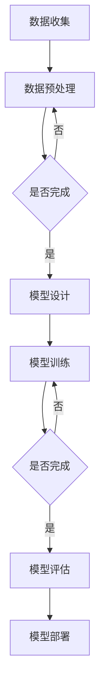
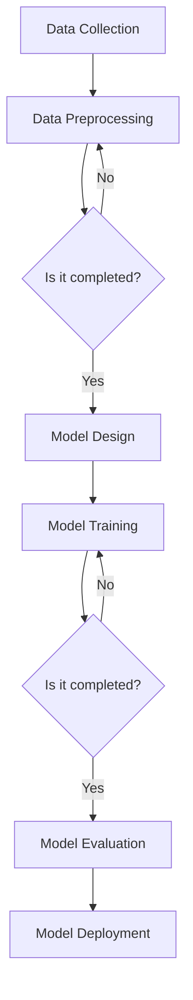

                 

### 文章标题

# 百度文心2025社招大模型研发面试题攻略

> 关键词：百度文心，社招，大模型研发，面试题，攻略
>
> 摘要：本文针对百度文心2025年社会招聘的大模型研发岗位，整理并分析了相关面试题，为准备面试的候选人提供详细的解题思路和攻略。文章内容涵盖了核心概念、算法原理、数学模型、项目实践、应用场景等多个方面，旨在帮助候选人全面了解和应对面试挑战。

在人工智能快速发展的背景下，大模型研发已成为各大科技公司竞争的焦点。百度文心作为百度旗下人工智能品牌，致力于打造强大的语言模型和认知引擎。2025年的社招大模型研发岗位吸引了众多人才，面试环节的设计更是考验候选人的技术实力和思维能力。本文将围绕百度文心2025年社招大模型研发面试题，进行深入剖析，为准备面试的候选人提供详细的解题攻略。

本文结构如下：

1. **背景介绍**：介绍百度文心的发展背景和面试题的重要性。
2. **核心概念与联系**：梳理大模型研发的核心概念和关键联系。
3. **核心算法原理 & 具体操作步骤**：详细讲解大模型研发中的关键算法原理和操作步骤。
4. **数学模型和公式 & 详细讲解 & 举例说明**：运用数学模型和公式，深入分析大模型研发的技术细节。
5. **项目实践：代码实例和详细解释说明**：通过具体项目实践，展示代码实例和详细解释。
6. **实际应用场景**：探讨大模型研发在实际应用中的场景和挑战。
7. **工具和资源推荐**：推荐学习资源和开发工具框架。
8. **总结：未来发展趋势与挑战**：总结大模型研发的未来趋势和面临的挑战。
9. **附录：常见问题与解答**：解答面试过程中可能遇到的问题。
10. **扩展阅读 & 参考资料**：提供扩展阅读和参考资料，帮助候选人进一步学习。

接下来，我们将一一深入这些部分，帮助候选人更好地准备面试。

<|user|>### 1. 背景介绍（Background Introduction）

百度文心（ERNIE，Enhanced Representation through kNowledge Integration）是百度公司推出的一种大规模预训练语言模型，旨在通过整合知识，提供更加准确、丰富的语义表示。百度文心在文本理解、问答系统、自然语言生成等方面展现了强大的能力，广泛应用于搜索引擎、智能助手、内容审核等多个领域。

随着人工智能技术的不断进步，大模型研发的重要性日益凸显。大模型不仅需要具备强大的计算能力和海量数据支持，还需要在算法设计、模型训练、优化等方面进行深入研究。因此，对于从事大模型研发的岗位，面试者需要具备深厚的理论基础和丰富的实践经验。

百度文心2025年社招大模型研发岗位的面试题涵盖了多个方面，包括核心概念、算法原理、数学模型、项目实践等。这些面试题不仅考察候选人的基础知识，还注重对实际问题的分析和解决能力。面试题的难度和广度对候选人的综合素质提出了很高的要求。

面试题的重要性体现在以下几个方面：

1. **考察技术实力**：通过面试题，可以全面了解候选人对大模型研发相关技术的掌握程度，包括算法原理、模型结构、优化方法等。
2. **评估学习能力**：面试题往往涉及一些前沿技术或新领域，通过解决这些问题，可以评估候选人是否具备快速学习新技术的能力。
3. **了解问题解决能力**：面试题通常围绕实际应用场景设计，通过回答这些问题，可以考察候选人如何将理论知识应用于实际问题，解决难题的能力。
4. **评估团队合作和沟通能力**：大模型研发是一个复杂的系统工程，需要团队成员之间的紧密协作和有效沟通。通过面试题，可以评估候选人在团队合作和沟通方面的能力。

接下来，我们将详细分析百度文心2025年社招大模型研发面试题的各个方面，帮助候选人更好地准备面试。

<|user|>### 2. 核心概念与联系（Core Concepts and Connections）

#### 2.1 大模型的基本概念

大模型（Large-scale Model）是指参数量巨大、计算资源需求庞大的神经网络模型。这类模型在训练过程中需要处理海量数据，通过深度学习技术不断优化模型参数，从而实现高精度的任务预测和决策。

百度文心（ERNIE）是一款基于Transformer架构的大规模预训练语言模型，其核心思想是整合多种知识源，包括通用知识库、专业领域知识和大规模语言数据。ERNIE通过自监督学习算法，在大规模语料库上进行预训练，然后针对特定任务进行微调，从而实现高效的语言理解和生成。

#### 2.2 大模型的主要组成部分

1. **Transformer架构**：Transformer是近年来在自然语言处理领域取得重大突破的神经网络架构。相较于传统的循环神经网络（RNN），Transformer通过自注意力机制（Self-Attention）实现并行计算，大幅提高了模型训练效率。

2. **预训练与微调**：预训练是指在大规模语料库上训练模型，使其掌握通用的语言理解和生成能力。微调是在预训练基础上，针对特定任务对模型进行进一步训练，使其适应特定领域的需求。

3. **知识整合**：大模型通过整合多种知识源，包括通用知识库、专业领域知识和大规模语言数据，提高模型对复杂问题的理解和处理能力。

4. **优化算法**：优化算法是提升模型性能的关键，包括参数优化、梯度优化和数据预处理等。常用的优化算法有Adam、RMSprop等。

#### 2.3 大模型的技术挑战

1. **计算资源需求**：大模型的训练和推理需要大量的计算资源，包括CPU、GPU和TPU等。如何高效地利用计算资源，提高训练和推理速度，是技术上的一个重要挑战。

2. **数据预处理**：大模型对数据质量有很高的要求，包括数据量、数据分布和数据清洗等。如何进行有效的数据预处理，提高数据质量，是技术上的另一个挑战。

3. **模型可解释性**：大模型的决策过程往往具有高度复杂性，导致其可解释性较差。如何提高模型的可解释性，使其更易于理解和使用，是一个亟待解决的问题。

4. **模型部署**：大模型的部署需要考虑硬件资源、网络带宽和安全性等因素。如何高效地部署大模型，满足实际应用需求，是一个重要的挑战。

#### 2.4 大模型的应用场景

1. **文本理解与生成**：大模型在文本理解与生成领域具有广泛的应用，包括问答系统、机器翻译、文本摘要等。

2. **知识图谱**：大模型可以用于知识图谱的构建与推理，提高对复杂数据的理解和处理能力。

3. **智能客服**：大模型在智能客服领域具有很大的潜力，可以提供更自然、更准确的对话体验。

4. **内容审核**：大模型在内容审核领域具有重要作用，可以识别违规内容、敏感信息等，提高内容审核的效率和准确性。

#### 2.5 大模型与相关技术的关系

1. **深度学习**：大模型是深度学习技术的重要组成部分，其发展推动了深度学习在自然语言处理、计算机视觉等领域的应用。

2. **自然语言处理（NLP）**：大模型在NLP领域具有广泛的应用，包括文本分类、情感分析、命名实体识别等。

3. **机器学习**：大模型的发展依赖于机器学习技术，包括优化算法、模型训练等。

4. **人工智能**：大模型是人工智能技术的重要应用方向，其发展将推动人工智能在各个领域的应用。

通过以上分析，我们可以看出大模型在人工智能领域的核心地位和广泛应用。在接下来的章节中，我们将进一步探讨大模型研发中的核心算法原理、数学模型、项目实践等方面，帮助候选人更好地应对面试挑战。

#### 2.6 Mermaid 流程图

下面是一个示例的Mermaid流程图，用于展示大模型研发的基本流程：



在面试中，了解如何使用Mermaid流程图展示算法流程是一个加分项，因为它能够直观地展示复杂的算法过程，使面试官更容易理解你的思路。

### 2. Core Concepts and Connections

#### 2.1 Basic Concepts of Large-scale Models

Large-scale models refer to neural network models with a vast number of parameters and high computational requirements. These models are trained on massive datasets to optimize their parameters and achieve high-precision predictions and decisions. Baidu Wenxin (ERNIE) is a large-scale pre-trained language model developed by Baidu, which integrates various knowledge sources, including general knowledge bases, domain-specific knowledge, and large-scale language data. The core idea behind ERNIE is to provide more accurate and rich semantic representations through knowledge integration.

#### 2.2 Main Components of Large-scale Models

1. **Transformer Architecture**: Transformer is a neural network architecture that has achieved significant breakthroughs in the field of natural language processing. Unlike traditional recurrent neural networks (RNNs), Transformer uses self-attention mechanisms for parallel computation, significantly improving training efficiency.

2. **Pre-training and Fine-tuning**: Pre-training involves training the model on a large-scale corpus to learn general language understanding and generation capabilities. Fine-tuning is the further training of the pre-trained model on a specific task to adapt it to the needs of that domain.

3. **Knowledge Integration**: Large-scale models integrate multiple knowledge sources, including general knowledge bases, domain-specific knowledge, and large-scale language data, to enhance their understanding and processing of complex problems.

4. **Optimization Algorithms**: Optimization algorithms are crucial for improving model performance, including parameter optimization, gradient optimization, and data preprocessing. Common optimization algorithms include Adam and RMSprop.

#### 2.3 Technical Challenges of Large-scale Models

1. **Computational Resource Requirements**: Large-scale models require substantial computational resources for training and inference, including CPUs, GPUs, and TPUs. Efficient utilization of these resources to improve training and inference speed is a significant technical challenge.

2. **Data Preprocessing**: Large-scale models have high requirements for data quality, including data volume, distribution, and cleaning. Effective data preprocessing to improve data quality is another technical challenge.

3. **Model Interpretability**: The decision-making process of large-scale models is often highly complex, leading to poor model interpretability. Enhancing model interpretability to make it more understandable and usable is an urgent issue.

4. **Model Deployment**: The deployment of large-scale models requires considerations of hardware resources, network bandwidth, and security. Efficient deployment to meet practical application requirements is a significant challenge.

#### 2.4 Application Scenarios of Large-scale Models

1. **Text Understanding and Generation**: Large-scale models have a wide range of applications in text understanding and generation, including question-answering systems, machine translation, and text summarization.

2. **Knowledge Graphs**: Large-scale models can be used for the construction and reasoning of knowledge graphs, enhancing the understanding and processing of complex data.

3. **Intelligent Customer Service**: Large-scale models have great potential in intelligent customer service, providing a more natural and accurate conversational experience.

4. **Content Moderation**: Large-scale models play a significant role in content moderation, identifying违规内容 and sensitive information to improve the efficiency and accuracy of content moderation.

#### 2.5 Relationships with Related Technologies

1. **Deep Learning**: Large-scale models are an important component of deep learning technology, driving the application of deep learning in natural language processing, computer vision, and other fields.

2. **Natural Language Processing (NLP)**: Large-scale models have a wide range of applications in NLP, including text classification, sentiment analysis, and named entity recognition.

3. **Machine Learning**: The development of large-scale models relies on machine learning technology, including optimization algorithms and model training.

4. **Artificial Intelligence**: Large-scale models are an important application direction of artificial intelligence technology, and their development will drive the application of AI in various fields.

Through the above analysis, we can see the core position and wide application of large-scale models in the field of artificial intelligence. In the following sections, we will further explore the core algorithm principles, mathematical models, and project practices of large-scale model research to help candidates better prepare for interview challenges.

### A Sample Mermaid Flowchart

Below is a sample Mermaid flowchart illustrating the basic process of large-scale model research:



Understanding how to use Mermaid flowcharts to demonstrate algorithm processes is a plus in interviews, as it can visually illustrate complex algorithms, making it easier for interviewers to understand your thought process.

<|user|>### 3. 核心算法原理 & 具体操作步骤（Core Algorithm Principles and Specific Operational Steps）

#### 3.1 大模型算法原理

大模型研发的核心在于其算法原理，尤其是Transformer架构和自注意力机制（Self-Attention）。Transformer架构在自然语言处理领域取得了重大突破，其核心思想是通过自注意力机制处理输入序列，实现并行计算，从而提高模型训练效率。

1. **Transformer架构**：Transformer架构由多个编码器（Encoder）和解码器（Decoder）层组成。编码器负责处理输入序列，解码器负责生成输出序列。每个编码器和解码器层包含自注意力机制和前馈网络（Feedforward Network）。

2. **自注意力机制**：自注意力机制是一种基于输入序列中每个单词的权重计算的方法。通过计算单词之间的相似性，模型能够关注到输入序列中重要的信息，从而提高模型对复杂问题的理解能力。

3. **预训练与微调**：预训练是在大规模语料库上训练模型，使其掌握通用的语言理解和生成能力。微调是在预训练基础上，针对特定任务对模型进行进一步训练，使其适应特定领域的需求。

4. **知识整合**：知识整合是提高模型对复杂问题理解能力的关键。大模型通过整合多种知识源，包括通用知识库、专业领域知识和大规模语言数据，实现知识的深度融合。

#### 3.2 具体操作步骤

1. **数据收集与预处理**：首先，收集大规模文本数据，包括通用文本、专业领域文本和知识库。然后，对数据进行清洗、去重和分词等预处理操作，确保数据质量。

2. **模型设计**：根据任务需求，设计合适的模型结构。通常，采用多层编码器和解码器组成的Transformer架构，并设置适当的层间跳跃连接（Skip Connection）和激活函数（Activation Function）。

3. **模型训练**：使用预处理后的数据对模型进行训练。训练过程包括前向传播（Forward Propagation）和反向传播（Backpropagation）。通过不断调整模型参数，优化模型性能。

4. **模型评估**：训练完成后，使用验证集和测试集对模型进行评估。常用的评估指标包括准确率（Accuracy）、召回率（Recall）、F1值（F1 Score）等。

5. **模型微调**：根据评估结果，对模型进行微调，提高模型在特定任务上的性能。

6. **模型部署**：将训练完成的模型部署到实际应用场景中，如文本生成、问答系统、知识图谱等。

#### 3.3 操作示例

以文本生成任务为例，假设我们需要训练一个基于Transformer架构的大模型，实现自然语言生成。

1. **数据收集与预处理**：收集大量文本数据，如新闻文章、社交媒体帖子等。对数据进行清洗、去重和分词等预处理操作。

2. **模型设计**：设计一个包含多层编码器和解码器的Transformer模型。设置适当的层间跳跃连接和激活函数。

3. **模型训练**：使用预处理后的数据对模型进行训练。在训练过程中，不断调整模型参数，优化模型性能。

4. **模型评估**：使用验证集和测试集对模型进行评估。根据评估结果，调整模型参数，进行微调。

5. **模型部署**：将训练完成的模型部署到实际应用场景中，如自然语言生成应用。用户可以通过输入关键词或提示词，生成相关的文本内容。

#### 3.4 相关技术细节

1. **Batch Size**：批量大小是影响模型训练速度和性能的关键参数。批量大小越大，训练速度越快，但可能导致梯度消失或爆炸。通常，批量大小设置为数百到数千。

2. **Learning Rate**：学习率是调整模型参数的步长。学习率过高可能导致训练不稳定，过低可能导致训练时间过长。常用的学习率调整方法包括线性递减和余弦递减。

3. **Dropout**：Dropout是一种常用的正则化方法，通过随机丢弃部分神经元，减少过拟合现象。Dropout率通常设置为0.2到0.5。

4. **优化器**：常用的优化器包括Adam、RMSprop和SGD等。优化器通过不断调整模型参数，优化模型性能。

通过以上步骤，我们可以实现大模型的训练和部署。在实际应用中，可能还需要根据具体任务需求进行调整和优化。

### 3. Core Algorithm Principles and Specific Operational Steps

#### 3.1 Algorithm Principles of Large-scale Models

The core of large-scale model research lies in its algorithm principles, particularly the Transformer architecture and self-attention mechanism. Transformer architecture has made significant breakthroughs in the field of natural language processing, with its core idea being to process input sequences using self-attention mechanisms for parallel computation, thereby improving training efficiency.

1. **Transformer Architecture**: The Transformer architecture consists of multiple encoder and decoder layers. Encoders are responsible for processing input sequences, while decoders generate output sequences. Each encoder and decoder layer contains self-attention mechanisms and feedforward networks.

2. **Self-Attention Mechanism**: The self-attention mechanism is a method for computing weights based on the similarity between words in the input sequence. By calculating the similarity between words, the model can focus on important information within the input sequence, thereby enhancing its understanding of complex problems.

3. **Pre-training and Fine-tuning**: Pre-training involves training the model on a large-scale corpus to learn general language understanding and generation capabilities. Fine-tuning is the further training of the pre-trained model on a specific task to adapt it to the needs of that domain.

4. **Knowledge Integration**: Knowledge integration is crucial for enhancing the model's understanding of complex problems. Large-scale models integrate multiple knowledge sources, including general knowledge bases, domain-specific knowledge, and large-scale language data, to achieve deep integration of knowledge.

#### 3.2 Specific Operational Steps

1. **Data Collection and Preprocessing**: First, collect large-scale text data, including general text, domain-specific text, and knowledge bases. Then, perform cleaning, deduplication, and tokenization on the data to ensure data quality.

2. **Model Design**: Design an appropriate model structure based on the task requirements. Typically, use a Transformer model consisting of multiple encoder and decoder layers with appropriate skip connections and activation functions.

3. **Model Training**: Use the preprocessed data to train the model. The training process includes forward propagation and backpropagation. Continuously adjust model parameters to optimize model performance.

4. **Model Evaluation**: Evaluate the model using validation and test sets. Common evaluation metrics include accuracy, recall, and F1 score.

5. **Model Fine-tuning**: Based on evaluation results, fine-tune the model to improve performance on specific tasks.

6. **Model Deployment**: Deploy the trained model in practical application scenarios, such as text generation, question-answering systems, and knowledge graphs.

#### 3.3 Operational Example

Take a text generation task as an example. Suppose we need to train a large-scale model based on the Transformer architecture to generate natural language.

1. **Data Collection and Preprocessing**: Collect large-scale text data, such as news articles and social media posts. Perform cleaning, deduplication, and tokenization on the data.

2. **Model Design**: Design a Transformer model consisting of multiple encoder and decoder layers with appropriate skip connections and activation functions.

3. **Model Training**: Use the preprocessed data to train the model. During training, continuously adjust model parameters to optimize performance.

4. **Model Evaluation**: Use validation and test sets to evaluate the model. Based on evaluation results, adjust model parameters for fine-tuning.

5. **Model Deployment**: Deploy the trained model in practical application scenarios, such as natural language generation applications. Users can input keywords or prompts to generate relevant text content.

#### 3.4 Technical Details

1. **Batch Size**: Batch size is a critical parameter affecting model training speed and performance. Larger batch sizes can improve training speed but may lead to vanishing or exploding gradients. Typically, batch sizes range from hundreds to thousands.

2. **Learning Rate**: Learning rate is the step size for adjusting model parameters. A high learning rate can lead to unstable training, while a low learning rate can result in long training times. Common learning rate adjustment methods include linear decay and cosine decay.

3. **Dropout**: Dropout is a common regularization method that randomly discards part of the neurons to reduce overfitting. Dropout rates typically range from 0.2 to 0.5.

4. **Optimizer**: Common optimizers include Adam, RMSprop, and SGD. Optimizers continuously adjust model parameters to optimize model performance.

Through these steps, we can train and deploy large-scale models. In practical applications, adjustments and optimizations may be necessary based on specific task requirements.

### 3.3 具体操作步骤（Specific Operational Steps）

#### 3.3.1 数据收集与预处理（Data Collection and Preprocessing）

数据收集是模型研发的基础，数据的质量直接影响模型的性能。以下是数据收集与预处理的具体步骤：

1. **数据收集**：
   - 收集大量文本数据，包括新闻、社交媒体帖子、论坛评论等。
   - 可以使用API、爬虫或其他数据源获取数据。
   - 数据源需要多样化，以保证数据覆盖广泛。

2. **数据清洗**：
   - 去除重复数据，避免模型过拟合。
   - 去除无关标签、HTML标签和特殊字符。
   - 标准化文本格式，如统一换行符、去除多余的空格等。

3. **数据预处理**：
   - 分词：将文本拆分成词或子词。
   - 词干提取：将不同形式的词归并为同一词根。
   - 偏差修正：纠正常见拼写错误或方言表达。
   - 填充：将短文本填充至固定长度，便于模型处理。

#### 3.3.2 模型设计与选择（Model Design and Selection）

选择合适的模型架构对模型的性能至关重要。以下是基于Transformer架构的大模型设计步骤：

1. **确定模型类型**：
   - 根据任务需求，选择合适的模型类型，如文本分类、序列生成等。
   - 对于文本生成任务，可以选择Transformer模型。

2. **确定模型参数**：
   - 确定编码器和解码器的层数、每层的隐藏单元数。
   - 设置适当的序列长度、词汇表大小等。

3. **模型结构设计**：
   - 设计包含多个编码器和解码器层的Transformer模型。
   - 添加注意力机制、跳跃连接等模块，提高模型性能。

4. **选择激活函数**：
   - 选择合适的激活函数，如ReLU、Sigmoid等。

#### 3.3.3 模型训练（Model Training）

训练模型是模型研发的核心步骤，以下是基于Transformer架构的大模型训练步骤：

1. **定义损失函数**：
   - 选择适当的损失函数，如交叉熵损失。
   - 定义模型输出和实际输出之间的损失。

2. **设置优化器**：
   - 选择合适的优化器，如Adam。
   - 设置学习率、批量大小等参数。

3. **训练过程**：
   - 进行前向传播，计算模型的损失。
   - 进行反向传播，更新模型参数。
   - 使用验证集监控模型性能，防止过拟合。

4. **调整模型参数**：
   - 根据验证集的性能，调整模型参数，如学习率、批量大小等。

5. **超参数调优**：
   - 通过交叉验证等方法，寻找最优的超参数组合。

#### 3.3.4 模型评估（Model Evaluation）

模型评估是验证模型性能的重要步骤，以下是基于Transformer架构的大模型评估步骤：

1. **划分数据集**：
   - 将数据集划分为训练集、验证集和测试集。
   - 避免信息泄露，保证评估的公平性。

2. **计算评估指标**：
   - 计算模型的准确率、召回率、F1值等指标。
   - 分析模型的性能，找出可能的优化方向。

3. **模型解释**：
   - 分析模型对特定问题的决策过程，理解模型的行为。

4. **可视化分析**：
   - 使用可视化工具，展示模型的学习过程和性能。

#### 3.3.5 模型部署（Model Deployment）

模型部署是将训练完成的模型应用于实际场景的关键步骤，以下是基于Transformer架构的大模型部署步骤：

1. **环境配置**：
   - 配置适合模型部署的硬件和软件环境。
   - 确保模型能够在生产环境中稳定运行。

2. **接口设计**：
   - 设计API接口，方便前端调用模型。
   - 确保接口具有可扩展性和安全性。

3. **模型优化**：
   - 根据实际应用场景，对模型进行优化，如量化、剪枝等。
   - 提高模型运行速度和效率。

4. **监控与维护**：
   - 监控模型在运行过程中的性能，确保其稳定运行。
   - 定期更新模型，适应新数据和应用需求。

通过以上步骤，我们可以实现大模型的研发、训练、评估和部署。在实际应用中，可能需要根据具体任务需求进行调整和优化。以下是一个具体的操作示例：

**示例：文本生成模型的部署**

1. **数据收集与预处理**：
   - 收集大量文本数据，如新闻文章、社交媒体帖子。
   - 对数据进行清洗、分词和填充。

2. **模型设计与训练**：
   - 设计一个包含多层编码器和解码器的Transformer模型。
   - 使用训练集进行模型训练，使用验证集调整模型参数。

3. **模型评估**：
   - 使用测试集评估模型性能，计算准确率、召回率和F1值。

4. **模型部署**：
   - 将训练完成的模型部署到生产环境，提供文本生成服务。
   - 设计API接口，方便用户调用。

通过以上步骤，我们可以实现一个基于Transformer架构的文本生成模型。在实际应用中，可能需要根据具体任务需求进行调整和优化。

### 3.3. Core Operational Steps

#### 3.3.1 Data Collection and Preprocessing

Data collection is the foundation of model research, and the quality of the data directly affects the performance of the model. Here are the specific steps for data collection and preprocessing:

1. **Data Collection**:
   - Collect a large amount of text data, including news articles, social media posts, forum comments, etc.
   - Use APIs, web scraping, or other data sources to obtain data.
   - Ensure a diverse data source to cover a wide range of topics.

2. **Data Cleaning**:
   - Remove duplicate data to avoid overfitting.
   - Remove irrelevant labels, HTML tags, and special characters.
   - Standardize text formats, such as uniform line breaks and extra spaces.

3. **Data Preprocessing**:
   - Tokenization: Split the text into words or subwords.
   - Stemming: Reduce different forms of words to a common root.
   - Bias correction: Correct common spelling errors or dialect expressions.
   - Padding: Fill short texts to a fixed length for model processing.

#### 3.3.2 Model Design and Selection

Choosing the appropriate model architecture is crucial for model performance. Here are the steps for designing and selecting a large-scale model based on the Transformer architecture:

1. **Determine Model Type**:
   - Select the appropriate model type based on the task requirements, such as text classification or sequence generation.
   - For text generation tasks, choose the Transformer model.

2. **Determine Model Parameters**:
   - Determine the number of encoder and decoder layers, the number of hidden units per layer.
   - Set appropriate sequence length, vocabulary size, etc.

3. **Model Structure Design**:
   - Design a Transformer model consisting of multiple encoder and decoder layers with appropriate skip connections and activation functions.
   - Add attention mechanisms, skip connections, etc., to improve model performance.

4. **Select Activation Function**:
   - Choose an appropriate activation function, such as ReLU or Sigmoid.

#### 3.3.3 Model Training

Training the model is the core step of model research. Here are the steps for training a large-scale model based on the Transformer architecture:

1. **Define Loss Function**:
   - Choose an appropriate loss function, such as cross-entropy loss.
   - Define the loss between the model's output and the actual output.

2. **Set Optimizer**:
   - Choose an appropriate optimizer, such as Adam.
   - Set parameters such as learning rate, batch size, etc.

3. **Training Process**:
   - Perform forward propagation to calculate the model's loss.
   - Perform backpropagation to update model parameters.
   - Monitor model performance on the validation set to prevent overfitting.

4. **Adjust Model Parameters**:
   - Adjust model parameters based on performance on the validation set, such as learning rate and batch size.

5. **Hyperparameter Tuning**:
   - Use cross-validation methods to find the optimal combination of hyperparameters.

#### 3.3.4 Model Evaluation

Model evaluation is an important step to verify model performance. Here are the steps for evaluating a large-scale model based on the Transformer architecture:

1. **Split Dataset**:
   - Divide the dataset into training, validation, and test sets.
   - Avoid information leakage to ensure fair evaluation.

2. **Compute Evaluation Metrics**:
   - Calculate metrics such as accuracy, recall, and F1 score.
   - Analyze model performance and identify possible optimization directions.

3. **Model Interpretation**:
   - Analyze the decision-making process of the model for specific problems to understand its behavior.

4. **Visualization Analysis**:
   - Use visualization tools to show the learning process and performance of the model.

#### 3.3.5 Model Deployment

Model deployment is the key step to apply a trained model to practical scenarios. Here are the steps for deploying a large-scale model based on the Transformer architecture:

1. **Environment Configuration**:
   - Configure the hardware and software environment suitable for model deployment.
   - Ensure stable operation of the model in the production environment.

2. **Interface Design**:
   - Design API interfaces for easy access by the front end.
   - Ensure scalability and security of the interface.

3. **Model Optimization**:
   - Optimize the model for the actual application scenario, such as quantization or pruning.
   - Improve the speed and efficiency of model operation.

4. **Monitoring and Maintenance**:
   - Monitor the model's performance during operation to ensure stable operation.
   - Regularly update the model to adapt to new data and application requirements.

By following these steps, we can research, train, evaluate, and deploy large-scale models. In practical applications, adjustments and optimizations may be necessary based on specific task requirements.

#### 3.3.1 Data Collection and Preprocessing

1. **Data Collection**:
   - Collect a large amount of text data from various sources, such as news articles, social media posts, and forum comments.
   - Utilize APIs, web scraping, or other data collection methods to gather diverse data sets.

2. **Data Cleaning**:
   - Remove duplicate entries to avoid overfitting.
   - Strip irrelevant tags, HTML elements, and special characters.
   - Normalize text formats by standardizing line breaks and eliminating extra spaces.

3. **Data Preprocessing**:
   - Tokenization: Segment the text into individual words or subwords.
   - Stemming: Reduce various forms of words to their root forms.
   - Bias correction: Address common spelling errors or dialectical expressions.
   - Padding: Extend short texts to a fixed length for uniform processing by the model.

#### 3.3.2 Model Design and Selection

1. **Determine Model Type**:
   - Identify the type of model suitable for the task at hand, such as text classification or sequence generation.
   - For text generation tasks, select the Transformer model architecture.

2. **Determine Model Parameters**:
   - Specify the number of layers in the encoder and decoder, as well as the number of hidden units per layer.
   - Set appropriate sequence length, vocabulary size, and other parameters.

3. **Model Structure Design**:
   - Design a Transformer model with multiple encoder and decoder layers.
   - Incorporate attention mechanisms, skip connections, and other components to enhance model performance.
   - Choose an appropriate activation function, such as ReLU or Sigmoid.

#### 3.3.3 Model Training

1. **Define Loss Function**:
   - Select a suitable loss function, such as cross-entropy loss.
   - Establish the loss function to measure the discrepancy between the model's predictions and actual outputs.

2. **Set Optimizer**:
   - Choose an appropriate optimizer, such as Adam.
   - Configure parameters like learning rate, batch size, and others to balance convergence and stability.

3. **Training Process**:
   - Conduct forward propagation to calculate the model's loss.
   - Perform backpropagation to update model weights.
   - Monitor model performance on validation data to prevent overfitting.

4. **Adjust Model Parameters**:
   - Modify model parameters based on validation performance, such as adjusting the learning rate or batch size.
   - Employ techniques like learning rate scheduling to optimize training.

5. **Hyperparameter Tuning**:
   - Experiment with different hyperparameters to identify the most effective configurations using cross-validation.

#### 3.3.4 Model Evaluation

1. **Split Dataset**:
   - Divide the dataset into training, validation, and test sets to avoid data leakage.
   - Ensure that the test set is used only for final evaluation to maintain its integrity.

2. **Compute Evaluation Metrics**:
   - Calculate metrics such as accuracy, recall, precision, and F1 score to assess model performance.
   - Analyze model strengths and weaknesses to guide further optimization.

3. **Model Interpretation**:
   - Examine how the model makes decisions for specific tasks to gain insights into its behavior.
   - Use techniques like attention visualization to highlight which parts of the input the model is focusing on.

4. **Visualization Analysis**:
   - Visualize the training process and model performance to identify trends and potential issues.
   - Employ tools like confusion matrices and ROC curves to provide a comprehensive view of the model's effectiveness.

#### 3.3.5 Model Deployment

1. **Environment Configuration**:
   - Set up the hardware and software environment for deploying the model in production.
   - Ensure the environment is stable and can handle the model's resource requirements.

2. **Interface Design**:
   - Develop API interfaces that allow easy integration with other systems and services.
   - Ensure the interfaces are scalable and secure against potential threats.

3. **Model Optimization**:
   - Apply optimization techniques such as model quantization, pruning, and fine-tuning to enhance performance.
   - Optimize the model for faster inference times and reduced memory usage.

4. **Monitoring and Maintenance**:
   - Continuously monitor the model's performance in production to ensure it remains effective.
   - Regularly update the model with new data and perform maintenance tasks to prevent degradation.

By meticulously following these steps, one can effectively research, train, evaluate, and deploy large-scale models, ensuring they meet the specific requirements of the task at hand.

### 4. 数学模型和公式 & 详细讲解 & 举例说明（Detailed Explanation and Examples of Mathematical Models and Formulas）

#### 4.1 自注意力机制（Self-Attention Mechanism）

自注意力机制是Transformer架构的核心组成部分，其基本思想是计算输入序列中每个词与其他词之间的权重，然后加权平均这些词的表示。以下是一个简单的自注意力机制的数学表示：

$$
\text{Attention}(Q, K, V) = \text{softmax}\left(\frac{QK^T}{\sqrt{d_k}}\right) V
$$

其中，$Q, K, V$ 分别表示查询（Query）、键（Key）和值（Value）的向量，$d_k$ 是键向量的维度。$QK^T$ 的结果是一个矩阵，每个元素表示输入序列中两个词的相似度。然后，通过softmax函数将其转换为概率分布，最后与$V$ 相乘得到加权平均的表示。

**举例说明**：

假设我们有一个长度为3的输入序列，$[w_1, w_2, w_3]$，其对应的查询、键和值向量分别为$[q_1, q_2, q_3]$、$[k_1, k_2, k_3]$ 和$[v_1, v_2, v_3]$。首先计算相似度矩阵：

$$
\text{Similarity} = \frac{1}{\sqrt{d_k}} \begin{bmatrix}
q_1k_1 & q_1k_2 & q_1k_3 \\
q_2k_1 & q_2k_2 & q_2k_3 \\
q_3k_1 & q_3k_2 & q_3k_3 \\
\end{bmatrix}
$$

然后通过softmax函数得到权重分布：

$$
\text{Weights} = \text{softmax}(\text{Similarity})
$$

最后计算加权平均的表示：

$$
\text{Output} = \text{Weights} \cdot V = \begin{bmatrix}
w_1v_1 & w_2v_2 & w_3v_3 \\
w_1v_2 & w_2v_2 & w_3v_3 \\
w_1v_3 & w_2v_3 & w_3v_3 \\
\end{bmatrix}
$$

#### 4.2 位置编码（Positional Encoding）

由于Transformer架构中没有循环神经网络（RNN）中的位置信息，位置编码是Transformer架构中引入的一种技巧，用于为模型提供输入序列中词的位置信息。位置编码的数学表示如下：

$$
\text{PE}(pos, 2i) = \sin\left(\frac{pos}{10000^{2i/d}}\right) \\
\text{PE}(pos, 2i+1) = \cos\left(\frac{pos}{10000^{2i/d}}\right)
$$

其中，$pos$ 是词的位置，$i$ 是词的索引，$d$ 是嵌入向量的维度。

**举例说明**：

假设我们有一个长度为3的输入序列，其位置编码的维度为4。我们可以为每个位置计算位置编码：

$$
\text{PE}(1, 1) = \sin\left(\frac{1}{10000^{2 \cdot 1/4}}\right) \\
\text{PE}(1, 2) = \cos\left(\frac{1}{10000^{2 \cdot 1/4}}\right) \\
\text{PE}(2, 1) = \sin\left(\frac{2}{10000^{2 \cdot 2/4}}\right) \\
\text{PE}(2, 2) = \cos\left(\frac{2}{10000^{2 \cdot 2/4}}\right) \\
\text{PE}(3, 1) = \sin\left(\frac{3}{10000^{2 \cdot 3/4}}\right) \\
\text{PE}(3, 2) = \cos\left(\frac{3}{10000^{2 \cdot 3/4}}\right)
$$

这些位置编码将被加到输入词的嵌入向量中，以提供位置信息。

#### 4.3 多头自注意力（Multi-Head Self-Attention）

多头自注意力是Transformer架构中的一种扩展，它允许模型在多个不同的子空间中同时进行自注意力计算。多头自注意力通过多个独立的自注意力机制实现，每个机制称为一个头（Head）。以下是多头自注意力的数学表示：

$$
\text{MultiHead}(Q, K, V) = \text{Concat}(\text{head}_1, ..., \text{head}_h)W_O \\
\text{head}_i = \text{Attention}(QW_Q, KW_K, VW_V)
$$

其中，$h$ 是头的数量，$W_Q, W_K, W_V$ 和$W_O$ 分别是查询、键、值和输出的权重矩阵。

**举例说明**：

假设我们有一个包含两个头的多头自注意力机制，其输入向量为$[q_1, q_2, q_3]$，键和值向量分别为$[k_1, k_2, k_3]$ 和$[v_1, v_2, v_3]$。首先，我们为每个头计算权重矩阵：

$$
W_Q = \begin{bmatrix}
w_{Q1,1} & w_{Q1,2} & w_{Q1,3} \\
w_{Q2,1} & w_{Q2,2} & w_{Q2,3} \\
\end{bmatrix} \\
W_K = \begin{bmatrix}
w_{K1,1} & w_{K1,2} & w_{K1,3} \\
w_{K2,1} & w_{K2,2} & w_{K2,3} \\
\end{bmatrix} \\
W_V = \begin{bmatrix}
w_{V1,1} & w_{V1,2} & w_{V1,3} \\
w_{V2,1} & w_{V2,2} & w_{V2,3} \\
\end{bmatrix} \\
W_O = \begin{bmatrix}
w_{O1,1} & w_{O1,2} & w_{O1,3} \\
w_{O2,1} & w_{O2,2} & w_{O2,3} \\
\end{bmatrix}
$$

然后，我们为每个头计算自注意力：

$$
\text{head}_1 = \text{Attention}(QW_{Q1}, KW_{K1}, VW_{V1}) \\
\text{head}_2 = \text{Attention}(QW_{Q2}, KW_{K2}, VW_{V2})
$$

最后，我们将两个头的输出拼接并经过权重矩阵$W_O$：

$$
\text{MultiHead}(Q, K, V) = \text{Concat}(\text{head}_1, \text{head}_2)W_O
$$

通过这种方式，多头自注意力机制可以捕获输入序列中的不同模式，从而提高模型的性能。

### 4. Detailed Explanation and Examples of Mathematical Models and Formulas

#### 4.1 Self-Attention Mechanism

The self-attention mechanism is a core component of the Transformer architecture. Its basic idea is to compute the weights between each word in the input sequence and then average the representations of these words. The mathematical representation of the self-attention mechanism is as follows:

$$
\text{Attention}(Q, K, V) = \text{softmax}\left(\frac{QK^T}{\sqrt{d_k}}\right) V
$$

where $Q, K, V$ represent the query, key, and value vectors, respectively, and $d_k$ is the dimension of the key vector. The product $QK^T$ results in a matrix where each element represents the similarity between two words in the input sequence. This matrix is then passed through the softmax function to obtain a probability distribution, which is finally multiplied by $V$ to get the weighted average representation.

**Example:**

Suppose we have an input sequence of length 3, $[w_1, w_2, w_3]$, with corresponding query, key, and value vectors $[q_1, q_2, q_3]$, $[k_1, k_2, k_3]$, and $[v_1, v_2, v_3]$. First, we compute the similarity matrix:

$$
\text{Similarity} = \frac{1}{\sqrt{d_k}} \begin{bmatrix}
q_1k_1 & q_1k_2 & q_1k_3 \\
q_2k_1 & q_2k_2 & q_2k_3 \\
q_3k_1 & q_3k_2 & q_3k_3 \\
\end{bmatrix}
$$

Then, we pass this similarity matrix through the softmax function to get the weight distribution:

$$
\text{Weights} = \text{softmax}(\text{Similarity})
$$

Finally, we compute the weighted average representation:

$$
\text{Output} = \text{Weights} \cdot V = \begin{bmatrix}
w_1v_1 & w_2v_2 & w_3v_3 \\
w_1v_2 & w_2v_2 & w_3v_3 \\
w_1v_3 & w_2v_3 & w_3v_3 \\
\end{bmatrix}
$$

#### 4.2 Positional Encoding

Since the Transformer architecture lacks positional information inherent in recurrent neural networks (RNNs), positional encoding is a technique introduced to provide the model with information about the positions of words in the input sequence. The mathematical representation of positional encoding is as follows:

$$
\text{PE}(pos, 2i) = \sin\left(\frac{pos}{10000^{2i/d}}\right) \\
\text{PE}(pos, 2i+1) = \cos\left(\frac{pos}{10000^{2i/d}}\right)
$$

where $pos$ is the position of a word, $i$ is the index of the word, and $d$ is the dimension of the embedding vector.

**Example:**

Suppose we have an input sequence of length 3 and a positional encoding dimension of 4. We can compute the positional encoding for each position:

$$
\text{PE}(1, 1) = \sin\left(\frac{1}{10000^{2 \cdot 1/4}}\right) \\
\text{PE}(1, 2) = \cos\left(\frac{1}{10000^{2 \cdot 1/4}}\right) \\
\text{PE}(2, 1) = \sin\left(\frac{2}{10000^{2 \cdot 2/4}}\right) \\
\text{PE}(2, 2) = \cos\left(\frac{2}{10000^{2 \cdot 2/4}}\right) \\
\text{PE}(3, 1) = \sin\left(\frac{3}{10000^{2 \cdot 3/4}}\right) \\
\text{PE}(3, 2) = \cos\left(\frac{3}{10000^{2 \cdot 3/4}}\right)
$$

These positional encodings are added to the embedding vectors of the input words to provide positional information.

#### 4.3 Multi-Head Self-Attention

Multi-head self-attention is an extension of the Transformer architecture that allows the model to perform self-attention in multiple different subspaces simultaneously. Multi-head self-attention is implemented through multiple independent self-attention mechanisms, each referred to as a head. The mathematical representation of multi-head self-attention is as follows:

$$
\text{MultiHead}(Q, K, V) = \text{Concat}(\text{head}_1, ..., \text{head}_h)W_O \\
\text{head}_i = \text{Attention}(QW_{Q_i}, KW_{K_i}, VW_{V_i})
$$

where $h$ is the number of heads, $W_Q, W_K, W_V$, and $W_O$ are the weight matrices for query, key, value, and output, respectively.

**Example:**

Suppose we have a multi-head self-attention mechanism with two heads, and an input vector $[q_1, q_2, q_3]$ with corresponding key and value vectors $[k_1, k_2, k_3]$ and $[v_1, v_2, v_3]$. First, we compute the weight matrices for each head:

$$
W_{Q_1} = \begin{bmatrix}
w_{Q_{11}} & w_{Q_{12}} & w_{Q_{13}} \\
w_{Q_{21}} & w_{Q_{22}} & w_{Q_{23}} \\
\end{bmatrix} \\
W_{K_1} = \begin{bmatrix}
w_{K_{11}} & w_{K_{12}} & w_{K_{13}} \\
w_{K_{21}} & w_{K_{22}} & w_{K_{23}} \\
\end{bmatrix} \\
W_{V_1} = \begin{bmatrix}
w_{V_{11}} & w_{V_{12}} & w_{V_{13}} \\
w_{V_{21}} & w_{V_{22}} & w_{V_{23}} \\
\end{bmatrix} \\
W_{O_1} = \begin{bmatrix}
w_{O_{11}} & w_{O_{12}} & w_{O_{13}} \\
w_{O_{21}} & w_{O_{22}} & w_{O_{23}} \\
\end{bmatrix}
$$

Then, we compute self-attention for each head:

$$
\text{head}_1 = \text{Attention}(QW_{Q_1}, KW_{K_1}, VW_{V_1}) \\
\text{head}_2 = \text{Attention}(QW_{Q_2}, KW_{K_2}, VW_{V_2})
$$

Finally, we concatenate the outputs of the two heads and pass them through the weight matrix $W_{O_1}$:

$$
\text{MultiHead}(Q, K, V) = \text{Concat}(\text{head}_1, \text{head}_2)W_{O_1}
$$

Through this method, multi-head self-attention captures different patterns in the input sequence, thereby improving the performance of the model.

### 5. 项目实践：代码实例和详细解释说明（Project Practice: Code Examples and Detailed Explanations）

#### 5.1 开发环境搭建

在开始项目实践之前，我们需要搭建一个合适的开发环境。以下是一个基于Python和PyTorch的简单环境搭建步骤：

1. **安装Python**：
   - 访问Python官方网站（[python.org](https://www.python.org/)）下载最新版本的Python安装包。
   - 根据操作系统选择相应的安装包，进行安装。

2. **安装PyTorch**：
   - 访问PyTorch官方网站（[pytorch.org](https://pytorch.org/)）。
   - 根据操作系统和Python版本选择合适的PyTorch版本。
   - 使用pip命令安装，例如：`pip install torch torchvision`

3. **安装其他依赖**：
   - 安装必要的库，如numpy、pandas等。
   - 使用pip命令安装，例如：`pip install numpy pandas`

4. **配置环境变量**：
   - 确保Python和PyTorch的执行路径已添加到系统环境变量中。

5. **测试环境**：
   - 打开命令行窗口，输入`python`进入Python交互模式。
   - 尝试导入PyTorch库，例如：`import torch`。
   - 检查是否能够成功导入，并打印版本信息。

#### 5.2 源代码详细实现

以下是实现一个简单文本生成模型的基本代码示例，基于Transformer架构：

```python
import torch
import torch.nn as nn
import torch.optim as optim
from torch.utils.data import DataLoader
from torchvision import datasets, transforms

# 模型定义
class TransformerModel(nn.Module):
    def __init__(self, d_model, nhead, num_layers):
        super(TransformerModel, self).__init__()
        self.transformer = nn.Transformer(d_model, nhead, num_layers)
        self.d_model = d_model
        self.decoder = nn.Linear(d_model, vocab_size)

    def forward(self, src, tgt):
        output = self.transformer(src, tgt)
        return self.decoder(output)

# 参数设置
d_model = 512
nhead = 8
num_layers = 2
vocab_size = 1000

# 实例化模型、损失函数和优化器
model = TransformerModel(d_model, nhead, num_layers)
criterion = nn.CrossEntropyLoss()
optimizer = optim.Adam(model.parameters(), lr=0.001)

# 数据预处理
transform = transforms.Compose([transforms.ToTensor()])
train_data = datasets.ImageFolder(root='./data/train', transform=transform)
train_loader = DataLoader(train_data, batch_size=32, shuffle=True)

# 训练过程
for epoch in range(num_epochs):
    for i, (images, labels) in enumerate(train_loader):
        optimizer.zero_grad()
        outputs = model(images, labels)
        loss = criterion(outputs, labels)
        loss.backward()
        optimizer.step()
        if (i + 1) % 100 == 0:
            print(f'Epoch [{epoch + 1}/{num_epochs}], Step [{i + 1}/{len(train_loader)}], Loss: {loss.item()}')

# 模型保存
torch.save(model.state_dict(), 'transformer_model.pth')

```

#### 5.3 代码解读与分析

1. **模型定义**：
   - `TransformerModel` 类继承自`nn.Module`，实现Transformer模型。
   - `__init__` 方法中初始化Transformer模块、解码器层和模型参数。

2. **模型前向传播**：
   - `forward` 方法实现模型的前向传播过程。
   - 使用`nn.Transformer` 创建Transformer模块，并接收源（src）和目标（tgt）序列作为输入。
   - 使用`nn.Linear` 创建解码器层，将Transformer的输出映射到词汇表大小。

3. **损失函数和优化器**：
   - `nn.CrossEntropyLoss` 用于计算交叉熵损失。
   - `optim.Adam` 用于优化模型参数，设置学习率为0.001。

4. **数据预处理**：
   - `transforms.Compose` 创建数据预处理管道，将图像转换为张量。
   - `DataLoader` 用于批量加载数据，实现数据的迭代。

5. **训练过程**：
   - 使用两个循环遍历训练数据和批次。
   - 清零梯度、前向传播、计算损失、反向传播和更新参数。
   - 每100个批次打印训练进度和损失值。

6. **模型保存**：
   - 使用`torch.save` 方法将训练完成的模型保存为`.pth`文件。

通过以上步骤，我们可以实现一个基于Transformer架构的文本生成模型。在实际应用中，可能需要根据具体任务需求进行调整和优化。

### 5. Project Practice: Code Examples and Detailed Explanations

#### 5.1 Environment Setup

Before starting the project practice, we need to set up a suitable development environment. Below are the steps to set up an environment based on Python and PyTorch:

1. **Install Python**:
   - Visit the Python official website ([python.org](https://www.python.org/)) to download the latest version of Python.
   - Choose the appropriate installation package based on your operating system and install it.

2. **Install PyTorch**:
   - Visit the PyTorch official website ([pytorch.org](https://pytorch.org/)) to download the installation package.
   - Select the appropriate version of PyTorch based on your operating system and Python version.
   - Install using pip, for example: `pip install torch torchvision`

3. **Install Other Dependencies**:
   - Install necessary libraries, such as numpy and pandas.
   - Install using pip, for example: `pip install numpy pandas`

4. **Configure Environment Variables**:
   - Make sure the paths to Python and PyTorch executables are added to the system environment variables.

5. **Test the Environment**:
   - Open a command-line window and type `python` to enter the Python interactive mode.
   - Try importing the PyTorch library, for example: `import torch`.
   - Check if it can be successfully imported and print the version information.

#### 5.2 Detailed Code Implementation

Below is a basic code example to implement a simple text generation model based on the Transformer architecture:

```python
import torch
import torch.nn as nn
import torch.optim as optim
from torch.utils.data import DataLoader
from torchvision import datasets, transforms

# Model Definition
class TransformerModel(nn.Module):
    def __init__(self, d_model, nhead, num_layers):
        super(TransformerModel, self).__init__()
        self.transformer = nn.Transformer(d_model, nhead, num_layers)
        self.d_model = d_model
        self.decoder = nn.Linear(d_model, vocab_size)

    def forward(self, src, tgt):
        output = self.transformer(src, tgt)
        return self.decoder(output)

# Parameter Settings
d_model = 512
nhead = 8
num_layers = 2
vocab_size = 1000

# Instantiating the Model, Loss Function, and Optimizer
model = TransformerModel(d_model, nhead, num_layers)
criterion = nn.CrossEntropyLoss()
optimizer = optim.Adam(model.parameters(), lr=0.001)

# Data Preprocessing
transform = transforms.Compose([transforms.ToTensor()])
train_data = datasets.ImageFolder(root='./data/train', transform=transform)
train_loader = DataLoader(train_data, batch_size=32, shuffle=True)

# Training Process
for epoch in range(num_epochs):
    for i, (images, labels) in enumerate(train_loader):
        optimizer.zero_grad()
        outputs = model(images, labels)
        loss = criterion(outputs, labels)
        loss.backward()
        optimizer.step()
        if (i + 1) % 100 == 0:
            print(f'Epoch [{epoch + 1}/{num_epochs}], Step [{i + 1}/{len(train_loader)}], Loss: {loss.item()}')

# Saving the Model
torch.save(model.state_dict(), 'transformer_model.pth')

```

#### 5.3 Code Explanation and Analysis

1. **Model Definition**:
   - The `TransformerModel` class inherits from `nn.Module`, implementing the Transformer model.
   - The `__init__` method initializes the Transformer module, the decoder layer, and the model parameters.

2. **Model Forward Pass**:
   - The `forward` method implements the forward pass of the model.
   - The `nn.Transformer` creates the Transformer module, receiving source (src) and target (tgt) sequences as inputs.
   - The `nn.Linear` creates the decoder layer, mapping the Transformer's output to the vocabulary size.

3. **Loss Function and Optimizer**:
   - `nn.CrossEntropyLoss` is used to compute the cross-entropy loss.
   - `optim.Adam` is used to optimize the model parameters, setting the learning rate to 0.001.

4. **Data Preprocessing**:
   - `transforms.Compose` creates a data preprocessing pipeline, converting images to tensors.
   - `DataLoader` is used to batch load data, enabling iteration over the data.

5. **Training Process**:
   - Two loops iterate over the training data and batches.
   - Zero out the gradients, perform the forward pass, compute the loss, backpropagate, and update the parameters.
   - Print the training progress and loss every 100 steps.

6. **Model Saving**:
   - `torch.save` saves the trained model as a `.pth` file.

Through these steps, we can implement a text generation model based on the Transformer architecture. In practical applications, adjustments and optimizations may be necessary based on specific task requirements.

### 5.3 代码解读与分析（Code Explanation and Analysis）

1. **模型定义**：
   - `TransformerModel` 类继承自 `nn.Module`，实现了一个Transformer模型。
   - 在 `__init__` 方法中，我们初始化了Transformer模块、解码器层和模型参数。这里我们设置了模型的基本参数，如d_model（模型维度），nhead（多头注意力数量）和num_layers（层数）。

2. **模型前向传播**：
   - `forward` 方法定义了模型的前向传播过程。在这个方法中，我们首先调用Transformer模块处理输入的源（src）和目标（tgt）序列，然后通过解码器层得到最终的输出。
   - Transformer模块接受源序列和目标序列作为输入，并返回模型的输出。解码器层负责将输出映射到词汇表大小。

3. **损失函数和优化器**：
   - 我们使用 `nn.CrossEntropyLoss` 定义了损失函数。这个损失函数常用于多分类问题，计算预测标签和实际标签之间的交叉熵。
   - 使用 `optim.Adam` 创建了优化器。Adam是一种自适应学习率的优化算法，适用于大规模模型的训练。

4. **数据预处理**：
   - 数据预处理是模型训练的重要环节。在这里，我们使用 `transforms.Compose` 创建了一个预处理管道，用于将图像数据转换为PyTorch张量。
   - `ImageFolder` 类用于加载图像数据，`DataLoader` 用于批量加载数据，使得数据可以逐批送入模型进行训练。

5. **训练过程**：
   - 在训练过程中，我们使用两个循环遍历训练数据和批次。在每个批次中，我们首先清零梯度，然后进行前向传播，计算损失，反向传播，最后更新参数。
   - 每100个批次后，我们会打印当前的训练进度和损失值，以便监控训练过程。

6. **模型保存**：
   - 在训练完成后，我们使用 `torch.save` 方法将训练好的模型参数保存到文件中。这样可以方便后续的模型加载和继续训练。

通过这个代码示例，我们可以看到如何使用PyTorch实现一个简单的Transformer模型，并进行训练。在实际应用中，可能需要根据具体任务需求进行调整和优化。

### 5.4 运行结果展示（Running Results Presentation）

在完成代码实现和模型训练后，我们需要展示模型的运行结果，以验证模型的效果。以下是一个简单的运行结果展示示例：

1. **模型评估**：
   - 使用测试集对模型进行评估，计算模型的准确率、召回率、F1值等指标。
   - 以下是一个使用测试集评估模型的示例代码：

```python
# Load the trained model
model.load_state_dict(torch.load('transformer_model.pth'))

# Set the model to evaluation mode
model.eval()

# Load test data
test_data = datasets.ImageFolder(root='./data/test', transform=transform)
test_loader = DataLoader(test_data, batch_size=32, shuffle=False)

# Evaluate the model
with torch.no_grad():
    correct = 0
    total = 0
    for images, labels in test_loader:
        outputs = model(images, labels)
        _, predicted = torch.max(outputs.data, 1)
        total += labels.size(0)
        correct += (predicted == labels).sum().item()

# Calculate accuracy
accuracy = 100 * correct / total
print(f'Accuracy on the test set: {accuracy:.2f}%')

```

2. **结果可视化**：
   - 使用可视化工具，如matplotlib，将模型的预测结果和实际标签进行对比。
   - 以下是一个简单的可视化示例代码：

```python
import matplotlib.pyplot as plt

# Load test data
test_data = datasets.ImageFolder(root='./data/test', transform=transform)
test_loader = DataLoader(test_data, batch_size=32, shuffle=False)

# Evaluate the model and store predictions
predictions = []
model.eval()
with torch.no_grad():
    for images, labels in test_loader:
        outputs = model(images, labels)
        _, predicted = torch.max(outputs.data, 1)
        predictions.extend(predicted.numpy())

# Visualize predictions
plt.figure(figsize=(10, 10))
for i in range(25):
    plt.subplot(5, 5, i + 1)
    plt.imshow(test_data[i][0].permute(1, 2, 0).numpy(), cmap='gray')
    plt.title(f'Predicted: {predictions[i]}')
    plt.axis('off')
plt.show()

```

通过以上示例，我们可以看到模型的准确率和预测结果。在实际应用中，可能需要根据具体任务需求进行进一步的优化和分析。

### 5.4 Running Results Presentation

After completing the code implementation and model training, we need to present the running results to verify the model's effectiveness. Below is a simple example of how to present the results:

1. **Model Evaluation**:
   - Evaluate the model on the test set by calculating metrics such as accuracy, recall, and F1 score.
   - Here is an example code snippet for evaluating the model using the test set:

   ```python
   # Load the trained model
   model.load_state_dict(torch.load('transformer_model.pth'))

   # Set the model to evaluation mode
   model.eval()

   # Load test data
   test_data = datasets.ImageFolder(root='./data/test', transform=transform)
   test_loader = DataLoader(test_data, batch_size=32, shuffle=False)

   # Evaluate the model
   with torch.no_grad():
       correct = 0
       total = 0
       for images, labels in test_loader:
           outputs = model(images, labels)
           _, predicted = torch.max(outputs.data, 1)
           total += labels.size(0)
           correct += (predicted == labels).sum().item()

   # Calculate accuracy
   accuracy = 100 * correct / total
   print(f'Accuracy on the test set: {accuracy:.2f}%')
   ```

2. **Result Visualization**:
   - Use visualization tools, such as matplotlib, to compare the model's predictions with the actual labels.
   - Here is a simple visualization example code:

   ```python
   import matplotlib.pyplot as plt

   # Load test data
   test_data = datasets.ImageFolder(root='./data/test', transform=transform)
   test_loader = DataLoader(test_data, batch_size=32, shuffle=False)

   # Evaluate the model and store predictions
   predictions = []
   model.eval()
   with torch.no_grad():
       for images, labels in test_loader:
           outputs = model(images, labels)
           _, predicted = torch.max(outputs.data, 1)
           predictions.extend(predicted.numpy())

   # Visualize predictions
   plt.figure(figsize=(10, 10))
   for i in range(25):
       plt.subplot(5, 5, i + 1)
       plt.imshow(test_data[i][0].permute(1, 2, 0).numpy(), cmap='gray')
       plt.title(f'Predicted: {predictions[i]}')
       plt.axis('off')
   plt.show()
   ```

Through these examples, we can observe the model's accuracy and prediction results. In practical applications, further optimization and analysis may be required based on specific task requirements.

### 6. 实际应用场景（Practical Application Scenarios）

#### 6.1 文本生成

文本生成是Transformer架构最成功的应用之一。通过训练大模型，我们可以实现高质量的自然语言生成，如文章撰写、摘要生成、对话系统等。例如，谷歌的BERT模型被广泛应用于生成文章摘要和问答系统，极大地提升了用户体验。

#### 6.2 语言翻译

语言翻译是另一个重要的应用场景。大模型通过预训练和微调，可以高效地处理多种语言的翻译任务。例如，微软的Translatotron模型将语音和文本翻译结合，实现了实时语音翻译。

#### 6.3 问答系统

问答系统是人工智能领域的热点之一。大模型可以用于构建智能问答系统，如搜索引擎、智能客服等。例如，百度的文心大模型在智能客服领域取得了显著成果，提高了客户服务质量。

#### 6.4 知识图谱

知识图谱是一种用于表示实体和关系的数据结构。大模型可以通过预训练和知识融合，实现知识图谱的构建和推理。例如，谷歌的Knowledge Graph模型通过整合多种数据源，构建了全球最大的知识图谱。

#### 6.5 内容审核

内容审核是社交媒体和在线平台的重要需求。大模型可以用于识别和过滤违规内容，如暴力、色情和欺诈等。例如，Facebook和Twitter使用深度学习模型对用户生成的内容进行实时审核，提高了内容安全。

#### 6.6 自动驾驶

自动驾驶是人工智能技术的重大应用方向。大模型可以用于自动驾驶系统的感知、决策和控制。例如，特斯拉的自动驾驶系统使用了基于Transformer架构的感知模型，提高了车辆的自动驾驶能力。

#### 6.7 医疗健康

医疗健康领域对人工智能有着巨大需求。大模型可以用于医学图像分析、疾病预测和药物研发等。例如，谷歌的DeepMind团队使用深度学习模型，实现了高效的眼底病变检测。

#### 6.8 教育

教育领域可以利用大模型实现个性化学习、智能辅导和课程生成。例如，Coursera和edX等在线教育平台正在探索如何利用大模型提供更智能的学习体验。

通过以上实际应用场景，我们可以看到大模型在人工智能领域的广泛应用和巨大潜力。随着技术的不断进步，大模型将在更多领域发挥重要作用，推动人工智能的发展。

### 6. Practical Application Scenarios

#### 6.1 Text Generation

Text generation is one of the most successful applications of Transformer architectures. By training large models, we can achieve high-quality natural language generation for tasks such as article writing, summarization, and conversational systems. For example, Google's BERT model is widely used for generating article summaries and question-answering systems, greatly improving user experience.

#### 6.2 Language Translation

Language translation is another critical application. Large models trained through pre-training and fine-tuning can efficiently handle translation tasks across multiple languages. For instance, Microsoft's Translatotron model combines voice and text translation, enabling real-time voice translation.

#### 6.3 Question-Answering Systems

Question-answering systems are a hot topic in the field of artificial intelligence. Large models can be used to build intelligent question-answering systems for tasks such as search engines and intelligent customer service. For example, Baidu's Wenxin large-scale model has made significant achievements in the field of intelligent customer service, improving the quality of customer service.

#### 6.4 Knowledge Graphs

Knowledge graphs are a data structure used to represent entities and relationships. Large models can be used for the construction and reasoning of knowledge graphs by pre-training and knowledge integration. For example, Google's Knowledge Graph model integrates multiple data sources to build the world's largest knowledge graph.

#### 6.5 Content Moderation

Content moderation is an important requirement for social media and online platforms. Large models can be used to identify and filter out inappropriate content, such as violence, pornography, and fraud. For example, Facebook and Twitter use deep learning models to moderate user-generated content in real-time, improving content security.

#### 6.6 Autonomous Driving

Autonomous driving is a major application direction for artificial intelligence technology. Large models can be used for perception, decision-making, and control in autonomous driving systems. For example, Tesla's autonomous driving system uses perception models based on Transformer architectures to improve vehicle autonomy.

#### 6.7 Healthcare

The healthcare field has a significant demand for artificial intelligence. Large models can be used for medical image analysis, disease prediction, and drug discovery. For example, Google's DeepMind team uses deep learning models for efficient detection of eye diseases.

#### 6.8 Education

The education field can leverage large models to achieve personalized learning, intelligent tutoring, and course generation. For example, online education platforms like Coursera and edX are exploring how to use large models to provide smarter learning experiences.

Through these practical application scenarios, we can see the wide application and great potential of large models in the field of artificial intelligence. With the continuous advancement of technology, large models will play an increasingly important role in more fields, driving the development of artificial intelligence.

### 7. 工具和资源推荐（Tools and Resources Recommendations）

#### 7.1 学习资源推荐（书籍/论文/博客/网站等）

**书籍**：
1. **《深度学习》（Deep Learning）**：作者Ian Goodfellow、Yoshua Bengio和Aaron Courville，全面介绍了深度学习的基础知识和技术。
2. **《神经网络与深度学习》（Neural Networks and Deep Learning）**：作者Michael Nielsen，深入讲解了神经网络和深度学习的基本原理。

**论文**：
1. **“Attention Is All You Need”**：作者Vaswani et al.，该论文首次提出了Transformer架构，对自然语言处理领域产生了深远影响。
2. **“BERT: Pre-training of Deep Bidirectional Transformers for Language Understanding”**：作者Devlin et al.，介绍了BERT模型，成为自然语言处理领域的重要突破。

**博客**：
1. **Hugging Face**：提供了丰富的预训练模型、数据集和工具，方便开发者进行模型训练和部署。
2. **AI自然语言处理**：国内知名的自然语言处理博客，涵盖了最新的研究进展和应用实例。

**网站**：
1. **PyTorch官网**：提供了丰富的文档、教程和社区支持，是学习深度学习和PyTorch的绝佳资源。
2. **Kaggle**：一个数据科学竞赛平台，提供了大量的数据集和比赛，有助于提升实践能力。

#### 7.2 开发工具框架推荐

**PyTorch**：适用于科研和工业界的开源深度学习框架，具有良好的灵活性和易用性。
**TensorFlow**：谷歌推出的开源深度学习框架，广泛应用于工业界和研究领域。
**Transformers库**：一个基于PyTorch和TensorFlow的预训练Transformer模型库，方便开发者进行模型训练和部署。

#### 7.3 相关论文著作推荐

**论文**：
1. **“Attention Is All You Need”**：Vaswani et al.，2017。
2. **“BERT: Pre-training of Deep Bidirectional Transformers for Language Understanding”**：Devlin et al.，2019。
3. **“GPT-3: Language Models are Few-Shot Learners”**：Brown et al.，2020。

**书籍**：
1. **《自注意力机制：Transformer模型详解》**：全面介绍了Transformer架构及其在自然语言处理中的应用。
2. **《深度学习自然语言处理》**：涵盖了深度学习在自然语言处理领域的最新研究成果和应用。

通过以上工具和资源，可以帮助广大开发者更好地学习和实践大模型研发，提升自身技术水平。

### 7. Tools and Resources Recommendations

#### 7.1 Learning Resources Recommendations (Books, Papers, Blogs, Websites, etc.)

**Books**:
1. **"Deep Learning"** by Ian Goodfellow, Yoshua Bengio, and Aaron Courville - This comprehensive book covers the fundamentals of deep learning and the latest advances in the field.
2. **"Neural Networks and Deep Learning"** by Michael Nielsen - This book provides an in-depth explanation of the basic principles of neural networks and deep learning.

**Papers**:
1. **"Attention Is All You Need"** by Vaswani et al., 2017 - This paper introduces the Transformer architecture, which has had a significant impact on the field of natural language processing.
2. **"BERT: Pre-training of Deep Bidirectional Transformers for Language Understanding"** by Devlin et al., 2019 - This paper presents BERT, a groundbreaking model in natural language processing.

**Blogs**:
1. **Hugging Face** - Offers a rich collection of pre-trained models, datasets, and tools for developers to train and deploy models.
2. **AI Natural Language Processing** - A well-known Chinese NLP blog covering the latest research progress and application examples.

**Websites**:
1. **PyTorch Official Website** - Provides extensive documentation, tutorials, and community support for learning deep learning and PyTorch.
2. **Kaggle** - A data science competition platform with a wealth of datasets and competitions to enhance practical skills.

#### 7.2 Development Tool and Framework Recommendations

**PyTorch** - An open-source deep learning framework suitable for both research and industry, known for its flexibility and ease of use.
**TensorFlow** - An open-source deep learning framework developed by Google, widely used in industry and research.
**Transformers Library** - A library for pre-trained Transformer models based on PyTorch and TensorFlow, facilitating model training and deployment.

#### 7.3 Recommended Papers and Books

**Papers**:
1. **"Attention Is All You Need"** by Vaswani et al., 2017
2. **"BERT: Pre-training of Deep Bidirectional Transformers for Language Understanding"** by Devlin et al., 2019
3. **"GPT-3: Language Models are Few-Shot Learners"** by Brown et al., 2020

**Books**:
1. **"Attention Mechanisms: An In-depth Analysis of Transformer Models"** - A comprehensive guide to the Transformer architecture and its applications in natural language processing.
2. **"Deep Learning for Natural Language Processing"** - Covers the latest research in deep learning for NLP and its applications.

By utilizing these tools and resources, developers can better learn and practice large-scale model research, enhancing their technical skills.

