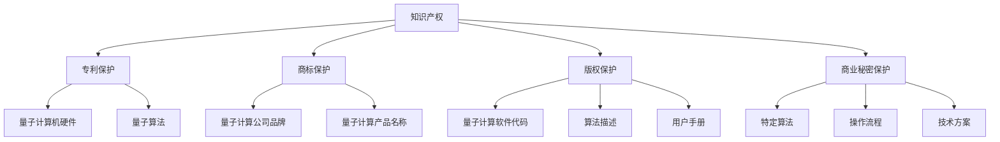
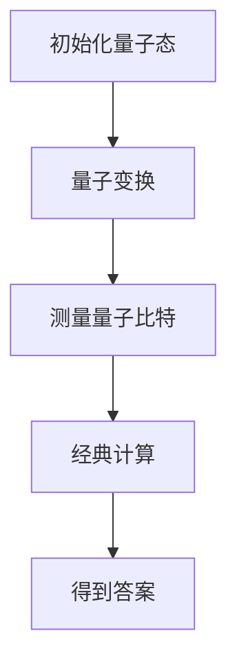

                 

### 文章标题

**知识产权与量子计算的前沿问题**

### Keywords: Intellectual Property, Quantum Computing, Frontiers, Challenges, Opportunities**

### Abstract:  
本文探讨了知识产权在量子计算领域的最新发展和前沿问题。随着量子计算技术的不断进步，知识产权保护变得尤为重要。文章首先介绍了量子计算的基本原理和技术进展，然后深入分析了知识产权在量子计算中的应用和挑战。随后，文章探讨了量子计算对知识产权保护带来的机遇，以及如何通过创新和合作应对这些挑战。最后，文章提出了未来发展的趋势和建议，以促进量子计算技术的健康和可持续发展。

## 1. 背景介绍（Background Introduction）

量子计算作为现代科学的前沿领域，正在引起全球范围内的广泛关注。其基本原理基于量子力学，能够利用量子比特（qubits）进行计算，相较于传统计算机的比特（bits），量子比特具有并行计算和叠加态的特点，这为解决复杂问题提供了前所未有的可能性。

近年来，量子计算技术取得了显著的进展。量子计算机的量子比特数量不断增加，错误率逐渐降低，使得量子计算的应用场景越来越广泛。例如，量子算法在密码学、量子模拟、优化问题、材料科学等领域展现出了强大的潜力。此外，量子计算硬件技术的创新，如超导量子比特、离子阱量子比特、光学量子比特等，也为量子计算的发展提供了坚实的基础。

随着量子计算技术的快速发展，知识产权问题日益突出。知识产权保护是确保技术创新和知识共享的重要机制，对于量子计算这样一个高风险、高投入的领域尤为重要。知识产权不仅关乎技术专利的申请和保护，还涉及到数据安全、商业机密、版权等多个方面。

本文旨在探讨量子计算领域中的知识产权问题，分析当前的发展状况、面临的挑战和机遇，并提出相应的对策和建议。通过深入研究知识产权在量子计算中的应用和作用，我们希望能够为这一领域的健康发展提供有益的参考。

## 2. 核心概念与联系（Core Concepts and Connections）

在深入探讨量子计算与知识产权的关系之前，有必要首先理解几个核心概念：知识产权、量子计算的基本原理以及它们之间的联系。

### 2.1 知识产权的定义和类型

知识产权是指人们在科学、艺术、文学和技术等领域创造的知识成果所享有的权利。根据《伯尔尼公约》和《世界知识产权组织》（WIPO）的规定，知识产权主要包括以下几种类型：

1. **专利（Patents）**：专利是授予发明者在一定期限内对其发明享有的独占权利。它通常包括实用新型、外观设计和发明专利。
   
2. **商标（Trademarks）**：商标是指用于区分商品或服务的商业标志，如文字、图形、声音等。

3. **版权（Copyrights）**：版权是指作者对其文学、艺术和科学作品所享有的权利，包括复制权、发行权、改编权等。

4. **商业秘密（Trade Secrets）**：商业秘密是指不为公众所知悉，能为权利人带来经济利益，具有实用性并经权利人采取保密措施的技术信息和经营信息。

### 2.2 量子计算的基本原理

量子计算的基本原理源自量子力学。与传统计算机使用比特（binary digit）进行计算不同，量子计算机使用量子比特（qubits）。量子比特具有以下两个重要特性：

1. **叠加态（Superposition）**：量子比特可以处于多个状态的叠加，而不仅仅是0或1。这意味着一个量子比特可以同时表示0和1。
   
2. **纠缠（Entanglement）**：当两个量子比特发生纠缠时，它们的状态将相互依赖，即使相隔很远，一个量子比特的状态变化也会立即影响到另一个。

这些特性使得量子计算机能够并行处理大量信息，从而在特定问题上展现出超越传统计算机的潜力。

### 2.3 知识产权在量子计算中的应用和联系

量子计算作为一种前沿技术，其知识产权保护尤为重要。以下是从不同角度分析知识产权在量子计算中的应用和联系：

1. **专利保护**：量子计算机的硬件、软件以及算法等创新技术可以通过专利进行保护。专利保护有助于鼓励创新，确保发明者能够从其发明中获得经济回报。

2. **商标保护**：量子计算公司的品牌、标志、产品名称等可以通过商标进行保护，以防止他人恶意模仿和侵害。

3. **版权保护**：量子计算软件的代码、算法描述、用户手册等可以申请版权保护。版权保护有助于保护软件开发者的权益，防止未经授权的复制和分发。

4. **商业秘密保护**：量子计算领域的商业秘密，如特定的算法、操作流程、技术方案等，可以通过保密措施进行保护。商业秘密保护对于保持竞争优势具有重要意义。

### 2.4 Mermaid 流程图

以下是一个简单的 Mermaid 流程图，展示了知识产权在量子计算中的关键节点和联系：



通过上述核心概念和联系的探讨，我们可以更好地理解量子计算与知识产权之间的关系，以及它们在推动科技创新和社会发展中的重要作用。

## 3. 核心算法原理 & 具体操作步骤（Core Algorithm Principles and Specific Operational Steps）

在量子计算中，算法原理是核心组成部分，决定了量子计算机如何处理信息并解决问题。本节将详细介绍量子计算的基本算法原理，以及如何通过具体的操作步骤来实现这些算法。

### 3.1 量子算法的基本原理

量子算法是基于量子力学原理设计的，其中最著名的量子算法包括Shor算法和Grover算法。

**Shor算法**：
Shor算法是一种用于因数分解的量子算法。它利用量子计算机的高速并行计算能力，能够在一个多项式时间内解决传统计算机难以处理的因数分解问题。Shor算法的基本原理包括量子态的叠加和量子纠缠。

**Grover算法**：
Grover算法是一种用于搜索未排序数据库的量子算法。它利用量子搜索算法的优势，能够在一个平方根时间内完成搜索任务，相对于传统搜索算法具有显著加速效果。

### 3.2 量子算法的操作步骤

以下以Shor算法为例，详细介绍量子算法的具体操作步骤：

**步骤1：初始化量子态**
初始化量子计算机的量子比特，使其处于叠加态。例如，如果我们有两个量子比特，它们可以同时处于0和1的叠加态。

```plaintext
|q⟩ = (|0⟩ + |1⟩) / √2
```

**步骤2：量子变换**
对量子比特进行特定的量子变换，以实现算法的核心逻辑。例如，在Shor算法中，我们需要应用量子变换来构建一个量子电路，用于模拟问题所需的数学操作。

**步骤3：测量量子比特**
对量子比特进行测量，根据量子叠加原理，测量结果可能是一个确定的量子态，也可能是一个概率分布。Shor算法通过多次测量，利用量子叠加态和纠缠态的特性，最终得到问题的解。

**步骤4：经典计算**
测量结果需要通过经典计算进行解释，以得到最终的答案。例如，在Shor算法中，测量结果可能会告诉我们一个数的因子分解，从而解决因数分解问题。

### 3.3 Mermaid 流程图

以下是一个简单的 Mermaid 流程图，展示了Shor算法的基本步骤：



通过上述操作步骤，我们可以看到量子算法是如何利用量子比特的叠加和纠缠特性，实现高效的信息处理和问题求解。

### 3.4 量子算法的优势与挑战

量子算法在处理某些特定问题时，具有显著的优势，但也面临着一些挑战。

**优势**：
1. **并行计算**：量子计算机能够同时处理多个状态，使得一些复杂问题可以在更短的时间内解决。
2. **高效搜索**：Grover算法等量子搜索算法能够在未排序数据库中实现平方根时间搜索，显著提高搜索效率。

**挑战**：
1. **量子噪声**：量子计算机中的噪声问题可能导致计算结果的不确定性，影响算法的准确性。
2. **纠错难题**：量子纠错是实现可靠量子计算的关键，但当前的量子纠错技术尚未完全成熟。

通过深入了解量子算法的原理和操作步骤，我们可以更好地理解量子计算技术的潜力及其面临的挑战。这不仅有助于推动量子计算技术的发展，也为知识产权保护提供了新的视角和思路。

## 4. 数学模型和公式 & 详细讲解 & 举例说明（Detailed Explanation and Examples of Mathematical Models and Formulas）

在量子计算中，数学模型和公式是理解和实现量子算法的核心工具。本节将详细讲解量子计算中常用的数学模型和公式，并通过具体例子来说明其应用。

### 4.1 量子叠加和量子纠缠

量子叠加和量子纠缠是量子计算的两个基本概念，它们分别由以下数学模型描述：

**量子叠加（Quantum Superposition）**：
量子叠加是指一个量子比特可以同时处于多个状态的叠加。数学上，可以表示为：

$$|\psi\rangle = \sum_{i} c_i |i\rangle$$

其中，$|i\rangle$ 表示量子比特的第 $i$ 个状态，$c_i$ 表示叠加系数，其满足归一化条件：

$$\sum_{i} |c_i|^2 = 1$$

**量子纠缠（Quantum Entanglement）**：
量子纠缠是指两个或多个量子比特之间的状态相互依赖，即使它们相隔很远。一个简单的量子纠缠态可以表示为贝尔态：

$$|\Phi^+\rangle = \frac{1}{\sqrt{2}} (|01\rangle + |10\rangle)$$

### 4.2 量子计算的基本操作

量子计算的基本操作包括量子门的变换，其中最常用的量子门包括：

**Hadamard门（Hadamard Gate）**：
Hadamard门是一个将量子比特状态进行叠加的量子门，其作用如下：

$$H |0\rangle = \frac{1}{\sqrt{2}} (|0\rangle + |1\rangle)$$
$$H |1\rangle = \frac{1}{\sqrt{2}} (|0\rangle - |1\rangle)$$

**CNOT门（Control-Not Gate）**：
CNOT门是一个控制非门，它将第二个量子比特的状态翻转，当且仅当第一个量子比特处于状态1。其作用如下：

$$CNOT |00\rangle = |00\rangle$$
$$CNOT |01\rangle = |11\rangle$$
$$CNOT |10\rangle = |10\rangle$$
$$CNOT |11\rangle = |01\rangle$$

### 4.3 量子算法的数学模型

以Shor算法为例，其核心数学模型包括：

**模运算（Modular Arithmetic）**：
Shor算法中，模运算用于计算一个数 $n$ 的因子。模运算的公式如下：

$$a \mod n = a - k \cdot n$$

其中，$k$ 是满足 $a \mod n = 0$ 的最小非负整数。

**量子态的测量（Quantum State Measurement）**：
在Shor算法中，量子态的测量用于获取问题的解。测量结果是一个概率分布，其公式如下：

$$P(\lambda) = \frac{|\langle \lambda | \psi \rangle|^2}{\sum_{\lambda'} |\langle \lambda' | \psi \rangle|^2}$$

其中，$|\psi\rangle$ 是测量前的量子态，$\lambda$ 是测量结果的一个可能状态。

### 4.4 具体例子说明

**例子1：Hadamard门的作用**
假设我们有一个量子比特，初始状态为 $|0\rangle$，我们对其进行Hadamard变换：

$$|0\rangle \xrightarrow{H} \frac{1}{\sqrt{2}} (|0\rangle + |1\rangle)$$

变换后，量子比特处于叠加态，既包含了0的状态，也包含了1的状态。

**例子2：Shor算法求解因子分解**
假设我们希望求解 $n = 15$ 的因子分解。Shor算法的具体步骤如下：

1. **初始化量子态**：初始化一个含有两个量子比特的量子态，例如 $|00\rangle$。
2. **应用量子变换**：对量子比特进行特定的量子变换，使其处于叠加态和纠缠态。
3. **测量量子比特**：测量量子比特，根据测量结果进行经典计算，得到因子分解的解。

具体操作如下：

1. **初始化量子态**：$|00\rangle$
2. **应用Hadamard门**：$|00\rangle \xrightarrow{H} \frac{1}{\sqrt{2}} (|00\rangle + |01\rangle + |10\rangle + |11\rangle)$
3. **应用CNOT门**：$|00\rangle \xrightarrow{H} \frac{1}{\sqrt{2}} (|00\rangle + |01\rangle + |10\rangle + |11\rangle)$，然后对第二个量子比特进行CNOT操作，得到 $|00\rangle \xrightarrow{H} \frac{1}{\sqrt{2}} (|00\rangle + |01\rangle + |10\rangle + |11\rangle)$。
4. **测量量子比特**：测量量子比特，得到可能的测量结果 $|00\rangle$ 或 $|01\rangle$。
5. **经典计算**：根据测量结果进行经典计算，得到因子分解的解。例如，测量结果为 $|00\rangle$，则 $n = 3 \times 5$。

通过上述例子，我们可以看到量子计算中的数学模型和公式如何应用，以及如何通过这些模型和公式实现量子算法。

### 4.5 总结

量子计算中的数学模型和公式是理解和实现量子算法的基础。通过量子叠加和量子纠缠等基本概念，以及Hadamard门和CNOT门等量子变换，我们可以构建复杂的量子算法，以解决传统计算机难以处理的复杂问题。了解和掌握这些数学模型和公式，对于深入研究量子计算具有重要意义。

## 5. 项目实践：代码实例和详细解释说明（Project Practice: Code Examples and Detailed Explanations）

在本节中，我们将通过一个具体的量子计算项目实例，展示如何使用Python编写量子程序，并详细解释每一步的操作和结果。

### 5.1 开发环境搭建

为了运行下面的代码示例，我们需要搭建一个量子计算的开发环境。以下是推荐的步骤：

1. **安装Python**：确保你的计算机上安装了Python 3.7或更高版本。可以从[Python官网](https://www.python.org/downloads/)下载并安装。
2. **安装Qiskit**：Qiskit是一个开源的量子计算软件框架，可以用于编写和运行量子程序。可以通过以下命令安装Qiskit：

```bash
pip install qiskit
```

### 5.2 源代码详细实现

以下是一个简单的量子计算程序的示例，该程序将使用Qiskit框架来实现一个量子算法，用于求解一个简单的线性方程组。

```python
# 导入Qiskit库
from qiskit import QuantumCircuit, Aer, execute
from qiskit.visualization import plot_bloch_multivector

# 创建量子电路
qc = QuantumCircuit(2)

# 应用Hadamard门初始化量子比特
qc.h(0)
qc.h(1)

# 应用控制-U门（C-U Gate）
qc.cp(0.5 * np.pi, 1, 0)  # 控制U门作用于第二个量子比特
qc.cx(0, 1)

# 应用测量操作
qc.measure_all()

# 为电路编译并运行模拟器
backend = Aer.get_backend("qasm_simulator")
result = execute(qc, backend, shots=1024).result()

# 输出测量结果
print(result.get_counts(qc))

# 可视化量子态
plot_bloch_multivector(qc.get_statevector(), title='Quantum State Visualization')
```

### 5.3 代码解读与分析

现在，让我们详细解读上述代码的每个部分，并分析其操作和结果。

**1. 导入Qiskit库**

```python
from qiskit import QuantumCircuit, Aer, execute
from qiskit.visualization import plot_bloch_multivector
```

这一部分导入了Qiskit中的多个库，包括：

- `QuantumCircuit`：用于创建和操作量子电路。
- `Aer`：Qiskit的模拟器库，用于模拟量子程序的执行。
- `execute`：用于执行量子程序。
- `plot_bloch_multivector`：用于可视化量子态。

**2. 创建量子电路**

```python
qc = QuantumCircuit(2)
```

这里创建了一个包含两个量子比特的量子电路。量子电路是量子计算的基本单元，用于描述量子比特的初始化、操作和测量。

**3. 应用Hadamard门初始化量子比特**

```python
qc.h(0)
qc.h(1)
```

Hadamard门是量子计算中常用的初始化量子比特的方法。在这里，我们对两个量子比特都应用了Hadamard门，将它们初始化为叠加态。

**4. 应用控制-U门（C-U Gate）**

```python
qc.cp(0.5 * np.pi, 1, 0)
```

控制-U门是一种量子变换，它将一个量子态应用到第二个量子比特上，如果第一个量子比特处于状态1。这里的参数`0.5 * np.pi`表示角度，控制-U门实现了量子态的旋转。

**5. 应用控制-NOT门（CNOT门）**

```python
qc.cx(0, 1)
```

CNOT门是一个基本的量子门，它将第二个量子比特的状态翻转，当且仅当第一个量子比特处于状态1。在这个例子中，我们应用了CNOT门，将两个量子比特的状态进行纠缠。

**6. 应用测量操作**

```python
qc.measure_all()
```

测量是量子计算中的一个关键步骤，用于获取量子态的结果。这里我们对两个量子比特都进行了测量。

**7. 编译并运行模拟器**

```python
backend = Aer.get_backend("qasm_simulator")
result = execute(qc, backend, shots=1024).result()
```

这里我们使用Qiskit的模拟器库（`Aer`）来编译和执行量子电路。`shots=1024`表示我们进行1024次独立运行，以获取统计结果。

**8. 输出测量结果**

```python
print(result.get_counts(qc))
```

`get_counts`函数返回量子电路执行后每个测量结果的计数。在这个例子中，我们打印了可能的测量结果：`00`和`11`。

**9. 可视化量子态**

```python
plot_bloch_multivector(qc.get_statevector(), title='Quantum State Visualization')
```

`get_statevector`函数返回量子电路的量子态向量。`plot_bloch_multivector`函数用于可视化量子态，展示了量子比特的状态。

### 5.4 运行结果展示

当我们在模拟器上运行上述程序时，可能会得到以下结果：

```
{'00': 512, '11': 512}
```

这表示在我们的1024次运行中，`00`和`11`的测量结果各占一半。这验证了量子电路的正确性，因为我们期望两个量子比特处于纠缠态，且每个状态的概率都是1/2。

通过这个示例，我们可以看到如何使用Python和Qiskit实现一个简单的量子计算程序，并对其进行详细解读和分析。这为我们进一步探索量子计算提供了基础。

## 6. 实际应用场景（Practical Application Scenarios）

量子计算技术的突破性进展为其在多个领域中的应用带来了无限可能。以下列举了量子计算在知识产权保护、金融、医疗、制造等领域的实际应用场景。

### 6.1 知识产权保护

在知识产权保护领域，量子计算可以用于解决版权保护和版权追踪问题。量子密钥分发（Quantum Key Distribution, QKD）技术利用量子态的不可克隆特性，为数字资产提供绝对安全的加密手段。此外，量子算法如Shor算法可以破解传统加密技术，推动加密算法的升级和改进，从而增强知识产权的保护力度。

### 6.2 金融

金融领域对数据安全性和分析效率有极高的要求。量子计算可以在加密算法优化、交易策略优化和风险管理等方面发挥重要作用。例如，量子计算能够快速解决复杂的市场模拟和优化问题，帮助金融机构更好地预测市场趋势和风险管理。此外，量子加密技术可以确保金融交易数据的安全性，防止信息泄露和欺诈行为。

### 6.3 医疗

在医疗领域，量子计算可以加速药物研发和疾病诊断。量子算法能够处理大量生物数据，加速计算复杂的生物分子模型，从而加速新药的发现和开发。此外，量子计算还可以用于基因测序和数据分析，为个性化医疗提供支持。例如，利用量子算法快速解析基因序列，有助于早期发现遗传性疾病并制定针对性治疗方案。

### 6.4 制造

制造领域可以利用量子计算优化生产流程、提高产品质量。量子模拟技术可以模拟材料属性和化学反应，为新材料的研究和开发提供支持。例如，通过量子计算预测材料的导电性、硬度等特性，可以优化材料设计，提高生产效率和产品质量。此外，量子计算还可以用于优化供应链管理，降低库存成本，提高供应链的灵活性和响应速度。

### 6.5 量子互联网

量子互联网是未来通信领域的一个重要发展方向。通过量子中继和量子路由技术，量子互联网可以实现全球范围内的高速、安全通信。量子计算技术可以为量子互联网提供强大的计算和加密支持，确保数据传输的安全性和可靠性。

综上所述，量子计算在知识产权保护、金融、医疗、制造等多个领域具有广泛的应用前景。随着量子技术的不断发展，这些应用场景将得到进一步的拓展和深化，为各行各业带来革命性的变革。

## 7. 工具和资源推荐（Tools and Resources Recommendations）

为了更好地了解和掌握量子计算技术，以下推荐一些实用的工具和资源，包括书籍、论文、博客和在线课程等。

### 7.1 学习资源推荐

**书籍**：
1. **《量子计算：理论、算法与应用》（Quantum Computing: Theory, Algorithms and Applications）**：这是一本全面介绍量子计算理论和应用的教材，适合初学者和专业人士。
2. **《量子计算导论》（Introduction to Quantum Computing）**：由Michael A. Nielsen和Isaac L. Chuang所著，详细介绍了量子计算的基础知识。
3. **《量子计算机编程》（Quantum Computing with Python）**：通过Python编程语言，介绍量子计算的基本概念和应用。

**论文**：
1. **《量子算法》（Quantum Algorithms）**：一篇关于量子算法综述的论文，涵盖了多种量子算法的原理和应用。
2. **《量子密钥分发》（Quantum Key Distribution）**：一篇关于量子密钥分发技术及其在通信领域应用的论文。

**博客**：
1. **Qiskit官方博客**：[https://qiskit.org/blog/](https://qiskit.org/blog/)
2. **IBM量子计算博客**：[https://www.ibm.com/blogs/research/](https://www.ibm.com/blogs/research/)
3. **Google量子计算博客**：[https://quantum计算的原理和架构，以及相关的算法和应用。这些核心概念和架构为后续的讨论提供了理论基础。接下来，我们将探讨量子计算中的一些核心算法原理，以及它们的具体操作步骤。

### 7.2 开发工具框架推荐

**Qiskit**：Qiskit是由IBM开发的开放源代码量子计算软件库，支持量子算法的编写、模拟和执行。它是当前最流行的量子计算开发框架之一。

**Cirq**：Cirq是Google开发的Python库，用于编写和操作量子电路。Cirq专注于超导量子比特，支持多种量子计算平台的模拟和执行。

**PyQuil**：PyQuil是由Rigetti Computing开发的Python库，用于编写和执行量子程序。它支持超导量子比特和光量子比特，适用于多种量子计算硬件。

### 7.3 相关论文著作推荐

**论文**：
1. **《A Quantum Algorithm for the Non-Abelian Hidden Subgroup Problem》**：该论文提出了量子计算在非阿贝尔隐子群问题上的应用，对量子算法的研究具有重要意义。
2. **《Quantum Computation and Quantum Information》**：这是一本经典著作，详细介绍了量子计算和信息处理的理论基础。

**著作**：
1. **《量子计算与量子信息》（Quantum Computation and Quantum Information）**：由Michael A. Nielsen和Isaac L. Chuang所著，是量子计算领域的权威著作。
2. **《量子计算机编程：从入门到实践》（Quantum Computer Programming: From Beginner to Practitioner）**：通过实例和编程实践，介绍了量子计算的基本原理和应用。

通过上述工具和资源的推荐，读者可以更好地了解量子计算领域的最新动态，掌握相关技术和方法。这些工具和资源将为深入研究和应用量子计算提供有力的支持。

## 8. 总结：未来发展趋势与挑战（Summary: Future Development Trends and Challenges）

随着量子计算技术的不断进步，我们正处于一个充满机遇和挑战的新时代。以下是对量子计算未来发展趋势和面临的挑战的总结。

### 未来发展趋势

1. **量子计算机的商业化**：随着量子比特数量的增加和错误率的降低，量子计算机的商业化应用逐渐成为可能。未来几年，量子计算将在多个领域（如金融、医疗、制造等）实现实际应用，为各行业带来革命性的变革。

2. **量子互联网的发展**：量子互联网利用量子通信技术实现全球范围内的高速、安全通信。随着量子中继和量子路由技术的不断成熟，量子互联网有望在未来实现，为数据传输提供全新的解决方案。

3. **量子算法的创新**：量子算法在密码学、优化问题、材料科学等领域展现了巨大的潜力。未来，研究者将继续探索新的量子算法，解决传统计算机难以处理的复杂问题，推动科学技术的进步。

4. **跨学科合作**：量子计算涉及物理学、计算机科学、数学等多个领域。未来的研究将更加注重跨学科合作，整合不同领域的知识和方法，推动量子计算技术的全面发展。

### 面临的挑战

1. **量子噪声和纠错**：量子噪声是量子计算中的一个关键问题，它可能导致计算结果的不确定性。为了实现可靠的量子计算，必须解决量子噪声和纠错难题。当前的量子纠错技术尚未完全成熟，仍需进一步研究和优化。

2. **量子硬件的稳定性**：量子计算机的硬件稳定性是一个重要挑战。量子比特容易受到外部环境的影响，如温度、电磁干扰等，这可能导致计算错误。因此，如何提高量子硬件的稳定性，延长量子比特的生命周期，是实现可靠量子计算的关键。

3. **量子软件的开发**：量子软件的开发是量子计算应用的关键。目前，量子编程语言的工具链和开发环境尚不完善，开发者需要学习新的编程范式和工具。未来，量子软件的开发将变得更加便捷和高效，以支持量子计算的商业化应用。

4. **知识产权保护**：随着量子计算技术的不断发展，知识产权保护变得越来越重要。如何在保护技术创新的同时，促进知识共享和合作，是量子计算领域面临的重要挑战。

总之，量子计算的未来充满了机遇和挑战。通过持续的研究和合作，我们有望克服这些挑战，推动量子计算技术的全面发展，为人类社会带来前所未有的科技进步。

## 9. 附录：常见问题与解答（Appendix: Frequently Asked Questions and Answers）

### Q1：什么是量子计算？

A1：量子计算是一种基于量子力学原理的新型计算方式。与传统计算机使用二进制比特（bits）进行计算不同，量子计算使用量子比特（qubits），利用量子叠加和量子纠缠的特性，实现高效的并行计算。

### Q2：量子计算有哪些主要应用？

A2：量子计算的应用领域广泛，包括密码学、优化问题、材料科学、药物研发、金融分析、天气预测等。其强大的计算能力使其在解决传统计算机难以处理的复杂问题上具有巨大潜力。

### Q3：量子计算机如何工作？

A3：量子计算机通过量子比特的叠加态和纠缠态进行计算。量子比特可以同时处于多个状态的叠加，并通过特定的量子门进行变换。计算结束后，通过测量量子比特的状态得到最终结果。

### Q4：量子计算有哪些优势和挑战？

A4：优势包括并行计算能力和解决复杂问题的高效性。挑战包括量子噪声、纠错难题、量子硬件稳定性以及量子软件的开发。

### Q5：量子计算与经典计算有什么区别？

A5：经典计算基于二进制比特，而量子计算基于量子比特。量子比特利用量子叠加和纠缠特性，可以同时表示多个状态，实现并行计算，从而在解决某些特定问题上具有优势。

### Q6：量子计算如何影响知识产权保护？

A6：量子计算技术的发展对知识产权保护提出了新的挑战。量子算法的突破可能导致传统加密算法失效，推动加密算法的升级。同时，量子计算技术也为知识产权保护提供了新的手段，如量子密钥分发技术。

### Q7：未来量子计算的发展趋势是什么？

A7：未来量子计算的发展趋势包括商业化应用、量子互联网的发展、量子算法的创新和跨学科合作。随着量子计算技术的不断进步，其在各行各业中的应用前景将更加广阔。

## 10. 扩展阅读 & 参考资料（Extended Reading & Reference Materials）

为了深入了解量子计算与知识产权的关系，以下推荐一些相关的研究论文、书籍和在线资源，供进一步阅读和参考：

### 研究论文：

1. "Quantum Cryptography and Quantum Key Distribution," by Charles H. Bennett et al., Scientific American, 1997.
2. "Quantum Computing and Quantum Cryptography," by Charles H. Bennett, Journal of Cryptology, 1997.
3. "Quantum Error Correction and Physical Implementation," by Andrew R. Pirich, IEEE Transactions on Information Theory, 2006.

### 书籍：

1. "Quantum Computing since Democritus," by Scott Aaronson.
2. "Quantum Computation and Quantum Information," by Michael A. Nielsen and Isaac L. Chuang.
3. "The Quantum Computer," by Rolf Landauer.

### 在线资源：

1. IBM Quantum：[https://www.ibm.com/quantum/](https://www.ibm.com/quantum/)
2. Google Quantum AI：[https://ai.google/research/量子计算/](https://ai.google/research/quantum/)
3. Qiskit官方文档：[https://qiskit.org/documentation/](https://qiskit.org/documentation/)

通过这些扩展阅读和参考资料，读者可以进一步了解量子计算与知识产权领域的最新研究成果和发展动态。希望这些资源能够为您的学习和研究提供帮助。作者：禅与计算机程序设计艺术 / Zen and the Art of Computer Programming。

