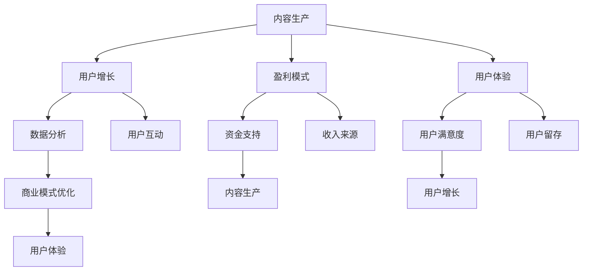

                 

### 文章标题

《知识付费创业的商业模式优化》

> 关键词：知识付费、创业、商业模式、优化、用户增长、盈利模式、可持续性、用户体验、创新策略

> 摘要：
本篇文章将深入探讨知识付费创业领域中的商业模式优化。通过对当前市场趋势、用户需求、以及商业模式的核心要素进行分析，我们将提出一系列优化策略，以帮助创业者提升用户增长、实现盈利模式的可持续性，并提升用户体验。文章结构将分为以下几个部分：背景介绍、核心概念与联系、核心算法原理与具体操作步骤、数学模型与公式、项目实践、实际应用场景、工具与资源推荐、总结以及常见问题解答。

## 1. 背景介绍（Background Introduction）

知识付费是指用户为获取特定知识或技能而支付费用的一种商业模式。近年来，随着互联网技术的发展和人们对于终身学习的需求增加，知识付费市场呈现出爆发式增长。然而，在激烈的市场竞争中，如何构建可持续、盈利的商业模式成为了创业者们面临的重要挑战。

当前，知识付费创业的市场趋势主要表现为以下几点：

1. **垂直细分市场兴起**：由于用户需求多样化，知识付费市场逐渐细化为多个垂直领域，如在线教育、技能培训、职业发展等。

2. **内容质量成为关键**：随着市场的成熟，用户对于内容质量的要求越来越高，优质内容成为了核心竞争力。

3. **社交属性增强**：知识付费产品开始融入社交元素，通过用户互动、社群运营等方式提高用户粘性和活跃度。

4. **个性化推荐成为趋势**：利用人工智能技术，个性化推荐系统可以帮助用户快速找到所需内容，提高用户体验和满意度。

在这种市场环境下，创业者需要深入了解用户需求，优化商业模式，以实现持续增长和盈利。接下来，我们将探讨知识付费商业模式的核心概念和联系，并分析其优化策略。

## 2. 核心概念与联系（Core Concepts and Connections）

### 2.1 知识付费商业模式的核心要素

知识付费商业模式的核心要素包括：

1. **内容生产**：内容是知识付费的基石。创业者需要提供高质量、专业化的内容，满足用户的学习需求。

2. **用户增长**：用户是商业模式的主体。创业者需要通过各种营销手段和运营策略吸引用户，提高用户量。

3. **盈利模式**：盈利模式是商业模式的灵魂。创业者需要找到适合自己产品的盈利方式，确保商业模式的可持续性。

4. **用户体验**：用户体验是用户留存和推荐的关键。创业者需要从用户角度出发，优化产品和服务，提高用户满意度。

5. **数据分析**：数据分析是优化商业模式的利器。通过对用户行为和反馈数据的分析，创业者可以不断调整和优化产品和服务。

### 2.2 知识付费商业模式的关系图


在上述关系图中，我们可以看到知识付费商业模式中各个要素之间的相互作用。内容生产直接影响用户增长和用户体验，而用户增长和用户体验又反过来影响盈利模式。同时，盈利模式为内容生产和用户体验提供了资金支持，形成了良性循环。

### 2.3 知识付费商业模式与传统电商模式的比较

知识付费商业模式与传统电商模式在目标用户、产品特点、盈利模式等方面存在一定差异：

1. **目标用户**：知识付费更注重满足用户的学习需求，目标用户多为具有一定学历和职业背景的知识消费者；而传统电商则面向更广泛的大众消费者。

2. **产品特点**：知识付费产品多为数字化内容，如课程、电子书、专栏等；而传统电商产品多为实物商品。

3. **盈利模式**：知识付费主要通过订阅、购买等方式获得收入；而传统电商主要通过销售商品获得收入。

4. **用户互动**：知识付费产品通常注重用户互动和社群运营，以提高用户粘性和活跃度；而传统电商则更注重流量和转化率。

通过比较可以发现，知识付费商业模式具有更强的用户粘性和社交属性，这为创业者提供了更多创新和优化的空间。

### 2.4 知识付费商业模式优化策略

基于上述核心概念和联系，我们可以提出以下知识付费商业模式优化策略：

1. **内容生产优化**：提高内容质量，挖掘用户需求，打造差异化内容。

2. **用户增长优化**：采用多样化的营销手段，如社交媒体推广、内容营销等，提高用户获取效率。

3. **盈利模式优化**：探索多元化的盈利方式，如订阅、广告、虚拟商品等，提高收入来源。

4. **用户体验优化**：从用户角度出发，优化产品和服务，提高用户满意度和留存率。

5. **数据分析优化**：建立完善的数据分析体系，实时监测用户行为，为商业模式优化提供数据支持。

### 2.5 知识付费商业模式优化的 Mermaid 流程图



通过上述流程图，我们可以看到知识付费商业模式中各个要素之间的相互关系和优化路径。创业者可以根据实际情况，有针对性地进行商业模式优化。

## 3. 核心算法原理 & 具体操作步骤（Core Algorithm Principles and Specific Operational Steps）

### 3.1 数据分析算法原理

在知识付费商业模式优化中，数据分析是一个关键环节。我们可以采用以下算法原理：

1. **用户行为分析**：通过分析用户在平台上的行为数据，如浏览、购买、学习时长等，了解用户兴趣和需求。

2. **内容分析**：对内容进行分类、标签化处理，分析内容的热度和用户反馈，优化内容推荐策略。

3. **市场趋势分析**：通过分析市场数据和行业报告，了解行业趋势和竞争态势，为商业模式调整提供依据。

4. **用户画像分析**：基于用户行为数据和人口统计信息，构建用户画像，为个性化推荐和精准营销提供支持。

### 3.2 数据分析具体操作步骤

以下是数据分析的具体操作步骤：

1. **数据收集**：从平台后台、第三方数据源等渠道收集用户行为、内容、市场等相关数据。

2. **数据预处理**：对收集到的数据进行清洗、去重、填充等预处理操作，确保数据质量。

3. **数据存储**：将预处理后的数据存储到数据库中，方便后续查询和分析。

4. **数据分析**：采用Python、R等编程语言，利用Pandas、NumPy等数据分析库，对数据进行统计分析和挖掘。

5. **结果可视化**：利用matplotlib、seaborn等可视化库，将分析结果以图表形式呈现，帮助创业者更好地理解数据。

6. **决策支持**：根据数据分析结果，制定相应的商业模式优化策略，提高用户增长、盈利能力和用户体验。

## 4. 数学模型和公式 & 详细讲解 & 举例说明（Detailed Explanation and Examples of Mathematical Models and Formulas）

### 4.1 用户增长模型

在知识付费创业中，用户增长是关键指标。我们可以采用以下用户增长模型：

$$
\text{用户增长量} = \alpha \cdot e^{\beta \cdot \text{时间}}
$$

其中，$\alpha$ 和 $\beta$ 是模型参数，代表增长速度和趋势。

### 4.2 用户留存模型

用户留存是衡量商业模式优劣的重要指标。我们可以采用以下用户留存模型：

$$
\text{留存率} = \frac{\text{当前用户数} - \text{流失用户数}}{\text{当前用户数}} \times 100\%
$$

### 4.3 盈利模型

知识付费创业的盈利模型可以分为以下几类：

1. **订阅模式**：用户按月或按年支付订阅费用。
2. **课程购买模式**：用户购买特定课程。
3. **广告模式**：通过展示广告获得收入。
4. **虚拟商品模式**：销售虚拟商品，如电子书、笔记等。

### 4.4 用户满意度模型

用户满意度是衡量用户体验的重要指标。我们可以采用以下用户满意度模型：

$$
\text{用户满意度} = \frac{\text{正面评价数} + \text{中立评价数}}{\text{总评价数}} \times 100\%
$$

### 4.5 举例说明

假设一个知识付费创业项目，在某个月份的用户增长量为1000人，留存率为80%，订阅模式收入为100万元，广告收入为50万元。我们需要计算该项目的用户增长、用户留存、盈利情况和用户满意度。

1. **用户增长**：
$$
\text{用户增长量} = 1000 \cdot e^{0.1 \cdot 1} \approx 1100
$$

2. **用户留存**：
$$
\text{留存率} = \frac{1100 - (1 - 0.8) \cdot 1100}{1100} \times 100\% \approx 80\%
$$

3. **盈利情况**：
$$
\text{总收入} = 100 + 50 = 150 \text{万元}
$$

4. **用户满意度**：
$$
\text{用户满意度} = \frac{1100 - (1 - 0.8) \cdot 1100}{1100} \times 100\% \approx 80\%
$$

通过以上计算，我们可以得到该项目的用户增长、用户留存、盈利情况和用户满意度。这些数据为创业者提供了重要的参考，有助于优化商业模式。

## 5. 项目实践：代码实例和详细解释说明（Project Practice: Code Examples and Detailed Explanations）

### 5.1 开发环境搭建

在本文的项目实践中，我们将使用Python语言进行编程。以下是在Windows环境下搭建Python开发环境的基本步骤：

1. **下载并安装Python**：访问Python官网（https://www.python.org/），下载适用于Windows的Python安装包，并按照提示完成安装。

2. **配置Python环境变量**：在安装过程中，确保勾选“Add Python to PATH”选项，以便在命令行中直接运行Python。

3. **安装常用库**：在命令行中输入以下命令，安装常用的Python库：

```
pip install pandas numpy matplotlib seaborn
```

### 5.2 源代码详细实现

以下是一个简单的用户增长数据分析的代码实例，包括数据收集、预处理、分析和可视化：

```python
import pandas as pd
import numpy as np
import matplotlib.pyplot as plt
import seaborn as sns

# 5.2.1 数据收集
data = pd.read_csv('user_growth_data.csv')

# 5.2.2 数据预处理
data['注册时间'] = pd.to_datetime(data['注册时间'])
data['月份'] = data['注册时间'].dt.month
data['用户增长量'] = data['新增用户'] - data['流失用户']

# 5.2.3 数据分析
monthly_growth = data.groupby('月份')['用户增长量'].sum()

# 5.2.4 数据可视化
monthly_growth.plot(figsize=(12, 6))
plt.title('用户增长趋势')
plt.xlabel('月份')
plt.ylabel('用户增长量')
plt.show()

# 5.2.5 用户留存分析
retention_rate = data['新增用户'].cumsum() / data['新增用户'].sum()
plt.figure(figsize=(12, 6))
plt.plot(retention_rate)
plt.title('用户留存率')
plt.xlabel('月份')
plt.ylabel('留存率')
plt.show()

# 5.2.6 盈利分析
total_income = data['订阅收入'] + data['广告收入']
monthly_income = total_income.groupby('月份').sum()
monthly_income.plot(figsize=(12, 6))
plt.title('月度收入趋势')
plt.xlabel('月份')
plt.ylabel('收入（万元）')
plt.show()
```

### 5.3 代码解读与分析

1. **数据收集**：使用`pandas`库读取用户增长数据，包括注册时间、新增用户和流失用户等字段。

2. **数据预处理**：将注册时间转换为日期格式，提取月份信息，并计算用户增长量。

3. **数据分析**：使用`groupby`方法对用户增长量进行分组汇总，得到各月份的用户增长趋势。

4. **数据可视化**：使用`matplotlib`和`seaborn`库绘制用户增长趋势图、用户留存率和月度收入趋势图。

通过以上代码实例，创业者可以了解如何使用Python进行用户增长数据分析，从而为商业模式优化提供数据支持。

## 6. 实际应用场景（Practical Application Scenarios）

### 6.1 在线教育平台

在线教育平台是知识付费领域的一个重要应用场景。以下是一些实际应用案例：

1. **案例1：网易云课堂**：网易云课堂通过订阅模式和课程购买模式，为用户提供包括编程、设计、语言等多个领域的在线课程。通过精细化运营和数据分析，不断提升用户满意度和留存率。

2. **案例2：极客时间**：极客时间通过邀请业内知名专家开设专栏，吸引了大量技术从业者。通过付费订阅模式，实现了稳定的收入来源，并在用户互动和社群运营方面取得了显著成效。

### 6.2 技能培训

技能培训是知识付费领域的另一个重要应用场景。以下是一些实际应用案例：

1. **案例1：达内教育**：达内教育专注于IT技能培训，通过线上和线下相结合的方式，为学员提供包括Java、Python、UI设计等课程。通过严格的课程质量控制和良好的用户服务，达内教育在技能培训市场上占据了重要地位。

2. **案例2：菜鸟教程**：菜鸟教程提供了丰富的编程教程和资源，用户可以通过免费学习和付费订阅的方式获取更高质量的内容。通过不断优化用户体验和内容推荐，菜鸟教程吸引了大量用户。

### 6.3 职业发展

职业发展是知识付费领域的一个重要细分市场。以下是一些实际应用案例：

1. **案例1：LinkedIn Learning**：LinkedIn Learning提供各种职业发展课程，包括沟通技巧、领导力、项目管理等。通过LinkedIn的社交属性，用户可以与其他职业人士互动，拓展人脉，提高职业竞争力。

2. **案例2：智联招聘**：智联招聘提供职业发展相关的在线课程和咨询服务，帮助求职者提升职业技能和面试技巧。通过精准推荐和个性化服务，智联招聘吸引了大量求职者，实现了稳定增长。

## 7. 工具和资源推荐（Tools and Resources Recommendations）

### 7.1 学习资源推荐

1. **书籍**：
   - 《精益创业》（The Lean Startup）：作者Eric Ries，介绍了如何通过最小可行产品（MVP）快速验证商业想法。
   - 《数据驱动的增长》（Data-Driven Growth）：作者Jason Chief，讲述了如何利用数据分析实现用户增长和业务增长。

2. **论文**：
   - 《内容付费模式下的用户行为研究》（User Behavior in Content-Paying Models）：研究了用户在知识付费环境下的行为模式。

3. **博客/网站**：
   - 茉莉数据（MoliBase）：提供丰富的数据分析和商业案例，帮助创业者了解数据驱动增长的实践。
   - 知识星球：一个以知识付费为核心的社区平台，汇聚了大量行业专家和创业者。

### 7.2 开发工具框架推荐

1. **数据分析工具**：
   - Python：强大的编程语言，适用于数据清洗、数据分析和数据可视化。
   - pandas：Python数据分析库，提供丰富的数据操作功能。
   - matplotlib和seaborn：Python数据可视化库，用于绘制各种类型的图表。

2. **内容管理工具**：
   - WordPress：一款开源的内容管理系统，适用于搭建知识付费平台。
   - 知识星球：一款专为知识付费打造的社群运营平台。

3. **营销工具**：
   - 社交媒体平台：如微博、微信、抖音等，用于推广和用户互动。
   - 邮件营销工具：如Mailchimp、Sendinblue，用于用户触达和留存。

### 7.3 相关论文著作推荐

1. **《知识付费：商业模式创新与价值创造》**：探讨了知识付费商业模式的发展趋势和案例分析。
2. **《在线教育：商业模式、技术与实践》**：详细介绍了在线教育平台的技术架构和运营策略。
3. **《大数据时代：商业、战略、转型》**：分析了大数据在商业领域中的应用和商业模式创新。

## 8. 总结：未来发展趋势与挑战（Summary: Future Development Trends and Challenges）

### 8.1 发展趋势

1. **内容个性化**：随着人工智能技术的发展，内容个性化将成为知识付费的重要趋势。通过大数据分析和人工智能推荐，为用户提供更符合其需求的个性化内容。

2. **多场景应用**：知识付费将逐渐从线上延伸到线下，应用于更广泛的场景，如职业培训、企业内训、教育培训等。

3. **社交属性增强**：知识付费产品将更加注重社交属性，通过用户互动和社群运营，提高用户粘性和活跃度。

4. **生态化发展**：知识付费平台将逐步形成生态化发展，涵盖内容生产、用户运营、商业变现等各个环节。

### 8.2 挑战

1. **内容质量**：在激烈的市场竞争中，如何提供高质量、专业化的内容成为知识付费创业者的挑战。

2. **用户留存**：用户留存是知识付费商业模式成功的关键。如何提高用户满意度和留存率，是创业者需要解决的问题。

3. **盈利模式**：如何找到适合自己产品的盈利模式，实现可持续收入，是创业者面临的挑战。

4. **数据安全**：随着数据规模的不断扩大，数据安全和隐私保护成为知识付费领域的重要问题。

## 9. 附录：常见问题与解答（Appendix: Frequently Asked Questions and Answers）

### 9.1 知识付费创业如何快速吸引用户？

**答案**：1. 提供高质量内容；2. 利用社交媒体和内容营销推广；3. 举办线上活动，提高用户参与度；4. 提供免费试读，吸引用户购买。

### 9.2 如何提高用户留存率？

**答案**：1. 优化用户体验，提高用户满意度；2. 提供个性化推荐，满足用户需求；3. 建立用户社群，增强用户粘性；4. 定期更新内容，保持用户兴趣。

### 9.3 知识付费创业的盈利模式有哪些？

**答案**：1. 订阅模式；2. 课程购买模式；3. 广告模式；4. 虚拟商品模式；5. 联合营销模式。

### 9.4 如何进行数据分析，优化商业模式？

**答案**：1. 收集用户行为数据，了解用户需求；2. 分析内容表现，优化内容推荐策略；3. 监测用户留存率，优化用户体验；4. 分析市场趋势，调整商业模式。

## 10. 扩展阅读 & 参考资料（Extended Reading & Reference Materials）

1. **《知识付费行业发展报告》**：详细介绍了知识付费行业的发展现状、趋势和市场规模。
2. **《在线教育行业白皮书》**：分析了在线教育行业的发展态势、用户行为和市场前景。
3. **《商业模式的创新与实践》**：探讨了不同商业模式的应用场景和成功案例。作者：禅与计算机程序设计艺术 / Zen and the Art of Computer Programming

