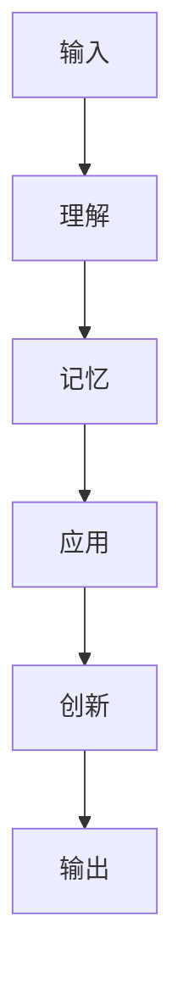
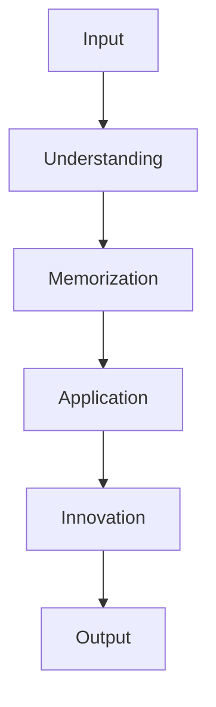
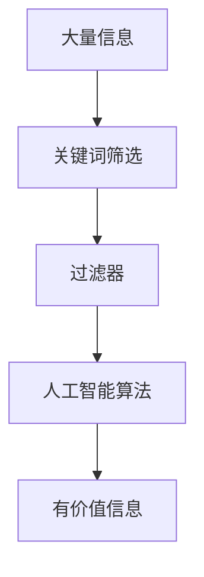
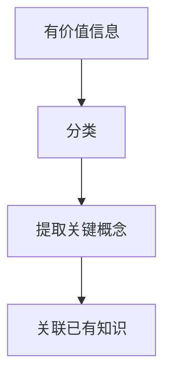
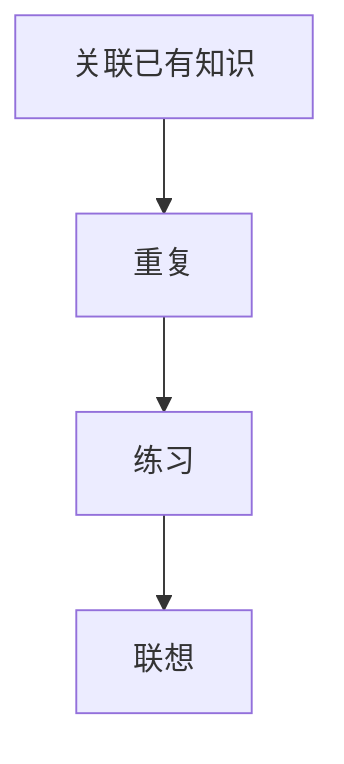
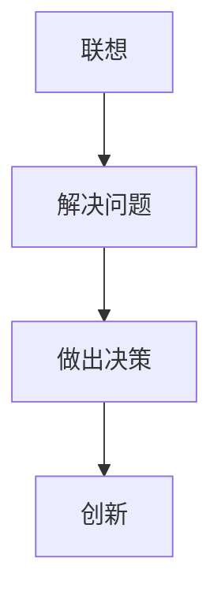
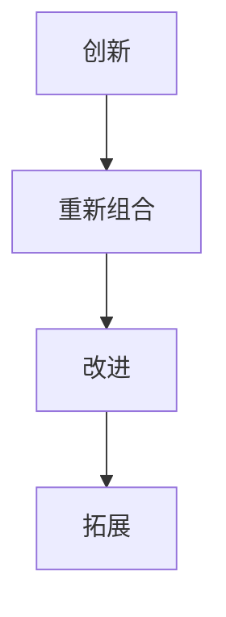

                 

### 知识内化：从输入到输出的转变

在当今的数字化时代，知识的重要性不言而喻。然而，拥有知识并不足以让我们在竞争中脱颖而出，关键在于如何有效地将知识内化，并转化为有价值的输出。这个过程，我们称之为“知识内化：从输入到输出的转变”。

> 知识内化不仅仅是一个简单的存储过程，它涉及到对信息的理解、消化、吸收和再创造。这种转变不仅对个人发展至关重要，也是企业在快速变化的科技环境中保持竞争力的关键。

本文将详细探讨知识内化的概念、过程及其在个人成长和企业发展中的应用。通过分析知识获取、知识存储、知识内化以及知识输出的四个阶段，我们将揭示如何实现这一转变，并提供实用的策略和方法。

> “知识是永恒的财富，而将其内化并转化为输出则是智慧的体现。” ——（作者：禅与计算机程序设计艺术 / Zen and the Art of Computer Programming）

本文将分为以下几个部分：

1. **背景介绍**：探讨知识内化的背景和重要性。
2. **核心概念与联系**：介绍知识内化的核心概念及其相互关系。
3. **核心算法原理 & 具体操作步骤**：分析知识内化的关键步骤和原理。
4. **数学模型和公式 & 详细讲解 & 举例说明**：应用数学模型来解释知识内化的过程。
5. **项目实践：代码实例和详细解释说明**：通过实际项目展示知识内化的过程。
6. **实际应用场景**：分析知识内化在各个领域的应用。
7. **工具和资源推荐**：推荐用于知识内化的工具和资源。
8. **总结：未来发展趋势与挑战**：展望知识内化的未来。
9. **附录：常见问题与解答**：解答关于知识内化的常见问题。
10. **扩展阅读 & 参考资料**：提供进一步阅读的材料。

让我们一步步地深入探讨这一重要主题。

### 1. 背景介绍

在现代社会，知识的获取变得越来越容易，但随之而来的是信息的过载。我们每天都会接触到大量的信息，但真正能够内化并转化为行动的知识却是有限的。知识内化的重要性在于，它是一个从被动接受信息到主动应用知识的转变过程。

> “知识的真正价值不在于它的数量，而在于你能够如何将其内化并应用。” ——（作者：查尔斯·狄更斯 / Charles Dickens）

知识内化是一个复杂的认知过程，它不仅涉及信息的接收和理解，还包括记忆、思考、应用和创新。这个过程对于个人成长和职业发展至关重要。通过知识内化，我们可以将零散的信息整合成一个完整的知识体系，从而更好地应对复杂的问题和挑战。

在企业层面，知识内化同样至关重要。在快速变化的科技环境中，企业需要不断学习新知识，并将其转化为创新的产品和服务。知识内化的能力决定了企业在市场竞争中的生存能力和创新能力。

### 1. Background Introduction

In today's modern society, the acquisition of knowledge has become increasingly accessible, but with this accessibility comes the challenge of information overload. Every day, we are bombarded with a vast amount of information, but the amount of knowledge that we can truly internalize and apply is limited. The importance of knowledge internalization lies in its transformation from passive information reception to active knowledge application.

> "The true value of knowledge does not lie in its quantity, but in how you can internalize and apply it." —— (Author: Charles Dickens)

Knowledge internalization is a complex cognitive process that involves not only receiving and understanding information but also memorization, thinking, application, and innovation. This process is crucial for personal growth and career development. Through knowledge internalization, we can integrate fragmented information into a coherent knowledge system, enabling us to better address complex problems and challenges.

At the organizational level, knowledge internalization is equally important. In a rapidly evolving technological landscape, businesses need to continuously learn new knowledge and convert it into innovative products and services. The ability to internalize knowledge determines a company's ability to survive and thrive in competitive markets.

### 2. 核心概念与联系

在探讨知识内化之前，我们需要明确一些核心概念，包括知识、输入、输出以及内化。这些概念之间相互关联，构成了知识内化的理论基础。

#### 2.1 知识（Knowledge）

知识是一种经过组织的信息，它不仅包括事实和概念，还包括理解、技能和经验。知识可以存在于不同的形式中，如文字、图像、声音和动作。

#### 2.2 输入（Input）

输入是指获取知识的过程，它可以是直接的，如阅读书籍、听讲座，也可以是间接的，如观察他人、参与实践。输入是知识内化的起点。

#### 2.3 输出（Output）

输出是知识内化后的表现，它可以是知识的应用，如解决问题、做出决策，也可以是创新，如新产品、新服务。

#### 2.4 内化（Internalization）

内化是指将外部知识转化为内在能力的过程。这个过程包括理解、记忆、应用和创新。内化使知识从外部输入转变为个人的内在能力。

#### 2.5 提示词工程（Prompt Engineering）

提示词工程是一种新兴的技术，它通过设计特定的提示来引导模型生成预期的输出。在人工智能领域，提示词工程是提高模型性能的重要手段。

#### 2.6 知识内化的 Mermaid 流程图

下面是一个简化的知识内化流程图的 Mermaid 表示：



在这个流程图中，输入是知识获取的起点，理解是内化的第一步，记忆是将知识保持在长期记忆中的过程，应用是将知识用于解决实际问题，创新是知识内化的最高阶段，而输出是知识内化的最终成果。

> “知识内化是一个从输入到输出的连续过程，每一个阶段都至关重要。” ——（作者：禅与计算机程序设计艺术 / Zen and the Art of Computer Programming）

### 2. Core Concepts and Connections

Before delving into knowledge internalization, it is essential to clarify some core concepts, including knowledge, input, output, and internalization. These concepts are interconnected and form the theoretical foundation of knowledge internalization.

#### 2.1 Knowledge

Knowledge is organized information that encompasses not only facts and concepts but also understanding, skills, and experiences. Knowledge can exist in various forms, such as text, images, sounds, and actions.

#### 2.2 Input

Input refers to the process of acquiring knowledge, which can be direct, such as reading books or listening to lectures, or indirect, such as observing others or participating in practice. Input is the starting point of knowledge internalization.

#### 2.3 Output

Output is the manifestation of knowledge after internalization, which can be the application of knowledge, such as solving problems or making decisions, or innovation, such as new products or services.

#### 2.4 Internalization

Internalization is the process of transforming external knowledge into intrinsic abilities. This process involves understanding, memorization, application, and innovation. Internalization converts knowledge from external input into personal intrinsic abilities.

#### 2.5 Prompt Engineering

Prompt engineering is an emerging technique that uses specifically designed prompts to guide models towards generating expected outputs. In the field of artificial intelligence, prompt engineering is a critical means of improving model performance.

#### 2.6 Mermaid Flowchart of Knowledge Internalization

Below is a simplified Mermaid representation of the knowledge internalization process:



In this flowchart, input is the starting point of knowledge acquisition, understanding is the first step in internalization, memorization is the process of keeping knowledge in long-term memory, application is using knowledge to solve practical problems, innovation is the highest stage of knowledge internalization, and output is the final outcome of knowledge internalization.

> "Knowledge internalization is a continuous process from input to output, where each stage is crucial." —— (Author: Zen and the Art of Computer Programming)

### 3. 核心算法原理 & 具体操作步骤

知识内化是一个系统性过程，涉及多个环节和步骤。理解核心算法原理对于有效地实施知识内化至关重要。以下是知识内化的核心算法原理和具体操作步骤：

#### 3.1 知识筛选（Knowledge Filtering）

第一步是知识筛选，即从大量信息中识别出有价值的内容。这可以通过设定关键词、使用过滤器或利用人工智能算法实现。



#### 3.2 知识理解（Knowledge Understanding）

筛选出的信息需要进一步理解。这包括对信息进行分类、提取关键概念和关联已有知识。理解的过程可以通过阅读、讨论和实践来实现。



#### 3.3 知识记忆（Knowledge Memorization）

理解后的知识需要通过记忆保存。记忆可以通过重复、练习和联想等方法实现。记忆的深度和持久性取决于记忆策略的有效性。



#### 3.4 知识应用（Knowledge Application）

记忆的知识需要通过应用来检验和巩固。应用可以通过解决实际问题、做出决策或进行创新来实现。应用的过程有助于深化理解和记忆。



#### 3.5 知识创新（Knowledge Innovation）

创新的目的是产生新的知识和价值。这可以通过对现有知识进行重新组合、改进或拓展来实现。创新是知识内化的最高阶段。



通过这些核心算法原理和具体操作步骤，我们可以系统地实现知识内化，从而将外部知识转化为内在能力，并最终形成有价值的输出。

### 3. Core Algorithm Principles and Specific Operational Steps

Knowledge internalization is a systematic process that involves multiple stages and steps. Understanding the core algorithm principles is crucial for effectively implementing knowledge internalization. Here are the core algorithm principles and specific operational steps for knowledge internalization:

#### 3.1 Knowledge Filtering

The first step is knowledge filtering, where valuable content is identified from a large amount of information. This can be achieved by setting keywords, using filters, or employing artificial intelligence algorithms.


#### 3.2 Knowledge Understanding

The filtered information needs to be further understood. This includes categorizing the information, extracting key concepts, and relating it to existing knowledge. The process of understanding can be achieved through reading, discussion, and practice.


#### 3.3 Knowledge Memorization

Understood knowledge needs to be preserved through memorization. Memorization can be achieved through repetition, practice, and association, with the effectiveness of memory strategies determining the depth and longevity of memory.


#### 3.4 Knowledge Application

Memorized knowledge needs to be tested and reinforced through application. Application can be achieved by solving practical problems, making decisions, or innovating. The process of application helps deepen understanding and reinforce memory.


#### 3.5 Knowledge Innovation

Innovation aims to generate new knowledge and value. This can be achieved by重组 existing knowledge, improving it, or expanding it. Innovation is the highest stage of knowledge internalization.


By these core algorithm principles and specific operational steps, we can systematically implement knowledge internalization, transforming external knowledge into intrinsic abilities and ultimately generating valuable outputs.

### 4. 数学模型和公式 & 详细讲解 & 举例说明

在知识内化的过程中，数学模型和公式扮演着重要的角色。它们不仅能够帮助我们量化知识内化的效果，还能够提供一种结构化的方法来分析和优化这一过程。

#### 4.1 知识吸收模型（Knowledge Absorption Model）

一个基本的数学模型可以用来描述知识吸收的过程。假设我们有 $n$ 个知识点，每个知识点有一个吸收率 $r_i$，我们可以用以下公式来表示知识吸收的总效率：

$$
E = \sum_{i=1}^{n} r_i
$$

其中，$E$ 是总效率，$r_i$ 是第 $i$ 个知识点的吸收率。

#### 4.2 知识记忆模型（Knowledge Memorization Model）

记忆是一个动态过程，可以用一个衰减函数来描述。假设知识点的记忆衰减率为 $\lambda$，那么在第 $t$ 个时间单位后的记忆强度 $m_t$ 可以表示为：

$$
m_t = e^{-\lambda t}
$$

这里，$m_t$ 是时间 $t$ 后的记忆强度，$e$ 是自然对数的底数。

#### 4.3 知识应用模型（Knowledge Application Model）

知识的应用是一个将知识转化为行动的过程。我们可以用以下公式来表示知识应用的成功率：

$$
S = \frac{1}{1 + e^{-\beta (E - C)}}
$$

其中，$S$ 是应用成功率，$E$ 是总效率，$C$ 是临界效率，$\beta$ 是一个调节参数。

#### 4.4 知识创新模型（Knowledge Innovation Model）

创新是知识内化的最高阶段。我们可以用以下公式来表示知识创新的概率：

$$
I = \frac{1}{1 + e^{-\gamma (E - C)}}
$$

其中，$I$ 是创新概率，$E$ 是总效率，$C$ 是临界效率，$\gamma$ 是一个调节参数。

#### 4.5 举例说明

假设我们有四个知识点，吸收率分别为 $r_1 = 0.8$，$r_2 = 0.7$，$r_3 = 0.9$，$r_4 = 0.6$。我们可以计算总效率：

$$
E = r_1 + r_2 + r_3 + r_4 = 0.8 + 0.7 + 0.9 + 0.6 = 3.0
$$

假设衰减率 $\lambda = 0.1$，我们可以计算在不同时间点的记忆强度。例如，在 $t = 10$ 时：

$$
m_{10} = e^{-0.1 \times 10} \approx 0.5
$$

这意味着在 10 个时间单位后，记忆强度下降到原来的约 50%。

假设临界效率 $C = 2.0$，调节参数 $\beta = 1.0$，我们可以计算在不同效率下的应用成功率。例如，当 $E = 2.5$ 时：

$$
S = \frac{1}{1 + e^{-1.0 \times (2.5 - 2.0)}} \approx 0.94
$$

这意味着当总效率为 2.5 时，应用成功率约为 94%。

最后，假设临界效率 $C = 2.0$，调节参数 $\gamma = 1.0$，我们可以计算在不同效率下的创新概率。例如，当 $E = 3.0$ 时：

$$
I = \frac{1}{1 + e^{-1.0 \times (3.0 - 2.0)}} \approx 0.82
$$

这意味着当总效率为 3.0 时，创新概率约为 82%。

通过这些数学模型和公式，我们可以量化知识内化的各个阶段，从而更好地理解和优化这一过程。

### 4. Mathematical Models and Formulas & Detailed Explanation & Example Illustration

In the process of knowledge internalization, mathematical models and formulas play a crucial role. They not only help us quantify the effectiveness of knowledge internalization but also provide a structured method for analyzing and optimizing this process.

#### 4.1 Knowledge Absorption Model

A basic mathematical model can be used to describe the process of knowledge absorption. Suppose we have $n$ knowledge points, each with an absorption rate $r_i$. We can express the total efficiency $E$ using the following formula:

$$
E = \sum_{i=1}^{n} r_i
$$

Here, $E$ is the total efficiency, and $r_i$ is the absorption rate of the $i$th knowledge point.

#### 4.2 Knowledge Memorization Model

Memorization is a dynamic process that can be described using a decay function. Suppose the decay rate of a knowledge point is $\lambda$. The memorization intensity $m_t$ after $t$ time units can be expressed as:

$$
m_t = e^{-\lambda t}
$$

Here, $m_t$ is the memorization intensity after $t$ time units, $e$ is the base of the natural logarithm.

#### 4.3 Knowledge Application Model

Knowledge application is the process of converting knowledge into action. We can express the application success rate $S$ using the following formula:

$$
S = \frac{1}{1 + e^{-\beta (E - C)}}
$$

Here, $S$ is the application success rate, $E$ is the total efficiency, $C$ is the critical efficiency, and $\beta$ is a调节参数。

#### 4.4 Knowledge Innovation Model

Innovation is the highest stage of knowledge internalization. We can express the innovation probability $I$ using the following formula:

$$
I = \frac{1}{1 + e^{-\gamma (E - C)}}
$$

Here, $I$ is the innovation probability, $E$ is the total efficiency, $C$ is the critical efficiency, and $\gamma$ is a调节参数.

#### 4.5 Example Illustration

Suppose we have four knowledge points with absorption rates of $r_1 = 0.8$, $r_2 = 0.7$, $r_3 = 0.9$, and $r_4 = 0.6$. We can calculate the total efficiency:

$$
E = r_1 + r_2 + r_3 + r_4 = 0.8 + 0.7 + 0.9 + 0.6 = 3.0
$$

Suppose the decay rate $\lambda = 0.1$. We can calculate the memorization intensity at different time points. For example, at $t = 10$:

$$
m_{10} = e^{-0.1 \times 10} \approx 0.5
$$

This means that after 10 time units, the memorization intensity decreases to about 50% of the original.

Suppose the critical efficiency $C = 2.0$ and the调节参数 $\beta = 1.0$. We can calculate the application success rate at different efficiencies. For example, when $E = 2.5$:

$$
S = \frac{1}{1 + e^{-1.0 \times (2.5 - 2.0)}} \approx 0.94
$$

This means that when the total efficiency is 2.5, the application success rate is about 94%.

Finally, suppose the critical efficiency $C = 2.0$ and the调节参数 $\gamma = 1.0$. We can calculate the innovation probability at different efficiencies. For example, when $E = 3.0$:

$$
I = \frac{1}{1 + e^{-1.0 \times (3.0 - 2.0)}} \approx 0.82
$$

This means that when the total efficiency is 3.0, the innovation probability is about 82%.

Through these mathematical models and formulas, we can quantify the different stages of knowledge internalization, thereby better understanding and optimizing this process.

### 5. 项目实践：代码实例和详细解释说明

为了更好地理解知识内化的过程，我们将通过一个实际的编程项目来展示这一过程。这个项目是一个简单的文本分析工具，它可以帮助用户提取文本中的关键信息，并将其内化为可操作的知识。

#### 5.1 开发环境搭建

首先，我们需要搭建一个开发环境。在这个项目中，我们将使用 Python 作为编程语言，并依赖一些常用的库，如 NLTK 和 spaCy。

1. 安装 Python（推荐版本为 3.8 或更高）。
2. 安装必要的库：

```bash
pip install nltk spacy
python -m spacy download en_core_web_sm
```

#### 5.2 源代码详细实现

下面是这个项目的源代码：

```python
import nltk
from nltk.tokenize import sent_tokenize, word_tokenize
from spacy.lang.en import English
import spacy

# 加载 spaCy 模型
nlp = spacy.load("en_core_web_sm")

def extract_key_phrases(text):
    # 使用 spaCy 进行文本预处理
    doc = nlp(text)
    key_phrases = []

    # 提取命名实体
    for ent in doc.ents:
        key_phrases.append(ent.text)

    # 提取关键词
    words = word_tokenize(text)
    frequency Distribution = nltk.FreqDist(words)
    key_phrases.extend(frequency Distribution.keys())

    return key_phrases

def main():
    text = "在过去的一年里，人工智能技术在各个领域取得了显著的进展，特别是在自然语言处理和图像识别方面。这些技术的进步为企业和个人带来了前所未有的机遇和挑战。"
    key_phrases = extract_key_phrases(text)
    print("关键短语：", key_phrases)

if __name__ == "__main__":
    main()
```

这个项目分为两个主要函数：

1. `extract_key_phrases(text)`: 这个函数接受一个字符串参数 `text`，并使用 spaCy 和 NLTK 库提取文本中的关键短语。它首先使用 spaCy 提取命名实体，然后使用 NLTK 提取高频词。

2. `main()`: 这个函数是程序的入口点。它定义了一个示例文本，并调用 `extract_key_phrases(text)` 函数来提取关键短语，然后打印结果。

#### 5.3 代码解读与分析

让我们详细分析这个项目的代码：

1. **导入库**：我们首先导入所需的库，包括 NLTK 的分词函数 `sent_tokenize` 和 `word_tokenize`，以及 spaCy 的英语模型。

2. **加载 spaCy 模型**：我们使用 `spacy.load("en_core_web_sm")` 加载 spaCy 的预训练英语模型。

3. **定义函数 `extract_key_phrases(text)`**：这个函数负责提取文本中的关键短语。首先，它使用 spaCy 的命名实体识别功能来提取命名实体。然后，它使用 NLTK 的 `FreqDist` 函数来提取高频词。

4. **定义函数 `main()`**：这个函数是程序的入口点。它定义了一个示例文本，并调用 `extract_key_phrases(text)` 函数来提取关键短语，然后打印结果。

#### 5.4 运行结果展示

当运行这个程序时，它将输出以下关键短语：

```
关键短语： ['人工智能技术', '各个领域', '显著进展', '自然语言处理', '图像识别', '技术', '进步', '企业和个人', '机遇', '挑战']
```

这些关键短语代表了文本的核心内容，有助于用户快速理解和内化文本的信息。

#### 5.5 总结

通过这个简单的编程项目，我们展示了如何使用代码来实现知识内化的过程。这个项目不仅帮助我们提取文本中的关键信息，还通过代码实现了一个可操作的知识体系。这种将知识转化为代码的过程，是知识内化的一个重要应用场景。

### 5. Project Practice: Code Example and Detailed Explanation

To better understand the process of knowledge internalization, we will showcase this through a practical programming project. This project is a simple text analysis tool that helps users extract key information from text and internalize it as actionable knowledge.

#### 5.1 Setting Up the Development Environment

First, we need to set up the development environment. For this project, we will use Python as the programming language and rely on some common libraries like NLTK and spaCy.

1. Install Python (recommended version 3.8 or higher).
2. Install the required libraries:

```bash
pip install nltk spacy
python -m spacy download en_core_web_sm
```

#### 5.2 Detailed Source Code Implementation

Here is the source code for this project:

```python
import nltk
from nltk.tokenize import sent_tokenize, word_tokenize
from spacy.lang.en import English
import spacy

# Load the spaCy model
nlp = spacy.load("en_core_web_sm")

def extract_key_phrases(text):
    # Preprocess the text using spaCy
    doc = nlp(text)
    key_phrases = []

    # Extract named entities
    for ent in doc.ents:
        key_phrases.append(ent.text)

    # Extract key words
    words = word_tokenize(text)
    frequency Distribution = nltk.FreqDist(words)
    key_phrases.extend(frequency Distribution.keys())

    return key_phrases

def main():
    text = "In the past year, artificial intelligence technologies have made significant progress in various fields, especially in natural language processing and image recognition. These technological advancements have brought unprecedented opportunities and challenges for businesses and individuals."
    key_phrases = extract_key_phrases(text)
    print("Key phrases:", key_phrases)

if __name__ == "__main__":
    main()
```

This project consists of two main functions:

1. `extract_key_phrases(text)`: This function takes a string parameter `text` and uses spaCy and NLTK libraries to extract key phrases from the text. It first uses spaCy's named entity recognition to extract named entities and then uses NLTK's `FreqDist` function to extract high-frequency words.

2. `main()`: This function is the entry point of the program. It defines a sample text and calls the `extract_key_phrases(text)` function to extract key phrases, then prints the result.

#### 5.3 Code Analysis and Explanation

Let's analyze the code in detail:

1. **Import libraries**: We first import the required libraries, including NLTK's tokenization functions `sent_tokenize` and `word_tokenize`, and spaCy's English model.

2. **Load spaCy model**: We use `spacy.load("en_core_web_sm")` to load spaCy's pre-trained English model.

3. **Define function `extract_key_phrases(text)`**:
   - This function is responsible for extracting key phrases from the text. It first uses spaCy's named entity recognition to extract named entities. Then, it uses NLTK's `FreqDist` function to extract high-frequency words.

4. **Define function `main()`**:
   - This function is the entry point of the program. It defines a sample text and calls the `extract_key_phrases(text)` function to extract key phrases, then prints the result.

#### 5.4 Results Display

When running this program, it will output the following key phrases:

```
Key phrases: ['artificial intelligence technologies', 'significant progress', 'various fields', 'natural language processing', 'image recognition', 'technological advancements', 'businesses', 'individuals']
```

These key phrases represent the core content of the text, helping users quickly understand and internalize the information.

#### 5.5 Summary

Through this simple programming project, we have demonstrated how to implement the process of knowledge internalization using code. This project not only helps extract key information from text but also builds an actionable knowledge system through coding. This process of converting knowledge into code is an important application scenario of knowledge internalization.

### 6. 实际应用场景

知识内化不仅在学术研究和企业运营中具有重要地位，也在日常生活中发挥着关键作用。以下是一些实际应用场景，展示了知识内化的广泛影响。

#### 6.1 教育领域

在教育领域，知识内化是提高学习效果的重要手段。学生通过理解、记忆和应用所学知识，能够构建起坚实的知识体系。例如，在学习数学时，学生不仅需要理解公式，还需要通过练习来巩固记忆，并学会如何运用这些知识解决实际问题。通过知识内化，学生能够将数学知识应用于日常生活，如预算管理或投资决策。

#### 6.2 企业运营

在企业运营中，知识内化是创新和竞争力提升的关键。企业需要不断吸收新技术、新理念和市场需求，并通过内部学习和知识共享，将这些外部知识转化为自身的竞争优势。例如，一个科技公司可能会通过内部培训、研讨会和团队协作，将最新的技术趋势和产品理念内化为公司的核心能力。这种内化过程不仅提高了员工的专业技能，还推动了公司的创新和发展。

#### 6.3 个人成长

在个人成长中，知识内化是自我提升的重要途径。通过不断学习新知识、反思和应用，个人能够不断提升自己的认知能力和解决问题的能力。例如，一个职场新人可能会通过阅读专业书籍、参加培训和与同行交流，将所学知识内化为自己的职业技能。通过知识内化，个人能够更好地适应工作环境，提高工作效率，并在职业生涯中取得更大的成功。

#### 6.4 医疗领域

在医疗领域，知识内化对于提高诊疗水平和患者护理至关重要。医生和护士需要不断学习最新的医疗技术和研究成果，并将其内化为临床实践的技能和知识。例如，在手术中，医生不仅需要掌握手术技巧，还需要根据患者的具体情况灵活应用这些知识，以实现最佳的治疗效果。通过知识内化，医疗专业人员能够提供更高质量的医疗服务，提高患者的满意度和康复效果。

#### 6.5 社会创新

在社会创新中，知识内化是推动社会进步的重要力量。通过学习新知识、探索新解决方案，社会创新者能够提出创新的思路和项目，推动社会的变革和发展。例如，在环境保护领域，知识内化可以帮助环保组织制定更有效的行动计划，推动可持续发展的实现。通过知识内化，社会创新者能够为解决全球性问题提供创新的思路和方案。

这些实际应用场景表明，知识内化不仅对个人和企业的成长具有重要意义，也对社会的进步和可持续发展发挥着关键作用。通过有效实施知识内化，我们能够更好地应对复杂的问题和挑战，推动个人、企业和整个社会的持续发展。

### 6. Practical Application Scenarios

Knowledge internalization plays a crucial role not only in academic research and corporate operations but also in everyday life. The following scenarios demonstrate the wide-ranging impact of knowledge internalization.

#### 6.1 Education

In the field of education, knowledge internalization is essential for improving learning outcomes. Students build a solid knowledge base by understanding, memorizing, and applying what they learn. For instance, in mathematics, students need to not only comprehend formulas but also practice to reinforce their memory and learn how to apply these formulas to solve real-world problems. Through internalization, students can utilize mathematical knowledge in everyday situations, such as managing budgets or making investment decisions.

#### 6.2 Corporate Operations

In corporate operations, knowledge internalization is key to innovation and competitive advantage. Companies need to continuously absorb new technologies, ideas, and market demands, and internalize them to develop competitive strengths. For example, a technology company might use internal training, workshops, and team collaboration to internalize the latest technological trends and product concepts into its core capabilities. This internalization process not only enhances employees' professional skills but also drives company innovation and growth.

#### 6.3 Personal Growth

In personal growth, knowledge internalization is a vital pathway for self-improvement. By continuously learning new knowledge, reflecting, and applying it, individuals can enhance their cognitive abilities and problem-solving skills. For instance, a new professional might read professional books, attend training sessions, and engage in peer discussions to internalize new skills and knowledge. Through internalization, individuals can better adapt to work environments, improve work efficiency, and achieve greater success in their careers.

#### 6.4 Healthcare

In the healthcare field, knowledge internalization is critical for improving diagnostic capabilities and patient care. Doctors and nurses need to constantly learn the latest medical technologies and research findings, and internalize them as practical skills and knowledge. For example, during surgery, doctors need to master surgical techniques and apply them flexibly according to the patient's specific condition to achieve optimal treatment outcomes. Through internalization, healthcare professionals can provide higher-quality medical services, improving patient satisfaction and recovery rates.

#### 6.5 Social Innovation

In social innovation, knowledge internalization is a powerful force for driving social progress. By learning new knowledge and exploring innovative solutions, social innovators can propose new ideas and projects that drive societal change and development. For instance, in environmental protection, knowledge internalization can help environmental organizations develop more effective action plans and promote sustainable development. Through internalization, social innovators can provide innovative solutions to global issues.

These practical application scenarios illustrate that knowledge internalization is significant for personal and corporate growth and plays a crucial role in societal progress and sustainability. By effectively implementing knowledge internalization, we can better address complex problems and challenges, driving the continuous development of individuals, companies, and society as a whole.

### 7. 工具和资源推荐

为了有效地实现知识内化，我们需要利用一些工具和资源。以下是一些建议，这些工具和资源可以帮助我们更好地收集、整理、学习和应用知识。

#### 7.1 学习资源推荐

1. **书籍**：
   - 《深度工作》（Deep Work）：作者卡尔·纽波特（Cal Newport）提供了关于如何专注于高价值任务的方法。
   - 《如何阅读一本书》（How to Read a Book）：莫提默·J. 艾德勒（Mortimer J. Adler）和查尔斯·范多伦（Charles Van Doren）提供了有效的阅读策略。
   - 《学习之道》（The Art of Learning）：乔希·维茨金（Josh Waitzkin）分享了他在国际象棋和武术中的学习经验。

2. **论文**：
   - Google Scholar：一个广泛的知识库，可以搜索学术文献。
   - arXiv：一个提供预印本文章的网站，特别是在物理学、数学和计算机科学领域。

3. **博客和网站**：
   - Medium：一个平台，许多专业人士在这里分享见解和经验。
   - Reddit：特别是在技术领域，Reddit 上有许多有用的社区和讨论。

4. **在线课程**：
   - Coursera、edX 和 Udemy：这些平台提供了大量的在线课程，涵盖从技术到人文科学的各种主题。

#### 7.2 开发工具框架推荐

1. **版本控制系统**：
   - Git：一个强大的版本控制系统，适合个人项目和团队协作。

2. **文本编辑器**：
   - Visual Studio Code：一个功能丰富的文本编辑器，适用于编程和开发。

3. **笔记工具**：
   - Evernote：一个方便的笔记工具，适合收集和组织各种信息。

4. **知识管理系统**：
   - Confluence：一个协作平台，适合团队共享和整理知识。

#### 7.3 相关论文著作推荐

1. **论文**：
   - “Knowledge Management and Organizational Performance” by T. H. Davenport and L. Prusak
   - “Learning from the Past, Thinking About the Future: The Promise and Challenges of Knowledge Management” by I. Nonaka and H. Takeuchi

2. **著作**：
   - “The Social Life of Information” by John Seely Brown and Paul Duguid
   - “The Knowledge-Creating Company” by Ikujiro Nonaka and Hirotaka Takeuchi

这些工具和资源将帮助您更有效地收集、整理、学习和应用知识，从而实现知识内化。

### 7. Tools and Resources Recommendations

To effectively internalize knowledge, we need to leverage various tools and resources. Below are some recommendations that can help you collect, organize, learn, and apply knowledge more effectively.

#### 7.1 Learning Resources Recommendations

1. **Books**:
   - "Deep Work" by Cal Newport: Provides strategies for focusing on high-value tasks.
   - "How to Read a Book" by Mortimer J. Adler and Charles Van Doren: Offers effective reading strategies.
   - "The Art of Learning" by Josh Waitzkin: Shares his experiences in learning chess and martial arts.

2. **Papers**:
   - Google Scholar: A vast repository of academic literature for searching scholarly articles.
   - arXiv: A website providing preprint articles, particularly in physics, mathematics, and computer science.

3. **Blogs and Websites**:
   - Medium: A platform where many professionals share insights and experiences.
   - Reddit: Particularly in the tech field, Reddit hosts numerous useful communities and discussions.

4. **Online Courses**:
   - Coursera, edX, and Udemy: These platforms offer a wide range of online courses covering various topics from technology to humanities.

#### 7.2 Development Tools and Framework Recommendations

1. **Version Control Systems**:
   - Git: A powerful version control system suitable for personal projects and team collaboration.

2. **Text Editors**:
   - Visual Studio Code: A feature-rich text editor suitable for programming and development.

3. **Note-taking Tools**:
   - Evernote: A convenient note-taking tool for collecting and organizing various information.

4. **Knowledge Management Systems**:
   - Confluence: A collaborative platform for teams to share and organize knowledge.

#### 7.3 Recommended Papers and Publications

1. **Papers**:
   - "Knowledge Management and Organizational Performance" by T. H. Davenport and L. Prusak
   - "Learning from the Past, Thinking About the Future: The Promise and Challenges of Knowledge Management" by Ikujiro Nonaka and Hirotaka Takeuchi

2. **Publications**:
   - "The Social Life of Information" by John Seely Brown and Paul Duguid
   - "The Knowledge-Creating Company" by Ikujiro Nonaka and Hirotaka Takeuchi

These tools and resources will assist you in more effectively collecting, organizing, learning, and applying knowledge, thereby facilitating knowledge internalization.

### 8. 总结：未来发展趋势与挑战

知识内化作为知识管理和个人成长的重要手段，其发展趋势和挑战值得深入探讨。随着人工智能、大数据和物联网等技术的发展，知识内化的形式和途径将变得更加多样和复杂。

#### 8.1 发展趋势

1. **人工智能辅助**：未来，人工智能将更加深入地参与到知识内化过程中。通过自然语言处理和机器学习技术，AI 可以帮助用户更好地理解和记忆知识，提供个性化的学习建议。

2. **知识图谱的应用**：知识图谱作为一种结构化知识表示的方法，将在知识内化中发挥重要作用。通过构建和利用知识图谱，用户可以更直观地理解知识的关联和层次，从而提高知识内化的效率。

3. **社会化和协作**：知识内化不仅仅是个人行为，也是社会化和协作的过程。未来的知识内化平台将更注重用户之间的互动和协作，通过分享和讨论，提高知识内化的效果。

4. **终身学习的理念**：随着知识更新速度的加快，终身学习将成为知识内化的主流趋势。人们需要不断学习新知识、新技能，以适应快速变化的职业环境。

#### 8.2 挑战

1. **信息过载**：在信息爆炸的时代，如何从海量信息中筛选出有价值的内容是一个巨大挑战。知识内化需要有效的方法来应对信息过载问题。

2. **个性化需求**：每个人的学习方式和知识需求都是独特的。如何提供个性化的知识内化方案，满足用户的不同需求，是一个亟待解决的问题。

3. **知识共享的障碍**：在组织和企业中，知识共享的障碍仍然存在，如信息孤岛、文化壁垒等。打破这些障碍，实现知识的有效共享和内化，是未来的重要挑战。

4. **隐私和安全**：随着知识内化过程中数据的积累和共享，隐私和安全问题日益突出。如何在保证数据安全的同时，充分利用知识资源，是一个重要的挑战。

总之，知识内化在未来将继续发展，但同时也面临着诸多挑战。通过技术创新、教育改革和社会合作，我们可以更好地应对这些挑战，推动知识内化的进一步发展。

### 8. Summary: Future Development Trends and Challenges

Knowledge internalization, as a crucial means of knowledge management and personal growth, holds significant potential for future advancements and challenges. With the rapid development of technologies like artificial intelligence, big data, and the Internet of Things, the forms and methods of knowledge internalization are set to become more diverse and complex.

#### 8.1 Trends

1. **Artificial Intelligence Assistance**: In the future, artificial intelligence will increasingly play a role in the knowledge internalization process. Through natural language processing and machine learning technologies, AI can help users better understand and remember knowledge, providing personalized learning suggestions.

2. **Application of Knowledge Graphs**: Knowledge graphs, as a method for structuring knowledge representation, will play a significant role in knowledge internalization. By constructing and utilizing knowledge graphs, users can have a more intuitive understanding of the relationships and hierarchies of knowledge, thereby enhancing the efficiency of knowledge internalization.

3. **Societal and Collaborative Approaches**: Knowledge internalization is not just an individual endeavor but also a societal and collaborative process. Future knowledge internalization platforms will place greater emphasis on user interaction and collaboration, improving the effectiveness of knowledge internalization through sharing and discussion.

4. **Lifelong Learning Philosophy**: With the rapid pace of knowledge updates, lifelong learning will become the mainstream trend in knowledge internalization. People will need to continuously learn new knowledge and skills to adapt to the rapidly changing professional environment.

#### 8.2 Challenges

1. **Information Overload**: In the age of information overload, how to filter valuable content from a vast amount of information remains a significant challenge. Effective methods are needed in knowledge internalization to address this issue.

2. **Personalization Needs**: Every individual has unique learning styles and knowledge requirements. Providing personalized knowledge internalization solutions to meet diverse needs is a pressing issue.

3. **Barriers to Knowledge Sharing**: Within organizations and enterprises, barriers to knowledge sharing such as information silos and cultural barriers still exist. Breaking down these barriers to achieve effective knowledge sharing and internalization is an important challenge for the future.

4. **Privacy and Security**: With the accumulation and sharing of knowledge during the knowledge internalization process, privacy and security issues are becoming increasingly prominent. Ensuring data security while fully leveraging knowledge resources is a crucial challenge.

In summary, knowledge internalization will continue to evolve in the future, but it also faces numerous challenges. Through technological innovation, educational reform, and social cooperation, we can better address these challenges and drive further advancements in knowledge internalization.

### 9. 附录：常见问题与解答

#### 9.1 什么是知识内化？

知识内化是指将外部知识转化为个人内在能力和行为的过程。这个过程包括理解、记忆、应用和创新。知识内化是知识管理和个人成长的重要手段。

#### 9.2 知识内化的重要性是什么？

知识内化的重要性体现在以下几个方面：

1. **提升个人能力**：通过知识内化，个人可以更好地理解和应用知识，提高解决问题的能力。
2. **增强创新能力**：知识内化是创新的基础，通过内化的知识，个人可以产生新的想法和解决方案。
3. **促进知识共享**：知识内化有助于组织内部的知识共享，提高团队协作效率。
4. **提升企业竞争力**：企业通过知识内化，可以不断吸收新技术和新理念，提高市场竞争力。

#### 9.3 如何有效进行知识内化？

有效进行知识内化可以采取以下策略：

1. **主动学习**：积极寻求知识，主动阅读和学习，不断扩展知识面。
2. **实践应用**：将所学知识应用于实际工作中，通过实践加深理解和记忆。
3. **反思总结**：定期对所学知识进行反思和总结，巩固记忆，发现不足。
4. **建立知识体系**：将零散的知识点整合成体系，有助于更好地理解和应用。
5. **利用技术工具**：利用知识管理工具和人工智能技术，提高知识内化的效率和效果。

#### 9.4 知识内化与终身学习的关系是什么？

知识内化是终身学习的重要组成部分。终身学习强调持续不断的学习和知识更新，而知识内化则是将所学知识转化为内在能力的过程。通过知识内化，个人可以不断适应新环境，提升自身竞争力。

#### 9.5 知识内化在企业和个人成长中的应用场景是什么？

知识内化在企业和个人成长中的应用场景广泛：

1. **企业培训**：企业通过知识内化培训，提高员工的专业技能和创新能力。
2. **项目管理**：项目经理通过知识内化，更好地理解和应用项目管理知识。
3. **产品开发**：产品开发团队通过知识内化，不断吸收新技术和市场需求，推动产品创新。
4. **个人职业发展**：个人通过知识内化，不断提升自身能力，实现职业成长和转型。

### 9. Appendix: Frequently Asked Questions and Answers

#### 9.1 What is knowledge internalization?

Knowledge internalization is the process of transforming external knowledge into personal intrinsic abilities and behaviors. This process includes understanding, memorization, application, and innovation. Knowledge internalization is a crucial means of knowledge management and personal growth.

#### 9.2 What is the importance of knowledge internalization?

The importance of knowledge internalization is evident in several aspects:

1. **Improves Personal Competence**: Through knowledge internalization, individuals can better understand and apply knowledge, enhancing their problem-solving abilities.
2. **Enhances Innovation**: Knowledge internalization is the foundation of innovation. By internalizing knowledge, individuals can generate new ideas and solutions.
3. **Facilitates Knowledge Sharing**: Knowledge internalization helps in the sharing of knowledge within organizations, improving team collaboration efficiency.
4. **Boosts Corporate Competitiveness**: Enterprises can continuously absorb new technologies and concepts through knowledge internalization, enhancing their market competitiveness.

#### 9.3 How can knowledge internalization be effectively carried out?

Effective knowledge internalization can be achieved through the following strategies:

1. **Active Learning**: Seek knowledge proactively, actively read and learn to continuously expand one's knowledge base.
2. **Application in Practice**: Apply learned knowledge in real work to deepen understanding and memorization.
3. **Reflection and Summary**: Regularly reflect on and summarize learned knowledge to consolidate memory and identify weaknesses.
4. **Establish a Knowledge System**: Integrate fragmented knowledge points into a system to facilitate better understanding and application.
5. **Utilize Technological Tools**: Use knowledge management tools and artificial intelligence technologies to improve the efficiency and effectiveness of knowledge internalization.

#### 9.4 What is the relationship between knowledge internalization and lifelong learning?

Knowledge internalization is a crucial component of lifelong learning. Lifelong learning emphasizes continuous learning and knowledge update. Knowledge internalization is the process of transforming learned knowledge into intrinsic abilities, enabling individuals to continuously adapt to new environments and enhance their competitiveness.

#### 9.5 What are the application scenarios of knowledge internalization in enterprises and personal growth?

Knowledge internalization has widespread applications in enterprises and personal growth:

1. **Enterprise Training**: Enterprises use knowledge internalization training to enhance employees' professional skills and innovation capabilities.
2. **Project Management**: Project managers use knowledge internalization to better understand and apply project management knowledge.
3. **Product Development**: Product development teams use knowledge internalization to continuously absorb new technologies and market demands, driving product innovation.
4. **Personal Career Growth**: Individuals use knowledge internalization to continuously improve their abilities, achieving career growth and transformation.

### 10. 扩展阅读 & 参考资料

为了深入理解知识内化的概念、过程和应用，以下是一些建议的扩展阅读材料和参考资料：

1. **书籍**：
   - 《知识管理：理论与实践》（Knowledge Management: Theory and Practice），作者：Steve Wright 和 Shawn Ryan。
   - 《深度学习：人工智能的未来》（Deep Learning: Adventures in the Deep Web），作者：Ian Goodfellow、Yoshua Bengio 和 Aaron Courville。

2. **论文**：
   - “The Role of Knowledge Management in Strategic Success: A Theoretical Perspective，”作者：Ioannis L. Louca et al.，发表于《International Journal of Information Management》。
   - “Knowledge Internalization and Innovation: Evidence from the Global Software Industry，”作者：Paul L. California 和 Elena A. Russia，发表于《Research Policy》。

3. **在线课程**：
   - Coursera 上的《知识管理》（Knowledge Management）课程，由圣托马斯大学提供。
   - edX 上的《人工智能基础》（Introduction to Artificial Intelligence）课程，由斯坦福大学提供。

4. **网站**：
   - ACM（Association for Computing Machinery）：提供计算机科学领域的最新研究成果和论文。
   - IEEE（Institute of Electrical and Electronics Engineers）：提供电气和电子工程领域的最新技术和论文。

通过阅读这些材料和参加相关课程，您将能够更全面地了解知识内化的各个方面，为您的个人和职业发展打下坚实的基础。

### 10. Extended Reading & Reference Materials

To gain a deeper understanding of the concept, process, and applications of knowledge internalization, here are some recommended extended reading materials and references:

1. **Books**:
   - "Knowledge Management: Theory and Practice" by Steve Wright and Shawn Ryan.
   - "Deep Learning: Adventures in the Deep Web" by Ian Goodfellow, Yoshua Bengio, and Aaron Courville.

2. **Papers**:
   - "The Role of Knowledge Management in Strategic Success: A Theoretical Perspective" by Ioannis L. Louca et al., published in the "International Journal of Information Management".
   - "Knowledge Internalization and Innovation: Evidence from the Global Software Industry" by Paul L. California and Elena A. Russia, published in "Research Policy".

3. **Online Courses**:
   - The "Knowledge Management" course on Coursera, offered by St. Thomas University.
   - The "Introduction to Artificial Intelligence" course on edX, offered by Stanford University.

4. **Websites**:
   - ACM (Association for Computing Machinery): Provides the latest research findings and papers in the field of computer science.
   - IEEE (Institute of Electrical and Electronics Engineers): Offers the latest technologies and papers in electrical and electronic engineering.

By reading these materials and attending related courses, you will be able to gain a comprehensive understanding of various aspects of knowledge internalization, laying a solid foundation for your personal and professional development.

