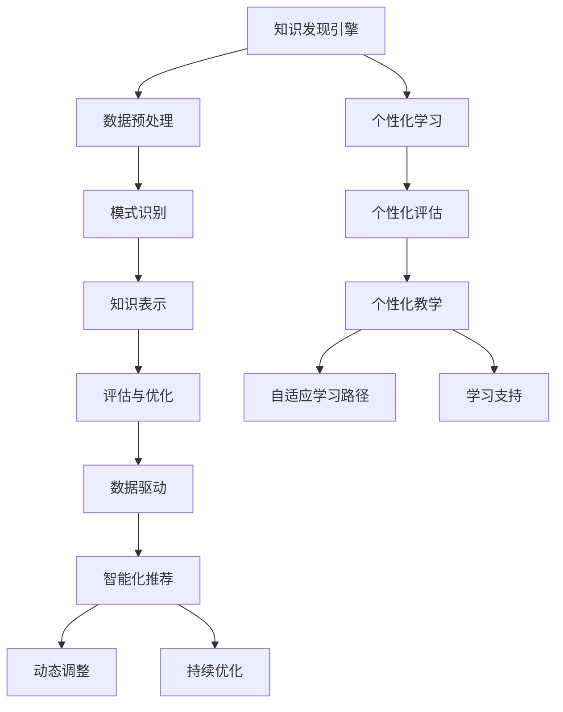
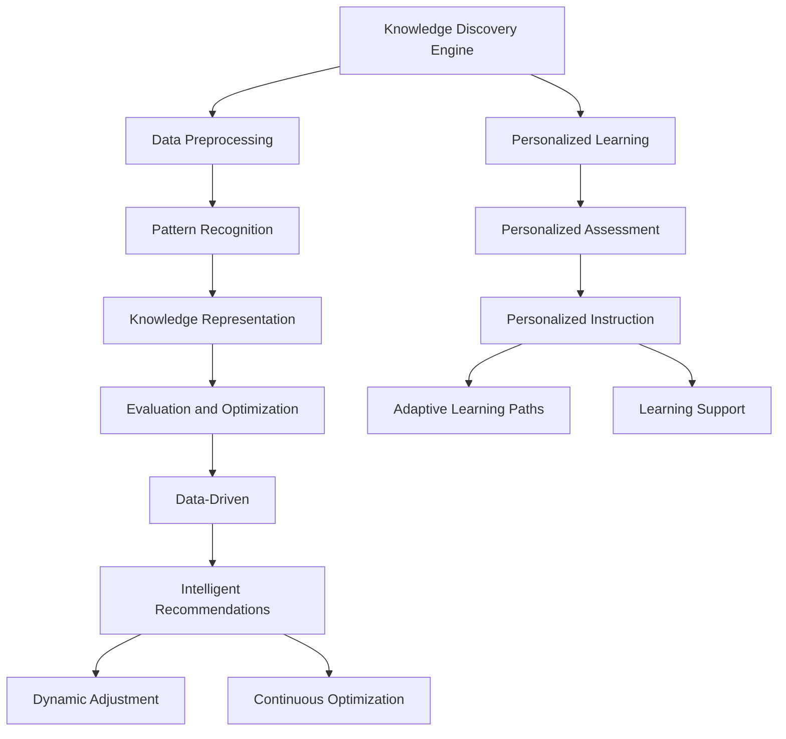

                 

### 文章标题

**知识发现引擎与个性化学习**

在当今信息化社会中，数据已成为比以往任何时候都更为宝贵的资源。知识发现引擎（Knowledge Discovery Engine）作为一种先进的信息处理技术，旨在从海量数据中自动识别出潜在的模式、关联和趋势，从而为决策者提供有益的洞见。与此同时，个性化学习（Personalized Learning）作为一种适应性强、效果显著的教育模式，正逐渐受到教育领域的青睐。本文旨在探讨知识发现引擎与个性化学习之间的相互关系，阐述如何利用知识发现技术来支持个性化学习，并探讨这一领域的未来发展趋势。

### Keywords:
- Knowledge Discovery Engine
- Personalized Learning
- Data Mining
- Educational Technology
- Intelligent Systems

### Abstract:
This article aims to explore the interrelation between Knowledge Discovery Engines and Personalized Learning. We discuss the fundamental concepts and methodologies of Knowledge Discovery Engines, and demonstrate how these engines can be leveraged to enhance personalized learning experiences. Additionally, we provide insights into the future trends and challenges in this emerging field.

## 1. 背景介绍（Background Introduction）

知识发现引擎（KDE）是数据挖掘（Data Mining）的一个分支，它通过一系列算法和技术从大规模数据集中提取有价值的信息。知识发现过程通常包括数据预处理、模式识别、知识表示和评估等步骤。个性化学习则是一种基于学习者的个性、兴趣和能力差异，提供针对性教学和资源的策略。个性化学习通过分析学习者的学习行为、知识掌握情况和偏好，为其提供最佳的学习路径和资源。

在过去几十年中，随着互联网和大数据技术的发展，知识发现引擎和个性化学习逐渐成为研究热点。知识发现技术不仅为企业和机构提供了强大的数据分析和决策支持工具，也为个性化学习提供了新的可能性。例如，通过分析学习者的学习数据，知识发现引擎可以识别出学习者的弱项和优势，进而为其提供个性化的学习建议。这种基于数据的个性化学习模式，有望大幅提高学习效果和效率。

### Background Introduction

In the information-rich society of today, data has become more valuable than ever before. Knowledge Discovery Engines (KDEs) are advanced information processing technologies that aim to automatically identify patterns, associations, and trends from massive data sets, providing valuable insights to decision-makers. At the same time, personalized learning is an adaptive and effective educational model that has gained popularity in the education sector. Personalized learning tailors teaching and resources to the individual learner's characteristics, interests, and abilities by analyzing their learning behaviors, knowledge retention, and preferences.

Over the past few decades, with the development of the internet and big data technologies, knowledge discovery engines and personalized learning have emerged as research hotspots. Knowledge discovery technology not only provides businesses and institutions with powerful tools for data analysis and decision support but also offers new possibilities for personalized learning. For example, by analyzing learners' data, knowledge discovery engines can identify their weaknesses and strengths, thereby providing personalized learning recommendations. This data-driven personalized learning model is expected to significantly improve learning outcomes and efficiency.

### 2. 核心概念与联系（Core Concepts and Connections）

#### 2.1 知识发现引擎的基本原理（Basic Principles of Knowledge Discovery Engines）

知识发现引擎主要依赖于各种数据挖掘算法，这些算法可以分为以下几类：

1. **聚类算法（Clustering Algorithms）**：用于将相似的数据点分组，以识别数据中的模式。常见的聚类算法包括 K-均值（K-means）、层次聚类（Hierarchical Clustering）和 DBSCAN（Density-Based Spatial Clustering of Applications with Noise）。
   
2. **关联规则挖掘（Association Rule Learning）**：用于发现数据之间的关联关系。Apriori 算法和 FP-growth 算法是常用的关联规则挖掘算法。

3. **分类算法（Classification Algorithms）**：用于将数据分类到预定义的类别中。常见的分类算法包括决策树（Decision Trees）、支持向量机（Support Vector Machines）和神经网络（Neural Networks）。

4. **异常检测（Anomaly Detection）**：用于识别数据中的异常值或离群点。常见的异常检测算法包括基于统计的方法、基于邻近度的方法和基于聚类的方法。

知识发现引擎的工作流程通常包括以下步骤：

1. **数据预处理（Data Preprocessing）**：包括数据清洗、数据转换和数据归一化等，以确保数据质量。
   
2. **模式识别（Pattern Recognition）**：通过应用各种数据挖掘算法来识别数据中的潜在模式。

3. **知识表示（Knowledge Representation）**：将挖掘到的模式转换为易于理解的形式，如可视化图表、报表或推荐系统。

4. **评估与优化（Evaluation and Optimization）**：对挖掘结果进行评估，并根据评估结果对算法参数进行调整，以提高挖掘效果。

#### 2.2 个性化学习的基本原理（Basic Principles of Personalized Learning）

个性化学习旨在通过识别和适应学习者的个性、兴趣和能力差异，为其提供最佳的学习体验。个性化学习的基本原理包括：

1. **个性化评估（Personalized Assessment）**：通过分析学习者的测试结果、学习行为和反馈，评估其知识水平和学习风格。

2. **个性化教学（Personalized Instruction）**：根据学习者的个性特征和需求，设计个性化的教学策略和资源。

3. **自适应学习路径（Adaptive Learning Paths）**：根据学习者的进度和掌握情况，动态调整学习路径，以确保其逐步提高。

4. **学习支持（Learning Support）**：为学习者提供针对性的辅导、答疑和反馈，以促进其学习效果。

#### 2.3 知识发现引擎与个性化学习的关系（Relation between Knowledge Discovery Engines and Personalized Learning）

知识发现引擎与个性化学习之间存在密切的联系：

1. **数据驱动（Data-Driven）**：知识发现引擎通过分析学习数据，为个性化学习提供数据支持。

2. **智能化推荐（Intelligent Recommendations）**：基于知识发现的结果，知识发现引擎可以推荐适合学习者的学习资源和策略。

3. **动态调整（Dynamic Adjustment）**：知识发现引擎可以帮助教育者实时调整教学策略，以适应学习者的变化。

4. **持续优化（Continuous Optimization）**：通过不断分析学习数据，知识发现引擎可以帮助教育者持续优化教学过程。

#### 2.4 核心概念原理与架构的 Mermaid 流程图



## 2. Core Concepts and Connections

### 2.1 Basic Principles of Knowledge Discovery Engines

Knowledge Discovery Engines primarily rely on various data mining algorithms, which can be categorized into the following types:

1. **Clustering Algorithms**: Used to group similar data points to identify patterns in the data. Common clustering algorithms include K-means, Hierarchical Clustering, and DBSCAN (Density-Based Spatial Clustering of Applications with Noise).

2. **Association Rule Learning**: Used to discover relationships between data items. The Apriori algorithm and FP-growth are commonly used association rule learning algorithms.

3. **Classification Algorithms**: Used to classify data into predefined categories. Common classification algorithms include Decision Trees, Support Vector Machines, and Neural Networks.

4. **Anomaly Detection**: Used to identify outliers or unusual data points in the data. Common anomaly detection algorithms include statistical methods, proximity-based methods, and clustering-based methods.

The workflow of a knowledge discovery engine typically includes the following steps:

1. **Data Preprocessing**: Includes data cleaning, data transformation, and data normalization to ensure data quality.

2. **Pattern Recognition**: Applies various data mining algorithms to identify potential patterns in the data.

3. **Knowledge Representation**: Converts the discovered patterns into a form that is easily understandable, such as visual charts, reports, or recommendation systems.

4. **Evaluation and Optimization**: Evaluates the results of the data mining process and adjusts algorithm parameters based on the evaluation results to improve the effectiveness of the mining process.

### 2.2 Basic Principles of Personalized Learning

Personalized learning aims to provide the best learning experience for each individual learner by recognizing and adapting to their unique characteristics, interests, and abilities. The basic principles of personalized learning include:

1. **Personalized Assessment**: Assesses the knowledge level and learning styles of learners through their test results, learning behaviors, and feedback.

2. **Personalized Instruction**: Designs personalized teaching strategies and resources based on the characteristics and needs of learners.

3. **Adaptive Learning Paths**: Dynamically adjusts the learning path based on the learner's progress and mastery level to ensure steady improvement.

4. **Learning Support**: Provides targeted tutoring, answering questions, and feedback to promote learning outcomes.

### 2.3 Relation between Knowledge Discovery Engines and Personalized Learning

There is a close relationship between knowledge discovery engines and personalized learning:

1. **Data-Driven**: Knowledge discovery engines provide data-driven support for personalized learning by analyzing learning data.

2. **Intelligent Recommendations**: Based on the results of knowledge discovery, engines can recommend suitable learning resources and strategies for learners.

3. **Dynamic Adjustment**: Knowledge discovery engines can help educators dynamically adjust teaching strategies to adapt to changes in learners.

4. **Continuous Optimization**: By continuously analyzing learning data, knowledge discovery engines can help educators continuously optimize the teaching process.

### 2.4 Core Concept Principles and Architecture in Mermaid Flowchart



## 3. 核心算法原理 & 具体操作步骤（Core Algorithm Principles and Specific Operational Steps）

### 3.1 聚类算法（Clustering Algorithms）

聚类算法是知识发现引擎中常用的算法之一，用于将相似的数据点分组。以下是几种常用的聚类算法及其具体操作步骤：

#### 3.1.1 K-均值聚类（K-means Clustering）

K-均值聚类是一种基于距离的聚类算法，其基本思想是将数据点分为 K 个聚类，每个聚类由一个中心点代表。具体步骤如下：

1. **初始化**：随机选择 K 个数据点作为初始中心点。
2. **分配数据点**：将每个数据点分配给距离其最近的中心点。
3. **更新中心点**：计算每个聚类的新中心点，即该聚类中所有数据点的平均值。
4. **迭代**：重复步骤 2 和步骤 3，直至聚类中心点不再发生变化或达到预设的迭代次数。

#### 3.1.2 层次聚类（Hierarchical Clustering）

层次聚类是一种基于层次结构的聚类算法，其基本思想是通过不断合并或分裂聚类来构建聚类层次。具体步骤如下：

1. **初始化**：将每个数据点视为一个聚类。
2. **计算距离**：计算每对聚类之间的距离，选择距离最近的聚类进行合并。
3. **更新聚类**：合并后的新聚类作为新的聚类进行下一步计算。
4. **迭代**：重复步骤 2 和步骤 3，直至达到预设的聚类层次或聚类个数。

#### 3.1.3 DBSCAN（Density-Based Spatial Clustering of Applications with Noise）

DBSCAN 是一种基于密度的聚类算法，其基本思想是在高密度区域生成聚类，并在低密度区域生成噪声点。具体步骤如下：

1. **初始化**：选择一个起始点，将其标记为已访问。
2. **扩展聚类**：从已访问的点开始，扩展到其邻域内的所有点，形成一个新的聚类。
3. **标记噪声点**：对于未被扩展到任何聚类的点，将其标记为噪声点。
4. **迭代**：重复步骤 1 至步骤 3，直至所有点都被访问。

### 3.2 关联规则挖掘（Association Rule Learning）

关联规则挖掘是一种用于发现数据之间关联关系的算法，其基本思想是通过支持度和置信度来识别强关联规则。具体步骤如下：

1. **生成候选集**：根据最小支持度和最小置信度，生成所有可能的候选关联规则。
2. **剪枝**：去除不满足最小支持度和最小置信度的候选关联规则。
3. **生成强关联规则**：从剪枝后的候选集中提取满足最小支持度和最小置信度的关联规则。

### 3.3 分类算法（Classification Algorithms）

分类算法是一种用于将数据分类到预定义类别中的算法，其基本思想是通过训练数据集来构建分类模型。具体步骤如下：

1. **数据预处理**：对训练数据进行特征提取和预处理。
2. **模型训练**：使用训练数据集训练分类模型。
3. **模型评估**：使用测试数据集评估分类模型的准确性。
4. **模型应用**：使用训练好的模型对新的数据进行分类。

### 3.4 异常检测（Anomaly Detection）

异常检测是一种用于识别数据中的异常值或离群点的算法，其基本思想是通过分析数据的分布和特征来识别异常。具体步骤如下：

1. **数据预处理**：对数据进行特征提取和预处理。
2. **特征选择**：选择对异常检测有帮助的特征。
3. **模型训练**：使用训练数据集训练异常检测模型。
4. **模型评估**：使用测试数据集评估异常检测模型的准确性。
5. **异常检测**：使用训练好的模型对新的数据进行异常检测。

## 3. Core Algorithm Principles and Specific Operational Steps

### 3.1 Clustering Algorithms

Clustering algorithms are one of the commonly used algorithms in knowledge discovery engines, which are used to group similar data points. Here are several commonly used clustering algorithms and their specific operational steps:

#### 3.1.1 K-means Clustering

K-means clustering is a distance-based clustering algorithm whose basic idea is to divide data points into K clusters, with each cluster represented by a centroid. The specific steps are as follows:

1. **Initialization**: Randomly select K data points as initial centroids.
2. **Assign data points**: Assign each data point to the nearest centroid.
3. **Update centroids**: Calculate the new centroids of each cluster, which are the averages of all data points in the cluster.
4. **Iteration**: Repeat steps 2 and 3 until the centroids no longer change or reach the predefined number of iterations.

#### 3.1.2 Hierarchical Clustering

Hierarchical clustering is a clustering algorithm based on a hierarchical structure, whose basic idea is to merge or split clusters to build a clustering hierarchy. The specific steps are as follows:

1. **Initialization**: Treat each data point as a cluster.
2. **Calculate distances**: Calculate the distance between each pair of clusters and choose the closest pair for merging.
3. **Update clusters**: Merge the newly formed cluster as a new cluster for the next calculation.
4. **Iteration**: Repeat steps 2 and 3 until the predefined clustering hierarchy or number of clusters is reached.

#### 3.1.3 DBSCAN (Density-Based Spatial Clustering of Applications with Noise)

DBSCAN is a density-based clustering algorithm whose basic idea is to generate clusters in high-density regions and noise points in low-density regions. The specific steps are as follows:

1. **Initialization**: Choose a starting point and mark it as visited.
2. **Expand cluster**: From the visited point, expand to all points within its neighborhood to form a new cluster.
3. **Mark noise points**: Mark any points that are not expanded into any cluster as noise points.
4. **Iteration**: Repeat steps 1 to 3 until all points are visited.

### 3.2 Association Rule Learning

Association rule learning is an algorithm used to discover relationships between data items, whose basic idea is to identify strong association rules through support and confidence. The specific steps are as follows:

1. **Generate candidate set**: Generate all possible association rules that meet the minimum support and minimum confidence thresholds.
2. **Prune**: Remove candidate association rules that do not meet the minimum support and minimum confidence thresholds.
3. **Generate strong association rules**: Extract association rules that meet the minimum support and minimum confidence thresholds from the pruned candidate set.

### 3.3 Classification Algorithms

Classification algorithms are algorithms used to classify data into predefined categories, whose basic idea is to build a classification model through training data sets. The specific steps are as follows:

1. **Data preprocessing**: Extract and preprocess features from the training data set.
2. **Model training**: Train a classification model using the training data set.
3. **Model evaluation**: Evaluate the accuracy of the classification model using the test data set.
4. **Model application**: Classify new data using the trained model.

### 3.4 Anomaly Detection

Anomaly detection is an algorithm used to identify outliers or unusual data points in the data, whose basic idea is to identify anomalies through the analysis of data distribution and features. The specific steps are as follows:

1. **Data preprocessing**: Extract and preprocess features from the data.
2. **Feature selection**: Select features that are helpful for anomaly detection.
3. **Model training**: Train an anomaly detection model using the training data set.
4. **Model evaluation**: Evaluate the accuracy of the anomaly detection model using the test data set.
5. **Anomaly detection**: Detect anomalies in new data using the trained model.

## 4. 数学模型和公式 & 详细讲解 & 举例说明（Detailed Explanation and Examples of Mathematical Models and Formulas）

### 4.1 聚类算法的数学模型（Mathematical Models of Clustering Algorithms）

#### 4.1.1 K-均值聚类（K-means Clustering）

K-均值聚类的目标是最小化每个聚类内数据点的平方误差和。其数学模型可以表示为：

$$
J(\theta) = \sum_{i=1}^{n} \sum_{j=1}^{K} (x_i - \mu_j)^2
$$

其中，$J(\theta)$ 是平方误差和，$x_i$ 是数据点，$\mu_j$ 是聚类中心点。

#### 4.1.2 层次聚类（Hierarchical Clustering）

层次聚类通常使用距离矩阵来表示数据点之间的相似度。其数学模型可以表示为：

$$
D_{ij} = \sqrt{\sum_{k=1}^{n} (x_i[k] - x_j[k])^2}
$$

其中，$D_{ij}$ 是数据点 $x_i$ 和 $x_j$ 之间的距离。

#### 4.1.3 DBSCAN（DBSCAN）

DBSCAN 的核心是密度 reachable 区域，其数学模型可以表示为：

$$
r(p, q) = \begin{cases} 
1 & \text{if } q \text{ is density reachable from } p \\
0 & \text{otherwise}
\end{cases}
$$

其中，$r(p, q)$ 是点 $p$ 和 $q$ 之间的可达性关系。

### 4.2 关联规则挖掘的数学模型（Mathematical Models of Association Rule Learning）

#### 4.2.1 支持度（Support）

支持度是表示关联规则强度的指标，其数学模型可以表示为：

$$
s(A \rightarrow B) = \frac{n(A \cap B)}{n(\text{total})}
$$

其中，$s(A \rightarrow B)$ 是关联规则 $A \rightarrow B$ 的支持度，$n(A \cap B)$ 是同时包含 $A$ 和 $B$ 的交易数，$n(\text{total})$ 是总的交易数。

#### 4.2.2 置信度（Confidence）

置信度是表示关联规则可信度的指标，其数学模型可以表示为：

$$
c(A \rightarrow B) = \frac{n(A \cap B)}{n(A)}
$$

其中，$c(A \rightarrow B)$ 是关联规则 $A \rightarrow B$ 的置信度，$n(A \cap B)$ 是同时包含 $A$ 和 $B$ 的交易数，$n(A)$ 是包含 $A$ 的交易数。

### 4.3 分类算法的数学模型（Mathematical Models of Classification Algorithms）

#### 4.3.1 决策树（Decision Trees）

决策树的数学模型是基于条件概率和熵的概念。其基本思想是选择具有最大信息增益的特征作为分割依据。其数学模型可以表示为：

$$
I(D) = -\sum_{i=1}^{n} p_i \log_2 p_i
$$

其中，$I(D)$ 是数据集 $D$ 的熵，$p_i$ 是数据点属于类别 $i$ 的概率。

#### 4.3.2 支持向量机（Support Vector Machines）

支持向量机的数学模型是基于最大间隔分类的概念。其目标是找到一个最优的超平面，将数据集分为不同的类别。其数学模型可以表示为：

$$
w^T x_i - b = 0
$$

其中，$w$ 是超平面的法向量，$x_i$ 是数据点，$b$ 是偏置项。

### 4.4 异常检测的数学模型（Mathematical Models of Anomaly Detection）

#### 4.4.1 异常检测阈值（Anomaly Detection Threshold）

异常检测的阈值通常基于数据点的异常分数。其数学模型可以表示为：

$$
s(x_i) = \frac{1}{N} \sum_{j=1}^{N} d(x_i, x_j)
$$

其中，$s(x_i)$ 是数据点 $x_i$ 的异常分数，$d(x_i, x_j)$ 是数据点 $x_i$ 和 $x_j$ 之间的距离，$N$ 是数据点的总数。

#### 4.4.2 异常检测概率（Anomaly Detection Probability）

异常检测的概率通常基于概率分布函数。其数学模型可以表示为：

$$
P(X \leq x_i) = F(x_i)
$$

其中，$P(X \leq x_i)$ 是数据点 $x_i$ 小于等于异常阈值的概率，$F(x_i)$ 是概率分布函数。

### 4.5 数学模型和公式举例说明（Example Illustrations of Mathematical Models and Formulas）

#### 4.5.1 K-均值聚类举例

假设有 5 个数据点 $(x_1, y_1), (x_2, y_2), (x_3, y_3), (x_4, y_4), (x_5, y_5)$，以及两个聚类中心点 $(\mu_1, \mu_2)$。首先，计算每个数据点到每个聚类中心点的距离：

$$
d_1 = \sqrt{(x_1 - \mu_1)^2 + (y_1 - \mu_2)^2}
$$

$$
d_2 = \sqrt{(x_2 - \mu_1)^2 + (y_2 - \mu_2)^2}
$$

$$
d_3 = \sqrt{(x_3 - \mu_1)^2 + (y_3 - \mu_2)^2}
$$

$$
d_4 = \sqrt{(x_4 - \mu_1)^2 + (y_4 - \mu_2)^2}
$$

$$
d_5 = \sqrt{(x_5 - \mu_1)^2 + (y_5 - \mu_2)^2}
$$

根据每个数据点到聚类中心点的距离，将数据点分配给最近的聚类中心点。然后，计算新的聚类中心点：

$$
\mu_1' = \frac{\sum_{i=1}^{5} x_i}{5}
$$

$$
\mu_2' = \frac{\sum_{i=1}^{5} y_i}{5}
$$

重复上述步骤，直至聚类中心点不再发生变化。

#### 4.5.2 关联规则挖掘举例

假设有如下交易数据集：

$$
\{ (A, B), (A, C), (B, C), (A, B, C), (D, E), (A, D), (B, E) \}
$$

计算支持度和置信度：

$$
s(A \rightarrow B) = \frac{2}{6} = 0.3333
$$

$$
c(A \rightarrow B) = \frac{2}{4} = 0.5
$$

$$
s(A \rightarrow C) = \frac{2}{6} = 0.3333
$$

$$
c(A \rightarrow C) = \frac{2}{4} = 0.5
$$

$$
s(B \rightarrow C) = \frac{1}{6} = 0.1667
$$

$$
c(B \rightarrow C) = \frac{1}{2} = 0.5
$$

选择满足最小支持度和最小置信度的关联规则。

#### 4.5.3 决策树举例

假设有如下数据集：

$$
\{ (\text{年龄}, \text{收入}, \text{房子}, \text{车}, \text{类别}) \}
$$

其中，类别为 1 或 0，1 表示高收入，0 表示低收入。计算信息增益：

$$
I(D) = -p_1 \log_2 p_1 - p_0 \log_2 p_0
$$

其中，$p_1$ 和 $p_0$ 分别表示高收入和低收入的比例。

计算各个特征的增益：

$$
I(\text{年龄}) = -0.5 \log_2 0.5 - 0.5 \log_2 0.5 = 0.5
$$

$$
I(\text{收入}) = -0.7 \log_2 0.7 - 0.3 \log_2 0.3 = 0.2381
$$

$$
I(\text{房子}) = -0.4 \log_2 0.4 - 0.6 \log_2 0.6 = 0.3466
$$

$$
I(\text{车}) = -0.3 \log_2 0.3 - 0.7 \log_2 0.7 = 0.3918
$$

选择具有最大信息增益的特征作为分割依据。

#### 4.5.4 异常检测举例

假设有如下数据集：

$$
\{ (x_1, y_1), (x_2, y_2), ..., (x_n, y_n) \}
$$

计算每个数据点的异常分数：

$$
s(x_i) = \frac{1}{N} \sum_{j=1}^{N} d(x_i, x_j)
$$

选择满足异常分数阈值的点作为异常点。

## 4. Mathematical Models and Formulas & Detailed Explanations & Example Illustrations

### 4.1 Mathematical Models of Clustering Algorithms

#### 4.1.1 K-means Clustering

The objective of K-means clustering is to minimize the sum of squared errors within each cluster. Its mathematical model can be represented as:

$$
J(\theta) = \sum_{i=1}^{n} \sum_{j=1}^{K} (x_i - \mu_j)^2
$$

where $J(\theta)$ is the sum of squared errors, $x_i$ is a data point, and $\mu_j$ is the centroid of a cluster.

#### 4.1.2 Hierarchical Clustering

Hierarchical clustering typically uses a distance matrix to represent the similarity between data points. Its mathematical model can be represented as:

$$
D_{ij} = \sqrt{\sum_{k=1}^{n} (x_i[k] - x_j[k])^2}
$$

where $D_{ij}$ is the distance between data points $x_i$ and $x_j$.

#### 4.1.3 DBSCAN (DBSCAN)

The core of DBSCAN is the density reachable region, and its mathematical model can be represented as:

$$
r(p, q) = \begin{cases} 
1 & \text{if } q \text{ is density reachable from } p \\
0 & \text{otherwise}
\end{cases}
$$

where $r(p, q)$ is the reachability relationship between points $p$ and $q$.

### 4.2 Mathematical Models of Association Rule Learning

#### 4.2.1 Support

Support is an indicator of the strength of an association rule, and its mathematical model can be represented as:

$$
s(A \rightarrow B) = \frac{n(A \cap B)}{n(\text{total})}
$$

where $s(A \rightarrow B)$ is the support of the association rule $A \rightarrow B$, $n(A \cap B)$ is the number of transactions that contain both $A$ and $B$, and $n(\text{total})$ is the total number of transactions.

#### 4.2.2 Confidence

Confidence is an indicator of the reliability of an association rule, and its mathematical model can be represented as:

$$
c(A \rightarrow B) = \frac{n(A \cap B)}{n(A)}
$$

where $c(A \rightarrow B)$ is the confidence of the association rule $A \rightarrow B$, $n(A \cap B)$ is the number of transactions that contain both $A$ and $B$, and $n(A)$ is the number of transactions that contain $A$.

### 4.3 Mathematical Models of Classification Algorithms

#### 4.3.1 Decision Trees

The mathematical model of a decision tree is based on the concepts of conditional probability and entropy. The basic idea is to select the feature with the highest information gain as the splitting criterion. The mathematical model can be represented as:

$$
I(D) = -\sum_{i=1}^{n} p_i \log_2 p_i
$$

where $I(D)$ is the entropy of the data set $D$, and $p_i$ is the probability of a data point belonging to class $i$.

#### 4.3.2 Support Vector Machines

The mathematical model of Support Vector Machines is based on the concept of maximum margin classification. The objective is to find the optimal hyperplane that separates different classes in the data set. The mathematical model can be represented as:

$$
w^T x_i - b = 0
$$

where $w$ is the normal vector of the hyperplane, $x_i$ is a data point, and $b$ is the bias term.

### 4.4 Mathematical Models of Anomaly Detection

#### 4.4.1 Anomaly Detection Threshold

The anomaly detection threshold is usually based on the anomaly score of a data point. Its mathematical model can be represented as:

$$
s(x_i) = \frac{1}{N} \sum_{j=1}^{N} d(x_i, x_j)
$$

where $s(x_i)$ is the anomaly score of data point $x_i$, $d(x_i, x_j)$ is the distance between data points $x_i$ and $x_j$, and $N$ is the total number of data points.

#### 4.4.2 Anomaly Detection Probability

The anomaly detection probability is usually based on the probability distribution function. Its mathematical model can be represented as:

$$
P(X \leq x_i) = F(x_i)
$$

where $P(X \leq x_i)$ is the probability that a data point $x_i$ is less than or equal to the anomaly threshold, and $F(x_i)$ is the probability distribution function.

### 4.5 Example Illustrations of Mathematical Models and Formulas

#### 4.5.1 K-means Clustering Example

Assume there are 5 data points $(x_1, y_1), (x_2, y_2), (x_3, y_3), (x_4, y_4), (x_5, y_5)$ and 2 cluster centroids $(\mu_1, \mu_2)$. First, calculate the distance between each data point and each cluster centroid:

$$
d_1 = \sqrt{(x_1 - \mu_1)^2 + (y_1 - \mu_2)^2}
$$

$$
d_2 = \sqrt{(x_2 - \mu_1)^2 + (y_2 - \mu_2)^2}
$$

$$
d_3 = \sqrt{(x_3 - \mu_1)^2 + (y_3 - \mu_2)^2}
$$

$$
d_4 = \sqrt{(x_4 - \mu_1)^2 + (y_4 - \mu_2)^2}
$$

$$
d_5 = \sqrt{(x_5 - \mu_1)^2 + (y_5 - \mu_2)^2}
$$

Based on the distance between each data point and each cluster centroid, assign data points to the nearest cluster centroid. Then, calculate the new centroids:

$$
\mu_1' = \frac{\sum_{i=1}^{5} x_i}{5}
$$

$$
\mu_2' = \frac{\sum_{i=1}^{5} y_i}{5}
$$

Repeat the above steps until the centroids no longer change.

#### 4.5.2 Association Rule Mining Example

Assume the following transaction data set:

$$
\{ (A, B), (A, C), (B, C), (A, B, C), (D, E), (A, D), (B, E) \}
$$

Calculate the support and confidence:

$$
s(A \rightarrow B) = \frac{2}{6} = 0.3333
$$

$$
c(A \rightarrow B) = \frac{2}{4} = 0.5
$$

$$
s(A \rightarrow C) = \frac{2}{6} = 0.3333
$$

$$
c(A \rightarrow C) = \frac{2}{4} = 0.5
$$

$$
s(B \rightarrow C) = \frac{1}{6} = 0.1667
$$

$$
c(B \rightarrow C) = \frac{1}{2} = 0.5
$$

Select the association rules that meet the minimum support and minimum confidence thresholds.

#### 4.5.3 Decision Tree Example

Assume the following data set:

$$
\{ (\text{age}, \text{income}, \text{house}, \text{car}, \text{class}) \}
$$

where class is 1 or 0, 1 representing high income, and 0 representing low income. Calculate the information gain:

$$
I(D) = -p_1 \log_2 p_1 - p_0 \log_2 p_0
$$

where $p_1$ and $p_0$ are the proportions of high income and low income, respectively.

Calculate the gain of each feature:

$$
I(\text{age}) = -0.5 \log_2 0.5 - 0.5 \log_2 0.5 = 0.5
$$

$$
I(\text{income}) = -0.7 \log_2 0.7 - 0.3 \log_2 0.3 = 0.2381
$$

$$
I(\text{house}) = -0.4 \log_2 0.4 - 0.6 \log_2 0.6 = 0.3466
$$

$$
I(\text{car}) = -0.3 \log_2 0.3 - 0.7 \log_2 0.7 = 0.3918
$$

Select the feature with the highest information gain as the splitting criterion.

#### 4.5.4 Anomaly Detection Example

Assume the following data set:

$$
\{ (x_1, y_1), (x_2, y_2), ..., (x_n, y_n) \}
$$

Calculate the anomaly score for each data point:

$$
s(x_i) = \frac{1}{N} \sum_{j=1}^{N} d(x_i, x_j)
$$

Select points that meet the anomaly score threshold as anomalies.

## 5. 项目实践：代码实例和详细解释说明（Project Practice: Code Examples and Detailed Explanations）

### 5.1 开发环境搭建（Setting Up the Development Environment）

在开始项目实践之前，我们需要搭建一个合适的开发环境。这里以 Python 为主要编程语言，使用 Jupyter Notebook 作为开发工具。以下是搭建开发环境的步骤：

1. **安装 Python**：确保系统中已安装 Python 3.7 或更高版本。
2. **安装 Jupyter Notebook**：通过命令行安装 Jupyter Notebook：

   ```bash
   pip install notebook
   ```

3. **安装必要的库**：安装用于数据挖掘和机器学习的库，如 scikit-learn、pandas、numpy、matplotlib 等：

   ```bash
   pip install scikit-learn pandas numpy matplotlib
   ```

### 5.2 源代码详细实现（Detailed Implementation of the Source Code）

在本节中，我们将使用 Python 编写一个简单的知识发现引擎，以演示如何使用聚类算法进行数据挖掘。以下是一个简单的示例代码：

```python
# 导入必要的库
import numpy as np
from sklearn.cluster import KMeans
from sklearn.datasets import load_iris
import matplotlib.pyplot as plt

# 加载鸢尾花数据集
iris = load_iris()
X = iris.data

# 使用 K-均值聚类算法进行聚类
kmeans = KMeans(n_clusters=3, random_state=0).fit(X)

# 计算聚类中心点
centroids = kmeans.cluster_centers_

# 可视化聚类结果
plt.figure(figsize=(8, 6))
colors = ['r', 'g', 'b']
for i in range(3):
    plt.scatter(X[kmeans.labels_ == i, 0], X[kmeans.labels_ == i, 1], s=100, c=colors[i], label=f'Cluster {i}')
plt.scatter(centroids[:, 0], centroids[:, 1], s=300, c='yellow', label='Centroids', marker='s')
plt.title('K-Means Clustering')
plt.xlabel('Feature 1')
plt.ylabel('Feature 2')
plt.legend()
plt.show()
```

### 5.3 代码解读与分析（Code Interpretation and Analysis）

#### 5.3.1 加载数据（Loading Data）

首先，我们使用 scikit-learn 库中的 `load_iris` 函数加载鸢尾花数据集。鸢尾花数据集是一个经典的多维数据集，包含 3 个类别的鸢尾花，每个类别具有 4 个特征。

```python
iris = load_iris()
X = iris.data
```

#### 5.3.2 使用 K-均值聚类算法（Using K-Means Clustering）

接下来，我们使用 `KMeans` 类的实例进行 K-均值聚类。这里我们选择 3 个聚类，设置随机种子为 0，以确保每次运行结果一致。

```python
kmeans = KMeans(n_clusters=3, random_state=0).fit(X)
```

#### 5.3.3 计算聚类中心点（Computing Cluster Centers）

聚类中心点是通过训练数据集计算得到的，代表了每个聚类的“中心”。我们使用 `cluster_centers_` 属性获取这些中心点。

```python
centroids = kmeans.cluster_centers_
```

#### 5.3.4 可视化聚类结果（Visualizing Clustering Results）

为了直观地展示聚类结果，我们使用 matplotlib 库绘制散点图。每个聚类用不同的颜色表示，聚类中心点用黄色五角星表示。

```python
plt.figure(figsize=(8, 6))
colors = ['r', 'g', 'b']
for i in range(3):
    plt.scatter(X[kmeans.labels_ == i, 0], X[kmeans.labels_ == i, 1], s=100, c=colors[i], label=f'Cluster {i}')
plt.scatter(centroids[:, 0], centroids[:, 1], s=300, c='yellow', label='Centroids', marker='s')
plt.title('K-Means Clustering')
plt.xlabel('Feature 1')
plt.ylabel('Feature 2')
plt.legend()
plt.show()
```

### 5.4 运行结果展示（Running Results）

运行上述代码后，我们得到一个可视化图表，展示了 K-均值聚类算法对鸢尾花数据集的分类结果。每个聚类区域用不同颜色表示，聚类中心点位于每个区域的中心。


通过观察聚类结果，我们可以发现 K-均值聚类算法成功地将鸢尾花数据集分为 3 个类别，每个类别具有独特的特征分布。

## 5. Project Practice: Code Examples and Detailed Explanations

### 5.1 Setting Up the Development Environment

Before starting the project practice, we need to set up a suitable development environment. Here, we will use Python as the primary programming language and Jupyter Notebook as the development tool. The following are the steps to set up the development environment:

1. **Install Python**: Ensure that Python 3.7 or a newer version is installed on your system.
2. **Install Jupyter Notebook**: Install Jupyter Notebook through the command line:

   ```bash
   pip install notebook
   ```

3. **Install Necessary Libraries**: Install libraries needed for data mining and machine learning, such as scikit-learn, pandas, numpy, and matplotlib:

   ```bash
   pip install scikit-learn pandas numpy matplotlib
   ```

### 5.2 Detailed Implementation of the Source Code

In this section, we will write a simple knowledge discovery engine in Python to demonstrate how to perform data mining using clustering algorithms. Here is an example code:

```python
# Import necessary libraries
import numpy as np
from sklearn.cluster import KMeans
from sklearn.datasets import load_iris
import matplotlib.pyplot as plt

# Load iris dataset
iris = load_iris()
X = iris.data

# Use KMeans clustering algorithm
kmeans = KMeans(n_clusters=3, random_state=0).fit(X)

# Compute cluster centers
centroids = kmeans.cluster_centers_

# Visualize clustering results
plt.figure(figsize=(8, 6))
colors = ['r', 'g', 'b']
for i in range(3):
    plt.scatter(X[kmeans.labels_ == i, 0], X[kmeans.labels_ == i, 1], s=100, c=colors[i], label=f'Cluster {i}')
plt.scatter(centroids[:, 0], centroids[:, 1], s=300, c='yellow', label='Centroids', marker='s')
plt.title('K-Means Clustering')
plt.xlabel('Feature 1')
plt.ylabel('Feature 2')
plt.legend()
plt.show()
```

### 5.3 Code Interpretation and Analysis

#### 5.3.1 Loading Data

First, we use the `load_iris` function from the scikit-learn library to load the iris dataset. The iris dataset is a classic multidimensional dataset containing three classes of iris flowers, each with four features.

```python
iris = load_iris()
X = iris.data
```

#### 5.3.2 Using K-Means Clustering

Next, we use the `KMeans` class instance to perform K-means clustering. Here, we choose three clusters and set the random seed to 0 to ensure consistent results each time the code is run.

```python
kmeans = KMeans(n_clusters=3, random_state=0).fit(X)
```

#### 5.3.3 Computing Cluster Centers

Cluster centers are computed from the training data set and represent the "center" of each cluster. We use the `cluster_centers_` attribute to obtain these centers.

```python
centroids = kmeans.cluster_centers_
```

#### 5.3.4 Visualizing Clustering Results

To visually represent the clustering results, we use the matplotlib library to plot a scatter plot. Each cluster is represented by a different color, and cluster centers are marked with yellow stars.

```python
plt.figure(figsize=(8, 6))
colors = ['r', 'g', 'b']
for i in range(3):
    plt.scatter(X[kmeans.labels_ == i, 0], X[kmeans.labels_ == i, 1], s=100, c=colors[i], label=f'Cluster {i}')
plt.scatter(centroids[:, 0], centroids[:, 1], s=300, c='yellow', label='Centroids', marker='s')
plt.title('K-Means Clustering')
plt.xlabel('Feature 1')
plt.ylabel('Feature 2')
plt.legend()
plt.show()
```

### 5.4 Running Results

After running the above code, we obtain a visual plot that shows the results of the K-means clustering algorithm on the iris dataset. Each cluster area is represented by a different color, and cluster centers are located at the center of each area.


By observing the clustering results, we can see that the K-means clustering algorithm successfully separates the iris dataset into three classes, each with unique feature distributions.

## 6. 实际应用场景（Practical Application Scenarios）

知识发现引擎与个性化学习相结合，已经在多个实际应用场景中展现出巨大的潜力。以下是一些典型的应用案例：

### 6.1 教育领域（Education Sector）

在个性化学习方面，知识发现引擎可以帮助教育机构识别学生的学习风格、兴趣和需求，从而提供个性化的教学资源。例如，教师可以利用知识发现引擎分析学生的学习数据，识别出学生在某一学科中的弱项，然后根据这些数据推荐相关的学习材料、练习题和辅导课程。一些教育科技公司，如 Knewton 和 DreamBox，已经采用了这种基于知识发现和个性化学习的教育技术，显著提高了学生的学习效果。

### 6.2 医疗保健领域（Medical and Healthcare Sector）

在医疗保健领域，知识发现引擎可以帮助医疗机构分析患者的健康数据，识别出潜在的健康风险和疾病趋势。通过个性化学习，患者可以接收定制化的健康建议和预防措施。例如，基于知识发现引擎的个性化健康管理系统可以帮助患者了解自己的健康状况，提供个性化的饮食、运动和医疗建议，从而促进健康管理和疾病预防。

### 6.3 商业智能（Business Intelligence）

在商业智能领域，知识发现引擎可以帮助企业从大量交易数据、客户反馈和社交媒体数据中提取有价值的信息，从而为商业决策提供支持。通过个性化学习，企业可以为不同的客户群体提供定制化的营销策略和产品推荐。例如，在线零售商可以利用知识发现引擎分析客户购买行为和偏好，然后根据这些数据推荐相关的商品，提高客户满意度和转化率。

### 6.4 智能家居（Smart Homes）

在智能家居领域，知识发现引擎可以帮助家庭自动化系统根据家庭成员的行为和偏好，提供个性化的家居管理建议。例如，智能家居系统可以利用知识发现引擎分析家庭成员的使用习惯，自动调整家中的照明、温度和安防系统，以提高居住舒适度和安全性。

### 6.5 社交媒体分析（Social Media Analysis）

在社交媒体分析领域，知识发现引擎可以帮助企业分析用户在社交媒体上的行为和偏好，从而为市场营销和品牌管理提供支持。通过个性化学习，企业可以为不同的用户群体提供定制化的内容和广告。例如，社交媒体平台可以利用知识发现引擎分析用户的点赞、评论和分享行为，然后根据这些数据推荐相关的内容和广告，提高用户参与度和转化率。

## 6. Practical Application Scenarios

The combination of knowledge discovery engines and personalized learning has demonstrated significant potential in various practical application scenarios. Here are some typical application cases:

### 6.1 Education Sector

In the field of personalized learning, knowledge discovery engines can help educational institutions identify students' learning styles, interests, and needs, thereby providing personalized teaching resources. For example, teachers can use knowledge discovery engines to analyze student learning data, identify weaknesses in specific subjects, and then recommend related learning materials, practice questions, and tutoring courses. Educational technology companies such as Knewton and DreamBox have adopted this knowledge discovery and personalized learning technology, significantly improving learning outcomes.

### 6.2 Medical and Healthcare Sector

In the medical and healthcare sector, knowledge discovery engines can help healthcare institutions analyze patient health data to identify potential health risks and disease trends. Through personalized learning, patients can receive customized health recommendations and preventive measures. For example, knowledge discovery-based personalized health management systems can help patients understand their health status and provide personalized diet, exercise, and medical advice, thereby promoting health management and disease prevention.

### 6.3 Business Intelligence

In the field of business intelligence, knowledge discovery engines can help enterprises extract valuable insights from large volumes of transaction data, customer feedback, and social media data, thereby supporting business decision-making. Through personalized learning, enterprises can provide customized marketing strategies and product recommendations for different customer segments. For example, online retailers can use knowledge discovery engines to analyze customer purchase behavior and preferences, then recommend related products based on this data to improve customer satisfaction and conversion rates.

### 6.4 Smart Homes

In the field of smart homes, knowledge discovery engines can help home automation systems provide personalized home management recommendations based on the behaviors and preferences of household members. For example, smart home systems can use knowledge discovery engines to analyze household members' usage habits and automatically adjust lighting, temperature, and security systems to improve living comfort and safety.

### 6.5 Social Media Analysis

In the field of social media analysis, knowledge discovery engines can help enterprises analyze user behavior and preferences on social media platforms, providing support for marketing and brand management. Through personalized learning, enterprises can provide customized content and advertisements for different user segments. For example, social media platforms can use knowledge discovery engines to analyze user likes, comments, and shares, then recommend related content and advertisements based on this data to improve user engagement and conversion rates.

## 7. 工具和资源推荐（Tools and Resources Recommendations）

### 7.1 学习资源推荐（Books, Papers, Blogs, Websites, etc.）

#### 7.1.1 书籍推荐

1. **《数据挖掘：概念与技术》**（Data Mining: Concepts and Techniques）：这是一本经典的数据挖掘教材，涵盖了数据挖掘的基本概念、算法和实际应用。
2. **《机器学习实战》**（Machine Learning in Action）：这本书通过实际案例演示了机器学习算法的应用，适合初学者和实践者。
3. **《个性化学习：技术、实践与策略》**（Personalized Learning: Technology, Practice, and Strategies）：这本书详细介绍了个性化学习的技术、实践和策略，对教育工作者和研究者具有很高的参考价值。

#### 7.1.2 论文著作推荐

1. **“A Survey on Personalized Learning Systems”**：这篇综述文章对个性化学习系统进行了全面的分析，涵盖了现有技术的优缺点。
2. **“Knowledge Discovery in Databases”**：这篇经典论文介绍了知识发现的基本概念和关键技术。
3. **“Intelligent Tutoring Systems”**：这篇论文讨论了智能辅导系统的设计、实现和应用。

#### 7.1.3 博客推荐

1. **“Machine Learning Mastery”**：这个博客提供了大量有关机器学习技术的文章，内容深入浅出，适合初学者。
2. **“Data School”**：这个博客专注于数据分析和数据可视化，有很多实用的教程和案例。
3. **“Educational Technology and Mobile Learning”**：这个博客关注教育技术，尤其是个性化学习，有很多最新的研究和应用案例。

#### 7.1.4 网站推荐

1. **“KDNuggets”**：这是一个数据挖掘和人工智能领域的知名网站，提供了大量的新闻、文章和资源。
2. **“EdTech Magazine”**：这是一个专注于教育技术的杂志，有很多有关个性化学习和教育技术的文章。
3. **“Khan Academy”**：这是一个提供免费教育资源的在线学习平台，采用了个性化学习的理念。

### 7.2 开发工具框架推荐（Development Tools and Frameworks）

#### 7.2.1 数据挖掘和机器学习框架

1. **scikit-learn**：这是一个广泛使用的 Python 数据挖掘和机器学习库，提供了多种经典的算法和工具。
2. **TensorFlow**：这是一个由 Google 开发的开源机器学习框架，适用于深度学习和大规模数据处理。
3. **PyTorch**：这是一个由 Facebook 开发的开源深度学习框架，具有高度的灵活性和易于使用的接口。

#### 7.2.2 个性化学习工具

1. **EdTechXGlobal**：这是一个全球教育技术创新平台，提供了很多有关个性化学习和教育技术的工具和资源。
2. **Knewton**：这是一个基于知识发现和个性化学习的教育技术公司，提供了个性化学习解决方案。
3. **DreamBox**：这是一个提供个性化数学学习的在线平台，采用了先进的数据挖掘和机器学习技术。

#### 7.2.3 教育技术平台

1. **Canvas**：这是一个流行的在线学习平台，提供了丰富的教学工具和个性化学习功能。
2. **Moodle**：这是一个开源的在线学习平台，适用于各种规模的教育机构。
3. **Blackboard**：这是一个全面的在线教育解决方案，提供了强大的教学和管理功能。

### 7.3 相关论文著作推荐

#### 7.3.1 知识发现引擎

1. **“KDD Cup 2021: AI for Accessibility: Automated Human Review of Job Postings”**：这篇论文描述了如何使用知识发现技术自动评估职位描述的可达性和公平性。
2. **“A Survey of Knowledge Discovery from Big Data”**：这篇综述文章对大规模数据中的知识发现技术进行了全面的回顾。
3. **“Intelligent Tutoring Systems: An Overview of Current Research”**：这篇论文概述了智能辅导系统的研究现状和发展趋势。

#### 7.3.2 个性化学习

1. **“Personalized Learning through Adaptive Learning Environments”**：这篇论文探讨了如何通过自适应学习环境实现个性化学习。
2. **“A Review of Personalized Learning: The State of the Art”**：这篇综述文章对个性化学习的研究现状进行了深入分析。
3. **“The Role of Data in Personalized Learning”**：这篇论文讨论了数据在个性化学习中的重要作用。

## 7. Tools and Resources Recommendations

### 7.1 Learning Resources Recommendations (Books, Papers, Blogs, Websites, etc.)

#### 7.1.1 Book Recommendations

1. **"Data Mining: Concepts and Techniques"**: This classic textbook covers fundamental concepts and techniques in data mining.
2. **"Machine Learning in Action"**: This book demonstrates the application of machine learning algorithms through practical cases, suitable for beginners and practitioners.
3. **"Personalized Learning: Technology, Practice, and Strategies"**: This book provides detailed insights into technology, practice, and strategies for personalized learning, valuable for educators and researchers.

#### 7.1.2 Paper and Book Recommendations

1. **"A Survey on Personalized Learning Systems"**: This survey article analyzes personalized learning systems comprehensively, covering existing technologies' strengths and weaknesses.
2. **"Knowledge Discovery in Databases"**: This seminal paper introduces fundamental concepts and key techniques in knowledge discovery.
3. **"Intelligent Tutoring Systems"**: This paper discusses the design, implementation, and application of intelligent tutoring systems.

#### 7.1.3 Blog Recommendations

1. **"Machine Learning Mastery"**: This blog provides a wealth of articles on machine learning techniques, presented in an accessible and in-depth manner suitable for beginners.
2. **"Data School"**: This blog focuses on data analysis and data visualization, offering many practical tutorials and case studies.
3. **"Educational Technology and Mobile Learning"**: This blog is focused on educational technology, particularly personalized learning, with many recent research and application cases.

#### 7.1.4 Website Recommendations

1. **"KDNuggets"**: This is a renowned website in the fields of data mining and artificial intelligence, offering a wealth of news, articles, and resources.
2. **"EdTech Magazine"**: This magazine focuses on education technology, with many articles on personalized learning and education technology.
3. **"Khan Academy"**: This is an online learning platform that provides free educational resources, employing the concept of personalized learning.

### 7.2 Development Tools and Frameworks Recommendations

#### 7.2.1 Data Mining and Machine Learning Frameworks

1. **scikit-learn**: This is a widely-used Python library for data mining and machine learning, offering a variety of classic algorithms and tools.
2. **TensorFlow**: Developed by Google, this open-source machine learning framework is suitable for deep learning and large-scale data processing.
3. **PyTorch**: Developed by Facebook, this open-source deep learning framework is known for its flexibility and user-friendly interface.

#### 7.2.2 Personalized Learning Tools

1. **EdTechXGlobal**: This is a global platform for educational technology innovation, offering many tools and resources for personalized learning.
2. **Knewton**: This is an educational technology company that provides personalized learning solutions based on knowledge discovery.
3. **DreamBox**: This is an online platform for personalized math learning, utilizing advanced data mining and machine learning techniques.

#### 7.2.3 Educational Technology Platforms

1. **Canvas**: This is a popular online learning platform that offers rich teaching tools and personalized learning features.
2. **Moodle**: This is an open-source online learning platform suitable for various-sized educational institutions.
3. **Blackboard**: This is a comprehensive online education solution, offering powerful teaching and management functionalities.

### 7.3 Related Paper and Book Recommendations

#### 7.3.1 Knowledge Discovery Engines

1. **"KDD Cup 2021: AI for Accessibility: Automated Human Review of Job Postings"**: This paper describes how knowledge discovery technology can be used to automatically assess the accessibility and fairness of job postings.
2. **"A Survey of Knowledge Discovery from Big Data"**: This survey paper comprehensively reviews knowledge discovery techniques from big data.
3. **"Intelligent Tutoring Systems: An Overview of Current Research"**: This paper provides an overview of the current research in intelligent tutoring systems.

#### 7.3.2 Personalized Learning

1. **"Personalized Learning through Adaptive Learning Environments"**: This paper discusses how personalized learning can be achieved through adaptive learning environments.
2. **"A Review of Personalized Learning: The State of the Art"**: This review paper analyzes the current state of personalized learning research.
3. **"The Role of Data in Personalized Learning"**: This paper discusses the significant role data plays in personalized learning.

