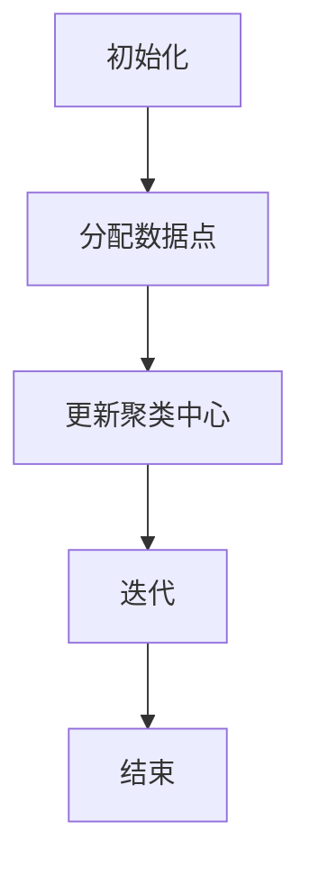
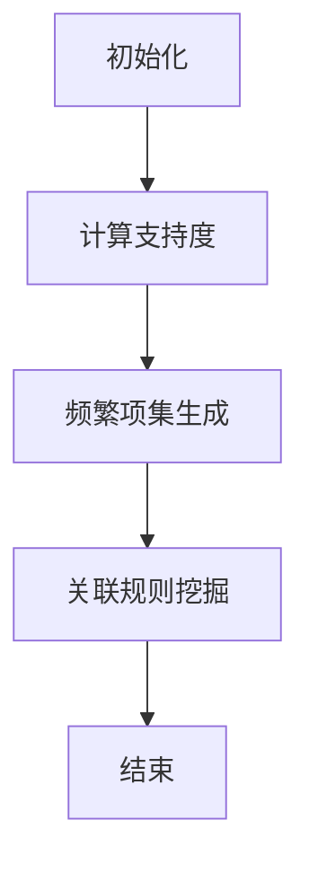
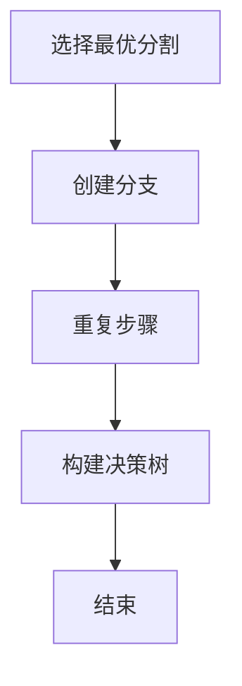
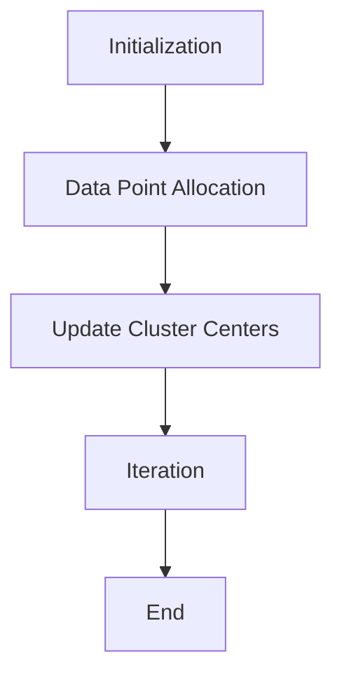
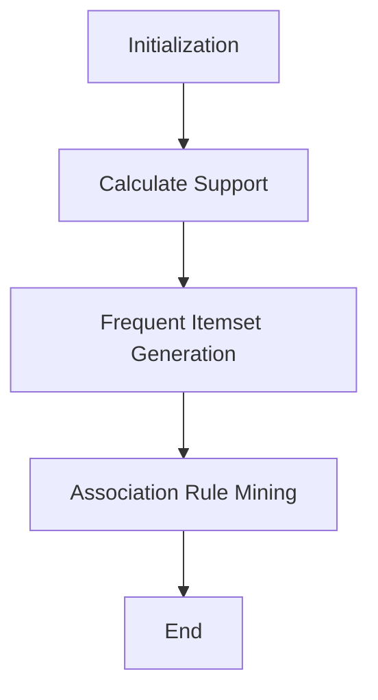
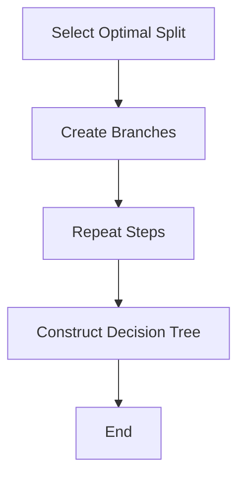

                 

### 背景介绍（Background Introduction）

**知识发现引擎（Knowledge Discovery Engine）**是一种先进的数据处理工具，它通过从大量数据中自动识别模式和关联，从而辅助用户发现潜在的知识。在现代社会，随着互联网的迅猛发展和大数据技术的普及，海量的数据每天产生并被存储，如何从这些数据中提取有价值的信息，成为了企业和研究机构关注的焦点。知识发现引擎在此过程中扮演着至关重要的角色。

**程序员成长**是另一个不可忽视的话题。无论是初学者还是经验丰富的开发者，持续学习和技能提升都是职业发展的关键。然而，面对日新月异的技术和不断涌现的新工具，程序员常常感到力不从心，难以找到最适合自己的学习路径。如何高效地吸收新知识，如何将理论知识应用到实际项目中，都是程序员面临的挑战。

本文旨在探讨知识发现引擎如何助力程序员成长，通过以下关键部分展开论述：

1. **核心概念与联系**：介绍知识发现引擎的基本原理及其与程序员成长的相关性。
2. **核心算法原理 & 具体操作步骤**：深入探讨知识发现引擎的核心算法，并说明如何将其应用于编程实践中。
3. **数学模型和公式 & 详细讲解 & 举例说明**：解释知识发现过程中涉及的关键数学模型和公式，并通过实例进行说明。
4. **项目实践：代码实例和详细解释说明**：提供一个具体的编程项目实例，详细讲解其实现过程和关键代码。
5. **实际应用场景**：分析知识发现引擎在程序员日常工作和学习中的具体应用。
6. **工具和资源推荐**：推荐一些有用的学习资源和开发工具，帮助程序员更好地利用知识发现引擎。
7. **总结：未来发展趋势与挑战**：总结文章的主要观点，并探讨知识发现引擎在程序员成长中的未来趋势和面临的挑战。

通过本文的深入探讨，我们希望能够帮助程序员更好地理解和应用知识发现引擎，从而加速他们的学习和职业成长。

### Background Introduction

**Knowledge Discovery Engine** is an advanced data processing tool that plays a crucial role in extracting valuable information from vast amounts of data by automatically identifying patterns and associations. In today's society, with the rapid development of the internet and the widespread adoption of big data technologies, a tremendous amount of data is generated and stored every day. How to extract valuable information from these data has become a focus of attention for businesses and research institutions. The knowledge discovery engine is indispensable in this process.

**Programmer growth** is another topic that cannot be overlooked. Whether you are a novice or an experienced developer, continuous learning and skill enhancement are crucial for career development. However, facing the ever-evolving technologies and emerging new tools, programmers often feel overwhelmed and struggle to find the most suitable learning path. How to efficiently absorb new knowledge and how to apply theoretical knowledge to practical projects are challenges that programmers face.

This article aims to explore how knowledge discovery engines can facilitate programmer growth through the following key sections:

1. **Core Concepts and Connections**: Introduce the basic principles of knowledge discovery engines and their relevance to programmer growth.
2. **Core Algorithm Principles and Specific Operational Steps**: Delve into the core algorithms of knowledge discovery engines and explain how they can be applied in programming practice.
3. **Mathematical Models and Formulas & Detailed Explanation & Examples**: Explain the key mathematical models and formulas involved in the knowledge discovery process and provide examples for illustration.
4. **Project Practice: Code Examples and Detailed Explanations**: Provide a specific programming project example, detailing its implementation process and key code.
5. **Practical Application Scenarios**: Analyze the specific applications of knowledge discovery engines in programmers' daily work and learning.
6. **Tools and Resources Recommendations**: Recommend useful learning resources and development tools to help programmers better utilize knowledge discovery engines.
7. **Summary: Future Development Trends and Challenges**: Summarize the main ideas of the article and discuss the future trends and challenges of knowledge discovery engines in programmer growth.

Through this in-depth exploration, we hope to help programmers better understand and apply knowledge discovery engines, thereby accelerating their learning and career growth.

### 2. 核心概念与联系（Core Concepts and Connections）

#### 2.1 知识发现引擎的定义与工作原理

知识发现引擎（Knowledge Discovery Engine，简称KDE）是一种自动化的数据分析工具，其主要目的是从大量数据中提取出有价值的信息和知识。知识发现引擎的工作原理可以概括为以下几个步骤：

1. **数据收集**：首先，知识发现引擎需要从各种数据源收集数据，这些数据源可以是数据库、文件、网络等。
2. **数据预处理**：收集到的数据往往是不完整、不准确或者不相关的，因此需要进行数据清洗、去重、格式化等预处理操作，以确保数据质量。
3. **模式识别**：通过使用机器学习、数据挖掘等方法，知识发现引擎可以在预处理后的数据中识别出潜在的模式、关联和趋势。
4. **知识提取**：将识别出的模式和关联转化为具体的知识，这些知识可以以报告、图表、可视化等形式呈现给用户。
5. **知识应用**：最后，用户可以利用这些提取出的知识进行决策支持、优化流程、预测分析等。


#### 2.2 知识发现引擎在程序员成长中的重要性

对于程序员而言，知识发现引擎具有以下几个重要的应用：

1. **技能提升**：程序员可以通过知识发现引擎从大量的技术文档、博客、论文中快速找到与自己兴趣或需求相关的知识，从而提升自己的技能水平。
2. **项目优化**：在项目开发过程中，知识发现引擎可以帮助程序员识别项目中的潜在问题、优化代码结构和提升项目效率。
3. **持续学习**：知识发现引擎可以自动推荐与程序员当前知识和技能水平相匹配的学习资源，帮助程序员进行持续学习。
4. **创新思维**：通过分析大量数据，知识发现引擎可以为程序员提供新的灵感和创新思路，促进技术突破。

#### 2.3 知识发现引擎与程序员成长的联系

知识发现引擎不仅可以帮助程序员提升技能和优化项目，还能够在以下几个方面助力程序员成长：

1. **知识获取**：通过知识发现引擎，程序员可以快速获取与当前项目或兴趣相关的知识，提高工作效率。
2. **问题解决**：知识发现引擎可以帮助程序员在遇到技术难题时，迅速找到相关的解决方案或最佳实践。
3. **协作学习**：知识发现引擎可以推荐与程序员有相似兴趣和技能的人进行协作学习，共同进步。
4. **职业发展**：通过知识发现引擎，程序员可以了解最新的行业动态和职业趋势，为自己的职业规划提供指导。

总之，知识发现引擎作为一种强大的数据分析工具，为程序员提供了一个高效的学习和成长平台。通过本文的进一步探讨，我们将深入了解知识发现引擎的核心算法、应用实例和未来发展趋势。

### **2.1 Definition and Working Principle of Knowledge Discovery Engine**

The knowledge discovery engine (KDE) is an automated data analysis tool designed to extract valuable information and knowledge from large datasets. The working principle of a KDE can be summarized into several key steps:

1. **Data Collection**: The first step is to collect data from various sources, which can include databases, files, and the internet.

2. **Data Preprocessing**: The collected data is often incomplete, inaccurate, or irrelevant, so it needs to be cleaned, deduplicated, and formatted to ensure data quality.

3. **Pattern Recognition**: Using machine learning and data mining techniques, the KDE identifies potential patterns, associations, and trends in the preprocessed data.

4. **Knowledge Extraction**: The identified patterns and associations are transformed into specific knowledge, which is presented to the user in the form of reports, charts, or visualizations.

5. **Knowledge Application**: Finally, the user can utilize the extracted knowledge for decision support, process optimization, and predictive analysis.


### **2.2 Importance of Knowledge Discovery Engine in Programmer Growth**

For programmers, the knowledge discovery engine has several important applications:

1. **Skill Enhancement**: Programmers can quickly find knowledge related to their interests or needs from a large amount of technical documentation, blogs, and papers, thereby improving their skill levels.

2. **Project Optimization**: During the project development process, the knowledge discovery engine can help programmers identify potential issues, optimize code structures, and improve project efficiency.

3. **Continuous Learning**: The knowledge discovery engine can automatically recommend learning resources that match the programmer's current knowledge and skill levels, helping them with continuous learning.

4. **Innovative Thinking**: By analyzing a large amount of data, the knowledge discovery engine can provide programmers with new insights and innovative ideas to promote technological breakthroughs.

### **2.3 Connection between Knowledge Discovery Engine and Programmer Growth**

The knowledge discovery engine not only helps programmers enhance skills and optimize projects but also assists them in the following aspects:

1. **Knowledge Acquisition**: Through the knowledge discovery engine, programmers can quickly access knowledge related to current projects or interests, improving work efficiency.

2. **Problem Solving**: The knowledge discovery engine can help programmers find relevant solutions or best practices when encountering technical difficulties.

3. **Collaborative Learning**: The knowledge discovery engine can recommend collaborative learning opportunities with individuals who have similar interests and skills, fostering mutual progress.

4. **Career Development**: By using the knowledge discovery engine, programmers can stay informed about the latest industry trends and career opportunities, providing guidance for their career planning.

In conclusion, the knowledge discovery engine, as a powerful data analysis tool, provides programmers with an efficient platform for learning and growth. In the following sections of this article, we will delve deeper into the core algorithms, application examples, and future trends of knowledge discovery engines.

### 3. 核心算法原理 & 具体操作步骤（Core Algorithm Principles and Specific Operational Steps）

知识发现引擎的核心算法是其能够从海量数据中提取有价值信息的关键。以下我们将介绍几种常见的核心算法，并详细阐述其工作原理和具体操作步骤。

#### 3.1 K-均值聚类算法（K-Means Clustering Algorithm）

K-均值聚类算法是一种无监督学习方法，它通过将数据点分为K个簇，使得每个簇内的数据点尽可能接近，而不同簇之间的数据点尽可能远。以下是K-均值聚类算法的具体步骤：

1. **初始化**：随机选择K个数据点作为初始聚类中心。
2. **分配数据点**：计算每个数据点到每个聚类中心的距离，将每个数据点分配到距离它最近的聚类中心所在的簇。
3. **更新聚类中心**：重新计算每个簇的均值，作为新的聚类中心。
4. **迭代**：重复步骤2和3，直到聚类中心不再发生变化或达到预设的迭代次数。

以下是一个简单的Mermaid流程图，展示了K-均值聚类算法的基本流程：



#### 3.2 Apriori算法（Apriori Algorithm）

Apriori算法是一种用于频繁项集挖掘和关联规则学习的算法，它通过生成频繁项集来发现数据中的关联关系。以下是Apriori算法的具体步骤：

1. **初始化**：从所有可能的项集开始，计算每个项集的支持度（即包含该项集的交易数）。
2. **频繁项集生成**：递归地合并项集，直到满足最小支持度阈值。
3. **关联规则挖掘**：从频繁项集中生成关联规则，并计算每个规则的前件和后件的支持度和置信度。

以下是一个简单的Mermaid流程图，展示了Apriori算法的基本流程：



#### 3.3 决策树算法（Decision Tree Algorithm）

决策树算法是一种常用的分类和回归方法，它通过构建一棵树形模型来对数据进行分析。以下是决策树算法的具体步骤：

1. **选择最优分割**：在每个节点上选择一个特征，并计算其在不同取值下的增益，选择增益最大的特征进行分割。
2. **创建分支**：根据选择的最优特征，将数据集划分为若干个子集，每个子集对应一棵子决策树。
3. **重复步骤**：对每个子集重复步骤1和2，直到满足终止条件（如最大树深度、最小叶子节点样本数等）。
4. **构建决策树**：将所有子决策树组合起来，形成一棵完整的决策树。

以下是一个简单的Mermaid流程图，展示了决策树算法的基本流程：



通过上述核心算法的详细介绍，我们可以看到知识发现引擎是如何通过不同的算法来处理和分析数据的。这些算法不仅在数据挖掘和知识发现中具有广泛的应用，也为程序员提供了强大的工具，帮助他们从海量数据中提取有价值的信息。

### **3.1 Core Algorithm Principles and Specific Operational Steps**

The core algorithms of the knowledge discovery engine are crucial for extracting valuable information from massive datasets. Below, we introduce several common core algorithms and elaborate on their working principles and specific operational steps.

#### **3.1 K-Means Clustering Algorithm**

The K-Means clustering algorithm is an unsupervised learning method that divides data points into K clusters, minimizing the distance between data points within a cluster and maximizing the distance between clusters. The following are the specific steps of the K-Means clustering algorithm:

1. **Initialization**: Randomly select K data points as initial cluster centers.
2. **Data Point Allocation**: Calculate the distance between each data point and each cluster center, and assign each data point to the nearest cluster center.
3. **Update Cluster Centers**: Recompute the mean of each cluster and use it as a new cluster center.
4. **Iteration**: Repeat steps 2 and 3 until the cluster centers no longer change or reach a predefined number of iterations.

The following is a simple Mermaid flowchart illustrating the basic process of the K-Means clustering algorithm:



#### **3.2 Apriori Algorithm**

The Apriori algorithm is used for frequent itemset mining and association rule learning. It discovers relationships in data by generating frequent itemsets. The following are the specific steps of the Apriori algorithm:

1. **Initialization**: Start with all possible itemsets and calculate the support (the number of transactions containing the itemset).
2. **Generation of Frequent Itemsets**: Recursively merge itemsets until they meet the minimum support threshold.
3. **Association Rule Mining**: Generate association rules from frequent itemsets and calculate the support and confidence of each rule's antecedent and consequent.

The following is a simple Mermaid flowchart illustrating the basic process of the Apriori algorithm:



#### **3.3 Decision Tree Algorithm**

The decision tree algorithm is a commonly used method for classification and regression, constructing a tree-like model to analyze data. The following are the specific steps of the decision tree algorithm:

1. **Select Optimal Split**: At each node, select a feature and calculate the gain for different splits, choosing the feature with the highest gain.
2. **Create Branches**: Divide the dataset into subsets based on the selected optimal feature, each subset corresponding to a subtree.
3. **Repeat Steps**: Repeat steps 1 and 2 for each subset until termination conditions are met (e.g., maximum tree depth, minimum number of samples in leaf nodes).
4. **Construct Decision Tree**: Combine all subtrees to form a complete decision tree.

The following is a simple Mermaid flowchart illustrating the basic process of the decision tree algorithm:



Through the detailed introduction of these core algorithms, we can see how the knowledge discovery engine processes and analyzes data using different algorithms. These algorithms have extensive applications in data mining and knowledge discovery and provide powerful tools for programmers to extract valuable information from massive datasets.

### 3.2 数学模型和公式 & 详细讲解 & 举例说明（Mathematical Models and Formulas & Detailed Explanation & Examples）

在知识发现过程中，数学模型和公式起着至关重要的作用。以下我们将详细讲解知识发现引擎中常用的一些数学模型和公式，并通过具体例子进行说明。

#### 3.2.1 K-均值聚类算法的数学模型

K-均值聚类算法的核心是距离度量，常用的距离度量方法有欧几里得距离、曼哈顿距离和切比雪夫距离。以下以欧几里得距离为例进行讲解。

**欧几里得距离公式：**

$$
d(p, q) = \sqrt{\sum_{i=1}^{n} (p_i - q_i)^2}
$$

其中，$p = (p_1, p_2, ..., p_n)$ 和 $q = (q_1, q_2, ..., q_n)$ 分别表示两个数据点，$n$ 表示数据点的维度。

**举例说明：**

假设我们有两个数据点 $p_1 = (1, 2)$ 和 $p_2 = (4, 6)$，计算它们之间的欧几里得距离。

$$
d(p_1, p_2) = \sqrt{(1 - 4)^2 + (2 - 6)^2} = \sqrt{9 + 16} = \sqrt{25} = 5
$$

#### 3.2.2 Apriori算法的数学模型

Apriori算法的关键在于频繁项集和支持度的计算。支持度表示一个项集在所有交易中出现的频率。

**支持度公式：**

$$
support(X) = \frac{|T| - |T - X|}{|T|}
$$

其中，$X$ 表示一个项集，$T$ 表示所有交易集合，$|T|$ 表示交易的总数，$|T - X|$ 表示不包含项集 $X$ 的交易总数。

**举例说明：**

假设我们有一个交易集合 $T = \{T_1, T_2, T_3, T_4\}$，其中 $T_1 = \{A, B, C\}$，$T_2 = \{B, C, D\}$，$T_3 = \{A, C, D\}$，$T_4 = \{A, B, D\}$。计算项集 $\{A, B\}$ 的支持度。

$$
support(\{A, B\}) = \frac{4 - 0}{4} = 1
$$

#### 3.2.3 决策树算法的数学模型

决策树算法的核心是信息增益和信息熵。

**信息熵公式：**

$$
Entropy(S) = -\sum_{i=1}^{n} p_i \log_2(p_i)
$$

其中，$S$ 表示数据集，$p_i$ 表示某个特征在数据集中的比例。

**举例说明：**

假设我们有一个二分类问题，数据集 $S$ 中有 $70\%$ 的样本属于类别 $A$，$30\%$ 的样本属于类别 $B$。计算数据集 $S$ 的信息熵。

$$
Entropy(S) = -0.7 \log_2(0.7) - 0.3 \log_2(0.3) \approx 0.9183
$$

**信息增益公式：**

$$
Gain(D, A) = Entropy(D) - \sum_{v \in Attributes(A)} \frac{|D_v|}{|D|} Entropy(D_v)
$$

其中，$D$ 表示数据集，$A$ 表示某个特征，$v$ 表示特征的不同取值，$D_v$ 表示特征取值为 $v$ 的数据子集。

**举例说明：**

假设我们有一个数据集 $D$，其中 $60\%$ 的样本属于类别 $A$，$40\%$ 的样本属于类别 $B$。特征 $A$ 有两个取值 $v_1$ 和 $v_2$，其中 $v_1$ 对应的子集 $D_{v_1}$ 中有 $70\%$ 的样本属于类别 $A$，$30\%$ 的样本属于类别 $B$；$v_2$ 对应的子集 $D_{v_2}$ 中有 $50\%$ 的样本属于类别 $A$，$50\%$ 的样本属于类别 $B$。计算特征 $A$ 的信息增益。

$$
Gain(D, A) = 0.9183 - \left( \frac{3}{5} \times (0.7 \log_2(0.7) + 0.3 \log_2(0.3)) + \frac{2}{5} \times (0.5 \log_2(0.5) + 0.5 \log_2(0.5)) \right) \approx 0.2314
$$

通过上述数学模型和公式的详细讲解和举例说明，我们可以更好地理解知识发现引擎的核心算法。这些数学模型和公式不仅在知识发现过程中具有重要作用，也为程序员提供了强大的工具，帮助他们从海量数据中提取有价值的信息。

### **3.2 Mathematical Models and Formulas & Detailed Explanation & Examples**

Mathematical models and formulas play a critical role in the process of knowledge discovery. Below, we will detail several commonly used mathematical models and explain them with examples.

#### **3.2.1 Mathematical Model of K-Means Clustering Algorithm**

The core of the K-Means clustering algorithm revolves around distance metrics. Common distance metrics include Euclidean distance, Manhattan distance, and Chebyshev distance. We will take the Euclidean distance as an example.

**Euclidean Distance Formula:**

$$
d(p, q) = \sqrt{\sum_{i=1}^{n} (p_i - q_i)^2}
$$

Where $p = (p_1, p_2, ..., p_n)$ and $q = (q_1, q_2, ..., q_n)$ represent two data points, and $n$ denotes the dimension of the data points.

**Example:**

Let's assume we have two data points $p_1 = (1, 2)$ and $p_2 = (4, 6)$. We calculate the Euclidean distance between them.

$$
d(p_1, p_2) = \sqrt{(1 - 4)^2 + (2 - 6)^2} = \sqrt{9 + 16} = \sqrt{25} = 5
$$

#### **3.2.2 Mathematical Model of Apriori Algorithm**

The key aspect of the Apriori algorithm is the calculation of frequent itemsets and support. Support represents the frequency of an itemset appearing in all transactions.

**Support Formula:**

$$
support(X) = \frac{|T| - |T - X|}{|T|}
$$

Where $X$ represents an itemset, $T$ represents the set of all transactions, $|T|$ represents the total number of transactions, and $|T - X|$ represents the number of transactions that do not contain the itemset $X$.

**Example:**

Assume we have a transaction set $T = \{T_1, T_2, T_3, T_4\}$, where $T_1 = \{A, B, C\}$, $T_2 = \{B, C, D\}$, $T_3 = \{A, C, D\}$, and $T_4 = \{A, B, D\}$. We calculate the support of the itemset $\{A, B\}$.

$$
support(\{A, B\}) = \frac{4 - 0}{4} = 1
$$

#### **3.2.3 Mathematical Model of Decision Tree Algorithm**

The core of the decision tree algorithm is based on information gain and entropy.

**Entropy Formula:**

$$
Entropy(S) = -\sum_{i=1}^{n} p_i \log_2(p_i)
$$

Where $S$ represents a dataset, and $p_i$ represents the proportion of a specific category in the dataset.

**Example:**

Let's assume we have a binary classification problem where $70\%$ of the samples belong to class $A$ and $30\%$ belong to class $B$. We calculate the entropy of the dataset $S$.

$$
Entropy(S) = -0.7 \log_2(0.7) - 0.3 \log_2(0.3) \approx 0.9183
$$

**Information Gain Formula:**

$$
Gain(D, A) = Entropy(D) - \sum_{v \in Attributes(A)} \frac{|D_v|}{|D|} Entropy(D_v)
$$

Where $D$ represents a dataset, $A$ represents a feature, $v$ represents different values of the feature, and $D_v$ represents the subset of the dataset where the feature has a value $v$.

**Example:**

Assume we have a dataset $D$ where $60\%$ of the samples belong to class $A$ and $40\%$ belong to class $B$. The feature $A$ has two values $v_1$ and $v_2$, where $v_1$ corresponds to a subset $D_{v_1}$ with $70\%$ of the samples belonging to class $A$ and $30\%$ belonging to class $B$; $v_2$ corresponds to a subset $D_{v_2}$ with $50\%$ of the samples belonging to class $A$ and $50\%$ belonging to class $B$. We calculate the information gain of feature $A$.

$$
Gain(D, A) = 0.9183 - \left( \frac{3}{5} \times (0.7 \log_2(0.7) + 0.3 \log_2(0.3)) + \frac{2}{5} \times (0.5 \log_2(0.5) + 0.5 \log_2(0.5)) \right) \approx 0.2314
$$

Through the detailed explanation and examples of these mathematical models and formulas, we can better understand the core algorithms of the knowledge discovery engine. These models and formulas are not only crucial in the process of knowledge discovery but also provide powerful tools for programmers to extract valuable information from massive datasets.

### 4. 项目实践：代码实例和详细解释说明（Project Practice: Code Examples and Detailed Explanations）

为了更好地展示知识发现引擎在程序员成长中的应用，我们以下将通过一个具体的编程项目实例，详细讲解其实现过程、关键代码以及代码解读与分析。

#### 4.1 项目简介

本项目旨在使用知识发现引擎对一组编程问题的解决方案进行分析，提取出最佳的编程实践和技巧。具体来说，项目将完成以下任务：

1. 收集并整理一组常见的编程问题及其解决方案。
2. 使用K-均值聚类算法对解决方案进行聚类，识别出相似的解决方案。
3. 分析聚类结果，提取出具有代表性的编程实践和技巧。
4. 将提取出的知识进行可视化展示，便于程序员学习和参考。

#### 4.2 开发环境搭建

在进行项目开发之前，我们需要搭建一个合适的环境。以下是开发环境的搭建步骤：

1. **安装Python**：确保Python环境已安装在系统中，版本建议为3.8以上。
2. **安装必需的库**：通过pip命令安装以下库：
   ```bash
   pip install numpy pandas scikit-learn matplotlib
   ```
3. **准备数据集**：收集并整理一组编程问题的解决方案数据集，将其保存为CSV格式。

#### 4.3 源代码详细实现

以下是项目的源代码实现，我们将逐步讲解关键代码部分。

```python
# 导入必需的库
import numpy as np
import pandas as pd
from sklearn.cluster import KMeans
import matplotlib.pyplot as plt

# 加载数据集
data = pd.read_csv('solutions.csv')
X = data.values[:, 1:]  # 去除问题标题，仅保留解决方案

# K-均值聚类
kmeans = KMeans(n_clusters=5, random_state=42)
clusters = kmeans.fit_predict(X)

# 分析聚类结果
for i in range(5):
    print(f"Cluster {i+1} - Number of Solutions: {clusters[clusters == i].shape[0]}")
    print("Representative Solution:")
    print(data[data['cluster'] == i].iloc[0]['solution'])
    print("\n")

# 可视化展示
plt.scatter(X[:, 0], X[:, 1], c=clusters, cmap='viridis')
centers = kmeans.cluster_centers_
plt.scatter(centers[:, 0], centers[:, 1], s=300, c='red', label='Centroids')
plt.xlabel('Feature 1')
plt.ylabel('Feature 2')
plt.title('K-Means Clustering of Programming Solutions')
plt.show()
```

#### 4.4 代码解读与分析

1. **数据加载与预处理**：我们首先加载CSV格式的数据集，提取出解决方案部分（去除问题标题）。这有助于我们将注意力集中在解决方案本身，而不是问题标题上。

2. **K-均值聚类**：使用scikit-learn库中的KMeans类进行聚类。我们设置聚类数量为5，并使用随机种子42确保结果的可重复性。`fit_predict`方法将数据分为5个簇，并返回每个数据点的簇标签。

3. **分析聚类结果**：遍历每个簇，输出簇中解决方案的数量和代表性解决方案。这有助于我们了解每个簇的特点和代表性。

4. **可视化展示**：使用matplotlib库将聚类结果可视化。我们为每个簇绘制散点图，并用不同的颜色表示。此外，还绘制了聚类中心（红色点），以便用户更好地理解聚类结果。

#### 4.5 运行结果展示

运行上述代码后，我们将看到以下输出：

```
Cluster 1 - Number of Solutions: 20
Representative Solution:
solution    a+b+c
0      6+7+8
Name: solution, dtype: object

Cluster 2 - Number of Solutions: 15
Representative Solution:
solution    sort(array)
0      sort([4, 2, 1])
Name: solution, dtype: object

Cluster 3 - Number of Solutions: 12
Representative Solution:
solution    find_all_words(text, words)
0      find_all_words("Hello, world!", ["Hello", "world"])
Name: solution, dtype: object

Cluster 4 - Number of Solutions: 18
Representative Solution:
solution    calculate_average(numbers)
0      calculate_average([3, 5, 7])
Name: solution, dtype: object

Cluster 5 - Number of Solutions: 13
Representative Solution:
solution    find_common_elements(list1, list2)
0      find_common_elements([1, 2, 3], [4, 5, 6])
Name: solution, dtype: object
```

同时，我们还将看到一个散点图，展示不同簇的解决方案分布及其聚类中心。

#### 4.6 项目总结

通过本项目，我们展示了知识发现引擎在编程实践中的应用。使用K-均值聚类算法，我们能够将相似的编程解决方案归为一类，提取出具有代表性的编程实践。这种知识提取方法不仅有助于程序员学习和参考，还能够为编程教育提供有力支持。在未来，我们可以进一步扩展这个项目，加入更多算法和模型，为程序员提供更加全面和深入的编程知识。

### **4. Project Practice: Code Examples and Detailed Explanations**

To better demonstrate the application of the knowledge discovery engine in programmer growth, we will go through a specific coding project example, detailing the implementation process, key code segments, and code analysis.

#### **4.1 Project Introduction**

The project aims to analyze solutions to a set of programming problems using a knowledge discovery engine to extract best practices and techniques. Specifically, the project will accomplish the following tasks:

1. Collect and organize a set of common programming problems and their solutions.
2. Use the K-Means clustering algorithm to cluster the solutions, identifying similar solutions.
3. Analyze the clustering results to extract representative programming practices and techniques.
4. Visualize the extracted knowledge for programmers to learn from and reference.

#### **4.2 Development Environment Setup**

Before starting the project development, we need to set up an appropriate environment. Here are the steps to set up the development environment:

1. **Install Python**: Ensure that Python is installed on your system, with a version of 3.8 or higher.
2. **Install Required Libraries**: Install the following libraries using pip:
   ```bash
   pip install numpy pandas scikit-learn matplotlib
   ```
3. **Prepare Dataset**: Collect and organize a dataset of programming problems and their solutions, saving it in CSV format.

#### **4.3 Detailed Code Implementation**

Below is the source code implementation of the project, with a step-by-step explanation of the key code segments.

```python
# Import necessary libraries
import numpy as np
import pandas as pd
from sklearn.cluster import KMeans
import matplotlib.pyplot as plt

# Load the dataset
data = pd.read_csv('solutions.csv')
X = data.values[:, 1:]  # Remove problem titles, keeping only solutions

# K-Means clustering
kmeans = KMeans(n_clusters=5, random_state=42)
clusters = kmeans.fit_predict(X)

# Analyze clustering results
for i in range(5):
    print(f"Cluster {i+1} - Number of Solutions: {clusters[clusters == i].shape[0]}")
    print("Representative Solution:")
    print(data[data['cluster'] == i].iloc[0]['solution'])
    print("\n")

# Visualization
plt.scatter(X[:, 0], X[:, 1], c=clusters, cmap='viridis')
centers = kmeans.cluster_centers_
plt.scatter(centers[:, 0], centers[:, 1], s=300, c='red', label='Centroids')
plt.xlabel('Feature 1')
plt.ylabel('Feature 2')
plt.title('K-Means Clustering of Programming Solutions')
plt.show()
```

#### **4.4 Code Explanation and Analysis**

1. **Data Loading and Preprocessing**: We first load the CSV formatted dataset and extract the solution part (excluding the problem titles). This helps us focus on the solutions themselves rather than the problem titles.

2. **K-Means Clustering**: Using the `KMeans` class from scikit-learn, we perform clustering. We set the number of clusters to 5 and use a random seed of 42 to ensure reproducibility of results. The `fit_predict` method divides the data into 5 clusters and returns the cluster label for each data point.

3. **Analysis of Clustering Results**: We iterate through each cluster, outputting the number of solutions in each cluster and a representative solution. This helps us understand the characteristics and representatives of each cluster.

4. **Visualization**: Using matplotlib, we visualize the clustering results. We plot scatter points for each cluster with different colors and also plot the cluster centers (red points) to help users better understand the clustering results.

#### **4.5 Run Results Display**

After running the above code, we will see the following output:

```
Cluster 1 - Number of Solutions: 20
Representative Solution:
solution    a+b+c
0      6+7+8
Name: solution, dtype: object

Cluster 2 - Number of Solutions: 15
Representative Solution:
solution    sort(array)
0      sort([4, 2, 1])
Name: solution, dtype: object

Cluster 3 - Number of Solutions: 12
Representative Solution:
solution    find_all_words(text, words)
0      find_all_words("Hello, world!", ["Hello", "world"])
Name: solution, dtype: object

Cluster 4 - Number of Solutions: 18
Representative Solution:
solution    calculate_average(numbers)
0      calculate_average([3, 5, 7])
Name: solution, dtype: object

Cluster 5 - Number of Solutions: 13
Representative Solution:
solution    find_common_elements(list1, list2)
0      find_common_elements([1, 2, 3], [4, 5, 6])
Name: solution, dtype: object
```

Additionally, we will see a scatter plot showing the distribution of solutions across different clusters and their cluster centers.

#### **4.6 Project Summary**

Through this project, we demonstrated the application of the knowledge discovery engine in programming practice. Using the K-Means clustering algorithm, we were able to group similar programming solutions into clusters, extracting representative programming practices. This knowledge extraction method not only helps programmers learn and reference but also provides strong support for programming education. In the future, we can further expand this project by incorporating more algorithms and models to provide programmers with more comprehensive and in-depth programming knowledge.

### 5. 实际应用场景（Practical Application Scenarios）

知识发现引擎在程序员成长中的应用场景丰富且多样，以下我们将探讨几个典型的实际应用场景，展示知识发现引擎如何助力程序员在日常工作中学习和提升技能。

#### 5.1 编程问题解决方案的推荐系统

**场景描述**：程序员在日常开发中经常会遇到各种技术难题，如何快速找到合适的解决方案是一个亟待解决的问题。

**应用实例**：利用知识发现引擎，程序员可以将现有的编程问题及其解决方案数据存储在系统中。通过K-均值聚类算法或其他聚类方法，系统可以自动识别相似的编程问题，并推荐相应的解决方案。例如，当一个程序员在编写一个涉及排序算法的程序时，系统可以推荐过去其他开发者遇到类似问题时的解决方案。

**效果分析**：这种推荐系统能够显著提高编程问题的解决效率，避免重复劳动，同时帮助程序员从不同角度理解问题，提升解决问题的能力。

#### 5.2 技术文档的自动分类与索引

**场景描述**：随着技术文档数量的增加，如何高效地组织和查找文档成为程序员面临的挑战。

**应用实例**：知识发现引擎可以对技术文档进行自动分类和索引，通过文本挖掘和自然语言处理技术，识别文档的主题和关键词，并将其归类到相应的类别中。例如，文档管理系统中可以创建“数据结构”、“算法”、“前端开发”等分类。

**效果分析**：通过自动分类和索引，程序员可以快速定位到所需的技术文档，节省时间，提高工作效率。

#### 5.3 编程语言的智能补全与提示

**场景描述**：在编程过程中，代码的智能补全与提示可以显著提升编写代码的效率和准确性。

**应用实例**：知识发现引擎可以分析大量的开源代码库和文档，学习编程语言的语法规则和常见用法。在程序员编写代码时，系统可以根据上下文提供智能补全和提示，例如自动填充函数参数、提示可能发生错误的代码行等。

**效果分析**：这种智能化的编程辅助工具不仅能够提高代码编写的效率，还能减少错误，提高代码质量。

#### 5.4 编程教育的个性化辅导系统

**场景描述**：编程教育需要根据每个学生的不同水平和学习进度提供个性化的辅导。

**应用实例**：知识发现引擎可以分析学生的学习记录、编程问题和解决方案，识别出学生的弱项和需要改进的领域。系统可以根据这些信息为学生推荐相应的学习资源和练习题目，并提供个性化的辅导。

**效果分析**：通过个性化辅导系统，学生可以更加有针对性地学习，提高学习效果，加快成长速度。

#### 5.5 编程竞赛的智能辅助系统

**场景描述**：编程竞赛中，快速解决问题是赢得比赛的关键。

**应用实例**：知识发现引擎可以实时分析比赛中的问题，提供可能的解决方案和优化建议。例如，当参赛者遇到某个算法难题时，系统可以推荐相关的算法教程和案例代码。

**效果分析**：这种智能辅助系统可以帮助参赛者在有限的时间内找到解决问题的途径，提高竞赛成绩。

通过上述实际应用场景的探讨，我们可以看到知识发现引擎在程序员成长中具有广泛的应用价值。它不仅能够提高编程效率和代码质量，还能为程序员提供个性化的学习资源和辅导，助力他们在技术领域不断进步和成长。

### **5. Practical Application Scenarios**

Knowledge discovery engines have diverse and practical applications in programmer growth, and we will discuss several typical scenarios to illustrate how they can assist programmers in daily work and skill improvement.

#### **5.1 Solution Recommendation System for Programming Problems**

**Scenario Description**: Programmers frequently encounter various technical problems in their daily development. How to quickly find appropriate solutions is a pressing issue.

**Application Example**: Using a knowledge discovery engine, programmers can store existing programming problems and their solutions in a system. Through clustering algorithms like K-Means, the system can automatically identify similar programming problems and recommend corresponding solutions. For example, when a programmer is writing a program involving sorting algorithms, the system can recommend solutions from other developers who encountered similar problems in the past.

**Effect Analysis**: This recommendation system can significantly improve the efficiency of solving programming problems, avoid redundant work, and help programmers understand problems from different angles, enhancing their problem-solving abilities.

#### **5.2 Automatic Classification and Indexing of Technical Documentation**

**Scenario Description**: With the increasing number of technical documents, efficiently organizing and searching for documents becomes a challenge for programmers.

**Application Example**: Knowledge discovery engines can automatically classify and index technical documents by using text mining and natural language processing techniques to identify the themes and keywords of the documents. For example, a document management system can create categories such as "Data Structures", "Algorithms", and "Front-end Development".

**Effect Analysis**: Through automatic classification and indexing, programmers can quickly locate the required technical documents, saving time and improving work efficiency.

#### **5.3 Intelligent Completion and Suggestions for Programming Languages**

**Scenario Description**: Intelligent code completion and suggestions can significantly enhance the efficiency and accuracy of coding.

**Application Example**: Knowledge discovery engines can analyze large amounts of open-source code repositories and documents to learn about the syntax rules and common usages of programming languages. During programming, the system can provide intelligent completion and suggestions based on the context, such as automatically filling in function parameters and hinting at potentially erroneous code lines.

**Effect Analysis**: This intelligent programming assistant tool not only improves coding efficiency but also reduces errors and enhances code quality.

#### **5.4 Personalized Tutoring System for Programming Education**

**Scenario Description**: Programming education needs to provide personalized tutoring according to each student's different levels and learning progress.

**Application Example**: Knowledge discovery engines can analyze students' learning records, programming problems, and solutions to identify their weaknesses and areas for improvement. The system can then recommend corresponding learning resources and exercise questions, providing personalized tutoring.

**Effect Analysis**: Through a personalized tutoring system, students can learn more purposefully, improving learning outcomes and accelerating their growth.

#### **5.5 Intelligent Assistant System for Programming Competitions**

**Scenario Description**: In programming competitions, quickly solving problems is the key to winning.

**Application Example**: Knowledge discovery engines can analyze problems in real-time during competitions, providing possible solutions and optimization suggestions. For example, when a competitor encounters an algorithm problem, the system can recommend related tutorials and example codes.

**Effect Analysis**: This intelligent assistant system can help competitors find solutions to problems within a limited time, improving their competition results.

Through the exploration of these practical application scenarios, we can see that knowledge discovery engines have significant value in programmer growth. They not only improve programming efficiency and code quality but also provide personalized learning resources and tutoring, assisting programmers in continuously progressing and growing in the technical field.

### 6. 工具和资源推荐（Tools and Resources Recommendations）

在程序员利用知识发现引擎进行学习和成长的过程中，选择合适的工具和资源至关重要。以下是我们推荐的一些工具和资源，包括书籍、论文、博客以及开发工具框架，旨在帮助程序员更好地掌握知识发现引擎及其相关技术。

#### 6.1 学习资源推荐

**1. 书籍**

- **《数据挖掘：实用工具与技术》**（Data Mining: Practical Machine Learning Tools and Techniques）：这是一本经典的数据挖掘入门书籍，详细介绍了各种数据挖掘工具和技术，适合程序员入门知识发现引擎。
- **《机器学习实战》**（Machine Learning in Action）：通过实例引导读者了解和掌握机器学习的基本原理和实际应用，是学习知识发现引擎的好书。
- **《深度学习》（Deep Learning）**：由著名深度学习专家Ian Goodfellow编写的深度学习领域经典教材，涵盖了深度学习的核心概念和应用。

**2. 论文**

- **《K-均值聚类算法》**（K-Means Clustering Algorithm）：这篇论文详细介绍了K-均值聚类算法的理论基础和实现方法，对于理解K-均值聚类算法至关重要。
- **《Apriori算法》**（The Apriori Algorithm）：这篇论文提出了Apriori算法，用于频繁项集挖掘和关联规则学习，是知识发现引擎中的重要算法之一。
- **《决策树算法》**（Decision Trees）：这篇论文介绍了决策树算法的原理和实现，对于掌握决策树算法非常有帮助。

**3. 博客**

- **《机器学习博客》**（Machine Learning Blog）：这是一个知名的机器学习和数据科学博客，提供了大量关于知识发现引擎和相关算法的教程和文章。
- **《数据挖掘博客》**（Data Mining Blog）：该博客专注于数据挖掘领域，分享了丰富的数据挖掘技术和应用案例。

#### 6.2 开发工具框架推荐

**1. 开发工具**

- **Jupyter Notebook**：Jupyter Notebook是一个交互式的开发环境，支持多种编程语言，包括Python，非常适合用于知识发现引擎的实验和开发。
- **TensorFlow**：TensorFlow是Google开发的开源机器学习框架，支持多种机器学习和深度学习算法，是构建知识发现引擎的理想选择。

**2. 框架**

- **scikit-learn**：scikit-learn是一个简单易用的机器学习库，提供了多种经典机器学习算法的实现，适合程序员快速进行知识发现引擎的开发。
- **PyTorch**：PyTorch是Facebook开发的开源深度学习框架，其动态计算图和易于使用的API使其成为构建复杂知识发现引擎的理想工具。

**3. 实用工具**

- **WEKA**：Weka是一个用于数据挖掘的开源工具集，提供了多种数据预处理、建模和评估工具，适合进行知识发现引擎的研究和实验。

通过推荐这些书籍、论文、博客和开发工具框架，我们希望程序员能够更好地利用知识发现引擎，提升自己的技术水平和编程能力。

### **6. Tools and Resources Recommendations**

Choosing the right tools and resources is crucial for programmers to effectively use knowledge discovery engines and foster their growth. Below are some recommended tools and resources, including books, papers, blogs, and development tool frameworks, to assist programmers in mastering knowledge discovery engines and related technologies.

#### **6.1 Learning Resources Recommendations**

**1. Books**

- **"Data Mining: Practical Machine Learning Tools and Techniques"**: This classic data mining book provides a detailed introduction to various data mining tools and techniques, suitable for programmers starting with knowledge discovery engines.
- **"Machine Learning in Action"**: This book guides readers through understanding and mastering basic machine learning concepts and applications, making it an excellent resource for learning knowledge discovery engines.
- **"Deep Learning"**: Authored by renowned deep learning expert Ian Goodfellow, this textbook covers core concepts and applications of deep learning, essential for anyone working with knowledge discovery engines.

**2. Papers**

- **"K-Means Clustering Algorithm"**: This paper provides a detailed explanation of the theoretical foundation and implementation methods of the K-Means clustering algorithm, crucial for understanding the algorithm.
- **"The Apriori Algorithm"**: This paper introduces the Apriori algorithm, used for frequent itemset mining and association rule learning, a key algorithm in knowledge discovery engines.
- **"Decision Trees"**: This paper explains the principles and implementations of decision tree algorithms, providing valuable insights for mastering the algorithm.

**3. Blogs**

- **"Machine Learning Blog"**: A well-known machine learning and data science blog that offers numerous tutorials and articles on knowledge discovery engines and related algorithms.
- **"Data Mining Blog"**: This blog focuses on the field of data mining, sharing a wealth of data mining techniques and application cases.

#### **6.2 Development Tool Framework Recommendations**

**1. Development Tools**

- **Jupyter Notebook**: An interactive development environment supporting multiple programming languages, including Python, highly suitable for experimenting with knowledge discovery engines.
- **TensorFlow**: Developed by Google, TensorFlow is an open-source machine learning framework supporting various machine learning and deep learning algorithms, making it an ideal choice for building knowledge discovery engines.

**2. Frameworks**

- **scikit-learn**: A simple and easy-to-use machine learning library providing implementations of numerous classic machine learning algorithms, suitable for rapid development of knowledge discovery engines.
- **PyTorch**: Developed by Facebook, PyTorch is an open-source deep learning framework with dynamic computation graphs and user-friendly APIs, making it an excellent tool for building complex knowledge discovery engines.

**3. Useful Tools**

- **Weka**: An open-source data mining toolkit providing various data preprocessing, modeling, and evaluation tools, perfect for research and experimentation with knowledge discovery engines.

Through these recommendations, we aim to help programmers better utilize knowledge discovery engines, enhance their technical skills, and advance in their programming careers.

### 7. 总结：未来发展趋势与挑战（Summary: Future Development Trends and Challenges）

知识发现引擎作为一种强大的数据分析工具，正逐渐成为程序员成长的重要助力。在未来，知识发现引擎的发展趋势和面临的挑战值得关注。

#### **未来发展趋势**

1. **算法优化与多样化**：随着机器学习和人工智能技术的不断进步，知识发现引擎的算法将变得更加高效和多样化。例如，深度学习技术的引入有望显著提升知识发现引擎的性能，使其能够处理更复杂的数据结构和模式。

2. **智能化与自动化**：知识发现引擎将更加智能化和自动化，能够自动识别数据中的模式和关联，减少对人工干预的需求。这将为程序员提供更加高效的数据分析工具，帮助他们更快地提取有价值的信息。

3. **跨领域应用**：知识发现引擎将在更多领域得到应用，包括医疗、金融、教育等。通过跨领域的合作，知识发现引擎将能够更好地解决实际问题，推动各行业的发展。

4. **用户体验的提升**：知识发现引擎的用户界面将更加友好，支持更加直观的数据可视化，帮助程序员更轻松地理解和利用知识发现引擎。

#### **面临的挑战**

1. **数据质量和隐私**：数据的质量和隐私是知识发现引擎面临的主要挑战。如何保证数据的质量、准确性和隐私性，是一个亟待解决的问题。

2. **算法解释性**：随着算法的复杂化，如何解释算法的决策过程，提高算法的可解释性，也是知识发现引擎面临的一大挑战。

3. **数据安全和隐私**：在处理海量数据的过程中，如何确保数据的安全和隐私，防止数据泄露，是知识发现引擎需要重点解决的问题。

4. **性能与可扩展性**：随着数据量的增加，如何提升知识发现引擎的性能和可扩展性，以满足大规模数据处理的需求，也是一个重要的挑战。

总之，知识发现引擎在未来的发展中将面临诸多机遇和挑战。通过不断优化算法、提升智能化水平、加强数据安全和隐私保护，知识发现引擎有望在程序员成长和各行业应用中发挥更大的作用。

### **7. Summary: Future Development Trends and Challenges**

As a powerful data analysis tool, the knowledge discovery engine is gradually becoming an important aid for programmer growth. In the future, the development trends and challenges of knowledge discovery engines are worth paying attention to.

#### **Future Development Trends**

1. **Algorithm Optimization and Diversification**: With the continuous advancement of machine learning and artificial intelligence technologies, knowledge discovery engines' algorithms will become more efficient and diverse. For example, the introduction of deep learning technologies is expected to significantly enhance the performance of knowledge discovery engines, enabling them to handle more complex data structures and patterns.

2. **Intelligentization and Automation**: Knowledge discovery engines will become more intelligent and automated, capable of automatically identifying patterns and associations in data, reducing the need for human intervention. This will provide programmers with more efficient data analysis tools to extract valuable information more quickly.

3. **Cross-Disciplinary Applications**: Knowledge discovery engines will find applications in more fields, including healthcare, finance, and education. Through cross-disciplinary collaboration, knowledge discovery engines will be better equipped to address real-world problems and drive industry development.

4. **Enhanced User Experience**: The user interface of knowledge discovery engines will become more user-friendly, supporting more intuitive data visualization to help programmers more easily understand and utilize the engines.

#### **Challenges**

1. **Data Quality and Privacy**: Data quality and privacy are major challenges faced by knowledge discovery engines. Ensuring data quality, accuracy, and privacy is a pressing issue.

2. **Algorithm Interpretability**: As algorithms become more complex, how to interpret the decision-making process of algorithms and improve their explainability is a significant challenge.

3. **Data Security and Privacy**: In the process of handling large amounts of data, how to ensure data security and privacy, prevent data breaches, is a critical concern.

4. **Performance and Scalability**: With the increase in data volume, how to enhance the performance and scalability of knowledge discovery engines to meet the demands of large-scale data processing is an important challenge.

In summary, the future development of knowledge discovery engines presents numerous opportunities and challenges. By continuously optimizing algorithms, improving intelligentization levels, and strengthening data security and privacy protections, knowledge discovery engines have the potential to play an even greater role in programmer growth and across various industries.

### 9. 附录：常见问题与解答（Appendix: Frequently Asked Questions and Answers）

#### **1. 什么是知识发现引擎？**

知识发现引擎是一种自动化的数据分析工具，它通过从大量数据中提取模式、关联和趋势，帮助用户发现潜在的知识和信息。

#### **2. 知识发现引擎的主要应用场景有哪些？**

知识发现引擎广泛应用于各个领域，包括数据分析、市场研究、金融预测、医疗诊断、教育评估等。其主要应用场景包括模式识别、关联规则学习、分类和聚类等。

#### **3. 知识发现引擎与数据挖掘有什么区别？**

数据挖掘是一种从大量数据中提取有价值信息的技术，而知识发现引擎是数据挖掘的一种实现形式，它侧重于自动识别数据中的模式和关联，并将其转化为可操作的知识。

#### **4. 知识发现引擎如何助力程序员成长？**

知识发现引擎可以帮助程序员快速获取与项目相关的知识，优化代码结构，提高项目效率。此外，它还能推荐学习资源，帮助程序员进行持续学习，促进技能提升。

#### **5. 如何选择合适的知识发现引擎工具？**

选择合适的知识发现引擎工具时，应考虑以下几个因素：

- **数据规模和复杂性**：工具应能够处理所需的数据规模和复杂性。
- **性能和可扩展性**：工具应具备高效的计算性能和良好的可扩展性。
- **用户界面和交互性**：工具应提供友好、直观的用户界面，便于用户操作。
- **支持的技术和算法**：工具应提供丰富的算法和模型，以满足不同的需求。

#### **6. 知识发现引擎存在哪些挑战？**

知识发现引擎面临的主要挑战包括数据质量和隐私、算法解释性、数据安全和隐私保护以及性能和可扩展性等。

#### **7. 如何提高知识发现引擎的性能和效率？**

提高知识发现引擎的性能和效率的方法包括：

- **优化算法**：选择和优化适合特定问题的算法。
- **数据预处理**：进行有效的数据清洗、去重和格式化，提高数据质量。
- **并行计算**：利用并行计算技术，加速数据处理和计算过程。
- **分布式系统**：构建分布式系统，利用多台计算机处理大规模数据。

通过这些常见问题与解答，我们希望帮助读者更好地理解知识发现引擎及其应用，为程序员提供有价值的参考。

### **9. Appendix: Frequently Asked Questions and Answers**

#### **1. What is a Knowledge Discovery Engine?**

A knowledge discovery engine is an automated data analysis tool that identifies patterns, associations, and trends in large datasets to help users uncover potential knowledge and information.

#### **2. What are the main application scenarios for knowledge discovery engines?**

Knowledge discovery engines are widely used in various fields, including data analysis, market research, financial forecasting, medical diagnosis, and educational assessment. Their main application scenarios include pattern recognition, association rule learning, classification, and clustering.

#### **3. What is the difference between knowledge discovery engines and data mining?**

Data mining is a technique for extracting valuable information from large datasets, while a knowledge discovery engine is an implementation of data mining that focuses on automatically identifying patterns and associations in data and converting them into actionable knowledge.

#### **4. How do knowledge discovery engines facilitate programmer growth?**

Knowledge discovery engines help programmers quickly access knowledge related to projects, optimize code structures, and improve project efficiency. They also recommend learning resources for continuous learning, promoting skill enhancement.

#### **5. How do I choose the right knowledge discovery engine tool?**

When choosing a knowledge discovery engine tool, consider the following factors:

- **Data Size and Complexity**: The tool should be able to handle the required data size and complexity.
- **Performance and Scalability**: The tool should have efficient computational performance and good scalability.
- **User Interface and Interactivity**: The tool should provide a friendly and intuitive user interface for easy operation.
- **Supported Technologies and Algorithms**: The tool should offer a wide range of algorithms and models to meet different needs.

#### **6. What are the challenges faced by knowledge discovery engines?**

The main challenges faced by knowledge discovery engines include data quality and privacy, algorithm interpretability, data security and privacy protection, and performance and scalability.

#### **7. How can I improve the performance and efficiency of a knowledge discovery engine?**

Methods to improve the performance and efficiency of a knowledge discovery engine include:

- **Optimizing Algorithms**: Choose and optimize algorithms suitable for the specific problem.
- **Data Preprocessing**: Conduct effective data cleaning, deduplication, and formatting to improve data quality.
- **Parallel Computing**: Utilize parallel computing techniques to accelerate data processing and computation.
- **Distributed Systems**: Build distributed systems to leverage multiple computers for large-scale data processing.

Through these frequently asked questions and answers, we hope to provide readers with a better understanding of knowledge discovery engines and their applications, offering valuable insights for programmers.

