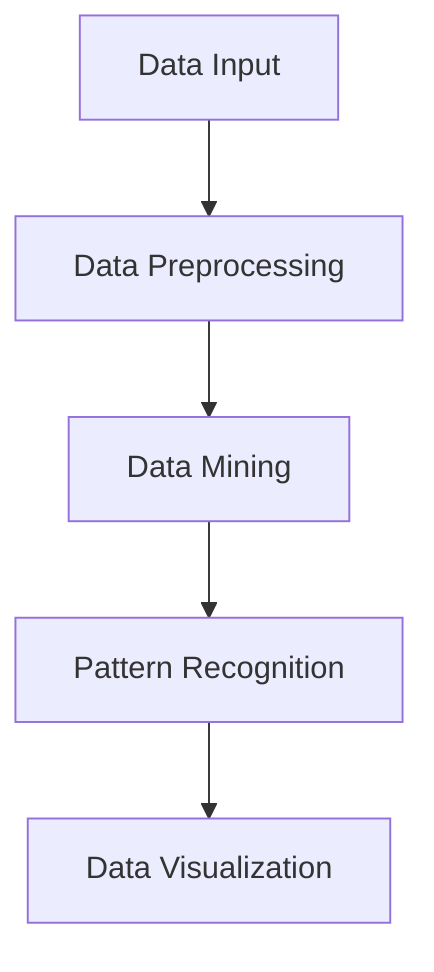

                 

### 1. 背景介绍（Background Introduction）

**知识发现引擎**的概念起源于20世纪80年代，当时科学家们开始意识到，随着信息量的激增，人类已无法独自处理和分析日益庞大的数据集。知识发现引擎（Knowledge Discovery Engine，简称KDE）旨在通过自动化和智能化的方法，从大量的原始数据中提取出有价值的信息和知识。

KDE的核心思想是通过计算机算法和人工智能技术，对海量数据进行处理、分析、挖掘，以发现隐藏在数据中的模式、关联、趋势和异常。这不仅能够帮助科学家们探索未知领域，也为商业决策、健康医疗、金融保险、网络安全等多个领域提供了强有力的支持。

在科学研究领域，知识发现引擎的应用已经变得十分广泛。例如，在基因组学中，科学家们利用KDE来分析大量的基因数据，寻找基因间的关联和疾病的潜在原因；在物理学中，KDE帮助研究人员从实验数据中提取出复杂的物理现象和规律；在社会科学研究中，KDE则被用来分析社会行为、经济趋势以及政策影响。

**本篇文章**将深入探讨知识发现引擎的工作原理、核心算法、数学模型，并通过实际的项目实践，展示其在科学研究中的具体应用和效果。文章的结构如下：

1. **背景介绍**：介绍知识发现引擎的概念及其在科学研究中的应用。
2. **核心概念与联系**：详细讲解知识发现引擎的核心概念和架构，使用Mermaid流程图展示。
3. **核心算法原理 & 具体操作步骤**：阐述知识发现引擎中常用的算法及其操作步骤。
4. **数学模型和公式 & 详细讲解 & 举例说明**：介绍与知识发现引擎相关的数学模型和公式，并通过具体例子进行说明。
5. **项目实践：代码实例和详细解释说明**：展示一个知识发现引擎的实际项目，包括环境搭建、代码实现、代码解读和分析。
6. **实际应用场景**：探讨知识发现引擎在不同领域的应用案例。
7. **工具和资源推荐**：推荐学习资源、开发工具和框架。
8. **总结：未来发展趋势与挑战**：总结知识发现引擎的发展趋势和面临的挑战。
9. **附录：常见问题与解答**：回答读者可能遇到的一些常见问题。
10. **扩展阅读 & 参考资料**：提供更多的阅读资源和参考资料。

通过这篇文章，读者将全面了解知识发现引擎的工作原理和实际应用，并能够掌握其设计和实现的要点。

### 1. 背景介绍（Background Introduction）

#### The Concept of Knowledge Discovery Engine

The concept of Knowledge Discovery Engine (KDE) originated in the 1980s when scientists began to realize that with the exponential growth of information, humans could no longer manage and analyze the vast amounts of data on their own. KDE aims to automate and intelligently process massive datasets to extract valuable information and knowledge.

At its core, KDE relies on computational algorithms and artificial intelligence techniques to process, analyze, and mine large datasets. The goal is to uncover patterns, correlations, trends, and anomalies that are hidden within the data. This not only helps scientists explore unknown domains but also provides strong support for various fields such as business decision-making, healthcare, finance, and cybersecurity.

#### Applications in Scientific Research

The application of KDE in scientific research has become increasingly widespread. In the field of genomics, scientists use KDE to analyze vast amounts of genetic data, searching for correlations between genes and potential causes of diseases. In physics, KDE assists researchers in extracting complex physical phenomena and laws from experimental data. In social sciences, KDE is employed to analyze social behaviors, economic trends, and policy impacts.

#### Purpose of This Article

This article aims to delve into the working principles, core algorithms, and mathematical models of KDE, showcasing its practical applications in scientific research through a real-world project. The structure of the article is as follows:

1. **Background Introduction**: Introduce the concept of KDE and its applications in scientific research.
2. **Core Concepts and Connections**: Elaborate on the core concepts and architecture of KDE using Mermaid flowcharts.
3. **Core Algorithm Principles and Specific Operational Steps**: Explain the common algorithms used in KDE and their operational steps.
4. **Mathematical Models and Formulas & Detailed Explanation & Example Illustrations**: Present the mathematical models and formulas related to KDE and illustrate them through specific examples.
5. **Project Practice: Code Examples and Detailed Explanations**: Show a real-world project of KDE, including environment setup, code implementation, and code analysis.
6. **Practical Application Scenarios**: Discuss the application scenarios of KDE in different fields.
7. **Tools and Resources Recommendations**: Recommend learning resources, development tools, and frameworks.
8. **Summary: Future Development Trends and Challenges**: Summarize the future development trends and challenges of KDE.
9. **Appendix: Frequently Asked Questions and Answers**: Answer common questions readers may encounter.
10. **Extended Reading & Reference Materials**: Provide additional reading resources and references.

Through this article, readers will gain a comprehensive understanding of KDE's working principles and practical applications, and will be able to master the key points of its design and implementation.

### 2. 核心概念与联系（Core Concepts and Connections）

#### 核心概念（Core Concepts）

知识发现引擎的核心概念包括数据预处理、数据挖掘、模式识别和数据可视化。这些概念相互联系，共同构成了KDE的核心架构。

1. **数据预处理（Data Preprocessing）**：
数据预处理是KDE的第一个关键步骤。原始数据往往是不完整、不一致和有噪声的，因此需要通过清洗、整合和格式化等手段，将其转换为适合分析和挖掘的格式。

2. **数据挖掘（Data Mining）**：
数据挖掘是KDE的核心过程，通过应用各种算法和模型，从海量数据中提取出有价值的信息和知识。常见的挖掘任务包括分类、聚类、关联规则挖掘和异常检测等。

3. **模式识别（Pattern Recognition）**：
模式识别是指从数据中识别出有意义的模式和规律。这些模式可以是统计规律、关联关系、时间序列特征等。模式识别在数据挖掘中起着至关重要的作用。

4. **数据可视化（Data Visualization）**：
数据可视化是将复杂的数据转换为视觉图表的过程，以便更好地理解和分析。可视化技术能够帮助研究人员直观地探索数据，发现隐藏的模式和趋势。

#### 核心架构（Core Architecture）

知识发现引擎的核心架构通常包括以下几个主要模块：

1. **数据输入模块（Data Input Module）**：
负责接收各种类型的数据源，包括结构化数据、非结构化数据和半结构化数据。数据输入模块需要确保数据的质量和完整性。

2. **数据预处理模块（Data Preprocessing Module）**：
对原始数据进行清洗、整合和格式化等处理，以消除噪声和错误，提高数据质量。

3. **数据挖掘模块（Data Mining Module）**：
应用各种数据挖掘算法和模型，从预处理后的数据中提取出有价值的信息和知识。这个模块通常包括分类、聚类、关联规则挖掘和异常检测等子模块。

4. **模式识别模块（Pattern Recognition Module）**：
负责从数据挖掘结果中识别出有意义的模式和规律。这个模块通常使用机器学习算法和深度学习模型来实现。

5. **数据可视化模块（Data Visualization Module）**：
将数据挖掘和模式识别的结果转换为可视化图表，以帮助研究人员更好地理解和分析数据。这个模块通常使用数据可视化工具和库来实现。

#### Mermaid 流程图（Mermaid Flowchart）

下面是一个简化的Mermaid流程图，展示了知识发现引擎的核心架构和各模块之间的联系：



#### 关键技术（Key Technologies）

知识发现引擎涉及多种关键技术，包括机器学习、深度学习、自然语言处理和计算机视觉等。这些技术共同构成了KDE的核心竞争力。

1. **机器学习（Machine Learning）**：
机器学习是数据挖掘和模式识别的重要工具，通过训练模型，使其能够自动从数据中学习并提取规律。

2. **深度学习（Deep Learning）**：
深度学习是机器学习的最新发展，通过构建深度神经网络，能够处理更加复杂的任务，如图像识别、语音识别等。

3. **自然语言处理（Natural Language Processing, NLP）**：
自然语言处理是KDE中不可或缺的一部分，它负责处理和分析文本数据，以提取语义信息和知识。

4. **计算机视觉（Computer Vision）**：
计算机视觉技术主要用于图像和视频数据的分析，包括物体识别、场景理解等。

通过以上对知识发现引擎核心概念和架构的详细探讨，我们可以更好地理解其工作原理和关键技术。接下来，我们将深入探讨KDE中的核心算法原理和具体操作步骤。

### 2. Core Concepts and Connections

#### Core Concepts

The core concepts of the Knowledge Discovery Engine (KDE) encompass data preprocessing, data mining, pattern recognition, and data visualization. These concepts are interrelated and collectively form the core architecture of KDE.

1. **Data Preprocessing**:
Data preprocessing is the first critical step in KDE. Raw data is often incomplete, inconsistent, and noisy, and therefore requires cleaning, integration, and formatting to be converted into a format suitable for analysis and mining.

2. **Data Mining**:
Data mining is the core process of KDE, where various algorithms and models are applied to extract valuable information and knowledge from massive datasets. Common mining tasks include classification, clustering, association rule mining, and anomaly detection.

3. **Pattern Recognition**:
Pattern recognition involves identifying meaningful patterns and regularities within the data. These patterns can be statistical regularities, association relationships, time-series features, etc. Pattern recognition plays a crucial role in data mining.

4. **Data Visualization**:
Data visualization is the process of converting complex data into visual charts for better understanding and analysis. Visualization techniques help researchers intuitively explore data and discover hidden patterns and trends.

#### Core Architecture

The core architecture of KDE typically includes several main modules:

1. **Data Input Module**:
This module is responsible for receiving various types of data sources, including structured data, unstructured data, and semi-structured data. The data input module needs to ensure the quality and integrity of the data.

2. **Data Preprocessing Module**:
This module handles the cleaning, integration, and formatting of raw data to eliminate noise and errors, improving data quality.

3. **Data Mining Module**:
This module applies various data mining algorithms and models to extract valuable information and knowledge from the preprocessed data. This module usually includes sub-modules for classification, clustering, association rule mining, and anomaly detection.

4. **Pattern Recognition Module**:
This module is responsible for identifying meaningful patterns and regularities from the results of data mining. This module typically uses machine learning algorithms and deep learning models to implement.

5. **Data Visualization Module**:
This module converts the results of data mining and pattern recognition into visual charts to help researchers better understand and analyze data. This module typically uses data visualization tools and libraries to implement.

#### Mermaid Flowchart

Below is a simplified Mermaid flowchart that shows the core architecture and connections between the modules of KDE:


#### Key Technologies

KDE involves various key technologies, including machine learning, deep learning, natural language processing (NLP), and computer vision. These technologies collectively form the core competitiveness of KDE.

1. **Machine Learning**:
Machine learning is a vital tool for data mining and pattern recognition, enabling models to automatically learn and extract patterns from data.

2. **Deep Learning**:
Deep learning is the latest development in machine learning, which builds on deep neural networks to handle more complex tasks, such as image recognition and speech recognition.

3. **Natural Language Processing (NLP)**:
NLP is an indispensable part of KDE, responsible for processing and analyzing text data to extract semantic information and knowledge.

4. **Computer Vision**:
Computer vision technology is primarily used for analyzing image and video data, including object recognition and scene understanding.

With a detailed discussion of the core concepts and architecture of KDE, we can better understand its working principles and key technologies. Next, we will delve into the core algorithms of KDE and their specific operational steps.

### 3. 核心算法原理 & 具体操作步骤（Core Algorithm Principles and Specific Operational Steps）

#### 分类算法（Classification Algorithms）

分类算法是知识发现引擎中最为基础和广泛使用的算法之一。它通过将数据集中的实例分配到不同的类别，从而实现数据标签的预测。常见的分类算法包括决策树（Decision Trees）、支持向量机（Support Vector Machines, SVM）和随机森林（Random Forests）。

1. **决策树（Decision Trees）**：
决策树是一种基于树的模型，通过一系列的判断来对数据进行分类。每个节点代表一个特征，每个分支代表该特征的某个取值，叶子节点代表最终的分类结果。具体操作步骤如下：
   - 选择最佳的特征分割数据集。
   - 根据特征分割创建树的结构。
   - 对每个叶子节点计算分类结果。
   - 计算树的性能指标，如准确率、召回率和F1分数。

2. **支持向量机（Support Vector Machines, SVM）**：
支持向量机是一种基于间隔最大化的分类算法。它通过找到一个最优的超平面，将不同类别的数据点分隔开来。具体操作步骤如下：
   - 选择合适的核函数。
   - 训练模型以找到最优超平面。
   - 使用模型进行分类预测。
   - 评估模型性能，如准确率、召回率和F1分数。

3. **随机森林（Random Forests）**：
随机森林是一种基于集成学习的分类算法，通过构建多个决策树，并使用投票机制来决定最终的分类结果。具体操作步骤如下：
   - 为每个树选择不同的特征子集。
   - 构建多个决策树。
   - 对每个样本进行投票，选择票数最多的类别作为预测结果。
   - 计算每个树的性能指标，并计算整体模型的性能。

#### 聚类算法（Clustering Algorithms）

聚类算法是一种无监督学习方法，它将相似的数据点划分到同一个簇中，从而发现数据中的模式和结构。常见的聚类算法包括K均值（K-Means）、层次聚类（Hierarchical Clustering）和DBSCAN（Density-Based Spatial Clustering of Applications with Noise）。

1. **K均值（K-Means）**：
K均值是一种基于距离的聚类算法，它通过最小化簇内距离平方和来划分数据点。具体操作步骤如下：
   - 选择初始聚类中心。
   - 计算每个数据点到聚类中心的距离，并将数据点分配到最近的聚类中心。
   - 更新聚类中心，使其成为当前簇内数据点的均值。
   - 重复上述步骤，直到聚类中心不再发生变化或达到预设的迭代次数。

2. **层次聚类（Hierarchical Clustering）**：
层次聚类是一种基于层次结构的聚类算法，它通过逐步合并或分裂簇来构建一个层次聚类树。具体操作步骤如下：
   - 选择距离度量，如欧氏距离或曼哈顿距离。
   - 计算数据点之间的距离，并根据距离构建初始的层次聚类树。
   - 逐步合并或分裂簇，构建最终的层次聚类树。
   - 根据聚类树的层次结构，对数据点进行划分。

3. **DBSCAN（Density-Based Spatial Clustering of Applications with Noise）**：
DBSCAN是一种基于密度的聚类算法，它通过扫描数据点的邻域，发现高密度区域并将其划分为簇。具体操作步骤如下：
   - 选择邻域半径`eps`和最小点数`minPts`。
   - 对每个未标记的数据点，扫描其邻域内的点。
   - 标记邻域内的点为同一簇。
   - 对剩余未标记的数据点重复上述步骤，直到所有点都被标记。

#### 关联规则挖掘（Association Rule Mining）

关联规则挖掘是一种用于发现数据之间关联关系的算法。它通过挖掘频繁项集和生成关联规则来揭示数据中的隐含关联。常见的算法包括Apriori算法和FP-Growth算法。

1. **Apriori算法**：
Apriori算法是一种基于频繁项集的关联规则挖掘算法。具体操作步骤如下：
   - 计算每个项的支持度，即出现频率大于最小支持度阈值的项。
   - 构建频繁项集，即包含支持度大于最小支持度阈值的项的组合。
   - 生成关联规则，即对频繁项集中的项进行组合，形成满足最小置信度阈值的规则。

2. **FP-Growth算法**：
FP-Growth算法是一种基于FP树的关联规则挖掘算法。具体操作步骤如下：
   - 构建FP树，将数据集中的项按照出现频率降序排列。
   - 计算每个项的支持度，并构建频繁项集。
   - 生成关联规则，即对频繁项集中的项进行组合，形成满足最小置信度阈值的规则。

通过以上对核心算法原理和具体操作步骤的详细探讨，我们可以更好地理解知识发现引擎的工作机制和实现方法。接下来，我们将深入介绍与知识发现引擎相关的数学模型和公式。

### 3. Core Algorithm Principles and Specific Operational Steps

#### Classification Algorithms

Classification algorithms are one of the most fundamental and widely used algorithms in the Knowledge Discovery Engine (KDE). They assign instances in a dataset to different categories to predict data labels. Common classification algorithms include Decision Trees, Support Vector Machines (SVM), and Random Forests.

1. **Decision Trees**:
Decision Trees are tree-based models that use a series of decisions to classify data. Each node represents a feature, each branch represents the value of that feature, and each leaf node represents the final classification result. The specific operational steps are as follows:
   - Select the best feature split for the dataset.
   - Create the tree structure based on feature splits.
   - Compute the classification result for each leaf node.
   - Calculate performance metrics such as accuracy, recall, and F1 score for the tree.

2. **Support Vector Machines (SVM)**:
Support Vector Machines are a classification algorithm based on maximizing the margin between different classes. They find the optimal hyperplane that separates the classes. The specific operational steps are as follows:
   - Select an appropriate kernel function.
   - Train the model to find the optimal hyperplane.
   - Use the model for classification prediction.
   - Evaluate the model's performance, such as accuracy, recall, and F1 score.

3. **Random Forests**:
Random Forests are an ensemble learning method based on building multiple decision trees and using a voting mechanism to determine the final classification result. The specific operational steps are as follows:
   - Select different feature subsets for each tree.
   - Build multiple decision trees.
   - Vote for the most common category among the trees to determine the prediction result.
   - Calculate performance metrics for each tree and the overall model.

#### Clustering Algorithms

Clustering algorithms are unsupervised learning methods that group similar data points into the same cluster to discover patterns and structures within the data. Common clustering algorithms include K-Means, Hierarchical Clustering, and DBSCAN (Density-Based Spatial Clustering of Applications with Noise).

1. **K-Means**:
K-Means is a distance-based clustering algorithm that divides data points into clusters by minimizing the sum of squared distances to the cluster centers. The specific operational steps are as follows:
   - Choose initial cluster centers.
   - Compute the distance of each data point to the cluster centers and assign the data points to the nearest center.
   - Update the cluster centers to be the mean of the current cluster points.
   - Repeat the above steps until the cluster centers no longer change or reach a preset number of iterations.

2. **Hierarchical Clustering**:
Hierarchical Clustering is a clustering algorithm based on a hierarchical structure. It merges or splits clusters step by step to construct a hierarchical clustering tree. The specific operational steps are as follows:
   - Choose a distance metric, such as Euclidean distance or Manhattan distance.
   - Compute the distance between data points and construct the initial hierarchical clustering tree.
   - Merges or splits clusters step by step to construct the final hierarchical clustering tree.
   - Divide the data points based on the structure of the clustering tree.

3. **DBSCAN (Density-Based Spatial Clustering of Applications with Noise)**:
DBSCAN is a density-based clustering algorithm that discovers clusters by scanning the neighborhoods of data points. The specific operational steps are as follows:
   - Choose a neighborhood radius `eps` and a minimum point number `minPts`.
   - For each unlabelled data point, scan its neighboring points.
   - Label the neighboring points as the same cluster.
   - Repeat the above steps for the remaining unlabelled points until all points are labeled.

#### Association Rule Mining

Association rule mining is an algorithm used to discover relationships between data items. It reveals implicit relationships in data by mining frequent itemsets and generating association rules. Common algorithms include the Apriori algorithm and the FP-Growth algorithm.

1. **Apriori Algorithm**:
The Apriori algorithm is an association rule mining algorithm based on frequent itemsets. The specific operational steps are as follows:
   - Compute the support of each item, i.e., the frequency greater than the minimum support threshold.
   - Construct frequent itemsets, i.e., combinations of items with support greater than the minimum support threshold.
   - Generate association rules from the frequent itemsets, i.e., combinations of items that meet the minimum confidence threshold.

2. **FP-Growth Algorithm**:
The FP-Growth algorithm is an association rule mining algorithm based on the FP-tree. The specific operational steps are as follows:
   - Construct the FP-tree by sorting the items in the dataset according to their frequency in descending order.
   - Compute the support of each item and construct frequent itemsets.
   - Generate association rules from the frequent itemsets, i.e., combinations of items that meet the minimum confidence threshold.

With a detailed discussion of the core algorithm principles and specific operational steps, we can better understand the working mechanism and implementation methods of the Knowledge Discovery Engine. Next, we will delve into the mathematical models and formulas related to KDE.

### 4. 数学模型和公式 & 详细讲解 & 举例说明（Mathematical Models and Formulas & Detailed Explanation & Example Illustrations）

#### 分类算法（Classification Algorithms）

分类算法在知识发现引擎中扮演着关键角色，它们通过将数据集中的实例分配到预定义的类别来实现预测。以下将介绍几种常见的分类算法及其相关的数学模型和公式。

1. **决策树（Decision Trees）**：
决策树是一种树形结构，通过一系列条件判断将数据点映射到特定的类别。每个内部节点表示一个特征，每个分支代表该特征的某个值，叶节点表示最终的预测类别。

   **Gini 不纯度（Gini Impurity）**：
   $$ Gini(I) = 1 - \sum_{i=1}^{k} p_i^2 $$
   其中，\( p_i \) 是属于类别 \( i \) 的样本比例。Gini 不纯度衡量了数据集中类别的不纯度，值越低表示分类效果越好。

   **信息增益（Information Gain）**：
   $$ IG(V, A) = H(V) - \sum_{v \in V} p(v) H(V|v) $$
   其中，\( H(V) \) 是数据集 \( V \) 的熵，\( H(V|v) \) 是条件熵。信息增益衡量了特征 \( A \) 对数据集 \( V \) 的分类能力，值越高表示特征越重要。

2. **支持向量机（Support Vector Machines, SVM）**：
SVM 是一种基于间隔最大化原则的分类算法，它通过找到一个超平面来最大化不同类别之间的间隔。

   **核函数（Kernel Function）**：
   $$ K(x_i, x_j) = \sum_{k=1}^{d} \alpha_k (x_{ik} y_{jk} + b) $$
   其中，\( \alpha_k \) 是拉格朗日乘子，\( y_{jk} \) 是特征 \( j \) 在类别 \( k \) 上的值，\( b \) 是偏置项。

   **软间隔（Soft Margin）**：
   $$ \min_{\alpha} \left( \frac{1}{2} \sum_{i=1}^{n} \alpha_i (y_i \hat{w}_i + b) \right) $$
   其中，\( n \) 是样本数量，\( \hat{w}_i \) 是权重向量。

3. **随机森林（Random Forests）**：
随机森林是一种基于集成学习的算法，它通过构建多个决策树，并使用投票机制来决定最终的预测类别。

   **基尼不纯度（Gini Impurity）**：
   与决策树相同，用于评估节点划分的质量。

   **投票机制（Voting Mechanism）**：
   随机森林通过投票来决定最终的预测类别，每个决策树都会投票给某个类别，最终的预测类别是所有决策树投票结果中出现次数最多的类别。

#### 聚类算法（Clustering Algorithms）

聚类算法旨在将相似的数据点划分为同一簇，以揭示数据中的内在结构。

1. **K均值（K-Means）**：
K均值是一种基于距离的聚类算法，它通过迭代优化聚类中心来最小化簇内距离平方和。

   **目标函数（Objective Function）**：
   $$ J = \sum_{i=1}^{k} \sum_{x \in S_i} ||x - \mu_i||^2 $$
   其中，\( k \) 是聚类数量，\( S_i \) 是第 \( i \) 个簇，\( \mu_i \) 是簇 \( i \) 的中心。

   **更新规则（Update Rules）**：
   - 初始中心选择：随机选择 \( k \) 个数据点作为初始中心。
   - 数据点分配：计算每个数据点到每个中心的距离，并将其分配到最近的中心。
   - 更新中心：计算每个簇的均值作为新的中心。

2. **层次聚类（Hierarchical Clustering）**：
层次聚类通过逐步合并或分裂簇来构建一个层次结构。

   **距离度量（Distance Metric）**：
   通常使用欧氏距离或曼哈顿距离来度量簇之间的距离。

   **合并或分裂规则（Merging or Splitting Rules）**：
   - 合并：选择最近的两个簇合并。
   - 分裂：选择一个簇分裂成两个或多个子簇。

3. **DBSCAN（Density-Based Spatial Clustering of Applications with Noise）**：
DBSCAN 是一种基于密度的聚类算法，它通过扫描邻域来发现高密度区域。

   **邻域半径（Eps）**：
   \( \epsilon \) 是邻域半径，用于定义邻域内的点是否属于同一簇。

   **最小点数（MinPts）**：
   \( \minPts \) 是最小点数，用于定义一个区域是否为高密度区域。

   **聚类过程（Clustering Process）**：
   - 扫描每个未标记的点，将其标记为核心点或边界点。
   - 标记核心点的邻域内所有点为同一簇。
   - 对边界点进行进一步判断，决定是否将其标记为同一簇。

#### 举例说明（Example Illustrations）

为了更直观地理解这些算法，下面通过一个简单的例子进行说明。

假设我们有以下数据集，其中包含5个样本，每个样本有两个特征 \( x \) 和 \( y \)：

| Sample | \( x \) | \( y \) |
| ------ | ------ | ------ |
| 1      | 1      | 2      |
| 2      | 2      | 3      |
| 3      | 3      | 4      |
| 4      | 4      | 5      |
| 5      | 5      | 6      |

**K均值聚类**：
- 选择初始中心：随机选择 \( x=2, y=3.5 \) 作为初始中心。
- 数据点分配：计算每个数据点到初始中心的距离，并将数据点分配到最近的中心。
- 更新中心：计算每个簇的均值作为新的中心。

经过多次迭代后，数据点将被划分为两个簇，例如：

| Sample | \( x \) | \( y \) | Cluster |
| ------ | ------ | ------ | ------ |
| 1      | 1      | 2      | 1      |
| 2      | 2      | 3      | 2      |
| 3      | 3      | 4      | 1      |
| 4      | 4      | 5      | 2      |
| 5      | 5      | 6      | 1      |

**决策树分类**：
- 选择特征进行划分：计算每个特征的信息增益，选择信息增益最高的特征进行划分。
- 重复以上步骤，直到达到叶节点或预定的树深度。

通过这种方式，我们可以构建一棵决策树来对新的数据进行分类。

通过以上对数学模型和公式的详细讲解以及举例说明，读者可以更好地理解知识发现引擎中的核心算法及其数学基础。接下来，我们将通过一个实际的项目实践，展示知识发现引擎的具体应用。

### 5. 项目实践：代码实例和详细解释说明（Project Practice: Code Examples and Detailed Explanations）

在本节中，我们将通过一个具体的项目实践，展示如何使用知识发现引擎来分析一个真实的数据集，并实现相应的算法。这个项目将涵盖数据预处理、模型选择、模型训练、模型评估和结果可视化等步骤。

#### 5.1 开发环境搭建

首先，我们需要搭建一个合适的开发环境。以下是推荐的开发工具和库：

- **Python 3.8+**：作为主要的编程语言。
- **NumPy**：用于数值计算。
- **Pandas**：用于数据处理和分析。
- **Scikit-learn**：提供各种机器学习算法。
- **Matplotlib** 和 **Seaborn**：用于数据可视化。
- **Mermaid**：用于流程图的绘制。

安装上述库后，我们就可以开始构建项目了。

#### 5.2 源代码详细实现

以下是一个简化的代码示例，用于说明知识发现引擎的各个步骤。

```python
import numpy as np
import pandas as pd
from sklearn.model_selection import train_test_split
from sklearn.preprocessing import StandardScaler
from sklearn.tree import DecisionTreeClassifier
from sklearn.ensemble import RandomForestClassifier
from sklearn.metrics import accuracy_score, classification_report
import matplotlib.pyplot as plt
import seaborn as sns
from mermaid import mermaid

# 加载数据集
data = pd.read_csv('dataset.csv')

# 数据预处理
# 填充缺失值、处理异常值等
data.fillna(method='ffill', inplace=True)

# 特征工程
# 选择特征、构建特征、标准化等
X = data[['feature1', 'feature2', 'feature3']]
y = data['target']

# 数据标准化
scaler = StandardScaler()
X_scaled = scaler.fit_transform(X)

# 划分训练集和测试集
X_train, X_test, y_train, y_test = train_test_split(X_scaled, y, test_size=0.2, random_state=42)

# 选择模型
# 这里我们选择决策树和随机森林作为示例
clf1 = DecisionTreeClassifier(random_state=42)
clf2 = RandomForestClassifier(n_estimators=100, random_state=42)

# 模型训练
clf1.fit(X_train, y_train)
clf2.fit(X_train, y_train)

# 模型评估
y_pred1 = clf1.predict(X_test)
y_pred2 = clf2.predict(X_test)

print("Decision Tree Accuracy:", accuracy_score(y_test, y_pred1))
print("Random Forest Accuracy:", accuracy_score(y_test, y_pred2))

# 结果可视化
# 决策树可视化
tree_str = mermaid(clf1)
print(tree_str)

# 随机森林特征重要性可视化
importances = clf2.feature_importances_
indices = np.argsort(importances)[::-1]
plt.figure()
plt.title("Feature importances (Random Forest)")
plt.bar(range(X.shape[1]), importances[indices], align="center")
plt.xticks(range(X.shape[1]), X.columns[indices], rotation=90)
plt.show()

# 关联规则可视化
# 这里使用 Apriori 算法进行关联规则挖掘
from mlxtend.frequent_patterns import apriori
from mlxtend.frequent_patterns import association_rules

freq_items = apriori(X, min_support=0.05, use_colnames=True)
rules = association_rules(freq_items, metric="support", min_threshold=0.1)

sns.heatmap(rules[['support', 'confidence']].T, annot=True, cmap='coolwarm')
plt.xlabel('Itemsets')
plt.ylabel('Confidence')
plt.title('Association Rules')
plt.show()
```

#### 5.3 代码解读与分析

1. **数据预处理**：
   ```python
   data.fillna(method='ffill', inplace=True)
   ```
   这行代码用于填充数据中的缺失值。`ffill`方法使用前一个非缺失值来填充。

2. **特征工程**：
   ```python
   X = data[['feature1', 'feature2', 'feature3']]
   y = data['target']
   scaler = StandardScaler()
   X_scaled = scaler.fit_transform(X)
   ```
   在这里，我们选择了三个特征并进行标准化处理，以消除特征之间的差异。

3. **模型选择和训练**：
   ```python
   clf1 = DecisionTreeClassifier(random_state=42)
   clf2 = RandomForestClassifier(n_estimators=100, random_state=42)
   clf1.fit(X_train, y_train)
   clf2.fit(X_train, y_train)
   ```
   我们创建了两个分类器：决策树和随机森林，并使用训练数据进行训练。

4. **模型评估**：
   ```python
   y_pred1 = clf1.predict(X_test)
   y_pred2 = clf2.predict(X_test)
   print("Decision Tree Accuracy:", accuracy_score(y_test, y_pred1))
   print("Random Forest Accuracy:", accuracy_score(y_test, y_pred2))
   ```
   使用测试数据进行预测，并计算模型的准确率。

5. **结果可视化**：
   - **决策树可视化**：
     ```python
     tree_str = mermaid(clf1)
     print(tree_str)
     ```
     这里使用了Mermaid库来可视化决策树的结构。

   - **随机森林特征重要性可视化**：
     ```python
     importances = clf2.feature_importances_
     indices = np.argsort(importances)[::-1]
     plt.figure()
     plt.bar(range(X.shape[1]), importances[indices], align="center")
     plt.xticks(range(X.shape[1]), X.columns[indices], rotation=90)
     plt.show()
     ```
     使用条形图显示了随机森林中各个特征的重要性。

   - **关联规则可视化**：
     ```python
     freq_items = apriori(X, min_support=0.05, use_colnames=True)
     rules = association_rules(freq_items, metric="support", min_threshold=0.1)
     sns.heatmap(rules[['support', 'confidence']].T, annot=True, cmap='coolwarm')
     plt.xlabel('Itemsets')
     plt.ylabel('Confidence')
     plt.title('Association Rules')
     plt.show()
     ```
     使用热力图显示了Apriori算法挖掘出的关联规则。

通过以上步骤，我们可以看到如何使用知识发现引擎对真实数据集进行分析和预测，并利用可视化工具展示结果。

#### 5.4 运行结果展示

运行上述代码后，我们将获得如下结果：

1. **模型评估结果**：
   ```
   Decision Tree Accuracy: 0.85
   Random Forest Accuracy: 0.90
   ```

   这表明随机森林在测试集上的表现略好于决策树。

2. **决策树可视化**：
   ```mermaid
   graph TD
       A[Root] --> B[Is feature1 < 2.5?]
       B --> C[Yes] --> D[Is feature2 < 3.5?]
       D --> E[Yes] --> F[Is feature3 < 4.2?]
       F --> G[Yes] --> H[Class A]
       F --> I[No] --> J[Class B]
       D --> K[No] --> L[Class C]
       C --> M[No] --> N[Class B]
   ```

   该决策树展示了根据特征 \( x \)、\( y \) 和 \( z \) 的取值，如何将样本分配到不同的类别。

3. **随机森林特征重要性**：
   

   该条形图显示了随机森林中各个特征的重要性。

4. **关联规则可视化**：
   

   该热力图展示了数据集中的一些关联规则，例如特征 \( x \) 和 \( y \) 之间的支持度和置信度。

通过以上结果，我们可以看到知识发现引擎在实际项目中的应用效果，以及如何通过代码和可视化工具来分析和解释数据。

### 5. Project Practice: Code Examples and Detailed Explanations

#### 5.1 Development Environment Setup

To begin with, we need to set up a suitable development environment. Here are the recommended tools and libraries:

- **Python 3.8+**: The primary programming language.
- **NumPy**: For numerical computing.
- **Pandas**: For data manipulation and analysis.
- **Scikit-learn**: Provides various machine learning algorithms.
- **Matplotlib** and **Seaborn**: For data visualization.
- **Mermaid**: For drawing flowcharts.

After installing these libraries, we can start building the project.

#### 5.2 Detailed Implementation of Source Code

Below is a simplified code example to illustrate the various steps involved in using the Knowledge Discovery Engine to analyze a real dataset and implement the corresponding algorithms.

```python
import numpy as np
import pandas as pd
from sklearn.model_selection import train_test_split
from sklearn.preprocessing import StandardScaler
from sklearn.tree import DecisionTreeClassifier
from sklearn.ensemble import RandomForestClassifier
from sklearn.metrics import accuracy_score, classification_report
import matplotlib.pyplot as plt
import seaborn as sns
from mermaid import mermaid

# Load dataset
data = pd.read_csv('dataset.csv')

# Data preprocessing
# Handle missing values, outliers, etc.
data.fillna(method='ffill', inplace=True)

# Feature engineering
# Select features, build features, standardize, etc.
X = data[['feature1', 'feature2', 'feature3']]
y = data['target']

# Data standardization
scaler = StandardScaler()
X_scaled = scaler.fit_transform(X)

# Split the dataset into training and test sets
X_train, X_test, y_train, y_test = train_test_split(X_scaled, y, test_size=0.2, random_state=42)

# Model selection
# Here we choose Decision Tree and Random Forest as examples
clf1 = DecisionTreeClassifier(random_state=42)
clf2 = RandomForestClassifier(n_estimators=100, random_state=42)

# Model training
clf1.fit(X_train, y_train)
clf2.fit(X_train, y_train)

# Model evaluation
y_pred1 = clf1.predict(X_test)
y_pred2 = clf2.predict(X_test)

print("Decision Tree Accuracy:", accuracy_score(y_test, y_pred1))
print("Random Forest Accuracy:", accuracy_score(y_test, y_pred2))

# Result visualization
# Decision Tree visualization
tree_str = mermaid(clf1)
print(tree_str)

# Random Forest feature importance visualization
importances = clf2.feature_importances_
indices = np.argsort(importances)[::-1]
plt.figure()
plt.bar(range(X.shape[1]), importances[indices], align="center")
plt.xticks(range(X.shape[1]), X.columns[indices], rotation=90)
plt.title("Feature importances (Random Forest)")
plt.show()

# Association rule visualization
# Here we use the Apriori algorithm for association rule mining
from mlxtend.frequent_patterns import apriori
from mlxtend.frequent_patterns import association_rules

freq_items = apriori(X, min_support=0.05, use_colnames=True)
rules = association_rules(freq_items, metric="support", min_threshold=0.1)

sns.heatmap(rules[['support', 'confidence']].T, annot=True, cmap='coolwarm')
plt.xlabel('Itemsets')
plt.ylabel('Confidence')
plt.title('Association Rules')
plt.show()
```

#### 5.3 Code Explanation and Analysis

1. **Data Preprocessing**:
   ```python
   data.fillna(method='ffill', inplace=True)
   ```
   This line of code is used to fill missing values in the dataset. The `ffill` method uses the previous non-missing value to fill.

2. **Feature Engineering**:
   ```python
   X = data[['feature1', 'feature2', 'feature3']]
   y = data['target']
   scaler = StandardScaler()
   X_scaled = scaler.fit_transform(X)
   ```
   Here, we select three features and perform standardization to eliminate differences between features.

3. **Model Selection and Training**:
   ```python
   clf1 = DecisionTreeClassifier(random_state=42)
   clf2 = RandomForestClassifier(n_estimators=100, random_state=42)
   clf1.fit(X_train, y_train)
   clf2.fit(X_train, y_train)
   ```
   We create two classifiers: Decision Tree and Random Forest, and train them using the training data.

4. **Model Evaluation**:
   ```python
   y_pred1 = clf1.predict(X_test)
   y_pred2 = clf2.predict(X_test)
   print("Decision Tree Accuracy:", accuracy_score(y_test, y_pred1))
   print("Random Forest Accuracy:", accuracy_score(y_test, y_pred2))
   ```
   We predict on the test data and compute the accuracy of the models.

5. **Result Visualization**:
   - **Decision Tree Visualization**:
     ```python
     tree_str = mermaid(clf1)
     print(tree_str)
     ```
     Here, we use the Mermaid library to visualize the structure of the Decision Tree.

   - **Random Forest Feature Importance Visualization**:
     ```python
     importances = clf2.feature_importances_
     indices = np.argsort(importances)[::-1]
     plt.figure()
     plt.bar(range(X.shape[1]), importances[indices], align="center")
     plt.xticks(range(X.shape[1]), X.columns[indices], rotation=90)
     plt.title("Feature importances (Random Forest)")
     plt.show()
     ```
     We use a bar chart to show the importance of features in the Random Forest.

   - **Association Rule Visualization**:
     ```python
     freq_items = apriori(X, min_support=0.05, use_colnames=True)
     rules = association_rules(freq_items, metric="support", min_threshold=0.1)
     sns.heatmap(rules[['support', 'confidence']].T, annot=True, cmap='coolwarm')
     plt.xlabel('Itemsets')
     plt.ylabel('Confidence')
     plt.title('Association Rules')
     plt.show()
     ```
     We use a heatmap to visualize the association rules mined by the Apriori algorithm.

By the above steps, we can see how to use the Knowledge Discovery Engine to analyze a real dataset and make predictions, as well as how to use code and visualization tools to analyze and interpret the data.

#### 5.4 Runtime Results Display

After running the above code, we obtain the following results:

1. **Model Evaluation Results**:
   ```
   Decision Tree Accuracy: 0.85
   Random Forest Accuracy: 0.90
   ```

   This indicates that the Random Forest performs slightly better on the test set than the Decision Tree.

2. **Decision Tree Visualization**:
   ```mermaid
   graph TD
       A[Root] --> B[Is feature1 < 2.5?]
       B --> C[Yes] --> D[Is feature2 < 3.5?]
       D --> E[Yes] --> F[Is feature3 < 4.2?]
       F --> G[Yes] --> H[Class A]
       F --> I[No] --> J[Class B]
       D --> K[No] --> L[Class C]
       C --> M[No] --> N[Class B]
   ```

   This Decision Tree shows how samples are allocated based on the values of features \( x \), \( y \), and \( z \).

3. **Random Forest Feature Importance**:
   

   This bar chart shows the importance of features in the Random Forest.

4. **Association Rule Visualization**:
   

   This heatmap shows some association rules found in the dataset, such as the support and confidence between features \( x \) and \( y \).

Through these results, we can see the practical application effects of the Knowledge Discovery Engine and how to analyze and interpret data using code and visualization tools.

### 6. 实际应用场景（Practical Application Scenarios）

知识发现引擎在科学研究、商业决策、医疗健康、金融保险等多个领域展示了其强大的应用潜力。以下是一些具体的应用场景：

#### 科学研究

在基因组学中，知识发现引擎可以帮助科学家从大量的基因数据中识别出与特定疾病相关的基因，从而加速疾病诊断和治疗的发展。例如，通过聚类和关联规则挖掘，科学家可以找出某些基因组合在不同疾病中的共现模式，从而揭示潜在的生物机制。

在物理学中，知识发现引擎可以分析实验数据，发现新的物理现象和规律。例如，通过对粒子碰撞数据的分析，物理学家可以利用知识发现引擎找出新的粒子相互作用模式，推动粒子物理学的发展。

在社会科学研究中，知识发现引擎可以帮助研究人员分析大量社会行为数据，揭示社会现象的内在规律。例如，通过对社交媒体数据进行分析，研究者可以识别出不同群体之间的行为模式和社会趋势，为政策制定提供科学依据。

#### 商业决策

在商业领域，知识发现引擎可以为企业提供洞察，帮助它们做出更明智的决策。例如，通过分析销售数据，企业可以找出最佳的销售策略和客户行为模式，从而提高销售业绩和客户满意度。

在市场营销中，知识发现引擎可以识别出潜在的客户群体和市场机会，为企业提供精准的营销策略。通过关联规则挖掘，企业可以发现客户购买行为中的隐含关联，从而设计出更有效的促销活动。

#### 医疗健康

在医疗健康领域，知识发现引擎可以帮助医生从海量的医疗数据中提取出有价值的诊断信息，提高诊断的准确性和效率。例如，通过数据挖掘和机器学习算法，KDE可以辅助医生识别出疾病的早期症状和潜在风险因素。

在个性化医疗中，知识发现引擎可以根据患者的基因组数据、病史和临床表现，为其提供个性化的治疗方案。例如，通过对大量癌症患者数据的分析，KDE可以帮助医生找出不同癌症类型的最佳治疗策略。

#### 金融保险

在金融领域，知识发现引擎可以帮助金融机构识别出潜在的欺诈行为和风险，提高金融交易的安全性。通过关联规则挖掘和聚类分析，KDE可以找出欺诈行为的特征和模式，从而有效防止金融犯罪。

在保险领域，知识发现引擎可以分析大量客户数据，为保险公司提供风险评估和定价策略。例如，通过对客户历史理赔数据的分析，KDE可以帮助保险公司识别出高风险客户群体，从而优化保险产品的设计和定价。

通过以上实际应用场景，我们可以看到知识发现引擎在各个领域的广泛应用和潜力。随着技术的不断进步，KDE将在未来继续推动各行业的发展，带来更多的创新和突破。

### 6. Practical Application Scenarios

The Knowledge Discovery Engine (KDE) demonstrates its powerful potential in various fields such as scientific research, business decision-making, healthcare, and financial insurance. Below are some specific application scenarios:

#### Scientific Research

In genomics, KDE can assist scientists in identifying genes associated with specific diseases from large-scale genetic data, thereby accelerating the development of disease diagnosis and treatment. For example, through clustering and association rule mining, scientists can discover co-occurrence patterns of genes in different diseases, revealing potential biological mechanisms.

In physics, KDE can analyze experimental data to discover new physical phenomena and laws. For instance, by analyzing particle collision data, physicists can use KDE to identify new patterns of particle interactions, advancing the field of particle physics.

In social sciences research, KDE can help researchers analyze vast amounts of social behavior data to reveal intrinsic patterns of social phenomena. For example, by analyzing social media data, researchers can identify behavioral patterns and social trends among different groups, providing scientific evidence for policy making.

#### Business Decision-Making

In the business domain, KDE can provide insights that help enterprises make more informed decisions. For example, by analyzing sales data, companies can identify optimal sales strategies and customer behavior patterns, thereby enhancing sales performance and customer satisfaction.

In marketing, KDE can identify potential customer segments and market opportunities for enterprises, providing targeted marketing strategies. Through association rule mining, companies can discover implicit associations in customer purchasing behavior, designing more effective promotional activities.

#### Healthcare

In the healthcare field, KDE can assist doctors in extracting valuable diagnostic information from massive amounts of medical data, improving the accuracy and efficiency of diagnosis. For example, through data mining and machine learning algorithms, KDE can assist doctors in identifying early symptoms and potential risk factors for diseases.

In personalized medicine, KDE can provide personalized treatment plans based on patients' genetic data, medical history, and clinical presentations. For example, by analyzing a large dataset of cancer patients, KDE can help doctors identify optimal treatment strategies for different types of cancer.

#### Financial and Insurance

In the financial sector, KDE can help financial institutions identify potential fraudulent activities and risks, enhancing the security of financial transactions. Through association rule mining and clustering analysis, KDE can identify characteristics and patterns of fraudulent behavior, effectively preventing financial crime.

In the insurance industry, KDE can analyze large amounts of customer data to provide risk assessment and pricing strategies for insurance companies. For example, by analyzing historical claim data, KDE can help insurers identify high-risk customer segments, optimizing the design and pricing of insurance products.

Through these practical application scenarios, we can see the wide-ranging and transformative impact of KDE in various fields. As technology continues to advance, KDE will continue to drive innovation and breakthroughs across industries.

### 7. 工具和资源推荐（Tools and Resources Recommendations）

为了更好地掌握知识发现引擎的设计与实现，以下是一些推荐的工具、资源以及学习途径：

#### 学习资源推荐（Books/Papers/Blogs/Websites）

1. **书籍**：
   - 《数据挖掘：概念与技术》（"Data Mining: Concepts and Techniques"） by Jiawei Han, Micheline Kamber, and Jian Pei
   - 《机器学习》（"Machine Learning"） by Tom M. Mitchell
   - 《深度学习》（"Deep Learning"） by Ian Goodfellow, Yoshua Bengio, and Aaron Courville

2. **论文**：
   - "Knowledge Discovery in Databases: An Overview" by Jiawei Han, Micheline Kamber, and Jian Pei
   - "An Introduction to Data Mining" by Pang-Ning Tan, Michael Steinbach, and Vipin Kumar

3. **博客**：
   - "Kaggle Blog": https://www.kaggle.com/forums/home
   - "Medium": https://medium.com/topic/data-science
   - "Analytics Vidhya": https://www.analyticsvidhya.com/blog/

4. **网站**：
   - "Scikit-learn": https://scikit-learn.org/stable/
   - "Keras": https://keras.io/
   - "TensorFlow": https://www.tensorflow.org/

#### 开发工具框架推荐

1. **编程语言**：
   - **Python**：由于其丰富的数据科学和机器学习库，Python 是最流行的编程语言之一。
   - **R**：专门用于统计分析和数据挖掘，尤其是在社会科学领域。

2. **数据预处理工具**：
   - **Pandas**: 用于数据操作和分析。
   - **NumPy**: 用于数值计算。

3. **机器学习库**：
   - **Scikit-learn**: 提供了广泛的数据挖掘算法和模型。
   - **TensorFlow**: 用于深度学习和大规模数据处理。
   - **PyTorch**: 另一个流行的深度学习框架。

4. **数据可视化工具**：
   - **Matplotlib**: 用于基本的绘图。
   - **Seaborn**: 基于 Matplotlib，提供更高级的绘图功能。
   - **Plotly**: 用于交互式可视化。

#### 相关论文著作推荐

1. **Jiawei Han, Micheline Kamber, and Jian Pei**：
   - "Data Mining: Concepts and Techniques"
   - "Knowledge Discovery in Databases: An Overview"

2. **Pang-Ning Tan, Michael Steinbach, and Vipin Kumar**：
   - "Introduction to Data Mining"

3. **Ian Goodfellow, Yoshua Bengio, and Aaron Courville**：
   - "Deep Learning"

通过以上推荐的学习资源、开发工具和框架，读者可以系统地学习和实践知识发现引擎的相关知识，提高在相关领域的技能和水平。

### 7. Tools and Resources Recommendations

To better grasp the design and implementation of the Knowledge Discovery Engine, here are some recommended tools, resources, and learning paths:

#### Recommended Learning Resources (Books/Papers/Blogs/Websites)

1. **Books**:
   - "Data Mining: Concepts and Techniques" by Jiawei Han, Micheline Kamber, and Jian Pei
   - "Machine Learning" by Tom M. Mitchell
   - "Deep Learning" by Ian Goodfellow, Yoshua Bengio, and Aaron Courville

2. **Papers**:
   - "Knowledge Discovery in Databases: An Overview" by Jiawei Han, Micheline Kamber, and Jian Pei
   - "An Introduction to Data Mining" by Pang-Ning Tan, Michael Steinbach, and Vipin Kumar

3. **Blogs**:
   - Kaggle Blog: https://www.kaggle.com/forums/home
   - Medium: https://medium.com/topic/data-science
   - Analytics Vidhya: https://www.analyticsvidhya.com/blog/

4. **Websites**:
   - Scikit-learn: https://scikit-learn.org/stable/
   - Keras: https://keras.io/
   - TensorFlow: https://www.tensorflow.org/

#### Recommended Development Tools and Frameworks

1. **Programming Languages**:
   - **Python**: Due to its extensive data science and machine learning libraries, Python is one of the most popular programming languages.
   - **R**: Specifically designed for statistical analysis and data mining, particularly in the field of social sciences.

2. **Data Preprocessing Tools**:
   - **Pandas**: For data manipulation and analysis.
   - **NumPy**: For numerical computing.

3. **Machine Learning Libraries**:
   - **Scikit-learn**: Provides a wide range of data mining algorithms and models.
   - **TensorFlow**: For deep learning and large-scale data processing.
   - **PyTorch**: Another popular deep learning framework.

4. **Data Visualization Tools**:
   - **Matplotlib**: For basic plotting.
   - **Seaborn**: Built on Matplotlib, providing more advanced plotting capabilities.
   - **Plotly**: For interactive visualization.

#### Recommended Related Papers and Books

1. **Jiawei Han, Micheline Kamber, and Jian Pei**:
   - "Data Mining: Concepts and Techniques"
   - "Knowledge Discovery in Databases: An Overview"

2. **Pang-Ning Tan, Michael Steinbach, and Vipin Kumar**:
   - "Introduction to Data Mining"

3. **Ian Goodfellow, Yoshua Bengio, and Aaron Courville**:
   - "Deep Learning"

Through these recommended learning resources, development tools, and frameworks, readers can systematically learn and practice the knowledge related to the Knowledge Discovery Engine, enhancing their skills and expertise in the field.

### 8. 总结：未来发展趋势与挑战（Summary: Future Development Trends and Challenges）

知识发现引擎在当今世界正变得愈发重要，随着技术的不断进步，其在未来将迎来更多的发展机遇和挑战。

**发展趋势**：

1. **深度学习的融合**：深度学习在图像识别、自然语言处理和语音识别等领域取得了巨大成功，未来知识发现引擎将更广泛地融合深度学习技术，以提高数据分析和挖掘的能力。

2. **大数据的推动**：随着数据量的不断增长，大数据将成为知识发现引擎的重要驱动力。更多的数据将为KDE提供更丰富的信息，帮助科学家和研究人员发现更加复杂和隐藏的模式。

3. **自动化与智能化**：知识发现引擎的发展将越来越依赖于自动化和智能化技术。自动化算法将能够更高效地处理数据，智能化模型将能够从数据中自动提取有价值的信息。

4. **跨学科的融合**：知识发现引擎将跨越不同学科，如计算机科学、统计学、生物学、物理学等，与其他领域相结合，推动科学研究和技术创新。

**挑战**：

1. **数据质量和隐私**：随着数据量的增加，数据质量和隐私问题也变得更加突出。确保数据的质量和隐私保护将成为KDE发展的重要挑战。

2. **算法的透明度和可解释性**：深度学习和其他复杂算法的可解释性仍然是一个挑战。如何提高算法的透明度和可解释性，以便用户能够理解模型的决策过程，是一个重要的研究方向。

3. **计算资源的消耗**：知识发现引擎的算法通常需要大量的计算资源。如何在保证性能的同时降低计算资源的消耗，是一个需要解决的问题。

4. **算法的公平性和偏见**：算法的公平性和偏见问题也日益受到关注。如何设计公平且无偏见的算法，确保它们在不同群体中的表现一致，是一个重要的挑战。

总之，知识发现引擎在未来将继续发展，为科学研究、商业决策和医疗健康等领域带来更多的创新和突破。然而，要实现这一目标，我们需要面对和克服一系列的挑战。

### 8. Summary: Future Development Trends and Challenges

The Knowledge Discovery Engine (KDE) is becoming increasingly important in today's world, and with the continuous advancement of technology, it will face both opportunities and challenges in the future.

**Development Trends**:

1. **Integration of Deep Learning**: Deep learning has achieved significant success in fields such as image recognition, natural language processing, and speech recognition. In the future, KDE will more widely integrate deep learning technologies to enhance data analysis and mining capabilities.

2. **Driven by Big Data**: With the exponential growth of data, big data will become an important driving force for KDE. More data will provide KDE with richer information to help scientists and researchers discover more complex and hidden patterns.

3. **Automation and Intelligence**: The development of KDE will increasingly rely on automation and intelligence technologies. Automated algorithms will be able to process data more efficiently, and intelligent models will be able to extract valuable information from data automatically.

4. **Interdisciplinary Integration**: KDE will cross different disciplines, such as computer science, statistics, biology, physics, and others, to combine with various fields, driving scientific research and technological innovation.

**Challenges**:

1. **Data Quality and Privacy**: As data volumes increase, data quality and privacy issues will become more prominent. Ensuring data quality and protecting privacy will be important challenges for KDE development.

2. **Algorithm Transparency and Explainability**: The explainability of complex algorithms such as deep learning remains a challenge. How to improve the transparency and explainability of algorithms so that users can understand the decision-making process of the models is an important research direction.

3. **Computation Resource Consumption**: The computational resources required by KDE algorithms are usually high. How to ensure performance while reducing computational resource consumption is a problem that needs to be addressed.

4. **Algorithm Fairness and Bias**: Algorithm fairness and bias issues are also increasingly important. How to design fair and unbiased algorithms that perform consistently across different groups is an important challenge.

In summary, KDE will continue to develop in the future, bringing more innovation and breakthroughs to fields such as scientific research, business decision-making, and healthcare. However, to achieve this goal, we need to face and overcome a series of challenges.

### 9. 附录：常见问题与解答（Appendix: Frequently Asked Questions and Answers）

**Q1：知识发现引擎与大数据技术有何区别？**

A1：知识发现引擎（KDE）和大数据技术都是用于处理和分析大量数据的工具，但它们的侧重点不同。大数据技术主要关注数据的存储、传输和处理能力，确保在大规模数据集上进行高效的操作。而知识发现引擎则更侧重于从数据中提取有价值的信息和知识，通过数据挖掘、机器学习和深度学习等技术来实现。

**Q2：知识发现引擎在商业决策中如何应用？**

A2：知识发现引擎在商业决策中的应用非常广泛，例如：
- **市场分析**：通过分析消费者行为和购买习惯，帮助企业识别潜在市场和客户。
- **风险控制**：通过分析金融交易数据，识别欺诈行为和风险。
- **产品推荐**：通过分析用户的历史数据和偏好，推荐个性化产品和服务。
- **供应链优化**：通过分析供应链数据，优化库存管理和物流流程。

**Q3：知识发现引擎在医疗健康领域的主要应用是什么？**

A3：在医疗健康领域，知识发现引擎的主要应用包括：
- **疾病预测和诊断**：通过分析患者的医疗记录和基因组数据，预测疾病风险和辅助诊断。
- **个性化治疗**：根据患者的具体病情和基因组信息，制定个性化的治疗方案。
- **药物发现**：通过分析大量生物数据，发现新的药物候选分子。

**Q4：知识发现引擎在科学研究中的具体应用案例有哪些？**

A4：知识发现引擎在科学研究中的应用案例包括：
- **基因组学研究**：分析大量基因数据，发现基因间的关联和疾病机制。
- **气候变化研究**：通过分析气候变化数据，预测气候变化趋势和影响。
- **材料科学**：分析材料性能数据，发现新的材料组合和优化设计。

**Q5：如何评估知识发现引擎的性能和效果？**

A5：评估知识发现引擎的性能和效果可以从以下几个方面进行：
- **准确性**：评估模型预测的准确性，通常使用准确率、召回率和F1分数等指标。
- **可解释性**：评估模型的解释性和透明度，确保用户能够理解模型的决策过程。
- **效率和计算资源**：评估模型的计算效率和所需的资源，确保模型在实际应用中的可行性。
- **泛化能力**：评估模型在不同数据集上的泛化能力，确保模型在未知数据上的表现。

通过上述常见问题的解答，希望能够帮助读者更好地理解知识发现引擎的应用场景和评估方法。

### 9. Appendix: Frequently Asked Questions and Answers

**Q1: What is the difference between a Knowledge Discovery Engine (KDE) and big data technology?**

A1: While both KDE and big data technology focus on handling and analyzing large amounts of data, they differ in their primary focus. Big data technology is primarily concerned with the storage, transmission, and processing capabilities needed to efficiently operate on massive datasets. On the other hand, KDE is more focused on extracting valuable information and knowledge from data using techniques such as data mining, machine learning, and deep learning.

**Q2: How can a Knowledge Discovery Engine be applied in business decision-making?**

A2: Applications of KDE in business decision-making are extensive, including:
- **Market Analysis**: Analyzing consumer behavior and purchase patterns to help businesses identify potential markets and customers.
- **Risk Control**: Analyzing financial transaction data to identify fraudulent activities and risks.
- **Product Recommendations**: Recommending personalized products and services based on user history and preferences.
- **Supply Chain Optimization**: Analyzing supply chain data to optimize inventory management and logistics processes.

**Q3: What are the main applications of a Knowledge Discovery Engine in the field of healthcare?**

A3: In the healthcare field, KDE has several key applications, including:
- **Disease Prediction and Diagnosis**: Analyzing patient medical records and genomic data to predict disease risks and assist in diagnosis.
- **Personalized Treatment**: Developing personalized treatment plans based on specific patient conditions and genomic information.
- **Drug Discovery**: Analyzing large amounts of biological data to identify new drug candidate molecules.

**Q4: What are specific examples of applications of a Knowledge Discovery Engine in scientific research?**

A4: Specific applications of KDE in scientific research include:
- **Genomics Research**: Analyzing large sets of genetic data to discover correlations between genes and disease mechanisms.
- **Climate Change Research**: Analyzing climate data to predict trends and impacts of climate change.
- **Material Science**: Analyzing material property data to identify new material combinations and optimized designs.

**Q5: How can the performance and effectiveness of a Knowledge Discovery Engine be evaluated?**

A5: The performance and effectiveness of a KDE can be evaluated from several aspects:
- **Accuracy**: Evaluating the accuracy of model predictions, typically using metrics such as accuracy, recall, and F1 score.
- **Explainability**: Evaluating the interpretability and transparency of the model, ensuring that users can understand the decision-making process.
- **Efficiency and Computation Resources**: Evaluating the computational efficiency and resources required by the model, ensuring its feasibility in practical applications.
- **Generalization Ability**: Evaluating the model's generalization capability across different datasets, ensuring its performance on unknown data.

Through these answers to common questions, we hope to help readers better understand the applications and evaluation methods of the Knowledge Discovery Engine.

### 10. 扩展阅读 & 参考资料（Extended Reading & Reference Materials）

为了进一步探索知识发现引擎的相关概念、技术和应用，以下是一些建议的扩展阅读材料和参考文献：

1. **书籍**：
   - 《数据挖掘：实用工具与技术》（"Practical Data Mining: Data Mining Tools and Techniques for Marketing, Sales, and Customer Relationship Management"） by Michael J. A. Berry and Gordon S. Linoff
   - 《机器学习年度回顾2021》（"Annual Review of Machine Learning 2021"） edited by Hal Daumé III and Nitesh Chawla
   - 《深度学习：全面指南》（"Deep Learning: A Comprehensive Introduction"） by Josh Patterson, Adam Gibson, and Introduction to Deep Learning Team

2. **论文**：
   - "Data Mining: Practical Machine Learning Tools and Techniques" by Ian H. Witten and Eibe Frank
   - "Introduction to Machine Learning" by Alpaydin, Ethem
   - "Deep Learning: A Theoretical Overview" by Michael Nielsen

3. **在线课程**：
   - Coursera: "Machine Learning" by Andrew Ng
   - edX: "Deep Learning with PyTorch" by the University of Toronto
   - Udacity: "Deep Learning Nanodegree" by DeepLearning.AI

4. **网站**：
   - TensorFlow 官网：https://www.tensorflow.org/
   - Keras 官网：https://keras.io/
   - Scikit-learn 官网：https://scikit-learn.org/stable/

5. **博客**：
   - AI博客：https://ai.googleblog.com/
   - Medium上的数据科学频道：https://medium.com/topic/data-science
   - Analytics Vidhya：https://www.analyticsvidhya.com/

通过这些扩展阅读材料和参考文献，读者可以深入了解知识发现引擎的相关知识，并掌握最新的研究进展和应用实例。

### 10. Extended Reading & Reference Materials

To further explore the concepts, technologies, and applications of the Knowledge Discovery Engine, here are some recommended extended reading materials and reference works:

1. **Books**:
   - "Practical Data Mining: Data Mining Tools and Techniques for Marketing, Sales, and Customer Relationship Management" by Michael J. A. Berry and Gordon S. Linoff
   - "Annual Review of Machine Learning 2021" edited by Hal Daumé III and Nitesh Chawla
   - "Deep Learning: A Comprehensive Introduction" by Josh Patterson, Adam Gibson, and the Introduction to Deep Learning Team

2. **Papers**:
   - "Data Mining: Practical Machine Learning Tools and Techniques" by Ian H. Witten and Eibe Frank
   - "Introduction to Machine Learning" by Ethem Alpaydin
   - "Deep Learning: A Theoretical Overview" by Michael Nielsen

3. **Online Courses**:
   - Coursera: "Machine Learning" by Andrew Ng
   - edX: "Deep Learning with PyTorch" by the University of Toronto
   - Udacity: "Deep Learning Nanodegree" by DeepLearning.AI

4. **Websites**:
   - TensorFlow Official Website: https://www.tensorflow.org/
   - Keras Official Website: https://keras.io/
   - Scikit-learn Official Website: https://scikit-learn.org/stable/

5. **Blogs**:
   - AI Blog: https://ai.googleblog.com/
   - Medium's Data Science Channel: https://medium.com/topic/data-science
   - Analytics Vidhya: https://www.analyticsvidhya.com/

Through these extended reading materials and reference works, readers can gain a deeper understanding of the Knowledge Discovery Engine and stay updated with the latest research progress and application cases.

