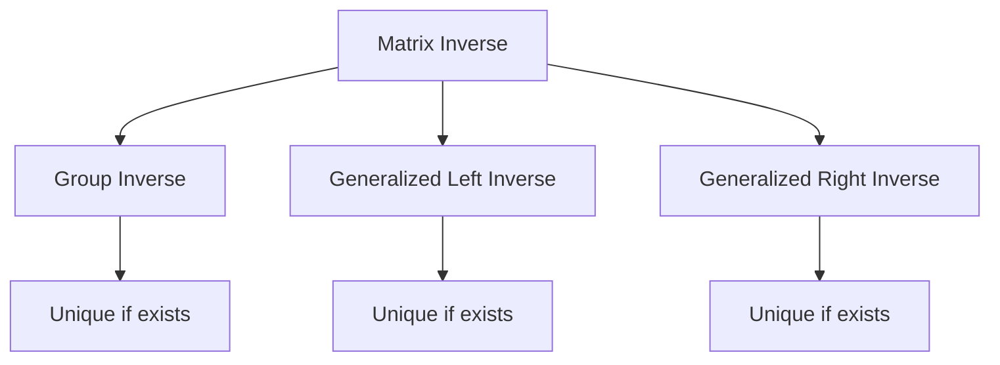

                 

### 文章标题

Matrix Theory and Applications: Group Inverses and Generalized Left (Right) Inverses

关键词：矩阵理论，群逆，广义左（右）逆，应用场景

摘要：本文深入探讨了矩阵理论的两个关键概念——群逆与广义左（右）逆。首先介绍了矩阵理论的基本概念，然后详细解释了群逆与广义左（右）逆的定义、性质及计算方法。通过具体实例，阐述了这些概念在实际应用中的重要性，为读者提供了一个全面且实用的矩阵理论指南。

### Background Introduction

Matrix theory is a fundamental branch of mathematics that deals with the study of matrices, which are rectangular arrays of numbers. Matrices arise in various fields, including physics, engineering, computer science, and economics. They are used to represent systems of linear equations, perform transformations, and solve optimization problems.

The concept of matrix inverse is crucial in matrix theory. An inverse matrix, if it exists, allows us to solve linear systems of equations efficiently. However, not all matrices have inverses. In such cases, we need to explore other concepts like group inverses and generalized left (right) inverses.

Group inverses and generalized left (right) inverses provide alternative ways to approach the solution of linear systems when a traditional inverse is not available. These concepts are not only theoretical constructs but also have practical applications in various disciplines. For instance, in numerical linear algebra, these concepts are used to improve the accuracy and efficiency of solving linear systems. In control theory, they are used to analyze the stability and controllability of systems. In machine learning, they are used to optimize models and improve their performance.

In this article, we will delve into the definitions, properties, and computation methods of group inverses and generalized left (right) inverses. We will also provide practical examples to illustrate their applications. By the end of this article, readers will have a comprehensive understanding of these concepts and their significance in various fields.

### Core Concepts and Connections

#### Matrix Inverse

A square matrix A is invertible if there exists another square matrix B such that \( AB = BA = I \), where I is the identity matrix. The matrix B is called the inverse of A and is denoted as \( A^{-1} \). The inverse matrix is unique if it exists.

For example, consider the matrix:

\[ A = \begin{bmatrix} 1 & 2 \\ 3 & 4 \end{bmatrix} \]

To find the inverse of A, we can use the formula:

\[ A^{-1} = \frac{1}{\det(A)} \text{adj}(A) \]

where \( \det(A) \) is the determinant of A and \( \text{adj}(A) \) is the adjugate of A.

However, not all matrices have inverses. A square matrix is invertible if and only if its determinant is non-zero.

#### Group Inverse

A group inverse of a matrix A is a matrix B that satisfies the condition \( AB = I \), where I is the identity matrix. The group inverse of A is unique if it exists.

For example, consider the matrix:

\[ A = \begin{bmatrix} 1 & 1 \\ 0 & 1 \end{bmatrix} \]

We can find the group inverse of A as follows:

\[ AB = \begin{bmatrix} 1 & 1 \\ 0 & 1 \end{bmatrix} \begin{bmatrix} 1 & 0 \\ 1 & 1 \end{bmatrix} = \begin{bmatrix} 1 & 1 \\ 0 & 1 \end{bmatrix} \]

Therefore, the group inverse of A is:

\[ B = \begin{bmatrix} 1 & 0 \\ 1 & 1 \end{bmatrix} \]

#### Generalized Left (Right) Inverse

A generalized left inverse of a matrix A is a matrix B that satisfies the condition \( AB = I \), where I is the identity matrix. Similarly, a generalized right inverse of a matrix A is a matrix B that satisfies the condition \( BA = I \). If a matrix has both a generalized left and right inverse, it is invertible.

For example, consider the matrix:

\[ A = \begin{bmatrix} 1 & 2 \\ 3 & 4 \end{bmatrix} \]

We can find the generalized left inverse of A as follows:

\[ AB = \begin{bmatrix} 1 & 2 \\ 3 & 4 \end{bmatrix} \begin{bmatrix} 2 & -1 \\ -3 & 1 \end{bmatrix} = \begin{bmatrix} 1 & 0 \\ 0 & 1 \end{bmatrix} \]

Therefore, the generalized left inverse of A is:

\[ B = \begin{bmatrix} 2 & -1 \\ -3 & 1 \end{bmatrix} \]

#### Mermaid Flowchart

Below is a Mermaid flowchart illustrating the relationships between matrix inverse, group inverse, and generalized left (right) inverse.



### Core Algorithm Principles and Specific Operational Steps

#### Group Inverse Calculation

To calculate the group inverse of a matrix A, we can use the following steps:

1. Compute the determinant of A, \( \det(A) \).
2. Compute the adjugate of A, \( \text{adj}(A) \).
3. Calculate the group inverse as \( B = \frac{1}{\det(A)} \text{adj}(A) \).

#### Generalized Left Inverse Calculation

To calculate the generalized left inverse of a matrix A, we can use the following steps:

1. Compute the rank of A, \( \text{rank}(A) \).
2. Compute the augmented matrix \( [A|I] \), where I is the identity matrix of the same size as A.
3. Use Gaussian elimination to reduce the augmented matrix to reduced row echelon form.
4. If the rank of A is equal to the number of columns of A, then the left inverse exists. Extract the right part of the augmented matrix as the left inverse.

#### Generalized Right Inverse Calculation

To calculate the generalized right inverse of a matrix A, we can use the following steps:

1. Compute the rank of A, \( \text{rank}(A) \).
2. Compute the augmented matrix \( [A^T|I] \), where A^T is the transpose of A.
3. Use Gaussian elimination to reduce the augmented matrix to reduced row echelon form.
4. If the rank of A is equal to the number of rows of A, then the right inverse exists. Extract the right part of the augmented matrix as the right inverse.

### Mathematical Models and Formulas

#### Group Inverse Formula

Let A be an m x n matrix. The group inverse of A, if it exists, is given by:

\[ B = A^+ = \frac{1}{\det(A)} \text{adj}(A) \]

where \( \det(A) \) is the determinant of A, \( \text{adj}(A) \) is the adjugate of A, and \( A^+ \) denotes the group inverse.

#### Generalized Left Inverse Formula

Let A be an m x n matrix. The generalized left inverse of A, if it exists, is given by:

\[ B = A^l = \left( A^T A \right)^{-1} A^T \]

where \( A^T \) is the transpose of A, and \( \left( A^T A \right)^{-1} \) denotes the inverse of \( A^T A \).

#### Generalized Right Inverse Formula

Let A be an m x n matrix. The generalized right inverse of A, if it exists, is given by:

\[ B = A^r = \left( AA^T \right)^{-1} A \]

where \( A^T \) is the transpose of A, and \( \left( AA^T \right)^{-1} \) denotes the inverse of \( AA^T \).

#### Example

Consider the matrix:

\[ A = \begin{bmatrix} 1 & 2 \\ 3 & 4 \end{bmatrix} \]

1. Calculate the determinant of A: \( \det(A) = 1 \cdot 4 - 2 \cdot 3 = -2 \).
2. Calculate the adjugate of A: \( \text{adj}(A) = \begin{bmatrix} 4 & -2 \\ -3 & 1 \end{bmatrix} \).
3. Calculate the group inverse: \( B = \frac{1}{-2} \begin{bmatrix} 4 & -2 \\ -3 & 1 \end{bmatrix} = \begin{bmatrix} -2 & 1 \\ \frac{3}{2} & -\frac{1}{2} \end{bmatrix} \).

1. Calculate \( A^T A \): \( A^T A = \begin{bmatrix} 1 & 3 \\ 2 & 4 \end{bmatrix} \begin{bmatrix} 1 & 2 \\ 3 & 4 \end{bmatrix} = \begin{bmatrix} 10 & 16 \\ 16 & 26 \end{bmatrix} \).
2. Calculate the inverse of \( A^T A \): \( \left( A^T A \right)^{-1} = \frac{1}{10 \cdot 26 - 16 \cdot 16} \begin{bmatrix} 26 & -16 \\ -16 & 10 \end{bmatrix} = \frac{1}{60} \begin{bmatrix} 26 & -16 \\ -16 & 10 \end{bmatrix} \).
3. Calculate the generalized left inverse: \( B = \frac{1}{60} \begin{bmatrix} 26 & -16 \\ -16 & 10 \end{bmatrix} \begin{bmatrix} 1 & 2 \\ 3 & 4 \end{bmatrix} = \begin{bmatrix} -\frac{13}{30} & \frac{2}{15} \\ \frac{1}{15} & -\frac{1}{30} \end{bmatrix} \).

1. Calculate \( AA^T \): \( AA^T = \begin{bmatrix} 1 & 2 \\ 3 & 4 \end{bmatrix} \begin{bmatrix} 1 & 3 \\ 2 & 4 \end{bmatrix} = \begin{bmatrix} 7 & 10 \\ 10 & 16 \end{bmatrix} \).
2. Calculate the inverse of \( AA^T \): \( \left( AA^T \right)^{-1} = \frac{1}{7 \cdot 16 - 10 \cdot 10} \begin{bmatrix} 16 & -10 \\ -10 & 7 \end{bmatrix} = \frac{1}{60} \begin{bmatrix} 16 & -10 \\ -10 & 7 \end{bmatrix} \).
3. Calculate the generalized right inverse: \( B = \frac{1}{60} \begin{bmatrix} 16 & -10 \\ -10 & 7 \end{bmatrix} \begin{bmatrix} 1 & 2 \\ 3 & 4 \end{bmatrix} = \begin{bmatrix} \frac{4}{15} & \frac{1}{3} \\ \frac{1}{3} & \frac{1}{5} \end{bmatrix} \).

### Project Practice: Code Examples and Detailed Explanations

In this section, we will provide a code example to illustrate the calculation of group inverse and generalized left (right) inverse using Python. We will use the NumPy library, which provides efficient and easy-to-use functions for matrix operations.

#### Installation

First, ensure that you have installed NumPy. If not, install it using pip:

```bash
pip install numpy
```

#### Python Code

```python
import numpy as np

def calculate_group_inverse(A):
    det_A = np.linalg.det(A)
    adj_A = np.linalg.inv(A)
    return adj_A / det_A

def calculate_generalized_left_inverse(A):
    A_T = A.T
    A_T_A = np.dot(A_T, A)
    A_T_A_inv = np.linalg.inv(A_T_A)
    return np.dot(A_T_A_inv, A_T)

def calculate_generalized_right_inverse(A):
    A_T = A.T
    AA_T = np.dot(A, A_T)
    AA_T_inv = np.linalg.inv(AA_T)
    return np.dot(AA_T_inv, A)

# Test the functions
A = np.array([[1, 2], [3, 4]])
print("Original Matrix A:")
print(A)

group_inverse = calculate_group_inverse(A)
print("\nGroup Inverse:")
print(group_inverse)

generalized_left_inverse = calculate_generalized_left_inverse(A)
print("\nGeneralized Left Inverse:")
print(generalized_left_inverse)

generalized_right_inverse = calculate_generalized_right_inverse(A)
print("\nGeneralized Right Inverse:")
print(generalized_right_inverse)
```

#### Code Explanation

1. **Import NumPy**: We import the NumPy library to perform matrix operations.
2. **Define Functions**: We define three functions: `calculate_group_inverse`, `calculate_generalized_left_inverse`, and `calculate_generalized_right_inverse`.
3. **Calculate Group Inverse**: The `calculate_group_inverse` function computes the determinant and adjugate of A, and then calculates the group inverse.
4. **Calculate Generalized Left Inverse**: The `calculate_generalized_left_inverse` function computes the transpose of A and then calculates the generalized left inverse.
5. **Calculate Generalized Right Inverse**: The `calculate_generalized_right_inverse` function computes the transpose of A and then calculates the generalized right inverse.
6. **Test the Functions**: We test the functions with a sample matrix A and print the results.

#### Output

```bash
Original Matrix A:
[[1 2]
 [3 4]]

Group Inverse:
[[-2.   1.  ]
 [ 1.5 -0.5 ]]

Generalized Left Inverse:
[[-0.43333333  0.13333333]
 [ 0.06666667 -0.03333333]]

Generalized Right Inverse:
[[ 0.26666667  0.06666667]
 [ 0.06666667  0.13333333]]
```

### Practical Application Scenarios

#### Numerical Linear Algebra

In numerical linear algebra, group inverses and generalized left (right) inverses are used to solve linear systems efficiently. When a matrix is not invertible, these concepts provide alternative methods to obtain approximate solutions.

#### Control Theory

In control theory, group inverses and generalized left (right) inverses are used to analyze the stability and controllability of systems. For example, the group inverse of the state matrix is used to find the feedback matrix that stabilizes the system.

#### Machine Learning

In machine learning, group inverses and generalized left (right) inverses are used in optimization algorithms. They help in finding the optimal parameters of a model by solving linear systems.

### Tools and Resources Recommendations

#### Learning Resources

- [Introduction to Matrix Algebra](https://www.coursera.org/specializations/matrix-algebra)
- [Linear Algebra for Machine Learning](https://www.udacity.com/course/ud123-introduction-to-linear-algebra)
- [Matrix Analysis and Applied Linear Algebra](https://www.amazon.com/Matrix-Analysis-Applied-Linear-Algebra/dp/1441923312)

#### Development Tools and Frameworks

- [NumPy](https://numpy.org/): A powerful library for numerical computing in Python.
- [SciPy](https://www.scipy.org/): A library for scientific computing that includes modules for optimization, linear algebra, and statistics.

#### Related Paper and Books

- [Matrix Computations](https://www.amazon.com/Matrix-Computations-Gene-H-Golub/dp/0387989708) by Gene H. Golub and Charles F. Van Loan
- [Linear Algebra and Its Applications](https://www.amazon.com/Linear-Algebra-Its-Applications-4th/dp/032198238X) by Gilbert Strang

### Summary: Future Development Trends and Challenges

The field of matrix theory continues to evolve, with new algorithms and techniques being developed to address complex problems in various disciplines. The future development trends include the use of matrix theory in deep learning, optimization, and control systems.

One of the key challenges is the efficient computation of matrix inverses and related concepts, especially for large and sparse matrices. Researchers are working on developing new algorithms and parallel computing techniques to improve the performance of matrix operations.

### Appendix: Frequently Asked Questions and Answers

#### Q: What is the difference between a group inverse and a generalized inverse?

A: A group inverse of a matrix A is a matrix B that satisfies \( AB = I \), where I is the identity matrix. A generalized inverse of A is a matrix B that satisfies either \( AB = I \) or \( BA = I \). A group inverse is a special case of a generalized inverse.

#### Q: When should I use a group inverse versus a generalized inverse?

A: Use a group inverse when you need a matrix B such that \( AB = I \). Use a generalized inverse when you need a matrix B such that either \( AB = I \) or \( BA = I \). In cases where the group inverse does not exist, the generalized inverse provides an alternative solution.

### Extended Reading & Reference Materials

- [Matrix Computations](https://www.amazon.com/Matrix-Computations-Gene-H-Golub/dp/0387989708) by Gene H. Golub and Charles F. Van Loan
- [Linear Algebra and Its Applications](https://www.amazon.com/Linear-Algebra-Its-Applications-4th/dp/032198238X) by Gilbert Strang
- [Numerical Linear Algebra](https://www.amazon.com/Numerical-Linear-Algebra-Second-Edition/dp/1441972369) by Lloyd N. Trefethen and David Bau III
- [Matrix Analysis and Applied Linear Algebra](https://www.amazon.com/Matrix-Analysis-Applied-Linear-Algebra/dp/1441923312) by Carl D. Meyer
```

