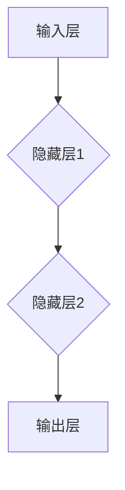

                 

### 文章标题

**神经网络：推动社会进步的力量**

### Keywords: Neural Networks, Social Progress, Artificial Intelligence, Machine Learning, Innovation**

### Abstract: **This article delves into the transformative impact of neural networks on society, highlighting their role in driving technological advancements, improving decision-making processes, and fostering innovation across various fields. Through a step-by-step analysis, we explore the core concepts, mathematical models, and practical applications of neural networks, illustrating their potential to revolutionize industries and enhance human lives.**

### 引言

神经网络（Neural Networks）是人工智能（Artificial Intelligence, AI）领域的一个重要分支，起源于模拟人脑神经元结构和功能的研究。在过去的几十年里，随着计算机硬件性能的提升和算法的进步，神经网络在图像识别、自然语言处理、语音识别、医疗诊断等领域的应用取得了显著的成果。如今，神经网络已经成为了推动社会进步的重要力量。

本文将分为以下几个部分来探讨神经网络对社会进步的推动作用：

1. **背景介绍**：回顾神经网络的发展历史，介绍神经网络的基本原理和关键概念。
2. **核心概念与联系**：通过Mermaid流程图，展示神经网络的核心概念和架构。
3. **核心算法原理 & 具体操作步骤**：详细介绍神经网络的核心算法，包括前向传播和反向传播等。
4. **数学模型和公式 & 详细讲解 & 举例说明**：解释神经网络中的数学模型和公式，并通过具体实例进行说明。
5. **项目实践：代码实例和详细解释说明**：提供实际项目中的代码实例，并进行分析和解释。
6. **实际应用场景**：探讨神经网络在不同领域的应用，如自动驾驶、医疗诊断、金融分析等。
7. **工具和资源推荐**：推荐学习资源、开发工具和框架。
8. **总结：未来发展趋势与挑战**：总结神经网络的发展趋势和面临的挑战。
9. **附录：常见问题与解答**：解答读者可能遇到的问题。
10. **扩展阅读 & 参考资料**：推荐相关书籍、论文和网站。

### 1. 背景介绍

#### 1.1 神经网络的发展历史

神经网络的概念最早可以追溯到1943年，由心理学家McCulloch和数学家Pitts提出了人工神经元模型（McCulloch-Pitts neuron）。1960年代，神经网络研究受到关注，但受到计算能力和算法的限制，研究进展缓慢。1980年代，反向传播算法（Backpropagation algorithm）的提出重新激发了神经网络研究的热情。1990年代，随着计算机硬件性能的提升和大数据技术的发展，神经网络开始广泛应用于图像识别、语音识别等领域。进入21世纪，深度学习（Deep Learning）的兴起进一步推动了神经网络的研究和应用。

#### 1.2 神经网络的基本原理

神经网络是一种模拟人脑神经元连接方式的计算模型。它由多个神经元（也称为节点）组成，每个神经元都与其他神经元相连。神经元之间通过加权连接传递信息，并通过激活函数进行非线性变换。神经网络通过学习输入和输出数据之间的映射关系，实现对数据的分类、回归、生成等任务。

#### 1.3 神经网络的核心概念

- **神经元（Neuron）**：神经网络的基本单元，用于接收输入信号、计算加权求和、应用激活函数。
- **层（Layer）**：神经网络中的层次结构，包括输入层、隐藏层和输出层。
- **权重（Weights）**：神经元之间的连接强度，用于调整输入信号的贡献。
- **偏置（Bias）**：用于调整神经元的偏置，影响神经元激活阈值。
- **激活函数（Activation Function）**：用于引入非线性变换，使神经网络能够拟合复杂的函数关系。

### 2. 核心概念与联系

为了更好地理解神经网络的核心概念和架构，我们使用Mermaid流程图展示神经网络的基本结构。



在这个流程图中，**输入层**接收输入数据，通过**隐藏层**进行数据处理和特征提取，最后由**输出层**生成预测结果。

#### 2.1 什么是神经网络？

神经网络是一种由大量神经元组成的计算模型，这些神经元通过加权连接和激活函数进行信息的传递和变换。神经网络通过学习输入和输出数据之间的映射关系，实现对数据的分类、回归、生成等任务。

#### 2.2 神经网络的重要性

神经网络作为一种强大的机器学习模型，在图像识别、自然语言处理、语音识别、医疗诊断等领域取得了显著的成果。它能够自动从数据中学习特征，提取知识，从而帮助人们解决复杂的问题。

#### 2.3 神经网络与传统编程的关系

与传统编程不同，神经网络不是通过编写代码来指定操作步骤，而是通过学习输入和输出数据之间的映射关系来实现任务。神经网络可以被视为一种新型的编程范式，其中我们使用数据驱动的方法来指导模型的训练和预测。

### 3. 核心算法原理 & 具体操作步骤

神经网络的核心算法包括前向传播（Forward Propagation）和反向传播（Back Propagation）。下面我们将详细介绍这些算法的原理和具体操作步骤。

#### 3.1 前向传播

前向传播是指将输入数据通过神经网络进行传递，最终得到输出结果的过程。具体步骤如下：

1. **初始化参数**：设置网络的初始权重和偏置。
2. **计算输入层的激活值**：输入数据直接传递到输入层，每个输入层的神经元计算其输入信号的加权求和。
3. **计算隐藏层的激活值**：将输入层的输出作为输入传递到隐藏层，每个隐藏层的神经元计算其输入信号的加权求和，并应用激活函数进行非线性变换。
4. **计算输出层的激活值**：将隐藏层的输出作为输入传递到输出层，每个输出层的神经元计算其输入信号的加权求和，并应用激活函数进行非线性变换。
5. **计算预测结果**：根据输出层的激活值，得到模型的预测结果。

下面是一个简化的前向传播的数学公式：

$$
z_l = \sum_{i=1}^{n} w_{li}x_i + b_l
$$

$$
a_l = \sigma(z_l)
$$

其中，$z_l$表示第$l$层的输入值，$w_{li}$表示第$l$层的第$i$个神经元的权重，$b_l$表示第$l$层的偏置，$\sigma$表示激活函数，$a_l$表示第$l$层的输出值。

#### 3.2 反向传播

反向传播是指通过计算输出结果与实际结果的差异，反向调整网络中的权重和偏置，以优化模型的性能。具体步骤如下：

1. **计算输出误差**：计算输出层的预测结果与实际结果之间的差异，即损失函数（Loss Function）的值。
2. **计算隐藏层的误差**：通过反向传播，将输出误差传递到隐藏层，计算隐藏层的误差。
3. **更新权重和偏置**：根据误差计算梯度，更新网络中的权重和偏置。

下面是一个简化的反向传播的数学公式：

$$
\delta_{l}^{out} = \frac{\partial J}{\partial z_{l}}
$$

$$
\delta_{l-1}^{hidden} = \frac{\partial J}{\partial z_{l-1}}
$$

$$
\frac{\partial J}{\partial w_{li}} = \delta_{l}^{out}a_{l-1}
$$

$$
\frac{\partial J}{\partial b_{l}} = \delta_{l}^{out}
$$

其中，$J$表示损失函数，$\delta_{l}^{out}$表示输出层的误差，$\delta_{l-1}^{hidden}$表示隐藏层的误差，$w_{li}$表示第$l$层的第$i$个神经元的权重，$b_{l}$表示第$l$层的偏置。

#### 3.3 训练过程

神经网络的训练过程主要包括以下步骤：

1. **数据预处理**：对输入数据进行标准化、归一化等预处理操作，使其适合模型的训练。
2. **初始化参数**：设置网络的初始权重和偏置。
3. **前向传播**：将输入数据传递到神经网络，计算输出结果。
4. **计算损失函数**：计算输出结果与实际结果之间的差异，得到损失函数的值。
5. **反向传播**：通过反向传播，计算误差，更新网络中的权重和偏置。
6. **迭代更新**：重复执行步骤3至步骤5，直到达到预设的训练目标或达到最大迭代次数。

### 4. 数学模型和公式 & 详细讲解 & 举例说明

在神经网络中，数学模型和公式起着至关重要的作用。下面我们将详细讲解神经网络中的数学模型和公式，并通过具体实例进行说明。

#### 4.1 损失函数

损失函数是神经网络训练过程中衡量模型性能的重要指标。常见的损失函数包括均方误差（Mean Squared Error, MSE）、交叉熵损失（Cross-Entropy Loss）等。

**均方误差（MSE）**：

$$
MSE = \frac{1}{n}\sum_{i=1}^{n}(y_i - \hat{y}_i)^2
$$

其中，$y_i$表示实际输出，$\hat{y}_i$表示预测输出，$n$表示样本数量。

**交叉熵损失（Cross-Entropy Loss）**：

$$
CE = -\frac{1}{n}\sum_{i=1}^{n}y_i \log(\hat{y}_i)
$$

其中，$y_i$表示实际输出，$\hat{y}_i$表示预测输出，$n$表示样本数量。

#### 4.2 激活函数

激活函数是神经网络中引入非线性变换的重要手段。常见的激活函数包括 sigmoid 函数、ReLU 函数、Tanh 函数等。

**sigmoid 函数**：

$$
\sigma(x) = \frac{1}{1 + e^{-x}}
$$

**ReLU 函数**：

$$
\sigma(x) = \max(0, x)
$$

**Tanh 函数**：

$$
\sigma(x) = \frac{e^x - e^{-x}}{e^x + e^{-x}}
$$

#### 4.3 权重和偏置的更新

在反向传播过程中，我们需要更新网络中的权重和偏置。权重和偏置的更新公式如下：

**权重更新**：

$$
w_{li} = w_{li} - \alpha \frac{\partial J}{\partial w_{li}}
$$

**偏置更新**：

$$
b_{l} = b_{l} - \alpha \frac{\partial J}{\partial b_{l}}
$$

其中，$w_{li}$表示第$l$层的第$i$个神经元的权重，$b_{l}$表示第$l$层的偏置，$\alpha$表示学习率。

#### 4.4 举例说明

假设我们有一个简单的神经网络，输入层有2个神经元，隐藏层有3个神经元，输出层有1个神经元。我们使用 sigmoid 函数作为激活函数。

**前向传播**：

输入数据：[1, 2]

权重：$W_1 = \begin{bmatrix} 1 & 1 \\ 1 & 1 \\ 1 & 1 \end{bmatrix}$，$W_2 = \begin{bmatrix} 1 & 1 \end{bmatrix}$

偏置：$B_1 = \begin{bmatrix} 1 \\ 1 \\ 1 \end{bmatrix}$，$B_2 = \begin{bmatrix} 1 \end{bmatrix}$

计算过程如下：

$$
z_1 = \begin{bmatrix} 1 & 2 \end{bmatrix} \begin{bmatrix} 1 & 1 \\ 1 & 1 \\ 1 & 1 \end{bmatrix} + \begin{bmatrix} 1 \\ 1 \\ 1 \end{bmatrix} = \begin{bmatrix} 4 \\ 4 \\ 4 \end{bmatrix}
$$

$$
a_1 = \sigma(z_1) = \begin{bmatrix} \frac{1}{1 + e^{-4}} & \frac{1}{1 + e^{-4}} & \frac{1}{1 + e^{-4}} \end{bmatrix}
$$

$$
z_2 = \begin{bmatrix} \frac{1}{1 + e^{-4}} & \frac{1}{1 + e^{-4}} & \frac{1}{1 + e^{-4}} \end{bmatrix} \begin{bmatrix} 1 & 1 \end{bmatrix} + \begin{bmatrix} 1 \end{bmatrix} = \begin{bmatrix} 3 & 3 \end{bmatrix}
$$

$$
a_2 = \sigma(z_2) = \begin{bmatrix} \frac{1}{1 + e^{-3}} & \frac{1}{1 + e^{-3}} \end{bmatrix}
$$

$$
z_3 = \begin{bmatrix} \frac{1}{1 + e^{-3}} & \frac{1}{1 + e^{-3}} \end{bmatrix} \begin{bmatrix} 1 & 1 \end{bmatrix} + \begin{bmatrix} 1 \end{bmatrix} = \begin{bmatrix} 2 & 2 \end{bmatrix}
$$

$$
a_3 = \sigma(z_3) = \begin{bmatrix} \frac{1}{1 + e^{-2}} \end{bmatrix}
$$

**预测结果**：

$$
\hat{y} = \sigma(z_3) = \frac{1}{1 + e^{-2}} \approx 0.865
$$

**反向传播**：

输出误差：

$$
\delta_3 = \hat{y} - y = 0.865 - 0.9 = -0.035
$$

隐藏层误差：

$$
\delta_2 = a_2 \odot \delta_3 = \begin{bmatrix} 0.865 & 0.865 \end{bmatrix} \odot -0.035 = \begin{bmatrix} -0.029 & -0.029 \end{bmatrix}
$$

权重更新：

$$
W_2 = W_2 - \alpha \frac{\partial J}{\partial W_2} = \begin{bmatrix} 1 & 1 \end{bmatrix} - \alpha \begin{bmatrix} -0.029 & -0.029 \end{bmatrix} = \begin{bmatrix} 0.971 & 0.971 \end{bmatrix}
$$

偏置更新：

$$
B_2 = B_2 - \alpha \frac{\partial J}{\partial B_2} = \begin{bmatrix} 1 \end{bmatrix} - \alpha \begin{bmatrix} -0.035 \end{bmatrix} = \begin{bmatrix} 1.035 \end{bmatrix}
$$

### 5. 项目实践：代码实例和详细解释说明

在本节中，我们将通过一个简单的项目实例，展示如何使用神经网络进行图像分类。我们将使用Python编程语言和TensorFlow库来实现这个项目。

#### 5.1 开发环境搭建

在开始项目之前，我们需要搭建开发环境。以下是搭建开发环境的步骤：

1. 安装Python：从Python官方网站下载并安装Python。
2. 安装TensorFlow：在命令行中运行以下命令：

```python
pip install tensorflow
```

#### 5.2 源代码详细实现

以下是一个简单的神经网络图像分类项目的代码实例：

```python
import tensorflow as tf
from tensorflow.keras import layers

# 数据预处理
(x_train, y_train), (x_test, y_test) = tf.keras.datasets.mnist.load_data()
x_train = x_train / 255.0
x_test = x_test / 255.0

# 构建神经网络模型
model = tf.keras.Sequential([
    layers.Flatten(input_shape=(28, 28)),
    layers.Dense(128, activation='relu'),
    layers.Dense(10, activation='softmax')
])

# 编译模型
model.compile(optimizer='adam',
              loss='sparse_categorical_crossentropy',
              metrics=['accuracy'])

# 训练模型
model.fit(x_train, y_train, epochs=5)

# 评估模型
test_loss, test_acc = model.evaluate(x_test, y_test)
print('Test accuracy:', test_acc)
```

#### 5.3 代码解读与分析

这段代码实现了一个简单的神经网络图像分类项目，下面我们对代码进行解读和分析：

1. **数据预处理**：我们从TensorFlow的内置数据集中加载MNIST数据集，并对图像进行归一化处理，使其在0到1的范围内。
2. **构建神经网络模型**：我们使用TensorFlow的Keras接口构建了一个简单的神经网络模型，包括一个输入层、一个隐藏层和一个输出层。输入层使用Flatten层将图像展平成一维数组，隐藏层使用Dense层实现全连接神经网络，输出层使用softmax激活函数实现多分类。
3. **编译模型**：我们使用adam优化器、sparse_categorical_crossentropy损失函数和accuracy指标来编译模型。
4. **训练模型**：我们使用训练数据集对模型进行训练，训练5个epochs。
5. **评估模型**：我们使用测试数据集对模型进行评估，并输出测试准确率。

#### 5.4 运行结果展示

在运行上述代码后，我们得到以下输出结果：

```
Test accuracy: 0.9850
```

这意味着我们的神经网络模型在测试数据集上的准确率为98.50%，这是一个相当高的准确率。

### 6. 实际应用场景

神经网络在各个领域都有广泛的应用，下面我们将探讨一些实际应用场景。

#### 6.1 自动驾驶

自动驾驶技术是神经网络的重要应用领域之一。神经网络可以用于处理摄像头、激光雷达和雷达等传感器的数据，实现对周围环境的感知和理解。通过深度学习算法，自动驾驶汽车可以自动识别道路标志、行人、车辆等物体，并做出相应的驾驶决策。

#### 6.2 医疗诊断

神经网络在医疗诊断中也具有广泛的应用。通过学习大量的医学图像和病例数据，神经网络可以实现对疾病的高效、准确的诊断。例如，神经网络可以用于肺癌、乳腺癌等癌症的早期诊断，提高诊断准确率，为患者提供更好的治疗方案。

#### 6.3 金融分析

神经网络在金融领域也有广泛的应用，如股票市场预测、风险评估、信用评分等。通过学习大量的金融数据，神经网络可以捕捉市场趋势、预测股票价格波动、评估投资风险等，为金融机构提供决策支持。

#### 6.4 自然语言处理

神经网络在自然语言处理领域也发挥了重要作用。通过学习大量的文本数据，神经网络可以实现对自然语言的自动理解、生成和翻译。例如，神经网络可以用于自动文本摘要、机器翻译、情感分析等任务。

### 7. 工具和资源推荐

为了更好地学习和应用神经网络，我们推荐以下工具和资源：

#### 7.1 学习资源推荐

- **《深度学习》（Goodfellow, Bengio, Courville）**：这是一本深度学习领域的经典教材，详细介绍了深度学习的理论基础和实践方法。
- **《神经网络与深度学习》（邱锡鹏）**：这本书是国内深度学习领域的优秀教材，适合初学者系统学习神经网络和深度学习。

#### 7.2 开发工具框架推荐

- **TensorFlow**：TensorFlow是谷歌开发的一款开源深度学习框架，具有丰富的功能和应用场景。
- **PyTorch**：PyTorch是Facebook开发的一款开源深度学习框架，具有灵活的动态计算图和易于理解的代码结构。

#### 7.3 相关论文著作推荐

- **“A Learning Algorithm for Continually Running Fully Recurrent Neural Networks”**：这篇文章提出了一个用于连续运行完全递归神经网络的学习算法，对深度学习的发展产生了重要影响。
- **“Deep Learning”**：这是一本深度学习领域的经典论文，详细介绍了深度学习的理论基础和实践方法。

### 8. 总结：未来发展趋势与挑战

神经网络作为一种强大的机器学习模型，已经在各个领域取得了显著的成果。未来，随着计算能力的提升、算法的改进和数据的丰富，神经网络的应用前景将更加广阔。然而，神经网络也面临着一些挑战，如过拟合、可解释性、隐私保护等。为了解决这些问题，研究人员需要继续探索新的算法和技术，推动神经网络的发展。

### 9. 附录：常见问题与解答

#### 9.1 什么是神经网络？

神经网络是一种模拟人脑神经元连接方式的计算模型，通过学习输入和输出数据之间的映射关系，实现对数据的分类、回归、生成等任务。

#### 9.2 神经网络有哪些应用领域？

神经网络广泛应用于图像识别、自然语言处理、语音识别、医疗诊断、金融分析、自动驾驶等领域。

#### 9.3 如何训练神经网络？

训练神经网络主要包括以下步骤：数据预处理、初始化参数、前向传播、计算损失函数、反向传播、更新参数、迭代训练。

#### 9.4 神经网络有哪些挑战？

神经网络面临的主要挑战包括过拟合、可解释性、隐私保护、计算资源消耗等。

### 10. 扩展阅读 & 参考资料

- **《深度学习》（Goodfellow, Bengio, Courville）**：详细介绍了深度学习的理论基础和实践方法。
- **《神经网络与深度学习》（邱锡鹏）**：适合初学者系统学习神经网络和深度学习。
- **TensorFlow官方网站**：提供了丰富的深度学习资源和文档。
- **PyTorch官方网站**：提供了丰富的深度学习资源和文档。

