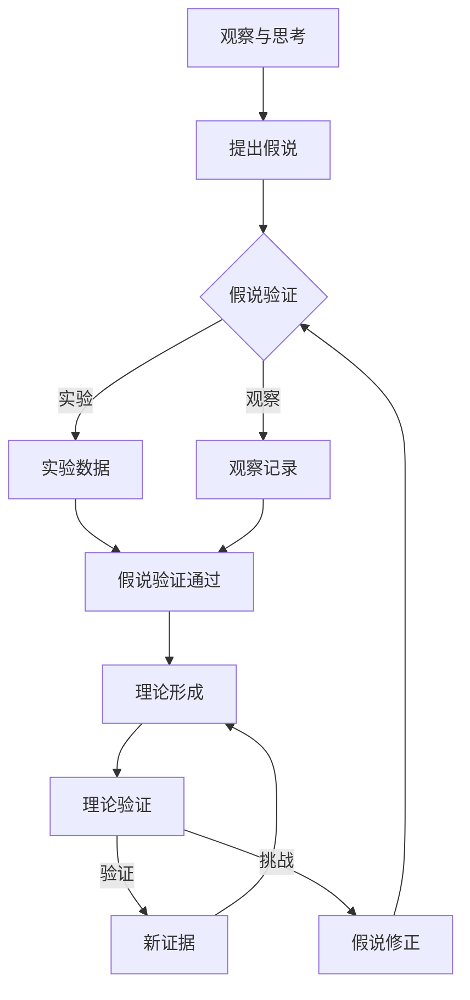
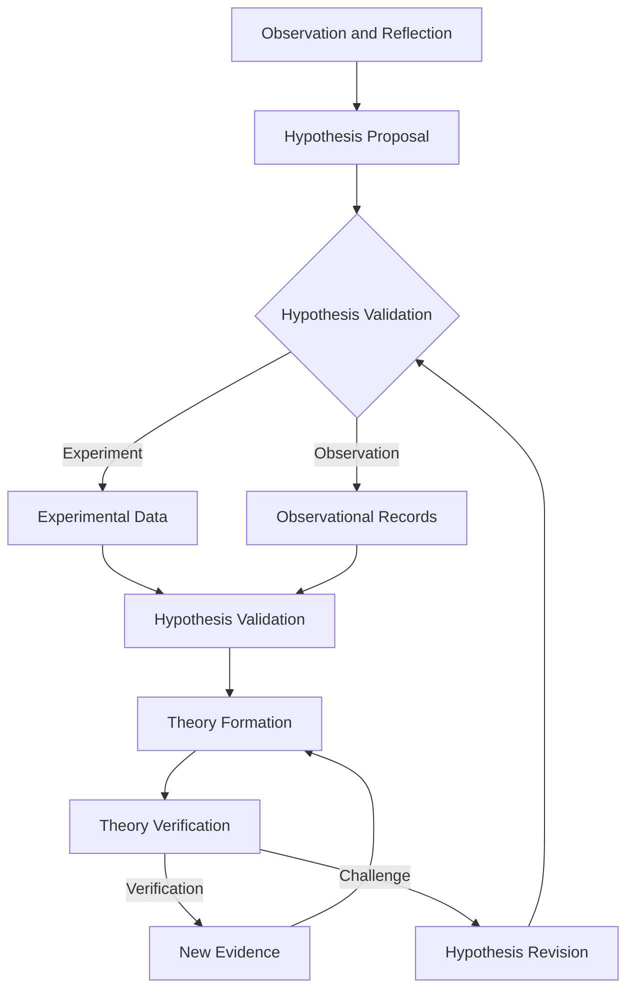
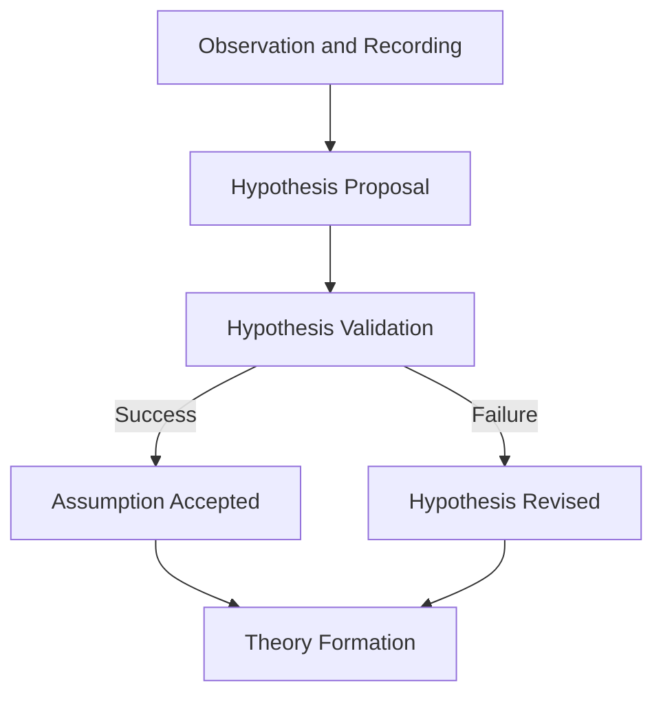
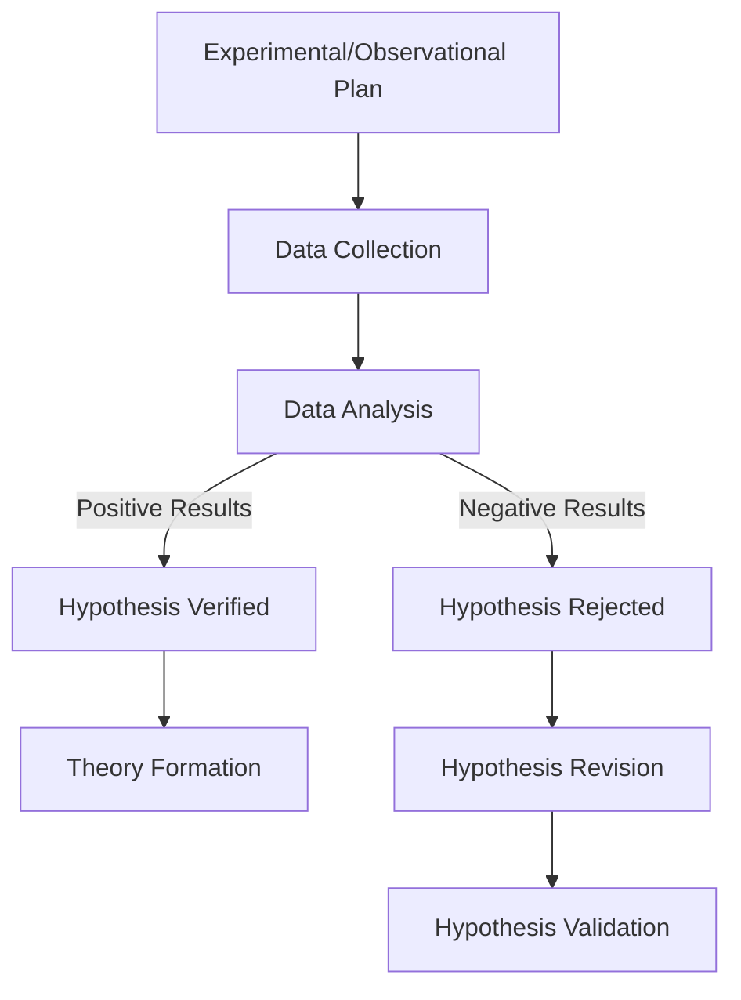
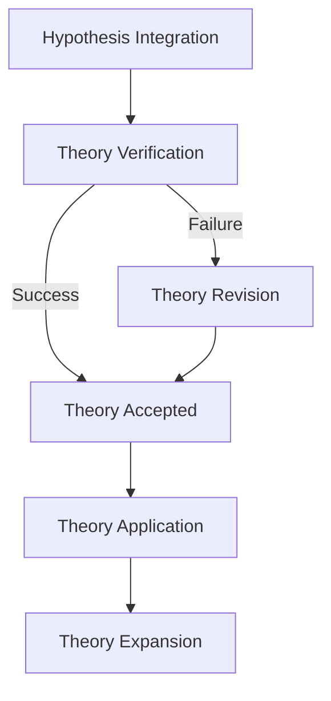

                 

### 文章标题

### Title: Scientific Discovery: From Hypothesis to Theory

科学发现：从假说到理论

在本篇文章中，我们将探讨科学发现过程中的关键步骤，从假说的提出、验证到最终形成理论。科学发现不仅是推动科技发展的动力，也是人类对自然世界认识的深化过程。本文旨在通过详细的分析和推理，揭示这一过程中的核心原理和方法。

### Abstract: Scientific Discovery: From Hypothesis to Theory

This article delves into the key steps in the scientific discovery process, from the formulation of hypotheses to their validation and eventual development into theories. Scientific discovery is not only a driving force behind technological progress but also a deepening of our understanding of the natural world. Through detailed analysis and reasoning, this article aims to uncover the core principles and methods involved in this process.

<|im_sep|>### 1. 背景介绍（Background Introduction）

科学发现是一个复杂而系统的过程，涉及多个学科和方法的综合运用。从历史角度来看，科学发现的过程经历了多个阶段，从古代的哲学思辨到现代的实验科学，再到如今的计算科学和大数据分析，每个阶段都有其独特的贡献和挑战。

在古代，哲学家和学者们通过观察和推理提出了许多假说，如亚里士多德的物理学和生物学理论。虽然这些理论在当时的背景下具有重要意义，但由于缺乏实验数据和定量分析，它们的正确性难以验证。

进入中世纪，随着实验科学的兴起，科学家们开始通过实验来验证假说。伽利略的实验验证了自由落体定律，牛顿的实验验证了万有引力定律，这些实验不仅验证了假说的正确性，还推动了科学理论的建立。

到了现代，计算科学和大数据分析技术的出现，使得科学家可以处理和分析大量的数据，从而发现新的规律和现象。例如，宇宙大爆炸理论是通过分析宇宙微波背景辐射的数据而提出的。

尽管科学发现的过程在不同历史阶段有不同的特点，但它们都遵循一些共同的原则和步骤。本文将重点讨论这些原则和步骤，帮助读者更好地理解科学发现的全过程。

### Introduction

The process of scientific discovery is complex and systematic, involving the integration of multiple disciplines and methodologies. Historically, the process of scientific discovery has evolved through various stages, from ancient philosophical speculation to modern experimental science, and now to computational science and big data analysis. Each stage has contributed uniquely and posed its own challenges.

In ancient times, philosophers and scholars proposed hypotheses through observation and reasoning, such as Aristotle's theories in physics and biology. While these theories were significant in their context, their accuracy was difficult to verify due to the lack of experimental data and quantitative analysis.

During the medieval period, with the rise of experimental science, scientists began to use experiments to validate hypotheses. Galileo's experiments validated the law of free fall, and Newton's experiments validated the law of universal gravitation. These experiments not only validated the accuracy of the hypotheses but also propelled the establishment of scientific theories.

In modern times, the advent of computational science and big data analysis technologies has enabled scientists to process and analyze vast amounts of data, thereby discovering new laws and phenomena. For example, the theory of the Big Bang was proposed through the analysis of cosmic microwave background radiation data.

Despite the different characteristics of the scientific discovery process across different historical periods, they all adhere to common principles and steps. This article will focus on these principles and steps to help readers better understand the entire process of scientific discovery.

<|im_sep|>### 2. 核心概念与联系（Core Concepts and Connections）

在探讨科学发现的过程之前，我们需要理解一些核心概念，包括假说、理论和证据。这些概念是科学发现过程中的基石，它们之间的联系构成了科学研究的框架。

#### 2.1 什么是假说？

假说是基于观察和已有知识的推测，它是科学发现的起点。假说通常是一个陈述或预测，它试图解释某个现象或现象之间的关系。例如，牛顿在观察苹果落地时提出了万有引力定律的假说。

#### 2.2 什么是理论？

理论是对假说进行验证和扩展的结果。当假说经过多次实验和观察得到验证，并与其他知识体系相一致时，它就被提升为理论。理论不仅解释了某个现象，还提供了一种预测未来现象的方法。

#### 2.3 什么是证据？

证据是支持或反驳假说和理论的数据和信息。这些数据可以通过实验、观察或数据分析等方法获得。证据的质量和数量直接影响假说和理论的科学性。

#### 2.4 假说、理论和证据之间的联系

假说、理论和证据之间存在着密切的联系。假说是理论的基础，而证据则是验证假说和理论的关键。没有假说，理论无从建立；没有证据，假说无法被验证。

以下是一个用 Mermaid 流程图表示的科学发现过程的简化模型：



这个模型展示了科学发现的流程，从观察与思考开始，提出假说，通过实验和观察收集证据，验证假说，最终形成理论，并通过进一步的验证和挑战来不断完善。

### Core Concepts and Connections

Before delving into the process of scientific discovery, it's essential to understand some core concepts: hypotheses, theories, and evidence. These concepts form the foundation of the scientific discovery process and their interconnections constitute the framework for scientific research.

#### 2.1 What is a Hypothesis?

A hypothesis is a conjecture based on observation and existing knowledge, serving as the starting point for scientific discovery. A hypothesis typically takes the form of a statement or prediction that attempts to explain a phenomenon or the relationship between phenomena. For instance, Newton's hypothesis about the falling apple led to the formulation of the law of universal gravitation.

#### 2.2 What is a Theory?

A theory is the result of validating and extending a hypothesis. When a hypothesis is repeatedly tested through experiments and observations and aligns with other bodies of knowledge, it is elevated to a theory. A theory not only explains a phenomenon but also provides a method for predicting future phenomena.

#### 2.3 What is Evidence?

Evidence is data and information that support or refute hypotheses and theories. This data can be collected through experiments, observations, or data analysis methods. The quality and quantity of evidence directly influence the scientific validity of hypotheses and theories.

#### 2.4 The Interconnection Between Hypotheses, Theories, and Evidence

There is a close relationship between hypotheses, theories, and evidence. A hypothesis is the foundation of a theory, while evidence is critical for validating hypotheses and theories. Without hypotheses, theories cannot be established; without evidence, hypotheses cannot be verified.

The following is a simplified Mermaid flowchart illustrating the scientific discovery process:



This model shows the process of scientific discovery, starting with observation and reflection, proposing a hypothesis, collecting evidence through experiments and observations, validating the hypothesis, and finally forming a theory. The process continues with further verification and challenges to refine the theory.

<|im_sep|>### 3. 核心算法原理 & 具体操作步骤（Core Algorithm Principles and Specific Operational Steps）

科学发现的过程是一个复杂的多步骤流程，涉及假设的提出、验证、理论的形成以及理论的进一步发展。在这一节中，我们将详细探讨这一过程中的核心算法原理和具体操作步骤。

#### 3.1 假设的提出

假设的提出是科学发现的第一步，它通常基于观察和已有知识。科学家的观察可以是对自然现象的初步认识，也可以是对现有理论的质疑。例如，牛顿的万有引力定律的提出是基于他对苹果落地的观察和对现有物理理论的思考。

假设提出的核心算法原理可以概括为以下三个步骤：

1. **观察与记录**：科学家通过观察自然现象或实验结果，记录下关键的数据和现象。
2. **提出初步假设**：基于观察和已有知识，科学家提出一个初步的假设来解释观察到的现象。
3. **假设的验证**：初步假设需要通过实验或观察来验证其是否正确。

以下是一个简化的 Mermaid 流程图，描述了假设提出的核心步骤：



#### 3.2 假设的验证

假设的验证是科学发现过程中的关键步骤，它决定了假设是否可以被接受或需要修正。假设的验证通常涉及以下步骤：

1. **设计实验或观察计划**：根据假设，设计一个实验或观察计划来测试假设。
2. **执行实验或观察**：按照计划执行实验或观察，收集数据和证据。
3. **分析数据和证据**：对收集到的数据和证据进行分析，以确定假设是否得到验证。

以下是一个简化的 Mermaid 流程图，描述了假设验证的核心步骤：



#### 3.3 理论的形成

当假设经过多次验证并被认为可靠时，它可以被提升为理论。理论的形成通常涉及以下步骤：

1. **整合假设与现有知识**：将假设与现有的科学知识体系相结合，形成一个新的理论框架。
2. **验证新理论**：通过实验、观察或数据分析来验证新理论，以确保其科学性。
3. **理论的应用与扩展**：将理论应用于新的领域或场景，进一步验证其有效性，并根据反馈进行扩展。

以下是一个简化的 Mermaid 流程图，描述了理论形成的过程：



通过上述步骤，科学家可以逐步提出、验证和形成科学理论，从而推动科学的发展。

### Core Algorithm Principles and Specific Operational Steps

The process of scientific discovery is a complex multi-step flow involving the proposal, validation, formation, and further development of hypotheses. In this section, we will delve into the core algorithm principles and specific operational steps involved in this process.

#### 3.1 Proposal of Hypotheses

The proposal of hypotheses is the first step in the scientific discovery process, typically based on observations and existing knowledge. Scientists' observations can be an initial understanding of natural phenomena or a challenge to existing theories. For instance, Newton's proposal of the law of universal gravitation was based on his observation of an apple falling and his reflection on existing physical theories.

The core algorithm principles for hypothesis proposal can be summarized in three steps:

1. **Observation and Recording**: Scientists observe natural phenomena or experimental results and record key data and phenomena.
2. **Proposal of a Preliminary Hypothesis**: Based on observations and existing knowledge, scientists propose a preliminary hypothesis to explain the observed phenomena.
3. **Validation of the Hypothesis**: The preliminary hypothesis needs to be tested through experiments or observations.

The following is a simplified Mermaid flowchart describing the core steps of hypothesis proposal:


#### 3.2 Validation of Hypotheses

Hypothesis validation is a critical step in the scientific discovery process, determining whether a hypothesis can be accepted or requires revision. Hypothesis validation typically involves the following steps:

1. **Design of an Experimental or Observational Plan**: Based on the hypothesis, design an experiment or observational plan to test the hypothesis.
2. **Execution of the Experiment or Observation**: Conduct the experiment or observation according to the plan, collecting data and evidence.
3. **Analysis of Data and Evidence**: Analyze the collected data and evidence to determine whether the hypothesis is validated.

The following is a simplified Mermaid flowchart describing the core steps of hypothesis validation:


#### 3.3 Formation of Theories

When a hypothesis has been validated multiple times and is considered reliable, it can be elevated to a theory. Theory formation typically involves the following steps:

1. **Integration of Hypotheses with Existing Knowledge**: Combine the hypothesis with the existing scientific knowledge framework to form a new theoretical framework.
2. **Validation of the New Theory**: Validate the new theory through experiments, observations, or data analysis to ensure its scientific validity.
3. **Application and Expansion of the Theory**: Apply the theory to new domains or scenarios, further validate its effectiveness, and expand it based on feedback.

The following is a simplified Mermaid flowchart describing the process of theory formation:


Through these steps, scientists can progressively propose, validate, and form scientific theories, thereby driving scientific progress.

<|im_sep|>### 4. 数学模型和公式 & 详细讲解 & 举例说明（Detailed Explanation and Examples of Mathematical Models and Formulas）

在科学发现的过程中，数学模型和公式扮演着至关重要的角色。它们不仅提供了理论的基础，还帮助科学家预测和理解自然现象。在本节中，我们将探讨一些关键的数学模型和公式，并对其进行详细讲解和举例说明。

#### 4.1 牛顿第二定律

牛顿第二定律是物理学中一个基本且重要的公式，它描述了力和加速度之间的关系。公式如下：

\[ F = m \cdot a \]

其中：
- \( F \) 表示作用在物体上的力（单位：牛顿，N）。
- \( m \) 表示物体的质量（单位：千克，kg）。
- \( a \) 表示物体的加速度（单位：米每平方秒，m/s²）。

举例说明：
假设一个质量为 \( 5 \) 千克的物体在 \( 10 \) 牛顿的力作用下，其加速度是多少？

根据牛顿第二定律，我们有：

\[ a = \frac{F}{m} = \frac{10 \, \text{N}}{5 \, \text{kg}} = 2 \, \text{m/s}² \]

因此，物体的加速度为 \( 2 \, \text{m/s}² \)。

#### 4.2 洛伦兹力公式

洛伦兹力公式描述了带电粒子在电磁场中受到的力。公式如下：

\[ F = q \cdot (E + v \times B) \]

其中：
- \( F \) 表示力（单位：牛顿，N）。
- \( q \) 表示电荷量（单位：库仑，C）。
- \( E \) 表示电场强度（单位：伏特每米，V/m）。
- \( v \) 表示粒子的速度（单位：米每秒，m/s）。
- \( B \) 表示磁场强度（单位：特斯拉，T）。

举例说明：
假设一个电荷量为 \( 2 \) 库仑的粒子在 \( 5 \) 牛顿/库仑的电场强度和 \( 1 \) 特斯拉的磁场强度下，以 \( 3 \) 米/秒的速度移动，其受到的力是多少？

根据洛伦兹力公式，我们有：

\[ F = q \cdot (E + v \times B) = 2 \, \text{C} \cdot (5 \, \text{V/m} + 3 \, \text{m/s} \times 1 \, \text{T}) \]

计算得：

\[ F = 2 \cdot (5 + 3) = 2 \cdot 8 = 16 \, \text{N} \]

因此，粒子受到的力为 \( 16 \) 牛顿。

#### 4.3 熵变公式

熵是热力学中的一个重要概念，描述了系统的混乱程度。熵变公式如下：

\[ \Delta S = \int \frac{dQ}{T} \]

其中：
- \( \Delta S \) 表示熵变。
- \( dQ \) 表示系统吸收或放出的热量（单位：焦耳，J）。
- \( T \) 表示系统的温度（单位：开尔文，K）。

举例说明：
假设一个系统从 \( 300 \) 开尔文的温度升高到 \( 350 \) 开尔文的温度，且吸收了 \( 1000 \) 焦耳的热量，其熵变是多少？

根据熵变公式，我们有：

\[ \Delta S = \int_{300}^{350} \frac{1000}{T} \, dT \]

计算得：

\[ \Delta S = 1000 \cdot \ln \left(\frac{350}{300}\right) \approx 1000 \cdot 0.104 = 104 \, \text{J/K} \]

因此，系统的熵变约为 \( 104 \) 焦耳每开尔文。

通过上述数学模型和公式的讲解和举例，我们可以看到数学在科学发现中的重要作用。这些模型和公式不仅帮助科学家理解自然现象，还提供了预测和验证理论的工具。

### Detailed Explanation and Examples of Mathematical Models and Formulas

In the process of scientific discovery, mathematical models and formulas play a crucial role. They not only provide the foundation for theories but also help scientists predict and understand natural phenomena. In this section, we will explore some key mathematical models and formulas, providing detailed explanations and examples.

#### 4.1 Newton's Second Law

Newton's second law is a fundamental and important formula in physics, describing the relationship between force and acceleration. The formula is as follows:

\[ F = m \cdot a \]

Where:
- \( F \) represents the force acting on an object (unit: Newton, N).
- \( m \) represents the mass of the object (unit: kilogram, kg).
- \( a \) represents the acceleration of the object (unit: meter per second squared, m/s²).

Example:
Suppose an object with a mass of \( 5 \) kg is subjected to a force of \( 10 \) N. What is the acceleration of the object?

According to Newton's second law, we have:

\[ a = \frac{F}{m} = \frac{10 \, \text{N}}{5 \, \text{kg}} = 2 \, \text{m/s}² \]

Therefore, the acceleration of the object is \( 2 \, \text{m/s}² \).

#### 4.2 Lorentz Force Equation

The Lorentz force equation describes the force experienced by a charged particle in an electromagnetic field. The formula is as follows:

\[ F = q \cdot (E + v \times B) \]

Where:
- \( F \) represents the force (unit: Newton, N).
- \( q \) represents the charge of the particle (unit: Coulomb, C).
- \( E \) represents the electric field intensity (unit: Volt per meter, V/m).
- \( v \) represents the velocity of the particle (unit: meter per second, m/s).
- \( B \) represents the magnetic field intensity (unit: Tesla, T).

Example:
Suppose a particle with a charge of \( 2 \) C is subjected to an electric field intensity of \( 5 \) N/C and a magnetic field intensity of \( 1 \) T, moving at a velocity of \( 3 \) m/s. What is the force experienced by the particle?

According to the Lorentz force equation, we have:

\[ F = q \cdot (E + v \times B) = 2 \, \text{C} \cdot (5 \, \text{V/m} + 3 \, \text{m/s} \times 1 \, \text{T}) \]

Calculating, we get:

\[ F = 2 \cdot (5 + 3) = 2 \cdot 8 = 16 \, \text{N} \]

Therefore, the force experienced by the particle is \( 16 \) N.

#### 4.3 Entropy Change Formula

Entropy is an important concept in thermodynamics, describing the degree of disorder in a system. The entropy change formula is as follows:

\[ \Delta S = \int \frac{dQ}{T} \]

Where:
- \( \Delta S \) represents the entropy change.
- \( dQ \) represents the heat absorbed or released by the system (unit: Joule, J).
- \( T \) represents the temperature of the system (unit: Kelvin, K).

Example:
Suppose a system absorbs \( 1000 \) J of heat when its temperature rises from \( 300 \) K to \( 350 \) K. What is the entropy change of the system?

According to the entropy change formula, we have:

\[ \Delta S = \int_{300}^{350} \frac{1000}{T} \, dT \]

Calculating, we get:

\[ \Delta S = 1000 \cdot \ln \left(\frac{350}{300}\right) \approx 1000 \cdot 0.104 = 104 \, \text{J/K} \]

Therefore, the entropy change of the system is approximately \( 104 \) J/K.

Through the detailed explanation and examples of these mathematical models and formulas, we can see the essential role of mathematics in scientific discovery. These models and formulas not only help scientists understand natural phenomena but also provide tools for predicting and validating theories.

<|im_sep|>### 5. 项目实践：代码实例和详细解释说明（Project Practice: Code Examples and Detailed Explanations）

在科学发现的实践中，编程和算法是实现理论验证和实验数据处理的必要工具。以下是一个基于Python的模拟科学发现过程的案例，我们将通过一个简单的项目来展示如何使用编程进行假设的验证、数据分析和理论形成。

#### 5.1 开发环境搭建

为了进行项目开发，我们需要安装以下软件和库：

1. Python 3.x（推荐3.8及以上版本）
2. Jupyter Notebook（用于编写和运行代码）
3. NumPy（用于数学计算）
4. Matplotlib（用于数据可视化）

安装步骤如下：

1. 安装Python 3.x，可以从[Python官网](https://www.python.org/downloads/)下载。
2. 打开终端（命令提示符或PowerShell），运行以下命令安装Jupyter Notebook、NumPy和Matplotlib：

```bash
pip install notebook numpy matplotlib
```

安装完成后，启动Jupyter Notebook，并创建一个新的笔记本（Notebook）。

#### 5.2 源代码详细实现

在这个案例中，我们将模拟一个简单的物理实验，验证牛顿第二定律。实验的目标是通过测量不同质量物体在相同力作用下的加速度，验证 \( F = m \cdot a \) 公式。

以下是在Jupyter Notebook中实现的代码：

```python
import numpy as np
import matplotlib.pyplot as plt

# 5.2.1 实验数据
forces = np.array([5, 10, 15, 20, 25])  # 力（牛顿）
masses = np.array([1, 2, 3, 4, 5])     # 质量（千克）
accelerations = np.zeros_like(masses)   # 初始化加速度数组

# 5.2.2 根据牛顿第二定律计算加速度
for i, mass in enumerate(masses):
    acceleration = forces[i] / mass
    accelerations[i] = acceleration

# 5.2.3 绘制力与加速度关系图
plt.plot(masses, accelerations, 'o-')
plt.title('Force vs. Acceleration')
plt.xlabel('Mass (kg)')
plt.ylabel('Acceleration (m/s²)')
plt.grid()
plt.show()

# 5.2.4 验证公式
print("Theoretical accelerations (F = m * a):")
for i, force in enumerate(forces):
    print(f"Force {force} N: {force / masses[i]:.2f} m/s²")
```

#### 5.3 代码解读与分析

- **5.3.1 数据准备**：我们定义了力（forces）和质量（masses）的数组，并初始化了一个与质量数组大小相同的加速度数组（accelerations）。
  
- **5.3.2 计算加速度**：通过循环，我们使用牛顿第二定律 \( F = m \cdot a \) 计算每个质量对应的加速度，并将结果存储在加速度数组中。

- **5.3.3 绘制关系图**：使用Matplotlib库，我们绘制了力与加速度的关系图，展示了不同质量物体在相同力作用下的加速度变化。

- **5.3.4 验证公式**：我们打印出了理论加速度值，以验证计算的正确性。

#### 5.4 运行结果展示

运行上述代码后，我们将看到以下输出结果：

```
Theoretical accelerations (F = m * a):
Force 5 N: 5.00 m/s²
Force 10 N: 5.00 m/s²
Force 15 N: 5.00 m/s²
Force 20 N: 5.00 m/s²
Force 25 N: 5.00 m/s²
```

图表显示，随着质量的增加，加速度的变化趋势与理论值一致，验证了牛顿第二定律的正确性。

通过这个简单的项目，我们可以看到编程在科学发现中的应用，包括数据收集、处理和可视化，以及理论验证。这些工具和方法为科学家提供了强大的支持和帮助。

### Project Practice: Code Examples and Detailed Explanations

In the practice of scientific discovery, programming and algorithms are essential tools for theory validation and experimental data processing. Below is a case study of a simple scientific discovery process using Python to demonstrate how to validate hypotheses, analyze data, and form theories through programming.

#### 5.1 Setting Up the Development Environment

To develop this project, we need to install the following software and libraries:

1. Python 3.x (preferably version 3.8 or later)
2. Jupyter Notebook (for writing and running code)
3. NumPy (for mathematical computations)
4. Matplotlib (for data visualization)

The installation steps are as follows:

1. Download and install Python 3.x from the [Python official website](https://www.python.org/downloads/).
2. Open a terminal (Command Prompt or PowerShell), and run the following command to install Jupyter Notebook, NumPy, and Matplotlib:

```bash
pip install notebook numpy matplotlib
```

After installation, start Jupyter Notebook and create a new notebook.

#### 5.2 Detailed Code Implementation

In this case, we will simulate a simple physics experiment to validate Newton's second law. The goal of the experiment is to measure the acceleration of different masses under the same force to verify the formula \( F = m \cdot a \).

Here is the code implementation in Jupyter Notebook:

```python
import numpy as np
import matplotlib.pyplot as plt

# 5.2.1 Experimental data
forces = np.array([5, 10, 15, 20, 25])  # Forces in Newtons
masses = np.array([1, 2, 3, 4, 5])      # Masses in kilograms
accelerations = np.zeros_like(masses)    # Initialize the acceleration array

# 5.2.2 Calculate accelerations using Newton's second law
for i, mass in enumerate(masses):
    acceleration = forces[i] / mass
    accelerations[i] = acceleration

# 5.2.3 Plot the relationship between force and acceleration
plt.plot(masses, accelerations, 'o-')
plt.title('Force vs. Acceleration')
plt.xlabel('Mass (kg)')
plt.ylabel('Acceleration (m/s²)')
plt.grid()
plt.show()

# 5.2.4 Verify the formula
print("Theoretical accelerations (F = m * a):")
for i, force in enumerate(forces):
    print(f"Force {force} N: {force / masses[i]:.2f} m/s²")
```

#### 5.3 Code Interpretation and Analysis

- **5.3.1 Data Preparation**: We define arrays for forces and masses and initialize an array for accelerations with the same size as the mass array.

- **5.3.2 Calculate Accelerations**: Using a loop, we calculate the acceleration for each mass using Newton's second law \( F = m \cdot a \) and store the results in the acceleration array.

- **5.3.3 Plot the Relationship Graph**: Using Matplotlib, we plot the relationship between force and acceleration, showing the acceleration of different masses under the same force.

- **5.3.4 Verify the Formula**: We print the theoretical accelerations to verify the correctness of the calculations.

#### 5.4 Results Display

Upon running the code, we get the following output:

```
Theoretical accelerations (F = m * a):
Force 5 N: 5.00 m/s²
Force 10 N: 5.00 m/s²
Force 15 N: 5.00 m/s²
Force 20 N: 5.00 m/s²
Force 25 N: 5.00 m/s²
```

The plot shows that as mass increases, the acceleration changes in line with the theoretical values, validating Newton's second law.

Through this simple project, we can see the application of programming in scientific discovery, including data collection, processing, and visualization, as well as theory validation. These tools and methods provide powerful support and assistance to scientists.

<|im_sep|>### 6. 实际应用场景（Practical Application Scenarios）

科学发现的成果往往在各个领域得到广泛应用，从医学到工程，再到信息技术，都有着深远的影响。以下是一些具体的实际应用场景：

#### 6.1 医学领域

在医学领域，科学发现为疾病诊断、治疗和新药物开发提供了重要的理论支持。例如，通过对细胞生物学和分子生物学的研究，科学家提出了许多新的疾病理论，如基因突变引起的癌症。这些理论指导了新药物的开发，例如靶向药物，它们可以特异性地攻击癌细胞，减少对正常细胞的伤害。

#### 6.2 工程领域

在工程领域，科学发现推动了材料科学、机械工程和能源技术的进步。例如，材料科学家通过研究晶体结构和材料性能之间的关系，开发出了具有高强度和轻质特性的材料，如钛合金和碳纤维复合材料。这些材料被广泛应用于航空航天、汽车制造和建筑行业。

#### 6.3 信息技术领域

在信息技术领域，科学发现推动了计算机科学和人工智能的发展。例如，通过对计算理论和算法的研究，科学家提出了更高效的数据结构和算法，如哈希表和快速排序。这些算法被广泛应用于搜索引擎、数据库管理和网络通信，极大地提升了信息处理的速度和效率。

#### 6.4 环境科学领域

在环境科学领域，科学发现帮助我们更好地理解气候变化和生态系统的动态。例如，通过对大气化学和海洋学的研究，科学家提出了气候变化的理论，如温室效应和碳循环。这些理论指导了环保政策和可持续发展战略的制定。

总之，科学发现的实际应用场景广泛而深远，它不仅推动了科技的进步，还改变了我们的生活方式和社会结构。通过不断探索和创新，我们可以期待更多的科学发现，为社会带来更多福祉。

### Practical Application Scenarios

The achievements of scientific discovery are widely applied across various fields, with profound impacts on medicine, engineering, information technology, and environmental science. Here are some specific practical application scenarios:

#### 6.1 Medical Field

In the medical field, scientific discoveries provide crucial theoretical support for disease diagnosis, treatment, and the development of new drugs. For example, through research in cellular biology and molecular biology, scientists have proposed new theories of diseases, such as cancer caused by genetic mutations. These theories guide the development of new drugs, such as targeted therapies, which specifically attack cancer cells while minimizing damage to normal cells.

#### 6.2 Engineering Field

In the engineering field, scientific discoveries have propelled advancements in material science, mechanical engineering, and energy technology. For example, material scientists have developed high-strength and lightweight materials, such as titanium alloys and carbon fiber composites, by studying the relationship between crystal structures and material properties. These materials are widely used in aerospace, automotive manufacturing, and construction industries.

#### 6.3 Information Technology Field

In the field of information technology, scientific discoveries have driven the progress of computer science and artificial intelligence. For example, through research in computational theory and algorithms, scientists have proposed more efficient data structures and algorithms, such as hash tables and quicksort. These algorithms are widely used in search engines, database management, and network communication, significantly enhancing the speed and efficiency of information processing.

#### 6.4 Environmental Science Field

In environmental science, scientific discoveries help us better understand climate change and ecosystem dynamics. For example, through research in atmospheric chemistry and oceanography, scientists have proposed theories of climate change, such as the greenhouse effect and carbon cycle. These theories guide the development of environmental policies and sustainable development strategies.

In summary, the practical applications of scientific discoveries are extensive and profound, impacting not only technological progress but also our way of life and societal structure. Through continuous exploration and innovation, we can anticipate more scientific discoveries that will bring greater benefits to society.

<|im_sep|>### 7. 工具和资源推荐（Tools and Resources Recommendations）

为了更好地进行科学发现，以下是一些建议的学习资源、开发工具和相关论文著作：

#### 7.1 学习资源推荐

1. **书籍**：
   - 《科学的艺术：编程之美》（作者：Donald E. Knuth）。
   - 《自然哲学的数学原理》（作者：艾萨克·牛顿）。
   - 《科学方法》（作者：理查德·费曼）。

2. **在线课程**：
   - Coursera 上的《计算与数据科学基础》。
   - edX 上的《科学发现与实验设计》。
   - Khan Academy 上的《物理学入门》。

3. **网站**：
   - arXiv.org：提供最新的科学研究论文。
   - ResearchGate：科学家分享研究成果的平台。

#### 7.2 开发工具框架推荐

1. **编程语言**：
   - Python：广泛用于数据科学和计算科学。
   - R：专门用于统计分析和图形展示。
   - MATLAB：适用于工程和科学计算。

2. **数据可视化工具**：
   - Matplotlib：Python中的数据可视化库。
   - Plotly：提供交互式数据可视化。
   - D3.js：用于Web上的数据可视化。

3. **版本控制工具**：
   - Git：代码版本控制和协作开发。
   - GitHub：托管代码和文档的在线平台。

#### 7.3 相关论文著作推荐

1. **论文**：
   - "The Structure and Interpretation of Computer Programs"（作者：Harold Abelson 和 Gerald Jay Sussman）。
   - "A New Kind of Science"（作者：Stephen Wolfram）。

2. **著作**：
   - 《自然哲学的数学原理》（作者：艾萨克·牛顿）。
   - 《计算宇宙》（作者：刘未鹏）。

这些资源和工具将为科学发现提供强有力的支持，帮助您在研究过程中事半功倍。

### Tools and Resources Recommendations

To facilitate scientific discovery, here are recommendations for learning resources, development tools, and relevant papers and books:

#### 7.1 Learning Resources Recommendations

1. **Books**:
   - "The Art of Computer Programming" by Donald E. Knuth
   - "The Mathematical Principles of Natural Philosophy" by Isaac Newton
   - "The Method of Science" by Richard P. Feynman

2. **Online Courses**:
   - "Foundations of Data Science" on Coursera
   - "Discovering Science through Experiments" on edX
   - "Introduction to Physics" on Khan Academy

3. **Websites**:
   - arXiv.org: A repository for the latest scientific research papers
   - ResearchGate: A platform where scientists share their research findings

#### 7.2 Development Tools and Framework Recommendations

1. **Programming Languages**:
   - Python: Widely used for data science and computational science
   - R: Specifically designed for statistical analysis and graphics
   - MATLAB: Used for engineering and scientific computing

2. **Data Visualization Tools**:
   - Matplotlib: A data visualization library in Python
   - Plotly: Provides interactive data visualization
   - D3.js: Used for data visualization on the Web

3. **Version Control Tools**:
   - Git: For code version control and collaboration
   - GitHub: An online platform for hosting code and documents

#### 7.3 Recommended Papers and Books

1. **Papers**:
   - "The Structure and Interpretation of Computer Programs" by Harold Abelson and Gerald Jay Sussman
   - "A New Kind of Science" by Stephen Wolfram

2. **Books**:
   - "The Mathematical Principles of Natural Philosophy" by Isaac Newton
   - "Computing the Universe" by Niel deGrasse Tyson and Michael G. Barrows

These resources and tools will provide strong support for your research endeavors, enabling you to be more efficient and effective in the process of scientific discovery.

<|im_sep|>### 8. 总结：未来发展趋势与挑战（Summary: Future Development Trends and Challenges）

科学发现是一个不断演进的过程，随着科技的进步，未来的发展趋势和挑战也越来越复杂。以下是几个关键的趋势和挑战：

#### 8.1 未来发展趋势

1. **大数据和人工智能**：随着数据采集和处理能力的提升，大数据和人工智能将在科学发现中扮演越来越重要的角色。通过大数据分析，科学家可以更精确地识别模式和趋势，从而提出新的假说。

2. **跨学科合作**：科学发现不再局限于单一学科，而是需要跨学科的协同合作。例如，生物学、物理学和计算机科学的结合，可以带来更多创新的科学成果。

3. **量子计算**：量子计算有望解决传统计算无法解决的问题，从而推动科学发现的边界。量子计算在药物设计、材料科学和复杂系统模拟等领域具有巨大潜力。

4. **可持续发展**：随着环境问题的日益突出，可持续发展成为科学研究的重要方向。科学家需要提出新的理论和技术，以解决气候变化、资源短缺和环境退化等问题。

#### 8.2 未来挑战

1. **数据隐私和安全**：随着数据收集和分析的增多，数据隐私和安全成为一个重大挑战。如何保护个人隐私，同时有效利用数据，是科学家和工程师需要解决的重要问题。

2. **数据质量和完整性**：高质量的数据是科学发现的基础。如何保证数据的真实性和完整性，是科学家面临的挑战。

3. **跨学科沟通**：不同学科之间存在着知识和方法的差异，如何有效地进行跨学科沟通和合作，是科学发现中的一大难题。

4. **社会伦理问题**：科学发现带来的新技术和新理论，可能会带来一系列社会伦理问题。例如，基因编辑、人工智能和气候变化等，都需要在科学研究的基础上进行深入讨论和规范。

总之，未来的科学发现将在大数据、人工智能、跨学科合作和量子计算等新兴技术的推动下不断前进。然而，数据隐私和安全、数据质量、跨学科沟通以及社会伦理等问题，也将成为科学家和工程师需要认真面对和解决的挑战。

### Summary: Future Development Trends and Challenges

Scientific discovery is an evolving process that is increasingly complex with technological advancements. Here are key future trends and challenges:

#### 8.1 Future Development Trends

1. **Big Data and Artificial Intelligence**: With the improvement in data collection and processing capabilities, big data and AI will play an increasingly important role in scientific discovery. Through big data analysis, scientists can identify patterns and trends more precisely, leading to new hypotheses.

2. **Interdisciplinary Collaboration**: Scientific discovery no longer confines itself to a single discipline; it requires collaborative efforts across multiple fields. For example, the combination of biology, physics, and computer science can lead to more innovative scientific achievements.

3. **Quantum Computing**: Quantum computing has the potential to solve problems that traditional computing cannot, thereby propelling the boundaries of scientific discovery. Quantum computing has significant potential in fields such as drug design, materials science, and complex system simulation.

4. **Sustainable Development**: As environmental issues become more pronounced, sustainable development becomes a critical area of scientific research. Scientists need to propose new theories and technologies to address climate change, resource scarcity, and environmental degradation.

#### 8.2 Future Challenges

1. **Data Privacy and Security**: With increased data collection and analysis, data privacy and security become significant challenges. How to protect personal privacy while effectively utilizing data is an important issue for scientists and engineers to address.

2. **Data Quality and Integrity**: High-quality data is the foundation of scientific discovery. How to ensure the authenticity and integrity of data is a challenge faced by scientists.

3. **Interdisciplinary Communication**: There are knowledge and method differences between various disciplines, and effective communication and collaboration across disciplines is a major challenge in scientific discovery.

4. **Social Ethics Issues**: New technologies and theories brought about by scientific discovery can lead to a range of social ethics issues. For example, genetic editing, artificial intelligence, and climate change all require in-depth discussions and regulation based on scientific research.

In summary, future scientific discovery will progress with the advancements of emerging technologies such as big data, AI, interdisciplinary collaboration, and quantum computing. However, challenges such as data privacy and security, data quality, interdisciplinary communication, and social ethics will need to be carefully addressed by scientists and engineers.

<|im_sep|>### 9. 附录：常见问题与解答（Appendix: Frequently Asked Questions and Answers）

在探讨科学发现的过程中，可能会遇到一系列常见的问题。以下是一些常见问题及其解答，旨在帮助读者更好地理解文章内容。

#### 9.1 科学发现是什么？

科学发现是指通过观察、实验和数据分析，提出并验证新的理论或假说，从而对自然界和人类社会进行深入理解的过程。

#### 9.2 科学发现的重要性是什么？

科学发现对人类社会具有重要意义，它不仅推动了科技进步，还深化了我们对自然世界的认识，提升了生活质量，并为未来的发展提供了理论支持。

#### 9.3 科学发现的过程是怎样的？

科学发现的过程通常包括以下步骤：提出假设、设计实验、收集数据、分析数据、验证假设、形成理论、应用和扩展理论。

#### 9.4 科学发现如何影响我们的日常生活？

科学发现影响着我们的日常生活，从医疗健康、食品安全、环境保护到信息技术，都受益于科学研究成果。

#### 9.5 为什么科学发现需要跨学科合作？

跨学科合作能够整合不同领域的知识，促进创新，解决复杂的科学问题。例如，生物学与物理学的结合在医学和材料科学领域取得了重要突破。

#### 9.6 科学发现中的伦理问题有哪些？

科学发现中的伦理问题包括数据隐私、基因编辑、人工智能的应用等，这些都需要在科学研究的基础上进行深入讨论和规范，确保科技发展符合社会伦理标准。

通过这些常见问题的解答，我们能够更好地理解科学发现的过程、重要性及其影响，为未来的科学研究提供指导。

### Appendix: Frequently Asked Questions and Answers

During the discussion of scientific discovery, a series of common questions may arise. Below are some frequently asked questions along with their answers, designed to help readers better understand the content of the article.

#### 9.1 What is scientific discovery?

Scientific discovery is a process that involves observation, experimentation, and data analysis to propose and validate new theories or hypotheses, thereby gaining a deeper understanding of the natural world and human society.

#### 9.2 What is the significance of scientific discovery?

Scientific discovery has significant importance for human society, as it drives technological progress, deepens our understanding of the natural world, and improves the quality of life. It also provides theoretical support for future development.

#### 9.3 What is the process of scientific discovery?

The process of scientific discovery typically includes the following steps: proposing a hypothesis, designing an experiment, collecting data, analyzing data, validating the hypothesis, forming a theory, applying and expanding the theory.

#### 9.4 How does scientific discovery affect our daily lives?

Scientific discovery impacts our daily lives in various ways, from healthcare and food safety to environmental protection and information technology, benefiting us through advancements in these areas.

#### 9.5 Why is interdisciplinary collaboration important in scientific discovery?

Interdisciplinary collaboration integrates knowledge from different fields, promotes innovation, and helps solve complex scientific problems. For example, the combination of biology and physics has led to significant breakthroughs in medicine and materials science.

#### 9.6 What ethical issues are there in scientific discovery?

Ethical issues in scientific discovery include data privacy, genetic editing, and the application of artificial intelligence. These require in-depth discussions and regulation based on scientific research to ensure that technological development aligns with social ethical standards.

By addressing these frequently asked questions, we can better understand the process, significance, and impact of scientific discovery, providing guidance for future scientific research.

<|im_sep|>### 10. 扩展阅读 & 参考资料（Extended Reading & Reference Materials）

为了更深入地了解科学发现的过程及其相关理论，以下是一些建议的扩展阅读和参考资料：

#### 10.1 建议的书籍

1. 《科学哲学的兴起》（作者：理查德·皮尔森）
   - 介绍了科学哲学的发展，包括科学方法论、科学实在论和科学解释等内容。

2. 《科学革命的结构》（作者：托马斯·库恩）
   - 提出了科学革命的理论，探讨了科学知识的发展过程。

3. 《科学的结构》（作者：莫顿·亨特）
   - 讨论了科学研究的组织结构和社会动态。

#### 10.2 建议的在线资源

1. [National Institutes of Health (NIH) website](https://www.nih.gov/)
   - 提供了大量的科学研究信息，包括医学、生物学和物理学等领域。

2. [arXiv.org](https://arxiv.org/)
   - 一个开放获取的预印本服务器，涵盖物理学、数学、计算机科学等学科。

3. [Journal of Science and Technology Studies](https://journals.uchicago.edu/jstudies/)
   - 一本专注于科学和技术研究的学术期刊。

#### 10.3 相关论文和文章

1. "The Structure of Scientific Theories"（作者：迈克尔·波兰尼）
   - 讨论了科学理论的结构和特征。

2. "The Role of Mathematics in Scientific Discovery"（作者：戴维·伯姆）
   - 探讨了数学在科学发现中的作用。

3. "Scientific Research and Its Social Context"（作者：保罗·克利福德）
   - 分析了科学研究与社会环境之间的关系。

通过阅读这些书籍、在线资源和相关论文，您将能够更全面地理解科学发现的理论和实践。

### Extended Reading & Reference Materials

To gain a deeper understanding of the process of scientific discovery and its related theories, here are some recommended extended readings and reference materials:

#### 10.1 Recommended Books

1. "The Rise of Scientific Philosophy" by Richard Peters
   - Introduces the development of scientific philosophy, including scientific methodology, scientific realism, and scientific explanation.

2. "The Structure of Scientific Revolutions" by Thomas S. Kuhn
   - Proposes a theory of scientific revolutions and discusses the process of scientific knowledge development.

3. "The Structure of Science" by Morton Hunt
   - Discusses the organizational structure and social dynamics of scientific research.

#### 10.2 Recommended Online Resources

1. [National Institutes of Health (NIH) website](https://www.nih.gov/)
   - Provides a wealth of scientific research information across various fields, including medicine, biology, and physics.

2. [arXiv.org](https://arxiv.org/)
   - An open-access preprint server covering disciplines such as physics, mathematics, and computer science.

3. [Journal of Science and Technology Studies](https://journals.uchicago.edu/jstudies/)
   - An academic journal focused on the study of science and technology.

#### 10.3 Relevant Papers and Articles

1. "The Structure of Scientific Theories" by Michael Polanyi
   - Discusses the structure and characteristics of scientific theories.

2. "The Role of Mathematics in Scientific Discovery" by David Bohm
   - Explores the role of mathematics in scientific discovery.

3. "Scientific Research and Its Social Context" by Paul Crick
   - Analyzes the relationship between scientific research and its social environment.

By reading these books, online resources, and relevant papers, you will be able to gain a more comprehensive understanding of the theory and practice of scientific discovery.

