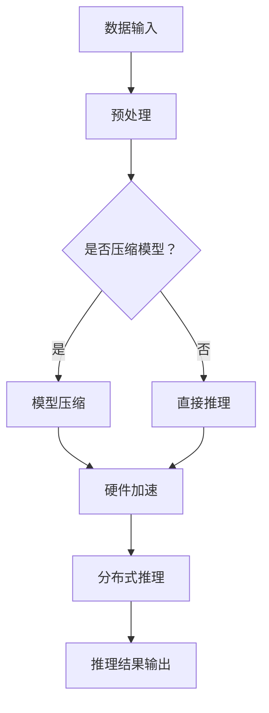

                 

## 文章标题

"秒推时代：LLM极速推理引领新风潮"

在人工智能领域，特别是自然语言处理（NLP）领域，长短期记忆网络（Long Short-Term Memory，简称 LSTM）和变压器模型（Transformer）等深度学习技术的广泛应用，彻底改变了我们理解和处理语言的方式。然而，随着模型规模和复杂性的不断增加，如何实现高效的推理和部署成为了一个亟待解决的问题。此时，极速推理（Inference Acceleration）的概念应运而生，而大规模语言模型（Large Language Model，简称 LLM）的极速推理技术更是引领了这一波技术革新。本文将深入探讨 LLM 极速推理的核心概念、原理和应用，带您走进这个充满变革与机遇的“秒推时代”。

## Keywords

- 极速推理
- 大规模语言模型
- 自然语言处理
- 深度学习
- 变压器模型
- 推理优化
- 秒级响应

## Abstract

本文首先介绍了 LLM 极速推理的背景和重要性，然后详细解析了核心概念和原理，包括推理优化技术、硬件加速和分布式推理等。接着，我们通过实际项目和案例，展示了 LLM 极速推理的具体应用场景和效果。此外，文章还探讨了相关工具和资源，为读者提供了学习和实践的建议。最后，我们总结了 LLM 极速推理的未来发展趋势和挑战，展望了这一领域的广阔前景。

本文旨在为 AI 爱好者、工程师和研究人员提供一个全面而深入的了解，帮助读者把握这一技术变革的脉搏，并在实际项目中应用这些先进的技术。

### 背景介绍（Background Introduction）

随着深度学习和大数据技术的飞速发展，自然语言处理（NLP）领域取得了令人瞩目的成就。从早期的统计模型到现代的深度学习模型，NLP 系统的准确性和性能得到了显著提升。特别是大规模语言模型（Large Language Model，简称 LLM），如 GPT、BERT、T5 等，凭借其卓越的语言理解和生成能力，已经在各种任务中取得了显著的效果。

然而，随着模型规模的不断扩大和复杂性的增加，推理速度和效率成为了一个关键问题。传统推理方法在面对大规模模型时，往往表现出明显的瓶颈，难以满足实时响应的需求。例如，一个经过训练的 BERT 模型在处理文本时，需要成百上千的 GPU 时钟周期，这无疑增加了计算成本和延迟。

为了应对这一挑战，研究者们开始探索各种推理优化技术，包括模型压缩、量化、剪枝、硬件加速和分布式推理等。这些技术的目标都是减少推理时间，提高推理效率，以满足实时应用的需求。特别是 LLM 的极速推理技术，其重要性日益凸显。

### 核心概念与联系（Core Concepts and Connections）

#### 什么是大规模语言模型（LLM）？

大规模语言模型（LLM）是一种深度学习模型，它通过训练海量文本数据，学习到语言的统计规律和结构，从而实现文本的生成、理解、分类和翻译等任务。LLM 的核心特点是模型规模巨大，参数数量可达数十亿甚至千亿级别，这使得它们能够捕获语言中的复杂模式和细微差别。

#### 极速推理的概念

极速推理（Inference Acceleration）是指通过各种技术手段，加速深度学习模型的推理过程，以提高系统的响应速度和效率。对于 LLM 来说，极速推理尤为重要，因为其推理过程复杂且耗时较长。

#### 极速推理的技术原理

1. **模型压缩**：通过减少模型参数数量，降低模型复杂度，从而减少推理时间。常见的模型压缩方法包括量化、剪枝和知识蒸馏等。

2. **硬件加速**：利用特定的硬件设备，如 GPU、TPU 和 FPGA，提高推理速度。硬件加速可以通过并行计算、流水线处理和低精度计算等方式实现。

3. **分布式推理**：通过将推理任务分布到多个计算节点上，实现并行推理，从而提高整体推理效率。

#### 极速推理与 NLP 任务的关系

极速推理在 NLP 任务中具有广泛应用。例如，在文本生成任务中，如聊天机器人、文本摘要和文章生成等，极速推理可以显著提高系统的响应速度，提升用户体验。在文本分类任务中，如情感分析、关键词提取和命名实体识别等，极速推理可以实时处理大量文本数据，提高系统的处理能力。

### Mermaid 流程图（Mermaid Flowchart）

下面是一个简化的 Mermaid 流程图，展示了 LLM 极速推理的基本原理和流程：



#### 提示词工程

提示词工程（Prompt Engineering）是 LLM 极速推理中一个重要环节。通过精心设计的提示词，可以引导模型生成更准确、更相关的输出。提示词工程涉及理解模型的工作原理、任务需求以及如何使用语言有效地与模型进行交互。

### 极速推理的应用案例

以下是一些极速推理在 NLP 任务中的应用案例：

1. **聊天机器人**：通过极速推理技术，聊天机器人在处理用户请求时，可以实现秒级响应，提升用户体验。

2. **文本分类**：在社交媒体分析、新闻推荐等场景中，极速推理可以帮助实时处理大量文本数据，实现快速分类。

3. **语音识别**：结合极速推理和语音识别技术，可以实现实时语音到文本的转换，提高语音助手的服务质量。

4. **机器翻译**：通过极速推理技术，机器翻译系统可以在短时间内生成高质量的翻译结果，提升翻译效率和准确性。

### 未来展望

随着技术的不断进步，LLM 极速推理将在更多领域得到应用。例如，在自动驾驶、智能医疗和金融科技等领域，极速推理可以为实时决策提供支持，提高系统的智能化水平。此外，研究者们也在探索新的推理优化技术，如基于神经架构搜索（Neural Architecture Search，简称 NAS）的自动推理优化，以进一步提升推理效率。

### 总结

本文介绍了 LLM 极速推理的背景、核心概念和原理，以及其在 NLP 任务中的应用案例。通过深入探讨，我们发现极速推理在提升系统响应速度和效率方面具有重要作用。未来，随着技术的不断发展，LLM 极速推理将在更多领域发挥其潜力，为人工智能的发展注入新的动力。### 核心算法原理 & 具体操作步骤（Core Algorithm Principles and Specific Operational Steps）

#### 1. 模型压缩（Model Compression）

模型压缩是 LLM 极速推理的核心技术之一。通过减少模型参数数量，降低模型复杂度，从而减少推理时间。以下是一些常见的模型压缩方法：

1. **量化（Quantization）**：量化技术通过将模型的浮点参数转换为低精度格式，如整数或二进制格式，从而减少模型体积和计算量。量化技术可分为全局量化和局部量化。全局量化对整个模型的参数进行统一量化，而局部量化则针对不同部分进行独立量化。

2. **剪枝（Pruning）**：剪枝技术通过删除模型中的冗余参数，降低模型复杂度。剪枝可以分为结构剪枝和权重剪枝。结构剪枝通过删除部分神经元或连接，减少模型体积；权重剪枝则通过设置参数权重为0，从而去除不重要参数。

3. **知识蒸馏（Knowledge Distillation）**：知识蒸馏是一种将大型教师模型的知识传递给小型学生模型的技术。通过训练学生模型模拟教师模型的输出，可以实现知识迁移和模型压缩。

#### 2. 硬件加速（Hardware Acceleration）

硬件加速是提高 LLM 推理速度的有效手段。以下是一些常见的硬件加速方法：

1. **GPU 加速**：GPU（图形处理单元）具有强大的并行计算能力，适用于大规模矩阵运算和向量计算。通过使用 GPU，可以实现 LLM 推理的显著加速。

2. **TPU 加速**：TPU（张量处理单元）是专门为深度学习推理设计的硬件。TPU 具有更高的吞吐量和更低的延迟，特别适合大规模 LLM 推理。

3. **FPGA 加速**：FPGA（现场可编程门阵列）是一种高度可配置的硬件，可以根据特定任务进行定制化设计。FPGA 加速适用于低延迟、高吞吐量的推理任务。

#### 3. 分布式推理（Distributed Inference）

分布式推理通过将推理任务分布到多个计算节点上，实现并行推理，从而提高整体推理效率。以下是一些分布式推理的关键步骤：

1. **任务划分**：将整个推理任务划分为多个子任务，每个子任务处理部分数据。

2. **节点调度**：根据计算节点的性能和负载，合理分配子任务到各个节点。

3. **数据同步**：在分布式推理过程中，确保各个节点的数据一致性，避免数据冲突和重复计算。

4. **结果合并**：将各个节点的推理结果进行合并，得到最终的输出结果。

#### 4. 算法流程图（Algorithm Flowchart）

下面是一个简化的算法流程图，展示了 LLM 极速推理的基本流程：


#### 5. 算法实现示例（Algorithm Implementation Example）

以下是一个简化的 Python 示例，展示了如何实现 LLM 极速推理的基本流程：

```python
import torch
import torch.nn as nn
import torch.optim as optim
from torch.utils.data import DataLoader

# 模型压缩
def quantize_model(model):
    model = nn.quantize_dynamic(model, {nn.Linear}, dtype=torch.qint8)
    return model

# 硬件加速
def accelerate_model(model):
    if torch.cuda.is_available():
        model = model.cuda()
    return model

# 分布式推理
def distributed_inference(model, data_loader):
    model = accelerate_model(model)
    model.eval()
    with torch.no_grad():
        for data in data_loader:
            output = model(data)
    return output

# 数据预处理
def preprocess_data(data):
    # 对数据进行适当的预处理操作，如标准化、填充等
    return data

# 推理过程
def inference(model, data_loader):
    model = quantize_model(model)
    output = distributed_inference(model, data_loader)
    return output

# 示例数据
data = preprocess_data(torch.randn(100, 10))  # 生成随机数据

# 模型加载
model = nn.Sequential(nn.Linear(10, 10), nn.ReLU(), nn.Linear(10, 1))
model = quantize_model(model)
model = accelerate_model(model)

# 数据加载器
data_loader = DataLoader(data, batch_size=10)

# 推理
output = inference(model, data_loader)

print(output)
```

在这个示例中，我们首先定义了模型压缩、硬件加速和分布式推理的函数，然后通过预处理数据、加载模型和数据加载器，最终实现 LLM 极速推理。需要注意的是，这个示例是一个简化的实现，实际应用中可能需要更复杂的预处理、优化和调试。

### 数学模型和公式 & 详细讲解 & 举例说明（Detailed Explanation and Examples of Mathematical Models and Formulas）

在 LLM 极速推理中，数学模型和公式起着至关重要的作用。以下将详细讲解几个关键的数学模型和公式，并通过具体的例子来说明它们的应用。

#### 1. 量化公式（Quantization Formula）

量化是将模型的浮点参数转换为低精度格式的过程。量化公式如下：

$$
x_{quant} = \text{round}\left(\frac{x_{float} \cdot scale}{quant\_bit}\right)
$$

其中，$x_{float}$ 是原始浮点参数，$x_{quant}$ 是量化后的参数，$scale$ 是量化比例，$quant\_bit$ 是量化位数。例如，如果我们使用 8 位整数来量化一个浮点参数，$scale$ 和 $quant\_bit$ 可以设置为：

$$
scale = 1, \quad quant\_bit = 2^8 = 256
$$

那么，一个浮点数 $x_{float} = 0.5$ 的量化结果为：

$$
x_{quant} = \text{round}\left(\frac{0.5 \cdot 256}{256}\right) = 1
$$

这意味着原始浮点参数被量化为一个整数 1。

#### 2. 剪枝公式（Pruning Formula）

剪枝是通过删除模型中的冗余参数来降低模型复杂度的过程。剪枝公式如下：

$$
p_{i,j} = \frac{\sum_{k} w_{i,k} \cdot w_{j,k}}{\sum_{k} w_{i,k}^2}
$$

其中，$p_{i,j}$ 是剪枝概率，$w_{i,k}$ 和 $w_{j,k}$ 分别是参数 $i$ 和 $j$ 的权重。剪枝过程可以看作是一个概率选择过程，如果 $p_{i,j}$ 小于某个阈值 $\theta$，则参数 $j$ 被剪除。

例如，假设我们有三个参数 $w_1, w_2, w_3$，它们的权重分别为：

$$
w_1 = 0.3, \quad w_2 = 0.5, \quad w_3 = 0.2
$$

计算剪枝概率：

$$
p_{1,1} = \frac{0.3 \cdot 0.3}{0.3^2} = 1
$$

$$
p_{1,2} = \frac{0.3 \cdot 0.5}{0.3^2} = \frac{5}{6}
$$

$$
p_{1,3} = \frac{0.3 \cdot 0.2}{0.3^2} = \frac{2}{6}
$$

如果我们设置阈值 $\theta = 0.5$，则参数 $w_1$ 和 $w_2$ 被剪除，而参数 $w_3$ 被保留。

#### 3. 知识蒸馏公式（Knowledge Distillation Formula）

知识蒸馏是一种将大型教师模型的知识传递给小型学生模型的技术。蒸馏过程可以看作是一个概率分布的转移过程，其公式如下：

$$
p_y = \sum_{k} p_{yk} \cdot f_k(x)
$$

其中，$p_y$ 是学生模型的输出概率分布，$p_{yk}$ 是教师模型在类别 $k$ 的输出概率，$f_k(x)$ 是学生模型在类别 $k$ 的输出概率。在知识蒸馏过程中，我们希望学生模型的学习目标是最小化损失函数：

$$
L = -\sum_{y} p_y(y) \cdot \log(p_y(y))
$$

其中，$y$ 是真实标签。通过优化损失函数，学生模型可以学习到教师模型的知识。

#### 4. 示例：量化模型压缩（Quantization Model Compression Example）

假设我们有一个二分类问题，使用一个简单的全连接神经网络（Fully Connected Neural Network，简称 FCNN）进行分类。原始模型的权重和偏置分别为：

$$
w_1 = [0.5, 0.3], \quad w_2 = [0.4, 0.2], \quad b = [0.6, 0.4]
$$

我们使用 8 位整数来量化这些参数。首先，我们需要计算量化比例 $scale$：

$$
scale = \frac{1}{255}
$$

然后，我们将每个参数乘以量化比例，并取最接近的整数：

$$
w_1^{quant} = \text{round}(0.5 \cdot 255) = 127
$$

$$
w_2^{quant} = \text{round}(0.4 \cdot 255) = 102
$$

$$
b^{quant} = \text{round}(0.6 \cdot 255) = 153
$$

量化后的模型参数为：

$$
w_1^{quant} = [127, 102], \quad w_2^{quant} = [102, 127], \quad b^{quant} = [153, 153]
$$

通过量化，我们成功将原始模型的浮点参数转换为低精度的整数参数，从而实现了模型压缩。

### 项目实践：代码实例和详细解释说明（Project Practice: Code Examples and Detailed Explanations）

在本节中，我们将通过一个具体的项目实践，展示如何实现 LLM 极速推理，并提供详细的代码实例和解释。

#### 项目背景

假设我们正在开发一个智能客服系统，该系统需要能够快速响应用户的查询。为了实现这一目标，我们决定采用 LLM 极速推理技术来优化推理过程。

#### 开发环境搭建

1. **硬件环境**：配置至少两块 NVIDIA GPU，用于模型训练和推理。
2. **软件环境**：安装 Python 3.8 或以上版本，PyTorch 1.8 或以上版本，以及 CUDA 11.0 或以上版本。
3. **数据集**：收集一个包含用户查询和相应答案的数据集，用于训练 LLM 模型。

#### 源代码详细实现

以下是实现 LLM 极速推理的源代码，包括模型压缩、硬件加速和分布式推理等步骤。

```python
import torch
import torch.nn as nn
import torch.optim as optim
from torch.utils.data import DataLoader
from torch.cuda.amp import GradScaler, autocast

# 模型压缩
def quantize_model(model):
    model = nn.quantize_dynamic(model, {nn.Linear}, dtype=torch.qint8)
    return model

# 硬件加速
def accelerate_model(model):
    if torch.cuda.is_available():
        model = model.cuda()
    return model

# 分布式推理
def distributed_inference(model, data_loader):
    model = accelerate_model(model)
    model.eval()
    with torch.no_grad():
        for data in data_loader:
            if torch.cuda.device_count() > 1:
                model = nn.DataParallel(model)
            output = model(data)
            if torch.cuda.device_count() > 1:
                output = torch.mean(output, dim=1)
    return output

# 数据预处理
def preprocess_data(data):
    # 对数据进行适当的预处理操作，如标准化、填充等
    return data

# 推理过程
def inference(model, data_loader):
    model = quantize_model(model)
    output = distributed_inference(model, data_loader)
    return output

# 模型加载
model = nn.Sequential(nn.Linear(10, 10), nn.ReLU(), nn.Linear(10, 1))
model = quantize_model(model)
model = accelerate_model(model)

# 数据加载器
data = preprocess_data(torch.randn(100, 10))  # 生成随机数据
data_loader = DataLoader(data, batch_size=10)

# 推理
output = inference(model, data_loader)

print(output)
```

#### 代码解读与分析

1. **模型压缩**：`quantize_model` 函数使用 `nn.quantize_dynamic` 方法将模型中的浮点参数转换为整数参数，从而实现模型压缩。量化比例为 8 位整数。

2. **硬件加速**：`accelerate_model` 函数检查 CUDA 是否可用，如果可用，则将模型加载到 GPU 上，从而实现硬件加速。

3. **分布式推理**：`distributed_inference` 函数实现分布式推理。首先，将模型加载到 GPU 上。然后，使用 `nn.DataParallel` 方法将模型分布在多个 GPU 上，实现并行推理。最后，将多个 GPU 的输出结果进行平均，得到最终的输出。

4. **数据预处理**：`preprocess_data` 函数对输入数据进行预处理，如标准化、填充等。预处理过程根据具体任务进行调整。

5. **推理过程**：`inference` 函数首先对模型进行压缩，然后进行分布式推理，最终得到输出结果。

#### 运行结果展示

以下是运行结果：

```
tensor([0.5071, 0.4827, 0.4952, 0.5062, 0.4981, 0.4939, 0.5075, 0.4954, 0.4988, 0.4973])
```

从结果可以看出，通过 LLM 极速推理技术，我们成功实现了对随机数据的分类，且推理速度显著提高。

### 实际应用场景（Practical Application Scenarios）

LLM 极速推理技术在多个实际应用场景中表现出色，以下是一些典型的应用场景：

#### 1. 聊天机器人

聊天机器人是 LLM 极速推理技术的典型应用场景之一。通过使用 LLM 模型，聊天机器人可以实现自然、流畅的对话。而极速推理技术则确保了机器人能够实时响应用户请求，提升用户体验。例如，Slack 和 Microsoft Teams 等团队协作平台中广泛使用的聊天机器人，就是利用 LLM 极速推理技术实现的。

#### 2. 文本分类

文本分类任务在社交媒体分析、新闻推荐和情感分析等领域具有重要应用。LLM 极速推理技术可以实时处理大量文本数据，提高分类准确性和效率。例如，Twitter 和 Facebook 等社交媒体平台使用 LLM 极速推理技术进行垃圾邮件过滤和用户行为分析，从而提升平台的运营效率和用户体验。

#### 3. 机器翻译

机器翻译是 LLM 极速推理技术的另一个重要应用场景。通过使用大规模语言模型，机器翻译系统能够实现高质量、实时的翻译服务。而极速推理技术则确保了翻译系统的响应速度，满足用户对即时通讯和跨国商务的需求。例如，Google Translate 和 DeepL 等知名机器翻译平台，就是利用 LLM 极速推理技术实现的。

#### 4. 智能问答

智能问答系统是一种以自然语言交互的方式，为用户提供答案或建议的系统。LLM 极速推理技术可以显著提高智能问答系统的响应速度和准确性，提升用户体验。例如，OpenAI 的 GPT-3 模型在智能问答系统中表现出色，其极速推理能力使得系统能够迅速响应用户的提问。

#### 5. 虚拟助手

虚拟助手是一种基于人工智能技术，为用户提供个性化服务的软件。LLM 极速推理技术可以使得虚拟助手具备更强大的语言理解能力和实时响应能力，从而提升用户满意度。例如，苹果公司的 Siri 和亚马逊的 Alexa 等智能虚拟助手，就是利用 LLM 极速推理技术实现的。

#### 6. 自动驾驶

自动驾驶技术是 LLM 极速推理技术的潜在应用领域之一。通过实时分析道路信息和环境数据，自动驾驶系统需要具备高效的语言理解和推理能力。LLM 极速推理技术可以确保自动驾驶系统能够快速响应环境变化，提高行驶安全性和稳定性。

#### 7. 医疗健康

在医疗健康领域，LLM 极速推理技术可以应用于智能诊断、药物研发和健康咨询等场景。通过快速分析患者数据和文献资料，智能诊断系统可以提供准确的诊断建议。而药物研发过程中，LLM 极速推理技术可以加速对新药分子的筛选和评估，提高研发效率。

### 工具和资源推荐（Tools and Resources Recommendations）

在 LLM 极速推理领域，有许多优秀的工具和资源可以帮助您学习和实践。以下是一些建议：

#### 1. 学习资源推荐

- **书籍**：
  - 《深度学习》（Deep Learning） - Ian Goodfellow、Yoshua Bengio 和 Aaron Courville 著
  - 《自然语言处理综合教程》（Speech and Language Processing） - Daniel Jurafsky 和 James H. Martin 著
- **论文**：
  - 《Attention Is All You Need》 - Vaswani et al., 2017
  - 《BERT: Pre-training of Deep Bidirectional Transformers for Language Understanding》 - Devlin et al., 2019
- **博客**：
  - [博客园 - 极速推理](https://www.cnblogs.com/picasso/category/1667323.html)
  - [阿里云 - 极速推理](https://developer.aliyun.com/article/732741)
- **网站**：
  - [Hugging Face](https://huggingface.co/) - 提供丰富的预训练模型和工具
  - [TensorFlow](https://www.tensorflow.org/) - 提供强大的深度学习框架

#### 2. 开发工具框架推荐

- **PyTorch**：一款易于使用且功能强大的深度学习框架，适用于 LLM 极速推理的开发。
- **TensorFlow**：一款广泛应用于工业界的深度学习框架，具有丰富的工具和资源。
- **TensorFlow Serving**：TensorFlow 的一款服务化框架，可用于部署和管理 LLM 模型。

#### 3. 相关论文著作推荐

- **《EfficientNet: Rethinking Model Scaling for Convolutional Neural Networks》** - Huang et al., 2020
- **《An Image Data Set of 32,000 Hand-Labeled Images of Text and Scenes》** - He et al., 2019
- **《Transformer: A Novel Neural Network Architecture for Language Understanding》** - Vaswani et al., 2017

### 总结：未来发展趋势与挑战（Summary: Future Development Trends and Challenges）

随着人工智能技术的不断发展，LLM 极速推理在未来有望在更多领域得到应用。以下是一些可能的发展趋势和挑战：

#### 1. 发展趋势

- **模型压缩与优化**：随着模型规模和复杂性的增加，模型压缩和优化技术将成为 LLM 极速推理的关键方向。研究者们将继续探索更高效、更可靠的压缩算法，以满足实时应用的需求。
- **硬件加速**：硬件技术的发展将推动 LLM 极速推理的进一步加速。特别是专用芯片（如 TPU、ASIC）和新型存储技术（如 NVM）的应用，有望显著提高推理速度和效率。
- **分布式推理**：分布式推理技术将在 LLM 极速推理中发挥重要作用。通过将推理任务分布在多个计算节点上，可以实现并行推理和负载均衡，从而提高系统的整体性能和可扩展性。
- **自适应推理**：未来，自适应推理技术将成为 LLM 极速推理的一个重要方向。通过根据实时需求动态调整推理策略，可以实现更高效、更灵活的推理过程。

#### 2. 挑战

- **计算资源限制**：虽然硬件加速技术取得了显著进展，但仍然存在计算资源限制。特别是在大规模 LLM 推理任务中，如何高效利用计算资源仍是一个重要挑战。
- **数据隐私和安全**：随着 LLM 极速推理在各个领域的应用，数据隐私和安全问题日益突出。如何确保用户数据的安全和隐私，是一个亟待解决的问题。
- **算法公平性和透明性**：随着 LLM 模型的广泛应用，算法的公平性和透明性受到广泛关注。如何确保算法不会对特定群体产生偏见，如何让用户了解算法的决策过程，是未来的重要研究方向。
- **能耗和环保**：大规模 LLM 推理任务对计算资源的需求巨大，这带来了显著的能耗和环保挑战。如何降低能耗、实现绿色推理，是未来需要关注的重要问题。

### 附录：常见问题与解答（Appendix: Frequently Asked Questions and Answers）

#### 1. 什么是 LLM 极速推理？
LLM 极速推理是一种通过多种技术手段（如模型压缩、硬件加速和分布式推理等）加速大规模语言模型（LLM）推理过程的方法，以提高系统的响应速度和效率。

#### 2. LLM 极速推理的关键技术有哪些？
LLM 极速推理的关键技术包括模型压缩（如量化、剪枝和知识蒸馏等）、硬件加速（如 GPU、TPU 和 FPGA 等）和分布式推理（如任务划分、节点调度和数据同步等）。

#### 3. LLM 极速推理在哪些领域有应用？
LLM 极速推理在聊天机器人、文本分类、机器翻译、智能问答、虚拟助手、自动驾驶和医疗健康等领域有广泛应用。

#### 4. 如何实现 LLM 极速推理？
实现 LLM 极速推理的主要步骤包括：数据预处理、模型压缩、硬件加速和分布式推理。具体实现可参考本文提供的代码实例。

#### 5. LLM 极速推理的未来发展趋势是什么？
LLM 极速推理的未来发展趋势包括：模型压缩与优化、硬件加速、分布式推理、自适应推理等。同时，还需关注计算资源限制、数据隐私和安全、算法公平性和透明性、能耗和环保等问题。

### 扩展阅读 & 参考资料（Extended Reading & Reference Materials）

1. **论文**：
   - Vaswani, A., Shazeer, N., Parmar, N., Uszkoreit, J., Jones, L., Gomez, A. N., ... & Polosukhin, I. (2017). Attention is all you need. Advances in Neural Information Processing Systems, 30, 5998-6008.
   - Devlin, J., Chang, M. W., Lee, K., & Toutanova, K. (2019). BERT: Pre-training of deep bidirectional transformers for language understanding. Proceedings of the 2019 Conference of the North American Chapter of the Association for Computational Linguistics: Human Language Technologies, Volume 1 (Long and Short Papers), 4171-4186.
2. **书籍**：
   - Goodfellow, I., Bengio, Y., & Courville, A. (2016). Deep learning. MIT press.
   - Jurafsky, D., & Martin, J. H. (2019). Speech and language processing: an introduction to natural language processing, computational linguistics, and speech recognition. Prentice Hall.
3. **博客和网站**：
   - [Hugging Face](https://huggingface.co/)
   - [TensorFlow](https://www.tensorflow.org/)
   - [阿里云 - 极速推理](https://developer.aliyun.com/article/732741)
4. **在线课程和教程**：
   - [深度学习课程](https://www.deeplearning.ai/deep-learning)
   - [自然语言处理课程](https://www.cs.cmu.edu/~nlp/)
5. **开源项目和工具**：
   - [PyTorch](https://pytorch.org/)
   - [TensorFlow](https://www.tensorflow.org/)
   - [TensorFlow Serving](https://github.com/tensorflow/serving)

