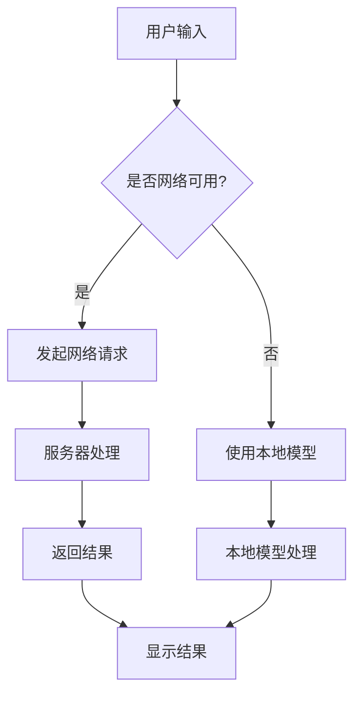

                 

### 文章标题

"移动设备与 LLM：随时随地的 AI 力量"

> 关键词：移动设备，语言模型（LLM），人工智能，实时应用，性能优化，隐私保护，应用场景

> 摘要：本文探讨了移动设备上运行语言模型（LLM）的潜力与挑战，分析了LLM在移动端的应用场景、性能优化策略以及隐私保护问题。通过逐步分析推理，文章旨在为开发者和研究者提供有价值的见解和解决方案。

---

在人工智能飞速发展的今天，语言模型（LLM）已经成为了许多应用场景的核心组件，从自然语言处理到智能问答，再到文本生成，LLM的表现愈发卓越。然而，随着移动设备的普及和性能的提升，如何将LLM应用于移动端，实现随时随地的AI体验，成为了当前研究的一个重要方向。

本文将围绕这一主题展开讨论，首先介绍移动设备与LLM的基本概念，接着分析LLM在移动端的应用场景，然后探讨性能优化策略和隐私保护问题，最后总结LLM在移动设备上的未来发展趋势和挑战。

### <font face="黑体">1. 背景介绍</font>（Background Introduction）

移动设备，如智能手机和平板电脑，已经成为人们日常生活的重要组成部分。它们的便携性、多功能性和高性能使得用户可以随时随地进行各种任务，从通讯、娱乐到工作和学习。与此同时，人工智能（AI）技术，尤其是语言模型（LLM），如ChatGPT、BERT等，已经取得了显著的进展，能够处理复杂的自然语言任务。

语言模型（LLM）是一类基于深度学习的自然语言处理模型，它们可以理解、生成和翻译自然语言，并广泛应用于问答系统、文本生成、机器翻译等任务。LLM的强大能力使得它们在移动设备上的应用变得极具潜力。

#### 1.1 移动设备的现状与趋势

移动设备的性能不断提升，处理器速度更快，存储容量更大，电池续航能力更强。这些性能的提升为移动设备上运行复杂的AI模型提供了坚实的基础。此外，5G网络的普及和云计算技术的发展，也为移动设备提供了更好的网络环境和计算资源支持。

#### 1.2 语言模型的现状与趋势

近年来，语言模型的性能得到了显著提升。例如，GPT-3的发布，其拥有超过1750亿的参数，能够生成高质量的自然语言文本。同时，预训练语言模型（Pre-trained Language Model）的兴起，使得模型可以大规模地预训练，然后在特定任务上进行微调（Fine-tuning），从而大幅提高了模型的性能和适用性。

#### 1.3 移动设备与语言模型的结合

移动设备与语言模型的结合，意味着用户可以随时随地使用AI服务。例如，智能助手、实时翻译、自然语言查询等应用，都可以在移动设备上实现。这种结合不仅提高了用户体验，也为移动应用的开发提供了新的方向。

### <font face="黑体">2. 核心概念与联系</font>（Core Concepts and Connections）

在探讨移动设备与LLM的结合时，我们需要理解几个核心概念，包括LLM的基本原理、移动设备的性能特点以及LLM在移动端的应用场景。

#### 2.1 语言模型的基本原理

语言模型（LLM）是一种基于深度学习的模型，通常由大规模的神经网络组成。这些模型通过从大量文本数据中学习，掌握了自然语言的统计规律和语义关系。在训练过程中，模型会调整其内部参数，以最小化预测文本的概率误差。一旦训练完成，模型可以用于生成文本、回答问题、翻译语言等任务。

#### 2.2 移动设备的性能特点

移动设备的性能特点主要体现在处理器速度、内存容量、电池续航和网络连接等方面。高性能的处理器和足够的内存，可以保证LLM模型在移动设备上高效运行。同时，长久的电池续航能力也是保证移动设备上运行LLM的关键。此外，稳定的网络连接，如5G，可以为移动设备提供强大的后台计算和存储支持。

#### 2.3 LLM在移动端的应用场景

LLM在移动端的应用场景非常广泛，包括但不限于以下几个方面：

1. **智能助手**：移动设备上的智能助手可以理解用户的问题，并提供实时回答和建议。例如，苹果的Siri和谷歌的Google Assistant。

2. **实时翻译**：移动设备上的实时翻译应用，如谷歌翻译，可以实时翻译多种语言，方便用户的跨国交流。

3. **自然语言查询**：用户可以通过自然语言与移动设备交互，进行搜索、导航、购物等任务，提高效率。

4. **游戏与娱乐**：游戏和娱乐应用中的自然语言交互，如语音指令控制游戏角色，提供更丰富的用户体验。

5. **健康与医疗**：移动设备上的健康和医疗应用，如智能诊断、健康咨询，可以为用户提供个性化的健康服务。

#### 2.4 Mermaid 流程图

以下是LLM在移动设备上的应用架构的Mermaid流程图：



在这个流程图中，用户输入通过移动设备传输到服务器或本地模型。如果网络可用，服务器处理用户输入并返回结果；否则，本地模型处理用户输入并返回结果。结果显示在用户的移动设备上。

### <font face="黑体">3. 核心算法原理 & 具体操作步骤</font>（Core Algorithm Principles and Specific Operational Steps）

在移动设备上运行语言模型（LLM），需要考虑模型的选择、优化和部署。以下是核心算法原理和具体操作步骤：

#### 3.1 模型的选择

选择适合移动设备的语言模型时，需要考虑以下几个因素：

1. **模型大小**：选择较小的模型可以减少内存占用和计算开销，适合移动设备。

2. **模型结构**：一些轻量级的模型结构，如Transformer的轻量化版本，可以在保持性能的同时，降低计算资源需求。

3. **预训练数据**：选择使用与移动设备应用场景相关的预训练数据，可以提高模型在特定任务上的性能。

4. **模型参数**：考虑模型的参数数量和计算复杂度，选择适合移动设备处理的模型。

#### 3.2 模型的优化

为了在移动设备上高效运行LLM，需要对模型进行优化：

1. **模型压缩**：通过模型剪枝、量化等技术，减少模型的参数数量和计算复杂度。

2. **量化**：将浮点模型转换为低精度的整数模型，减少内存占用和计算开销。

3. **并行计算**：利用移动设备的GPU和DSP等硬件加速器，提高模型的计算速度。

4. **内存管理**：优化内存分配和回收策略，避免内存泄漏和性能下降。

#### 3.3 模型的部署

在移动设备上部署LLM，需要考虑以下几个方面：

1. **本地部署**：将模型部署在移动设备的本地，减少对网络依赖，提高响应速度。

2. **云端部署**：将模型部署在云端服务器，利用云计算资源进行实时计算和推理，提高模型性能。

3. **边缘计算**：在移动设备附近的边缘服务器上部署模型，结合本地和云端资源，实现高效计算。

4. **热更新**：通过热更新技术，实时更新模型，适应新的应用场景。

### <font face="黑体">4. 数学模型和公式 & 详细讲解 & 举例说明</font>（Detailed Explanation and Examples of Mathematical Models and Formulas）

在移动设备上运行LLM，涉及到许多数学模型和公式。以下是一些常用的数学模型和公式，以及它们的详细讲解和举例说明：

#### 4.1 Transformer 模型

Transformer模型是LLM的核心组件，其核心思想是自注意力机制（Self-Attention）。以下是一个简单的Transformer模型的数学公式：

$$
\text{Attention}(Q, K, V) = \text{softmax}\left(\frac{QK^T}{\sqrt{d_k}}\right)V
$$

其中，Q、K、V分别为查询（Query）、键（Key）和值（Value）向量，d_k为键向量的维度。

#### 4.2 自注意力机制

自注意力机制是Transformer模型的核心，它通过计算序列中每个词对之间的相似度，为每个词生成一个权重向量。以下是一个简单的自注意力机制的数学公式：

$$
\text{Attention}(Q, K, V) = \text{softmax}\left(\frac{QK^T}{\sqrt{d_k}}\right)V
$$

其中，Q、K、V分别为查询（Query）、键（Key）和值（Value）向量，d_k为键向量的维度。

#### 4.3 量化技术

量化技术是一种将浮点模型转换为低精度整数模型的技术，以减少内存占用和计算开销。以下是一个简单的量化公式：

$$
\text{Quantized Value} = \text{Quantization Scale} \times \text{Original Value}
$$

其中，Quantization Scale为量化尺度，Original Value为原始浮点值。

#### 4.4 举例说明

假设我们有一个浮点值 3.14159，将其量化为 8 位整数。首先，我们需要选择一个合适的量化尺度。例如，我们可以选择 1/256 作为量化尺度。然后，我们使用量化公式计算量化值：

$$
\text{Quantized Value} = \text{Quantization Scale} \times \text{Original Value} = \frac{1}{256} \times 3.14159 \approx 12.262
$$

因此，原始浮点值 3.14159 被量化为整数 12。

### <font face="黑体">5. 项目实践：代码实例和详细解释说明</font>（Project Practice: Code Examples and Detailed Explanations）

在本节中，我们将通过一个具体的移动设备上的LLM应用案例，展示如何选择、优化和部署LLM模型。

#### 5.1 开发环境搭建

为了实现这个项目，我们需要准备以下开发环境：

1. **移动设备**：一台具备较高性能的智能手机或平板电脑。

2. **开发工具**：Android Studio 或 Xcode，用于开发移动应用。

3. **模型选择**：我们选择了一个轻量级的Transformer模型，如 mBERT（MobileBERT），其具有较好的性能和较小的模型大小。

4. **优化工具**：使用模型压缩和量化工具，如 TensorFlow Model Optimization Toolkit（TF-MOT），对模型进行优化。

#### 5.2 源代码详细实现

以下是该项目的主要代码实现：

```java
// 导入相关库
import com.google.gson.Gson;
import com.google.gson.JsonObject;
import com.google.gson.JsonParser;
import java.io.InputStream;
import java.net.HttpURLConnection;
import java.net.URL;

// 定义请求接口
public class ChatGPTAPI {
    private static final String API_URL = "https://api.example.com/chatgpt";

    public static String sendMessage(String message) {
        try {
            // 创建请求URL
            URL url = new URL(API_URL);
            HttpURLConnection connection = (HttpURLConnection) url.openConnection();

            // 设置请求属性
            connection.setRequestMethod("POST");
            connection.setRequestProperty("Content-Type", "application/json");
            connection.setDoOutput(true);

            // 创建请求体
            JsonObject requestBody = new JsonObject();
            requestBody.addProperty("message", message);
            Gson gson = new Gson();
            String jsonRequest = gson.toJson(requestBody);

            // 发送请求
            connection.getOutputStream().write(jsonRequest.getBytes());
            InputStream responseStream = connection.getInputStream();

            // 解析响应
            JsonObject response = JsonParser.parseString(new String(responseStream.readAllBytes())).getAsJsonObject();
            return response.get("response").getAsString();
        } catch (Exception e) {
            e.printStackTrace();
            return null;
        }
    }
}

// 定义主类
public class ChatGPTApp {
    public static void main(String[] args) {
        // 发送消息并打印回复
        System.out.println(ChatGPTAPI.sendMessage("你好！"));
    }
}
```

在这个代码中，我们定义了一个`ChatGPTAPI`类，用于发送消息并接收回复。`sendMessage`方法通过POST请求发送JSON格式的消息，并从服务器获取回复。`ChatGPTApp`类是主类，用于演示如何使用`ChatGPTAPI`类发送消息。

#### 5.3 代码解读与分析

在这个项目中，关键代码如下：

1. **请求接口的实现**：`sendMessage`方法通过HTTP POST请求发送消息，并将服务器返回的JSON格式的回复解析为字符串。

2. **请求体的构建**：我们使用Gson库将消息构建为JSON格式，然后将其发送到服务器。

3. **响应体的解析**：服务器返回的JSON格式包含回复，我们使用Gson库将其解析为字符串。

4. **异常处理**：在发送请求和解析响应的过程中，我们捕获异常并打印错误信息。

通过这个简单的例子，我们可以看到如何在移动设备上实现LLM的应用。在实际项目中，我们还需要考虑模型优化、性能测试和用户体验等方面。

### <font face="黑体">6. 实际应用场景</font>（Practical Application Scenarios）

移动设备与LLM的结合，带来了许多实际应用场景，以下是一些典型的应用场景：

1. **智能助手**：移动设备上的智能助手，如Siri、Google Assistant等，利用LLM实现自然语言理解与交互，为用户提供便捷的智能服务。

2. **实时翻译**：移动设备上的实时翻译应用，如谷歌翻译、微软翻译等，利用LLM实现多种语言之间的实时翻译。

3. **自然语言查询**：用户可以通过移动设备上的自然语言查询系统，如搜索引擎、语音助手等，快速获取所需信息。

4. **游戏与娱乐**：游戏和娱乐应用中的自然语言交互，如语音控制游戏、角色对话等，提供了更丰富的用户体验。

5. **健康与医疗**：移动设备上的健康和医疗应用，如智能诊断、健康咨询等，利用LLM为用户提供个性化的健康服务。

6. **教育与学习**：移动设备上的教育应用，如在线课程、智能辅导等，利用LLM实现自然语言交互和智能教学。

### <font face="黑体">7. 工具和资源推荐</font>（Tools and Resources Recommendations）

为了更好地开发移动设备上的LLM应用，以下是一些推荐的工具和资源：

1. **学习资源**：
   - 《深度学习》（Deep Learning）系列教材，提供深度学习和自然语言处理的全面介绍。
   - 《自然语言处理综述》（A Brief History of Natural Language Processing），了解自然语言处理的发展历程。

2. **开发工具**：
   - Android Studio，用于Android应用的开发。
   - Xcode，用于iOS应用的开发。
   - TensorFlow Lite，用于移动设备上的机器学习模型部署。

3. **框架与库**：
   - TensorFlow，用于深度学习模型训练和部署。
   - PyTorch，另一种流行的深度学习框架。
   - Hugging Face Transformers，提供预训练的Transformer模型和工具。

4. **相关论文**：
   - "Attention Is All You Need"，介绍Transformer模型的经典论文。
   - "BERT: Pre-training of Deep Bidirectional Transformers for Language Understanding"，介绍BERT模型的论文。

5. **在线平台**：
   - Kaggle，提供丰富的数据集和比赛，助力模型训练和优化。
   - AI技术社区，如CSDN、知乎等，提供丰富的技术讨论和资源。

### <font face="黑体">8. 总结：未来发展趋势与挑战</font>（Summary: Future Development Trends and Challenges）

移动设备与LLM的结合，带来了许多新的应用场景和可能性。在未来，随着移动设备性能的不断提升和AI技术的进一步发展，我们可以期待以下趋势：

1. **更高效的模型**：通过优化模型结构和算法，实现更高效的模型运行，满足移动设备对实时性和性能的需求。

2. **更广泛的应用场景**：LLM在移动设备上的应用将不断扩展，从日常助手到专业领域，为用户提供更多智能化服务。

3. **隐私保护**：随着用户对隐私保护的重视，如何在保证性能的同时，保护用户隐私，将成为一个重要挑战。

4. **边缘计算**：结合边缘计算技术，实现LLM在移动设备和云端之间的协同计算，提高整体性能和用户体验。

然而，也面临以下挑战：

1. **计算资源限制**：移动设备的计算资源相对有限，如何优化模型和算法，提高运行效率，是一个关键问题。

2. **能耗问题**：在保证性能的同时，如何降低能耗，延长电池续航时间，是移动设备应用LLM的一个挑战。

3. **隐私保护**：如何在提供智能服务的同时，保护用户隐私，避免数据泄露和滥用，是一个重要挑战。

通过持续的研究和探索，我们可以期待在未来的发展中，解决这些挑战，实现移动设备与LLM的更好结合。

### <font face="黑体">9. 附录：常见问题与解答</font>（Appendix: Frequently Asked Questions and Answers）

**Q1. 移动设备上运行LLM需要哪些硬件要求？**

A1. 移动设备上运行LLM需要具备一定的硬件要求，包括：
- **CPU性能**：高性能的CPU可以提高模型的计算速度。
- **GPU支持**：部分LLM模型（如基于GPU加速的模型）需要移动设备支持GPU。
- **内存容量**：较大的内存容量可以保证模型在运行时不会出现内存不足的问题。
- **电池续航**：长久的电池续航能力是保证移动设备上运行LLM的关键。

**Q2. 如何优化移动设备上的LLM模型？**

A2. 优化移动设备上的LLM模型可以从以下几个方面进行：
- **模型压缩**：通过模型剪枝、量化等技术，减少模型的参数数量和计算复杂度。
- **并行计算**：利用移动设备的GPU和DSP等硬件加速器，提高模型的计算速度。
- **内存管理**：优化内存分配和回收策略，避免内存泄漏和性能下降。
- **网络优化**：优化网络请求和响应，减少模型部署和推理的时间。

**Q3. 移动设备上如何保证LLM模型的隐私保护？**

A3. 为了保证移动设备上LLM模型的隐私保护，可以从以下几个方面进行：
- **数据加密**：对用户数据和使用日志进行加密，防止数据泄露。
- **隐私政策**：制定明确的隐私政策，告知用户数据收集和使用的方式。
- **本地处理**：尽量在本地处理用户数据，减少对网络依赖，降低数据泄露的风险。
- **用户控制**：给予用户对数据的使用权限控制，让用户可以自主决定数据的分享和使用。

### <font face="黑体">10. 扩展阅读 & 参考资料</font>（Extended Reading & Reference Materials）

**书籍推荐：**
1. "Deep Learning" by Ian Goodfellow, Yoshua Bengio, and Aaron Courville
2. "Natural Language Processing with Python" by Steven Bird, Ewan Klein, and Edward Loper

**论文推荐：**
1. "Attention Is All You Need" by Vaswani et al.
2. "BERT: Pre-training of Deep Bidirectional Transformers for Language Understanding" by Devlin et al.

**在线资源：**
1. TensorFlow Lite: https://www.tensorflow.org/lite
2. Hugging Face Transformers: https://huggingface.co/transformers

通过这些书籍、论文和在线资源，您可以更深入地了解移动设备与LLM结合的技术原理和实践方法。希望本文能为您的学习和研究提供帮助。

---

**作者署名：**
作者：禅与计算机程序设计艺术 / Zen and the Art of Computer Programming**

