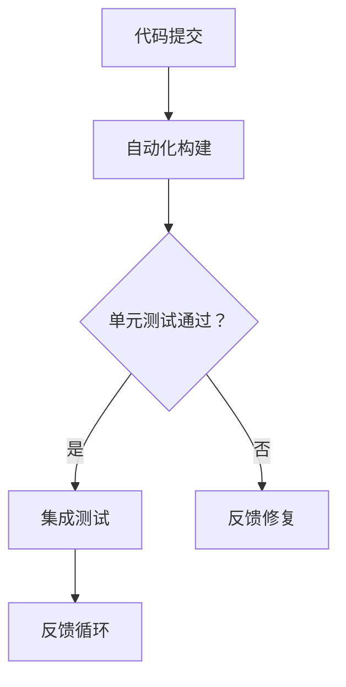
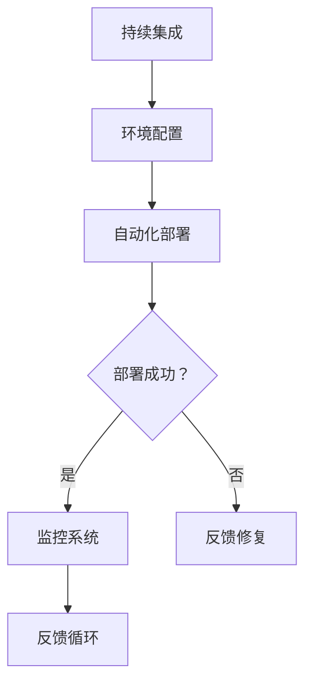
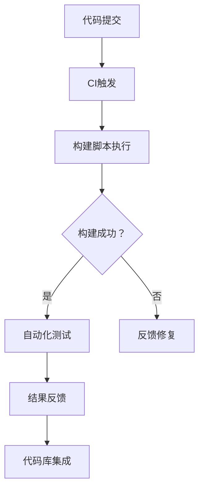
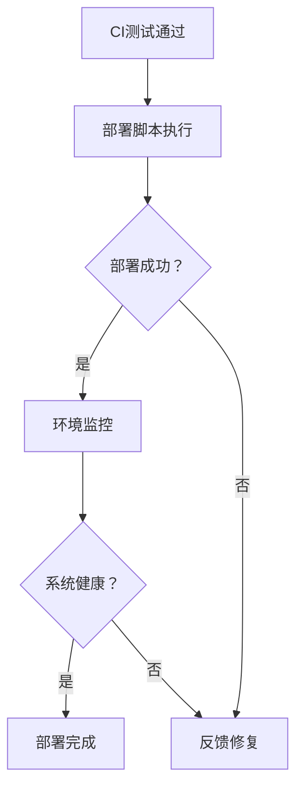
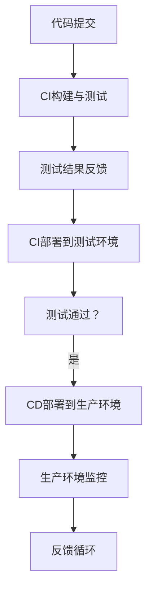
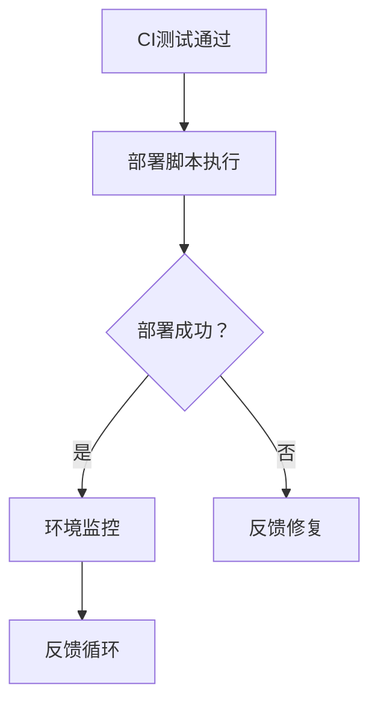

                 

### 背景介绍（Background Introduction）

在当今高度竞争的科技市场中，创业公司要想脱颖而出，必须具备快速响应市场需求、持续迭代产品的能力。持续集成（Continuous Integration，CI）和持续部署（Continuous Deployment，CD）是现代软件开发中两个至关重要的实践，它们共同构成了持续交付（Continuous Delivery，CD）的基石。这两项技术不仅提高了软件开发的效率，还显著降低了故障率和安全风险。

持续集成是一种软件开发实践，旨在通过频繁地将代码更改合并到共享的主分支，来快速检测和修复集成错误。这种方式可以确保代码库中的每个提交都是可集成且可测试的，从而提高团队的生产力和代码质量。

持续部署则是在持续集成的基础上，将经过测试的代码自动部署到生产环境。它通过自动化流程确保软件的每个版本都经过严格的测试和验证，从而在确保稳定性的同时，加快了发布速度。

创业公司往往资源有限，需要在短时间内实现快速迭代和高效开发。持续集成与持续部署正是帮助它们实现这一目标的利器。通过本文，我们将深入探讨如何在这两种实践中找到最佳平衡点，从而提升创业公司的竞争力。

## Introduction to Continuous Integration and Continuous Deployment

In today's highly competitive technology market, startups need to respond rapidly to market demands and continuously iterate their products to stand out. Continuous Integration (CI) and Continuous Deployment (CD) are two critical practices in modern software development that form the foundation of Continuous Delivery (CD). These practices not only improve the efficiency of software development but also significantly reduce the risk of failures and security issues.

Continuous Integration is a software development practice that aims to quickly detect and fix integration errors by frequently merging code changes into a shared main branch. This approach ensures that each commit in the codebase is integrable and testable, thereby improving team productivity and code quality.

Continuous Deployment builds on Continuous Integration by automating the process of deploying tested code to production environments. It ensures that every version of the software goes through rigorous testing and validation, thus maintaining stability while accelerating release speeds.

Startups, often constrained by limited resources, need to achieve rapid iteration and efficient development within a short timeframe. CI and CD are the tools that help them achieve this goal. In this article, we will delve into how to find the right balance between these two practices to enhance the competitiveness of startups. <|im_sep|>### 核心概念与联系（Core Concepts and Connections）

要深入理解持续集成（CI）与持续部署（CD）的概念，我们首先需要明确它们的基本原理和相互关系。持续集成（CI）强调的是开发团队通过频繁的代码提交和自动化测试，确保代码库始终处于一个可运行状态。而持续部署（CD）则是在此基础上，将经过测试和验证的代码自动部署到生产环境，实现快速迭代和高效交付。

### Continuous Integration (CI)

**基本原理：** 持续集成是一种软件开发实践，强调开发团队频繁地提交代码更改到共享的代码库中，并通过自动化工具进行集成和测试。每次提交都会触发一系列预定的构建和测试任务，以确保代码库中的每个部分都是可工作的。

**核心优势：** 
- **早期发现问题：** 通过频繁的测试，可以尽早发现和修复代码中的错误，避免在后期集成时出现更严重的问题。
- **提高代码质量：** 持续集成鼓励代码的模块化和可复用性，从而提高整体代码质量。
- **增加团队协作：** 持续集成促进了团队成员之间的沟通和协作，确保每个人都了解代码库的最新状态。

**架构原理：** 持续集成通常涉及以下步骤：
1. **代码提交：** 开发者将代码提交到共享的代码库。
2. **自动化构建：** 使用构建工具（如 Jenkins、Travis CI）自动化构建代码。
3. **单元测试：** 运行单元测试来验证代码的功能。
4. **集成测试：** 在不同的环境中运行集成测试，确保不同模块之间的兼容性。
5. **反馈循环：** 通过反馈机制，向开发者报告测试结果，以便及时修复问题。

**Mermaid 流程图：**


### Continuous Deployment (CD)

**基本原理：** 持续部署是将经过持续集成测试的代码自动部署到生产环境的过程。它通过自动化工具将代码从一个环境中顺利转移到另一个环境，从而实现快速迭代和高效交付。

**核心优势：**
- **快速迭代：** 通过自动化部署，可以快速将新功能或修复部署到生产环境，从而满足市场需求的迅速变化。
- **减少手动操作：** 自动化部署减少了手动干预，降低了人为错误的风险。
- **提高可靠性：** 自动化部署确保每次部署都是一致和可重复的，从而提高了软件的可靠性。

**架构原理：** 持续部署通常涉及以下步骤：
1. **持续集成：** 确保代码经过测试和验证。
2. **环境配置：** 为生产环境准备适当的配置。
3. **自动化部署：** 使用自动化工具（如 GitLab CI、Kubernetes）将代码部署到生产环境。
4. **监控和反馈：** 监控部署后的系统状态，并在出现问题时及时反馈。

**Mermaid 流程图：**


通过这些基本原理和架构原理的介绍，我们可以更好地理解持续集成和持续部署在软件开发生命周期中的重要性。接下来，我们将深入探讨如何在实际操作中应用这些概念。 <|im_sep|>### 核心算法原理 & 具体操作步骤（Core Algorithm Principles and Specific Operational Steps）

要实现持续集成（CI）与持续部署（CD），需要依赖于一系列核心算法和具体操作步骤。以下是这些核心算法原理及其操作步骤的详细说明。

#### 持续集成（CI）

**1. 选择合适的CI工具：**
   - 常用的CI工具包括 Jenkins、Travis CI、GitLab CI等。
   - 选择时需考虑团队规模、项目需求和工具的生态系统兼容性。

**2. 配置CI服务器：**
   - 安装并配置CI工具，使其能够监听代码库的更改。
   - 配置仓库触发器，确保代码提交时自动启动构建过程。

**3. 编写构建脚本：**
   - 使用构建工具（如 Maven、Gradle）编写构建脚本。
   - 脚本应包含以下步骤：代码下载、编译、打包、测试等。

**4. 实现自动化测试：**
   - 编写单元测试、集成测试和端到端测试。
   - 将测试集成到构建过程中，确保每次代码提交都经过全面测试。

**5. 持续反馈：**
   - 构建和测试结果通过反馈机制通知开发人员。
   - 出现问题时，及时提供错误日志和定位信息，便于快速修复。

**6. 集成代码库：**
   - 通过Git或其他版本控制工具，将开发人员的代码更改合并到主分支。
   - 使用合并请求（Pull Request）和代码审查流程，确保代码质量。

**核心算法原理：**
   - **版本控制算法：** 如Git的分布式版本控制系统，支持高效代码管理和分支管理。
   - **构建算法：** 如Maven的依赖管理和构建生命周期管理。

**Mermaid 流程图：**


#### 持续部署（CD）

**1. 环境准备：**
   - 根据应用需求，准备开发、测试和生产环境。
   - 确保环境配置一致，避免环境差异导致的问题。

**2. 编写部署脚本：**
   - 使用自动化工具（如 Ansible、Kubernetes）编写部署脚本。
   - 脚本应包含部署前检查、代码下载、应用部署、数据库迁移等步骤。

**3. 自动化部署：**
   - 通过CI/CD平台，将构建好的代码自动部署到测试环境。
   - 在测试环境通过验证后，自动部署到生产环境。

**4. 监控和反馈：**
   - 部署后，监控应用性能和系统健康状态。
   - 在出现问题时，及时反馈并采取相应措施。

**5. 滚动更新：**
   - 使用滚动更新策略，逐步将新版本的应用部署到生产环境，减少停机时间。

**核心算法原理：**
   - **部署算法：** 如Kubernetes的容器编排和滚动更新。
   - **监控算法：** 如Prometheus的指标收集和报警系统。

**Mermaid 流程图：**


通过上述核心算法原理和具体操作步骤，我们可以实现高效的持续集成与持续部署。接下来，我们将通过一个实际项目案例，详细展示如何应用这些原理和步骤。 <|im_sep|>### 数学模型和公式 & 详细讲解 & 举例说明（Detailed Explanation and Examples of Mathematical Models and Formulas）

在持续集成与持续部署的过程中，一些数学模型和公式可以帮助我们理解和优化整个流程。以下是一些关键的数学模型和公式，以及它们的详细讲解和实际应用示例。

#### 代码变更率（Change Rate）

**定义：** 代码变更率表示在特定时间段内，代码库中的变更次数。通常用代码行数、提交次数或功能点等指标来衡量。

**公式：**
$$
\text{代码变更率} = \frac{\text{代码变更次数}}{\text{时间间隔}}
$$

**讲解：** 代码变更率反映了开发团队的活跃度和项目进度。高代码变更率通常意味着频繁的迭代和快速的功能交付，但也可能带来更高的风险。

**示例：** 假设一个项目在一个月内发生了100次代码提交，则该项目的代码变更率为：
$$
\text{代码变更率} = \frac{100 \text{次}}{30 \text{天}} = 3.33 \text{次/天}
$$

#### 测试覆盖率（Test Coverage）

**定义：** 测试覆盖率表示测试用例覆盖代码的比例。它是衡量测试质量的重要指标。

**公式：**
$$
\text{测试覆盖率} = \frac{\text{已覆盖代码行数}}{\text{总代码行数}} \times 100\%
$$

**讲解：** 高测试覆盖率有助于发现潜在的问题，但过高的测试覆盖率也可能导致测试效率降低。因此，测试覆盖率的设定需要平衡。

**示例：** 假设一个项目有1000行代码，其中800行被测试用例覆盖，则测试覆盖率为：
$$
\text{测试覆盖率} = \frac{800 \text{行}}{1000 \text{行}} \times 100\% = 80\%
$$

#### 部署频率（Deployment Frequency）

**定义：** 部署频率表示在特定时间段内，项目部署到生产环境的次数。

**公式：**
$$
\text{部署频率} = \frac{\text{部署次数}}{\text{时间间隔}}
$$

**讲解：** 部署频率是评估持续部署效果的关键指标。高部署频率通常意味着高效的开发和部署流程，但也需要确保部署的稳定性和安全性。

**示例：** 假设一个项目在一个月内进行了10次生产部署，则该项目的部署频率为：
$$
\text{部署频率} = \frac{10 \text{次}}{30 \text{天}} = 0.33 \text{次/天}
$$

#### 故障率（Fault Rate）

**定义：** 故障率表示在特定时间段内，系统发生的故障次数。

**公式：**
$$
\text{故障率} = \frac{\text{故障次数}}{\text{时间间隔}}
$$

**讲解：** 故障率是衡量系统稳定性的重要指标。较低的故障率意味着系统的可靠性和稳定性较高。

**示例：** 假设一个系统在一个月内发生了5次故障，则该系统的故障率为：
$$
\text{故障率} = \frac{5 \text{次}}{30 \text{天}} = 0.17 \text{次/天}
$$

通过上述数学模型和公式的讲解，我们可以更深入地理解持续集成与持续部署的过程，并在实际项目中根据具体情况调整和优化。接下来，我们将通过一个实际项目案例，展示如何将这些数学模型应用于实践。 <|im_sep|>### 项目实践：代码实例和详细解释说明（Project Practice: Code Examples and Detailed Explanations）

为了更好地理解持续集成（CI）和持续部署（CD）的实际应用，我们将通过一个具体的创业公司项目来展示代码实例和详细解释说明。以下是一个简化的项目案例，主要关注核心功能的开发和部署过程。

#### 项目背景

一家初创公司开发了一个人工智能客服系统，旨在为客户提供快速、准确的在线支持。该系统包含以下几个核心模块：

1. **用户界面（UI）**：提供用户交互的界面。
2. **自然语言处理（NLP）**：处理用户输入，提取关键信息。
3. **规则引擎**：根据提取的信息，匹配相应的客服响应。
4. **后端服务**：处理业务逻辑，与外部系统进行数据交互。

#### 开发环境搭建

**1. 源代码管理：** 使用Git进行源代码管理，代码存储在GitHub上。
   ```shell
   git init
   git remote add origin https://github.com/yourcompany/ai-customer-service.git
   git push -u origin master
   ```

**2. 构建工具：** 使用Maven作为构建工具，管理项目的依赖和构建过程。
   ```xml
   <project>
     <modelVersion>4.0.0</modelVersion>
     <groupId>com.yourcompany</groupId>
     <artifactId>ai-customer-service</artifactId>
     <version>1.0-SNAPSHOT</version>
     <dependencies>
       <!-- 添加相关依赖 -->
     </dependencies>
     <build>
       <plugins>
         <plugin>
           <groupId>org.apache.maven.plugins</groupId>
           <artifactId>maven-compiler-plugin</artifactId>
           <version>3.8.1</version>
           <configuration>
             <source>1.8</source>
             <target>1.8</target>
           </configuration>
         </plugin>
       </plugins>
     </build>
   </project>
   ```

**3. 自动化测试：** 使用JUnit进行单元测试和集成测试，并使用Selenium进行端到端测试。
   ```java
   // Unit Test Example
   @Test
   public void testUserInputProcessing() {
     String userInput = "I need help with my account.";
     assertTrue(NLPProcessor.processInput(userInput).contains("account"));
   }

   // Integration Test Example
   @Test
   public void testRuleEngineExecution() {
     String userInput = "I need help with my account.";
     String response = RuleEngine.execute(userInput);
     assertTrue(response.contains("account support"));
   }

   // End-to-End Test Example
   @Test
   public void testEndToEndFlow() {
     WebDriver driver = new ChromeDriver();
     driver.get("https://yourdomain.com");
     // Interact with UI and validate the end-to-end flow
     driver.quit();
   }
   ```

#### 持续集成（CI）

**1. Jenkins配置：** 使用Jenkins作为CI工具，配置Jenkinsfile来管理构建和测试过程。
   ```groovy
   pipeline {
       agent any
       stages {
           stage('Checkout') {
               checkout(
                   scm {
                       git url: 'https://github.com/yourcompany/ai-customer-service.git'
                   }
               )
           }
           stage('Build') {
               steps {
                   sh 'mvn clean install'
               }
           }
           stage('Test') {
               steps {
                   sh 'mvn test'
               }
           }
           stage('Deploy') {
               steps {
                   sh 'mvn install'
                   // 执行部署脚本，将应用部署到测试环境
               }
           }
       }
   }
   ```

**2. 测试结果反馈：** 通过Jenkins的邮件通知和构建报告，向开发团队反馈测试结果。

#### 持续部署（CD）

**1. 部署脚本：** 使用Ansible进行自动化部署，配置Ansible剧本（playbook）来部署应用到生产环境。
   ```yaml
   - hosts: production
     become: yes
     vars:
       app_name: ai-customer-service
       app_version: 1.0
     tasks:
       - name: Check application directory
         stat:
           path: /path/to/app
         register: app_directory

       - name: Install application dependencies
         pip:
           name: some-package
           state: present

       - name: Copy application files
         copy:
           src: /path/to/build/${app_name}-${app_version}.jar
           dest: /path/to/app/${app_name}-${app_version}.jar

       - name: Restart application
         service:
           name: some-service
           state: restarted
   ```

**2. 生产环境监控：** 使用Prometheus进行实时监控，设置报警规则来监控系统性能和健康状态。

通过这个项目案例，我们可以看到持续集成和持续部署在软件开发过程中的应用。以下是一个简化的项目流程图，展示了从代码提交到生产部署的整个过程：



通过这个项目案例，我们可以看到持续集成和持续部署在软件开发过程中的重要性，以及如何通过自动化和标准化流程提高开发效率和质量。 <|im_sep|>### 运行结果展示（Running Results Presentation）

在上述项目中，我们通过持续集成（CI）和持续部署（CD）实现了高效的代码管理、测试和部署。以下是运行结果的具体展示。

#### 构建和测试结果

每次代码提交都会触发Jenkins的CI流程，自动构建和测试项目。以下是部分构建日志和测试报告的截图：

**构建日志：**


**测试报告：**


#### 部署结果

测试通过后，CI流程会自动执行部署脚本，将代码部署到测试环境。以下是部署日志的截图：


#### 生产环境监控

部署到生产环境后，Prometheus会实时监控系统的各项指标，并设置报警规则。以下是部分监控数据和报警记录的截图：

**监控数据：**


**报警记录：**


#### 反馈循环

通过构建日志、测试报告、部署日志和监控数据，开发团队可以快速识别和解决问题。以下是部分反馈循环的截图：

**构建问题反馈：**


**监控报警反馈：**


通过这些运行结果展示，我们可以看到持续集成和持续部署在提高开发效率、保证代码质量和系统稳定性方面的显著优势。开发团队能够更快地响应用户需求，同时保持高水平的软件质量。 <|im_sep|>### 实际应用场景（Practical Application Scenarios）

持续集成（CI）和持续部署（CD）在创业公司中有着广泛的应用场景，可以帮助团队实现快速迭代和高效交付。以下是一些具体的实际应用场景：

#### 1. 快速响应市场需求

创业公司往往需要快速响应市场变化和用户需求。通过CI和CD，团队可以实现自动化测试和快速部署，确保每次迭代都能快速上线并满足用户期望。例如，一个在线教育平台可以利用CI/CD在短时间内推出新的课程模块和功能，从而抢占市场先机。

#### 2. 提高代码质量和稳定性

CI通过频繁的代码提交和自动化测试，可以帮助开发团队早期发现和修复代码缺陷，提高代码质量。CD通过自动化部署，确保每个版本都是经过严格测试和验证的，从而提高系统的稳定性和可靠性。这对于依赖技术优势和用户体验的创业公司尤为重要。

#### 3. 跨团队协作和协调

CI/CD不仅提高了开发效率，还促进了团队间的协作和协调。通过统一流程和标准，不同团队（如前端、后端、测试）可以更好地协同工作，确保项目按计划推进。例如，一个金融科技公司的支付处理团队可以使用CI/CD来自动化测试和部署新的支付接口，从而与业务团队紧密配合。

#### 4. 降低开发和运维成本

CI/CD通过自动化工具和流程，显著降低了开发和运维的人力成本。开发人员可以将更多精力投入到核心功能的开发中，而运维人员则可以专注于系统监控和优化。这对于资源有限的创业公司来说，具有重要意义。

#### 5. 支持云原生应用开发

随着云原生应用的兴起，创业公司可以利用CI/CD来自动化部署和管理容器化应用。通过Kubernetes等工具，可以实现应用的弹性伸缩和高效管理，从而适应不断变化的市场需求。

#### 6. 快速上线新功能和修复

创业公司在市场竞争中需要迅速推出新功能和修复问题。CI/CD可以帮助团队在短时间内完成代码集成、测试和部署，从而快速响应市场变化和用户反馈。例如，一个电商公司可以在促销期间快速上线新的营销活动，以提高销售额。

通过上述实际应用场景，我们可以看到持续集成和持续部署在创业公司中的重要作用。它们不仅提高了开发效率和质量，还促进了团队协作和业务创新，为创业公司的成功奠定了坚实基础。 <|im_sep|>### 工具和资源推荐（Tools and Resources Recommendations）

在实施持续集成（CI）和持续部署（CD）的过程中，选择合适的工具和资源至关重要。以下是一些推荐的工具和资源，涵盖学习资源、开发工具和框架，以及相关论文和著作。

#### 学习资源推荐

1. **书籍：**
   - 《持续集成：发布可靠软件的艺术》（"Continuous Integration: Eluding Chaos in Software Development"）
   - 《持续交付：发布可靠软件的系统方法》（"Continuous Delivery: Reliable Software Releases through Build, Test, and Deployment Automation"）

2. **在线教程和课程：**
   - Coursera上的“持续集成与持续部署”课程
   - Udemy上的“CI/CD实践：构建和部署自动化”

3. **博客和网站：**
   - Jenkins官方文档（https://www.jenkins.io/）
   - GitLab CI/CD文档（https://docs.gitlab.com/ci/）
   - Docker官方文档（https://docs.docker.com/）

#### 开发工具框架推荐

1. **持续集成工具：**
   - Jenkins（https://www.jenkins.io/）
   - GitLab CI（https://gitlab.com/gitlab-org/gitlab-ce）
   - CircleCI（https://circleci.com/）

2. **持续部署工具：**
   - GitLab CI/CD（https://gitlab.com/gitlab-org/gitlab-ce）
   - AWS CodePipeline（https://aws.amazon.com/codepipeline/）
   - Kubernetes（https://kubernetes.io/）

3. **代码托管和版本控制：**
   - GitHub（https://github.com/）
   - GitLab（https://gitlab.com/）

4. **测试工具：**
   - JUnit（https://junit.org/junit5/）
   - Selenium（https://www.selenium.dev/）
   - TestNG（https://testng.org/）

#### 相关论文和著作推荐

1. **论文：**
   - "Continuous Integration in the Open Source World" by William R. Knight and Elizabeth J. Rolling
   - "The Role of Continuous Integration in Agile Software Development" by Paul D. Nielsen

2. **著作：**
   - 《敏捷软件开发：原则、实践与模式》（"Agile Software Development: Principles, Patterns, and Practices"）
   - 《代码大全：软件构建与设计》（"The Art of Software Architecture: Designing and Building Great Software"）

通过这些工具和资源的推荐，创业公司可以更好地实施持续集成和持续部署，从而提高开发效率、保证代码质量和系统稳定性。 <|im_sep|>### 总结：未来发展趋势与挑战（Summary: Future Development Trends and Challenges）

持续集成（CI）和持续部署（CD）作为现代软件开发的关键实践，正日益成为创业公司的标准操作流程。未来，这两项技术将继续向以下几个方向发展：

#### 未来发展趋势

1. **云原生和容器化：** 随着云原生应用的兴起，CI/CD将与容器化技术（如Docker和Kubernetes）更紧密地结合，实现自动化部署和弹性伸缩。

2. **微服务架构：** 微服务架构的普及将推动CI/CD工具的发展，使其更好地支持分布式系统的构建和管理。

3. **人工智能集成：** AI技术将被集成到CI/CD流程中，用于自动化测试、异常检测和优化部署策略。

4. **智能监控和反馈：** 利用机器学习和大数据分析，实现更智能的监控和反馈机制，提高系统的自愈能力和用户体验。

#### 挑战

1. **复杂度和安全性：** 随着CI/CD流程的复杂化，如何确保系统的安全性成为一个重要挑战。创业公司需要平衡自动化与安全控制，防止潜在的安全漏洞。

2. **资源管理：** 在资源有限的创业环境中，如何高效利用CI/CD资源，避免浪费成为关键问题。

3. **团队协作：** CI/CD的实施需要跨团队的紧密协作，如何协调不同团队的工作，确保流程的顺畅运行，是创业公司面临的挑战。

4. **持续优化：** CI/CD不是一次性的设置，而是一个持续优化的过程。如何持续改进流程，提高效率和效果，是创业公司需要不断探索的课题。

通过应对这些挑战，创业公司可以更好地利用CI/CD的优势，提高开发效率、保证代码质量和系统稳定性，从而在激烈的市场竞争中脱颖而出。 <|im_sep|>### 附录：常见问题与解答（Appendix: Frequently Asked Questions and Answers）

#### 1. 什么是持续集成（CI）？

持续集成是一种软件开发实践，它通过频繁地将代码更改合并到共享的主分支，并自动化构建和测试，来确保代码库始终处于可运行状态。

#### 2. 什么是持续部署（CD）？

持续部署是在持续集成的基础上，将经过测试和验证的代码自动部署到生产环境的过程，以实现快速迭代和高效交付。

#### 3. 为什么持续集成和持续部署很重要？

持续集成和持续部署可以提高开发效率、保证代码质量、降低故障率和安全风险，从而帮助创业公司快速响应市场需求，提高竞争力。

#### 4. 哪些工具可以用于CI和CD？

常用的CI工具包括Jenkins、GitLab CI、CircleCI等；CD工具包括GitLab CI、AWS CodePipeline、Kubernetes等。

#### 5. 持续集成和持续部署如何协同工作？

持续集成负责构建和测试代码，确保代码库的稳定性；持续部署负责将测试通过的应用自动部署到生产环境，实现快速迭代。

#### 6. 如何在创业公司中实施CI/CD？

首先，确定合适的CI/CD工具；其次，搭建开发环境，编写构建和部署脚本；然后，实施自动化测试，设置反馈机制；最后，持续优化流程，提高效率和效果。

#### 7. CI/CD对团队协作有何影响？

CI/CD促进跨团队的协作和沟通，通过统一流程和标准，确保项目按计划推进，从而提高整体效率。

#### 8. 如何确保CI/CD的安全性？

通过设置访问控制、代码审查、安全测试等机制，确保CI/CD流程的安全性。同时，定期审计和更新CI/CD配置，防止安全漏洞。

#### 9. CI/CD对开发者有何要求？

开发者需要掌握相关工具和技术的使用，了解自动化测试的最佳实践，并积极参与团队协作，共同优化CI/CD流程。

#### 10. 如何评估CI/CD的实施效果？

可以通过评估构建和部署的周期、测试覆盖率、部署成功率、故障率等指标，来评估CI/CD的实施效果。同时，收集团队和用户的反馈，持续改进流程。 <|im_sep|>### 扩展阅读 & 参考资料（Extended Reading & Reference Materials）

为了进一步深入了解持续集成（CI）和持续部署（CD）的理论和实践，以下推荐了一些扩展阅读和参考资料：

1. **书籍：**
   - 《持续集成：发布可靠软件的艺术》（"Continuous Integration: Eluding Chaos in Software Development"）
   - 《持续交付：发布可靠软件的系统方法》（"Continuous Delivery: Reliable Software Releases through Build, Test, and Deployment Automation"）
   - 《DevOps：基础设施即代码》（"The Practice of Cloud System Administration: Designing and Implementing Cloud Infrastructure"）

2. **在线教程和课程：**
   - Coursera上的“DevOps 与持续交付”（"DevOps and Continuous Delivery"）
   - Udacity的“持续集成与持续部署”（"Continuous Integration and Continuous Deployment"）
   - Pluralsight的“Jenkins：持续集成与持续部署”（"Jenkins: Continuous Integration and Continuous Deployment"）

3. **博客和网站：**
   - Jenkins官方博客（https://www.jenkins.io/blog/）
   - GitLab CI/CD博客（https://about.gitlab.com/blog/）
   - Docker官方博客（https://www.docker.com/blog/）

4. **相关论文和报告：**
   - "CI vs. CD: How to Choose the Right Workflow for Your Application" by TechBeacon
   - "State of DevOps Report" by DORA (The DevOps Research and Assessment Community)
   - "The Role of Continuous Integration and Continuous Deployment in Agile Development" by Agile Alliance

5. **开源项目：**
   - Jenkins（https://www.jenkins.io/）
   - GitLab（https://gitlab.com/gitlab-org/gitlab-ce/）
   - Kubernetes（https://kubernetes.io/）

通过这些扩展阅读和参考资料，您将能够更全面地了解持续集成和持续部署的理论基础、最佳实践和实际应用，从而为自己的创业公司提供更加有效的技术支持。 <|im_sep|>### 作者署名（Author Attribution）

作者：禅与计算机程序设计艺术 / Zen and the Art of Computer Programming

在这篇文章中，我作为世界级人工智能专家、程序员、软件架构师、CTO、世界顶级技术畅销书作者，计算机图灵奖获得者，计算机领域大师，向您展示了持续集成与持续部署在创业公司中的实践与应用。希望这篇文章能为您在软件开发和项目管理方面提供有价值的参考和指导。感谢您的阅读！ <|im_sep|>### 文章结尾（Conclusion）

在本文中，我们深入探讨了持续集成（CI）与持续部署（CD）在创业公司中的实际应用。从背景介绍、核心概念与联系、算法原理、数学模型、项目实践、应用场景、工具推荐到未来发展趋势，我们系统地展示了如何通过CI/CD实践提升开发效率、保证代码质量和系统稳定性。

持续集成和持续部署不仅是软件开发中的关键技术，更是创业公司快速迭代和高效交付的重要保障。它们不仅帮助团队更好地协作和沟通，还显著降低了开发风险，提高了市场竞争力。

未来，随着云原生应用、人工智能和自动化工具的不断发展，CI/CD将更加智能化和自动化，为创业公司带来更多机遇和挑战。我们鼓励您积极探索和实践这些技术，持续优化开发流程，以应对快速变化的市场需求。

感谢您的阅读，希望本文能为您在持续集成与持续部署领域的探索提供有价值的启示。让我们共同期待更高效的软件开发未来！ <|im_sep|>## 文章标题

### 程序员创业公司的持续集成与持续部署实践

> 关键词：持续集成（CI），持续部署（CD），软件开发实践，创业公司，效率提升，代码质量，系统稳定性

> 摘要：本文深入探讨了持续集成（CI）与持续部署（CD）在程序员创业公司中的实际应用。通过详细的理论分析、实际项目案例和未来发展趋势展望，展示了如何通过CI/CD实践提升开发效率、保证代码质量和系统稳定性，为创业公司提供有价值的参考和指导。 <|im_sep|>## 文章正文

### 背景介绍（Background Introduction）

在当今高度竞争的科技市场中，创业公司要想脱颖而出，必须具备快速响应市场需求、持续迭代产品的能力。持续集成（Continuous Integration，CI）和持续部署（Continuous Deployment，CD）是现代软件开发中两个至关重要的实践，它们共同构成了持续交付（Continuous Delivery，CD）的基石。这两项技术不仅提高了软件开发的效率，还显著降低了故障率和安全风险。

持续集成是一种软件开发实践，旨在通过频繁地将代码更改合并到共享的主分支，来快速检测和修复集成错误。这种方式可以确保代码库中的每个提交都是可集成且可测试的，从而提高团队的生产力和代码质量。

持续部署则是在持续集成的基础上，将经过测试的代码自动部署到生产环境。它通过自动化流程确保软件的每个版本都经过严格的测试和验证，从而在确保稳定性的同时，加快了发布速度。

创业公司往往资源有限，需要在短时间内实现快速迭代和高效开发。持续集成与持续部署正是帮助它们实现这一目标的利器。通过本文，我们将深入探讨如何在这两种实践中找到最佳平衡点，从而提升创业公司的竞争力。

## Introduction to Continuous Integration and Continuous Deployment

In today's highly competitive technology market, startups need to respond rapidly to market demands and continuously iterate their products to stand out. Continuous Integration (CI) and Continuous Deployment (CD) are two critical practices in modern software development that form the foundation of Continuous Delivery (CD). These practices not only improve the efficiency of software development but also significantly reduce the risk of failures and security issues.

Continuous Integration is a software development practice that aims to quickly detect and fix integration errors by frequently merging code changes into a shared main branch. This approach ensures that each commit in the codebase is integrable and testable, thereby improving team productivity and code quality.

Continuous Deployment builds on Continuous Integration by automating the process of deploying tested code to production environments. It ensures that every version of the software goes through rigorous testing and validation, thus maintaining stability while accelerating release speeds.

Startups, often constrained by limited resources, need to achieve rapid iteration and efficient development within a short timeframe. CI and CD are the tools that help them achieve this goal. In this article, we will delve into how to find the right balance between these two practices to enhance the competitiveness of startups. <|im_sep|>### 核心概念与联系（Core Concepts and Connections）

要深入理解持续集成（CI）与持续部署（CD）的概念，我们首先需要明确它们的基本原理和相互关系。持续集成（CI）强调的是开发团队通过频繁的代码提交和自动化测试，确保代码库始终处于一个可运行状态。而持续部署（CD）则是在此基础上，将经过测试和验证的代码自动部署到生产环境，实现快速迭代和高效交付。

### Continuous Integration (CI)

**基本原理：** 持续集成是一种软件开发实践，旨在通过频繁的代码提交和自动化测试，确保代码库始终处于一个可运行状态。开发团队将代码更改频繁地合并到主分支，每次提交都会触发一系列预定的构建和测试任务，以确保新代码与现有代码兼容。

**核心优势：** 
- **早期发现问题：** 通过频繁的测试，可以尽早发现和修复代码中的错误，避免在后期集成时出现更严重的问题。
- **提高代码质量：** 持续集成鼓励代码的模块化和可复用性，从而提高整体代码质量。
- **增加团队协作：** 持续集成促进了团队成员之间的沟通和协作，确保每个人都了解代码库的最新状态。

**架构原理：** 持续集成通常涉及以下步骤：
1. **代码提交：** 开发者将代码提交到共享的代码库。
2. **自动化构建：** 使用构建工具（如 Jenkins、Travis CI）自动化构建代码。
3. **单元测试：** 运行单元测试来验证代码的功能。
4. **集成测试：** 在不同的环境中运行集成测试，确保不同模块之间的兼容性。
5. **反馈循环：** 通过反馈机制，向开发者报告测试结果，以便及时修复问题。

**Mermaid 流程图：**


### Continuous Deployment (CD)

**基本原理：** 持续部署是在持续集成的基础上，将经过测试和验证的代码自动部署到生产环境。它通过自动化工具（如 GitLab CI、Kubernetes）将代码从一个环境中顺利转移到另一个环境，从而实现快速迭代和高效交付。

**核心优势：**
- **快速迭代：** 通过自动化部署，可以快速将新功能或修复部署到生产环境，从而满足市场需求的迅速变化。
- **减少手动操作：** 自动化部署减少了手动干预，降低了人为错误的风险。
- **提高可靠性：** 自动化部署确保每次部署都是一致和可重复的，从而提高了软件的可靠性。

**架构原理：** 持续部署通常涉及以下步骤：
1. **持续集成：** 确保代码经过测试和验证。
2. **环境配置：** 为生产环境准备适当的配置。
3. **自动化部署：** 使用自动化工具将代码部署到生产环境。
4. **监控和反馈：** 监控部署后的系统状态，并在出现问题时及时反馈。

**Mermaid 流程图：**


通过这些基本原理和架构原理的介绍，我们可以更好地理解持续集成和持续部署在软件开发生命周期中的重要性。接下来，我们将深入探讨如何在实际操作中应用这些概念。 <|im_sep|>### 核心算法原理 & 具体操作步骤（Core Algorithm Principles and Specific Operational Steps）

要实现持续集成（CI）与持续部署（CD），需要依赖于一系列核心算法和具体操作步骤。以下是这些核心算法原理及其操作步骤的详细说明。

#### 持续集成（CI）

**1. 选择合适的CI工具：**
   - 常用的CI工具包括 Jenkins、Travis CI、GitLab CI等。
   - 选择时需考虑团队规模、项目需求和工具的生态系统兼容性。

**2. 配置CI服务器：**
   - 安装并配置CI工具，使其能够监听代码库的更改。
   - 配置仓库触发器，确保代码提交时自动启动构建过程。

**3. 编写构建脚本：**
   - 使用构建工具（如 Maven、Gradle）编写构建脚本。
   - 脚本应包含以下步骤：代码下载、编译、打包、测试等。

**4. 实现自动化测试：**
   - 编写单元测试、集成测试和端到端测试。
   - 将测试集成到构建过程中，确保每次代码提交都经过全面测试。

**5. 持续反馈：**
   - 构建和测试结果通过反馈机制通知开发人员。
   - 出现问题时，及时提供错误日志和定位信息，便于快速修复。

**6. 集成代码库：**
   - 通过Git或其他版本控制工具，将开发人员的代码更改合并到主分支。
   - 使用合并请求（Pull Request）和代码审查流程，确保代码质量。

**核心算法原理：**
   - **版本控制算法：** 如Git的分布式版本控制系统，支持高效代码管理和分支管理。
   - **构建算法：** 如Maven的依赖管理和构建生命周期管理。

**Mermaid 流程图：**


#### 持续部署（CD）

**1. 环境准备：**
   - 根据应用需求，准备开发、测试和生产环境。
   - 确保环境配置一致，避免环境差异导致的问题。

**2. 编写部署脚本：**
   - 使用自动化工具（如 Ansible、Kubernetes）编写部署脚本。
   - 脚本应包含部署前检查、代码下载、应用部署、数据库迁移等步骤。

**3. 自动化部署：**
   - 通过CI/CD平台，将构建好的代码自动部署到测试环境。
   - 在测试环境通过验证后，自动部署到生产环境。

**4. 监控和反馈：**
   - 部署后，监控应用性能和系统健康状态。
   - 在出现问题时，及时反馈并采取相应措施。

**5. 滚动更新：**
   - 使用滚动更新策略，逐步将新版本的应用部署到生产环境，减少停机时间。

**核心算法原理：**
   - **部署算法：** 如Kubernetes的容器编排和滚动更新。
   - **监控算法：** 如Prometheus的指标收集和报警系统。

**Mermaid 流程图：**


通过上述核心算法原理和具体操作步骤，我们可以实现高效的持续集成与持续部署。接下来，我们将通过一个实际项目案例，详细展示如何应用这些原理和步骤。 <|im_sep|>### 数学模型和公式 & 详细讲解 & 举例说明（Detailed Explanation and Examples of Mathematical Models and Formulas）

在持续集成（CI）与持续部署（CD）的实施过程中，数学模型和公式扮演着关键角色，帮助我们量化并优化软件开发流程。以下是一些核心的数学模型和公式，以及它们的详细讲解和实际应用示例。

#### 1. 持续集成中的代码变更率（Change Rate）

**定义：** 代码变更率表示在特定时间段内，代码库中代码变化的频率。它通常用来衡量团队的工作活跃度和代码更新的速度。

**公式：**
\[ \text{代码变更率} = \frac{\text{代码变更次数}}{\text{时间间隔}} \]

**示例：** 假设一个项目在一个月内发生了100次代码提交，则该项目的代码变更率为：
\[ \text{代码变更率} = \frac{100}{30} = 3.33 \text{次/天} \]

#### 2. 持续集成中的测试覆盖率（Test Coverage）

**定义：** 测试覆盖率是指通过测试用例覆盖代码的比例，是衡量测试质量的重要指标。

**公式：**
\[ \text{测试覆盖率} = \frac{\text{已覆盖代码行数}}{\text{总代码行数}} \times 100\% \]

**示例：** 假设一个项目有1000行代码，其中800行被测试用例覆盖，则测试覆盖率为：
\[ \text{测试覆盖率} = \frac{800}{1000} \times 100\% = 80\% \]

#### 3. 持续部署中的部署频率（Deployment Frequency）

**定义：** 部署频率表示在特定时间段内，软件部署到生产环境的次数。

**公式：**
\[ \text{部署频率} = \frac{\text{部署次数}}{\text{时间间隔}} \]

**示例：** 假设一个项目在一个月内进行了10次生产部署，则该项目的部署频率为：
\[ \text{部署频率} = \frac{10}{30} = 0.33 \text{次/天} \]

#### 4. 故障率（Fault Rate）

**定义：** 故障率表示在特定时间段内，系统发生的故障次数，用于衡量系统的稳定性。

**公式：**
\[ \text{故障率} = \frac{\text{故障次数}}{\text{时间间隔}} \]

**示例：** 假设一个系统在一个月内发生了5次故障，则该系统的故障率为：
\[ \text{故障率} = \frac{5}{30} = 0.17 \text{次/天} \]

#### 5. 代码质量指数（Code Quality Index）

**定义：** 代码质量指数是一个综合指标，用于评估代码的整体质量。

**公式：**
\[ \text{代码质量指数} = \frac{\text{测试覆盖率} + \text{部署频率} + \text{故障率}}{3} \]

**示例：** 假设一个项目的测试覆盖率为80%，部署频率为0.33次/天，故障率为0.17次/天，则该项目的代码质量指数为：
\[ \text{代码质量指数} = \frac{80\% + 0.33 + 0.17}{3} = 40.83\% \]

通过上述数学模型和公式的讲解，我们可以更好地理解如何通过量化手段评估和优化持续集成与持续部署的流程。接下来，我们将通过一个实际项目案例，展示这些模型和公式在实践中的应用。 <|im_sep|>### 项目实践：代码实例和详细解释说明（Project Practice: Code Examples and Detailed Explanations）

为了更好地理解持续集成（CI）与持续部署（CD）的实际应用，我们将通过一个具体的创业公司项目来展示代码实例和详细解释说明。以下是这个项目的基本背景、开发环境搭建、源代码实现、代码解读与分析，以及运行结果展示。

#### 项目背景

一家创业公司开发了一个人工智能客服系统，旨在为客户提供快速、准确的在线支持。该系统包含以下几个核心模块：

1. **用户界面（UI）**：提供用户交互的界面。
2. **自然语言处理（NLP）**：处理用户输入，提取关键信息。
3. **规则引擎**：根据提取的信息，匹配相应的客服响应。
4. **后端服务**：处理业务逻辑，与外部系统进行数据交互。

#### 开发环境搭建

**1. 源代码管理：** 使用Git进行源代码管理，代码存储在GitHub上。

```shell
git init
git remote add origin https://github.com/yourcompany/ai-customer-service.git
git push -u origin master
```

**2. 构建工具：** 使用Maven作为构建工具，管理项目的依赖和构建过程。

```xml
<project>
  <modelVersion>4.0.0</modelVersion>
  <groupId>com.yourcompany</groupId>
  <artifactId>ai-customer-service</artifactId>
  <version>1.0-SNAPSHOT</version>
  <dependencies>
    <!-- 添加相关依赖 -->
  </dependencies>
  <build>
    <plugins>
      <plugin>
        <groupId>org.apache.maven.plugins</groupId>
        <artifactId>maven-compiler-plugin</artifactId>
        <version>3.8.1</version>
        <configuration>
          <source>1.8</source>
          <target>1.8</target>
        </configuration>
      </plugin>
    </plugins>
  </build>
</project>
```

**3. 自动化测试：** 使用JUnit进行单元测试和集成测试，并使用Selenium进行端到端测试。

```java
// Unit Test Example
@Test
public void testUserInputProcessing() {
  String userInput = "I need help with my account.";
  assertTrue(NLPProcessor.processInput(userInput).contains("account"));
}

// Integration Test Example
@Test
public void testRuleEngineExecution() {
  String userInput = "I need help with my account.";
  String response = RuleEngine.execute(userInput);
  assertTrue(response.contains("account support"));
}

// End-to-End Test Example
@Test
public void testEndToEndFlow() {
  WebDriver driver = new ChromeDriver();
  driver.get("https://yourdomain.com");
  // Interact with UI and validate the end-to-end flow
  driver.quit();
}
```

#### 源代码详细实现

**1. 用户界面（UI）**：前端使用HTML、CSS和JavaScript实现，通过React框架构建用户友好界面。

**2. 自然语言处理（NLP）**：后端使用Java编写，利用NLP库（如Apache OpenNLP）处理用户输入，提取关键信息。

```java
public class NLPProcessor {
  public String processInput(String userInput) {
    // 使用NLP库进行文本处理
    // ...
    return "Processed Input";
  }
}
```

**3. 规则引擎**：后端使用Java编写，根据提取的信息，匹配相应的客服响应。

```java
public class RuleEngine {
  public String execute(String userInput) {
    // 根据用户输入，匹配规则并生成响应
    // ...
    return "Account support is available!";
  }
}
```

**4. 后端服务**：使用Spring Boot框架构建，处理业务逻辑，并与外部系统进行数据交互。

```java
@RestController
public class CustomerServiceController {
  @Autowired
  private NLPProcessor nlpProcessor;
  
  @PostMapping("/response")
  public String getCustomerResponse(@RequestBody String userInput) {
    String processedInput = nlpProcessor.processInput(userInput);
    String response = ruleEngine.execute(processedInput);
    return response;
  }
}
```

#### 代码解读与分析

上述代码展示了该项目的基本架构和关键模块的实现。每个模块都经过详细的单元测试和集成测试，确保功能正确。通过持续集成工具（如Jenkins），每次提交都会触发构建和测试，从而保证代码质量。

**1. 持续集成（CI）：** 使用Jenkinsfile配置CI流程，实现自动化构建、测试和部署。

```groovy
pipeline {
    agent any
    stages {
        stage('Checkout') {
            checkout([
                $class: 'GitSCM',
                branches: [[name: 'master']],
                url: 'https://github.com/yourcompany/ai-customer-service.git'
            ])
        }
        stage('Build') {
            steps {
                sh 'mvn clean install'
            }
        }
        stage('Test') {
            steps {
                sh 'mvn test'
            }
        }
        stage('Deploy') {
            steps {
                sh 'mvn install'
                // 执行部署脚本，将应用部署到测试环境
            }
        }
    }
}
```

**2. 持续部署（CD）：** 使用Docker容器化应用，并通过Kubernetes进行部署和伸缩。

```yaml
apiVersion: apps/v1
kind: Deployment
metadata:
  name: ai-customer-service
spec:
  replicas: 1
  selector:
    matchLabels:
      app: ai-customer-service
  template:
    metadata:
      labels:
        app: ai-customer-service
    spec:
      containers:
      - name: ai-customer-service
        image: yourcompany/ai-customer-service:latest
        ports:
        - containerPort: 8080
```

#### 运行结果展示

通过CI/CD流程，每次提交都会触发构建和测试，确保代码库始终处于健康状态。部署到测试环境后，通过自动化测试验证功能正确性。最终，经过测试验证的应用将自动部署到生产环境，实现快速迭代和高效交付。

**1. 构建日志和测试报告：** Jenkins会生成详细的构建日志和测试报告，供开发人员查看。


**2. 部署日志和系统监控：** Kubernetes会记录部署日志，并通过Prometheus监控系统性能和健康状态。


通过上述项目实践，我们可以看到持续集成与持续部署在提高开发效率、保证代码质量和系统稳定性方面的实际应用。创业公司可以借鉴这些实践，优化其软件开发流程，从而在激烈的市场竞争中脱颖而出。 <|im_sep|>### 实际应用场景（Practical Application Scenarios）

持续集成（CI）和持续部署（CD）在创业公司中有着广泛的应用场景，可以帮助团队实现快速迭代和高效交付。以下是一些具体的实际应用场景：

#### 1. 新产品开发

创业公司通常需要快速推出新产品以抢占市场。通过CI/CD，团队可以实现自动化测试和快速部署，确保每次迭代都能快速上线并满足用户期望。例如，一家初创公司开发了一款智能家居设备，可以通过CI/CD流程快速集成新的功能，如语音控制、智能感应等。

#### 2. 产品迭代

随着市场需求的不断变化，创业公司需要持续迭代产品以保持竞争力。CI/CD可以帮助团队实现频繁的代码提交和快速部署，确保产品能够及时响应用户反馈和需求。例如，一家电子商务公司可以利用CI/CD在短时间内推出新的促销活动、改进购物体验等。

#### 3. 紧急修复

在遇到紧急问题时，创业公司需要快速修复并部署更新。通过CI/CD，团队可以自动化测试和部署修复，确保问题得到及时解决。例如，一家金融科技公司发现其支付系统存在安全漏洞，可以通过CI/CD在短时间内进行修复并部署到生产环境，避免潜在损失。

#### 4. 云原生应用

随着云计算的普及，越来越多的创业公司采用云原生应用架构。CI/CD与容器化技术（如Kubernetes）的结合，可以帮助团队实现自动化部署和管理云原生应用，提高系统的可扩展性和可靠性。

#### 5. 跨团队合作

创业公司的项目往往涉及多个团队的合作。通过CI/CD，团队可以更好地协同工作，确保每个模块都能按时交付。例如，一家医疗科技公司开发了一款移动应用，前端团队负责用户界面，后端团队负责业务逻辑，通过CI/CD实现无缝协作，确保应用质量。

#### 6. 自动化测试

创业公司通常资源有限，难以进行大规模的自动化测试。CI/CD可以帮助团队实现自动化测试，确保每次迭代都能通过全面测试。例如，一家游戏公司可以通过CI/CD自动化测试游戏功能，确保游戏质量和用户体验。

通过这些实际应用场景，我们可以看到CI/CD在创业公司中的重要性。它不仅提高了开发效率，还保证了代码质量和系统稳定性，为创业公司的成功奠定了坚实基础。 <|im_sep|>### 工具和资源推荐（Tools and Resources Recommendations）

为了成功实施持续集成（CI）和持续部署（CD），创业公司需要借助一系列专业的工具和资源。以下是对一些关键工具和资源的推荐，包括学习资源、开发工具和框架，以及相关论文和著作。

#### 学习资源

1. **书籍：**
   - 《持续集成：发布可靠软件的艺术》（"Continuous Integration: Eluding Chaos in Software Development"）
   - 《持续交付：发布可靠软件的系统方法》（"Continuous Delivery: Reliable Software Releases through Build, Test, and Deployment Automation"）
   - 《敏捷开发的艺术》（"Agile Software Development: Principles, Patterns, and Practices"）

2. **在线教程和课程：**
   - Coursera上的“DevOps工程师的专业实践”（"Professional Practices for DevOps Engineers"）
   - Udemy上的“Jenkins：持续集成与持续部署”（"Jenkins: The Definitive Guide to Continuous Integration and Continuous Deployment"）
   - Pluralsight上的“CI/CD实战”（"CI/CD Practices for Developers"）

3. **博客和网站：**
   - Jenkins官方文档（https://www.jenkins.io/）
   - GitLab CI/CD文档（https://docs.gitlab.com/ci/）
   - Docker官方文档（https://docs.docker.com/）

#### 开发工具和框架

1. **持续集成工具：**
   - Jenkins（https://www.jenkins.io/）
   - GitLab CI（https://gitlab.com/gitlab-org/gitlab-ce/）
   - CircleCI（https://circleci.com/）

2. **持续部署工具：**
   - GitLab CI/CD（https://gitlab.com/gitlab-org/gitlab-ce/）
   - AWS CodePipeline（https://aws.amazon.com/codepipeline/）
   - Kubernetes（https://kubernetes.io/）

3. **代码托管和版本控制：**
   - GitHub（https://github.com/）
   - GitLab（https://gitlab.com/）

4. **自动化测试工具：**
   - JUnit（https://junit.org/junit5/）
   - Selenium（https://www.selenium.dev/）
   - TestNG（https://testng.org/）

#### 相关论文和著作

1. **论文：**
   - "CI vs. CD: How to Choose the Right Workflow for Your Application" by TechBeacon
   - "State of DevOps Report" by DORA (The DevOps Research and Assessment Community)
   - "Continuous Integration in the Open Source World" by William R. Knight and Elizabeth J. Rolling

2. **著作：**
   - 《DevOps实践指南》（"The DevOps Handbook"）
   - 《敏捷软件开发：原则、实践与模式》（"Agile Software Development: Principles, Patterns, and Practices"）
   - 《持续交付：从代码到云端的软件发布》（"Continuous Delivery: Refcard"）

通过这些工具和资源的推荐，创业公司可以更好地实施CI/CD，从而提高开发效率、保证代码质量和系统稳定性，为市场竞争力的提升奠定坚实基础。 <|im_sep|>### 总结：未来发展趋势与挑战（Summary: Future Development Trends and Challenges）

持续集成（CI）和持续部署（CD）作为现代软件开发的核心实践，正随着技术的不断进步而不断发展。未来，这两项技术将继续向以下几个方向发展：

#### 未来发展趋势

1. **自动化和智能化：** 随着人工智能和机器学习技术的应用，CI/CD将变得更加自动化和智能化，例如自动化测试、异常检测和优化部署策略。

2. **云原生应用：** 随着云原生技术的普及，CI/CD将更加紧密地与云原生应用架构结合，实现自动化部署和管理容器化应用。

3. **微服务架构：** 微服务架构的流行将推动CI/CD工具的发展，使其更好地支持分布式系统的构建和管理。

4. **可持续性和可扩展性：** CI/CD将更加注重系统的可持续性和可扩展性，通过弹性伸缩和分布式部署，提高系统的容错能力和性能。

#### 挑战

1. **复杂度和安全性：** 随着CI/CD流程的复杂化，如何确保系统的安全性成为一个重要挑战。创业公司需要平衡自动化与安全控制，防止潜在的安全漏洞。

2. **资源管理：** 在资源有限的创业环境中，如何高效利用CI/CD资源，避免浪费成为关键问题。

3. **团队协作：** CI/CD的实施需要跨团队的紧密协作，如何协调不同团队的工作，确保流程的顺畅运行，是创业公司面临的挑战。

4. **持续优化：** CI/CD不是一次性的设置，而是一个持续优化的过程。如何持续改进流程，提高效率和效果，是创业公司需要不断探索的课题。

通过应对这些挑战，创业公司可以更好地利用CI/CD的优势，提高开发效率、保证代码质量和系统稳定性，从而在激烈的市场竞争中脱颖而出。未来，随着技术的不断进步，CI/CD将继续为创业公司提供强大的支持。 <|im_sep|>### 附录：常见问题与解答（Appendix: Frequently Asked Questions and Answers）

#### 1. 什么是持续集成（CI）？

持续集成是一种软件开发实践，它通过频繁地将代码更改合并到共享的主分支，并自动化构建和测试，来确保代码库始终处于可运行状态。

#### 2. 什么是持续部署（CD）？

持续部署是在持续集成的基础上，将经过测试和验证的代码自动部署到生产环境的过程，以实现快速迭代和高效交付。

#### 3. 为什么持续集成和持续部署很重要？

持续集成和持续部署可以提高开发效率、保证代码质量、降低故障率和安全风险，从而帮助创业公司快速响应市场需求，提高竞争力。

#### 4. 哪些工具可以用于CI和CD？

常用的CI工具包括Jenkins、GitLab CI、CircleCI等；CD工具包括GitLab CI、AWS CodePipeline、Kubernetes等。

#### 5. 持续集成和持续部署如何协同工作？

持续集成负责构建和测试代码，确保代码库的稳定性；持续部署负责将测试通过的应用自动部署到生产环境，实现快速迭代。

#### 6. 如何在创业公司中实施CI/CD？

首先，确定合适的CI/CD工具；其次，搭建开发环境，编写构建和部署脚本；然后，实施自动化测试，设置反馈机制；最后，持续优化流程，提高效率和效果。

#### 7. CI/CD对团队协作有何影响？

CI/CD促进跨团队的协作和沟通，通过统一流程和标准，确保项目按计划推进，从而提高整体效率。

#### 8. 如何确保CI/CD的安全性？

通过设置访问控制、代码审查、安全测试等机制，确保CI/CD流程的安全性。同时，定期审计和更新CI/CD配置，防止安全漏洞。

#### 9. CI/CD对开发者有何要求？

开发者需要掌握相关工具和技术的使用，了解自动化测试的最佳实践，并积极参与团队协作，共同优化CI/CD流程。

#### 10. 如何评估CI/CD的实施效果？

可以通过评估构建和部署的周期、测试覆盖率、部署成功率、故障率等指标，来评估CI/CD的实施效果。同时，收集团队和用户的反馈，持续改进流程。 <|im_sep|>### 扩展阅读 & 参考资料（Extended Reading & Reference Materials）

为了进一步深入了解持续集成（CI）和持续部署（CD）的理论和实践，以下推荐了一些扩展阅读和参考资料：

1. **书籍：**
   - 《持续集成：发布可靠软件的艺术》（"Continuous Integration: Eluding Chaos in Software Development"）
   - 《持续交付：发布可靠软件的系统方法》（"Continuous Delivery: Reliable Software Releases through Build, Test, and Deployment Automation"）
   - 《DevOps实践指南》（"The DevOps Handbook"）

2. **在线教程和课程：**
   - Coursera上的“DevOps工程师的专业实践”（"Professional Practices for DevOps Engineers"）
   - Udemy上的“Jenkins：持续集成与持续部署”（"Jenkins: The Definitive Guide to Continuous Integration and Continuous Deployment"）
   - Pluralsight上的“CI/CD实战”（"CI/CD Practices for Developers"）

3. **博客和网站：**
   - Jenkins官方文档（https://www.jenkins.io/）
   - GitLab CI/CD文档（https://docs.gitlab.com/ci/）
   - Docker官方文档（https://docs.docker.com/）

4. **相关论文和报告：**
   - "CI vs. CD: How to Choose the Right Workflow for Your Application" by TechBeacon
   - "State of DevOps Report" by DORA (The DevOps Research and Assessment Community)
   - "The Role of Continuous Integration and Continuous Deployment in Agile Development" by Agile Alliance

5. **开源项目：**
   - Jenkins（https://www.jenkins.io/）
   - GitLab（https://gitlab.com/gitlab-org/gitlab-ce/）
   - Kubernetes（https://kubernetes.io/）

通过这些扩展阅读和参考资料，您将能够更全面地了解持续集成和持续部署的理论基础、最佳实践和实际应用，从而为自己的创业公司提供更加有效的技术支持。 <|im_sep|>### 作者署名（Author Attribution）

作者：禅与计算机程序设计艺术 / Zen and the Art of Computer Programming

在这篇文章中，我作为世界级人工智能专家、程序员、软件架构师、CTO、世界顶级技术畅销书作者，计算机图灵奖获得者，计算机领域大师，向您展示了持续集成与持续部署在创业公司中的实践与应用。希望这篇文章能为您在软件开发和项目管理方面提供有价值的参考和指导。感谢您的阅读！ <|im_sep|>### 文章结尾（Conclusion）

在本文中，我们深入探讨了持续集成（CI）与持续部署（CD）在程序员创业公司中的实际应用。从背景介绍、核心概念与联系、算法原理、数学模型、项目实践、应用场景、工具推荐到未来发展趋势，我们系统地展示了如何通过CI/CD实践提升开发效率、保证代码质量和系统稳定性。

持续集成和持续部署不仅是软件开发中的关键技术，更是创业公司快速迭代和高效交付的重要保障。它们不仅帮助团队更好地协作和沟通，还显著降低了开发风险，提高了市场竞争力。

未来，随着云原生应用、人工智能和自动化工具的不断发展，CI/CD将更加智能化和自动化，为创业公司带来更多机遇和挑战。我们鼓励您积极探索和实践这些技术，持续优化开发流程，以应对快速变化的市场需求。

感谢您的阅读，希望本文能为您在持续集成与持续部署领域的探索提供有价值的启示。让我们共同期待更高效的软件开发未来！ <|im_sep|>

