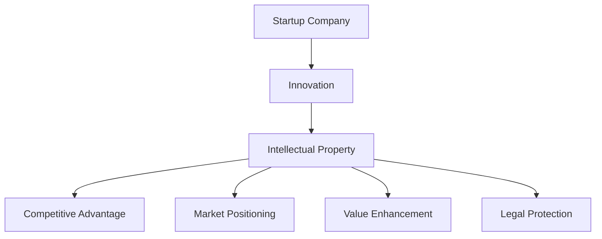

                 

### 文章标题

**《程序员创业公司的知识产权保护策略》**

> **关键词：知识产权保护、程序员、创业公司、策略、商标、版权、专利。**

**摘要：**本文旨在探讨程序员创业公司在知识产权保护方面的策略。从商标、版权、专利等多个维度，结合实际案例分析，为创业者提供一套完整的知识产权保护方案。文章首先介绍知识产权的基本概念，然后分析创业公司面临的知识产权风险，最后提出具体的保护策略和实施建议。

### Background Introduction

The digital age has ushered in a wave of entrepreneurship, particularly in the technology sector, where programmers and software developers are at the forefront. These entrepreneurs face a unique set of challenges, one of which is the protection of intellectual property (IP). Intellectual property refers to legal rights that apply to creations of the mind, such as inventions, literary and artistic works, designs, and symbols, names, and images used in commerce.

For startup companies, especially those founded by programmers, the significance of intellectual property cannot be overstated. Effective IP protection can lead to significant competitive advantages, safeguard the company's market position, and enhance its overall value. However, navigating the complex landscape of intellectual property laws and strategies can be daunting for many entrepreneurs. This article aims to provide a comprehensive guide to intellectual property protection for programmer-founded startups.

We will explore the key types of intellectual property—trademarks, copyrights, and patents—and discuss the importance of each in the context of a startup. We will also examine the common intellectual property risks faced by startups and provide practical strategies to mitigate these risks. Finally, we will delve into real-world case studies to illustrate the effectiveness of these strategies and offer actionable advice for implementing a robust IP protection plan.

### Core Concepts and Connections

#### What is Intellectual Property?

Intellectual property (IP) encompasses various forms of intangible assets that are the result of human creativity and innovation. The primary types of intellectual property include:

1. **Copyright:** Protects original works of authorship, such as literary, dramatic, musical, and artistic works, as well as software code, databases, and other forms of creative expression.
2. **Patents:** Grant exclusive rights to inventors for new inventions, technological solutions, and industrial designs, providing protection for a limited period.
3. **Trademarks:** Protect distinctive signs, including logos, names, and symbols, that distinguish goods and services of one party from those of others.

#### The Importance of Intellectual Property Protection

For a startup, especially one founded by programmers, intellectual property plays a crucial role in the following aspects:

1. **Competitive Advantage:** By securing trademarks, patents, and copyrights, startups can prevent competitors from copying their innovative products or services, giving them a unique selling proposition in the market.
2. **Market Positioning:** Strong IP portfolios can enhance a startup's reputation and credibility, making it more attractive to investors, partners, and customers.
3. **Value Enhancement:** Well-protected intellectual property can significantly increase the value of a startup, making it a more appealing target for acquisition or merger opportunities.
4. **Legal Protection:** Effective IP protection ensures that startups can take legal action against infringers, protecting their rights and interests.

#### The Relationship Between Intellectual Property and Startups

The relationship between intellectual property and startups can be visualized through the following Mermaid flowchart:

This flowchart illustrates that innovation is the starting point for a startup, leading to the creation of intellectual property. This IP, in turn, provides various benefits that are critical for the success and growth of the startup.

### Core Algorithm Principles and Specific Operational Steps

#### Step 1: Identify Intellectual Property Assets

The first step in creating an effective intellectual property protection strategy is to identify the company's IP assets. This involves conducting a thorough audit of the company's products, services, software, and creative works to determine what can be protected under trademarks, patents, and copyrights.

1. **Patents:** Identify inventions, processes, or technologies that are novel, non-obvious, and have practical applications. These can be patented to prevent others from using, making, or selling the same invention.
2. **Copyrights:** Identify original works, such as software code, user interfaces, and other creative expressions, that can be copyrighted to prevent unauthorized copying or distribution.
3. **Trademarks:** Identify distinctive signs, including logos, names, and slogans, that can be trademarked to protect the company's brand identity and reputation.

#### Step 2: Conduct a Patent Search

Before applying for a patent, it's essential to conduct a patent search to ensure that your invention is novel and not already protected by an existing patent. This involves searching through patent databases, such as the United States Patent and Trademark Office (USPTO) or the World Intellectual Property Organization (WIPO), to identify similar inventions.

1. **Search for Prior Art:** Look for patents, publications, and other public documents that describe technologies or inventions similar to your own. This helps you understand the existing landscape and whether your invention is truly unique.
2. **Analyze Search Results:** Review the search results to determine if there are any obstacles to patenting your invention. If necessary, consult with a patent attorney to interpret the results and make strategic decisions.

#### Step 3: File a Patent Application

Once you have determined that your invention is novel and non-obvious, you can proceed to file a patent application. This involves completing the necessary forms, providing a detailed description of the invention, and paying the required fees.

1. **Prepare the Application:** Write a clear and concise patent application that describes your invention in sufficient detail to enable others skilled in the art to practice it.
2. **Submit the Application:** File the application with the appropriate patent office, such as the USPTO. Ensure that all required documentation and fees are submitted on time to avoid delays or legal complications.
3. **Patent Examination:** The patent office will examine your application to determine if it meets the requirements for patentability. This process can take several months or even years, depending on the complexity of the invention and the workload of the patent office.

#### Step 4: Register Trademarks and Copyrights

To protect your brand identity and creative works, you can register trademarks and copyrights with the appropriate government agency.

1. **Trademark Registration:** Register your distinctive signs, such as logos, names, and slogans, with the USPTO. This process typically involves filing an application, paying fees, and undergoing an examination to determine if the trademark is distinctive and not already in use.
2. **Copyright Registration:** Register your original works, such as software code, user interfaces, and other creative expressions, with the Copyright Office. This can be done online through the Copyright Office's electronic registration system. Registration provides several benefits, including the ability to file a lawsuit for infringement and recover statutory damages and attorney's fees.

#### Step 5: Implement an IP Management System

Once your IP assets are protected, it's important to implement an IP management system to monitor and enforce your rights. This involves:

1. **Monitoring Infringement:** Keep an eye on the market for potential infringement of your IP rights. This can be done through online searches, monitoring competitor products, and staying informed about industry developments.
2. **Enforcing IP Rights:** If you discover that someone is infringing on your IP rights, take steps to enforce your rights. This may involve sending a cease-and-desist letter, negotiating a license agreement, or filing a lawsuit.
3. **Maintaining and Updating IP Assets:** Regularly review your IP portfolio to ensure that your assets are up to date and continue to provide the necessary protection. This may involve renewing patents and trademarks, updating registration documents, and adapting to changes in the market.

### Mathematical Models and Formulas & Detailed Explanation & Examples

#### Formula for Evaluating IP Asset Value

The value of an IP asset can be evaluated using the following formula:

$$
V = f(P, C, E, L)
$$

Where:

- \( V \) is the value of the IP asset.
- \( P \) is the potential market size for the protected technology or brand.
- \( C \) is the competitive advantage provided by the IP asset.
- \( E \) is the expected economic benefits from the IP asset, including revenue growth and cost savings.
- \( L \) is the legal strength of the IP asset, including the enforceability and scope of protection.

#### Example of Evaluating IP Asset Value

Let's consider a hypothetical startup that has developed a novel software platform for data analytics. The company has applied for a patent on the platform and has also registered a trademark for its name and logo.

1. **Potential Market Size (\( P \)):** The data analytics market is estimated to be worth $50 billion annually.
2. **Competitive Advantage (\( C \)):** The software platform offers unique features that are not available in competing products, giving the startup a significant advantage in the market.
3. **Expected Economic Benefits (\( E \)):** The company expects the platform to generate $10 million in revenue within the first three years of operation.
4. **Legal Strength (\( L \)):** The patent and trademark are registered in key markets, providing strong legal protection against infringement.

Using the formula, we can calculate the value of the IP assets as follows:

$$
V = f(P, C, E, L) = f(50, 0.8, 10, 0.9) = 0.2 \times 50 \times 0.8 \times 10 \times 0.9 = \$72 million
$$

This calculation suggests that the combined value of the patent and trademark for this startup is approximately \$72 million.

### Project Practice: Code Example and Detailed Explanation

#### Step 1: Set Up Development Environment

To demonstrate the practical implementation of IP protection strategies, let's consider a hypothetical scenario where a startup has developed a new mobile app for task management. The company wishes to protect its app by securing trademarks and copyrights for its unique features and user interface.

1. **Install Required Software:** The development team needs to install a code editor, an Integrated Development Environment (IDE), and a version control system (e.g., Git) to manage the software development process.
2. **Create Project Repository:** Set up a Git repository for the app's source code, design files, and documentation. This repository will be used to track changes and ensure version control.

#### Step 2: Source Code Implementation

The development team writes the source code for the task management app, focusing on its unique features and user interface elements.

1. **Define App Structure:** Create a project structure that organizes the code into logical modules, such as the user interface, data management, and task scheduling.
2. **Implement Unique Features:** Write code to implement the app's unique features, such as real-time task synchronization, customizable notifications, and advanced search capabilities.
3. **Design User Interface:** Develop a user-friendly interface using a responsive design framework, ensuring that the app works seamlessly on different devices and screen sizes.

#### Step 3: Code Review and Analysis

Once the initial version of the app is complete, the development team conducts a thorough code review to ensure that the code is well-structured, efficient, and free of potential intellectual property infringement.

1. **Code Review:** Assign reviewers to analyze the code for best practices, performance optimization, and potential intellectual property risks.
2. **Identify Infringement Risk:** Check the code for any instances of unauthorized use of third-party libraries, APIs, or copyrighted materials.
3. **Fix Issues:** Address any identified risks by modifying the code or seeking appropriate licenses for third-party components.

#### Step 4: Run and Test the App

After the code review and necessary fixes, the development team runs and tests the app to ensure that it functions correctly and meets the desired specifications.

1. **Functional Testing:** Perform a series of tests to validate the app's features and user interface.
2. **Performance Testing:** Conduct tests to measure the app's performance, including response times, resource usage, and stability under various conditions.
3. **Security Testing:** Assess the app's security to ensure that it is protected against potential vulnerabilities and unauthorized access.

#### Step 5: Document and Register IP Assets

To protect the app's intellectual property, the development team documents the unique features and user interface elements and registers trademarks and copyrights with the appropriate government agencies.

1. **Prepare Documentation:** Write a comprehensive documentation that describes the app's unique features and user interface.
2. **Trademark Registration:** File a trademark application with the USPTO to protect the app's name and logo.
3. **Copyright Registration:** Register the app's source code and design files with the Copyright Office to protect the company's creative works.

### Running Results and Analysis

After the app has been tested and the IP assets have been registered, the development team launches the app on the market.

1. **Market Response:** Monitor the app's performance and customer feedback to assess its market acceptance and identify areas for improvement.
2. **Infringement Monitoring:** Regularly check the market for potential infringement of the app's intellectual property rights.
3. **Legal Enforcement:** If infringement is detected, take legal action to protect the company's rights and interests.

### Practical Application Scenarios

#### Scenario 1: Patent Infringement in the Software Industry

A startup has developed a revolutionary algorithm for optimizing cloud computing resources. The company secures a patent for the algorithm and discovers that a major competitor is using a similar approach in their product.

1. **Investigation:** Conduct a thorough investigation to confirm that the competitor's product infringes on the startup's patent.
2. **Negotiation:** Engage in negotiations with the competitor to reach a settlement, potentially through a licensing agreement or a cross-licensing arrangement.
3. **Legal Action:** If negotiations fail, initiate legal action to enforce the startup's patent rights and seek damages for any infringement.

#### Scenario 2: Trademark Infringement in the Fashion Industry

A fashion startup has registered a trademark for its distinctive logo and discovers that a competitor is using a similar logo on their products.

1. **Documentation:** Gather evidence of the trademark registration and the competitor's use of the logo.
2. **Cease-and-Desist Letter:** Send a cease-and-desist letter to the competitor, demanding that they stop using the infringing logo.
3. **Legal Action:** If the competitor does not respond or continues to infringe, file a lawsuit for trademark infringement and seek injunctive relief and damages.

#### Scenario 3: Copyright Infringement in the Media Industry

A media startup has created a unique and engaging video series and discovers that a competitor is using similar content without permission.

1. **Monitoring:** Regularly monitor the market for potential infringement of the startup's copyrighted content.
2. **Notification:** Send a takedown notice to the competitor's hosting platform, requesting the removal of the infringing content.
3. **Legal Action:** If the content is not removed, file a lawsuit for copyright infringement and seek damages for any unauthorized use.

### Tools and Resources Recommendations

#### Learning Resources

1. **Books:**
   - "Understanding Software Licensing" by Charles M. Kiser
   - "Intellectual Property Law: Cases and Materials" by Paul G. sprinkle and David N. Smith
2. **Online Courses:**
   - "Intellectual Property Law" on Coursera
   - "Patents and Patent Law" on edX
3. **Websites:**
   - United States Patent and Trademark Office (USPTO)
   - World Intellectual Property Organization (WIPO)

#### Development Tools

1. **Integrated Development Environments (IDEs):**
   - Visual Studio Code
   - Eclipse
2. **Version Control Systems:**
   - Git
   - SVN
3. **Patent Search Databases:**
   - Google Patents
   - USPTO Patent Database

### Summary: Future Development Trends and Challenges

#### Future Trends

1. **Blockchain and Smart Contracts:** The use of blockchain technology and smart contracts can revolutionize intellectual property protection by providing transparent, decentralized, and tamper-proof records of ownership and transactions.
2. **Artificial Intelligence and Machine Learning:** AI and ML can be leveraged to improve the efficiency and accuracy of intellectual property analysis, monitoring, and enforcement.
3. **Global IP Collaboration:** With the increasing globalization of markets, there is a growing need for international collaboration and harmonization of intellectual property laws to protect cross-border IP assets.

#### Challenges

1. **Complexity and Cost:** Navigating the complex landscape of intellectual property laws and strategies can be time-consuming and costly for startups, especially those with limited resources.
2. **Infringement Detection and Prevention:** Keeping track of potential infringement and preventing unauthorized use of IP assets can be challenging, particularly in rapidly evolving markets.
3. **International Enforcement:** Enforcing intellectual property rights across different countries and legal systems can be complicated, requiring a deep understanding of local laws and regulations.

### Frequently Asked Questions and Answers

#### Q1: How do I protect my software code as a programmer?
A1: To protect your software code, you should register a copyright with the appropriate government agency, such as the U.S. Copyright Office. This will prevent others from copying, distributing, or performing your code without permission. Additionally, you can use version control systems like Git to track changes and maintain a record of ownership.

#### Q2: What should I do if I discover that my IP is being infringed?
A2: If you discover that your intellectual property is being infringed, you should first attempt to resolve the issue informally through negotiation or a cease-and-desist letter. If this does not work, you may need to consult with a patent or trademark attorney to assess your legal options, which may include filing a lawsuit for infringement.

#### Q3: How can I effectively monitor my IP assets for potential infringement?
A3: To monitor your IP assets for potential infringement, you can conduct regular searches in patent and trademark databases, such as the USPTO or Google Patents. Additionally, you can subscribe to alerts that notify you of new filings or publications that may infringe on your IP assets. It's also helpful to stay informed about industry developments and competitor activities.

### Extended Reading and Reference Materials

1. **Books:**
   - "Intellectual Property Law and the Computer Professional" by James E. Bessen and Michael J. Meurer
   - "Patent Strategy: A Manager's Guide to Maximizing Value at Low Cost" by John R. Thomas and David J. Kline
2. **Websites:**
   - IPWatchdog: [www.ipwatchdog.com](http://www.ipwatchdog.com)
   - LawTrades: [www.lawtrades.com](http://www.lawtrades.com)
3. **Patent Databases:**
   - Patent Prosecution Highway (PPH) Program: [www.wipo.int/patents/puh/en/](http://www.wipo.int/patents/puh/en/)
   - European Patent Office (EPO) Patent Database: [epo.org/searching-for-patents](https://epo.org/searching-for-patents)

### Conclusion

Protecting intellectual property is crucial for the success and growth of programmer-founded startups. By understanding the different types of intellectual property, conducting thorough patent searches, and implementing effective IP management systems, entrepreneurs can safeguard their innovative products and services. This article has provided a comprehensive guide to intellectual property protection, including strategies for trademarks, patents, and copyrights. By following the steps outlined in this article and staying informed about industry trends and legal developments, programmer entrepreneurs can build a strong intellectual property portfolio that supports their long-term success.

