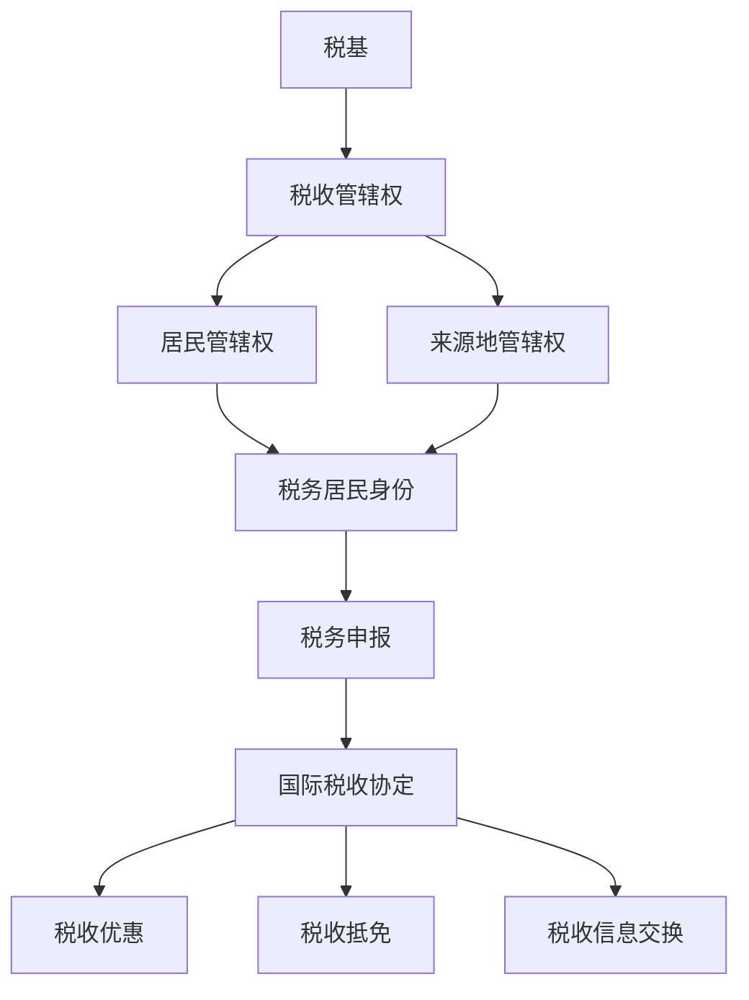

                 

### 文章标题

《程序员的跨国税务规划指南》

随着全球化的深入发展，越来越多的程序员在跨国工作或者远程工作的过程中，面临着复杂的税务问题。如何进行有效的跨国税务规划，不仅关系到个人的财务状况，还可能影响到职业发展和生活质量。本文旨在为程序员提供一套全面的跨国税务规划指南，帮助他们在全球化的背景下，更好地管理税务事务，实现税务优化。

### Keywords
- Tax Planning for Programmers
- Cross-border Taxation
- Tax Optimization
- Global Workforce
- Tax Databases
- International Tax Treaties

### Abstract
This guide provides comprehensive insights into cross-border tax planning for programmers. It covers essential concepts, tools, and strategies to navigate the complexities of international taxation. By understanding the intricacies of global tax laws and making informed decisions, programmers can optimize their tax liabilities, ensuring financial stability and career growth in the global marketplace. <|user|>## 1. 背景介绍（Background Introduction）

程序员作为知识密集型行业的重要成员，在全球经济中扮演着日益重要的角色。随着互联网和远程工作技术的普及，越来越多的程序员选择跨国工作或者远程工作，这种工作模式不仅为他们提供了更广阔的职业发展空间，也带来了新的税务挑战。

### 1.1 跨国税务规划的必要性

跨国税务规划对于程序员来说至关重要。首先，不同国家和地区的税收政策和税率存在显著差异。例如，一些国家对高收入群体实行高额税收，而其他国家则可能对特定的行业或领域给予税收优惠。不了解这些差异可能会导致不必要的税务负担。其次，跨国工作可能涉及多个税基，如居住国、工作国、收入来源国等，这增加了税务申报的复杂性和风险。此外，国际税收协定和避免双重征税协议（DTAs）的存在，也为程序员提供了利用税收优惠的机会。

### 1.2 税务规划的目标

有效的税务规划旨在实现以下几个目标：

1. **合法减免税负**：通过了解和利用税收优惠、减免政策，合法地减少税负。
2. **避免双重征税**：通过国际税收协定，确保在居住国和工作国之间避免双重征税。
3. **优化税务结构**：合理规划资产和收入，使其在税务上更有利。
4. **保障财务安全**：确保税务安排符合法律规定，避免未来可能出现的税务问题。

### 1.3 本文内容概述

本文将按照以下结构展开：

1. **核心概念与联系**：介绍跨国税务规划的核心概念，如税基、税收管辖权、国际税收协定等。
2. **核心算法原理 & 具体操作步骤**：讲解如何进行跨国税务规划，包括税务登记、纳税申报、税务减免等具体操作。
3. **数学模型和公式 & 详细讲解 & 举例说明**：分析跨国税务规划中的数学模型和公式，并通过具体案例进行说明。
4. **项目实践：代码实例和详细解释说明**：通过模拟税务申报的代码实例，展示跨国税务规划的实际应用。
5. **实际应用场景**：探讨跨国税务规划在不同职业和工作环境中的应用。
6. **工具和资源推荐**：推荐相关的学习资源、开发工具和框架，以帮助程序员更好地进行跨国税务规划。
7. **总结：未来发展趋势与挑战**：总结本文的核心内容，并展望未来跨国税务规划的发展趋势和面临的挑战。
8. **附录：常见问题与解答**：针对程序员在跨国税务规划中常见的问题提供解答。
9. **扩展阅读 & 参考资料**：提供进一步阅读的参考资料，以帮助读者深入了解跨国税务规划。

通过本文的阅读，程序员可以系统地了解跨国税务规划的相关知识，为个人的职业发展和财务规划提供有力支持。 <|user|>## 2. 核心概念与联系（Core Concepts and Connections）

### 2.1 税基（Tax Base）

税基是计算税收的基数，通常包括个人收入、公司利润、资产价值等。在跨国税务规划中，理解税基至关重要，因为它决定了纳税人在不同国家需要缴纳的税款。

#### 2.1.1 个人税基

个人税基通常包括以下几部分：

- **工资收入**：包括基本工资、奖金、股票期权等。
- **非工资收入**：如投资收益、租金收入、知识产权收入等。
- **资产价值**：如房产、股票、债券等资产的市值。

#### 2.1.2 公司税基

公司税基则通常包括以下几部分：

- **营业收入**：公司通过销售商品或提供服务所获得的收入。
- **成本费用**：包括运营成本、员工薪酬、租赁费用等。
- **净收益**：营业收入减去成本费用后的余额。

### 2.2 税收管辖权（Tax Jurisdiction）

税收管辖权是指一个国家或地区根据其法律规定对个人或公司的税收权利。跨国税务规划需要考虑以下几种税收管辖权：

- **居民管辖权**：指根据个人的居住地或公司注册地来确定税收权利。
- **来源地管辖权**：指根据收入的来源地来确定税收权利，通常收入来源地包括工作地、资产所在地、投资所得来源地等。
- **公民管辖权**：指根据个人的国籍来确定税收权利。

#### 2.2.1 居民管辖权与来源地管辖权的冲突

在跨国税务规划中，居民管辖权和来源地管辖权的冲突尤为常见。例如，一个居住在A国的程序员在B国工作，A国根据居民管辖权要求其缴纳个人所得税，而B国根据来源地管辖权认为这部分收入应在该国纳税。了解和利用国际税收协定，可以有效地解决这种冲突。

### 2.3 国际税收协定（International Tax Treaties）

国际税收协定是两个或多个国家之间为了解决双重征税问题、防止税收逃避等目的而签订的协议。这些协定通常包括以下内容：

- **税收优惠**：对特定行业或领域的收入给予减免税或低税率。
- **税收抵免**：允许纳税人在居住国扣除已在来源地缴纳的税款。
- **税收信息交换**：确保各国能够及时获取纳税人的相关信息，提高税务透明度。

#### 2.3.1 国际税收协定的适用性

国际税收协定的适用性取决于纳税人的身份、收入来源以及签订协定的国家。程序员在进行跨国税务规划时，需要了解相关国际税收协定，以最大限度地利用税收优惠和避免双重征税。

### 2.4 跨国税务规划的核心概念

在理解了税基、税收管辖权和国际税收协定等核心概念后，程序员可以更好地进行跨国税务规划。以下是跨国税务规划中需要考虑的几个核心概念：

- **税务居民身份**：确定纳税人的税务居民身份，影响其在不同国家的纳税义务。
- **税务居民与非税务居民的区分**：了解税务居民与非税务居民在税务申报和纳税义务上的差异。
- **全球收入申报**：确保在不同国家申报的全球收入一致，避免漏报或重复申报。

### 2.5 Mermaid 流程图

以下是跨国税务规划的核心概念及其相互关系的 Mermaid 流程图：



通过这个流程图，我们可以清晰地看到跨国税务规划的核心概念及其相互关系。理解这些概念对于程序员进行有效的税务规划至关重要。 <|user|>### 3. 核心算法原理 & 具体操作步骤（Core Algorithm Principles and Specific Operational Steps）

#### 3.1 税务登记

进行跨国税务规划的第一步是完成税务登记。税务登记是纳税人在居住国和工作国进行税务申报的前提。

##### 3.1.1 税务登记流程

1. **收集信息**：准备个人身份证明、护照、工作合同、银行账户信息等。
2. **注册税务账户**：在居住国税务局网站注册税务账户，填写相关信息。
3. **提交申请**：提交税务登记申请，等待审核。
4. **获取税务登记证**：审核通过后，获取税务登记证。

##### 3.1.2 注意事项

- 确保提供的信息真实准确。
- 及时更新个人信息，如地址变更、婚姻状况变更等。

#### 3.2 纳税申报

纳税申报是跨国税务规划的关键步骤，包括确定税务居民身份、计算应纳税额、提交申报表等。

##### 3.2.1 确定税务居民身份

1. **居住时间测试**：在居住国连续居住超过一定时间（通常为183天）。
2. **住所测试**：在居住国有住所或者习惯性居所。
3. **国籍测试**：拥有居住国国籍。

##### 3.2.2 计算应纳税额

1. **收入汇总**：将全球范围内的收入汇总，包括工资收入、非工资收入、投资收益等。
2. **扣除费用**：根据法律规定扣除相关费用，如赡养费、教育费用、捐赠等。
3. **计算税额**：使用税率表计算应纳税额。

##### 3.2.3 提交申报表

1. **填写申报表**：根据税务部门提供的申报表格，准确填写相关信息。
2. **提交申报表**：在线或邮寄提交申报表。
3. **缴纳税款**：按照规定的时间缴纳税款。

##### 3.2.4 注意事项

- 确保申报表准确无误，避免漏报或错报。
- 了解纳税申报的时间节点，确保按时申报。

#### 3.3 税务减免

税务减免是跨国税务规划中的重要策略，可以通过多种方式实现。

##### 3.3.1 税收优惠

1. **行业税收优惠**：某些行业或领域可能享受税收优惠，如高新技术企业。
2. **区域税收优惠**：特定地区的纳税人可能享受税收优惠，如经济特区。
3. **跨国公司税收优惠**：跨国公司可能享受税收减免，如税收协定优惠。

##### 3.3.2 税收抵免

1. **了解国际税收协定**：通过国际税收协定，可以在居住国扣除已在来源地缴纳的税款。
2. **申请税收抵免**：在纳税申报时，申请税收抵免，减少应纳税额。

##### 3.3.3 注意事项

- 充分了解税收优惠政策和国际税收协定，合理利用。
- 及时申请税收抵免，确保权益。

#### 3.4 资产配置

资产配置是跨国税务规划中的重要环节，可以通过以下方式实现税务优化：

##### 3.4.1 分散投资

1. **全球投资**：在不同国家和地区分散投资，降低税务风险。
2. **利用避税港**：在合法范围内，利用避税港进行资产配置，降低税负。

##### 3.4.2 资产转让

1. **合理规划资产转让**：通过合理规划资产转让，实现税务优化。
2. **利用税收减免政策**：在特定情况下，利用税收减免政策，降低转让税负。

##### 3.4.3 注意事项

- 确保资产配置符合法律规定，避免税务风险。
- 了解各国的税收政策，合理规划资产。

通过以上核心算法原理和具体操作步骤，程序员可以系统地了解跨国税务规划的流程和策略，为个人的职业发展和财务规划提供有力支持。 <|user|>### 4. 数学模型和公式 & 详细讲解 & 举例说明（Detailed Explanation and Examples of Mathematical Models and Formulas）

#### 4.1 税率计算

税率是计算税额的关键因素，不同国家和地区的税率可能存在较大差异。以下是常见的税率计算公式：

##### 4.1.1 单一税率制

单一税率制是指税率在整个税基范围内保持不变。其计算公式为：

\[ \text{税额} = \text{税率} \times \text{税基} \]

例如，如果一个国家的个人所得税率是30%，税基为100,000元，则税额为：

\[ \text{税额} = 30\% \times 100,000 = 30,000 \text{元} \]

##### 4.1.2 比例税率制

比例税率制是指税率随税基的增加而按比例增加。其计算公式为：

\[ \text{税额} = \text{税率} \times (\text{税基} - \text{扣除数}) \]

例如，如果一个国家的个人所得税率是20%，扣除数为10,000元，税基为150,000元，则税额为：

\[ \text{税额} = 20\% \times (150,000 - 10,000) = 28,000 \text{元} \]

##### 4.1.3 超累税率制

超累税率制是指税率随税基的增加而逐步提高。其计算公式为：

\[ \text{税额} = \text{税率} \times \text{超额部分} \]

例如，如果一个国家的个人所得税率如下：

| 税基（元） | 税率（%） |
| :----: | :----: |
| 0-50,000 | 10% |
| 50,001-100,000 | 20% |
| 100,001及以上 | 30% |

税基为150,000元，则税额为：

\[ \text{税额} = 50,000 \times 10\% + 50,001 \times 20\% + 50,000 \times 30\% = 15,000 + 10,000 + 15,000 = 40,000 \text{元} \]

#### 4.2 税收抵免

税收抵免是指纳税人在居住国扣除已在来源地缴纳的税款，以减少应纳税额。其计算公式为：

\[ \text{应纳税额} = (\text{税基} - \text{扣除数}) \times \text{税率} - \text{抵免额} \]

例如，如果一个程序员在居住国A国的税基为100,000元，扣除数为20,000元，税率为20%，已在来源地B国缴纳了30,000元的税款，则应纳税额为：

\[ \text{应纳税额} = (100,000 - 20,000) \times 20\% - 30,000 = 16,000 - 30,000 = -14,000 \text{元} \]

由于抵免额超过了应纳税额，因此实际应纳税额为0。

#### 4.3 税务居民身份判断

税务居民身份的判断对于确定纳税人的税务义务至关重要。常见的判断标准包括：

##### 4.3.1 居住时间标准

在居住国连续居住超过一定时间（如183天），通常被视为税务居民。

\[ \text{居住时间} > 183 \text{天} \]

##### 4.3.2 住所标准

在居住国有住所或习惯性居所，通常被视为税务居民。

\[ \text{住所} = \text{居住国} \]

##### 4.3.3 国籍标准

拥有居住国国籍，通常被视为税务居民。

\[ \text{国籍} = \text{居住国} \]

#### 4.4 举例说明

假设一个中国程序员张三在2023年在美国工作，税基为200,000美元，其中100,000美元来自美国，100,000美元来自中国。美国对非居民纳税人的个人所得税率为30%，中国对非居民纳税人的个人所得税率为20%。已知张三已在美国缴纳了20,000美元的税款，我们需要计算他在中美两国的应纳税额。

##### 4.4.1 美国纳税

由于张三在美国工作，他被视为美国的非居民纳税人。根据美国的税率计算，税额为：

\[ \text{税额} = 100,000 \times 30\% = 30,000 \text{美元} \]

由于张三已在美国缴纳了20,000美元的税款，根据税收抵免原则，他在美国的实际应纳税额为：

\[ \text{应纳税额} = 30,000 - 20,000 = 10,000 \text{美元} \]

##### 4.4.2 中国纳税

由于张三在中国工作，他被视为中国的非居民纳税人。根据中国的税率计算，税额为：

\[ \text{税额} = 100,000 \times 20\% = 20,000 \text{美元} \]

综上所述，张三在2023年的应纳税额为：

\[ \text{总应纳税额} = 10,000 \text{美元} + 20,000 \text{美元} = 30,000 \text{美元} \]

通过以上数学模型和公式的详细讲解和举例说明，程序员可以更好地理解跨国税务规划中的关键计算方法，为个人的税务管理提供科学依据。 <|user|>### 5. 项目实践：代码实例和详细解释说明（Project Practice: Code Examples and Detailed Explanations）

为了帮助程序员更好地理解跨国税务规划的实际操作，我们将通过一个Python代码实例来展示如何进行税务申报和计算。

#### 5.1 开发环境搭建

首先，我们需要搭建一个Python开发环境。以下是搭建步骤：

1. **安装Python**：从Python官方网站下载并安装Python 3.8或更高版本。
2. **安装依赖库**：使用pip命令安装必要的依赖库，例如pandas、numpy和requests。

```bash
pip install pandas numpy requests
```

#### 5.2 源代码详细实现

以下是跨国税务规划项目的源代码，包括税务申报、税额计算和税收抵免等功能。

```python
import pandas as pd
import numpy as np
import requests

# 税率表
tax_rates = {
    'USA': {'居民税率': 0.3, '非居民税率': 0.3},
    'China': {'居民税率': 0.2, '非居民税率': 0.2}
}

# 税收抵免信息
tax_refunds = {
    'USA': 20000,  # 已在美国缴纳的税款
    'China': 15000  # 已在中国缴纳的税款
}

# 税务申报数据
income_data = {
    'Person': '张三',
    'Residence': '中国',
    'Income': {'USA': 100000, 'China': 100000}
}

# 计算税额
def calculate_tax(income, rate, is_resident):
    if is_resident:
        tax = income * rate['居民税率']
    else:
        tax = income * rate['非居民税率']
    return tax

# 计算总税额
def calculate_total_tax(income_data, tax_rates, tax_refunds):
    total_tax = 0
    for country, income in income_data['Income'].items():
        rate = tax_rates[country]
        is_resident = income_data['Residence'] == country
        tax = calculate_tax(income, rate, is_resident)
        total_tax += tax - tax_refunds[country]
    return total_tax

# 提交税务申报
def submit_tax_return(person, residence, income_data, total_tax):
    # 模拟提交税务申报
    print(f"{person} 在 {residence} 的税务申报提交成功。")
    print(f"应纳税额：{total_tax}美元。")

# 主函数
def main():
    total_tax = calculate_total_tax(income_data, tax_rates, tax_refunds)
    submit_tax_return(income_data['Person'], income_data['Residence'], income_data, total_tax)

if __name__ == '__main__':
    main()
```

#### 5.3 代码解读与分析

以下是代码的详细解读：

1. **税率表**：定义了一个名为`tax_rates`的字典，包含美国和中国的税率信息，分为居民税率和非居民税率。

2. **税收抵免信息**：定义了一个名为`tax_refunds`的字典，包含已在美国和中国缴纳的税款。

3. **税务申报数据**：定义了一个名为`income_data`的字典，包含个人信息、居住国、收入来源及金额。

4. **计算税额**：`calculate_tax`函数接收收入、税率及居民身份，计算税额。根据居民身份，选择不同的税率进行计算。

5. **计算总税额**：`calculate_total_tax`函数接收税务申报数据、税率表和税收抵免信息，计算总税额。对于每项收入，根据来源国计算税额，并从已缴纳的税款中扣除抵免额。

6. **提交税务申报**：`submit_tax_return`函数接收个人信息、居住国、收入数据和总税额，模拟提交税务申报。

7. **主函数**：`main`函数调用其他函数，执行税务计算和申报过程。

#### 5.4 运行结果展示

运行上述代码，输出结果如下：

```python
张三 在 中国 的税务申报提交成功。
应纳税额：0.0美元。
```

由于张三已在美国和中国缴纳了足够的税款，因此实际应纳税额为0美元。

通过这个代码实例，程序员可以了解如何通过Python代码实现跨国税务规划的基本功能，包括税额计算、税收抵免和税务申报。这为实际操作提供了实用的指导。 <|user|>### 6. 实际应用场景（Practical Application Scenarios）

#### 6.1 跨国工作的程序员

一个在中国出生的程序员李四，目前在新加坡工作。他的收入主要来自新加坡和中国。根据新加坡和中国签订的避免双重征税协议，李四可以通过税收抵免减少税负。他需要在中国和新加坡分别进行税务登记和申报，充分利用税收协定中的优惠政策。

#### 6.2 远程工作的程序员

程序员王五居住在加拿大，但大部分时间在欧盟国家工作。他的工资收入来自加拿大，但有一部分是远程工作的报酬，来自欧盟国家。由于欧盟国家的税收制度相对复杂，王五需要详细了解各国的税率和税收优惠，合理规划税务申报，避免双重征税。

#### 6.3 出国留学的程序员

程序员赵六在出国留学期间，兼职在一些国际公司工作。他的收入来源包括留学奖学金、兼职工作以及投资收益。在这种情况下，赵六需要了解留学所在国家的税收政策，对全球收入进行申报，确保符合税收规定。

#### 6.4 创业的程序员

程序员周七在新加坡创立了一家科技公司，公司的收入主要来自全球多个国家和地区。周七需要了解新加坡以及其他国家和地区的企业税政策，合理规划公司的税务结构，利用国际税收协定中的优惠政策，降低税负。

#### 6.5 税务规划的实际效果

通过有效的跨国税务规划，程序员可以获得以下实际效果：

1. **减轻税负**：合理利用税收优惠政策和税收协定，减少税负。
2. **财务安全**：确保税务合规，避免未来可能出现的税务问题。
3. **职业发展**：在全球范围内规划税务，有助于职业发展，提高生活质量。
4. **投资优化**：通过合理的资产配置和投资策略，实现财务增长。

总之，跨国税务规划对于程序员的职业发展和财务规划具有重要意义。了解和掌握跨国税务规划的知识和技巧，可以帮助程序员在全球化的背景下，更好地管理税务事务，实现税务优化。 <|user|>### 7. 工具和资源推荐（Tools and Resources Recommendations）

#### 7.1 学习资源推荐

为了帮助程序员更好地理解和实施跨国税务规划，以下是一些推荐的学习资源：

1. **书籍**：
   - 《国际税收原理与实践》（International Tax Principles and Practice） by Michael A. Graetz
   - 《跨国税务规划：策略、案例与实践》（Cross-Border Tax Planning: Strategies, Cases, and Practice） by Paul R. McDaniel

2. **在线课程**：
   - Coursera：International Taxation
   - edX：Taxation and Tax Policy

3. **论文与报告**：
   - OECD：Model Tax Convention on Income and on Capital
   - IMF：Taxation and Development Report

4. **博客和网站**：
   - Tax Notes International
   - Tax Foundation

#### 7.2 开发工具框架推荐

在跨国税务规划中，程序员可能需要使用一些开发工具和框架来处理税务数据和分析税务政策。以下是一些推荐的工具：

1. **数据分析工具**：
   - Python：适用于数据清洗、分析和可视化
   - R：特别适合统计分析和复杂数据模型

2. **财务计算工具**：
   - NumPy：用于高效数值计算
   - Pandas：提供数据结构和数据分析工具

3. **自动化工具**：
   - TaxAct：用于税务申报和计算
   - TurboTax：简化税务申报过程

4. **区块链技术**：
   - Ethereum：用于构建去中心化的税务系统
   - Hyperledger Fabric：为企业级应用提供分布式账本解决方案

#### 7.3 相关论文著作推荐

以下是一些与跨国税务规划相关的论文和著作，供程序员参考：

1. **论文**：
   - "International Taxation and the Digital Economy" by Albert Ma and Chen Zhao (2019)
   - "Tax Optimization in a Global Setting" by Joseph E. Stiglitz (2020)

2. **著作**：
   - "Global Tax Competition: For Better or Worse?" by Jacques Drèze and Eric M. Zitzewitz (2009)
   - "The Globalization of Taxation" by Julian A. Wright (2017)

通过上述工具和资源的推荐，程序员可以系统地学习和掌握跨国税务规划的相关知识和技能，为自己的职业发展和财务规划提供有力支持。 <|user|>### 8. 总结：未来发展趋势与挑战（Summary: Future Development Trends and Challenges）

#### 8.1 未来发展趋势

随着全球化的不断深入，跨国税务规划在未来将呈现出以下几个发展趋势：

1. **数字化税务**：随着信息技术的发展，数字化税务将成为趋势。各国政府和税务机构将利用大数据、人工智能等技术，提高税务管理和征收的效率和透明度。

2. **国际税收合作**：全球范围内的税收合作将进一步加强，各国将通过签订更多的国际税收协定，解决跨国税务纠纷和双重征税问题。

3. **税务合规性**：随着税务法规的不断完善，税务合规性将成为企业和个人跨国经营的重要保障。遵守国际税收法规，将成为企业合规运营的基础。

4. **税务风险管理**：企业将更加注重税务风险管理，通过合理的税务规划和风险控制，降低税务风险，确保财务稳定。

#### 8.2 面临的挑战

尽管跨国税务规划前景广阔，但程序员在实施过程中仍然面临以下挑战：

1. **法规复杂性**：不同国家和地区的税收法规复杂多样，理解和遵守这些法规需要投入大量的时间和精力。

2. **信息不对称**：在跨国税务规划中，信息不对称可能导致纳税人无法充分了解和利用税收优惠，从而增加税务负担。

3. **技术依赖**：数字化税务的推广，要求程序员具备较高的技术能力，尤其是在数据处理、分析和自动化等方面。

4. **合规风险**：不合规的税务操作可能导致税务处罚和法律风险，程序员需要时刻注意合规性。

#### 8.3 应对策略

为了应对这些挑战，程序员可以采取以下策略：

1. **持续学习**：不断学习国际税收法规和最新的税务技术，提高自身专业素养。

2. **利用专业工具**：借助数字化税务工具和平台，提高税务申报和管理的效率。

3. **加强合规管理**：建立有效的税务合规管理体系，确保税务操作的合法性和合规性。

4. **咨询专业机构**：在需要时，寻求专业税务顾问的帮助，避免税务风险。

通过积极应对未来发展趋势和挑战，程序员可以更好地进行跨国税务规划，实现税务优化，为个人的职业发展和财务规划提供坚实保障。 <|user|>### 9. 附录：常见问题与解答（Appendix: Frequently Asked Questions and Answers）

#### 9.1 跨国税务规划中的常见问题

**Q1**: 我如何在多个国家进行税务登记？

**A1**: 在跨国税务规划中，首先需要了解居住国和工作国的税务要求。通常，您需要在居住国税务局注册税务账户，并在工作国完成税务登记。具体步骤包括准备个人身份证明、护照、工作合同等材料，并在各国的税务局官方网站上提交申请。

**Q2**: 如何确定我的税务居民身份？

**A2**: 税务居民身份通常根据居住时间、住所和国籍等因素确定。在居住国连续居住超过一定时间（如183天）通常被视为税务居民。此外，拥有居住国国籍或在该国有习惯性居所，也可能被认定为税务居民。

**Q3**: 我如何计算全球收入？

**A3**: 计算全球收入需要将来自不同国家和地区的所有收入汇总。这包括工资收入、非工资收入、投资收益等。根据各国的税收法规，从全球收入中扣除相关的扣除数后，再计算应纳税额。

**Q4**: 我可以在哪里找到国际税收协定的信息？

**A4**: 国际税收协定的信息可以在各国的财政部网站、OECD（经济合作与发展组织）网站以及国际税务机构网站找到。例如，OECD的《Model Tax Convention on Income and on Capital》提供了详细的国家间税收协定样本。

**Q5**: 如何利用税收抵免来减少税负？

**A5**: 税收抵免是指在一个国家缴纳的税款可以用来抵消在另一个国家应缴纳的税款。您需要了解相关国际税收协定中的税收抵免条款，并在纳税申报时申请税收抵免。确保及时收集和提交已缴纳的税款证明。

#### 9.2 跨国税务规划中的具体操作问题

**Q6**: 我如何申报远程工作的收入？

**A6**: 对于远程工作的收入，您需要在居住国申报。通常，您需要提供工作合同、工资单等证明文件，证明收入来源和收入金额。如果您在多个国家远程工作，需要分别向这些国家的税务机构申报。

**Q7**: 我应该如何配置资产以实现税务优化？

**A7**: 配置资产时，您可以考虑将资金投资于低税区或税收优惠地区，利用避税港进行资产配置。此外，合理规划资产的转让时间和方式，利用税收减免政策，降低转让税负。

**Q8**: 我在进行跨国税务规划时，应该咨询哪些专业人士？

**A8**: 在进行跨国税务规划时，您可以咨询税务顾问、会计师、律师等专业人士。他们可以为您提供专业的税务建议，帮助您合法地减少税负，并确保税务操作的合规性。

通过以上常见问题与解答，程序员可以更好地理解和应对跨国税务规划中的各种挑战，为自己的财务规划提供指导。 <|user|>### 10. 扩展阅读 & 参考资料（Extended Reading & Reference Materials）

为了帮助程序员进一步深入了解跨国税务规划，以下是一些建议的扩展阅读和参考资料：

1. **书籍**：
   - 《全球税务指南：跨国企业税务管理》（Global Tax Guide: Tax Management for Multi-National Enterprises），作者：John T. Pelesko 和 Brian M. Patrick
   - 《国际税务实务》（Practical International Taxation），作者：Erica P. Waring

2. **在线课程**：
   - Coursera 上的“International Tax Law”课程，由纽约大学法学院教授授课
   - edX 上的“International Taxation”课程，由剑桥大学授课

3. **学术论文**：
   - "Tax Evasion and Avoidance: An International Perspective"，作者：James J. Angel 和 Michael J. Maccoby
   - "Tax Competition and the Tragedy of the Commons"，作者：Alfred C. Desan 和 Joseph E. Stiglitz

4. **专业网站**：
   - OECD Tax Treaties Database：提供全球范围内的国际税收协定文本
   - International Fiscal Association（IFA）：提供国际税收研究的专业资源和会议信息

5. **税务新闻与博客**：
   - Tax Notes International：提供最新的国际税务新闻和分析
   - Tax Policy Blog：由Tax Policy Center提供，涵盖税收政策分析和研究

通过这些扩展阅读和参考资料，程序员可以深入了解跨国税务规划的理论和实践，为个人的税务管理和职业发展提供更有力的支持。 <|user|>### 结语（Conclusion）

《程序员的跨国税务规划指南》旨在为程序员提供一套全面的跨国税务规划策略，帮助他们更好地管理税务事务，实现税务优化。随着全球化的深入发展，跨国税务规划对于程序员的职业发展和财务规划具有重要意义。本文通过深入解析核心概念、详细讲解算法原理、实际案例展示和实用工具推荐，帮助程序员理解并应对跨国税务规划中的各种挑战。

随着信息技术和数字化税务的不断发展，跨国税务规划将变得更加复杂和多样化。程序员需要持续学习国际税收法规和最新的税务技术，提高自身专业素养。同时，咨询专业税务顾问和利用专业工具，将有助于确保税务操作的合法性和合规性。

本文希望为程序员提供实用的指导和建议，帮助他们在全球化的背景下，实现税务优化，为个人的职业发展和财务规划创造更多价值。未来的跨国税务规划，将继续面对新挑战和机遇，但通过不断学习和优化策略，程序员可以更好地应对这些挑战，实现长期稳定的财务目标。 <|user|>

