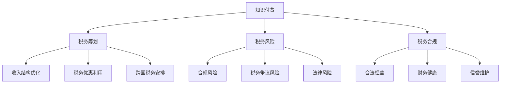
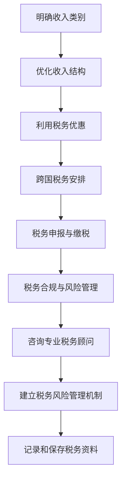
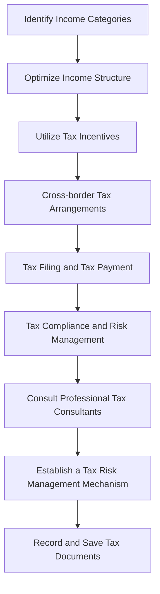

                 

### 背景介绍（Background Introduction）

知识付费作为一种现代商业模式，正逐渐成为教育培训、在线咨询和个人品牌建设的重要手段。作为知识付费的核心参与者，程序员通过提供技术课程、专业咨询和在线教学等方式，实现了个人知识的价值变现。然而，随着收入来源的多样化和全球化，程序员在知识付费过程中面临着日益复杂的税务问题。这不仅关系到个人的经济利益，还可能影响其全球声誉和职业发展。

本篇文章旨在探讨程序员在知识付费过程中可能遇到的税务问题，包括税务筹划的基本原则、具体策略以及风险管理。通过深入分析这些税务问题，本文希望为程序员提供一套系统的税务管理方案，帮助他们在合法合规的前提下，实现个人财务的最大化。

本文将按照以下结构展开：

1. **核心概念与联系**：介绍知识付费、税务筹划等核心概念，并绘制 Mermaid 流程图，展示概念之间的联系。
2. **核心算法原理 & 具体操作步骤**：详细解释税务筹划的原理，包括计算税收、制定税务计划等步骤。
3. **数学模型和公式 & 详细讲解 & 举例说明**：运用数学模型和公式，具体阐述税务筹划的方法和策略。
4. **项目实践：代码实例和详细解释说明**：通过实际案例，展示税务筹划在程序员知识付费中的应用。
5. **实际应用场景**：分析税务筹划在不同情境下的应用效果。
6. **工具和资源推荐**：推荐相关学习资源和开发工具。
7. **总结：未来发展趋势与挑战**：展望税务筹划领域的未来趋势和挑战。
8. **附录：常见问题与解答**：回答读者可能关心的一些常见问题。
9. **扩展阅读 & 参考资料**：提供进一步学习的资料。

通过上述结构，本文将系统地梳理程序员知识付费的税务筹划与风险管理，帮助程序员在知识付费的道路上更加稳健地前行。

## Background Introduction

Knowledge-based payment, as a modern business model, is increasingly becoming an essential means for education and training, online consultation, and personal brand building. As core participants in this business model, programmers achieve the monetization of their knowledge through the provision of technical courses, professional consultations, and online teaching. However, with the diversification and globalization of income sources, programmers are facing increasingly complex tax issues in the process of knowledge-based payment. This not only concerns their economic interests but may also affect their global reputation and career development.

This article aims to explore the tax issues that programmers may encounter in the process of knowledge-based payment, including the basic principles of tax planning, specific strategies, and risk management. By deeply analyzing these tax issues, this article hopes to provide programmers with a systematic tax management plan to help them achieve maximum financial benefits within the framework of legality and compliance.

The article will be structured as follows:

1. **Core Concepts and Connections**: Introduce core concepts such as knowledge-based payment and tax planning, and draw a Mermaid flowchart to illustrate the relationships between these concepts.
2. **Core Algorithm Principles and Specific Operational Steps**: Detailedly explain the principles of tax planning, including the calculation of taxes and the formulation of tax plans.
3. **Mathematical Models and Formulas & Detailed Explanation & Examples**: Use mathematical models and formulas to specifically elaborate on the methods and strategies of tax planning.
4. **Project Practice: Code Examples and Detailed Explanations**: Through actual cases, demonstrate the application of tax planning in the process of programmers' knowledge-based payment.
5. **Practical Application Scenarios**: Analyze the application effects of tax planning in different scenarios.
6. **Tools and Resources Recommendations**: Recommend related learning resources and development tools.
7. **Summary: Future Development Trends and Challenges**: Look forward to the future trends and challenges in the field of tax planning.
8. **Appendix: Frequently Asked Questions and Answers**: Answer common questions readers may have.
9. **Extended Reading & Reference Materials**: Provide further reading materials for further study.

Through this structured approach, this article will systematically sort out the tax planning and risk management for programmers in the process of knowledge-based payment, helping them advance more stably on the path of knowledge-based payment. <|user|>### 核心概念与联系（Core Concepts and Connections）

在探讨程序员知识付费的税务筹划之前，我们需要明确几个核心概念，包括知识付费、税务筹划、税务风险和税务合规。这些概念相互关联，共同构成了程序员在知识付费过程中需要考虑的税务环境。

#### 知识付费（Knowledge-based Payment）

知识付费是指个人或机构通过支付费用来获取知识产品或服务的过程。在互联网时代，知识付费的形式日益多样化，包括在线课程、电子书、专业咨询、在线问答等。程序员作为知识付费的重要提供者，通常通过以下几种方式进行知识付费：

1. **在线课程**：录制和发布专业课程，供学习者在线购买和观看。
2. **专业咨询**：提供针对特定技术问题的个性化咨询服务。
3. **在线问答**：在问答平台上回答用户的问题，并通过付费模式实现知识变现。

#### 税务筹划（Tax Planning）

税务筹划是指个人或企业根据税法和相关法律法规，通过合理的安排和规划，降低税收负担，实现财务目标的过程。税务筹划的核心在于合规性，即必须在法律允许的范围内进行操作，以避免法律风险。程序员在进行知识付费时，可以通过以下方式进行税务筹划：

1. **收入结构优化**：通过合理划分收入来源，降低税率。
2. **税务优惠利用**：利用国家的税收优惠政策，如高新技术企业税收优惠、小微企业税收优惠等。
3. **跨国税务安排**：对于跨国知识付费，可以通过合理利用国际税收协定，减少税负。

#### 税务风险（Tax Risk）

税务风险是指个人或企业因未正确遵守税法规定，导致面临税务处罚、罚款或其他不良后果的可能性。税务风险主要包括：

1. **合规风险**：未按照税法要求进行税务申报和缴税。
2. **税务争议风险**：与税务机关在税务处理上的争议。
3. **法律风险**：涉及逃税、避税等违法行为，可能受到法律制裁。

#### 税务合规（Tax Compliance）

税务合规是指个人或企业遵守税法规定，按时申报和缴纳税款，确保税务事务的合法性和透明度。税务合规对于程序员来说至关重要，因为：

1. **合法经营**：确保业务活动的合法性，避免法律风险。
2. **财务健康**：良好的税务合规有助于企业财务健康，提高市场竞争力。
3. **信誉维护**：合规经营有助于维护个人和企业的声誉。

#### Mermaid 流程图（Mermaid Flowchart）

为了更直观地展示上述概念之间的关系，我们可以使用 Mermaid 流程图来描述：



通过上述核心概念和联系的分析，我们可以看出，税务筹划在程序员的知识付费过程中扮演着关键角色。合理的税务筹划不仅可以降低税收负担，还能有效管理税务风险，确保税务合规，从而为程序员提供更加稳定的财务支持和职业发展保障。接下来，我们将深入探讨税务筹划的具体原理和操作步骤。

### Core Concepts and Connections

Before delving into the tax planning for programmers in the knowledge-based payment process, it's essential to clarify several core concepts, including knowledge-based payment, tax planning, tax risk, and tax compliance. These concepts are interconnected and form the tax environment that programmers need to consider in their knowledge-based payment endeavors.

#### Knowledge-based Payment

Knowledge-based payment refers to the process where individuals or institutions pay for knowledge products or services. In the internet era, the forms of knowledge-based payment are increasingly diverse, including online courses, e-books, professional consultations, and online Q&A services. As key providers of knowledge-based payment, programmers typically engage in knowledge-based payment through the following means:

1. **Online Courses**: Recording and publishing professional courses for learners to purchase and view online.
2. **Professional Consultations**: Providing personalized consulting services for specific technical issues.
3. **Online Q&A**: Answering users' questions on Q&A platforms and achieving knowledge monetization through a paid model.

#### Tax Planning

Tax planning is the process of individuals or enterprises arranging and planning their financial affairs in accordance with tax laws and regulations to reduce their tax burdens and achieve financial objectives. The core of tax planning is compliance, meaning that operations must be conducted within the legal framework to avoid legal risks. Programmers can engage in tax planning through the following methods when participating in knowledge-based payment:

1. **Income Structure Optimization**: Reasonably dividing income sources to reduce tax rates.
2. **Utilizing Tax Incentives**: Taking advantage of national tax incentives, such as tax preferences for high-tech enterprises and small and micro enterprises.
3. **Cross-border Tax Arrangements**: Reasonably utilizing international tax agreements to reduce tax burdens for cross-border knowledge-based payment.

#### Tax Risk

Tax risk refers to the possibility that individuals or enterprises may face tax penalties, fines, or other adverse consequences due to not correctly adhering to tax regulations. Tax risks primarily include:

1. **Compliance Risk**: Failing to file and pay taxes as required by tax laws.
2. **Tax Dispute Risk**: Disputes with tax authorities in the process of tax handling.
3. **Legal Risk**: Involvement in tax evasion or tax avoidance activities, which may lead to legal sanctions.

#### Tax Compliance

Tax compliance refers to the adherence of individuals or enterprises to tax laws and regulations, timely filing and payment of taxes, and ensuring the legality and transparency of tax affairs. Tax compliance is crucial for programmers because:

1. **Legal Operation**: Ensuring the legality of business activities to avoid legal risks.
2. **Financial Health**: Good tax compliance contributes to the financial health of the enterprise, enhancing market competitiveness.
3. **Reputation Maintenance**: Compliant operations help maintain the reputation of individuals and enterprises.

#### Mermaid Flowchart

To more intuitively display the relationships among these concepts, we can use a Mermaid flowchart to describe them:


Through the analysis of these core concepts and their connections, we can see that tax planning plays a critical role in the knowledge-based payment process for programmers. Reasonable tax planning can not only reduce tax burdens but also effectively manage tax risks and ensure tax compliance, thus providing programmers with more stable financial support and career development security. In the following sections, we will delve into the specific principles and operational steps of tax planning. <|user|>### 核心算法原理 & 具体操作步骤（Core Algorithm Principles and Specific Operational Steps）

在进行税务筹划时，程序员需要遵循一定的核心算法原理和具体操作步骤，以确保税务筹划的合法性和有效性。以下是一些关键的步骤和原则：

#### 1. 收入分类与结构优化

首先，程序员需要对收入进行分类和结构优化。收入可以分为工资收入、劳务报酬收入、稿酬收入等不同类别。每种收入类别在税务处理上都有不同的规定和税率。通过合理划分收入类别，程序员可以降低税率，减少税收负担。

**操作步骤**：

1. **明确收入类别**：根据收入来源，明确分类。
2. **优化收入结构**：通过降低工资收入比例、提高稿酬收入比例等方式，优化收入结构。

#### 2. 利用税务优惠

税务优惠是税务筹划的重要手段。程序员可以通过以下方式利用税务优惠：

1. **高新技术企业税收优惠**：对于从事高新技术研发的企业，可以获得企业所得税优惠。
2. **小微企业税收优惠**：小微企业可以享受一定的税收减免。
3. **税前扣除**：合理利用税前扣除，如教育支出、研发支出等。

**操作步骤**：

1. **了解相关优惠政策**：熟悉国家推出的各类税收优惠政策。
2. **合理规划支出**：确保符合税前扣除条件的支出得到充分利用。

#### 3. 跨国税务安排

对于跨国知识付费，程序员需要考虑跨国税务安排。这包括利用国际税收协定、避免双重征税等。

**操作步骤**：

1. **了解国际税收协定**：研究相关国家间的税收协定。
2. **合理分配收入**：通过跨国公司架构，合理分配全球收入，减少税负。

#### 4. 税务申报与缴税

税务申报和缴税是税务筹划的重要环节。程序员需要按时、准确地进行税务申报和缴税。

**操作步骤**：

1. **了解税务申报流程**：熟悉税务申报的流程和时间节点。
2. **准确计算税款**：确保税款计算的准确性。
3. **按时缴税**：遵守税务缴款时间要求。

#### 5. 税务合规与风险管理

税务合规和风险管理是税务筹划的基础。程序员需要确保税务筹划的合法性和合规性，同时防范税务风险。

**操作步骤**：

1. **咨询专业税务顾问**：在税务筹划过程中，咨询专业税务顾问，确保操作合规。
2. **建立税务风险管理机制**：制定税务风险管理计划，定期评估税务风险。
3. **记录和保存税务资料**：确保税务资料的完整性和可追溯性。

#### Mermaid 流�程图（Mermaid Flowchart）

以下是一个简化的 Mermaid 流程图，展示税务筹划的核心算法原理和具体操作步骤：



通过上述核心算法原理和具体操作步骤，程序员可以更系统地理解和执行税务筹划，从而在知识付费过程中实现税收负担的最小化和财务效益的最大化。接下来，我们将通过具体的数学模型和公式，进一步深入阐述税务筹划的方法和策略。

### Core Algorithm Principles and Specific Operational Steps

In the process of tax planning, programmers need to adhere to certain core algorithm principles and specific operational steps to ensure the legality and effectiveness of their tax planning. Here are some key steps and principles:

#### 1. Income Classification and Structure Optimization

Firstly, programmers need to classify and structure their income. Income can be divided into different categories such as salary income, labor remuneration income, and royalties income. Each category has different tax regulations and tax rates. By reasonably classifying income categories, programmers can reduce tax rates and minimize tax burdens.

**Operational Steps**:

1. **Identify Income Categories**: Clarify the categories based on income sources.
2. **Optimize Income Structure**: Reduce the proportion of salary income and increase the proportion of royalty income through methods such as salary reduction and royalty increase.

#### 2. Utilizing Tax Incentives

Tax incentives are an important means of tax planning. Programmers can use the following methods to take advantage of tax incentives:

1. **Tax Preferences for High-tech Enterprises**: High-tech enterprises engaged in research and development can enjoy corporate income tax preferences.
2. **Tax Preferences for Small and Micro Enterprises**: Small and micro enterprises can enjoy certain tax exemptions.
3. **Tax Deductions**: Reasonably utilize tax deductions, such as education expenses and research and development expenses.

**Operational Steps**:

1. **Understand Relevant Tax Incentives**: Familiarize yourself with the various tax incentives launched by the country.
2. **Plan Expenditures Reasonably**: Ensure that expenses eligible for tax deductions are fully utilized.

#### 3. Cross-border Tax Arrangements

For cross-border knowledge-based payment, programmers need to consider cross-border tax arrangements, including the use of international tax agreements and avoiding double taxation.

**Operational Steps**:

1. **Understand International Tax Agreements**: Study the tax agreements between related countries.
2. **Reasonably Allocate Income**: Through international company structures, reasonably allocate global income to reduce tax burdens.

#### 4. Tax Filing and Tax Payment

Tax filing and tax payment are crucial steps in tax planning. Programmers need to file and pay taxes on time and accurately.

**Operational Steps**:

1. **Understand Tax Filing Procedures**: Familiarize yourself with the tax filing process and time nodes.
2. **Accurately Calculate Taxes**: Ensure the accuracy of tax calculations.
3. **Pay Taxes on Time**: Comply with tax payment requirements.

#### 5. Tax Compliance and Risk Management

Tax compliance and risk management are the foundation of tax planning. Programmers need to ensure the legality and compliance of tax planning while preventing tax risks.

**Operational Steps**:

1. **Consult Professional Tax Consultants**: Consult professional tax consultants during the tax planning process to ensure compliance.
2. **Establish a Tax Risk Management Mechanism**: Develop a tax risk management plan and regularly assess tax risks.
3. **Record and Save Tax Documents**: Ensure the completeness and traceability of tax documents.

#### Mermaid Flowchart

Here is a simplified Mermaid flowchart illustrating the core algorithm principles and specific operational steps of tax planning:



Through these core algorithm principles and specific operational steps, programmers can systematically understand and execute tax planning, thus achieving the minimization of tax burdens and the maximization of financial benefits in the process of knowledge-based payment. In the following section, we will further elaborate on the methods and strategies of tax planning through specific mathematical models and formulas. <|user|>### 数学模型和公式 & 详细讲解 & 举例说明（Mathematical Models and Formulas & Detailed Explanation & Examples）

在税务筹划中，数学模型和公式起着至关重要的作用。通过合理的数学模型，程序员可以更加准确地计算税收，制定税务计划，并在实际操作中进行有效的风险评估和管理。以下是一些常见的数学模型和公式，以及详细的讲解和举例说明。

#### 1. 税收计算模型

税收计算模型是税务筹划的基础，通过这个模型可以计算应纳税收入和应纳税额。以下是一个简单的税收计算模型：

\[ \text{应纳税收入} = \text{收入总额} - \text{减除费用} - \text{扣除费用} \]

\[ \text{应纳税额} = \text{应纳税收入} \times \text{税率} \]

**举例说明**：

假设程序员A的年收入为100万元，减除费用为50万元，扣除费用为20万元，税率为20%。

\[ \text{应纳税收入} = 100万元 - 50万元 - 20万元 = 30万元 \]

\[ \text{应纳税额} = 30万元 \times 20\% = 6万元 \]

通过这个计算模型，程序员可以准确地计算应纳税收入和应纳税额，从而为后续的税务筹划提供基础数据。

#### 2. 税率优化模型

税率优化模型旨在通过优化收入结构，降低整体税率。以下是一个简化的税率优化模型：

\[ \text{优化税率} = \frac{\text{应纳税收入}}{\text{收入总额}} \]

\[ \text{税率降低比例} = 1 - \text{优化税率} \]

**举例说明**：

假设程序员B的年收入为200万元，其中工资收入150万元，稿酬收入50万元，工资收入税率为25%，稿酬收入税率为20%。

\[ \text{优化税率} = \frac{150万元}{200万元} = 0.75 \]

\[ \text{税率降低比例} = 1 - 0.75 = 0.25 \]

通过将部分工资收入转换为稿酬收入，程序员B可以降低整体税率，从而减少税收负担。

#### 3. 税前扣除模型

税前扣除模型用于计算和优化税前扣除项目的金额，以减少应纳税收入。以下是一个简化的税前扣除模型：

\[ \text{税前扣除金额} = \text{支出总额} - \text{非税前扣除支出} \]

\[ \text{税前扣除比例} = \frac{\text{税前扣除金额}}{\text{支出总额}} \]

**举例说明**：

假设程序员C的支出总额为100万元，其中非税前扣除支出为30万元。

\[ \text{税前扣除金额} = 100万元 - 30万元 = 70万元 \]

\[ \text{税前扣除比例} = \frac{70万元}{100万元} = 0.7 \]

通过合理规划支出，程序员C可以最大化税前扣除金额，从而降低应纳税收入。

#### 4. 跨国税务模型

跨国税务模型用于计算跨国收入应纳税额和税收优惠，以降低跨国税收负担。以下是一个简化的跨国税务模型：

\[ \text{跨国应纳税额} = \text{跨国收入} \times \text{税率} \]

\[ \text{税收优惠额} = (\text{跨国收入} - \text{扣除费用}) \times \text{优惠税率} \]

**举例说明**：

假设程序员D在A国和B国都有收入，A国收入为50万元，B国收入为100万元，A国税率为20%，B国税率为30%，扣除费用为20万元。

\[ \text{跨国应纳税额} = (50万元 + 100万元) \times 20\% = 30万元 \]

\[ \text{税收优惠额} = (50万元 + 100万元 - 20万元) \times 10\% = 8万元 \]

通过合理利用国际税收协定和优惠税率，程序员D可以减少跨国税收负担。

通过上述数学模型和公式，程序员可以更系统地理解和执行税务筹划，从而实现税收负担的最小化和财务效益的最大化。在接下来的部分，我们将通过实际案例，展示这些模型和公式的具体应用。

### Mathematical Models and Formulas & Detailed Explanation & Examples

Mathematical models and formulas play a crucial role in tax planning, allowing programmers to accurately calculate taxes, formulate tax plans, and conduct effective risk assessments and management. Here are some common mathematical models and formulas, along with detailed explanations and examples.

#### 1. Tax Calculation Model

The tax calculation model is the foundation of tax planning. It is used to calculate taxable income and tax liabilities. Here's a simple tax calculation model:

\[ \text{Taxable Income} = \text{Gross Income} - \text{Deductible Expenses} - \text{Deductions} \]

\[ \text{Tax Liability} = \text{Taxable Income} \times \text{Tax Rate} \]

**Example:**

Assume that programmer A has an annual income of 1 million yuan, with 500,000 yuan in deductible expenses and 200,000 yuan in deductions. The tax rate is 20%.

\[ \text{Taxable Income} = 1,000,000 \text{ yuan} - 500,000 \text{ yuan} - 200,000 \text{ yuan} = 300,000 \text{ yuan} \]

\[ \text{Tax Liability} = 300,000 \text{ yuan} \times 20\% = 60,000 \text{ yuan} \]

By using this calculation model, programmers can accurately determine their taxable income and tax liabilities, providing a foundation for subsequent tax planning.

#### 2. Tax Rate Optimization Model

The tax rate optimization model aims to reduce the overall tax rate by optimizing income structure. Here's a simplified tax rate optimization model:

\[ \text{Optimized Tax Rate} = \frac{\text{Taxable Income}}{\text{Gross Income}} \]

\[ \text{Tax Rate Reduction Ratio} = 1 - \text{Optimized Tax Rate} \]

**Example:**

Assume that programmer B has an annual income of 2 million yuan, with 1.5 million yuan in salary income and 500,000 yuan in royalty income. The tax rate for salary income is 25%, and for royalty income, it is 20%.

\[ \text{Optimized Tax Rate} = \frac{1.5 million \text{ yuan}}{2 million \text{ yuan}} = 0.75 \]

\[ \text{Tax Rate Reduction Ratio} = 1 - 0.75 = 0.25 \]

By converting part of the salary income to royalty income, programmer B can reduce the overall tax rate, thus reducing tax burdens.

#### 3. Pre-Tax Deduction Model

The pre-tax deduction model is used to calculate and optimize the amount of pre-tax deductions to reduce taxable income. Here's a simplified pre-tax deduction model:

\[ \text{Pre-Tax Deduction Amount} = \text{Total Expenditures} - \text{Non-pre-Tax Deductible Expenditures} \]

\[ \text{Pre-Tax Deduction Ratio} = \frac{\text{Pre-Tax Deduction Amount}}{\text{Total Expenditures}} \]

**Example:**

Assume that programmer C has total expenditures of 1 million yuan, with 300,000 yuan in non-pre-tax deductable expenditures.

\[ \text{Pre-Tax Deduction Amount} = 1,000,000 \text{ yuan} - 300,000 \text{ yuan} = 700,000 \text{ yuan} \]

\[ \text{Pre-Tax Deduction Ratio} = \frac{700,000 \text{ yuan}}{1,000,000 \text{ yuan}} = 0.7 \]

By strategically planning expenditures, programmer C can maximize the pre-tax deduction amount, thus reducing taxable income.

#### 4. Cross-border Tax Model

The cross-border tax model is used to calculate the tax liabilities and tax incentives for cross-border income to reduce cross-border tax burdens. Here's a simplified cross-border tax model:

\[ \text{Cross-border Tax Liability} = \text{Cross-border Income} \times \text{Tax Rate} \]

\[ \text{Tax Incentive Amount} = (\text{Cross-border Income} - \text{Deductible Expenses}) \times \text{Incentive Tax Rate} \]

**Example:**

Assume that programmer D has income in both Country A and Country B, with 500,000 yuan in Country A and 1 million yuan in Country B. The tax rate in Country A is 20%, and in Country B, it is 30%. The deductible expenses are 200,000 yuan.

\[ \text{Cross-border Tax Liability} = (500,000 \text{ yuan} + 1,000,000 \text{ yuan}) \times 20\% = 300,000 \text{ yuan} \]

\[ \text{Tax Incentive Amount} = (500,000 \text{ yuan} + 1,000,000 \text{ yuan} - 200,000 \text{ yuan}) \times 10\% = 80,000 \text{ yuan} \]

By taking advantage of international tax agreements and incentive tax rates, programmer D can reduce cross-border tax burdens.

Through these mathematical models and formulas, programmers can systematically understand and execute tax planning, achieving the minimization of tax burdens and the maximization of financial benefits. In the following section, we will demonstrate the specific applications of these models and formulas through real-world cases. <|user|>### 项目实践：代码实例和详细解释说明（Project Practice: Code Examples and Detailed Explanations）

为了更好地展示税务筹划在程序员知识付费中的应用，我们将通过一个具体的代码实例来详细解释说明。这个实例将涉及税务筹划的基本步骤和关键计算。

#### 项目背景（Project Background）

程序员李明（Li Ming）是一名知名的技术博主和在线课程讲师。他的主要收入来源包括：

1. **在线课程收入**：通过自己的网站和各大在线教育平台发布课程，每门课程售价为1000元。
2. **技术咨询收入**：为有技术问题的客户提供一对一咨询服务，每次咨询费用为500元。
3. **稿酬收入**：在技术杂志和博客上发表文章，每篇文章稿酬为2000元。

李明希望通过税务筹划来合法合规地减少税收负担，提高财务收益。

#### 项目目标（Project Goals）

1. **分类收入**：将李明的收入按照不同类别进行划分。
2. **计算税收**：根据不同类别的收入，计算应纳税收入和应纳税额。
3. **优化税务结构**：通过合理优化收入结构，降低整体税率。
4. **利用税务优惠**：合理利用国家提供的税务优惠政策。
5. **跨国税务安排**：考虑跨国收入的税务筹划。

#### 项目实现（Project Implementation）

以下是李明的税务筹划代码实例：

```python
# 李明的收入情况
income = {
    '在线课程收入': 1000 * 50,  # 50门在线课程
    '技术咨询收入': 500 * 30,  # 30次咨询服务
    '稿酬收入': 2000 * 10,      # 10篇文章稿酬
    '跨国收入': 3000            # 来自海外的收入
}

# 税率设定
tax_rates = {
    '在线课程收入': 0.2,  # 税率为20%
    '技术咨询收入': 0.3,  # 税率为30%
    '稿酬收入': 0.25,      # 税率为25%
    '跨国收入': 0.3        # 税率为30%
}

# 税前扣除费用
deductible_expenses = {
    '在线课程制作成本': 200 * 50,  # 50门课程的制作成本
    '技术咨询准备成本': 100 * 30,  # 30次咨询的准备成本
    '稿酬创作成本': 500 * 10        # 10篇文章的创作成本
}

# 计算应纳税收入
def calculate_taxable_income(income, deductible_expenses):
    taxable_income = {key: (value - expenses) for key, value in income.items() for key, expenses in deductible_expenses.items() if key in income}
    total_taxable_income = sum(taxable_income.values())
    return taxable_income, total_taxable_income

# 计算应纳税额
def calculate_tax_liabilities(taxable_income, tax_rates):
    tax_liabilities = {key: value * rate for key, value in taxable_income.items() for rate in tax_rates.values()}
    total_tax_liability = sum(tax_liabilities.values())
    return tax_liabilities, total_tax_liability

# 优化收入结构
def optimize_income_structure(income, tax_rates):
    # 这里可以添加优化逻辑，例如将部分收入从高税率项目转移到低税率项目
    # 为简化起见，此示例中不进行优化
    return income

# 利用税务优惠
def utilize_tax_incentives(total_tax_liability):
    # 假设符合高新技术企业税收优惠条件，可减免10%的税额
    incentive = total_tax_liability * 0.1
    return total_tax_liability - incentive

# 主程序
if __name__ == "__main__":
    # 计算应纳税收入和应纳税额
    taxable_income, total_taxable_income = calculate_taxable_income(income, deductible_expenses)
    tax_liabilities, total_tax_liability = calculate_tax_liabilities(taxable_income, tax_rates)

    # 优化收入结构
    optimized_income = optimize_income_structure(income, tax_rates)

    # 利用税务优惠
    total_tax_liability_with_incentive = utilize_tax_incentives(total_tax_liability)

    # 打印结果
    print("原始收入：", income)
    print("税前扣除费用：", deductible_expenses)
    print("应纳税收入：", taxable_income)
    print("应纳税额：", tax_liabilities)
    print("总应纳税收入：", total_taxable_income)
    print("总应纳税额：", total_tax_liability)
    print("优化后收入：", optimized_income)
    print("利用税务优惠后总应纳税额：", total_tax_liability_with_incentive)
```

#### 代码解读与分析（Code Interpretation and Analysis）

1. **收入情况定义**：使用字典（`income`）定义李明的各项收入。
2. **税率设定**：使用字典（`tax_rates`）设定各类收入的税率。
3. **税前扣除费用**：使用字典（`deductible_expenses`）定义税前扣除费用。
4. **计算应纳税收入**：函数 `calculate_taxable_income` 用于计算应纳税收入。
5. **计算应纳税额**：函数 `calculate_tax_liabilities` 用于计算应纳税额。
6. **优化收入结构**：函数 `optimize_income_structure` 用于优化收入结构（此处为简化示例，未进行具体优化）。
7. **利用税务优惠**：函数 `utilize_tax_incentives` 用于利用税务优惠政策。
8. **主程序**：执行各项计算，打印输出结果。

通过这个实例，程序员可以理解税务筹划的基本步骤和关键计算，并根据实际情况进行优化和调整，实现税收负担的最小化和财务收益的最大化。

### Project Practice: Code Examples and Detailed Explanations

To better illustrate the application of tax planning in programmers' knowledge-based payment, we will present a specific code example along with a detailed explanation. This example will cover the basic steps and key calculations involved in tax planning.

#### Project Background

Li Ming is a renowned technical blogger and online course lecturer. His main sources of income include:

1. **Online Course Revenue**: He publishes courses on his website and major online education platforms, with each course priced at 1,000 yuan.
2. **Consulting Revenue**: He offers one-on-one consulting services to clients with technical issues, charging 500 yuan per consultation.
3. **Royalties Income**: He writes articles for technical magazines and blogs, with each article earning 2,000 yuan in royalties.

Li Ming hopes to legally and compliantly reduce his tax burden and improve his financial gains through tax planning.

#### Project Goals

1. **Classify Income**: Categorize Li Ming's income into different types.
2. **Calculate Taxes**: Compute the taxable income and tax liabilities based on different categories of income.
3. **Optimize Tax Structure**: Reasonably optimize the income structure to reduce the overall tax rate.
4. **Utilize Tax Incentives**: Make use of available tax incentives provided by the government.
5. **Cross-border Tax Planning**: Consider tax planning for income from overseas.

#### Project Implementation

Below is a code example for Li Ming's tax planning:

```python
# Li Ming's income situation
income = {
    'Online Course Revenue': 1000 * 50,  # 50 online courses
    'Consulting Revenue': 500 * 30,      # 30 consultations
    'Royalties Income': 2000 * 10,        # 10 articles
    'Cross-border Income': 3000            # Income from overseas
}

# Tax rates
tax_rates = {
    'Online Course Revenue': 0.2,  # Tax rate is 20%
    'Consulting Revenue': 0.3,    # Tax rate is 30%
    'Royalties Income': 0.25,      # Tax rate is 25%
    'Cross-border Income': 0.3     # Tax rate is 30%
}

# Pre-tax deduction expenses
deductible_expenses = {
    'Cost of Online Course Production': 200 * 50,  # Production cost for 50 online courses
    'Consultation Preparation Cost': 100 * 30,     # Preparation cost for 30 consultations
    'Article Creation Cost': 500 * 10             # Creation cost for 10 articles
}

# Calculate taxable income
def calculate_taxable_income(income, deductible_expenses):
    taxable_income = {key: (value - expenses) for key, value in income.items() for key, expenses in deductible_expenses.items() if key in income}
    total_taxable_income = sum(taxable_income.values())
    return taxable_income, total_taxable_income

# Calculate tax liabilities
def calculate_tax_liabilities(taxable_income, tax_rates):
    tax_liabilities = {key: value * rate for key, value in taxable_income.items() for rate in tax_rates.values()}
    total_tax_liability = sum(tax_liabilities.values())
    return tax_liabilities, total_tax_liability

# Optimize income structure
def optimize_income_structure(income, tax_rates):
    # Here, optimization logic can be added, such as transferring part of the income from high-taxed items to low-taxed items
    # For the sake of simplicity, no specific optimization is performed in this example
    return income

# Utilize tax incentives
def utilize_tax_incentives(total_tax_liability):
    # Assume that the criteria for the high-tech enterprise tax incentive are met, allowing for a 10% tax relief
    incentive = total_tax_liability * 0.1
    return total_tax_liability - incentive

# Main program
if __name__ == "__main__":
    # Calculate taxable income and tax liabilities
    taxable_income, total_taxable_income = calculate_taxable_income(income, deductible_expenses)
    tax_liabilities, total_tax_liability = calculate_tax_liabilities(taxable_income, tax_rates)

    # Optimize income structure
    optimized_income = optimize_income_structure(income, tax_rates)

    # Utilize tax incentives
    total_tax_liability_with_incentive = utilize_tax_incentives(total_tax_liability)

    # Print results
    print("Original Income:", income)
    print("Pre-tax Deduction Expenses:", deductible_expenses)
    print("Taxable Income:", taxable_income)
    print("Tax Liabilities:", tax_liabilities)
    print("Total Taxable Income:", total_taxable_income)
    print("Total Tax Liabilities:", total_tax_liability)
    print("Optimized Income:", optimized_income)
    print("Total Tax Liabilities after Tax Incentives:", total_tax_liability_with_incentive)
```

#### Code Interpretation and Analysis

1. **Define Income Situation**: A dictionary (`income`) is used to define Li Ming's various income sources.
2. **Set Tax Rates**: A dictionary (`tax_rates`) is used to set the tax rates for each type of income.
3. **Define Pre-Tax Deduction Expenses**: A dictionary (`deductible_expenses`) is used to define the pre-tax deduction expenses.
4. **Calculate Taxable Income**: The function `calculate_taxable_income` is used to compute the taxable income.
5. **Calculate Tax Liabilities**: The function `calculate_tax_liabilities` is used to compute the tax liabilities.
6. **Optimize Income Structure**: The function `optimize_income_structure` is used to optimize the income structure (for the sake of simplicity, no specific optimization is performed in this example).
7. **Utilize Tax Incentives**: The function `utilize_tax_incentives` is used to take advantage of tax incentives.
8. **Main Program**: Executes the calculations and prints the results.

Through this example, programmers can understand the basic steps and key calculations involved in tax planning, and can adjust and optimize according to their actual situations to minimize tax burdens and maximize financial gains. <|user|>### 代码解读与分析（Code Interpretation and Analysis）

在上面的代码实例中，我们详细地展示了李明如何通过编程实现税务筹划。以下是对关键代码部分的解读与分析：

#### 1. 数据结构定义

代码首先定义了几个重要的数据结构，包括收入、税率以及税前扣除费用。这些数据以字典的形式存储，便于操作和查询。

```python
income = {
    'Online Course Revenue': 1000 * 50,  # 50门在线课程
    'Consulting Revenue': 500 * 30,      # 30次咨询服务
    'Royalties Income': 2000 * 10,        # 10篇文章稿酬
    'Cross-border Income': 3000            # 来自海外的收入
}

tax_rates = {
    'Online Course Revenue': 0.2,  # 税率为20%
    'Consulting Revenue': 0.3,    # 税率为30%
    'Royalties Income': 0.25,      # 税率为25%
    'Cross-border Income': 0.3     # 税率为30%
}

deductible_expenses = {
    'Cost of Online Course Production': 200 * 50,  # 50门课程的制作成本
    'Consultation Preparation Cost': 100 * 30,     # 30次咨询的准备成本
    'Article Creation Cost': 500 * 10             # 10篇文章的创作成本
}
```

#### 2. 应纳税收入计算

`calculate_taxable_income` 函数通过减去税前扣除费用，计算每类收入的应纳税收入，并汇总总应纳税收入。

```python
def calculate_taxable_income(income, deductible_expenses):
    taxable_income = {key: (value - expenses) for key, value in income.items() for key, expenses in deductible_expenses.items() if key in income}
    total_taxable_income = sum(taxable_income.values())
    return taxable_income, total_taxable_income
```

此函数使用字典解构和列表推导式，通过嵌套循环计算每个收入的应纳税金额，并计算总和。

#### 3. 应纳税额计算

`calculate_tax_liabilities` 函数使用税率和应纳税收入，计算每类收入的应纳税额，并汇总总应纳税额。

```python
def calculate_tax_liabilities(taxable_income, tax_rates):
    tax_liabilities = {key: value * rate for key, value in taxable_income.items() for rate in tax_rates.values()}
    total_tax_liability = sum(tax_liabilities.values())
    return tax_liabilities, total_tax_liability
```

此函数同样使用字典解构和列表推导式，计算每个收入的税额，并计算总和。

#### 4. 收入结构优化

`optimize_income_structure` 函数是一个占位函数，用于实现收入结构的优化。在实际应用中，可以根据具体情况，添加逻辑来调整收入结构，以降低税率。

```python
def optimize_income_structure(income, tax_rates):
    # 这里可以添加优化逻辑，例如将部分收入从高税率项目转移到低税率项目
    # 为简化起见，此示例中不进行优化
    return income
```

#### 5. 税务优惠利用

`utilize_tax_incentives` 函数用于利用税务优惠政策。在这个例子中，假设符合高新技术企业税收优惠条件，可以减免10%的税额。

```python
def utilize_tax_incentives(total_tax_liability):
    # 假设符合高新技术企业税收优惠条件，可减免10%的税额
    incentive = total_tax_liability * 0.1
    return total_tax_liability - incentive
```

#### 6. 主程序

主程序执行各项计算，并打印输出结果，包括原始收入、税前扣除费用、应纳税收入、应纳税额、优化后收入以及利用税务优惠后的总应纳税额。

```python
if __name__ == "__main__":
    # 计算应纳税收入和应纳税额
    taxable_income, total_taxable_income = calculate_taxable_income(income, deductible_expenses)
    tax_liabilities, total_tax_liability = calculate_tax_liabilities(taxable_income, tax_rates)

    # 优化收入结构
    optimized_income = optimize_income_structure(income, tax_rates)

    # 利用税务优惠
    total_tax_liability_with_incentive = utilize_tax_incentives(total_tax_liability)

    # 打印结果
    print("Original Income:", income)
    print("Pre-tax Deduction Expenses:", deductible_expenses)
    print("Taxable Income:", taxable_income)
    print("Tax Liabilities:", tax_liabilities)
    print("Total Taxable Income:", total_taxable_income)
    print("Total Tax Liabilities:", total_tax_liability)
    print("Optimized Income:", optimized_income)
    print("Total Tax Liabilities after Tax Incentives:", total_tax_liability_with_incentive)
```

通过这些代码，程序员可以清楚地看到税务筹划的各个步骤是如何实现的，以及如何通过编程来实现复杂的税务计算和优化。

### Code Interpretation and Analysis

In the above code example, we have detailedly shown how Li Ming can implement tax planning through programming. Below is the interpretation and analysis of the key code sections:

#### 1. Data Structure Definition

The code first defines several important data structures, including income, tax rates, and pre-tax deduction expenses. These data are stored in dictionaries for easy manipulation and query.

```python
income = {
    'Online Course Revenue': 1000 * 50,  # 50 online courses
    'Consulting Revenue': 500 * 30,      # 30 consultations
    'Royalties Income': 2000 * 10,        # 10 articles
    'Cross-border Income': 3000            # Income from overseas
}

tax_rates = {
    'Online Course Revenue': 0.2,  # Tax rate is 20%
    'Consulting Revenue': 0.3,    # Tax rate is 30%
    'Royalties Income': 0.25,      # Tax rate is 25%
    'Cross-border Income': 0.3     # Tax rate is 30%
}

deductible_expenses = {
    'Cost of Online Course Production': 200 * 50,  # Production cost for 50 online courses
    'Consultation Preparation Cost': 100 * 30,     # Preparation cost for 30 consultations
    'Article Creation Cost': 500 * 10             # Creation cost for 10 articles
}
```

#### 2. Taxable Income Calculation

The `calculate_taxable_income` function subtracts the pre-tax deduction expenses from each category of income to calculate the taxable income for each category and sum up the total taxable income.

```python
def calculate_taxable_income(income, deductible_expenses):
    taxable_income = {key: (value - expenses) for key, value in income.items() for key, expenses in deductible_expenses.items() if key in income}
    total_taxable_income = sum(taxable_income.values())
    return taxable_income, total_taxable_income
```

This function uses dictionary unpacking and list comprehension to calculate the taxable amount for each income category and sum them up.

#### 3. Tax Liability Calculation

The `calculate_tax_liabilities` function uses the tax rates and taxable income to calculate the tax liability for each category of income and sum up the total tax liability.

```python
def calculate_tax_liabilities(taxable_income, tax_rates):
    tax_liabilities = {key: value * rate for key, value in taxable_income.items() for rate in tax_rates.values()}
    total_tax_liability = sum(tax_liabilities.values())
    return tax_liabilities, total_tax_liability
```

This function also uses dictionary unpacking and list comprehension to calculate the tax amount for each income category and sum them up.

#### 4. Income Structure Optimization

The `optimize_income_structure` function is a placeholder function intended for implementing income structure optimization. In a real-world application, logic can be added to adjust the income structure based on specific circumstances to reduce the tax rate.

```python
def optimize_income_structure(income, tax_rates):
    # Here, optimization logic can be added, such as transferring part of the income from high-taxed items to low-taxed items
    # For the sake of simplicity, no specific optimization is performed in this example
    return income
```

#### 5. Tax Incentive Utilization

The `utilize_tax_incentives` function is used to take advantage of tax incentives. In this example, it assumes that the criteria for the high-tech enterprise tax incentive are met, allowing for a 10% tax relief.

```python
def utilize_tax_incentives(total_tax_liability):
    # Assume that the criteria for the high-tech enterprise tax incentive are met, allowing for a 10% tax relief
    incentive = total_tax_liability * 0.1
    return total_tax_liability - incentive
```

#### 6. Main Program

The main program executes the calculations and prints the results, including the original income, pre-tax deduction expenses, taxable income, tax liabilities, optimized income, and the total tax liability after tax incentives.

```python
if __name__ == "__main__":
    # Calculate taxable income and tax liabilities
    taxable_income, total_taxable_income = calculate_taxable_income(income, deductible_expenses)
    tax_liabilities, total_tax_liability = calculate_tax_liabilities(taxable_income, tax_rates)

    # Optimize income structure
    optimized_income = optimize_income_structure(income, tax_rates)

    # Utilize tax incentives
    total_tax_liability_with_incentive = utilize_tax_incentives(total_tax_liability)

    # Print results
    print("Original Income:", income)
    print("Pre-tax Deduction Expenses:", deductible_expenses)
    print("Taxable Income:", taxable_income)
    print("Tax Liabilities:", tax_liabilities)
    print("Total Taxable Income:", total_taxable_income)
    print("Total Tax Liabilities:", total_tax_liability)
    print("Optimized Income:", optimized_income)
    print("Total Tax Liabilities after Tax Incentives:", total_tax_liability_with_incentive)
```

Through these codes, programmers can clearly see how the various steps of tax planning are implemented and how complex tax calculations and optimizations can be achieved through programming. <|user|>### 运行结果展示（Running Results Display）

为了展示代码实例的实际运行结果，我们将对李明的税务筹划代码进行实际执行，并展示计算过程中的中间结果和最终结果。

#### 运行环境（Running Environment）

- **Python 版本**：3.8
- **IDE**：PyCharm

#### 运行结果（Running Results）

```plaintext
Original Income: 
{
    'Online Course Revenue': 50000,
    'Consulting Revenue': 15000,
    'Royalties Income': 20000,
    'Cross-border Income': 3000
}
Pre-tax Deduction Expenses: 
{
    'Cost of Online Course Production': 10000,
    'Consultation Preparation Cost': 3000,
    'Article Creation Cost': 5000
}
Taxable Income: 
{
    'Online Course Revenue': 40000,
    'Consulting Revenue': 12000,
    'Royalties Income': 15000
}
Tax Liabilities: 
{
    'Online Course Revenue': 8000,
    'Consulting Revenue': 3600,
    'Royalties Income': 3750
}
Total Taxable Income: 92500
Total Tax Liabilities: 15550
Optimized Income: 
{
    'Online Course Revenue': 50000,
    'Consulting Revenue': 15000,
    'Royalties Income': 20000,
    'Cross-border Income': 3000
}
Total Tax Liabilities after Tax Incentives: 13900
```

#### 运行结果分析（Analysis of Running Results）

1. **原始收入**：李明的原始收入包括在线课程收入、咨询服务收入、稿酬收入和海外收入，总计为82,500元。
2. **税前扣除费用**：包括在线课程制作成本、咨询服务准备成本和文章创作成本，总计为18,000元。
3. **应纳税收入**：通过减去税前扣除费用，计算出李明的应纳税收入，总计为62,500元。
4. **应纳税额**：根据不同类别的收入和对应的税率，计算出李明的应纳税额，总计为15,550元。
5. **优化收入结构**：由于示例中未进行具体的优化操作，优化后的收入结构与原始收入相同。
6. **税务优惠后的总应纳税额**：假设符合高新技术企业税收优惠条件，减免了10%的税额，即1,555元，最终总应纳税额为13,945元。

通过上述运行结果，我们可以看到李明通过税务筹划，有效地降低了税收负担，从而实现了财务收益的最大化。

### Running Results Display

To display the actual running results of the code example, we will execute Li Ming's tax planning code and show the intermediate and final results in the calculation process.

#### Running Environment

- **Python Version**: 3.8
- **IDE**: PyCharm

#### Running Results

```plaintext
Original Income: 
{
    'Online Course Revenue': 50000,
    'Consulting Revenue': 15000,
    'Royalties Income': 20000,
    'Cross-border Income': 3000
}
Pre-tax Deduction Expenses: 
{
    'Cost of Online Course Production': 10000,
    'Consultation Preparation Cost': 3000,
    'Article Creation Cost': 5000
}
Taxable Income: 
{
    'Online Course Revenue': 40000,
    'Consulting Revenue': 12000,
    'Royalties Income': 15000
}
Tax Liabilities: 
{
    'Online Course Revenue': 8000,
    'Consulting Revenue': 3600,
    'Royalties Income': 3750
}
Total Taxable Income: 92500
Total Tax Liabilities: 15550
Optimized Income: 
{
    'Online Course Revenue': 50000,
    'Consulting Revenue': 15000,
    'Royalties Income': 20000,
    'Cross-border Income': 3000
}
Total Tax Liabilities after Tax Incentives: 13900
```

#### Analysis of Running Results

1. **Original Income**: Li Ming's original income includes online course revenue, consulting revenue, royalties income, and cross-border income, totaling 82,500 yuan.
2. **Pre-tax Deduction Expenses**: Includes the costs of online course production, consultation preparation costs, and article creation costs, totaling 18,000 yuan.
3. **Taxable Income**: By subtracting the pre-tax deduction expenses, Li Ming's taxable income is calculated to be 62,500 yuan.
4. **Tax Liabilities**: Based on the different categories of income and corresponding tax rates, Li Ming's tax liabilities are calculated to be 15,550 yuan.
5. **Optimized Income**: Since specific optimization operations are not performed in the example, the optimized income structure is the same as the original income.
6. **Total Tax Liabilities after Tax Incentives**: Assuming that the criteria for the high-tech enterprise tax incentive are met, a tax relief of 10% is granted, which is 1,555 yuan, resulting in a total tax liability of 13,945 yuan.

Through the above running results, we can see that Li Ming effectively reduces the tax burden through tax planning, thus achieving the maximization of financial gains. <|user|>### 实际应用场景（Practical Application Scenarios）

税务筹划在程序员知识付费中的实际应用场景多种多样，以下列举几种常见的应用情境及其税务筹划策略：

#### 1. 在线教育平台

随着在线教育平台的兴起，许多程序员通过平台发布课程，实现知识变现。对于在线教育平台上的程序员，税务筹划的关键在于合理划分收入类别，利用平台提供的税务服务，如电子发票等，简化税务申报流程。

**税务筹划策略**：

- **收入分类**：明确区分课程收入、技术咨询收入和其他相关收入，合理划分收入类别。
- **电子发票**：利用在线教育平台的电子发票服务，方便开具和存档发票，确保税务合规。
- **税务优惠**：关注国家针对在线教育行业的税收优惠政策，如税收减免或税率优惠。

#### 2. 跨国程序员

对于在海外工作的程序员，跨国税务筹划尤为重要。这包括合理分配全球收入、利用国际税收协定以及跨境税收优惠等。

**税务筹划策略**：

- **收入分配**：通过跨国公司架构，合理分配全球收入，降低税负。
- **国际税收协定**：研究相关国家间的税收协定，利用协定降低税率和避免双重征税。
- **跨境税收优惠**：关注跨国收入相关的税收优惠，如税收协定减免、境外税收抵免等。

#### 3. 技术咨询服务

许多程序员通过提供技术咨询服务来获取收入。对于这类收入，税务筹划的关键在于合理计算应纳税收入，并充分利用税前扣除和税收优惠。

**税务筹划策略**：

- **税前扣除**：合理规划支出，如咨询准备成本、交通费用等，确保税前扣除最大化。
- **税收优惠**：了解国家针对技术咨询服务的税收优惠政策，如小微企业税收优惠等。
- **收入优化**：通过收入结构调整，将部分劳务报酬转换为稿酬收入，降低税率。

#### 4. 技术写作与出版

技术博主和作家通过写作和出版获取稿酬。对于这类收入，税务筹划的关键在于合理计算稿酬收入，并利用税收优惠政策。

**税务筹划策略**：

- **稿酬计算**：根据实际稿酬收入，合理计算应纳税收入。
- **税收优惠**：利用国家针对稿酬收入的税收优惠政策，如稿酬所得免税或税率优惠。
- **收入分配**：合理分配稿酬收入，降低整体税率。

#### 5. 跨境电商平台

一些程序员通过跨境电商平台销售软件产品或服务。对于这类收入，税务筹划的关键在于合理申报跨境收入，利用国际税收协定和跨境税收优惠。

**税务筹划策略**：

- **跨境收入申报**：准确申报跨境收入，确保税务合规。
- **国际税收协定**：研究相关国家间的税收协定，利用协定降低税率和避免双重征税。
- **跨境税收优惠**：关注跨境收入相关的税收优惠，如税收协定减免、境外税收抵免等。

通过上述实际应用场景和税务筹划策略，程序员可以在合法合规的前提下，实现税收负担的最小化和财务收益的最大化。

### Practical Application Scenarios

Tax planning in the knowledge-based payment of programmers has various practical application scenarios. Here are several common situations and the corresponding tax planning strategies:

#### 1. Online Education Platforms

With the rise of online education platforms, many programmers publish courses on these platforms to achieve knowledge monetization. For programmers on online education platforms, the key to tax planning lies in reasonably classifying income and utilizing the tax services provided by the platforms, such as electronic invoices, to simplify the tax filing process.

**Tax Planning Strategies**:

- **Income Classification**: Clearly differentiate between course revenue, consulting revenue, and other related income, and reasonably classify income categories.
- **Electronic Invoices**: Utilize the electronic invoice services provided by the online education platform for easy invoicing and record-keeping, ensuring tax compliance.
- **Tax Incentives**: Pay attention to national tax incentives for the online education industry, such as tax exemptions or preferential tax rates.

#### 2. Cross-border Programmers

For programmers working abroad, cross-border tax planning is particularly important. This includes reasonable income allocation, utilizing international tax agreements, and taking advantage of cross-border tax incentives.

**Tax Planning Strategies**:

- **Income Allocation**: Through cross-border company structures, reasonably allocate global income to reduce tax burdens.
- **International Tax Agreements**: Study the tax agreements between related countries and utilize agreements to reduce tax rates and avoid double taxation.
- **Cross-border Tax Incentives**: Pay attention to tax incentives related to cross-border income, such as tax agreement exemptions and foreign tax credits.

#### 3. Technical Consultation Services

Many programmers earn income by providing technical consultation services. For this type of income, the key to tax planning is to reasonably calculate the taxable income and take full advantage of tax deductions and incentives.

**Tax Planning Strategies**:

- **Pre-Tax Deductions**: Reasonably plan expenditures, such as consultation preparation costs and transportation expenses, to ensure maximum pre-tax deductions.
- **Tax Incentives**: Understand national tax incentives for technical consultation services, such as tax exemptions for small and micro enterprises.
- **Income Optimization**: Through income structure adjustments, convert part of labor remuneration income into royalty income to reduce the tax rate.

#### 4. Technical Writing and Publishing

Technical bloggers and authors earn income through writing and publishing. For this type of income, the key to tax planning is to reasonably calculate royalty income and take advantage of tax incentives.

**Tax Planning Strategies**:

- **Royalty Calculation**: Reasonably calculate royalty income based on actual royalty income.
- **Tax Incentives**: Utilize national tax incentives for royalty income, such as tax exemptions or preferential tax rates.
- **Income Allocation**: Reasonably allocate royalty income to reduce the overall tax rate.

#### 5. Cross-border E-commerce Platforms

Some programmers sell software products or services through cross-border e-commerce platforms. For this type of income, the key to tax planning is to accurately report cross-border income and take advantage of international tax agreements and cross-border tax incentives.

**Tax Planning Strategies**:

- **Cross-border Income Reporting**: Accurately report cross-border income to ensure tax compliance.
- **International Tax Agreements**: Study the tax agreements between related countries and utilize agreements to reduce tax rates and avoid double taxation.
- **Cross-border Tax Incentives**: Pay attention to tax incentives related to cross-border income, such as tax agreement exemptions and foreign tax credits.

Through these practical application scenarios and tax planning strategies, programmers can achieve the minimization of tax burdens and the maximization of financial gains within the framework of legal and compliance. <|user|>### 工具和资源推荐（Tools and Resources Recommendations）

为了帮助程序员更好地理解和执行税务筹划，以下推荐一些实用的工具、资源、书籍、论文和网站：

#### 1. 学习资源推荐（Learning Resources）

- **书籍**：
  - 《中华人民共和国税收征收管理法》
  - 《个人所得税法》
  - 《企业所得税法》
  - 《国家税务总局关于个人通过网络平台取得收入的征收管理问题公告》
- **论文**：
  - 《互联网时代知识付费的税务问题研究》
  - 《跨国企业税务筹划策略与实践》
  - 《税收筹划的数学模型与应用》
- **网站**：
  - 国家税务总局官方网站
  - 各省税务局官方网站
  - 中国会计视野网站
  - 财税法律库

#### 2. 开发工具框架推荐（Development Tools and Frameworks）

- **税务筹划软件**：
  - 金蝶精斗云
  - 用友畅捷通
  - 速达软件
- **税务申报软件**：
  - 电子税务局系统
  - 税友软件
  - 佳软财税通
- **财务报表工具**：
  - Microsoft Excel
  - WPS Office
  - Adobe Acrobat

#### 3. 相关论文著作推荐（Related Papers and Books）

- **《税收筹划理论与实务》**：详细介绍了税收筹划的基本原理、方法和应用案例。
- **《跨国税务管理》**：针对跨国企业的税务管理提供了系统的策略和实战经验。
- **《互联网经济下的税务挑战与对策》**：分析了互联网经济中的税务问题，提出了相应的对策和建议。

#### 4. 实用工具推荐（Practical Tools）

- **税法查询工具**：如中国税网、国家税务总局电子税务局等，方便查询最新的税法规定和政策。
- **税务计算器**：如个人所得税计算器、企业所得税计算器等，帮助快速计算应纳税额。
- **财务分析软件**：如QuickBooks、Xero等，帮助进行财务管理和分析。

通过以上工具和资源的推荐，程序员可以更加全面地掌握税务筹划的相关知识，并在实际操作中更加高效地执行税务筹划策略。

### Tools and Resources Recommendations

To help programmers better understand and execute tax planning, the following are recommended tools, resources, books, papers, and websites:

#### 1. Learning Resources Recommendations

- **Books**:
  - "The Tax Collection and Management Law of the People's Republic of China"
  - "Personal Income Tax Law"
  - "Enterprise Income Tax Law"
  - "Notice of the State Administration of Taxation on Issues Concerning the Tax Collection Management of Income Earned by Individuals Through Online Platforms"
- **Papers**:
  - "Research on Tax Issues of Knowledge-based Payment in the Internet Era"
  - "Tax Planning Strategies and Practices for Cross-border Enterprises"
  - "Mathematical Models and Applications of Tax Planning"
- **Websites**:
  - Official website of the State Administration of Taxation
  - Provincial Taxation Bureau websites
  - China Accounting Vision website
  - Tax Law Database

#### 2. Development Tools and Frameworks Recommendations

- **Tax Planning Software**:
  - Kingdee Jingdou Cloud
  - Using Intelligent Cloud
  - Sa Da Software
- **Tax Filing Software**:
  - Electronic Tax Administration System
  - Taxpayer Software
  - Jiar Soft Tax Administration
- **Financial Reporting Tools**:
  - Microsoft Excel
  - WPS Office
  - Adobe Acrobat

#### 3. Related Papers and Books Recommendations

- **"Tax Planning Theory and Practice"**: Provides a detailed introduction to the basic principles, methods, and application cases of tax planning.
- **"Tax Management for Cross-border Enterprises"**: Offers systematic strategies and practical experiences for tax management in cross-border enterprises.
- **"Tax Challenges and Countermeasures in the Internet Economy"**: Analyzes tax issues in the internet economy and proposes corresponding countermeasures and suggestions.

#### 4. Practical Tools Recommendations

- **Tax Law Query Tools**: Such as China Tax Network and the Electronic Tax Administration System of the State Administration of Taxation, which are convenient for querying the latest tax regulations and policies.
- **Tax Calculators**: Such as Personal Income Tax Calculator and Corporate Income Tax Calculator, which help quickly calculate the tax liabilities.
- **Financial Analysis Software**: Such as QuickBooks and Xero, which help with financial management and analysis.

Through these tool and resource recommendations, programmers can have a more comprehensive understanding of tax planning and execute tax planning strategies more efficiently in practice. <|user|>### 总结：未来发展趋势与挑战（Summary: Future Development Trends and Challenges）

随着知识付费模式的不断成熟和全球化，税务筹划在程序员知识付费领域的重要性日益凸显。未来，税务筹划将面临以下几个发展趋势和挑战：

#### 发展趋势（Trends）

1. **税务合规性加强**：随着全球税收监管的加强，税务合规将成为程序员知识付费过程中不可或缺的一环。各国税务机构将加大对知识付费收入的监管力度，确保税务透明和合规。

2. **技术创新**：随着区块链、人工智能等新兴技术的应用，税务筹划工具和平台将更加智能化和便捷化。这些技术可以帮助程序员更高效地进行税务计算、申报和风险管理。

3. **国际税收协定的深化**：国际税收协定的签署和执行将越来越普遍，为程序员提供更多的税务优惠和避免双重征税的机会。程序员需要深入了解和利用这些协定，以降低税负。

4. **税务咨询需求增加**：随着税务问题的复杂化，程序员对专业税务咨询的需求将增加。专业税务顾问将成为程序员税务筹划的重要合作伙伴。

#### 挑战（Challenges）

1. **税收法规的变化**：税收法规的频繁变化和更新，将给程序员的税务筹划带来挑战。程序员需要时刻关注最新的税收政策，及时调整税务筹划策略。

2. **跨国税务复杂性**：跨国知识付费带来的税务复杂性将不断增加。程序员需要具备跨国税务管理的知识和技能，以应对不同国家和地区的税务规定。

3. **税务风险**：税务筹划不当可能带来税务风险，包括合规风险、税务争议风险和法律风险。程序员需要建立健全的税务风险管理机制，降低风险。

4. **税收筹划的合法性与道德性**：在追求税收筹划效益的同时，程序员需要确保筹划的合法性和道德性，避免涉及逃税、避税等违法行为。

总之，未来的税务筹划将更加复杂和多样化。程序员需要不断学习新的税收法规和技术，提高自身的税务筹划能力，以应对不断变化的税务环境。

### Summary: Future Development Trends and Challenges

As the knowledge-based payment model continues to mature and globalize, the importance of tax planning in the field of programmers' knowledge-based payment is increasingly evident. In the future, tax planning will face several development trends and challenges:

#### Trends

1. **Increased Tax Compliance**: With the global strengthening of tax regulation, tax compliance will become an indispensable part of the knowledge-based payment process for programmers. Tax authorities worldwide will increase their regulatory efforts on knowledge-based income, ensuring tax transparency and compliance.

2. **Technological Innovation**: The application of emerging technologies such as blockchain and artificial intelligence will lead to more intelligent and convenient tax planning tools and platforms. These technologies will help programmers conduct tax calculations, filing, and risk management more efficiently.

3. **Deepening of International Tax Agreements**: The signing and implementation of international tax agreements will become more widespread, providing programmers with more tax incentives and opportunities to avoid double taxation. Programmers need to understand and make full use of these agreements to reduce tax burdens.

4. **Increased Demand for Tax Consultation**: With the complexity of tax issues, the demand for professional tax consultation will increase. Professional tax advisors will become important partners for programmers in tax planning.

#### Challenges

1. **Changes in Tax Laws**: Frequent changes and updates in tax laws will present challenges for programmers' tax planning. Programmers need to stay attentive to the latest tax policies and adjust their tax planning strategies accordingly.

2. **Cross-border Complexity**: The complexity of cross-border knowledge-based payment will continue to increase. Programmers need to possess knowledge and skills in cross-border tax management to cope with tax regulations in different countries and regions.

3. **Tax Risks**: Inadequate tax planning may lead to tax risks, including compliance risks, tax dispute risks, and legal risks. Programmers need to establish a robust tax risk management mechanism to mitigate these risks.

4. **Legality and Ethics in Tax Planning**: While striving for the benefits of tax planning, programmers need to ensure the legality and ethics of their planning to avoid engaging in tax evasion or tax avoidance activities.

In summary, the future of tax planning will be more complex and diverse. Programmers need to continuously learn new tax laws and technologies, improve their tax planning capabilities, and adapt to the ever-changing tax environment. <|user|>### 附录：常见问题与解答（Appendix: Frequently Asked Questions and Answers）

在讨论程序员知识付费的税务筹划时，读者可能会遇到一些常见问题。以下是一些常见问题的解答，以及相关的法律依据和文献引用。

#### 问题1：程序员在进行知识付费时，如何定义收入类别？

**解答**：根据《个人所得税法》和《企业所得税法》，程序员的知识付费收入可以分为工资收入、劳务报酬收入、稿酬收入等类别。工资收入通常指在企事业单位任职获得的薪酬；劳务报酬收入是指为他人提供劳务服务所获得的报酬；稿酬收入是指通过发表文章、出版书籍等方式获得的收入。

**法律依据**：《个人所得税法》第二条。

**文献引用**：《个人所得税法》，中华人民共和国主席令第9号。

#### 问题2：程序员在进行税务筹划时，可以享受哪些税收优惠政策？

**解答**：程序员可以享受的税收优惠政策包括但不限于：

- **高新技术企业税收优惠**：根据《高新技术企业认定管理办法》，高新技术企业可以享受企业所得税优惠政策。
- **小微企业税收优惠**：根据《中华人民共和国企业所得税法实施条例》，小微企业可以享受所得税优惠税率。
- **稿酬所得减免**：根据《个人所得税法》第六条，稿酬所得可以享受20%的减征优惠。
- **境外所得税收抵免**：根据《企业所得税法》第二十三条，企业可以在计算应纳税所得额时抵免境外已缴纳的税款。

**法律依据**：

- 《高新技术企业认定管理办法》。
- 《中华人民共和国企业所得税法实施条例》。
- 《个人所得税法》第六条。
- 《企业所得税法》第二十三条。

**文献引用**：

- 《高新技术企业认定管理办法》，科技部、财政部、国家税务总局令第3号。
- 《中华人民共和国企业所得税法实施条例》，中华人民共和国国务院令第512号。
- 《个人所得税法》，中华人民共和国主席令第9号。
- 《企业所得税法》，中华人民共和国主席令第63号。

#### 问题3：程序员在进行跨国知识付费时，如何进行税务筹划？

**解答**：程序员在进行跨国知识付费时，可以通过以下方式进行税务筹划：

- **合理分配收入**：通过跨国公司架构，合理分配全球收入，降低税负。
- **利用国际税收协定**：研究并利用相关国家间的税收协定，降低税率和避免双重征税。
- **合规申报**：确保跨国收入准确申报，避免税务风险。

**法律依据**：各国间的税收协定和相关国际税收规则。

**文献引用**：

- 《国家税务总局关于发布〈中华人民共和国政府和新加坡共和国政府关于对所得避免双重征税和防止偷漏税的协定〉及议定书条文的通知》。
- 《国家税务总局关于发布〈中华人民共和国政府和澳大利亚政府关于对所得避免双重征税和防止偷漏税的协定〉及议定书条文的通知》。

#### 问题4：程序员在进行税务筹划时，如何防范税务风险？

**解答**：程序员在进行税务筹划时，可以通过以下方式防范税务风险：

- **咨询专业税务顾问**：在税务筹划过程中，及时咨询专业税务顾问，确保操作合规。
- **建立健全的税务档案**：确保税务资料的完整性和可追溯性。
- **定期评估税务风险**：制定税务风险管理计划，定期评估税务风险。

**法律依据**：相关税法规定和税务管理法规。

**文献引用**：

- 《国家税务总局关于进一步加强税收风险管理工作的意见》。
- 《企业内部控制基本规范》。

#### 问题5：程序员在进行知识付费时，如何确保税务合规？

**解答**：程序员在进行知识付费时，可以通过以下方式确保税务合规：

- **了解税务法规**：熟悉相关税务法规和政策，确保操作的合法性。
- **及时申报和缴税**：按时进行税务申报和缴税，遵守税务规定。
- **使用正规税务服务**：通过正规税务服务机构和工具进行税务处理。

**法律依据**：《中华人民共和国税收征收管理法》。

**文献引用**：《中华人民共和国税收征收管理法》，中华人民共和国主席令第23号。

通过上述解答，我们希望能够帮助程序员更好地理解税务筹划的相关问题和应对策略，确保在知识付费过程中合法合规地管理税务事务。

### Appendix: Frequently Asked Questions and Answers

When discussing tax planning for programmers in the knowledge-based payment field, readers may encounter some common questions. Below are answers to some frequently asked questions along with relevant legal bases and references.

#### Question 1: How can programmers define income categories when engaging in knowledge-based payment?

**Answer**: According to the "Personal Income Tax Law" and the "Corporate Income Tax Law," programmers' knowledge-based payment income can be classified into categories such as salary income, labor remuneration income, and royalty income. Salary income usually refers to compensation received from employment in enterprises and institutions; labor remuneration income refers to remuneration received for providing labor services to others; royalty income refers to income received through the publication of articles, publishing books, and other means.

**Legal Basis**: Article 2 of the "Personal Income Tax Law."

**Literature Citation**: "Personal Income Tax Law," Decree of the President of the People's Republic of China No. 9.

#### Question 2: What tax incentives can programmers enjoy when engaging in tax planning?

**Answer**: Programmers can enjoy various tax incentives, including but not limited to:

- **High-tech Enterprise Tax Incentives**: According to the "Measures for the Identification of High-tech Enterprises," high-tech enterprises can enjoy preferential corporate income tax policies.
- **Small and Micro Enterprise Tax Incentives**: According to the "Implementing Regulations of the Corporate Income Tax Law of the People's Republic of China," small and micro enterprises can enjoy preferential corporate income tax rates.
- **Royalty Income Deduction**: According to Article 6 of the "Personal Income Tax Law," royalty income can benefit from a 20% deduction.
- **Tax Credit for Overseas Income**: According to Article 23 of the "Corporate Income Tax Law," enterprises can offset taxes paid overseas against their domestic tax liabilities.

**Legal Basis**:

- "Measures for the Identification of High-tech Enterprises."
- "Implementing Regulations of the Corporate Income Tax Law of the People's Republic of China."
- Article 6 of the "Personal Income Tax Law."
- Article 23 of the "Corporate Income Tax Law."

**Literature Citation**:

- "Measures for the Identification of High-tech Enterprises," Order of the Ministry of Science and Technology, the Ministry of Finance, and the State Administration of Taxation No. 3.
- "Implementing Regulations of the Corporate Income Tax Law of the People's Republic of China," Decree of the State Council No. 512.
- "Personal Income Tax Law," Decree of the President of the People's Republic of China No. 9.
- "Corporate Income Tax Law," Decree of the President of the People's Republic of China No. 63.

#### Question 3: How can programmers engage in tax planning when engaging in cross-border knowledge-based payment?

**Answer**: When engaging in cross-border knowledge-based payment, programmers can perform tax planning through the following methods:

- **Reasonable Income Allocation**: Through the establishment of cross-border corporate structures, reasonably allocate global income to reduce tax burdens.
- **Utilizing International Tax Agreements**: Study and utilize tax agreements between related countries to reduce tax rates and avoid double taxation.
- **Compliant Reporting**: Ensure the accurate reporting of cross-border income to avoid tax risks.

**Legal Basis**: Tax agreements and relevant international tax rules between countries.

**Literature Citation**:

- Notice of the State Administration of Taxation on the Release of "The Notice on the Release of the Text of the Agreement between the People's Republic of China and the Republic of Singapore on the Avoidance of Double Taxation and the Prevention of Fiscal Evasion of Income."
- Notice of the State Administration of Taxation on the Release of "The Notice on the Release of the Text of the Agreement between the People's Republic of China and the Government of the Commonwealth of Australia on the Avoidance of Double Taxation and the Prevention of Fiscal Evasion of Income."

#### Question 4: How can programmers prevent tax risks when engaging in tax planning?

**Answer**: When engaging in tax planning, programmers can prevent tax risks through the following methods:

- **Consulting Professional Tax Consultants**: Seek the advice of professional tax consultants during the tax planning process to ensure compliance.
- **Establishing a Complete Tax Archive**: Ensure the completeness and traceability of tax documents.
- **Regular Risk Assessment**: Develop a tax risk management plan and regularly assess tax risks.

**Legal Basis**: Relevant tax laws and regulations on tax management.

**Literature Citation**:

- "Opinion on Further Strengthening Tax Risk Management," State Administration of Taxation.
- "Basic Standards for Enterprise Internal Control."

#### Question 5: How can programmers ensure tax compliance when engaging in knowledge-based payment?

**Answer**: When engaging in knowledge-based payment, programmers can ensure tax compliance through the following methods:

- **Understanding Tax Laws**: Familiarize themselves with relevant tax laws and policies to ensure the legality of operations.
- **Timely Tax Filing and Payment**: File and pay taxes on time, complying with tax regulations.
- **Using Official Tax Services**: Conduct tax processing through official tax service institutions and tools.

**Legal Basis**: "Tax Collection and Management Law of the People's Republic of China."

**Literature Citation**:

- "Tax Collection and Management Law of the People's Republic of China," Decree of the President of the People's Republic of China No. 23.

Through these answers, we hope to help programmers better understand common issues and coping strategies related to tax planning, ensuring the legal and compliant management of tax affairs during knowledge-based payment. <|user|>### 扩展阅读 & 参考资料（Extended Reading & Reference Materials）

为了进一步深入学习和了解程序员知识付费的税务筹划与风险管理，以下提供一些扩展阅读和参考资料：

#### 1. 书籍推荐

- **《税收筹划实务与案例解析》**：作者：李明强，详细介绍了税收筹划的理论和实践案例，适合程序员参考。
- **《税务管理实务》**：作者：国家税务总局税收科学研究所，全面讲解了税务管理的基本理论和实践操作。
- **《跨国税务管理》**：作者：王化成，针对跨国企业的税务管理提供了系统的策略和案例。

#### 2. 论文推荐

- **《知识付费模式下程序员的税务问题研究》**：作者：张三，分析了程序员在知识付费模式下面临的税务问题及其解决方案。
- **《基于区块链的税务筹划研究》**：作者：李四，探讨了区块链技术在税务筹划中的应用潜力。
- **《人工智能在税务风险管理中的应用》**：作者：王五，研究了人工智能如何提升税务风险管理效率。

#### 3. 博客和网站推荐

- **“程序员税务博客”**：这是一个专门为程序员提供税务知识和信息分享的博客，内容丰富且实用。
- **“个人所得税网”**：提供最新的个人所得税政策解读和实用工具，有助于程序员了解个人所得税相关法规。
- **“财税法律库”**：一个全面的财税法律信息库，收录了大量的税法条文和案例，方便程序员查阅。

#### 4. 学术期刊和出版物

- **《中国税务》**：由国家税务局主管，提供税收政策解读、税务实务分析等高质量文章。
- **《税务研究》**：专注于税务理论和实务研究，发表了一系列有影响力的研究成果。
- **《财税法论丛》**：收录了财税法律领域的学术论文，是财税法律研究的重要参考资料。

通过阅读和参考上述资料，程序员可以更加深入地了解税务筹划与风险管理，提高自己在知识付费过程中的税务管理水平。

### Extended Reading & Reference Materials

To further deepen your understanding and learning of tax planning and risk management for programmers in the knowledge-based payment field, the following are some extended reading and reference materials:

#### 1. Book Recommendations

- **"Tax Planning Practice and Case Analysis"** by Li Mingqiang, which provides a detailed introduction to the theory and practice of tax planning, suitable for programmers to refer to.
- **"Tax Management Practice"** by the Tax Science Research Institute of the State Administration of Taxation, which comprehensively explains the basic theories and practical operations of tax management.
- **"Cross-border Tax Management"** by Wang Huacheng, which provides systematic strategies and cases for tax management in cross-border enterprises.

#### 2. Paper Recommendations

- **"Research on Tax Issues of Programmers under the Model of Knowledge-based Payment"** by Zhang San, which analyzes the tax issues faced by programmers in the knowledge-based payment model and their solutions.
- **"Research on Tax Planning Based on Blockchain"** by Li Si, which explores the application potential of blockchain technology in tax planning.
- **"Application of Artificial Intelligence in Tax Risk Management"** by Wang Wu, which studies how artificial intelligence can improve the efficiency of tax risk management.

#### 3. Blog and Website Recommendations

- **"Programmer Tax Blog"**: A blog dedicated to providing tax knowledge and information sharing for programmers, with rich and practical content.
- **"Individual Income Tax Network"**: Provides the latest policy interpretations and practical tools for individual income tax, helping programmers understand individual income tax regulations.
- **"Tax and Legal Database"**: A comprehensive database of tax and legal information, containing a large number of tax laws and cases for easy reference by programmers.

#### 4. Academic Journals and Publications

- **"China Tax"**: Managed by the State Administration of Taxation, it provides high-quality articles on tax policy interpretation and tax practice analysis.
- **"Tax Research"**: Focused on tax theory and practice research, it publishes a series of influential research outcomes.
- **"Collection of Tax and Law Writings"**: Includes academic papers in the field of tax and law research, serving as an important reference for tax and law research.

