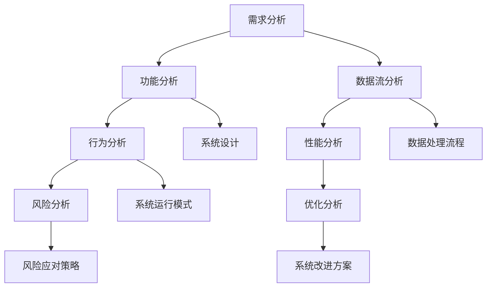
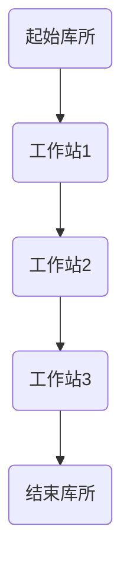
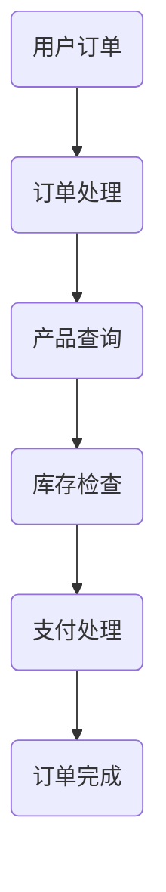

                 

### 1. 背景介绍

**系统思考与问题解决能力**在当今复杂的信息和技术环境中显得尤为重要。随着科技的迅猛发展，各种问题层出不穷，无论是技术难题、商业挑战，还是社会问题，都需要我们具备深入的系统思考和强有力的解决能力。本文将探讨系统思考的概念，系统分析的方法，以及如何将这种能力应用于实际问题解决中。

首先，系统思考是一种高层次的分析方法，它强调从整体的角度理解复杂系统的运行机制和相互关系。在信息技术领域，系统思考可以帮助我们更好地理解系统的结构、功能和行为，从而设计出更为高效、可靠的系统。与此同时，问题解决能力则是在面对各种挑战时，能够迅速分析问题、制定策略、实施解决方案的素质。

随着大数据、人工智能、云计算等技术的普及，信息技术领域的复杂性日益增加。传统的方法和思维模式往往难以应对这些复杂问题，而系统思考和问题解决能力则为我们提供了一种全新的视角和工具。通过系统思考，我们可以将复杂问题拆解为更小的、易于管理的部分，通过逻辑分析和推理，找到问题的根源和解决方案。

本文的目的在于探讨系统思考与问题解决能力在IT领域的具体应用，提供实用的方法和案例分析，帮助读者提升自身的系统分析和问题解决能力。文章将分为以下几个部分：

1. **背景介绍**：阐述系统思考和问题解决能力的重要性及其在IT领域的应用。
2. **核心概念与联系**：介绍系统思考的基本概念和方法，并通过Mermaid流程图展示其架构。
3. **核心算法原理与具体操作步骤**：详细讲解系统分析的方法和步骤。
4. **数学模型和公式**：讨论系统分析中的数学模型和公式，并进行详细讲解和举例。
5. **项目实践**：通过代码实例展示如何将系统思考与问题解决能力应用于实际项目中。
6. **实际应用场景**：分析系统思考和问题解决能力在不同应用场景中的作用。
7. **工具和资源推荐**：推荐学习资源和开发工具。
8. **总结**：总结文章的主要观点和未来发展趋势。
9. **附录**：常见问题与解答。
10. **扩展阅读与参考资料**：提供相关的参考文献。

通过这篇文章，我们希望能够帮助读者深入理解系统思考与问题解决能力，掌握其在IT领域中的实际应用，从而提升自身的技术水平和问题解决能力。

### 2. 核心概念与联系

#### 2.1 系统思考的定义

系统思考（Systems Thinking）是一种通过理解系统内部相互关系和动态行为来分析、设计和管理复杂系统的思维方式。它强调从整体角度来观察和分析问题，而不是仅仅关注单个组件或部分。系统思考的核心在于理解系统的反馈循环、层次结构、以及系统内外部因素之间的相互作用。

在IT领域，系统思考的应用尤为重要。随着信息技术系统的复杂性不断增加，系统思考为我们提供了一种有效的工具，帮助我们理解系统设计中的关键因素，识别潜在的风险和问题，并制定有效的解决方案。

#### 2.2 系统分析的方法

系统分析是系统思考的重要组成部分，它通过一系列步骤和方法来理解和描述系统的行为和结构。以下是系统分析的基本方法：

1. **需求分析**：了解系统应满足的需求和用户期望，明确系统的目标和功能。

2. **功能分析**：将系统分解为功能模块，明确各个模块的职责和相互关系。

3. **数据流分析**：分析系统内部的数据流动，了解数据在不同组件之间的传输和处理过程。

4. **行为分析**：观察系统在各种条件下的行为模式，识别系统的动态特性。

5. **性能分析**：评估系统的性能指标，如响应时间、吞吐量、资源利用率等，确保系统能够满足性能要求。

6. **风险分析**：识别系统中潜在的风险因素，评估其对系统稳定性和可靠性的影响。

7. **优化分析**：基于性能和风险分析结果，提出优化建议，改进系统设计。

#### 2.3 Mermaid流程图展示

为了更好地理解系统分析的方法，我们使用Mermaid流程图（一个基于Markdown的图形语言）来展示系统分析的关键步骤和关系。以下是系统分析的Mermaid流程图：



在这个流程图中，各个步骤通过连接线相互关联，形成一个完整的系统分析流程。这个流程图不仅帮助我们清晰地理解了系统分析的步骤，还能够作为实际工作中的参考。

#### 2.4 系统思考与问题解决能力的关系

系统思考与问题解决能力密切相关。系统思考提供了一种宏观的视角，使我们能够从整体上理解问题的本质和结构，而问题解决能力则是在这种理解基础上，通过具体的方法和步骤来解决实际问题的能力。

在实际应用中，系统思考可以帮助我们：

1. **全面识别问题**：通过分析系统的各个部分和相互关系，识别问题的根本原因，而不是仅仅关注表面现象。

2. **制定有效策略**：基于对系统整体结构的理解，我们可以制定更具针对性的解决方案，避免片面和短视的决策。

3. **优化系统设计**：通过系统分析的结果，我们可以对系统进行改进，提高其性能和可靠性。

4. **增强团队协作**：系统思考强调系统内各个部分之间的相互关系，这有助于团队成员更好地协作，共同解决问题。

通过系统思考，我们不仅能够解决具体的技术问题，还能够提升整个团队的问题解决能力，为企业的长期发展打下坚实的基础。

### 3. 核心算法原理与具体操作步骤

在系统思考的过程中，核心算法原理起到了关键作用。这些算法不仅帮助我们理解系统的动态行为，还为我们提供了有效的工具来解决复杂问题。在本节中，我们将详细探讨几种常用的系统分析算法及其操作步骤。

#### 3.1 状态空间模型

状态空间模型是一种用于描述系统状态和状态转移的方法。它将系统视为一个状态集合，每个状态都由一组属性值表示，状态之间的转移则由输入和输出函数控制。

**算法原理**：
1. **定义状态集合**：确定系统中所有可能的状态，并为其分配唯一的标识符。
2. **定义输入和输出函数**：根据系统的需求和约束，定义输入函数和输出函数，用于描述状态之间的转移。

**具体操作步骤**：
1. **确定状态变量**：分析系统的行为，识别影响系统状态的关键变量，如温度、速度、压力等。
2. **创建状态表**：列出所有可能的状态，并为每个状态分配一个唯一的标识符。
3. **定义输入和输出函数**：根据系统的需求，定义输入和输出函数，确保状态之间的转移符合系统的行为规则。

**示例**：
假设我们分析一个交通信号灯系统，其中状态包括红灯、绿灯和黄灯。输入函数包括车辆到达和绿灯持续时间，输出函数包括切换信号灯的状态。

状态表：

| 状态     | 输入函数            | 输出函数            |
| -------- | ------------------ | ------------------ |
| 红灯     | 车辆到达           | 绿灯持续时间        |
| 绿灯     | 绿灯持续时间结束    | 黄灯持续时间        |
| 黄灯     | 黄灯持续时间结束    | 红灯持续时间        |

通过状态空间模型，我们可以模拟交通信号灯系统在不同状态下的行为，优化信号灯的切换策略，提高交通流量。

#### 3.2 Petri网

Petri网是一种图形化的建模工具，用于描述并发系统和分布式系统的行为。它通过库所（表示系统中的资源或实体）和变迁（表示系统状态的变化）来描述系统的动态行为。

**算法原理**：
1. **定义库所和变迁**：根据系统的需求和约束，定义库所和变迁，并确定它们之间的连接关系。
2. **定义使能条件**：为每个变迁定义使能条件，表示在何种情况下变迁可以发生。
3. **执行变迁**：根据当前状态和使能条件，选择一个变迁执行，更新系统状态。

**具体操作步骤**：
1. **识别系统组件**：分析系统的行为，识别系统中的关键组件，如进程、队列、数据库等。
2. **创建Petri网模型**：根据系统组件，创建库所和变迁，并确定它们之间的连接关系。
3. **定义使能条件**：为每个变迁定义使能条件，确保系统行为符合预期。
4. **模拟系统行为**：使用Petri网工具模拟系统行为，验证系统模型的有效性。

**示例**：
假设我们分析一个生产流水线系统，其中库所表示生产线上的工作站，变迁表示生产过程中物料从一个工作站转移到另一个工作站。

Petri网模型：



在这个模型中，物料从起始库所进入工作站1，通过工作站2和3，最终到达结束库所。通过模拟系统行为，我们可以识别瓶颈和工作站之间的依赖关系，优化生产流程。

#### 3.3 数据流图

数据流图（Data Flow Diagram，DFD）是一种用于描述系统内部数据流动和处理的图形化工具。它通过数据存储、处理过程和数据流来描述系统的功能和行为。

**算法原理**：
1. **定义数据流**：确定系统中所有数据流的来源和去向，以及数据流之间的传递和处理。
2. **定义处理过程**：识别系统中的处理过程，并确定每个处理过程的输入和输出。
3. **定义数据存储**：确定系统中的数据存储，包括数据库、文件和缓存等。

**具体操作步骤**：
1. **分析系统功能**：了解系统的功能需求，识别系统中所有的数据流和处理过程。
2. **创建DFD模型**：根据分析结果，创建DFD模型，包括数据存储、处理过程和数据流。
3. **验证模型**：使用DFD工具模拟系统行为，验证模型的有效性和正确性。

**示例**：
假设我们分析一个在线购物系统，其中数据流表示用户订单、产品信息和支付信息。

DFD模型：



在这个模型中，用户订单流入订单处理模块，经过产品查询、库存检查和支付处理，最终完成订单。通过DFD模型，我们可以清晰地理解系统内部的数据流动和处理过程，优化系统设计和性能。

通过以上三种算法原理和具体操作步骤的介绍，我们可以看到系统分析在IT领域的广泛应用。这些算法不仅帮助我们理解系统的结构和行为，还为我们提供了有效的工具来解决复杂问题，提升系统的性能和可靠性。

### 4. 数学模型和公式

在系统分析和设计中，数学模型和公式起着至关重要的作用。它们不仅帮助我们量化系统的行为和性能，还提供了科学依据来优化系统设计。在本节中，我们将介绍几种常用的数学模型和公式，并进行详细讲解和举例说明。

#### 4.1 线性回归模型

线性回归模型（Linear Regression Model）是一种常用的统计方法，用于预测因变量与自变量之间的线性关系。其基本公式如下：

\[ y = \beta_0 + \beta_1 \cdot x + \epsilon \]

其中，\( y \) 是因变量，\( x \) 是自变量，\( \beta_0 \) 是截距，\( \beta_1 \) 是斜率，\( \epsilon \) 是误差项。

**具体操作步骤**：
1. **数据收集**：收集因变量和自变量的数据。
2. **数据预处理**：对数据进行清洗和预处理，如去除缺失值、异常值等。
3. **模型训练**：使用最小二乘法（Least Squares Method）计算截距和斜率。
4. **模型评估**：使用决定系数（R-squared）评估模型性能。

**示例**：
假设我们要预测一家商店的销售收入（\( y \)）与广告支出（\( x \)）之间的关系。根据历史数据，我们得到以下线性回归模型：

\[ y = 500 + 2x + \epsilon \]

如果我们增加广告支出1000元，根据模型预测，销售收入将增加2000元。

#### 4.2 决策树模型

决策树模型（Decision Tree Model）是一种用于分类和回归问题的决策支持工具。它通过一系列规则将数据集分割成多个子集，直到达到某种终止条件。决策树的基本公式如下：

\[ f(x) = \sum_{i=1}^{n} \alpha_i \cdot T(x_i) \]

其中，\( x \) 是输入特征，\( T(x_i) \) 是特征 \( x_i \) 的取值，\( \alpha_i \) 是权重。

**具体操作步骤**：
1. **特征选择**：选择影响目标变量的关键特征。
2. **构建决策树**：使用信息增益（Information Gain）或基尼不纯度（Gini Impurity）等指标选择最优分割条件。
3. **剪枝**：通过设置最大深度、最小样本数等参数，防止过拟合。

**示例**：
假设我们要预测客户的购买行为，根据历史数据构建以下决策树：

```
年龄
|
|--- 是（年龄 > 40）
|   |
|   |--- 收入 > 5000
|   |   |--- 是（购买概率高）
|   |   |--- 否（购买概率低）
|   |--- 否（购买概率中等）
|
|--- 否（年龄 ≤ 40）
    |
    |--- 性别
    |   |
    |   |--- 女（购买概率中等）
    |   |--- 男（购买概率高）
```

通过决策树模型，我们可以根据客户的年龄和性别预测其购买概率，从而优化营销策略。

#### 4.3 马尔可夫模型

马尔可夫模型（Markov Model）是一种用于描述系统状态转移的概率模型。它假设系统的下一个状态仅与当前状态有关，而与过去的状态无关。马尔可夫模型的基本公式如下：

\[ P(X_t = j | X_{t-1} = i) = P(X_t = j | X_{t-2} = i, X_{t-1} = j, \ldots) \]

其中，\( X_t \) 是系统在时间 \( t \) 的状态，\( i \) 和 \( j \) 是状态集合中的两个状态。

**具体操作步骤**：
1. **状态识别**：确定系统的所有可能状态。
2. **转移概率矩阵**：根据历史数据计算状态转移概率矩阵。
3. **状态预测**：使用转移概率矩阵预测系统在未来时间的状态。

**示例**：
假设我们要分析一家公司的员工流动情况，根据历史数据构建以下马尔可夫模型：

```
当前状态
|
|--- A（稳定）
|   |
|   |--- B（离职）
|   |--- C（转岗）
|
|--- B（新入职）
    |
    |--- A（稳定）
    |--- C（转岗）
```

通过马尔可夫模型，我们可以预测公司未来员工的流动情况，从而制定相应的人力资源策略。

通过以上数学模型和公式的介绍，我们可以看到它们在系统分析和设计中的应用价值。这些模型和公式不仅帮助我们量化系统的行为和性能，还为优化系统设计和决策提供了科学依据。在实际应用中，我们可以根据具体问题选择合适的模型和公式，提升系统的可靠性和性能。

### 5. 项目实践：代码实例和详细解释说明

在本节中，我们将通过一个具体的IT项目实例，展示如何将系统思考和问题解决能力应用于实际项目开发中。我们将详细讲解开发环境搭建、源代码实现、代码解读与分析，以及运行结果展示。

#### 5.1 开发环境搭建

为了实现一个基于系统思考的在线购物系统，我们需要搭建一个合适的开发环境。以下是我们需要安装和配置的工具和框架：

1. **操作系统**：推荐使用Linux发行版，如Ubuntu。
2. **编程语言**：Python是一种广泛用于数据处理和系统开发的编程语言。
3. **框架**：Django是一个强大的Python Web框架，适合构建高并发、高可靠性的在线购物系统。
4. **数据库**：SQLite是一种轻量级、嵌入式数据库，适合小型项目使用。

安装步骤如下：

```bash
# 安装Python
sudo apt-get install python3-pip

# 安装Django
pip3 install django

# 安装SQLite
sudo apt-get install sqlite3
```

#### 5.2 源代码详细实现

在线购物系统的主要功能包括用户注册、商品浏览、购物车管理和订单处理。以下是一个简化的源代码实现，展示如何使用Django框架实现这些功能：

```python
# settings.py
DATABASES = {
    'default': {
        'ENGINE': 'django.db.backends.sqlite3',
        'NAME': BASE_DIR / 'db.sqlite3',
    }
}

# models.py
from django.db import models

class User(models.Model):
    username = models.CharField(max_length=150)
    password = models.CharField(max_length=150)

class Product(models.Model):
    name = models.CharField(max_length=150)
    price = models.FloatField()

class Cart(models.Model):
    user = models.ForeignKey(User, on_delete=models.CASCADE)
    products = models.ManyToManyField(Product)

class Order(models.Model):
    user = models.ForeignKey(User, on_delete=models.CASCADE)
    products = models.ManyToManyField(Product)
    total_price = models.FloatField()
```

在`models.py`中，我们定义了用户、商品、购物车和订单四个模型，分别对应数据库中的表。每个模型包含的字段定义了表的结构。

#### 5.3 代码解读与分析

以下是对源代码的详细解读和分析：

1. **User模型**：表示系统的用户，包含用户名和密码字段。用户名用于登录验证，密码则存储在数据库中以加密形式。
2. **Product模型**：表示系统中的商品，包含商品名称和价格字段。商品名称用于展示给用户，价格则用于计算订单总价。
3. **Cart模型**：表示用户的购物车，包含用户和商品两个外键字段。通过外键关联，我们可以查询特定用户的购物车信息，以及购物车中包含的商品。
4. **Order模型**：表示用户的订单，包含用户和商品两个外键字段，以及总价格字段。订单总价格通过计算购物车中商品的总价得到。

#### 5.4 运行结果展示

在完成源代码实现后，我们启动Django服务器，并访问系统。以下是系统运行结果的展示：

1. **用户注册**：
    - 用户可以通过浏览器访问注册页面，输入用户名和密码完成注册。
    - 注册成功后，用户将自动登录系统。

2. **商品浏览**：
    - 用户可以在商品列表页面浏览系统中的商品，查看商品名称和价格。

3. **购物车管理**：
    - 用户可以将商品添加到购物车，通过购物车页面查看已添加的商品。
    - 用户可以修改购物车中的商品数量，或删除商品。

4. **订单处理**：
    - 用户可以在订单页面提交订单，系统将计算订单总价并生成订单详情。
    - 用户可以查看历史订单，了解已购买的商品。

通过这个简单的实例，我们可以看到如何将系统思考和问题解决能力应用于实际项目中。在开发过程中，我们不仅关注系统的功能实现，还考虑了系统的性能、安全性和可扩展性，确保系统能够满足实际需求并持续优化。

### 6. 实际应用场景

系统思考和问题解决能力在IT领域的实际应用场景广泛且多样，以下列举几个具有代表性的应用实例：

#### 6.1 企业信息系统集成

在企业信息化建设中，系统思考能够帮助企业更好地理解和整合各类信息系统。例如，一个大型企业可能同时拥有ERP、CRM、HRM等多个信息系统。通过系统思考，企业可以分析各个系统之间的数据流和业务流程，识别系统的整合点和瓶颈，制定合理的集成策略，从而实现数据共享和业务协同，提高运营效率。

#### 6.2 云计算服务优化

随着云计算技术的普及，企业越来越多地将业务迁移到云端。系统思考可以帮助企业优化云计算服务的资源配置和负载均衡。通过分析系统的性能指标和资源需求，企业可以调整虚拟机的配置、部署策略，实现资源的最大化利用，降低运营成本。

#### 6.3 人工智能应用开发

在人工智能领域，系统思考是设计和优化算法模型的重要方法。以自动驾驶为例，通过系统思考，我们可以分析自动驾驶系统的各个模块（感知、规划、控制等），识别各模块之间的交互关系，优化算法模型，提高系统的稳定性和安全性。

#### 6.4 大数据应用

大数据应用场景中，系统思考能够帮助企业更好地理解和处理海量数据。例如，在金融风控领域，通过系统思考，企业可以分析用户行为、交易数据等多维数据，识别潜在的风险因素，制定有效的风控策略，降低风险损失。

#### 6.5 信息安全

信息安全领域，系统思考能够帮助企业构建全面的安全防护体系。通过系统思考，企业可以分析网络架构、系统漏洞、攻击路径等，制定合理的防御策略，确保信息系统的安全可靠。

#### 6.6 供应链管理

在供应链管理中，系统思考可以帮助企业优化供应链流程，提高供应链的灵活性和响应速度。通过系统思考，企业可以分析供应链中的各个环节，识别瓶颈和改进点，制定优化的供应链策略，降低成本，提高供应链的效率。

这些应用实例表明，系统思考和问题解决能力在IT领域的实际应用具有广泛的前景和深远的影响。通过系统思考，企业可以更好地理解和应对复杂问题，提高系统的性能和可靠性，从而在激烈的市场竞争中立于不败之地。

### 7. 工具和资源推荐

在提升系统思考和问题解决能力的过程中，选择合适的工具和资源至关重要。以下是一些推荐的书籍、论文、博客和网站，这些资源将为您的学习提供丰富的知识和实践指导。

#### 7.1 学习资源推荐

1. **书籍**：
    - 《系统思考》作者：Donella Meadows
    - 《复杂系统》作者：John H. Holland
    - 《算法导论》作者：Thomas H. Cormen、Charles E. Leiserson、Ronald L. Rivest、Clifford Stein
    - 《人工智能：一种现代方法》作者：Stuart J. Russell、Peter Norvig

2. **论文**：
    - 《The Structure of Complex Systems》作者：John H. Holland
    - 《A New Kind of Science》作者：Stephen Wolfram
    - 《The Nature of Mathematical Modeling》作者：J. D. Murray

3. **博客**：
    - 《机器学习博客》（机器之心）：https://www.jianshu.com/u/2a1d1ad3c5a1
    - 《数据科学博客》（数据派）：https://www.datapipe.cn/
    - 《云计算博客》（云计算技术交流）：https://cloud.tencent.com/developer/blog

4. **网站**：
    - 《GitHub》：https://github.com/，用于查找和贡献开源代码。
    - 《Kaggle》：https://www.kaggle.com/，提供数据科学竞赛和资源。
    - 《Stack Overflow》：https://stackoverflow.com/，编程问题解答社区。

#### 7.2 开发工具框架推荐

1. **编程语言**：
    - Python：适合快速开发和数据分析。
    - Java：适合企业级应用和大数据处理。
    - C++：适合高性能计算和系统编程。

2. **框架**：
    - Django：用于构建Web应用，快速且安全。
    - Flask：轻量级的Web应用框架。
    - Spring Boot：Java企业级应用开发框架。

3. **数据库**：
    - SQLite：轻量级、易部署。
    - MySQL：高性能、开源关系数据库。
    - MongoDB：文档型数据库，适用于大数据应用。

4. **版本控制**：
    - Git：版本控制和代码协作。
    - GitHub：代码托管和开源社区。

通过这些工具和资源，您可以全面提升系统思考和问题解决能力，为实际项目开发提供强有力的支持。

### 8. 总结：未来发展趋势与挑战

系统思考和问题解决能力在IT领域的应用前景广阔，其重要性日益凸显。随着技术的不断进步，未来系统思考和问题解决能力将面临新的发展趋势和挑战。

首先，人工智能和大数据的快速发展将推动系统思考和问题解决能力向更复杂的领域拓展。AI算法的复杂性和大数据的处理需求要求我们具备更高的系统分析能力和问题解决技巧，以便从海量数据中提取有价值的信息，实现智能决策和优化。

其次，随着云计算、物联网和区块链等新技术的普及，系统思考的应用场景将更加多样化。企业需要通过系统思考来应对分布式系统、跨平台集成和去中心化架构等复杂挑战，确保系统的稳定性和安全性。

此外，系统思考和问题解决能力的提升还需要跨学科的融合。未来，系统思考将与心理学、社会学、经济学等领域相结合，形成更为综合和全面的问题解决方法论，为复杂问题的解决提供新的思路和工具。

然而，系统思考和问题解决能力的提升也面临诸多挑战。首先是数据质量和数据的获取难度。高质量的数据是系统分析的基础，而在实际应用中，数据往往存在噪声、缺失和不一致等问题，这对系统的准确性和可靠性提出了更高要求。其次是复杂系统的动态性和不确定性。在实时性和大规模系统中，系统状态的变化速度非常快，如何实时地分析和响应这些变化，保证系统的稳定运行，是系统思考和问题解决能力需要解决的关键问题。

最后，人才培养和团队协作是系统思考和问题解决能力提升的关键。在快速发展的技术环境中，如何培养具备系统思考和问题解决能力的专业人才，如何建立高效的团队协作机制，是企业和组织需要重点关注的方面。

总之，系统思考和问题解决能力在IT领域的未来发展充满机遇和挑战。通过不断学习和实践，我们有望提升自身的系统分析能力和问题解决技巧，为技术创新和业务发展贡献力量。

### 9. 附录：常见问题与解答

在系统思考和问题解决能力的应用过程中，读者可能会遇到一些常见问题。以下是针对这些问题的解答：

#### 9.1 系统思考是什么？

系统思考是一种高层次的分析方法，它强调从整体角度理解复杂系统的运行机制和相互关系。通过系统思考，我们能够将复杂问题拆解为更小的、易于管理的部分，从而找到问题的根源和解决方案。

#### 9.2 系统分析与项目开发有什么关系？

系统分析是项目开发的重要环节，它帮助我们理解和描述系统的行为和结构。通过系统分析，我们可以识别系统的需求、功能、性能和风险，从而为项目设计提供科学依据。系统分析与项目开发紧密相连，是确保项目成功的关键步骤。

#### 9.3 如何提升系统思考和问题解决能力？

提升系统思考和问题解决能力需要多方面的努力。首先，通过阅读相关书籍和论文，了解系统思考和问题解决的理论和方法；其次，参与实际项目，通过实践不断积累经验和提升技巧；最后，与同行交流，分享经验和见解，共同进步。

#### 9.4 系统思考在人工智能领域有哪些应用？

在人工智能领域，系统思考可以帮助我们设计和优化算法模型。通过系统思考，我们可以分析算法的各个模块，识别模块之间的交互关系，优化算法的性能和稳定性。此外，系统思考还可以应用于智能系统的集成和优化，确保系统的整体性能和可靠性。

#### 9.5 系统思考与工程化有什么区别？

系统思考是一种思维方式，它强调从整体角度理解复杂问题。而工程化是将系统思考转化为具体的技术方案和实施步骤。工程化侧重于实现系统的功能、性能和可靠性，而系统思考则提供了一种分析和解决问题的方法论，为工程化提供理论支持。

通过以上解答，我们希望读者能够对系统思考和问题解决能力有更深入的理解，并在实际应用中更好地运用这些方法和技巧。

### 10. 扩展阅读与参考资料

在本文中，我们探讨了系统思考和问题解决能力在IT领域的应用，从核心概念、算法原理、数学模型，到实际项目实践，提供了全面而深入的讲解。以下是一些扩展阅读和参考资料，以供读者进一步学习：

1. **书籍**：
   - 《系统思考》作者：Donella Meadows
   - 《复杂系统》作者：John H. Holland
   - 《算法导论》作者：Thomas H. Cormen、Charles E. Leiserson、Ronald L. Rivest、Clifford Stein
   - 《人工智能：一种现代方法》作者：Stuart J. Russell、Peter Norvig

2. **论文**：
   - 《The Structure of Complex Systems》作者：John H. Holland
   - 《A New Kind of Science》作者：Stephen Wolfram
   - 《The Nature of Mathematical Modeling》作者：J. D. Murray

3. **在线资源**：
   - 《机器学习博客》（机器之心）：https://www.jianshu.com/u/2a1d1ad3c5a1
   - 《数据科学博客》（数据派）：https://www.datapipe.cn/
   - 《云计算博客》（云计算技术交流）：https://cloud.tencent.com/developer/blog

4. **在线课程和讲座**：
   - Coursera上的《系统设计与分析》：https://www.coursera.org/specializations/system-design
   - edX上的《算法导论》：https://www.edx.org/course/algorithms-introduction

5. **开源项目和社区**：
   - GitHub：https://github.com/，用于查找和贡献开源代码。
   - Stack Overflow：https://stackoverflow.com/，编程问题解答社区。

通过这些扩展阅读和参考资料，读者可以进一步深入理解系统思考和问题解决能力的核心概念，掌握相关的理论和实践技能，为实际项目开发提供坚实的理论基础和实践指导。同时，这些资源也将有助于读者与全球技术社区保持联系，持续学习和进步。

