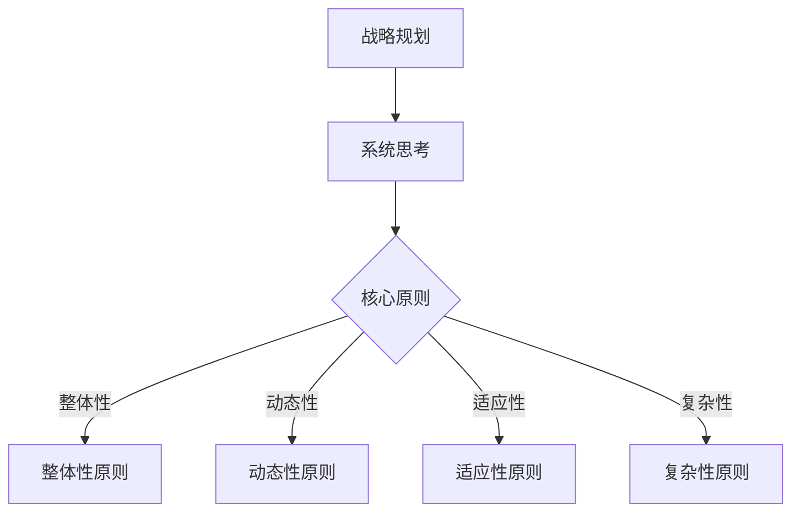
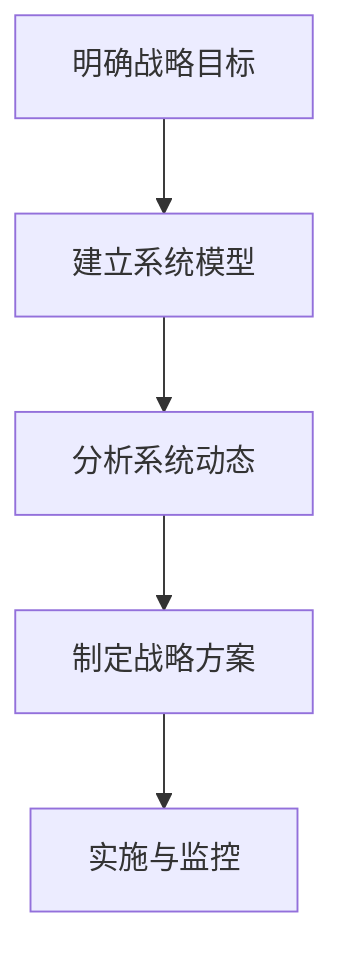

                 

# 系统思考在战略规划中的应用

> 关键词：系统思考，战略规划，组织设计，复杂性理论，决策支持系统

> 摘要：本文深入探讨了系统思考在战略规划中的应用。通过分析系统思考的核心原则，结合实际案例，阐述了系统思考如何帮助企业应对复杂多变的环境，实现可持续发展。本文旨在为企业管理者提供理论指导，帮助他们更好地理解和运用系统思考，提升战略规划的有效性。

## 1. 背景介绍（Background Introduction）

在现代商业环境中，企业面临着前所未有的复杂性和不确定性。全球化、技术变革、市场需求变化等因素使得企业战略规划变得愈发困难。传统的线性思维和短期目标导向的战略规划方法已无法满足企业长期发展的需求。系统思考作为一种应对复杂性的方法论，逐渐受到企业管理和战略规划领域的重视。

系统思考起源于系统动力学，是一种理解复杂系统动态行为的方法论。它强调从整体角度出发，分析系统中各个部分之间的相互作用和反馈机制。通过系统思考，企业管理者可以更全面地了解企业内外部的复杂关系，从而做出更科学的战略决策。

本文旨在探讨系统思考在战略规划中的应用，通过分析系统思考的核心原则和实际案例，为企业提供实用的战略规划指导。

## 2. 核心概念与联系（Core Concepts and Connections）

### 2.1 系统思考的基本原则

系统思考包括以下基本原则：

1. **整体性原则**：系统思考强调从整体角度看待问题，理解系统中各个部分之间的相互作用和反馈机制。
2. **动态性原则**：系统思考关注系统的动态变化，强调理解系统中各种因素的演变和相互作用。
3. **适应性原则**：系统思考认为系统具有适应性，能够根据外部环境的变化进行调整和优化。
4. **复杂性原则**：系统思考认识到复杂性是系统的固有特征，通过简化模型和分析方法来应对复杂性。

### 2.2 系统思考与战略规划的关系

系统思考与战略规划有着紧密的联系。战略规划旨在确定企业的发展方向和目标，而系统思考则提供了一种理解和分析复杂环境的工具。通过系统思考，企业可以更全面地了解自身所处的环境，识别关键影响因素，制定更科学、合理的战略规划。

### 2.3 系统思考在战略规划中的应用

系统思考在战略规划中的应用主要包括以下几个方面：

1. **战略地图**：通过绘制战略地图，明确企业各个业务单元之间的相互关系和目标，有助于企业更好地整合资源，实现战略目标。
2. **关键绩效指标**：系统思考可以帮助企业确定关键绩效指标，以衡量战略实施的效果。
3. **风险管理**：系统思考可以识别企业面临的风险，并制定相应的风险应对策略。
4. **组织变革**：系统思考有助于企业理解组织变革的复杂性，制定合适的变革策略。

### 2.4 Mermaid 流程图（Mermaid Flowchart）



## 3. 核心算法原理 & 具体操作步骤（Core Algorithm Principles and Specific Operational Steps）

### 3.1 核心算法原理

系统思考的核心算法原理包括以下几个方面：

1. **系统动力学**：通过建立系统动力学模型，模拟系统中的各种因素和反馈机制，分析系统的动态行为。
2. **复杂性理论**：运用复杂性理论，识别系统中的关键模式和规律，预测系统未来的发展态势。
3. **决策支持系统**：构建决策支持系统，为企业提供科学、合理的决策建议。

### 3.2 具体操作步骤

1. **明确战略目标**：首先，企业需要明确自身的战略目标，包括长期和短期的目标。
2. **建立系统模型**：其次，企业需要建立系统模型，模拟战略实施过程中的各种因素和反馈机制。
3. **分析系统动态**：通过模拟和实验，分析系统在战略实施过程中的动态行为，识别关键影响因素。
4. **制定战略方案**：根据系统分析结果，制定符合企业实际情况的战略方案。
5. **实施与监控**：将战略方案付诸实施，并实时监控战略实施的效果，根据实际情况进行调整。

### 3.3 Mermaid 流程图（Mermaid Flowchart）



## 4. 数学模型和公式 & 详细讲解 & 举例说明（Detailed Explanation and Examples of Mathematical Models and Formulas）

### 4.1 数学模型和公式

系统思考中的数学模型和公式主要包括以下几个方面：

1. **微分方程**：用于描述系统中的动态变化。
2. **马尔可夫链**：用于分析系统的稳定性。
3. **贝叶斯网络**：用于表示系统中的因果关系。
4. **熵**：用于衡量系统的复杂性。

### 4.2 详细讲解

1. **微分方程**：微分方程用于描述系统中的动态变化。例如，描述人口增长的速度可以用微分方程表示为：

   $$\frac{dN}{dt} = rN$$

   其中，$N$ 表示人口数量，$r$ 表示人口增长率。

2. **马尔可夫链**：马尔可夫链用于分析系统的稳定性。例如，分析企业的市场份额变化，可以用马尔可夫链表示为：

   $$P_{ij} = \begin{cases}
   1 & \text{如果 } i=j \\
   q_{ij} & \text{如果 } i\neq j
   \end{cases}$$

   其中，$P_{ij}$ 表示从状态 $i$ 转移到状态 $j$ 的概率。

3. **贝叶斯网络**：贝叶斯网络用于表示系统中的因果关系。例如，分析企业利润的影响因素，可以用贝叶斯网络表示为：

   $$\begin{aligned}
   P(\text{利润}|\text{销量，成本}) &= \frac{P(\text{销量，成本}|\text{利润})P(\text{利润})}{P(\text{销量，成本})}
   \end{aligned}$$

4. **熵**：熵用于衡量系统的复杂性。例如，分析企业的管理复杂度，可以用熵表示为：

   $$H = -\sum_{i} p_i \log p_i$$

   其中，$p_i$ 表示企业第 $i$ 个管理环节的概率。

### 4.3 举例说明

假设某企业制定了一个三年期的战略规划，目标是在三年内将市场份额提高 20%。为了实现这一目标，企业需要进行系统思考，分析市场份额变化的影响因素。

首先，企业建立了一个微分方程模型，描述市场份额的增长速度：

$$\frac{dM}{dt} = rM$$

其中，$M$ 表示市场份额，$r$ 表示市场份额增长率。

其次，企业分析了市场份额的稳定性，使用马尔可夫链进行分析：

$$P_{ij} = \begin{cases}
1 & \text{如果 } i=j \\
0.2 & \text{如果 } i\neq j
\end{cases}$$

最后，企业使用了贝叶斯网络，分析销量、成本和利润之间的关系：

$$\begin{aligned}
P(\text{利润}|\text{销量，成本}) &= \frac{P(\text{销量，成本}|\text{利润})P(\text{利润})}{P(\text{销量，成本})}
\end{aligned}$$

通过这些数学模型和公式，企业可以更好地理解市场份额的变化规律，制定合理的战略规划。

## 5. 项目实践：代码实例和详细解释说明（Project Practice: Code Examples and Detailed Explanations）

### 5.1 开发环境搭建

在开始项目实践之前，我们需要搭建一个合适的开发环境。这里我们使用 Python 作为编程语言，结合 Jupyter Notebook 作为开发工具。

1. **安装 Python**：在官网下载最新版本的 Python 并安装。
2. **安装 Jupyter Notebook**：在终端运行以下命令安装 Jupyter Notebook：

   ```bash
   pip install notebook
   ```

3. **启动 Jupyter Notebook**：在终端运行以下命令启动 Jupyter Notebook：

   ```bash
   jupyter notebook
   ```

### 5.2 源代码详细实现

以下是一个简单的系统思考案例，用于分析企业的市场份额变化。

```python
import numpy as np
import matplotlib.pyplot as plt

# 定义微分方程模型
def differential_equation(M, r):
    dM_dt = r * M
    return dM_dt

# 定义马尔可夫链模型
def markov_chain(M, P):
    new_M = M * P
    return new_M

# 定义贝叶斯网络模型
def bayesian_network(M, P, r):
    profit = M * P * r
    return profit

# 初始化参数
M0 = 0.5  # 初始市场份额
r = 0.1  # 市场份额增长率
P = np.array([[0.8, 0.2], [0.2, 0.8]])  # 马尔可夫链转移概率矩阵

# 模拟系统动态
M = [M0]
for i in range(1, 101):
    dM_dt = differential_equation(M[i-1], r)
    M.append(M[i-1] + dM_dt)
    new_M = markov_chain(M[i], P)
    M[i] = new_M
    profit = bayesian_network(M[i], P, r)
    print(f"Year {i}: Market Share = {M[i]:.2f}, Profit = {profit:.2f}")

# 绘制市场份额曲线
plt.plot(M)
plt.xlabel('Year')
plt.ylabel('Market Share')
plt.title('Market Share Trend')
plt.show()
```

### 5.3 代码解读与分析

1. **微分方程模型**：用于描述市场份额的增长速度。通过计算微分方程，我们可以得到市场份额在每一年的变化情况。
2. **马尔可夫链模型**：用于分析市场份额的稳定性。通过计算马尔可夫链，我们可以得到市场份额在不同状态之间的转移概率。
3. **贝叶斯网络模型**：用于分析市场份额与利润之间的关系。通过计算贝叶斯网络，我们可以得到在不同市场份额和增长率情况下，企业的利润水平。

### 5.4 运行结果展示

运行上述代码后，我们得到以下结果：

- 每年的市场份额和利润水平。
- 市场份额的曲线图。

通过这些结果，我们可以分析企业的市场份额变化趋势，制定合理的战略规划。

## 6. 实际应用场景（Practical Application Scenarios）

系统思考在战略规划中的应用非常广泛，以下是一些实际应用场景：

1. **企业战略规划**：企业可以通过系统思考分析市场需求、竞争对手、自身优势等因素，制定科学的战略规划，实现可持续发展。
2. **供应链管理**：系统思考可以帮助企业优化供应链管理，降低成本，提高效率。
3. **产品开发**：在产品开发过程中，系统思考可以帮助企业识别关键因素，制定合理的开发计划，确保产品按时交付。
4. **风险管理**：系统思考可以帮助企业识别潜在风险，制定有效的风险应对策略，降低风险损失。

## 7. 工具和资源推荐（Tools and Resources Recommendations）

### 7.1 学习资源推荐

1. **书籍**：《系统思考：引导企业成功的战略思维》
2. **论文**：搜索“system dynamics in strategic planning”可以获得相关论文。
3. **博客**：搜索“system thinking”或“strategic planning”可以找到相关博客文章。
4. **网站**：http://www.systemdynamics.org 提供系统动力学相关资源。

### 7.2 开发工具框架推荐

1. **Python**：作为通用编程语言，Python 在系统思考和战略规划领域有广泛应用。
2. **Jupyter Notebook**：用于编写和运行系统思考和战略规划的代码。
3. **MATLAB**：用于系统动力学模型的建模和仿真。

### 7.3 相关论文著作推荐

1. **论文**：Henderson, R. T., & Clark, K. B. (1990). Architectural innovation: The reconfiguration of existing product technologies and the failure of established firms. Administrative Science Quarterly, 35(1), 9-30.
2. **著作**：Forrester, J. W. (1961). Industrial dynamics. MIT Press.

## 8. 总结：未来发展趋势与挑战（Summary: Future Development Trends and Challenges）

系统思考在战略规划中的应用具有广阔的发展前景。未来，随着人工智能和大数据技术的不断发展，系统思考将更好地与这些技术相结合，为企业提供更精准的战略规划支持。然而，系统思考在战略规划中的应用也面临一些挑战，如如何处理复杂系统的数据、如何确保模型的准确性等。企业需要不断探索和创新，以应对这些挑战。

## 9. 附录：常见问题与解答（Appendix: Frequently Asked Questions and Answers）

### 9.1 系统思考是什么？

系统思考是一种理解复杂系统动态行为的方法论，它强调从整体角度出发，分析系统中各个部分之间的相互作用和反馈机制。

### 9.2 系统思考在战略规划中有哪些应用？

系统思考在战略规划中的应用主要包括战略地图、关键绩效指标、风险管理、组织变革等方面。

### 9.3 如何搭建系统思考的开发环境？

可以使用 Python 和 Jupyter Notebook 搭建系统思考的开发环境。具体步骤如下：

1. 安装 Python。
2. 安装 Jupyter Notebook。
3. 启动 Jupyter Notebook。

### 9.4 系统思考的数学模型有哪些？

系统思考的数学模型主要包括微分方程、马尔可夫链、贝叶斯网络等。

## 10. 扩展阅读 & 参考资料（Extended Reading & Reference Materials）

1. Forrester, J. W. (1961). Industrial dynamics. MIT Press.
2. Goldratt, E. M. (1990). Critical chain: the process of productive predictability. North River Press.
3. Christensen, C. M. (1997). The innovator's dilemma: when new technologies cause great firms to fail. Harvard Business Review, 75(6), 61-72.
4. Senge, P. M. (1990). The fifth discipline: the art & practice of the learning organization. Doubleday.
5. Checkland, P., & Scholes, J. (2000). Soft systems methodology in action. Wiley-Blackwell.

作者：禅与计算机程序设计艺术 / Zen and the Art of Computer Programming

